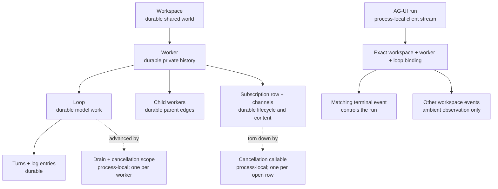
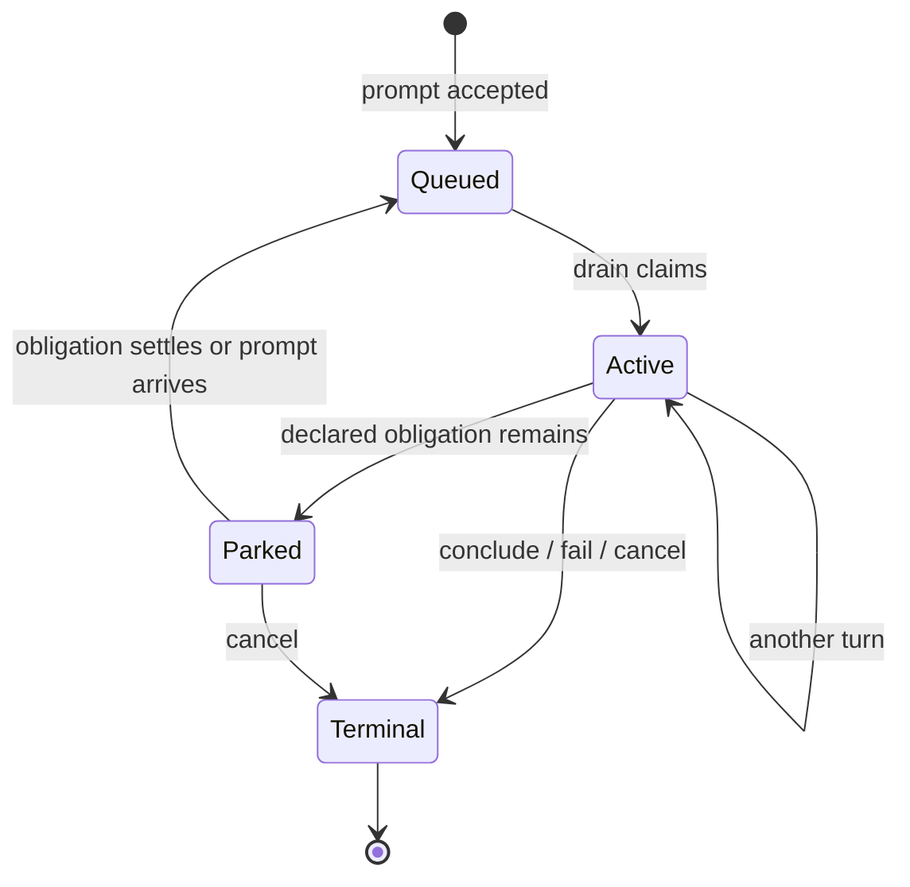

# Architecture

PLURNK has one daemon process and multiple clients. The daemon owns model
execution and persistent state. Clients present that state and submit user
actions.

```text
CLI / TUI / editor clients
            |
            | AG-UI over HTTP/SSE
            v
       plurnk-agui
            |
            | in-process daemon API
            v
        plurnk-core
       /     |      \
providers  schemes  executors
            |
         entries and streams
            |
          SQLite
```

## Processes

### Daemon

`@plurnk/plurnk-service` is the only long-running platform process. It:

- loads configuration and installed plugins;
- owns the SQLite database;
- creates and resumes workspaces, workers, loops, and turns;
- assembles the model request;
- invokes a provider;
- validates and dispatches model operations;
- publishes lifecycle events to clients.

Plugins run in the daemon process. They are package boundaries, not security
boundaries.

### Clients

The `plurnk` CLI/TUI and editor integrations are separate processes. They:

- collect user input and local terminal/editor state;
- call the AG-UI management and run endpoints;
- render events and results;
- present proposals and send the user's decision.

Clients do not schedule model turns or infer daemon state. A client-side
automatic proposal decision is still an explicit client decision. Daemon-side
automatic execution is loop policy and does not require a client round trip.

### Model endpoints

Provider plugins adapt the daemon's provider contract to local or remote model
APIs. Provider-specific transport and authentication remain outside core.

## Package boundaries

| Concern | Owner |
| --- | --- |
| Model-facing language and shared schemas | `plurnk-grammar` |
| Persistence, loops, workers, packet assembly, dispatch | `plurnk-core` |
| External client protocol | `plurnk-agui` |
| Model API adapters and model catalog | `plurnk-providers*`, `plurnk-models`, `plurnk-aliases` |
| Addressable resources | `plurnk-schemes*` |
| Content parsing, rendering, search, and tokenization | `plurnk-mimetypes*` |
| Executable capabilities | `plurnk-execs*` |
| Shared package discovery and model reference material | `plurnk-meta` |

Core may orchestrate a plugin capability but should not reimplement its domain
logic. A plugin should depend on core contracts only when it actually needs
them. Shared shapes have one schema owner.

## Request lifecycle

1. A client creates or attaches to a workspace and worker through AG-UI.
2. The daemon persists the prompt and constructs a loop.
3. Core assembles a packet from durable policy, workspace context, worker log,
   available capabilities, and current runtime state.
4. A provider returns a model emission.
5. The grammar validates and parses the emission.
6. Core dispatches operations to its storage layer or the owning plugin.
7. Results are persisted and included in the next turn.
8. A terminal operation completes the loop; otherwise the next turn begins.

A mutating operation may pause as a proposal. Client-managed approval resumes
the paused loop with an explicit decision. Loop automatic mode resolves eligible
operations inside the daemon. These are separate paths with separate tests.

## Results, failures, and observation

Every dispatched operation produces one validated result. A status below 400
is a success without a problem. A status from 400 through 599 carries RFC 9457
Problem Details; its `type` is stable, its `detail` explains the occurrence,
and its `instance` is the committed `log:///` coordinate. The failed operation
row is durable product truth and is rendered, queried, folded, and digested like
every other log row.

Plugins classify their own failures. Core validates the result and attaches the
durable occurrence; it does not infer a missing problem from a status or accept
legacy string-error shapes. Proposal application follows the same rule: an
apply failure preserves the applying component's status and Problem Details
instead of being relabelled as a review rejection.

Telemetry is observation, not control or truth. Notices may describe progress
or non-fatal degradation to clients and operators. OpenTelemetry exports spans,
metrics, and logs from the same execution, but neither notice delivery nor an
observability exporter may alter scheduling, recovery, persisted results, or
what the model is told.

## Lifecycle topology

The durable history and the process that advances it are deliberately separate.
A worker is durable history over a workspace; a drain is the process-local
scheduler currently advancing that worker.



| State | Durable truth | Process-local owner |
| --- | --- | --- |
| Workspace and worker | Identity, shared entries, worker history and parent edge | None |
| Queued loop (`100`) | Accepted work awaiting a drain | None until claimed |
| Active loop (`102`) | Work claimed by a drain | Worker drain, provider call, cancellation scope |
| Parked loop (`202`) | Suspended continuation awaiting a declared obligation | No drain; a child/subscription conclusion or directed prompt wakes it |
| Terminal loop | Final status, message, usage, turns | None |
| Open subscription | Entry, channels, owner worker, scheme, handle description | One registered cancellation callable |
| Closed subscription | Close status (`200`, `499`, or failure), terminal channel state | None |
| AG-UI run | No durable control authority | Portal thread bound to one exact worker and loop |



The durable subscription row answers *what the worker holds*. The live registry
answers *how this daemon process tears it down*. Neither substitutes for the
other. Likewise, workspace-scoped event fan-out is observational: it may show
topology, streams, and sibling activity, but it cannot terminate or relabel an
AG-UI run. Only the terminal event carrying that run's exact worker and loop
coordinate controls it.

Payload and lifecycle are also separate. A stream may succeed or fail after
producing zero bytes; its close status is still an observation the worker must
receive before concluding. A parked loop resumes in place when a stream or
child settles. An active loop records that concurrent settlement as an owed
wake and crosses the same observation boundary before it can terminate. The
complete state and wait matrices are normative in
[`plurnk-core/SPEC.md`](./plurnk-core/SPEC.md) under `§run-lifecycle`.

### Restart recovery

Boot reconciles durable state before opening client transports. Recovery is
idempotent: interruption during recovery can be followed by the same recovery
again without changing an already-settled result.

The service first acquires an exclusive database-adjacent daemon lock. A live
owner makes a second daemon or migration fail before either can mutate SQLite.
The lock records the owning PID; a dead PID is a crash-stale claim and is
replaced atomically, without a time-based lease guess. Read-only digest tooling
does not acquire the writer lock.

| Observed at boot | Recovery |
| --- | --- |
| Queued loop (`100`) | Preserve it and start its worker's drain. Accepted work is not lost. |
| Active loop (`102`) | Settle `500` with an interruption message. Its drain and provider call vanished; replay could duplicate partially committed effects. |
| Open subscription | Mark active channels errored and close the row `500`. Its callable owner cannot survive the process. |
| Parked loop (`202`) with a live child obligation | Preserve it. The child's recovered drain or later conclusion supplies the wake edge. |
| Parked loop (`202`) with no live obligation after reconciliation | Requeue it (`100`) and start its drain. It resumes in place and observes the settled obligation. |
| Terminal loop or closed subscription | Preserve it unchanged. |

Recovery then drains every queued worker. A child reaching any terminal state
wakes its parked parent, including provider failure, external cancellation, and
restart interruption. This propagation repeats through the durable parent
edges, so recovery is a topology fixpoint rather than a leaf-only cleanup.

## State

SQLite is the source of truth for daemon state. The principal relationships are:

```text
workspace
  ├── entries
  └── workers
        └── loops
              ├── turns
              └── log entries
```

The filesystem remains authoritative for project files. Workspace membership
determines which files are materialized into entries. The database records the
agent-visible representation and execution history; it is not a replacement for
the repository.

## Source, build, and installed artifacts

There are three legitimate runtime forms:

1. source execution for package development;
2. built `dist` execution from a checkout;
3. an installed npm package.

They must not be treated as interchangeable. Binary and whole-product tests use
built output. A running client and daemon must report enough provenance to
identify their package version, artifact location, and source revision when
available. The canonical dogfood launcher builds and starts one named candidate
so client and daemon cannot silently come from different revisions.

## Contracts and documentation

Schemas define shared wire shapes. Package specifications define public behavior
and invariants owned by that package. Tests provide executable examples.

Architecture documentation describes boundaries and flow; it does not prescribe
implementation by analogy. Design history remains in Git and GitHub issues.
