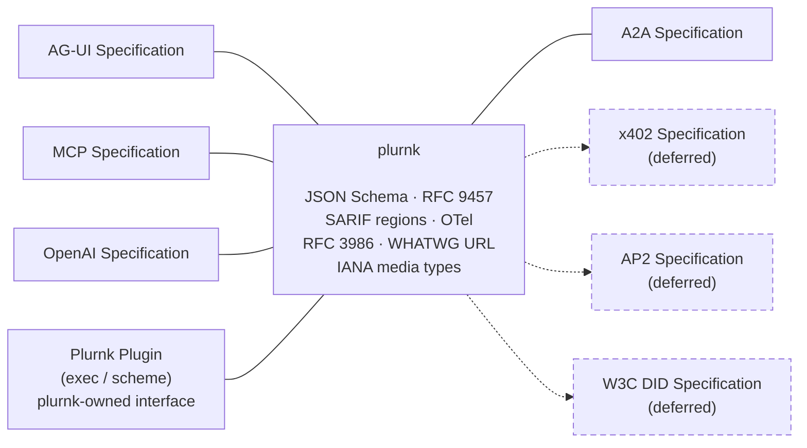
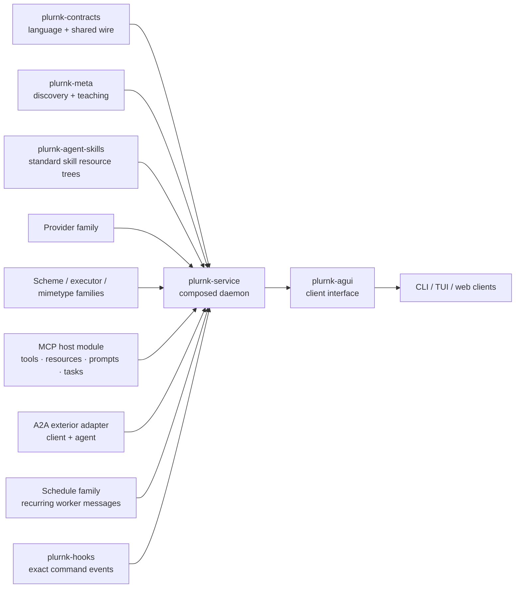
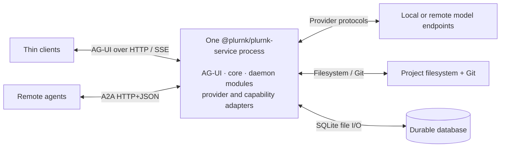
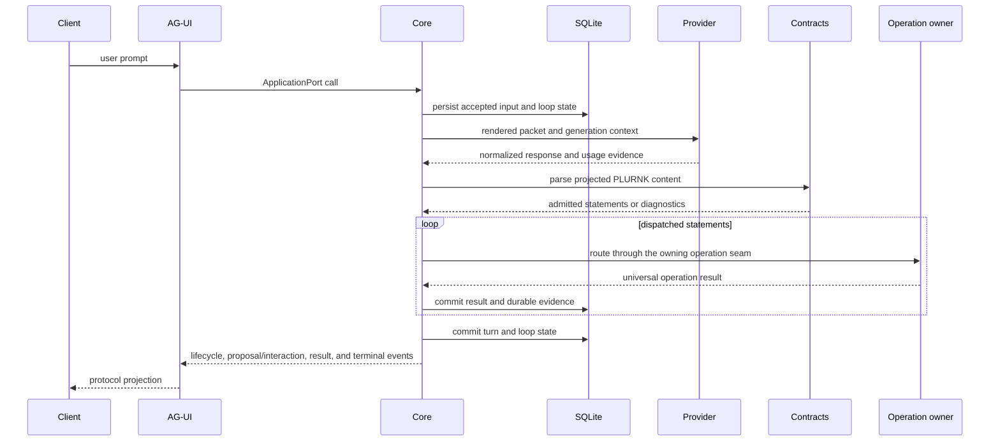

# Architecture

PLURNK is a contract-first platform with one composed daemon and multiple thin
clients. This document owns the ecosystem map, cross-boundary flow, and the
one rule every package shares: where a choice may live. Package specifications
own behavior; design history belongs in Git and forge issues.

## Standards boundary

PLURNK is an engine between standards. Nodes outside PLURNK are interface
specifications; standards named inside PLURNK govern internal contracts.
Boundary adapters implement their owning standards rather than restate them.
Dotted interfaces are explicitly deferred.

## Ecosystem

[`plurnk-contracts/plurnk.md`](./plurnk-contracts/plurnk.md) is the
model-facing canon. It is intentionally narrower than the tolerant parser.
Language and schema behavior remain owned by the contracts package; this root
document does not restate their teaching.

## Package ownership

| Contract area                                             | Owner                                                        | Normative source                                                                                               |
| --------------------------------------------------------- | ------------------------------------------------------------ | -------------------------------------------------------------------------------------------------------------- |
| Model language contract, shared types/wire | `@plurnk/plurnk-contracts` | [`plurnk.md`](./plurnk-contracts/plurnk.md), [`SPEC.md`](./plurnk-contracts/SPEC.md)                           |
| Language parser and AST builder | `@plurnk/plurnk-parser` | [`plurnk-parser/SPEC.md`](./plurnk-parser/SPEC.md) |
| Discovery, trust predicate, teaching bytes                | `@plurnk/plurnk-meta`                                        | [`plurnk-meta/SPEC.md`](./plurnk-meta/SPEC.md)                                                                 |
| Agent Skills documents and resource trees                 | `@plurnk/plurnk-agent-skills`                                | [`plurnk-agent-skills/SPEC.md`](./plurnk-agent-skills/SPEC.md)                                               |
| Provider adaptation and model selection                   | `@plurnk/plurnk-providers`, aliases, model-data package      | [`plurnk-providers/SPEC.md`](./plurnk-providers/SPEC.md), [`plurnk-aliases/SPEC.md`](./plurnk-aliases/SPEC.md) |
| Addressable capability framework                          | `@plurnk/plurnk-schemes` and installed scheme packages       | [`plurnk-schemes/SPEC.md`](./plurnk-schemes/SPEC.md)                                                           |
| Executable capability framework                           | `@plurnk/plurnk-execs` and installed executor packages       | [`plurnk-execs/SPEC.md`](./plurnk-execs/SPEC.md)                                                               |
| Content detection and projection                          | `@plurnk/plurnk-mimetypes` and installed handler packages    | [`plurnk-mimetypes/SPEC.md`](./plurnk-mimetypes/SPEC.md)                                                       |
| Persistence, workers, turns, dispatch                     | `@plurnk/plurnk-service`                                     | [`plurnk-core/SPEC.md`](./plurnk-core/SPEC.md)                                                                 |
| External HTTP/SSE client protocol                         | `@plurnk/plurnk-agui`                                        | [`plurnk-agui/SPEC.md`](./plurnk-agui/SPEC.md)                                                                 |
| Exact-command lifecycle hooks                             | `@plurnk/plurnk-hooks`                                       | [`plurnk-hooks/SPEC.md`](./plurnk-hooks/SPEC.md)                                                               |
| MCP host/client                                            | `@plurnk/plurnk-mcp`                                         | [`plurnk-mcp/SPEC.md`](./plurnk-mcp/SPEC.md)                                                                   |
| A2A exterior client/agent                                  | `@plurnk/plurnk-a2a`                                         | [`plurnk-a2a/SPEC.md`](./plurnk-a2a/SPEC.md)                                                                   |
| Scheduled worker messages                                | `@plurnk/plurnk-schedule`                                    | [`plurnk-schedule/SPEC.md`](./plurnk-schedule/SPEC.md)                                                         |
| CLI, TUI, and web presentation                            | Separate open-client repositories                            | Consume AG-UI; they do not own daemon scheduling or persisted truth.                                           |

Family packages define extension contracts. Installed adapters implement those
contracts. Core composes them but does not absorb their domain logic. Shared
facts have one schema and one specification owner. Capability frameworks do not
depend on their leaf consumers; the service manifest is the sole owner of its
default leaf set, while compatible third-party leaves extend it through the
same installation and discovery path ({§default-plugin-ownership}).

## Documentation authority

Four documents, four jobs, and one home for every sentence.

| Document | Its job |
| --- | --- |
| `README.md` | The front porch: what this is and how to start. |
| `AGENTS.md` | The field guide: how to work here — drills, gates, the forge, the vocabulary. |
| `ARCHITECTURE.md` | The lodestar: what PLURNK believes, and why. Short enough to read in one sitting, because every contributor reads it first. |
| `SPEC.md`, one per package | The documentation: contracts anchored to the implementation, the panels and the tests. |

Code comments stay lean and cite `{§tags}`, so the specifications are the hub
that links to the moving parts. Only a file named `SPEC.md` may declare an
anchor; every other document cites. An anchor is *witnessed* when the
implementation, a panel or a test cites it. One that nothing outside prose cites
is a principle in the wrong document, orientation in the wrong document, or a
contract nobody witnesses — and, cited by nothing, it rots without anything
failing. `scripts/spec-references.mjs` holds that allowance, which only shrinks.

Promotion is never duplication. A principle moves here; a how-to moves to the
field guide; a value that lives on a panel is deleted from prose, which cites
the knob by name; history is deleted, because Git and the forge keep it. What
remains in a specification is contract. `plurnk.md` and each package's
`docs/*.md` are not documentation at all: they are surfaces a model reads.

## Configuration authority

**The cascading environment is the only home for a choice.** Three surfaces
define the platform, and each owns one kind of fact. Code holds mechanism only.

| Surface | Owns | The test |
| --- | --- | --- |
| [`plurnk.md`](./plurnk-contracts/plurnk.md) | The language: what a model may say. | A different value would be a different language. |
| Turn 0 | The orientation: what a model is shown and taught. | A different value would teach something else. |
| Each package's `.env.defaults` | **Every choice**: limits, timeouts, dispositions, identities, postures. | A different value would still be plurnk, behaving differently. |

A constant in code is legitimate only when it derives from one of those
surfaces or from an external standard. *Default* is a word reserved for a value
on the panel: a constant, a parameter default, a settings field, a wire-schema
default or a SQL column default that supplies a value the environment did not is
a second home for a choice, and it will eventually disagree with the first.

- **The system environment is the mechanism.** Node, the shell and CI all speak
  it. Each package declares its own keys in its package-root `.env.defaults`; a
  key's prefix names its owner; one package owns a key. The daemon assembles
  every installed package's file into one floor, set-if-unset beneath every
  operator source, so a declared key is always present
  ({§operator-config-env-defaults}). A package's own tests run on its own panel,
  or that guarantee is a fiction where the code is exercised.
- **A read never carries a value.** Because the floor is guaranteed, a fallback
  beside a read can only disagree with the panel. An unset key is a broken
  deployment and an invalid value is the operator's mistake: both crash by name.
  Unset may mean "off", or "the dependency's own default applies and plurnk
  makes no choice" — never a literal.
- **One knob per choice.** A composite value whose partial override must merge
  over a base forces that base into code.
- **A knob earns its place.** PLURNK is as configurable as is practical, and the
  panel is still something an operator reads: a knob is a lever somebody would
  turn for their deployment — a deadline, a page, a disposition, how much the
  model is shown, a safety bound. A format's magic byte, an algorithm's iteration
  bound, a persisted unit of measure or a protocol's retry pacing is mechanism,
  and a knob for it is noise that hides the real ones. Mechanism stays in code
  under a name that says what it is.
- **Rings narrow the same knob.** A narrower scope — an alias, a workspace, a
  worker, a run — overrides a knob under its own name; it is never a second
  vocabulary. Where an inner ring must be bounded, an outer ring's ceiling knob
  gates the inner default, as `PLURNK_SERVICE_GIT_ALLOWED` gates
  `PLURNK_SERVICE_GIT_AUTO`.
- **A flag mirrors a knob.** A command-line flag is a knob's spelling for one
  invocation and nothing more; the service's flags are generated from its panel.
- **A definition is not a knob.** A schedule's rule or an MCP server's address
  is data with its own lifecycle, not a choice of behaviour.
- **A daemon is one trust domain.** Everything holding a daemon's credential is
  one principal. A different security situation is a different daemon with a
  different panel — ideally inside a sandbox, which is somebody else's project:
  PLURNK owns authority, consent and audit, and never claims containment.

`scripts/env-surface-policy.mjs` enforces this in `root:lint`
({§operator-config-only-home}). A number whose own name says duration, size or
limit is either on the panel or in `scripts/env-surface-mechanism.json`, the
reviewed register of deliberate non-knobs, each with its reason; a bare number
handed to a timer has no register at all. Before adding a constant, a flag, a
parameter default or a settings field, find its knob — or say why it has none.

## Process composition

`@plurnk/plurnk-service` is the only long-running platform process. Plugin and
module packages run inside it; a package boundary is not a security boundary.
AG-UI owns client transport, while clients own presentation and explicit user
decisions. MCP is an optional in-process host/client under core's
`{§module-lifecycle}` and `{§module-workspace-capabilities}` seams. MCP server
attachments are workspace Functionality; their tools and resources join
the ordinary executor, scheme, proposal, entry, and client-action paths.

## Model-loop request flow

Core owns packet assembly at `{§packet-assembly}` and durable result handling at
`{§operation-results}`. Provider, capability, and AG-UI details remain in their
own specifications. A proposal or client interaction pauses its owning
operation until an explicit client decision, while core-owned proposal policy
may resolve only proposals automatically; client convenience and daemon
authority are not interchangeable.

## How an execution outcome is observed

An execution answers `200 started` — for every executor, gated or not: the
runtime slot resolves the executor ({§exec-registry-resolves}), the spawn
backgrounds, and its output is *observed, not fetched* ({§exec-stream}). The
executor streams into the channels of its `<tag>:///<id>` output entry
({§execution-output-identity}) and settles them (`closed` or `errored`); an executor's refusal
travels as the settled status of the operation's log row, never as channel
content. The model learns the result through the ordinary environment
observation of newly publishable stream content on a later turn — there is no
same-turn receipt ({§exec-readpure-ungated}). `read`/`pure` runtimes auto-run;
`host` runtimes propose, and an accepted proposal's settlement replaces the
202 with 200 regardless of the applied operation's own outcome
({§proposal-accept-applies}) — the verb's own status rides its output entry.

Executors are Worker-agnostic by contract: `ExecArgs` carries no Worker
identity. MCP servers and Functionality managers are published per workspace
through capability replacement ({§functionality-model-projection}). Invocation
callbacks retain the submitting operation's causal identity without making
the submitter the owner of the shared runtime.

## State authority

| Concern                                 | Authority                                                                                             |
| --------------------------------------- | ----------------------------------------------------------------------------------------------------- |
| Workspaces, workers, loops, turns, logs | SQLite through core's tagged lifecycle and persistence contracts.                                     |
| Project bytes and Git membership        | The project filesystem and repository; database entries are the agent-visible projection.             |
| Active worker drains, wakes, cancellation | Process-local `DrainSupervisor` state reconciled against durable state; see `{§worker-loop-lifecycle}`. |
| Provider calls and process teardown       | `Engine` owns provider-call state; `Daemon` owns reverse-order process teardown.                       |
| Workspace Functionality residency            | `WorkspaceResidency` owns demand-driven residency, provider activation/cooling, capability replacement under the workspace gate ({§module-workspace-quiescence}), and the generated-document reconciliation those transitions trigger; `Daemon` composes and delegates. |
| Client binding and presentation         | The client-interface package and client process; neither becomes persisted daemon truth by accident.  |
| A choice of behaviour                   | The owning package's `.env.defaults`, read through the system environment; see Configuration authority. |
