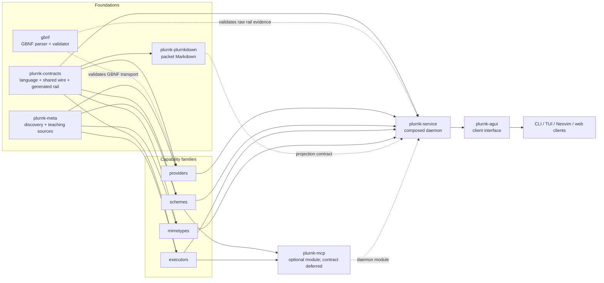
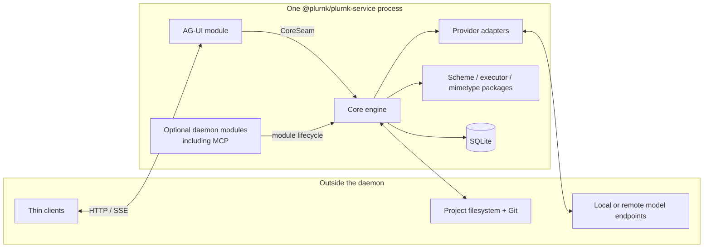
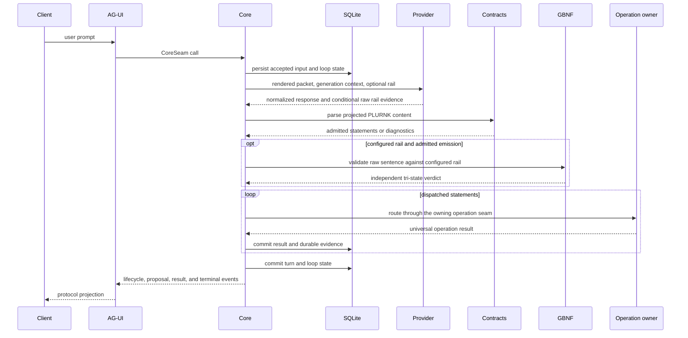

# Architecture

PLURNK is a contract-first platform with one composed daemon and multiple thin
clients. This document owns the ecosystem map and cross-boundary flow. Package
specifications own behavior; design history belongs in Git and forge issues.

## Ecosystem

[`plurnk-contracts/plurnk.md`](./plurnk-contracts/plurnk.md) is the
model-facing canon. It is intentionally narrower than the tolerant parser.
Language, schema, and rail behavior remain owned by the contracts package; this
root document does not restate their teaching.

## Package ownership

| Contract area                                             | Owner                                                        | Normative source                                                                                               |
| --------------------------------------------------------- | ------------------------------------------------------------ | -------------------------------------------------------------------------------------------------------------- |
| Model language, parser, generated rail, shared types/wire | `@plurnk/plurnk-contracts`                                   | [`plurnk.md`](./plurnk-contracts/plurnk.md), [`SPEC.md`](./plurnk-contracts/SPEC.md)                           |
| GBNF parsing and sentence validation                      | `@plurnk/gbnf`                                               | [`gbnf/SPEC.md`](./gbnf/SPEC.md)                                                                               |
| Model-packet Markdown projection                          | `@plurnk/plurnk-plurnkdown`                                  | [`plurnk-plurnkdown/SPEC.md`](./plurnk-plurnkdown/SPEC.md)                                                     |
| Discovery, trust predicate, teaching bytes                | `@plurnk/plurnk-meta`                                        | [`plurnk-meta/SPEC.md`](./plurnk-meta/SPEC.md)                                                                 |
| Provider adaptation and model selection                   | `@plurnk/plurnk-providers`, aliases, model-data package      | [`plurnk-providers/SPEC.md`](./plurnk-providers/SPEC.md), [`plurnk-aliases/SPEC.md`](./plurnk-aliases/SPEC.md) |
| Addressable capability framework                          | `@plurnk/plurnk-schemes` and installed scheme packages       | [`plurnk-schemes/SPEC.md`](./plurnk-schemes/SPEC.md)                                                           |
| Executable capability framework                           | `@plurnk/plurnk-execs` and installed executor packages       | [`plurnk-execs/SPEC.md`](./plurnk-execs/SPEC.md)                                                               |
| Content detection and projection                          | `@plurnk/plurnk-mimetypes` and installed handler packages    | [`plurnk-mimetypes/SPEC.md`](./plurnk-mimetypes/SPEC.md)                                                       |
| Persistence, workers, turns, dispatch                     | `@plurnk/plurnk-service`                                     | [`plurnk-core/SPEC.md`](./plurnk-core/SPEC.md)                                                                 |
| External HTTP/SSE client protocol                         | `@plurnk/plurnk-agui`                                        | [`plurnk-agui/SPEC.md`](./plurnk-agui/SPEC.md)                                                                 |
| MCP host module                                           | `@plurnk/plurnk-mcp`                                         | MCP epic deferred; this document makes no call-syntax claim.                                                   |
| CLI, TUI, Neovim, and web presentation                    | Separate open-client repositories                            | Consume AG-UI; they do not own daemon scheduling or persisted truth.                                           |
| Whole-product evaluation                                  | `plurnk-bench` and candidate/readiness harnesses             | Consumer evidence only; they do not define runtime contracts.                                                  |

Family packages define extension contracts. Installed adapters implement those
contracts. Core composes them but does not absorb their domain logic. Shared
facts have one schema and one specification owner.

## Process composition

`@plurnk/plurnk-service` is the only long-running platform process. Plugin and
module packages run inside it; a package boundary is not a security boundary.
AG-UI owns client transport, while clients own presentation and explicit user
decisions. MCP is an optional in-process module under core's
`{§module-lifecycle}` seam; its detailed contract remains deferred.

## Model-loop request flow

Core owns packet assembly at `{§packet-assembly}` and durable result handling at
`{§operation-results}`. Provider, capability, and AG-UI details remain in their
own specifications. A proposal pauses the same durable loop until an explicit
client decision or core-owned automatic policy resolves it; client convenience
and daemon authority are not interchangeable.

## State authority

| Concern                                 | Authority                                                                                             |
| --------------------------------------- | ----------------------------------------------------------------------------------------------------- |
| Workspaces, workers, loops, turns, logs | SQLite through core's tagged lifecycle and persistence contracts.                                     |
| Project bytes and Git membership        | The project filesystem and repository; database entries are the agent-visible projection.             |
| Active drains, provider calls, teardown | Process-local core state reconciled against durable state; see `{§worker-loop-lifecycle}`.            |
| Client binding and presentation         | The client-interface package and client process; neither becomes persisted daemon truth by accident.  |

Source execution, built `dist` execution, and installed npm execution are
distinct runtime forms. Whole-product gates identify the exact client and
daemon artifacts they launch; passing one form does not silently certify the
others.

## Source and forge roles

| Surface                                                                                 | Role                                                                                         |
| --------------------------------------------------------------------------------------- | -------------------------------------------------------------------------------------------- |
| [PossumTech Gitea](https://repo.possumtech.com/plurnk/plurnk-service)                   | Canonical maintainer branches, issues, reviews, and accepted development history.            |
| [GitHub](https://github.com/plurnk/plurnk-service)                                      | Public downstream source, external contributions, private security reports, and history.     |
| npm                                                                                     | Versioned package artifacts produced from the monorepo workspaces.                           |
| Former standalone repositories for consolidated packages                                | Archived provenance only; they are not current source or ordinary issue owners.              |

Package metadata projects those roles through one exact mapping:

| npm field    | Required projection                                                                                            |
| ------------ | -------------------------------------------------------------------------------------------------------------- |
| `repository` | Public GitHub monorepo plus npm's exact workspace `directory`.                                                 |
| `homepage`   | The workspace's README in the public GitHub monorepo.                                                          |
| `bugs`       | Canonical Gitea monorepo issues; private vulnerability reports remain owned by [`SECURITY.md`](./SECURITY.md). |

`scripts/package-provenance.mjs` enforces the source manifests and exact packed
candidates. Contribution and security workflows are specified in
[`CONTRIBUTING.md`](./CONTRIBUTING.md) and [`SECURITY.md`](./SECURITY.md).
