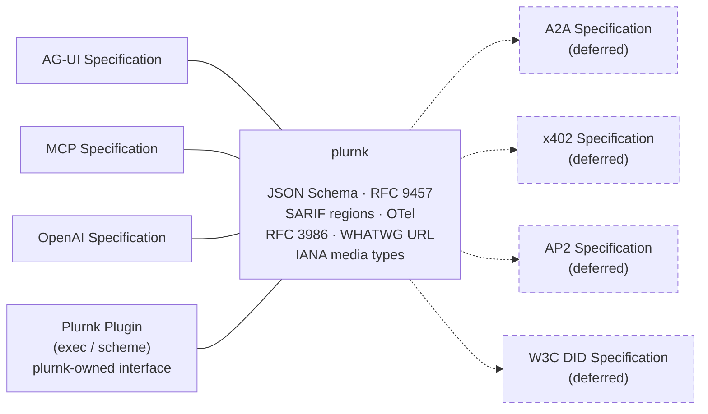
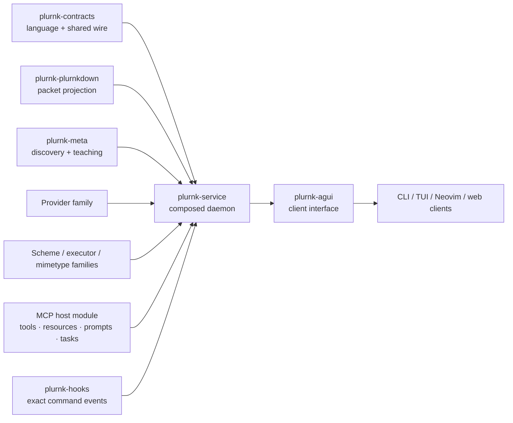
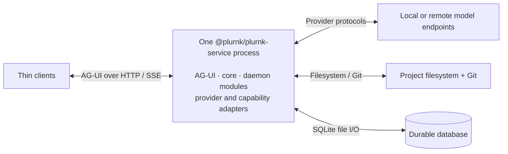
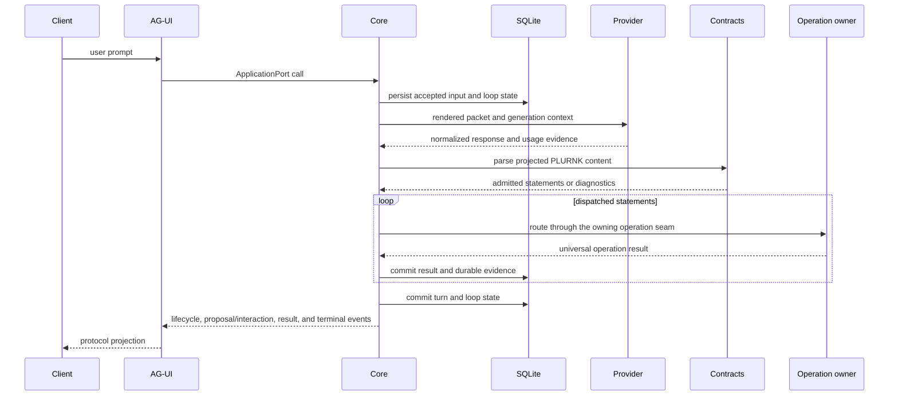

# Architecture

PLURNK is a contract-first platform with one composed daemon and multiple thin
clients. This document owns the ecosystem map and cross-boundary flow. Package
specifications own behavior; design history belongs in Git and forge issues.

## Standards boundary

PLURNK is an engine between standards. Nodes outside PLURNK are interface
specifications; standards named inside PLURNK govern internal contracts.
Boundary adapters implement their owning standards rather than restate them.
Dotted interfaces are explicitly deferred.

## Ecosystem

[`plurnk-contracts/plurnk.md`](./plurnk-contracts/plurnk.md) is the
model-facing canon. It is intentionally narrower than the tolerant parser.
Language and schema behavior remain owned by the contracts package; this root
document does not restate their teaching.

## Package ownership

| Contract area                                             | Owner                                                        | Normative source                                                                                               |
| --------------------------------------------------------- | ------------------------------------------------------------ | -------------------------------------------------------------------------------------------------------------- |
| Model language, parser, shared types/wire                 | `@plurnk/plurnk-contracts`                                   | [`plurnk.md`](./plurnk-contracts/plurnk.md), [`SPEC.md`](./plurnk-contracts/SPEC.md)                           |
| Optional GBNF sentence validator                          | `@plurnk/gbnf`                                               | [`gbnf/SPEC.md`](./gbnf/SPEC.md)                                                                               |
| Model-packet Markdown projection                          | `@plurnk/plurnk-plurnkdown`                                  | [`plurnk-plurnkdown/SPEC.md`](./plurnk-plurnkdown/SPEC.md)                                                     |
| Discovery, trust predicate, teaching bytes                | `@plurnk/plurnk-meta`                                        | [`plurnk-meta/SPEC.md`](./plurnk-meta/SPEC.md)                                                                 |
| Provider adaptation and model selection                   | `@plurnk/plurnk-providers`, aliases, model-data package      | [`plurnk-providers/SPEC.md`](./plurnk-providers/SPEC.md), [`plurnk-aliases/SPEC.md`](./plurnk-aliases/SPEC.md) |
| Addressable capability framework                          | `@plurnk/plurnk-schemes` and installed scheme packages       | [`plurnk-schemes/SPEC.md`](./plurnk-schemes/SPEC.md)                                                           |
| Executable capability framework                           | `@plurnk/plurnk-execs` and installed executor packages       | [`plurnk-execs/SPEC.md`](./plurnk-execs/SPEC.md)                                                               |
| Content detection and projection                          | `@plurnk/plurnk-mimetypes` and installed handler packages    | [`plurnk-mimetypes/SPEC.md`](./plurnk-mimetypes/SPEC.md)                                                       |
| Persistence, workers, turns, dispatch                     | `@plurnk/plurnk-service`                                     | [`plurnk-core/SPEC.md`](./plurnk-core/SPEC.md)                                                                 |
| External HTTP/SSE client protocol                         | `@plurnk/plurnk-agui`                                        | [`plurnk-agui/SPEC.md`](./plurnk-agui/SPEC.md)                                                                 |
| Exact-command lifecycle hooks                             | `@plurnk/plurnk-hooks`                                       | [`plurnk-hooks/SPEC.md`](./plurnk-hooks/SPEC.md)                                                               |
| MCP host/client                                            | `@plurnk/plurnk-mcp`                                         | [`plurnk-mcp/SPEC.md`](./plurnk-mcp/SPEC.md)                                                                   |
| CLI, TUI, Neovim, and web presentation                    | Separate open-client repositories                            | Consume AG-UI; they do not own daemon scheduling or persisted truth.                                           |

Family packages define extension contracts. Installed adapters implement those
contracts. Core composes them but does not absorb their domain logic. Shared
facts have one schema and one specification owner. Capability frameworks do not
depend on their leaf consumers; the service manifest is the sole owner of its
default leaf set, while compatible third-party leaves extend it through the
same installation and discovery path ({§default-plugin-ownership}).

## Process composition

`@plurnk/plurnk-service` is the only long-running platform process. Plugin and
module packages run inside it; a package boundary is not a security boundary.
AG-UI owns client transport, while clients own presentation and explicit user
decisions. MCP is an optional in-process host/client under core's
`{§module-lifecycle}` and `{§module-workspace-capabilities}` seams. MCP server
attachments are workspace-shared capabilities; their tools and resources join
the ordinary executor, scheme, proposal, entry, and client-action paths.

## Model-loop request flow

Core owns packet assembly at `{§packet-assembly}` and durable result handling at
`{§operation-results}`. Provider, capability, and AG-UI details remain in their
own specifications. A proposal or client interaction pauses its owning
operation until an explicit client decision, while core-owned proposal policy
may resolve only proposals automatically; client convenience and daemon
authority are not interchangeable.

## State authority

| Concern                                 | Authority                                                                                             |
| --------------------------------------- | ----------------------------------------------------------------------------------------------------- |
| Workspaces, workers, loops, turns, logs | SQLite through core's tagged lifecycle and persistence contracts.                                     |
| Project bytes and Git membership        | The project filesystem and repository; database entries are the agent-visible projection.             |
| Active worker drains, wakes, cancellation | Process-local `DrainSupervisor` state reconciled against durable state; see `{§worker-loop-lifecycle}`. |
| Provider calls and process teardown       | `Engine` owns provider-call state; `Daemon` owns reverse-order process teardown.                       |
| Client binding and presentation         | The client-interface package and client process; neither becomes persisted daemon truth by accident.  |
