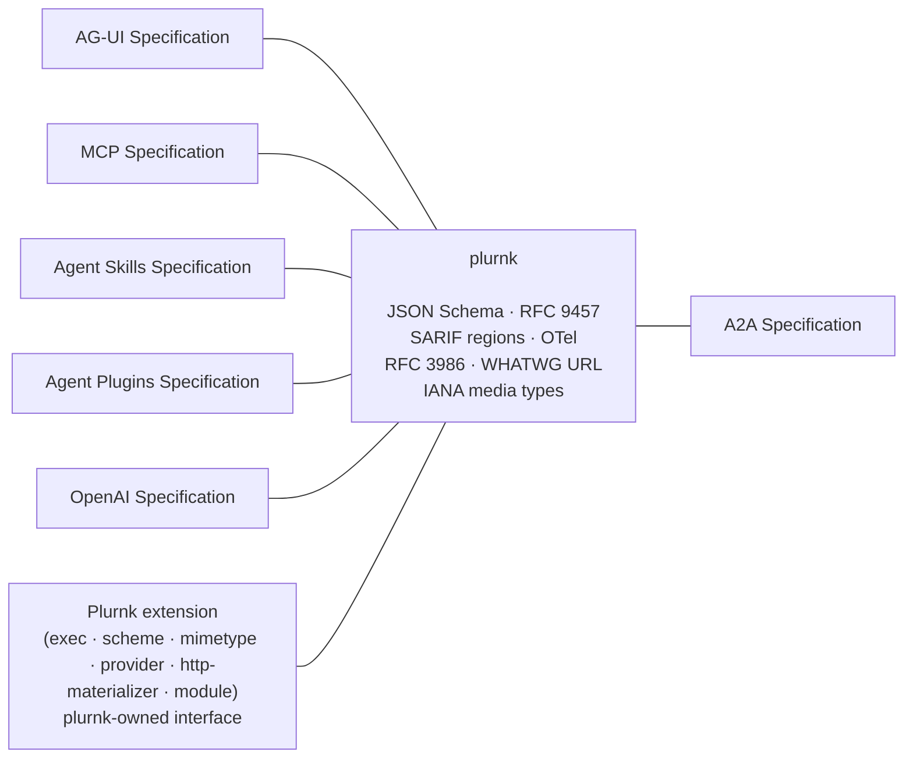
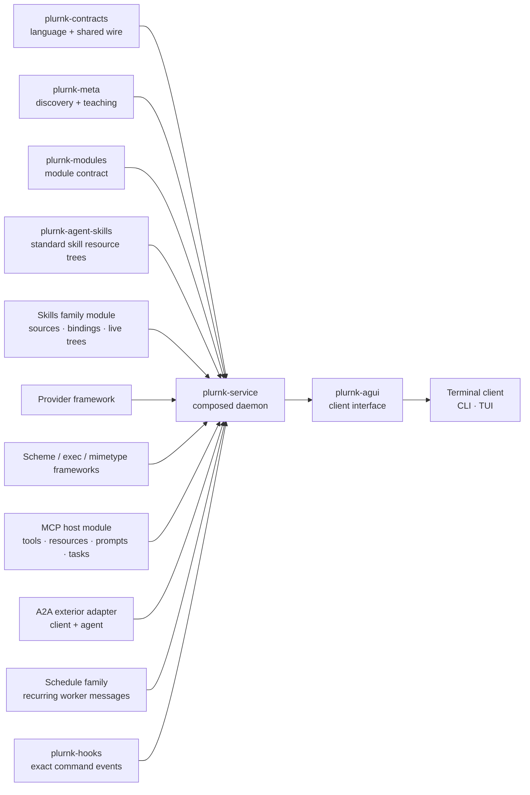
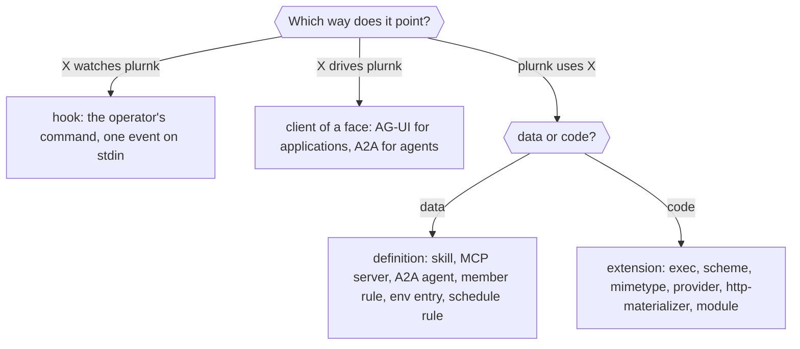
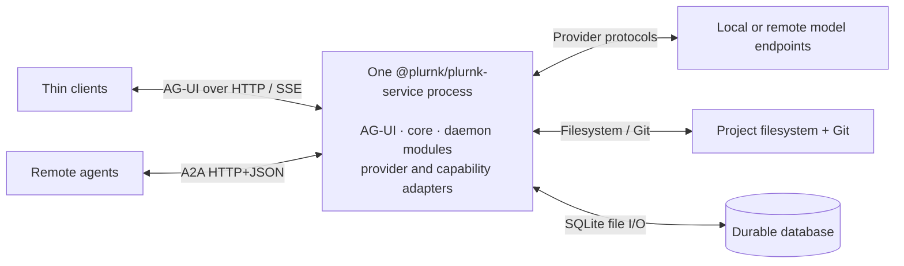
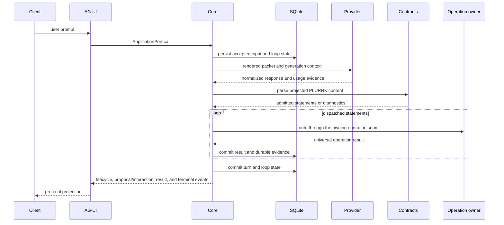

# Architecture

PLURNK is a contract-first platform with one composed daemon and multiple thin
clients. This document owns the ecosystem map, cross-boundary flow, and the
one rule every package shares: where a choice may live. Package specifications
own behavior; design history belongs in Git and forge issues.

## Standards boundary

PLURNK is an engine between standards. Nodes outside PLURNK are interface
specifications; standards named inside PLURNK govern internal contracts.
Boundary adapters implement their owning standards rather than restate them.

```mermaid
flowchart LR
    AGUI["AG-UI Specification"] --- PLURNK["plurnk<br/><br/>JSON Schema · RFC 9457<br/>SARIF regions · OTel<br/>RFC 3986 · WHATWG URL<br/>IANA media types"]
    MCP["MCP Specification"] --- PLURNK
    SKILLS["Agent Skills Specification"] --- PLURNK
    PLUGINS["Agent Plugins Specification"] --- PLURNK
    OPENAI["OpenAI Specification"] --- PLURNK
    EXTENSION["Plurnk extension<br/>(exec · scheme · mimetype · provider · http-materializer · module)<br/>plurnk-owned interface"] --- PLURNK

    PLURNK --- A2A["A2A Specification"]
```

### Which standards earn a place

Eight principles govern which exterior standards PLURNK conforms to:

1. **UVP first.** Never conform away what users chose Plurnk for; the OP grammar, curated log, packet, and worker graph are the product, not a compatibility gap. So is one shape per concern: one operation syntax, one address shape, and one management grammar (`list | discover | add | enable | disable | remove`) for every family, with proposals the gate on every choice with security or boundary implications and the cascade the home of every operator choice. Each exception to that shape is a permanent tax on the model, the client, and the product.
2. **Right-fit.** Hobbyist-first: an enterprise-grade feature is acceptable only when its cost lands on the party that wants it, never on general adoption.
3. **Traction.** Count running counterparties today; integration horizon must be shorter than the standard's expected half-life. Sockets stay configurable with no default until a candidate earns it.
4. **POSIX app identity.** Decades-stable host-ecosystem conventions (XDG, NO_COLOR, man, completions, service units) govern wherever a domain standard is silent. Where a domain standard names its own location for cross-client interoperability, such as `.agents/skills`, PLURNK reads it, and its XDG location beside it holds PLURNK-only entries, which shadow the global ones.
5. **Faces, never organs.** A standard adopts as one adapter or projection behind an existing seam; if it cannot, that is the alarm, and it goes to a design gate.
6. **One system, multiple sources.** Standard files, the cascading environment, and scoped live changes feed the same owning contracts. Standards alignment must not withdraw environment-only configuration or turn workspace management into a global installer. Resource formats remain standard; configuration resolution, capability policy, and publication remain the shared system's responsibility.
7. **Two arbiters.** Model-facing surfaces change only on measured model evidence; human-facing surfaces follow host-ecosystem convention without ceremony. Standards bodies get a vote on neither.
8. **Open, never proprietary.** A vendor-owned convention (`CLAUDE.md`, `.claude/`, `.cursor/`, a vendor's configuration dialect) earns no place, whatever its traction.

## Ecosystem

```mermaid
flowchart LR
    contracts["plurnk-contracts<br/>language + shared wire"] --> core
    meta["plurnk-meta<br/>discovery + teaching"] --> core
    modules["plurnk-modules<br/>module contract"] --> core
    skills["plurnk-agent-skills<br/>standard skill resource trees"] --> core
    skillFamily["Skills family module<br/>sources · bindings · live trees"] --> core
    providers["Provider framework"] --> core
    frameworks["Scheme / exec / mimetype frameworks"] --> core
    mcp["MCP host module<br/>tools · resources · prompts · tasks"] --> core
    a2a["A2A exterior adapter<br/>client + agent"] --> core
    schedule["Schedule family<br/>recurring worker messages"] --> core
    hooks["plurnk-hooks<br/>exact command events"] --> core
    core["plurnk-service<br/>composed daemon"]
    core --> agui["plurnk-agui<br/>client interface"]
    agui --> clients["Terminal client<br/>CLI · TUI"]
```

[`plurnk-contracts/plurnk.md`](./plurnk-contracts/plurnk.md) is the
model-facing canon. It is intentionally narrower than the tolerant parser:
one contract with deliberately different projections. A tolerant ingester
accepting a spelling does not make that spelling canonical teaching, and an
operator's sampling grammar admitting a sentence does not make its runtime
semantics valid. Language and schema behavior remain owned by the contracts
package; this root document does not restate their teaching.

## Package ownership

| Contract area                                             | Owner                                                        | Normative source                                                                                               |
| --------------------------------------------------------- | ------------------------------------------------------------ | -------------------------------------------------------------------------------------------------------------- |
| Model language contract, shared types/wire | `@plurnk/plurnk-contracts` | [`plurnk.md`](./plurnk-contracts/plurnk.md), [`SPEC.md`](./plurnk-contracts/SPEC.md)                           |
| Language parser and AST builder | `@plurnk/plurnk-parser` | [`plurnk-parser/SPEC.md`](./plurnk-parser/SPEC.md) |
| Discovery, trust predicate, teaching bytes                | `@plurnk/plurnk-meta`                                        | [`plurnk-meta/SPEC.md`](./plurnk-meta/SPEC.md)                                                                 |
| Agent Skills documents and resource trees                 | `@plurnk/plurnk-agent-skills`                                | [`plurnk-agent-skills/SPEC.md`](./plurnk-agent-skills/SPEC.md)                                               |
| Agent Skills workspace management | `@plurnk/plurnk-skills` | [`plurnk-skills/SPEC.md`](./plurnk-skills/SPEC.md) |
| Provider adaptation and model selection                   | `@plurnk/plurnk-providers`, aliases, model-data package      | [`plurnk-providers/SPEC.md`](./plurnk-providers/SPEC.md), [`plurnk-aliases/SPEC.md`](./plurnk-aliases/SPEC.md) |
| Scheme framework                                          | `@plurnk/plurnk-schemes` and installed scheme extensions     | [`plurnk-schemes/SPEC.md`](./plurnk-schemes/SPEC.md)                                                           |
| Executor framework                                        | `@plurnk/plurnk-execs` and installed executor extensions     | [`plurnk-execs/SPEC.md`](./plurnk-execs/SPEC.md)                                                               |
| Content detection and projection                          | `@plurnk/plurnk-mimetypes` and installed handler packages    | [`plurnk-mimetypes/SPEC.md`](./plurnk-mimetypes/SPEC.md)                                                       |
| Persistence, workers, turns, dispatch                     | `@plurnk/plurnk-service`                                     | [`plurnk-core/SPEC.md`](./plurnk-core/SPEC.md)                                                                 |
| Daemon module contract | `@plurnk/plurnk-modules` | [`plurnk-modules/SPEC.md`](./plurnk-modules/SPEC.md) |
| External HTTP/SSE client protocol                         | `@plurnk/plurnk-agui`                                        | [`plurnk-agui/SPEC.md`](./plurnk-agui/SPEC.md)                                                                 |
| Exact-command lifecycle hooks                             | `@plurnk/plurnk-hooks`                                       | [`plurnk-hooks/SPEC.md`](./plurnk-hooks/SPEC.md)                                                               |
| MCP host/client                                            | `@plurnk/plurnk-mcp`                                         | [`plurnk-mcp/SPEC.md`](./plurnk-mcp/SPEC.md)                                                                   |
| A2A exterior client/agent                                  | `@plurnk/plurnk-a2a`                                         | [`plurnk-a2a/SPEC.md`](./plurnk-a2a/SPEC.md)                                                                   |
| Scheduled worker messages                                | `@plurnk/plurnk-schedule`                                    | [`plurnk-schedule/SPEC.md`](./plurnk-schedule/SPEC.md)                                                         |
| Forensic reports, snapshots and interviews | `@plurnk/plurnk-digest` | [`plurnk-digest/SPEC.md`](./plurnk-digest/SPEC.md); core supplies canonical evidence interpretation. |
| CLI, TUI, and web presentation                            | Separate open-client repositories                            | Consume AG-UI; they do not own daemon scheduling or persisted truth.                                           |

The typed module seam is released as `@plurnk/plurnk-modules`, and core exposes no runtime version or
update-advertising action: protocol compatibility and any version negotiation belong to the
client-interface module that publishes that protocol.

Framework packages define extension contracts. Installed extensions implement those
contracts. Core composes them but does not absorb their domain logic. Shared
facts have one schema and one specification owner. Frameworks do not depend on
the extensions of their kind; the service manifest is the sole owner of its
default extensions, while compatible third-party extensions join them through the
same installation and discovery path ({§default-extension-ownership}).

### Package principles

Robert C. Martin's six component principles decide which package a type belongs in and which way
packages depend. A package's instability is its plurnk dependencies over its plurnk dependencies
plus dependents: 0 for a package everything depends on, 1 for one nothing depends on.

| Principle | Rule |
| --- | --- |
| Reuse/Release Equivalence | Code reused together is released together. |
| Common Closure | Code that changes for the same reason lives in one package. |
| Common Reuse | No consumer depends on code it does not use. |
| Acyclic Dependencies | The package graph has no cycles. |
| Stable Dependencies | A package depends only on packages at least as stable as itself. |
| Stable Abstractions | The more stable a package, the more abstract it is. |

The root lint enforces Acyclic and Stable Dependencies over every workspace's dependencies and peer
dependencies, naming the cycle or the edge; the other four are design review rules. An extension
kind's API therefore sits beneath both its host and its extensions, never inside the host.

### Package releases

Packages are independently versioned public contracts, not synchronized slices of a repository.
The service is the assembled platform product; its release describes changes visible through that
product. Client and benchmark releases have their own contracts. No additional repository version
governs their compatibility.

Dependency ranges express supported contracts; a tested installation records an exact composition.
Neither matching version numbers nor a shared release date proves compatibility. Release planning
may coordinate packages, but it never republishes an unchanged package merely to align numbers.
The release workflow and its qualification boundaries live at {§package-release-contract} and
{§release-candidate-graph}.

### Implementation mechanisms

Prefer standard declarative mechanisms that directly express the owning contract: grammar
productions for syntax and operand binding, JSON Schema for data shapes, and SQL for relational
queries and invariants. Use TypeScript for orchestration, integration, algorithms, and behavior
those mechanisms do not express clearly.

This is a design bias, not a prohibition or an invitation to force awkward DSLs. A procedural layer
must not independently reconstruct or enforce rules already owned by the grammar, schema, or
database. When imperative interpretation is necessary, document the concrete limitation it addresses
and verify the composed behavior.

## Extensibility

Plurnk is extended at its faces, never its organs (principle 5). Each face has one seam and, where
one exists, one open standard; the organs below are not extension points, and every integration
composes with them. The plurnk skill's chapter, `skill://plurnk/references/extensibility.md`
([source](./plurnk-meta/skills/plurnk/references/extensibility.md)), is the agent-facing account and
links each kind's contract.

```mermaid
flowchart TD
    Q{{"Which way does it point?"}}
    Q -->|"X watches plurnk"| H["hook: the operator's command, one event on stdin"]
    Q -->|"X drives plurnk"| F["client of a face: AG-UI for applications, A2A for agents"]
    Q -->|"plurnk uses X"| U{{"data or code?"}}
    U -->|data| D["definition: skill, MCP server, A2A agent, member rule, env entry, schedule rule"]
    U -->|code| E["extension: exec, scheme, mimetype, provider, http-materializer, module"]
```

| Surface | What it is | Code in the daemon |
| --- | --- | --- |
| Configuration | cascade settings and definition files: `.env`, `mcp.json`, skill roots | none |
| Definition | a skill, MCP server, A2A agent, member rule, env entry or schedule rule, managed by its family's six verbs | none; an MCP server or A2A agent runs elsewhere |
| Plugin | an Agent Plugin carrying skills and MCP servers, from npm or a plugin root | none, unless it declares an extension |
| Hook | the operator's command on lifecycle events (`plurnk-hooks`) | none |
| Client | an application or agent driving an existing face | none |
| Extension | trusted native code of one kind: `exec`, `scheme`, `mimetype`, `provider`, `http-materializer` | in-process |
| Module | the kind that joins the daemon lifecycle as a family, a face or an observer | in-process, in the lifecycle |

The rows run from least to most invasive, and each row down costs trust and maintenance. Delivery is
orthogonal to kind: an MCP server is the same definition whether it arrives from the operator's
`mcp.json`, a plugin's `mcp.json` or the model's `add`, and the cascade decides which wins. A project
root never contributes code.

| Organ | Why it is not a seam |
| --- | --- |
| The operation grammar | One shape per concern; a second grammar taxes every model |
| The log and the packet | The product: the model curates its own context |
| Proposals | The one consent path for every mutation |
| The cascade | The only home for a choice |
| The worker graph | WORK, FORK, WAIT and SEND are the delegation story |
| The Functionality coordinator | One management grammar for every family |

## Extension vocabulary

One word per concept, defined here and enforced by the root lint, which refuses every retired form
by name with its successor (#1009). A quotation that must name a retired form carries
`lexicon-allow`.

| Term | Meaning | Not |
| --- | --- | --- |
| plugin | An Agent Plugin: the standard package (`plugin.json`, `skills/`, `mcp.json`, `extensions`) | Native code of any kind |
| component | A plugin's portable content: a skill or an MCP server | |
| extension | Native Plurnk code the daemon loads, of one kind, declared once in `package.json#plurnk` or a plugin's `extensions.ai.plurnk` | A file extension, always said in full; a protocol's extension, always protocol-qualified |
| kind | Which seam an extension fills: `exec`, `scheme`, `mimetype`, `provider`, `http-materializer`, `module` | A family, which manages definitions |
| framework | The package that owns one kind's contract, discovery and loading; for modules, `plurnk-modules` holds the contract and the host loads | A capability, which is what policy admits |
| grammar package | A package that ships one pre-built Tree-sitter WASM grammar for the mimetype framework; it declares no kind | An extension |
| module | The kind that joins the daemon lifecycle. Its roles follow from the seams it uses: a **family** (a Functionality adapter), a **face** (declared mounts), an **observer** (an event subscription) | A plugin |
| family | Core's six-verb manager of one definition kind: skills, MCP, A2A, schedule, members, env | An extension kind or its framework; a runtime or its document |
| definition | One managed datum of a family; components are the standard-portable definitions | |
| face | A module role that serves a protocol: AG-UI, inbound A2A, ACP | |
| hook | The operator's exact command run on lifecycle events (`plurnk-hooks`), configured, no code | A module's lifecycle members, or any function a host calls |
| organ | A subsystem that is not an extension point | |
| capability | The admission policy's word, and what it admits | A package or framework |
| runtime, tool | The fence the model invokes, taught by its runtime document; one invocation inside it | A family |
| leaf | A path's or a tree's last segment | A package |

## Documentation authority

Four documents, four jobs, and one home for every sentence.

| Document | Its job |
| --- | --- |
| `README.md` | The front porch: what this is and how to start. |
| `AGENTS.md` | The field guide: how to work here — drills, gates, the forge, the vocabulary. |
| `ARCHITECTURE.md` | The lodestar: what PLURNK believes, and why. Short enough to read in one sitting, because every contributor reads it first. |
| `SPEC.md`, one per package | The documentation: contracts anchored to the implementation, the panels and the tests. |

Code comments stay lean and cite `{§tags}`, so the specifications are the hub
that links to the moving parts. Only a file named `SPEC.md` may declare an
anchor; every other document cites. An anchor is *witnessed* when the
implementation, a panel or a test cites it. One that nothing outside prose cites
is a principle in the wrong document, orientation in the wrong document, or a
contract nobody witnesses — and, cited by nothing, it rots without anything
failing. `scripts/spec-references.mjs` holds that allowance, which only shrinks.

Promotion is never duplication. A principle moves here; a how-to moves to the
field guide; a value that lives on a panel is deleted from prose, which cites
the knob by name; history is deleted, because Git and the forge keep it. What
remains in a specification is contract. `plurnk.md` and each package's
`docs/*.md` are not documentation at all: they are surfaces a model reads.

## Configuration authority

**The cascading environment is the only home for a choice.** Three surfaces
define the platform, and each owns one kind of fact. Code holds mechanism only.

| Surface | Owns | The test |
| --- | --- | --- |
| [`plurnk.md`](./plurnk-contracts/plurnk.md) | The language: what a model may say. | A different value would be a different language. |
| Turn 0 | The orientation: what a model is shown and taught. | A different value would teach something else. |
| Each package's `.env.defaults` | **Every choice**: limits, timeouts, dispositions, identities, postures. | A different value would still be plurnk, behaving differently. |

A constant in code is legitimate only when it derives from one of those
surfaces or from an external standard. *Default* is a word reserved for a value
on the panel: a constant, a parameter default, a settings field, a wire-schema
default or a SQL column default that supplies a value the environment did not is
a second home for a choice, and it will eventually disagree with the first.

- **The system environment is the mechanism.** Node, the shell and CI all speak
  it. Each package declares its own keys in `.env.defaults` (under `ai.plurnk/`
  for an Agent Plugin's extension); a
  key's prefix names its owner; one package owns a key. The daemon assembles
  every installed package's file into one floor, set-if-unset beneath every
  operator source, so a declared key is always present
  ({§operator-config-env-defaults}). A package's own tests run on its own panel,
  or that guarantee is a fiction where the code is exercised.
- **A read never carries a value.** Because the floor is guaranteed, a fallback
  beside a read can only disagree with the panel. An unset key is a broken
  deployment; an invalid operator value is a configuration diagnostic, not an
  instruction to terminate the application. Neither permits a reader-local fallback.
  Unset may mean "off", or "the dependency's own default applies and plurnk
  makes no choice" — never a literal.
- **Configuration errors must preserve a repair path.** Reject the invalid
  configuration at its owning capability boundary and expose the diagnostic
  through ordinary client/model inspection. An optional capability must not
  prevent unrelated work or require another agent to repair Plurnk. Internal
  invariant failures remain distinct; inability to start the core requires a
  concrete dependency failure, not merely the existence of an invalid setting.
- **One knob per choice.** Independent behavior choices override independently
  through the environment cascade.
- **A knob earns its place.** PLURNK is as configurable as is practical, and the
  panel is still something an operator reads: a knob is a lever somebody would
  turn for their deployment — a deadline, a page, a disposition, how much the
  model is shown, a safety bound. A format's magic byte, an algorithm's iteration
  bound, a persisted unit of measure or a protocol's retry pacing is mechanism,
  and a knob for it is noise that hides the real ones. Mechanism stays in code
  under a name that says what it is.
- **Rings narrow the same knob.** A narrower scope — an alias, a workspace, a
  worker, a run — overrides a knob under its own name; it is never a second
  vocabulary. Where an inner ring must be bounded, an outer ring's ceiling knob
  gates the inner default, as `PLURNK_SERVICE_GIT_ALLOWED` gates
  `PLURNK_SERVICE_GIT_AUTO`.
- **A flag mirrors a knob.** A command-line flag is a knob's spelling for one
  invocation and nothing more; the service's flags are generated from its panel.
- **A definition is not a knob.** A schedule's rule or an MCP server's address
  is data with its own lifecycle, not a choice of behaviour. Resolution selects
  a whole definition, not field patches ({§configuration-definition-resolution}).
- **A source is not a scope.** A standard file supplies definitions; its format
  does not choose where live changes persist. Workspace management must not
  silently rewrite project or user-global installations. Subsystem commands,
  environment declarations, and supported standard sources converge on the
  family's owning schema and lifecycle, not separate registries. Inspection
  must distinguish the effective configuration from runtime readiness and
  identify where the configuration came from.
- **A daemon is one trust domain.** Everything holding a daemon's credential is
  one principal. A different security situation is a different daemon with a
  different panel — ideally inside a sandbox, which is somebody else's project:
  PLURNK owns authority, consent and audit, and never claims containment.

`scripts/env-surface-policy.mjs` enforces this in `root:lint`
({§operator-config-only-home}). A number whose own name says duration, size or
limit is either on the panel or in `scripts/env-surface-mechanism.json`, the
reviewed register of deliberate non-knobs, each with its reason; a bare number
handed to a timer has no register at all. Before adding a constant, a flag, a
parameter default or a settings field, find its knob — or say why it has none.

**The SQL core owns each invariant.** Contracts (JSON Schema) are enforced at
the gates: a scheme's result entering core, and the wire leaving to clients.
Everything between trusts core and the gates and carries no defensive
re-validation ({§validation-topology}).

## Process composition

```mermaid
flowchart LR
    clients["Thin clients"] <-->|AG-UI over HTTP / SSE| daemon["One @plurnk/plurnk-service process<br/><br/>AG-UI · core · daemon modules<br/>provider and capability adapters"]
    agents["Remote agents"] <-->|A2A HTTP+JSON| daemon
    daemon <-->|Provider protocols| endpoints["Local or remote model endpoints"]
    daemon <-->|Filesystem / Git| project["Project filesystem + Git"]
    daemon <-->|SQLite file I/O| database[(Durable database)]
```

`@plurnk/plurnk-service` is the only long-running platform process. Extension
packages, modules included, run inside it; a package boundary is not a security boundary.
AG-UI owns client transport, while clients own presentation and explicit user
decisions. MCP is an optional in-process host/client under core's
`{§module-lifecycle}` and `{§module-workspace-capabilities}` seams. MCP server
attachments are workspace Functionality; their tools and resources join
the ordinary executor, scheme, proposal, entry, and client-action paths.

## Model-loop request flow

```mermaid
sequenceDiagram
    participant Client
    participant AGUI as AG-UI
    participant Core
    participant Store as SQLite
    participant Provider
    participant Contracts
    participant Owner as Operation owner

    Client->>AGUI: user prompt
    AGUI->>Core: ApplicationPort call
    Core->>Store: persist accepted input and loop state
    Core->>Provider: rendered packet and generation context
    Provider-->>Core: normalized response and usage evidence
    Core->>Contracts: parse projected PLURNK content
    Contracts-->>Core: admitted statements or diagnostics
    loop dispatched statements
        Core->>Owner: route through the owning operation seam
        Owner-->>Core: universal operation result
        Core->>Store: commit result and durable evidence
    end
    Core->>Store: commit turn and loop state
    Core-->>AGUI: lifecycle, proposal/interaction, result, and terminal events
    AGUI-->>Client: protocol projection
```

Core owns packet assembly at `{§packet-assembly}` and durable result handling at
`{§operation-results}`. Provider, capability, and AG-UI details remain in their
own specifications. Approval routes through the worker's durable owner
({§worker-ownership}), independently of messages and connections. Core's server
policy may settle proposals automatically. Clarification is separate: a protocol
reply route such as A2A `input-required`, or the owner's declared client tool,
supplies the answer ({§client-interaction-routing}). Client convenience and daemon
authority are not interchangeable.

## How an execution outcome is observed

An execution answers `200 started` — for every executor, gated or not: the
runtime slot resolves the executor ({§exec-registry-resolves}), the spawn
backgrounds, and its output is *observed, not fetched* ({§exec-stream}). The
executor streams into the channels of its `<tag>:///<id>` output entry
({§execution-output-identity}) and settles them (`closed` or `errored`); an executor's refusal
travels as the settled status of the operation's log row, never as channel
content. The model learns the result through the ordinary environment
observation of newly publishable stream content on a later turn — there is no
same-turn receipt ({§exec-readpure-ungated}). `read`/`pure` runtimes auto-run;
`host` runtimes propose — and so does any other operation that declares the
host effect, because the effect is the rule and the op is not: an outbound
POST, PUT or DELETE leaves the machine exactly as a subprocess does
({§http-outbound-proposes}). An accepted proposal's settlement replaces the
202 with the applied operation's result, preserving failures
({§proposal-accept-applies}).

Executors are Worker-agnostic by contract: `ExecArgs` carries no Worker
identity. MCP servers and Functionality managers are published per workspace
through capability replacement ({§functionality-model-projection}). Invocation
callbacks retain the submitting operation's causal identity without making
the submitter the owner of the shared runtime.

## State authority

| Concern                                 | Authority                                                                                             |
| --------------------------------------- | ----------------------------------------------------------------------------------------------------- |
| Workspaces, workers, loops, turns, logs | SQLite through core's tagged lifecycle and persistence contracts.                                     |
| Project bytes and Git membership        | The project filesystem and repository; database entries are the agent-visible projection.             |
| Active worker drains, wakes, cancellation | Process-local `DrainSupervisor` state reconciled against durable state; see `{§worker-loop-lifecycle}`. |
| Provider calls and process teardown       | `Engine` owns provider-call state; `Daemon` owns reverse-order process teardown.                       |
| Workspace Functionality residency            | `WorkspaceResidency` owns demand-driven residency, provider activation/cooling, capability replacement under the workspace gate ({§module-workspace-quiescence}), and the generated-document reconciliation those transitions trigger; `Daemon` composes and delegates. |
| Client binding and presentation         | The client-interface package and client process; neither becomes persisted daemon truth by accident.  |
| A choice of behaviour                   | The owning package's `.env.defaults`, read through the system environment; see Configuration authority. |
