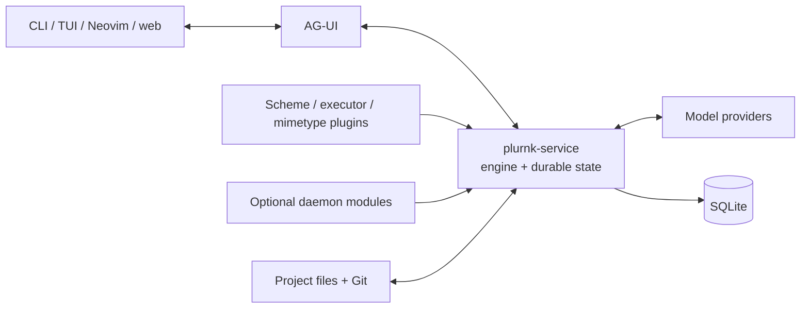

# PLURNK

PLURNK is an experimental runtime for software-development agents. It combines
a model-facing operation language, addressable project context, persistent
execution state, and thin clients over a single daemon.

The project is under active stabilization. It is suitable for development and
dogfooding, but it does not yet promise a stable public API or production
reliability.

## Why PLURNK

PLURNK is exploring three core ideas:

- models should act through a small compositional language rather than a large
  collection of unrelated tool schemas;
- project context and execution results should have durable addresses;
- agent work should be persisted and recoverable instead of living only in a
  client process.

Everything else is implementation and may change as those ideas are tested.

## Architecture



The daemon owns durable agent state and composes package-owned capabilities.
Clients submit actions and render events; plugins run in-process but retain
their own contracts.

See [ARCHITECTURE.md](./ARCHITECTURE.md) for the package map, process boundaries,
and request flow.

## Requirements

- Node.js 26 or newer
- npm
- Git
- a configured local or remote model endpoint for live runs

## Develop

[PossumTech Gitea](https://repo.possumtech.com/plurnk/plurnk-service) is the
canonical maintainer-development forge. [GitHub](https://github.com/plurnk/plurnk-service)
is the public downstream source, external-contribution, security-reporting, and
historical surface.

```sh
git clone https://github.com/plurnk/plurnk-service.git
cd plurnk-service
npm ci
npm run build
npm run test:lint
npm run test:unit
```

Deterministic integration tests are separate:

```sh
npm run test:intg
```

To launch a source-built daemon and the outside `plurnk` client as one
reproducible candidate:

```sh
PLURNK_CANDIDATE_MODEL=<configured-alias> npm run candidate -- <client arguments>
```

By default the launcher expects the client checkout at `../plurnk`. Set
`PLURNK_CLIENT_CHECKOUT` to use another checkout. It builds both projects,
creates an isolated database, reports their provenance, and preserves a digest
under `PLURNK_BENCHMARKS`. Repeated experiment harnesses may build both
checkouts once, then set `PLURNK_CANDIDATE_SKIP_BUILD=1` for the frozen build.

## Packages

This repository is an npm workspace monorepo. Each workspace publishes under
its own package contract; the root owns orchestration, one lockfile, and the
cross-package gates. The complete package-to-SPEC map lives in
[ARCHITECTURE.md](./ARCHITECTURE.md#package-ownership).

[`plurnk-contracts/plurnk.md`](./plurnk-contracts/plurnk.md) is the freshly
reviewed model-facing canon. Its owning
[`SPEC.md`](./plurnk-contracts/SPEC.md) distinguishes that narrow teaching from
the tolerant parser and runtime-neutral wire contracts.

## Contributing

Start with [CONTRIBUTING.md](./CONTRIBUTING.md). Please report security issues
using [SECURITY.md](./SECURITY.md), not a public issue.

## License

[MIT](./LICENSE)
