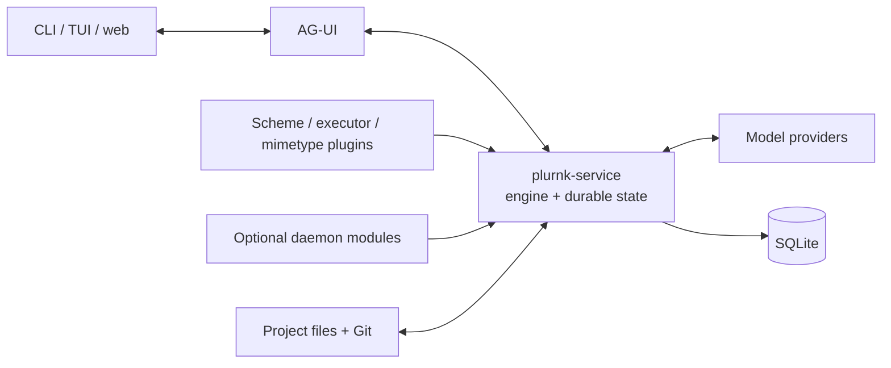

# PLURNK

PLURNK is a runtime for software-development agents. It combines a
model-facing operation language, addressable project context, persistent
execution state, and thin clients over a single daemon.

## Quick start

```sh
npx @plurnk/plurnk-service start   # the daemon
npx @plurnk/plurnk                 # the terminal client, from inside your project
```

The daemon starts without a model and says so, naming the configuration file it
created on first run. Choose a profile there, or set `PLURNK_MODEL` and your
provider's key in the environment; `plurnk-service config defaults` prints every
installed option.


An unedited recording of the published client and daemon against a three-file
project, answering in seventeen seconds on a local model: Qwen3.8-27B at Q3_K_S,
served by llama.cpp on one 16 GB consumer GPU. Beneath the prompt are the
operations the model ran, its response, and a footer carrying
turns, elapsed time and tokens. Any provider route works the same way.

## Design

- Models act through one small compositional language rather than a collection
  of unrelated tool schemas.
- Project context and execution results have durable addresses.
- Agent work is persisted and recoverable rather than held in a client process.

## Architecture



The daemon owns durable agent state and composes package-owned capabilities.
Clients submit actions and render events; plugins run in-process but retain
their own contracts.

See [ARCHITECTURE.md](./ARCHITECTURE.md) for the package map, process boundaries,
and request flow.

## Requirements

- Node.js 26 or newer
- npm
- Git
- a configured local or remote model endpoint for live runs

## Configuration

See the [configuration guide](./plurnk-core/INSTALL.md) for installation,
environment precedence, and Worker settings. `plurnk-service config defaults`
prints every installed package's authoritative settings. The enabled `plurnk`
skill exposes the same guide and catalog to the model on demand.

## Web retrieval

PLURNK owns no web search runtime. Discovery is an ordinary MCP concern: attach
any search-capable MCP server (Brave Search's official
[`@brave/brave-search-mcp-server`](https://github.com/brave/brave-search-mcp-server)
is a documented demo fixture) and its tools participate exactly like every
other MCP tool — admission, read-effect classification, and packet projection
are identical. See [`@plurnk/plurnk-mcp`](./plurnk-mcp/README.md) for the
service-owned attachment contract and the [HTTP scheme](./plurnk-schemes-http/README.md)
for page materialization; the optional `@plurnk/plurnk-schemes-http-tavily`
showcase plugin supplies Tavily Extract for eligible public HTML.

## Lifecycle hooks

PLURNK can deliver selected core events to one exact local command as JSON on
stdin. Configure `PLURNK_HOOKS_COMMAND`, JSON `PLURNK_HOOKS_ARGS`, and the
explicit `PLURNK_HOOKS_EVENTS` selection; no shell command is interpreted.
See [`@plurnk/plurnk-hooks`](./plurnk-hooks/README.md) for the event inventory
and a copy-pasteable test hook.

## Scheduled messages

Workers schedule messages to one another on RFC 5545 recurrence rules through
the `schedule` family, and read the time on demand instead of carrying a clock.
The operator seeds service rules with `PLURNK_SCHEDULE_<ALIAS>` and sets the
zone with `TZ`; see [`@plurnk/plurnk-schedule`](./plurnk-schedule/README.md).

## Run as a service

`contrib/plurnk.service` is a systemd user unit: copy it to
`~/.config/systemd/user/`, then `systemctl --user enable --now plurnk`.
Logs go to the user journal (`journalctl --user -u plurnk -f`).

## Develop

[PossumTech Gitea](https://repo.possumtech.com/plurnk/plurnk-service) is the
canonical maintainer-development forge. [GitHub](https://github.com/plurnk/plurnk-service)
is the public downstream source, external-contribution, security-reporting, and
historical surface.

```sh
git clone https://github.com/plurnk/plurnk-service.git
git clone https://github.com/plurnk/plurnk.git
npm ci --prefix plurnk
cd plurnk-service
npm ci
npm test
```

The complete test gate requires the installed terminal client checkout. For a
different layout, set `PLURNK_CLIENT_CHECKOUT=/path/to/plurnk` when running it.

Long-running drills remain explicit as `npm run test:live` and `npm run test:demo`;
use `npm run config:list` for a value-free configuration inventory.

To launch a source-built daemon and the outside `plurnk` client as one
reproducible candidate:

```sh
PLURNK_CLIENT_CHECKOUT=/path/to/open-client \
PLURNK_MODEL=<configured-alias> npm run candidate -- <client arguments>
```

`PLURNK_CLIENT_CHECKOUT` explicitly names the outside client checkout; the
launcher never guesses one from the service's parent directory. It builds both
projects, creates an isolated database, reports their provenance, and preserves
a digest in the shared `../benchmarks` tree unless `PLURNK_BENCHMARKS` selects
another path. Repeated experiment harnesses may build both checkouts once, then
set `PLURNK_CANDIDATE_SKIP_BUILD=1` for the frozen build.

See [CONTRIBUTING.md](./CONTRIBUTING.md) for hooks, test tiers, and maintenance.

## Packages

This repository is an npm workspace monorepo. Each workspace publishes under
its own package contract; the root owns orchestration, one lockfile, and the
cross-package gates. The package-ownership map lives in
[ARCHITECTURE.md](./ARCHITECTURE.md#package-ownership).

[`plurnk-contracts/plurnk.md`](./plurnk-contracts/plurnk.md) is the
model-facing canon. Its owning
[`SPEC.md`](./plurnk-contracts/SPEC.md) distinguishes that narrow teaching from
the runtime-neutral wire contracts; the parser that implements the language
lives in [`plurnk-parser`](./plurnk-parser).

## Contributing

Start with [CONTRIBUTING.md](./CONTRIBUTING.md). Please report security issues
using [SECURITY.md](./SECURITY.md), not a public issue.

## License

[MIT](./LICENSE)
