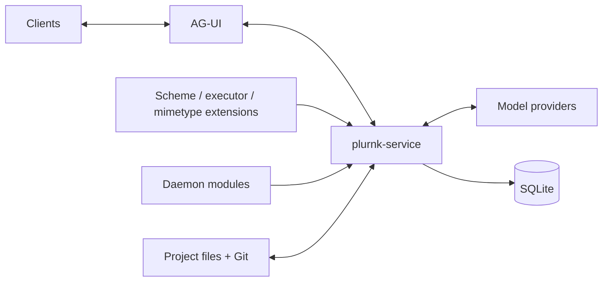

# Plurnk service

The runtime behind [Plurnk](https://github.com/plurnk/plurnk): a model-facing
operation language, searchable resources, persistent context, and cooperating
workers. Use local or hosted models through the same environment.

**To use Plurnk, start with the [terminal client](https://github.com/plurnk/plurnk#get-started).**
This repository owns the daemon, language contracts, and bundled extensions.

## Design

- The model controls its context and workflow through composable operations.
- Files, tool results, messages, and reasoning have addresses the model can inspect.
- Globs, regex, full text, structured queries, and symbol relationships share a pattern interface.
- Workers delegate and communicate within a persistent workspace, independent of a client session.

## Architecture


```mermaid
flowchart LR
    clients["Clients"] <--> agui["AG-UI"]
    agui <--> core["plurnk-service"]
    core <--> providers["Model providers"]
    extensions["Scheme / executor / mimetype extensions"] --> core
    modules["Daemon modules"] --> core
    project["Project files + Git"] <--> core
    core --> sqlite[(SQLite)]
```

The daemon owns durable state and orchestration. Clients submit actions and
render events; extensions supply capabilities under their own contracts. See
[ARCHITECTURE.md](ARCHITECTURE.md) for process boundaries and package ownership.

## Installation and configuration

The [installation guide](plurnk-core/INSTALL.md) covers requirements, configuration,
and running a shared daemon. The client can also start an installed backend
privately for its own session.

Configuration belongs to the package that reads it. Inspect the installed
catalog rather than a copied list of settings:

```sh
plurnk-service config defaults
```

The Plurnk skill exposes the same guides and catalog to the model on demand.

## Reference

| Area | Guide |
|---|---|
| Model-facing language | [plurnk.md](plurnk-contracts/plurnk.md) |
| Model routes and provider settings | [Providers](plurnk-providers/README.md) |
| Client protocol | [AG-UI](plurnk-agui/README.md) |
| External tools and web search | [MCP](plurnk-mcp/README.md) |
| HTTP resources | [HTTP scheme](plurnk-schemes-http/README.md) |
| Scheduled messages | [Schedule](plurnk-schedule/README.md) |
| Local event handlers | [Lifecycle hooks](plurnk-hooks/README.md) |
| Extending Plurnk: integrations, plugins, extensions | [Extensibility](ARCHITECTURE.md#extensibility) |
| Writing a daemon module | [Module contract](plurnk-modules/README.md) |
| Package map and extension boundaries | [Architecture](ARCHITECTURE.md#package-ownership) |

Each package's `SPEC.md` owns its public contract. The root is an npm workspace
with one lockfile and cross-package checks.

## Development

```sh
git clone https://github.com/plurnk/plurnk-service.git
git clone https://github.com/plurnk/plurnk.git
npm ci --prefix plurnk
cd plurnk-service
npm ci
npm test
```

The complete test gate requires the installed client checkout. Set
`PLURNK_CLIENT_CHECKOUT` for a different layout. Real-model tests are separate
from `npm test` and may incur inference charges.

See [CONTRIBUTING.md](CONTRIBUTING.md) for test tiers, source-built candidates,
optional audits, and releases. [plurnk-bench](https://github.com/plurnk/plurnk-bench)
owns external evaluations and comparative reports.

## Contributing

[Issues](https://github.com/plurnk/plurnk-service/issues) and pull requests are
welcome. See [CONTRIBUTING.md](CONTRIBUTING.md); report vulnerabilities through
[SECURITY.md](SECURITY.md), not a public issue.

## License

[MIT](LICENSE).
