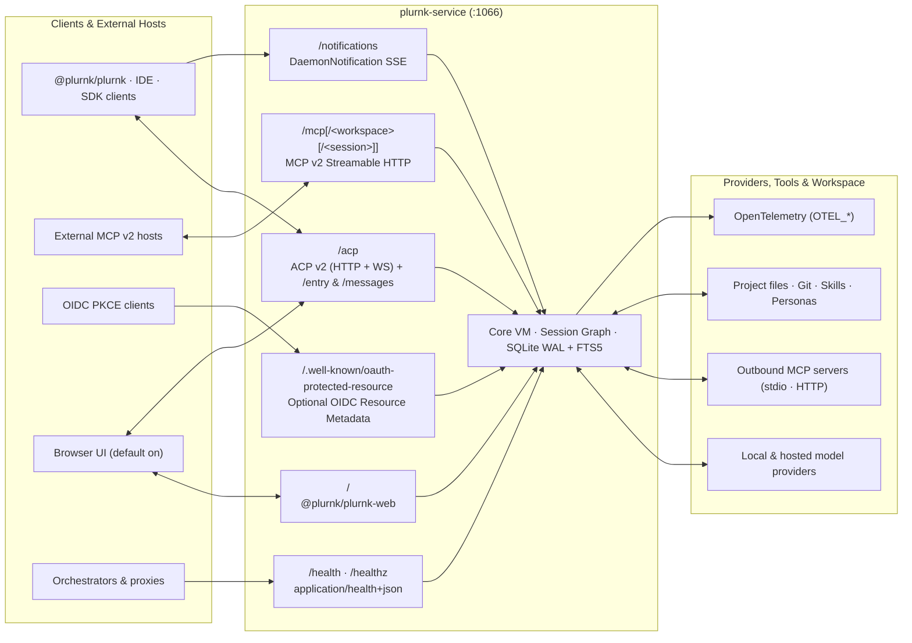

# Plurnk service

The runtime behind [Plurnk](https://github.com/plurnk/plurnk): an agentic operating environment powered by a virtual machine shared across `model`, `client`, and `_plurnk` principals — with one universal `mcp` tool envelope, one URI address space, one selection algebra, a persistent SQLite journal, and a durable multi-session and obligation graph.

- **Start here to use Plurnk:** [terminal client](https://github.com/plurnk/plurnk#get-started) (`plurnk` CLI & Term; browser UI at `http://127.0.0.1:1066/`).
- **Why it is built this way:** [MANIFESTO.md](MANIFESTO.md).

## Core organs

- **Universal `mcp` tool:** Every built-in operation, executor, Functionality family, and attached MCP server dispatches through one structured wire tool (`{ server, tool, aside, arguments }`) with pull-on-demand schemas at `mcp:///`, lowering assistant prose into durable `note`s and recording canonical programs in `ops://`.
- **Universal address space:** Project files, process streams, MCP resources, skills, reasoning, and past receipts share one URI namespace the model reads and curates.
- **Unified selection algebra:** Globs, regex, FTS5 full text, JSONPath, XPath, and Tree-sitter symbol queries share one `pattern` field across every verb.
- **Durable session graph:** Sessions delegate (`work`, `fork`), message (`send`, `done`, `fail`), and synchronize (`wait`) independently of client connections.

## Surface (`:1066`)

One listener (`127.0.0.1:1066` by default, zero-password on loopback with optional external OIDC JWT verification) serves every face:


```mermaid
flowchart LR
    subgraph Inbound["Clients & External Hosts"]
        cli["@plurnk/plurnk · IDE · SDK clients"]
        mcpHosts["External MCP v2 hosts"]
        authClients["OIDC PKCE clients"]
        browser["Browser UI (default on)"]
        probes["Orchestrators & proxies"]
    end

    subgraph Listener["plurnk-service (:1066)"]
        acp["/acp<br/>ACP v2 (HTTP + WS) + /entry & /messages"]
        mcp["/mcp[/&lt;workspace&gt;[/&lt;session&gt;]]<br/>MCP v2 Streamable HTTP"]
        notifications["/notifications<br/>DaemonNotification SSE"]
        oauth["/.well-known/oauth-protected-resource<br/>Optional OIDC Resource Metadata"]
        web["/<br/>@plurnk/plurnk-web"]
        health["/health · /healthz<br/>application/health+json"]
        core["Core VM · Session Graph · SQLite WAL + FTS5"]
        acp & mcp & notifications & oauth & web & health --> core
    end

    subgraph Outbound["Providers, Tools & Workspace"]
        models["Local & hosted model providers"]
        extMcp["Outbound MCP servers (stdio · HTTP)"]
        workspace["Project files · Git · Skills · Personas"]
        otel["OpenTelemetry (OTEL_*)"]
    end

    cli <--> acp
    cli --> notifications
    mcpHosts <--> mcp
    authClients --> oauth
    browser <--> web
    browser <--> acp
    probes --> health
    core <--> models
    core <--> extMcp
    core <--> workspace
    core --> otel
```

| Mount | Owner | Surface |
|---|---|---|
| `/acp` | `@plurnk/plurnk-acp` | ACP v2 JSON-RPC 2.0 over Streamable HTTP (SSE) and WebSocket, plus `GET /acp/<workspaceId>/<sessionId>/{entry,messages}`. |
| `/mcp[/<workspace>[/<session>]]` | `@plurnk/plurnk-mcp` | MCP v2 Streamable HTTP server exposing the 14 VM verbs, executors (`sh`, `js`, `python3`), 6 Functionality families, `skill://` SEP-2640 Skills, and `subscriptions/listen` push notifications. |
| `/notifications` | `@plurnk/plurnk-service` | `GET /notifications[/<workspace>[/<session>]]` SSE stream of discrete `DaemonNotification` envelopes with `Last-Event-ID` replay ([guide](plurnk-core/docs/notifications.md)). |
| `/.well-known/oauth-protected-resource` | `@plurnk/plurnk-auth` | Optional RFC 9728 Protected Resource Metadata + `jose` JWT verification when `PLURNK_AUTH_ISSUER` is configured. |
| `/` | `@plurnk/plurnk-web` | Browser client mounted by default via `optionalDependencies` (`--omit=optional` omits). |
| `/health`, `/healthz` | `@plurnk/plurnk-service` | Unauthenticated `GET`/`HEAD` readiness probes (`200` `{"status":"pass"}` or `503 service-starting`). |

## Reference

| Area | Authority |
|---|---|
| Manifesto & architecture | [MANIFESTO.md](MANIFESTO.md) · [ARCHITECTURE.md](ARCHITECTURE.md) |
| Installation, `.env` cascade & backups | [INSTALL.md](plurnk-core/INSTALL.md) (`plurnk-service config defaults`) |
| Security & operator assurance | [SECURITY.md](SECURITY.md) · [ASSURANCE.md](ASSURANCE.md) |
| Operations, contracts & parser | [plurnk.md](plurnk-contracts/plurnk.md) · [Contracts](plurnk-contracts/README.md) · [Parser](plurnk-parser/README.md) |
| Model routes, catalog & providers | [Providers](plurnk-providers/README.md) · [Models](plurnk-models/README.md) · [Aliases](plurnk-aliases/README.md) |
| Client, auth & web faces | [ACP](plurnk-acp/README.md) · [OAuth 2.1](plurnk-auth/README.md) · [Web](https://github.com/plurnk/plurnk-web) |
| Tools, skills, personas & schedules | [MCP](plurnk-mcp/README.md) · [Skills](plurnk-skills/README.md) · [Personas](plurnk-personas/README.md) · [Schedule](plurnk-schedule/README.md) |
| Extension frameworks & modules | [Extensibility](ARCHITECTURE.md#extensibility) · [Modules](plurnk-modules/README.md) · [Schemes](plurnk-schemes/README.md) ([HTTP](plurnk-schemes-http/README.md)) · [Execs](plurnk-execs/README.md) · [Mimetypes](plurnk-mimetypes/README.md) |
| Observability & forensics | [OpenTelemetry](plurnk-otel/README.md) · [Digest](plurnk-digest/README.md) |

## Development

```sh
git clone https://github.com/plurnk/plurnk-service.git
git clone https://github.com/plurnk/plurnk.git
npm ci --prefix plurnk
cd plurnk-service && npm ci && npm test
```

`PLURNK_CLIENT_CHECKOUT` overrides the sibling `../plurnk` path. See [CONTRIBUTING.md](CONTRIBUTING.md) for test tiers and releases, and [plurnk-bench](https://github.com/plurnk/plurnk-bench) for comparative evaluations.

## License

[MIT](LICENSE). Report vulnerabilities via [SECURITY.md](SECURITY.md).
