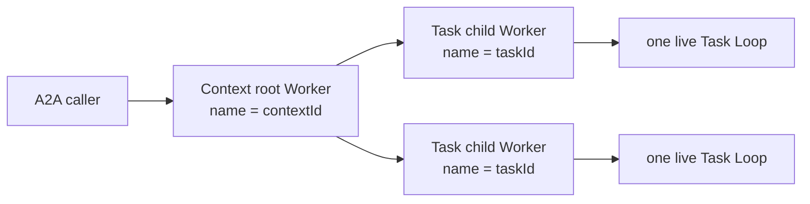

# Plurnk A2A specification

## §a2a-http-json-discovery HTTP+JSON discovery

`connectHttpJsonAgent` discovers the standard A2A Agent Card, selects an
advertised `HTTP+JSON` interface at protocol version `1.0`, and returns the
official SDK client. An explicit Agent Card path may replace the standard
well-known path. No legacy protocol or alternate binding is enabled.

## §a2a-environment-projection POSIX configuration projection

The package `.env.defaults` is the complete configuration vocabulary. The
ordinary service, user, project, and client environment cascade remains the
only configuration authority; generated Agent Cards and discovered remote
cards are protocol projections, not configuration files.

| Family | Variables | Meaning |
|---|---|---|
| Outbound definition | `PLURNK_A2A_<ALIAS>=<absolute HTTP(S) URL>` plus optional `_CARD_PATH`, `_HEADERS`, and `_BEARER` companions | Defines one available remote agent without fetching or enabling it. `_BEARER` contains only a symbolic `${NAME}` reference; secrets remain environment-owned. |
| Outbound defaults | `PLURNK_A2A_ENABLED` | JSON array selecting the exact aliases enabled by default for the workspace's `a2a` family ({§a2a-functionality}); workspace state may override enabledness. `[]` is the one spelling of none: an absent or empty key is refused by name. |
| Timeouts | `PLURNK_A2A_CONNECT_TIMEOUT`, `PLURNK_A2A_REQUEST_TIMEOUT` | Positive integer milliseconds owned by the A2A package. |
| Diagnostics | `PLURNK_A2A_ERROR_DETAIL_LIMIT` | Non-negative character bound for one caught upstream diagnostic admitted to a model-facing A2A Problem; complete causes remain internal. |
| Inbound listener | `PLURNK_A2A_EXPOSE`, `_HOST`, `_PORT`, `_ENDPOINT_PATH`, `_ENDPOINT_URL` | `EXPOSE=1` admits one optional HTTP+JSON listener; `0` admits none. |
| Inbound workspace | `PLURNK_A2A_WORKSPACE`, `_PROJECT_ROOT` | Names the lazily resolved execution workspace and its creation root. |
| Hosted identity | `PLURNK_A2A_NAME`, `_DESCRIPTION`, `_VERSION`, optional provider/docs/icon fields, and `_SKILLS` | Supplies identity content for one generated standard Agent Card. `_SKILLS` is a JSON array; omitted per-skill examples and media modes receive the exposure's factual defaults. |

Alias matching is case-insensitive but collision-intolerant, while the canonical
global names use their documented spelling. Header values preserve symbolic
environment references until connection admission. A remote Agent Card remains
the authority for that remote agent; its discovered contents are never copied
into this environment vocabulary.

An explicitly empty outbound target omits that definition, ignores its companion
values and drops its inherited `ENABLED` selection. It does not remove a
workspace-owned definition or prohibit adding one. Genuinely undeclared aliases
and case-fold collisions still fail validation.

## §a2a-protocol-witness Protocol witness

The integration witness places a discovery-first client and an independent
agent on opposite sides of the official A2A v1 HTTP+JSON binding. It covers
card discovery, blocking task completion, task retrieval, ordered streaming
updates, cancellation, a direct Message without a fabricated Task,
input-required continuation under the same Task and Context identities,
multiple distinct Artifacts, and multiple Tasks sharing one Context. The
independent agent may use the SDK's reference request handler and task store;
those test actors establish wire behavior and are not the Plurnk task
architecture.

## §a2a-inbound-exposure Inbound exterior exposure

The inbound HTTP+JSON listener is an exterior adapter over
`ApplicationPort`. The official SDK owns A2A framing and request handling;
Plurnk Workers, Loops, logs, and terminal results remain the only execution
state. The SDK `TaskStore` implementation is a projection of that durable
state, not an independent Task database.



The SDK generates new Context and Task UUIDs before execution. Those UUIDs
already satisfy Plurnk's worker-name contract ({§worker-name}), so their exact values name the
root Context Worker and its Task child. No adapter binding table, synthetic
actor, or second scheduler exists. Later Tasks fork the Context root and
therefore receive the parent-visible prior Task evidence under Core's ordinary
topology contract.

Only a child Worker with a durable message source matching its exact A2A Context,
Task, and Message identities projects as a Task. A root is reusable as an A2A
Context only after this adapter created it in the running exposure or one such
Task proves its durable ownership after restart. Ordinary model Workers in the
same workspace are neither discoverable nor adoptable through A2A. Foreign
Task identities that cannot name a local Worker are unknown Tasks, not Core
validation failures. Unsupported Message content and invalid answers to a
pending interaction are rejected before execution with the standard protocol
error; they do not create Workers or alter an existing Task. Other executor
failures follow the SDK's failed-Task behavior.

| Durable Plurnk state | A2A projection |
|---|---|
| Loop `100` | `SUBMITTED` |
| Loop `102` or `202` | `WORKING`; parking alone does not claim user input is required |
| Pending client interaction on the Task Loop | `INPUT_REQUIRED` |
| Successful terminal result | `COMPLETED`; the current Loop's last non-empty delivered reply from message history is the `result` Artifact. The lifecycle result is not a message body. |
| External cancellation / Loop `499` | `CANCELED` |
| Other terminal failure | `FAILED` with the exact Problem detail as its status Message |
| Inbox messages carrying the adapter's causal source | Complete admitted user Message history from {§message-envelope-evidence}, including accepted interaction answers; independent of log curation and publication. |
| Delivered replies answering this Task's A2A messages | Only replies whose `answers` name this Task's A2A messages contribute text or attachments. Native or other-protocol replies do not become A2A Artifacts. |
| Such replies' attachment receipts | Distinct standard Artifacts holding send-time bytes from {§send-resource-attachments}, independent of later source changes. |

The exposure accepts text, data, URL, and raw Message Parts, advertises HTTP+JSON v1
streaming without push notifications, tenants, extended cards, or security
schemes, and rejects a card that claims unsupported security. Those omitted
surfaces are not silently simulated. The adapter subscribes to live
application events for streaming and reads durable Worker/Loop/log projections
for retrieval and restart truth.

§a2a-hosted-card The service generates the hosted standard Agent Card from
normalized environment identity plus actual adapter capabilities. The adapter,
not configuration, fixes HTTP+JSON protocol `1.0`, streaming, no push
notifications, no extended card, no tenant, no security, and `*/*` input/output.
Arbitrary media are resources; native model interpretation still depends on its route.
Unsupported security claims are structurally absent
rather than configurable. The official SDK serializes the card served at the
standard well-known path.

§a2a-hosted-proposals A2A carries no review channel, so an inbound Task's loop
settles its own proposals: `PLURNK_A2A_PROPOSALS` states `accept` or `reject`,
and `review` is outside its vocabulary. That one field is all the adapter states
about the loop's policy; attendance is the daemon's to supply, because a remote
agent can answer an interaction through `input-required`.

§a2a-lazy-workspace Listener startup, Agent Card discovery, Task observations,
and rejected Task lookups perform no workspace creation, attachment, hydration,
model selection, or inference. An absent workspace yields an empty Task list or
the standard Task-not-found result, not implicit creation. The
first admitted Task resolves the configured workspace name, adopting the one
existing match or creating it with the configured project root. A configured
non-null root must match an existing workspace exactly. The resolution is
shared across concurrent requests and a failed resolution remains retryable.

### §a2a-task-listing Task listing

`ListTasks` follows the [A2A listing contract](https://a2a-protocol.org/latest/specification/#314-list-tasks),
not the Worker directory's creation order.

| Concern | Projection |
|---|---|
| Ordering | Status timestamp descending; equal or absent timestamps use Task ID ascending. Absent timestamps sort last. |
| Pagination | Opaque cursor after the last returned timestamp/ID, not an offset. Newer Tasks do not shift subsequent pages. This is a live listing, not a frozen snapshot. |
| Filtering | Context, state, and inclusive status timestamp bound apply before paging; `totalSize` counts the filtered Tasks. |
| Content | Artifacts are omitted unless requested; the SDK applies the requested history limit. |
| Invalid cursor | Standard `RequestMalformedError`; never silently restart at the first page. |

## §a2a-functionality Outbound agents as workspace Functionality

The package registers, through `OutboundModule`, one workspace Functionality
family named `a2a` ({§functionality-adapter} in core): the package, its keys,
the family and the scheme share one name. Its definition
is the `A2aAgentDefinition` contract — local alias `name`, remote `url`,
optional `cardPath`, `headers`, and symbolic bearer `authorization` —
exactly the environment's `PLURNK_A2A_<ALIAS>*` projection.

*Available definitions* are the environment's aliases; `PLURNK_A2A_ENABLED`
supplies their default enabledness. *Admission* (`add {alias, definition}`)
requires `alias = name`. *Discovery is inert*: `discover {source}` fetches one
standard Agent Card from that URL only and returns one candidate whose alias
is the card name's slug, with `agent-card` provenance; `discover
{configuration}` projects a client's own `PLURNK_A2A_*` environment as
`client-configuration` candidates; `discover {query}` is 501
`registry-not-configured` until a registry is configured. Discovery never
adds, enables, authenticates beyond the named host, or persists.

*Preparation* resolves symbolic `${NAME}` references at connection
(`authorization-unresolved` when absent), discovers and validates the standard
Agent Card at the definition's URL (`card-unreachable`), and connects only
through an advertised HTTP+JSON `1.0` interface (`interface-unsupported`),
reusing an unchanged attachment across publications. The outcome detail carries
the card's name, version, description, skill identifiers, and streaming
capability. The family publishes no runtimes of its own; its snapshot is the
workspace's `alias → client` map, and its scheme face ({§a2a-scheme-face})
resolves an authority against the Functionality of the operation's workspace
(`ctx.workspaceId`):
an unknown or disabled alias is 404 `agent-not-configured`, an unavailable
alias carries its one exact preparation Problem. Every worker in a workspace
resolves the same alias definition; independent workspaces may differ.

§a2a-problem-detail A2A Problems state the failed boundary fact without
guessing intent or duplicating structured aliases, URLs, and interfaces in
prose. A decision-relevant caught configuration, discovery, or interface
diagnostic is admitted only through `PLURNK_A2A_ERROR_DETAIL_LIMIT`; the exact
cause remains attached for daemon diagnostics.

§a2a-catalog **Turn 0 shows enabled agents concisely.** Preparation
publishes one `worker:///_plurnk/a2a/<alias>.md` document per active
alias — an H1 alias, an H2 `Summary` whose one line is
`a2a://<alias> — <card name> v<version>: <description>`, and the invocation
form — and nothing for disabled or unavailable aliases. Core's seventh turn-0
survey (```` ```FIND (worker:///_plurnk/a2a/*.md) <1,-1> ````,
{§actor-boundary-catalog-preview}) therefore presents every effective agent as
one summary row. The document embeds neither the card nor its skills; both stay
pullable exactly through `READ a2a://<alias>` ({§a2a-outbound-definition}).
Hosted inbound exposure ({§a2a-inbound-exposure}) is unaffected by this family.

## §a2a-outbound-resources Outbound resources

The `a2a` scheme is an exterior client adapter over ordinary Plurnk resource
and subscription contracts. Its URI authority is the configured remote-agent
alias. The adapter is not a Worker producer, scheduler, Task store, or alternate
operation runtime.

§a2a-scheme-face **The scheme is the live half of the family's own runtime.**
Every executor tag is a scheme of the same name, so the `a2a` manager and the
`a2a://` resources are one scheme with two halves ({§runtime-resource-binding}
in core). The manager's stored executions keep `a2a:///<loop>/<turn>/<sequence>`,
numeric throughout; the package's face claims every other coordinate — one that
opens with an agent alias, or with `contexts` for a hosted message — and owns
READ, FIND preparation and SEND there; KILL of a live Task is the ordinary
stream control. The face declares its own representation — resource authority,
`#body` and `#json` — so a resource keeps the one address `a2a://planner/tasks/7`
in what the model writes, in its log, and in the wake that concludes a Task.
The family states the `web` trait, so a capability policy that selects on it
covers the manager and every resource alike.

§a2a-outbound-definition An enabled outbound alias resolves through its
workspace's `a2a` Functionality snapshot ({§a2a-functionality}), whose
preparation discovered and validated the remote standard Agent Card and
selected only an advertised HTTP+JSON `1.0` interface. The local alias,
target, optional card path, symbolic authentication, and provenance are local
configuration; the discovered card's identity, capabilities, skills, and
interfaces remain remote protocol authority.

| Operation | Target | Result |
|---|---|---|
| READ | `a2a://<agent>` | Materialize the discovered Agent Card. |
| SEND | `a2a://<agent>` | Send a new user Message. A direct Message creates one static `/messages/<id>` resource and returns `200`; a Task creates one live `/tasks/<id>` resource and returns `102`. |
| SEND | Exact `/tasks/<id>` resource | Continue the same non-terminal Task identity, including an input-required or auth-required Task. |
| KILL | Live Task resource | Cancel the ordinary local subscription, which requests cancellation of the remote Task. |
| READ | Exact Task resource | Materialize the remote Task's current canonical snapshot. |
| READ | Stored Artifact resource | Read the workspace's retained bytes without requiring an active agent connection. |

§a2a-outbound-turn-rhythm SEND delivers a Message; lifecycle verbs independently
declare the local Loop's intent under {§turn-disposition}. A Task-backed SEND
creates an ordinary live obligation. Ordinary operations continue work;
WAIT joins that obligation. Subscription settlement wakes the
same Loop with its terminal READ, and an answered, observed and settled loop concludes
under {§wait-obligation-matrix}. KILL cancels through that same subscription.
No adapter-authored turn or alternate disposition path fills any step.

Task-backed calls use Core's ordinary live-resource path: the scheme seeds one
entry, opens one subscription, returns its exact address with `102`, and closes
that subscription with the remote Task result. Core alone owns parking, waking,
the terminal next-turn READ, and cancellation propagation.

§a2a-outbound-replay A card or resource READ and connection discovery are
replay-safe observations. A SEND is not: once dispatch begins, a transport or
stream-protocol failure cannot prove that the remote agent rejected the
Message. Such Problems, including an invalid first stream result and an early
stream end, therefore carry `retryable: false`; Plurnk never recommends an
automatic identical replay that could duplicate remote work.

## §a2a-resource-projection Resource projection

§a2a-hosted-message-resources Hosted input uses the ordinary inbox and
{§send-resource-attachments}, not the outbound alias resolver. An incoming
caller needs neither an Agent Card nor a configured remote alias.

| Input Part | Model-facing arrival |
|---|---|
| Text | Authored text. |
| Data | Pretty-printed JSON. |
| URL | Literal supplied URL; no arrival-time fetch. |
| Raw | Link to `worker://<task>/attachments/<eight-character-id>/<name>`, with ordinary typed bytes; unnamed/colliding names use {§resource-publication-names}. |

The complete admitted SDK SendMessageRequest envelope preserves configuration,
request metadata, and its inner Message's Part order, media types, filenames,
metadata, and assigned Task/Context identity. Accepted interaction
answers enter that same evidence path before the operation resumes; invalid
answers do not. Task history selects the envelope's inner Message, including
those awaiting log publication. Derived status Messages describe the current
pending interaction or terminal Problem; they are not additional inbox arrivals.
Task retrieval reconstructs these facts after adapter/daemon restart.

§a2a-response-preferences Nonempty `configuration.acceptedOutputModes` appears
as labeled response preferences beside the model-facing arrival, for normal
requests and accepted interaction answers. Omitted or empty preferences add
nothing. This projection neither edits the protocol Message nor changes
interaction validation. Other request configuration remains adapter-owned;
opaque request metadata is evidence, not additional instructions. Preferences
do not relabel source bytes or promise an unavailable output representation.

Explicit resource selections in a hosted worker's targetless SEND become
standard raw-Part Artifacts, one per selected resource in order. Artifact IDs
are stable within the Task. The ordinary final textual result retains its
`result` Artifact. A directed A2A SEND instead transmits its selected resources
as raw Parts of that user Message. Resource creation and READ never export;
the selected send-time snapshot survives both source mutation and log curation.

Every retained Agent Card, Message, Task, and Artifact has a model-oriented
Markdown `#body` and an exact protocol `#json` channel serialized by the pinned
official SDK. A Task's Artifact identities remain distinct URI descendants and
materialize independently; the adapter never flattens multiple Artifacts into
one fabricated result. Projection wording is presentation rather than protocol
identity: tests assert lifecycle state, content, media type, and addressability,
not a prose template.

§a2a-part-resources Received raw Parts are ordinary typed resources, not base64
placeholders. Their parent Message or Artifact links to them in Part order;
the exact protocol JSON remains independently readable.

| Part | Ordinary resource projection |
|---|---|
| Text / structured data | Text / pretty JSON in the parent body. |
| URL | The supplied URL; arrival does not fetch it or bypass its scheme's acquisition policy. |
| Raw bytes | `<parent>/resources/<name>` with exact bytes and media type (or `application/octet-stream` if absent). Supplied names and stable eight-character fallback names use {§resource-publication-names}. |

A received Task snapshot retains its Artifacts and Messages with their Part
resources before publishing links or settling its subscription. Retained
Message, Artifact, and Part READs need no active remote connection. READ alone
controls native attachment delivery through {§packet-attachment-parts}; listing
a resource does not inject its bytes into model context. Log curation does not
delete the retained source.
