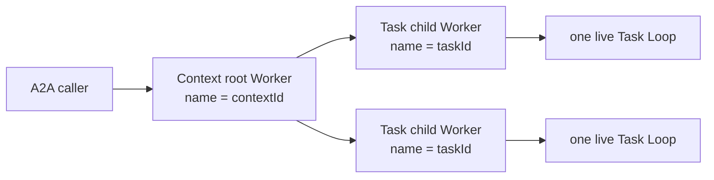

# Plurnk A2A specification

## §a2a-http-json-discovery HTTP+JSON discovery

`connectHttpJsonAgent` discovers the standard A2A Agent Card, selects an
advertised `HTTP+JSON` interface at protocol version `1.0`, and returns the
official SDK client. An explicit Agent Card path may replace the standard
well-known path. No legacy protocol or alternate binding is enabled.

## §a2a-protocol-witness Protocol witness

The integration witness places a discovery-first client and an independent
agent on opposite sides of the official A2A v1 HTTP+JSON binding. It covers
card discovery, blocking task completion, task retrieval, ordered streaming
updates, cancellation, a direct Message without a fabricated Task,
input-required continuation under the same Task and Context identities,
multiple distinct Artifacts, and multiple Tasks sharing one Context. The
independent agent may use the SDK's reference request handler and task store;
those test actors establish wire behavior and are not the Plurnk task
architecture.

## §a2a-inbound-exposure Inbound exterior exposure

The inbound HTTP+JSON listener is an exterior adapter over
`ApplicationPort`. The official SDK owns A2A framing and request handling;
Plurnk Workers, Loops, logs, and terminal results remain the only execution
state. The SDK `TaskStore` implementation is a projection of that durable
state, not an independent Task database.

The SDK generates new Context and Task UUIDs before execution. Those UUIDs
already satisfy Plurnk's worker-name contract, so their exact values name the
root Context Worker and its Task child. No adapter binding table, synthetic
actor, or second scheduler exists. Later Tasks fork the Context root and
therefore receive the parent-visible prior Task evidence under Core's ordinary
topology contract.

Only a child Worker with a durable prompt source matching its exact A2A Context,
Task, and Message identities projects as a Task. A root is reusable as an A2A
Context only after this adapter created it in the running exposure or one such
Task proves its durable ownership after restart. Ordinary model Workers in the
same workspace are neither discoverable nor adoptable through A2A. A request
rejected before Worker admission may yield the official SDK's ephemeral failed
Task response, but it creates no durable Task state.

| Durable Plurnk state | A2A projection |
|---|---|
| Loop `100` | `SUBMITTED` |
| Loop `102` or `202` | `WORKING`; parking alone does not claim user input is required |
| Pending client interaction on the Task Loop | `INPUT_REQUIRED` |
| Successful terminal result | `COMPLETED`; a non-empty final SEND is the `result` Artifact |
| External cancellation / Loop `499` | `CANCELED` |
| Other terminal failure | `FAILED` with the exact Problem detail as its status Message |
| Prompt rows carrying the adapter's causal source | User Message history |

The first exposure accepts only text Message Parts, advertises HTTP+JSON v1
streaming without push notifications, tenants, extended cards, or security
schemes, and rejects a card that claims unsupported security. Those omitted
surfaces are not silently simulated. The adapter subscribes to live
application events for streaming and reads durable Worker/Loop/log projections
for retrieval and restart truth.

## §a2a-outbound-resources Outbound resources

The `a2a` scheme is an exterior client adapter over ordinary Plurnk resource
and subscription contracts. Its URI authority is the configured remote-agent
alias. The adapter is not a Worker producer, scheduler, Task store, or alternate
operation runtime.

| Operation | Target | Result |
|---|---|---|
| READ | `a2a://<agent>` | Materialize the discovered Agent Card. |
| SEND `[200]` | `a2a://<agent>` | Send a new user Message. A direct Message creates one static `/messages/<id>` resource and returns `200`; a Task creates one live `/tasks/<id>` resource and returns `102`. |
| SEND `[200]` | Exact `/tasks/<id>` resource | Continue the same non-terminal Task identity, including an input-required or auth-required Task. |
| SEND `[499]` | Live Task resource | Cancel the ordinary local subscription, which requests cancellation of the remote Task. |
| READ | Exact Task or Artifact resource | Materialize the remote resource's current canonical snapshot. |

§a2a-outbound-turn-rhythm A Task-backed call composes through ordinary model
turns rather than an adapter-authored continuation. The directed disposition
SEND is structurally the end of its emission ({§send-mid-reservation}), but its
target makes `[200]` the A2A operation code rather than the local Loop
disposition. Core therefore routes the request and naturally presents its
`102` Task receipt in the next turn. If the model then chooses to wait, a
pathless `SEND [202]` parks the Loop; subscription completion wakes that same
Loop with the exact terminal READ, after which a pathless `SEND [200]` may
conclude under {§wait-obligation-matrix}. No hidden adapter turn or synthetic
local disposition fills any step.

Task-backed calls use Core's ordinary live-resource path: the scheme seeds one
entry, opens one subscription, returns its exact address with `102`, and closes
that subscription with the remote Task result. Core alone owns parking, waking,
the terminal next-turn READ, and cancellation propagation.

## §a2a-resource-projection Resource projection

Every retained Agent Card, Message, Task, and Artifact has a model-oriented
Markdown `#body` and an exact protocol `#json` channel serialized by the pinned
official SDK. A Task's Artifact identities remain distinct URI descendants and
materialize independently; the adapter never flattens multiple Artifacts into
one fabricated result. Projection wording is presentation rather than protocol
identity: tests assert lifecycle state, content, media type, and addressability,
not a prose template.
