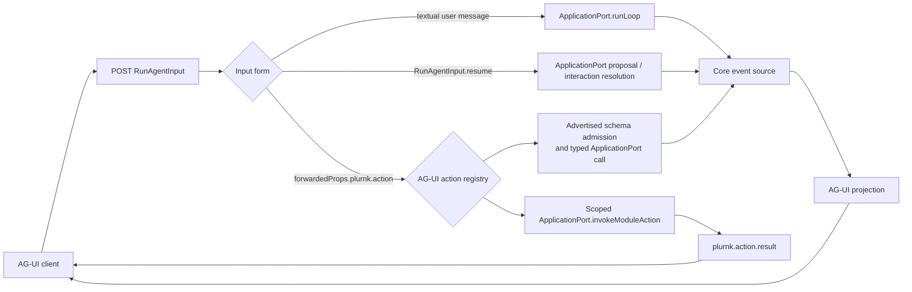

# @plurnk/plurnk-agui — the projection contract

The module is the daemon's AG-UI client interface. It consumes the
contracts-owned {§application-port} and emits the Agent-User Interaction
Protocol over HTTP/SSE. Core's numbers and semantics pass through; the module
does not recompute them.

## Architecture

- §agui-daemon-client **The module is an in-process plugin of the daemon** — the
  production host pre-binds its AG-UI+ listener, then daemon activation
  (`registerModule` → the application port) makes the client interface ready.
  AG-UI owns the socket throughout. No WebSocket, no separate process.
- §agui-listener-admission **Bound is not ready.** `Module.bind` owns the configured
  TCP address before durable-state admission and answers every request with a
  retryable 503 until `Module.start` installs the application port. A bind error
  rejects with its originating socket failure; there is no unhandled server
  error, silent pending promise, or close/rebind window. `Module.init` composes
  bind and start for direct in-process use.
- §agui-thread-binding **A PLURNK workspace is the world; an AG-UI thread is a conversation over it**
  — the lifecycle vocabulary is defined by service {§lifecycle-terms}. PLURNK's machine model ({§machine-processes}) splits the world (a workspace: one
  curated workspace) from the CONVERSATION (a worker: a history over that world). AG-UI's workspace
  concept is the workspace, selected by name, VERBATIM, via `forwardedProps.plurnk.workspace`
  (attach if it exists, create with exactly that name otherwise — no prefix, no forging). The
  workspace is REQUIRED: a worker has no existence without a world, so its absence is a contract
  violation the module rejects (400) - never a workspace forged from the `threadId`. The
  `threadId` is the conversation over that world, and the name is the identity at
  BOTH levels: `threadId` == the workspace name binds the workspace's model worker (the default
  conversation, `ensureModelWorker` — its durable default-conversation role identifies it,
  never a name parse or root ordering); a DISTINCT
  `threadId` names its own conversation worker — found by name if it exists (forks and prior
  conversations are addressable as threads), minted via `createConversationWorker`
  if it doesn't. The core workspace envelope carries only the workspace and selected client
  actor ({§methods-rebind}); AG-UI owns the separate per-thread conversation binding.
  `loop.inject`, `loop.cancel`, and `run.fork` operate on the THREAD's conversation.
  `log.read` and `entry.read` default there and may explicitly select another workspace worker.
  Extended context persists across AG-UI Runs because the worker's log does.
- §agui-run-authority **AG-UI owns the client lifecycle** — `threadId`, `runId`,
  `RUN_STARTED`, `RUN_FINISHED`, `RUN_ERROR`, interrupt outcomes, and `RunAgentInput.resume`
  follow the official `@ag-ui/core` schemas. PLURNK does not maintain a parallel client
  lifecycle dialect. PLURNK owns the internal worker/loop/turn topology and projects it
  through standard events plus namespaced `plurnk.*` extensions.

## §agui-projection The projection

One accepted Run or daemon notification produces zero-or-more AG-UI events:

| plurnk wire                                | AG-UI events |
| ------------------------------------------ | ------------ |
| schema-valid `RunAgentInput`               | `RUN_STARTED` + initial `STATE_SNAPSHOT` |
| `log/entry` turn boundary                  | `STEP_FINISHED` + `STEP_STARTED` (`turn-<id>`) |
| `log/entry` op=PLAN (model)                | `ACTIVITY_SNAPSHOT` {§agui-plan-activity} |
| `log/entry` op=SEND (model)                | Optional readable-reasoning sequence {§agui-readable-reasoning}, then `TEXT_MESSAGE_START/CONTENT/END` + `CUSTOM plurnk.send` (signal/status) |
| `log/entry` other op (model)               | `TOOL_CALL_START/ARGS/END` (+ `TOOL_CALL_RESULT` when rx exists) |
| `log/entry` actionless `kind=turnOps` or `kind=emissionAttempt` | At most one `REASONING_ENCRYPTED_VALUE`, attached to the same turn's actual SEND assistant message when {§agui-encrypted-reasoning} is satisfied; otherwise nothing beyond the forensic row. |
| `log/entry` origin≠model                   | `CUSTOM plurnk.ambient` (foists, deltas, narrations) |
| client-owned `loop/proposal`               | `TOOL_CALL_START/ARGS/END`, then `RUN_FINISHED` with an interrupt outcome |
| `loop/packet`                              | `STATE_DELTA` replacing the bound thread's loop id, lifecycle, and exact packet count |
| `loop/terminated`                          | `STATE_DELTA` (latest-turn gauge only) + `CUSTOM plurnk.terminated` (the complete daemon terminal, including physical-request accounting and top-level attribution) + `RAW` (the provider's opaque metadata bag, `source: provider`, §475) + `RUN_FINISHED` (`result.status === 200`) or `RUN_ERROR` (otherwise, from the exact RFC 9457 Problem Details) |
| transport failure after SSE opens          | `CUSTOM plurnk.problem` (exact Problem Details) + `RUN_ERROR` (`code` = Problem `type`, `message` = Problem `detail`) |
| `notice/event`                             | `CUSTOM plurnk.notice`; derivation lifecycle additionally replaces `STATE /plurnk/status/activity` |
| `reasoning/event`                          | Standard live `REASONING_START` → `REASONING_MESSAGE_START` → one or more `REASONING_MESSAGE_CONTENT` → `REASONING_MESSAGE_END` → `REASONING_END` {§agui-readable-reasoning} |
| `stream/event` + `stream/concluded`        | `CUSTOM plurnk.stream` + `ACTIVITY_SNAPSHOT` (the standard background-activity channel: `activityType` = the scheme, replace-snapshot, §475). A conclusion preserves its exact universal `result`, including RFC 9457 Problem Details; AG-UI does not reconstruct failure from a status or summary. |
| `workspace/branch-batch`                   | `CUSTOM plurnk.branch_batch` with the daemon's full queued/running/completed/failed/recovery-required lifecycle payload |

§agui-plan-activity **PLAN is replaceable activity, not reasoning.** PLAN is the
ACP projection of the model's complete current {§plan-value}, produced only at
this standards boundary under {§plan-acp-projection}. Provider reasoning is a
separate channel, so PLAN never projects into AG-UI `REASONING_*` events. The thread-stable
`<threadId>/plan` identity makes every live update replace the prior activity;
reattach includes only the newest model PLAN. The same ACP projection replaces
`tx.body` on every client-facing PLAN `CUSTOM plurnk.row` and
`CUSTOM plurnk.ambient`; all other row and transaction fields remain intact:

| Projection | Standard representation |
| ---------- | ----------------------- |
| live       | `ACTIVITY_SNAPSHOT { messageId: "<threadId>/plan", activityType: "PLAN", content: AcpPlan, replace: true }` |
| reattach   | The newest `ActivityMessage { id: "<threadId>/plan", role: "activity", activityType: "PLAN", content: AcpPlan }` at its chronological position inside `MESSAGES_SNAPSHOT` |

§agui-readable-reasoning **Readable provider reasoning uses AG-UI's standard
reasoning channel.** A core `{§notifications-reasoning-event}` for the thread's
model worker projects each exact delta immediately through one balanced standard
reasoning lifecycle identified by its durable model-call id. Foreign-worker and
BARE reasoning never enter the thread. Failed or rejected calls may therefore
leave honest transient reasoning that is not replayed.

Core also derives the admitted SEND's optional complete `reasoning` from its
durable packet ({§methods-readable-reasoning}). When that value was not already
delivered by the completed live stream, projection emits it atomically before
the SEND speech under `<SEND identity>/reasoning`; otherwise it emits no
duplicate. A standard interrupt may divide one durable Loop across consecutive
AG-UI Runs; the Run B projection inherits Run A's delivered-reasoning evidence
before the stopped operation is released. Reattach replaces transient attempt presentation with the durable
accepted `ReasoningMessage` immediately before its SEND `AssistantMessage` in
`MESSAGES_SNAPSHOT`. Empty evidence emits nothing, PLAN never substitutes for
reasoning ({§agui-plan-activity}), and the SEND row still precedes its text
sequence.

- **An op row IS a tool call** — its `coordinate` is the `toolCallId`, its tx the args (one
  delta: a dispatched plurnk op is atomic), its rx the result. The log-shaped richness the
  core vocabulary can't hold (fold state, tags, curation weight) stays on the row inside
  `plurnk.ambient`/`TOOL_CALL_RESULT` payloads.
- §agui-encrypted-reasoning **Encrypted reasoning projects only onto an entity
  AG-UI actually created.** Core supplies the exact normalized provider-detail
  list on an actionless model source row's `attrs.reasoning`.
  No synthetic operation is introduced. The provider detail `id` is
  forensic identity, not an AG-UI entity ID ({§provider-encrypted-reasoning}).

  | Condition                                   | Projection |
  | ------------------------------------------- | ---------- |
  | Same-turn SEND + one nonempty message value | One `REASONING_ENCRYPTED_VALUE` with `subtype: "message"` and `entityId` equal to that SEND message's coordinate. |
  | Null or absent provider detail `id`         | No effect on correlation; the actual SEND identity owns the client relation. |
  | No SEND or not exactly one message value    | No standard encrypted event. Nothing is selected, joined, or overwritten. |
  | Provider-only and unprojected evidence      | Detail `id`, `format`, ordering, and every value remain lossless on the `plurnk.row` mirror evidence. |
  | Reattach                                    | The same singular value occupies `encryptedValue` on the corresponding SEND `AssistantMessage` in `MESSAGES_SNAPSHOT`. |

  AG-UI's single message slot cannot represent multiple provider details without
  losing cardinality. The translator therefore emits neither invented reasoning
  spans nor repeated events whose last value would silently overwrite its
  siblings.
- §agui-custom-namespace **The custom namespace** — plurnk-specific metadata rides
  `CUSTOM` events named `plurnk.*` (`plurnk.send`, `plurnk.ambient`,
  `plurnk.notice`, `plurnk.stream`, `plurnk.branch_batch`, `plurnk.terminated` — the full loop
  outcome and {§provider-accounting} the gauge `STATE_DELTA` cannot represent). Generic frontends skip unknown customs; plurnk-aware frontends render
  them richly. Nothing plurnk-specific ever masquerades as a core event.

§agui-numbers-passthrough **Gauge numbers pass through verbatim.** The module
never recomputes the daemon's gauge or promotes accounting into application
state paths that could be mistaken for standard AG-UI fields.

| AG-UI state location                        | Daemon source                            | Meaning |
|:--------------------------------------------|:-----------------------------------------|:--------|
| `snapshot.plurnk.providers[*].inputCapacity` | `providers.list.aliases[*]`                | Each provider alias's derived physical input capacity, or `null` when unknown. |
| `snapshot.plurnk.status.model`               | `ApplicationPort.readWorkerModel`          | The bound Worker's durable resolved model route, including its alias when selected. |
| `snapshot.plurnk.status.loopId`              | latest `ApplicationLoopProjection.id`      | Latest durable Loop for the bound Worker, or `null` before one exists. |
| `snapshot.plurnk.status.packetCount`         | latest `ApplicationLoopProjection.packetCount` | Exact packet-bearing Turn count; packetless Turns and provider retries do not contribute. |
| `STATE_DELTA /plurnk/status/*`               | packet, termination, and derivation events | Replaceable lifecycle, packet chronology, and transient activity; clients never reconstruct packet count from row or STEP traffic. |
| `snapshot.budget`                            | Run initialization                         | Creates all four gauge fields as `null`, so subsequent RFC 6902 `replace` operations always address existing values. |
| `STATE_DELTA /budget/curationWeight`         | `loop/terminated.usage.curationWeight`    | Latest assembled packet's model-independent curation weight, or `null` when no packet exists. |
| `STATE_DELTA /budget/curationBudget`         | `loop/terminated.usage.curationBudget`    | Latest turn's provider-derived curation calibration, or `null` when capacity is unknown. |
| `STATE_DELTA /budget/contextTokens`          | `loop/terminated.usage.contextTokens`     | Latest emission call's last physical request input occupancy, or `null` when that call issued none or reported none. |
| `STATE_DELTA /budget/contextCapacity`        | `loop/terminated.usage.contextCapacity`   | That same latest emission call's request-shaped physical input capacity, or `null` when unknown. |

§agui-cost-evidence AG-UI defines lifecycle, messages, tools, state transport,
`RAW`, and `CUSTOM`, but no standard token-usage or monetary-accounting event.
`plurnk.terminated.usage.accounting` therefore preserves the daemon's complete
{§provider-accounting} verbatim: ordered physical request records, conventional
input/output totals with cache/reasoning details, and exact-decimal nullable
`costUsd`. The custom event distinguishes charged, Models.dev-estimated,
unknown, and exact-zero evidence without fabricating a value. Generic clients
ignore the extension; PLURNK clients consume the same contracts-owned shape as
every other daemon surface.

- §agui-row-channel **The row channel** — every log row ALSO rides `CUSTOM plurnk.row`
  carrying the complete client-facing row (fold state, durable tags, curation weight, coordinate)
  alongside its core projection. PLAN `tx.body` follows {§agui-plan-activity}; rich clients
  (TUI/nvim) never receive the internal Plan extension. Generic clients ignore this metadata
  channel.
- **The gauge starts true** — `RUN_STARTED` is followed by a `STATE_SNAPSHOT` carrying the
  daemon's provider, bound-Worker model, latest Loop, and exact packet-count truth, then
  `STATE_DELTA`s. A dropped SSE stream cancels the loop (`loop.cancel`) — the frontend hanging
  up IS the abort signal; no worker is orphaned unwatched.

- §agui-replay **Reattach replays** — a rediscovered thread (the module restarted, a second
  frontend arrived) attaches to its existing workspace by name→id and opens ORIENTED: the model
  worker's current PLAN activity and SEND speech replay as `MESSAGES_SNAPSHOT`; everything else stays
  reachable via live `plurnk.row`. Pending proposals and client interactions remain durable while
  their operation owners are live and are presented as interrupts when the owning conversation is
  resumed; a days-old question is discoverable, never converted into a mystery hang.

## §agui-first-party-client-conformance First-party client conformance

The one-shot CLI, interactive terminal, and Neovim plugin consume one AG-UI+
semantic contract. Each client verifies the contracts-owned conformance corpus
through its production transport and separately verifies the presentation its
host owns; decoration and layout are not cross-client protocol facts.

| Shared semantic fact | One-shot CLI | Interactive terminal | Neovim | Intentional host-owned divergence |
| -------------------- | ------------ | -------------------- | ------ | --------------------------------- |
| lifecycle, model, packet status | structured output and Unix status trace | mutable prompt status | editor statusline and winbar | process, terminal, and editor lifecycle idioms |
| PLAN and reasoning | structured record and trace | streaming waterfall blocks | buffer blocks and folds | host-native persistence and navigation |
| operation receipts and terminal SEND | stdout plus structured operation record | scrollback waterfall | worker waterfall buffer | Unix streams versus durable visual surfaces |
| cancellation, proposals, and interactions | explicit noninteractive policy and exit | terminal review or input | editor review, selection, and input | each host owns human interaction |
| Problems and Notices | RFC 9457 JSON or stderr | terminal rows | editor diagnostics | presentation only; exact semantics survive |
| MCP, Skills, and A2A Functionality | state commands | slash commands | `:AI` commands | one `worker.{mcp,skills,agents}.*` action contract |

One installed-platform journey exercises all three public entry paths against
the same packed daemon release. It asserts semantic outcomes rather than exact
glyphs or pixels and names any permitted divergence by its owning host.

## §agui-proposal-resolve Client-owned stop-the-world interactions

Every client-owned daemon proposal—file edits and `[300]` operator questions—and
every contracts-owned client interaction emits an AG-UI tool call and terminates AG-UI Run A with
`RUN_FINISHED.outcome.type = "interrupt"`. The durable loop remains paused indefinitely
by default; absence is not an answer. AG-UI Run B on the same thread supplies standard
`RunAgentInput.resume` entries. Each entry correlates through `interruptId = toolCallId`, using
`prop:<logEntryId>` for proposals and `int:<interactionId>` for client interactions. The module
resolves the complete pending interrupt set for one worker, binds AG-UI Run B to the persisted
loop, restores the thread's live projection state, and only then releases it. A resume containing foreign, partial, unknown, duplicate, or multi-worker
interrupt sets fails before any stopped operation is released.

Proposal tool-call arguments and resume payloads retain the proposal review contract.
Client-interaction tool calls use the request's exact `toolName` and `arguments`; their standard
interrupt carries its optional `message` and `responseSchema`. A resolved resume payload becomes
the generic resolved payload, while AG-UI cancellation becomes interaction cancellation. AG-UI
never sees or reconstructs an upstream protocol's continuation state.

§agui-proposal-disposition **AG-UI consumes disposition; it does not infer policy.** Both the live `loop/proposal` payload and `ApplicationPort.pendingProposals()` return the contracts-owned `ProposalProjection`. `disposition.owner` is the sole presentation branch:

| Disposition owner | AG-UI behavior                                                                |
| ----------------- | ----------------------------------------------------------------------------- |
| `client`          | Emit/re-surface the proposal tool call and standard interrupt                 |
| `loop`            | Emit no tool call; core applies the carried decision and the Run continues    |

Raw `auto`, `noProposals`, operation, attrs, and stale-target facts remain visible evidence but are not re-evaluated here. Reconnect filters by the same disposition, so an internal policy failure cannot silently turn client presentation into an accidental fallback.

§agui-provider-policy-forwarding A textual Run forwards `selector` and
`childSelector` from `forwardedProps.plurnk` unchanged to `ApplicationPort.runLoop`.
Each string is one declared alias or exact provider/model route; an explicit
`childSelector: null` remains distinguishable from an omitted service-default
selection.

## §agui-management-plane The action surface

PLURNK has three inputs through the one AG-UI Run endpoint. A normal user message
and a standard interrupt resume are not management actions and have no invented
`loop.run` or `loop.resolve` action names.



A management-action Run carries
`forwardedProps.plurnk.action = { kind, ...params }`. Once settled, it returns
one `CUSTOM plurnk.action.result` shaped as `{ kind, ok, result | problem }`,
followed by `RUN_FINISHED`. A proposal-gated action may first end with an
interrupt and deliver that settled result on the standard resume Run. A failed
action preserves exact RFC 9457 Problem Details and is the result of a
successfully transported management Run; it does not turn the Run into
`RUN_ERROR` or invent a parallel error string. Unknown kinds return an honest
`unknown-action` Problem. There is no side-channel endpoint.

| Public action            | Scope     | Parameters                                           | Owner / effect                                                                                                     |
|--------------------------|-----------|------------------------------------------------------|--------------------------------------------------------------------------------------------------------------------|
| `ping`                   | Worldless | none                                                 | AG-UI-local liveness; returns `{}`.                                                                                |
| `discover`               | Worldless | none                                                 | AG-UI-local public membership manifest ({§discovery}).                                                             |
| `providers.list`         | Worldless | none                                                 | `ApplicationPort.listProviders`.                                                                                          |
| `models.list`            | Worldless | `provider?`, `search?`, `availability?`, `offset?`, `limit?` | Returns one bounded {§model-catalog-wire} page from `ApplicationPort.listModels` under {§model-catalog}. |
| `workspace.list`         | Worldless | none                                                 | `ApplicationPort.listWorkspaces`.                                                                                         |
| `workspace.create`       | Worldless | `name?`, `projectRoot?`, `settings?`, `constraints?` | Creates or attaches the exact named world, or asks core to create an automatically named world.                    |
| `workspace.attach`       | Worldless | `id`, `workerId?`                                    | `ApplicationPort.attachWorkspace`; returns the selected envelope.                                                         |
| `workspace.workers`      | Workspace | `id?`                                                | `ApplicationPort.listWorkers`; an explicit id overrides the bound workspace.                                              |
| `log.read`               | Workspace | `workerId?`, log-coordinate filters                  | `ApplicationPort.readLog`; defaults to the thread's conversation worker.                                                  |
| `loop.inject`            | Workspace | `prompt`                                             | `ApplicationPort.runLoop` on the thread's conversation worker; folds into live work or enqueues a loop.                   |
| `loop.cancel`            | Workspace | `reason?`                                            | `ApplicationPort.cancelDrain` on the thread's conversation worker.                                                        |
| `workspace.prompts`      | Workspace | `limit?`                                             | `ApplicationPort.listPrompts`.                                                                                            |
| `workspace.rename`       | Workspace | `name`                                               | `ApplicationPort.renameWorkspace`.                                                                                        |
| `workspace.constrain`    | Workspace | `effect`, `glob`                                     | `ApplicationPort.constrain`.                                                                                              |
| `workspace.unconstrain`  | Workspace | `effect`, `glob`                                     | `ApplicationPort.unconstrain`.                                                                                            |
| `workspace.constraints`  | Workspace | none                                                 | `ApplicationPort.listConstraints`.                                                                                        |
| `workspace.derivation`   | Workspace | none                                                 | `ApplicationPort.workspaceDerivationStatus`.                                                                              |
| `entry.read`             | Workspace | `target`, `workerId?`, `channel?`, `offset?`         | Calls `ApplicationPort.readEntry` from the explicit worker perspective or the thread conversation by default, preserving validated {§entry-read-result}. |
| `op.exec`                | Workspace | `command`                                            | Constructs one EXEC statement and calls `ApplicationPort.dispatchClientAction` on the client worker, attached to the conversation Worker (`conversationWorkerId`, else the workspace's model worker) for Functionality.                      |
| `op.parse`               | Workspace | `text`                                               | Parses and projects PLURNK text under {§agui-op-parse}.                                                            |
| `workspace.members`      | Workspace | none                                                 | `ApplicationPort.listMembers`.                                                                                            |
| `op.look`                | Workspace | `text`                                               | Admits one LOOK under {§agui-op-look}, rewrites it to READ, and calls core's no-log `look` projection.              |
| `run.fork`               | Workspace | `name?`                                              | `ApplicationPort.forkWorker` from the thread's conversation worker.                                                       |
| `worker.model.get`       | Workspace | none                                                 | `ApplicationPort.readWorkerModel` on the thread's conversation worker; returns `{ model, spawnModel }` as resolved specs or `null`. |
| `worker.model.set`       | Workspace | `selector`                                           | `ApplicationPort.setWorkerModel` on the thread's conversation worker; persists the resolved selection and returns it.        |
| `worker.child.set`       | Workspace | `selector`                                           | `ApplicationPort.setWorkerSpawnModel` on the thread's conversation worker; persists the override (`null` means inherit) and returns it. |
| `worker.reasoning.get`   | Workspace | none                                                 | `ApplicationPort.readWorkerReasoning` on the thread's conversation worker; returns its durable policy and the policies supported by both its model and optional spawn model. |
| `worker.reasoning.set`   | Workspace | `policy`                                             | `ApplicationPort.setWorkerReasoning` on the thread's conversation worker; validates and persists the policy between loops. |
| `worker.settings.get`    | Workspace | none                                                 | `ApplicationPort.readWorkerSettings` on the thread's conversation worker; returns the worker's behavioral-rules bag ({§worker-settings}).        |
| `worker.settings.set`    | Workspace | `settings`                                           | `ApplicationPort.setWorkerSettings` on the thread's conversation worker; merges the known keys and returns the normalized bag.                       |
| Registered module action | Owner-declared | owner-defined | `ApplicationPort.invokeModuleAction`; AG-UI enforces the owner's input/output schemas and passes a worldless, bound-workspace, or bound-conversation-Worker context outside supplied params. The owner retains semantic validation and the effect. |

§agui-constraint-provenance Constraint projections include `source: "explicit" | "create"`. Inputs never accept that field: client-authored constraints persist as `explicit`, while `create` identifies an exact pick generated by the core file-creation transaction. For `create`, `glob` carries the literal canonical path rather than pattern syntax ({§fs-create-incorporation}).

§agui-worker-model-actions **Worker model selection is server-backed.**
`worker.model.get`, `worker.model.set`, and `worker.child.set` operate on the
thread's bound conversation worker under {§worker-model-selection}. They are
the client's durable `/model` and `/child`; a client must not reassert a
model on every loop. The get action returns the worker's resolved durable
model and spawn override (`null` for an unset worker or inherit); the set
actions accept one alias-or-exact-route selector, resolve and persist before returning, failing with the owning
problem when the selector is unresolvable or the daemon is deliberately
modelless.

§agui-worker-reasoning-actions **Reasoning policy has its own worker action.**
`worker.reasoning.get` returns the durable policy and the supported-policy
intersection of the selected model and optional spawn model. `worker.reasoning.set` accepts one policy from
{§reasoning-policy-wire}; core owns its durable {§worker-reasoning-policy}
validation and refuses mutation while a
loop is active or parked.

§agui-module-action-scope **An extension action uses the same management plane,
not a private endpoint.** `ApplicationPort.listModuleActions()` returns its exact
`{ name, scope, inputSchema, outputSchema }` descriptors under
{§agui-discovery-contract}. A worldless action follows the control path and
cannot establish a workspace. A workspace action follows ordinary thread
binding, resolves the client envelope first, and invokes core with
`{ scope: "workspace", workspaceId: envelope.workspaceId }`; an `id`,
`workspaceId`, or similarly named owner parameter cannot override that
identity. A Worker action additionally receives the thread's bound conversation
Worker as `{ scope: "worker", workspaceId, workerId }`; client parameters cannot
select either authority coordinate. `discover.actions` advertises all three
kinds without importing the extension owner.

### §agui-op-parse Parsed-operation projection

`op.parse` dispatches all trusted-prefix statements as one client action and
preserves the parser's source order in its `results` array:

| Parser output                                  | AG-UI result                                                                                                                                         |
|------------------------------------------------|------------------------------------------------------------------------------------------------------------------------------------------------------|
| Statement before the tail boundary             | Its corresponding `ApplicationPort.dispatchClientAction` result in the statement's position                                                                 |
| Bounded hard error                             | A 400 `agui/action/parse-failed` result in the error's position, preserving parser detail, line, column, source, and severity                        |
| `unparsedTail` under {§unparsed-tail-boundary} | Exactly one final 400 `agui/action/parse-failed` result with its verbatim reason and position, `source: "grammar"`, and no adapter-authored recovery |
| Text item                                      | No result; text is not dispatchable                                                                                                                  |

No statement at or beyond the tail boundary is dispatched. Every parse failure
uses `stage: "parsing"` and `retryable: false`.

### §agui-op-look Single-statement observation admission

`op.look` admits a parser result only when it contains exactly one LOOK
statement, no other item, and no `unparsedTail`. Hidden surrounding whitespace
is not an item. The action never selects a trusted prefix or silently discards
a parser fact.

| Parser result                                       | AG-UI outcome                                                                                                                      |
|-----------------------------------------------------|------------------------------------------------------------------------------------------------------------------------------------|
| First positioned diagnostic                         | 400 `agui/action/parse-failed`, preserving parser detail, line, column, source, and severity                                       |
| No diagnostic, with `unparsedTail`                  | 400 `agui/action/parse-failed`, preserving its reason and position with `source: "grammar"` and `severity: "error"`                |
| Text item, zero or multiple statements, or non-LOOK | 400 `agui/action/invalid-action-parameters` naming the observed admission fact                                                     |
| Exactly one LOOK and no other parser fact           | Change only `op` to READ and call `ApplicationPort.look` under {§op-look}; return its exact `OperationResult` through the action envelope |

Parser failures use `stage: "parsing"`; action-shape failures use
`stage: "action-validation"`. Both are non-retryable.

§agui-module-actions **One public action namespace.** Core rejects empty and
duplicate extension registrations ({§module-action-registration}). At module
startup AG-UI rejects any extension name colliding with a built-in before it
opens the listener. The resulting executable registry is the sole source for
scope classification, input admission, dispatch, output projection, and
discovery under {§agui-action-schema-enforcement}. A recognized Problem thrown by an extension crosses the
boundary unchanged; an unexpected handler exception becomes the generic
`action-failed` Problem without exposing private exception text.

### §discovery Discovery contract

The `discover` action returns the complete schema-bearing
{§agui-discovery-contract} projection of the executable registry:

```ts
type Discovery = {
    schemaVersion: 1;
    actions: Record<string, {
        scope: "worldless" | "workspace";
        inputSchema: JsonSchema;
        outputSchema: JsonSchema;
    }>;
    notifications: Record<string, { payloadSchema: JsonSchema }>;
    display: ClientDisplayCapabilities;
};
```

`display` is Core's validated, contracts-owned installed scheme/MIME projection
({§client-display-capabilities}). AG-UI adds no fallback, font, theme, or packet
policy.

`actions` contains the 30 built-ins in the table plus every registered module
action. `notifications` contains exactly these externally projected daemon
event families:

| Notification |
|--------------|
| `log/entry` |
| `loop/terminated` |
| `loop/proposal` |
| `loop/interaction` |
| `notice/event` |
| `reasoning/event` |
| `stream/event` |
| `stream/concluded` |
| `workspace/branch-batch` |

The schemas are the same executable values used for runtime admission and
projection. `plurnk-agui` owns the built-in action and notification registry;
discovery never reconstructs it from handlers. It does not report plugin
catalogs, package versions, or update availability. Object key order is not a
contract.

`loop.inject`'s steered effect streams on the original worker's open SSE.
`loop.cancel` is its counterpart: the addressable spelling of the SSE-hangup
abort. An action that opens a stream remains one live AG-UI Run; its result is
held until every observed stream emits `stream/concluded`, then the result and
`RUN_FINISHED` close that Run. A client disconnect before settlement cancels
the action worker with reason `client_disconnected`; it never silently converts
the action into detached background work.

## §agui-topology-scope Topology scope

An AG-UI Run observes its bound Worker, not the workspace's raw event stream. A
`log/entry` reaches that Run only when `entry.worker_id` names the bound Worker;
once its Loop is known, `entry.loop_id` must name that Loop. Cross-worker activity
appears only after Core materializes it into the recipient Worker's log through
lineage or commons attention ({§actor-boundary}). AG-UI does not synthesize a
second topology by rebroadcasting sibling rows.

## §agui-broadcast-fan Event fan and AG-UI Run settlement

One in-process subscription receives Core events; AG-UI routes each event to the
Run that owns it. A message AG-UI Run binds to the Worker selected by its thread
and then to the exact `loopId` returned by `ApplicationPort.runLoop`; an
interrupt-resume Run restores its predecessor's projection and notification
scope, then binds to the pending item's persisted Worker and Loop before
resolving it. Only that Loop's `loop/terminated` event may emit
`plurnk.terminated` and close the SSE.
The custom event preserves the daemon's exact universal `result`; failures use
the Problem `type` as the AG-UI error code and `detail` as its message. The
module never reconstructs a failure from a status, summary, or exception text.
Stopped-world tool calls and interrupt outcomes first route to open Runs bound to
their persisted loop. When no Run owns that loop, they route to their owning
worker's Runs so an action-produced interrupt can settle its initiating Run. They
never interrupt a concurrent Run while an exact loop owner is live. Terminations
that race ahead of the `runLoop` acknowledgement are held until the loop identity
is known. Sibling and concurrent loops therefore cannot end, relabel, or duplicate
this Run.

| AG-UI Run | Core notifications admitted | Settlement owner |
| ---------- | --------------------------- | ---------------- |
| Message or interrupt-resume | Bound Worker; exact Loop once known. Workspace derivation progress may carry no Worker. | Exact Loop terminal or interrupt. |
| `op.exec` / `op.parse` | Client-operation Worker's log and stream events. A proposal resume retains this scope. | This action result, deferred through its owned streams. |
| Every other action | None; the Run carries only its direct state snapshot and action result. | This action result. |

`workerId` (or `entry.worker_id`) is the actor owner; `loopId` (or
`entry.loop_id`) refines it wherever the event is loop-scoped. Branch-batch
events remain workspace status and route only to conversation Runs. Opening a
read-only management Run can therefore never replay reasoning, operation rows,
or terminal SEND from an active conversation.

## §agui-configuration Module configuration

The daemon assembles installed package defaults through
{§operator-config-env-defaults}; AG-UI reads and validates its own keys from that
environment. Explicit `Module.init` options override their corresponding environment
values for direct in-process composition. The listener address remains service-owned.

| Input                              | Owner   | Empty or absent                        | Accepted value                      | Effect |
| ---------------------------------- | ------- | -------------------------------------- | ----------------------------------- | ------ |
| `PLURNK_HOST` / `PLURNK_PORT`      | Service | Invalid at service boot                | Service-valid host and port         | Service binds the address through `Module.bind`; direct compositions may use `Module.init`. |
| `PLURNK_AGUI_TOKEN`                | AG-UI   | No module-level bearer requirement     | Any string                          | A non-empty value requires the exact bearer on every non-preflight request. |
| `PLURNK_AGUI_MAX_TURNS`            | AG-UI   | No module-level default                | `-1` or a non-negative safe integer | Supplies `maxTurns` only when the Run does not carry its own value. |
| `PLURNK_AGUI_HEARTBEAT_MS`         | AG-UI   | Invalid; the package floor is required | Integer `0` through `2147483647`    | SSE comment-frame cadence in milliseconds; `0` disables it. |

## §agui-run-endpoint The AG-UI Run endpoint

`POST /` (or `/agui`) accepts a schema-valid AG-UI `RunAgentInput`: the last textual
`user` message becomes the
`ApplicationPort.runLoop` prompt (`maxTurns`/`flags.auto` from the forwarded PLURNK
properties or module defaults); the response is `text/event-stream`,
one `data:` line per event, ending after `RUN_FINISHED`/`RUN_ERROR`. Multimodal user content
is rejected until the model-loop seam supports it deliberately. Loop auto never answers
a question — that is the daemon's own rule; the module inherits it.

§agui-http-authorization When `PLURNK_AGUI_TOKEN` is non-empty, every
non-preflight request must carry that exact value as an
`authorization: Bearer <token>` header. Authorization precedes request-body
reading. A missing or mismatched credential returns the stable 401
`bearer-token-required` Problem.

§agui-http-failure Failures before SSE headers are sent use
`application/problem+json` with exact
RFC 9457 Problem Details. Once SSE has opened, `CUSTOM plurnk.problem` preserves
that same object and `RUN_ERROR` maps it to the standard AG-UI fields. The custom
event and `plurnk.terminated.result.problem` are lossless; `RUN_ERROR.code` and
`message` are the required standard projection, not a second failure object.
Consumers preserve the exact Problem from the lossless surface and never
reconstruct one from `RUN_ERROR`.
