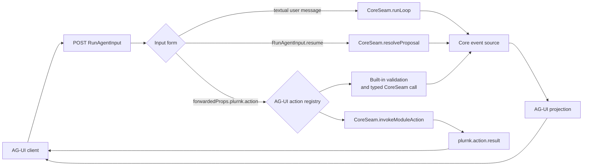

# @plurnk/plurnk-agui — the projection contract

The module is the daemon's external client interface. It consumes core's
in-process module seam and emits the Agent-User Interaction Protocol over
HTTP/SSE. Core's numbers and semantics pass through; the module does not
recompute them.

## Architecture

- §agui-daemon-client **The module is an in-process plugin of the daemon** — activated
  at boot (`registerModule` → the core seam handle); it opens the AG-UI+ listener and owns
  the client interface. No WebSocket, no separate process.
- §agui-thread-binding **A PLURNK workspace is the world; an AG-UI thread is a conversation over it**
  — the lifecycle vocabulary is defined by service {§lifecycle-terms}. PLURNK's machine model ({§machine-processes}) splits the world (a workspace: one
  curated workspace) from the CONVERSATION (a worker: a history over that world). AG-UI's workspace
  concept is the workspace, selected by name, VERBATIM, via `forwardedProps.plurnk.workspace`
  (attach if it exists, create with exactly that name otherwise — no prefix, no forging). The
  workspace is REQUIRED: a worker has no existence without a world, so its absence is a contract
  violation the module rejects (400) - never a workspace forged from the `threadId`. The
  `threadId` is the conversation over that world, and the name is the identity at
  BOTH levels: `threadId` == the workspace name binds the workspace's model worker (the default
  conversation, `ensureModelWorker` — origin identifies it, never a name parse); a DISTINCT
  `threadId` names its own conversation worker — found by name if it exists (forks and prior
  conversations are addressable as threads), minted via `createConversationWorker` (svc#366)
  if it doesn't. World-scoped actions (`loop.inject`, `loop.cancel`, `log.read` default,
  `run.fork`) operate on the THREAD's conversation, never blindly on the model worker.
  Extended context persists across AG-UI Runs because the worker's log does.
- §agui-run-authority **AG-UI owns the client lifecycle** — `threadId`, `runId`,
  `RUN_STARTED`, `RUN_FINISHED`, `RUN_ERROR`, interrupt outcomes, and `RunAgentInput.resume`
  follow the official `@ag-ui/core` schemas. PLURNK does not maintain a parallel client
  lifecycle dialect. PLURNK owns the internal worker/loop/turn topology and projects it
  through standard events plus namespaced `plurnk.*` extensions.

## §agui-projection The projection

One accepted Run or daemon notification produces zero-or-more AG-UI events:

| plurnk wire                                | AG-UI events |
| ------------------------------------------ | ------------ |
| schema-valid `RunAgentInput`               | `RUN_STARTED` + initial `STATE_SNAPSHOT` |
| `log/entry` turn boundary                  | `STEP_FINISHED` + `STEP_STARTED` (`turn-<id>`) |
| `log/entry` op=PLAN (model)                | `ACTIVITY_SNAPSHOT` {§agui-plan-activity} |
| `log/entry` op=SEND (model)                | `TEXT_MESSAGE_START/CONTENT/END` + `CUSTOM plurnk.send` (signal/status) |
| `log/entry` other op (model)               | `TOOL_CALL_START/ARGS/END` (+ `TOOL_CALL_RESULT` when rx exists) |
| `log/entry` op=model (mirror)              | A correlated `REASONING_START` / `REASONING_ENCRYPTED_VALUE`* / `REASONING_END` span when the reasoning-item `attrs.reasoning` is present (see {§agui-encrypted-reasoning}); otherwise nothing — forensic. |
| `log/entry` origin≠model                   | `CUSTOM plurnk.ambient` (foists, deltas, narrations) |
| `loop/proposal`                            | `TOOL_CALL_START/ARGS/END`, then `RUN_FINISHED` with an interrupt outcome |
| `loop/terminated`                          | `STATE_DELTA` (budget) + `CUSTOM plurnk.terminated` + `RAW` (the provider's native completion frame, `source: provider`, §475) + `RUN_FINISHED` (`result.status === 200`) or `RUN_ERROR` (otherwise, from the exact RFC 9457 Problem Details) |
| transport failure after SSE opens          | `CUSTOM plurnk.problem` (exact Problem Details) + `RUN_ERROR` (`code` = Problem `type`, `message` = Problem `detail`) |
| `notice/event`                             | `CUSTOM plurnk.notice` |
| `stream/event` + `stream/concluded`        | `CUSTOM plurnk.stream` + `ACTIVITY_SNAPSHOT` (the standard background-activity channel: `activityType` = the scheme, replace-snapshot, §475). A conclusion preserves its exact universal `result`, including RFC 9457 Problem Details; AG-UI does not reconstruct failure from a status or summary. |
| `workspace/branch-batch`                   | `CUSTOM plurnk.branch_batch` with the daemon's full queued/running/completed/failed/recovery-required lifecycle payload |

§agui-plan-activity **PLAN is activity, not reasoning.** PLAN is the model's public,
durable statement of intended goals. Provider reasoning is a separate channel, so PLAN
never projects into AG-UI `REASONING_*` events. Live delivery and reattach preserve the
same log identity and verbatim goals:

| Projection | Standard representation |
| ---------- | ----------------------- |
| live       | `ACTIVITY_SNAPSHOT { messageId: coordinate ?? id, activityType: "PLAN", content: { goals: body }, replace: true }` |
| reattach   | `ActivityMessage { id: coordinate ?? id, role: "activity", activityType: "PLAN", content: { goals: body } }` inside `MESSAGES_SNAPSHOT` |

- **An op row IS a tool call** — its `coordinate` is the `toolCallId`, its tx the args (one
  delta: a dispatched plurnk op is atomic), its rx the result. The log-shaped richness the
  core vocabulary can't hold (fold state, tags, tokens) stays on the row inside
  `plurnk.ambient`/`TOOL_CALL_RESULT` payloads.
- §agui-encrypted-reasoning **Encrypted reasoning projects only when it is
  correlated.** Core supplies an item list on the model mirror row's
  `attrs.reasoning`; AG-UI does not invent identity or classification.

  | Input fact                                    | Projection |
  | --------------------------------------------- | ---------- |
  | String `id`; subtype `message` or `tool-call` | One `REASONING_START`, `REASONING_ENCRYPTED_VALUE`, and `REASONING_END` span keyed by that `id`. |
  | Null/missing `id` or unknown `subtype`        | No reasoning event; an uncorrelatable item is dropped rather than coerced. |
  | Encrypted `data`                              | Forwarded as the standard encrypted value without decoding. |
  | Provider `format`                             | Retained on the lossless row because AG-UI has no corresponding field. |

  #44 owns the unresolved provider-boundary evidence required to normalize an
  item's identity and subtype before it reaches this projection.
- §agui-custom-namespace **The custom namespace** — plurnk-specific metadata rides
  `CUSTOM` events named `plurnk.*` (`plurnk.send`, `plurnk.ambient`,
  `plurnk.notice`, `plurnk.stream`, `plurnk.branch_batch`, `plurnk.terminated` — the full loop
  outcome the budget `STATE_DELTA` can't hold). Generic frontends skip unknown customs; plurnk-aware frontends render
  them richly. Nothing plurnk-specific ever masquerades as a core event.

§agui-numbers-passthrough **Usage numbers pass through verbatim.** The module
never recomputes the daemon's gauge.

| AG-UI state location                        | Daemon source                            | Meaning |
|:--------------------------------------------|:-----------------------------------------|:--------|
| `snapshot.plurnk.providers[*].promptBudget` | `providers.list.aliases[*]`              | Each provider alias's effective model-facing prompt ceiling, or `null` when unknown. |
| `STATE_DELTA /budget/contextTokens`         | `loop/terminated.usage.contextTokens`    | Latest turn's provider-reported prompt occupancy. |
| `STATE_DELTA /budget/promptBudget`          | `loop/terminated.usage.promptBudget`     | Latest turn's effective model-facing prompt ceiling, or `null` when unknown. |
| `STATE_DELTA /budget/promptTokens`          | `loop/terminated.usage.promptTokens`     | Loop-total provider-reported prompt usage. |
| `STATE_DELTA /budget/completionTokens`      | `loop/terminated.usage.completionTokens` | Loop-total provider-reported completion usage. |

- §agui-row-channel **The row channel** — every log row ALSO rides `CUSTOM plurnk.row`
  carrying the full wire entry (fold state, tags-in-signal, tokens, coordinate) alongside its
  core projection. Rich clients (TUI/nvim) render plurnk-native fidelity from `plurnk.row`;
  generic clients never see the difference. This is the metadata channel the exclusive-portal
  migration stands on.
- **The gauge starts true** — `RUN_STARTED` is followed by a `STATE_SNAPSHOT` carrying the
  daemon's `providers.list` truth (the effective prompt budget, the active model), then
  `STATE_DELTA`s. A dropped SSE stream cancels the loop (`loop.cancel`) — the frontend hanging
  up IS the abort signal; no worker is orphaned unwatched.

- §agui-replay **Reattach replays** — a rediscovered thread (the module restarted, a second
  frontend arrived) attaches to its existing workspace by name→id and opens ORIENTED: the model
  worker's PLAN activities and SEND speech replay as `MESSAGES_SNAPSHOT`; everything else stays
  reachable via live `plurnk.row`. Pending proposals remain durable and are presented as
  interrupts when the owning conversation is resumed; a days-old question is discoverable,
  never converted into a mystery hang.

## §agui-proposal-resolve Stop-the-world

Every client-owned daemon proposal - file edits and `[300]` operator questions
(service#346) — emits an AG-UI tool call and terminates AG-UI Run A with
`RUN_FINISHED.outcome.type = "interrupt"`. The durable loop remains paused indefinitely
by default; absence is not an answer. AG-UI Run B on the same thread supplies standard
`RunAgentInput.resume` entries. Each entry correlates through `interruptId = toolCallId =
"prop:<logEntryId>"`; the module resolves every pending interrupt for that worker, binds
AG-UI Run B to the persisted loop, and releases it. A resume containing foreign, partial, or
multi-worker interrupt sets fails before any proposal is released.

## §agui-management-plane The action surface

PLURNK has three inputs through the one AG-UI Run endpoint. A normal user message
and a standard proposal resume are not management actions and have no invented
`loop.run` or `loop.resolve` action names.



A management-action Run carries
`forwardedProps.plurnk.action = { kind, ...params }`. Once settled, it returns
one `CUSTOM plurnk.action.result` shaped as `{ kind, ok, result | problem }`,
followed by `RUN_FINISHED`. A proposal-gated action may first end with an
interrupt and deliver that settled result on the standard resume Run. A failed
action preserves exact RFC 9457 Problem Details and is the result of a
successfully transported management Run; it does not turn the Run into
`RUN_ERROR` or invent a parallel error string. Unknown kinds return an honest
`unknown-action` Problem. There is no side-channel endpoint.

| Public action            | Scope     | Parameters                                           | Owner / effect                                                                                                     |
|--------------------------|-----------|------------------------------------------------------|--------------------------------------------------------------------------------------------------------------------|
| `ping`                   | Worldless | none                                                 | AG-UI-local liveness; returns `{}`.                                                                                |
| `discover`               | Worldless | none                                                 | AG-UI-local public membership manifest ({§discovery}).                                                             |
| `providers.list`         | Worldless | none                                                 | `CoreSeam.listProviders`.                                                                                          |
| `workspace.list`         | Worldless | none                                                 | `CoreSeam.listWorkspaces`.                                                                                         |
| `workspace.create`       | Worldless | `name?`, `projectRoot?`, `settings?`, `constraints?` | Creates or attaches the exact named world, or asks core to create an automatically named world.                    |
| `workspace.attach`       | Worldless | `id`, `workerId?`                                    | `CoreSeam.attachWorkspace`; returns the selected envelope.                                                         |
| `workspace.workers`      | Workspace | `id?`                                                | `CoreSeam.listWorkers`; an explicit id overrides the bound workspace.                                              |
| `log.read`               | Workspace | `workerId?`, log-coordinate filters                  | `CoreSeam.readLog`; defaults to the thread's conversation worker.                                                  |
| `loop.inject`            | Workspace | `prompt`                                             | `CoreSeam.runLoop` on the thread's conversation worker; folds into live work or enqueues a loop.                   |
| `loop.cancel`            | Workspace | none                                                 | `CoreSeam.cancelDrain` on the thread's conversation worker.                                                        |
| `workspace.prompts`      | Workspace | `limit?`                                             | `CoreSeam.listPrompts`.                                                                                            |
| `workspace.rename`       | Workspace | `name`                                               | `CoreSeam.renameWorkspace`.                                                                                        |
| `workspace.constrain`    | Workspace | `effect`, `glob`                                     | `CoreSeam.constrain`.                                                                                              |
| `workspace.unconstrain`  | Workspace | `effect`, `glob`                                     | `CoreSeam.unconstrain`.                                                                                            |
| `workspace.constraints`  | Workspace | none                                                 | `CoreSeam.listConstraints`.                                                                                        |
| `workspace.derivation`   | Workspace | none                                                 | `CoreSeam.workspaceDerivationStatus`.                                                                              |
| `entry.read`             | Workspace | `target`, `channel?`, `offset?`                      | `CoreSeam.readEntry`.                                                                                              |
| `op.exec`                | Workspace | `command`                                            | Constructs one EXEC statement and calls `CoreSeam.dispatchClientAction` on the client worker.                      |
| `op.parse`               | Workspace | `text`                                               | Parses and projects PLURNK text under {§agui-op-parse}.                                                            |
| `workspace.members`      | Workspace | none                                                 | `CoreSeam.listMembers`.                                                                                            |
| `op.look`                | Workspace | `text`                                               | Admits one LOOK under {§agui-op-look}, rewrites it to READ, and calls core's no-log `look` projection.              |
| `run.fork`               | Workspace | `name?`                                              | `CoreSeam.forkWorker` from the thread's conversation worker.                                                       |
| Registered module action | Worldless | owner-defined                                        | `CoreSeam.invokeModuleAction`; the handler receives only the supplied params and owns their validation and result. |

### §agui-op-parse Parsed-operation projection

`op.parse` dispatches all trusted-prefix statements as one client action and
preserves the parser's source order in its `results` array:

| Parser output                                  | AG-UI result                                                                                                                                         |
|------------------------------------------------|------------------------------------------------------------------------------------------------------------------------------------------------------|
| Statement before the tail boundary             | Its corresponding `CoreSeam.dispatchClientAction` result in the statement's position                                                                 |
| Bounded hard error                             | A 400 `agui/action/parse-failed` result in the error's position, preserving parser detail, line, column, source, and severity                        |
| `unparsedTail` under {§unparsed-tail-boundary} | Exactly one final 400 `agui/action/parse-failed` result with its verbatim reason and position, `source: "grammar"`, and no adapter-authored recovery |
| Text item                                      | No result; text is not dispatchable                                                                                                                  |

No statement at or beyond the tail boundary is dispatched. Every parse failure
uses `stage: "parsing"` and `retryable: false`.

### §agui-op-look Single-statement observation admission

`op.look` admits a parser result only when it contains exactly one LOOK
statement, no other item, and no `unparsedTail`. Hidden surrounding whitespace
is not an item. The action never selects a trusted prefix or silently discards
a parser fact.

| Parser result                                       | AG-UI outcome                                                                                                                      |
|-----------------------------------------------------|------------------------------------------------------------------------------------------------------------------------------------|
| First positioned diagnostic                         | 400 `agui/action/parse-failed`, preserving parser detail, line, column, source, and severity                                       |
| No diagnostic, with `unparsedTail`                  | 400 `agui/action/parse-failed`, preserving its reason and position with `source: "grammar"` and `severity: "error"`                |
| Text item, zero or multiple statements, or non-LOOK | 400 `agui/action/invalid-action-parameters` naming the observed admission fact                                                     |
| Exactly one LOOK and no other parser fact           | Change only `op` to READ and call `CoreSeam.look` under {§op-look}; return its exact `OperationResult` through the action envelope |

Parser failures use `stage: "parsing"`; action-shape failures use
`stage: "action-validation"`. Both are non-retryable.

§agui-module-actions **One public action namespace.** Core rejects empty and
duplicate extension registrations ({§module-action-registration}). At module
startup AG-UI rejects any extension name colliding with a built-in before it
opens the listener. A recognized Problem thrown by an extension crosses the
boundary unchanged; an unexpected handler exception becomes the generic
`action-failed` Problem without exposing private exception text.

### §discovery Discovery membership

The `discover` action returns membership, not a parallel description or schema
system:

```ts
type Discovery = {
    methods: Record<string, true>;
    notifications: Record<string, true>;
};
```

`methods` contains the 22 built-ins in the table plus every registered module
action. `notifications` contains exactly these externally projected daemon
event families:

| Notification |
|--------------|
| `log/entry` |
| `loop/terminated` |
| `loop/proposal` |
| `notice/event` |
| `stream/event` |
| `stream/concluded` |
| `workspace/branch-batch` |

Discovery does not report parameter pseudo-schemas, plugin catalogs, package
versions, or update availability. Object key order is not a contract.

`loop.inject`'s steered effect streams on the original worker's open SSE.
`loop.cancel` is its counterpart: the addressable spelling of the SSE-hangup
abort. An action that opens a stream remains one live AG-UI Run; its result is
held until every observed stream emits `stream/concluded`, then the result and
`RUN_FINISHED` close that Run. A client disconnect before settlement cancels
the action worker with reason `client_disconnected`; it never silently converts
the action into detached background work.

## §agui-topology-scope Topology scope

The workspace broadcast carries EVERY worker's rows (workers, the plurnk worker, siblings);
only the thread's model worker projects onto the core vocabulary. Foreign-worker rows ride
`plurnk.row`/`plurnk.ambient` — visible to rich clients as topology, never interleaved
into the conversation a generic frontend renders.

## §agui-broadcast-fan Event fan and AG-UI Run settlement

Workspace information fans to every open AG-UI Run: ambient rows and stream activity
remain visible across the workspace, with each SSE
using its own render router. Terminal control does not fan. A message AG-UI Run binds
to the exact `loopId` returned by `CoreSeam.runLoop`; a proposal-resume AG-UI Run binds to the
pending proposal's persisted `loopId` before resolving it. Only that loop's
`loop/terminated` event may emit `plurnk.terminated` and close the SSE.
The custom event preserves the daemon's exact universal `result`; failures use
the Problem `type` as the AG-UI error code and `detail` as its message. The
module never reconstructs a failure from a status, summary, or exception text.
Proposal tool calls and interrupt outcomes route only to the proposal's owning
worker; interrupting sibling AG-UI Runs would violate AG-UI Run identity. Terminations
that race ahead of the `runLoop` acknowledgement are held until
the loop identity is known. A sibling, child, or concurrent loop can therefore
remain visible as topology without ending or relabelling this AG-UI Run.

Two consequences the module owns and a client must handle:

- **Multiplicity.** Workspace stream information may arrive on every open AG-UI Run. A client
  that funnels all AG-UI Runs
  through one shared handler (e.g. a single dispatch) must serialize its management Runs —
  one action in flight, the rest queued — or a background action's stream steals the shared
  slot. Both first-party clients do exactly this (nvim's management lane, svc#504).
- **No silent drop.** Workspace information never routes to a lone last-binder — a regression to that
  shape is what svc#504 reported (a client-side single-slot handler, since fixed) and is
  pinned against here.

## §agui-run-endpoint The AG-UI Run endpoint

`POST /` (or `/agui`) accepts a schema-valid AG-UI `RunAgentInput`: the last textual
`user` message becomes the
`CoreSeam.runLoop` prompt (`maxTurns`/`flags.auto` from the forwarded PLURNK
properties or module defaults); the response is `text/event-stream`,
one `data:` line per event, ending after `RUN_FINISHED`/`RUN_ERROR`. Multimodal user content
is rejected until the model-loop seam supports it deliberately. Loop auto never answers
a question — that is the daemon's own rule; the module inherits it.

§agui-http-authorization When `PLURNK_AGUI_TOKEN` is non-empty, every
non-preflight request must carry that exact value as an
`authorization: Bearer <token>` header. Authorization precedes request-body
reading. A missing or mismatched credential returns the stable 401
`bearer-token-required` Problem.

Failures before SSE headers are sent use `application/problem+json` with exact
RFC 9457 Problem Details. Once SSE has opened, `CUSTOM plurnk.problem` preserves
that same object and `RUN_ERROR` maps it to the standard AG-UI fields. The custom
event and `plurnk.terminated.result.problem` are lossless; `RUN_ERROR.code` and
`message` are the required standard projection, not a second failure object.
Consumers preserve the exact Problem from the lossless surface and never
reconstruct one from `RUN_ERROR`.
