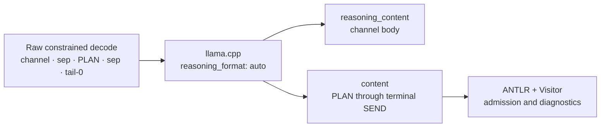

# PLURNK Contracts Specification

## 1. Overview

§contract-authority This package is the single authority for PLURNK's language, schemas, generated
types, parser, model rail, and runtime-neutral wire envelopes. Its package root
is the single code API for those contracts.

| Surface | Canonical export/artifact |
|---|---|
| Parser, AST, validators, Problems, results, Notices, text regions | `@plurnk/plurnk-contracts` |
| JSON Schemas | `@plurnk/plurnk-contracts/schema/*.json` |
| Local-model rail | `@plurnk/plurnk-contracts/plurnk.gbnf` |
| Model language reference | `plurnk.md` in the package |

§contract-representations JSON Schema is authoritative for shared data shapes. TypeScript types are
generated from the schemas; ANTLR is authoritative for accepted model-language
syntax; GBNF remains the bounded generation aid described in §1.2.


Plurnk extends HEREDOC formatting into a state-machine grammar for LLM
agents. Every plurnk statement is a single self-contained operation: a
canonical open tag, an optional payload, and a colon-fenced opaque body
terminated by a matching close tag. Statements are flat — there is no
composition or substitution. Documents may contain arbitrary
interstatement text, which the parser captures verbatim and surfaces
to consumers without imposing meaning on it.

The parser produces a typed AST (per OP discriminated union) plus a
list of structured errors. Both are JSON-serializable. Errors are
per-statement; the parser recovers at statement boundaries when it
can, and surfaces an `unparsedTail` when a boundary-destroying error
prevents further recovery. See §12 for the consumer contract.

Note: SEND status codes (§9) are a *protocol-level* convention for
SEND statements emitted by the model and runtime. They are unrelated
to parse-time `PlurnkParseError` objects produced by this package (§14).

## 1.1 Domain Boundary

The grammar is purely syntactic. A rule belongs in the grammar if and
only if it can be expressed as a shape constraint on character
sequences. A rule has crossed into runtime as soon as it requires any
of:

- **Variables** — state held across statements, named bindings, references to prior values.
- **Magic numbers** — values that carry semantic weight (`410` means "Gone," `200` means "OK"); the grammar accepts the digit string, not its meaning.
- **Embedded code** — executing language fragments to determine well-formedness (compiling a regex, validating an xpath, resolving a URI).

Anything that fits inside that constraint belongs in `.g4`. Anything
that needs interpretation belongs in the runtime resolver.

**Concretely in domain — parser-managed (lexer + parser):**

- Statement structure: open tag, slots, body, close tag.
- Lexical tokens: `<<`, OP keywords, `[…]`, `(…)`, `<N>`, `:`, body, close tag, interstatement TEXT.
- Slot *shape* constraints: URI shape (scheme grammar + path character class), line-marker integer form, suffix character class, CSV form of `[signal]`.
- HEREDOC discipline: open/close tag character match, body opacity between `:body:` fences, nesting via suffix.
- Whitespace rules (§11).
- Hard constraint: `:OPsuffix` close tag must character-match the open tag's `OPsuffix`.

**Concretely in domain — Visitor-managed (typed AST construction):**

- Extracting `op`, `suffix`, `signal` (split on comma), `path` (raw),
  `lineMarker` (parsed ordered numeric components), and `body`
  from the parse tree into a typed discriminated union.
- Native-JS validation of slot contents where useful (e.g., `new URL()`
  for path, `new RegExp()` for regex bodies). This is preferred over
  ANTLR sub-grammars for URI/regex/xpath/jsonpath — Node's built-ins are
  authoritative, well-tested, and zero-cost to invoke.

**Concretely out of domain — runtime:**

- URI resolution: what `worker:///`, `worker://<name>/`, `file://` actually point at; what bare paths resolve to.
- Tag-matching combination (AND/OR), tag-set semantics.
- Line-marker arithmetic, out-of-range handling, result-set ordering for pagination.
- Status code *meanings*: any digit string is grammatically valid in `[signal]`; whether `[410]` means "Gone" or any code carries privileged semantics on any OP is runtime convention.
- Empty-body semantics (e.g., empty EDIT clears the entry).
- EXEC body execution: runtime selection, sandboxing, permissions.
- Filter composition (how OPEN/FOLD combine path × tag × body filters).
- Output shape returned to the model after a statement executes. The §4 Per-OP Output table documents convention, not grammar rules.

## 1.2 GBNF Generation Rail

§gbnf-rail-purpose The ANTLR parser and Visitor define the PLURNK language. The generated
`dist/plurnk.gbnf` is an optional local llama.cpp sampling rail: it is kept lean
to make useful, ANTLR-compliant turns more likely without reproducing every
parser or semantic validator. Parse compatibility is a design goal balanced
against rail size and sampling efficiency, not a language-subset guarantee. A
rail-legal operation can therefore produce a parser/Visitor error; consumers
apply their ordinary admission and bounded-operation recovery contract.


The shipped raw turn has one shape:

```ebnf
root-turn ::= channel sep plan sep tail-0
```

§gbnf-turn-shape `channel` is exactly one byte-zero Gemma Harmony enclosure beginning
`<|channel>thought\n` and ending `<channel|>`. Its body may be empty but cannot
contain another opener or the closer. `sep` is zero through seven whitespace
characters. No channel is legal after the leading one. `tail-0` is unchanged
apart from that removal: zero through fourteen internal statements, separated
only by `sep`, followed by exactly one terminal SEND under the existing terminal
eligibility rules.



§gbnf-reasoning-boundary GBNF applies to the raw sentence on the left, before projection. The two
projected fields are not separate GBNF languages and `content` alone is not
revalidated as though it still contained the required channel. Provider and
core own the projection evidence and rail-verdict boundary; this package owns
only the raw language and the parser/Visitor result.

## 2. Canonical Statement Form

```
<<OPsuffix [signal]? (path)? <L>? : body? :OPsuffix
```

The `:` characters fence the body. Everything between the opening `:`
and the closing `:OPsuffix` literal is body, verbatim. This is what
makes plurnk solve grammatical enclosure: body content is fully opaque
to OP keywords, modifier-like characters, and the protocol's own
syntax.

Optionality:

| Element     | Status        |
|-------------|---------------|
| `<<`        | required      |
| `OP`        | required      |
| `suffix`    | optional; used for nesting and `:OPkeyword` escape (see §8) |
| `[signal]`  | optional, OP-dependent contents |
| `(path)`    | required for all OPs except SEND (recipient), EXEC (cwd), and PLAN (no operand), where it is optional; WORK/FORK require a `worker://` target naming the child |
| `<L>`       | optional; single position or range (see §7) |
| `:`         | required (header → body delimiter) |
| `body`      | optional, OP-dependent meaning |
| `:OPsuffix` | required (close tag: `:` + open tag's OP and suffix, character-matching) |

Hard constraints:

- §close-tag-match Close-tag `:OPsuffix` must character-match the open tag's `OPsuffix`.
- Header elements appear in the order shown above (signal, then path, then `<L>`, then `:`).

The per-operation grammar omits slots that do not exist for that operation;
OPEN, FOLD, WORK, FORK, and KILL admit no `<L>` marker. Other value-domain
restrictions are runtime concerns.

## 3. Lexical Elements

- `<<` — open delimiter.
- `OP` — exactly one of: `FIND`, `READ`, `EDIT`, `COPY`, `MOVE`, `OPEN`, `FOLD`, `SEND`, `EXEC`, `WORK`, `FORK`, `KILL`, `PLAN`. (Exported as the `PLURNK_OPS` const; see §12.)
- `suffix` — `[A-Za-z0-9_]*` immediately concatenated to `OP`, no separator.
- `[` … `]` — signal slot; contents are OP-dependent (see §4).
- `(` … `)` — path slot; contents are a URI (see §5).
- `<L>` — the scope marker (canon vocabulary: `<scope>`; AST field: `lineMarker`). One or more signed numeric components, comma- or dash-separated, decimals admitted — full shape and arity in §7.
- `:` — body delimiter. Appears between header and body, and (with the OP+suffix following) at the close.
- `body` — opaque byte stream between the opening `:` and the matching close tag `:OPsuffix`.
- `:OPsuffix` close — `:` immediately followed by the open tag's `OP` and `suffix` (character-matching, no whitespace).

## 4. Per-OP Semantics

| OP     | `[signal]`        | `(path)` | `body`                  | `<scope>`     |
|--------|-------------------|----------|-------------------------|---------------|
| FIND   | tag filter (CSV)  | required | pattern matcher         | result-set pagination |
| READ   | tag filter (CSV)  | required | pattern matcher         | text region |
| EDIT   | tags (CSV)        | required | content (empty body deletes the selected region) | text region |
| COPY   | tags to apply (CSV) | required | destination `ResourceSelection` | source text region |
| MOVE   | tags to apply (CSV) | required | destination `ResourceSelection` | source text region |
| OPEN   | tag filter (CSV)  | required | optional pattern matcher | none |
| FOLD   | tags to apply (CSV) | required | optional pattern matcher | none |
| SEND   | operation code (optional integer; pathless terminal dispositions use §9) | optional (recipient) | message payload (JSON by convention for structured responses) | `<timeout, poll>` — the wait park on a terminal `[202]` (see §7, §9) |
| EXEC   | registered executable tool (single string; `sh` default) | optional (cwd) | executor-specific input | `<timeout, poll>` — spawn lifetime cap + poll cadence |
| WORK   | optional Git branch ref (single string) | required `worker://` target naming the fresh worker | task prompt for the worker's first loop | none (parses as null) |
| FORK   | optional Git branch ref (single string) | required `worker://` target naming the context branch | prompt for the context-inheriting worker | none (parses as null) |
| KILL   | operation code (optional integer; target-specific) | required | opaque annotation (logged, no runtime meaning) | not applicable |
| PLAN   | tag filter (CSV; parse-side, canon is slotless) | optional (parse-side; canon is slotless) | intended goals {§plan-intended-goals} | parse-side only |

§operation-code-polymorphism SEND and KILL share a numeric wire slot, not one universal numeric vocabulary.
For pathless terminal SEND, the code is the loop disposition defined in §9.
Directed SEND and KILL delegate any present code to the addressed target's
operation contract; a live process may interpret a KILL code as a Unix signal,
but that interpretation does not define KILL generally.

§plan-intended-goals **PLAN records intended goals.** The PLAN body is the model's
concise statement of intended goals. It is public, durable log content—not provider
reasoning. Dispatch records it and has no other runtime effect.

The `<L>` slot is optional where admitted and its domain is OP-specific. FIND
scopes ordered results. EXEC and SEND scope timing. READ, EDIT, COPY, and
MOVE use one universal text algebra independent of mimetype:

| Arity | Surface meaning | Endpoint rule |
|---|---|---|
| one integer | one whole physical line, or the documented `0`/`-1` mutation anchor | exactly one ordinal line |
| two integers | whole physical lines `firstLine..lastLine` | both lines are included |
| four integers | exact `startLine,startColumn,endLine,endColumn` region | start included, end excluded; equality is zero-width |

§text-scope-semantics Exact regions use 1-based lines and Unicode code-point columns. One- and
two-integer line selections normalize to the same exclusive-end `TextRegion`
used by four-coordinate selections. Whole-line replacement deliberately
accounts for newline separators; it is an ergonomic projection over exact
replacement, not a different mimetype navigation mode. Other arities and
decimal text coordinates are runtime 416 failures.

For READ, a body matcher selects resources against their complete readable
content. A non-semantic `<L>` then projects text from each selected
resource; it never paginates the match set or limits where the matcher searches.
Without `<L>`, READ returns each selected resource's complete readable content.
Semantic READ reserves a leading decimal for an optional similarity threshold;
the remaining one, two, or four integers project text. Without a leading decimal, every
integer belongs to READ projection and selection uses the configured default.

Mutation semantics:

- No `<L>`, target does NOT exist: CREATE - the body becomes the new file/entry contents (an empty body creates an empty resource). This is the only unscoped EDIT.
- §unscoped-edit-create-only No `<L>`, target EXISTS: REFUSED - an unscoped EDIT must never modify existing content. Use a text scope or `<1,-1>` to replace wholesale. The parser cannot know whether the target exists, so core owns this decision.
- `<N>` (single position) + body: replace the single line at `N` with body.
- `<N-M>` (range) + body: replace lines `N..M` inclusive with body.
- A selected position or range + empty body: delete the selection.
- `<0>` + body: prepend body before line 1.
- `<-1>` + body: append body after the last line.
- `<SL,SC,EL,EC>` + body: delete the exact exclusive-end region, then insert body at its start.
- COPY and MOVE parse their body as a destination `ResourceSelection`: a path plus an optional trailing destination scope. The header path/fragment/scope selects one source resource, channel, and region; the body independently selects the destination.

### Per-OP Output (what each OP produces)

| OP   | Produces |
|------|----------|
| FIND | One catalog object per selected resource; matcher rows add `matches`, an array of optional structural locators and honest exact/enclosing text regions |
| READ | One complete or explicitly scoped body per selected resource, plus the same `matches` navigation evidence |
| EDIT | status plus a bounded receipt for the effect that landed |
| COPY | source and destination selections, status, then ordered applied destination effects |
| MOVE | source and destination selections, status, then ordered applied destination and source effects |
| OPEN | status; list of log items opened |
| FOLD | status; list of log items folded |
| SEND | status; recipient ack if applicable |
| EXEC | output stream channels (`#stdout`, `#stderr`), arriving on later turns |
| WORK | spawn ack; untagged workers execute concurrently, while `[branch]` workers enter the service's serialized Git batch; the deliverable arrives as a log delta |
| FORK | spawn ack; inherits the parent's context; an untagged worker executes concurrently, while `[branch]` enters the serialized Git batch |
| KILL | status; killed path |
| PLAN | status; logged |

§copy-move-observation COPY and MOVE log projections preserve both admitted operand selections,
including their independent scopes, whether the result changed state, was a
304 no-op, or failed after admission. Operands identify the request; `effects`
describe only mutations that landed. If either operand uses textual scope,
each landed textual create or update carries the same bounded receipt used by
EDIT. Whole-channel and binary transfers remain bodyless structural effects.


Output is delivered to the model in the next turn. The shape of "status"
is a SEND-style status code (see §9) so that errors are uniform across
all OPs.

## 5. Path Grammar

Paths are URI-shaped, drawn from RFC 3986 in spirit but not strictly.

§worker-name **Worker names as URI authorities (#527).** Under the actor addressing
model the authority slot names a worker (`worker://alice/…`,
`jq://child3/…`). The mintable-name contract is the exported
`WORKER_NAME` constant — a lowercase DNS label (LDH:
`[a-z0-9]([a-z0-9-]{0,61}[a-z0-9])?`), the hostname shape the slot's
pretraining prior expects. Lowercase-only is load-bearing:
non-special-scheme URL parsing PRESERVES authority case
(`worker://Alice` ≠ `worker://alice`), so admitting case would mint
look-alike principals. `RESERVED_AUTHORITIES` (`plurnk`, the kernel;
`self`, which would impersonate the `~` idiom) are
resolver-interpreted, never mintable; `~` (self) is reserved by
construction — outside the alphabet. Id-freedom is the GENERATOR's
contract (core), not the charset's: no alphabet distinguishes
hash-like. The parser stays permissive — it decomposes ANY authority
(http hosts are arbitrary); this contract governs minting and registry
validation, not ingestion.

Two RFC concessions justify the relaxation:

1. RFC 3986 lists `)` as a sub-delim — a valid path character. Plurnk
   uses a depth-zero `)` to close the path slot. The parser tolerates balanced
   parentheses, so `(https://en.wikipedia.org/wiki/Mercury_(planet))` is
   understandable input, but the canonical wire spelling percent-encodes every
   path parenthesis (`%28` / `%29`). Producers render external addresses that
   way before presenting them to the model, and the generation rail admits only
   that spelling. Unbalanced literal parentheses cannot be distinguished from
   the outer slot syntax and therefore require encoding.
   For *matching* a parenthesized name, a glob such as
   `Mercury_*planet*` is the natural form.
2. Bulk Pattern Matching extends path segments with glob
   metacharacters (`*`, `**`, `?`, `[…]`) that fall outside the RFC
   character set.

Lexer-enforced shape:

- Optional scheme: `[a-z][a-z0-9+.-]*` followed by `://`.
- Path content: any character except `)`, `<`, and newline. A literal
  `)` closes the slot (percent-encode to embed one).
- Glob metacharacters in path segments are permitted.

Runtime-enforced semantics:

- Bare paths (no scheme) resolve as `file://` at runtime.
- Conventional schemes include `worker:///`, `prompt:///`, `log:///`,
  `file://`, `http://`, `https://`. Any scheme matching the lexer
  shape is grammatically valid; resolution is a runtime concern. The
  scheme catalogue and per-scheme semantics — and their packet-time
  teaching to the model — are owned by the schemes module, not this
  grammar; that is why plurnk.md carries no scheme list.
- Percent-encoding, authority structure, port range, and other RFC
  3986 finer points are validated by the runtime URI resolver, not
  the parser.

## 6. Bulk Pattern Matching

§matcher-prefix-claims For FIND, READ, OPEN, and FOLD, `body` is an optional pattern matcher.
The lexer captures the body opaquely (between the `:body:` fences) —
dialect dispatch is not a lexer concern. Dialect is determined by the
body's leading characters and validated by the Visitor using native
JS facilities where applicable. **The leading prefix CLAIMS its
dialect** (#59): a claimed body that fails its dialect's parse is a
positioned `"visitor"` error, never a silent glob fallback — the
fallback converted a model's syntax fumble into a lying no-matches
result. Glob is the no-prefix dialect only.

| Leading prefix | Dialect   | Canonical form            | Validation         |
|----------------|-----------|---------------------------|--------------------|
| `//`           | xpath     | `//…`                     | `xpath.parse()` in Visitor; error on failure |
| `/`            | regex     | `/pattern/flags` (closing `/` required; `\/` escapes a literal slash) | `new RegExp()` in Visitor; error on failure |
| `$`            | jsonpath  | `$…`                      | `JSONPath()` in Visitor; error on failure |
| `~`            | semantic  | `~phrase`                 | none — any text is a valid query |
| `@`            | graph     | `@symbol`, `@<symbol`, `@>symbol` | none — resolved service-side |
| otherwise      | glob      | `…` (literal substring if no metacharacters) | runtime (glob library) |

Dialect conventions (the Visitor uses these to construct typed AST
body fields; the lexer is unaware):

- Regex is the standard ECMAScript `/pattern/flags` literal. Its body
  slot is structurally separate from the target path, so a rooted path
  cannot collide with it. Escape a literal delimiter as `\/`.
- XPath begins with `//` (descendant-or-self axis) and is classified
  before the single-slash regex prefix.
- Regex anchors and flag semantics follow ECMAScript.
- Semantic body is a free-text similarity query. With no `<scope>`, the
  consumer chooses its default result count; an integer overrides that count,
  while threshold and range narrowing ride `<scope>` (§7).
- Graph body is a code-graph reference query: `@symbol` (neighborhood),
  `@<symbol` (inbound references), `@>symbol` (outbound references).
  No parse step in grammar; resolution is service-side.
- Glob is the catch-all and includes the literal-substring case when
  no metacharacters are present.

**Implemented validation in the Visitor (Node-native):**

- **Path**: the Visitor distinguishes local paths from URLs by the
  presence of a scheme prefix (`[a-z][a-z0-9+.-]*://`). Local paths
  (filesystem-style, no scheme) are stored as `{ kind: "local", raw }`
  without further parsing — `new URL()` is not invoked, so no URL
  conventions are imposed on what was clearly intended as a local
  reference. URLs are parsed by `new URL(raw)` and decomposed into
  components (`scheme`, `username`, `password`, `hostname`, `port`,
  `pathname`, `search`, `fragment`). Genuine URL-protocol violations
  (malformed authority, unterminated IPv6 brackets, invalid port, etc.)
  produce a `PlurnkParseError` with source `"visitor"`.
- **Regex body** (matcher-body OPs only, leading `/`): the Visitor
  splits `/pattern/flags` (respecting escapes and character classes) and
  calls `new RegExp(pattern, flags)`. An unclosed literal and an invalid
  pattern/flags pair produce distinct `"visitor"` errors (the latter
  carries the library's own detail, e.g. `Invalid flags supplied to
  RegExp constructor 'i:'`). An unclosed literal states the required
  `/pattern/flags` form; invalid flags state that only ECMAScript flags may
  follow the delimiter and that a literal slash inside the pattern uses `\/`.
- **XPath body** (matcher-body OPs only, leading `//`): the Visitor
  calls `xpath.parse()` from the `xpath` npm package (XPath 1.0
  parser-only, no DOM execution). Failure is a `"visitor"` error.
- **JsonPath body** (matcher-body OPs only, leading `$`): the Visitor
  compiles the path with `json-p3` (RFC 9535) — compile-only, no
  document evaluation — the same engine the runtime dispatches
  (#494/#490), so the flag layer and the engine agree by construction.
  Failure is a `"visitor"` error, and RFC strictness means it fires on
  real malformations (`$HOME`, `$.users[`) that the retired
  `jsonpath-plus` check let through leniently.

Errors here are per-statement: sibling statements in the same turn still build.
Consumer admission and recovery are separate contracts; the service's
trustworthy-frame rule is `plurnk-core` {§emission-admission}.

**GBNF notes:**

- §pattern-body-single-line **Pattern bodies are single-line at the rail.**
  The shipped `dist/plurnk.gbnf` forbids literal newlines inside
  FIND/READ/OPEN/FOLD bodies (patterns are single-line by contract; a regex
  matching a newline writes the two-char escape `\n`). This collapses the
  mismatched-close-tag trap (`<<FIND(…):…:READ` leaving the sampler stuck in
  an unclosable body) to a single line. Content bodies
  (EDIT/COPY/MOVE/EXEC/SEND/PLAN/WORK/FORK) remain multiline. The forgiving
  ANTLR ingester also accepts multiline pattern bodies.
- §pattern-body-leading-colon **A matcher body cannot begin with `:` at the
  rail.** This prevents an extra body delimiter from producing the common
  `:::OP` typo. Empty matchers and later colons remain valid; use a regex such
  as `/^:needle/` when the matcher itself must begin with a literal colon.

**Deferred validation:**

- **Glob** bodies — pass through as raw; runtime applies whatever
  glob matcher is appropriate.

**Why not ANTLR sub-grammars for any of these?** Node's `new URL()`
and `new RegExp()` are authoritative, well-tested, and zero-cost to
invoke; `xpath` and `json-p3` (RFC 9535) are the Node parsers for
their respective dialects. ANTLR sub-grammars for any of these would
add hundreds of lines of generated parser code with no validation
benefit over the native or library facilities.

## 7. Scope Markers

A marker limits the scope of its operation - the canon names the
slot `<scope>`; the AST field remains `lineMarker` (a deliberate
vocabulary divergence: the canon is the model's language, the schema is
the versioned wire contract). The referent is OP-specific (see §4
per-OP table): text for READ/EDIT/COPY/MOVE, positions in the matched
result set for FIND, and
`<timeout, poll>` seconds for EXEC (spawn lifetime cap + poll cadence)
and for SEND (the wait park on a terminal `[202]`, §9: `<T>` bounded,
`<T,P>` adds a poll cadence, `<-1>` indefinite). The shipped GBNF
offers the SEND park on `[202]` only — a `[102]` continue is pure at
the rail — while the ANTLR parser tolerates a marker on any SEND
(forgiving ingester; the engine folds it).

**Token shape:** `<` NUM ((`-` | `,` `' '?`) NUM)* `>`, where NUM is
`-?[0-9]+(.[0-9]+)?`. One or more numeric components, comma- or
dash-separated. The parser carries the ordered list verbatim as
`LineMarker.marks: number[]`; assigning roles to the components is the
consumer's job (see arity table).

| Form     | `marks`       | Meaning (consumer interpretation)    |
|----------|---------------|--------------------------------------|
| `<N>`    | `[N]`         | single operation-specific position N |
| `<N,M>` / `<N-M>` | `[N, M]` | inclusive operation-specific range N..M |
| `<SL,SC,EL,EC>` | `[SL, SC, EL, EC]` | exact text region |
| `<0>`    | `[0]`         | prepend anchor (before position 1)   |
| `<-1>`   | `[-1]`        | append anchor (after last position)  |
| `<0.7>`  | `[0.7]`       | semantic similarity threshold in (0,1) |
| `<0.7,10>` | `[0.7, 10]` | threshold + position (FIND result 10; READ line 10) |
| `<0.7,10,20>` | `[0.7, 10, 20]` | threshold + range (FIND results 10..20; READ lines 10..20) |
| `<0.7,12,5,12,20>` | `[0.7, 12, 5, 12, 20]` | threshold + exact READ text region |

Examples involving negative integers:

- `<-1-5>` — `[-1, 5]` (dash separator; the following number is positive)
- `<0,-5>` — `[0, -5]` (comma separator admits a negative second number)
- `<-3,-1>` — `[-3, -1]`

§scope-marker-forms **Parsing rule:** greedy. Each component consumes a leading `-` and
digits (plus an optional `.`-fraction) maximally; a `-` or `,`(` `?)
then separates the next. So `<-1-5>` parses as `[-1, 5]` — the first
`-` is the sign of -1, the second `-` is the separator. This falls out
of standard ANTLR longest-match. The dash separator is parse-side only;
the GBNF dictates the comma form.

**Runtime concerns** (not enforced by the parser):

- `N ≥ 1`: 1-indexed position.
- Validity of any specific value (out-of-range, inverted range where
  `N > M`, sentinel meanings beyond the canonical `0`/`-1`) is decided
  per-OP at runtime.
- A decimal is a leading semantic similarity threshold. Text positions are
  integers; a decimal text coordinate is answered with 416 rather than
  rounded or reinterpreted.

**Result-set ordering** (FIND): the runtime must produce a
deterministic order so that `<N-M>` pagination is reproducible. The
choice of ordering is a runtime guarantee, not a parser concern.

## §suffix-discipline 8. Suffix Discipline

The `:body:` fencing handles the vast majority of grammatical-enclosure
concerns: body content is fully opaque to OP keywords and modifier-like
characters. The suffix is reserved for the residual edge case where
body content literally contains the close-tag pattern `:OPkeyword`.
That happens in two scenarios:

1. **Nesting plurnk statements inside a body** (recording a plurnk
   transcript, storing examples, etc.). The inner statement's close
   `:OP` would prematurely terminate the outer's body.
2. **Body content contains `:OPkeyword` as literal text** (e.g., a
   stored JSON object with a value mentioning plurnk syntax).

Suffix rules:

- `suffix` is `[A-Za-z0-9_]*`, concatenated to `OP` with no separator, on both open and close.
- Open `<<OPsuffix` and close `:OPsuffix` must character-match.
- A non-empty suffix on the outer statement ensures its close tag
  (`:OPsuffix`) is distinct from any `:OP` substring that may appear in
  body content (whether as nested plurnk or as literal text).
- The body of a statement cannot contain its own exact close-tag
  literal; choose a suffix that does not collide.
- Empty suffix is the default. Most statements need no suffix.
- Generation-side canon dictates **digit** suffixes (`<<EDIT1 … :EDIT1`)
  so the shipped GBNF (`dist/plurnk.gbnf`) can enumerate close tags —
  the HEREDOC tag match is not context-free. The parser remains
  permissive: any matching `[A-Za-z0-9_]*` suffix is valid.

Example — a nested operation inside a suffixed outer body:

```
<<SEND1[400]:
The following is a quoted plurnk operation, preserved verbatim:
<<SEND[400](worker://reviewer):still working:SEND
:SEND1
```

The inner's `:SEND` close is ordinary body text because the outer close
is `:SEND1`. This rule belongs to the body fence and applies to every
operation, not to EDIT semantics.

## 9. SEND Codes

Pathless terminal SEND disposition codes align with HTTP semantics so that model training
transfers directly:

- `1xx` Informational — continuation; `102 Processing` is the canonical loop-continuation code. Its body states what the model will do next with the submitted operations' results.
- `2xx` Success — `200 OK` is the canonical final-answer code; `202 Accepted` is the obligation-checked wait.
- `3xx` Redirection — `300 Multiple Choices`: a stop-the-world multiple-choice question posed to the user, awaiting their selection (emittable; not base-canon-taught — daemon-activated where an interactive user exists).
- `4xx` Client Error — model-side failure (malformed plurnk, missing path, contract violation); `499` is the model's give-up.
- `5xx` Server Error — runtime or infrastructure failure. Never model-emitted as a terminal: "failed" is an engine verdict.

### §waitpid-dispositions The terminal contract (waitpid)

The model signals one intention per turn — **continue (102)**, **done
(200)**, **wait (202)**, or **give up (499)**, plus the operator-facing
**question (300)** — and the engine verifies the claim against the
loop's live obligations (spawned children, open streams, pending
retrievals); the grammar polices *shape* only. The shape rules ARE
structural:

- §send-mid-reservation The five disposition codes `{102, 200, 202, 300, 499}` lex as a
  distinct `DISPOSITION` token, making a disposition-coded SEND
  **structurally terminal**: a statement after it is a parse error
  (the mid-termination rule), and the GBNF reserves the five from
  mid-position SENDs (`status-mid` is their complement over `DDD`).
  This keeps the grammar's last-SEND model and the dispatcher's
  first-disposition model coincident.
- A **mid** SEND (before the terminal) is comms: statusless, or any
  non-disposition code, targeted or pathless, empty body allowed.
- §terminal-body-nonempty The **terminal** SEND requires a non-empty body — a turn must not
  end empty-handed.
- §park-202-only The **park** rides `[202]` only: `<T>` (wait up to T seconds),
  `<T,P>` (adds a poll cadence, mirroring EXEC's slot), `<-1>`
  (indefinite; the join's own liveness bounds it). See §7 for the
  GBNF-strict / ANTLR-tolerant split.
- §no-idle-102 A **zero-statement turn may not conclude `[102]`** — "continue"
  with nothing submitted is a spin. The GBNF's `tail-0` exits through
  a terminal trie without the `[102]` tail, so the idle turn (`PLAN`
  straight into `SEND[102]`) is unemittable; one statement restores
  the full disposition set. The other four stay legal bare (a zero-op
  `[202]` is the engine's obligation check). ANTLR stays tolerant
  (ingest side). A dispatch-emptied turn — ops emitted but failing
  downstream validation — survives the rail by nature; the engine's
  idle-turn 409 backstops that class.

SEND with no `(path)` broadcasts to the default control channel — the
turn's disposition. SEND with `(path)` directs the message at a
specific recipient URI (a worker, a stream, a peer).

### Response Body Convention

Structured responses (errors, query results, multi-field acknowledgments)
are emitted as **JSON in the SEND body**, so the model can consume them
with the same jsonpath dialect it uses for matching:

```
<<SEND[400](err://lex):{"reason":"unexpected token","position":{"line":47,"column":12},"expected":[")"],"got":"["}:SEND
```

The model retrieves a field with `<<READ(err://lex):$.reason:READ` or
similar. Plain-text bodies remain valid for simple terminal answers
(`<<SEND[200]:Paris:SEND`). The JSON convention is runtime policy; the
grammar treats body as opaque.

## 10. Implementation Notes

- ANTLR4 split follows standard convention: `plurnkLexer.g4` defines
  tokens; `plurnkParser.g4` defines statement structure. Generated
  using `antlr-ng` targeting the `antlr4ng` runtime.
- The body is fenced by `:` on the header side and `:OPsuffix` on the
  close side. The lexer enters body mode when it consumes the opening
  `:` after the last header element. In body mode, the close-tag rule
  uses a semantic predicate (`atColonCloseTag()`) that fires when the
  next characters match `:OPsuffix` exactly. The open tag (`OP +
  suffix`) is captured at statement start and held on the lexer
  instance.
- The body is uniformly opaque at the lexer level (a sequence of
  `BODY_TEXT` tokens). The Visitor reconstructs body content as a
  single string and, per OP semantics, interprets it as content,
  destination URI, payload, command, or matcher.
- Header mode hierarchy: state machine `DEFAULT → OPENED → SIGNAL → POST_SIGNAL → PATH → POST_PATH → POST_L → BODY` tracks which
  header elements remain valid at each position (after signal, signal
  is no longer valid; after path, neither signal nor path; after `<L>`,
  only the `:` body delimiter is valid). Each header mode requires the
  `:` to transition to BODY; no fallback.
- PATH and SIGNAL content reject `<<` (single `<` is permitted inside
  them, double `<<` is the statement-opener prefix and must not appear).
  This prevents a malformed path or signal from silently swallowing the
  next statement.
- Interstatement content (between statements) is captured as `TEXT`
  tokens. The lexer's `TEXT` rule matches any chars that aren't a
  recognized statement opener; a `<<` followed by a non-OP sequence is
  rolled into `TEXT` rather than producing an error.
- Error model: the parser uses ANTLR's `DefaultErrorStrategy` for
  cross-statement recovery (sync to next statement opener on error).
  An error listener records every syntax error as a `PlurnkParseError`
  (line, column, source: `"lexer" | "parser"`, message). The Visitor's
  caller correlates errors to statement positions and emits them in
  the result's `items` array in order.
- Boundary-destroying errors (lexer ends in a non-DEFAULT mode at EOF,
  typically meaning a statement was never closed) surface as
  `unparsedTail` on the parse result. The agent's consumer treats this
  as "the document past this point is unparseable; do not execute
  anything after the last successful item."

## 11. Whitespace and Comments

Plurnk is HEREDOC-disciplined and LLM-tolerant: forgiving where
forgiveness is safe, strict where laxity would corrupt content.

- **Between header elements** (`OPsuffix`, `[signal]`, `(path)`,
  `<L>`, the body-delimiter `:`): whitespace (spaces, tabs, newlines)
  is optional and non-significant.
- **Inside header elements** (between the brackets/parens/angles
  themselves — e.g., inside `[…]`, `(…)`, `<…>`, between `OP` and
  `suffix`): whitespace is forbidden. These are strict tokens.
- **Body interior**: whitespace is preserved verbatim. Body content
  begins at the character immediately after the opening `:` and ends
  immediately before the closing `:OPsuffix`. Leading and trailing
  newlines in body content (common for multi-line bodies written by
  the model) are part of the body; runtime consumers may normalize
  them.
- **Close tag** (`:OPsuffix`): the `:` and the `OPsuffix` must be
  character-adjacent — no whitespace permitted between them. Whitespace
  *before* the close `:` (i.e., trailing whitespace in body) is body
  content, preserved verbatim.

Comments: plurnk has no comment syntax. The protocol is wire-shaped,
not source-shaped. To leave a self-documenting breadcrumb, use
`<<EDIT(worker:///notes/…):…:EDIT` (model-visible) or
`<<SEND[1xx](…):…:SEND` (orchestrator-visible).

## 12. Public API

The entry points are `PlurnkParser.parse` (a model turn), `PlurnkParser.parseStatements` (a bare statement sequence), `PlurnkParser.parseLog` (a multi-turn log), and `PlurnkParser.parseClient` (the client tier — protocol ops plus the client-only utility ops LOOK and BUFF), alongside the AST type union and a top-level `parsePath` helper. The parse surface area:

§turn-shape `PlurnkParser.parse` accepts one model turn: free text before a
required PLAN, only whitespace between and after operations, and a required
terminal SEND. A packet without both anchors is invalid; there is no permissive
fallback. The optional local sampling rail is governed by
{§gbnf-rail-purpose}, {§gbnf-turn-shape}, and {§gbnf-reasoning-boundary}.

§tier-entrypoints `PlurnkParser.parseClient` is the topmost parser tier. It
accepts protocol operations plus the client-only LOOK and BUFF utilities; the
model, statement-sequence, and log entry points reject those utilities.

```typescript
// Parse a model TURN — the `*:PLAN:OPS:SEND[N]` sandwich, enforced entirely by the
// grammar: free text before PLAN, a required PLAN, nothing but whitespace between/after
// ops, and a required terminal SEND. A packet without a PLAN and a terminal SEND is
// invalid. A Plurnk packet IS a turn; there is no permissive fallback.
PlurnkParser.parse(input: string): ParseResult

// Parse a bare sequence of statements — teaching-example collections, single ops,
// documentation snippets. Strict: statements only (whitespace is hidden), no prose, no
// turn shape. Not for model output; use `parse` for that.
PlurnkParser.parseStatements(input: string): ParseResult

// Parse the CLIENT tier — a bare sequence of protocol statements plus the two client-only
// utility ops, LOOK (READ minus the log side effect) and BUFF (pull an editable entry into a
// buffer; the write-back is a later plain EDIT). The topmost subset, one above the model/script
// tiers; never used for model output. The other entry points reject LOOK/BUFF, so a client op
// only parses here. Returns ParseResult<ClientStatement>.
PlurnkParser.parseClient(input: string): ParseResult<ClientStatement>

// Parse a multi-turn LOG — each turn REQUIRES the `<<TURN: … :TURN` wrapping around
// its own PLAN-anchored sandwich. The script/log tier; never used for model output.
PlurnkParser.parseLog(input: string): ParseResult

// Parse a path/URI string into a ParsedPath - the exact decomposition the parser
// applies to every (target) slot.
parsePath(raw: string): ParsedPath | null

// Parse a COPY/MOVE body as a destination path plus an optional trailing scope.
parseResourceSelection(raw: string): ResourceSelection | null

type ParseResult = {
    items: ParseItem[];
    unparsedTail?: { from: Position; reason: string };
};

type ParseItem =
    | { kind: "statement"; statement: PlurnkStatement }
    | { kind: "error"; error: PlurnkParseError }
    | { kind: "text"; text: string; position: Position };

type Position = { line: number; column: number };

// The runtime const is exported alongside the type it derives:
//   const PLURNK_OPS = ["FIND","READ","EDIT","COPY","MOVE","OPEN","FOLD","SEND","EXEC","WORK","FORK","KILL","PLAN"] as const;
type PlurnkOp = (typeof PLURNK_OPS)[number];

type PlurnkStatement =
    | FindStatement | ReadStatement | EditStatement
    | CopyStatement | MoveStatement
    | OpenStatement | FoldStatement
    | SendStatement | ExecStatement
    | WorkStatement | ForkStatement
    | KillStatement | PlanStatement;

// Client tier only (parseClient). LOOK/BUFF are read-shaped — identical fields to
// ReadStatement, differing only in `op`. Kept out of PlurnkOp/PlurnkStatement so the protocol
// AST stays a closed set; client ops never widen the model-facing type.
type ClientOp = "LOOK" | "BUFF";
type ClientStatement = PlurnkStatement | LookStatement | BuffStatement;

interface StatementBase<S> {
    suffix: string;          // empty string if no suffix
    signal: S | null;        // null = no [signal] slot; type S varies per OP (see below)
    target: ParsedPath | null; // parsed (path) slot — the operand URI; null if omitted or empty
    lineMarker: LineMarker | null;
    position: Position;
    // body type varies per OP — declared on each concrete statement (below).
}

interface LineMarker { marks: number[]; } // 1+ ordered components; arity = consumer interpretation

interface ResourceSelection {
    target: ParsedPath;
    lineMarker: LineMarker | null;
}

// Path is local (no scheme) or URL (has scheme). The Visitor decides by matching
// the leading [a-z][a-z0-9+.-]*:// pattern; only URLs are passed through
// `new URL()` for component breakdown. Exact paths and shell globs share this shape.
type ParsedPath = LocalPath | UrlPath;

interface LocalPath {
    kind: "local";
    raw: string;             // filesystem path or other non-URL identifier
}

interface UrlPath {
    kind: "url";
    raw: string;
    scheme: string;          // protocol without trailing ':'
    username: string | null;
    password: string | null;
    hostname: string | null; // the URI authority - under actor addressing, the worker
                             // name (`worker://alice/x` -> "alice"); null when empty
                             // (`worker:///x` -> the commons / scheme default)
    port: number | null;
    pathname: string;        // path component, may be empty
    params: Record<string, string | string[]>;
    fragment: string | null;
    headers?: [string, string][]; // trailing `{key: value}` request-metadata blocks (#46)
}

// Typed body for FIND/READ/OPEN/FOLD — the leading prefix claims the dialect (§6).
// The regex variant carries pattern/flags split out of the `/pattern/flags` literal;
// no compiled RegExp rides the AST (JSON-serializable wire contract).
type MatcherBody =
    | { dialect: "xpath"; raw: string }
    | { dialect: "regex"; raw: string; pattern: string; flags: string }
    | { dialect: "jsonpath"; raw: string }
    | { dialect: "semantic"; raw: string }
    | { dialect: "graph"; raw: string }
    | { dialect: "glob"; raw: string };

// Typed body for SEND — best-effort JSON parse alongside raw.
interface SendBody {
    raw: string;
    json: unknown | null;    // parsed value if body is valid JSON, else null
}

// Each variant declares its own body type. Tag-bearing OPs share signal=string[];
// SEND uses number; EXEC uses string.

// Matcher OPs — body is a typed pattern matcher.
interface FindStatement extends StatementBase<string[]> { op: "FIND"; body: MatcherBody | null; }
interface ReadStatement extends StatementBase<string[]> { op: "READ"; body: MatcherBody | null; }
interface OpenStatement extends StatementBase<string[]> { op: "OPEN"; body: MatcherBody | null; }
interface FoldStatement extends StatementBase<string[]> { op: "FOLD"; body: MatcherBody | null; }

// EDIT — body is arbitrary content (markdown, code, prose). Raw.
interface EditStatement extends StatementBase<string[]> { op: "EDIT"; body: string | null; }

// COPY/MOVE - body independently selects the destination resource, channel,
// and optional text region.
interface CopyStatement extends StatementBase<string[]> { op: "COPY"; body: ResourceSelection | null; }
interface MoveStatement extends StatementBase<string[]> { op: "MOVE"; body: ResourceSelection | null; }

// SEND — body is raw + best-effort JSON.
interface SendStatement extends StatementBase<number> { op: "SEND"; body: SendBody | null; }

// EXEC — body is executor-specific input. Raw.
interface ExecStatement extends StatementBase<string> { op: "EXEC"; body: string | null; }

// WORK — spawn a fresh worker. Target names the child (required, worker://);
// signal optionally names its Git branch; no scope. Body is the required task prompt.
interface WorkStatement extends StatementBase<string> { op: "WORK"; body: string; }
// FORK — branch the current worker, inheriting context. Same shape as WORK;
// signal optionally names its Git branch; body is the required prompt.
interface ForkStatement extends StatementBase<string> { op: "FORK"; body: string; }

// KILL — signal is an optional target-specific numeric code; body is an opaque annotation. Raw.
interface KillStatement extends StatementBase<number> { op: "KILL"; body: string | null; }

// PLAN — body is intended-goals text, recorded to the log. Raw.
interface PlanStatement extends StatementBase<string[]> { op: "PLAN"; body: string | null; }
```

§plan-body-no-openers On the GBNF rail, the PLAN body excludes the literal
`<<` (#502). PLAN is suffix-less, so no operation-quoting device exists for it:
the plan ends where the acting begins, and an omitted `:PLAN` is auto-corrected
by the mask instead of swallowing the turn's operations. A single `<` stays
legal. ANTLR stays tolerant; see the §14 advisory.

The `op` field is the discriminator. TypeScript narrows the statement
type per-branch: `switch (s.op) { case "EDIT": /* s is EditStatement */ }`.

**Items are ordered.** The agent consumer iterates in order: execute on
`statement`, halt on `error`, surface or ignore `text` per policy.

**ANTLR types do not leak.** All `antlr4ng` types are internal to this
package; consumers receive only the types listed above.

### CLI

The package also exposes a `plurnk-contracts` CLI for local development and
tooling:

```
plurnk-contracts [file]      Parse plurnk source from a file (or stdin if omitted or '-')
                            and print the parse result as JSON.
plurnk-contracts --help      Show usage.
```

Exit codes: `0` for a clean parse (no error items, no `unparsedTail`),
`1` otherwise. `PlurnkParseError` instances serialize via their
`toJSON()` method to `{ line, column, source, severity, message }`.

## 13. Runtime-neutral wire contracts

§wire-entrypoint The package root exports the following schemas, generated types, constructors,
and validators alongside the parser and AST.

### 13.1 Text regions

`TextRegion` identifies one contiguous region of textual content:

```typescript
interface TextRegion {
    startLine: number;
    startColumn: number;
    endLine: number;
    endColumn: number;
}
```

Lines and columns are positive safe integers and 1-based. Columns count Unicode
code points. LF, CRLF, and CR are line separators; CRLF is one indivisible
separator, and separator code units are not column positions. The end is
exclusive; equal start and end coordinates identify a zero-length insertion
point. A producer supplies all four coordinates or omits the region. It never
substitutes UTF-16 offsets, readable-row indices, or partial coordinates.
`Validator.assertTextRegion` rejects an end before its start. {§text-region}

### 13.2 Operation results

§operation-result Every public PLURNK operation returns one `OperationResult`:

| Status | Required shape |
|---|---|
| 100–399 | `problem` is forbidden |
| 400–599 | one RFC 9457 `problem` is required |

The legacy top-level `error` field is forbidden. Producer-specific success
fields and Problem Details extension members remain open. A malformed result is
an internal producer contract violation; it is not converted into a second
model-facing failure envelope.

### 13.3 Problem Details

§problem-details `ProblemDetails` requires `type`, `title`, `status`, and `detail`;
`instance` is optional until a durable host can attach the occurrence URI.


| Field | Contract |
|---|---|
| `type` | Stable absolute URI for the problem class. |
| `title` | Stable summary with no occurrence data or instruction. |
| `status` | Equals the containing operation status. |
| `detail` | Tersely states the failed subject, observed fact, and violated constraint at the layer that knows the cause. |
| `instance` | Durable URI for this occurrence. |
| `stage` | Stable failed stage, only when neighboring stages imply different recovery. |
| `recovery` | One generally valid next action; omitted when the producer cannot know. |
| `retryable` | `true` only when the producer recommends automatically retrying the identical request; otherwise false or unknown/omitted as applicable. |
| extensions | Factual producer-known operands or constraints. |

`detail` is failure truth; `recovery` is not a second explanation. Producers do
not infer motives, blame the model, restate status, or expose an implementation
accident as the cause. General syntax and workflow teaching remain in the model
packet rather than being repeated in every Problem.

`Problems.create(owner, code, status, detail, extensions?, options?)` derives a
stable title from `code` unless an established type supplies
`options.title`. Occurrence-specific text never belongs in `title`.

Internal invariant violations throw and preserve their cause. An external
protocol may require its own error envelope; its adapter maps that envelope to
or from the canonical Problem without creating another PLURNK failure contract.

### 13.4 Notices

§notice A `Notice` is a transient, nonterminal observation. It cannot determine durable
failure truth, lifecycle, scheduling, or recovery. Sharing a renderer with
Problems does not merge their semantics.

## 14. Parse error format

`PlurnkParseError` is a JSON-serializable Error subclass:

```typescript
type ErrorSource = "lexer" | "parser" | "visitor";
type Severity = "error" | "warning";

class PlurnkParseError extends Error {
    readonly line: number;
    readonly column: number;
    readonly source: ErrorSource;
    readonly severity: Severity;   // default "error"; "warning" for advisories (e.g. near-miss ops)
    // .message is "Plurnk <source> <severity> at line <line>:<column> - <message>"
}
```

The three sources distinguish:

- **`"lexer"`** — token-level failures (unrecognized character, malformed integer in `<L>`, etc.).
- **`"parser"`** — structural failures at parse-tree level (missing close tag, wrong token order, etc.).
- **`"visitor"`** — semantic failures during AST construction (SEND signal not an integer, EXEC signal with multiple values, etc.).

`severity` distinguishes a hard error from a non-fatal advisory. The parser is
the sole and complete owner of syntax-error messaging because it holds the
parse state, lexer mode, and expected-token set that no consumer has. It
produces the final diagnostic message, deduplicated expected-token lists,
turn-shape imperatives (begin with `<<PLAN`, end with a terminal `<<SEND`), and
these targeted diagnostics:

- §invented-closer-advisory **Invented closer.** When the forgiving parser
  swallows a `<<Word…:Word` heredoc whose keyword is a known op confusion
  (`<<CLOSE` → did you mean `<<FOLD`), it emits a `warning`-severity near-miss
  advisory. On a never-closed body, when the swallowed text carries an
  `:ALLCAPS` tag that is not the op's closer, the `unparsedTail` reason names it
  (`found \`:COMPARISON_TASK\`, which is body text - the closer echoes the op's
  name`) so a cap-cut runaway's recovery turn learns what happened, not just
  that something did.
- §signal-scope-redirect **EXEC scope in the signal slot.** When EXEC's
  `[signal]` slot (executor-ident mode) hits a leading `-` or digit —
  mark-shaped `<timeout, poll>` scope content mistyped into the brackets — the
  lexer message becomes `timeout/poll ride the \`<scope>\` slot; try
  \`EXEC<-1,300>\`` instead of a raw `unrecognized character`. The redirect is
  EXEC-scoped because its signal mode is exclusive; SEND/KILL are untouched.
- §matcher-body-redirect **Matcher body in the slot region.** When the
  post-target slot region begins with `$`, `~`, or `@`, the lexer redirects the
  unambiguous body matcher into `:body:` instead of returning the generic slot
  list. Slash-led regex and XPath are excluded because the same character can
  be a forgotten target wrap.
- §plan-body-op-advisory **Operation text swallowed by PLAN.** When an
  unsuffixed PLAN body contains op-shaped text (`<<EXEC`…), an advisory reports
  that the likely omitted `:PLAN` swallowed the turn's ops (`ops belong after
  the plan closes; did you omit \`:PLAN\`?`). A non-empty suffix deliberately
  invokes {§suffix-discipline} and suppresses this advisory.
- §misplaced-target-advisory **Mutation target in the signal slot.** When a
  mutating op (EDIT/COPY/MOVE) parses with a null `(target)` and a path-shaped
  `[signal]` element (a `/` or a dotted extension), the message redirects the
  path into `(…)` (`\`<<EDIT\` has no \`(target)\` - that path sits in the
  \`[…]\` tag slot; a target goes in \`(…)\`. Try \`EDIT(path):…\``). This
  catches the markdown `[label](url)` reading at the parse where the engine
  otherwise returns only a bare 400. It is gated on a path-shaped signal so a
  genuine tags-only slip is not mis-steered toward a path it lacks.

Consumers map hard parse errors bounded to a trustworthy model-turn frame to
durable failed operation results and may project warnings as Notices with
`level: "warn"`. An `unparsedTail` makes everything beyond its boundary
undefined and cannot be recovered this way. Packet presentation may normalize
and bound the producer-owned message without changing its meaning.

Serialization convention for transmission to the model (the agent
runtime constructs this; the parser provides the fields):

```json
{
    "line": 1,
    "column": 12,
    "source": "parser",
    "severity": "error",
    "message": "expected close tag `:OPsuffix`; got end of input"
}
```

§error-shape **Message style rules** (enforced by `PlurnkErrorStrategy` and the
lexer message translator):

- **Protocol vocabulary only.** Messages refer to plurnk concepts (open
  tag, close tag, signal, path, line marker, body, statement header,
  between statements) — never ANTLR or parser-internal terms (no
  "token recognition error," "extraneous input," "RPAREN," "no viable
  alternative," "<EOF>", etc.).
- **Terse but complete.** One short sentence naming what was wrong.
  No suggestions, no recovery hints, no extra context. The model
  receives `line`/`column` separately and doesn't need duplication.
- **Slot/feature references**, not rule references. "in path" rather
  than "in rule path"; "expected close tag" rather than "expected
  CLOSE_TAG."

Examples of canonical messages:

- `unrecognized character '<<' in path`
- `unrecognized character ':' in signal`
- `unrecognized character 'X' in statement header`
- `expected close tag; got end of input`
- `expected ')'; got ':'`

**Per-statement semantics.** A single statement produces at most one
error (fail-hard within a statement; first error wins, no cascading
within-statement reports). Across statements, the parser recovers and
continues — independent malformations in different statements each
get their own error item in the result.

**Boundary-destroying errors.** When the lexer cannot determine where
a malformed statement ends (e.g., a body that never finds its close
tag), the parser cannot reliably parse content after that point. The
result's `unparsedTail` field marks the position from which parsing
gave up. Consumers must treat anything past that point as undefined.
