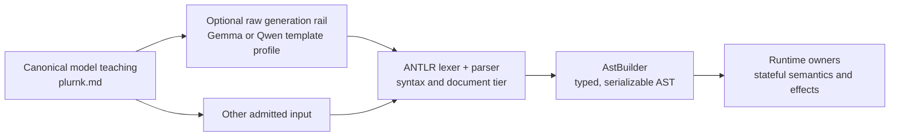
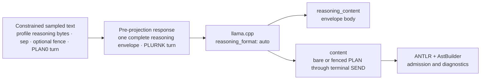

# PLURNK Contracts Specification

## 1. Overview

§contract-authority This package is the single authority for PLURNK's language, schemas, generated
types, parser, model rail, and runtime-neutral wire envelopes. Its package root
is the single code API for those contracts.

| Surface                                                                         | Canonical export or artifact                        |
| ------------------------------------------------------------------------------- | --------------------------------------------------- |
| Parser, AST, validators, Problems, results, Notices, text regions and extents   | `@plurnk/plurnk-contracts`                          |
| Effective loop policy and its default                                           | `LoopFlags`, `DEFAULT_LOOP_FLAGS`                   |
| Durable reasoning intent                                                        | `ReasoningPolicy`, `REASONING_POLICIES`             |
| Model route and catalog discovery                                               | `ModelRoute`, `ModelCatalogQuery`, `ModelCatalogPage`, `ModelReadiness` |
| Stopped-world client contract                                                   | `ProposalDisposition`, `ProposalProjection`         |
| Client-owned interaction contract                                               | `ClientInteractionRequest`, `ClientInteractionProjection`, `ClientInteractionResolution` |
| Client capability presentation                                                 | `ClientDisplayCapabilities`                         |
| Exterior adapter application calls                                             | `ApplicationPort`                                   |
| Workspace MCP configuration                                                    | `McpServerDefinition`, `McpServerOptions`, `McpConfigurationOverlay` |
| AG-UI discovery, client accounting, and shared conformance specimens           | `AguiDiscovery`, `AguiClientConformance`, `AguiConformanceKit` |
| JSON Schemas                                                                    | `@plurnk/plurnk-contracts/schema/*.json`            |
| Generated JSON result rendering                                                 | `renderJsonResult`                                  |
| Local-model rails                                                               | `@plurnk/plurnk-contracts/plurnk.{gemma,qwen}.gbnf` |
| Model language reference                                                        | `plurnk.md` in the package                          |

§contract-representations JSON Schema is authoritative for shared data shapes. TypeScript types are
generated from the schemas; ANTLR is authoritative for accepted model-language
syntax; GBNF remains the bounded generation aid described in §1.2.

§agui-discovery-contract `AguiDiscovery` is the complete installed AG-UI+
surface at one instant. `schemaVersion` identifies its discovery shape;
`actions` maps each unique public name to exactly one `scope`, `inputSchema`,
and `outputSchema`; `notifications` maps each unique event-family name to one
`payloadSchema`; and `display` carries {§client-display-capabilities} without
another presentation mechanism. The AG-UI owner supplies the built-in registry;
an extension contributes the same schema-bearing action descriptor through its
core module registration rather than creating a second action type.

§agui-action-schema-enforcement The JSON Schema values in
{§agui-discovery-contract} are executable boundary contracts, not prose or
hints. The AG-UI boundary rejects an action input before dispatch when it does
not satisfy the advertised `inputSchema`, rejects an owner's successful output
when it does not satisfy `outputSchema`, and validates a known notification
before projecting it to AG-UI. Schemas are discovery values owned by their
registrants; validation must not annotate or otherwise mutate them.

§agui-client-conformance `AguiClientConformance` is a language-neutral JSON
document accounting for every action and notification in one
{§agui-discovery-contract}. Each name is classified as `native` (dedicated
client behavior), `generic` (lossless protocol support without dedicated UI),
or `unsupported` with an explicit reason, and cites nonempty verification
evidence. Each disposition declares the exact verification dimensions its
evidence covers; native behavior includes admission and presentation, every
action includes projection plus success and failure, and every notification
includes framing plus projection. Validation requires exact action and
notification key equality with the installed discovery surface; adding or
removing a public capability therefore breaks every stale client matrix
visibly. The contracts-owned report procedure resolves every cited evidence
path and emits one record per member with its posture and verified dimensions;
a stale or fictional citation fails the report.

§agui-conformance-kit `AguiConformanceKit` is the one versioned,
language-neutral corpus of raw SSE boundary specimens and AG-UI lifecycle
sequences used by every client transport. Its JSON resource is test input, not
a third protocol implementation: each client feeds the same chunks and events
through its production parser and projection seam, then verifies the declared
outcome. Specimen names are unique within their transport or lifecycle family.

§json-result-rendering `renderJsonResult` is the one presentation serializer
for generated JSON operation results. A top-level array remains one valid,
compact JSON value but places each item on its own physical line by adding only
item-boundary newlines; an empty or single-item array and every non-array value
remain one line. It never rewrites arbitrary stored JSON, whose original lines
remain source coordinates.

## §contract-layers 1.1 Contract layers and admission boundary

PLURNK uses one contract with deliberately different projections. A tolerant
ingester accepting a spelling does not make that spelling canonical model
teaching, and a generation rail admitting a sentence does not make its runtime
semantics valid.



| Layer                    | Owner or artifact                   | Contract                                                                        |
|--------------------------|-------------------------------------|---------------------------------------------------------------------------------|
| Stable current law       | `SPEC.md`                           | Owns invariants and boundaries; forge issues retain history                     |
| Canonical model teaching | `plurnk.md`                         | Teaches the lean spelling and operational model the model should emit           |
| Constrained generation   | generated `plurnk.*.gbnf`           | Increases likely ANTLR compliance without reproducing all parser/runtime checks |
| Accepted syntax          | `plurnkLexer.g4`, `plurnkParser.g4` | Recognizes document tiers, heading lanes, slot shape, and section boundaries    |
| Typed admission          | `AstBuilder`                        | Produces JSON-serializable unions and validates deterministic body/path syntax  |
| Shared wire data         | `schema/*.json`                     | Defines runtime-neutral data shapes projected into generated TypeScript         |
| Stateful behavior        | consuming runtime                   | Resolves addresses, permissions, selection arithmetic, effects, and lifecycle   |

ANTLR owns statement structure, delimiter matching, slot multiplicity, accepted
slot permutations, scope-number syntax, and interstatement text recognition.
AstBuilder owns URL decomposition and deterministic matcher validation through
WHATWG `URL`, ECMAScript `RegExp`, XPath 1.0, and RFC 9535 JSONPath parsers.

The runtime owner decides facts that require state or operation-specific
meaning, including registered scheme resolution, target existence, tag
selection, text-region bounds, result ordering, semantic similarity, mutation
effects, executor behavior, and numeric operation-code semantics.

### §contract-proposal-projection Loop policy and stopped-world projection

The schemas own the runtime-neutral shapes; core owns their stateful values.

| Contract                  | Shape invariant                                                                 | Runtime responsibility                                                                 |
| ------------------------- | ------------------------------------------------------------------------------- | -------------------------------------------------------------------------------------- |
| `LoopFlags`               | Complete effective `mode`, `auto`, `noWeb`, `noInteraction`, and `noProposals`  | Validate/expand persisted partial policy before use                                    |
| `ProposalDisposition`     | Client authority, or the loop's exact automatic accept/reject                   | Compute precedence from effective loop policy, proposal kind, and stale-target truth   |
| `ProposalProjection`      | Identity, `{ scheme, authority, pathname }` review target, body/attrs, effective flags, stale signal, disposition | Derive one validated projection for live delivery and durable reconnect discovery |
| `ProviderUsage`           | Conventional input/output totals with cache and reasoning details                | Preserve observed quantities without replacing absence with zero                        |
| `ProviderCost`            | Exact charged, estimated, or unknown monetary evidence                           | Normalize one monetary disposition for each physical provider request                    |
| `ProviderRequestAccounting` | Usage and cost evidence for one physical provider request                      | Preserve request order across retries, failover, success, and failure                    |
| `ProviderAccounting`      | Ordered requests plus deterministic usage and exact-USD projections              | Derive loop, protocol, telemetry, and client reporting without a second authority        |

`DEFAULT_LOOP_FLAGS` is the contracts-owned effective default value. A consumer may persist a partial object as an implementation detail, but it never exposes or acts on that partial representation as though it were the complete contract.

§reasoning-policy-wire `ReasoningPolicy` is exactly `off | adaptive | low |
medium | high`. The schema owns this shared wire vocabulary. Providers own the
supported subset and native projection for a selected route; core owns the
durable worker value.

§model-catalog-wire `ModelRoute` is one exact client-visible provider/model
identity with optional alias provenance. Provider credentials, endpoints, and
tuning never enter this wire shape. Catalog discovery uses a
closed bounded query and page: entries carry exact selectors, display facts,
physical limits, capabilities, and local `ModelReadiness`. A readiness cause
contains alternative environment-variable sets—every name within a set is
required and any set may satisfy the cause. It carries names only, never values,
and asserts neither credential validity nor endpoint reachability.

### §client-interaction-wire Client-owned interaction wire

The closed client-interaction schemas describe one operation asking its client
for structured input without transferring private protocol continuation state.

| Contract | Shape invariant |
|---|---|
| `ClientInteractionRequest` | Non-empty `toolName`, object `arguments`, optional non-empty `message`, and object `responseSchema` |
| `ClientInteractionProjection` | Positive interaction, worker, loop, and turn identities plus the exact request; workspace scope remains the containing transport envelope |
| `ClientInteractionResolution` | Exactly `{ status: "resolved", payload? }` or `{ status: "cancelled" }` |

Opaque upstream request identities, retry state, credentials, and callbacks are
not members of these schemas. The operation owner retains and interprets those
facts; core and client interfaces carry only this standard interaction.

§provider-usage `ProviderUsage` records only known non-negative safe-integer
quantities. `inputTokens` includes every input category; cache reads and cache
writes are details within it. `outputTokens` includes reasoning; text and
reasoning are details within it. `totalTokens` equals input plus output whenever
all three are present. A detail is no greater than its containing total, and a
complete detail partition sums to that total. An omitted field is unknown; an
explicit zero is provider evidence or an exact derivation from complete known
components. Consumers never estimate a token category from text length.

§provider-cost `ProviderCost` represents one physical provider request's
monetary disposition. `charged` preserves a provider-reported canonical decimal
amount and currency, with an optional decimal USD equivalent for a non-USD
charge. `estimated` preserves a calculated decimal amount and currency.
`unknown` requires a reason. Zero is an ordinary exact amount under `charged`
or `estimated`; there is no separate free mechanism. Decimal strings preserve
evidence without binary floating-point rewriting. Unknown is not zero.

§provider-request-accounting `ProviderRequestAccounting` is the indivisible
accounting fact for one issued physical request. Its provider, model, outcome,
optional protocol status, optional {§provider-usage}, and required
{§provider-cost} travel together. Ordered request records preserve retries and
capacity failover; a later response never replaces an earlier request.

§provider-accounting `ProviderAccounting.requests` is the source evidence.
`usage` and `costUsd` are deterministic projections of that ordered set, not
independent inputs. Each usage field is present only when every contributing
request has that field known; the empty set totals to explicit zero. `costUsd`
is the exact decimal sum only when every request is expressible in USD and is
`null` otherwise. Consumers do not recompute provider rates or convert
currencies while reading the projection.

The parser returns ordered statement, error, and text items. It recovers at a
trustworthy statement boundary when possible and sets `unparsedTail` when a
boundary-destroying failure makes later input undefined. SEND operation codes
and parse diagnostics are separate contracts.

## 1.2 GBNF Generation Rail

§gbnf-rail-purpose ANTLR and AstBuilder define accepted PLURNK input. The generated
`dist/plurnk.{gemma,qwen}.gbnf` are optional local llama.cpp sampling rails kept lean
to make useful, ANTLR-compliant turns more likely without reproducing every
parser or semantic validator. Parse compatibility is a design goal balanced
against rail size and sampling efficiency, not a language-subset guarantee. A
rail-legal operation can therefore produce a parser or AstBuilder error; consumers
apply their ordinary admission and bounded-operation recovery contract.
The complete package build emits both rails; they are not source-controlled. Source and
differential tests serialize the owning generator directly, while installation
coverage verifies the packed export.

The rails share one turn shape but begin at their respective sampled-token
boundaries:

```ebnf
root-gemma ::= channel sep framed-turn
root-qwen  ::= think-body think-close sep framed-turn
root-qwen-response ::= think-open root-qwen
framed-turn ::= turn | fence-open turn fence-close
turn       ::= plan sep tail-0
```

§gbnf-turn-shape The `gemma` transport root samples one complete
`<|channel>thought\n … <channel|>` enclosure. A Qwen-style chat template has
already supplied `<think>\n` when the `qwen` transport root begins, so that root
samples the body and required `</think>` closer. Each generated artifact declares
an `@plurnk-response-root`; for `qwen`, that root composes the template opener
back onto the sampled text so the complete pre-projection response can be graded.
Either body may be empty and cannot contain its profile's opener or closer.
`sep` is zero through seven whitespace characters. The projected PLURNK content
is either bare or enclosed once in a paired `plurnk` Markdown fence; the turn
begins with `# PLAN0`, and every following operation is a same-lane `## OP0`
section.
`tail-0` admits zero through fourteen internal operations followed by exactly
one terminal SEND under the existing terminal-eligibility rules.



§gbnf-reasoning-boundary GBNF applies from sampled token zero before response
projection. The declared response root composes any template-provided prefix for
independent validation of the pre-projection evidence. The two projected fields
are not separate GBNF languages, and `content` alone is not revalidated as though
it still contained the required reasoning envelope. Provider and core own the
projection evidence and rail-verdict boundary; this package owns the sampled and
response roots plus the parser/AstBuilder result.

§rail-heading-boundaries On the GBNF rail, PLAN and every operation use lane `0`.
Every reserved PLAN or operation heading stem is structural, regardless of the
delimiter a model attempts next, so a non-`0` pseudo-heading cannot be swallowed as
literal body text. Rail bodies therefore cannot quote reserved headings from any
lane. This makes both the canonical delimiter and section boundary structurally
available during constrained generation; ANTLR remains the wider language and
accepts intentional alternate-lane literals during ingestion.

§gbnf-curation-shaping The rail admits OPEN/FOLD curation terms, a canonical
`log:` target, an optional log-body line scope, and a matcher independently. It accepts any ordered mixture of
unsigned, `+`, and `-` terms without proving that the combination selects a log
item; ANTLR and AstBuilder own that condition, while runtime owns wider ingested
target resolution.

## §canonical-statement 2. Canonical statement form

```text
# PLANdelimiter
body

## OPdelimiter [signal]? (path)? <scope>? <!-- annotation -->?
body?
```

§section-boundary A statement is one Markdown section. PLAN alone uses a level-one
heading; every other operation uses a level-two heading. Its body is the
character-perfect section content before the next structural heading or EOF.
Canonical adjacent sections place the next structural heading on the immediately
following line. The tolerant ingester also admits one empty separator line; that
separator is syntax rather than body content, while any additional preceding
blank lines remain body content.

§empty-section An empty section has no body lines between its heading and the next
structural heading, tolerated separator, or EOF. Optional operation bodies normalize
to null; PLAN admission normalizes its required semantic body to `[]`
under {§plan-value}.

| Element      | Canonical contract                                                        |
|--------------|---------------------------------------------------------------------------|
| `# PLAN`     | Required level-one turn anchor                                             |
| `## OP`      | Level-two protocol operation                                               |
| `delimiter`     | Heading lane, joined directly to PLAN or OP                                |
| `[signal]`   | Optional operation-specific signal, preceded by one space                  |
| `(path)`     | Optional target slot, preceded by one space                                |
| `<scope>`    | Optional numeric scope, preceded by one space                              |
| `<!-- … -->` | Optional trailing operation annotation, preceded by one space               |
| line ending  | Ends the single-line heading                                               |
| `body`       | Zero or more characters of operation-specific, character-perfect content  |
| blank line   | Canonical section separator; excluded from the preceding body              |

The following constraints are structural:

- §lane-match PLAN establishes one lane for the turn. A heading is structural
  only when its delimiter character-matches that lane; a different delimiter remains
  ordinary body text.
- PLAN is the only H1 operation and every non-PLAN operation is H2.
- A header occupies one physical line.
- Each admitted signal, target, and scope slot appears at most once.
- An annotation follows every present modifier and appears at most once.
- BARE, WORK, FORK, and KILL do not admit a scope slot.
- An ingested delimiter is `[A-Za-z0-9_]*`; canonical teaching and the GBNF use `0`.

§slot-order Canonical producers and the GBNF rail emit signal, then target, then
scope, then annotation, with one ASCII space before every present slot. Slot delimiters make
their boundaries unambiguous, so the tolerant ANTLR ingester accepts zero or
more horizontal whitespace characters before each slot and any permutation of
the slots admitted by that operation, at most once each. Accepted spacing and
permutation are not second canonical spellings.

§operation-annotation A heading may end with one single-line Markdown HTML
comment. AstBuilder strips the delimiters and surrounding horizontal whitespace
into the statement's fixed `annotation: string | null` field. The annotation is
durable, model- and client-facing descriptive text but semantically inert: it
does not alter operation identity, signal, target, scope, dispatch, effect,
authorization, status, or body. An empty comment normalizes to the empty string.
Text containing a newline or lacking the closing `-->` is not an annotation;
`<!--` elsewhere remains ordinary body text.

The ingester also accepts several bounded noncanonical forms so it can explain
or safely execute understandable input:

| Tolerated input                                   | Canonical or runtime disposition                                    |
|---------------------------------------------------|---------------------------------------------------------------------|
| Reordered admitted slots                          | Producers retain signal → target → scope order                      |
| Missing target on a generally targeted operation | AST carries `null`; the runtime rejects when the target is required |
| PLAN modifiers or a non-`0` lane                  | Model canon keeps PLAN slotless and uses lane `0`                   |
| KILL annotation body                              | AST preserves it; model teaching leaves the KILL section empty      |
| Dash-separated or comma-space scope numbers       | Producers use adjacent comma-separated numbers                      |
| Empty content where semantics require a body      | The empty section normalizes null; the operation owner rejects it   |

## 3. Lexical elements

| Element     | Accepted shape or role                                             |
|-------------|--------------------------------------------------------------------|
| `OP`        | `FIND READ EDIT COPY MOVE OPEN FOLD SEND EXEC BARE WORK FORK KILL PLAN` |
| `delimiter`    | `[A-Za-z0-9_]*`, adjacent to PLAN or OP                            |
| `[signal]`  | Operation-specific tags, identifier, branch, or integer            |
| `(path)`    | Local path or scheme URL target; detailed in §5                    |
| `<scope>`   | One or more signed integers or decimals; detailed in §7            |
| annotation  | Optional trailing `<!-- … -->` descriptive text                    |
| `body`      | Opaque section text before the next same-lane heading or EOF        |

## §op-shapes 4. Per-operation semantics

The model-facing forms below are the canonical projection. Parser tolerance is
governed by {§canonical-statement}; runtime conditions remain explicit below.

| OP   | `[signal]`                    | `(path)`                                     | `<scope>`                       | `body`                         |
|------|-------------------------------|----------------------------------------------|---------------------------------|--------------------------------|
| PLAN | none                          | none                                         | none                            | required Plurnk Plan JSON array |
| FIND | optional add log tags         | required target or glob                      | optional result range           | optional matcher               |
| READ | optional add log tags         | required target                              | optional text region            | empty                          |
| EDIT | optional add log tags         | required file or entry                       | required for an existing target | literal text                   |
| COPY | optional add log tags         | required source                              | optional source region          | required destination selection |
| MOVE | optional add log tags         | required source                              | optional source region          | required destination selection |
| FOLD | optional filter/change tags   | optional log selection                       | optional log-body line scope    | optional matcher               |
| OPEN | optional filter/change tags   | optional log selection                       | optional log-body line scope    | optional matcher               |
| EXEC | optional executor             | optional local working path                  | optional timeout, poll          | optional executor input        |
| BARE | optional add log tags         | none                                         | none                            | required prompt                |
| WORK | optional Git branch           | required fresh `worker://name`               | none                            | required prompt                |
| FORK | optional Git branch           | required context-inheriting `worker://name`  | none                            | required prompt                |
| KILL | optional target-specific code | required target, including a log item        | none                            | empty                          |
| SEND | optional target-specific code | optional recipient                           | optional timeout, poll          | message; terminal is nonempty  |

§operation-code-polymorphism SEND and KILL share a numeric wire slot, not one universal numeric vocabulary.
For pathless terminal SEND, the code is the loop disposition defined in §9.
Directed SEND and KILL delegate any present code to the addressed target's
operation contract; a live process may interpret a KILL code as a Unix signal,
but that interpretation does not define KILL generally.

§plan-value **PLAN carries one complete Plurnk Plan.** Its entries are the
model's current working-memory inventory: durable findings are `memory`, finished
actions are `completed`, open inquiries are `pending`, and active priorities are
`in_progress`. Admission parses the JSON body, supplies the neutral `medium`
priority to each entry that omits it, and validates the canonical bare array:
every entry has string `content`, `priority` in
`high | medium | low`, and `status` in
`pending | in_progress | completed | memory`. A nonempty plain-text,
malformed-JSON, or otherwise invalid body becomes one `medium`, `in_progress`
entry whose content is the exact authored body; admission performs no partial
repair or list inference. An empty body becomes the planless `[]`
value. Each PLAN completely replaces the current Plan; it never expresses a
delta. The exact `turnOps` source remains forensic program evidence, while the
normalized array is the sole semantic value used by AST, persistence, durable
log bodies, and model-packet materialization. PLAN is public log content—not
provider reasoning—and Plurnk initially mints no `_meta` values. Dispatch records
the canonical value and has no other runtime effect.

§plan-acp-projection **Only an ACP-facing boundary projects the model-native
Plan.** It constructs ACP's `{ "entries": [...] }` Plan object from the internal
array, maps each `memory` entry to ACP `completed`, and prefixes its content with
exact "Memory: " framing without duplicating an existing prefix. Every other
entry field remains unchanged, and the internal value is not mutated.
The projected value validates against the separately owned ACP Plan schema pinned
to ACP v1
[`schema-v1.21.0`](https://github.com/agentclientprotocol/agent-client-protocol/tree/schema-v1.21.0)
commit `272bf799f35a258c6a4107a0410ed361e83683d3`.

§log-tag-signal FIND, READ, EDIT, COPY, MOVE, and BARE canonically express additions
as `+tag`. Because those operations have no tag-selection semantics, ANTLR also
tolerates unsigned `tag` as an equivalent addition; `-tag` is invalid. Core
strips any `+`; the signal neither filters nor modifies resources. OPEN and
FOLD treat every unsigned `tag` as an ALL-tags selector, then add each `+tag`
and remove each `-tag` from the selected log items. Signed terms never select,
so either a target, matcher, or unsigned tag is required. Adding and removing
the same tag conflicts. An optional OPEN/FOLD line scope changes visibility
inside every selected canonical log body; it does not participate in row selection.

The `<scope>` slot is optional where admitted and its domain is OP-specific. FIND
scopes ordered results. EXEC and SEND scope timing. READ, EDIT, COPY, and
MOVE use one universal text algebra independent of mimetype; OPEN/FOLD admit
only its one- and two-line forms for canonical log-body visibility:

| Arity         | Surface meaning                                                     | Endpoint rule                                        |
|---------------|---------------------------------------------------------------------|------------------------------------------------------|
| one integer   | One whole physical line, or the documented `0`/`-1` mutation anchor | Exactly one ordinal line                             |
| two integers  | Whole physical lines `firstLine..lastLine`                          | Both lines are included                              |
| four integers | Exact `startLine,startColumn,endLine,endColumn` region              | Start included, end excluded; equality is zero-width |

§text-scope-semantics Exact regions use 1-based lines and Unicode code-point columns. One- and
two-integer line selections normalize to the same exclusive-end `TextRegion`
used by four-coordinate selections. Whole-line replacement deliberately
accounts for newline separators; it is an ergonomic projection over exact
replacement, not a different mimetype navigation mode. An end bound beyond
the available content clamps to the final addressable endpoint; the start bound
must resolve. As an unadvertised
ingestion tolerance, the runtime accepts three integers as
`startLine,startColumn,endLine` and immediately normalizes them to the complete
four-coordinate region ending after the final code point of `endLine`.
Producers never emit that form. Other arities and decimal text coordinates are
runtime 416 failures.

§bare-statement **BARE requests one isolated model inference.** Its required
body is the complete prompt. It admits only optional additive log tags: no
target, scope, persistent worker identity, or output-language statement shape
is represented in the AST. Runtime provider selection, batching, accounting,
and observation timing belong to the consuming service.

§read-find-normalization An authored READ with a nonempty matcher body or a
target path classified as a glob normalizes during AST construction to one
ordinary FIND statement. Target, signals, scope, and matcher are preserved;
FIND's result pagination and projection contract then applies. The canonical
AST retains no parallel matcher-READ mode, and the runtime performs no READ
fan-out.

§read-exact-target After normalization, READ targets one exact resource (a
local path or scheme URL, with optional `#channel` fragment or
`{header: value}` metadata) and has no matcher body. A `<scope>` on READ selects
a text region from that exact target. Without a scope, READ defaults to
`<1,16>`; `<1,-1>` explicitly selects all text. Decimal scope components are
invalid on READ.

Mutation semantics:

- No scope and a target address that does not yet exist creates a file or entry from the body. This is the only unscoped EDIT.
- §unscoped-edit-create-only No scope and an existing target is refused. Replacing existing content requires a precise text scope or `<1,-1>`; core owns the existence check.
- `<N>` replaces whole line `N`; `<N,M>` replaces inclusive whole lines `N` through `M`.
- An empty body deletes the selected text.
- `<0>` prepends and `<-1>` appends.
- `<SL,SC,EL,EC>` deletes the exact exclusive-end region and inserts the body at its start.
- §destination-scope-boundary COPY and MOVE parse the body as a destination `ResourceSelection`: a target plus an optional destination scope. A destination scope is final body content; a scope-shaped suffix followed by residue before the section boundary is rejected rather than reinterpreted as target data. Scope-shaped text elsewhere remains target data, and a URL requiring the reserved terminal spelling percent-encodes its angle brackets. Header target, fragment, and scope independently select the source resource, channel, and region.

### §operation-observation Per-operation observations

| OP   | Successful observation                                                            |
|------|-----------------------------------------------------------------------------------|
| FIND | Resource catalog groups or exact-target match locations                           |
| READ | Complete or scoped body projections plus optional text match evidence             |
| EDIT | Status plus a bounded receipt for the effect that landed                          |
| COPY | Source and destination selections plus ordered destination effects                |
| MOVE | Source and destination selections plus ordered destination and source effects     |
| OPEN | Status and matched log-item count                                                 |
| FOLD | Status and matched log-item count                                                 |
| SEND | Status and recipient acknowledgement when applicable                              |
| EXEC | Spawn acknowledgement; output arrives through named stream channels               |
| BARE | The one-shot model response                                                        |
| WORK | Spawn acknowledgement; the deliverable arrives through the log                    |
| FORK | Spawn acknowledgement; the inherited worker's deliverable arrives through the log |
| KILL | Status of deletion or termination                                                 |
| PLAN | Status of durable complete-Plan logging                                           |

§find-result-unit For FIND, authored target shape fixes the paginated result
unit. An exact target with a matcher pages flat match locations; a glob or
folder target, and every body-less FIND, pages resources. Resolving a glob to
one resource does not make it exact. The same `<N>`, inclusive `<N,M>`,
markerless `<1,16>`, and explicit-all `<1,-1>` forms apply to either unit.

§copy-move-observation COPY and MOVE log projections preserve both admitted operand selections,
including their independent scopes, whether the result changed state, was a
304 no-op, or failed after admission. Operands identify the request; `effects`
describe only mutations that landed. If either operand uses textual scope,
each landed textual create or update carries the same bounded receipt used by
EDIT. Whole-channel transfers remain bodyless structural effects; runtime
owners reject binary markers rather than treating a text field as a byte lane.

Every operation returns the runtime-neutral `OperationResult` defined by
{§operation-result}. Its `status` belongs to the result envelope and is not a
SEND signal. Durable operation observations are projected into a later packet;
retrieval never returns inline within the emitting turn.

## §path-syntax 5. Target and path grammar

The target slot contains either a local path or a scheme URL. Exact addresses
and path globs share the slot; content matchers belong in the body.

| Form                    | Typed admission                                                     | Runtime meaning                                      |
|-------------------------|---------------------------------------------------------------------|------------------------------------------------------|
| Bare path               | `LocalPath { kind: "local", raw }`                                  | Resolves through the runtime's file surface          |
| `scheme://…`            | WHATWG-decomposed `UrlPath`                                         | Resolves only when a runtime scheme owns the address |
| Path glob               | Preserved in either path kind                                       | Scheme defines collection selection and ordering     |
| `#channel` fragment     | Preserved as `UrlPath.fragment`                                     | Selects a named channel when the scheme supports it  |
| Trailing `{key: value}` | Removed before URL parsing and preserved as ordered `headers` pairs | Addressed scheme interprets request metadata         |
| `?query`                | Preserved as ordered `UrlPath.query`; `null` = absent, `""` = `?`   | Participates in scheme resource identity             |

AstBuilder recognizes a URL with the case-insensitive prefix
`[a-z][a-z0-9+.-]*://`, passes it through WHATWG `URL`, and surfaces malformed
URL structure as a visitor error. A target without that prefix remains a raw
local path. Grammar acceptance does not register a scheme; the runtime scheme
catalogue and packet-time scheme teaching remain dynamically owned elsewhere.

§path-query The serialized query component is the lossless representation.
Ordering, duplicate names, encoded spelling, and the distinction between an
absent query and an explicit empty query survive parsing. Consumers that need
key/value access may construct `URLSearchParams`; the shared AST does not replace
URI identity with a grouped object projection.

§path-parentheses An unescaped depth-zero `)` closes the target slot. The
tolerant lexer preserves balanced unescaped parentheses, while canonical
producers use one lossless Plurnk lexical layer before target interpretation:

| Target-slot spelling | Interpreted character |
| -------------------- | --------------------- |
| `\\`                 | `\`                   |
| `\(`                 | `(`                   |
| `\)`                 | `)`                   |

Decoding consumes only those three pairs in one left-to-right pass; unknown
pairs such as `\*` retain both characters for glob interpretation. Encoding
escapes backslashes before parentheses, so every target string round-trips.
Pathname producers retain the deliberate `%28`/`%29` alias and `%3C` spelling,
but must use the lexical layer for identity-bearing query and fragment text
rather than changing their percent-encoded spelling. Newlines and raw `<` are
never target content. Glob metacharacters remain legal path data.

§path-glob `PathSyntax` owns exact-path versus path-pattern classification.

| Method                           | Contract                                                                 |
| -------------------------------- | ------------------------------------------------------------------------ |
| `hasGlob(pathname)`              | Recognizes `*`, `?`, character-class, brace, extglob, and escape syntax  |
| `globMagicIndex(pathname)`       | First such position, solely for conservative candidate-prefix selection  |

Matching and folder-scope semantics remain runtime concerns.

§path-request-metadata A scheme URL may append one or more
`{key: value}` request-metadata blocks. AstBuilder removes the blocks before
WHATWG decomposition and preserves them as ordered pairs so order and duplicate
names survive. Local paths retain braces as ordinary path text. Scheme handlers,
not the language parser, define the meaning and authorization of the metadata.
The admitted AST retains exact values for execution; malformed-metadata visitor
diagnostics identify only the structural fault and source position, never quote
metadata contents or a native URL parser's input-bearing diagnostic.

§worker-name The exported `WORKER_NAME` contract governs names minted for URI
authority slots: a lowercase DNS label matching
`[a-z0-9]([a-z0-9-]{0,61}[a-z0-9])?`. `RESERVED_AUTHORITIES` contains the
authority-shaped internal worker names `commons` and `plurnk`, which are
unavailable for minting. `~` is the sole current-worker sigil and falls outside
the mintable alphabet; every matching unreserved value, including `self`, is an
ordinary literal worker name. This is a minting and registry invariant, not an
ingestion restriction: the parser decomposes arbitrary URL authorities.

## §matcher-prefix-claims 6. Bulk pattern matching

FIND, OPEN, FOLD, and authored READ accept an optional body matcher. The lexer
preserves the body opaquely; AstBuilder assigns the dialect from its leading
characters, then normalizes matcher-bearing READ to FIND under
{§read-find-normalization}.
A leading prefix claims its dialect. Invalid claimed syntax is a positioned
visitor error and never falls back to glob matching.

| Prefix    | Dialect  | Canonical body                       | Typed admission                   | Runtime owner       |
|-----------|----------|--------------------------------------|-----------------------------------|---------------------|
| `//`      | XPath    | `//selector`                         | XPath 1.0 `xpath.parse()`         | Mimetype projection |
| `/`       | Regex    | `/pattern/flags`                     | ECMAScript `RegExp` construction  | Mimetype projection |
| `$`       | JSONPath | RFC 9535 expression                  | `json-p3` compilation             | Mimetype projection |
| `~`       | Semantic | `~phrase`                            | Any text after the prefix         | Embedding index     |
| `@`       | Graph    | `@symbol`, `@<symbol`, or `@>symbol` | Direction and symbol preserved    | Symbol index        |
| none      | Glob     | Shell glob or literal text           | Raw string                        | Mimetype projection |

XPath is classified before regex because its prefix is two slashes. Regex
splitting respects escapes and character classes; `\/` represents a literal
slash. The AST stores regex `pattern` and `flags`, not a compiled object.
Semantic and graph matchers require no parse step. Scope carries semantic
threshold and result-range information rather than changing the matcher body.

AstBuilder validation is compile-only and never evaluates a document. Matcher
evaluation belongs to the runtime's selected mimetype, embedding, or symbol
implementation. A matcher admission error is local to its statement; later
statements remain recoverable when their boundaries are trustworthy.

- §pattern-body-single-line The GBNF rail permits only single-line matcher
  bodies. A regex that matches a newline uses the two-character `\n` escape.
  ANTLR preserves the complete section body; the same-lane heading boundary
  keeps every following statement independently parseable without a matcher-
  specific implicit close rule.
- §pattern-body-leading-colon The GBNF rail forbids `:` as the first matcher
  character. Empty matchers and later colons remain valid; a regex such as
  `/^:needle/` expresses a pattern beginning with a literal colon.

## §scope-slot 7. Scope markers

The model-facing slot is `<scope>`; the AST field remains the historical
`lineMarker`. Numeric scopes preserve ordered components in `LineMarker`;
text-coordinate operations use `TextLineMarker`, whose line positions may also
carry rendered anchors. The operation owner assigns every component's role.

The operation column names the canonical AST operation after
{§read-find-normalization}.

| Operation             | Canonical components                   | Meaning                                                                    |
|-----------------------|----------------------------------------|----------------------------------------------------------------------------|
| FIND                  | optional threshold, then 0–2 positions | Inclusive resource or exact-target location positions ({§find-result-unit}; defaults to `<1,16>`) |
| READ / client LOOK    | 0/1/2/4 text coordinates               | Text projection from one exact selected file, entry, or log item           |
| EDIT                  | 0/1/2/4 text coordinates               | Text replacement, deletion, prepend, or append                             |
| COPY/MOVE source      | 0/1/2/4 text coordinates               | Region copied or moved from the selected source                            |
| COPY/MOVE destination | 0/1/2/4 text coordinates after target  | Region replaced or insertion point at the destination                      |
| OPEN / FOLD           | 0/1/2 body-relative line coordinates   | Whole log body when absent; one physical line or inclusive range when present |
| EXEC                  | `timeout[,poll]`                       | Spawn lifetime bound and poll cadence in seconds                           |
| Terminal SEND `[202]` | `timeout[,poll]`                       | Bounded or indefinite wait and optional poll cadence                       |

Text coordinates use the algebra in {§text-scope-semantics}: one integer is a
whole line, two integers are an inclusive whole-line range, and four integers
are an exact start-inclusive/end-exclusive region. Mutation scopes additionally
admit `0` as prepend and `-1` as append. A leading decimal on semantic FIND
is a similarity threshold; any remaining integers select result positions. READ
does not admit decimal scope components. OPEN/FOLD intersect a valid body-relative line
scope with each selected body; an absent line is a successful no-op for that
body, while unsupported arity is a runtime failure.

§text-line-anchor-syntax A text coordinate admits a case-sensitive line anchor
spelled `@` followed by exactly five Base62 characters (`0-9A-Za-z`) wherever
its `L`, `SL`, or `EL` position denotes a line. Columns, prepend `0`, and append
`-1` remain numeric. Exact READ, EDIT, COPY/MOVE source and destination,
OPEN/FOLD, and client LOOK preserve these positions in `TextLineMarker`; core resolves them
against the addressed current text before operation-specific numeric scope
semantics run. A matcher-bearing or path-glob READ normalizes to FIND, whose
result positions remain numeric and reject anchors. Numeric text scopes remain
canonical and fully supported. Parser acceptance does not imply model-facing
recommendation.

§scope-marker-forms Canonical producers separate components with commas and no
spaces. ANTLR tolerates a dash separator and one space after a comma. Each
component greedily consumes an optional leading minus sign, digits, and an
optional decimal fraction, so the ingester preserves even noncanonical numeric
shapes for runtime validation. An anchor-bearing text scope uses commas; ANTLR
tolerates one space after each comma.

Apart from the unadvertised three-coordinate text-scope tolerance in
{§text-scope-semantics} and OPEN/FOLD's per-body empty intersection, the runtime rejects invalid arity, out-of-range or
inverted positions, and decimal text coordinates rather than rounding or
reinterpreting them. FIND owns a deterministic result order so the same
inclusive range selects the same positions from unchanged state. The parser
does not enforce either condition.

## §delimiter-discipline 8. Delimiter Discipline

The delimiter is a turn-wide heading lane. A heading carrying the active lane
is structural; an otherwise valid PLURNK heading carrying another lane is body
text. The lane therefore makes literal or nested PLURNK unambiguous.

Delimiter rules:

- `delimiter` is `[A-Za-z0-9_]*`, concatenated to PLAN or OP with no separator.
- The H1 PLAN establishes the lane; every real H2 operation heading in that
  turn has the exact same delimiter.
- An empty delimiter is accepted only by ANTLR ingestion. Canonical teaching and
  the generated rail use `0` on PLAN and every operation.
- A body may contain any heading whose delimiter differs from the active lane.
- To carry a nested turn written with lane `0`, choose another delimiter for the
  outer turn and repeat it on every outer heading.
- The GBNF deliberately emits only lane `0`. It cannot emit body content that
  contains a same-lane structural heading; unconstrained producers use another
  outer lane when that representation is required.

Example — a lane-0 turn stored inside a lane-2 EDIT body:

```plurnk
# PLAN2
[{"content":"Store the quoted turn.","status":"in_progress"}]

## EDIT2 (worker:///quoted.plurnk)
# PLAN0
[{"content":"Answer from memory.","status":"in_progress"}]

## SEND0 [200]
Paris.

## SEND2 [200]
Stored the quoted turn.
```

The lane-0 headings are ordinary EDIT body text because the outer turn's
structural lane is `2`. This rule belongs to section framing and applies to
every operation, not to EDIT semantics.

## 9. SEND Codes

Pathless terminal SEND disposition codes align with HTTP semantics so that model training
transfers directly:

| Class | Terminal meaning                                                | Disposition used by the model |
|-------|-----------------------------------------------------------------|-------------------------------|
| `1xx` | Continue after submitted operations                             | `102 Processing`              |
| `2xx` | Conclude successfully or wait on live obligations               | `200 OK`, `202 Accepted`      |
| `4xx` | Abandon the loop after a model-side inability                   | `499`                         |
| `5xx` | Runtime or infrastructure failure; never a model terminal claim | none                          |

### §waitpid-dispositions The terminal contract (waitpid)

The model signals one intention per turn — **continue (102)**, **done
(200)**, **wait (202)**, or **give up (499)** — and the engine verifies
the claim against the loop's live obligations (spawned children, open
streams, pending retrievals); the grammar polices *shape* only. Asking
the human is the native `question` EXEC tool ({§question-tool}), not a
disposition. The shape rules ARE structural:

- §send-mid-reservation The four disposition codes `{102, 200, 202, 499}` lex as a
  distinct `DISPOSITION` token, making a disposition-coded SEND
  **structurally terminal**: a statement after it is a parse error
  (the mid-termination rule), and the GBNF reserves the four from
  mid-position SENDs (`status-mid` is their complement over `DDD`).
  This keeps the grammar's last-SEND model and the dispatcher's
  first-disposition model coincident.
- A **mid** SEND (before the terminal) is comms: statusless, or any
  non-disposition code, targeted or pathless, empty body allowed.
- §terminal-body-nonempty The GBNF rail requires a non-empty terminal SEND body — a constrained
  turn cannot end empty-handed. ANTLR remains tolerant during ingestion.
- §park-202-only The **park** rides `[202]` only: `<T>` (wait up to T seconds),
  `<T,P>` (adds a poll cadence, mirroring EXEC's slot), `<-1>`
  (indefinite; the join's own liveness bounds it). See §7 for the
  GBNF-strict / ANTLR-tolerant split.
- §no-idle-102 A **zero-statement turn may not conclude `[102]`** — "continue"
  with nothing submitted is a spin. The GBNF's `tail-0` exits through
  a terminal trie without the `[102]` tail, so the idle turn (`PLAN`
  straight into `## SEND0 [102]`) is unemittable; one statement restores
  the full disposition set. The other four stay legal bare (a zero-op
  `[202]` is the engine's obligation check). ANTLR stays tolerant
  (ingest side). A dispatch-emptied turn — ops emitted but failing
  downstream validation — survives the rail by nature; the engine's
  idle-turn 409 backstops that class.

SEND with no `(path)` broadcasts to the default control channel — the
turn's disposition. SEND with `(path)` directs the message at a
specific recipient URI (a worker, a stream, a peer).

### §send-body SEND body projection

SEND body syntax is opaque. AstBuilder preserves the exact `raw` string and
also exposes a best-effort `json` value when `JSON.parse` succeeds; invalid JSON
leaves `json: null` without invalidating an otherwise legal SEND. Plain text and
JSON are both messages, not implicitly stored resources, and the language
defines no synthetic scheme or READ-back convention for them.

## §parser-architecture 10. Parser architecture

`plurnkLexer.g4` owns tokens and modes; `plurnkParser.g4` owns document tiers
and statement composition; AstBuilder projects parse-tree leaves into the public
AST. Generated TypeScript targets the `antlr4ng` runtime.

```mermaid
stateDiagram-v2
    [*] --> DEFAULT
    DEFAULT --> DEFAULT: whitespace or TEXT
    DEFAULT --> SLOTS: H1 PLANlane or H2 OPlane
    SLOTS --> SIGNAL: signal opener
    SIGNAL --> SLOTS: signal close
    SLOTS --> TARGET: target opener
    TARGET --> TARGET: balanced literals / target escapes
    TARGET --> SLOTS: target close at depth zero
    SLOTS --> SLOTS: scope token
    SLOTS --> SLOTS: trailing annotation
    SLOTS --> BODY: heading line end
    BODY --> DEFAULT: same-lane heading boundary
    BODY --> [*]: end of input
```

The first H1 PLAN establishes the turn lane. DEFAULT recognizes only an H1
PLAN or H2 minted operation carrying that exact lane. SLOTS admits
operation-appropriate signal, target, and scope openers in any order, followed
by an optional annotation; the parser grammar enforces at-most-once multiplicity.
Signal submodes select tags, integer,
or identifier tokens by operation family. TARGET preserves balanced inner
parentheses and recognized target escapes. BODY emits opaque text until a
same-lane heading boundary or EOF.

A differently delimited heading stays BODY text. Multi-turn logs are plain
sequences of independently lane-anchored PLAN turns. Complete native reasoning
enclosures before PLAN remain one TEXT token so an operation drafted inside
provider reasoning cannot become the turn anchor.

RecordingListener captures lexer and parser failures; AstBuilder adds visitor
failures. PlurnkErrorStrategy recovers at structural heading boundaries where
possible. EOF is a valid body boundary. An unfinished signal or target produces
`unparsedTail`; no later input is trustworthy.

## §whitespace-contract 11. Whitespace and interstatement text

| Location                    | Canonical generation                  | Tolerant ANTLR ingestion                                  |
|-----------------------------|---------------------------------------|-----------------------------------------------------------|
| Heading marker              | `# PLAN0` or `## OP0` at column zero  | The initial PLAN may directly follow leading TEXT; subsequent headings retain exact depth and column |
| Between OP and delimiter       | Adjacent                              | Must remain adjacent                                      |
| Before each header slot     | One ASCII space                       | Zero or more horizontal whitespace characters             |
| Inside signal               | Adjacent values                       | Horizontal whitespace is ignored; newline is invalid      |
| Inside target               | Path alias plus target escapes         | Balanced literals tolerated; newline is invalid           |
| Inside scope                | Comma-separated numbers               | Dash separator and one post-comma space are also accepted |
| Before annotation           | One ASCII space                        | Zero or more horizontal whitespace characters             |
| Inside annotation           | One-line prose padded by one space     | Any single-line text through the first closing `-->`       |
| Inside body                 | Character-perfect                     | Character-perfect                                         |
| Between canonical sections  | No empty separator line                | One empty separator line is also admitted                  |
| Before the first PLAN       | Nothing                               | Whitespace or TEXT may surface as preamble items without requiring a separator before PLAN |

PLURNK never escape-decodes body text: `\n` reaches the owning operation as
backslash plus `n`. A matcher or executor may interpret those characters under
its own body dialect. Producers that need a physical newline in literal EDIT
content emit an actual newline.

`parse` admits TEXT before its PLAN, including without an intervening line
break, and returns it as ordered text items without assigning semantics. Once
a heading begins, all nonstructural text belongs to that section body.
`parseStatements` and `parseClient` admit H2 statements;
`parseLog` admits consecutive H1 PLAN turns. PLURNK defines no general comment
syntax; only the trailing heading position gives `<!-- … -->` annotation meaning.

## §public-api 12. Public API

The package root is the single JavaScript and TypeScript entry point. Shared AST
and wire types come from generated schemas; the small hand-maintained parser
types cover ordered parse items and `PlurnkParseError`, which JSON Schema cannot
express. Consumers never receive ANTLR parse-tree or token types.

§turn-shape `PlurnkParser.parse` accepts exactly one model turn. H1 PLAN is the
first operation, a disposition-coded H2 SEND is the terminal operation, and PLAN
cannot recur mid-turn. Tolerated TEXT may appear only before PLAN; after PLAN,
nonstructural text is section body content. Missing either anchor or placing a
same-lane operation after the terminal SEND is an error.

§document-fence `PlurnkParser.parse` additionally admits one outer Markdown code
fence whose opening line is exactly ```` ```plurnk ```` and whose closing line,
when present, is ```` ``` ````. The fence encloses the complete
PLAN-through-SEND turn and projects neither text nor body content into the AST.
Its opener commits the document to either that closer or EOF immediately after
the complete turn. This is document framing, not another statement grammar, and
no other parser tier admits it. GBNF continues to shape the paired form.

§tier-entrypoints Each parser entry point owns one document tier:

| Entry point                    | Accepted document                                              | Result statement type |
|--------------------------------|----------------------------------------------------------------|-----------------------|
| `PlurnkParser.parse`           | One PLAN turn: bare with optional TEXT, or outer `plurnk` fence ending at its closer or EOF | `PlurnkStatement`     |
| `PlurnkParser.parseStatements` | Zero or more protocol statements and hidden whitespace         | `PlurnkStatement`     |
| `PlurnkParser.parseLog`        | One or more consecutive same-lane PLAN-anchored turns           | `PlurnkStatement`     |
| `PlurnkParser.parseClient`     | H2 protocol statements plus read-shaped LOOK/BUFF commands      | `ClientStatement`     |

Every entry point returns ordered `statement`, `error`, and, where admitted,
`text` items. When present, {§unparsed-tail-boundary} governs the result's item
extent. The statement `op` field discriminates the generated per-operation
union.

§root-value-api The package-root runtime namespace is closed and consists of the
following supported consumer values. All other root exports are TypeScript types.

| Root value(s)                         | Consumer contract                                                   | Exact owner                                 |
|---------------------------------------|---------------------------------------------------------------------|---------------------------------------------|
| `PlurnkParser`                        | Four document-tier entry points listed above                        | {§parser-architecture}, {§tier-entrypoints} |
| `PlurnkParseError`                    | JSON-serializable positioned parser diagnostic                      | {§parse-diagnostics}                        |
| `parsePath`, `parseResourceSelection` | Parser-equivalent target and COPY/MOVE destination admission        | {§path-syntax}, {§tier-entrypoints}         |
| `PathSyntax`                          | Target-slot spelling and exact-versus-glob classification           | {§path-parentheses}, {§path-glob}           |
| `Validator`                           | Validation and assertion against the owning JSON Schemas            | {§wire-entrypoint}                          |
| `InvalidNoticeError`                  | Typed failure from `Validator.assertNotice`                         | {§notice}                                   |
| `InvalidProblemDetailsError`          | Typed failure from `Validator.assertProblemDetails`                 | {§problem-details}                          |
| `InvalidOperationResultError`         | Typed failure from `Validator.assertOperationResult`                | {§operation-result}                         |
| `InvalidTextRegionError`              | Typed failure from `Validator.assertTextRegion`                     | {§text-region}                              |
| `InvalidRangeExtentError`             | Typed failure from `Validator.assertRangeExtent`                    | {§range-extent}                             |
| `Problems`                            | RFC 9457 Problem construction                                       | {§problem-details}                          |
| `PLURNK_OPS`                          | Runtime tuple from which the closed `PlurnkOp` union is derived     | {§canonical-statement}                      |
| `WORKER_NAME`, `RESERVED_AUTHORITIES` | Authority minting predicate and internal reserved names             | {§worker-name}                              |
| `UNKNOWN_POSITION`                    | Frozen sentinel for an AST statement without retained parsed source | {§parser-position}                          |

§parser-construction-boundary Parser construction components are internal rather
than alternate consumer entry points:

| Internal component                         | Boundary                                                                                                      |
|--------------------------------------------|---------------------------------------------------------------------------------------------------------------|
| `AstBuilder`                               | Consumes generated ANTLR contexts; `PlurnkParser`, `parsePath`, and `parseResourceSelection` own its API      |
| `PlurnkErrorStrategy`, `RecordingListener` | Assemble parser recovery and diagnostics around `antlr4ng`; consumers receive `PlurnkParseError` values       |
| `Jsonplurnk` test helper                   | Independently checks the Core-owned {§jsonplurnk} renderer corpus; it is neither shipped code nor a root API  |

### CLI

```text
plurnk-contracts [file]    parse a file, or standard input when omitted
plurnk-contracts --help    show usage
```

The CLI prints the parse result as JSON. It exits `0` when no error item or
`unparsedTail` exists and `1` otherwise.

## 13. Runtime-neutral wire contracts

§wire-entrypoint The package root exports generated wire types, `Problems`, and
`Validator` alongside the parser and AST. Their owning JSON Schemas are published
through `@plurnk/plurnk-contracts/schema/*.json`, not re-exported as root values.

### §text-region 13.1 Text regions

`TextRegion` identifies one contiguous region of textual content:

| Required field | Coordinate                                                |
|----------------|-----------------------------------------------------------|
| `startLine`    | Line containing the included start                        |
| `startColumn`  | Unicode code-point column of the included start           |
| `endLine`      | Line containing the excluded end                          |
| `endColumn`    | Unicode code-point column immediately after the selection |

Lines and columns are positive safe integers and 1-based. Columns count Unicode
code points. LF, CRLF, and CR are line separators; CRLF is one indivisible
separator, and separator code units are not column positions. The end is
exclusive; equal start and end coordinates identify a zero-length insertion
point. A producer supplies all four coordinates or omits the region. It never
substitutes UTF-16 offsets, readable-row indices, or partial coordinates.
`Validator.assertTextRegion` rejects an end before its start.

### §range-extent 13.2 Range extents

`RangeExtent` is the compact wire projection of one line or ordered-result
selection: `{ unit, total, requested: [first,last], returned?: [first,last] }`.
`requested` preserves the numeric request, including invalid fractional
evidence on a failed selection; a one-position request therefore repeats its
endpoint. Successful selection endpoints are integers. `total` is the complete
available cardinality.
`returned` names the inclusive positions actually projected and is absent for
an empty selection or a failed request. Its endpoints are positive, ordered,
and no greater than `total`.

The transparent coordinates make completion and continuation derivable. The
shape has no separate `complete`, `next`, or all-results instruction. Exact
text-coordinate selections use {§text-region} instead. `Validator.assertRangeExtent`
enforces both the schema and the relational endpoint invariants.

### §entry-read-result 13.3 Client entry reads

`EntryReadResult` is the exact transport-neutral projection of one entry. It
does not expose workspace IDs, storage owner IDs, split persistence-coordinate fields,
scope, or other persistence columns.

| Outcome | Exact shape                                                      |
|---------|------------------------------------------------------------------|
| Success | `{ status: 200, entry: ClientEntry }`                            |
| Failure | `{ status: 400..599, problem: ProblemDetails, entry: null }`      |

| `ClientEntry` field | Contract                                                                                     |
|---------------------|----------------------------------------------------------------------------------------------|
| `entryId`           | Positive durable entry identifier                                                            |
| `target`            | Client selector for the resolved entry, with any channel fragment removed                    |
| `channels`          | Every channel for a full read, or exactly the selected channel for a sliced read             |

| Channel field   | Contract                                                                                                      |
|-----------------|---------------------------------------------------------------------------------------------------------------|
| `content`       | Full content, or the suffix beginning at `contentOffset`                                                      |
| `contentOffset` | Actual Unicode-code-point offset of `content`; zero for a full read and capped at `contentLength`              |
| `contentLength` | Unicode-code-point length of the complete stored channel                                                      |
| `mimetype`      | Stored channel mimetype                                                                                        |
| `weight`        | Stored model-independent curation weight for the complete channel                                            |
| `state`         | `static`, `active`, `closed`, or `errored`                                                                     |

For every returned channel,
`contentOffset + codePointLength(content) === contentLength`. Therefore an
offset beyond the current end returns empty content at `contentLength`, not the
unbounded requested offset. `Validator.assertEntryReadResult` enforces the
schema, this suffix invariant, and Problem status equality.

### 13.4 Operation results

§operation-result Every public PLURNK operation returns one `OperationResult`:

| Status  | Required shape                            |
|---------|-------------------------------------------|
| 100–399 | `problem` is forbidden                    |
| 400–599 | One RFC 9457 `problem` object is required |

The legacy top-level `error` field is forbidden. Producer-specific success
fields and Problem Details extension members remain open. A malformed result is
an internal producer contract violation; it is not converted into a second
model-facing failure envelope.

### 13.5 Problem Details

§problem-details `ProblemDetails` requires `type`, `title`, `status`, and `detail`;
`instance` is optional until a durable host can attach the occurrence URI.

| Field       | Contract                                                                                                                                |
|-------------|-----------------------------------------------------------------------------------------------------------------------------------------|
| `type`      | Stable absolute URI for the problem class                                                                                               |
| `title`     | Stable summary with no occurrence data or instruction                                                                                   |
| `status`    | Equals the containing operation status                                                                                                  |
| `detail`    | Tersely states the failed subject, observed fact, and violated constraint at the layer that knows the cause                             |
| `instance`  | Durable URI for this occurrence                                                                                                         |
| `stage`     | Stable failed stage, only when neighboring stages imply different recovery                                                              |
| `recovery`  | One generally valid next action; omitted when the producer cannot know                                                                  |
| `retryable` | `true` only when the producer recommends automatically retrying the identical request; otherwise false or unknown/omitted as applicable |
| extensions  | Factual producer-known operands or constraints                                                                                          |

`detail` is failure truth; `recovery` is not a second explanation. Producers do
not infer motives, blame the model, restate status, or expose an implementation
accident as the cause. General syntax and workflow teaching remain in the model
packet rather than being repeated in every Problem.

`Problems.create(owner, code, status, detail, extensions?, options?)` derives a
stable title from `code` unless an established type supplies
`options.title`. Occurrence-specific text never belongs in `title`.

Internal invariant violations throw and preserve their cause. An external
protocol may require its own error envelope; its adapter maps that envelope to
or from the canonical Problem without creating another PLURNK failure contract.

### 13.6 Notices

§notice A `Notice` is a transient, nonterminal observation. It cannot determine durable
failure truth, lifecycle, scheduling, or recovery. Sharing a renderer with
Problems does not merge their semantics.

### §client-display-capabilities 13.7 Client display capabilities

`ClientDisplayCapabilities` is the transport-neutral installed-capability
projection used by external clients. It is an ordered array of closed,
discriminated values:

| `kind` | Identity field | `display` |
|--------|----------------|-----------|
| `scheme` | Non-empty `scheme` URI-family name | `CapabilityDisplay` |
| `mimetype` | Non-empty `mimetype` media type | `CapabilityDisplay` |

`CapabilityDisplay` is a closed object whose optional `glyph` is a non-empty,
opaque string. Capability frameworks own and validate their intrinsic
declarations; Core owns composition of the installed families; interface
modules expose this exact shape; clients own rendering, font support, theme,
and identity fallback when `glyph` is absent. Empty framework sentinels are
normalized to absence at composition. Display metadata is client state, never
model-language syntax or model packet teaching.

### §mcp-server-definition 13.8 MCP server definitions

`McpServerDefinition` is the transport-neutral normalized definition of one
workspace MCP server. It is a closed `stdio`/`http` union. The schema
owns transport-specific fields, enabled/read tool sets, supported HTTP
authorization choices, and symbolic credential references; it carries no
workspace identifier, connection state, discovered catalog, or secret value.
`Validator.assertMcpServerDefinition` is the MCP host's admission boundary
before persistence or connection work.

§mcp-server-options `McpServerOptions` is the closed client/daemon-shared
supplement accepted when adding an MCP server by alias and target. It reuses
only `McpServerDefinition` option fields and cannot repeat identity, target, or
transport. The target determines the transport; normalization through
`McpServerDefinition` rejects options belonging to the other transport.

Interactive OAuth always requires a callback URL. Its structurally exclusive
identity modes are an HTTPS Client ID Metadata Document URL, a pre-registered
client ID plus symbolic secret, or neither for server-advertised Dynamic Client
Registration fallback. A definition cannot combine those identity modes.

§mcp-configuration-overlay `McpConfigurationOverlay` is the bounded raw
configuration projection a client may carry to MCP list and enable actions. It
contains only string-valued `PLURNK_MCP_*` server declaration variables;
service-owned connection/request timeouts and default enabledness are excluded.
The client does not interpret this map. The MCP host composes it over the
lower normalized definition through the same parser that admits service
environment declarations, then validates the resulting
`McpServerDefinition`. Carrying the overlay does not connect, persist, or
expand credentials by itself.

### §application-port 13.9 Exterior application port

`ApplicationPort` is the single transport-neutral TypeScript contract through
which an exterior adapter drives and observes the Plurnk application. Core
implements it; AG-UI, A2A, and other interface modules consume it. The port
contains typed application calls and a scoped event subscription, not wire
route names, protocol framing, persistence access, or adapter-specific methods.
An exterior adapter owns its own protocol validation, identity binding, and
projection while reusing the same workspace, worker, loop, operation, proposal,
interaction, and event owners through this port.

`runLoop.source` is trusted causal provenance supplied by an adapter, distinct
from user-authored prompt content. An adapter may expose no public means to set
it; Core validates and records it through the same prompt admission path.

§application-worker-observation Worker observation exposes durable identity,
origin, and immediate parent identity. `readWorker` resolves exactly one id or
name and returns `null` when absent. `listWorkers` filters collections by origin
or lineage position; an omitted parent filter means every position and an
explicit `null` means roots. Singular and plural cardinalities are distinct
contracts. Observation is not a client binding or permission grant.

§application-loop-observation Loop observation exposes the durable scheduler
state and exact terminal `OperationResult` for one owned Worker. Exterior
adapters consume this projection instead of reconstructing lifecycle from
events or persistence; events remain the live notification edge.

## 14. Parse diagnostics

§parse-diagnostics `PlurnkParseError` is a JSON-serializable Error subclass.
Its `message` contains only the parser-owned diagnostic; position, source, and
severity remain separate facts.

```typescript
type ErrorSource = "lexer" | "parser" | "visitor";
type Severity = "error" | "warning";

class PlurnkParseError extends Error {
    readonly line: number;
    readonly column: number;
    readonly source: ErrorSource;
    readonly severity: Severity;
}
```

§parser-position Parser source locations are points, not text regions. An AST
statement's `position` identifies the first `#` of its heading; a diagnostic
identifies the offending or recovery point; a text item and `unparsedTail.from`
identify the first point at which that item or undefined tail begins. A
statement constructed without retained parsed source uses `UNKNOWN_POSITION`,
the unknown sentinel; its dispatch origin remains a separate fact.

| Representation                      | Line                     | Column                                   | Absence or extent                                      |
|-------------------------------------|--------------------------|------------------------------------------|--------------------------------------------------------|
| Parser/AST `Position`               | 1-based                  | 0-based Unicode code points              | `{ line: 0, column: 0 }` is the sole unknown sentinel  |
| Notice `content-offset`             | 1-based                  | 0-based Unicode code points              | Omit or set `position` to null when unknown            |
| Contracts `TextRegion`              | 1-based                  | 1-based Unicode code points              | Start included, end excluded; equality is zero-width   |
| SARIF 2.1.0 line/column region      | 1-based                  | 1-based, declared by `columnKind`        | End excluded; equality is zero-width                   |

Parser columns count code points, not UTF-16 code units or grapheme clusters.
LF and CRLF delimit source lines; a lone CR occupies one column. A point may sit
immediately after the final code point and carries no implicit character extent.
Consumers preserve parser points unchanged inside PLURNK. A SARIF adapter that
preserves one must add one to `column`, declare `columnKind` as
`"unicodeCodePoints"`, and emit equal start/end coordinates rather than
inventing an extent. `TextRegion` already uses SARIF's base and exclusive-end algebra but
remains a distinct contracts-owned representation. See [SARIF 2.1.0 §§3.14.26–27
and 3.30.2](https://docs.oasis-open.org/sarif/sarif/v2.1.0/sarif-v2.1.0.html).

| Source      | Boundary                                                                               |
|-------------|----------------------------------------------------------------------------------------|
| `"lexer"`   | Token-level failure, such as an unrecognized character or malformed `<L>` integer.     |
| `"parser"`  | Structural failure, such as the wrong heading depth or slot order.                     |
| `"visitor"` | Semantic AST-construction failure, such as an invalid matcher dialect or signal shape. |

`severity` distinguishes a hard error from a non-fatal advisory. The parser is
the sole and complete owner of syntax-error messaging because it holds the
parse state, lexer mode, and expected-token set that no consumer has. It
produces the final diagnostic message, deduplicated expected-token lists,
turn-shape imperatives (begin with `# PLAN0`, end with a terminal
`## SEND0 [code]`), and these targeted diagnostics:

- §signal-scope-redirect **EXEC scope in the signal slot.** When EXEC's
  `[signal]` slot (executor-ident mode) hits a leading `-` or digit —
  mark-shaped `<timeout, poll>` scope content mistyped into the brackets — the
  lexer message becomes “timeout/poll ride the `<scope>` slot; try
  `## EXEC0 <-1,300>`” instead of a raw `unrecognized character`. The redirect is
  EXEC-scoped because its signal mode is exclusive; SEND/KILL are untouched.
- §matcher-body-redirect **Matcher body in the slot region.** When the
  post-target header region begins with `$`, `~`, or `@`, the lexer redirects
  the unambiguous matcher to the first body line instead of returning the
  generic slot list. Slash-led regex and XPath are excluded because `/` can be
  target data.
- §combined-anchor-line-redirect **Combined anchor and line number in a scope.**
  A text-coordinate scope containing `@hash:L` or `@hash L` is one bounded hard
  error: `a scope position accepts one line coordinate; use the \`@hash\` anchor
  without its displayed line number`. A malformed header scope is consumed as
  one token, while a COPY/MOVE destination selection fails at its visitor
  boundary; neither produces a punctuation cascade.
- §misplaced-target-advisory **Mutation target in the signal slot.** When a
  mutating op (EDIT/COPY/MOVE) parses with a null `(target)` and a path-shaped
  `[signal]` element (a `/` or a dotted extension), the message redirects the
  path into `(…)` (`\`## EDIT0\` has no \`(target)\` - that path sits in the
  \`[…]\` tag slot; a target goes in \`(…)\`. Try \`## EDIT0 (path)\``). It is
  gated on a path-shaped signal so a genuine additive-tag signal is not mis-steered
  toward a path it lacks.

§error-shape The diagnostic class determines how much guidance the parser may
provide:

| Class                  | Surface               | Message contract                                                                          |
|------------------------|-----------------------|-------------------------------------------------------------------------------------------|
| Hard fact              | `severity: "error"`   | One concise observed fact and violated constraint in PLURNK vocabulary.                   |
| Targeted hard redirect | `severity: "error"`   | One canonical correction only when parser state makes the intended structure unambiguous. |
| Non-fatal advisory     | `severity: "warning"` | One narrowly gated likely mistake and canonical alternative; input remains admitted.      |
| Boundary loss          | `unparsedTail`        | Where trust ends, which header slot remains open, and why later input is undefined.        |

All messages use PLURNK protocol vocabulary: heading, lane, signal, target,
scope, line marker, body, section boundary, or space between slots. They never
expose ANTLR rule or token names. They refer to a slot or
feature rather than an implementation rule. Generic tutoring, speculative
intent, coordinate restatement, and multiple repair strategies are forbidden.

Examples of canonical hard facts:

- `unrecognized character '<' in target`
- `unrecognized character ':' in signal`
- `unrecognized character 'X' in statement header`
- `a turn must begin with \`# PLAN0\``
- `expected ')'; got ':'`

Each malformed statement produces at most one hard error. The first recorded
hard lexer or parser error within its source range wins; later failures in that
same range are consumed rather than projected as a cascade. A visitor failure
surfaces when syntax admitted the statement but AST construction did not.
Independent malformed statements each retain one hard error. Advisories remain
separate because they do not represent failed admission.

§unparsed-tail-boundary When the lexer cannot determine where a malformed
statement ends, the result's `unparsedTail` marks the position from which
parsing gave up. `ParseResult.items` contains only facts that begin strictly
before that point; recovered contexts and diagnostics at or beyond it are not
public results. The tail is one separate boundary fact, not an additional
malformed-statement diagnostic. Consumers must treat anything from that point
onward as undefined and must never dispatch a recovered statement from it.

| Consumer duty      | Contract                                                                                                       |
|--------------------|----------------------------------------------------------------------------------------------------------------|
| Diagnostic text    | Project `message` verbatim; do not strip prefixes, restate coordinates, or synthesize generic syntax recovery. |
| Structured context | Preserve `line`, `column`, `source`, and `severity` as separate fields.                                        |
| Runtime recovery   | Attach only a separately owned fact, such as Core knowing that bounded sibling operations were retained.       |
| Durable projection | Map bounded hard errors to failed operation results; warnings may become Notices with `level: "warn"`.         |
| Presentation       | Normalize or bound the diagnostic only when the surface requires it, without changing its meaning.             |

Serialization convention for transmission to the model (the agent
runtime constructs this; the parser provides the fields):

```json
{
    "line": 1,
    "column": 12,
    "source": "parser",
    "severity": "error",
    "message": "target slot of `## READ0` opened at line 1 but never closed - add `)`"
}
```
