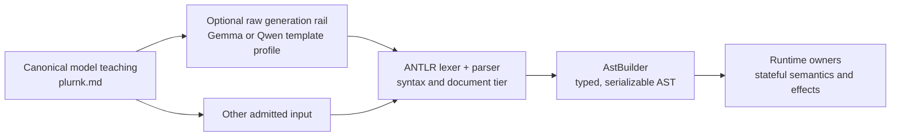

# PLURNK Contracts Specification

## 1. Overview

§contract-authority This package is the single authority for PLURNK's language, schemas, generated
types, parser, model rail, and runtime-neutral wire envelopes. Its package root
is the single code API for those contracts.

| Surface                                                                         | Canonical export or artifact                        |
| ------------------------------------------------------------------------------- | --------------------------------------------------- |
| Parser, AST, validators, Problems, results, Notices, text regions and extents   | `@plurnk/plurnk-contracts`                          |
| Capability and loop policies with their defaults                                | `CapabilityPolicy`, `LoopPolicy`, `DEFAULT_CAPABILITY_POLICY`, `DEFAULT_LOOP_POLICY` |
| Durable reasoning intent                                                        | `ReasoningPolicy`, `REASONING_POLICIES`             |
| Model route and catalog discovery                                               | `ModelRoute`, `ModelCatalogQuery`, `ModelCatalogPage`, `ModelReadiness` |
| Stopped-world client contract                                                   | `ProposalDisposition`, `ProposalProjection`         |
| Client-owned interaction contract                                               | `ClientInteractionRequest`, `ClientInteractionProjection`, `ClientInteractionResolution` |
| Client capability presentation                                                 | `ClientDisplayCapabilities`                         |
| Exterior adapter application calls                                             | `ApplicationPort`                                   |
| Workspace MCP configuration                                                    | `McpServerDefinition`, `McpServerOptions`, `McpConfigurationOverlay` |
| Worker Agent Skills definition                                                 | `SkillDefinition` |
| Worker outbound A2A agent definition                                           | `A2aAgentDefinition` |
| Worker Functionality lifecycle projections (family-neutral)                     | `FunctionalityCandidate`, `FunctionalityDiscoverQuery`, `FunctionalityDiscoverResult`, `FunctionalityDefinitionState`, `FunctionalityListResult`, `FunctionalityMutationResult` |
| AG-UI discovery, client accounting, and shared conformance specimens           | `AguiDiscovery`, `AguiClientConformance`, `AguiConformanceKit` |
| JSON Schemas                                                                    | `@plurnk/plurnk-contracts/schema/*.json`            |
| Generated JSON result rendering                                                 | `renderJsonResult`                                  |
| Local-model rails                                                               | `@plurnk/plurnk-contracts/plurnk.{gemma,qwen}.gbnf` |
| Model language reference                                                        | `plurnk.md` in the package                          |

§contract-representations JSON Schema is authoritative for shared data shapes. TypeScript types are
generated from the schemas; ANTLR is authoritative for accepted model-language
syntax; GBNF remains the bounded generation aid described in §1.2.

§agui-discovery-contract `AguiDiscovery` is the complete installed AG-UI+
surface at one instant. `schemaVersion` identifies its discovery shape;
`actions` maps each unique public name to exactly one `scope`, `inputSchema`,
and `outputSchema`; `notifications` maps each unique event-family name to one
`payloadSchema`; and `display` carries {§client-display-capabilities} without
another presentation mechanism. The AG-UI owner supplies the built-in registry;
an extension contributes the same schema-bearing action descriptor through its
core module registration rather than creating a second action type.

§agui-action-schema-enforcement The JSON Schema values in
{§agui-discovery-contract} are executable boundary contracts, not prose or
hints. The AG-UI boundary rejects an action input before dispatch when it does
not satisfy the advertised `inputSchema`, rejects an owner's successful output
when it does not satisfy `outputSchema`, and validates a known notification
before projecting it to AG-UI. Schemas are discovery values owned by their
registrants; validation must not annotate or otherwise mutate them.

§agui-client-conformance `AguiClientConformance` is a language-neutral JSON
document accounting for every action and notification in one
{§agui-discovery-contract}. Each name is classified as `native` (dedicated
client behavior), `generic` (lossless protocol support without dedicated UI),
or `unsupported` with an explicit reason, and cites nonempty verification
evidence. Each disposition declares the exact verification dimensions its
evidence covers; native behavior includes admission and presentation, every
action includes projection plus success and failure, and every notification
includes framing plus projection. Validation requires exact action and
notification key equality with the installed discovery surface; adding or
removing a public capability therefore breaks every stale client matrix
visibly. The contracts-owned report procedure resolves every cited evidence
path and emits one record per member with its posture and verified dimensions;
a stale or fictional citation fails the report.

§agui-conformance-kit `AguiConformanceKit` is the one versioned,
language-neutral corpus of raw SSE boundary specimens and AG-UI lifecycle
sequences used by every client transport. Its JSON resource is test input, not
a third protocol implementation: each client feeds the same chunks and events
through its production parser and projection seam, then verifies the declared
outcome. Specimen names are unique within their transport or lifecycle family.

§json-result-rendering `renderJsonResult` renders compact aggregate operation
rows. A top-level array remains one valid,
compact JSON value but places each item on its own physical line by adding only
item-boundary newlines; an empty or single-item array and every non-array value
remain one line. It never rewrites arbitrary stored JSON, whose original lines
remain source coordinates.

§json-document-presentation Generated JSON documents use two-space indentation.
Normalized remote JSON text uses `formatJsonDocument`: whitespace-only formatting
of a complete, strict JSON document, preserving key order, duplicate keys, number
lexemes, and string escapes. Invalid or incomplete input is declined, not repaired.
Apply formatting at the representation owner before storage, indexing, scoping,
and previews; never reformat literal resources, JSONL framing, or wire/evidence
serialization. Compact aggregate rows ({§json-result-rendering}) and packet
metadata retain their deliberate layouts.

## §contract-layers 1.1 Contract layers and admission boundary

PLURNK uses one contract with deliberately different projections. A tolerant
ingester accepting a spelling does not make that spelling canonical model
teaching, and a generation rail admitting a sentence does not make its runtime
semantics valid.



| Layer                    | Owner or artifact                   | Contract                                                                        |
|--------------------------|-------------------------------------|---------------------------------------------------------------------------------|
| Stable current law       | `SPEC.md`                           | Owns invariants and boundaries; forge issues retain history                     |
| Canonical model teaching | `plurnk.md`                         | Teaches the lean spelling and operational model the model should emit           |
| Constrained generation   | generated `plurnk.*.gbnf`           | Increases likely ANTLR compliance without reproducing all parser/runtime checks |
| Accepted syntax          | `plurnkLexer.g4`, `plurnkParser.g4` | Recognizes document tiers, operation fences, slot shape, and section boundaries    |
| Typed admission          | `AstBuilder`                        | Produces JSON-serializable unions and validates deterministic body/path syntax  |
| Shared wire data         | `schema/*.json`                     | Defines runtime-neutral data shapes projected into generated TypeScript         |
| Stateful behavior        | consuming runtime                   | Resolves addresses, permissions, selection arithmetic, effects, and lifecycle   |

ANTLR owns statement structure, fence matching, slot multiplicity, accepted
slot permutations, scope-number syntax, and interstatement text recognition.
AstBuilder owns URL decomposition and deterministic matcher validation through
WHATWG `URL`, ECMAScript `RegExp`, XPath 1.0, and RFC 9535 JSONPath parsers.

The runtime owner decides facts that require state or operation-specific
meaning, including registered scheme resolution, target existence, tag
selection, text-region bounds, result ordering, full-text ranking, mutation
effects, executor behavior, and numeric operation-code semantics.

### §contract-proposal-projection Loop policy and stopped-world projection

The schemas own the runtime-neutral shapes; core owns their stateful values.

| Contract                  | Shape invariant                                                                 | Runtime responsibility                                                                 |
| ------------------------- | ------------------------------------------------------------------------------- | -------------------------------------------------------------------------------------- |
| `CapabilityDescriptor`    | One routed operation demand with its operation, access class, resource/runtime/tool coordinates, and declared traits | Derive every demand before dispatch |
| `CapabilityPolicy`        | Exact `only`/`deny` selectors; omitted `only` is unrestricted and present empty `only` denies all | Intersect service, workspace, Worker, and loop layers |
| `CapabilityProjection`    | Exact service, workspace, immutable Worker bound, mutable Worker, and normalized effective policies | Expose the resolver's Worker-level cascade to clients without claiming one layer is effective authority |
| `LoopPolicy`              | Complete capability attenuation plus one `review`, `accept`, or `reject` proposal disposition | Snapshot once when the loop is created |
| `ProposalDisposition`     | Client authority, or the loop's exact automatic accept/reject                   | Compute precedence from effective loop policy, proposal kind, and stale-target truth   |
| `ProposalProjection`      | Identity, `{ scheme, authority, pathname }` review target, body/attrs, effective policy, stale signal, disposition | Derive one validated projection for live delivery and durable reconnect discovery |
| `ProviderUsage`           | Conventional input/output totals with cache and reasoning details                | Preserve observed quantities without replacing absence with zero                        |
| `ProviderCost`            | Exact charged, estimated, or unknown monetary evidence                           | Normalize one monetary disposition for each physical provider request                    |
| `ProviderRequestAccounting` | Usage and cost evidence for one physical provider request                      | Preserve request order across retries, failover, success, and failure                    |
| `ProviderAccounting`      | Ordered requests plus deterministic usage and exact-USD projections              | Derive loop, protocol, telemetry, and client reporting without a second authority        |

§capability-policy-matching A selector is an exact conjunction: every field it
declares must equal the descriptor, while every selected `trait` must occur in
the descriptor's trait set. `deny` wins within a layer. When `only` is present, at
least one selector must match. An empty policy admits everything and an empty
`only` list admits nothing.

§capability-policy-cascade Capability layers are purely subtractive and
order-independent: a descriptor is admitted only when every layer admits it.
No Worker or loop can restore service, workspace, or parent authority. A
composed operation is admitted only when every routed demand survives. These
descriptors govern routed external authority, not every grammar statement:
log/program control such as log KILL, the native dispositions, and
targetless SEND creates no capability demand. A known interactive runtime is represented by
access class `interact`; scheme and runtime manifests contribute traits rather
than hidden policy behavior.

§capability-policy-projection A `CapabilityProjection` reports every durable
Worker-level layer and their normalized intersection. The `worker` field is the
only client-mutable layer; `effective` is the authority a new unattenuated loop
would receive. A client never derives effective authority from the mutable
layer alone. Per-loop attenuation remains an immutable input to that loop and
is therefore absent from this durable Worker projection.

§loop-policy `DEFAULT_CAPABILITY_POLICY` and `DEFAULT_LOOP_POLICY` are the
contracts-owned complete defaults. A loop policy is immutable after creation;
its `capabilities` field only narrows broader authority and its `proposals`
field chooses one unambiguous downstream settlement posture. Capability
admission precedes effect classification and proposal settlement.

§reasoning-policy-wire `ReasoningPolicy` is exactly `off | adaptive | low |
medium | high`. The schema owns this shared wire vocabulary. Providers own the
supported subset and native projection for a selected route; core owns the
durable worker value.

§model-catalog-wire `ModelRoute` is one exact client-visible provider/model
identity with optional alias provenance. Provider credentials, endpoints, and
tuning never enter this wire shape. Catalog discovery uses a
closed bounded query and page: entries carry exact selectors, display facts,
physical limits, capabilities, and local `ModelReadiness`. A readiness cause
contains alternative environment-variable sets—every name within a set is
required and any set may satisfy the cause. It carries names only, never values,
and asserts neither credential validity nor endpoint reachability.
`capabilities.reasoningPolicies` lists the route's admitted members of
{§reasoning-policy-wire}, including supported activation policies; clients do
not infer fixed efforts from the `reasoning` capability bit. It is not a
worker's model/spawn intersection or an alias-specific tuning projection.

### §client-interaction-wire Client-owned interaction wire

The closed client-interaction schemas describe one operation asking its client
for structured input without transferring private protocol continuation state.

| Contract | Shape invariant |
|---|---|
| `ClientInteractionRequest` | Non-empty `toolName`, object `arguments`, optional non-empty `message`, and object `responseSchema` |
| `ClientInteractionProjection` | Positive interaction, worker, loop, and turn identities plus the exact request; workspace scope remains the containing transport envelope |
| `ClientInteractionResolution` | Exactly `{ status: "resolved", payload? }` or `{ status: "cancelled" }` |

Opaque upstream request identities, retry state, credentials, and callbacks are
not members of these schemas. The operation owner retains and interprets those
facts; core and client interfaces carry only this standard interaction.

§provider-usage `ProviderUsage` records only known non-negative safe-integer
quantities. `inputTokens` includes every input category; cache reads and cache
writes are details within it. `outputTokens` includes reasoning; text and
reasoning are details within it. Within one physical request, `totalTokens`
equals input plus output whenever all three are present, a detail is no greater
than its containing total, and a complete detail partition sums to that total.
An omitted field is unknown; an explicit zero is provider evidence or an exact
derivation from complete known components. Consumers never estimate a token
category from text length.

§provider-cost `ProviderCost` represents one physical provider request's
monetary disposition. `charged` preserves a provider-reported canonical decimal
amount and currency, with an optional decimal USD equivalent for a non-USD
charge. `estimated` preserves a calculated decimal amount and currency.
`unknown` requires a reason. Zero is an ordinary exact amount under `charged`
or `estimated`; there is no separate free mechanism. Decimal strings preserve
evidence without binary floating-point rewriting. Unknown is not zero.

§provider-request-accounting `ProviderRequestAccounting` is the indivisible
accounting fact for one issued physical request. Its provider, model, outcome,
optional protocol status, optional {§provider-usage}, and required
{§provider-cost} travel together. Ordered request records preserve retries and
capacity failover; a later response never replaces an earlier request.

§provider-accounting `ProviderAccounting.requests` is the source evidence.
`usage` and `costUsd` are deterministic projections of that ordered set, not
independent inputs. Each usage field sums the requests that report that exact
quantity; an unreported quantity is skipped rather than invented as zero or
allowed to erase known evidence. Detail fields are likewise independent sums,
so heterogeneous request telemetry never implies a complete aggregate
partition merely because their reported keys overlap. `costUsd` sums every
USD-expressible request and is `null` only when none is expressible. The empty
request set projects explicit zero usage and cost. Consumers do not recompute
provider rates or convert currencies while reading the projection.

The parser returns ordered statement, error, and text items. It recovers at a
trustworthy statement boundary when possible and sets `unparsedTail` when a
boundary-destroying failure makes later input undefined. Operation status codes
and parse diagnostics are separate contracts.

## 1.2 GBNF Generation Rail

§gbnf-rail-purpose ANTLR and AstBuilder own accepted syntax and admission.
Generated `dist/plurnk.{gemma,qwen}.gbnf` are bounded sampling aids, not
another parser or a semantic guarantee. The complete build generates both;
they are not source-controlled. Source and differential tests exercise the
generator, and packed-artifact coverage verifies its exports.

§gbnf-turn-shape Both profiles generate ordinary
operation blocks, and one disposition block ending the turn. NEXT requires
at least one ordinary operation. The rail uses matching three- or four-backtick
fences; ANTLR also admits longer matching fences. There is no
turn-wide delimiter, heading lane, or outer program wrapper.

§gbnf-reasoning-boundary Sampling constraints begin at token zero. Gemma emits
a nonempty `<|channel>thought\n … <channel|>` reasoning enclosure. Qwen's
template supplies `<think>\n`; its sampled root emits nonempty reasoning and
`</think>`. Each artifact declares an `@plurnk-response-root`, which restores
any template prefix when checking complete provider evidence. The projected
content alone is not checked as though it still included reasoning.

§rail-heading-boundaries Rail bodies exclude their closing fence sequence,
including at the start of a one-line matcher. Bodyless operations admit inline
and empty multiline blocks. Blank lines may separate blocks. OP names and
Markdown headings remain literal body content. Four-backtick rail blocks admit
literal triple-backtick code fences in their bodies.

§gbnf-kill-shaping KILL has a required target, optional numeric or anchored
text scope, and optional one-line matcher. The rail does not prove that a target
or selection exists.

## §canonical-statement 2. Canonical statement form

`````text
```OP (path)? {metadata}* <scope>? <!-- annotation -->?
body
```

```OP (path)? <scope>?```

```executor (program-or-tool)?
input
```
`````

§section-boundary Every statement is one executable backtick block. Its header
occupies one physical line. A fence has at least three backticks; its closing
fence has exactly the same count and no following text except horizontal
whitespace. Each statement chooses its own count independently. There are no
operation suffixes or heading levels.

§fence-boundary A matching fence on its own line closes a multiline body;
a different-length fence or a fence carrying text is literal body content.
A bodyless statement may close on its header line after its modifiers.
At top level, a header names a reserved Plurnk operation or an executor.
Inside an open body, no header is executable. An unfinished block establishes
{§unparsed-tail-boundary}; earlier complete operations remain independently
admissible.

§empty-section Both the compact bodyless form and an empty multiline block
normalize optional bodies to null. NEXT and WAIT normalize an empty body to `[]`
under {§plan-value}. Closing fences are required even for bodyless operations.

§statement-rendering `PlurnkParser.stringify` renders native OP names and named
EXEC executors from the shared AST. It chooses at least three backticks and
more than any run within the body, preserving body bytes on reparse. Fence
length is syntax, not AST or persistence state. Core-authored programs use
this serializer and the ordinary admission parser.

| Element | Contract |
|---|---|
| Fence name | Reserved native OP, otherwise a registered executor or attached MCP service |
| `(path)` | Target/program/tool slot; COPY and MOVE each have two resource operands |
| `{metadata}` | Opaque owner-defined modifiers; not JSON input in disguise |
| `<scope>` | Operation-specific numeric or anchored coordinates |
| `<!-- … -->` | Optional final, single-line annotation |
| Body | Literal content between framing newlines |
| Closing fence | Exactly the opening backtick count |

§slot-order Producers put target, metadata, scope, then annotation, separated
by one ASCII space. COPY/MOVE repeat the target/metadata/scope group per
operand. ANTLR accepts adjacent slots and the admitted target/scope
permutations without making them distinct canonical forms. Each slot appears
at most once, except metadata blocks attached to their owning target.

§plan-slotless NEXT and WAIT accept no target or metadata. WAIT alone accepts
its lifecycle timing scope. Their inventory bodies begin below the header.

§heading-inline-body Nonempty body text belongs below the fence header.
The ingester tolerates body text after horizontal whitespace on the header,
preserves it, and emits one warning stating that normalization. This does not
change the meaning of a compact empty block or permit unmatched fences.

§operation-annotation The final header modifier may be one single-line HTML
comment. AstBuilder removes its delimiters and surrounding whitespace into
`annotation: string | null`. It is durable descriptive text, not authority,
routing, timing, or body input. Comments inside a body remain literal except
for the narrowly owned {§misplaced-annotation-advisory}.

§scheme-metadata-modifier A target may carry repeatable single-line
`{metadata}` blocks; EXEC also admits them without a target. Balanced braces
inside blocks are retained, and double-quoted strings protect their braces.
The AST preserves each block's exact inner text in order. Braces inside
`(path)` remain ordinary path/glob characters. The selected scheme or executor
owns interpretation, validation and authority; the language assigns no meaning
to metadata. An unfinished block or multiline metadata loses its boundary.

## 3. Lexical elements

| Element | Shape or role |
|---|---|
| Native OP | `FIND READ EDIT COPY MOVE SEND EXEC BARE WORK FORK KILL NEXT WAIT DONE FAIL` |
| Executor name | Letters, digits, `_`, `.`, `+`, or `-`; reserved OPs win |
| Fence | Three or more backticks, matched by exact count |
| `(path)` | Local path, URI, program or tool name; §5 |
| `{metadata}` | Opaque, repeatable owner-defined modifier |
| `<scope>` | Numeric or anchored coordinates; §7 |
| Body | Literal text; never recursively interpreted as operations |

## §op-shapes 4. Per-operation semantics

The model-facing forms below are the canonical projection. Parser tolerance is
governed by {§canonical-statement}; runtime conditions remain explicit below.

| OP   | `(path)`                                     | `<scope>`                       | `body`                         |
|------|----------------------------------------------|---------------------------------|--------------------------------|
| FIND | required target or glob                      | optional result range           | optional matcher               |
| READ | required target                              | optional text region            | empty                          |
| EDIT | required file or entry                       | required for an existing target | literal text                   |
| COPY | required source and destination              | optional region after each path | empty                          |
| MOVE | required source and destination              | optional region after each path | empty                          |
| EXEC | fence names executor; optional program/tool path ({§exec-executor-slot}) | optional timeout, poll     | optional program input        |
| BARE | optional prompt resource                     | none                            | prompt; optional with a path   |
| WORK | required fresh `worker://name`               | none                            | required prompt                |
| FORK | required context-inheriting `worker://name`  | none                            | required prompt                |
| KILL | required target, including a log item        | optional text region ({§kill-scope}) | optional matcher          |
| SEND | optional recipient | optional recipient timing | message |
| NEXT | none | none | Plurnk Plan JSON array |
| WAIT | none | optional timeout and poll | Plurnk Plan JSON array |
| DONE, FAIL | none | none | user-facing message |

§operation-code-polymorphism Operation-result statuses and turn dispositions are
distinct facts. NEXT, WAIT, DONE, and FAIL derive their requested lifecycle
outcome from the operation name; SEND and KILL carry no disposition operand.

§plan-value **NEXT and WAIT carry the model's task inventory.**
Finished actions are `completed`, open work is `pending`, and active work is
`in_progress`. Admission parses the JSON body — one JSON array document in any whitespace layout, including the {§json-result-rendering} spread the log projects — strips unknown
entry keys, and validates
the canonical bare array: every entry has string `content` and `status` in
`pending | in_progress | completed`. A nonempty plain-text,
malformed-JSON, or otherwise invalid body becomes one `in_progress`
entry whose content is the exact authored body; admission performs no partial
repair or list inference. An empty body becomes the planless `[]`
value. Each continuation body is one complete semantic value;
prior inventories remain ordinary curatable log items. The exact `turnOps`
source remains forensic program evidence, while the normalized array is the sole
semantic value used by AST, persistence, durable log bodies, and model-packet
materialization. The inventory is public log content—not
provider reasoning—and Plurnk initially mints no `_meta` values. There is no
PLAN operation or separate inventory row. Inventory statuses do not create
runtime obligations or change NEXT/WAIT transitions. An empty-join WAIT preserves
its canonical inventory as its successful terminal result, with JSON mimetype;
it does not mark entries completed or discard the body.

§plan-acp-projection **Only an ACP-facing boundary projects the model-native
Plan.** It constructs ACP's `{ "entries": [...] }` Plan object from the internal
array, synthesizes the ACP-required neutral `medium` priority on every entry
(the model-native Plan carries none). Every entry field remains unchanged, and
the internal value is not mutated.
The projected value validates against the separately owned ACP Plan schema pinned
to ACP v1
[`schema-v1.21.0`](https://github.com/agentclientprotocol/agent-client-protocol/tree/schema-v1.21.0)
commit `272bf799f35a258c6a4107a0410ed361e83683d3`.

§exec-executor-slot The fence name selects the executor directly: for example,
`python3 (tools/report.py)` or `gitea (issue_list)` on the opening fence line.
Reserved native OP names take precedence. Other names lower to the same EXEC
AST with `executor`, `target`, metadata, timing and body fields.
Registration is checked by the runtime, not by the syntax parser. An attached
MCP service uses that executor path and its owner validates the named tool and
input-body JSON against its schema. Unknown names do not fall back to a shell.
The native `EXEC` form without a selected executor retains the runtime's
default executor contract; canonical shell examples name `sh` explicitly.
The path names a program or tool and is never split. Metadata such as
`{cwd=…}` remains interpreted by the selected executor.

§turn-disposition NEXT, WAIT, DONE, and FAIL are native operations whose names
remain intact in the AST, durable log, and client events. `TurnDisposition`
derives their lifecycle status: NEXT → 102, WAIT → 202, DONE → 200, FAIL → 499.
The AST has no independently settable status, target, or metadata for them.
SEND only messages its recipient, or the user when targetless; it never
supplies a turn disposition. The numeric runtime lifecycle and completion
checks are unchanged. No old label syntax is a disposition alias.

§send-wait-scope WAIT keeps its numeric `<scope>` — the park interval and poll
({§park-202-only}); the dispatcher owns its bounds. Other dispositions take no scope.

§send-directed-scope A recipient SEND preserves an optional numeric scope after
its target and metadata. The addressed owner assigns its semantics; worker
actors use `<delay[,interval]>` ({§worker-scheduled-send}). A targetless message
takes no scope. Scheduling does not change the message body or disposition.

§kill-scope KILL takes an optional text-coordinate scope beside its target, numeric or
anchored (```` ```KILL (log:///**/READ) <17,-1>``` ```` or
```` ```KILL (worker:///notes.md) <@aB3dE,@0Aa9Z>``` ````), and an optional one-line matcher body that selects rows. The AST
is `{ op: "KILL", target, lineMarker: TextLineMarker | null, body: MatcherBody | null }`.
Without a scope, KILL retires or deletes the whole target; with one, it removes exactly
that span — of a log body's packet projection or of an entry's content. Core owns the
one-way semantics: there is no operation that restores a scoped-away log body.

§legacy-bracket-slot No header has a bracket modifier. The runtime or MCP
service is the fence name, and tool input belongs in the body. A stray `[`
produces one bounded header diagnostic; it cannot select another executor.

The `<scope>` slot is optional where admitted and its domain is OP-specific. FIND
scopes ordered results. EXEC and SEND scope owner-defined timing. READ, EDIT, COPY,
MOVE, and KILL use one universal text algebra independent of mimetype; a log
KILL admits only its one- and two-line forms for canonical log-body visibility:

| Arity         | Surface meaning                                                     | Endpoint rule                                        |
|---------------|---------------------------------------------------------------------|------------------------------------------------------|
| one integer   | One whole physical line, or the documented `0`/`-1` mutation anchor | Exactly one ordinal line                             |
| two integers  | Whole physical lines `firstLine..lastLine`                          | Both lines are included                              |
| four integers | Exact `startLine,startColumn,endLine,endColumn` region              | Start included, end excluded; equality is zero-width |

§text-scope-semantics Exact regions use 1-based lines and Unicode code-point columns. One- and
two-integer line selections normalize to the same exclusive-end `TextRegion`
used by four-coordinate selections. Whole-line replacement deliberately
accounts for newline separators; it is an ergonomic projection over exact
replacement, not a different mimetype navigation mode. An end bound beyond
the available content clamps to the final addressable endpoint; the start bound
must resolve. As an unadvertised
ingestion tolerance, the runtime accepts three integers as
`startLine,startColumn,endLine` and immediately normalizes them to the complete
four-coordinate region ending after the final code point of `endLine`.
Producers never emit that form. Other arities and decimal text coordinates are
runtime 416 failures.

§bare-statement **BARE requests one isolated model inference.** Its optional
path names a prompt resource; its body supplies inline prompt text. At least
one must supply nonempty text at execution. With both, the complete resource
text precedes the body, separated by two newlines. The target's scheme owns any
metadata modifier. No scope, persistent worker identity, or output-language
shape is represented. Provider selection, source admission, batching,
accounting, and observation timing belong to the consuming service.

§read-find-normalization An authored READ with a nonempty matcher body or a
target path classified as a glob normalizes during AST construction to one
ordinary FIND statement. Target, signals, scope, and matcher are preserved;
FIND's result pagination and projection contract then applies. The canonical
AST retains no parallel matcher-READ mode, and the runtime performs no READ
fan-out.

§read-exact-target After normalization, READ targets one exact resource (a
local path or scheme URL, with optional `#channel` fragment or
`{header: value}` metadata) and has no matcher body. A `<scope>` on READ selects
a text region from that exact target. Without a scope, READ defaults to
`<1,16>`; `<1,-1>` explicitly selects all text. Decimal scope components are
invalid on READ.

Mutation semantics:

- No scope and a target address that does not yet exist creates a file or entry from the body. This is the only unscoped EDIT.
- §unscoped-edit-create-only No scope and an existing target is refused. Replacing existing content requires a precise text scope or `<1,-1>`; core owns the existence check.
- `<N>` replaces whole line `N`; `<N,M>` replaces inclusive whole lines `N` through `M`.
- An empty body deletes the selected text.
- `<0>` prepends and `<-1>` appends.
- §empty-mutation-scope Empty mutation content has one writable position: `<0>`, `<1>`, `<-1>`, and `<1,-1>` all insert the body as its complete value. Other scopes resolve against that same empty value through the ordinary coordinate algebra.
- `<SL,SC,EL,EC>` deletes the exact exclusive-end region and inserts the body at its start.
- §transfer-resource-selections COPY and MOVE require two singular `ResourceSelection` operands on the heading, source first and destination second, and admit no body. Each operand consists of `(path)`, any following `{metadata}`, and an optional following `<scope>`; modifiers bind only to the immediately preceding path. The two operands independently select their resource, channel, scheme metadata, and text region.

### §operation-observation Per-operation observations

| OP   | Successful observation                                                            |
|------|-----------------------------------------------------------------------------------|
| FIND | Resource catalog groups or exact-target match locations                           |
| READ | Complete or scoped body projections plus optional text match evidence             |
| EDIT | Status plus a bounded receipt for the effect that landed                          |
| COPY | Source and destination selections plus ordered destination effects                |
| MOVE | Source and destination selections plus ordered destination and source effects     |
| SEND | Status and recipient acknowledgement when applicable                              |
| EXEC | Spawn acknowledgement; output arrives through named stream channels               |
| BARE | The one-shot model response                                                        |
| WORK | Spawn acknowledgement; the deliverable arrives through the log                    |
| FORK | Spawn acknowledgement; the inherited worker's deliverable arrives through the log |
| KILL | Status of deletion or termination                                                 |
| NEXT / WAIT | Continuation inventory and lifecycle disposition                          |
| DONE / FAIL | Terminal result                                                          |

§find-result-unit For FIND, authored target shape fixes the paginated result
unit. An exact target with a matcher pages flat match locations; a glob or
folder target, and every body-less FIND, pages resources. Resolving a glob to
one resource does not make it exact. The same `<N>`, inclusive `<N,M>`,
markerless `<1,16>`, and explicit-all `<1,-1>` forms apply to either unit.

§copy-move-observation COPY and MOVE log projections preserve both admitted operand selections,
including their independent scopes, whether the result changed state, was a
304 no-op, or failed after admission. Operands identify the request; `effects`
describe only mutations that landed. If either operand uses textual scope,
each landed textual create or update carries the same bounded receipt used by
EDIT. Whole-channel transfers remain bodyless structural effects; runtime
owners reject binary markers rather than treating a text field as a byte lane.

Every operation returns the runtime-neutral `OperationResult` defined by
{§operation-result}. Its `status` belongs to the result envelope and is not a
SEND signal. Durable operation observations are projected into a later packet;
retrieval never returns inline within the emitting turn.

## §path-syntax 5. Target and path grammar

The target slot contains either a local path or a scheme URL. Exact addresses
and path globs share the slot; content matchers belong in the body.

| Form                    | Typed admission                                                     | Runtime meaning                                      |
|-------------------------|---------------------------------------------------------------------|------------------------------------------------------|
| Bare path               | `LocalPath { kind: "local", raw }`                                  | Resolves through the runtime's file surface          |
| `scheme://…`            | WHATWG-decomposed `UrlPath`                                         | Resolves only when a runtime scheme owns the address |
| Path glob               | Preserved in either path kind                                       | Scheme defines collection selection and ordering     |
| `#channel` fragment     | Preserved as `UrlPath.fragment`                                     | Selects a named channel when the scheme supports it  |
| `?query`                | Preserved as ordered `UrlPath.query`; `null` = absent, `""` = `?`   | Participates in scheme resource identity             |

AstBuilder recognizes a URL with the case-insensitive prefix
`[a-z][a-z0-9+.-]*://`, passes it through WHATWG `URL`, and surfaces malformed
URL structure as a visitor error. A target without that prefix remains a raw
local path. Grammar acceptance does not register a scheme; the runtime scheme
catalogue and packet-time scheme teaching remain dynamically owned elsewhere.

§path-query The serialized query component is the lossless representation.
Ordering, duplicate names, encoded spelling, and the distinction between an
absent query and an explicit empty query survive parsing. Consumers that need
key/value access may construct `URLSearchParams`; the shared AST does not replace
URI identity with a grouped object projection.

§path-parentheses An unescaped depth-zero `)` closes the target slot. The
tolerant lexer preserves balanced unescaped parentheses, while canonical
producers use one lossless Plurnk lexical layer before target interpretation:

| Target-slot spelling | Interpreted character |
| -------------------- | --------------------- |
| `\\`                 | `\`                   |
| `\(`                 | `(`                   |
| `\)`                 | `)`                   |

Decoding consumes only those three pairs in one left-to-right pass; unknown
pairs such as `\*` retain both characters for glob interpretation. Encoding
escapes backslashes before parentheses, so every target string round-trips.
Pathname producers retain the deliberate `%28`/`%29` alias and `%3C` spelling,
but must use the lexical layer for identity-bearing query and fragment text
rather than changing their percent-encoded spelling. Newlines and raw `<` are
never target content. Glob metacharacters remain legal path data.

§path-glob `PathSyntax` owns exact-path versus path-pattern classification.

| Method                           | Contract                                                                 |
| -------------------------------- | ------------------------------------------------------------------------ |
| `hasGlob(pathname)`              | Recognizes `*`, `?`, character-class, brace, extglob, and escape syntax  |
| `globMagicIndex(pathname)`       | First such position, solely for conservative candidate-prefix selection  |

Matching and folder-scope semantics remain runtime concerns.

§worker-name The exported `WORKER_NAME` contract governs names minted for URI
authority slots: a lowercase DNS label matching
`[a-z0-9]([a-z0-9-]{0,61}[a-z0-9])?`. `RESERVED_AUTHORITIES` contains the
authority-shaped internal worker names `commons` and `plurnk`, which are
unavailable for minting. `~` is the sole current-worker sigil and falls outside
the mintable alphabet; every matching unreserved value, including `self`, is an
ordinary literal worker name. This is a minting and registry invariant, not an
ingestion restriction: the parser decomposes arbitrary URL authorities.

## §matcher-prefix-claims 6. Bulk pattern matching

FIND, authored READ, KILL, LOOK, and BUFF accept an optional body matcher.
The lexer preserves the body opaquely; AstBuilder assigns the dialect from its
leading characters, then normalizes matcher-bearing READ to FIND under
{§read-find-normalization}.
A leading prefix claims its dialect. Invalid claimed syntax is a positioned
visitor error and never falls back to glob matching.

- §heading-boundary-recovery A column-0 heading is the trustworthy boundary. After a
  statement-level error the parser discards the rest of that statement and resumes at the
  next heading; the turn shape is decided locally (a turn disposition is recognized by its own
  token, never by a whole-turn alternative), so one malformed heading costs one
  diagnostic and every later statement, the turn disposition included, stands on its own. Any
  other second path slot names the one-slot rule.
- §scope-slot-tolerance A line scope written inside a path slot (```` ```COPY (worker:///src.md<2,3>) ````)
  is read as `(worker:///src.md) <2,3>` — `<` and `>` are not URI characters, so a `<…>` right
  before a slot's closing paren can only be a scope; every path slot of a statement is repaired
  the same way — and the slip is one warning-severity advisory at the `<`, placed right after its
  statement, stating the `(path) <scope>` form that was used. The statement runs; a warning is
  never a strike. A `<` anywhere else in the slot remains the lexer's refusal.
- §second-path-slot A second `(path)` on a heading that already closed one is a parser
  error at the second paren stating the one-slot rule and that a pattern belongs in the body;
  the statement is dropped and its siblings run.

| Prefix    | Dialect  | Canonical body                       | Typed admission                   | Runtime owner       |
|-----------|----------|--------------------------------------|-----------------------------------|---------------------|
| `//`      | XPath    | `//selector`                         | XPath 1.0 `xpath.parse()`         | Mimetype projection |
| `/`       | Regex    | `/pattern/flags`                     | ECMAScript `RegExp` construction  | Mimetype projection |
| `$`       | JSONPath | RFC 9535 expression                  | `json-p3` compilation             | Mimetype projection |
| `~`       | Full-text | `~query`                            | Single-line raw string            | SQLite FTS5 index   |
| `&`       | Graph    | `&symbol`, `&<symbol`, or `&>symbol` | Exact shape validation            | Symbol index        |
| none      | Glob     | Shell glob or literal text           | Single-line raw string            | Mimetype projection |

XPath is classified before regex because its prefix is two slashes. Regex
splitting respects escapes and character classes; `\/` represents a literal
slash. The AST stores regex `pattern` and `flags`, not a compiled object.
SQLite validates full-text query expressions at execution. Graph admission validates its direction
and non-whitespace symbol before runtime. Every other leading character remains
in the fallback glob/literal dialect; `@(...)` is therefore an extglob group and
bare `@text` remains literal matcher text. Rendered READ coordinates are
structural output rows, not a reserved matcher prefix. FIND scope selects result
positions without changing the matcher body.

AstBuilder validation is compile-only and never evaluates a document. Matcher
evaluation belongs to the runtime's selected mimetype, FTS5, or symbol
implementation. A matcher admission error is local to its statement; later
statements remain recoverable when their boundaries are trustworthy.

- §pattern-body-single-line Every matcher body is one physical line. AstBuilder
  rejects multiline bodies before dialect classification, while GBNF excludes
  line terminators. A regex that matches a newline uses the two-character `\n`
  escape. Non-matcher operation bodies remain multiline.
- §pattern-body-leading-colon The GBNF rail forbids `:` as the first matcher
  character. Empty matchers and later colons remain valid; a regex such as
  `/^:needle/` expresses a pattern beginning with a literal colon.

## §scope-slot 7. Scope markers

The model-facing slot is `<scope>`; the AST field remains the historical
`lineMarker`. Numeric scopes preserve ordered components in `LineMarker`;
text-coordinate operations use `TextLineMarker`, whose line positions may also
carry rendered anchors. The operation owner assigns every component's role.

The operation column names the canonical AST operation after
{§read-find-normalization}.

| Operation             | Canonical components                   | Meaning                                                                    |
|-----------------------|----------------------------------------|----------------------------------------------------------------------------|
| FIND                  | optional threshold, then 0–2 positions | Inclusive resource or exact-target location positions ({§find-result-unit}; defaults to `<1,16>`) |
| READ / client LOOK    | 0/1/2/4 text coordinates               | Text projection from one exact selected file, entry, or log item           |
| EDIT                  | 0/1/2/4 text coordinates               | Text replacement, deletion, prepend, or append                             |
| COPY/MOVE source      | 0/1/2/4 text coordinates               | Region copied or moved from the selected source                            |
| COPY/MOVE destination | 0/1/2/4 text coordinates after target  | Region replaced or insertion point at the destination                      |
| KILL                  | 0/1/2 text coordinates                 | Whole target when absent; one physical line or inclusive range when present ({§kill-scope}) |
| EXEC                  | `timeout[,poll]`                       | Spawn lifetime bound and poll cadence in minutes                           |
| ```` ```WAIT ````     | `timeout[,poll]`                       | Bounded or indefinite wait and optional poll cadence ({§send-wait-scope})  |
| Directed SEND         | Owner-defined numeric scope           | Worker actors schedule a task with `delay[,interval]` ({§send-directed-scope}) |

Text coordinates use the algebra in {§text-scope-semantics}: one integer is a
whole line, two integers are an inclusive whole-line range, and four integers
are an exact start-inclusive/end-exclusive region. Mutation scopes additionally
admit `0` as prepend and `-1` as append. FIND result positions and READ
text coordinates do not admit decimal scope components. A log KILL intersects a valid body-relative line
scope with each selected body; an absent line is a successful no-op for that
body, while unsupported arity is a runtime failure.

§text-line-anchor-syntax A text coordinate admits a case-sensitive line anchor
spelled `@` followed by exactly five Base62 characters (`0-9A-Za-z`) wherever
its `L`, `SL`, or `EL` position denotes a line. Columns, prepend `0`, and append
`-1` remain numeric. Exact READ, EDIT, COPY/MOVE source and destination,
KILL, and client LOOK preserve these positions in `TextLineMarker`; core resolves them
against the addressed current text before operation-specific numeric scope
semantics run. A matcher-bearing or path-glob READ normalizes to FIND, whose
result positions remain numeric and reject anchors. Numeric text scopes remain
canonical and fully supported. Parser acceptance does not imply model-facing
recommendation.

§scope-marker-forms Canonical producers separate components with commas and no
spaces. ANTLR tolerates a dash separator and one space after a comma. Each
component greedily consumes an optional leading minus sign, digits, and an
optional decimal fraction, so the ingester preserves even noncanonical numeric
shapes for runtime validation. An anchor-bearing text scope uses commas; ANTLR
tolerates one space after each comma.

Apart from the unadvertised three-coordinate text-scope tolerance in
{§text-scope-semantics} and a log KILL's per-body empty intersection, the runtime rejects invalid arity, out-of-range or
inverted positions, and decimal text coordinates rather than rounding or
reinterpreting them. FIND owns a deterministic result order so the same
inclusive range selects the same positions from unchanged state. The parser
does not enforce either condition.

## 8. Literal programs and code blocks

A producer carrying literal fences uses an outer backtick count absent from
standalone fence lines in its body ({§fence-boundary}). The serializer chooses
a count greater than every backtick run in the body; parsed AST values carry
no framing state.

`````text
````EDIT (README.md) <1,-1>
Run the tests:

```sh
npm test
```
````
`````

The inner shell example is EDIT content, not an EXEC invocation. The same
rule protects code examples in SEND, WORK, FORK, BARE and every other body.

## 9. Turn dispositions

Native dispositions map to the existing HTTP-shaped lifecycle statuses:

| Class | Terminal meaning                                                | Disposition used by the model |
|-------|-----------------------------------------------------------------|-------------------------------|
| `1xx` | Continue after submitted operations                             | `NEXT` → 102                 |
| `2xx` | Conclude successfully or wait on live obligations               | `DONE` → 200, `WAIT` → 202    |
| `4xx` | Abandon the loop after a model-side inability                   | `FAIL` → 499                 |
| `5xx` | Runtime or infrastructure failure; never a model terminal claim | none                          |

### §waitpid-dispositions The terminal contract (waitpid)

The model signals one intention per turn — **continue (102)**, **done
(200)**, **wait (202)**, or **give up (499)** — and the engine verifies
the claim against the loop's live obligations (spawned children, open
streams, pending retrievals); the grammar polices *shape* only. Asking
the human is the native `question` EXEC tool ({§question-tool}), not a
disposition. The shape rules ARE structural:

- §send-mid-reservation The four native disposition OPs have reserved tokens
  ({§turn-disposition}). A turn admits exactly one disposition, and it ends the
  turn ({§disposition-ends-turn}): ordinary operations precede it, and the
  runtime executes it last. A second disposition is a structural
  error, not a choice between competing outcomes. GBNF uses the same rule.
- §disposition-ends-turn The disposition operation and its body end a model turn.
  `PlurnkParser.parse` admits no statement after them: trailing statements are
  recognized as operations, dropped, never executed, and reported as one hard
  diagnostic with `code: "operations-after-disposition"` anchored at the first
  dropped heading. The message names the disposition heading, counts what was
  dropped by OP (`3 operations after its body were not admitted (KILL ×1, READ ×1,
  SEND ×1)`), and states the rule: `Every OP, including KILL, precedes the
  disposition.` Bounded hard diagnostics positioned after the disposition
  belong to that dropped source and collapse into the same diagnostic as ignored
  malformed headings; the disposition's own advisories and a second-disposition
  structural error stand as before. A disposition the parser synthesized
  ({§turn-shape}) closes the source and never has a tail. The GBNF rails derive
  nothing after the disposition body ({§gbnf-turn-shape}). Saved turns use
  the same disposition boundary. Origin: on a constrained weak
  rail, three emissions in one night continued past a correct disposition into
  the packet they expected next, executing 194, 302, and 481 operations.
- SEND is communication: an optional recipient path and an optional body.
- §terminal-body-nonempty The GBNF rail requires a non-empty disposition body — a constrained
  turn cannot end empty-handed. ANTLR remains tolerant during ingestion.
- §park-202-only The **park** rides `(WAIT)` only: `<T>` (wait up to T minutes),
  `<T,P>` (adds a poll cadence, mirroring EXEC's slot), `<-1>`
  (indefinite; the join's own liveness bounds it). See §7 for the
  GBNF-strict / ANTLR-tolerant split.
- §no-idle-102 A **zero-statement turn may not conclude `(NEXT)`** — "continue"
  with nothing submitted is a spin. GBNF requires at least one non-disposition
  operation before NEXT. The other three stay legal bare (a zero-op
  `(WAIT)` is the engine's obligation check). ANTLR stays tolerant
  (ingest side). A dispatch-emptied turn — ops emitted but failing
  downstream validation — survives the rail by nature; the engine's
  idle-turn 409 backstops that class.

SEND with no `(path)` messages the user without ending the turn. SEND with
`(path)` directs the message to that recipient. Neither changes loop status.

### §send-body SEND body projection

SEND body syntax is opaque. AstBuilder preserves the exact `raw` string and
also exposes a best-effort `json` value when `JSON.parse` succeeds; invalid JSON
leaves `json: null` without invalidating an otherwise legal SEND. Plain text and
JSON are both messages, not implicitly stored resources, and the language
defines no synthetic scheme or READ-back convention for them.

## §parser-architecture 10. Parser architecture

ANTLR owns framing, slots and statement composition; AstBuilder produces the
schema-owned AST. Registration, effects and authority remain runtime concerns.

```mermaid
stateDiagram-v2
    [*] --> DEFAULT
    DEFAULT --> SLOTS: fenced native OP or executor
    SLOTS --> TARGET: (
    TARGET --> SLOTS: )
    SLOTS --> METADATA: {
    METADATA --> SLOTS: }
    SLOTS --> BODY: header newline or tolerated inline body
    SLOTS --> DEFAULT: matching compact closer
    BODY --> DEFAULT: matching standalone closer
    BODY --> BODY: literal content, including other fences
```

## §whitespace-contract 11. Whitespace and interstatement text

Body framing removes the header line ending and the single line ending
immediately before the closing fence. Every other body character is preserved,
including leading/trailing blank lines, indentation, CRLF and literal
backslash escapes. A formatter adds its own framing newline even when a body
already ends in one. Interstatement whitespace belongs to no body.

A header starts at column zero; the first operation may follow tolerated
provider preamble without a separating newline. Preamble TEXT has no execution
semantics. No generic Markdown rendering, indentation stripping or recursive
code-block extraction occurs. Only a header annotation has comment semantics.

## §public-api 12. Public API

The package root is the single JavaScript and TypeScript entry point. Shared AST
and wire types come from generated schemas; the small hand-maintained parser
types cover ordered parse items and `PlurnkParseError`, which JSON Schema cannot
express. Consumers never receive ANTLR parse-tree or token types.

§turn-shape `PlurnkParser.parse` accepts one operation-bearing model turn.
One disposition ends the turn ({§disposition-ends-turn}). If complete valid
operations omit it, the parser appends NEXT with an empty inventory (`[]`),
`UNKNOWN_POSITION` and one hard `missing-turn-disposition` diagnostic; the raw
source is unchanged. Unfinished blocks never receive inferred closers.
Bounded operation errors retain valid siblings. Duplicate dispositions
and failed document boundaries remain structural failures.

`parseLog` reads consecutive saved turns separated by their dispositions and
requires their dispositions. There is no outer Markdown program wrapper;
the executable blocks themselves are the program.

§tier-entrypoints Each parser entry point owns one document tier:

| Entry point                    | Accepted document                                              | Result statement type |
|--------------------------------|----------------------------------------------------------------|-----------------------|
| `PlurnkParser.parse`           | One operation-bearing model turn with optional preamble TEXT; an omitted disposition recovers to NEXT | `PlurnkStatement`     |
| `PlurnkParser.parseStatements` | Zero or more protocol statements and hidden whitespace         | `PlurnkStatement`     |
| `PlurnkParser.parseLog`        | One or more consecutive disposition-ended turns           | `PlurnkStatement`     |
| `PlurnkParser.parseClient`     | Executable blocks, including read-shaped LOOK/BUFF commands      | `ClientStatement`     |

Every entry point returns ordered `statement`, `error`, and, where admitted,
`text` items. When present, {§unparsed-tail-boundary} governs the result's item
extent. The statement `op` field discriminates the generated per-operation
union.

§root-value-api The package-root runtime namespace is closed and consists of the
following supported consumer values. All other root exports are TypeScript types.

| Root value(s)                         | Consumer contract                                                   | Exact owner                                 |
|---------------------------------------|---------------------------------------------------------------------|---------------------------------------------|
| `PlurnkParser`                        | Four document-tier entry points listed above                        | {§parser-architecture}, {§tier-entrypoints} |
| `PlurnkParseError`                    | JSON-serializable positioned parser diagnostic                      | {§parse-diagnostics}                        |
| `parsePath`                           | Parser-equivalent target admission                                   | {§path-syntax}, {§tier-entrypoints}         |
| `PathSyntax`                          | Target-slot spelling and exact-versus-glob classification           | {§path-parentheses}, {§path-glob}           |
| `Validator`                           | Validation and assertion against the owning JSON Schemas            | {§wire-entrypoint}                          |
| `InvalidNoticeError`                  | Typed failure from `Validator.assertNotice`                         | {§notice}                                   |
| `InvalidProblemDetailsError`          | Typed failure from `Validator.assertProblemDetails`                 | {§problem-details}                          |
| `InvalidProblemProjectionError`       | Typed failure from `Validator.assertProblemProjection`              | {§problem-projection}                       |
| `InvalidOperationResultError`         | Typed failure from `Validator.assertOperationResult`                | {§operation-result}                         |
| `InvalidTextRegionError`              | Typed failure from `Validator.assertTextRegion`                     | {§text-region}                              |
| `InvalidRangeExtentError`             | Typed failure from `Validator.assertRangeExtent`                    | {§range-extent}                             |
| `Problems`                            | RFC 9457 Problem construction and model projection                  | {§problem-details}, {§problem-projection}   |
| `PLURNK_OPS`                          | Runtime tuple from which the closed `PlurnkOp` union is derived     | {§canonical-statement}                      |
| `WORKER_NAME`, `RESERVED_AUTHORITIES` | Authority minting predicate and internal reserved names             | {§worker-name}                              |
| `UNKNOWN_POSITION`                    | Frozen sentinel for an AST statement without retained parsed source | {§parser-position}                          |

§parser-construction-boundary Parser construction components are internal rather
than alternate consumer entry points:

| Internal component                         | Boundary                                                                                                      |
|--------------------------------------------|---------------------------------------------------------------------------------------------------------------|
| `AstBuilder`                               | Consumes generated ANTLR contexts; `PlurnkParser` and `parsePath` own its API                                |
| `PlurnkErrorStrategy`, `RecordingListener` | Assemble parser recovery and diagnostics around `antlr4ng`; consumers receive `PlurnkParseError` values       |

### CLI

```text
plurnk-contracts [file]    parse a file, or standard input when omitted
plurnk-contracts --help    show usage
```

The CLI prints the parse result as JSON. It exits `0` when no error item or
`unparsedTail` exists and `1` otherwise.

## 13. Runtime-neutral wire contracts

§wire-entrypoint The package root exports generated wire types, `Problems`, and
`Validator` alongside the parser and AST. Their owning JSON Schemas are published
through `@plurnk/plurnk-contracts/schema/*.json`, not re-exported as root values.

### §text-region 13.1 Text regions

`TextRegion` identifies one contiguous region of textual content:

| Required field | Coordinate                                                |
|----------------|-----------------------------------------------------------|
| `startLine`    | Line containing the included start                        |
| `startColumn`  | Unicode code-point column of the included start           |
| `endLine`      | Line containing the excluded end                          |
| `endColumn`    | Unicode code-point column immediately after the selection |

Lines and columns are positive safe integers and 1-based. Columns count Unicode
code points. LF, CRLF, and CR are line separators; CRLF is one indivisible
separator, and separator code units are not column positions. The end is
exclusive; equal start and end coordinates identify a zero-length insertion
point. A producer supplies all four coordinates or omits the region. It never
substitutes UTF-16 offsets, readable-row indices, or partial coordinates.
`Validator.assertTextRegion` rejects an end before its start.

### §range-extent 13.2 Range extents

`RangeExtent` is the compact wire projection of one line or ordered-result
selection: `{ unit, total, requested: [first,last], returned?: [first,last] }`.
`requested` preserves the numeric request, including invalid fractional
evidence on a failed selection; a one-position request therefore repeats its
endpoint. Successful selection endpoints are integers. `total` is the complete
available cardinality.
`returned` names the inclusive positions actually projected and is absent for
an empty selection or a failed request. Its endpoints are positive, ordered,
and no greater than `total`.

The transparent coordinates make completion and continuation derivable. The
shape has no separate `complete`, `next`, or all-results instruction. Exact
text-coordinate selections use {§text-region} instead. `Validator.assertRangeExtent`
enforces both the schema and the relational endpoint invariants. `unit: "byte"`
names a selection of a binary resource's bytes, positions being 1-based byte
offsets; the byte view is one octet per line, so the same positional algebra
applies ({§read-bytes} in the core specification).

### §entry-read-result 13.3 Client entry reads

`EntryReadResult` is the exact transport-neutral projection of one entry. It
does not expose workspace IDs, storage owner IDs, split persistence-coordinate fields,
scope, or other persistence columns.

| Outcome | Exact shape                                                      |
|---------|------------------------------------------------------------------|
| Success | `{ status: 200, entry: ClientEntry }`                            |
| Failure | `{ status: 400..599, problem: ProblemDetails, entry: null }`      |

| `ClientEntry` field | Contract                                                                                     |
|---------------------|----------------------------------------------------------------------------------------------|
| `entryId`           | Positive durable entry identifier                                                            |
| `target`            | Client selector for the resolved entry, with any channel fragment removed                    |
| `channels`          | Every channel for a full read, or exactly the selected channel for a sliced read             |

| Channel field   | Contract                                                                                                      |
|-----------------|---------------------------------------------------------------------------------------------------------------|
| `content`       | Full content, or the suffix beginning at `contentOffset`                                                      |
| `contentOffset` | Actual Unicode-code-point offset of `content`; zero for a full read and capped at `contentLength`              |
| `contentLength` | Unicode-code-point length of the complete stored channel                                                      |
| `mimetype`      | Stored channel mimetype                                                                                        |
| `weight`        | Stored model-independent curation weight for the complete channel                                            |
| `state`         | `static`, `active`, `closed`, or `errored`                                                                     |

For every returned channel,
`contentOffset + codePointLength(content) === contentLength`. Therefore an
offset beyond the current end returns empty content at `contentLength`, not the
unbounded requested offset. `Validator.assertEntryReadResult` enforces the
schema, this suffix invariant, and Problem status equality.

### 13.4 Operation results

§operation-result Every public PLURNK operation returns one `OperationResult`:

| Status  | Required shape                            |
|---------|-------------------------------------------|
| 100–399 | `problem` is forbidden                    |
| 400–599 | One RFC 9457 `problem` object is required |

The legacy top-level `error` field is forbidden. Producer-specific success
fields and Problem Details extension members remain open. A malformed result is
an internal producer contract violation; it is not converted into a second
model-facing failure envelope.

### 13.5 Problem Details

§problem-details `ProblemDetails` requires `type`, `title`, `status`, and `detail`;
`instance` is optional until a durable host can attach the occurrence URI.

| Field       | Contract                                                                                                                                |
|-------------|-----------------------------------------------------------------------------------------------------------------------------------------|
| `type`      | Stable absolute URI for the problem class                                                                                               |
| `title`     | Stable summary with no occurrence data or instruction                                                                                   |
| `status`    | Equals the containing operation status                                                                                                  |
| `detail`    | Tersely states the failed subject, observed fact, and violated constraint at the layer that knows the cause                             |
| `instance`  | Durable URI for this occurrence                                                                                                         |
| `stage`     | Stable failed stage, only when neighboring stages imply different recovery                                                              |
| `recovery`  | One generally valid next action; omitted when the producer cannot know                                                                  |
| `retryable` | `true` only when the producer recommends automatically retrying the identical request; otherwise false or unknown/omitted as applicable |
| extensions  | Factual producer-known operands or constraints                                                                                          |

`detail` is failure truth; `recovery` is not a second explanation. Producers do
not infer motives, blame the model, restate status, or expose an implementation
accident as the cause. General syntax and workflow teaching remain in the model
packet rather than being repeated in every Problem.

`Problems.create(owner, code, status, detail, extensions?, options?)` derives a
stable title from `code` unless an established type supplies
`options.title`. Occurrence-specific text never belongs in `title`.

Internal invariant violations throw and preserve their cause. An external
protocol may require its own error envelope; its adapter maps that envelope to
or from the canonical Problem without creating another PLURNK failure contract.

§problem-projection `ProblemProjection` is the sole compact model-packet view of
an exact `ProblemDetails`. `Problems.project(problem, context)` validates both
representations and rejects a status that contradicts the enclosing row.

| Projection member | Contract |
|-------------------|----------|
| `type`, `detail` | Always retained; together they identify the stable class and occurrence-specific cause |
| `stage`, `recovery`, `retryable`, extensions | Retained only when present and not exactly duplicated by the enclosing row |
| `title`, `status`, `instance` | Forbidden; the exact Problem owns stable title and occurrence identity while the enclosing packet row already owns model-facing status and address |

Projection never mutates or replaces the exact Problem. Durable storage,
external protocols, clients, and forensic artifacts continue to receive the
complete RFC 9457 object.

### 13.6 Notices

§notice A `Notice` is a transient, nonterminal observation. It cannot determine durable
failure truth, lifecycle, scheduling, or recovery. Sharing a renderer with
Problems does not merge their semantics.

### §client-display-capabilities 13.7 Client display capabilities

`ClientDisplayCapabilities` is the transport-neutral installed-capability
projection used by external clients. It is an ordered array of closed,
discriminated values:

| `kind` | Identity field | `display` |
|--------|----------------|-----------|
| `scheme` | Non-empty `scheme` URI-family name | `CapabilityDisplay` |
| `mimetype` | Non-empty `mimetype` media type | `CapabilityDisplay` |

`CapabilityDisplay` is a closed object whose optional `glyph` is a non-empty,
opaque string. Capability frameworks own and validate their intrinsic
declarations; Core owns composition of the installed families; interface
modules expose this exact shape; clients own rendering, font support, theme,
and identity fallback when `glyph` is absent. Empty framework sentinels are
normalized to absence at composition. Display metadata is client state, never
model-language syntax or model packet teaching.

### §mcp-server-definition 13.8 MCP server definitions

`McpServerDefinition` is the transport-neutral normalized definition of one
workspace MCP server. It is a closed `stdio`/`http` union. The schema
owns transport-specific fields, enabled/read tool sets, supported HTTP
authorization choices, and symbolic credential references; it carries no
workspace identifier, connection state, discovered catalog, or secret value.
`Validator.assertMcpServerDefinition` is the MCP host's admission boundary
before persistence or connection work.

§mcp-server-options `McpServerOptions` is the closed client/daemon-shared
supplement accepted when adding an MCP server by alias and target. It reuses
only `McpServerDefinition` option fields and cannot repeat identity, target, or
transport. The target determines the transport; normalization through
`McpServerDefinition` rejects options belonging to the other transport.

Interactive OAuth always requires a callback URL. Its structurally exclusive
identity modes are an HTTPS Client ID Metadata Document URL, a pre-registered
client ID plus symbolic secret, or neither for server-advertised Dynamic Client
Registration fallback. A definition cannot combine those identity modes.

§mcp-configuration-overlay `McpConfigurationOverlay` is the bounded raw
configuration projection a client may carry to MCP list and enable actions. It
contains only string-valued `PLURNK_MCP_*` server declaration variables;
service-owned connection/request timeouts and default enabledness are excluded.
The client does not interpret this map. The MCP host composes it over the
lower normalized definition through the same parser that admits service
environment declarations, then validates the resulting
`McpServerDefinition`. Carrying the overlay does not connect, persist, or
expand credentials by itself.

`SkillDefinition` is the one definition the Worker `skills` Functionality
family accepts and persists: the standard Agent Skills `name` (the directory
name), the universal root `scope` (`project` or `global`), and — for a
Worker-installed skill — the standard installer package `source` that
provides it. `Validator.assertSkillDefinition` is the family's admission
boundary; the filesystem under the scope's root, never the definition, is the
truth about installation.

`A2aAgentDefinition` is the one definition the Worker `a2a` Functionality
family accepts and persists: the local alias `name` (the `a2a://<name>`
authority), the remote `url` whose standard Agent Card remains the protocol
authority, and optional local `cardPath`, `headers`, and bearer
`authorization` whose token is a symbolic `${NAME}` reference.
`Validator.assertA2aAgentDefinition` is the family's admission boundary.

### §application-port 13.9 Exterior application port

`ApplicationPort` is the single transport-neutral TypeScript contract through
which an exterior adapter drives and observes the Plurnk application. Core
implements it; AG-UI, A2A, and other interface modules consume it. The port
contains typed application calls and a scoped event subscription, not wire
route names, protocol framing, persistence access, or adapter-specific methods.
An exterior adapter owns its own protocol validation, identity binding, and
projection while reusing the same workspace, worker, loop, operation, proposal,
interaction, and event owners through this port.

`runLoop.source` is trusted causal provenance supplied by an adapter, distinct
from user-authored prompt content. An adapter may expose no public means to set
it; Core validates and records it through the same prompt admission path.

§application-worker-observation Worker observation exposes durable identity,
origin, immediate parent identity, minted `kind` (`conversation`; `fork` for a
child carrying a fork boundary; `work` for any other child), and `lifecycle`,
the worker's latest loop projected through {§loop-lifecycle-vocabulary} (`idle`
when it has none). `readWorker` resolves exactly one id or name and returns
`null` when absent. `listWorkers` filters collections by origin or lineage
position; an omitted parent filter means every position and an explicit `null`
means roots. Singular and plural cardinalities are distinct contracts.
Observation is not a client binding or permission grant; a client renders kind
and lifecycle, it never infers them.

§loop-lifecycle-vocabulary One projection maps a loop's durable status onto the
lifecycle words every client renders, shared by the status gauge and the worker
directory: no loop `idle`; 100 `queued`; 102 `running`; 202 `parked`; 200
`completed`; any status of 400 or more `failed` (413 budget, 429 turn ceiling,
499 cancel, 500 fail, 504 execution timeout, 508 runaway). `lifecycleOfLoopStatus`
in `@plurnk/plurnk-contracts` is that projection's one owner.

§application-loop-observation Loop observation exposes the durable scheduler
state, exact terminal `OperationResult`, and exact count of packet-bearing
Turns for one owned Worker. Packetless producer Turns and physical provider
retries do not contribute to `packetCount`. Scheduled tasks expose `scheduledAt`
(ISO date), optional `intervalMinutes`, and `recurrenceId` (the original task id).
Packet notifications carry the same timing; ordinary tasks omit it. Exterior
adapters consume this projection instead of reconstructing lifecycle from
events or persistence; events remain the live notification edge.

## 14. Parse diagnostics

§parse-diagnostics `PlurnkParseError` is a JSON-serializable Error subclass.
Its `message` contains only the parser-owned diagnostic; position, source, and
severity remain separate facts.

```typescript
type ErrorSource = "lexer" | "parser" | "visitor";
type Severity = "error" | "warning";

class PlurnkParseError extends Error {
    readonly line: number;
    readonly column: number;
    readonly source: ErrorSource;
    readonly severity: Severity;
    readonly code?: "missing-turn-disposition";
}
```

§parser-position Parser source locations are points, not text regions. An AST
statement's `position` identifies the first backtick of its header; a diagnostic
identifies the offending or recovery point; a text item and `unparsedTail.from`
identify the first point at which that item or undefined tail begins. A
statement constructed without retained parsed source uses `UNKNOWN_POSITION`,
the unknown sentinel; its dispatch origin remains a separate fact.

| Representation                      | Line                     | Column                                   | Absence or extent                                      |
|-------------------------------------|--------------------------|------------------------------------------|--------------------------------------------------------|
| Parser/AST `Position`               | 1-based                  | 0-based Unicode code points              | `{ line: 0, column: 0 }` is the sole unknown sentinel  |
| Notice `content-offset`             | 1-based                  | 0-based Unicode code points              | Omit or set `position` to null when unknown            |
| Contracts `TextRegion`              | 1-based                  | 1-based Unicode code points              | Start included, end excluded; equality is zero-width   |
| SARIF 2.1.0 line/column region      | 1-based                  | 1-based, declared by `columnKind`        | End excluded; equality is zero-width                   |

Parser columns count code points, not UTF-16 code units or grapheme clusters.
LF and CRLF delimit source lines; a lone CR occupies one column. A point may sit
immediately after the final code point and carries no implicit character extent.
Consumers preserve parser points unchanged inside PLURNK. A SARIF adapter that
preserves one must add one to `column`, declare `columnKind` as
`"unicodeCodePoints"`, and emit equal start/end coordinates rather than
inventing an extent. `TextRegion` already uses SARIF's base and exclusive-end algebra but
remains a distinct contracts-owned representation. See [SARIF 2.1.0 §§3.14.26–27
and 3.30.2](https://docs.oasis-open.org/sarif/sarif/v2.1.0/sarif-v2.1.0.html).

| Source      | Boundary                                                                               |
|-------------|----------------------------------------------------------------------------------------|
| `"lexer"`   | Token-level failure, such as an unrecognized character or malformed `<L>` integer.     |
| `"parser"`  | Structural failure, such as the wrong heading depth or slot order.                     |
| `"visitor"` | Semantic AST-construction failure, such as an invalid matcher dialect or signal shape. |

`severity` distinguishes a hard error from a non-fatal advisory. The parser is
the sole and complete owner of syntax-error messaging because it holds the
parse state, lexer mode, and expected-token set that no consumer has. It
produces the final diagnostic message, deduplicated expected-token lists, and
turn-shape diagnostics ({§turn-shape}). A missing
turn disposition carries the structured `code: "missing-turn-disposition"`; consumers
use that code, never message wording, to recognize envelope recovery. Operations
after the disposition carry `code: "operations-after-disposition"`
({§disposition-ends-turn}). A failed
document boundary carries `code: "invalid-turn-structure"`, which cannot be
recovered as an individual failed operation. The missing-SEND message states that the parser appended \`NEXT\`, without inferring intent.
Its position is the authored emission's EOF, not the last
operation's heading, using the parser's line/column convention above. Source with no
parsed operation yields `no valid Plurnk operation was found.` Targeted
diagnostics are:

- §regex-trailing-text A valid `/pattern/flags` prefix followed by horizontal
  whitespace and trailing text receives one concise trailing-content
  diagnostic, with or without flags, without assuming what the extra text was
  intended to represent. Invalid patterns or flags retain the native
  regex failure; no branch silently removes or executes trailing content.
- §matcher-body-redirect **Matcher body in the slot region.** When the
  post-target modifier region begins with `$`, `~`, or `@` with no whitespace
  before it, the lexer redirects the unambiguous matcher to body content below the
  OP heading instead of returning the generic slot list (after whitespace it is
  already the inline body, {§heading-inline-body}). Slash-led regex and XPath are
  excluded because `/` can be target data.
- §combined-anchor-line-redirect **Combined anchor and line number in a scope.**
  A text-coordinate scope containing `@hash:L` or `@hash L` is one bounded hard
  error: `a scope position accepts one line coordinate; use the \`@hash\` anchor
  without its displayed line number`. A malformed header scope is consumed as
  one token at either COPY/MOVE operand; neither produces a punctuation cascade.
- §invalid-scope-diagnostic **Malformed scope content.** After a properly spaced
  scope opener, report the offending scope (at most 64 code points, ending at
  `>` or the heading's line end) and its operation's constraint: FIND result
  positions, EXEC/WAIT minutes, text coordinates, or no scope. Do not append advice for
  other operations or infer why the producer supplied the value. Spacing and
  boundary-loss diagnostics retain their own contracts.
- §misplaced-annotation-advisory **Annotation in the body.** A READ or FIND whose
  body is solely an HTML comment (`<!-- … -->`) can never carry a matcher: it is
  the annotation the model put on the line below the heading. The builder takes
  the comment as the annotation when the heading has none, builds the operation
  with no body, and raises one warning-severity advisory stating that observed
  normalization; the parser places the advisory right after its statement and
  the service delivers it as a `parse_advisory` notice with its position. A body
  with any other content is a matcher, as before.

§error-shape The diagnostic class determines how much guidance the parser may
provide:

| Class                  | Surface               | Message contract                                                                          |
|------------------------|-----------------------|-------------------------------------------------------------------------------------------|
| Hard fact              | `severity: "error"`   | One concise observed fact and violated constraint in PLURNK vocabulary.                   |
| Targeted hard redirect | `severity: "error"`   | One canonical correction only when parser state makes the intended structure unambiguous. |
| Non-fatal advisory     | `severity: "warning"` | One narrowly gated likely mistake and canonical alternative; input remains admitted.      |
| Boundary loss          | `unparsedTail`        | Where trust ends, which header slot remains open, and why later input is undefined.        |

All messages use PLURNK protocol vocabulary: opening fence, closing fence, target,
scope, line marker, body, section boundary, or space between slots. They never
expose ANTLR rule or token names. They refer to a slot or
feature rather than an implementation rule. Generic tutoring, speculative
intent, coordinate restatement, and multiple repair strategies are forbidden.

Examples of canonical hard facts:

- `unrecognized character '<' in target`
- `unexpected bracket modifier; the fence name selects the executor`
- `unrecognized character 'X' in statement header`
- `NEXT's body begins below the header`
- `expected ')'; got ':'`

Each malformed statement produces at most one hard error. The first recorded
hard lexer or parser error within its source range wins; later failures in that
same range are consumed rather than projected as a cascade. A visitor failure
surfaces when syntax admitted the statement but AST construction did not.
Independent malformed statements each retain one hard error. Advisories remain
separate because they do not represent failed admission.

§unparsed-tail-boundary When the lexer cannot determine where a malformed
statement ends, the result's `unparsedTail` marks the position from which
parsing gave up. `ParseResult.items` contains only facts that begin strictly
before that point; recovered contexts and diagnostics at or beyond it are not
public results. The tail is one separate boundary fact, not an additional
malformed-statement diagnostic. Consumers must treat anything from that point
onward as undefined and must never dispatch a recovered statement from it.

| Consumer duty      | Contract                                                                                                       |
|--------------------|----------------------------------------------------------------------------------------------------------------|
| Diagnostic text    | Project `message` verbatim; do not strip prefixes, restate coordinates, or synthesize generic syntax recovery. |
| Structured context | Preserve `line`, `column`, `source`, and `severity` as separate fields.                                        |
| Runtime recovery   | Attach only a separately owned fact, such as Core knowing that bounded sibling operations were retained.       |
| Durable projection | Map bounded hard errors to failed operation results; warnings may become Notices with `level: "warn"`.         |
| Presentation       | Normalize or bound the diagnostic only when the surface requires it, without changing its meaning.             |

Serialization convention for transmission to the model (the agent
runtime constructs this; the parser provides the fields):

```json
{
    "line": 1,
    "column": 12,
    "source": "parser",
    "severity": "error",
    "message": "READ block opened at line 1 but was not closed with 3 backticks"
}
```
