# plurnk-service — Specification

Canonical contracts plurnk-service exposes, architecture it implements, promises it makes to the constellation (`plurnk-contracts`, `plurnk-providers`, `plurnk-schemes`, `plurnk-mimetypes`, `plurnk-execs`, the user-facing `plurnk` CLI). `AGENTS.md` covers process; this file covers contract.

## Contents

- [Glossary](#glossary)
- [Architecture](#arch-architecture)
- [Workers and workspace boundaries](#actor-boundary-workers-and-workspace-boundaries)
- [File membership and project roots](#membership-file-membership-and-project-roots)
- [Loop scheduling and lifecycle](#worker-loop-lifecycle-loop-scheduling-and-lifecycle)
- [Provider Contract](#provider-contract)
- [Scheme Contract](#scheme-scheme-contract)
- [Mimetype Contract](#mimetype-mimetype-contract)
- [Search indexing](#persistent-search-index-search-indexing)
- [Channel Topology](#channels-channel-topology)
- [Op Surface](#op-surface)
- [Proposals and client interactions](#proposal-proposals-and-client-interactions)
- [Stream Model](#stream-stream-model)
- [Storage Model](#storage-model)
- [Plugin composition](#core-plugin-composition-plugin-composition)
- [Bundled Set](#bundled-set-bundled-set)
- [Grammar Dependency](#grammar-dependency)
- [Operator Configuration](#operator-config-operator-configuration)
- [Module seam](#rpc-module-seam)
- [Workspace Functionality](#workspace-functionality)
- [Application interface](#methods-application-interface)
- [Packet assembly](#packet-assembly-packet-assembly)
- [Packet shape](#packet-packet-shape)
- [Matcher selection and text regions](#matcher-selection-and-text-regions)
- [Testing and evidence](#testing-and-evidence)

---

## Glossary

Canonical meanings. When a doc, comment, test name, or commit message uses one of these words, it means exactly what's written here. Drift is a bug.

### §lifecycle-terms Lifecycle terms

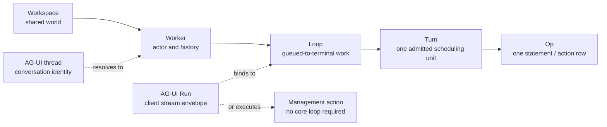

| Term              | Layer                 | Meaning |
|-------------------|-----------------------|---------|
| **agent**         | PLURNK                | The plurnk runtime. Acts in-workspace as the `_plurnk` worker ({§actor-boundary} self-hosting), never a privileged singleton owning its own entries ({§entry-owner}, {§machine-processes}). |
| **workspace**     | Core                  | Durable user-named shared world. Persists across workers and process restarts. Identity: `workspaces.id` + unique `workspaces.name`. |
| **worker**        | Core                  | Durable actor and history over one workspace. Owns its loops and log rows, may carry a `parent_worker_id`, and has one process-local cancellation scope while active. |
| **loop**          | Core                  | Queued-to-terminal unit of model or client work within a worker. Status ∈ {100 pending · 102 running · 200 done · 202 waiting (blocked on a live obligation, {§send}) · 413 input-capacity failure · 429 model-turn ceiling · 499 cancelled · 500 failed · 504 execution timeout ({§operator-config-loop-timeout}) · 508 runaway}. Many loops may belong to one worker. |
| **turn**          | Core                  | One durable, producer-neutral batch of ordered operations. A turn may be authored by a model, client, plugin, or `_plurnk`; only a model turn assembles a packet and owns an emission call. Many turns may belong to one loop. Identity: `(loop_id, sequence)`. |
| **model call**    | Core/provider         | One logical `provider.generate` invocation. Emission attempts and BARE inferences share this durable accounting owner; provider retries remain cardinal physical requests beneath it. Identity: `(turn_id, sequence)`. |
| **op**            | Producer/core         | One DSL operation a producer submits, parsed into a `PlurnkStatement`. Admission follows {§turn-ops-admission-path}. |
| **statement**     | Model/core            | A parsed op: the `PlurnkStatement` AST from `@plurnk/plurnk-contracts`. |
| **action**        | Core                  | One executed op. Execution normally produces a `log_entries` row at `log:///<L>/<T>/<S>/<op>`; an engine rail may instead record an `op='error'` row ({§operation-results}). A source artifact carries no fabricated operation. |
| **dispatch**      | Core                  | Routing a statement to its scheme's op handler. |
| **AG-UI Run**     | AG-UI protocol        | A client request/stream envelope identified by the client's `runId`. A message or resume AG-UI Run binds to one core loop; a management-action AG-UI Run may complete without creating a core loop. |
| **AG-UI thread**  | AG-UI protocol        | Conversation identity. Within an explicitly selected workspace, `threadId` resolves to one conversation worker. |
| **`--run`**       | Client compatibility  | A compatibility-sensitive client spelling, not an internal entity. |
| **session**       | Retired/unqualified   | Not a PLURNK lifecycle noun. Use the actual core noun; a third-party standard may use only its explicitly qualified protocol term. <!-- lexicon-allow: this row defines the retired noun --> |

### Storage terms

| Term | Meaning |
|---|---|
| **entry** | The unit of canonical state. Identity: `(workspace_id, scheme, authority, pathname)` ({§entry-identity-no-null}). Holds one or more `channels` of content plus scheme-private `attributes`. |
| **channel** | A named content buffer on an entry. Examples: `body`, `stdout`, `stderr`, `headers`, `symbols`. Each channel has `content`, `mimetype`, curation `weight`, and lifecycle `state`. |
| **scheme** | An addressed capability family + handler. Built-ins include `worker`, `log`, `ops`, `reasoning`, and bare/file paths; discovered schemes and executor-runtime tags extend that set. Internal `exec` routes executions but is not an addressable model namespace. Consumption surface {§scheme-surface}; author contract: [plurnk-schemes](../plurnk-schemes/SPEC.md). |
| **mimetype** | A channel's content type. Drives the handler that produces the structural projections (`symbols`, `deepJson`, `deepXml`). Consumption surface {§mimetype}; author contract: [plurnk-mimetypes](../plurnk-mimetypes/SPEC.md). |
| **provider** | An LLM transport implementing the `@plurnk/plurnk-providers` `Provider` interface. Core supplies an assembled request and generation context; the provider owns endpoint adaptation and normalized response evidence. Consumption surface {§provider-surface}; author contract: [plurnk-providers](../plurnk-providers/SPEC.md). |

### State / status

Independent axes on entries and channels. Confusion across them is a recurring source of bugs.

| Term | Type | Meaning |
|---|---|---|
| **status** | HTTP int | Outcome of an operation. Carried on `log_entries.status_rx`, returned from op handlers. Per the catalogue ({§operation-results}). |
| **channel state** | `static \| active \| closed \| errored` | Streaming lifecycle of a channel's content. Metadata, not gating — engine renders content regardless of state. |
| **proposal state** | `proposed \| resolved \| failed \| cancelled` | Proposal lifecycle (`log_entries.state`) under {§proposal}; distinct from entry identity and channel state. |
| **outcome** | `string \| null` | Short reason for `failed`/`cancelled` (`"permission:403"`, `"aborted"`, `"not_found"`). Opaque to most callers. |

### Writer / authority

| Term | Meaning |
|---|---|
| **writer** | The identity authoring a write. One of `model \| client \| _plurnk \| plugin`. Carried on `ctx.writer` for schemes; engine enforces `manifest.writableBy`. |
| **origin** | Synonym for writer in log_entries (`log_entries.origin`). Historical naming; treat as equivalent. |
| **writable_by** | The set of writers a scheme accepts. Subset of `{model, client, _plurnk, plugin}`. Engine rejects writes outside the set with 403; the rejection is logged as the action-entry ({§subscriptions} action-entry-as-outcome). |

### Execution terms

| Term                         | Meaning |
|------------------------------|---|
| **verdict**                  | The end-of-turn ruling from the strike rail and independent loop terminals ({§loop-terminals}). |
| **strike**                   | One admitted turn matching at least one source under {§engine-rails}. |
| **emission attempt**         | One completed provider exchange beneath an engine turn, admitted or rejected under {§emission-admission}. |
| **BARE inference**           | One isolated child-provider model call whose response becomes an ordinary BARE log result. It has no worker, packet, tools, output grammar, or persistent child state ({§bare-inference}). |
| **cycle**                    | Repeated operational inputs and observed results under {§engine-cycle-evidence}. |
| **capability policy**        | A purely subtractive `only`/`deny` selector layer over routed operation demands. Service and workspace layers compose without granting authority. |
| **loop policy**              | One immutable `review`, `accept`, or `reject` proposal disposition. |
| **proposal**                 | A deferred side-effecting action. State machine: `proposed → resolved` (accept), `→ failed` (reject), or `→ cancelled` (cancel). Its core-owned disposition says whether the client or loop owns resolution ({§proposal-disposition}). |
| **resolution**               | A client decision delivered through a standard resume entry. Proposal resolutions accept, reject, or cancel ({§methods-proposal-resolve}); client-interaction resolutions return a payload or cancel ({§methods-client-interaction-resolve}, {§agui-proposal-resolve}). |

### §packet-terms Packet terms

| Term       | Meaning |
| ---------- | ------- |
| **packet** | A Turn's optional model-exchange record: measured request `sections`, extended with `assistant` and `assistantRaw` only when an emission is admitted. `NULL` means no model request was assembled. |
| **log**    | The `log` section. Chronological list of `log_entries` in scope this turn. |
| **render** | Computing the packet from current state under {§packet-assembly} and {§packet-markdown}. |

---

## §arch Architecture

Daemon composition and startup. Worker attention and workspace state follow
{§actor-boundary} and {§machine-processes}.

### Ecosystem

The root [`ARCHITECTURE.md`](../ARCHITECTURE.md) owns the platform process and
package map. The default installed composition is specified in {§bundled-set}.

### §observability-boundary Observability boundary

OpenTelemetry may observe PLURNK; it never becomes product state, failure transport, scheduler input, model teaching, or client protocol. Domain and client activity remain on AG-UI. Reusable packages depend on the OTel API only; the daemon constructs only the explicitly configured trace and metric providers. An unconfigured or standards-valid disabled process loads no SDK or exporter implementation and keeps the API's no-op behavior with bounded overhead. OTel Logs have no provider or initialization path.

Configuration uses the standard `OTEL_*` environment: `OTEL_TRACES_EXPORTER` / `OTEL_METRICS_EXPORTER` select `otlp` or `console` per signal (a missing or `none` value keeps that signal off; no SDK default selects an exporter), `OTEL_SERVICE_NAME` names the service (default `plurnk-service`), case-insensitive `true` in `OTEL_SDK_DISABLED` turns the boundary off, and OTLP exporters honor `OTEL_EXPORTER_OTLP_*`. An unknown exporter name fails daemon boot; a typo never silently disables observation. OTel Logs and direct draft semantic-convention use are excluded. HTTP spans carry only an AG-UI-owned bounded route class, never an input pathname or query. Spans otherwise carry high-cardinality identifiers; metric labels stay low-cardinality. Prompts, reasoning, file bodies, arbitrary URLs, secrets, and plugin payloads are never recorded as attributes or metric values by default. Exporter failure cannot change product results or client lifecycle. Daemon, telemetry, and database teardown are independent reverse-ownership phases; every phase runs and aggregate failure preserves every cause.

§observability-genai-conventions **GenAI convention projection.** Provider
request spans follow the [GenAI registry at `c88d504`](https://github.com/open-telemetry/semantic-conventions-genai/tree/c88d504ab3d9879f8e50d3cc87e69775e11db234),
which depends on core semantic conventions v1.44.0: a CLIENT-kind
`chat {model}` span carrying `gen_ai.operation.name` (`chat`),
`gen_ai.provider.name` (the constructed route's provider ID in the registry's
spelling, never its tuning alias; unmatched IDs are preserved, `other` for an
unregistered handle), and `gen_ai.request.model`;
on settlement it gains `gen_ai.usage.input_tokens` and
`gen_ai.usage.output_tokens` by aggregating every reported request quantity in
validated accounting ({§tokenomics-provider-usage}), plus
`gen_ai.response.finish_reasons`; failures carry `error.type` as the class
name only. Plurnk custom attributes (attempt, kind, status, loop/turn ids)
ride alongside and never replace the convention attributes. The redaction
boundary is unchanged — no prompts, reasoning, bodies, or URLs. This is the
sanctioned exception to the blanket draft-convention exclusion; no other
draft convention is projected.

### In-process architecture

The process and package map is ARCHITECTURE.md's; this package's AGENTS.md maps core's internal
owners. Capability-specific behavior remains with the owning plug point.

§service-worker-composition The service launcher and the live/demo workspace
helper share one registration of default worker-facing modules: MCP, outbound
A2A, and Schedule. Their management families and readable reference documents are
present even with no enabled definitions. Workspace capability policy controls every actor's
surface; registering a family does not enable its definitions. The real-model
profile ({§operator-config-real-model-profile}) leaves ambient MCP attachments and
service schedules disabled by default; specimens may add their own through the
ordinary management surface. Client and
inbound-A2A listeners and host hooks remain launcher-owned.

### §service-package-exports Package export surface

| Export path                           | Current contract                                                                                                                                                        |
|---------------------------------------|-------------------------------------------------------------------------------------------------------------------------------------------------------------------------|
| `@plurnk/plurnk-service`              | Frozen 1.x compatibility barrel of the exports below. It gains no new APIs and is not the client boundary. Removal is SemVer-major. |
| `@plurnk/plurnk-service/digest`       | Supported programmatic forensic surface owned by {§digest-programmatic-surface}.                                                                                         |
| `@plurnk/plurnk-service/package.json` | Supported package metadata surface.                                                                                                                                      |

| Root exports | Names |
|--------------|-------|
| Runtime | `Daemon`, `Engine`, `EnvFlags`, `Exec`, `File`, `Log`, `Mimetypes`, `Mock`, `Paths`, `SchemeRegistry`, `Skill` |
| Types | `ChatMessage`, `EditResult`, `FlagDescriptor`, `MockAssistant`, `MockResponse`, `OpenFoldResult`, `ReadResult` |

New clients use AG-UI. A new library contract belongs in its owning package or
an explicitly specified subpath, not in the frozen root barrel.

### §startup-admission Startup admission

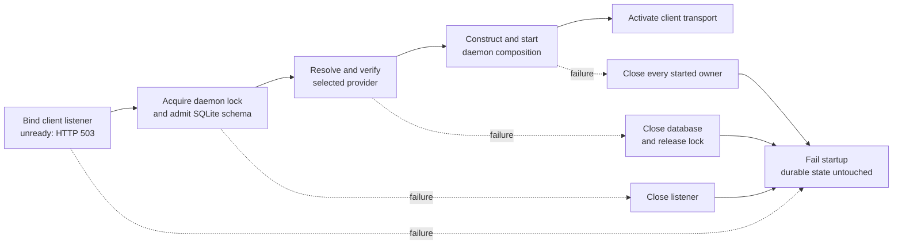

§startup-listener-admission The production service binds its one listener
({§http-host}) before creating, opening, replacing, rotating, migrating, or
otherwise mutating anything in the durable data directory. A process that loses
the listener race fails with the originating address error and byte-identical
durable storage. Core owns the socket continuously; it answers 503 until the
client-interface module mounts the root at daemon activation, so early
ownership introduces neither traffic nor a close/rebind race.

§http-host **The daemon opens exactly one transport.** Core binds the HTTP
listener on `PLURNK_HOST:PLURNK_PORT` and offers it to every exterior adapter as
`registerHttpRoute(prefix, handler)` and `httpAddress()` on the application port
({§application-port}). A prefix is an absolute pathname. Each request goes to the
longest mounted prefix; a prefix claims itself and the subtree beneath it, never
a longer sibling name; `/` is the root and receives whatever nothing more
specific claimed. Until a root is mounted the listener answers `503
service-starting` to every request: the service has not admitted its client
interface. Adapters mount at `start()`, after durable lifecycle recovery, and
none opens a socket of its own under the daemon — a module hosted *without* a
daemon may bind a private one, which is outside this contract. The standards
address by URL, never by port (#641): AG-UI mounts `/` and `/agui`, A2A the
well-known card and its endpoint path, on the same address.

§startup-admission-order After listener ownership, database admission completes
before provider or capability initialization can perform external work. Every
later startup failure closes resources in reverse ownership order while
preserving the originating failure: daemon, observability, database, listener.

## §actor-boundary Workers and workspace boundaries

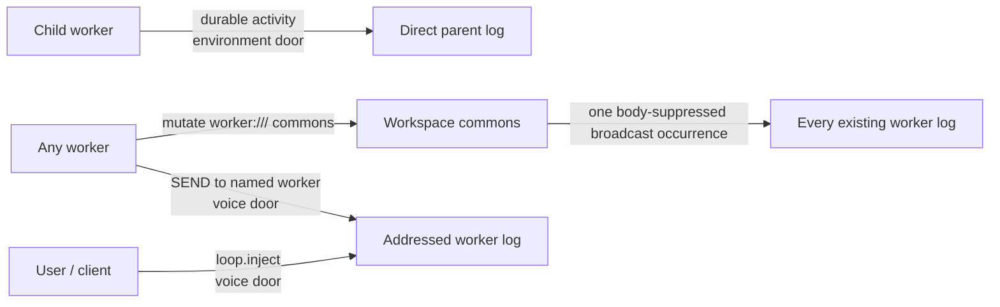

§actor-boundary-isolation **Packet membership is by worker; the model is not
privileged.** A packet renders the assembling worker's log alongside current
shared workspace state ({§packet}, {§membership}). Other journals are not
automatically injected. This follows "one packet, one worker," not an access
filter over workspace resources.

§actor-boundary-origin-not-filter `origin` (the writer, {§scheme-surface-writableby-403}) is
**attribution** — the delta's provenance ({§env-delta}) — and is never read to
filter a row.

§actor-boundary-attached-functionality **Attachment selects a conversation,
not an environment owner.** Client management commands mutate workspace
Functionality ({§module-workspace-capabilities}); executable families, runtime
schemes, and tools resolve by `workspaceId`. Operations journal in the
submitting actor's `workerId` ({§connection-lifecycle}), which must belong to
the workspace. Runtime and policy resolution require no second worker identity.
Attachment remains many-to-one, non-owning, and unrelated to parentage.

§actor-boundary-two-doors **Cross-worker arrival is limited to two doors.**
An explicit READ is not an arrival: the reading worker deliberately addresses a
file or entry through its ordinary read-authority boundary ({§worker-read-scope}).

| Door        | Carries                                                                                                                                      | Wake behavior                                                                                 |
| ----------- | -------------------------------------------------------------------------------------------------------------------------------------------- | --------------------------------------------------------------------------------------------- |
| Environment | A direct child's durable activity to its parent, plus a successful mutation of the deliberately global `worker:///` commons to every worker. | Intermediate activity and commons never wake; a child's terminal disposition wakes its parent. |
| Voice       | A directed `loop.inject` or ```` ```SEND (worker://name) ```` request, or an exact-message reply ({§message-reply-delivery}). | Requests enter the next packet or start queued work; replies wake existing assigned/native-sender work without creating a request. |

§actor-boundary-lineage-attention **Addressability is workspace-wide; attention
is lineage-scoped.** Project files, registered resources, and named scratch
entries remain addressable throughout the workspace, but ordinary changes do
not enter unrelated workers' logs. Eligible child actions ({§env-delta-child-activity})
reach only the direct parent; exploration and local curation do not. That
observer row carries the source occurrence identity and never
republishes, so grandparents observe what their own direct children do without
receiving an automatic recursive mirror of every descendant.

§actor-boundary-commons-broadcast **`worker:///` is the explicit global
attention surface.** A successful mutation whose landed effects touch the
commons emits one occurrence to every worker that existed when it landed.
Lineage and commons audiences are a union over that one identity: when a child
mutates the commons, its parent receives one observer row, never a parent copy
plus a broadcast duplicate. Runtime maintenance turns produce no broadcast ({§actor-boundary-doc-injection}). Ordinary project files, named scratch entries,
and remote resources do not acquire ambient attention merely because they are
workspace-addressable.

§actor-boundary-no-mutex **Wild west, no exceptions.** Workers share workspace state without locks. Coordination is cooperative and softly fenced (the {§membership} overlay, a workspace policy, bounds every worker's visible surface uniformly — {§machine-processes}); stale writes reject at their anchor or compare-and-swap boundary rather than being prevented by a lock ({§line-anchors}, {§membership-edit-write-cas}).

§actor-boundary-passive-wake **Passive wake follows ownership.** A directed
voice wakes an idle worker. A parked continuation resumes when an obligation it
owns — a child or stream — reaches an observable terminal transition
({§worker-loop-lifecycle}). Intermediate child activity and commons broadcasts
never wake; they queue until another cause produces a turn ({§env-delta}). The
obligation edge is continuation control, not a third door through which
arbitrary workspace state can enter.

§actor-boundary-self-hosting **Use the actor path when the work has an operation; retain irreducible rails in the kernel.** The workspace has one runtime Worker, `_plurnk` (origin `_plurnk`), a name `WORKER_NAME` never admits, so no model or client can mint or resume it ({§worker-name-minting}). `DispatchAsPlurnk` opens ordinary administrative loops and turns for its work. Generated references are shared entries; the runtime actor has no privileged scratch access.

| Work                                    | Owning path                                                         | Why                                                                                 |
| --------------------------------------- | ------------------------------------------------------------------- | ----------------------------------------------------------------------------------- |
| Workspace reference documents | Runtime actor; `_plurnk` EDIT through engine dispatch. | Maintaining generated workspace scratch is an ordinary operation. |
| Git membership and disk materialization | Kernel `GitMembership` / entry CRUD.                                | Ingesting existing disk state is not a model-authored EDIT.                         |
| Disk-divergence narration               | Kernel writes an EDIT-shaped `source=file` row to the `_plurnk` log. | It reports an environment event honestly; no operation is fabricated as having run. |
| Search derivation and catalog render    | Kernel.                                                             | They are indexes and read-only projections, not entry operations.                   |
| Packet assembly and budget rails        | Kernel.                                                             | They are the execution substrate on which actor operations depend.                  |

Git membership is the repository's tracked files and nothing else ({§membership-baseline});
Plurnk never stages a file or runs `git add`.

§turn0-agents-stunt **The project AGENTS.md is a turn-0 stunt.** When
`<projectRoot>/AGENTS.md` exists, LoopDocs materializes it as the workspace's shared
`worker:///_plurnk/AGENTS.md` entry and the engine foists one READ of it into
that model worker's first turn — visible, logged, line-addressable. The entry
keeps the standard's own name, as a nested instruction file does: that name is
in the model's prior, and no other generated document is called it. Absent
file: no entry, no stunt, nothing 404s. The global XDG configuration `AGENTS.md`
remains system-prompt policy ({§policy-sections}); the stunt carries only
local repo guidance.

§actor-boundary-doc-injection **Generated documents use the actor path.** Workspace references and projected project instructions are materialized in `worker:///_plurnk/` through the runtime actor's ordinary maintenance turns. Their exact programs and operation evidence remain durable in that actor's log; generation is not a hidden database write.

Maintenance turns create neither lineage nor commons broadcasts. Their loops are not work-lifecycle observations ({§application-worker-observation}, {§application-loop-observation}); `work_loops` excludes loops whose turns are all maintenance, but retains empty queued loops and loops containing any other purpose. Scheduling and forensic history remain intact.

§actor-boundary-catalog-preview **Catalog preview.** `PLURNK_SERVICE_FILES_ITEMS`
foists turn-0 discovery into the worker's first turn, so a worker opens with a
navigable map instead of blank. Its baseline bodyless FIND surveys follow this
order; unregistered schemes contribute no survey, and workspace capabilities may
narrow or omit the reference catalogs under {§capability-admission}.

| Surface | FIND target | Scope / aside |
| --- | --- | --- |
| Agent Skills | `skill://*/SKILL.md` | `<1,-1>`; {§skills-resources} |
| Plurnk references: executors, schemes, family managers | `worker:///_plurnk/plurnk/*.md` | `<1,-1>` |
| Enabled tools | `worker:///_plurnk/tools/*.md` | `<1,-1>`; configured expansions follow under {§tools-resource-materialization} |
| Enabled agents | `worker:///_plurnk/a2a/*.md` | `<1,-1>`; {§a2a-catalog} |
| Enabled members | `worker:///_plurnk/members/*.md` | `<1,-1>`; {§members-projection} |
| Project filesystem | `*` | File cap below; `project root member files` |
| Workspace entries | `worker:///*` | Markerless; `workspace knowledgebase entries` |
| Named scratch entries | `worker://<worker>/*` | Markerless; `worker knowledgebase entries` |

Only the three namespace surveys carry asides; the other targets name
their surface. The word `skills` names Agent Skills and nothing else.
Catalogs select documents independently of their authored bodies; ordinary READ
supplies examples and complete instructions on demand. A shallow
result renders direct entries normally and every deeper first-segment directory
as an actionable `dir/**` summary with its recursive `items` and `tokens`;
tool-family rows also carry the concise `{§scheme-catalog-aside}` that drives
on-demand capability discovery. Ordinary surveys use FIND's markerless first
page ({§markerless-first-page}), whose range metadata reports the requested and returned page against the
complete result total; only the small capability-reference surfaces
explicitly select all. The opening survey demonstrates both `*` and `**` without
normalizing an all-results override. Every survey executes even when empty
because zero results are useful orientation. A positive `N` explicitly caps
only the file map's rendered rows, using the map's actual
direct-entry-plus-directory count; `-1` enables the ordinary markerless page;
unset / `0` disables previews. `log://` is absent because the current worker's
log already renders in present mode.

§worker-initialization-entry **Model-worker initialization is a real `_plurnk` turn.** A model worker's first loop begins with one packetless `{ producer="_plurnk", kind="initialization" }` turn submitted through {§turn-ops-admission-path}. Its reasoning and program are stored before execution. NOTEs from its reasoning and program, the orienting READ/FIND surveys, and the reasoning and program READs in {§reasoning-initial-read} execute under {§op-execution-order}. The full `<1,-1>` READ of its own `ops://<worker>/<loop>/<turn>` source supplies the worked program example; no actionless source row or simulated READ is added. Every orienting row is structurally classified `_plurnk` and `init`. The namespace surveys and their asides follow {§actor-boundary-catalog-preview}.

Incoming messages publish once as inbound SEND rows in the first model turn
({§message-arrival}); initialization neither READs nor archives them. The turn
continues without a lifecycle declaration. The first model
request occupies database/log turn sequence 2; “turn zero” names the
initialization phase, not a zero-based database coordinate. Client and
`_plurnk` administrative workers execute operation turns without model initialization.

### §machine-processes Workspace and worker state

A workspace owns every entry; a worker owns its history and active work.

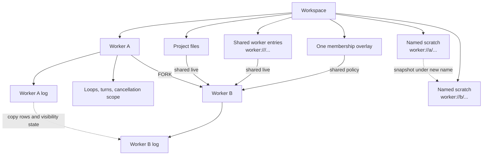

§machine-processes-one-filesystem **Each workspace has one project filesystem.**

§machine-processes-one-overlay **Each workspace has one membership overlay.**

§machine-processes-fork-copies-the-log **A fork copies the parent's log as
terminal history.**

| State                                                 | Owner             | Fork behavior                                                                                                      |
| ----------------------------------------------------- | ----------------- | ------------------------------------------------------------------------------------------------------------------ |
| Project files ({§machine-processes-one-filesystem})   | Workspace         | Shared live; a fork does not create another checkout.                                                              |
| Shared worker entries (`worker:///...`)               | Workspace commons | Shared live.                                                                                                       |
| Membership overlay ({§machine-processes-one-overlay}) | Workspace         | Shared unchanged; divergent membership requires another workspace.                                                 |
| Log items ({§machine-processes-fork-copies-the-log})  | Worker            | Durable events, curation effects, current active/body-suppression projection, and the matching observation cursor are copied as terminal history. Parent-audience occurrences still pending at the fork boundary belong to the snapshot; later sibling activity does not. |
| §machine-processes-fork-cost **Provider evidence and accounting** | Worker | Turns and their model-facing log history are copied, but turn-attached inference calls, their specializations, admission rows, and physical provider requests are not: one issued call or request has one causal branch. Parent and fork accounting therefore includes only work issued in that branch, while workspace accounting never double-counts copied history. |
| §machine-processes-entry-inheritance **Named scratch and evidence** | Workspace | FORK snapshots quiescent `worker` entries whose authority is the source Worker name into the child name. Bytes, attributes, and channel results remain exact; embedded addresses are not rewritten. Other resources, including `worker:///_plurnk/**`, stay shared. |
| Active loops, turns, and cancellation                 | Worker            | Never copied as live work; inherited structure is terminal history, then a new loop starts.                        |

§worker-fork-trigger **The branch's claimed row is the fork.** `worker_name_claim` with a fork
snapshot inserts the branch worker with its parent's generation policy, ambient cursor, and event
boundary, and `workers_fork_copies_history` (an `INIT` process trigger in `fork.sql`,
{§db-process-triggers}) copies the parent's history inside that INSERT: loops as terminal history,
turns and their sources, log rows with their attribution and current projection, curation effects,
and quiescent named scratch with its channels. Ids are remapped by natural key — `(worker, sequence)`
for a loop, `(loop, sequence)` for a turn, `(turn, sequence)` for a log row — so no id map exists
outside the database, every copied row passes the same table triggers the original did, and a fork
either lands whole or not at all. Nothing else runs: `Fork.fork` is the claim.

§machine-processes-worker-is-its-log **A worker's conversational memory of
the shared world is its log, with no hidden per-worker snapshot beside it.**
A scoped KILL suppresses canonical body intervals on that worker's rows ({§log-kill-scope});
lineage activity and explicit commons broadcasts arrive as attributed log
entries ({§env-delta}). Named scratch and evidence follow {§machine-processes-entry-inheritance}. They are not an invisible mirror of shared state. Workspace
addressability does not imply packet membership or ambient notification
({§actor-boundary-lineage-attention}).

§machine-processes-fork-pending-activity **A fork is a closed snapshot of the
parent's view.** It copies rows already materialized in the parent and inherits
parent-audience occurrences newer than the copied observation cursor through
the occurrence high-water captured by worker creation. Activity addressed to
the parent after that boundary is sibling activity, not fork history. Global
commons broadcasts remain live after the fork because the branch is then an
existing workspace worker in its own right.

§machine-processes-model-worker-readable **Packet membership is per-worker, not an access policy.** A packet contains its worker's log plus explicitly delivered activity ({§actor-boundary}). `readLog({ workspaceId, workerId })` may inspect any worker belonging to that workspace, and `listWorkers` enumerates them. A client-interface module chooses its conversation binding. Inspection does not inject another log into a model's packet.

§machine-processes-worker-origin **A worker carries its actor.** Each worker records its `origin` — `model` (a conversation), `client` (a client-interface actor), or `_plurnk` (the runtime's self-hosting worker) — set once at creation and inherited by WORK/FORK from the parent. A turn's producer is independent: a plugin-produced program in a model worker still delegates model workers. `listWorkers` returns actor class without interpreting names; a retained worker's name is immutable ({§machine-processes-worker-is-its-log}).

§worker-provider-identity **A worker owns a durable provider identity distinct
from its database id.** Creation mints a globally unique, opaque 128-bit value;
forks mint their own value. Core supplies it as the provider `workerId` for every
emission ({§provider-cache-identity}). Database ids remain the internal relational and
client coordinate. BARE calls use isolated per-call provider identities rather
than either worker value.

§machine-processes-fork-shares-the-world **A fork copies history and named
scratch while sharing the workspace.** It is a new worker in the
same workspace (`workers.parent_worker_id`, {§lifecycle-terms}); project files,
shared entries, and membership remain live and uncopied.

§machine-processes-no-fork-workspace **A workspace cannot be forked.**
`workers` carries `parent_worker_id`; `workspaces` carries no parent. Parallel
histories over one workspace are worker forks. A divergent project filesystem
or membership overlay requires a new workspace.

### §worker-scheme Worker resources and control

§worker-authority-carving **Authority is a literal namespace, not a principal.** `worker:///notes.md` is shared scratch; `worker://alice/draft.md` is named scratch. Both belong directly to the workspace ({§entry-owner}). Entry addresses require no namesake Worker row and survive its deletion; only pathless worker controls resolve an actor. The caller never alters an address, and `~` has no alias semantics.

§worker-name-minting **URI ingestion is permissive; worker minting is not.**
Every model/client worker-creation door applies the contracts-owned
`WORKER_NAME` predicate ({§worker-name}) through one core admission path. Generic URL parsing
continues to decompose other authorities without treating them as mintable.

| Candidate                                      | Minting result                                                        |
| ---------------------------------------------- | --------------------------------------------------------------------- |
| `WORKER_NAME` match                            | Admitted as the exact literal worker name; `plurnk` is one.           |
| `_plurnk`, or any other spelling               | Refused as `name-invalid` before lookup, insertion, or child startup. |
| Automatic name                                 | Generated, then admitted through the same predicate.                  |

§worker-read-scope **Scratch is workspace-readable.** Any actor reads and searches any named or shared scratch address. Parentage and writer identity do not change resolution. Scratch namespaces do not require a namesake Worker. A pathless actor address requires a named Worker; an unknown actor returns 404.

§worker-write-scoping **Scratch is workspace-writable.** All workspace actors may EDIT, COPY, MOVE, or KILL entries in any named or shared scratch namespace, including generated documents. There is no creator-only, self-only, ancestor-only, or runtime-only grant. Workspace admission remains uniform. Intrinsically immutable evidence in other schemes retains its own contract ({§scheme-entry-matrix}); operation provenance and delegation lifecycle do not grant or restrict scratch access.

§worker-generated-subtree **Generated documents share `worker:///_plurnk/`.** Project instructions (`AGENTS.md` and subtree-scoped `instructions/**`), scheme/runtime references (`plurnk/**`), tool details (`tools/**`), and family catalogs are workspace resources. Agent Skills retain their own trees at `skill://<name>/` ({§skills-resources}).

The subtree has ordinary scratch access, not an ACL. Runtime maintenance reconciles it from workspace Functionality through the runtime actor's ordinary turns ({§actor-boundary-doc-injection}); reconciliation may replace manual edits. There are no per-Worker copies or fork rederivation. A runtime's `resourcesPath` is relative to this root ({§tools-resource-materialization}).

§worker-control-addressing **Explicit worker control addresses are authority-only.**
WORK and FORK may omit their address to allocate one ({§worker-auto-name}).
Control is same-workspace only ({§actor-boundary}). Generic URI
parsing remains tolerant, but worker control admits no component it cannot
interpret and never silently normalizes one away.

| URI component     | Control requirement                                                          |
|-------------------|------------------------------------------------------------------------------|
| Scheme            | `worker`                                                                     |
| Authority         | Exactly one non-empty worker authority                                       |
| Path              | Absent; a trailing `/` is a path, not a control alias                        |
| Userinfo or port  | Absent                                                                         |
| Query or fragment | Absent, including an empty delimiter                                          |
| Request metadata  | Absent                                                                         |

Every admitted authority is a literal `workers.name`; self-addressing uses the caller's actual name.

| Operation | Accepted pathless authority | Effect                                  |
|-----------|-----------------------------|-----------------------------------------|
| `WORK`    | new literal name, or omitted | Spawn a fresh worker.                   |
| `FORK`    | new literal name, or omitted | Branch the caller into a new worker.    |
| `SEND`    | existing literal name  | Message the named worker or caller.     |
| `READ`    | existing literal name       | Collect the named worker's deliverable. |
| `KILL`    | existing literal name  | Terminate the named worker or caller.   |

- §worker-scheme-spawn **Spawn** — ```` ```WORK (worker://<name>)? ```` with a task body creates a new worker sister (empty log) and starts it with that task on its first loop. WORK/FORK are the worker-creation verbs: EDIT is file/entry only, so EDIT on the bare worker entity is a **400** steering to WORK/FORK — the entity is not an entry. Names remain unique within a workspace for the lifetime of retained Worker rows, including after termination. An existing name returns 409; concurrent claims cannot redirect a published address or expose a raw uniqueness failure.
- §worker-spawn-prompt-resource **The spawn slot is overloaded by scheme.** A `worker://` path is
  the child's address and keeps the address rules ({§worker-control-addressing}). A path of any
  other scheme is the child's prompt resource: it is read whole (`<1,-1>`) under the caller's read capabilities, composed with
  the body as BARE's combined form (resource first, then the authored text), and the child is
  auto-named exactly as when the slot is empty ({§worker-auto-name}). The durable row keeps the
  authored statement. A read failure is the operation's failure and spawns nothing; an empty
  resource with no body is `422 spawn-prompt-empty`. Naming the child and giving a resource in one
  statement is not expressible; the body can READ the resource instead. Taught in the deep
  reference only.
- §worker-scheme-irc **irc** — ```` ```SEND (worker://<name>) ```` with a message body delivers it to an existing sister, the **voice door** ({§actor-boundary-two-doors}): an active sister folds it into its next turn, an idle one wakes ({§actor-boundary-passive-wake}). A fresh receiving loop retains that worker's durable model, spawn override, and reasoning policy; the sender and daemon default do not re-select it. The caller addresses itself by its literal name; a literal name with no worker in the workspace is 404.
- §worker-scheme-fork **Fork** — ```` ```FORK (worker://<name>)? ```` with a task body branches the
  current worker into a **named** sister: its log is deep-copied
  ({§machine-processes-fork-copies-the-log}), which continues with `task`; the
  world is shared, never copied ({§machine-processes-fork-shares-the-world}).
  WORK and FORK are distinct verbs — WORK spawns a fresh worker, FORK branches
  the log. Both report the resulting `worker://name` address in receipt
  metadata `worker`, whether named explicitly or allocated automatically.
  The submitted operation retains its authored target, including absence.
  Inherited loops are
  copied as **terminal history** (a non-terminal status is clamped): a fork's
  own work is a fresh loop, so an inherited mid-flight loop never makes the
  branch look forever-live to the {§send-premature-terminate} gate.
- §worker-scheme-fork-scratch **Forked scratch.** Named scratch and evidence are copied under the new name through {§machine-processes-entry-inheritance}. Parent and branch can edit either scratch namespace; their copies diverge independently.
- §worker-delegation-inherits-policy **Fresh delegated loops inherit the sender's policy.** WORK, FORK, and SEND to an idle Worker carry the sender's complete loop policy, disposition and attendance alike. SEND into an active or parked loop leaves its immutable policy untouched. All workers share live workspace capability policy; delegation creates no capability snapshot or bound.
- §worker-lifecycle-wake-requeue-not-terminal **A wake re-queue is not a terminal.** A conclusion-wake resumes a 202-blocked loop by re-queueing it (202 → 100); when that lands while the loop's own live drain is between turns, the drain **re-claims and continues** (atomic 100 → 102; the injected prompt is already the next turn). The internal re-queue is never reported as an outward terminal.

- §worker-scheme-collect **Collect** — each concluded child loop reaches its direct
  parent as an `_plurnk` READ of `ops://<name>/<sequence>` ({§loop-answer}), not a message,
  and that row carries what the child said.
  The occurrence retains that loop's exact terminal result; the READ uses ordinary
  bounded projection of {§loop-answer}. The original delegated answer reaches the
  parent here, not as a duplicate reply ({§message-reply-delivery}); other message
  replies remain independent deliveries. Failures and
  cancellations retain their exact status, Problem, and visible explanation,
  including a spawn that fails before its first turn. Observation and wake-up
  follow {§env-delta-child-termination}; a later child loop cannot replace the
  retained result. The **pull** side mirrors the push: a path-absent
  ```` ```READ (worker://<name>) ```` collects that same result on demand for a
  concluded worker and names its canonical loop URI in `resource`; **unfinished loops** have not concluded, so the READ
  returns **425** (Too Early). An explicit lifecycle declaration chooses whether to continue
  or wait for that worker ({§join-blocking-collect}). A
  missing name is 404. The model therefore reads the worker itself for its
  outcome or a wait rather than guessing a scratch path to "check on" it.
- §worker-loop-result `ops://<name>/<sequence>` selects one worker-local positive safe-integer
  loop sequence ({§loop-answer}; the retired `loop://` scheme is gone, and one address now serves
  both what a loop said and how it ended). It is a read-only resource, not an actor control
  address: READ, FIND and COPY use ordinary projections; EDIT, MOVE-source, and KILL cannot change
  it. No query, userinfo, or port is accepted. A coordinate that is not a positive safe integer is
  400; a missing loop 404; a loop that has not answered and has not concluded 425. A concluded
  loop remains readable after newer loops, log curation, or a reply to its originating message.
  A failure reports its problem even when the loop answered earlier: the failure is the news.
  READs and completion observations use the same resolution, representation and projector.
- §child-orientation **Child orientation.** Beyond the conclusion delta, every
  turn the packet's status clump surfaces the live things this worker currently
  holds under the teaching's own word for handing work out: `## Delegation` is
  one JSON object, `{"workers": [...], "streams": [...]}`, its unconcluded child
  workers and its open streams as `{status, path}` pointers (the same shape as
  the errors section), just above it. Body-suppressed child activity is durable
  history; this section is the current inventory that keeps an active obligation
  visible even when no new activity arrived. Each open stream pointer carries
  its channels' sizes and growth since the last packet in `detail`
  (`{"status":"active","path":"sh:///ab3d5678","detail":"stdout 340 lines (+2048 bytes)"}`)
  — the only thing the model learns about a stream before it closes
  ({§exec-stream}). It is orienting state, never advice: the model sees its live
  subtree (`{"status":102,"path":"worker://worker-x"}`) and reasons for itself —
  READ, SEND, or KILL via the path.
  Workspace schedules are not held work: an occurrence arrives as a message
  ({§schedule-delivery}).
- §packet-empty-sections **Emptiness is stated where the model decides on it.**
  `## Delegation` renders every turn, each of its two lists `[]` when empty: the
  model decides whether to wait or complete on exactly these facts, so their
  emptiness is stated rather than inferred from a missing heading. This is the
  deliberate exception to the wire rule that empty content is absent; errors,
  notices, and the rest keep that rule. The parent is not a section: the
  `## Worker` identity block carries `"parent": "worker://<name>"`, or
  `"parent": null` at a root, so a worker never infers its rank from silence.
- §packet-current-turn **The packet says who and which turn, below the log.** The
  `## Worker` block is the first section after the log, carrying
  `{"path": "worker://<name>", "parent": <address or null>, "loop": L, "turn": T}`: the actor,
  whose child it is, and the coordinate this packet's response becomes, so `reasoning://<worker>/L/T`
  and `ops://<worker>/L/T` are the model's own and `log:///L/T/*` its rows; a model never infers the
  present from the last row's coordinate, which may or may not be its own turn. The block
  changes every turn, so nothing of it precedes the log, and the packet carries no date, time
  or zone anywhere (operator, 2026-09-13: no date or time injection, and nothing volatile above
  the log, which is the cached prefix). The coordinate only; the source addresses stay
  documented, not taught.

Worker control rides the daemon's inject seam (active→fold, idle→enqueue+drain), so the handler creates/branches the worker and hands off; the daemon owns provider + system prompt. FORK/WORK carry the seed task in the body and are their own ops, dispatched to worker control — never the entry-copy path.

## §membership File membership and project roots

The project-file path has two explicit reconciliation gates. Internal entries do
not participate in this disk loop.

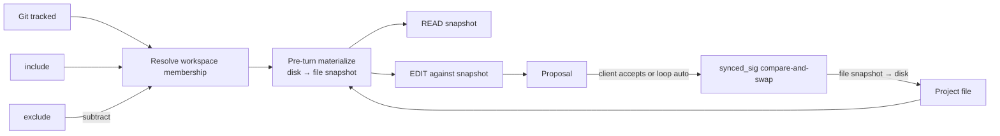

| Concern            | Owner and representation                                                                                                                    |
| ------------------ | ------------------------------------------------------------------------------------------------------------------------------------------- |
| Workspace identity | `workspaces.project_root`; null is headless. There is no separate project entity.                                                           |
| File visibility    | Workspace-tier resolved membership: `(tracked files ∪ include) − exclude` ({§membership-baseline}). Every worker sees the same result. |
| File reads         | READ returns the materialized file snapshot stored in the entry body channel; it does not read disk directly.                               |
| File writes        | EDIT proposes against that snapshot. Only accepted resolution with the captured `synced_sig` writes the project file.                       |
| Internal entries   | Workspace or worker entries are canonical store state. Writing one never implies a project-file write.                                      |
| Authority          | Service flags set the membership ceiling; the `members` family's definitions include and exclude within it; client or loop auto resolves proposals. `origin` is attribution. |

§web-search-retrieval **Web discovery is an ordinary MCP concern; retrieval is a first-class composition.** PLURNK owns no search runtime: a search-capable MCP server (e.g. Brave Search) participates through the ordinary MCP contract — admission, read-effect classification, tool documentation, and packet projection are identical to every other MCP tool ({§mcp-tool-presentation}). An executor that wants to materialize discovered pages uses the generic `content: null` `entry()` request ({§exec-entry-sink}): the guarded `WebFetcher` sink fetches candidates in parallel, off the write-serialization chain, and materializes successful bodies as ordinary HTTP entries. Every candidate whose `entry()` call rejects, regardless of failure reason, is mechanically omitted from the model-facing result directory; survivors retain upstream order. Without an entry sink the executor cannot test materialization and omits the verdict.

Search prefetch and direct HTTP READ materialize the same resource contract:
protocol + canonical authority (including a non-default port) + path + serialized
query is the absolute identity ({§scheme-address-network}); the sanitized
readable projection is the fragmentless default, while faithful DOM, origin
media type, and projection identity remain explicit auxiliary evidence. A
normal
```` ```READ (https://host/path?query) ```` therefore publishes only the sanitized body
under that exact URL—never raw HTML, response headers, or a channel-selection
lesson. FIND consumes the addressed stored channel representation
and never re-fetch a match.

**Git is the substrate and the repository is the boundary:**

- §membership-baseline **The baseline contract — chiseled (#400).** To a workspace a
  project file is exactly one of three things: **invisible**, **added**, or **tracked
  by git**. There is no fourth category. Membership — what the model can READ and
  FIND, what is materialized into the store, what a packet can ship to a provider — is
  the allowlist `(tracked ∪ include) − exclude` and nothing else. No file is a member because
  it exists on disk, because git does not ignore it, or because a model would find it
  convenient: ambient admission of untracked files is prohibited, so a workspace rooted
  in a home directory or a monorepo exposes exactly what was committed or added (the
  non-member rule, {§fs-write-nonmember}: no read, no leak, no overwrite). Every
  exception is a named clause in the register ({§membership-model-universe}), admits
  files by an exact creation record with recorded provenance, and never by `git add`.
  Changing this clause, the register, or the composition is an operator ruling recorded
  on the issue that lands it — never an implementation convenience, never a side effect
  of making a file visible to solve the problem at hand. The 2026-07-12 – 2026-08-27
  "untracked-but-not-ignored" ambient admission is retired.
- §membership-model-universe **The exception register — files in the model's universe.**
  Admitted by exact creation records (`source: "create"`, origin `constraint`), never
  staged: (1) a file an accepted EDIT creates; (2) a COPY/MOVE destination
  ({§membership-create-parents}). Admitted by a published standard as projected
  instruction documents — never as members: (3) the project's `AGENTS.md` and nested
  `AGENTS.md` files ({§turn0-agents-stunt}, #346), read from disk regardless of git status
  and materialized as `worker:///_plurnk/AGENTS.md` and
  `worker:///_plurnk/instructions/<subtree>/AGENTS.md`; the file itself is a member
  only when tracked or added, and the standard never overrides the operator's
  exclusions — an `AGENTS.md` the repository ignores or an exclusion matches
  is not projected. (4) A definition the model proposes through the `members`
  family ({§members-functionality}), admitted only under the operator's ceiling
  `PLURNK_SERVICE_MEMBERS_MODEL_SCOPE` (shipped `namespace`), projected with source
  `model`, and never admitted past the repository's ignore rules or an exclusion.
  Nothing else.
- §membership-git-membership The workspace owns the Git repository containing
  `project_root`. Its tracked files (`git ls-files` semantics) are members with
  no explicit overlay; when the root is a package inside a monorepo, the
  repository's other packages are members at root-relative paths. An unrelated
  or nested independent repository is not discovered or managed by this
  workspace. When Git is absent there is no filesystem walk; member definitions are
  then the sole source.
- §git-native-default **Core Git reads use native Git.** Membership and status
  execute the installed Git binary. An absent or failed binary yields no
  automatic Git membership or status; core has no alternate implementation or
  fallback.
- §membership-git-hermetic Native Git runs with ambient `GIT_*` and
  global/system config scrubbed, and with the repository's own program-running
  keys pinned off at the highest precedence (`core.fsmonitor=false`,
  `core.hooksPath=/dev/null`), so repository identity follows `project_root`,
  never the daemon's launch environment, and inspecting a supplied repository
  never runs a program its `.git/config` names. Other repository-local
  configuration is still read (#568). The one program no key can pin off is a
  `filter.<name>.clean` / `filter.<name>.process` driver, which `git status`
  index refresh may run: automatic inspection asks the repository's own config
  first (`git config --get-regexp`, no program runs) and, when any such key is
  declared, refuses the repository as a warning-and-skip — Git status and
  automatic Git membership answer exactly as for a non-repository, and one
  `engine:membership` / `git_inspection_refused` notice names the key, once per
  workspace until it changes or clears. User- and model-requested Git commands
  stay on their explicit execution path.
- §membership-edit-membership-gate **Membership-gated edits.** EDIT is bounded by membership exactly as READ is. An existing **member**'s baseline is its entry snapshot — the body channel the model READ, not a fresh disk read — so the diff is naive against the view the model saw, never empty (the write-side CAS, {§membership-edit-write-cas}, prevents the silent overwrite of out-of-band drift). An existing **non-member** is refused (403) *before* any read or write: the model never reads a file it can't see (no leak into the proposal) and never overwrites one (no wiping a gitignored `.env` it never added). A **new path** crosses the creation matrix in {§fs-write-surface}; proposal acceptance cannot bypass its scope, exclusion, or incorporation rules. Shell execution reaches beyond file membership; the file scheme does not.
- §membership-create-parents **Parent-complete creation.** An accepted File creation—whether authored as EDIT or as a COPY/MOVE destination—recursively creates missing parent directories before writing and registering the new member.

**The overlay — `include | exclude`.** `workspace_constraints` holds the `members` family's projected definitions and the engine's creation records ({§members-projection}). Resolved membership is `(project repository files ∪ include) − exclude`.

- §membership-auto-add **Auto-add** — the project repository's ambient membership is its tracked `ls-files`, with `git` origin; an untracked file is never an ambient member ({§membership-baseline}). An accepted creation is incorporated by an exact creation record, never by `git add` ({§membership-model-universe}); a record that cannot be written fails the creation transaction, never an orphan ({§file-create-no-orphans}).
- §membership-overlay-include **`include`** — admit a file Git misses through a targeted pattern scan (files only), with `constraint` origin. `source: "members"` is a projected human definition, `source: "model"` a projected model definition, `source: "create"` the exact durable record of an accepted creation. Only `members` inclusions override active Git ignore. In a Git-absent root, inclusions are the sole file-membership source.
- §membership-overlay-exclude **`exclude`** — a `!glob` definition removes a tracked or included file: resolution drops matches (`node:path.matchesGlob`) and reconciles so the entry set *equals* the member set. The lever to exclude a committed-but-oversized or sensitive tracked file; exclusions mask creation records without deleting their provenance ({§fs-create-masked}).
- §membership-reconcile-sets **Reconciliation is two set statements.** Once the desired set is composed — `(git ls-files ∪ include) − exclude`, glob evaluation and Git shell-outs being the process's own — it lands as one `INSERT … SELECT FROM json_each` with the same idempotent provenance update as a single registration, and every overlay-owned member outside it leaves in one `DELETE … WHERE pathname NOT IN (json_each) RETURNING`, its prior body riding out of the statement. A path that also left disk truth (no longer a candidate at all) becomes a divergence from that prior content; an exclusion is silent. No per-path statement, no set difference outside the database.
- §membership-glob-in-sql **A constraint is evaluated where it lives.** `glob_match(pathname, glob)` is `node:path.matchesGlob` registered into SQLite (`src/core/glob_match.ts`, deterministic), the one matcher every overlay decision uses, so a lookup that asks the constraints table a question — which exclusion covers this key, whether a members definition includes it, which inclusion owns each untracked path — is one statement over `workspace_constraints`, never a listing filtered in the process. Transient inputs the process already holds (a `git ls-files` listing against the exclude globs) stay filtered in the process; the function exists so the database's own rows can be asked, not so process data makes a round trip.

**File ops act on the entry, not the disk; the two reconcile only at gates.** A `file:///` member is a row whose body channel holds its *materialized model-readable snapshot*. READ returns that channel; EDIT diffs against editable text snapshots — neither reaches the filesystem directly. Entry and disk reconcile at exactly two gates: the **pre-turn materialize** (disk → entry, below) and the **accept-time write-back** (entry → disk, {§proposal}). Between the gates the entry is the truth the model curates against, and `synced_sig` — the member's last-synced disk stat (`mtime:size`) — is the version token both gates compare on.

§membership-source-projection Binary acquisition is transient and bounded by
{§mimetype-binary-input}; durable entry channels remain Unicode text. Core-private
`sourceProjection` attributes preserve the source mimetype, opaque projection
identity, and terminal disposition without exposing raw bytes or a base64 lane.

| Disk source                        | Durable body                                         | Operation effect                                                                 |
| ---------------------------------- | ---------------------------------------------------- | -------------------------------------------------------------------------------- |
| Text                               | Verbatim Unicode under the detected textual mimetype | READ and EDIT use the snapshot.                                                  |
| Binary with readable projection    | Derived Unicode as `text/markdown`                   | READ uses the projection; source-aware EDIT remains 415.                         |
| Binary without projection/over cap | Empty marker under the source binary mimetype        | READ and EDIT return 415; private metadata distinguishes unavailable from limit. |

§membership-materialization-limit **A pathological member degrades, never the
workspace.** `PLURNK_SERVICE_FILE_MATERIALIZE_MAX_BYTES` is a required positive
byte ceiling over one disk source before Core reads it into the canonical file
snapshot. Its valid range is `1..104857600`, bounded by the channel storage
contract, and it ships at that 100 MiB maximum. An oversized path remains a real member
with an empty body channel carrying a durable 413 producer result; no diagnostic
sentinel impersonates file content. READ therefore names the path, observed bytes,
ceiling, and recovery through the ordinary result contract, while EDIT returns the
same 413 instead of diffing against a fictitious empty baseline. Core records the
materialization disposition and ceiling privately, so an unchanged disk member is
reconsidered when the operator changes the policy and otherwise remains a stat-only
no-op. The file write gate independently stats the source against the same ceiling,
so safety does not depend on a background warm winning a client-operation race.

§derivation-dedup-parallel **The index dedups then parallelizes.** The derivation identity hashes the exact READ channel representation, mimetype, reader behavior, and applicable search exclusion. A channel or log projection attaches the immutable artifact only after it is complete; identical projections therefore share one FTS row and one symbol graph without copying, and the FTS index reads its text from the content store ({§content-store}) instead of keeping a copy. The identity hashes the representation's own SHA-256 ({§tokenomics-content-hash-identity}), never its body, so a maintenance pass judges an entry channel from its stored `content_hash` without the body crossing into the process; a body is acquired only for a derivation that runs, under that same identity (a representation that moved on since it was judged returns nothing and is judged again next pass), or for a channel with no stored identity, an open or streamed channel, which must be read to be judged. Log rows and turn sources still arrive whole. The pass reports the bytes it acquired beside the derivations it ran, and an unchanged workspace acquires none of its channel bodies at any concurrency. Distinct artifacts run with bounded producer concurrency (`PLURNK_SERVICE_DERIVE_CONCURRENCY`). Pending artifacts sort by readable content length before entering that pool, so small resources start first while every outlier still derives fully. Unset uses a host-relative square-root fan-out; a positive integer is an exact operator budget and `-1` claims every core. Graph persistence writes at most `PLURNK_SERVICE_DERIVE_STORE_BATCH` definitions or references per SQLite statement. Every launched worker settles before the maintenance pass reports success or failure, so one failed artifact cannot orphan sibling derivations. Every representation completed by a successful pass attaches a terminal classified artifact, identically at concurrency 1 and N. A changed pass emits one immediate `preparing` state, intermediate `indexing` heartbeats at `PLURNK_SERVICE_DERIVE_PROGRESS_HEARTBEAT_MS`, and one immediate `complete` or `failed` state. A no-op pass emits no lifecycle, an indexing heartbeat never claims 100%, and the model-facing Notice buffer retains only the current derivation state while live clients observe each heartbeat.

The artifact also retains a positive `{§mimetype-parse-issues}` count and the
full normalized `{§mimetype-summary}` when the exact parsed channel reported
either. Both remain advisory alongside a normally completed search
disposition; zero, empty, and unavailable evidence persist as absence. Catalog
projection attaches either only to that channel, never to a sibling whose
content the artifact does not describe.

Every completed artifact records one terminal disposition: `indexed`, `excluded`
(the configured search-exclusion table), `unsearchable` (empty or binary), or
`failed` (a typed {§mimetype-error-policy} invalid-source failure, or the
handler's own defect on that one member — {§derivation-member-failure}).

§derivation-member-failure **One member's derivation failure never ends the
pass or the model's turn.** A handler defect on one member — a
`MimetypeDerivationError` under {§mimetype-derivation-evidence}, the exception
being a cancellation — is that member's terminal `failed` disposition, whose
`reason` is the handler's invocation context followed by the exact original
cause (`Mimetype derivation failed for "/x.js" ("text/javascript").
RuntimeError: …`). The pass continues, attaches every other member, and
completes; its terminal `search_progress` notice is `complete` at `level: warn`,
naming the first failed member and carrying the count. A failed member is
terminal for that exact content, handler revision, and configuration identity
({§derivation-dedup-parallel}); a change to any of those derives it again.
Everything that is not a handler's derivation of one member stays fatal to the
pass exactly as before: a grammar that is not installed, an index-persistence
or contract failure, and cancellation, each leaving the artifact `building` for
retry.
Cancellation and implementation, loading, database and index-persistence failures
remain `building`, unattached, and retryable; Core never guesses that an arbitrary
projection exception is bad content. The digest reports exceptional dispositions
with their reasons. Successful optional projection degradations continue indexing
and surface their framework Notice once per identical observation in a maintenance
pass.

§membership-change-gated-sync **Sync is idempotent and change-gated.** Per turn, membership materializes every member's model-readable snapshot into its entry. Text with an unchanged disk signature and materialization policy is a stat-only no-op. The version token is either the observed `mtime:size` or the explicit `absent` state; an observed deletion removes the stale readable channels, and a later reappearance is therefore a new divergence rather than a first-sight materialization. Binary sources additionally compare the cached per-mimetype projection identity; unchanged bytes are never reacquired, while changed reader behavior rematerializes without fabricating a filesystem-divergence event. Coverage is exhaustive across the project repository while work is proportional to source or projection change. After a pass every member carries the current representation defined by {§membership-source-projection} and {§membership-materialization-limit}.

§membership-emi-divergence-signal **EMI divergence evidence.** The detector that gates the work *is* the one that records this — one mechanism, not a second full read. When change detection finds a member moved out-of-band, the runtime actor records an `EDIT`-shaped row naming the file with `source="file"`; it does not broadcast that workspace change into unrelated workers' logs ({§env-delta-filesystem-narration}). The model's own edits are write-through (the entry equals disk after a File write), so the scan never mis-attributes them as external divergence. The current file remains ordinarily addressable. A stale anchored edit rejects under {§line-anchors}; a disk race after proposal rejects under {§membership-edit-write-cas}.

§membership-edit-write-cas **The write-back is a compare-and-swap — never a clobber, never a clever merge.** EDIT is *naive against the editable text snapshot*: it diffs the model's change onto the entry's body channel — the exact Unicode the model READ — and the proposal carries the `synced_sig` that snapshot was taken at. Binary sources are refused before this path ({§membership-source-projection}). At accept, `applyResolution` re-stats disk and lands the proposed content only if that signature still matches. If disk moved out-of-band in the propose→accept window — a sibling worker, the user's editor, a build step — the write is **refused** with the same neutral `edit-collision` as {§edit-collision}, and **nothing is written**. The engine neither blind-writes over the ambient change (a *clobber*) nor silently re-diffs the model's edit against a state it never saw (getting *clever*) — both would bury a stale-view contract violation under a fallback. The collision surfaces instead: a ≥400 apply downgrades to a reject ({§proposal}), so the model sees that EDIT **did not occur** (400; the `edit_collision` outcome is forensics-only). Reconciliation aligns the current file projection and records the `source=file` evidence in the runtime log ({§membership-emi-divergence-signal}); the model re-reads and re-proposes against the fresh snapshot.

The version travels *with the proposal*, never re-read from the entry at accept: a sibling worker in the same workspace may reconcile while this proposal sits paused, advancing the entry's `synced_sig` to the drifted disk — comparing against the *current* entry sig would wave that clobber through, so the comparison is always against the sig the proposal was computed at. A proposal that assumed an **absent** path (a create) conflicts only if a file has since appeared; a member with **no recorded snapshot** (an un-materialized entry, null `synced_sig`) has no baseline to guard and writes through — the two are told apart by the proposal's `existed` flag, not by a null sig alone. On a clean landing the entry refreshes to the written content and `synced_sig` is **restamped** to it, so the next reconcile recognizes the model's own write (not an external divergence) and a second same-turn edit bases on the landed bytes, not a stale sig. This is the write-side twin of the read-side change-gate ({§membership-change-gated-sync}): one `synced_sig`, gating both the re-read and the write.

The CAS is the **hard backstop**, at the moment of writing, on every accept path. It composes with the model-facing {§line-anchors}: an anchor rejects a target whose relevant neighborhood changed before dispatch, while the CAS refuses to write against a snapshot disk left after proposal. An unanchored edit deliberately claims no pre-dispatch stale-view guarantee.

§membership-git-flags **Permission flags.** Service-wide Git admission comes from {§operator-config-git-ceiling}. `PLURNK_SERVICE_GIT_AUTO=1` (default) includes the repository containing `project_root`; `=0` disables automatic Git membership, leaving member definitions as the only membership source. `ALLOWED` gates `AUTO`.

**Rationale.** Workspace is the right scope unit and the containing Git repository is its ordinary development boundary. Membership curation is tiered: Git bounds it by tracking, the client supersedes by overlay, and the model curates its render by READ/KILL. Supporting several independent repositories as one world would require Plurnk-owned topology, synchronization, and model teaching that Git already solves cleanly by treating them as separate workspaces.

**Schema.** The version-1 baseline stores the normalized {§inference-ledger},
its model-response evidence, emission admission, and cardinal
physical requests. Its constraints distinguish pending calls, response
evidence, and response-less errors while monetary classification remains
explicit.

## §worker-loop-lifecycle Loop scheduling and lifecycle

- §join-blocking-collect **Collection and scheduling are independent.** A path-absent ```` ```READ (worker://<running-child>) ```` returns **425** (Too Early), without a strike or scheduler side effect. WAIT joins live obligations; ordinary operations without WAIT keeps working. A child reaching any terminal status wakes a waiting parent with its result, including completion racing the park boundary. Children retain their own limits. Collection never arms an implicit disposition override.

A worker is a **log plus a cancellation scope** — one `AbortController` per worker, reused while live and replaced only once aborted, so a cancel ends the worker as a unit and a later `runLoop` request is never born cancelled. A worker's queued loops are advanced by a **drain**: a single per-worker drain that claims loops atomically (status 100→102) and runs each under the worker's scope. A loop may spawn **streams** (execs) that outlive it; each is a row in the subscription registry ({§subscriptions}) — the durable record of what the worker holds open. Cancellation and conclusion are defined against these structures, never wall-clock timing.

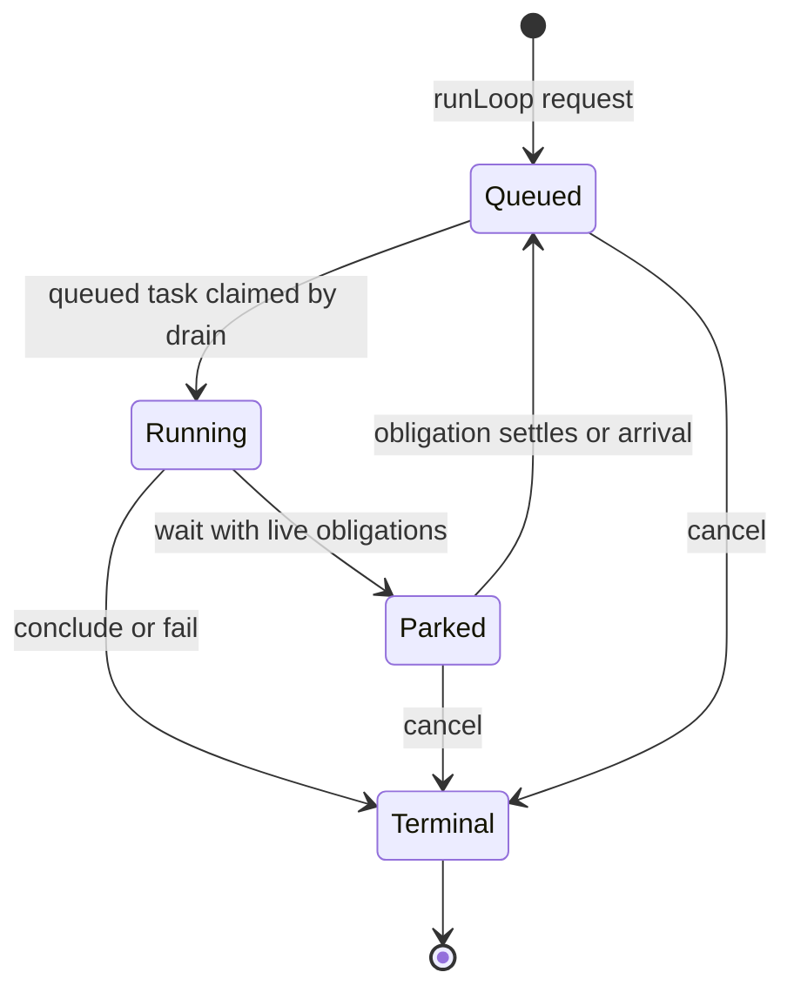

§worker-lifecycle-state-machine The lifecycle store admits only the guarded transitions shown above: `100 → 102`, `102 → 202`, `202 → 100`, and any unresolved state (`100`, `102`, `202`) to a terminal status. Terminal state is immutable. `DrainSupervisor` owns claim, wake, and cancellation; the dispatcher owns model-requested park/conclusion; the daemon owns boot-recovery orchestration; and the engine owns policy terminals. A racing transition that loses observes the durable winner; it does not overwrite it or report the requested state as fact.

§worker-lifecycle-live **Worker liveness is existential, not latest-state.** A
Worker is live while ANY of its loops is unresolved (`100`, `102`, or `202`). A
newer terminal loop cannot mask older queued, running, or parked work. Name
collision, workspace worker caps, child obligations, orientation, and recovery
all use that one definition.

### §worker-wait-timing Durable waits and wake ownership

WAIT has no timing operand; its optional path is a label ({§send-wait-scope}).
With live work—an open stream or a live child worker—the loop parks durably
and wakes on settlement, on a
message, or on the inherited observation cadence of its open streams
({§exec-lifetime}); without live work it continues at once, told so. A wake
continues the same loop with the same messages, generation policy, and
cumulative turn ceiling; it never creates another assignment. Scheduled messages
exist independently of a loop's optional attachment to one occurrence.

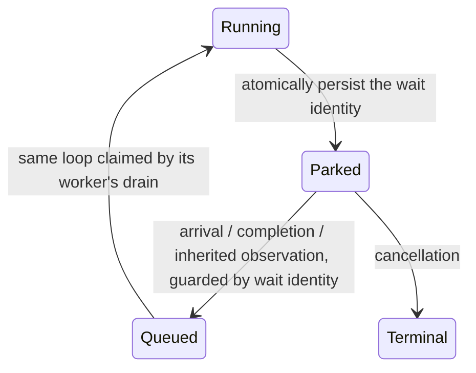

§loop-wake-identity **One drain is not one unfinished loop.** A worker may
have several queued or parked loops, but only one executing drain. Timers bind
the exact loop and wait generation; a stale callback cannot wake a later wait.
Worker-owned completion events notify the waits observing that worker's
obligations, not merely its latest parked loop. A completion crossing an active
loop's park boundary is owed to that loop, never a future unrelated loop.

Each loop captures the worker's completion revision when its program begins.
Before inference, it acknowledges the current revision only after every addressed
terminal/reply occurrence has crossed the ambient observation cursor and every
closed stream has published its terminal channels. The publication check and
revision acknowledgement are atomic; an arrival beyond either materialization
snapshot remains owed. Stream closure, direct-child terminalization and addressed
replies advance the revision in the same database mutation as their evidence.
An unobserved completion remains owed through parking and restart; another loop's
turn cannot consume it. Waking is guarded by both the wait identity and the
relevant due/event predicate, so delayed callbacks do not wake programs that
already observed their evidence.

Wait identity commits with the parked transition. The drain persists any
inherited stream-observation due time; process timers only arrange a bounded
next check. Restart reconciles obligations under {§worker-lifecycle-restart-recovery}.
Waking or terminalizing invalidates the old wait. Duplicate and racing wakes
have one durable winner, and cancellation cannot be reversed by a timer.

§loop-claim-latency **A loop's first claim is durable.** `loops.claimed_at` is
stamped by trigger the first time a loop enters status 102, at insertion for a
loop created running and on the move from queued otherwise; later re-claims never
move it. The digest reports, per loop, the claim time and how long after it the
first model turn started, so a stall between claim and inference (a heartbeat has
waited 7.5 h, #703) is a number rather than a gap.

§digest-storage **The digest states the file's health.** Beside the database path it
reports the file size, the free pages it holds, its `auto_vacuum` mode, and the six
largest tables and indexes by allocated bytes (`dbstat`), so growth is a number in
every digest (#764). The digest reads loops as stored, so a database made before a
lifecycle column was added still digests.

§loop-execution-allowance **One task has one execution allowance.** The first
execution snapshots `PLURNK_SERVICE_LOOP_TIMEOUT` on the loop. Active segments
consume that allowance cumulatively, measured with a monotonic clock; waits and
wake neither renew it nor change its configured limit.

| Interval | Execution allowance |
|---|---|
| Executing the loop, including provider calls/retries, turn-lock acquisition, operation/proposal waits, and execution holds | Consumed. |
| Parked, queued before execution, or daemon offline | Not consumed. |
| Resumed after a message, completion, clock wake, or restart | Only the saved remainder is available. |

The lifecycle owner saves consumption with park/conclusion/cancellation and
retires the active execution timer. An exceptional execution exit also saves
consumption and releases its timer. Process-local clocks never own task state.
Turn-lock acquisition is abortable: cancellation removes the queued request,
and an asynchronous admission check cannot grant a cancelled request or a
superseded exclusive lineage permission.
An exhausted allowance aborts in-flight execution and produces `504`; a late
callback cannot override a committed disposition. Restart preserves parked
allowances; interrupted active tasks follow ordinary owner-loss recovery,
never replay interrupted effects to reconstruct time. Future messages use
the separate schedule contract ({§schedule-delivery}).

§worker-message-admission **Recipient selection and admission are one decision.**
An arrival to a worker selects its running loop, otherwise its oldest parked
loop, otherwise a new queued loop. Compatibility is checked against the exact
loop that receives the message; the writer does not reselect another recipient.
The worker's admission lock covers selection, compatibility, message admission,
and the park-boundary wake check against orphan recovery. Fresh task insertion
includes its complete generation policy, proposal disposition, and initial paths
atomically; no drain may claim partially configured work.

| Message at the receiving task's end | Disposition |
|---|---|
| Delivered to an unfinished loop | Append one ordered message to the loop's inbox; waking does not repeat earlier messages. |
| Admitted but not observed before ordinary completion | Preserve through the existing orphan-message admission path. |
| Cancelled as part of the worker scope | Preserve the frame as evidence; never promote it into executable work, including after restart. |
| Explicit new arrival after cancellation | Admit under ordinary current worker policy; never revive a terminal loop. |

§stream-catalog-lifecycle Streams are independently durable subscriptions owned by a worker. Payload and
lifecycle are orthogonal: zero bytes is a valid payload for both success and
failure, while the closed subscription and its status are the terminal fact.
Every stream entry exposes that durable state on its catalog group's default
channel (`[0].stream: { state, ... }`): active streams carry `seconds`; terminal streams carry
their exact `status` and derive `closed` (status below 400), `killed` (499), or
`failed` (other failure status). An entry with no subscription has no `stream`
member. This is historical state, not merely a live-process hint.

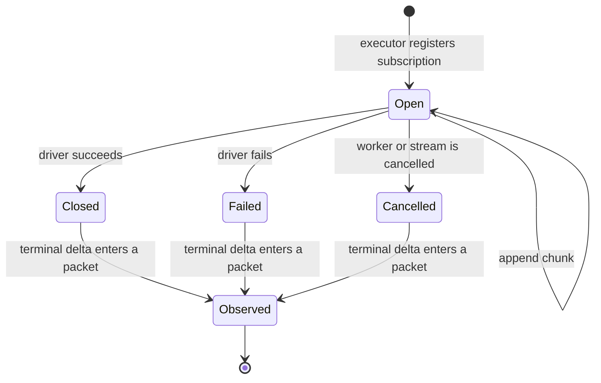

| §worker-lifecycle-subscription-matrix Subscription state at WAIT | Terminal observation already in a packet | Result |
|-------------------------------------------------------------------------|---:|---|
| open                                                                    | no | park; polling or closure may wake it |
| closed, any status, empty or non-empty                                  | no | continue directly to the observation turn |
| closed, any status, empty or non-empty                                  | yes | no stream obligation remains |
| cancelled as part of worker cancellation                                | irrelevant | terminate the cancelled worker; never resurrect it |

Observation watches a still-open stream; it never changes ownership or manufactures
completion. Closure is always a wake edge.

| §worker-lifecycle-poll-matrix stream | While open | On closure |
|------------------------------------------------|---|---|
| any lifetime but `turn`                        | the daemon's exponential-backoff observation wakes ({§exec-lifetime}) | resume once with terminal observation |
| `[{"lifetime":"turn"}]`                        | reap at the next pre-turn boundary | surface the terminal outcome |

The structured-concurrency sequence is identical whether a child performs an
execution, retrieval, or pure inference. Intermediate status does not drain the
child obligation; explicit replies may arrive earlier ({§message-reply-delivery}).

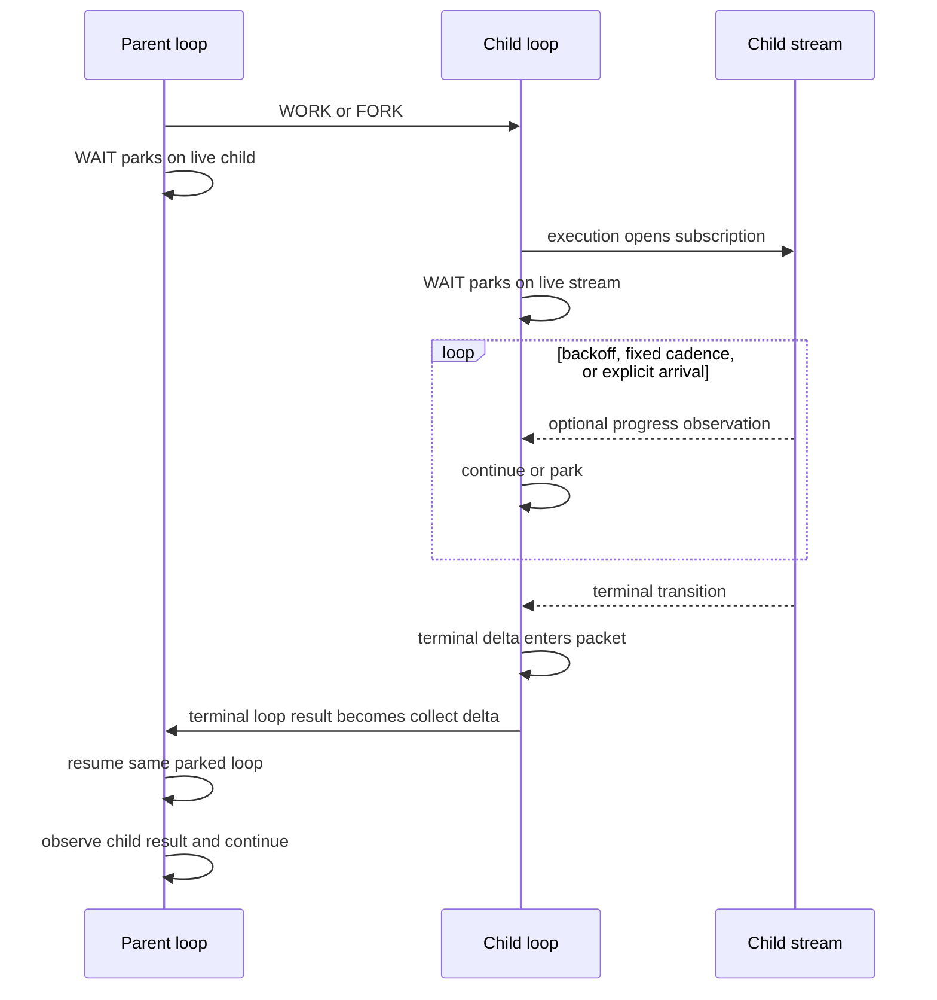

| §worker-lifecycle-child-matrix Child state at parent wait | Child result delivered to parent | Result |
|-----------------------------------------------------------|---:|---|
| queued, running, or parked on its own live obligation     | no | parent parks |
| terminal during the parent's turn                         | no | owed wake; parent continues to the result packet |
| terminal before the parent's wait                         | no | parent continues directly to the result packet |
| terminal                                                  | yes | child obligation is drained |
| cancelled or failed terminal                              | no | same wake/delivery path as success; outcome remains non-2xx |

A stream's close status and a loop's terminal status are separate layers. A
stream may close 4xx/5xx and wake its worker to recover. The lifecycle resolver adjudicates the
loop's answered messages, observation boundaries, and held work independently of
stream and message-delivery statuses ({§send}). Only a concluded loop drains the child obligation.

§worker-lifecycle-terminal-result **Terminal truth is a result, not a lifecycle code.** `loops.terminal_result`
stores the exact universal operation result. A failure therefore retains its
RFC 9457 Problem Details and exact status through persistence, restart,
parent collection, and `loop/terminated`. Message delivery and execution outcome
are independent: neither completion nor cancellation borrows the last reply's body.
Cancellation markers are derived presentation, never a second stored outcome. The constrained `loops.status`
column remains only the scheduler's compact lifecycle projection: known
terminal classes remain themselves, other 2xx/3xx statuses project to `200`,
and other 4xx/5xx statuses project to `500`; exact `202` is forbidden because
it is the parked lifecycle state, not a terminal. No product surface may infer or
reconstruct a result from that projection. Active rows have no terminal result;
terminal rows must have one, and database triggers enforce both directions.

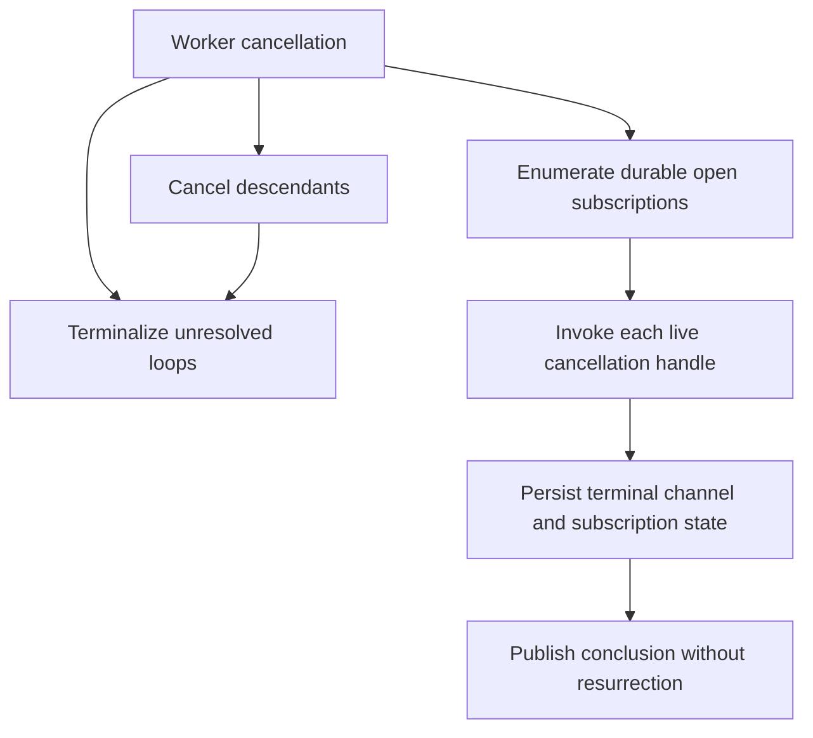

Restart applies the same ownership rule: accepted queued loops are reclaimable;
in-flight provider calls and subscriptions belonged to the vanished process and
become explicit failures. A park whose child remains live stays parked; a park
whose obligations settled during reconciliation is requeued in place so it can
observe their terminal results. No effect is replayed across an unknown
boundary.

- §worker-lifecycle-single-drain **One drain advances a worker.** At most one drain is registered for a worker at any instant: a `runLoop` request or wake on a worker with a live drain folds in (active→next-turn) or enqueues a loop that drain claims, never a second parallel drain. A drain's start and its empty-queue teardown relinquish the worker under one per-worker lock, so the teardown's re-claim cannot race a concurrent start into a double-drain. Fresh-loop sequence allocation and insertion are one mutation under that same lock; concurrent accepted prompts remain distinct ordered queue items.
- §worker-lifecycle-total-reap **Cancellation is recursive and reaps every held stream.** `loop.cancel` and worker `KILL` terminalize every unresolved loop in the cancelled worker subtree and iterate each worker's durable open-subscription rows, invoking each exact callable owner from the process-local live registry. The durable rows answer *what is held*; the live registry answers *how this process tears it down*; the abort signal is a fast-path optimization. There is no implicit detachment. Shutdown reaps process-local streams while preserving parked work under {§worker-lifecycle-durable-disposition}. Before shutdown awaits drains, it cancels every process-local proposal waiter through {§proposal-cancel-aborts} with outcome `daemon_stopping`, so a stopped-world dispatch cannot hold teardown open. A stream that is running, mid-spawn (its row written before it is killable), or spawned after the cancel is reaped alike. The teardown abort is bounded: the executor sends a polite signal then SIGKILL after a consumer-set grace (`PLURNK_SERVICE_EXEC_KILL_GRACE_MS`). A model ```` ```KILL [code] ```` on one live stream instead delivers exactly that signal once (bare KILL uses the executor's SIGHUP default; ```` ```KILL [9] ```` uses SIGKILL).
- §worker-lifecycle-exec-epoch-bound **A stream's kill binds to the scope it captured at spawn.** A stream captures the worker's cancellation scope as it registers and wires its kill to it, re-checking `aborted` AFTER wiring — no check-then-listen gap can drop an abort that lands mid-registration. Because the scope is replaced only once aborted, a captured-then-replaced scope is necessarily already aborted, so replacement never strands a live stream.
- §worker-lifecycle-no-resurrection **Cancelled work does not revive its scope.** A cancelled worker cannot be woken by its torn-down streams, stale timers, or cancelled unpublished messages. The evidence remains readable. A `499` result from cancelling only one stream is still a completion owed to a live waiting worker: result status is not proof of worker cancellation. Only an explicit new arrival admits new work after scope cancellation; terminal loops themselves remain immutable.
- §worker-cancel-trigger **A cancellation is one bound statement.** `lifecycle_cancel_workers` writes the causal cutoff and the cancellation Problem onto every worker of the scope; `workers_cancel_live_loops` (an `INIT` process trigger beside the lifecycle statements, {§db-process-triggers}) retires each worker's live loops inside that statement — 499, waits cleared, message evidence left unchanged, the Problem instanced `loop://<worker>/<sequence>`, `terminated_by = 'cancel'` — so cutoff and cancellation cannot land apart and no value is string-interpolated. Execution consumption is measured by the process-local monotonic timers ({§loop-execution-allowance}) and lands first through `lifecycle_checkpoint_executions`; a wall clock cannot stand in for it, so the timer stays outside the database by design.
- §worker-causal-admission **Admission and cancellation have one ordering.** DrainSupervisor serializes message admission, orphan-message recovery, and subtree cancellation within the workspace, taking the worker queue lock inside that control boundary. No provider, tool, fork-history copying, or stream reap holds it. WORK, FORK, and directed SEND identify their originating loop; admission requires that task still running. An accepted message to an independent recipient is a committed effect, not retroactively withdrawn by cancelling its sender.

  | Boundary outcome | Durable consequence |
  |---|---|
  | Admission before cancellation | Owned work is included in cancellation. |
  | Cancellation before admission | The cancelled task cannot deliver further messages or start children. Created identities and evidence are retained. |
  | Cancellation with unpublished messages on completed tasks | Atomically record each worker's greatest admitted loop sequence as `cancelled_through_sequence` and cancel unresolved tasks. Orphan-message recovery, including boot recovery, excludes sources at or below that cutoff; completed results and message evidence are unchanged. |
  | Independent arrival after cancellation | Admit a new loop above the cutoff using the ordinary worker policy. |
  | Slow stream teardown after new admission | Reap only subscription identities captured by cancellation; late old-scope spawns follow {§worker-lifecycle-exec-epoch-bound}. |

- §worker-lifecycle-wake-liveness **A stream conclusion always reaches its worker.** The stream first persists its terminal state. A worker **blocked on a 202 wait** for that stream ({§wait-obligation-matrix}) then **awakens that loop in place** — the blocked loop *is* the continuation, so there is no fresh loop and no summary-as-prompt fiction. An already-active worker needs no injected prompt or second wake because its next packet reads the durable terminal state. A concluded worker receives no synthetic loop from ambient stream closure. The result remains available in the stream's own state under every case.
- §worker-lifecycle-child-wake **Each child task completion notifies its parent.** Terminal-task publication, including failure and cancellation of a parked task, notifies the direct parent without injecting a prompt. Other unfinished tasks or streams in that child remain independent obligations; they cannot suppress notification. The parent's eligible waits requeue in place under {§loop-wake-identity} and the bounded {§worker-optimistic-settlement} opportunity. Durable revisioning covers completion-before-park and restart; drain teardown and whole-worker quiescence are not completion identities.
- §worker-optimistic-settlement **Asynchronous settlement receives one bounded worker-local opportunity before model dispatch.** An initiating turn lets only the streams it started settle before program completion; separately, a stream conclusion, direct-child conclusion or addressed reply persists and publishes immediately but holds eligible parked loops' `202→100` requeues while another stream or direct child remains live. Both use `PLURNK_SERVICE_OPTIMISTIC_WAIT_MS`, shipped at five seconds; zero disables the opportunity. The wake hold ends as soon as no sibling obligation remains, never extends its original deadline, and coalesces arrivals within that window into at most one requeue per eligible loop. With no sibling obligation the wake is immediate; at the deadline, surviving work follows the ordinary monitored lifecycle. An arrival after provider dispatch begins retains its next wake, while poll, new-request and operator wakes never open this hold. Only packet/provider dispatch waits: durable state, client events, cancellation and the replying program do not. One redaction-safe span records elapsed time, quiescence versus deadline, and arrival count without entering the packet.
- §worker-lifecycle-idle-is-concluded **Idle is not unanswered.** An empty WAIT continues; an eligible final response with answered messages, observed results and no held work concludes under {§wait-obligation-matrix}. A concluded worker retains durable history; a later addressed arrival starts a new loop.
- §worker-lifecycle-no-lost-loop **A loop is never stranded by a drain's exit.** A drain relinquishes its registry slot only after a lock-held re-claim confirms the queue is empty; a loop enqueued during that teardown is either re-claimed by the exiting drain or claimed by a fresh drain that a later inject starts. The relinquish and the start are serialized, so neither the lost-loop hang nor a transient double-drain can occur.
- §worker-lifecycle-durable-disposition **Durable disposition wins cancellation races.** At a turn boundary, the engine reads the loop's durable status before interpreting a process-local abort. A committed `202` park survives a later daemon-shutdown signal; only a loop still durably running at `102` can be terminalized by that cancellation. Wake selection rechecks shutdown and worker cancellation before requeuing each parked loop.
- §worker-lifecycle-restart-recovery **Restart is owner-loss reconciliation, not replay.** Before opening client transports, the service holds an exclusive database-adjacent daemon lock; a second live owner fails before touching SQLite, while a dead-PID crash claim is replaced atomically without a timeout lease. Boot preserves accepted `100` loops and restores their drains. A `102` loop belonged to a vanished drain/provider call, so it settles `500` with the interruption on its durable row—never replayed across an unknown effect boundary. Every pending physical provider request first settles as an error with absent usage and explicitly unknown cost; then its logical model call closes. Recovery never fabricates zero evidence. Every durable proposed operation likewise lost its process-local resolution waiter and settles as a visible `500 owner_vanished` occurrence rather than an unresolvable interrupt ({§proposal-list}). A pending client interaction also lost its exact awaiting operation, so boot removes the orphan instead of replaying work or inventing a response ({§client-interactions}). Every durable-open subscription belonged to a vanished callable: active channels become errored and its row closes `500`. A `202` continuation requeues on an unseen completion or when no live obligation remains. Otherwise it stays parked on surviving children; the drain restores inherited stream observation through the same guarded scheduler ({§worker-wait-timing}). Child terminalization wakes its parked parent on every outcome, including provider exceptions, cancellation, and restart interruption, recursively through the durable parent edges. These operations are idempotent, so an interrupted recovery safely repeats.

---

### §turn-record Producer-neutral turn record

A turn is the durable container for one producer's ordered operations. Packet
and provider fields are optional evidence belonging only to model inference;
their absence never makes a client, plugin, or `_plurnk` turn exceptional.

| Field | Contract |
|---|---|
| `producer` | Required actor class: `model`, `client`, `plugin`, or `_plurnk`. |
| `kind` | Required purpose: `inference`, `initialization`, `operation`, or `maintenance`. Model iff inference; initialization and maintenance require `_plurnk`. Producer and kind are immutable. A maintenance turn's successful rows are packet-suppressed — a receipt answers an asker, and maintenance has none ({§actor-boundary-doc-injection}). |
| `status`, `completed_at` | A new turn is open at status 102 with `completed_at=NULL`. Completion records the program outcome and timestamp; a completed 102 is distinct from an open 102. A successful administrative program completes at 200 without concluding its host model loop. |
| Operations | Ordered by `(turn_id, sequence)` on one exact worker/loop/turn chain. Each row's `origin` is the turn producer or `_plurnk` making a system observation; the observation does not impersonate the producer. |
| Program source | Every admitted source-backed turn preserves its exact program before dispatch in `turn_sources`, independently of log receipts, under {§turn-ops-entry}. |
| Inference evidence | Model calls, `packet`, model, finish reason, and provider metadata belong only to model/inference turns. Turn fields are nullable until recorded and remain NULL for every other kind. |

One lifecycle owner opens, optionally records inference evidence, and completes
every turn. Initialization, maintenance, client dispatch, and model
inference use that same path. `plugin` is the producer identity for
plugin-authored operation turns; exposing that path must not introduce a
parallel record or lifecycle. Producer and kind never change. Process-restart
recovery completes any turn whose producer vanished.

§turn-ops-admission-path **Source acquisition varies; admitted-turn execution does not.**
A provider response, deterministic `_plurnk` program, or future client/plugin
program crosses one admission boundary into the same executor. That executor
parses once, dispatches the admitted statements in order, records their ordinary
outcomes, and completes the turn from its lifecycle ruling. Exact source is retained before dispatch.
Provider attempts, grammar recovery, reasoning, and accounting end before this
shared seam. A programmatic operation batch that supplied no Plurnk source does
not fabricate verbatim source.

§turn-ops-selection-snapshot **An admitted program cannot select log rows it emits while executing.**
Immediately before statement dispatch, the shared executor captures that worker's
append-only log high-water mark. Every log-targeted KILL in the program resolves
row membership at or below that same boundary, while prior curation effects still
compose normally. Message arrivals and other pre-program rows already present in the turn
remain selectable; preceding and later operation rows cannot be captured by
their own program. A directly dispatched
single operation captures the equivalent boundary before dispatch. This limits
only log-row selection: operation phasing and same-turn resource effects retain
their ordinary contracts.

### §engine-rails Engine rails

After each admitted turn, one inline verdict decides whether the loop continues.
An admitted turn contributes at most one strike, even when several sources fire.
These are the complete strike sources:

| Strike source       | Exact trigger                                                                                                    | Model-visible occurrence                                      |
|---------------------|------------------------------------------------------------------------------------------------------------------|---------------------------------------------------------------|
| Hard result         | An admitted non-execution operation or bounded parse-error status is `>= 400`, except the soft set `404`, `409`, `416`, `425`, `501`. | The originating failure row.                                  |
| Cycle               | The executed operations and their observed results repeat under {§engine-cycle-evidence}.                         | None; cycle detection itself is private engine accounting.    |

Execution results remain exact model-visible evidence but are always soft: an
executor error is not a PLURNK contract violation. Cycle detection remains an
independent strike source.

A `425` not-ready result describes unfinished work, not a contract violation.
It retains its exact receipt, without scheduling side effects ({§join-blocking-collect});
other violations in the same turn still strike normally.

§engine-cycle-evidence Cycle identity contains the ordered executed operations
and their dispatch results, including complete operands, scopes, bodies, and
scheme metadata, including the complete NOTE and response bodies. Source
positions and asides are excluded. Engine-assigned
Problem `instance` addresses and NOTE's assigned storage `resource` coordinate
are excluded from results; the complete note body still distinguishes activity. Object member order is
irrelevant; operation and array order are preserved. Only the configured
`MIN_CYCLES × MAX_CYCLE_PERIOD` history window is retained. Repeated addresses
alone are not a cycle: changing inputs or observations distinguish activity.
A turn that executed nothing has no activity to identify, so an empty turn's
identity is its **text** ({§empty-turn}) — the same principle, applied to the only
output it produced. Identifying it by its absent program instead makes every empty
turn identical, and changing words then read as a repeating one.
This is an exact-repetition backstop, not a semantic judgment of task progress;
new asynchronous invocation identities do not prove repetition of their eventual
effects. Ordinary contract strikes and operator budgets remain independent.

§provider-recovery **A recoverable provider failure never ends a loop.** When a model
call fails with a network failure, rate limit, deadline, or interrupted resource after
the provider's own retries, the turn records the exact Problem as a `_plurnk` row,
notices the client (`engine:provider` / `provider_unavailable`), waits with
exponential backoff (`PLURNK_SERVICE_PROVIDER_RECOVERY_BACKOFF`, doubling up to
`PLURNK_SERVICE_PROVIDER_RECOVERY_BACKOFF_MAX`), and re-issues the same call against the exact frozen model
messages whose response is still outstanding. Each reissue remains a distinct logical
model call with complete physical-request accounting, but the active turn's newly
recorded provider Problems do not recursively enter that request; they surface normally
only in a later genuinely new packet. No emission attempt is consumed and no strike is
scored. Every recovery checkpoint broadcasts live, while the model-facing Notice buffer
retains only the current provider state; the next completed exchange notices
`provider_recovered`. Recovery is bounded by `PLURNK_SERVICE_PROVIDER_RECOVERY`; when it
is spent the turn completes as `202` and the loop parks exactly like a
WAIT ({§worker-lifecycle-wake-requeue-not-terminal}), resuming on the
next prompt or wake with its log intact — **unless the run is unattended
({§loop-attendance}), in which case the loop concludes on the provider's exact failure
instead, because parking stops the execution clock and no wake would ever arrive.** Only a client cancel, the execution allowance
({§operator-config-loop-timeout}), or a non-recoverable provider Problem (refusal,
authorization, quota, an invalid response) settles a loop on a provider failure.

**Contract Strikes** (operator mandate, 2026-09-01): *Every turn with one or
more contract violations earns a strike. A turn without any contract violations
clears the strikes. Three (not four) strikes and you're out, by default.*
The streak counts consecutive violating turns; `MAX_STRIKES` (default 3) is the
threshold, crossed ON the third strike; the crossing turn terminates at **508
Loop Detected** when cycle-detected, otherwise **500**.

The contracts, and the violation of each that strikes:

| Contract | Violation that strikes |
|---|---|
| operation contract | a hard operation failure (status ≥ 400) in an admitted turn — soft statuses below excluded |
| review contract | none: an eligible final response joins live obligations ({§completion-joins-live-work}) or continues to observe results ({§completion-defers-to-results}) |
| progress contract | a detected operation cycle (`MIN_CYCLES` × period), or an admitted turn with no operation ({§empty-turn}) |
| frame contract | emission attempts exhausted with no admissible turn |
| provider response contract | the provider returned an invalid response |

Errors and issues are NOT contract violations. Each keeps its own disposition
and never strikes: exploration misses (404, 416) and unsupported capability
(501) are how discovery works; raw 409 outcomes are soft; execution outcomes and `executor/*` problem rows are world evidence;
provider weather (rate limit, network failure, deadline, interruption) recovers
({§provider-recovery}); provider capacity has its own packet recovery and
terminal ({§provider-capacity-failure}); request rejection
({§provider-request-rejection}), authorization and quota failures
terminate immediately (configuration, not behavior); rejected private emission
attempts are forensic evidence beneath their turn ({§emission-admission}) —
only their exhaustion surfaces, as one frame-contract violation. The
independent turn ceiling terminates at **429** ({§loop-terminals}). The streak
and cycle verdict are absent from model packets; only the concrete occurrences
in the table are shown. The streak never leaves the daemon.

A crossing terminal names the source that struck the crossing turn — `repetition`,
`no_operation`, then `operation` — in its detail, in that order when a turn matches more
than one. The three are not interchangeable: a turn that authored no operation did not *fail*
one, and reporting it as a failed turn misreads a model answering without the fence as a model
whose operations broke. This is the crossing turn's source, not the streak's composition; the
rail rules on the crossing and does not retain the kinds behind it. What the crossing turn
actually said is cited, not discarded ({§terminal-evidence}). Naming the source is not the
private accounting {§rail-accounting-private} withholds: the streak, the cycle verdict and
attempt counts stay inside the daemon — this is the terminal telling the truth about its own
cause, which the reader already sees the shape of.

§loop-rail-continuity Rail state belongs to the durable loop, not its execution
segment. The strike streak and bounded cycle history survive driver cleanup and
restart; curation of log evidence cannot alter them.

| Boundary | Strike streak | Cycle history |
|---|---|---|
| Assessed turn with a violation | Increment once. | Include its exact activity. |
| Clean assessed turn | Reset to zero. | Include its exact activity. |
| Actual park, including an immediate wake/reclaim in the same drain | Preserve the assessed streak. | Close the window; the next turn starts a new one. |
| Recoverable provider outage | No assessment; preserve the streak. | Preserve until an actual park. |
| New loop | Start at zero. | Start empty. |

The turn belongs to the wait revision under which it began. A rejected WAIT or
one resolved without parking does not close a window. Periodic observations
separated by actual waits are not an uninterrupted cycle; cumulative turn and
execution allowances remain independent bounds. A committed terminal result
cannot be replaced by a later rail assessment ({§worker-lifecycle-state-machine}).

## Provider Contract

Author-facing contract: [`@plurnk/plurnk-providers`](../plurnk-providers/SPEC.md). Below: consumption surface + engine→provider guarantees.

### §provider-surface Consumption surface

Three current entry points:

- §provider-surface-generate `provider.generate(args)` — once per logical model call. An emission attempt supplies the complete packet messages, worker/turn coordinates, generation envelope, optional local grammar, first-party metadata, and `callKind: "emission"`. A BARE inference supplies only one user message containing its resolved prompt plus non-prompt call identity and accounting metadata, including `callKind: "bare"` ({§bare-inference} {§provider-call-kind}). Both receive a durable physical-request observer; provider-owned retry and failover may issue several ordered requests beneath either call. A successful `ProviderResponse` reaches its call-specific consumer; a `ProviderError.attempt` remains failed response evidence under {§provider-interrupted-attempt}. Core persists normalized response evidence separately from physical accounting.
- §provider-surface-capacity `provider.assessRequestCapacity(messages, maxOutputTokens?, signal?)` — provider-owned intersection of request-shaped token evidence and every known physical input limit. It admits, rejects only a proven exact overflow, or defers ambiguity to upstream ({§tokenomics-context-envelope-admission}). `generate` performs this assessment for its exact request and preserves the evidence on success and capacity failure.
- §provider-surface-prompt-measurement `provider.countPromptTokens(messages, signal)` — the cancellable complete-request measurement primitive used by provider capacity assessment, with `exact`, `upper_bound`, `estimate`, or `unavailable` provenance. Core never substitutes this physical fact for its curation ruler.

§provider-surface-identity Provider capacity and identity are immutable for one instance. `contextWindow`, `maxInputTokens`, and `maxOutputTokens` carry known model limits; `outputBudget` is the total generation envelope, optional `reasoningBudget` is its strict subset, and `inputCapacity` is the stable intersection of known input constraints ({§tokenomics}). Unknown facts remain `null`. `model` identifies persisted turn/provider evidence. Local GBNF admission also consumes `constrainsOutput` ({§grammar-configuration-admission}).

§inference-ledger **Logical inference is provider-neutral and physical requests have one ledger.** Every `inference_calls` identity belongs to a workspace and a model/inference turn, records its ordered kind and request model, and has a forward-only lifecycle. Its `model_calls` specialization owns normalized failure and capacity evidence; the response body is `model_call_responses`, present or retired under {§retention-policy}; one observation view records evidence, body and close together, and a settled call refuses a second observation. Only an `emission` has `turn_attempts` admission evidence; `bare` calls retain independent results. Every physical request is an ordered `provider_requests` child opened before I/O and settled once. Calls contribute to turn, loop, worker, and workspace accounting; only an emission supplies the latest context gauge.

§meta-passthrough **Metadata passthrough (provider → client).** `generate` may return an open `meta: Record<string, unknown>` bag. The service stores it unenforced per turn (`turns.meta`, `json_valid` only — no schema) and forwards the latest turn's blob in `loop/terminated.usage` ({§notifications}). The service never reads a field within it. Providers own their metadata shapes; monetary values carry an explicit amount and currency rather than an implied unit. Absent → `{}`. The mirror direction (client → provider, the self-identified `client` id) rides `generate({client})` ({§attribution}).

### Engine → provider guarantees

- `messages` is a complete prompt (the section list, pre-assembled into the system + user messages). Provider does not reorder.
- §provider-guarantees-signal-wired `signal` is wired to the worker's AbortController.
- §provider-guarantees-serial-attempts Emission attempts for one engine turn are serial. They reuse the exact messages, coordinates, generation limits, and strike state; two attempts for that turn never overlap.
- BARE calls admitted by one turn launch as one parallel batch; each call retains independent observer and failure state, and the engine awaits the complete batch before committing results in authored order ({§bare-inference}).
- §provider-guarantees-request-observer Immediately before each physical provider I/O, the provider opens its provider/model identity through `observeRequest` and settles the returned handle exactly once as response or error. Core durably records that occurrence before I/O and rejects a returned response or `ProviderError` whose ordered accounting differs from the observed records. Persistence failure is an internal contract failure, never optional telemetry.
- §provider-guarantees-assistantraw-opaque `assistantRaw` is opaque to the engine (forensics-only).
- Capacity assessment receives the exact `PacketWire` messages supplied to `generate`, its effective total-output tightening, and the loop cancellation signal. It may perform provider I/O. A curation-weight comparison never authorizes or rejects physical I/O.

### §emission-admission Provider emission admission

A completed provider exchange is an **emission attempt**, not necessarily an engine turn.
The parser owns its boundaries; core admits determinate work and exposes its failures.

| Parsed response | Admission |
|---|---|
| Bounded program, including malformed operations | Admit valid operations and record parser failures; with no authored operation, apply {§empty-turn}. |
| Outside response text | Report it under {§invalid-output}; never deliver it or infer completion. |
| Lost boundary after a closed operation | Admit the closed operations and record the boundary diagnostic under {§unparsed-tail-boundary}. |
| Lost boundary before any closed operation | Reject the attempt; neither outside text nor a reasoning NOTE substitutes for a closed response operation. |

Warnings and closer recovery ({§closer-fallback}) do not reject. `finish=length`
discloses truncation and precludes completion; it is not independently a rejection.
Provider interruption is owned by {§provider-interrupted-attempt}. Accepted source
and positions remain exact; execution follows {§op-execution-order}. WAIT remains
optional, with no omission warning or invented operation ({§turn-shape}).

§safe-uri-target-groups After source and authored-command admission, Core tolerates one target group on READ or KILL only when splitting its raw target at top-level comma or whitespace separators produces at least two members and every member independently parses as an explicit `scheme://` URI. Request-metadata blocks are opaque to this split. Each member becomes one ordinary statement with an independent dispatch outcome and log row, in authored member order at that operation's position under {§op-execution-order}. Otherwise the target remains exactly singular, including local filenames containing spaces or commas. The stored `turnOps` and authored command count remain unexpanded, and no other operation admits target groups.

Core retries a rejected emission against the exact same packet beneath the same engine turn, up to `PLURNK_SERVICE_EMISSION_ATTEMPTS`. Rejected bytes never dispatch or reach the engine strike rail. Before each `generate`, Core opens one durable logical `inference_calls` row with its `model_calls` specialization and emission-specific `turn_attempts` admission row. A call that ends without response evidence leaves that admission row unclassified (`accepted IS NULL`) and does not consume the emission-attempt ceiling. Beneath the logical call, every provider observer invocation opens one cardinal `provider_requests` occurrence immediately before physical I/O and settles it as response or error. Adapter retries and capacity failover append requests in issue order; a response-less failure therefore remains an accounted occurrence rather than disappearing. Normalized response evidence is durable before parser classification and does not duplicate the separately owned accounting. The accepted exchange alone extends `turns.packet` with response evidence; every physical request remains in turn and loop accounting, while the context gauge reads the latest settled emission request on the latest turn. Digest exposes rejected response evidence as `packetNNN.attemptNNN.rejected.*` and every physical request in its machine-readable ledger.

When the loop continues after exhaustion under {§invalid-emission-attempts}, the next ordinary turn's packet projects the latest rejected response visibly from a durably body-suppressed emission-attempt item under {§rejected-emission-entry} and carries one transient `invalid_emission` Notice: `Response rejected before dispatch; no operations were performed.` followed by `Parser: <the latest attempt's first diagnostic>` with its `content-offset` position — the model sees why, at which line, against its own projected text. The Notice states only observed admission facts; it does not classify the response as unrecoverable, infer why generation ended, or prescribe intent beyond the parser-owned diagnostic. Attempt count and rail state never become model-facing. The recovery turn has its own honestly stored packet and its configured private same-packet attempts. The packet-local projection never changes the row's curation state, so no later packet repeats that malformed body unless the model explicitly READs its exact address. Admission clears the recovery projection; another exhaustion replaces it with the latest rejected response if the loop continues.

Outside-block text has no execution, message, or receipt semantics under
{§whitespace-contract}. The `ops://<worker>/` source retains it verbatim under
{§turn-ops-log-curation}; execution never reconstructs source from the AST.

An admitted program may contain bounded malformed statements, or end in a lost
boundary. Parsed operations still dispatch; each hard parser diagnostic — the
tail's reason included — becomes one durable model-origin `error` row with the
parser's exact detail under {§parse-diagnostics} and status 400. These failures are committed before the
explicit WAIT, or at the end of a program without WAIT, participate in the ordinary strike rail, and prevent
completion before the model sees them in the next packet.
WAIT without a live obligation continues to those results.
This is operation recovery, not provider
resampling. A malformed statement's Problem records the factual
`siblingsRetained: true` extension.

§invalid-emission-attempts Each exhausted emission-attempt budget contributes
one frame-contract strike to the same streak as other contract violations
({§engine-rails}). If the loop continues, its next turn receives the latest
rejected emission and diagnostic. Crossing the strike threshold terminates
without requesting that recovery packet; the rejected evidence remains durable.
There is no separate exhaustion counter or recovery-terminal rule.

§turn-never-blank An admitted turn whose operation fails — during parsing or
dispatch — is categorically different: its failed operation row enters
model-visible history and the next engine turn may recover. A `ProviderError`
means no exchange was admitted (auth, exhausted transport retries, rate limit,
or provider-declared interruption). Core settles and retains every physical
request's known or unknown {§provider-request-accounting}; when the error carries
interrupted response evidence, Core stores it unaccepted without duplicating its
accounting. The failed turn still stores the exact request and never fabricates
an assistant or a zero-valued observation.

### §attribution Plugin-authored attribution folksonomy

A plugin may declare opaque attribution tags statically or at runtime under the
shared contract {§plugin-attribution}:

```jsonc
{ "plurnk": { "attribution": "@acme/widgets" } }   // always-on string or string[]
```

| Stage                | Contract                                                                                                                                                                                                                                      |
| -------------------- | --------------------------------------------------------------------------------------------------------------------------------------------------------------------------------------------------------------------------------------------- |
| Collection           | Immediately before each emission attempt, Core pulls the admitted scheme, executor, loaded mimetype-handler, and selected provider sources. A BARE call pulls only its selected provider source because it admits no other plugin capability.       |
| Composition          | Core flattens, deduplicates, and sorts the tags. The resulting non-empty array rides `generate({ attributions })`; an empty set omits that provider field.                                                                                      |
| Meaning              | Core neither verifies nor infers contribution. Tags are plugin-authored folksonomy for telemetry, optimization, attribution, or downstream rules. The `@plurnk/` reservation is the only namespace policy ({§plugin-attribution}).             |
| Request evidence     | The stored request packet carries the exact set most recently forwarded for that turn. Every generation-kind `inference_calls` row carries that call's exact set, including response-less failures. |
| Derived reporting    | Turn, loop, digest, and client views project the recorded sets. `loop/terminated.attributions` is their deduplicated sorted union and remains separate from provider usage and charge evidence.                                                 |

Runtime hooks are synchronous and receive only the attempt coordinates. A hook
failure is an internal plugin-contract failure; Core does not silently discard
it or reinterpret a malformed tag list.

§client-metadata **The workspace records which frontend opened it.** A frontend self-identifies (e.g. `@plurnk/plurnk-tui/1.4.0`) at `workspace.create({ settings: { client } })` and the daemon stores it with the workspace. It is validated on write, never forwarded to a provider, and never model-facing. Workspace-stable and self-reported — distinct from attribution's install-grounded tags — and omitted when unset.

### §provider-instantiation Provider instantiation

§provider-instantiation-alias-resolution Model alias parsing and provider construction live in
[`@plurnk/plurnk-providers`](../plurnk-providers/SPEC.md).
`src/core/ProviderInstantiate.ts` delegates to that owner and adds only
service-side caching, per-loop selection, context-cap handling, and admission
of an operator's grammar. Cataloged providers use Models.dev metadata and official AI SDK
bindings; an operator declaration covers an uncataloged compatible endpoint;
plugin discovery is the last protocol-extension seam. Cache identity includes
the alias, wire route, and complete provider-knob projection; a registered
preconstructed handle occupies that same identity and cannot shadow changed
tuning.

§grammar-configuration-admission **An operator's GBNF is admitted without model generation.**
The ANTLR grammar always defines and validates the PLURNK language. Separately,
an operator may configure global `PLURNK_PROVIDERS_GBNF` or
`PLURNK_PROVIDERS_GBNF_<alias>` for a local llama-server. Startup requires the
provider to advertise GBNF transport, but daemon lifecycle grants no inference
or spending authority and therefore generates no verification tokens. The
setting is resolved globally for an exact route and per alias for a declared
alias; it is unset by default. Configuring it on a cloud or endpoint-managed
provider is an error, not a request for best-effort filtering. Runtime
injection uses the provider's registered alias, falling back only to a real
process-active alias; an alias-free route uses the global setting and ignores
unrelated suffixes.

§operator-grammar **The grammar is the operator's; the service supports it and
does nothing with it (#588).** `PLURNK_PROVIDERS_GBNF[_<alias>]` is a file
path — absolute, `~`-relative, or relative to the daemon's working directory —
whose text is read once per daemon and handed to the provider verbatim
({§provider-grammar-transport}). The service ships no grammar profile: a bare
name with no path separator is refused with an error that says so, and an
unreadable file fails the constrained generation loudly; neither ever silently
becomes unconstrained. Nothing generates, validates, or grades a grammar, and
no reasoning policy is implied by one. The turn records transport as evidence:
`railsAttached: "client"` when the provider reports it sent the grammar, or
`"withheld"` when it reports it did not ({§provider-grammar-evidence}); there
is no verdict key and no notice about conformance, because the parser's
admission is the one verdict a response gets. With no grammar configured, core
adds no grammar state at all.

```dotenv
PLURNK_MODEL_gemma=openai/macher.gguf
PLURNK_MODEL_opus=openrouter/anthropic/claude-opus-latest
PLURNK_MODEL=gemma
```

First path segment = provider name; rest = provider-native model id.

### Mock provider (sibling fixture)

§mock-provider-mock-fixture `Mock` (exported from `@plurnk/plurnk-providers`) — intg fixture + reference implementation. `{ contextWindow, responses }` constructor; `generate` shifts from the queue. `MockResponse.assistant.ops?: PlurnkStatement[]` is a pre-parsed escape hatch the engine consumes directly when present; production providers don't expose this — and being a plugin export, this contract has no service-side `§`-ref.

---

## §scheme Scheme Contract

Author-facing contract: [`@plurnk/plurnk-schemes`](../plurnk-schemes/SPEC.md). Below: what plurnk-service exposes to schemes and orchestrates over them.

### §scheme-address Address resolution (RFC 3986 / WHATWG URL)

When an op carries a target, RFC 3986 supplies the component model and WHATWG
URL supplies canonical decomposition; an entry key is
`(workspace_id, scheme, authority, pathname)` ({§entry-identity-no-null}).
The registered manifest's {§manifest-authority} disposition determines the one
meaning of an authored URI authority before any entry capability is exposed:

- §scheme-address-namespace-fold A **namespace scheme** mechanically folds its authored authority into the canonical storage pathname and persists the empty entry authority. For an entry tree, the authored authority is therefore a leading path segment rather than a separate resource coordinate.
- A **resource scheme** preserves its canonical authority as the durable entry-authority coordinate. Every capability and exact query is bound to that authority; it cannot collide with or observe the same pathname at another authority.
- §scheme-address-network A **network resource** uses the shared schemes-layer
  normalization contract {§network-address}:
  `https://example.com:8443/page?b=2&a=1` →
  `(https, example.com:8443, /page?b=2&a=1)`. The exact protocol, canonical
  host, non-default port, path, and serialized query are identity; query order,
  duplicates, and an explicit empty `?` survive. A fragment is a Plurnk channel
  selector, not network identity or transport. URL userinfo is rejected and
  scheme metadata never enters identity. Plain `http` routes through `https`,
  just as `ws` routes through `wss`; those implementation aliases never alias
  resources, and the secure face is the one taught — `http` stays supported
  for the endpoint that requires it, never advertised as a peer. `SchemeCtx.entries` binds every cap to the addressed protocol.
  Absolute network URLs are single resources even when their path ends `/` —
  folder/glob expansion belongs to entry namespaces, never an HTTP origin.
- The **`file` class is the workspace filesystem** — a mount namespace with its own resolution and naming law, specified below.

§client-entry-address A client entry read resolves through the registered scheme's {§entry-address-resolution} and queries the complete `(workspace, scheme, authority, pathname)` identity. Its observing Worker does not change the address or grant. Unknown Workers and absent resources return 404. The result is the contracts-owned {§entry-read-result}; storage columns do not cross the seam.

§scheme-entry-matrix Resource addressability, intrinsic mutability and fork copying follow the resource's meaning, not an ownership ACL.

| Resource | Authority | Writes | FORK |
|---|---|---|---|
| Project files | Filesystem namespace | Workspace policy | Shared live |
| `worker:///...` | Empty, shared scratch | Any workspace actor | Shared live |
| `worker://alice/...` | Named scratch | Any workspace actor | Snapshot source namespace into new name |
| `ops://<worker>/<loop>/<turn>`, `reasoning://<worker>/<loop>/<turn>` | Named worker's turn history | Immutable for every actor | Snapshot sources at identical coordinates under the child's name |
| `note://<worker>/<loop>/<turn>/<item>` | Named worker's NOTE history | Immutable for every actor | Snapshot sources at identical coordinates under the child's name |
| `ops://<worker>/<loop>` | Named worker's loop | Immutable: what it said, or how it ended | Snapshot terminal history under the child's name |
| `message://<worker>/<id>` | Native message admitted to the named worker | Immutable; SEND records a separate reply | Retain original addresses |
| `log:///<loop>/<turn>/<item>/<op>` | Implicit observing worker | KILL curates the projection, not its source | Snapshot projection; explicit source addresses stay unchanged |
| `<executor>:///<id>` | Empty, workspace output namespace | Executor stream contract | Shared live; no copied process |
| `skill://recipe/...` | Installed skill name | Skill resource contract | Shared installation |
| HTTP, WebSocket, executor/MCP, A2A resources | Scheme's canonical namespace | Scheme contract and workspace policy | Shared live; no copied connection |

Copied bodies and log references remain verbatim. Explicit source addresses continue to name the source; only copied scratch/evidence resources' own authority becomes the child's name ({§machine-processes-entry-inheritance}).

The scheme identifies the resource kind, the authority names its namespace, and
the path identifies the resource within it. History uses worker-local loop/turn/item
sequences; native messages and workspace outputs use opaque identifiers rather than
pretending to be turn coordinates. `worker://<name>` addresses the actor, not a
historical execution. No address grants ownership or access restrictions.

§fs-namespace **The workspace is a mount namespace; `project_root` is the model's `/`.** A namespace *names*; it does not confine. Host paths do not exist in it, and no engine surface folds a host-absolute spelling onto a member — not because a wall refuses them, but because those coordinates have no meaning here. What the model can reach is exactly the mount table, which the operator composes: a membership overlay routinely mounts a path from above the root (`../house-policy.md` is an ordinary `include` grantor, {§fs-visibility-grantors}), and it arrives named in namespace coordinates like everything else. Plurnk is therefore not a sandbox and claims no containment — confinement is the host's job; what Plurnk owns is authority, consent and audit. The root is **fixed immutably at workspace creation** (headless is forever); the mount table changes only through the declared membership overlay ({§membership}), never by re-rooting. At `project_root = /` the namespace is the whole filesystem and every rule below degenerates to identity — the design's proof case, and the common benchmark topology.

§fs-namei **Resolution is namei over the mount table.** The model's CWD is permanently `/`, so `src/x.md` and `/src/x.md` are the same name — the slash rule is a corollary, never a legislated equivalence. Resolution is lexical: `.` and `..` resolve before anything touches storage (`..` is legal *during* traversal); the final name lands in the root subtree (a bare key), on a declared outside-root mount (a `../`-prefixed key — the git-style overlay), or names nothing (404 carrying the resolved form). Containment is the resolution semantics — there is no separate traversal check to forget.

§fs-canonical-name **One canonical name, storage ≡ wire: the git pathspec.** Member keys follow gitformat-index(5) verbatim (reference edition: git 2.47.3): relative to the workspace `project_root`, without leading slash, `/`-separated, no trailing slash or NUL. Directories are never entries and the root needs no name. When `project_root` is below the containing repository's top level, Git members above it naturally use the same `../`-prefixed CWD-relative names that `git ls-files` emits without `--full-name`; these are not outside-repository mounts. The database stores that root-relative key directly because workspace identity is rooted at the access point. Every model spelling canonicalizes before storage or comparison.

§fs-visibility-grantors **File visibility has two represented grantors; Plurnk never invents a private third one.** A file member is admitted by the active Git substrate or by an ordinary `include` row of the overlay. An `include` is either a projected `members` definition ({§members-projection}) or the exact, inspectable record of an accepted creation ({§fs-create-record}); both resolve to `constraint` membership. AGENTS.md remains auto-pulled as POLICY ({§policy-sections}), deliberately not a file member. A physically existing path that neither Git nor an `include` admits does not exist for the model and cannot be overwritten.

§fs-write-surface **The write surface — one admission and incorporation path.** Existing writes remain membership-gated. An absent path additionally crosses the effective creation scope and the complete constraint/Git policy before a proposal is issued. EDIT, COPY destinations, and MOVE destinations use this same path regardless of whether the producer is a model, client, plugin, or `_plurnk`. A COPY or MOVE destination scope on an absent channel resolves against its empty pre-mutation value under {§empty-mutation-scope}; a valid scope creates the channel with the selected source as its complete value. A coordinate outside that empty value is 416. Binary scopes remain numeric byte positions or ranges under {§binary-parity}.

| Case | Required admission | Accepted result |
|------|--------------------|-----------------|
| §fs-create-disabled Absent path, effective scope `none` | None | Refuse without touching disk. |
| §fs-create-root Absent path inside `project_root` | Effective scope `root` or `namespace`; no matching exclusion | Exclusive CREATE (`open(O_CREAT\|O_EXCL)` semantics), then incorporation below. |
| §fs-create-namespace Absent canonical `../` path | Effective scope `namespace`; no matching exclusion | Exclusive CREATE, then an exact creation record so the outside member is read-write. |
| §fs-create-ignored Absent path ignored by active Git | Matching `members` definition | Exclusive CREATE through that definition; a creation record or model definition never overrides Git ignore. |
| §fs-create-git Absent in-root path admitted by active Git | Not ignored | Exclusive CREATE followed by an exact creation record (`source: "create"`); never `git add` ({§membership-baseline}). |
| §fs-create-definition Absent admitted path without Git incorporation | A projected `members` definition or automatic incorporation permitted | Exclusive CREATE followed by an exact creation record when no `members` definition already covers it. |
| §fs-write-member Existing in-root member | Git or include membership | Proposal-gated EDIT. |
| §fs-write-outside Existing canonical `../` member | Include membership | Proposal-gated EDIT. Git-only outside members are read-only. |
| §fs-write-nonmember Existing non-member | None | Refuse; reveal occupancy only, never content. |

§fs-create-incorporation **Creation incorporation is durable workspace state, not a transient entry exception.** `workspace_constraints.source` distinguishes the engine's `create` record of a file Plurnk wrote from the `members` family's projected rows (`members`: human-authored, `model`: model-proposed — {§members-projection}). A projected row interprets `glob` as a pattern; a creation record is one exact canonical path, never reinterpreted as a pattern, and the family's projection never overwrites or retires it.

| Event | Creation-record lifecycle |
|-------|--------------------------|
| §fs-create-record Successful creation not covered by a projected `members` definition | Insert exact `{ effect: "include", glob: canonicalPath, source: "create" }`. |
| §fs-create-copy COPY to a new path | Incorporate the destination independently; the source is unchanged. |
| §fs-create-move MOVE to a new path | Incorporate the destination, then remove the source's creation record after deleting the source. |
| §fs-create-kill KILL or accepted whole-resource deletion | Remove the deleted path's creation record. |
| §fs-create-definition-overlap A `members` definition projected at the same exact path | The creation record stays as it is; the definition keeps admitting the path after the record is retired. |
| §fs-create-masked A later exclusion or active Git-ignore rule excludes a created member | Preserve the creation record as dormant provenance; removing the exclusion restores membership when the file still exists. |
| §fs-create-ambient-delete Reconciliation confirms a created path disappeared outside Plurnk | Remove the creation record; projected definitions are untouched. |

The file-creation invariants are deliberately redundant with the matrices only
where the invariant closes an architectural failure mode:

- §file-create-no-orphans A successful create always ends in a projected definition or a creation record; no accepted file is orphaned from the workspace that created it.
- §file-create-no-clobber Creation is exclusive and an existing non-member remains unreadable and non-overwritable.
- §file-create-exclusions-win An exclusion outranks all automatic creation; active Git ignore is overridden only by a `members` definition.
- §file-create-scope The effective creation scope is the minimum of the service ceiling and workspace setting; no call site or producer may widen it.
- §file-create-producer-neutral The file contract depends on the operation and target, never the producer identity.
- §file-create-single-owner File membership owns prospective admission, incorporation choice, and creation-record lifecycle; file operations consume that decision rather than re-deriving Git and constraint policy.
- §file-create-transaction Success requires both exclusive disk creation and durable incorporation. Approval re-resolves physical containment and policy, so a proposal-time parent cannot be swapped for an outside-pointing symlink. Incorporation failure removes the created entry and file; incomplete rollback is an explicit partial-failure Problem.

Refusing an occupied non-member follows the POSIX exclusive-create precedent:
namespace occupancy is not secret, but content remains dark.

§fs-answer-in-canon **The engine answers in canon.** Every engine-authored address — log-row pathname columns, rx spans and error facts, FIND results, the catalog, the foists — renders the one canonical form: exactly what `git ls-files --full-name` prints, byte-for-byte on the git-membership subset. A miss names the RESOLVED form, never an echo of the model's spelling. The single verbatim survivor is the model's own emission text — history is never rewritten. There is no shadow universe of model-preferred addressing.

§fs-errno **errno discipline — one error, one meaning, each with its fact.** Error facts speak wire canon and state the occurrence, never a tutorial.

| Class        | Applies to                                      | Required fact |
|--------------|-------------------------------------------------|---------------|
| ENOENT       | Exact-path READ or FIND miss                    | `no entry at <resolved-name>`; a glob or folder scope with zero matches remains a successful empty survey. |
| EEXIST-class | Exclusive CREATE against an occupied path      | `a file exists at <key>`; occupancy may surface, content may not. |
| EROFS-class  | Read-only mount write or refused mint           | The applicable read-only fact from {§fs-write-surface}. |
| ERANGE       | Unsatisfiable text range                        | `range not satisfiable — entry has N lines`. |

Every fact names the canonical key, never the host root or an echo of the
model's spelling. These classes let a caller distinguish a wrong address, an
invalid range, read-only authority, and occupied hidden state without guessing.

§membership-read-refusal **A file miss speaks of membership, never of the disk.** A file is read only as a member, so every `file` miss — READ, FIND of an exact path, KILL, a COPY or MOVE source — is 404 `entry-not-found`, `No member of this workspace is at '<key>'.`, with a recovery naming both doors: EDIT creates a member at the path, and ```` ```members (add) ```` with a `{"glob": "<path>"}` body admits a file that already exists. The sentence is about the address and is true whether or not a file is there: it neither claims absence nor hints at presence. Beyond the root the engine does not look at the disk at all, so two reads of `../` paths differ only in the name they echo. Inside the root occupancy is not secret ({§fs-write-nonmember}), so an exact-path READ of a path that exists on disk but is not a member says so instead — 404 `entry-not-member`, `'<key>' exists on disk but is not a member of this workspace.` Occupancy may surface there; content never does ({§membership}).

§fs-world-state **The world-state harness — coverage that closes the class.** Op-outcome tests check what an op returned; the harness checks the resulting world. `WorldState.check(db)` asserts, pure-db and read-only: identity uniqueness in practice (no tuple holds two rows), the canonical fixpoint on every file-class key, channel orphan-freedom, the closed admission set (every file row's origin is Git or constraint), and sig-coherence. Generated-pick incorporation and lifecycle require filesystem/Git evidence and are covered by the composed creation matrix rather than a false pure-database proxy. The harness runs as a lifecycle-test epilogue and at every soak turn boundary, where the delta half applies: an idle turn grows the entries table by ZERO. A violation names its law and its row.

### §scheme-manifest Manifest

§scheme-manifest-manifest Per the framework-owned author contract ({§manifest}), each registered scheme exposes one closed `SchemeManifest`. `Manifest.of` validates the complete declaration and enforces that `manifest.name` matches `package.json#plurnk.name` before registration.

### §crud CRUD primitives

Entry-bearing schemes expose direct storage through their manifest-bound
`ctx.entries` capability (`read`, `write`, and `delete`). The engine uses that
same public capability for COPY/MOVE/KILL orchestration when a scheme does not
own a more specific operation. A stored-entry publication atomically upserts
one workspace identity, metadata, and its complete channel set. Concurrent
publications expose one complete result, never a mix of channels; a failed
publication leaves the prior entry unchanged. Omitted attributes preserve the
existing bag. Unchanged channel representations retain their derivations;
changed representations invalidate them and omitted channels are removed.
Reads observe metadata and channels in one snapshot. There is no
cross-scheme SQL transaction. Core's create-only publication claims the same
identity atomically: an existing identity returns 409 without changing its
metadata or channels.

### Op methods

§op-methods-op-dispatch Engine operation ownership follows the public scheme contract:

- Each authored EDIT dispatches through `editBatch` with one resolved statement.
- A log KILL dispatches only to the core-owned log curation handler ({§log-kill-scope}); an entry scheme's `kill` method never sees a `log:///` target.
- Other delegated operations use the corresponding lowercase `SchemeHandler` method, with standard FIND supplied for a data scheme that omits a custom implementation.
- COPY and MOVE are engine-owned compositions over CRUD primitives ({§copy}/{§move}).

Registration precedes loop affinity:

| Scheme state                       | Dispatch result                                                        |
|------------------------------------|------------------------------------------------------------------------|
| Unregistered                       | The operation owner returns `501 scheme-not-found`.                     |
| Registered but inactive under flag | The flag gate returns `403 scheme-unavailable`.                         |
| Registered and active              | Dispatch continues to the operation owner.                              |

- §op-execution-order **An admitted turn is an ordered program.** Model, client, and harness operations execute in authored order. WAIT and parameterless KILL are deferred until all other admitted operations settle or establish their explicitly asynchronous work ({§disposition-anywhere}). The complete program then settles under {§wait-obligation-matrix}, whether or not it contains a lifecycle request; no completion operation or inventory is invented. Existing cycle, no-operation, and resource rails remain effective. An observation records the resource state at its execution point; the model sees that receipt in the next packet. Exact submitted source and actual operation outcomes remain durable. Earlier successful effects survive a later operation failure; a producer requesting fail-on-error stops before subsequent operations.

§bare-inference **BARE is isolated, synchronous retrieval over the durable child-provider policy.**

| Boundary | Contract |
|---|---|
| Prompt | A resource path, an inline body, or both ({§bare-statement}). The sole user message contains the complete addressed READ representation followed by the body, separated by two newlines when both are nonempty. Resource resolution occurs at the operation's execution point through {§universal-read-composition}, including source preparation, identity, channel selection, and retained log lines. No preview limit, presentation prefixes, or extra READ receipt. |
| Admission | Ordinary {§capability-admission} checks BARE execution and, for a path, source observation before acquisition or inference. An unsuccessful source result becomes the BARE receipt unchanged; the inline tail is not a fallback. Empty combined text yields 422 `bare-prompt-empty`. Neither refusal creates a model call. |
| Isolation | No inherited PLURNK packet, context, tools, GBNF, parser, or persistent child worker. Non-prompt call identity and accounting remain ordinary provider metadata. |
| Provider | Exactly the loop's WORK/FORK child provider; durable inherit policy falls back to the parent. |
| Execution | A contiguous group's prompt acquisition precedes model-call creation; interrupted acquisition leaves no unstarted inference records. Admitted calls acquire identities in authored order and launch concurrently under the loop cancellation signal. Core awaits the group and records results and notifications in authored order, regardless of completion order. An intervening operation is an execution boundary. |
| Failure | A source/admission/provider failure affects its own operation, not successful siblings. Accounting or persistence failure is internal and fails hard. |
| Observation | Responses are unseen retrieval work; completion follows {§send-premature-terminate}. |

- §op-synchronous **Decisive operations settle before the next operation.** The dispatcher awaits each operation and its proposal resolution. Work remains in flight only when the operation's contract deliberately creates concurrency: FORK, WORK, a stream-producing execution, and streaming READ after acquisition. Such a READ first establishes its durable subscription and returns `102`; a later operation may address that live owner. Dispatching an execution before KILL does not wait for the process to finish using a resource. KILL of a worker synchronously ends its live loops before disposition checks the pending set; physical scope cleanup remains asynchronous.
- §edit-execution **One authored EDIT is one mutation.** Each EDIT resolves against current resource state when dispatch reaches it, owns its proposal when gated, and records its own resulting revision. No later EDIT is prepared or applied in advance. Numeric scopes address current coordinates; an earlier EDIT may change what those numbers select. Rejection applies only to that operation, not its successful siblings.
- §edit-anchor-continuity **Own EDITs preserve untouched hash targets within one program.** Core carries an anchor through exact, successfully applied EDIT splices when its line survives unchanged, even if its ordinal or neighborhood changes. Scoped entry KILL uses the same deletion path. Target-line replacement or deletion invalidates that binding. Continuity is private to the admitted program and canonical resource/channel; it is not a new published anchor format. The complete normalized line content must match the expected result of the preceding recorded EDIT, otherwise retained bindings are discarded and ordinary current-state validation applies. Reviewer replacement and results without an applied EDIT receipt do not carry bindings forward. Normalization is the same line-content representation used by READ and line hashing; file-write revision checks remain independent. No approximate text matching is used. Lowered coordinates retain a current-anchor precondition at the mutation owner; ambiguous matches and concurrent changes remain collisions.
- §anchor-offset **An anchor offset is tolerated, never taught (#749).** A line mark may carry an offset from its anchor (`@abcde+1`, `@abcde-2`), and a bare `+N` after an anchor counts from that anchor (`<@abcde,+1>`). The anchor resolves as usual and the offset is added; a result before line 1 is an invalid mark, and past the end is the ordinary range refusal. Continuity and current-anchor preconditions check the anchor's own line. No teaching text, scope table or receipt mentions offsets; `plurnk.md` keeps its two anchor forms. A bare `+N` with no anchor before it is refused as before.
- §edit-batch **One compound operation may require atomic splices.** The scheme's `editBatch` primitive validates all supplied numeric edits against one snapshot and commits one revision or none. Core supplies one statement for an authored EDIT; same-resource MOVE can supply multiple splices as one operation. This primitive does not group separate authored operations. Its replacement, insertion, conflict, and receipt rules remain owned by the shared Slicer.
- §edit-batch-receipt **A refusal describes its own unapplied work.** An anchor collision lists every distinct unresolved anchor in that EDIT, including both range endpoints, in `unresolvedAnchors` (`anchor`, `kind: missing | ambiguous`, and matching `lines` when ambiguous). Missing is not proof of earlier validity or subsequent change. It carries `editCount: 1`, `applied: 0`, and recovery directing a READ for current coordinates; it makes no claim about other operations. A refused compound splice batch lists all conflicting pairs in `conflicts`, non-conflicting regions in `cleanRegions`, its first pair in `conflictingRegions`, and its own `editCount` and `applied: 0`.
- §edit-batch-merges **Normalizations require evidence and a receipt.** An EDIT body carrying only this resource's published `@xxxxx L:` prefixes is stripped when those prefixes verify against current anchors or this worker's preserved READ receipts (`rendered-prefix-stripped`); otherwise it remains literal content (`rendered-prefix-unverified`). Within a single atomic splice batch, the Slicer can deduplicate identical regions/bodies, concatenate same-boundary insertions, assign a shared endpoint to the sole body reproducing that line, or relocate an inner change when its original content occurs exactly once in the outer body. An already-applied inner body can be dropped. Unevidenced overlap remains a collision. These batch resolutions never reinterpret separate authored EDITs. Applied normalizations carry their exact merge facts and a notice; receipts describe only the applied effects.

### Cross-scheme orchestration

Core owns same- and cross-scheme transfers under {§copy} and {§move}; handlers
provide the underlying resource operations. Each operand independently selects
a resource, channel, and optional text scope ({§transfer-resource-selections}).
Source acquisition follows {§universal-read-composition}; landed mutation
effects follow {§edit-result-copy-move-effects}.

### SEND dispatch (a message to a recipient)

Targetless and exact-message SENDs follow the reply accounting at
{§send-response-receipt}. Other directed SENDs route to the recipient scheme's
`send`: the body is the message — a WebSocket frame, exec stdin, an HTTP POST,
an A2A message, or new work for a worker.

§send-dispatch-entry-schemes-501 A SEND aimed at a resource entry, rather than a
message or actor endpoint, returns 501. Its recovery distinguishes replying to
Open Messages from sending new work to a worker, without assuming either intent.

#### §send-resource-attachments Explicit message attachments

Targetless replies, worker messages, and A2A messages accept
`[{"attachments":["report.pdf","worker://alice/result.json"]}]` on SEND.
The body remains the authored message, not an attachment envelope.

| Boundary | Contract |
|---|---|
| Selection | An ordered array of exact resource/channel addresses; no implicit export, glob expansion, or Markdown-link interpretation. |
| Acquisition | The same source selection and representation preparation as COPY, under ordinary READ capability admission; acquire every source before delivering the message. A failed source produces its normal failure and delivers nothing. |
| Snapshot | Preserve the selected bytes, media type, name, and source address at SEND time. Later source mutation, deletion, or log curation cannot alter the delivered content. |
| Receipt | Safe attachment descriptors identify immutable content; binary payloads do not enter ordinary log text. |
| Ownership | Message recipients opt into this option. HTTP headers and executor stdin retain their own metadata contracts. |
| Arrival | Publish attachments as ordinary typed resources and link them from the inbound SEND. Arrival alone does not inject native media; READ does. |

#### §message-envelope-evidence Durable message evidence

The ordinary inbox retains an optional transport envelope alongside the
model-facing body and attachments. Exterior adapters own its protocol shape;
Core preserves it without interpreting protocol fields. History reads this
durable evidence, not a curated text projection. Accepted interaction answers
retain their envelope before waking the waiting operation; rejected answers
create no message evidence.

### §scheme-surface Consumption surface

Every public handler receives `SchemeCtx` under {§capability-ctx} and
{§scheme-ctx-lifetime}. Core's private `PlurnkSchemeContext`
([`scheme-types.ts`](src/core/scheme-types.ts)) is not an extension API; core
projects it into those public capabilities before invocation. Bundled adapters
receive any additional daemon collaborators separately, under the same contract.

Engine → scheme guarantees:

- `ctx` is fresh per call. No mutation across calls.
- §universal-read-composition **Exact READ has one composition.** Core resolves
  canonical identity and owner once, gives a data scheme its optional
  `prepareRepresentation({ target, metadata, authority, pathname })` opportunity, reads the complete
  canonical channels, selects the authored channel, applies binary and
  text-coordinate rules, and finally composes that channel's durable producer
  result. Preparation receives neither fragment nor `lineMarker`; finite work
  returns `200`, while only a retained live representation may return `102`
  ({§read-preparation}). No public handler can replace READ.
- Exact FIND uses the same resolved identity and representation preparation
  before standard entry selection, then composes the exact selected channel's
  durable producer result with the core-owned query projection. Broad FIND may invoke a custom `find()` for
  genuinely protocol-owned candidate enumeration, or `prepareFind()` followed
  by the standard catalog query. Acquisition never owns matcher, pagination,
  or result-unit semantics. Every prepared write and query preserves all
  identity components owned by {§scheme-address}.
- COPY/MOVE source selection resolves and prepares that same canonical
  representation before selecting a channel. Its independent source scope
  remains raw transfer semantics—markerless means the complete channel rather
  than READ's preview—and is structurally unavailable to the producer.
- `ctx.writer` reflects the actual writer at this dispatch.
- §scheme-surface-writableby-403 `manifest.writableBy` is checked BEFORE invocation; engine returns 403 directly on exclusion.
- `ctx.signal` is wired to the worker's AbortController ({§provider-guarantees-signal-wired}).
- §scheme-surface-exception-500 Scheme exceptions are contract violations. Core records their complete cause in daemon diagnostics, closes the action with a generic core-owned 500 Problem, and surfaces that durable row in the next turn's `errors` section ({§operation-results}). Implementation exception text is not repurposed as a model recovery instruction.

**Curation-weight participation.** Core's shared `_entry-crud.ts` write helper
populates `entry_channels.weight` at write time through `ctx.weigh`
({§tokenomics-weight-stored-at-write}). Scheme handlers reach that path through
the public `ctx.entries` capability. Raw database writes are outside the scheme
API and receive no implicit token accounting.

---

## §mimetype Mimetype Contract

Author-facing contract: [`@plurnk/plurnk-mimetypes`](../plurnk-mimetypes/SPEC.md). Below: firing semantics + core's consumption surface.

§mimetype-schemes-do-not-invoke-handlers **Firing semantics.** Scheme writes are verbatim: the source channel lands exactly as authored, and the one handler call a write makes is the readable projection that lands beside it as `readable` ({§readable-channel}); no write invokes a handler's query or structural projections. `SearchIndex.maintain` processes the current readable projections before model execution and attaches complete search artifacts. Catalog rendering independently asks handlers for extents. Fetch-time materialization is earlier still: the web-fetch sink converts guarded HTTP HTML or supported binary input into derived Unicode that READ serves and search indexes, retaining faithful DOM and origin/projection evidence only in explicit auxiliary channels. An authored workspace HTML file remains verbatim; its markup is data, and its Markdown rides beside it as `#readable`.

### §mimetype-methods Methods

The author contract is owned by plurnk-mimetypes. Core and its sibling adapters
consume these public methods:

| Method / surface                          | Core-side use                                                                                                               |
|-------------------------------------------|-----------------------------------------------------------------------------------------------------------------------------|
| `ready`, `skippedPackages`                | Complete trust-gated discovery and present withheld-package evidence at daemon boot.                                        |
| `detect`, `process`                       | Resolve mimetypes, extents, readable content, symbols, and references.                                                      |
| `projectionIdentity`                      | Identify installed reader behavior for derived entries and search artifacts that consume symbols and references.           |
| `query`                                   | Execute glob/regex/JSONPath/XPath through `@plurnk/plurnk-schemes/Matcher`, which maps typed outcomes to operation results. |
| `tokenizer`                               | Resolve optional model-vocabulary counters through the framework-owned seam. |

`@plurnk/plurnk-contracts` owns model-facing matcher syntax; parsed content
dialects pass to `Mimetypes.query` without reclassification. Mimetype handlers
own content-to-structure interpretation. Core owns candidate-set composition
and the persistent full-text/graph relation indexes.

Handler authority, discovery, projection identity, and failures follow
{§mimetype-handler-authority}, {§mimetype-discovery},
{§mimetype-projection-identity}, and {§mimetype-error-policy}. Core owns
persistence, packet accounting ({§tokenomics-agnostic-ruler}), and subscriptions
({§subscriptions}); handlers do not.

### Consumption surface

plurnk-service is mimetype-illiterate. A channel's `lines` is stored when its content is written, so the catalog reads no bodies and calls no handler; `Mimetypes.process({content, hint})` serves search derivation ({§persistent-search-index}) and parse-issue probes. Content reaches the model on READ, not as a rendered preview.

§mimetype-owned-lifecycle `Daemon` owns and disposes the `Mimetypes` instance
it constructs. A constructor-injected instance remains caller-owned. Shutdown
quiesces model work, cancels and settles active derivation warming, then
disposes the daemon-owned instance exactly once; mimetype teardown failures
retain their causes and join the same aggregate as module and scheme shutdown
failures. A pre-start or repeated stop does not acquire or dispose resources.

§mimetype-classification-consumption Every engine-owned binary decision uses
the configured `Mimetypes.classify()` path. An installed handler declaration
is authoritative; only an unregistered label reaches the framework's taxonomy.
Absence of the configured registry at an engine classification boundary is an
internal contract failure, never a reason to substitute the pure heuristic.

| Core boundary                 | Classification effect                                                     |
| ----------------------------- | ------------------------------------------------------------------------- |
| File membership materializing | Persist textual content, derived Unicode, or a typed empty binary marker. |
| READ/EDIT and COPY/MOVE scope | Admit text regions or return 415.                                         |
| Search derivation             | Build graph/FTS artifacts or mark unsearchable.                     |

**Token accounting.** The daemon injects no tokenizer into `Mimetypes`; content
projection is independent of packet budgeting. Core uses the stable
model-independent ruler for stored/catalog weights and the model-facing curation budget
({§tokenomics-agnostic-ruler}). The provider's request-shaped measurement is
confined to provider-owned physical capacity assessment
({§tokenomics-context-envelope-admission}).

**Conformance.** Mimetype-specific behavioral tests live in each handler's own surface. plurnk-service intg covers integration: the engine routes through `Mimetypes.process` with the right hint and the catalog reflects the stored line count; tests use auto-discovery (production handler set); a custom-handler test injects a stub `BaseHandler` via `loader + discovery`.

## §persistent-search-index Search indexing

`SearchIndex.maintain` is the pre-model engine pass. Every addressable entry channel supplies the exact readable representation its READ exposes; `LogBody` resolves each log row's canonical full body from its durable tx/rx envelope. Acquisition schemes project remote source material before storing addressable channels; search never introduces a second hidden text projection. The channel content, mimetype, resolved text/binary classification, mimetype projection identity, and applicable search exclusion form a content hash. Complete artifacts own FTS, symbol definitions, and references; each `entry_channels` row or log row holds only its own attachment hash. Binary, empty, and excluded derivations do not invoke handler projections and therefore use one fixed no-projection identity.

§search-exclusion **File-search eligibility is Core policy.**
`PLURNK_SERVICE_SEARCH_EXCLUDE` is a comma-separated table of anchored
body-glob patterns. Patterns containing `/` match the full pathname; every
other pattern matches the basename. Whitespace around entries is ignored, an
empty setting excludes nothing, and the first match is the observable reason.

| Search subject       | Exclusion evaluation                                    |
|----------------------|---------------------------------------------------------|
| `file` entry         | Apply the configured repository-path patterns once.     |
| Other-scheme channel | Always eligible; its pathname is a resource identity.   |
| Log projection       | Always eligible; it has no repository-path membership.  |

§search-size-bound Every search subject, whatever its scheme, is also bounded
by size when the operator sets one: a body longer than
`PLURNK_SERVICE_SEARCH_MAX_BYTES` (default empty = unbounded) is `excluded` with the reason `larger than N bytes`, before
its body is read. It is neither parsed for symbols nor full-text indexed; READ,
FIND by path, and membership are unaffected. The reason joins the derivation
identity, so changing the bound re-derives the affected bodies and retention
collects what they leave. Origin (#729): the dogfood workspaces indexed 29
tokenizer vocabularies (up to 31 MB each) as full text.

A match produces the `excluded` derivation disposition and suppresses graph
and FTS while leaving the stored channel and direct READ unchanged. The
same reason participates in the derivation hash and is surfaced by diagnostics
and digests. Mimetype detection and projection do not read or report this
scheme policy.

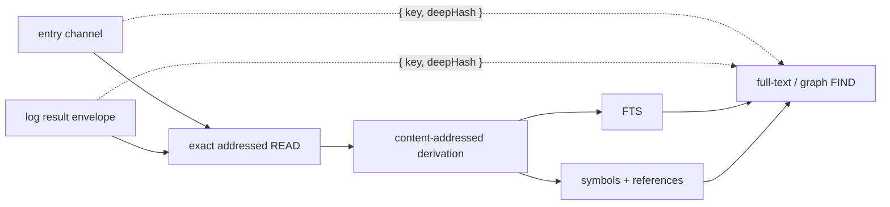

§derivation-exhaustive Identical projections attach the same immutable artifact regardless of their source table. Search primitives therefore consume only `{key, deepHash}` candidates and cannot depend on entry or log storage. Full-text and graph FIND require every selected channel candidate—and every channel in graph's relationship universe—to be attached. An incomplete set returns 503 with `problem.search = {state:"incomplete", indexed, total}`; it never silently searches a partial corpus. Explicit membership changes may warm eagerly; every model turn joins exhaustive derivation before dispatch. Passive workspace creation and attachment do not launch it. The incomplete response is therefore an interface invariant and diagnostic, not a lazy-search mode.

The graph projection stores only addressable symbol names. A structured-data handler may legitimately emit an empty key into its symbols channel, but the `&graph` matcher cannot name an empty symbol; that one definition is omitted from graph storage without suppressing FTS or the remaining definitions. Invalid references and other persistence violations still fail the resource derivation explicitly.

Workspace warms coalesce; a request arriving during a pass forces one final
rescan. Progress exposes `preparing`, `indexing`, `complete`, or `failed` through
`search_progress` Notices. Producer concurrency and heartbeat interval are
operator knobs in `.env.defaults`. Search indexing performs no inference.

---

## §channels Channel Topology

§channels-entry-name-key Every entry has named channels: **content stores keyed by `(entry_id, name)`**, one row per name. Schemes write content — appending to a channel, replacing it, or deleting it; mimetype handlers interpret it.

### §per-entry-channels Per-entry channels

§per-entry-channels-edit-writes-only-body EDIT writes one channel per call — the channel resolved from the path's fragment (or the scheme's `defaultChannel` when no fragment).

No stored `preview` channel — channel content is pulled on READ, never previewed.

Schemes MAY declare multiple channels (`node`: stdout/stderr; `http`: body/header; SSE: per-event-type). Each goes in `manifest.channels` with mimetype pinned; rendered independently. Execution input is control under {§exec-input}, not a stored channel.

For a multi-channel streaming READ, persistence and publication are distinct: the scheme may acquire and persist auxiliary channels, but a fragmentless target publishes only the manifest's `defaultChannel`. An explicit fragment publishes that channel. Thus an ordinary HTTP READ presents the sanitized `body`; response metadata and archival DOM remain addressable implementation/diagnostic surfaces rather than ambient model context.

A published default channel renders under the entry's ordinary fragmentless address. The channel name remains internal bookkeeping, just as it is for synchronous entry READs. Only explicitly selected non-default channels render a fragment.

### §no-visibility Entries carry no visibility

Every entry is uniformly listed in the catalog (```` ```FIND (scheme:///**) ````, {§packet}) and READable — entries have no per-worker visible/body-suppressed state. Context curation is the model's, on the **log** (via KILL, {§log-kill-scope}), never on entries.

### §channel-mimetype Mimetype is a (scheme, channel) property — never a default

Mimetype is declared by scheme manifest ({§scheme-manifest}) or supplied per-call for dynamic schemes. Writing a channel without a declared mimetype throws. No default mimetype anywhere.

- §channel-mimetype-cross-mimetype-415 COPY/MOVE compatibility follows {§mimetype-verbatim-transfer}; incompatible pairs return 415. Transfers preserve content verbatim and retain the destination's declared type, resolving it through {§ext-mimetype} only for an absent channel ({§copy}).

### §channel-selection Channel selection in the DSL

DSL targets a specific channel via the URL fragment (`#name`).

Rules:

1. §channel-selection-fragmentless-targets-default-channel Fragment-less paths target the scheme's `defaultChannel`.
2. §channel-selection-fragment-selects-named-channel Paths with a fragment target the named channel.
3. §channel-selection-missing READ, FIND, EDIT, COPY, and MOVE report unknown channel selections as `404 channel-not-found`. READ and transfer source selection also report 404 when a declared channel is absent on the entry; this does not prohibit creating a permitted destination channel. These Problems name `requestedChannel` and `availableChannels`: existing exposed channels when a representation was read, otherwise the scheme's declared names, including its default. A channel miss is a discovery miss under {§engine-rails}, not malformed syntax. Object prototype properties are not channels. The error never invents another intended resource or claims the containing entry is absent.
4. Schemes without `defaultChannel` reject fragment-less EDIT/READ.
   - §log-channel-miss-names-stream A channel READ on a log execution item is such a miss, and the receipt resolves it: the item's recorded stream link (`attrs.stream`, `<runtime>:///<claim>` per {§execution-output-identity}) rides as representation data, so the 404 names `<stream>#<channel>` in its detail and `recovery` and carries it as `stream`. The log item's coordinate and the stream's claim address name the same execution, which is exactly why the model conflates them (#502).
5. §channel-selection-fragment-on-nonexistent-404 Non-default channel EDIT requires entry to exist (404 if absent); default-channel EDIT creates.
| URI                                  | Channel                              |
| ------------------------------------ | ------------------------------------ |
| `worker:///france/capital`           | body (default)                       |
| `sh:///a3b7c921#stdout`            | stdout                               |
| `sh:///a3b7c921#stderr`            | stderr                               |
| `https://feed.example/y#body`        | body                                 |
| `log:///1/2/3/READ`                  | (no channel concept; atomic log row) |

Op implications:

- EDIT to undeclared channel → 404; read-only channel → 405.
- COPY/MOVE source and destination fragments independently select channels.

Client-interface target parameters carry fragments inline (`{ target: "sh:///a3b7c921#stderr" }`).

**Wire rendering: default channel is path-only.** A rendered target omits `#channel` when channel matches `defaultChannel`. Single-channel entries render path-only; multi-channel entries render the default path-only and only non-default carries `#name`.

- §readable-channel **A readable projection is a channel, never a hidden matching surface.**
  When an entry's source channel lands — an EDIT that creates or changes it, a COPY or MOVE
  landing, a member materialized from disk — and its mimetype handler owns a readable
  projection that differs from the source ({§mimetype-content}), that projection lands beside
  it as the `readable` channel, `text/markdown`, in its own line coordinates; a source without
  a projection keeps no sibling, and a source channel's deletion takes the sibling with it. A
  scheme that supplies `readable` in its own write owns it — a fetched page's curated Markdown
  arrives with its producer outcome ({§html-materialization} in the http scheme) — and core
  derives the sibling only for a write that supplies none.
  Worker and file entries declare `readable`. Every operation addresses the channel it names
  and matches in that channel's own text ({§mimetype-content-query}): a regex or glob on
  `page.html` sees the markup and reports the markup's lines, on `page.html#readable` it sees
  the Markdown and reports the Markdown's lines; FIND lists both channels per path
  ({§channel-selection-visibility}) and full-text search indexes each. The projection is
  derived, so no operation writes it: EDIT of `#readable`, a COPY or MOVE landing on it, and a
  MOVE out of it are 400 `channel-derived`; COPY from it is an ordinary read. Binary sources
  keep {§membership-source-projection}, where the source is not text and the projection is the
  body; a fetched web page keeps its scheme's own two channels ({§html-materialization}).
- §channel-selection-visibility **Channel selection is decision-time information, not a guess** — every multi-channel resource presents its channels with extents wherever FIND presents the resource: broad results list each channel's path, projection `mimetype`, tokens, and lines (default channel first), and matcher locations name the channel their line coordinates address. A READ of a multi-channel resource names its other channels with their tokens in `channels`, keyed by the fragment the model appends (`{"#readable": 812}`), so first contact — a fetched page, a stream's stdout — carries the same choice without a listing; a single-channel resource names none. When the default channel is a readable projection of a differently typed source, it also names `sourceMimetype` once; this is representation evidence, not a different READ workflow. The packet never presents channels as equal and indistinguishable; extents derive from the stored channels by construction. Budget enforcement stays with {§context-output-admission} — this is information, not a second guard.

### §channel-state Channel state — metadata, not gating

§channel-state-state-is-metadata Each channel has `state ∈ {static, active, closed, errored}`. Metadata only, not an engine gate.

- `static` — content final, not being written. Entry schemes after EDIT.
- `active` — scheme is writing (chunks arriving). Streaming schemes during accumulation.
- `closed` — stream ended cleanly. Content final.
- `errored` — stream ended with a failure status, including cancellation. Content may be partial; reads return what accumulated.

§channel-state-schemes-own-state-transitions Schemes own transitions; UPDATE `entry_channels.state` as connection lifecycle progresses. State does not gate reads — schemes return accumulated `content` regardless ({§channel-state-state-is-metadata}).

Model uses state to anticipate growth between turns. Clients use state for UI (spinner / red border / etc.).

---

## Op Surface

Per-op semantics. AST shapes come from `@plurnk/plurnk-contracts`'s `PlurnkStatement`. Engine dispatches by `op`; scheme implements per author contract ({§scheme}).

### §line-anchors Text line anchors

A scheme declaring `lineAnchors: true`, or `textEditScopes: true` with model
write authority for the addressed resource, publishes the contracts-owned
{§text-line-anchor-syntax}. `lineAnchors` alone makes no EDIT claim.

§line-anchor-write-authority READ publication and mutation share
{§entry-address-resolution}: implied EDIT anchors require the scheme's model
write grant and successful model `write` resolution of that resource. Generated
references, worker-actor deliverables, named-worker read-only addresses, and read-only file members remain
numerically addressable without advertising EDIT anchors. This decision is
independent of the READ producer: initialization cannot advertise its own
harness-only write authority to the model. An authorization refusal suppresses
anchors, not readable content; an internal failure is not a read-only verdict.
Resource authority does not decide whether an absent target may be created or
deleted; those operation-specific preconditions retain their own errors.
Proposals, content/type validation, and concurrent-write checks still govern
actual mutation. EDIT authorizes the addressed resource before validating its
coordinates and derives its internal anchors from canonical content and identity,
not from whether a model-facing READ publishes them. Explicit log anchors remain
available for curation without granting source EDIT.

For canonical model-facing
resource identity `R`, configured non-negative neighbor count `C`, ordered
content array `W` containing that line and up to `C` complete lines on either
side (all excluding separators), and the line's offset `O` within `W`
(`min(L-1, C)` for one-based ordinal `L`), core hashes the JSON tuple
`["plurnk-line-anchor-v2",R,C,O,W]` with SHA-256, interprets the digest as a
big-endian integer modulo `62^5`, and encodes five fixed-width characters with
alphabet `0-9A-Za-z`. The ordinal itself is not hashed (#428): a line keeps its
anchor wherever it moves while its content and neighborhood are unchanged, so
edits above a line — the model's own earlier edits included — never stale the
anchors below them; identical neighborhoods share one anchor and resolve as
ambiguous with the matching lines, never as a silent landing on a twin. The universal READ projector derives
anchors from the complete canonical selected channel before applying the
authored text slice; its durable result retains the canonical derivation
identity and anchors aligned with returned lines. Packet rendering right-aligns
`L` to the decimal width of the complete canonical selected channel's final
addressable line and emits `@xxxxx L:<content>` with one or more ASCII spaces
before `L`; a source line therefore retains the same prefix across projections
of one revision.
An explicit default-channel fragment and its fragmentless spelling share that
identity; a selected non-default channel retains its canonical `#channel`.

For READ/LOOK and COPY/MOVE source or destination selection, core resolves every
anchor against the addressed current complete content before applying the
ordinary numeric text-coordinate contract. Exactly one current match lowers to
its numeric line; zero or multiple matches return 409 `line-anchor-collision`,
with `retryable: false` because resolving the collision requires a new READ and
different coordinates rather than automatic replay. An anchor in a column
position returns 400 stating that four-coordinate
column slots are numeric and that `<@start,@end>` is the whole-line anchor
range. COPY/MOVE mutation owners retain
the resolved endpoint neighborhoods as compare-and-swap preconditions. There is
no revision sidecar or fuzzy relocation. A range authenticates both endpoint
neighborhoods, so every line of a range up to `2C + 2` lines is covered; a
longer range retains an unauthenticated interior gap. The shipped `C = 2`
covers ranges through six lines.

### §edit EDIT

AST: `{ op: "EDIT", target, body: string | null, signal: tags | null, lineMarker?: TextLineMarker }`.

- Selects the target channel under {§channel-selection}; undeclared channels return 404. A channel missing its required mimetype is an internal contract violation under {§channel-mimetype}.
- §edit-null-clears Writes the body; `body: null` clears it.
- §edit-status-201-200 Returns `{ status: 201, entryId }` for a new entry and
  `{ status: 200, entryId }` for a content update.
- §edit-noop-304 A write that changes nothing — identical content — returns `{ status: 304, entryId }`, mirroring a scoped KILL's idempotence ({§log-kill-scope}). Its terse detail states the observed equality and the valid empty-body deletion shape; it never presumes that repetition or retrieval is the intended recovery.
- §edit-marker-required-on-existing **A markerless EDIT is CREATE-ONLY — there is no easy-clobber path on an existing entry.** A `<L>` marker scopes an EDIT to a range; without one, the body becomes the entry's WHOLE content — legitimate and required for a fresh entry (nothing exists to scope into), but on an EXISTING entry a missing marker is refused **400**, never a silent full replace. A deliberate full rewrite states that intent explicitly: `<1,-1>` resolves through the ordinary marker math to the same whole-content replacement, so the capability is available but cannot be selected by omission.
- §edit-line-anchors An anchored EDIT resolves under {§line-anchors} and carries
  its endpoint checks as a core-private mutation precondition. Otherwise-valid
  zero/multiple matches and later precondition misses share {§edit-collision};
  malformed positions and schemes without textual EDIT scopes return 400 before
  handler invocation, while an upstream current-read failure preserves its
  status. The model-facing teaching recommends anchors for EDIT because this
  rejection is deliberate stale-target protection; parser support for anchors
  on observations does not imply the same recommendation.
- §edit-collision Every standard entry EDIT lands by compare-and-swap against
  the exact channel content used to calculate it, including numeric-only EDITs.
  A concurrent creator that wins the resource identity or channel, an anchor
  that does not identify exactly one current line, a selected endpoint neighborhood
  that changes before mutation, or a representation that changes in the final
  check/write gap returns the same neutral **409 `edit-collision`** and preserves
  the current content. Its public detail says only that EDIT collided with
  the current resource state and directs the model to READ before selecting current
  coordinates; `retryable: false` forbids automatic replay of the identical
  request. It does not infer earlier validity, assign fault, or reveal which detection layer won.
  Concurrent correct workers are an ordinary cause. Core resolves anchors,
  scheme handlers receive only numeric
  coordinates, the shared entry mutation owner rechecks selected endpoint
  neighborhoods against its exact snapshot, and atomic identity/channel claims
  and storage predicates close the remaining races.
- §edit-pattern **A pattern replaces every selected span with the literal body.**
  ```` ```EDIT (path) [{"pattern": "/foo/"}] ```` reads the resource once under
  the channel's own mimetype, matches, and expands into one atomic batch
  ({§edit-batch}) of four-coordinate splices, all relative to the same original
  content: a regex span is its evidence region; a literal (a glob without
  metacharacters) is each of its occurrences on every matched line; a glob with
  metacharacters is the whole matched line; a node dialect's span (`//` xpath,
  `$` jsonpath) is the node's whole region as its handler reports it, across as
  many lines as the node spans, so ```` ```EDIT (books.xml) [{"pattern":
  "//book[price > 35]"}] ```` replaces each such element and an empty body
  removes it. The body is literal replacement text, never a template; an absent
  body deletes the spans and leaves their lines. A regex anchors each line (`^`,
  `$`) and a regex span never crosses a line break — a match that would is
  refused before any change (400 `pattern-span-invalid`). A numeric scope bounds the lines
  a pattern may touch; `<0>` and `<-1>` name positions, not lines, and are refused
  (400 `pattern-scope-invalid`). Every touched line's anchor guards the batch as a
  precondition, so a same-turn change to one of them is the ordinary
  {§edit-collision}. Zero matches change nothing: 204 with `matched: 0`, never a
  clobber. The result is one operation receipt: `matched` spans, `receipt` for the
  first splice ({§edit-result-receipt-projection}), and `last` beside it for the
  final one when there were several. Resource-selecting dialects (`~`, `&`)
  name no spans: 400 `pattern-dialect-unsupported`. A scheme without textual EDIT scopes refuses the
  pattern before any read (400 `pattern-unsupported`). Same-turn anchor continuity
  ({§edit-anchor-continuity}) does not carry through a pattern batch; the next
  anchored EDIT validates against current state.

A `file:///` member EDIT diverges from this immediate-write contract: it diffs against the entry snapshot (the body channel, never a fresh disk read) and **proposes** (202) a disk write that lands via a compare-and-swap on accept. See {§membership-edit-write-cas} and the proposal lifecycle {§proposal}. The marker-required rule above applies identically here — an existing file is never markerlessly replaced.

### §read READ

AST: `{ op: "READ", target, body: null, signal: tags | null, lineMarker? }`.

A READ is never rewritten into a FIND ({§read-find-normalization}); a path-glob
READ is the one fan-out core performs ({§read-fan-out}).

- §read-read-content Returns channel content and mimetype.
- §read-read-404 Returns 404 when the channel is absent.
- §read-content-wins A channel that delivered content reads as that content (200); the
  producer's failure projects onto the READ only when there is nothing to read, so a
  failed command's stdout and stderr stay readable.
- §read-selection-projection READ applies `lineMarker` as text coordinates to one
  exact target under {§read-exact-target}. Markerless READ synthesizes
  the shared bounded preview ({§body-projection}); `<1,-1>` explicitly selects all text. Successful positional reads
  carry the compact requested/returned extent and available total
  ({§range-extent}). Anchors resolve under {§line-anchors} before selection. An
  invalid text region is 416. A positional slice reads as the text primitive;
  when that differs from the channel's own mimetype the result names the
  channel's as `sourceMimetype`, so a consumer can still run the channel's
  handlers over a whole-resource `<1,-1>` read.
- §log-range-miss-names-stream A 416 on a log execution item is the range twin of its channel miss ({§log-channel-miss-names-stream}): the coordinate addresses the row's invocation (its authored call body, often empty or one line) while the execution's output stays readable at the stream address the row records. When that stream link exists, the 416 gains it as `stream`, the detail appends where the command's streams live, and `recovery` is `READ <stream> for the command's stream`, whether the invocation's extent is empty or merely shorter than the range (#759). A 416 on a row with no recorded stream stays byte-identical to the generic slicer's.
- §read-pattern **A pattern selects the lines a READ renders.** With a heading
  matcher ({§matcher-option} in the contracts SPEC) an exact-target READ stays a
  READ: the matcher runs over the channel's text line by line — a regex anchors
  each line, so `^` and `$` are the line's ends — and every line a match touches,
  in source order, is the visible selection. The scope still bounds it: a scoped
  READ renders exactly the selected lines the scope holds; a whole-resource one
  pages through the selected lines under the ordinary preview bound, never showing
  an unselected line. Selected lines keep their physical ordinals and their
  ordinary anchors, so a pattern READ is a coordinate source for EDIT and KILL. The
  result carries `matched`, the count of selected lines inside the scope. Zero
  matches is an empty read (204, `matched: 0`), never a failure. A full-text
  (`~`) or graph (`&`) pattern selects resources, not lines: 400
  `pattern-dialect-unsupported`; a matcher its mimetype cannot run answers the
  matcher's own 415/400 ({§matcher-dispatch}).
- §read-fan-out **A READ over a glob reads every matching path.** `READ (pets_*.md)`
  and `READ (pets_*.md) /dogs/i` keep their glob ({§read-find-normalization} in the
  contracts SPEC) and dispatch fans them out: the ordinary FIND over the same
  target and metadata — the matcher FIND when there is a matcher, the catalog
  survey otherwise — enumerates the paths without a receipt of its own, and each
  path on its resource page is read as an ordinary exact READ with the authored
  scope, matcher and aside ({§read-selection-projection}, {§read-pattern}), one
  receipt row per path in the FIND's order, so every rendered line keeps its path,
  physical ordinal and anchor and remains a coordinate source for EDIT and KILL.
  Each such row carries `attrs.fanout` (`target`, the authored glob; `matched`, the
  survey's matching path count; `index`; `count`), so a client presents the authored
  statement once and folds the paths beneath it without inferring the group.
  Without a scope each path renders its ordinary `<1,16>` preview; with a pattern
  only the matching lines, `grep -n` style. The authored statement contributes
  `rowsWritten`, the receipt count, to its turn's sequence. No path is one 204
  receipt on the authored glob (`matched: 0` when a pattern selected nothing); a
  FIND failure is that failure on the authored glob. The FIND's resource page bounds
  the fan-out: when more paths matched than were read, one `read_fanout_bounded`
  notice names both counts. A full-text (`~`) or graph (`&`) matcher selects
  resources, not lines, so that READ dispatches as the FIND survey. Operator,
  2026-09-13: "give it what it asked for" — a model that asked to read the pantry
  looped five turns on the catalog it was handed instead.
- §read-bytes A binary channel, and the `#bytes` view of
  any resource whose scheme supplies bytes, reads as the source bytes one hexadecimal
  octet per line: coordinate = line = byte, so `<a,b>` selects bytes, the markerless
  default is the shared first page ({§markerless-first-page}), `<1,-1>` is the whole resource, and the extent carries
  `unit: "byte"`. The result keeps the source mimetype and names `projection: "hex"`;
  anchors do not exist there (400). Bytes are read from the source at READ time, sized
  then windowed: `file:` supplies them from the member on disk, DB-backed schemes
  recover their stored bytes under {§binary-parity}, and a
  scheme that keeps no bytes answers 501 `bytes-unavailable` for `#bytes` and 415 for a
  binary channel, as before. An execution whose target is a file member already runs the
  bytes on disk. Byte selection affects only this hexadecimal projection: when the
  resource also qualifies for a native attachment, a successful ranged byte READ carries
  the complete source attachment independently under {§packet-attachment-parts}.
- §find-bytes A FIND over a binary channel without a readable projection matches the
  source bytes one character each (Latin-1): a text pattern finds strings, `\xNN`
  escapes find byte sequences, and every hit is reported in byte coordinates that paste
  into a byte READ (`region` spans the hexadecimal lines of the matched bytes; `matched`
  is their hex). The load is bounded by the mimetypes binary input ceiling; a larger
  resource fails 413 `bytes-too-large` by name rather than being skipped.
- §binary-parity A binary member is not a second-class resource. It behaves exactly as a text
  member does for existence, FIND by path, KILL/delete, mimetype, weight, and membership; it
  READs whole as its byte projection ({§read-bytes}) and, on a supporting route, contributes native
  content to the next model request ({§packet-attachment-parts}),
  READs and FINDs by byte range and byte pattern ({§read-bytes}/{§find-bytes}); and COPY or MOVE transfers
  its bytes exactly, between file members and into or out of a DB-backed `worker://` entry alike. A
  whole-resource transfer writes the source's bytes ({§read-bytes} `ByteSource`) verbatim to the
  destination through the ordinary proposal gate, the receipt reporting the byte count rather than a text
  line diff; "whole-resource" is the markerless selection or `<1,-1>` ({§move-canonical-whole-source}),
  and a MOVE deletes the source after the destination lands. A **byte range** `<a,b>` transfers exactly
  those source bytes (coordinate = byte, 1-indexed inclusive). A transfer **into** a destination byte
  range is a splice: `<c,d>` replaces exactly the destination bytes c..d with the source bytes and a
  single position `<c>` inserts the source bytes before byte c (`<-1>` appends); every byte outside the
  window is preserved, and the whole spliced result is re-written through the proposal gate. A binary
  **lives in a DB entry** as its bytes base64 in the channel's TEXT content; the same READ, byte range,
  and COPY/MOVE recover them through a byte source synthesized from that content, so a File member and a
  `worker://` entry hold and yield a binary identically. An empty binary channel represents
  zero bytes, not an unsupported format; whole COPY/MOVE preserves it. Failed acquisition
  is not an empty success: its producer outcome remains authoritative for READ and transfer.
  This supersedes the older blanket refusal (#140)
  for both the file and the entry case. Native image/PDF/audio attachment facts come from the configured
  mimetype handler over original bytes, whether supplied by a file or stored channel
  ({§packet-attachment-parts}); the hexadecimal view remains available. The exceptions are narrow and
  defined, each a clear receipt rather than a dead end: a binary region addressed by a **textual anchor**
  rather than a numeric byte coordinate has no meaning (416 — bytes are not lines), **authoring** binary
  content from a text EDIT body is impossible (a text emission cannot type bytes), and a scheme that keeps
  no bytes for a binary channel — no disk file, no stored content — has nothing to transfer and says so
  (415). None is the entry-storage dead end the older text named; that cell is filled.

### §log-history-projection Durable history and active projection

| Layer | Owner | Curation contract |
|---|---|---|
| Durable event | `log_entries` | One chronological execution fact. Ordinary Plurnk operations never erase it; its original body and initial visibility remain available to the client journal, digest, and fork forensics. Containing turn, worker, or workspace teardown may cascade the history. |
| Active projection | `log_entry_projections` | One current worker-facing visibility state per immutable event. A scoped KILL changes body visibility while active. Log-KILL atomically changes active to inactive and cannot be reversed; inactive rows are absent from packet rendering, log READ/FIND, failure pointers, full-text discovery, token accounting, and later curation. |

The successful curation operation and every exact target transition are durable
in the same commit. KILL against another scheme retains that scheme's ordinary
resource or process semantics; this projection contract is specific to
`log:///`.

§log-curation-direct **A direct curation is one statement.** A core-scheme KILL that carries no
operation row (`Log.kill`, reached outside the model's dispatch) lands its whole projection plan
through `log_apply_projection_plan`: one UPDATE over the plan's targets whose precondition count —
every target still at its `active`/`folded` before-state — is evaluated once before any row
changes, so one stale target withholds the entire plan and the caller reports the collision. The
same transitions the dispatcher's atomic curation event makes, without the row.

### §reasoning-history Read-only reasoning history

| Surface | Contract |
|---|---|
| Evidence | Original provider reasoning remains verbatim in immutable model-call responses and admitted packets. Resource and log operations never rewrite it. Only an admitted response, or the final exhausted emission attempt, produces a model reasoning source; missing provider reasoning creates no substitute. A non-model producer may record its own authored rationale under {§turn-source-resources}. |
| Resource | `reasoning://<worker>/<loop>/<turn>` is immutable text/plain source belonging to the named workspace worker's turn under {§turn-source-resources}. Every workspace actor may READ, FIND, search and COPY from it; none may EDIT, KILL, COPY into or MOVE it. |
| Delivery | Initialization READs its own authored rationale under {§reasoning-initial-read}. Further observations require deliberate READs. The selected model reasoning source is stored before its OPs execute, so an ordinary READ of the current turn resolves immediately and is visible in subsequent packets. Every READ retains its authored scope and ordinary range metadata, without edit anchors. |
| Curation | Scoped log KILL suppresses receipt lines; whole log KILL retires the receipt. Neither affects the source. Explicit log READs retain ordinary curation anchors. A mutable working copy requires ordinary COPY into an editable resource. |
| Lifecycle | Restart retains sources and observations. FORK snapshots sources under the child's name at the same loop/turn coordinates and receipts with independent curation. No curation or lifecycle event automatically READs model reasoning. A turn the provider left without reasoning reads empty; absent workers and turns return the ordinary missing result ({§turn-source-resources}). |
| Client | Standard live reasoning events and replay retain original provider reasoning; working resources and READ receipts never substitute for or replay that stream. |

### §reasoning-initial-read Initial reasoning observation

The initialization turn records a short `_plurnk`-authored rationale containing
a fenced NOTE. The shared reasoning extractor ({§reasoning-notes}) executes that
NOTE through ordinary dispatch, creating its log item and immutable source.
The program begins with its own NOTE and READs its reasoning and persisted ops,
demonstrating both NOTE placements and their ordinary results. The initial message arrives separately as an
inbound SEND ({§message-arrival}). Neither initialization nor later turns
manufacture a task inventory.
`PLURNK_REASONING_VIEW_LINES` (default `-1`, alias-scoped) selects this one READ's
scope: `0` omits it, `-1` reads the complete rationale, and a positive integer
bounds it to the first N lines. Source retention, deliberate READs, and client
streaming are independent. No later turn automatically requests reasoning.

### §log-kill-scope KILL on the log: whole items and scoped bodies

AST: `{ op: "KILL", target, matcher: MatcherBody | null, lineMarker: TextLineMarker | null, body: null }` ({§kill-scope} and {§matcher-option} in the contracts SPEC own the grammar).

KILL deletes context from the **log** (`log:///`, {§packet}). Without a scope it retires the selected rows from the active projection ({§log-history-projection}). With a one-line or inclusive two-line scope it removes only that body's intersecting body-relative physical lines from the readable projection, and the row stays active. An anchor may be one published on that body or one returned by READing its `log:///` coordinate ({§line-anchors}); an anchor absent from the current body selects no line, as with an out-of-bounds numeric line. Scoped KILL is one-way: intervals accumulate, the durable body is untouched, and subsequent access follows {§log-readable-projection}. A scoped KILL on a bodyless row is a friendly 200 no-op with `matched` reported. A KILL that addresses no row is 404 on an exact coordinate and 204 on a sweep ({§log-curation-folder-idiom}). Selection composes target/glob with an optional heading pattern ({§log-curation-set-selection}). Parameterless KILL instead requests completion ({§kill-conclusion}).

A READ carrying active native media is atomic: any KILL scope is ignored and the entire observation is retired, including its native context contribution ({§packet-attachment-parts}). For a model turn, native activity is the attachment selection in its actual input packet; without a model packet, a native observation is atomic by default. Text-only observations in the same selection retain ordinary scoped behavior. Neither form deletes source data or forensic evidence.

§log-readable-projection Log content has two independent projections:

| Fact | Owner | Effect |
| --- | --- | --- |
| Initial body suppression | Immutable event `initial_folded` | Packet presentation only; explicit retrieval can read an initially hidden body. |
| Deliberate scoped KILL | Current projection `folded`, initially empty | Packet, READ, FIND, COPY, and search omit those lines; later retrieval cannot undo trimming. |

Packet display combines both masks. Other consumers use only deliberate trimming.
`logTokens` prices the materialized observation, never absent body content.
Coordinates and anchors retain the original body's physical lines; selection occurs
before omitted lines are removed, and sparse receipts retain their original line
ordinals. Automatic previews remain retrieval bounds, not deletions. COPY can read
an active log source under ordinary read authority, without minting log history;
destinations and MOVE sources still require independently writable entry storage.
Trimming invalidates derived search attachments; an in-flight derivation attaches
only if its source projection is still current. Forks copy both projection facts;
forensics always retain the complete immutable body and curation history.
FIND row and folder weights price that same retained content. A byte-view READ's
log body is its hexadecimal text, not another binary source: retrieval, copying,
and indexing use `text/plain` while its immutable receipt retains the source MIME
type and projection facts under {§read-bytes}.

### §log-wire-format The Log's wire format

The `## Log` section is a sequence of ordinary Markdown records separated by one blank line:

```text
### log:///<loop>/<turn>/<item>/<leaf>
{"oneLine":"strict JSON metadata"}
<coordinate-prefixed body lines when visible>
```

The H3 is the row's complete model-facing identity and canonical READ address; metadata never repeats that identity or its operation. The following line is one strict JSON object: addressed operands ({§log-address-metadata}) precede `aside`, then all remaining members use stable alphabetical order. Absent fields are not invented. Every physical body line retains its canonical numeric `N:` or anchored `@hash N:` coordinate, so source text cannot create a record boundary. The section contains records only, with no leading prose or enclosing fence.

§log-address-metadata **Addresses name their relationship, not the row's producer.**

| Metadata | Meaning | Order |
|---|---|---|
| `path` | The operation's addressed operand, matching `OP (path)`: read resource, mutation subject, message recipient, or executor operand. Explicit and automatic READs use the same field. Pathless operations omit it. | First |
| `from`, `to` | COPY/MOVE's two operand selections, each retaining its optional scope; neither replaces actor attribution or is repeated as `path`. | First, in that order |
| `stream` | An executor invocation's separately created output address, never a READ's alternative spelling of `path`. | Remaining facts |
| `resource` | A distinct returned resource under {§operation-resource-receipt}. | Remaining facts |

Nested mutation effects and delivered attachments name their resource with `path`.
These packet spellings do not rename the submitted AST, durable operation results,
or client protocol fields. Invocation correlation remains on the subscription and
its publication identity; an automatic stream READ does not copy the invocation's
log address into its `source`. Actual actor/subsystem attribution remains governed
by {§env-delta-attribution}.

Coordinate-prefixed lines are the text currently in context; a metadata-only row contributes no text body. Selection, preview, and curation metadata follow {§packet-extent-metadata}; coordinate gaps expose omissions without renumbering.

§packet-extent-metadata **One scope notation, distinct coordinate owners.**

| Field | Coordinate owner | Representation |
|---|---|---|
| `range` | The resource addressed by a successful READ/FIND | `<first,last> of N lines/resources/match locations/bytes`; singleton scopes use `<first>`. A complete dense selection reduces to `N units`; an empty selection from a nonempty extent is `none of N units`. |
| `range` for exact text | The addressed text resource | `<startLine,startColumn,endLine,endColumn>`; no invented available extent. |
| `preview` | The retained receipt body | Only when displayed incompletely: selected scope(s) `of N lines`, or exact selected region `of` complete region for an in-line cut. Replaces the body's otherwise redundant `lines` count. |
| `trimmed` | The receipt's original physical body lines | Array of deliberately removed `<scope>`s on a partially visible row; initial suppression is not curation. |
| `effect` | The mutation's source and landed revisions | Resolved `<source> -> <result>`; counts and complete-resource extent remain separate facts. |

Scopes use the existing inclusive line/item/byte coordinates or start-inclusive,
end-exclusive Unicode-code-point text regions ({§text-scope-semantics}). Sparse
retrieval ranges are enclosing spans; body ordinals and matcher counts retain
the gaps, and a sparse span covering both endpoints is not abbreviated as a
complete acquisition. Sparse previews list their selected contiguous runs.
Retrieval `range` records acquisition, not subsequent visibility: KILL changes
the log projection, never the original source selection. A READ's source line
numbers and its receipt's body-relative curation coordinates remain distinct
({§log-kill-scope}). Byte ranges describe the hex selection, not native-media
cropping ({§packet-attachment-parts}).

Successful retrieval metadata omits requested coordinates; durable results and
submitted programs retain them. Failed selections keep requested coordinates
and available extent in their owning Problem. Projection never parses its
display strings to recover typed facts. A hidden body has no `preview`; a
complete non-retrieval body retains `lines` where no other field supplies its
navigable extent. None of these spellings changes acquisition, delivery,
curation, admission, or immutable evidence.

Field absence carries defaults: `origin` is omitted for the owning model, `source` for the owning worker, and `status` for a routine 200. Dispositions always carry their lifecycle status, SEND its delivery status, KILL keeps an explicit 200, and every non-200 stays explicit. A present authored aside appears as `aside`. Every row's accounting follows {§packet-token-accounting}.

- §operation-resource-receipt A result's nonempty `resource` address remains visible in receipt metadata when distinct from its `path` and `stream`. It identifies returned material without replacing the addressed operand or injecting that material into context; ordinary READ acquires it.
- §packet-attachment-parts A successful READ of an attachable resource carries projection facts with its
  result ({§mimetype-projection-facts}): an image ({§mimetype-image}) as
  `image: { mimetype, width, height, bytes }`, a PDF ({§mimetype-pdf-facts}) as
  `document: { mimetype, pages, bytes }` (`pages` null when the page tree is unreadable; the
  attachment then weighs by bytes and carries no page count), or audio ({§mimetype-audio-facts}) as
  `audio: { mimetype, duration, bytes }` (`duration` in seconds, null when unknown). READ snapshots complete source bytes through
  the scheme's byte supplier or ordinary stored binary channel ({§binary-parity}), checking
  {§mimetype-binary-input} before loading the native snapshot; the text/hex projection
  and native observation use those same bytes. Immutable content-addressed `native_contents` stores each
  byte sequence once; the result's `nativeContentHash`, enforced by the log's foreign key, identifies it.
  This is retained evidence, not a separate visibility or delivery lifecycle. Source mutation/deletion
  cannot change a retained observation. Explicit READ of its still-active log source can acquire the same media again.
  Every compatible-model packet includes one file part per retained, admitted READ observation, after the
  packet text, in observation order. Model-response settlement never consumes an observation. KILL follows
  {§log-kill-scope}; forks inherit the snapshot and ordinary projection state independently. Output withholding
  suppresses the complete native part under {§context-output-admission}. Unsupported routes receive only the
  text projection and no native charge; switching back to a compatible route exposes still-retained media.
  Each included part contributes `tokensAttachment` within `logTokens`: `ceil(width × height / 750)` for an
  image, `pages × 1500` for a document, `ceil(duration × 32)` for audio, or `ceil(bytes / 4)` when page count
  or duration is unknown. Byte ranges select
  hexadecimal text, never crop the native resource. Retries reuse the frozen request; model-call evidence
  records the exact READ coordinates sent without controlling retention. Missing immutable bytes are an
  internal integrity failure, never silently dropped content. No ejection message or permanent teaching is
  added. These stable curation weights are not provider-token measurements ({§tokenomics-render-weight-budget}).
- §packet-token-accounting Every row reports one `logTokens` charge: its complete materialized H3, metadata, visible body, and selected native attachment. The completed record is measured to a fixed point, including the accounting field itself. No `tokensBody`, `tokensMetadata`, or `tokensActive` field is serialized. Hidden text is not charged; metadata-only rows still have a reclaimable charge. Source/FIND-item `tokens` measure source content, not the observation's context footprint. A FIND's nonzero `itemsTokenTotal` weighs the complete matched set; a nonzero `returnedItemsTokenTotal` appears only when the returned page differs. All use stable curation weights, not provider tokens or dollars. Native component accounting follows {§packet-attachment-parts}; ordinary addressability and truthful errors follow {§log-wire-format}.

### §retrieval-packet-metadata READ/FIND packet metadata

The packet projects one actionable owner for each retrieval fact:

| Result mode | Extent | Result-body evidence | Additional aggregate fact |
|---|---|---|---|
| line READ | `range` in line scopes | none | none |
| exact-coordinate READ | `range` in exact text coordinates | none | none |
| READ-shaped materialization notice | none | none | generic body `lines` |
| catalog/path FIND | `range` in resources | none | none |
| broad matcher FIND | `range` in resources | per-resource match-location counts; a resource with exactly one match also carries that match's `locator`/`region` | nonzero complete `matchLocationCount` |
| exact matcher FIND | `range` in match locations | each row's locator/region; a regex or glob row also carries `matched`, the matched text | none |
| pattern READ ({§read-pattern}) | `range` over the physical lines | the selected lines with their ordinals and anchors | `matcher` and `matched`, the selected line count |

Any row whose statement carried a heading pattern ({§matcher-option}) names it as
`matcher`, and a pattern mutation ({§edit-pattern}, {§kill-pattern},
{§copy-move-pattern}) carries its `matched` count beside its receipt, so a
digest can show what a pattern selected and how much it touched.

The packet formats the typed {§range-extent} and {§text-region} facts under
{§packet-extent-metadata}; the operation result retains its structured facts.
An empty result
set satisfies any well-formed page: zero matches is the answer, a 200 with no items,
never a 416 (#425 F9). Transparent
coordinates let the model determine whether more material exists and choose
its own next request, so packet metadata never prescribes `next`, `complete`,
or `all`. FIND range cardinality replaces top-level `items`, `lines`, and
`matchingPathCount`; line READ likewise omits the rendered-body `lines` count
and its internally resolved whole-line region. Exact READ formats its region
as `range`. A failed retrieval's Problem owns its range extension rather than
repeating it at top level. `logTokens` weighs the complete rendered record
under {§packet-token-accounting};
generic body `lines` remains available on READ-shaped materialization notices
that have no retrieval extent. FIND content weights follow {§log-wire-format};
ordinary bounded bodies expose their displayed and complete extents as `preview`
under {§packet-extent-metadata}.

§read-past-end A line READ whose range starts past the end of nonempty content is
answered like an empty FIND page: with no lines and its extent (`none of N lines`), not a 416; a
single line past the end, a reversed range, empty content, a command's log row
({§log-range-miss-names-stream}) and every write keep their refusal (#759).

### §turn-ops-entry The admitted turn program

§turn-ops-log-curation A source-backed turn preserves its **exact admitted Plurnk program**, including ignored interstitial text, before dispatch. `turn_sources` records that source once, separately from the curatable log and optional provider evidence. Retention does not manufacture a log row. Ordinary READ creates a receipt governed by {§log-readable-projection}; curation of that receipt never changes the source. Initialization reads its own already-persisted source under {§worker-initialization-entry}.

### §turn-source-resources Immutable turn-source resources

| Surface | Contract |
|---|---|
| Identity | `ops://<worker>/<loop>/<turn>`, `reasoning://<worker>/<loop>/<turn>`, and `note://<worker>/<loop>/<turn>/<item>` name a worker in the current workspace and its durable coordinates. A note's item is its dispatched NOTE ordinal. The worker authority is required and case-sensitive; userinfo, ports, and queries are invalid. Source identity never depends on the reading worker. `log:///` remains local; READ, FIND and KILL reject log authorities, userinfo, ports and queries with 400, never substitute the caller's log. |
| Source | `ops` is exact admitted `text/vnd.plurnk`; `reasoning` is `text/plain` containing the selected original provider reasoning or a non-model producer's authored rationale. Producer identity comes from the owning turn; a harness rationale is not provider evidence. The turn decides existence and the source decides content: a turn that exists but has no source of that kind reads as the ordinary empty resource (204, empty body), never a fabricated one; a worker or turn that does not exist is 404. |
| Notes | Each dispatched NOTE stores its exact literal body as an immutable `text/plain` source and returns its worker-qualified address. There may be multiple notes in a turn, from reasoning, content, or another producer. A missing note is 404, not an empty invented note. Sharing its URI uses ordinary SEND; the receiver deliberately READs it. NOTE itself sends no ambient update. |
| Retention | One ops source and one reasoning source per turn; one note source per NOTE ordinal. An optional inference-call link records provenance. Source removal follows deletion of its owning turn, never log curation. |
| Operations | Ordinary scoped READ, FIND, content search and COPY from any named worker's source within the workspace. FIND accepts authority and path patterns, retaining complete worker-qualified identities in results and folder selectors. READ returns data and never executes it. Sources are read-only for every actor and have no edit hashes. |
| Index | Source text uses the existing derivation, FTS and graph machinery; only its derivation attachment is replaceable. |
| FORK | Sources copy with the inherited turns at identical loop/turn/item coordinates under the fork's own authority. Bytes and embedded source references are preserved verbatim; an explicit reference still names its original worker. Branch receipt curation is independent; neither branch can rewrite source evidence. |
| Forensics | Digest assistant artifacts read source directly, independently of receipt presence or curation. Original provider responses retain all attempts and opaque fields separately. |

§rejected-emission-entry A rejected provider response is not `turnOps`: it never became an admitted turn program. The one bounded invalid-emission recovery item under {§emission-admission} has `attrs.kind="emissionAttempt"`, `origin="model"`, the canonical model-facing `/attempt` leaf, and the exact latest rejected response. The packet does not duplicate that identity as `kind` metadata. It is born durably body-suppressed and projected visibly only in the informed recovery packet; every other rejected attempt remains forensic-only.

- §log-coordinate-hierarchy **Log coordinates are a hierarchical prefix; the trailing slash is optional** — a coordinate is `loop/turn/sequence`, and a PARTIAL coordinate selects its descendants: `log:///1` = loop 1's rows, `log:///1/2` = turn 1/2's rows, `log:///1/2/3` = the one row. A full coordinate is always three parts, so a one- or two-part path is unambiguously a prefix — the trailing slash is an optional alias (`log:///1/2` ≡ `log:///1/2/`), uniform with ```` ```READ (worker:///docs/) ````. A complete `[start-end]` segment in any numeric coordinate slot selects that inclusive decimal interval; brackets elsewhere retain ordinary path-glob meaning. Every rendered row appends one canonical model-facing leaf: the native operation name or invoked executor name, `/attempt` for a rejected emission. An executor leaf is derived from the durable submitted statement (its `runtime`), never an internal dispatch type or the current tool registry. Digits and punctuation in executor names remain part of the leaf. The leaf names identity rather than adding a resource level. Exact consumers tolerate the unsuffixed three-part shorthand; when supplied, the case-insensitive leaf is authoritative and a disagreement resolves 404. READ anchors use the canonical suffixed identity even when addressed by shorthand. Typed entry materialization therefore resolves as `/READ` while retaining its durable `EDIT` event ({§exec-entry-sink}). `log:///1/2/*` still selects the turn's item rows, while `log:///**/READ`, `log:///**/python3`, and `log:///**/attempt` deliberately filter canonical leaves. Executor outputs instead use workspace-wide claims such as `sh:///ab3d5678#stdout` ({§execution-output-identity}); their source operation has log coordinates, but resource lifetime and identity are independent of that observation. Error pointers, Problem instances, source attribution, and search use this same identity; client stream coordinates retain the numeric triple. Within a turn, sequence is arrival order. Inbound SEND rows publish before the program runs ({§message-arrival}); a turn receiving messages holds the first at `log:///L/T/1/SEND`, followed by further arrivals oldest first, then the model's operations ({§packet-current-turn} names `L/T`).
- §log-curation-folder-idiom **Log curation speaks the folder idiom; a zero-match sweep is a no-op success** — KILL takes a concrete coordinate or a path-glob, and a **trailing slash or a partial coordinate means "the contents"** ({§log-coordinate-hierarchy}), like a folder-scoped FIND: ```` ```KILL (log:///1/2) <1,-1> ```` suppresses turn 1/2's bodies. A **well-formed selection that matches nothing is 204 with `matched: 0`**; a successful sweep's rx carries `matched: N`. Parameterless KILL instead requests completion ({§kill-conclusion}).
- §log-curation-set-selection **Row selection and body scope are independent** — target/glob and an optional heading pattern (```` ```KILL (log:///**) [{"pattern": "~stale"}] ````, every dialect a FIND over rows accepts) compose by intersection into the affected row set. An optional `<L>` or `<SL,EL>` then intersects each selected canonical body; it never paginates or changes the selected set. Thus ```` ```KILL (log:///**/READ) <17,-1> ```` may change long READs and no-op on short ones while reporting every selected row in `matched`.

§log-kill-meta-operation **A log KILL changes working context, never the underlying resources or execution history.** Receipt visibility depends on the target and result, not the producer, attribution, or age of the turn:

| KILL result | Packet receipt |
|---|---|
| Successful log-item or line curation (200) | Not shown, including the first packet after the operation: the rows that are gone are the receipt. |
| A curation that matched nothing (204) | Shown once, in the packet of the very next turn, then retired like any other row. A success and a mismatch are not both silent: the model cannot otherwise tell that its earlier KILL is what emptied the selection (#779). |
| Failed log curation | Visible with its ordinary Problem. |
| Non-log target: file, worker, stream, or other resource | Ordinary scheme-owned receipt. |

This packet filter does not retire the receipt: the operation, result, authored
`turnOps`, and each target's curation effects remain durable under
{§log-history-projection}. The receipt remains explicitly READ/FIND-addressable.
Whole-item KILL retires the selected target rows; scoped KILL trims their
readable bodies under {§log-readable-projection}. An exact retired coordinate
resolves 404; a broad selection with no active matches remains the 204 no-op
of {§log-curation-folder-idiom}.

### §log-sensitive-request-evidence Durable request evidence

Ordinary operation rows store a normalized statement projection, not exact
provider evidence. This is a structural credential-slot rule, not general
secret detection.

| Surface                             | Durable rule                                                                                                                                                                                                                                    |
| ----------------------------------- | ----------------------------------------------------------------------------------------------------------------------------------------------------------------------------------------------------------------------------------------------- |
| Operation target                    | Each non-null URL username or password becomes `__redacted__`; `raw` is rebuilt from that pure projected target.                                                                                                                                |
| Scheme metadata modifier            | Every present block becomes `__redacted__` wholesale; only ordered block count and represented-slot presence survive ({§scheme-metadata-modifier}).                                                                                              |
| COPY/MOVE destination               | The nested destination target receives the identical URL-credential projection. URI component columns derive from the projected primary target, so columns and `tx` cannot disagree.                                                            |
| Query and authored body             | Preserved exactly; they are authored content and URI identity, not structurally identifiable credential slots.                                                                                                                                  |
| Parser failure                      | Preserves the structural diagnosis and source position without quoting scheme-metadata contents ({§scheme-metadata-modifier}).                                                                                                                  |
| Client, fork, packet, and digest    | Consume the stored projection; none owns a second redaction policy.                                                                                                                                                                             |
| Model-call evidence and source artifacts | `model_call_responses.response` under {§emission-admission}, `turnOps` under {§turn-ops-log-curation}, and `emissionAttempt` under {§rejected-emission-entry} remain exact forensic evidence and are the explicit exception.                                                               |

### §edit-result-render Mutation log rows render truthful effects

A mutation row keeps request and outcome separate: `tx` is the admitted
statement; `rx` is its resolved result. Only state that actually landed may
appear there as an effect.

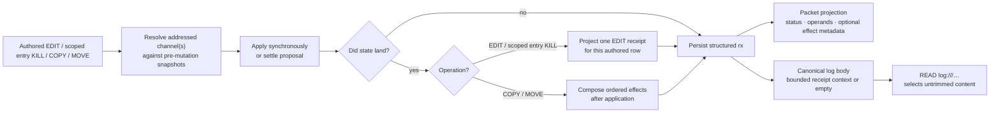

§edit-receipt-removed-text **A pure deletion's receipt quotes what it removed.** An applied effect that inserted nothing and removed at least one line carries `removedText` — the removed text, its first `PLURNK_SERVICE_EDIT_RECEIPT_REMOVED_LINES` lines — projected on the wire as `removed`; an effect that inserted anything carries no such field, its resulting context shows the change.

§edit-receipt-anchored-context **An applied EDIT's resulting context carries anchors.** The bounded resulting context each effect renders (`PLURNK_SERVICE_EDIT_RECEIPT_CONTEXT_LINES` around and inside the landed region) is rendered exactly as a READ renders — `@xxxxx L:text`, hashed with the resource's READ identity ({§line-anchors}) — so a later operation can cite the landed lines by anchor without a READ. A scheme that supplies no identity keeps the line-numbered form.

§edit-result-receipt-projection **EDIT and scoped entry KILL project the
scheme-owned batch receipt.** The scheme framework owns the exact aggregate
shape ({§scheme-edit-batch-receipt}). Each operation supplies one splice; Core
validates and projects its one applied effect or superseded disposition.
That row carries any reviewer replacement effect. Core stores only the
per-operation projection on `rx`; the aggregate remains inside dispatch.

| Durable receipt fact                   | Packet projection                                                 | Meaning                                                                                                                   |
| -------------------------------------- | ----------------------------------------------------------------- | ------------------------------------------------------------------------------------------------------------------------- |
| Full `revision`                        | not projected                                                     | SHA-256 identity of the complete landed channel body, retained for forensics. No operation takes a revision; it is neither a lookup nor a compare-and-swap token. |
| `unit`, `before`, `after`              | `extent`                                                          | Whole-line batches use line counts. A batch containing any exact four-coordinate edit uses Unicode code-point counts.     |
| `parseIssues.before`, `parseIssues.after` | `parseIssues` as `before→after`                                 | Parser-recovery counts for complete source and landed revisions; omitted when both are clean or either is unavailable.     |
| `effect.source`, `result`             | `effect` as `<source> -> <result>`                                | Resolved scopes mapping the source snapshot into the landed body; the admitted marker stays in durable `requested` and `tx`. |
| `effect.removed`, `inserted`           | `change`                                                          | Removed and inserted counts in the receipt unit. |
| `effect.removedText`                   | `removed`                                                         | {§edit-receipt-removed-text}: a pure deletion's removed text, its first `PLURNK_SERVICE_EDIT_RECEIPT_REMOVED_LINES` lines; absent when the edit inserted anything.                                                                          |
| `effect.context`                       | Canonical row body                                                | Numbered physical lines at each landed boundary, bounded symmetrically by `PLURNK_SERVICE_EDIT_RECEIPT_CONTEXT_LINES`.   |
| `disposition`, `requested`             | `disposition`, `requested`                                       | A reviewer-replaced batch preserves the authored marker while stating that its attributed effect was superseded.          |
| `replacement`                          | `replacement`, `change`, canonical proposal-owner body           | The one whole-resource effect actually applied by the reviewer replacement; never duplicated across authored rows.        |

§edit-result-receipt-truth **Receipts describe committed state.** Each EDIT
carries its own landed revision, extent, and optional `parseIssues` transition
for its complete source and landed revisions. When the proposal lands
unchanged, the row carries its source/result mapping, counts, and context;
the authored marker remains in durable evidence. For configured count `C`,
the context contains up to `C` surrounding lines and the first and last `C`
landed lines at the result boundaries. Overlapping windows coalesce; coordinate
jumps expose an omitted middle. A deletion instead shows up to `C` lines on
each side of its join.

§edit-result-reviewer-replacement **A resolver replacement is one effect, not a
guess at authorship.** An arbitrary accepted body replaces that operation's
proposed body. It cannot be attributed to the authored span: the row retains
its requested marker with disposition `superseded` and carries the one
whole-resource replacement effect with bounded landed context. Subsequent
EDITs address that landed state independently under {§edit-execution}.

| Acceptance                     | Per-authored-row receipt               | Applied effect                                    |
| ------------------------------ | -------------------------------------- | ------------------------------------------------- |
| Proposed body unchanged        | Requested marker and its exact mapping | One per authored EDIT                             |
| Resolver body replaced proposal | Requested marker plus `superseded`     | One whole-resource replacement, carried once     |

Durable `tx` always remains the model's admitted statement. There is no JSON
row/item receipt mode. A deliberate READ observes its authored execution point
({§op-execution-order}) and remains the universal request for arbitrary current
content.

System-narrated environment EDITs are state-diff events rather than authored
mutation receipts. They carry the resulting span defined by
{§env-delta-filesystem-narration}.

§edit-result-copy-move-effects **Core composes COPY/MOVE effects only after
application.** Operands remain owned by the durable statement and render
independently under {§copy-move-observation}; effects describe only state that
landed.

| Durable effect field | Contract                                                                                                                           |
| -------------------- | ---------------------------------------------------------------------------------------------------------------------------------- |
| `target`             | Canonical model-facing address. The default channel is path-only; an explicitly selected non-default channel retains its fragment. |
| `action`             | Exactly `create`, `update`, or `delete`.                                                                                           |
| `receipt`            | Optional validated EDIT projection. Only textual `create` and `update` effects may carry one; a creation receipt has `before=0`.   |

| Outcome                                                                       | Ordered `effects`                                                                                         |
| ----------------------------------------------------------------------------- | --------------------------------------------------------------------------------------------------------- |
| Landed COPY                                                                   | Its destination effect.                                                                                   |
| Landed MOVE between different resource-channel selections                     | Any destination effect, then any source effect.                                                           |
| Landed regional MOVE within one resource channel, unchanged by its resolver   | Insertion, then removal; both name the same target because they are distinct effects in one atomic batch. |
| Resolver body replaces a proposed COPY/MOVE mutation                          | One actual replacement effect. Cross-resource MOVE still appends an independently landed source effect.   |
| Textual create/update caused by a scope on either operand                     | The effect carries the ordinary bounded EDIT receipt.                                                     |
| Textual create/update with no scoped operand; binary mutation; channel delete | Structural effect only; no invented text receipt. Scoped source removal is an `update` with a receipt.    |
| `304`, rejection, or cancellation with no landed mutation                     | `effects` omitted.                                                                                        |
| Cross-selection MOVE source failure after destination success                 | The failure retains every destination effect that landed.                                                 |

Core validates the complete ordered array before exposing it. Parser-recovery
inspection is advisory and occurs against complete resulting text after
successful application. A handler or parser failure emits a Notice, omits
`parseIssues`, and never changes the mutation outcome.

### §copy COPY (engine-orchestrated)

Operand syntax: {§transfer-resource-selections}. Result projection: {§copy-move-observation}.

1. §copy-missing-source-404 Resolve source path, channel, and optional text scope; missing resource or
   channel is 404. Entry sources follow {§membership-source-projection}; active
   log sources follow {§log-readable-projection}. Binary sources transfer bytes
   under {§binary-parity}; text anchors resolve under {§line-anchors}.
   - §copy-move-pattern **A source pattern selects whole matching lines; a
     destination is a place.** A source operand's heading pattern
     (```` ```COPY (notes.md) [{"pattern": "TODO"}] (todos.md) <-1> ````) runs
     over the source text line by line, bounded by the source scope and by what
     the source shows ({§log-readable-projection}); the selection is every line a
     match touches, in source order, each with its own line separator exactly as
     a scoped whole-line selection carries it. The result reports `matched`. Zero
     matches transfer nothing: 204 with `matched: 0`, and no destination is
     created. A MOVE retires exactly the selected lines through the source's EDIT
     path, one empty-body line splice per line in one batch guarded by their
     anchors ({§edit-pattern}); within one channel the insertion and the removals
     are one atomic batch, and a deferred MOVE ({§proposal}) retires the same
     lines after acceptance. A curated source retires rows, not lines of its
     projection, so a pattern MOVE from `log:///` is 400 `pattern-unsupported`
     (COPY the lines, then KILL its rows by pattern); a pattern on a binary
     channel is 400 `pattern-unsupported` (bytes have no lines); a pattern on
     the destination is 400 `pattern-destination-unsupported`; resource-selecting
     dialects (`~`, `&`) are 400 `pattern-dialect-unsupported`.
2. Resolve destination path, channel, and optional text scope. Source and
   destination mimetypes must be compatible under {§mimetype-verbatim-transfer}
   or the result is 415. Destination anchors
   resolve independently under {§line-anchors}.
3. A scoped destination resolves against either its existing content or the
   absent channel's empty pre-mutation value. A valid scope on that empty value
   is creation under {§fs-write-surface}; an existing destination is mutated
   through its scheme's `editBatch`.
4. An unscoped destination writes only its selected channel. Existing other
   channels survive.
   - §copy-conflict-409 Different content in that channel is 409.
   - §copy-noop-304 Identical content is 304.

§copy-cross-scheme-copy The result is 201 for a new entry, 200 for a write, 304 for an exact no-op, or
202 when the owning scheme requires proposal review. Same- and cross-scheme
COPY use this one orchestrator.

### §move MOVE (engine-orchestrated)

- §move-relocation-deletes-source MOVE first performs the destination mutation under {§copy}, then removes only
  the selected source region or channel. A whole-channel MOVE deletes the
  source entry only when that was its final channel.
- §move-decomposition **MOVE is COPY plus the source's own KILL.** A MOVE
  reads its source exactly as COPY does, writes the destination, and then
  retires the source through the source scheme's own KILL: an entry scheme
  deletes the entry or edits the region out, and the **log** curates — a scoped
  MOVE copies the readable lines and trims them from the projection like the
  same scoped KILL; an unscoped MOVE retires the row like an unscoped KILL.
  The recorded evidence is never written or erased
  ({§log-readable-projection}), so relocating reasoning or results into a
  scratch note is a first-class curation move, not a refused write. A stream's
  KILL is process control, not content curation, and is not a MOVE source
  removal; the log is never a MOVE or COPY destination.
- §move-canonical-whole-source The canonical whole-content source scope
  `<1,-1>` resolves as a whole-channel selection for MOVE: it removes the
  selected channel and deletes the source entry when that was its final
  channel. Every other source scope remains regional even when it currently
  covers all available text; resource deletion is never inferred from extent.
- A same-channel regional MOVE applies destination insertion and source
  deletion in one same-snapshot `editBatch`; source and destination anchor
  preconditions compose against that snapshot, and overlapping regions are 409.
- A cross-resource destination failure leaves the source untouched. A source
  failure after destination success is an explicit partial failure with
  `destinationWritten: true` and the destination's identity. Proposal
  acceptance/rejection follows the same ordered rule.
- §move-cross-scheme-move Same- and cross-scheme resources use the same
  contract; there is no global cross-scheme transaction.
- §move-missing-source-404 A missing source is 404.
- §move-dev-null-not-special `/dev/null` carries no special meaning; KILL is
  the canonical standalone delete.

Log history preserved — `log_entries` stores path tuple as text, not FK to `entries.id`.

### §find FIND

- §log-uniform-query **Log speaks the universal query contract** — ```` ```FIND (log://…) ```` works like every scheme's FIND. Candidates are worker rows scoped by the coordinate hierarchy ({§log-coordinate-hierarchy}) and projected exactly as READ shows them. Content dialects use `Matcher.matchCandidates`; `~` full-text and `&graph` use the same persistent derivation artifacts and candidate rankers as entries. Broad results are one-channel catalog groups whose `[0].path` is `log:///loop/turn/seq/OP`; exact matcher results are flat locations ({§find-result-projection}). Log remains the core event ledger rather than duplicating rows into `entries`; its core-private storage adapter supplies one complete channel representation to the same READ projector. That adapter is not a plugin seam and grants no protocol scheme an alternate READ path.
- §find-source-agnostic **The content matcher is source-agnostic** — `Matcher.matchCandidates(body, candidates, mimetypes)` applies a content matcher (regex/jsonpath/xpath/glob) to candidates from ANY source, keyed by the caller's own identity (a pathname for entries, a `loop/turn/seq` coordinate for log). The matcher never cares what table the content came from, so FIND works uniformly across schemes by construction: `EntryFind` and `Log.find` run the one shared primitive rather than re-implementing it per scheme. Log stays its own event stream, but its rows are candidates the shared matcher covers like any entry's content.
- §find-candidate-containment **One candidate's crash is that candidate's problem** — arbitrary member content can crash a mimetype handler mid-match (an unbalanced template partial crashed Readability and killed a 1,916-file FIND as a blank 500, #449). `Matcher.matchCandidates` contains a per-candidate handler throw: the candidate drops out exactly like unsupported content, the cause goes to daemon stderr, and only a FIND whose every candidate crashed reports a 415 whose Problem names the first crashing member and handler. The operation's other candidates always answer.

- §find-scope-prefix-filter Filters entries within scope. A **bare** path is the exact entry; an explicit **shell glob**, classified once by {§path-glob}, expands to a scope. Path globs use segment semantics: `*` and `?` never cross `/`; `**` does — in every spelling: a `**` glued to a name (`**.go`, `src/**.ts`) is matched as `**/*.go` / `src/**/*.ts`, never demoted to a one-level `*` the way a native matcher reads it (run67, 2026-08-29: a whole-repository search silently confined to the root). Terminal `*` and `**` are structural catalog selectors and include dot-prefixed entries, so a complete map does not hide `.env.defaults` or `.github`; richer patterns retain native shell behavior. SQLite prefix queries may reduce the candidate set but never decide the match. A trailing slash is a recursive FIND scope only for a scheme whose manifest declares `folderScopes: true`; otherwise it is ordinary resource syntax. This is an explicit plugin contract, never inferred from URL punctuation.

  Resource-authority globs select authorities independently of the path scope.
  Matching resources retain their full addresses through pattern matching,
  folder grouping, and one shared result pagination. Visibility filtering precedes
  folder summaries, counts, and weights; hidden candidates contribute none of them.
- An exact target resolves to the same canonical `(scheme, authority, pathname)` identity
  as READ, entry CRUD, and any preceding `prepareFind()`. URI authorities are
  identity-bearing: `https://example.com/page` queries
  `(https, example.com, /page)`, never an empty-authority row at `/page`.
- §find-channel-selection The target selects a channel under {§channel-selection}. That channel controls candidate eligibility, every matcher dialect's content or derivation, match-evidence coordinates, and exact producer-result composition. A selected channel absent from an exact entry is 404; a broad scope simply excludes entries lacking it. Successful resource-mode results remain complete default-first channel groups, so sibling channels are navigable catalog metadata rather than additional matches.
- §find-glob-filter-on-content The heading's `pattern` option ({§matcher-option})
  matches the selected channel's content or derivation; path globs select
  resources through `(target)` ({§path-glob}).
- §find-fulltext-selection Every matcher operates only over the candidate set selected by `(target)`; indexed matchers do not bypass that selection. `~query` passes the native FTS5 expression to SQLite and ranks matching candidates by ascending BM25, with resource identity breaking ties. Native BM25 uses the shared index's term statistics; candidate visibility, owner, channel and target filters determine which resources can be returned. The ordinary FIND pager selects resources for broad targets or match locations for exact targets: markerless search defaults to `<1,16>`, `<N>` selects position N and `<N,M>` selects an inclusive range. Fractions are invalid result coordinates, not similarity thresholds. Results expose addressable matched text regions; neither cosine scores nor percentage similarity is invented. Native query-syntax failures return 400 with SQLite's diagnostic; database and implementation failures propagate.
- §find-scoped-isolation Workspace + scheme scoped — no cross-workspace/cross-scheme leakage.
- §find-result-projection **The authored target shape determines the result unit; result cardinality never changes it** ({§find-result-unit}). Returns `FindResult { status, content, mimetype, results, range, matchingPathCount, matchLocationCount, itemsWeightTotal, returnedItemsWeightTotal }`:

  | Target | Matcher | `range.unit` | Result rows |
  |---|---|---|---|
  | exact | absent | `resource` | the one catalog channel group |
  | glob or folder | absent | `resource` | catalog channel groups |
  | glob or folder | present | `resource` | matching channel groups with `matchLocationCount` on `[0]` |
  | exact | present | `matchLocation` | flat `{ channel?, locator?, region? }` locations |

  A glob or folder remains resource mode when it resolves to one path. An exact
  target remains location mode when it has many locations. A valid exact match
  with no addressable location is status 200 with `matchingPathCount: 1`,
  `matchLocationCount: 0`, and no fabricated row; a matcher selecting no
  resource is 204. A matcher-less broad empty catalog survey is status 200; an
  absent exact resource is 404. Every entry-channel location names its `channel`
  ({§channel-selection-visibility}); log rows carry none.

  Inside `FindResult`, `matchingPathCount` and `matchLocationCount` describe the
  complete selection before pagination; the packet curates those facts under
  {§retrieval-packet-metadata}. `path` is reserved for resource or channel identity;
  broad results never nest locations, and exact location rows never repeat the
  resource path. A **matcher-less** FIND is the **catalog**. Its outer result array
  contains one nonempty, flat channel array per resource. Element `[0]` is always
  the default channel and carries the bare resource path; later elements carry
  their complete `path#channel` addresses. Each channel is
  `{ path, mimetype, weight, lines, summary?, parseIssues? }`; `parseIssues` is the
  positive-only advisory projection of `{§mimetype-parse-issues}` for the exact
  channel derivation under `{§scheme-catalog-parse-issues}`.

  §scheme-catalog-aside **Catalog aside.** `aside` is the exact channel
  derivation's `{§mimetype-summary}`. Prose is clipped to at most `PLURNK_SERVICE_CATALOG_SUMMARY_CHARS` Unicode
  code points including a visible terminal ellipsis, so a row stays one line
  of orientation; an invocation-form witness — a summary that is one fenced
  operation, the shape every tool family's summary takes
  ({§tools-resource-materialization}) — is shown whole, every tool named,
  because the discovery row exists so the model can invoke without a READ and
  a menu that is cut is no menu. Absent metadata is omitted.

  Resource-level `stream` and broad-match
  `matchLocationCount` live only on `[0]`. A single-channel resource is therefore
  a one-element array, with no path-owning wrapper or duplicated channel map.
  A terminal single-star path scope is a one-level map: direct entries retain
  that shape, while deeper first-segment directories collapse to the one-element
  group `[{ path: "dir/**", items, weight }]`, where the selector and both aggregates
  describe the exact recursive subtree. Scope summaries are navigation
  metadata, not resources. Markerless FIND returns the first page
  ({§markerless-first-page}) of positions in the selected unit; `<N,M>` selects an inclusive page and `<1,-1>` explicitly
  selects all. `range` reports the unit, complete result total, normalized
  request, and returned positions ({§range-extent}). `itemsWeightTotal` weighs the complete matched set while
  `returnedItemsWeightTotal` weighs the returned resource page; in exact
  location mode both weigh the one selected resource once. Resource order is
  rank for `~`full-text and candidate order otherwise; location order is dialect
  order and exact duplicates deduplicate. The intended drill-down is broad FIND
  to choose paths, exact-target FIND to choose locations, then exact READ.
  `content` uses the shared generated-JSON projection and translates only this
  final model-facing representation from `weight` to `tokens`
  ({§json-result-rendering}), so universal packet numbering makes result
  ordinal N addressable as line N, matching `<N>` pagination without a second
  coordinate system. A returned page begins at `range.returned[0]`, and every
  page left-pads its ordinals to the decimal width of `range.total`; content
  therefore keeps one stable column across the complete result set. Pagination is the only FIND materialization bound; no
  hidden complete row or location collection is retained behind the public
  projection.

### §send Messaging and turn disposition

SEND AST: `{ op: "SEND", target: ParsedPath | null, body: SendBody | null, metadata, lineMarker }`.

- **Message:** SEND delivers to an actor, endpoint or exact message address. Targetless SEND answers observed Open Messages.
- **Workflow:** WAIT yields. Parameterless KILL requests successful completion ({§kill-conclusion}). NOTE retains memory.

§worker-obligations A worker holds its unresolved children and open non-detached
streams (`worker_obligations`); `loop_obligations` names them per loop. The
packet's Delegation list, WAIT, completion and drain wake settlement use that
same durable liveness.

§wait-obligation-matrix **End-of-program resolution.** Execute all admitted operations and settle optimistic work before applying this table. WAIT is an optional yield, not an end-of-program delimiter.

| Condition, in evaluation order | Outcome |
|---|---|
| Worker or loop already cancelled/terminal | Preserve that result. |
| Administrative program | Finish its transaction without adjudicating another model loop's work. |
| New unpublished message | Continue; publish it in the next packet. |
| Fresh operation/parser failure, without an authored WAIT | Continue before any automatic parking. |
| Neither an authored WAIT nor an eligible completion request ({§kill-conclusion}) | Continue, regardless of earlier replies or live work. |
| Live work and either WAIT or an eligible completion request | Park the same loop; message arrival, child or stream settlement, or stream cadence wakes it. No final-answer body is delivered while joining. |
| WAIT without live work | Continue; never invent a future wake. The first such WAIT is an honest yield and its row says only `Nothing is in flight. Continuing.`; a second in the same loop is the model waiting on a wake nothing can send, so its own row instead names what WAIT is for and what to reach for — `WAIT doesn't wait unless there's a child worker or stream to wait on. Use schedule for specific timing decisions.` The correction rides the operation's own result, which is the surface the model is certain to read (operator, 2026-09-22). |
| Unanswered messages | Continue. |
| Unobserved operation results, failures, child results or stream conclusions | Continue; the next packet presents them. |
| Eligible completion request with no outstanding messages, live work or unobserved results | Conclude successfully. |

An empty emission is handled by {§empty-turn}. Ordinary strikes, cycles and
execution limits remain independent. NOTE and successful targeted KILL do not themselves
require another observation turn, but neither requests completion. Failed KILL
and every other operational result require observation.

§loop-response-messages **A response is a recorded delivery.** A successful SEND reply or admitted final KILL answer records
the exact message addresses it answers. All replies remain independently recoverable in
message history, in execution order, regardless of producer. An actor-addressed SEND that
does not answer a message, WAIT, NOTE, asides, inherited rows and ambient observations are
not replies. Curation cannot retract delivery; cancellation or later failure retains it.
Attachment-only replies retain their attachments without replacing earlier text. A child
conclusion carries its execution outcome under {§send-undelivered-child-term}, not a second delivery.

§loop-terminal-authorship **Terminal authorship is explicit when external.**

| `terminated_by` | Meaning | Presentation |
|---|---|---|
| `NULL` | The model's own terminal or an engine verdict whose exact result already carries the story. | No authorship marker. |
| `cancel` | The structured scope was explicitly cancelled, through the client or worker KILL ({§methods-loop-cancel}). | COLLECT and the termination delta prepend a cancellation marker to the exact Problem's presentation, so cancellation cannot masquerade as a deliverable. The model's prior log rows remain untouched. |

The engine's failure terminals — **500** (strike threshold) and **508** (cycle), {§engine-rails} — are never the model's to pick; they are the engine ruling the loop failed. The model answers, waits or cancels its scope; the engine derives the lifecycle outcome from that state. The ruling never softens, and it never destroys the evidence: every terminal cites what the model last left unconcluded ({§terminal-evidence}).

Disposition outcomes follow {§wait-obligation-matrix},
{§completion-joins-live-work}, and {§completion-defers-to-results}. Strike
accounting and model-visible failure evidence remain separately owned by
{§engine-rails} and {§rail-accounting-private}.

- §send-target-recipient **A SEND target is a recipient.** A model's directed SEND
  addresses a worker (```` ```SEND (worker://<name>) ````), an outbound agent (`a2a://`),
  or a scheme that implements SEND (an `https://` POST). A SEND to a scheme the model may not write (the
  log) is refused 400 `send-target-not-a-recipient`, never the unrelated writer
  rule. The detail states only that the addressed scheme is not a recipient;
  neutral recovery distinguishes targetless replies from directed SEND without
  guessing which one was intended. A scheme that does not implement SEND
  answers its ordinary factual 501 without grafting a guessed recovery onto it.
- §send-response-receipt **A reply records exactly which messages it answers.** A successful
  reply carries `answers`, the immutable message addresses it answered, not recipient actors. Targetless SEND
  answers this loop's published, unanswered messages, oldest first. When none remain,
  a nonempty targetless SEND replies to the loop's original published message, so a
  follow-up can revise its answer. A targetless SEND with no body content or attachments
  delivers nothing, carries no `answers`, and cannot erase an earlier reply. An accepted
  parameterless KILL answer uses the same reply routing and empty-body rules. SEND to an exact message
  address answers only that message; SEND to an actor endpoint remains ordinary communication
  and answers no assignment implicitly. An unpublished arrival cannot be answered by the
  targetless shorthand. Failed delivery answers nothing. Reply accounting reads executed
  delivery evidence, never log visibility or the mere existence of a later SEND.
- §kill-conclusion **Successful completion requires an explicit parameterless KILL.** The response
  contains exactly one KILL without a target, scope, matcher or metadata, no hard
  parse error or lost boundary, and was not cut at the provider's output allowance.
  The operation limit must admit the entire program.
  SEND, NOTE, log-targeted KILL and outside text ({§invalid-output}) may accompany
  it; every other operation requires continuation. This tolerance is unadvertised:
  model teaching requests KILL alone. Reasoning-side NOTEs remain ordinary notes.
  An aside is allowed. After the program settles, {§wait-obligation-matrix} admits the
  completion or returns a non-striking continuation/parking receipt explaining the
  outstanding condition. Valid sibling operations always execute. Only an admitted
  KILL delivers its literal body through {§send-response-receipt}; a deferred body
  remains forensic evidence, never a stored draft to replay automatically. An empty
  KILL concludes without repeating an already-delivered answer, but cannot abandon an
  unanswered message. SEND, NOTE and targeted KILL never request successful
  completion. New arrivals still guard the terminal transition atomically
  ({§completion-defers-to-messages}); an arrival concurrent with an accepted reply
  remains unanswered and keeps the loop running. No implicit successful exit exists.
- §invalid-output **Text outside the operations is reported, never delivered.** The spans
  {§response-text} supplies are counted, and each turn that carries any draws one warning
  notice: `N characters of invalid output between OPs`. It is never a strike ({§empty-turn}
  asks only whether the turn authored an operation), and the exact emission is retained.
  Delivering the text as a SEND logged it as an answer the model gave, confirming that
  speaking outside operations works; the plurnk thesis needs the model's self-narration in
  NOTE, asides and KILL (operator, 2026-09-22). This is the far end of the teaching scale: text
  outside every operation breaks the first rule of `plurnk.md` — *"YOU MUST ONLY respond
  with valid Operation Syntax OPs"* — so the harness names it, while a departure as small
  as a missing closer is read as meant and passes unremarked ({§closer-fallback}).
- §loop-answer **A loop's address is what it said.** READ `ops://<worker>/<loop>` resolves to
  the latest reply the loop gave to the message that started it: the body of a SEND
  or accepted final KILL that answered that message. A running loop without one is 425; a loop that
  ended without one is its terminal problem (404 when it ended 2xx) — and that problem cites what
  the model last left unconcluded, so the loop's own address never reports silence from a loop that
  spoke ({§terminal-evidence}). `ops://<worker>/<loop>/<turn>`
  remains that turn's emission. A concluded child's `loop_termination` row to its parent
  READs this same loop resource. Witness: `test/intg/loop-answer.test.ts`.
- §empty-turn **No authored response operation is a recoverable turn, never completion.**
  Count parsed response operations before reasoning-NOTE extraction; outside text never
  enters the count. When none exist and no boundary was lost, retain the turn and its raw
  sources and count one progress-contract strike, whether or not the turn carried text
  ({§invalid-output}). The strike sends no notice of its own; the threshold terminal is
  where it becomes visible, and it says why ({§engine-rails}). A turn with no executed
  operations uses its exact text as the cycle fingerprint ({§engine-cycle-evidence});
  different empty programs are not a repeated cycle merely because neither contained
  operations. Lost-boundary handling remains {§unparsed-tail-boundary}; no confirmation
  token or private retry is invented here.
- §terminal-evidence **A terminal rules the loop over; it does not decide the model said nothing.**
  Every engine terminal — strike threshold (500), cycle (508), turn ceiling (429), loop timeout
  (504), provider unavailable ({§provider-recovery}) — keeps its status and its authorship: the
  engine ruled, the model did not conclude, and no terminal is ever softened into a 200 the model
  never declared. What a terminal may not do is discard the last thing the model said. When the
  loop's last inference turn performed no authored operation in either response or
  reasoning and kept text, its Problem Details
  carries the extension member `unconcluded`, the
  `ops://<worker>/<loop>/<turn>` address of that emission. It is a citation, never the bytes
  ({§turn-ops-entry}: the reader READs the source, and an emission of any length never rides
  wholesale into a parent's packet). The member is named for what it is — an emission left
  unconcluded — and never `answer`: the harness cannot warrant that text is complete or final,
  because it did not conclude under {§kill-conclusion}. Earlier deliveries remain delivered;
  the citation neither sends them again nor destroys them. A terminal whose last inference
  turn performed authored operations carries no `unconcluded`: an absent member is not an
  empty one. Attachment is owned by the one terminal seam.
- §metadata-ignored **Options a scheme does not take are dropped, not refused.** A READ, FIND,
  EDIT or KILL carrying `[metadata]` for a scheme whose manifest takes none runs without it,
  and the packet carries one `metadata_ignored` notice naming the scheme (operator,
  2026-09-12: a gentle warning, never a refusal). The `pattern` option never reaches this
  path; it is lifted into the matcher at parse time ({§matcher-option}). SEND recipients,
  executions, WORK and FORK own their input and receive it whole ({§send-resource-attachments},
  {§env-option}); a key they do not take is their own 400.
- §send-idle-turn **NOTE is memory, not a yield.** NOTE does not imply parking.
  A NOTE-only response does not request completion, even after every message is answered.
  Repetition remains subject to {§engine-cycle-evidence}.
- §send-premature-terminate **Completion follows observation.** Every fired operation except
  SEND, NOTE, WAIT and successful KILL requires a subsequent packet. This barrier uses durable
  executed evidence, not curated rows. Fast completion, an empty result or curation cannot
  erase it. New arrivals are protected by {§completion-defers-to-messages}; no terminal verb
  or prose overrides this rule.
- §completion-joins-live-work **A completion request joins its live obligations.** An eligible
  parameterless KILL parks on live children or
  non-detached streams, as WAIT does. Ordinary programs continue regardless of earlier
  replies. Each wake presents the newly settled state; the next program expresses its
  own disposition. Only targeted KILL owns cancellation; parameterless KILL never
  cancels work and delivers no final answer while joining.
- §completion-defers-to-results **Results keep the loop running until observed.** Same-turn
  operations and failures, plus undelivered child or stream conclusions, require the next
  packet. This is ordinary continuation, not a strike. A premature parameterless KILL
  receives a factual continuation receipt without delivering its body. Earlier SEND
  replies remain delivered. If observation warrants no further work or revision, a
  lone empty parameterless KILL requests completion without repeating an earlier answer.
- §send-administrative-terminal **Administrative programs close their own transaction.**
  Their caller closes the administrative loop after execution; no terminal operation is
  manufactured. Initialization runs in the model loop without concluding it.

- §send-undelivered-child-term **Completion is not delivery.** A result becomes
  observed only after crossing a packet boundary. WAIT parks only on
  live obligations. If work has completed but is unobserved, it continues
  directly to the next packet because the wake edge has already fired. A genuinely
  empty wait also continues under {§wait-obligation-matrix}, never concluding implicitly.

### §exec-input SEND to a running execution

An execution's existing runtime address is also its optional input recipient
({§executor-live-input}). SEND never edits stored output or creates another
invocation. Like stream KILL, input addresses the workspace execution regardless
of which Worker launched it ({§execution-output-identity}).

| Boundary | Behavior |
| --- | --- |
| Admission | Require SEND control and the original invocation's runtime/tool capabilities. Preserve its classified effect: host input proposes; pure/read input uses the same effect policy as launch. |
| Acceptance | Recheck both capabilities, workspace, and the exact live subscription. Stale approval cannot reach a replacement invocation. |
| Queued or starting without a receiver | `409 input-unavailable`, immediately; never wait for an execution slot while blocking another input-dependent execution. |
| Unknown address | `404 stream-not-found`. A terminal execution or retired input returns `410 input-closed`. |
| Delivery | Serialize accepted inputs per invocation. Preserve authored body and receiver-owned metadata. Receiver success means delivery only, not completion. |
| Backpressure | `PLURNK_SERVICE_EXEC_INPUT_TIMEOUT_MS` bounds each accepted delivery, including its queue residence. Expiry returns `504 input-timeout`; cancellation returns `499 input-cancelled`. Once delivery has begun, retire and abort input on either; delivery may be partial and is never replayed. The execution itself is not implicitly killed. |
| Settlement or teardown | Retire and abort input immediately when the execution settles or is cancelled. Existing stream completion and worker wake mechanics remain the only completion path. |

Stored runtime entries retain plugin-only writers. Input and termination are
control capabilities, not exceptions granting write access to stdout/resources.

### §exec Executions

AST: `{ runtime (the fence name in its registered lowercase spelling; there is no operation keyword), target (optional runtime-specific target), body: string | null (runtime-specific input), lineMarker (timeout/poll) }`.

§exec-target-routing Engine routes unconditionally to the `exec` scheme,
resolves the runtime first, selects its static {§executor-invocation} or exact
{§executor-tool-registry} entry, and enforces that declaration before effect
admission. Core owns target
realization; neither filesystem type nor body presence may invent a target role
the selected runtime did not declare. Core supplies the workspace's `project_root`
as the default `cwd`, or the daemon's cwd in a headless workspace. The selected
executor prepares its invocation metadata under {§executor-metadata}, for every
target scheme, before effect admission or source acquisition. Core validates the
preparation result and retains its cwd; it neither parses option names nor
redirects metadata to a source scheme. An executor without preparation accepts
no metadata. A `script`-kind target ({§executor-invocation}) is the program: core inspects it before
anything spawns — a file is the script; a directory is refused `400 target-not-a-program`,
pointing at `[{"cwd": "…"}]`; an absent path is refused `400 target-not-found`, giving the
applicable accepted form without inferring what the model meant. When the target is a
registered tool of another executor, recovery gives that tool's exact bracketed
invocation; otherwise it points at an existing script or a bare shell-command body. A non-file resource
target that cannot be read keeps the owning READ's failure identity (#163) and states
the slot contract in its recovery — the resource is the program and the body its stdin;
a command belongs beneath a targetless heading — without guessing which was meant (#425). The started receipt always
names the working directory only when it is not the project root, and then in the
model's own project-relative form ({§fs-namespace}: the root is the model's `/`, so it
is never rendered, and no receipt or Problem carries a host-absolute path — the
batch of 2026-08-29 showed the absolute `cwd` copied back into the target slot as
`(cwd: /host/path)`). The `(path)` is a program — a script for an interpreter, a tool name for a tool
family — and neither a command nor a working directory is ever a target. The default
shell is written as its own fence, ```` ```sh ````; no runtime-less form exists.

§exec-target-near-miss Two target near-misses have one reading each and are read
without a diagnostic (#758). A directory target is never a program: with a body
and no explicit `cwd`, the body runs with that directory as its working
directory; without a body it is still `target-not-a-program`. A target in the
executor's own scheme whose path can never be a stream (`sh:///daemon-env`;
streams are eight hex digits) is the writer's name for the run: with a body, the
body runs as if targetless; without one, the source read refuses as before. A
real stream id is always the program source.

§exec-tool-fall-through **A tool run as a shell command is named at the failure
site.** A bare shell command whose program is the name of a tool published by
another enabled runtime (`brave_web_search {…}` under the default shell) exits
127; the stream's terminal receipt then says the program is not a shell command
but a tool of that runtime, gives the exact bracketed invocation with the JSON
body convention, names the tool's own document, and carries `toolRuntimes` and
`tool`. The status stays the shell's 500, nothing is rerouted, and a program the
registry does not know keeps the plain exit-127 receipt.

| Declared target kind | Authored target                         | Canonical effect target | Executor realization                                      |
| -------------------- | --------------------------------------- | ----------------------- | --------------------------------------------------------- |
| Omitted              | Any present target                      | —                       | Refuse 400 before admission.                              |
| `literal`            | Any target                              | Complete authored string | Preserve that exact string; perform no stat or scheme read. |
| `path`               | Local or `file://` path                 | Local path              | Pass the path directly.                                   |
| `path`               | Non-file address                        | —                       | Refuse 400 before admission.                              |
| `resource`           | Local or `file://` path                 | Local path              | Pass the path directly.                                   |
| `resource`           | Non-file data-scheme address            | Complete authored address | Resolve one exact READ after acceptance; use its native source file when supplied, otherwise a standalone temporary source. |

Body and target requirements come from the same runtime declaration. A runtime
with no target declaration refuses a target; required body or target fields are
enforced independently; every execution requires at least one of them; and an
`exclusive` declaration refuses an invocation containing both. A target retains
its one declared role whether the body is empty or non-empty. Runtime selection,
target validation, and body/target relation failures therefore occur before
effect classification or proposal creation.

A runtime with {§executor-tool-registry} admits only the snapshot's exact
literal targets. An absent target is 400; a target outside that closed enabled
set is 404; neither reaches effect classification or proposal creation. The
selected entry's invocation—not the family's structural fallback—owns body
requiredness and roles. The executor independently rejects an unregistered
target at its run boundary.

§exec-source-temporary **Resource execution preserves source identity.** After
acceptance, Core reparses the complete authored address and resolves one exact `<1,-1>` READ through
{§universal-read-composition}; internal source consumption never borrows the
model-facing 16-line preview. For the default channel, a source owner supplying
a native file through {§scheme-source-bytes} supplies the executor target:
its filename, extension, sibling imports, and source-relative assets remain
intact. This neither bypasses admission nor changes the executor's working
directory. A disappeared native source fails; it never runs a stale projection.
Other resources and derived channels supply standalone source, not a filesystem:
Core creates one temporary file, preserving the source extension, with an exclusive,
process- and database-coordinate-independent identity. No sibling tree is copied
and no relative-resource filesystem is emulated. The temporary file lives through
the executor run and core removes it after the subscription's terminal result
has settled. A removal failure is reported to daemon diagnostics with its
complete cause; it cannot rewrite the execution result, stream state, or
completion wake.

Loop-flag authority follows the selected runtime's declaration:

| Target realization                                      | Schemes that must be active            |
| ------------------------------------------------------- | -------------------------------------- |
| Absent, `literal`, local `path`, or local `resource`    | `exec`                                 |
| Non-file `resource`                                     | `exec` and the addressed source scheme |

Worker and runtime-stream authorities, query, fragment, and every other
component of a `resource` address retain their owning READ semantics. The execution's
metadata is not part of that address: the internal READ has no metadata, and
the selected executor receives the exact original blocks separately from its
body. A failed source READ is preserved as the proposal-application
failure. A successful READ with no string representation is refused 422; an
empty string remains a present representation and is materialized faithfully.

Core calls `effect()` once against the canonical target shown above, without
body text, stores the resulting fact with the invocation, and reuses it
unchanged for proposal policy, application, stream registration, and
effect-qualified hold policy. The post-acceptance materialization path never
triggers reclassification.

§exec-registry-resolves The runtime slot (`signal`) selects an executor from
the workspace snapshot. Installed siblings form the immutable base:
they are discovered and probed at startup, and availability is cached.
Workspace Functionality providers may atomically overlay additional names under
{§module-workspace-capabilities}; a name has one owner within a workspace, while
independent workspaces may use the same name. An absent or empty tag selects
`sh`; a non-empty tag selects exactly that registered executable tool. Unknown
tags are refused 501 with the advertised catalogue and are never reinterpreted
as shell command words. The common mistaken `[shell]` alias is narrowly told to
omit that signal for the default shell; arbitrary unknown tags receive no guessed
alternative intent. An unavailable runtime is also 501 and carries the probe
`detail`.

For a family runtime, `ExecutorRegistry.toolRegistry(tag, workspaceId)`
validates the one executor-owned snapshot used by packet presentation,
dispatch admission, and pull-document materialization. Core performs no
protocol discovery while building a packet and has no alternate tool
catalogue.

Per-tool programs such as `go`, `cargo`, `make`, and `npm` do not earn executor tags merely because they are executables; they are complete shell commands in a `sh` executable fence. Registered tags exist only for tools that own a distinct body, target, or output contract. {§exec-registry-resolves}

**Timeout and poll — `<T,P>` on the `<L>` slot (grammar 0.74.20).** An execution
repurposes the line-marker slot as `<timeout, poll>` in **minutes** — agentic
latencies make a sub-minute horizon a trap — converted at the parse boundary to the
catalog's internal `stream.seconds`. WAIT takes no timing; future wakes belong to the schedule family.

§exec-lifetime **How long a spawn may live is the fence's metadata, one field.**
`[{"lifetime": …}]` takes a duration (`30s`, `30m`, `2h`), or one of three words;
absent is `loop`. An execution takes no scope: a numeric coordinate on an
executor target is refused `scope-unsupported` (400), naming the field.

| `lifetime`   | The spawn |
| ------------ | --------- |
| a duration   | Aborted at the deadline — a bounded reap, polite signal then SIGKILL after `PLURNK_SERVICE_EXEC_KILL_GRACE_MS` — and the stream is stamped **504**, distinct from a deliberate kill (499) or a clean exit (200). |
| `loop` (absent) | Loop-life bounded: reaped on every loop terminal except 202, the background-stream behavior. |
| `turn`       | Reaped at the worker's next pre-turn via the registry abort, before the turn's own spawns, so it never survives into the subsequent turn; its terminal output surfaces born visible like any close ({§exec-stream}). |
| `detached`   | Outlives its loop's terminal, 200 included. It never binds to the loop's teardown and is nobody's obligation — completion is not gated by it, WAIT does not park on it, optimistic settlement looks past it — and it ends only by KILL, the worker's total reap, or daemon shutdown; its late conclusion surfaces without opening a loop. |

**Cadence is the daemon's, never the model's.** While a loop is parked on an open
stream the daemon wakes it on the worker's exponential backoff
(`PLURNK_SERVICE_EXEC_POLL_SEC`, `PLURNK_SERVICE_EXEC_POLL_TURNS`, floored by
`PLURNK_SERVICE_OPTIMISTIC_WAIT_MS`) to inspect progress; it does nothing while
the loop is active, because ambient stream deltas already surface progress.
Closure is a wake edge regardless. Child-only joins never use this timer: child
settlement is their durable wake edge. A recurring check on the calendar is a
schedule targeting yourself ({§schedule-delivery}), not a loop that polls.

§exec-host-proposes **Effect-gating.** Each executor — and each scheme operation that mutates something outside this process — declares an `effect` (`pure` | `read` | `host`); the service maps it to policy (`EffectPolicy`). The declarer states the FACT, the panel decides the POLICY, and one rule covers every operation: nothing that changes the world runs on nobody's authority. A `host` runtime (subprocess; file-backed sqlite) proposes under {§proposal}, and so does an outbound request that mutates a remote resource ({§http-outbound-proposes}). Once accepted, it spawns and writes channels at its workspace execution address ({§execution-output-identity}), returning `102 Processing`. Channel state transitions (`active` → `closed`/`errored`) drive subsequent observations ({§channel-state}).

§entry-owner **Every entry belongs directly to one workspace.** Its immutable identity is `(workspace_id, scheme, authority, pathname)`. The workspace foreign key supplies lifetime; URI authority supplies the literal resource namespace. There is no entry-owner Worker, synthetic commons actor, caller-relative alias, or per-Worker access grant. Core binds one canonical coordinate through {§entry-address-resolution} for every operation and consumer. Producer and subscriber Worker ids describe causal activity, not ownership.

§execution-output-identity **Execution output belongs to the workspace.**
Each invocation claims a collision-checked eight-character lowercase hexadecimal
path in its runtime scheme, e.g. `sh:///ab3d5678`. The claim and entry identity
are one database write. Its log receipt records that address; worker, loop,
turn, and operation coordinates remain provenance, not resource identity.
Output entries and published child resources use the workspace commons.
Deleting a producer Worker does not delete its retained output.

§runtime-resource-binding Resource access binds the workspace resource, not
the initiating Worker or client. READ, FIND, COPY, BARE, and executable resource
sources share the ordinary entry pipeline. Stored execution output retains its
default channel and actual channel representations independently of the live
executor. Reading it never activates a disabled or removed attachment. The stored default
channel selects fragmentless READ/FIND; the stored `output` discriminator identifies
retained invocation resources, including when the runtime is unregistered.
A live resource acquisition uses the workspace's enabled attachment.

| Responsibility | Owner |
|---|---|
| Resource identity, representations, retained output | Workspace |
| Admission and observation restrictions | Service ceilings and workspace policy |
| Input and cancellation by resource address | Workspace live execution; no creator-only grant |
| Journal, client interaction, causal cancellation, polling, wake | Initiating operation and its Worker |
| Connection activation and cooling | Workspace Functionality residency |

Input requires the original live receiver and current workspace admission.
KILL cancels the addressed live stream; closed/missing streams retain their
ordinary terminal/not-found outcomes. Cross-worker control does not transfer
causal ownership: conclusion still wakes the initiating Worker, and its normal
lifecycle teardown still reaps its work. No new delegation semantics follow.

§worker-auto-name **Automatic names are eight random lowercase hexadecimal
characters**, e.g. `worker://ab3d5678`; a colliding draw is retried. All unnamed
workers use this allocator, including WORK, FORK, clients, and conversations.
Names encode neither machine identity nor topology or role; those remain
separate durable fields.
Automatic names never reuse an existing literal. Name selection and worker
creation share one atomic claim: concurrent allocations receive distinct
addresses, while concurrent default-conversation ensures converge on one root
worker. Generated addresses appear in ordinary operation receipts and child
inventory; allocation never rewrites the submitted operation's target.

§workspace-auto-name **Workspace auto-names are five anchor-alphabet characters.** A `workspace.create` without a name draws five characters from the {§line-anchors} alphabet `0-9A-Za-z` (uniformly, from a cryptographic source), redrawing on the astronomically rare collision. No prefix, timestamp, or origin marker: a name never encodes where a workspace came from, so nothing can grow load-bearing on it.

§exec-readpure-ungated A `read` runtime (observes external state, e.g. search) or `pure` runtime (no observable effect, e.g. `:memory:` sqlite) is side-effect-free → **auto-run**: no proposal, no human gate, no notification. Core persists the prepared operation before applying it; that write-ahead staging has no resolution waiter and therefore cannot enter proposal discovery ({§proposal-list}). It skips the gate a host command faces, but it does NOT resolve in-band — like every exec it backgrounds and streams, its output reaching the model through the environment-observation injector (a foisted READ of newly publishable stream content each turn, {§exec-stream}), never a same-turn receipt.

§effect-policy-tunable **Effect admission is one knob per effect.**
`PLURNK_SERVICE_EFFECT_HOST`, `PLURNK_SERVICE_EFFECT_READ` and
`PLURNK_SERVICE_EFFECT_PURE` each say `propose` or `auto`, and together they are
the whole map: no effect's admission is held in code, so a deployment that
proposes even reads says so in one place an operator can read. An invalid value
fails daemon boot by the knob's name rather than degrading admission.

After all non-WAIT operations dispatch, the initiating turn applies {§worker-optimistic-settlement} to only the execution streams it started, then resolves the whole program against the refreshed lifecycle state. An older stream receives no renewed opportunity merely because another turn began. This is a settlement barrier before completion, not sibling-operation serialization: dependent executions remain separate observed turns.

§exec-stream **Stream surfacing.** An exec's output is *observed, not fetched*, in
two states and no others:

| state | what the model receives |
|---|---|
| active | nothing in the Log. The `## Delegation` stream pointer names the stream with each channel's size and its growth since the last packet ({§child-orientation}); the model READs any range it wants, and every READ of a stream channel carries `terminal: false` while it runs and `terminal: true` once it has concluded, so an empty page is never mistaken for a finished command that printed nothing (operator, 2026-09-13). |
| terminal | ONE `origin=_plurnk` READ at the execution's channel address, born visible, that is exactly a markerless READ of the channel — its bounded first page ({§read-selection-projection}, the whole channel when it fits, the channel's own mimetype), the `range` or `region`, terminal status and Problem, `terminal: true`, and any producer-supplied integer `exitCode`. The packet identifies the read resource with `path`, exactly as an explicit READ does ({§log-address-metadata}). |

§stream-observation-result **One liveness fact.** The durable READ result owns
`terminal`, derived from its selected channel's state, for explicit and automatic
observations alike, independently of mimetype: `active` gives false, `closed` or
`errored` gives true, and `static` has no streaming liveness field. Packet
projection preserves that Boolean and any included
integer `exitCode`, even for an empty body. An automatic observation's atomic
publication transition consumes the same result flag; private log attributes
retain only the publication offset, not a second liveness value.

§exec-concurrency **Bounded admission per workspace (#389).** At most
`PLURNK_SERVICE_EXEC_CONCURRENCY` executions run at once in one workspace (shipped `12`;
`-1` unbounded); the scope is the workspace, so neither delegation nor later turns
bypass it and no other workspace can starve it. Every admitted execution still creates its
entry, channels, and open subscription before its receipt returns, so queued work is
cancellable, restart-reconcilable, completion-gated, and observed through the ordinary
stream mechanics ({§exec-stream}). The receipt tells the truth once and never rewrites
it: an immediate slot is `200 { outcome: "started" }`; delayed work is
`202 { outcome: "queued", executionsAhead, concurrency }`, and the channel stays
`active` in the existing live sense — output growth and terminal settlement are the
current truth. Admission is FIFO within the workspace; queue residence does not consume
the execution timeout; a KILL while queued never invokes the executor and closes the
stream through the normal 499 path. The scheduler is the exec scheme's; the knob is the
service's ({§operator-config}), fail-hard on any other value.

§exec-stream-page **An unrequested delivery never exceeds the retrieval page.** The
terminal observation is the same page a markerless READ returns, whatever the
mimetype and however many turns the stream ran: the channel keeps every line for a
scoped READ (```` ```READ (<runtime>:///<coord>#<channel>) <L,M> ````), and the extent
tells the model the total. Only the active prompt and the generated project
instructions are delivered without this bound; the model receives more than a page
only by asking.

The first page uses both shared preview bounds in {§body-projection}; long
records stop at the last complete line that fits, or at an exact Unicode region
when even the first line exceeds the character bound. Explicit READ scopes stay exact.

The durable per-subscription, per-channel cursor records the size last reported
to the model — by the Delegation stream pointer while active, by the terminal
observation at close — so the pointer can state growth and no partial document
or record ever reaches the model. The terminal observation and its cursor
transition commit atomically. A concluded stream lands one conclusion row per
channel that holds content, and an empty sibling channel is a fact on that row
(`channels: {"#stderr": 0}`), never a row of its own; only a stream that printed
nothing on any channel lands one bodyless conclusion row, on its default
channel, whose terminal fact, causal execution link, and available exit code make
completion explicit without invented narration (operator, 2026-09-13: the
per-channel empty row was "a useless packet bomb" — 131 of 298 conclusion rows
in the candidate4 run). A skipped channel's publication is still marked
terminal, so the stream's termination is delivered and never left pending. KILL may curate
that log row without rewinding the cursor or publishing the terminal result
again; the exact terminal result and channel content remain READable at the
stream address. Every READ then obeys {§body-projection} and therefore renders
its selected result complete. A stream that closes before a same-turn wait
remains pending until every selected channel's terminal READ crosses the next
packet boundary. The execution row separately records the authored invocation.

```` ```KILL (<runtime>:///<eight-hex-id>) ```` cancels an active subprocess via
the subscription registry's stored controller. A terminal stream is immutable,
and KILL of one is satisfied rather than refused: it returns 200 carrying the
recorded `terminalStatus` (499 when it was already killed); an unknown address
returns 404 (#757).
The runtime scheme participates in the durable lookup; a completed `sh:///`
stream cannot fall through an internal `exec`-only query. {§stream-control}

§workspace-env **Workspace environment.** The `env` family has workspace defaults and
worker overrides. Its six verbs accept `scope: "workspace" | "worker"`; model calls
default to `worker`. Client actions bind the scope in `workspace.env.*` or
`worker.env.*`. An explicit scope must agree with that action's context.

| Consumer | Composition, later layers win |
|---|---|
| Worker command | Admitted ambient environment → workspace entries → worker entries → invocation `env` |
| Shared capability process | Admitted ambient environment → workspace entries → explicit capability launch options |

Each layer uses the same value and masking rules. A worker's list includes workspace
defaults by reference with `origin: "workspace"`; worker overrides and masks remain
worker-owned. Enabling an inherited entry clears this layer's mask, not a mask in a
lower layer; an explicit local value can override that lower layer. A mask follows
the name even when its lower-layer origin changes. Removing an override reveals the lower entry disabled, as for a service
baseline. Forking copies only worker state, not the workspace defaults. Workspace edits
affect subsequent launches, not existing processes or other workspaces. A shared
capability never acquires an invoking worker's overrides or ownership.

§exec-env-scoped **Scoped environment.** An execution subprocess receives a composed
environment, never the host's. Two mechanisms apply in order, and they are different kinds
of thing. First the **ambient policy**, a ceiling: `PLURNK_SERVICE_EXEC_ENV_INHERIT` names
what the host's environment may contribute at all and `_EXCLUDE` narrows that, both taking
exact names or one trailing-`*` prefix glob, both ordinary operator knobs under
{§operator-config-env-defaults}. A worker document or a heading modifier narrows the ceiling
further; nothing downstream widens ambient admission. Explicit entries may supply their
own non-reserved values. Workspace defaults precede the Worker's `env` state
({§env-functionality}), read at the spawn: an enabled worker entry sets its own value, a disabled
entry of either origin withholds the name, and what `list` projects is what the command
receives. Then the **invariant**, which is not a knob:
`PLURNK_*` config and every provider credential name are stripped last and unconditionally,
so no policy, document or modifier can readmit plurnk's own secrets. The service composes;
the executor spawns with the environment it is handed. Each spawn records the environment it
received on the output it produces — every name with its provenance: the host through the
ceiling, this Worker, an ancestor by name, or masked — and the digest renders it beside the
operation, which closes the host-versus-container confound where it starts.

The ceiling exists because the invariant protects the wrong secrets. It knows plurnk's
credentials and nothing about the operator's, so a denylist alone hands `SSH_AUTH_SOCK` and
`NPM_TOKEN` to every command a model writes. Membership is an allowlist: the shipped
`INHERIT` is what a shell, git, node and python need to run, and an operator who wants a
tool's credential reachable by model-written commands adds it by name. An empty policy admits
nothing ambient — the allowlist is declared in `.env.defaults`, so an empty one is a cleared
policy rather than an unconfigured install.

The full composition for one spawn, nearest setter winning for defaults and ceilings immune,
is package floors → operator cascade → ambient policy → workspace entries → worker entries → the op's modifier →
body prefixes.

- §env-option **The op's environment.** `env` is the service's key in the heading's `[metadata]`
  ({§scheme-metadata-modifier}): `[{"env": {"NAME": "value"}}]`, an object of string values.
  On an executor fence it is that process's environment over the Worker's own
  ({§env-functionality}) — the layer nearest the spawn, never entering the registry; a runtime
  that runs in-process has no process environment to change. A capability manager may
  retain explicit launch overrides when adding a process-backed definition; it never
  persists the composed ambient environment. On
  WORK and FORK it is the child's starting environment: after the copy the child inherits
  ({§functionality-scope}), each name lands as the child's own entry through the family's `add`,
  so a parent hands down its registry and overrides specific names for one child in one heading.
  Names follow the family's admission — a name a shell can export, never plurnk's own — and a
  refusal names the key and the reason at the operation, before anything runs or is created; a
  key WORK or FORK does not take is refused the same way. The durable row redacts the block
  wholesale ({§log-sensitive-request-evidence}); the spawn's record names each such value's
  provenance as the modifier's.
- §exec-hold-until-concluded **The turn-hold exception** — for runtimes in `PLURNK_SERVICE_EXEC_HOLD` (a decision-table env, shipped listing the search family), an in-flight stream **pauses the cycle**: the next packet does not assemble until the stream concludes, so the model never burns a turn asking "are we there yet" about a result the engine controls end-to-end. This exception is limited to seconds-bounded runtimes whose final result the engine controls end-to-end. Bounded by `PLURNK_SERVICE_EXEC_HOLD_MS` and **fail-open**: at the cap the standard cycle resumes untouched (waits, wakes, polls). Zero grammar or teaching surface — the model emits an executor fence, optionally followed by WAIT; the wake-shaped world simply arrives one packet sooner. It extends selected runtimes beyond the ordinary {§worker-optimistic-settlement} cap before the next packet assembles. A bare entry holds ALL of a runtime's spawns; a `<runtime>:<effect>` suffix (`github:read`) holds only that effect-class — an MCP server is one runtime whose tools split (a `read` `get_issue` is instant; a `host` `run_migration` is a slow mutation), so an operator opts the known-fast read-class in without parking on the mutation. Conservative stays default: an arbitrary third-party server's latency never parks the engine unless a suffix opts a class in.
- §exec-entry-sink **The entry() sink** implements {§executor-entry-sink} over ordinary scheme-owned entries. Core owns allocation, materialization, and persistence; executors receive only the returned resource address.

  | Input / effect | Consumer behavior |
  | --- | --- |
  | Absolute URL | Resolve its registered scheme and workspace coordinate. |
  | Null path + supplied content | Publish beneath the invocation's `resources/` using {§resource-publication-names}, owned by the calling Worker. |
  | Supplied bytes | Retain the original bytes and declared mimetype in an ordinary channel ({§binary-parity}). |
  | Supplied text | Preserve text resources; HTTP/HTML materialization retains source and derived channels under {§html-materialization}. |
  | Null content | Acquire an HTTP(S) resource through the checked WebFetcher, using the same configured materializers as exact HTTP acquisition ({§http-materializer-plugins}). |
  | Durable evidence | One typed EDIT event in the runtime actor, with the calling Worker as causal source. Binary evidence describes the resource; its complete bytes live in the resource channel. |
  | Model orientation | The executor includes returned addresses in its result. Publication does not independently wake inference or broadcast an observer row ({§env-delta-entry-materialization}). READ controls content acquisition and native delivery. |

  A failed acquisition, projection, or write rejects the sink with its cause; it does not erase the upstream operation or imply no external effect. Parallel acquisition begins before the per-invocation serialized write chain. A rejected publication leaves that chain usable. Execution completion and shutdown await the whole chain; one lazily created runtime narration turn owns the invocation's publication evidence.

## §proposal Proposals and client interactions

§proposal-202-pauses A side-effecting op does not execute on dispatch — it **proposes**. The scheme returns **202** (an execution on a `host` runtime {§exec}, an EDIT to a member file {§membership}); the engine writes the log row `state='proposed'`, registers a waiter keyed by `logEntryId`, and **pauses `dispatch`** awaiting a resolution. The provider exchange and emitted operation are already durable, while the turn remains open until dispatch settles; {§engine-rails} therefore sees the *resolved* status, never the provisional 202. On accept the status becomes 200 and the scheme's effect runs.

**Resolution arrives through one lifecycle:**

- **Client disposition** ({§methods-proposal-resolve}) — a client interface delivers accept, reject, or cancel; AG-UI uses standard resume entries ({§agui-proposal-resolve}).
- **Loop disposition** ({§proposal-disposition}) — core applies the exact automatic accept/reject before observational subscribers run; automatic policy is not an event listener or client fallback.
- §proposal-timeout-cancels **Timeout is OPT-IN; the shipped default is a world that WAITS** - `PLURNK_SERVICE_PROPOSAL_TIMEOUT_MS` empty (shipped) means a pending proposal - a file edit awaiting review - waits indefinitely for its human: absence is not an answer, so the service does not synthesize a cancellation. A finite positive millisecond value establishes the bound; then elapsing synthesizes `cancel` (outcome `timeout`), server-side, needing no client. Every other explicit value fails at the proposal lifecycle owner and terminalizes an already-written proposal rather than silently choosing an indefinite wait. Indefinite is with respect to the clock alone: the wait ends with its loop. A loop whose signal aborts — its own timeout, `loop.cancel`, worker `KILL` — settles every proposal it is holding through {§proposal-cancel-aborts}, carrying the abort's reason as the outcome, because a cancelled loop is not a loop awaiting a decision.

**The decision drives a one-way state transition** on `log_entries.state` (resolution is idempotent — `WHERE state='proposed'`, so a second resolution 404s):

| decision                        | state | `status_rx` | default outcome | effect |
|---------------------------------|---|---|---|---|
| §proposal-accept-applies accept | `resolved` | 200 | — | runs the scheme's **`applyResolution`** — the real side effect (disk write, exec spawn). An unavailable handler returns `410 handler-unavailable`, never success. A failing apply (≥400) downgrades to reject, carrying the apply's own outcome — e.g. a member EDIT's `edit_collision` from its write-back compare-and-swap ({§membership-edit-write-cas}) — or `apply_failed` when it names none. |
| §proposal-reject-fails reject   | `failed` | 400 | `rejected` | none — the action did not occur. |
| §proposal-cancel-aborts cancel  | `cancelled` | 499 | `loop_aborted` | none — the loop is abandoning. |

§proposal-outcome-terse-error A caller-supplied `outcome` overrides the default. On an **accept** it rides the result as the forensic `outcome` field; a **non-accept** is a Problem that carries the same `outcome` field (`write_failed` / `rejected` / `timeout` — one word) and names it in its detail, because "the action didn't occur" without the mechanical why leaves the model acting on a phantom success (the fan-out dead-park: an ENOENT apply rendered as a mute 400). A settlement the **harness itself** decided — nobody attending, no answer before a deadline, a loop or daemon ending while the proposal waited — also states that condition and an exit in its detail and `recovery`, because a reviewer's outcome is a reviewer's word but these have no author present to explain them; the one-word token stays as the forensic `outcome` either way.

§proposal-proposed-hidden **A proposed row is invisible until it resolves.** A `state='proposed'` / 202 row is withheld from both packet materialization and `log/entry`; it surfaces exactly once after resolution, carrying its terminal status — models and clients see outcomes, never pending proposals.

### §proposal-projection One durable proposal, one client projection

Core derives the contracts-owned `ProposalProjection` from the durable proposed log row and its loop. The live `loop/proposal` event and `pendingProposals()` reconnect discovery call the same projection function; Daemon and interface modules do not rebuild persistence fields. Reconnect discovery admits only rows still paired with this process's resolution waiter ({§proposal-list}); durable review material without its callable lifecycle owner is not a stopped world.

| Projection field      | Durable authority                                                                                                  |
| --------------------- | ------------------------------------------------------------------------------------------------------------------ |
| identity              | proposed log row `id`, `worker_id`, `loop_id`, `turn_id`, and validated `op`                                       |
| `target`              | canonical `{ scheme, authority, pathname }` from `attrs.proposalTarget` for staged COPY/MOVE, otherwise the log row target |
| `body`                | proposed operation result `rx.body`; absent means the empty review body                                            |
| `attrs`               | proposed log row `attrs` object                                                                                    |
| `policy`              | validated complete persisted loop policy                                                                           |
| `disposition`         | {§proposal-disposition}; the same value drives automatic settlement and client presentation                        |

Workspace scope remains the event envelope / seam argument ({§notifications-envelope-carries-workspaceid}); it is not forged into `ProposalProjection`. Malformed durable JSON, target metadata, result envelopes, loop policy, or final projection fails at core with its cause; after insertion, core terminalizes that row as a 500 `policy_failed` before propagating the internal failure, so no waiter or durable stopped world is orphaned.

### §client-interactions Client-owned interaction lifecycle

A scheme or executor may pause its current operation on one
`ClientInteractionRequest` ({§client-interaction-wire}). Core first inserts a
pending-only `client_interactions` row bound to one exact
workspace/worker/loop/turn ownership chain, then publishes the same validated
`ClientInteractionProjection` through `loop/interaction` and reconnect
discovery. The projection contains no workspace id or private upstream
continuation state; those remain respectively in the event envelope and the
awaiting operation owner.

Only the live process-local waiter can make a durable row resolvable. Interaction
identities are never reused after settlement or owner loss. Resolution validates
one `ClientInteractionResolution` and its resolved payload against the pending
request's `responseSchema` before deleting the row and releasing the owner exactly
once. An invalid payload returns `400 interaction-response-invalid` with validation
issues; the same request remains pending and answerable. Cancellation requires no
payload. Owner abort deletes the row and rejects the
waiter with that owner's cancellation reason. An executor's waiter follows its
execution signal, including KILL and deadline, not just its enclosing loop.
Scheme and executor interaction requests may supply a narrower signal; Core
composes it with the existing owner signal before registering the same waiter.
Reconnect discovery intersects durable rows with live waiters; restart
removes ownerless rows without fabricating cancellation, payload, or replay.

### Loop disposition and client YOLO

Side-effecting operations propose ({§exec}) and pause dispatch at 202 for an
authority decision ({§engine-rails}, {§methods}). Automatic acceptance has two
distinct owners:

| Mechanism                                            | Authority path                                                                                                                                    | Intended use                                                       |
| ---------------------------------------------------- | ------------------------------------------------------------------------------------------------------------------------------------------------- | ------------------------------------------------------------------ |
| §proposal-ownership-loop-auto **Loop disposition**   | `runLoop({ policy: { proposals: "accept" } })` persists a loop-owned disposition; core resolves proposals in process without a client.           | Headless automation, benchmarks, CI, fixtures, and unattended use. |
| **Client-side YOLO** (`--yolo` / `PLURNK_YOLO`)      | A `proposals: "review"` loop emits the ordinary `loop/proposal`; the client returns an accepted proposal through its standard resolution path.  | Interactive automatic review.                                      |

Core cannot distinguish client-side YOLO from a fast human acceptance and does
not need to. Loop auto keeps authority inside the loop; client-side YOLO acts
only after authority crosses the client boundary.

§proposal-ownership-notification **The notification carries disposition, not policy inputs.** `loop/proposal` carries the core-owned `ProposalDisposition` ({§notifications}, {§proposal-disposition}). A connected client presents only `owner="client"`; it never reimplements policy from operation or attrs.

### §proposal-disposition Settlement authority and precedence

§loop-attendance **A loop says whether anyone is attending, and a wait nobody could end is
never taken.** `LoopPolicy.attended` is the whole of it: `true` says an interactive partner is
present, `false` declares an unattended loop. It is one field of the loop's complete policy, so
its creator states it or leaves it to the panel ({§loop-policy-composition}); the client's
`--auto` is exactly the statement `attended: false`. A fresh delegated loop inherits it with the
rest of the policy ({§worker-delegation-inherits-policy}), so a child of a headless run is
headless too.

Unattended, three things follow and nothing else does:

- **A proposal is never held for review.** `{ proposals: "review", attended: false }` is not a
  `LoopPolicy`: the schema refuses the pair, so no loop can persist it. The panel cannot produce
  it, because attendance picks which disposition knob answers. Only a creator's own statement
  can ask for it, and that is refused **400 `loop-policy-invalid`** naming the way out.
- **No interactive partner is offered.** `ClientInteractions.request` refuses **501
  `loop-unattended`** instead of writing the request down and waiting. Every wiring funnels
  through that one request — the `question` runtime ({§question-tool}), the execution input
  bridge, the scheme interaction caps, and MCP elicitation — so one refusal covers them all. The
  `question` runtime's effect is `read`, so it is never proposal-gated and a disposition does
  nothing for it. The refusal is the asking executor's **own result**, never a thrown contract
  violation: the model has to read why it cannot ask.

  Dispatch refuses it first, at the **loop ring** of the capability cascade: an unattended loop's
  own layer denies the `interact` access class ({§worker-tool-admission}), and that 403 names the
  ring, the reason and the recovery — a subtracted tool must say why it is gone and what to do
  instead. Every other ring is operator configuration and speaks for itself; the loop ring is the
  one the model can act on. The 501 at the interaction itself is the backstop for the paths that
  do not cross dispatch (MCP elicitation raised inside a tool call, the execution-input bridge).
  The ring reaches dispatch but not the reserved tree's listing, which is one artifact per
  workspace: an unattended model still sees the question document and learns at dispatch that it
  is refused (#770).
- **A provider-recovery park becomes a conclusion** ({§provider-recovery}), carrying the
  provider's own exact Problem. Never a substituted "the model gave up".

**A park is a promise that something will restart it.** `LoopLifecycle.park` takes the waker
by name; `null` says nothing will. Parking an unattended loop with no waker is a contract
violation and throws, so a park site added later fails loudly on its first unattended run
instead of idling until some caller's clock notices. It is a tripwire, not a fallback: the
provider-recovery path concludes before reaching it.

Attendance never converts a legitimate wait that has a real waker — a `WAIT`, an open stream,
a delegated child — into a termination. Those have wakers; a human question
does not. A prompt prefix states a disposition, never an attendance: typing `?` asks for review,
and an unattended loop refuses that statement rather than conjuring a reviewer.

§loop-policy-composition **A loop's policy is what its creator stated over what the panel
says.** A creator — a client's `loop.run`, a schedule definition, a transport module — states
any part of a policy as a `LoopPolicyRequest`, or nothing. The request stays exactly as stated
until a fresh loop is persisted: an omitted field is no opinion, so a fold compares only what
was said ({§methods-loop-run-fold-consistency}). `LoopPolicies.compose` then makes it whole,
once. `PLURNK_SERVICE_ATTENDED` answers an unstated attendance, and the attendance picks which
knob answers an unstated disposition: `PLURNK_SERVICE_PROPOSALS` for an attended loop,
`PLURNK_SERVICE_UNATTENDED_PROPOSALS` for an unattended one, whose vocabulary has no `review`.
Every panel state is therefore lawful, and an invalid knob fails boot by its name. No code,
schema or column holds a default ({§operator-config-only-home}): `loops.policy` and
`loops.max_turns` carry none, so every insert states both, and an administrative loop — a
client's direct statements, the runtime's own narration — states the panel's policy like any
other loop whose creator said nothing.

§loop-policy-effective-read `loops.policy` persists one complete immutable
`LoopPolicy`; every runtime policy read validates that snapshot before use.
Missing rows or invalid values fail with the owning loop coordinate and cause.
Raw archival copies and forensic rendering do not interpret policy.

The cascade's rings are `service`, `workspace` and, innermost, `loop`. The loop ring exists only
for an unattended run and is purely subtractive like every other layer, so it can never widen what
its workspace allows; a capability denial names the ring that refused. The operator's capability
projection and the shared reserved-document materialization take no loop coordinate on purpose:
those questions are about a workspace, not about one run.

`ProposalDisposition` is either `{ owner: "client" }` or `{ owner: "loop", decision: "accept" | "reject", outcome? }`. The persisted loop policy determines it exactly:

| `policy.proposals` | Disposition                              |
| ------------------ | ---------------------------------------- |
| `review`           | client                                   |
| `accept`           | loop accept                              |
| `reject`           | loop reject, outcome `no_review_channel` |

Capability admission precedes this decision, so proposal disposition cannot grant a denied capability. Loop-owned settlement occurs before observational notification; observer failures are diagnosed with their cause and cannot change disposition or leave an eligible automatic proposal pending.

---

## §stream Stream Model

§stream-no-engine-transaction-abstraction Streams are static content from the engine's perspective — content arrives over time, channels grow, mimetype handlers render whatever's there at turn boundaries. No engine-level transaction abstraction; schemes own connection lifecycle.

### §subscriptions Subscriptions

§subscriptions-subscription-registry-routes-cancellation READ on a streaming scheme is a subscription, not a one-shot. The scheme establishes its protocol-specific acquisition boundary, returns `102 Processing`, and stays alive through the `StreamSubscription` returned by `subscriptions.open()`. The service commits that initial operation result normally; later chunk and terminal work cannot rewrite it. Durable terminal truth lives on the subscription and its channels. The service records durable subscription identity and metadata in SQLite and retains the callable `SubscriptionHandle` only in its process-local live registry. Worker cancellation, turn-scoped reap, and shutdown all route through that one live registry; no handler-specific cancellation hook or database access is part of the plugin contract.

The durable row is lifecycle evidence and the lookup key, not a serialized callback. `subscriptions.open()` establishes both halves before yielding a composed `StreamSubscription`: an `AbortSignal` whose fused `notifyChunk` and terminal `close` methods are safe to retain without the operation's general `SchemeCtx`. `close(result, summary?, channelResults?)` validates one universal terminal producer result plus exact named channel overrides. One SQLite transition closes the subscription and installs each channel's terminal `producerResult`; its lifecycle state derives from that result. The transition then wakes the worker when appropriate and unregisters the live handle. `close_status` is a constrained relational projection of `close_result.status`, never an independent result, while `channel_results` preserves historical overrides after a later subscription replaces the channel's current evidence. A durable open row without a live handle is an explicit lifecycle failure, never a fabricated cancellation success. Channel state ({§channel-state}) + log entries ({§no-chunk-rows}) carry lifecycle.

At process restart every still-open row is necessarily missing its callable owner. Boot
settles it as interruption (`500`) and errors active channels before evaluating parked
loops ({§worker-lifecycle-restart-recovery}); it never reports cancellation (`499`) or
pretends to reconstruct an opaque plugin connection.

§subscriptions-causal-resource A subscription's causal Worker belongs to the
entry's workspace. The active entry has
one subscription. Its initiating Worker remains the polling, cancellation, and
wake recipient. Removing a Worker requires its live work to be settled first;
closed subscriptions and channel outcomes remain with the resource, with no
dangling Worker reference. Subscription identity and its optional causal log
`source` are immutable after opening. Stream observations use that recorded
source and the resource's stored default channel, never URI arithmetic or a
live executor's current declaration.

§subscriptions-fold-keeps-subscription A scoped KILL changes a log row's readable projection ({§log-kill-scope}), never the subscription registry. Curation of a streaming entry's log body leaves the live stream and its source running; it is not cancellation.

### Chunk accumulation

§chunk-accumulation-chunks-accumulate SSE event types, WS message types, exec stdout/stderr each map to a named channel. Each stored channel carries `content`, `mimetype`, curation `weight`, and lifecycle `state` ({§channel-state}). The subscription registry owns durable subscription identity and process-local cancellation routing, not a second channel-state representation. Chunks accumulate into the channel as they arrive — not buffered until close.

### §no-chunk-rows No per-chunk log rows

§no-chunk-rows-log-captures-lifecycle-only Channels are the source of truth for chunk content. Log captures lifecycle events only: open (102), graceful close (200), cancel (499), errors (5xx), scheme-significant transitions.

Model sees lifecycle events in the `log` section per turn.

### §stream-control Stream control and writes

- **Cancel:** ```` ```KILL (https://feed.example/x) ```` — the service invokes the handle registered by `subscriptions.open()` and aborts the composed subscription signal.
- **Kill:** ```` ```KILL (sh:///ab3d5678) ```` — the model terminates the addressed workspace stream. This is stream control, not a write: the output scheme's `writableBy` never gates it. A stream that already ended, killed or not, answers 200 with its recorded `terminalStatus`: the process is not running, which is what KILL asks for (#757); a stream that never existed answers 404 ({§runtime-resource-binding}). A queued execution ({§exec-concurrency}) is cancelled the same way and never enters its executor.
- **WebSocket write:** ```` ```EDIT (wss://feed/x) ```` or ```` ```SEND (wss://feed/x) ```` with a body sends one whole text frame through the active owner. Either write can follow the opening READ in the same turn under {§op-execution-order}.
- **Other stream write:** ```` ```SEND (…) ```` remains scheme-defined, including exec stdin.

### §stream-constraints Engine constraints

ONE engine-level constraint: **100 MiB char-length cap per channel body**. `CHECK (length(content) <= 104857600)` on `contents.content` and on an active stream's `entry_channel_rows.buffer` in `migrations/005_entries.sql` ({§content-store}). Violations → SQLITE_CONSTRAINT; action-entry captures rejection at status 500.

§stream-constraints-engine-one-cap All other limits are extrinsic — providers (request size, model context, fetch timeouts), schemes (per-call validation), mimetypes (render budgets). Engine does not throttle, batch, rate-limit, or cap anything else.

### §live-updates Live updates for clients (between turns)

§live-updates-stream-event-fires-on-chunk Daemon emits `stream/event` notifications ({§notifications}) when channel content changes; clients use them for live waterfalls without polling.

The model is NOT a stream/event consumer — turn-based only; sees whatever's in the channel at the next turn boundary.

---

## Storage Model

SQLite (`node:sqlite`) with WAL mode and STRICT tables. Hand-written DDL; CI-aligned against grammar schemas.

### DDL strategy

No generator. SQLite-optimal: STRICT (3.37+), `INTEGER PRIMARY KEY` aliasing, explicit `NOT NULL`, indexed query paths, deliberate FK `ON DELETE`/`ON UPDATE`, `WITHOUT ROWID` where access pattern warrants, generated columns, FTS5.

| Concern | Current pre-migration rule |
|---|---|
| §db-schema-baseline Baseline | `migrations/` holds the baseline as domain chapters — `001_workspaces`, `002_workers`, `003_loops`, `004_inference`, `005_entries`, `006_log`, `007_subscriptions`, `008_interactions` — each one `MIGRATE` block whose version is the file's numeric prefix. Together they declaratively create the complete current *shape* from an empty database: tables, indexes, views, the constraint triggers that are a table's invariants (guards that only `RAISE`), and a view's `INSTEAD OF` write path. A chapter holds no `INIT` block and no trigger that writes a row. Version numbers order the chapters on a fresh database (sqlrite applies them ascending, each in its own transaction); they are not history. |
| Shape change | Edit the chapter in place. `PRAGMA user_version` equal to the last chapter's number means only that the baseline was applied; it is not schema-evolution history. A process trigger's change needs no recreation: its `INIT` block re-declares it on the next open ({§db-process-triggers}). |
| Existing database | A table, index, or view change: delete and recreate it. Development data has no upgrade-compatibility guarantee during this phase. |
| Prohibited | Incremental migration blocks (a version that alters what an earlier chapter created), compatibility transforms, historical backfills, and upgrade-path tests. The operator must explicitly end the **No Migrations Yet** phase before any are introduced; when it ends, evolution begins at the version after the last chapter. |
| §db-process-triggers Processes beside their owners | A trigger that writes rows — a cascade, a capture, an ambient event, a publication cursor, a landed curation — is a process, not shape. It is declared as an `-- INIT: <trigger name>` block in the `.sql` file beside the statements that fire it (`ambient.sql` for the ambient feed, `LoopLifecycle.sql`, `Turn.sql`, `Engine.sql` for model calls, `_entry-crud.sql`, `Log.sql`, `ChannelWrite.sql`), as `DROP TRIGGER IF EXISTS` then `CREATE TRIGGER`, so the definition is current on every open of a database whose shape is current. `MIGRATE` always precedes `INIT` and `INIT` runs on the writer only, so a process may reference any table regardless of file order and never runs on the read pool. `test/intg/schema-composition.test.ts` fails on a baseline trigger that writes, an `INIT` trigger that only guards, a block not named after its trigger or not dropping first, and a live trigger set that differs from the declared set after a first and a second open. |
| §db-fk-indexes Foreign-key check paths | Every foreign-key column a delete, cascade, or parent replacement can check carries an index (partial where the column is nullable), and no registry statement's plan scans a growing table: `test/intg/schema-query-plans.test.ts` runs `EXPLAIN QUERY PLAN` over every `-- PREP` statement against the baseline and fails on a `SCAN` of a growing table, except statements that read a whole table by design (digest, startup recovery, whole-workspace listings, scheduled-loop claims). An index claim is a plan, never a grep of index names. |
| §db-index-owners Every index has an owner | An explicit index earns its place one of three ways: a registry statement's plan uses it, its leading column is a foreign key whose check it serves, or it enforces uniqueness. The same test fails on any other index, naming it: an index nobody reads is a write on every insert. Duplicates of a `UNIQUE` constraint's own index and sort-only indexes no plan selects were removed on this rule; a column no statement reads (`symbol_refs.col`, `ambient_events.created_at`) is not stored. |
| §db-maintenance-optimize Statistics at shutdown | The daemon's last database step before the caller closes SQLite is `PRAGMA optimize` on the writer (`maintenance_optimize`), so `sqlite_stat1` reflects tables the connection planned against, bounded by SQLite's own analysis limit; a failure there is a reported shutdown error, never silent. Retention runs before it under the operator's policy ({§retention-policy}) and ends with a WAL truncation ({§db-space-reclamation}); no periodic `ANALYZE` runs. |
| §db-space-reclamation The daemon keeps its own file healthy | `PLURNK_SERVICE_AUTO_VACUUM` (`incremental`, the default, or `none`) names the mode the daemon keeps its file in. At start, before any drain, a database in another mode is converted (set the mode, one `VACUUM`, which rewrites the file and needs free disk about its size) and the journal says so with page counts before and after. Under `incremental`, every retention pass ends by stepping `PRAGMA incremental_vacuum` to completion once free pages reach `PLURNK_SERVICE_RECLAIM_MIN_FREE_BYTES` (0, the default, = every pass), and reports `reclaimedPages`; below the floor, free pages stay for SQLite to reuse. Under `none` the file never shrinks and freed pages are reused. No operator step is involved beyond the knobs. The WAL stays bounded by SQLite's automatic checkpoint (#764). |
| §content-store Every body is stored once | `contents` holds each settled body once, addressed by its SHA-256, however many channels, workspaces, forks or derivations carry it; rows are immutable. `entry_channel_rows` points a settled channel at its body and keeps an active stream's body as a private buffer until it settles, when it is interned. Every reader and writer uses the `entry_channels` view, whose `INSTEAD OF` triggers intern bodies, refuse a bound `content_hash` that is not the content's, and write each column group only when it changed, so a search attachment is never a representation write. SQLite counts no changes for a view, so a write that must know whether its channel exists returns the channel's name; an outer join cannot flatten the view, so the two statements that need one read `entry_channel_rows` and `contents` directly. `derivation_fts` is an external-content index over `derivation_texts` (a derivation joined to its body); `derivations.content_id` names the indexed text, and the triggers in `_entry-fts.sql` move the index with it and forget it on delete. A body no channel holds and no derivation indexes is collected by retention under `PLURNK_SERVICE_COLLECT_CONTENTS` (1). Witnesses: `test/intg/retention.test.ts`, `test/intg/entries.test.ts`, `test/intg/fulltext-index.test.ts`. |
| §retention-policy Retention is the operator's policy; information is kept by default | `Retention` (`src/server/Retention.ts`, statements in `Retention.sql`) reads ten knobs from `.env.defaults` once at daemon construction (the two storage knobs are {§db-space-reclamation}) and runs four set statements in dependency order — on `PLURNK_SERVICE_RETENTION_INTERVAL_MS` cadence while the daemon runs (0 = shutdown only) and once more at shutdown before `PRAGMA optimize`. `PLURNK_SERVICE_RETAIN_PACKET_TURNS` (-1 = every packet) and `PLURNK_SERVICE_RETAIN_PACKET_MS` (thirty days; -1 = no age limit) retire a completed turn's packet composition (`turn_sections`, {§packet-items}) once it is beyond the newest N packet-bearing turns of its loop or older than the age; the turn, its bag, its log rows and its accounting stay, and an open turn is never retired. `PLURNK_SERVICE_COLLECT_PACKET_ITEMS` (1) collects items no composition references. `PLURNK_SERVICE_COLLECT_CONTENTS` (1) collects stored bodies nothing holds ({§content-store}), after the collectors that release them. `PLURNK_SERVICE_COLLECT_DERIVATIONS` (1) collects derivations no channel, turn source, or log row cites — superseded editions — with their symbols (cascade) and their full-text shadow (`derivations_delete_fts`, a process trigger beside the FTS statements, on every delete path). `PLURNK_SERVICE_RETAIN_RESPONSE_TURNS` (-1) and `PLURNK_SERVICE_RETAIN_RESPONSE_MS` (thirty days) retire a settled call's response body (`model_call_responses`) once it is beyond the newest N body-bearing calls of its loop or its turn is older than the age; the call's identity, failure, capacity, admission and accounting stay, and the digest renders such a call request-only. Under the shipped defaults the durable record is kept forever, while packets and response bodies — transient evidence — are collected after thirty days, so a daemon left running for months stops growing (#788). A malformed knob refuses daemon construction. Witness: `test/intg/retention.test.ts`. |

- DDL = storage truth; JSON Schemas = wire truth. They are allowed to differ where ergonomics demand.
- §entry-identity-no-null **Identity components are never NULL.** `(workspace_id, scheme, authority, pathname)` is a unique key. `workspace_id` references the workspace directly with cascading deletion. Namespace schemes use empty authority; resource schemes retain their canonical authority. File members use nonempty `scheme="file"` and render as bare paths. Registration refuses `storedScheme: null`.

### §sql-ts-boundary SQL/TS responsibility boundary

**Lives in SQL:**

- Render queries — log assembly + the manifest catalog.
- Cross-scope path collision (CHECK/trigger → 409).
- Logical model-call identity plus cardinal physical provider-request lifecycle and immutable settlement constraints.
- Sequence number issuance (1-based per grammar).
- Entry-vs-log integrity.

**Lives in TS:**

- Status-bubble rules (`turn.status` → `loop.status` → `worker.status` → `workspace.status`). Engine UPDATEs explicitly; CHECK constraints enforce; triggers fight branching state machines.
- Tokenization (provider-bound; hot-swap re-tokenizes per {§tokenomics}).
- Provider dispatch, request-accounting validation, and exact-decimal aggregate projection through the shared contracts-owned path.
- Scheme-handler invocation (connections, subprocesses, fetch).
- Plugin loading ({§plugin-discovery}).
- Stream AbortController lifecycle.
- CLI + daemon.

When SQL becomes onerous for a specific case, retreat for that case and document why.

---

## §core-plugin-composition Plugin composition

The metaproject contract owns installed membership, the one-family manifest
shape, and the shared pre-import trust boundary ({§plugin-discovery}). Each
capability framework owns its typed discovery result and trusted loading path.
Core owns only cross-family composition, arbitration, and operator presentation
of skipped-package evidence.

§plugin-namespace-arbitration **Every addressable scheme name has one claim.**
For an installed plugin, claim identity is the capability family plus its npm
package name. Core's bundled names are reserved claims. A daemon module's
runtime registration names its module owner and makes one composite executor
claim: its ordinary output scheme and optional resource facet do not compete
with each other. Module runtime registration applies {§executor-policy} before
claiming either name, for process-wide and workspace-scoped registrations alike.

| Existing claim                 | Incoming claim                                          | Outcome |
|--------------------------------|---------------------------------------------------------|---------|
| None                           | Any valid claim                                         | Register it. |
| Same installed family/package | Rescan of the same name                                 | No-op; retain the one registered handler. |
| Reserved core name             | Any plugin or module                                    | Fail naming the reserved owner and claimant. |
| Any plugin/module              | A different owner, including scheme/executor either way | Fail naming both owners. |
| Module runtime                 | Its optional same-registration scheme facet             | Compose one handler under the runtime's single claim. |

Arbitration precedes host registry mutation. External scheme descriptors are
arbitrated before core imports their handlers; executor packages have already
crossed their family-owned trusted loading path when core arbitrates their
output faces. A rejected claim leaves both scheme and executor registries
unchanged, so registration order cannot turn a collision into precedence.
Installed third-party packages enter through the same scope-agnostic npm
discovery as `@plurnk/*`; arbitration requires no first-party allowlist or
registration.

---

## §bundled-set Bundled Set

Family discovery ({§plugin-discovery}) scans installed scoped and unscoped
packages carrying the applicable `plurnk.kind` declaration.

§default-plugin-ownership `@plurnk/plurnk-service` is the sole manifest owner
of the default leaf set. Capability frameworks own contracts, discovery, and
loading; their runtime dependency graphs contain no leaf consumers. A required
default leaf missing from a service install is a broken install. A direct
framework consumer may intentionally omit leaves and receives that framework's
documented unavailable-capability behavior.
Every non-optional grammar in the mimetype framework's registry is a required
service runtime dependency, and an optional one ({§mimetype-optional-grammars})
must not be. Installation coverage loads each default grammar and verifies
source definitions, references, structural projections, and teardown outside
the checkout's development dependency graph, and proves each optional language
degrades by name when its leaf is absent.

§install-root-advisory-ownership **The composed service install owns
third-party advisory detection.** Only that install resolves the default leaves
and their combined transitive tree. Its audit reports advisories at the
moderate floor without blocking by default; strict mode makes the same floor a
gate. A chain rooted through an `@plurnk/*` dependency routes to that package's
owner, while other direct roots remain service-owned. First-party package-pin
freshness remains the owning family's concern.

| Family    | Lean framework                     | Service-owned default leaves                                                                                                     |
|-----------|------------------------------------|----------------------------------------------------------------------------------------------------------------------------------|
| Schemes   | `@plurnk/plurnk-schemes`           | `@plurnk/plurnk-schemes-http`                                                                                                    |
| Mimetypes | `@plurnk/plurnk-mimetypes`         | `application-ipynb`, `application-json`, `application-jsonl`, and `application-xml` format leaves.                                |
|           |                                    | `text-csv`, `text-diff`, `text-dotenv`, `text-html`, `text-ini`, `text-markdown`, and `text-plain` format leaves.                 |
|           |                                    | `image`, `application-pdf` (header-only, {§mimetype-pdf-facts}), and every `grammar-{slug}` leaf in the framework's tree-sitter registry ({§mimetype-grammar-leaves}), all under `@plurnk/plurnk-mimetypes-*`. |
| Executors | `@plurnk/plurnk-execs`             | `common`, `jq`, and `sqlite` leaves under the `@plurnk/plurnk-execs-*` prefix.                                               |

The independently published `tokenizers` artifact is an opt-in leaf. Installing
it beside the service admits it through ordinary package resolution without
changing the service manifest. PDF extraction is not a leaf at all: a PDF is a
native attachment like an image, and the daemon does no extraction (#542).

**Providers:** `@plurnk/plurnk-providers` resolves the Models.dev catalog,
operator declarations, local adapters, and finally installed AI SDK provider
plugins. `Mock` is its integration fixture. Core contains no vendor protocol.

**Core schemes:** `file`, `log`, `prompt`, `skill`, and `worker` expose daemon
state or filesystem orchestration owned by core. `exec` is internal dispatch
machinery; each installed executor runtime receives its own addressable output
scheme. External schemes are discovered through
`@plurnk/plurnk-schemes` and registered through the same manifest-bound
dispatcher contract.

The executor registry discovers installed runtimes, probes availability, and
routes ```` ```<runtime> ````; core contributes orchestration and the output-scheme
adapter, not runtime implementations. Optional and third-party leaves extend
each family by installation and discovery; they never require a framework or
service manifest edit.

---

## Grammar Dependency

Core consumes the language, schemas, and generated types under
{§contract-representations}. Provider emissions cross
{§emission-admission}; admitted programs execute through
{§turn-ops-admission-path}. Core owns execution and persisted state, not a second
language definition.

---

## §operator-config Operator Configuration

### §host-path-layout Host filesystem layout

On XDG-compatible hosts, artifact semantics select the default location. An
unset or empty base variable uses the XDG default; a relative value is invalid
and is ignored rather than resolved against the working directory.

| Class | Base | Plurnk member |
|---|---|---|
| Configuration | `$XDG_CONFIG_HOME` (default `~/.config`) | `plurnk/.env`, `plurnk/AGENTS.md` |
| Durable user data | `$XDG_DATA_HOME` (default `~/.local/share`) | `plurnk/plurnk.db` and SQLite sidecars |
| Persistent operational state | `$XDG_STATE_HOME` (default `~/.local/state`) | On-demand workspace/module directories ({§module-workspace-directory}). |
| Reproducible cache | `$XDG_CACHE_HOME` (default `~/.cache`) | Reserved; no directory is created without an owned artifact. |
| Shared global Agent Skills | User home | `.agents/skills/<name>/SKILL.md` |

The service creates only a directory required by the current command. A newly
created configuration or data directory uses mode `0700`; a newly seeded
secret-bearing `.env` uses `0600`. Existing user-owned permissions are not
rewritten. Explicit Plurnk path overrides retain `~/` expansion and their
ordinary precedence; XDG variables themselves require absolute paths.

§operator-config-precedence Configuration is one environment cascade. Higher-priority sources preserve or replace values supplied by every lower source:

| Priority | Source                             | Ordering                                                  |
|---------:|------------------------------------|-----------------------------------------------------------|
|        1 | Assembled package `.env.defaults` | Set-if-unset floor; one owner per key.                     |
|        2 | `$XDG_CONFIG_HOME/plurnk/.env`     | User-level ambient configuration.                         |
|        3 | `./.env`                           | Working-directory ambient configuration.                  |
|        4 | `--config=<path>`                  | Singular service-owned explicit file.                     |
|        5 | `--env-file*`                      | Repeatable explicit files; later selected files win.      |
|        6 | Initial shell environment          | Preserved over every file layer.                          |
|        7 | Derived service CLI flags          | Assigned last.                                            |

Node's pre-script env-file form and the executable's post-script form share the same later-file-wins ordering. `--env-file-if-exists` skips an absent file without changing the order of selected files.

§operator-config-env-defaults **Every package owns its knobs — `.env.defaults` is the standard.** Each package in the daemon's ecosystem — internal or third-party — ships a `.env.defaults` at its package root declaring its own knobs; the file is the package's configuration reference, traveling in the tarball and changing with the code that reads it. At boot the daemon assembles every installed member's file into one floor (membership = the `@plurnk/*` scope or a `plurnk` package.json field, gated by `PLURNK_PLUGINS_TRUSTED_ONLY` with discover()'s exact semantics) and applies it set-if-unset under every operator source. `plurnk-service config defaults` renders the same complete, owner-labelled aggregate to stdout on demand, preserving comments and optional declarations without persisting a second copy or exposing effective secret values. A key claimed by two packages fails boot naming both. With the reader-declares discipline, each key has one implementation and one defaults owner.

§operator-config-only-home **The cascading environment is the only home for a choice.** The principle and its reasons are ARCHITECTURE.md's (*Configuration authority*); this is what `scripts/env-surface-policy.mjs` enforces in `root:lint`, over the source Git tracks:

| Rule | What it refuses |
|---|---|
| `undeclared` | a knob read that no panel declares, live or as an optional knob; a computed name is covered by one declared example of its family |
| `fallback` | a read that carries its own value |
| `reader-fallback` | a reader whose signature accepts one, so a caller could state what the panel did not |
| `default-constant` | a constant named `DEFAULT_*`: *default* is a word reserved for a value on the panel |
| `tunable` | a numeric constant whose own name says duration, size, count or pacing, unless `scripts/env-surface-mechanism.json` registers why it is mechanism |
| `timer-literal` | a bare number handed to a timer or a deadline; it is named or read from the panel, and has no register |
| `dead-knob` | a live declaration nothing consumes |
| `retired-declared` | a retired key still declared; a retired key is named only by the code that refuses it |
| `duplicate-owner` | a key two packages declare |
| `test-floor` | a package that ships a panel and tests off it |

Reading the system environment directly is the mechanism and never a finding. The allowance file is a ratchet — new debt is refused, and so is a paid debt left on the books — and it is empty. The register is not a debt: it is the reviewed list of deliberate non-knobs, each with its reason, and an entry whose number is gone is refused.

§operator-config-source-errors An optional member file may be absent; other read failures surface with the
owning package and original cause, never as an incomplete successful catalog.

§operator-config-discovery The conventional `plurnk-service config` command
family is a view over the environment cascade, never another configuration
representation. `config` reports the canonical `.env`, actual source order,
and model-selection state; `config edit` opens that file through `$VISUAL` or
`$EDITOR`; `config defaults` emits the aggregate above; and `config check`
validates the provider-free configuration contracts without starting a model
or provider request. The seeded `.env`, first-run diagnostic, service help, and
missing-model recovery all signpost `plurnk-service config defaults` as the
complete installed option catalog.

Model selection uses one selector vocabulary in `ProviderRegistry` ({§provider-instantiation}). `PLURNK_MODEL_<alias>=<provider>/<model-id>` optionally declares a friendly route and tuning scope; `PLURNK_MODEL=<selector>` selects either that alias or an exact provider/model route. `PLURNK_MODEL_CHILD=<selector>` uses the same vocabulary for the default child provider; unset means inherit the spawning loop's provider. Operator selections and alias declarations live in `.env`, not `.env.defaults`.

Each knob's value lives on its panel and nowhere else (`plurnk-service config defaults` prints them all); this table says what the service's knobs mean.

| Var | Purpose |
|---|---|
| `PLURNK_SERVICE_DB_PATH` | SQLite file path; an explicit non-empty value overrides the derived default. |
| §operator-config-shared-keys `PLURNK_HOST`, `PLURNK_PORT` | The listener's bind address and TCP port — THE client surface, the AG-UI+ listener the plurnk-agui module binds at boot; production is single-listener. **A key the daemon and its clients both read has a shared owner**: `@plurnk/plurnk-contracts` declares these two and the optional `PLURNK_AGUI_URL` on its own panel, the one package every side depends on. The daemon folds it like any installed member's, a client folds it beneath its own, and so neither holds the other's default. The service's `--host` and `--port` flags are generated from that panel. |
| §operator-config-git-ceiling `PLURNK_SERVICE_GIT_ALLOWED` | Hard service ceiling: only `1` admits Git membership and status; every other value denies them. |
| §operator-config-file-create-scope `PLURNK_SERVICE_FILE_CREATE_SCOPE` | Hard file-creation ceiling: `none < root < namespace`. `none` denies new filesystem files, `root` admits only paths inside `project_root`, and `namespace` also admits canonical outside-root paths. Existing-member writes are unaffected. |
| `PLURNK_SERVICE_FILE_MATERIALIZE_MAX_BYTES` | Byte ceiling in `1..104857600` for one workspace-file snapshot ({§membership-materialization-limit}). |
| `PLURNK_SERVICE_MAX_TURNS` | Operator inference-turn **ceiling** — `-1` = no cap; a positive value clamps `runLoop({maxTurns})`. The effective value is persisted on the durable loop and counts completed model/inference turns cumulatively across every `202` park/resume; `_plurnk`, client, and plugin turns remain chronology but consume none of this allowance. |
| `PLURNK_SERVICE_MAX_COMMANDS` | Per-emission action ceiling; `-1` = no cap (default) — every generated op dispatches. A positive value caps dispatched actions: overflow ops drop with one durable `max-commands-exceeded` error row on the next packet. The final disposition always dispatch. Tightened per workspace via `settings.maxCommands` (min wins). |
| §operator-config-loop-timeout `PLURNK_SERVICE_LOOP_TIMEOUT` | Positive ms of cumulative active execution per loop ({§loop-execution-allowance}); excludes parked/queued time. Snapshotted on first execution, retained across wakes. Exhaustion aborts in-flight work and terminates `504 loop_timeout`, including a stuck provider call. |
| `PLURNK_SERVICE_PROVIDER_RECOVERY` | ms a turn keeps re-issuing its provider call after a recoverable provider failure before the loop parks ({§provider-recovery}); `0` parks at once. |
| `PLURNK_SERVICE_PROVIDER_RECOVERY_BACKOFF` | First recovery delay (ms); doubles per failure up to `PLURNK_SERVICE_PROVIDER_RECOVERY_BACKOFF_MAX` ({§provider-recovery}). |
| `PLURNK_SERVICE_MAX_STRIKES` | Consecutive turn-contract strike threshold ({§engine-rails}). |
| `PLURNK_SERVICE_EMISSION_ATTEMPTS` | Completed provider responses allowed beneath one engine turn before frame admission is exhausted. Bounded interior operation errors are admitted without spending this budget. Exhaustion contributes one frame-contract strike under {§invalid-emission-attempts}. |
| `PLURNK_SERVICE_PREVIEW_LINES` | First page of every markerless retrieval, in the projection's own units, and the head bound of an automatic preview ({§markerless-first-page}, {§body-projection}). |
| `PLURNK_SERVICE_PREVIEW_CHARS` | Independent Unicode code-point bound on the same previews, with CRLF treated as one indivisible separator ({§body-projection}). |
| `PLURNK_SERVICE_PROMPT_PROJECTION` | Aggregate curation-weight share of the provider-derived input capacity available to the automatic projection of arrivals from outside the workspace ({§message-projection}); alias-scoped overrides are supported. |
| `PLURNK_SERVICE_LINE_ANCHOR_CONTEXT_LINES` | Complete neighboring lines hashed on each side of a model-facing line anchor ({§line-anchors}). |
| `PLURNK_SERVICE_EDIT_RECEIPT_CONTEXT_LINES` | Surrounding and landed lines shown at each EDIT result boundary ({§edit-result-receipt-projection}). |
| `PLURNK_SERVICE_MIN_CYCLES` | Min repetitions before cycle detection fires ({§engine-rails}). |
| `PLURNK_SERVICE_MAX_CYCLE_PERIOD` | Max period length cycle detection examines ({§engine-rails}). |
| `PLURNK_SERVICE_REQUIEM_MAX_TOKENS` | Initial forensic witness output allowance ({§digest-requiem}). |
| `PLURNK_SERVICE_REQUIEM_RETRY_MAX_TOKENS` | Retry allowance; must be at least the initial requiem allowance ({§digest-requiem}). |
| `PLURNK_SERVICE_FILES_ITEMS` | Turn-0 catalog preview. Folder-capable schemes render a one-level `*` map with `dir/**` rollups; kernel docs remain recursive and explicitly complete. `-1` = markerless first pages; positive `N` explicitly caps only file-map rows; `0` / unset = off ({§actor-boundary-catalog-preview}). |
| `PLURNK_SERVICE_MEMBERS_MODEL_SCOPE` | Ceiling for a model's `members` definitions in the lattice `none < root < namespace`; `none` refuses every model definition ({§members-model-scope}). |
| `PLURNK_SERVICE_EXEC_CONCURRENCY` | Executions admitted at once per workspace; the rest queue FIFO with `202 queued` receipts; `-1` unbounded ({§exec-concurrency}). |
| `PLURNK_SERVICE_PROPOSAL_TIMEOUT_MS` | Finite positive milliseconds before cancellation with outcome `timeout`; empty waits, and every other explicit value fails ({§proposal-timeout-cancels}). |
| §operator-config-worker-warm `PLURNK_SERVICE_WORKSPACE_WARM_MS` | Milliseconds a lease-free workspace Functionality snapshot remains warm; `0` cools without grace and `-1` disables time-based cooling ({§module-workspace-residency}). |
| `PLURNK_SERVICE_WORKSPACE_WARM_MAX` | Maximum lease-free workspace Functionality snapshots retained process-wide; `0` retains none and `-1` disables the idle-LRU bound ({§module-workspace-residency}). |

Every core knob listed is enforced at its owning read site; `.env.defaults` is the authoritative default ({§operator-config-env-defaults}). Provider, scheme, executor, mimetype, and client-interface knobs are documented by their owning packages and appear in the assembled catalog.

**Two override semantics — ceiling vs default.** Which kind a var is determines what "override" means across the cascade:

- **Ceiling** (most-restrictive-wins) — an operator-set hard bound nothing downstream may exceed: not a lower-precedence file, not a per-workspace constraint, not a per-call seam argument. `PLURNK_SERVICE_GIT_ALLOWED` ({§operator-config-git-ceiling}), `PLURNK_SERVICE_FILE_CREATE_SCOPE` ({§operator-config-file-create-scope}), `PLURNK_SERVICE_MAX_COMMANDS`, `PLURNK_SERVICE_MAX_STRIKES`, and `PLURNK_SERVICE_MAX_TURNS` (`-1` ships it off; a positive value caps the per-call request). The sandbox/cost guarantee: the operator caps it; no client widens it.
- **Default** (explicit-wins) — a fallback the most-specific setter replaces freely: `PLURNK_MODEL` (a `runLoop({selector})` request overrides it) and the config-time vars (`HOST` / `PORT` / `DB_PATH`).

§operator-config-shipped-defaults **The shipped `.env.defaults` is itself under
test.** It has no active `PLURNK_MODEL`; no active local GBNF constraint; and
the policy renders in exactly one packet section. Every other tier runs the
test cascade, so shipped-default regressions are otherwise invisible by
construction.

§operator-config-flag-parity The companion **flag-parity** check binds code and
template both ways: every `PLURNK_SERVICE_*` the service reads has a
`.env.defaults` line — a floor, a `--flag`, and a legend entry — and every
declared `PLURNK_SERVICE_*` is read. A half-landed rename therefore fails a test
instead of a user's boot, and a dead knob cannot ship.

§operator-config-real-model-profile **Real-model gate profile.** `plurnk-core/.env.test` is committed source and is the single shared profile for live, demo, and the candidate daemon used by benchlets. Live/demo load it after operator files; the candidate daemon loads it below its inherited environment. Direct shell/benchmark overrides win in both paths. Its exact allowlist is limited to gate-wide service posture that is identical on every machine: complete catalog orientation, automatic Git membership when the operator ceiling permits Git, ambient operator-file docs/packet notes cleared, ambient MCP selections and schedules disabled, and `PLURNK_EXECS_QUESTION=0` for unattended runs. The ordinary executor switch removes the question tool and its teaching; an explicit override can opt into an attended drill. Configuration with a narrower or variable owner stays outside it:

| Owner | Configuration |
|---|---|
| `.env.test` | Universal real-model gate posture, with no model selection, alias declarations, routes, secrets, model tuning, or cost/sandbox ceilings. |
| Live/demo scripts | The repository policy path and runner topology. |
| Benchlets | Their snapshotted policy, workspace restrictions, and task-specific exceptions; direct env wins over the profile. |
| Operator env/shell | Model alias declarations and explicit selection overrides, provider capability such as GBNF, endpoints, credentials, tuning, and deliberate ceiling overrides. |
| `test/setup.ts` | Mock-only alias, envelope, resource, storage, and isolation fixtures; unit/integration never consume the real-model profile. |

The profile does not repeat `NODE_OPTIONS`: runner selection belongs to the invoking command, and a process-global Node option would leak into the daemon and its children. Hard ceilings such as max turns, max commands, and Git denial remain operator-owned; harnesses bound paid experiments through their per-call contract and never widen a configured ceiling here.

§operator-config-zero-pin-gate **Zero-pin is a counterfactual real-model gate,
not another configuration source.** The live/demo `:zeropin` scripts load the
ordinary environment cascade, then the test floor removes operator model tuning
before assembled package defaults fill unset values:

| Configuration family                                      | Zero-pin treatment |
|-----------------------------------------------------------|--------------------|
| Any `PLURNK_PROVIDERS_CONTEXT_WINDOW`                     | Remove             |
| Alias-specific output and reasoning budgets              | Remove             |
| Model selection, routes, and credentials                  | Retain             |
| Bare shipped generation-envelope defaults                | Retain             |
| Unrelated environment                                     | Retain             |

The floor reports every removed key. A gate that succeeds only with those pins
is red because provider capacity did not derive for
a fresh-user configuration.

§operator-config-max-turns-ceiling Enforcement is per-use-site — no central most-restrictive pass; each ceiling is checked where it bites. `PLURNK_SERVICE_MAX_TURNS` ships **off** (`-1` = no cap; the loop ends via SEND, budget, strikes, or cycle detection) and, when an operator sets a positive value, the per-call request is `min()`-capped against it.

§operator-config-workspace-settings **Client open-context (per workspace).**
`workspace.create({ settings })` accepts only the following fields, normalizes
them before creating the workspace, and persists the resulting snapshot on
`workspaces.settings`. Unknown fields and malformed values fail at that input
boundary. Operator-arcane knobs stay environment-only.

| Field                  | Admitted value                                 | Composition / owner                                           |
| ---------------------- | ---------------------------------------------- | ------------------------------------------------------------- |
| `settings.filesItems`  | Integer `>= -1`                                | Explicit replacement {§operator-config-workspace-files-items} |
| `settings.maxCommands` | Non-negative integer                           | Tightening ceiling {§operator-config-workspace-max-commands}  |
| `settings.git`         | Boolean                                        | Tightening denial {§operator-config-workspace-git}            |
| `settings.fileCreateScope` | `none`, `root`, or `namespace`             | Tightening ceiling {§operator-config-workspace-file-create-scope} |
| `settings.client`      | Nonempty string                                | Stable self-identification {§client-metadata}                 |
| `settings.capabilities` | `CapabilityPolicy`                            | Subtractive capability layer {§operator-config-workspace-capabilities} |

The composition families remain distinct so one setting's semantics never
leak into another.

*Defaults — explicit-wins (the client replaces/merges freely):*

- §operator-config-workspace-files-items `settings.filesItems` (number) **replaces** `PLURNK_SERVICE_FILES_ITEMS` for the workspace: a one-shot opens clean (`0`, no preview), with ordinary markerless pages (`-1`), or with the file list explicitly capped (`N`, other surveys remain markerless). A single scalar — the client value wins outright.
*Ceilings — most-restrictive-wins (the client may only narrow, never widen):*

- §operator-config-workspace-max-commands `settings.maxCommands` (number)
  **min()s** the `PLURNK_SERVICE_MAX_COMMANDS` per-emission cap for the
  workspace: a client tightens the runaway-op guard and never raises it past
  the operator's.
- §operator-config-workspace-max-commands-floor The cap bounds *actions* only.
  The final disposition (`102`, `200`, `202`,
  `300`, or `499`) are never counted and always dispatch, so `0` is a valid
  floor — the tightest — admitting a plan and disposition with zero actions.
- §operator-config-workspace-git `settings.git` (`false`) **denies** git for the workspace (`PLURNK_SERVICE_GIT_ALLOWED` AND workspace) — the client opts its workspace out of git membership and working-tree status; it can never re-enable git past the operator's service-wide lockout.
- §operator-config-workspace-file-create-scope `settings.fileCreateScope` narrows `PLURNK_SERVICE_FILE_CREATE_SCOPE` by the ordered lattice `none < root < namespace`; a workspace may disable creation or confine a namespace-enabled service to its root, but never widen the operator's ceiling. Unknown service values fail configuration validation and unknown workspace values fail `workspace.create`.
- §operator-config-workspace-members-model-scope `settings.membersModelScope` narrows `PLURNK_SERVICE_MEMBERS_MODEL_SCOPE` by the same lattice; a workspace may refuse the model's definitions entirely under a permissive service ({§members-model-scope}).
- §operator-config-workspace-capabilities `settings.capabilities` is one
  workspace-stable `CapabilityPolicy` layer in {§capability-admission}. It may
  narrow any registered operation, scheme, runtime, tool, access class, or
  trait through the canonical `only`/`deny` selectors; it cannot register a
  capability or restore one removed by the service layer.

Feature-flag bools use `process.env.X === "1"` exactly — never `=== "true"`.

External plugins declare their own env vars in their own `.env.defaults`, assembled at boot ({§operator-config-env-defaults}).

§operator-config-cli-flags **Admin CLI flags derive only from the service package's `.env.defaults`.** Every `PLURNK_*` declared there becomes `--<kebab-cased-name>` (prefix stripped, lowercased, underscores → dashes). A comment immediately above the declaration becomes its `-h` description. Installed plugin defaults join the environment floor and catalog but do not implicitly expand the service executable's flag surface.

---

## §rpc Module seam

Core implements the contracts-owned {§application-port} and owns the typed
module setup seam. It owns no external listener, public
action-name catalog, or generic string-dispatched method registry. A
client-interface module such as `plurnk-agui` owns its public protocol, action
names, request validation, discovery result, and event projection.

### §module-lifecycle Module lifecycle and setup seam

```mermaid
flowchart LR
    bind["Host may pre-bind client-interface listener<br/>unready"] --> register
    register["Daemon.registerModule"] --> setup["module.setup(ModuleSetupSeam)"]
    setup --> capabilities["Register static capabilities,<br/>workspace activators, and actions"]
    capabilities --> ready["Process-wide schemes ready"]
    ready --> recovery["Reconcile durable lifecycle"]
    recovery --> start["module.start(ApplicationPort)"]
    start --> interface["Module-owned client protocol<br/>ready"]
    recovery -->|durable workspace work| demand["First workspace demand"]
    interface -->|client workspace work| demand
    demand --> lease["Acquire capability residency"]
    lease --> activate["Activate if cold;<br/>publish workspace docs"]
    activate --> calls["Typed ApplicationPort calls"]
    calls --> release["Release demand lease"]
    release --> warm["Bounded warm grace / idle LRU"]
    warm -->|new demand| lease
    warm -->|idle bound| cool["Deactivate providers;<br/>withdraw runtime projections"]
    interface -->|worldless call| calls
    calls --> core["Core state and orchestration"]
    core --> events["subscribeToEvents<br/>(workspaceId, event, payload)"]
    events --> interface
```

Every registered module's `setup` runs in registration order before any
module's `start`. Core then readies process-wide schemes, reconciles durable
lifecycle, and starts modules in registration order. The production
client-interface module may already own its socket under
{§startup-listener-admission}; its `start` activates request handling without
rebinding. Persisted workspaces with
no durable work stay passive until first demand; activation publishes their
complete capabilities and documentation before the demanding operation
proceeds. `setup` is the readiness boundary for every capability registered
with Core: recovery may demand a workspace provider before `start`. For a
pre-bound client interface, requests remain unavailable until `start`; every
other module opens its module-owned exterior ingress only after recovery. No
registered capability may depend on exterior ingress. Shutdown begins started
and self-closing module closure in reverse order and surfaces aggregated close
failures.

§module-discovery **Third-party daemon-module composition is manifest
discovery.** A package declares `plurnk: { kind: "module", module:
"<export-subpath>" }`; the export is one DaemonModule (an object, or a no-arg
factory returning one). At boot, core scans installed packages under the
executor family's discovery and trust rules ({§plugin-discovery}) and
registers every trusted declaring module before any module setup runs, in
package-name order. The service's explicit composition — the AG-UI,
hooks, and MCP modules — carries init options and is wired in service.ts;
discovery never duplicates those packages. An untrusted declaring package is
skipped with a boot warning, never executed. A module export that is neither
an object nor a no-arg factory, a factory returning a non-object, or an object
with a non-function lifecycle member fails boot loudly.

§module-shutdown-order `Daemon.stop()` first rejects new capability demand and
aborts proposals, branches, derivations, and worker scopes. It simultaneously
begins every module closer in reverse registration order, allowing exterior
listeners to stop accepting work while active requests observe those
cancellations. It then settles branches, drains, module closers, streaming
producers, derivations, mimetypes, and schemes before its final worker-settlement
barrier. The supervisor owns each asynchronous cancellation and wake task from
acceptance through settlement, including immediately acknowledged and explicitly
awaited cancellation; a task failure participates in the shutdown aggregate.
After asynchronous selection, the supervisor rechecks shutdown before creating
a drain or installing a timer; parked-loop wake mutations also recheck worker
cancellation under {§worker-lifecycle-durable-disposition}.
The database may be released only after the final settlement barrier resolves.

§crash-only-stop The settle sequence is deadline-bounded
(`PLURNK_SERVICE_STOP_TIMEOUT_MS`, default 30000): past the deadline each wait
is abandoned with a named error instead of hanging the daemon on a child that
never closes. A wedged child costs a forced shutdown; it must never cost an
unbounded one.

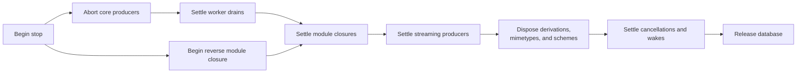

| Setup function | Contract |
|---|---|
| `registerRuntimes([{ decl, executor, availability, scheme? }, ...])` | Validates the complete canonical tag set under {§executor-runtime-declaration}, then publishes every process-wide executor and optional claimed scheme facet atomically. |
| `registerScheme(name, handler)` | Adds one process-wide addressable scheme handler; scheme readiness and model-facing capability publication remain core-owned. |
| §module-action-registration `registerModuleAction({ name, scope, inputSchema, outputSchema, handler })` | Adds one non-empty, extension-unique action with resolvable JSON Schemas. `scope` is exactly `worldless`, `workspace`, or `worker`; the handler receives schema-validated params and a separate matching context. Scoped contexts contain trusted bound identifiers, never client parameters. A client-interface module decides whether and how the name becomes public, validates successful output, and owns collisions with its built-ins. |
| §module-workspace-provider `registerWorkspaceCapabilityProvider(namespaceOwner, provider)` | Registers one extension-unique Functionality provider. `activate({ workspaceId, retain })` reconstructs the workspace snapshot; idempotent `deactivate({ workspaceId })` releases process resources. Core coalesces demand and supplies residency leases for work that outlives its caller. |
| §module-workspace-state `readWorkspaceModuleState(workspaceId, namespaceOwner)` | Reads one nullable JSON state value per workspace and provider. Core owns storage and lifecycle; the provider owns its schema. Store symbolic credential references, not copied secrets. A worker-scoped family's coordinator reads and replaces the same shape per worker in `worker_module_state` ({§functionality-scope}). |
| `readWorkspaceEnvironment(workspaceId)` | Captures the workspace env layer ({§workspace-env}) and returns its composer. No argument uses admitted host values; a supplied environment supplies a module's reference-resolution context. Both apply the same captured values and masks, without worker overrides. |
| §module-workspace-directory `workspaceStateDirectory(workspaceId, namespaceOwner)` | Returns and creates the module's absolute operational-state directory under the daemon's XDG state home. Core owns path resolution and a stable random workspace storage key in its own `workspace_module_state` row. The key survives workspace renames and daemon restarts; independently created workspaces, including in other databases, receive different keys. The module owns its contents and child-directory lifetimes. |
| §module-functionality-adapter `registerFunctionalityAdapter(adapter)` | Registers one family beneath the shared coordinator ({§functionality-coordinator}). |
| §module-workspace-capabilities `replaceWorkspaceCapabilities({ workspaceId, namespaceOwner, state, runtimes })` | Atomically replaces one provider's durable state and runtime/scheme snapshot at the workspace operation boundary. Namespace claims are validated before mutation. Failure restores the prior state and publication. |

Module directory allocation is lazy, atomic in SQLite, and independent of the
project root, daemon CWD, and workspace/worker environment overrides. New
directories use mode `0700`; existing permissions are not rewritten. Module
names occupy a single encoded path component. Missing workspaces, invalid
stored keys, and filesystem failures are errors, never a fallback to CWD.
Allocated state is not erased on cooling, disable, removal, or shutdown: its
contents may be persistent or referenced by retained results. Deleting a
workspace forgets its storage key through the existing foreign key; old disk
state is not reassigned or automatically purged. A database copy preserves its
storage identities; the directory is operational state, not a backup of it.

§workspace-environment-sharing **The workspace owns its shared environment.**
Workers own their logs; delegation retains its existing lifecycle.
Creating, attaching, forking, cancelling, or deleting a worker does not create,
transfer, or remove ownership of workspace tools or shared resources.

| Fact | Owner |
|---|---|
| Enabled skills, MCP servers, outbound agents, and membership definitions | Workspace |
| Runtime publication, connection residency, and alias configuration | Workspace and the registered provider |
| Submitted operation, receipt, pending interaction, and cancellation signal | Originating operation in its worker's history |
| Saved tool output and materialized resource bytes | Workspace; independent of live provider availability |
| Named and commons scratch | Workspace |
| Log | Worker |

§module-workspace-quiescence **A Functionality snapshot changes between
workspace operations.** Mutation admission, external installation/removal,
preparation, and publication hold the same exclusive gate. Explicit client
mutations use `try` and fail 409 before effects while the workspace is held.
Refused mutations reserve no queue position; a client retry is a new admission.
An accepted model mutation uses `wait`, proceeding after its originating turn. Activation and turn-admission refresh use `none` inside
their already-held demand boundary. Providers reject replacement while active
requests, input exchanges, or Tasks depend on the old snapshot; infrastructure
watches may be replaced. These are concurrency constraints, not creator privileges.

§module-workspace-sharing **Workers share Functionality by reference.**
There is one effective definition for each workspace, family, and alias.
Workers neither inherit module-state copies nor publish private tool registries.
A conflicting alias is rejected explicitly; it never produces a hidden second
definition for the submitting client or worker.

§module-workspace-residency **Persistence is not residency.** Model execution,
capability-aware operations, scoped module actions, and retained provider work
lease the workspace's Functionality. Boot, workspace or worker creation,
attachment, listing, naming, idle clients, and parked state alone do not.
After the last lease releases, `PLURNK_SERVICE_WORKSPACE_WARM_MS` (default
`900000`) and `PLURNK_SERVICE_WORKSPACE_WARM_MAX` (default `2`) bound idle
residency. `0` disables the respective grace or allowance; `-1` disables that
bound. Concurrent demand coalesces; cooling never closes a leased connection.

Cooling withdraws live capability and releases process resources at the
workspace boundary. Durable configuration, history, and saved entries remain.
New demand reconstructs the one shared snapshot. Shutdown cancels warm timers
and closes module resources through their owning provider.

§module-workspace-residency-facet **Residency is the workspace's; processes are
one family's facet.** The workspace is the lease unit, and every family's
publication rides the same replacement: its manager executor, its generated
documents and its state. Only a family that holds processes prepares
`runtimes` (MCP servers today); the field is absent for every other family, so
warming and cooling bound workspaces, never families, and the two-stage rollback
guards the manager registration of every family alongside the one family's
processes. There is no per-family residency policy (operator, 2026-09-14:
residency is MCP-specific and is not a family policy system).

The version-1 baseline table `workspace_module_state` stores one JSON value
per `(workspace_id, namespace_owner)`. It is configuration, not an executable
registry. Deleting the workspace cascades its state; worker lifecycle does not.

## Workspace Functionality

§functionality-coordinator **One coordinator owns the common lifecycle.**
Agent Skills, MCP, outbound A2A agents, and membership are adapters beneath
`list | discover | add | enable | disable | remove`. State and mutations
serialize per workspace and family. Client actions
`workspace.<family>.<verb>` and model manager executors invoke the same
coordinator. Families do not invent another management grammar, proposal
policy, or hotload path.

Retryability describes the actual failed condition, not its numeric status.

| Verb | Common contract |
|---|---|
| `list` | Project definitions, origin, enabledness, and preparation outcome: disabled, active, unavailable with its Problem, or authorization-required. No credential values. |
| `discover` | Return inert candidates. Never install, persist, enable, or execute them. |
| `add` | Admit and persist a workspace definition, prepare it, and enable it atomically. It may override the service baseline. Reapplying the same workspace definition enables it idempotently (200); a different definition for that alias fails 409 without replacing it. |
| `enable` | Publish an available definition; retry preparation if unavailable. |
| `disable` | Withdraw live capability; retain its definition and saved results. |
| `remove` | Disable and forget the workspace definition. A same-alias service baseline reappears disabled. Service definitions are disable-only. Saved results remain. |

§functionality-adapter **An adapter owns protocol truth.** It declares its
family, namespace owner, definition schema, contributed defaults, discovery,
admission, preparation, and teardown, and its alias grammar when that is not
the shared lowercase-hyphen one: the coordinator enforces whichever grammar the
family declares, at admission, in the service projection, and on persisted
state, so an environment variable's name is an alias exactly as a skill name
is. Admission distinguishes explicit client
actions from model operations where the family contract requires it
({§members-model-scope}). Preparation returns runtimes, documents, per-alias
outcomes, and a snapshot with `commit`/`abort`. Successful publication commits;
failure aborts; cooling tears down. Protocol continuations remain ordinary
module actions. Optional `forget` releases an installed or provisioned
definition before removal; failure rejects removal ({§skills-remove}).

An adapter may expose a `scheme` facet beneath its family's runtime namespace
({§runtime-resource-binding}). A facet claims a path subtree and is the scheme's
whole live half there: READ and FIND preparation, FIND, SEND, WAIT and KILL are
its own wherever it implements them. A claimed KILL the facet does not implement
is the ordinary entry KILL ({§stream-control}); an unclaimed coordinate keeps the
stored-execution behaviour, SEND to a process included. Where its resources are
not shaped like the executor's output, the facet states their representation —
resource authority, channels, the default channel — and that manifest governs
every claimed coordinate: its address, its fragmentless READ, the channel a
subscription publishes. An adapter states the `traits` of its runtime — `web`
for a family that reaches the network — so {§capability-admission} selects its
manager and its resources alike.

§env-functionality **Environment is a scoped family.** Ambient names admitted by the
operator's ceiling ({§exec-env-scoped}, service origin) precede workspace defaults and
worker overrides ({§workspace-env}). `add` takes
the name as the alias and `{ "value": "…" }` as the definition, used verbatim with no
interpolation. `disable` withholds a name in the selected scope while retaining it;
`remove` forgets a locally-owned entry and a same-name lower baseline reappears
disabled, so removal never silently changes what the next spawn sees. Definitions
from a lower layer are disable-only in the current scope.

`list` projects effective values with their origin. Values are shown: the ceiling is the security
boundary, not the projection, and any admitted name is already readable by every command the
Worker runs — withholding it here would be theatre and would make `list` lie about the
environment its commands receive. A name the invariant reserves (`PLURNK_*`, provider credential
names) is refused at **admission**, not dropped at the spawn, so the model learns why.

`discover` is this installation's configuration catalog: every name an installed package declares
under {§operator-config-env-defaults} that a Worker may set, projected as candidates whose summary
is the declaration's own comment and whose provenance is the declaring package. The names the
invariant reserves — plurnk's own configuration and provider credentials — are the operator's and
never appear, so the catalog stays short enough to read whole. `query` matches a name or the
comment that documents it, never a value. It is not a permissions list beyond that — a Worker may
set any name it lists or none of them — it answers which names have a **consumer**, and it is how
a Worker learns the name of a value only the operator can supply. The catalog projects
declarations, never the host environment, so a credential the operator has filled in appears by
name with its documentation and an empty value ({§exec-env-scoped}: referred to by name, never
read). `configuration` is refused: a client's own environment contributing candidates would be a
second door past the ceiling.

The family publishes no process runtimes. Its values are read at the spawn that uses them,
not from a live process or a cached worker environment.

§functionality-scope **A family declares its supported scopes.** Skills, MCP, members
and outbound A2A describe what exists in a **workspace**: a capability, resident or installable,
that every Worker there shares. Environment describes how one **Worker** works — context rather
than capability — with worker overrides above workspace defaults. The adapter declares
`scopes` (absent means `["workspace"]`; the first is the model default), and the
coordinator keys durable state and the locally-owned `origin`
by it: a workspace-scoped family's own entries carry origin `workspace`, a worker-scoped
family's carry `worker`. Origin names ownership, never scope, so a projection never claims the
workspace set a value one Worker set for itself. Nothing else in the contract varies: the six
verbs, the two projections, enabledness, and the service-baseline rules are one implementation
across every family, which is what keeps their idioms from drifting apart.

A family projects `<scope>.<family>.<verb>` for each supported scope. The action's
context binds that scope; a worker-scoped action also names the Worker. Its durable
value is the same shape per (worker, family) in `worker_module_state`, read
at each verb and at each spawn rather than held in the workspace snapshot. Its `list` and
mutations serialize on the Worker's own lane and take no workspace exclusivity: nothing
resident changes, and the next spawn reads the state, so a Worker shapes its own environment
while its siblings run. Its preparation yields outcomes only — no runtimes, documents or
snapshot — and the coordinator refuses one that does more.

A Worker created with a parent — WORK and FORK alike — starts with a copy of the parent's
worker-scoped state, taken at creation. The child owns its copy: neither side's later edits
reach the other, and depth is transitive with no further rule. Each copied entry carries
`inherited`, the Worker that set it, preserved across generations until the child changes that
entry, so `list` never claims the child set what it inherited; a parent's masking of an
ambient name travels the same way. WORK and FORK may hand the child more: the heading's `env`
option lands as the child's own entries through `add`, after the copy ({§env-option}).

§functionality-state **One durable value per workspace and family.**
`{ version: 1, definitions: { [alias]: { origin, enabled, definition? } } }`
is stored under the provider namespace in `workspace_module_state`; a
worker-scoped family ({§functionality-scope}) stores the same value per worker
and family in `worker_module_state`.
A locally-owned entry persists its exact definition; a lower-layer entry persists
only enabledness, never a copied value. Active, unavailable, and authorization-required are preparation
outcomes, not durable desired state. The configuration cascade contributes
defaults; one workspace snapshot is effective authority.

§functionality-publication **One replacement publishes a family.** The
coordinator prepares, then replaces state and runtimes through
{§module-workspace-capabilities}, with the manager followed by any runtimes the
adapter prepared ({§module-workspace-residency-facet}).
Admission, tools, documents, Turn 0, and client status consume that publication.
The coordinator's synchronous `publish` participates in the registry commit;
its returned undo restores the previous view before rollback reconciles documents.
Neither callback performs fallible I/O. Publication failure restores the preceding
configuration/runtime snapshot; it cannot roll back effects performed by an
external installer. Installer failures retain their cause and must not be
reported as successful configuration changes.
`settleFunctionality` joins queued
publications before inspection or shutdown.

§functionality-documents **Generated documents describe the shared snapshot.**
Documents are projected through the existing worker generated subtree
({§worker-generated-subtree}); the projection does not confer ownership.
Enabled, active definitions are discoverable. Disabled or unavailable
definitions add no hot-path teaching. Their exact state and Problem remain
available through `list`.

§functionality-model-projection **Each family has one workspace manager
executor.** The six verbs use their actual coordinator schemas and the ordinary
tool-document machinery. `list`/`discover` are read effects; mutations are host
effects and use normal proposals. Summary, signatures, and deep docs derive
from the same registry ({§tools-resource-materialization},
{§executor-input-schema-preview}). Outcomes stream into the invoking operation's
output entry. The manager closes over workspace identity, not worker identity.
A worker-scoped family's verbs nonetheless act for the invoking Worker: Core
binds that Worker to the manager at the operation, so the published manager
stays one per workspace and the executor framework's arguments carry no
identity ({§functionality-scope}).

Expected adapter failures retain their exact status and Problem in both client
actions and the model operation's stream/result ({§problem-error-carrier}). An
unexpected exception remains an executor fault, not a managed refusal.

§functionality-document-body **A family's teaching is an authored file beneath
its generated header.** The adapter names its package directory (`docsDir`);
that package's `docs/<family>.md` is read once, by the same rule runtimes use
for `docs/<tag>.md` ({§executor-discovery}: the authoring title `# <family>` is
removed, the generated document owns the H1), and rides the family
declaration's `details` beneath the Tools section. The header, verb table, and
schema documents stay generated; no prose from the file enters the hot path.
A family that ships no file has a header-only document. Registration also
validates the adapter's taught `add` example against the `add` input schema it
teaches, so a wrong example fails boot rather than the model.

§functionality-model-mutation **An accepted mutation completes through its ordinary
execution stream.** Preparation and publication share the family's serialized
lane. Publication acquires workspace exclusivity after current turns release
their leases; the invoking stream remains pending until publication completes.
It then reports `active`, `unavailable`, or `authorization-required`, or the exact
publication failure. A preparation failure may publish enabled-but-unavailable
state; a publication failure never reports a successful mutation. Stream polling,
waiting, and result observation use the ordinary execution lifecycle, without a
separate deferred-commit queue. An explicit client action publishes now, rejects
a failed preparation, and fails 409 while the workspace is held
({§module-workspace-quiescence}). Rejecting a proposal prepares, persists, and
publishes nothing.

## §methods Application interface

`ApplicationPort` is the contracts-owned interface implemented by `Daemon` and
consumed by every exterior adapter ({§application-port}). Its function names are
transport-neutral library calls, not public wire names; this table specifies
Core's behavior behind them.

| Area                                              | Function | Core contract |
|---------------------------------------------------|----------|---------------|
| §methods-event-subscribe Events                   | `subscribeToEvents(handler) -> unsubscribe` | Subscribes to the raw event source in {§notifications}. A subscriber failure is logged and cannot re-enter engine control flow. |
| §proposal-list Proposals                          | `pendingProposals(workspaceId)` | Intersects durable proposed rows with the lifecycle owner's live resolution waiters, then returns their validated {§proposal-projection}; persistence alone cannot advertise an unresolvable client interrupt. |
| §methods-proposal-resolve Proposals               | `resolveProposal(logEntryId, resolution)` | Validates and delivers one accept, reject, or cancel decision to the engine. An unknown or already-resolved id fails; the client protocol owns how the decision arrived. |
| §client-interaction-list Client interactions      | `pendingClientInteractions(workspaceId)` | Intersects durable interaction rows with their live operation waiters and returns the contracts-owned projection; a row alone is not a resumable interaction. |
| §methods-client-interaction-resolve Client interactions | `resolveClientInteraction(interactionId, resolution)` | Validates and delivers one resolved payload or cancellation. Unknown, ownerless, and already-resolved identities fail before affecting an operation. |
| §methods-loop-run Loops                           | `runLoop({ workspaceId, workerId, prompt, source?, maxTurns?, policy?, openPaths?, selector?, childSelector? })` | Validates a model worker and complete loop policy, persists it with the effective turn ceiling, then returns an immediate status-100 acknowledgement with `loopId` and `action`. A trusted adapter may identify the prompt's causal actor with one canonical `source`; ordinary clients cannot author it through their protocol surface. The exact terminal result arrives only through `loop/terminated`; parking and resuming do not replace the loop. |
| §methods-loop-cancel Loops                        | `cancelDrain(workerId, reason?)`; `cancelWorker({ workspaceId, workerId, reason? })` | `cancelDrain` begins durable structured cancellation and reports whether process-local work existed when called; queued or parked durable work is still terminalized when it is `false`. The ownership-bounded `cancelWorker` awaits that same tree cancellation and stream reap, so an exterior protocol can project the settled durable result without polling or fabricating state. |
| §methods-op-mirror Client dispatch                | `dispatchClientAction({ workspaceId, workerId, statements })` | Dispatches already-parsed grammar statements as one client action in one administrative loop in the client worker, executing in the workspace's Functionality ({§actor-boundary-attached-functionality}). Every statement is an ordered client/operation turn, and every committed `log/entry` is emitted before the action promise resolves; a proposal may keep its turn, loop, and action promise open until resolution. Core exposes no per-op method family. |
| Client observation                                | `look({ workspaceId, workerId, statement, perspectiveWorkerId? })` | Runs an already-parsed READ through the full resolver in the workspace's Functionality without a log row. A non-READ statement is rejected ({§op-look}). |
| §methods-log-read Reads                           | `readLog({ workspaceId, workerId, ...coordinate })` | Ownership-checks the worker, then reads by ids, recency, or the complete `loopSeq`/`turnSeq`/`sequence` display coordinate. An omitted `limit` is `PLURNK_SERVICE_LOG_READ_PAGE`, and any `limit` is capped at `PLURNK_SERVICE_LOG_READ_MAX`. |
| §methods-entry-read Reads                         | `readEntry({ workspaceId, workerId, target, channel?, offset? })` | Resolves the selector from that worker's perspective and returns {§entry-read-result}, either complete or as one channel suffix, without creating action evidence. |
| Providers                                         | `listProviders()` | Lists configured aliases with provider/model identity, active state, and the effective provider-derived `inputCapacity` when known. |
| Model catalog                                     | `listModels(query)` | Returns one validated bounded {§model-catalog-wire} page under {§model-catalog}; performs no provider request or selection. |
| Client capabilities                               | `listClientDisplayCapabilities()` | Composes sorted scheme declarations ({§manifest-client-display}) followed by sorted MIME declarations ({§mimetype-client-display}) into the validated shared wire ({§client-display-capabilities}). The internal `exec` operation handler is excluded; its addressable runtime-tag scheme faces remain included. |
| §methods-workspace-create Workspace lifecycle     | `createWorkspace({ name?, projectRoot?, settings? })` | Validates `settings` through {§operator-config-workspace-settings}, creates the world and its client envelope, and emits global `workspace/created`. Creation and attachment are passive: neither starts derivation nor activates workspace Functionality. `projectRoot` is established here or the workspace remains headless. |
| §methods-workspace-attach Workspace lifecycle     | `attachWorkspace({ workspaceId, workerId?, workerName? })` | Validates ownership and returns a client envelope for an existing world. It does not retain caller or transport binding state in core. |
| §methods-model-worker Workspace lifecycle         | `ensureModelWorker(workspaceId)` | Returns the workspace's stable default model worker, creating it on first use. A durable default-conversation role identifies it independently of worker name and root creation order. Repeated and concurrent calls return the same root; fresh conversations and forks do not replace it. |
| §methods-conversation-worker Workspace lifecycle  | `createConversationWorker({ workspaceId, name? })` | Creates a distinct model-origin root worker with empty history: a fresh conversation over the same world, not a fork or the stable default. |
| Workspace lifecycle                               | `forkWorker({ workspaceId, workerId, name? })` | Creates a child worker that branches the source worker's history while sharing workspace state. |
| §methods-workspace-rename Workspace metadata      | `renameWorkspace(workspaceId, name)` | Changes only the world's unique mutable name; workers, log, and membership remain intact. |
| §methods-workspace-prompts Workspace metadata     | `listPrompts(workspaceId, limit?)` | Returns nonempty loop-seed prompts from the workspace's model-origin root conversations, newest-first. An omitted limit is `PLURNK_SERVICE_PROMPTS_PAGE`; spawned and forked child prompts are excluded. |
| Workspace metadata                                | `listWorkspaces()`, `workspaceDerivationStatus(...)` | Reads current workspace identity and derivation progress. |
| §methods-worker-read Worker topology              | `readWorker({ workspaceId, identity })` | Ownership-bounds an exact id-or-name lookup and returns one durable Worker projection or `null` under {§application-worker-observation}. Supplying both identities or neither is invalid. |
| §methods-worker-list Worker topology              | `listWorkers(workspaceId, query?)` | Returns the workspace's durable Worker projections under {§application-worker-observation}. The origin filter is exact; an explicitly present `parentWorkerId` filters roots (`null`) or one immediate parent (id), while omission returns every lineage position. Each projection carries `kind` (`conversation`, `fork` for a child with a fork boundary, `work` for any other child) and `lifecycle`, the representative work loop's status through {§loop-lifecycle-vocabulary} (`idle` with no work loop), so a directory row shows the same lifecycle glyph the bound worker's own status gauge shows; clients infer neither (#523). |
| §methods-worker-loops Loop lifecycle              | `listWorkerLoops({ workspaceId, workerId })` | Ownership-checks the Worker and returns its Loops in sequence order under {§application-loop-observation}, including the validated exact terminal result when one exists. It performs no scheduling or event replay. |
| Extension actions | `listModuleActions()`, `invokeModuleAction(name, params, context)` | Lists setup-registered `{ name, scope, inputSchema, outputSchema }` descriptors in sorted order. Invocation requires a context matching the registered scope; missing names, forged scope, and missing workspace identity fail before the owner runs. Handler values remain opaque to core. |

§methods-loop-run-fold-consistency **A folded prompt cannot silently reconfigure
its loop.** When `runLoop` targets an active or 202-parked loop, core appends the
prompt to that same loop and returns `action: "injected_next_turn"`. Configuration
already durable on the loop remains authoritative:

| Requested input       | Omitted                                              | Equal to the durable selection | Different from the durable selection |
|-----------------------|------------------------------------------------------|--------------------------------|--------------------------------------|
| Provider/model        | The resolved request selection must still agree.     | Fold.                          | 409 provider conflict.               |
| `maxTurns`            | Keep the durable ceiling.                            | Fold.                          | 409 turn-ceiling conflict.           |
| `policy` request      | Keep the complete durable loop policy.               | Fold.                          | 409 policy conflict.                 |

The conflict names both selections and directs the caller to cancel or conclude
the loop before changing configuration. A newly enqueued loop instead persists
the requested configuration normally.

§methods-loop-run-open-paths **Workspace paths are core-owned context reads.**
`openPaths` belongs to the message submitted by the client. The client
sends paths, never duplicated file bytes; core dispatches one ordinary
`plurnk`-origin READ per path from inside the owning workspace, and successes
and failures surface through the normal operation-result contract.

| `runLoop` disposition | Message and path behavior                                                                            |
|-----------------------|------------------------------------------------------------------------------------------------------|
| New loop              | Persist with the initial message; publish it and READ its paths on turn 1.                          |
| Active loop           | Persist with the injected message; publish it and READ its paths together on the next turn.        |
| Parked loop           | Persist with the waking message; publish it and READ its paths together on the resumed turn.       |

If an unpublished message is promoted into subsequent work under
{§message-loop-containment}, its selected paths travel with it.

§methods-rebind **Binding belongs to the client-interface module.** Core's
workspace lifecycle calls return exactly the workspace and selected client actor
(`workspaceId`, `workspaceName`, `projectRoot`, `workerId`, `workerName`); they
carry no conversation-worker or action-loop binding. Core retains no connection,
thread, or current-workspace mapping. A module may replace its own binding with a
later create or attach result without requiring a new transport; it resolves the
conversation worker separately, while each client action allocates its own
administrative loop under {§connection-lifecycle}.

§methods-worker-name-admission **Client worker-name admission.** Attach,
fresh-conversation, and fork apply {§worker-name-minting} before lookup or
creation. A client therefore cannot forge or resume the runtime actor (its
name lies outside `WORKER_NAME`), insert a non-mintable spelling, or make the
client registry diverge from model worker control.

§capability-admission **One admission path owns external authority.** Core
derives one or more `CapabilityDescriptor` demands from each routed statement,
then evaluates the service and workspace policy layers. Every demand of a composed operation must
survive before execution or proposal creation. A denial is an exact terse 403
identifying the denied descriptor and owning policy scope; it never guesses the
model's intent or recommends an alternate operation. COPY demands observation
of its source and mutation of its destination; MOVE additionally demands
mutation of its source; a resource-backed execution demands its runtime plus source
observation. Unknown schemes, runtimes,
and tools continue to their ordinary resolver so capability policy cannot turn
absence into a misleading restriction. The same resolver shapes generated
scheme references, worker tool documents, and Turn0 surveys. NOTE, lifecycle declarations, log KILL,
and label or targetless SEND are log/program control rather than routed
external demands and therefore remain outside capability selectors.
Runtime mutations of owned generated entries ({§worker-generated-subtree})
likewise maintain intrinsic state. Producer identity alone grants no exemption:
source observations and other effects in the same operation retain their
independent demands, and harness-authored initialization obeys workspace policy.

§workspace-capability-policy **The workspace is the access boundary.**
`workspaces.settings.capabilities` is the one mutable access policy under the
service ceiling. Every actor, including an existing child, uses the current
workspace policy; neither creation nor delegation snapshots authority. Workers
own their log and scratchpad, not tools or resource grants. Intrinsic source
mutability, workspace separation, and proposal approval remain distinct
contracts. Input is validated before persistence; malformed stored policy fails
at its reader with the workspace coordinate and cause.

§workspace-capability-inspection **Client inspection uses the admission
resolver.** Workspace capability actions return the contracts-owned
`CapabilityProjection` {§capability-policy-projection}: service, workspace, and
their normalized effective intersection. The same resolver governs dispatch
and packet shaping. Replacement preserves unrelated workspace settings. Before their next operation
or observation, existing workers reconcile generated references against it. It requires no selected
conversation worker and returns the complete fresh projection.

§question-tool **The native request-user-input tool.** Core registers one
in-process `question` runtime at boot. Its body is the MCP2 2026-07-28
form-elicitation shape verbatim — `{ message, requestedSchema }`. An
optional literal target is a descriptive label only: it neither routes the
question nor changes the body or recipient. The
`results` channel carries the standard `ElicitResult`
(`{ action: "accept", content }` or `{ action: "cancel" }`). The executor maps
`requestedSchema` to the contracts-owned `ClientInteractionRequest.responseSchema`
(toolName `question`); the client returns that exact answer object, and the
executor constructs the `ElicitResult`. Answer fields are data, including fields
named `action` or `content`. The executor awaits the shared
client-interaction lifecycle — durable pause, reconnect discovery,
cancellation, and the answer-as-resolution all come from
{§client-interactions}; there is no loopback MCP and no proposal masquerade.
Answer and cancellation resume the same waiting loop whether resolved before
or after it parks; the next packet contains the result without replaying the execution.
Effect `read`: the tool observes the human's answer and is never
proposal-gated. Its runtime declares the `interaction` trait, which the shared
resolver projects as access class `interact`; any capability-policy layer may
therefore admit or deny it. The ordinary executor policy also applies:
`PLURNK_EXECS_QUESTION=0` disables registration and teaching ({§executor-policy}).

§worker-tool-admission **Tool visibility and execution share admission.** The
reserved tool tree's FIND/READ faces drop a runtime or tool document whenever
the workspace capability policy denies its descriptor. The ordinary document
reconciler runs before operation turns and observation requests, so FIND counts,
weights, and catalog text agree. Turn0 surveys that same catalog. Dispatch evaluates that
same descriptor and policy cascade at the operation boundary, never at
registration; there is no separate per-tool availability system.

§model-catalog **Model discovery is a bounded local projection, not provider
activity.** Core composes the release-pinned Models.dev snapshot with
provider-owned `{§model-catalog-readiness}` and {§provider-reasoning-policy}.
Each entry includes the exact route's admitted `reasoningPolicies`; worker-level
model/spawn intersections and alias tuning are not catalog facts. The default query includes only
providers configured enough to attempt; `availability: "all"` includes every
catalog model with structured missing-configuration causes. Provider and text
filters apply before deterministic selector ordering and offset/limit paging;
the default page is 50 and the schema caps it at 100. Discovery never probes,
authenticates, invokes, or selects a model, and catalog data never enters model
packets or state snapshots.

§worker-model-selection **Worker-owned model selection.** Every model worker
owns one durable model, persisted as a nullable `model_routes` foreign key.
The root conversation worker is seeded once — from an explicit selection, else
the daemon default — and never re-seeded from a later default change. A
deliberately modelless daemon leaves the worker unset and rejects model work
until an explicit selection. Starting a loop snapshots the worker's resolved
model onto the loop; inject, park, wake, retry, reconnect, and restart
continue from the loop snapshot and never re-resolve through the alias
cascade. A WORK/FORK child copies the spawning loop's effective spawn model
(spawn override ?? model) onto the new worker by value at creation; it retains
no live link and begins with no override, so a later parent change affects
only that worker's future loops and descendants. Client operation actors and
Plurnk-owned bookkeeping workers run no model loops and own no model
selection; the model, spawn-override, and reasoning controls refuse them with
`409 model-worker-required` before any policy row is initialized or written. An explicit model, spawn-override, or reasoning-policy change while
the worker holds any queued, running, or parked loop is a precise
`409 worker-loop-active` ({§worker-lifecycle-live}), independent of a process-local
drain. The policy write checks liveness atomically, including selections carried
by new prompts. Reasserting unchanged settings is not a change. Select after
concluding or cancelling the unfinished tasks.
First-time initialization of an unset worker model remains legal and never
rewrites an existing loop's generation snapshot.

A client-created branch copies the source worker's durable model, spawn
override, and reasoning policy by value alongside its history. It retains no
live policy link to the source worker.

§worker-reasoning-policy **Reasoning is a durable worker policy.** Each selected
worker model has exactly one member of the shared `{§reasoning-policy-wire}`;
a modelless worker has none. A declared alias's scoped environment value—or the
global provider value for an exact route—seeds the policy only when the worker
first receives its model. Model identity and reasoning
policy are persisted atomically, while visibility of returned reasoning and
token ceilings remain separate concerns. An explicit policy change validates
the exact policy against both the worker model and its optional spawn model and
is refused while the worker owns a live or parked loop. Effort is identity-grade:
every client-visible model route carries the worker's durable policy as
`reasoningPolicy`, omitted only when the cataloged model has no reasoning
dimension. Client inspection
returns the supported-policy intersection of those two routes. Inspection or
mutation materializes the daemon-default model and policy onto an uninitialized
model worker before answering; a deliberately modelless daemon remains unset.

§worker-reasoning-source **A default never masquerades as a choice.** The worker row records
`reasoning_source` beside `reasoning_policy`: `default` when the value was seeded from the alias
or provider configuration, `explicit` only after `worker.reasoning.set`. `worker.reasoning.get`
returns `source`, and a projected `ModelRoute` carries `reasoningSource` exactly when it carries
`reasoningPolicy`, so a client can render `deepdumb[low]` differently from a seeded `low` without
inferring anything. Selecting a new model keeps an explicit policy (validated against the new
model) and re-derives a default one from the new alias, so a seeded value never outlives the alias
that supplied it; the source itself is not part of the mid-loop generation-change check, because
choosing the value already in force changes no inference. A spawned child inherits its
parent's effective policy by value as `default`: nothing was chosen on that worker (#528).

Starting a loop snapshots the worker's policy beside its model. Restart, retry,
park, wake, and injection retain that immutable snapshot. WORK, FORK, and BARE
inherit the spawning loop's policy by value; no descendant consults a later
environment or parent-worker change. Unsupported policies fail with a precise
provider-boundary problem rather than being silently weakened or translated.

§methods-loop-run-model **Per-loop model selection.** `runLoop` accepts one
optional `selector`: either a declared alias or an exact `<provider>/<model>`
route. An exact route stores no fabricated alias and receives no alias-scoped
configuration. An explicit selection persists onto the
addressed worker before the loop snapshots it; an omitted selector is not a
selection and continues the worker's durable model
({§worker-model-selection}). The fully resolved provider identity and reasoning
policy are persisted on the loop and remain immutable through turns, parks,
wakes, and restart ({§worker-reasoning-policy}).
Injecting into an existing loop with a conflicting explicit selection fails
before work is accepted. Provider instances are cached; no resume path
substitutes a boot default for missing or malformed durable selection.

§methods-loop-run-child-provider **Child-provider selection is one durable
subcall policy.** Optional `childSelector` uses the same alias-or-exact-route
vocabulary for every WORK/FORK descendant and BARE inference; omitted uses
`PLURNK_MODEL_CHILD`, while explicit `childSelector: null` means inherit. An
explicit override persists onto the addressed worker before the loop
snapshots it; an omitted selector continues the worker's durable override
({§worker-model-selection}). Core persists the resolved policy on each loop. A
child runs on the spawning loop's effective spawn model and carries the same
policy deeper; inherit uses the spawning loop's provider and remains inherit.
BARE consumes the selection without spawning a child. Packet admission is
unchanged: a smaller WORK is valid when its packet fits, and an oversized
inherited FORK terminates through the ordinary child-loop result without
preflight assembly or provider fallback.

§methods-log-coordinate **Log coordinate.** Every `LogEntry` returned by
`readLog` or emitted through `log/entry` carries `loop_seq` and `turn_seq`
beside database ids, so a client can render and resolve the logical `L/T/S`
coordinate without fetching all rows and matching locally.

§methods-log-entry-wire **Log entry wire fidelity.** `readLog` and `log/entry`
preserve causal `source` and parse the row's JSON `attrs` into structured data.
Client interfaces do not reconstruct these fields from operation or origin.

§methods-readable-reasoning **Readable provider reasoning remains derived
provider evidence.** On model SEND and disposition rows, `readLog` and `log/entry`
project a nonempty admitted `packet.assistant.reasoning` as the optional
`reasoning` field. The durable packet remains the sole stored representation;
core does not copy readable reasoning into log attributes or bodies. A turn
without readable reasoning omits the field.

§op-look **LOOK ownership.** A client-interface module owns the public LOOK
spelling and grammar parsing. It rewrites a valid LOOK statement to READ and
hands the AST to core's `look`; core owns the full resolver and the no-log
invariant. The internal closed, rowless observation segment supplies an honest
numeric loop coordinate for relative `log:///` addressing without leaving
active lifecycle behind. The segment belongs to the acting worker (`workerId`);
the READ resolves `log:///` as `perspectiveWorkerId` when one is given; explicit source
authorities retain their identity under {§turn-source-resources}. A client can look at a conversation without
adding a loop to it. LOOK text anchors resolve through the same
{§line-anchors} path as READ.

### §notifications Core events

| Event                                                        | Payload | When fired |
|--------------------------------------------------------------|---------|------------|
| §notifications-log-entry-notify `log/entry`                  | `{ entry: LogEntry }` | A non-proposed `log_entries` row is committed, or a proposed row reaches terminal settlement under {§proposal-proposed-hidden}. Delivery completes before a later event may terminate the owning Loop. |
| §notifications-loop-terminated `loop/terminated`             | `{ workerId, loopId, result, hitMaxTurns, turnIds, usage: { accounting, curationWeight, curationBudget, contextTokens, contextCapacity, meta }, attributions }` | One loop reaches a terminal state. `result` is the exact universal operation result, including its RFC 9457 Problem Details on failure. `accounting` is the loop's contracts-owned {§provider-accounting}; the two curation facts and two physical-context facts follow {§tokenomics-client-gauge}; `meta` is that turn's opaque provider bag. `attributions` is the sorted union of exact provider-request evidence ({§attribution}), separate from accounting. Worker and loop are an inseparable owning coordinate. |
| §notifications-loop-packet `loop/packet`                     | `{ workerId, loopId, packetCount }` | One provider packet becomes durable. `packetCount` is the exact count of packet-bearing turns in that Loop; packetless producer turns and physical provider retries never contribute. |
| §notifications-loop-proposal `loop/proposal`                 | contracts-owned `ProposalProjection` | Dispatch pauses on a durable 202 proposal. `disposition` is the sole authority for whether a client presents review UI; live and reconnect share {§proposal-projection}. |
| §notifications-loop-interaction `loop/interaction`           | contracts-owned `ClientInteractionProjection` | An operation is paused on client input. Live delivery and reconnect discovery share {§client-interactions}; workspace scope remains the event envelope. |
| §notifications-workspace-created `workspace/created`         | `{ id, name, projectRoot }` | A workspace is created. This is the only current global event. |
| §notifications-stream-event-on-channel-change `stream/event` | `{ entryId, workerId, target, channel, state, contentLength, mimetype?, loop_seq?, turn_seq?, sequence? }` | Channel content grows or channel state transitions. `workerId` is the initiating actor used for conversation routing, never entry ownership or access control. `target` is the canonical resource URI. Optional numeric coordinates identify the causal log item, independently of that URI. Core-managed channel writes include the current stored `mimetype`, which may change per call ({§channel-mimetype}); the generic plugin notification capability does not require it. It carries metadata, not content; consumers read bytes by canonical workspace address. |
| §notifications-stream-concluded `stream/concluded`           | `{ entryId, workerId, target, subscriptionId, scheme, result, summary, wakeAction, loop_seq?, turn_seq?, sequence? }` | A subscription closes. `workerId` identifies the initiating actor; `target` is the canonical resource URI. Optional numeric fields identify the causal log item, never parsed from `target`. Exact result truth is preserved. `wakeAction` reports `wake-pending` before settlement, `no-op-active-loop` when work is already executing, `no-loop`, or `skipped-aborted`/`skipped-cancelled` for an aborted worker scope. A pending wake predicts neither execution nor recipient count; subsequent ordinary loop events report actual progress and completion. |
| §notifications-notice-event `notice/event`                   | `{ workerId, loopId, notice: Notice }` | A transient observation or progress notice occurs. `workerId` owns loop activity; only workspace derivation progress uses `null` with `loopId=0`. It cannot alter durable history, scheduling, recovery, or model-visible failure truth. |
| §notifications-reasoning-event `reasoning/event`             | `{ workerId, loopId, turnId, modelCallId, requestSequence, phase, delta? }` | A main emission call exposes readable reasoning. Each physical request that emits reasoning owns a distinct positive `requestSequence` and balanced start/content/end stream; opening a retry closes the preceding stream before any retry delta. Only content carries a nonempty exact delta. It is transient presentation evidence, never a log row, Notice, packet field, or BARE/child channel. The settled provider response remains the durable authority. |

§notifications-stream-event-failure-isolation The plugin-facing
`NotifyCaps.streamEvent()` remains a synchronous advisory call while core
resolves its entry identity asynchronously.

| Condition                         | Outcome                                                                                         |
| --------------------------------- | ----------------------------------------------------------------------------------------------- |
| No notifier is configured         | Synchronous no-op; no lookup is scheduled.                                                      |
| The entry vanishes before lookup  | No event.                                                                                       |
| Entry and notifier remain present | One `stream/event` is emitted.                                                                  |
| Lookup or notifier throws          | Daemon diagnostics receive the complete cause; no rejection or engine-state transition escapes. |

§notifications-envelope-carries-workspaceid **Event scope is explicit.**
`subscribeToEvents` supplies `(workspaceId, event, payload)`: `workspaceId` is
the authoritative scope and is `null` only for a global event. Core does not
mutate each payload to repeat it. A transport module stamps that scope onto any
outward envelope that requires it and owns workspace fan-out.

### §connection-lifecycle Client action evidence

A module client is an actor ({§machine-processes}). Its dispatched side effects
write to its own client worker with `origin="client"` and execute in the
workspace's Functionality
({§actor-boundary-attached-functionality}); one client action owns
one administrative loop, and its statements become ordered operation turns
inside that loop. A proposal may hold its turn and loop across an external
interrupt/resume, but those records preserve durable evidence rather than
defining the public client lifecycle. Multiple client actors have distinct workers.

`runLoop` targets a separate model worker holding the conversation with
`origin="model"`. Both workers share workspace state, while a packet renders
only the model worker's private log; client action rows are structurally absent
without an origin filter ({§actor-boundary-isolation}).

---

## §packet-assembly Packet assembly

`PacketBuilder.buildRequestPacket` owns the engine's default ordered section
list. Trusted scheme plugins may transform that first-class list before it is
rendered or measured; {§context-output-admission} remains an engine-owned post-build rail.

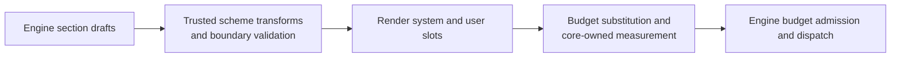

### §packet-cache-monotone Default order and cache locality

Conditional absence never reorders the surviving default sections.

| Order | Slot   | Section               | Wire contract |
|------:|:-------|:----------------------|:--------------|
|     1 | system | `definition`          | Framework definition; leads the most stable prefix. |
|     2 | system | `system-policy`       | Operator policy; empty content is omitted on the wire. |
|     3 | system | `inject`              | Present only when operator notes are configured. |
|     4 | user   | `log`                 | Append-mostly model-visible history; the first user section, so the cached prefix ends inside it. |
|     5 | user   | `worker`              | `Worker`: `{"path": "worker://alice", "parent": <address or null>, "loop": L, "turn": T}`, the actor and the coordinate this packet's response becomes ({§packet-current-turn}). |
|     6 | user   | `delegation`          | `Delegation`: per-turn `{workers, streams}` pointers; always present, each list `[]` when empty ({§packet-empty-sections}). |
|     7 | user   | `errors`              | Per-turn failure pointers; empty content is omitted. |
|     8 | user   | `notices`             | Per-turn observations; empty content is omitted. |
|     9 | user   | `git`                 | Per-turn workspace status; empty content is omitted. |
|    10 | user   | `budget`              | `Context Curation`; omitted when capacity is unknown. |
|    11 | user   | `messages`            | `Open Messages`: immutable message addresses and causal sources ({§message-arrival}). |
|    12 | user   | `recap`               | Optional authored operational recap. |

The order favors prefix-cache locality where semantics permit: the definition
and privileged policy lead operator notes, while the append-mostly
log leads the volatile user-status clump. It does **not** claim that every system byte is
immutable or that the complete packet is globally monotone in volatility:
operator notes and policies can change. Trust is a separate
admission rule. The system slot contains trusted control-plane material;
attacker-reachable content stays in the user slot.

### §packet-plugin-transform Trusted whole-list extension seam

`SchemeRegistry.transformSections` pipes the complete default list through
every registered scheme implementing `transformSections(sections) -> sections`,
in registration order, before rendering and measurement. The schemes-owned
`PacketSectionDraft` contains only `name`, `slot`, `header`, and `content`.
Each initial or returned list passes the schemes-owned validator, including
unique-name enforcement, before the next transformer or renderer. Each
transformer may inspect the section content and add, remove, or reorder
sections. It receives no separate engine, database, actor, or request context.

This is strictly a trusted in-process seam, admitted through the common plugin
trust gate; an external client action cannot invoke it. Whole-list transformation is
the fork-avoidance valve for alternate packet shapes, while
overflow recovery and packet projection remain closed engine concerns.

### §tokenomics Tokenomics: four facts, one curation ruler

Token accounting distinguishes the artifact being measured, the unit, and the
time of measurement.

| Fact | Owner and unit | Time | Contract |
|:-----|:---------------|:-----|:---------|
| Core curation weight | `contentWeight = ceil(chars/2)` over channel content, canonical log bodies, and rendered packet slots | Write/build | Stable, model-independent pressure and curation savings; never a tokenizer claim. |
| §tokenomics-context-envelope-admission Provider input capacity | Provider model limits and configured total output envelope, in provider tokens | Before every logical request | `min(maxInputTokens, contextWindow - outputBudget)` over the known terms. The provider alone measures the complete request and admits, defers, or rejects it. |
| Provider generation envelope | Provider total output budget and optional reasoning subset, in provider tokens | Before every logical request | One total output budget includes hidden reasoning. A reasoning budget is a strict subset, never an additive reserve. |
| Provider usage and cost | Provider-reported input/output/cache/reasoning tokens and monetary evidence | After every physical request | Durable physical-request forensics under {§provider-usage}; never curation state or a preflight estimate. |

- §tokenomics-weight-stored-at-write **Curation weight, stored at write.** `entry_channels.weight` weighs the complete channel content. `log_entries.weight` weighs the complete canonical `LogBody` content before coordinate and packet presentation; persistence `tx`/`rx` envelopes contribute nothing merely by existing, and proposal settlement recomputes the value when the canonical result changes. Bodyless rows therefore weigh zero. The stored number is a stable content-depth measurement, not a provider-token prediction. `entry_channels.lines` is the channel's line count beside it, a stored generated column SQLite keeps on every write (a trailing newline terminates the last line; empty content has none), so a catalog lists extent without reading bodies.
- §tokenomics-render-weight-budget **Packet curation budget.** `logTokensTotal` measures the *complete assembled packet* after section transforms and readout substitution; it is not a sum of log-row `logTokens` fields. Core measures minimum-width probes, monotonically expands fields that do not fit, then right-aligns final values into those widths; final substitution is length-invariant and the displayed total equals the stored request weight. Receipt, FIND-item, pressure-inventory, total, and ceiling figures all use the same curation ruler. A `SUM` of stored content weights measures a different artifact and cannot substitute for packet render weight.
- §tokenomics-calibrated-readout **Convert capacity, never content costs.** Before packet assembly, Core obtains the answering model's last five settled emission responses pairing a measured packet weight with a provider-reported prompt count. The conversion factor is `sum(reported) / sum(weight)`; fewer than three samples use 1. `logTokensMax = floor(inputCapacity / factor)` converts provider capacity into curation units. Zero means no whole curation unit fits; unknown input capacity remains `null`. The built packet captures this allowance once for its readout, pressure inventory, overflow admission, and persisted client gauge. Later responses cannot change that packet's allowance. Samples are model-keyed, not worker-local; a model with no samples starts at 1. Calibration never changes stored weights, rendered receipt costs, or the immutable request history ({§tokenomics-agnostic-ruler}).
- §tokenomics-window-partition **One capacity derivation; no service-side token budget.** The provider owns model limits and the configured total output envelope. Its resolved `inputCapacity` supplies the physical denominator exposed to clients and the boundary conversion into curation units ({§tokenomics-calibrated-readout}). Core shapes context in curation units; provider request-shaped evidence alone admits or rejects physical I/O. `PLURNK_SERVICE_PROMPT_BUDGET`, `PLURNK_SERVICE_SAFETY`, and the additive reasoning/completion reserve knobs are retired; local and custom deployments tune context window, total output budget, optional reasoning subset, and prompt-projection percentage at their owning layers.
- §tokenomics-prompt-projection-share **Prompt projection is stable packet policy.**
  `PLURNK_SERVICE_PROMPT_PROJECTION` is a required alias-scoped percentage in
  `(0, 100)`. It allocates that share of the cold-start curation allowance
  (the capacity conversion with factor 1) to the aggregate automatic prompt-body
  projection. Rolling calibration does not resize existing prompt bodies; only
  the overall curation ceiling adapts. This does not bound stored prompt
  size, provider capacity, an explicit READ/FIND result, or the complete packet.
  Basing the share on configured capacity rather than current free weight or
  sampled conversion keeps one prompt's projection byte-stable as the log and
  calibration samples evolve.
- §tokenomics-window-unpollable-deliberate **Unknown provider capacity stays unknown.** When the provider cannot derive `inputCapacity`, Core omits denominator-dependent curation telemetry and uses the ordinary bounded prompt projection. The provider still sends requests whose measurement or limits are estimates or unavailable: ambiguity defers to the upstream capacity oracle rather than becoming a local rejection.

§tokenomics-client-gauge **Clients receive curation and physical occupancy as separate pairs.** `loop/terminated.usage` carries latest packet-bearing model-turn `curationWeight`/`curationBudget` and latest-emission-call `contextTokens`/`contextCapacity`; each unknown fact is `null`. The curation pair is the packet's measured weight and captured allowance, exactly as displayed to the model, not a recalculation using newer usage evidence. Packetless chronology cannot erase an assembled-request gauge. Both physical facts bind to that same call: a preflight rejection may report capacity while its absent physical request leaves `contextTokens=null`, never borrowed from an earlier call. Clients never divide provider-reported physical tokens by Core curation weight. `providers.list` exposes each instantiated alias's `inputCapacity`. A model switch replaces the latest-turn facts together; aggregate provider accounting remains cardinal monetary evidence, not a gauge input.

- **Derivation is exhaustive and demand-led.** Explicit searchable-resource changes may start one coalesced warm. Passive creation and attachment do not. The first model turn starts or joins that warm; later turns derive intervening changes before dispatch. No model operation observes partial graph or full-text coverage. Progress notices make the wait visible. {§derivation-exhaustive}
- §membership-binary-sniff **Binary truth beats a text label.** Filesystem source acquisition, including tracked members and installed skill resources, inspects up to the first 8192 bytes when extension detection does not identify a binary type. NUL marks `application/octet-stream`; existing binary types retain their declared type. Member projections follow {§membership-source-projection}; installed skill projections follow {§skills-resources}.
- §tokenomics-agnostic-ruler **One model-agnostic curation ruler.** The daemon runs workers on different models in one workspace concurrently, while catalog and log accounting are workspace-wide. `contentWeight = ceil(chars/2)` therefore gives one content one stable number without per-model workspace state or recount passes. It controls curation only; every provider call independently measures the complete request as well as it can.
- §tokenomics-neutral-telemetry **Curation telemetry is state, not response allowance.** The model-facing `Context Curation` section is one JSON object carrying `logTokensTotal` and `logTokensMax` (and `tokensResponseMax` when an output floor is disclosed). It never presents their difference as free response tokens. The protocol definition directly requires KILL of irrelevant log items and ranges to keep the next packet within the maximum. Per-entry weights remain on log rows where they describe visible cost and curation savings. Generic packet composition and physical-token speculation are absent.
- §tokenomics-pressure-inventory **Pressure identifies its reclaimable concentration.** At `PLURNK_SERVICE_BUDGET_PRESSURE` of `logTokensMax`, a Markdown `> [!WARNING]` block follows the JSON with `> YOU MUST KILL superseded, stale, or irrelevant log items and ranges.` New output withholding replaces that mandate under {§context-output-warning}. The JSON may include `logTokensLargest`: at most `PLURNK_SERVICE_BUDGET_LARGEST_ITEMS` retained log items, each `{path, logTokens}`, ranked by that charge descending and then path. Native-only, suppressed, and metadata-only items remain eligible: whole-item KILL can reclaim their actual contribution. Include the largest prefix that fits; drop the optional list before the warning. Both participate in the final fixed-point total and complete request admission check.
- §tokenomics-content-hash-identity **Content identity, not per-tokenizer counts.** A settled channel's `content_hash` (SHA-256) is its body's identity in the content store ({§content-store}); a writer may bind it, a bound hash must match the content, and an active stream has none until it settles. `weight` is stored beside that content and is never keyed or recomputed by model.
- §tokenomics-provider-usage **Provider accounting is physical-request evidence, not curation state.** Every issued physical request has one durable pre-I/O `provider_requests` identity beneath the normalized {§inference-ledger} and settles once as response or error. Each record preserves conventional {§provider-usage} quantities and required {§provider-cost} evidence; an unreported quantity remains absent, including on response-less failures, and is never replaced by zero. `model_calls` own response/failure evidence, `turn_attempts` specialize emission admission, and `provider_requests` are the sole durable accounting representation. Emissions, BARE calls, rejected responses, retries, failovers, and errors therefore remain cardinal and ordered. Turn, loop, worker, workspace, digest, and protocol accounting are derived from those records through the shared {§provider-accounting} projection; only emission calls contribute the latest-packet context gauge. The baseline stores no floating-point money, denormalized totals, or rollup triggers. A documented direct charge becomes `charged`; otherwise the provider may compute an exact-decimal USD `estimated` amount from complete usage and the exact model's Models.dev rates; insufficient evidence becomes `unknown`. Derived `costUsd` sums every USD-expressible request and is `null` only when no request is expressible; a response-less failure or an uncataloged model is skipped, never allowed to erase the expressible evidence. Each derived aggregate usage field independently sums its reported quantity, so heterogeneous detail coverage remains partial rather than becoming fictitiously complete. This is operational request accounting, not invoice reconciliation. Output and reasoning are quantities the model cannot KILL, so they never alter the model-facing Budget ledger.
- §tokenomics-negative-pressure **Negative curation pressure is honest but never submitted.** The provisional readout may report `logTokensTotal` above `logTokensMax`. Crossing the maximum withholds new returned output under {§context-output-admission}; no over-ceiling packet reaches `provider.generate`. Output admission creates neither a strike nor another turn.

### §context-output-admission Budget enforcement: returned-output admission

Operations and their results are execution history. Packet admission controls
only whether newly presented returned output fits, never what executed or what
the model's lifecycle declaration means.

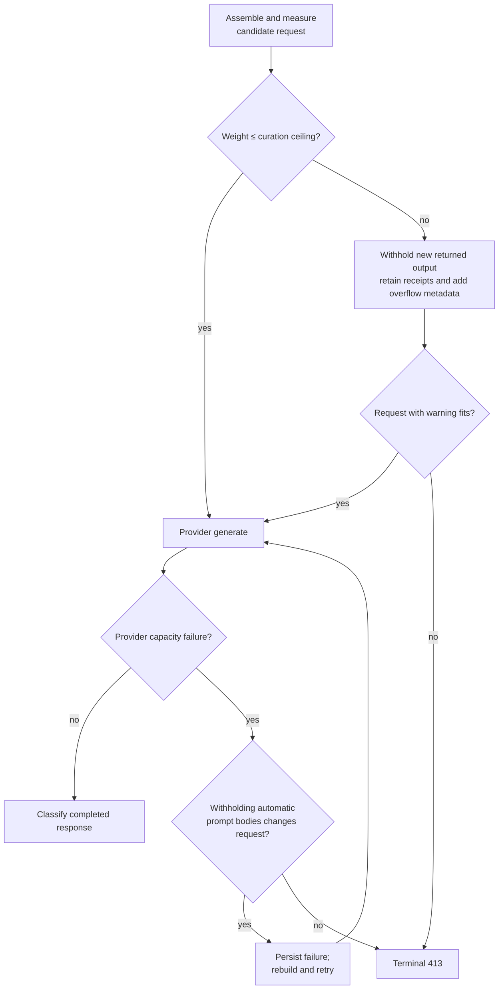

§context-output-selection **First presentation, not a turn-number heuristic, owns admission.** Canonical log-body resolution distinguishes authored input from returned output. Before provider I/O, the run boundary records the first admission turn of each newly visible returned body. On measured overflow, that batch's returned bodies and native parts are withheld together. Already-admitted output, authored NOTE/lifecycle/program/message bodies, actual statuses and Problems, effects, child state, and immutable evidence remain unchanged. Bodyless and initially suppressed rows require no admission. Packet assembly is pure. No recovery turn, generated lifecycle declaration, KILL operation, strike, or extra model attempt is manufactured.

| Projection fact | Meaning |
|---|---|
| No output admission | Not yet presented as returned output; eligible on its first visible request. |
| Admitted | Normal projection, thereafter controlled only by deliberate curation and existing delivery rules. |
| Withheld | Body/native parts stay absent in the original receipt; freeing space does not silently restore them. |

§context-output-receipt A withheld receipt adds `overflow: "N output lines not shown; the log exceeded logTokensMax when this row was withheld"`, counting the output lines its normal current projection would show, not unrelated source lines. Withheld native media is named as `"N output lines and native content not shown; ..."` or, without a text body, `"native content not shown; ..."`. Its original result status and Problem are unchanged. FORK inherits admission state with the copied log. Explicit KILL still controls readable/active content independently.

§context-output-warning **New omission escalates the one curation warning.** The admitting request renders `> [!WARNING]` followed by `> YOU MUST ONLY KILL superseded, stale, or irrelevant log content in bulk.` beneath its JSON readout, replacing the ordinary pressure mandate even when withholding brings usage below 80%. Historical omission alone does not retrigger it. The warning participates in exact packet measurement; optional largest-items entries yield space first.

§context-output-hard-413 **Unfittable retained context fails honestly.** If the request still exceeds the ceiling after withholding newly presented output, it terminalizes with an exact `engine/context/token-budget-overflow` 413 Problem without provider I/O. No unrelated older history or authored memory is pruned. Separately, provider capacity failures follow {§provider-surface-capacity}: withholding automatic prompt-body projection permits a retry only when it changes the request; otherwise the exact provider-owned 413 terminates the request-only model turn.

- §tokenomics-fetch-fits-free **Withholding is not deletion.** The complete result lands once. READ/FIND of its original log address retain the readable body and original coordinates; scoped READ creates a fresh output occurrence subject to the same admission rule. Source resources and forensic evidence remain unchanged. Deliberate scoped KILL, unlike withholding, removes lines from subsequent readable projections ({§log-readable-projection}).

- §loop-terminals **Lifecycle outcomes are HTTP-precise.**

  | Status | Outcome |
  |---|---|
  | 100 / 102 | Queued / running |
  | 202 | WAIT or an eligible final response joining a live obligation ({§wait-obligation-matrix}, {§worker-wait-timing}) |
  | 200 | Messages answered, results observed, held work settled |
  | 499 | Worker-scope or client cancellation |
  | 429 | Turn allowance exhausted |
  | 413 | Token-ceiling recovery failure or provider input-capacity failure after changed-request recovery |
  | 500 / 508 | Strike threshold or invalid-emission exhaustion / crossing strike caused by a cycle |
  | 504 | Loop timeout or exec-timeout restamp |

  An empty WAIT continues at 102. The exact terminal result retains its Problem;
  status classes are not catch-all replacements for that evidence. No failing status
  here is ever softened because the model wrote something the harness could not read;
  every one of them cites it instead ({§terminal-evidence}).

### §env-delta The environment delta: what changed since the model last looked

Catalog FIND results ({§packet-catalog}) state what existed when observed. The
environment delta supplies structurally addressed activity without copying the
workspace into every worker's private state.

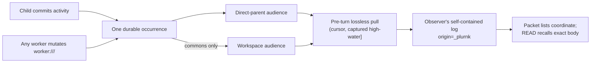

§env-delta-log-pull **Pull the event record, never a world snapshot.** At
pre-turn, a worker materializes only occurrences whose structural audience
includes that worker. The set is exhaustive, unranked, and exactly once; the
engine makes no relevance decision. Each copied event retains the operation,
result, and typed attributes.
Every producer appends to one workspace-scoped occurrence journal with a
monotonic identity. A pull captures one closed `(worker cursor, high-water]`
interval, materializes each addressed identity idempotently, then advances the
cursor only after the whole interval is durable. An event racing the capture is
therefore in this interval or a later one, never neither or both. Source-log
curation cannot erase the occurrence record.

The cursor is observation progress, not a private copy of resource contents. A
fresh worker captures the current high-water when its worker row is created, so
pre-existing broadcast history stays out while later occurrences remain
deliverable even before its first packet. A fork instead copies the parent's
cursor and captures its own fork high-water atomically with worker creation
({§machine-processes-fork-pending-activity}). Observer rows retain the source
identity and never publish another occurrence. Newly materialized ambient and
terminal-stream rows emit the ordinary client notification
({§notifications-log-entry-notify}) before the next inference; an idempotent
pull does not emit an existing row again.

§env-delta-worker-entry-visibility **The commons is global; every other
resource follows lineage.** A successful state-changing `EDIT`, `COPY`, `MOVE`,
entry-path `KILL` whose landed effects touch `worker:///...` acquires the workspace
audience and retains the commons address in its observer row. Mutations to
`worker://<worker>/...`, named worker spaces, project files, and remote resources do
not broadcast. When authored by a child, their
ordinary operation evidence still reaches that child's direct parent.

| Producer / event                                      | Durable occurrence                                                                                     | Observer projection                                                                                                                |
| ----------------------------------------------------- | ------------------------------------------------------------------------------------------------------ | ---------------------------------------------------------------------------------------------------------------------------------- |
| §env-delta-child-activity Direct-child activity       | Child-authored final EDIT, COPY, MOVE, SEND, executor invocation, WORK, FORK, and targeted non-log KILL receipts, including failures. `_plurnk` initialization, maintenance, and operation turns stay with the worker. A reply already delivered to the parent uses its reply occurrence instead ({§message-reply-delivery}). | Direct parent only; one exact attributed row born body-suppressed. Incoming message projections ({§message-arrival}), successful targetless SEND without delivery ({§send-response-receipt}), NOTE, READ (including executor-output READs), FIND, BARE, WAIT, parameterless KILL, and log KILL never create activity occurrences. Provider reasoning, calls, rejected emissions, and turn sources do not cross automatically. |
| §env-delta-child-termination Direct-child termination | The child's exact terminal loop result, except loops containing only `_plurnk` operation or maintenance turns. A conclusion before the first turn still reports, including failed spawns. `source` names the actor; the READ selects the exact loop ({§loop-answer}). | Direct parent only; bounded, initially visible READ under {§worker-scheme-collect}, never the child's potentially newer loop. Excluded administrative loops create no pending child-result edge. |
| §env-delta-commons-mutation Commons mutation          | One successful resolved operation whose landed effects touch `worker:///...`.                         | Every existing worker; one body-suppressed row per observer, deduplicated with any lineage audience.                               |
| §env-delta-filesystem-narration Project-file divergence | Runtime-owned reconciliation evidence remains in the runtime actor's own log.                        | No ambient observer row. Current content remains addressable and stale hash edits reject at their owned boundary.                 |
| §env-delta-entry-materialization Executor `entry()` sink | The runtime records typed materialization evidence under its owning actor.                           | No ambient observer row unless the resulting operation itself is direct-child activity or a commons mutation ({§exec-entry-sink}). |

§env-delta-attribution **Ownership, authorship, and cause are independent.**

| Field       | Meaning                                                                                                                                                                                 |
| ----------- | --------------------------------------------------------------------------------------------------------------------------------------------------------------------------------------- |
| `worker_id` | The worker whose self-contained log owns the materialized row.                                                                                                                          |
| `origin`    | The actor tier that wrote the row; a materialized delta is `_plurnk`.                                                                                                                   |
| `source`    | The attributed actor or subsystem: a lineage or commons observation uses canonical `worker://<producer>`; a subsystem observation may use its stable token (for example `file`). Self-authored rows omit it. Stream invocation correlation belongs to the subscription/publication relationship, not this field. |

§env-delta-no-coalescing **Activity is never coalesced.** Each eligible child
action and each commons mutation has one occurrence identity. Combining
them would destroy causal order and conflate event replay with a state
comparison.

§env-delta-passive **Passive observation never forces a turn.** Deltas materialize only
while a packet is already assembling. Intermediate child activity and commons
broadcasts therefore cannot wake an idle worker. Urgent directed communication
uses the voice door ({§actor-boundary-two-doors}); child conclusions and addressed
replies use {§worker-lifecycle-child-wake} and {§message-reply-delivery}.
Stream progress remains owned by {§exec-stream}.

---

## §packet Packet shape

§packet-markdown **The packet's Markdown projection, owned here since the packet
projection package retired (#626).** Core renders the transformed section list
into one system string and one user string. Within each slot, list order is
preserved. A nonempty section with a header renders as an H2 immediately followed
by its JSON object/array content; non-JSON content has one blank line after the
header. A null header renders only its content. Empty content is omitted, trailing
newlines are removed from each section, and rendered sections are separated by one
blank line. Any node whose content is empty is absent from the wire, except the
child-orientation sections, which state emptiness as `[]` ({§packet-empty-sections}).
Core owns the order at {§packet-cache-monotone}; a trusted plugin may transform the
section list before rendering ({§packet-plugin-transform}). The projection preserves
the evidence section owners supply: paths, URI fragments, log coordinates, scopes and
coordinate-prefixed body lines remain usable without translation; curation and log-row
measurements stay attached to what they measure ({§tokenomics-agnostic-ruler});
statuses, Problems, body visibility and bodyless rows render as produced, never
upgraded or suppressed; operation examples remain typed fences and log records keep
their boundaries ({§log-wire-format}).

| Default section | Slot   | Wire form                                                                                     | Semantic owner                  |
| --------------- | ------ | --------------------------------------------------------------------------------------------- | ------------------------------- |
| `definition`    | system | Bare `plurnk.md`; no wrapper heading                                                          | {§definition-table-projection}  |
| `system-policy` | system | Authored Markdown                                                                             | {§policy-sections}              |
| `inject`        | system | Authored Markdown                                                                             | {§packet-inject}                |
| `log`           | user   | Markdown H3 records with JSON metadata                                                        | {§log-wire-format}              |
| `worker`        | user   | JSON `path` with the literal Worker address, `parent` (address or `null`), `loop`, `turn`     | {§packet-current-turn}          |
| `delegation`    | user   | JSON `{workers, streams}`                                                                    | {§child-orientation}            |
| `errors`        | user   | JSON status/log-path pointers                                                                 | {§operation-results}            |
| `notices`       | user   | Terse observation bullets                                                                     | {§notice-drain-on-read}         |
| `git`           | user   | Working-tree state in a NOTE blockquote                                                       | {§packet-cache-monotone}        |
| `budget`        | user   | JSON curation usage and ceiling; pressure guidance when needed                                | {§tokenomics-neutral-telemetry} |
| `messages`      | user   | JSON pointers to the loop's unanswered immutable messages, path and source                    | {§message-arrival}              |
| `recap`         | user   | Optional authored operational recap                                                           | {§recap}                        |

§packet-stored-shape **A model packet preserves the rendered request and, only
when an emission is admitted, its response.** Core assembles and measures the
request under {§packet-assembly}. An admitted response extends that same record
before the turn closes; a failed provider call or exhausted invalid emission
leaves the request-only record, while rejected exchanges remain in their
`inference_calls`/`model_calls` evidence with classification in
`turn_attempts`.

| Turn state                    | `turns.packet` (the bag) + `turn_sections` rows  |
| ----------------------------- | ----------------------------------------------- |
| No admitted model request (including initialization and local capacity rejection) | SQL `NULL`, no rows |
| Request assembled             | `{ weight, attributions }` + the sections as items |
| Response admitted             | `{ weight, attributions, assistant, assistantRaw }` + the sections as items |

§packet-items **Sections are rows over content-addressed items; the bag never holds them.**
Every rendered block — one log row's record, one non-log section's content — is stored once in
`packet_items` under the SHA-256 of its text (`sha256`, a registered function), and a turn stores
its composition in `turn_sections` and `turn_section_items`: the ordered sections and, per
section, the ordered item hashes. A section's content is its items joined by one blank line, so a
log row whose rendering did not change between turns hashes to the same item and a turn's durable
cost is its new and changed items — the copied prefix of the previous packet is transient data and
is never written. The write is one statement: an INSERT into the `turn_inference_evidence` view,
whose INSTEAD OF trigger refuses a turn that is not an open model inference turn and lands the
items, the composition, the bag, and the provider metadata together. Readers of a whole packet
select from `turn_packets`, which assembles `sections` back into the bag byte for byte (the digest,
and every test that inspects a stored packet); statements that need one field read the bag
directly with `json_extract`. A packet transformed by a plugin, or any non-log section, is one
item. Items no composition references are transient data: `retention_collect_packet_items`
collects them under the retention policy ({§retention-policy}), which is how a deleted worker's or
workspace's packets release their space while shared items survive. A fork copies the composition
and shares the items ({§worker-fork-trigger}). A database written before this shape has no
`turn_packets` view and is recreated, never read, under {§db-schema-baseline}.

| Field                   | Presence                         | Contract                                                                                                                                                                      |
| ----------------------- | -------------------------------- | ----------------------------------------------------------------------------------------------------------------------------------------------------------------------------- |
| `weight`                | Every assembled model request    | Curation weight of both rendered request slots. Admission does not change its meaning; it is never response weight or provider usage.                                          |
| `sections`              | Every assembled model request, as rows ({§packet-items}); assembled back into the bag by `turn_packets` | Ordered post-transform request sections. `PacketWire.renderSlot` groups them into system and user messages, and the digest re-renders those stored sections byte-for-byte.     |
| `sections[].weight`     | Every stored section             | Independently measured curation weight of that section. Their sum is not the rendered request weight because slot separators and independent rounding remain outside each row. |
| `assistant.content`     | Admitted response only           | Accepted model content from which operations were parsed.                                                                                                                     |
| `assistant.ops`         | Admitted response only           | Parsed operations admitted from that content.                                                                                                                                |
| `assistant.reasoning`   | Admitted response only           | Normalized readable reasoning text, or `null`.                                                                                                                               |
| `assistantRaw`          | Admitted response only           | Opaque provider-owned transport record retained for forensics; `null` when the provider supplies no raw record.                                                               |

`StoredPacket` is the one core type and validation path for this algebra. The
flat schema enforces its root states; typed reads additionally validate every
section and parsed operation. A hard budget stop remains request-only. Client,
setup, filesystem-narration, and executor-materialization turns are ordinary
operation turns and therefore store `NULL`. Digest projects exact operation
source independently from this optional model-exchange record; a request-only
turn receives a note instead of a fabricated response.

§digest-turn-artifact-identity **Digest packet artifacts project durable turns.**
After selectors are applied, digest retains every turn with exact program source, a
valid stored provider request, or malformed stored packet evidence; orders those
turns by durable chronology; and names them contiguously from `packet000`. The
producer does not affect projection.

| Artifact | Present when | Authority |
|----------|--------------|-----------|
| `packetNNN.assistant.md` | The turn has an `ops` source | Exact `turn_sources.content`, independent of log rows |
| `packetNNN.system.md`, `packetNNN.user.md` | The turn stored a provider request | Stored text sections projected through `PacketWire`; native parts are not Markdown |
| `digest.json` turn `attachments` | Every turn | Stored native attachment descriptors; `[]` means a request without attachments, `null` means no valid stored request. Selection is not proof of provider acceptance. |
| `packetNNN.assistantRaw.json` | The request has an admitted provider response | Stored opaque provider response |
| `packetNNN.response.md`, attempt artifacts | The request received no admitted response | Stored request and attempt state |
| `packetNNN.packet.raw.txt` | The stored packet fails typed validation | Exact stored packet text |
| `packetNNN.packet.invalid.json` | The stored packet fails typed validation | Turn identity and complete validation error chain |

A source-backed turn without provider participation therefore produces only
`assistant.md`; a request-only turn produces no fabricated assistant. A
source-less programmatic turn with no provider request has no forensic payload
to project and reserves no ordinal.

The external tokenless draft and transformation boundary is owned by
{§scheme-packet-transform}. Core alone extends each validated draft with its
measured `weight` field for storage. #74 tracks coverage that mistakes the sum
of section weights for the rendered request weight.

§definition-table-projection The authored `plurnk.md` remains human-aligned. Its `definition` section deterministically removes Markdown table-cell padding and shortens separator cells to three dashes before plugin transforms, measurement, storage, and wire rendering; alignment colons survive, while fenced blocks and all non-table whitespace remain exact.

§lexicon **Vocabulary follows the standard of its audience.**

| Layer                    | Rule |
|--------------------------|------|
| Operator, wire, storage  | Use the applicable industry term. Provider quantities follow the OpenAI vocabulary where it is standard: `contextWindow`, `reasoning`, `completion`, `finish_reason`, and usage nouns. |
| Core lifecycle           | Use the exact Workspace → Worker → Loop → Turn → Op hierarchy in {§lifecycle-terms}. An AG-UI Run or thread is always protocol-qualified. |
| Model-facing packet      | Use the model's training distribution: operations mirror HTTP and shell, while log records use ordinary Markdown headings, strict JSON metadata, and text coordinates. Renaming this vocabulary to internal API terminology would discard useful resonance for a standard the model never sees. |

| PLURNK-native term             | Why it remains |
|--------------------------------|----------------|
| `worker` / `loop` / `turn`     | The process hierarchy in {§lifecycle-terms}; unqualified `run` names no internal entity. |
| `packet`                       | The assembled address space, a kernel concept rather than merely a provider request. |
| `costUsd`                      | No standard cost field exists; the explicit currency avoids implied units, and the value remains an exact decimal string. |
| `curationWeight` / `curationBudget` | Explicitly distinguish Core's model-independent context-shaping facts from physical provider tokens. |
| the `chars/2` curation ruler   | Model-agnostic by design ({§tokenomics-agnostic-ruler}); it is never presented as a tokenizer. |

Retired terms stay retired: the lexicon guard rejects `thinking`, the unqualified `session` noun, `contextSize`, `decodeBudget`, and moved partition-knob names. <!-- lexicon-allow: this sentence enumerates the retired terms -->

§body-projection **One full body, one readable view, one packet projection.** Every durable log row has one canonical full body resolved from its stored tx/rx envelope by `LogBody`. READ and FIND over `log:///`, persistent search derivation, and packet rendering apply the same deliberate trimming under {§log-readable-projection}. Packet rendering additionally applies initial suppression and these presentation bounds:

| row producer | ordinary visible projection |
|---|---|
| any `READ` or `FIND` | complete selected operation result |
| `NOTE`, `WAIT` | complete literal authored text |
| inbound `SEND` from outside the workspace | budgeted head under {§message-projection} |
| structured `EDIT` receipt or textual `COPY`/`MOVE` effects | complete receipt-owned join context |
| every other nonempty body | head bounded independently by `PLURNK_SERVICE_PREVIEW_LINES` and `PLURNK_SERVICE_PREVIEW_CHARS` |
| bodyless row | metadata only; no coordinate lines; `logTokens` includes any selected native part |

§markerless-first-page **Every markerless retrieval takes the same implicit marker.** A marker's
unit is whatever its projection counts, so `PLURNK_SERVICE_PREVIEW_LINES` is the first page of
all of them: lines of text, bytes of a byte view ({§read-bytes}), positions of a FIND. It is one
choice with one home; no operation carries a page size of its own.

Markerless text READs select their page with the same line/character bound as
ordinary previews, before result storage and packet rendering. Explicit scopes
remain exact. Automatic stream delivery uses that markerless selector too;
its range or region describes the selected content and the complete stream
remains addressable. This selection is not a second rendering-time cut.

READ and FIND own their range or pagination before packet rendering; the packet never applies a second hidden substring bound to their selected result. NOTE and lifecycle bodies are complete literal text while visible, never preview-clipped. Reasoning arrives through ordinary scoped READs ({§reasoning-history}). Arrivals from outside the workspace follow their separate adaptive projection contract ({§message-projection}). Structured mutation contexts already carry the receipt-owned bound in {§edit-result-receipt-truth}, so packet rendering does not preview them again. Rejected-emission artifacts, SEND/WORK/FORK bodies, execution commands, environment-delta EDIT spans, and extension-produced bodies use the ordinary fixed bound. When a visible projection differs from its canonical body, metadata carries `preview` under {§packet-extent-metadata}; complete and fully suppressed bodies omit it. ```` ```READ (log:///<coordinate>/<OP>) ```` selects untrimmed lines in original coordinates under {§log-readable-projection}; the unsuffixed exact shorthand and authoritative suffix behavior are defined by {§log-coordinate-hierarchy}. ```` ```FIND (log:///...) ```` and search match that same readable view. System/policy sections are not log bodies. Notices are transient non-log observations; they share the ordinary line/character bounds but have no durable body or recovery URI.

§message-arrival **A message source, its log observations and its reply state are distinct.**

| Fact | Owner | Curation effect |
|---|---|---|
| Accepted body, attachments, address and causal source | Durable inbox message | None; ordinary READ/FIND/COPY can recover the source. |
| Arrival seen at a turn boundary | One inbound SEND log row, `origin="_plurnk"`, `attrs.kind="message"` | Ordinary KILL can trim or remove this observation. |
| Answered messages | Successful executed reply, {§send-response-receipt} | None; curation cannot retract delivery. |

Every accepted message enters its recipient loop's inbox in arrival order, with its selected
paths, and publishes exactly once at the next turn boundary. **Open Messages** lists the
unanswered messages by their immutable source address (`path`) and optional causal `source`,
not a log coordinate. Each arrival receipt's `resource` names that same retained source.
Trusted protocol modules supply message addresses in their own scheme;
native arrivals use `message://<recipient>/<opaque-id>`, separate from the worker's
actor and scratch addresses. Ordinary worker scratch remains writable. Source bodies
are not edited or deleted through resource operations; independently curatable READs and
arrival rows obey {§log-readable-projection}. No curation operation answers a message.
Within a workspace an address identifies exactly one accepted message. Reusing it for
another admission is a 409 conflict, not a second message or an implicit content update.

§message-reply-delivery **A reply is delivered once, not re-enqueued as a request.**

| Audience | Delivery | Effect |
|---|---|---|
| Assigned worker | Its conversation, even when another actor answered | Visible reply; wakes eligible parked work without a new Open Message or loop. |
| Original native sender | That worker, if distinct from the assigned worker; original delegated-task answers use {§worker-scheme-collect} instead | Other replies use the same wake and observation path. |
| Exterior sender | The assigned conversation's protocol adapter | The adapter delivers the answer through its standard message channel. |
| Replying actor | Its own executed SEND | No duplicate ambient occurrence. |

The successful SEND and its addressed occurrences commit together. Reply occurrences use
the ordinary durable ambient cursor and wake revision; curation cannot revoke delivery or
replay it. An addressed reply replaces the same parent's generic activity observation.
The child's reply to its original parent-delegated message reaches that parent once,
through the conclusion READ under {§worker-scheme-collect}; it is not a separate reply
occurrence. Other replies remain ordinary messages. The exact loop remains addressable
under {§loop-answer}.
Unobserved replies prevent conclusion just as unobserved child results do. All operation
producers notify the same settlement path after durable execution; reply wake-up shares
{§worker-optimistic-settlement}, without delaying the replying program.

§message-short-identity **The model addresses a message by its short name.** Every message carries
`message://<worker>/<key>` (`key_path`), the form the worker docs teach, and that is what the packet
shows in Open Messages and in an arrival row's `resource`. A client's own identity for the same
message — an AG-UI message UUID, an A2A address — stays the durable `path` that correlation,
delivery and reply accounting use, and remains addressable in its own scheme; the short form is an
additional alias. Answering either reaches the same message. Origin (operator, 2026-09-18): the
packet showed a 77-character `agui://anonymous/threads/…/messages/<uuid>` twice per open message,
while the docs taught the short form.

§message-causal-source **Message authorship and delivery are distinct facts.** The harness publishes every arrival row; the row's `source` carries the canonical address of the causal actor. Native WORK, FORK, and directed worker SEND derive `worker://<sender>` from the authenticated sender worker ID. A trusted exterior adapter supplies its own canonical actor address through {§methods-loop-run}: the AG-UI bridge names the client's message under `agui://` ({§agui-run-source}), the inbound A2A adapter under `a2a://`. An absent source means the owning worker itself. Attribution persists with the message through the inbox, parking, orphan recovery, restart, and later log projection; model syntax cannot author it. The wire renders the row's `source` and omits its `origin`, which is constant for every arrival; the Open Messages pointer carries the same source ({§message-arrival}) — except where the source is the transport that minted this very message, which says nothing the address does not ({§message-short-identity}).

§message-projection **Message storage is unbounded by model context; automatic materialization is not.** Core persists every accepted message completely before packet assembly. The selected provider's derived `inputCapacity` and the alias-resolved percentage from `PLURNK_SERVICE_PROMPT_PROJECTION` derive one aggregate curation-weight allowance for the visible bodies of arrivals other than a peer worker's — every `source` that is not a `worker://` address, the loop's own assignment included. Complete bodies render when their aggregate weight fits. Otherwise all such visible rows share the allowance: full bodies consume only their required share, unused shares are redistributed, and partial bodies render the largest leading complete-line region that fits their share or an exact character-bound prefix when the first physical line alone is larger. The sum of their rendered body weights never exceeds the allowance. Every partial body carries `preview` under {§packet-extent-metadata}. The row remains complete and READable by coordinate; its `log:///` body additionally obeys deliberate curation under {§log-readable-projection}. A peer worker's message takes the ordinary bounds. When provider input capacity is unknown the percentage is underivable, so arrival rows retain the ordinary bounded projection rather than inventing capacity. This policy never rejects, summarizes, or discards a message because it exceeds a context window.

§message-loop-containment A loop contains every message that arrives before it
concludes; the next turn boundary publishes every inbox row the loop has not yet
published, oldest first, and stamps each with the row it became. Ordinal 1 is the loop's
own assignment and shares the loop's fate: a loop that fails before its first turn does
not replay it. Every other still-unpublished message at conclusion moves into one
source-keyed recovery loop, renumbered from its first, whose headline it becomes; that loop's first turn publishes the complete
ordered set exactly once. Recovery retries complete the same queued loop and never
mint duplicate work. Output withholding preserves readable arrival rows; explicit
KILL follows the ordinary log contract.

§completion-defers-to-messages **Conclusion does not cross an unanswered arrival.** The end-of-program check includes messages that arrived during inference. The final database transition rechecks unanswered messages atomically. An arrival that wins the race continues the current loop; one admitted after conclusion belongs to a new loop. Orphan recovery preserves messages accepted before an independently forced termination.

§packet-catalog **Catalogs are query results, not packet state.** The packet
stores no materialized manifest. Complete and one-level entry directories,
their row shape, and their ordering are ordinary FIND projections owned by
{§find-result-projection}; persistent search derivation is a separate index.

### §operation-results Model-facing failures and notices

The model's runtime alert surface has two distinct kinds of information:

- **Turn failures are log items.** A failed action and an engine-rail failure are durable `log_entries` rows whose `rx` is an RFC 9457 operation result. They can be scoped-KILLed, retired, and budgeted like every other row. The `errors` section is a derived pointer index over recent `status_rx ≥ 400` rows; it owns no bodies or failure state. Rejected emissions never become accepted turn content; their private response and admission evidence remains in `model_calls` and `turn_attempts`, apart from the bounded recovery `emissionAttempt` under {§invalid-emission-attempts}.
- **Notices are transient observations.** Progress and non-fatal diagnostics such as `turn_awaiting_model`, `search_progress`, and `grammar_unenforced` may appear once in the packet and broadcast live. They neither substitute for a failure result nor influence scheduling or recovery.

The `log` is durable product truth. The `errors` section points at its failures
while the separate `notices` section displays transient observations. The two
retain distinct contracts and lifetimes.

- §operation-result-uniform-error-channel **One uniform error channel within an
  accepted turn.** Every operation or engine-rail failure — including
  max-commands and premature completion — is a `log_entries` row with
  `status_rx ≥ 400` and an RFC 9457 Problem Details operation result in `rx`.
  There is no per-category handling or bespoke ephemeral relationship. The
  `errors` section is a derived index over those rows from the current and
  immediately prior turn: one `{status, path}` JSON object per row,
  nothing else. The Problem lives on the curatable row and is READ via the path.
  Withheld output preserves its original result ({§context-output-receipt});
  an unfittable retained context fails before inference ({§context-output-hard-413}).
- §log-row-self-explains **Every ≥400 pointer names a record that states its
  why.** A model-operation failure is the model's own operation result; its
  Problem Details `instance` retains the originating occurrence URI; when absent,
  persistence assigns that row's `log:///` URI. Packet wire renders
  the contracts-owned compact `{§problem-projection}` on its meta line whether
  its body is visible or suppressed. The enclosing row owns status, model-facing path, source, and target;
  an identical extension is not repeated inside the projection. No
  separate item is minted for operation failures. Actionless engine rails mint
  `op='error'` items because no authored operation row exists. Invalid provider
  emissions are outside this channel because they are not turns. A bare
  failure status, a top-level string `error`, or mismatched result/problem
  statuses violate the producer contract and fail hard. Genuine
  engine-internal faults crash and never mint model-facing rows.
- **Asynchronous work does not weaken the contract.** A stream-producing operation returns its initial `102` after acquisition. At conclusion the subscription stores the exact universal terminal result; `stream/concluded` carries it unchanged; the next ambient terminal READ merges it with the stream payload and preserves its Problem instance, assigning the committed `log:///.../READ` URI only when absent. Timeouts and service cancellations replace the complete terminal result with a new valid 504/499 Problem—they never mutate a status while retaining a contradictory Problem.
- **Self-explaining rows.** A problem `title` names the stable class and `detail` states the occurrence-specific cause. Producer-known operands belong in factual extensions. `stage` appears only when neighboring stages imply different recovery; `recovery` states one generally valid next action; `retryable` is true only when the producer recommends automatically retrying the identical request. Unknown recovery or retryability is omitted rather than guessed. General workflow teaching stays in the packet rather than being duplicated into every failure. The runtime-neutral writing contract is owned by `@plurnk/plurnk-contracts`.
- **Exact Problems cross durable and external boundaries.** Scheme capabilities, proposal application, subscription conclusion, loop settlement, AG-UI, clients, digests, and benchmark records preserve the originating Problem object. The model packet alone derives `{§problem-projection}` without mutating that object. An adapter may add a missing durable `instance`, never replace an existing one; it must not rebuild failure truth from `status`, `detail`, `RUN_ERROR`, a scheduler projection, or a legacy string. A failed boundary without a valid Problem is a contract violation and fails hard.
- **Caught diagnostics are bounded.** Core-owned Problems may include a bounded preview of a caught runtime diagnostic when it states the occurrence-specific cause. `PLURNK_SERVICE_ERROR_DETAIL_LIMIT` owns that model-facing character bound; complete errors remain in daemon diagnostics. Input validation and stable contract failures do not spend this allowance on implementation text.
- §notice-drain-on-read **Notices** - the few observations that are not log rows render one terse line under their distinct `## Notices` section, never a JSON dump. Packet rendering normalizes whitespace, bounds the producer message with the shared preview limits, and appends any typed position. The notice buffer drains on read; event Notices appear on at most one packet. Stateful derivation progress and provider availability coalesce in the buffer, so clients observe every checkpoint live while a later model packet receives only the current state under ordinary level filtering.
- §rail-accounting-private **Rail accounting is private.** Visibility is owned by {§engine-rails}: the model sees concrete failures from admitted turns, never rejected emissions, attempt counts, the strike streak, or cycle detection. Surfacing internal state creates a gamification surface where the model optimizes for engine metrics instead of the task.

**The error rows (one channel) + the only non-log notices:**

| failure | row | status |
|---|---|---|
| action failure | the failed op's own row; the owning scheme supplies Problem Details | 4xx/5xx |
| provider input capacity | `op='error'`, origin `_plurnk`, source `provider`; exact provider-owned `capacity-exceeded` Problem Details | 413 |
| max commands exceeded | `op='error'`, origin `_plurnk`, source `rail`; `engine/rail/max-commands-exceeded` Problem Details | 429 |

| notice `kind` | Source | Position |
|---|---|---|
| `grammar_unenforced` | engine rail verdict, or a forwarded provider transport anomaly such as a discarded-channel escape | content-offset when the observed position maps into content; none for a reasoning-prefix divergence |
| `parse_advisory` | grammar parser — recoverable near-miss which did not invalidate the parsed statements | content-offset into the model's emission |
| `search_progress` | repository materialization/indexing lifecycle ({§persistent-search-index}); structured phase, count, and percent; `level: info`, `warn` when a completed pass carries failed members ({§derivation-member-failure}), `error` on terminal failure | none |
| `git_inspection_refused` | engine membership — automatic Git inspection refused a supplied repository whose config declares a `filter.*` program ({§membership-git-hermetic}); names the key; `level: warn`, once per workspace until the key changes or clears | none |

§notice-level **Severity on the wire (`level`, required).** Every `Notice` carries `level: "error" | "warn" | "info"`, set by the **producer** at the emit site. The level is client presentation, not operation status: even an `error` notice cannot terminalize work or substitute for a durable Problem. A forwarded `grammar_unenforced` is `warn`; ordinary lifecycle and progress notices are `info`. Clients color straight off `level` without interpreting the open `kind` vocabulary.

§operation-result-no-error-scheme Private strike and cycle accounting stays engine-internal ({§rail-accounting-private}). Every failure within an accepted turn - a bounded parse error, failed action, or engine rail - is a LOG ITEM (`log:///<coord>`, `status_rx ≥ 400`) with Problem Details, independently curatable and exactly READable while active. The `errors` section surfaces a derived pointer to each. Rejected emissions stay in the forensic model-call and admission relations. There is **no bespoke `error://` scheme** and no ephemeral per-category failure buffer.

§notice-event-notify **Client surface.** Engine Notices broadcast live via the `notice/event` notification — `{ workerId, loopId, notice: { source, kind, level, message?, position?, …kind-specific } }` per the grammar's `Notice` schema — the moment they land. A loop Notice names its owning Worker; workspace derivation progress alone carries `workerId=null, loopId=0`. AG-UI projects the same observation as the custom `plurnk.notice` event. Failures do not broadcast on this surface: they are log rows, and the client reads them through `log.read` / the `log/entry` notification, the durable log.

§digest-programmatic-surface **The digest is an importable forensic surface.**

| Surface                                | Contract                                                                                                                                            |
| -------------------------------------- | --------------------------------------------------------------------------------------------------------------------------------------------------- |
| Import `@plurnk/plurnk-service/digest` | Ships `Digest` and its package-owned SqlRite statements; importing performs no I/O or process action. The CLI wrapper alone invokes it.             |
| `run({ dbPath })`                      | Reads the required database and writes a complete digest to `./test/digest` relative to the caller's working directory.                             |
| `digestDir`                            | Selects a nonempty output directory. Both `run` and `requiem` refuse an output containing the input pathname or its resolved database before database/provider I/O or output writes; normalized and real paths participate in that check. `run` removes and recreates output so stale artifacts cannot survive; concurrent callers use distinct directories. |
| Reader lifetime                       | Both methods close their database reader on successful or failed reads, before rendering output or awaiting witness inference. |
| `workerId`                             | Narrows workers and every dependent loop, turn, turn-attached logical inference, specialization, physical request, and log row to that one worker. |
| `workspaceId`                          | Narrows workers plus every logical inference and dependent evidence owned by one workspace, when both selectors are present they intersect. |

§digest-cost-kind **Cost basis named.** A rendered Cost line carries the basis of its dollar figure: `(charged)` only when every settled request's cost is provider-charged; `(estimated — catalog rates)` when any settled request's cost is an estimate, because a mixed sum is no more trustworthy than its weakest term. A dollar figure without its basis reads as billed truth, and an estimate must never impersonate a charge.

§output-allowance-notice **The output allowance is disclosed, and a ceiling cut names its cause.** The packet's budget section carries `tokensResponseMax: <tokens>` beside the curation ceiling whenever the provider resolves an output budget — the per-turn response allowance is a capacity fact, disclosed rather than discovered by truncation. The disclosed number is the program's guaranteed room — the configured output floor less the reasoning subset, since reasoning spends from the same allowance — never the wire grant: overflow tolerance (#482) is never advertised in the packet, and a cut's notice names the true per-call grant from the response's own capacity record. When a provider finish is `length`, the engine emits an `output_truncated` notice (source `engine:capacity`) naming the allowance — the fact alone, never advice on what to do about it — on every path — railed or not — and the rails verdict never blames the model's grammar for a cut the engine's own ceiling made. The same precedence governs a cut so deep no operation parses: the rejection notice names the truncation as the cause, not the parser's symptom, overriding {§invalid-emission-attempts}'s parser diagnostic for `length` finishes.

§digest-wire-line **Wire health aggregated.** Each worker summary renders a `Wire:` line — total physical provider requests, error-outcome count, and the error percentage when nonzero. Provider-level failures are absorbed by retries below the packet stream, so without this aggregate a rate-limit storm is invisible in every summary while the model's experience stays clean.

§digest-forensic-fidelity **Forensic fidelity and cardinality.** The digest's machine-readable JSON preserves every log event with its initial and current projection, causal `source`, and structured `attrs`; every exact log-KILL target effect; the exact Problem on every failed row; each loop's exact terminal result, settlement time, scheduled due time, recurring interval, and recurrence lineage; and every ordered physical provider request. Programs still produce chronological `assistant.md` artifacts after every READ receipt is KILLed; source is independent of log curation. Each stored packet validates independently: one malformed historical packet remains exact raw evidence with its complete validation error chain and never prevents healthy turns from being projected. Accounting on broader rows is the shared exact derivation from that ledger, never a second stored fact. A worker's Cost line names how many settled requests carry no usage at all (errored or aborted exchanges) — their server-side spend is unrecorded rather than silently priced as zero. The reasoning chronology distinguishes readable reasoning content from provider-reported reasoning usage: when tokens were reported but no readable content was returned, it states both facts instead of implying that no reasoning occurred. The human Markdown waterfall shows a present causal source and may preview only the Problem detail because it remains a triage projection, not the machine record. Targets reconstruct the model-visible address, including hostname, port, serialized query, and fragment; an authority-bearing URL must never degrade from `https://host/path` to `https:///path`, and durable resource coordinates render back to their authority form. Its human Markdown waterfall groups identical per-turn op outcomes and typed `entry_materialized` narrations, reporting the exact count and sequence span (`xN (seq A-B)`). Grouping keys include source and the complete target, so distinct causes, authorities, or channels never collapse. Thus amplification is conspicuous without making the diagnostic artifact itself pathological; valid packet files remain byte-identical records of what the model saw.

Unrecognized actionless log rows are retained and labelled as such, not
interpreted as executable turnOps or allowed to prevent the remaining digest.

§digest-executor-evidence **A red command is work, not a defect.** Engine-materialized
completion rows for a failed command carry the executor's problem identity
(`https://problems.plurnk.xyz/executor/*`), and the digest classifies them as
evidence: they render like any row but never count toward a loop's error total,
its health verdict, or the per-turn `errs=` badge — a loop that concluded green
over red test runs is CLEAN, not DEGENERATE-WIN. This is the digest mirror of the
strike rail's exemption ({§engine-rails}, #425 F1): structural violations count,
executor evidence never does.

§digest-requiem **A requiem is an out-of-band forensic interview, not a worker
turn.** It cannot execute operations or alter the audited history.

| Aspect    | Contract                                                                                                                                                        |
|-----------|-----------------------------------------------------------------------------------------------------------------------------------------------------------------|
| Scope     | One interview for each worker with model-bearing inference turns; workers without inference evidence are omitted.                                                |
| Evidence  | The worker's final packet plus every attempt's exact normalized response and admission evidence; opaque raw transport remains in durable forensic artifacts. Quoted evidence is budgeted to the witness window ({§digest-requiem-evidence-budget}). |
| Witness   | An explicitly supplied provider or the active configured provider; absence fails hard.                                                                          |
| Identity  | The worker's durable provider identity ({§worker-provider-identity}) is sent as the `workerId`, without asserting a live worker topology. |
| Attempts  | One call at `PLURNK_SERVICE_REQUIEM_MAX_TOKENS`; only an empty length-limited response receives one retry at `PLURNK_SERVICE_REQUIEM_RETRY_MAX_TOKENS`.         |
| Artifacts | `requiem.md` carries testimony and exact nullable USD accounting. `requiem.json` is durably materialized before each call and preserves logical call state, messages, normalized responses, every physical request's state and accounting, and their shared aggregate projection. |

§digest-requiem-evidence-budget **Quoted evidence fits the witness.** The
interview's user message is budgeted against the witness provider's context
window minus the retry output allowance and system framing (chars/2, the
capacity gate's own estimator). Overflow elides the oldest provider attempts
behind an explicit `elidedOldestAttempts` count marker, never silently; the
final packet and the newest attempts always testify. A windowless witness
(`contextWindow` null) quotes unbudgeted.

§turn-lifecycle **Turn-lifecycle liveness.** Provider generation is the long, opaque window in a turn — one or more same-packet emission attempts may occur before the first committed op. A static client screen there is indistinguishable from a hang. The engine brackets the complete attempt window with two `notice/event` notices (`source: "engine:turn"`, `level: "info"`): `turn_awaiting_model` before the first call and `turn_generated` when an emission is accepted or the attempt budget is exhausted. The completion beat carries the spend ({§turn-accounting-notice}). Rejected content never rides the notice channel. Both are suppressed on an aborted loop and broadcast to the workspace like any notice ({§notice-event-notify}).

§turn-accounting-notice **The completion beat carries the spend.** `turn_generated`
carries the turn's exact settled wire accounting — request count, exact nullable
USD, and token totals across every physical exchange the turn paid for, failed
calls included. It is the shared exact derivation from the ledger, never a second
stored fact, so a live watcher accrues running loop cost per turn (#465).

§notice-content-offset-pointer **Content-offset position.** A non-fatal diagnosis on an accepted emission (for example `grammar_unenforced` or `parse_advisory`) carries `position: { type: "content-offset", line, column }` into the model's exact `ops://<worker>/<loop>/<turn>` source. A bounded hard parse error becomes a durable failed operation whose Problem Details preserve its line, column, source, and parser-owned diagnostic. Hard errors that make the frame untrustworthy remain only with their rejected forensic attempt.

### Executable tool resources

§tools-resource-discovery **Executable capability discovery uses ordinary
Plurnk resources.** No generated tool table rides the system packet. Every
runtime enabled for the current worker with an admitted invocation materializes one
family document at `worker:///_plurnk/plurnk/<runtime>.md`. A general runtime's
document contains its {§executor-tool-document}; a runtime with an exact
{§executor-tool-registry} materializes a compact catalog at the same address. The family document summarizes
the server or runtime, lists every enabled target as a directly copyable
executable fence named for the runtime, with its input preview ({§operation-aside} carries the
target one-liner; no invocation dispatch would reject is ever advertised).
Schema-backed targets link from that aside to
`<runtime>/<percent-encoded-target>.md` beneath the same root. These documents
preserve the full tool description and raw input schema under
{§executor-input-schema-preview}; their nested paths do not contribute extra
Turn0 rows. A schema-backed general runtime uses `<runtime>/input.md`.
Non-schema targets retain supplemental details in family sections.
Tool-result/output schemas remain ordinary evidence, not teaching. Unknown-target
recovery names the published family document through the same path owner as
materialization, including a runtime's declared `resourcesPath`.

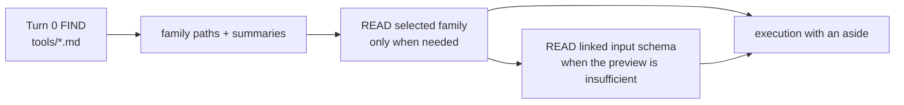

§tools-resource-materialization The runtime registry, workspace capability policy,
tool resources, and dispatch use one effective workspace snapshot. A
disabled, unavailable, detached, replaced, or removed runtime has no
tool resource; an exact registry's empty set publishes no executable family and
admits no invocation. Reconciliation deletes stale documents
before upserting the current set. `PLURNK_SERVICE_DOCS_EXCLUDE` does not hide an
enabled executable; executor enablement is the sole user-configured filter
shared by discovery and dispatch. A runtime declaration may carry
`resourcesPath` — its generated-doc root relative to the workspace's generated
subtree ({§worker-generated-subtree}). Absent, its docs live in the internal
`_plurnk/plurnk` namespace; present (attached MCP families: `/tools`),
the family document materializes at `_plurnk` + that root in the
shared scratch. Turn 0 surveys the families (`FIND
(worker:///_plurnk/tools/*.md)`, one row per
server carrying its summary) and, for each server named in
`PLURNK_MCP_EXPANDED`, adds one FIND over its family document matching the
complete executable blocks (`FIND (worker:///_plurnk/tools/<server>.md)`
with a multiline regex over matching fences), so turn 0 names every tool with its aside and
signature — one row per tool, paged like every survey. Capability attenuation
restricts that matcher to the admitted exact tools. No document is delivered
unasked.
Attached tools are capabilities like every other runtime; the model never
learns an origin.

§tool-document-header-only A registry-less runtime whose declaration carries no
supplemental details (no `docs/<tag>.md`, no inline `details`) is a
header-only document: its summary aside ends with `(invocation only)`, so
the catalog row that advertises it says so and the model is not invited to
READ an empty room. Every runtime and family plurnk ships carries a body.

§tools-summary-invocation A summary featuring one exact enabled tool invocation
includes its compact input signature after literal `\n` when no example body is
already present. Required schema fields use {§executor-input-schema-preview};
authored examples take precedence. Family alternatives and descriptive summaries
remain one compact orientation line, not an expansion of every tool's signature.

§members-functionality **File membership is one workspace Functionality family.**
Core registers the `members` family with the coordinator ({§functionality-coordinator}):
the model, the client, and the operator learn one surface — `list | discover | add |
enable | disable | remove`, `workspace.members.<verb>` for the client,
```` ```members (<verb>) ```` for the model — for what the model may see, exactly as they do for skills and
MCP servers. A definition is one gitignore-style glob, `{ glob }`, relative to the project
root; a leading `!` excludes matching members, and an exclusion wins over every inclusion.
The coordinator's provenance (`service-configuration`, `client-action`, `model-proposal`)
rides the definition; its alias is a short name, suggested from the glob. `list` shows each
definition with what it resolved to — `include` or `exclude`, the pattern, the members it
admits or removes (count and a bounded sample), and for a model's inclusion the matches the
repository's ignore rules refused — so the model sees what its glob did and adapts.
`discover` is introspection, never a catalog: a path answers why it is or is not visible
(tracked, included by which pattern, a creation record, excluded by which `!glob`, ignored,
untracked, absent); a glob previews what `add` would include or exclude. Names only, never
content; nothing is added.

§members-configuration *Available definitions.* The operator's `PLURNK_MEMBERS_<ALIAS>=<glob>`
(`!glob` excludes) and `PLURNK_MEMBERS_ENABLED=[…]` (`[]` enables none) are the
service-origin definitions, the shape `PLURNK_MCP_*` already has; an empty glob, a bare `!`,
or an unknown enabled alias fails the daemon at boot.

§members-model-scope *The model's authority.* A model's `add` is admitted against
`PLURNK_SERVICE_MEMBERS_MODEL_SCOPE` in the file-creation lattice `none < root <
namespace`, narrowed by `settings.membersModelScope` (most restrictive wins). `none`
refuses every model definition — inclusion or exclusion — as `403
members/functionality/model-scope`, naming `git add` and the operator's `/members add` as
the paths that remain; `root` admits patterns inside the root; `namespace`, the shipped
default, admits `../` too.
`auto` loops self-approve proposals, so the ceiling — not the proposal — is the guard
({§membership-baseline}). The coordinator hands `admit` the caller (`action` | `operation`)
so the family bounds the model without a second grammar.

§members-projection *One overlay.* Definitions are desired state per workspace
({§functionality-state}); the workspace overlay (`workspace_constraints`) combines its
enabled definitions: inclusions union and an exclusion wins. Worker creation copies no
membership state; accepted changes reach every worker. Human-authored definitions project with source
`members`, model-proposed ones with source `model`; the same pattern from both keeps
`members`. A `model` inclusion is a pattern scan like a human one but never admits a path
the repository ignores ({§membership-model-universe}). The engine's creation records
(`source: "create"`, {§fs-create-record}) are not definitions: the projection never
overwrites or retires them. Projection happens at the family's publication commit and
re-resolves membership; workspace cooling changes nothing, because desired state is
durable. Each enabled definition is one generated document at
`worker:///_plurnk/members/<alias>.md` ({§functionality-documents}) — its glob, origin,
provenance, and what it resolved to — surveyed at turn 0 like every family's enabled
definitions ({§actor-boundary-catalog-preview}), so the model sees why a file is or is
not a member before it asks. There is no other membership path: the client's `/members`
verbs are these verbs.

§skills-functionality **Agent Skills are one workspace Functionality family.**
Core registers the `skills` family with the coordinator ({§functionality-coordinator});
its adapter owns protocol truth for standard Agent Skills and nothing else. A
definition is `SkillDefinition` — the standard skill `name`, its source
`scope` (`project` = `<projectRoot>/.agents/skills`, `global` =
`~/.agents/skills`, `service` = a host-provided resource tree), and for a workspace-installed skill the standard installer
`source` that provides it. Plurnk seeds no universal root and mutates none
absent an explicit `add`/`remove`.

*Available definitions.* The filesystem is the only truth about installation:
every `<root>/<name>/SKILL.md` directory under the project then the global
root is one service-origin definition, enabled by default, project shadowing
global and then host-provided trees by name; when the standard installer's `skills-lock.json` records a
source it rides the definition. The workspace's durable state owns enablement
({§functionality-state}); a disabled skill stays client-visible and leaves no
model-facing trace.

*Discovery is inert.* `discover {query}` searches the ecosystem registry
(`PLURNK_SERVICE_SKILLS_REGISTRY_URL`, default `https://skills.sh`; empty disables it
with 501 `registry-not-configured`) and returns one candidate per hit with
`registry` provenance and the exact `owner/repo` source. `discover {source}`
lists the skills one standard package reference contains with `source`
provenance. Neither installs, persists, or enables. Client `configuration`
contributes nothing and is refused with 400.

*Admission.* `add {alias, definition}` requires `alias = name`, a `source`,
and a project root when `scope` is `project`; the workspace definition may
shadow a service skill of the same name. The family's aliases use the standard
skill-name grammar ({§agent-skills-name}), including digit-leading and Unicode
names, rather than the coordinator's generic default.

*Preparation.* For each enabled alias the adapter selects the host-provided
tree for `service` scope or locates the directory at the filesystem scope;
a workspace definition whose directory is absent is installed
through the standard CLI (`PLURNK_SERVICE_SKILLS_CLI`, default `npx --yes skills`:
`add <source> --agent universal --skill <name> --yes [--global]`, run with
`HOME` set to the service's user home so the installer's `~` is the global
root) and the installed `SKILL.md` — never the installer's output — is the
evidence.
Each admitted skill requires standard `name` and `description` frontmatter
with `name` matching its directory. A missing, uninstallable, or invalid skill
is `unavailable` with its exact Problem (`skill-missing`, `install-failed`,
`skill-invalid`) under the coordinator's failure policy
({§functionality-model-mutation}); one bad skill never fails the family.

Installer provenance follows the upstream lock locations: project
`skills-lock.json`; global `$XDG_STATE_HOME/skills/.skill-lock.json` when
configured, otherwise `~/.agents/.skill-lock.json`. A lock's source belongs to
its scope, never a same-named installation in another root. Missing locks mean
unknown provenance; malformed or unreadable locks surface their cause.

§skills-resources **A skill is a resource tree, not a rewritten document.**
The family exposes enabled, available {§agent-skills-tree} sources through
`skill://<name>/`. The source owns its bytes; commons entries are demand-loaded
projections, not writable installations. Filesystem skills retain their original
directories; service-provided trees need no generated filesystem directory.
The authority is the name's WHATWG URI representation, including percent-encoding
for non-ASCII names. Installation names remain unchanged; a raw spelling and its
serialized URI address the same resource, not separate skill identities.

| Operation | Contract |
| --- | --- |
| Turn0 `FIND (skill://*/SKILL.md)` | One ordinary resource catalog: name, address, and standard frontmatter description via {§mimetype-summary}. No synthetic index, body injection, or execution. |
| `READ (skill://<name>/SKILL.md)` | Original frontmatter and Markdown, unchanged; relative links remain relative to the source layout. |
| `READ` / `FIND` below the authority | References, scripts, and assets retain their source paths and ordinary pattern, channel, byte, and multimodal semantics. Acquisition observes current source contents, including disappearance. |
| ```` ```runtime (skill://<name>/scripts/program.ext) ```` | Ordinary resource execution and proposal policy; preserve the native file and its siblings under {§exec-source-temporary}. Discovery and READ never execute scripts. |
| Model mutation | Read-only; no EDIT, SEND, or KILL of installed resources. Manage installation and enablement through ```` ```skills ````. |
| Disable / unavailable / remove | Withdraw the authority from new resource access and discovery. Existing log receipts remain historical evidence. |
| WORK / FORK | Use the same workspace Functionality, not copied definitions or resource caches. |

Explicit skill URIs address these resources; bare operation paths still address
project files, with no implicit current-skill directory. Source resolution follows
{§agent-skills-directory}, including installer symlinks and containment of references.
An uninstalled Git skill is not manufactured by repository detection.

§plurnk-skill **Plurnk's own reference is an ordinary service-provided skill.**
`skill://plurnk/SKILL.md` is the standard frontmatter entry point, catalogued with
other enabled skills. It links package-owned configuration, model, and COPY/MOVE chapters,
the complete `.env.defaults` aggregate at `skill://plurnk/.env.defaults`, and the
Worker's existing tool/resource references. No chapter or defaults body is
injected merely because the skill is enabled. The defaults bytes come from the
same {§operator-config-env-defaults} renderer as the operator command, never the
effective environment. Native chapter files retain their owners and locations;
runtime-generated bytes have no invented disk location. Disable/enable,
shared workspace visibility, and project/global shadowing use the ordinary Skills lifecycle.
Service-provided skills are not installer targets; service definitions are
disable-only under {§skills-remove}.

§skills-remove **`remove` uninstalls the workspace definition's installation.** Before the
coordinator forgets a workspace-origin skill definition the adapter removes that
skill from the definition's scope through the standard CLI (`remove <name>
--yes [--global]`), verified by the directory's absence; a failed removal
rejects the mutation. A same-named skill at a lower-precedence root is then
revealed as a service definition, disabled ({§functionality-coordinator}).
Service definitions are disable-only.

§skills-hotload **Out-of-band installers are admitted at the next turn.** The
family keeps one signature of both installed roots, source locations, frontmatter
sources, and installer provenance per resident workspace; turn
admission recomputes it under the workspace gate before packet assembly and
republishes the family through the coordinator when it changed, so a skill
installed or removed by any other tool is discoverable in the first subsequent
model turn while an unchanged set dispatches nothing. The model manages skills
only through the generated ```` ```skills ```` family
({§functionality-model-projection}); it is never taught a package manager.

The catalog and Turn0 describe Functionality under the current workspace
capability policy and service ceiling. A direct denied attempt receives the
same exact 403 from dispatch rather than a second documentation policy.
Optional non-execution operations remain a separate `## Enabled Optional Operations`
section because they are language extensions rather than executable tools.

### Scheme-reference discovery

§schemes-directory Scheme references are ordinary workspace entries at `worker:///_plurnk/plurnk/<scheme>.md`. Turn0's FIND survey projects their summaries ({§worker-initialization-entry}); the model READs details on demand. No Resources section or separate example catalog is injected into the system packet.

| Reference decision | Owning rule |
|---|---|
| Registered and model-visible scheme | Its reference is eligible when at least one supported resource capability is admitted by the effective policy ({§capability-admission}). Illustrative operations never determine admission. |
| Runtime output scheme | Its runtime's reference owns discovery; no duplicate scheme reference. |
| Excluded scheme | `PLURNK_SERVICE_DOCS_EXCLUDE` omits its reference, not its functionality. |
| Reference content | Required meta-owned content follows {§teaching-corpus}; other schemes may supply optional `manifest.documentation`. Absent optional content contributes nothing; a failed required source read surfaces its cause. |
| Policy layers | Materialization, Turn0, and direct operations use the same current workspace policy and service ceiling. |

### §inject system.inject — the operator injection

§packet-inject When `PLURNK_SERVICE_PACKET_INJECT` names a readable markdown file, its content renders as an `## Operator Notes` section in the system slot (definition → policy → inject). Read per-turn so the operator's edits take effect live; a set-but-unreadable path fails the turn hard (a deliberate setting with a broken path is a misconfig, surfaced not hidden). `~/` expands to home. It's the operator-side complement to the plugin section hook — a pressure valve so reshaping the packet edits operator content, never the core. Unset → no section.

### §policy system.policy — the client's policy injection

§policy-sections One section rides the system slot **after the definition**: the contents of `PLURNK_SERVICE_POLICY` (default `$XDG_CONFIG_HOME/plurnk/AGENTS.md`, {§host-path-layout}), with no engine-generated heading. The policy document owns its Markdown structure. Policy is the client's authoritative rules promoted into the privileged zone — NOT a log entry; the model cannot READ or KILL it. A default-absent path is silent (the section is omitted); an explicit override (env set) that fails to read fails the turn hard — a deliberate setting with a broken path is a misconfig, surfaced not hidden. Read per-turn so edits take effect live. The PROJECT `AGENTS.md` is local guidance, not policy: it rides turn 0 as the foisted `worker:///_plurnk/AGENTS.md` entry ({§turn0-agents-stunt}); references and skills use native discovery ({§skills-functionality}).

On first run, and only when `$XDG_CONFIG_HOME/plurnk` itself is absent, the service seeds
`AGENTS.md` from `@plurnk/plurnk-meta/POLICY.md` ({§teaching-corpus}).
It reads that required source before creating the service home; a failed read
surfaces with its cause and leaves no apparently initialized home.
After that bootstrap the file is user-owned: edits and deletion persist, and a
later boot never refreshes or recreates it.

§legacy-home-transition A legacy `~/.plurnk` is never an ambient fallback. If
legacy state exists while canonical destinations do not, ordinary startup
fails with the exact `plurnk-service paths migrate` recovery. That explicit,
idempotent command refuses destination conflicts and a live database owner,
moves known user configuration and durable SQLite files to their semantic
homes, byte-verifies the complete copied set before removing any source,
discards only recognized generated references, and removes the empty legacy
directory. A pre-commit failure rolls back canonical files and directories
created by that attempt. Unknown legacy members or simultaneous
legacy/canonical state fail without guessing. No dual read or dual write survives
the transition.

§schemes-self-doc-materialization **One generated reference tree per workspace.** `@plurnk/plurnk-schemes` owns `SchemeManifest.documentation` ({§manifest-self-doc}). Each reference carries an H2 `Summary` for ordinary catalog projection. `SchemeRegistry.docs(workspaceId)` resolves corpus-or-manifest documentation, and `referenceEntries` applies workspace capabilities to that source. One workspace materializer deletes vanished contributions and upserts current documents. Concurrent readers share the same reconciliation and outcome; independent workspaces do not serialize together. Ordinary runtime turns maintain {§worker-generated-subtree}, including under read-only workspace policy.

### §packet-git-status The Git status section — compact repository state

When Git is admitted for the workspace, `## Git Status` contains a Markdown
`> [!NOTE]` block. Its quoted lines report the current
branch, upstream ahead/behind counts, and staged/unstaged/untracked totals, then
one bounded line per non-empty class (at most `PLURNK_SERVICE_GIT_STATUS_PATHS` paths, `+K more`): staged,
unstaged, `untracked members` — each path with the inclusion pattern that admits it or
`created` for a creation record — and `untracked (not members)`, named because such a
file is not a member ({§membership-baseline}) and a human must `git add` it or add a
members definition before the model can read it. The section never contradicts the
catalog: an untracked file a definition admits is named as the member it is. The section never carries an unbounded path list. Per-path state belongs to
the runtime actor's durable causal evidence: its `source=file` row carries
the exact two-character porcelain `XY` value as `git` metadata when the status
snapshot names that path. The engine takes one snapshot after membership
reconciliation and uses it for both projections; no per-file Git process exists.
Porcelain v2 NUL-delimited records supply these facts: an unborn branch retains
its actual name with `no commits`; detached HEAD is identified as detached,
never as a branch named `HEAD`. Pathnames and rename sources retain their exact
bytes; the internal two-character status uses spaces for unchanged coordinates.

### §recap Optional Recap footer

The user slot may end with `## Recap`, a compact recency-biased reminder of
selected operational law already owned by `plurnk.md`. A non-empty `runLoop` /
`runTurn` `recap` value overrides the default; otherwise core reads
`PLURNK_SERVICE_RECAP` or the required meta-owned `recap.md` source for every
packet. Empty content intentionally omits the rendered section while retaining
one dormant authored source. A failed read fails packet assembly with its cause.
The footer is one projection path and one authored source, not a second language
contract.

## Matcher selection and text regions

Matchers select resources and report evidence; text scopes independently
address the exact readable text, regardless of mimetype. Syntax belongs to
{§matcher-option}, {§matcher-prefix-claims}, and {§scope-slot}.

### §matcher-dispatch Matcher dispatch

One parsed content matcher crosses three ownership layers:

| Layer                            | Responsibility                                                                                                          |
|----------------------------------|-------------------------------------------------------------------------------------------------------------------------|
| `@plurnk/plurnk-mimetypes`       | Resolve the handler and execute glob, regex, JSONPath, or XPath with honest evidence.                                   |
| `@plurnk/plurnk-schemes/Matcher` | Map framework results and typed failures to the universal scheme-result contract.                                       |
| Core `Matcher.matchCandidates`   | Apply that operation adapter across caller-supplied `{key, content, mimetype}` candidates and preserve source identity. |

§relation-indexed-dialects `~full-text` and `&graph` are indexed relation dialects and never route through
the content matcher. Language admission accepts exactly one graph symbol (`&sym`, `&<sym`, `&>sym`);
runtime validation is only a defensive boundary for typed callers. When the candidates' persistent index is still
deriving, the engine settles the workspace's derivations once and re-runs the selection; a still-incomplete
index is a 503 that is retryable — never a refusal to wait paired with an instruction to wait. Candidate composition has no dependency on the table that
stored a resource.

§graph-relations **Graph matching is one-hop, kind-agnostic name matching.**
Source definitions resolve over the complete relationship universe (the
workspace for entry FIND; the worker's complete log for log FIND), while the
authored target still constrains every resource returned. Outgoing
references belong to a definition through the handler-reported fully qualified
container identity.

| Matcher      | Selected resources                                                               | Match evidence                                                            |
| ------------ | -------------------------------------------------------------------------------- | ------------------------------------------------------------------------- |
| `&<symbol`   | In-scope resources that reference `symbol`                                       | Each matching reference's source span                                     |
| `&>symbol`   | In-scope resources defining names referenced by each definition of `symbol`      | Each referenced symbol's definition span                                  |
| `&symbol`    | Union of definitions of `symbol`, referrers, and definitions of referenced names | Corresponding definition/reference spans, deduplicated by resource + span |

| Result | HTTP status |
|---|---|
| Match array | 200 |
| Empty match array | 204 |
| Malformed matcher expression | 400 |
| Source unparseable for its mimetype | 203 (soft fallback: raw content as text with `reason`) |
| Dialect unsupported by the resource | 415 |

§matcher-invalid-expression A malformed matcher Problem identifies the dialect
and includes the bounded native parser cause as `diagnostic` when available. Core applies
`PLURNK_SERVICE_ERROR_DETAIL_LIMIT` before the cause crosses into the schemes
adapter; the Problem offers only the deterministic recovery to revise the
expression, never a guess about the intended pattern.

§matcher-dispatch-203-soft-fallback On parse failure, 203 returns raw content as the text primitive with `reason`
so the model can use ordinary text retrieval or repair the source.

`Matcher.matchCandidates` searches heterogeneous resource sets. A candidate
whose handler returns 415 is omitted when another candidate supports the
dialect; if every candidate is unsupported, the first exact 415 Problem is the
operation result. This preserves exact-resource diagnostics without allowing
one binary marker to fail a repository-wide text search.

Glob anchoring (`TODO*` starts-with, `*TODO*` contains, `*.log` ends-with,
`[Tt]odo*` character class) lives in the mimetypes framework.

### Matcher selection and evidence

- §matcher-selection-signal **Matching carries navigation evidence** - a matcher is a boolean resource predicate. Internally, each selected resource carries `matches: MatchEvidence[]`, where `MatchEvidence` is `{channel?,locator?,region?}`; `channel` names the entry channel the finding was located in and is absent for channel-less resources such as log rows, so line coordinates cannot be mis-attributed across channels of the same resource ({§channel-selection-visibility}). `locator` preserves a structural address without overloading the resource row's `path`; `region` is a complete four-coordinate `TextRegion` only when the finding maps honestly into the exact text the model can READ. Exact duplicate evidence deduplicates. Relation findings map their indexed source spans through the same readable text coordinate index. FIND alone decides whether that grouped selection projects as resource rows or flat locations ({§find-result-projection}); the engine never fabricates a region or guesses which surgical READ the model wants.

§matcher-result-resource-selection **A matcher selects resources; it never extracts a value or chooses a retrieval
window.** Every dialect answers whether a resource matches and may return
`MatchEvidence { locator?, region? }` ({§matcher-selection-signal}). `locator` is a
canonical structural locator. `region` is a complete `TextRegion` in the exact
text the model can READ and may be exact or the smallest honest enclosing
region. A matcher miss is 204. FIND's target shape projects the selected
resources according to {§find-result-projection}.

| Dialect | Selects | Natural use |
|---|---|---|
| regex `/pat/` | resources whose readable text matches | exact text region, or the smallest enclosing region when a match bisects an indivisible text unit |
| glob `pat` | resources with matching readable lines | exact text region |
| jsonpath `$.path` | resources whose deep JSON resolves the path | canonical locator plus exact/enclosing text region when honest |
| xpath `//sel` | resources whose deep XML resolves the selector | canonical locator plus exact/enclosing text region when honest |
| `~` full-text `~q` | resources ranked by FTS5 BM25 | matched text regions |
| `&`graph `&<sym` | resources with matching symbol relations | symbol text region when available |

Match evidence is navigation evidence, never an implicit body projection. The
model uses broad FIND to select and page resources, exact FIND to page that
resource's locations, then explicit exact READs—parallel in one turn when
useful—to retrieve chosen bodies or regions. A locator-only or coordinate-less
valid result still selects the resource; the service never fabricates
coordinates. {§read-exact-target} {§read-selection-projection}

### §text-scope-runtime Text-scope runtime projection

Core realizes the authored scope contract ({§text-scope-semantics}) as the
contracts-owned `TextRegion` wire shape ({§text-region}). All textual
READ/EDIT/COPY/MOVE scopes use the same physical text:

| Scope           | Retrieval                  | Mutation                                     |
|-----------------|----------------------------|----------------------------------------------|
| `<N>`           | whole line `N`             | replace/delete whole line `N`                |
| `<N,M>`         | inclusive whole lines      | replace/delete inclusive whole lines         |
| `<SL,SC,EL,EC>` | exact exclusive-end region | delete that region, then insert at its start |
| `<0>` / `<-1>`  | empty selection            | prepend / append anchor                      |

One/two-coordinate line shorthand is newline-aware so deleting a line does not
leave an empty line. A terminal position after a final newline is an exact
insertion anchor, not an additional whole line. `<1,-1>` selects all content.
The runtime also tolerates an authored three-coordinate
`<startLine,startColumn,endLine>` scope, immediately lowers it to the complete
four-coordinate region ending after the final code point of `endLine`, and
reports that exact normalization only in a use-triggered Notice. This fallback
is not canonical producer syntax. Other negative values, decimal text
coordinates, inverted regions, out-of-range coordinates, and other arities are
416.

Every successful scoped READ carries its complete resolved `region` in the
operation result and packet metadata. The body remains coordinate-prefixed from
`startLine`; the region preserves columns that line numbering cannot express.

Every same-resource mutation resolves its replacement offsets against one
unmodified snapshot. Disjoint replacements apply from the highest source offset
down; overlaps and duplicate insertion boundaries are 409. This is the adopted
SARIF region/replacement algebra for exact spans and same-snapshot ordering, not
adoption of the SARIF interchange envelope.

§slice-semantics-compose-pattern **Compose from evidence.** A match region already uses the four-coordinate
scope shape. A follow-up ```` ```READ (resource) <SL,SC,EL,EC> ```` retrieves that exact
region. JSONPath/XPath remain locators and matchers; they do not introduce a
second structural scope or structural EDIT language.

### §ext-mimetype Path-extension declares mimetype

`resolveEntryMimetype` (exported from `@plurnk/plurnk-schemes`): pathname extension → `Mimetypes.detect({ ext })` (with `text/plain` normalized to `text/markdown` per the text-primitive rule {§markdown-primitive}); falls back to scheme manifest channel default when no extension.

- `worker:///users.json` → `application/json` (extension wins)
- `worker:///notes.md` → `text/markdown` (extension; matches default)
- `worker:///config.yaml` → `application/yaml`
- `worker:///users` (no suffix) → `text/markdown` (worker manifest default)

§ext-mimetype-extension-mimetype The same rule applies to every entry-bearing scheme when
creating a channel without a per-call type declaration. EDIT and COPY/MOVE into
an existing channel retain its stored type. Effective mimetype is stored in
`entry_channels.mimetype` and drives matcher, projection, and binary handling.
Text scope meaning does not vary by mimetype.

### Render rule

§render-rule-line-navigable-prefix Every textual content body with a source
`startLine` renders with a coordinate prefix on each physical line, independent
of mimetype. A successful exact READ whose active scheme declares
`lineAnchors: true`, or `textEditScopes: true` with addressed-resource model write authority
under {§line-anchor-write-authority}, supplies `@hash N:` with one
or more ASCII spaces before `N` under
{§line-anchors}; generated FIND rows render a result ordinal left-padded to the
complete result total's width; every other body renders `N:` left-padded to its own largest line number's width, so every body keeps one stable content column. JSON, XML, and HTML are therefore just as
line-addressable as markdown and source code. The prefix is a packet
presentation aid, never part of canonical content; matchers and mutations
consume canonical bytes before rendering. A producer may set `startLine: null`
only when its content is already source-numbered, such as an effect receipt.

§render-rule-find-renders-result A log row's canonical full body is resolved once by `LogBody`: READ/FIND, actionless source artifacts, prompt, and extension result content comes from `rx.content`; EDIT and scoped entry KILL use their structured receipt, while environment-delta EDIT uses its resulting span; COPY/MOVE concatenate the textual receipt contexts in their ordered `effects`; NOTE and lifecycle operations retain their literal `text/plain` bodies; executions and SEND/WORK/FORK use their statement body. Whole-channel COPY/MOVE effects are bodyless rather than fabricating a text projection. Packet rendering applies {§body-projection} and the coordinate projection in {§render-rule-line-navigable-prefix}. READ/FIND over `log:///` and search use the same body with deliberate trims applied under {§log-readable-projection}, without packet-only suppression or preview limits. Status and content are orthogonal: a failed terminal stream READ retains its Problem Details and failure status while rendering captured diagnostic output; failure never erases evidence.

An EDIT or scoped entry KILL log row renders its bounded effect receipt (`rx.receipt`) as row
metadata and join context, not its input statement. Proposal-gated file EDITs
compute the accepted receipt from what actually lands. Environment-delta EDITs
render their resulting `rx.span`. COPY/MOVE rows render compact ordered
`from` and `to` selections ({§log-address-metadata}), compact ordered `effects` metadata, and
any scoped textual receipt contexts under their `log:///` address, never under
one operand's resource address. All generated bodies remain under
{§body-projection}. {§edit-result-render}

Numeric and anchored coordinate prefixes are presentation/reference per
plurnk.md ("not part of the source"); matchers operate on canonical content.

### §markdown-primitive Mimetype primitive: text/markdown

Auto-derived text mimetypes anywhere in plurnk-service normalize to `text/markdown`:

- §markdown-primitive-text-markdown-normalize Any scoped text projection -> `text/markdown`
- File scheme extension fallback → `text/markdown`
- `Mimetypes.detect()` returning `text/plain` → normalized via `normalizeAutoTextMimetype`

`text/plain` survives only where a scheme explicitly declares it (exec stdout/stderr — subprocess byte-streams aren't markdown). The model never auto-encounters `text/plain` from defaults.

### §op-invariants Op-level invariants and resolved ambiguities

Carried from the contract walk; durable.

- **Dialect/mimetype mismatch** → 415 (xpath on text/plain → 415; jsonpath on JSON-shapeless mimetypes → 204 because outline is empty, not 415).
- **Binary markers** → 415 for text operations. A readable binary source is durably represented as projected `text/markdown` under {§membership-source-projection}; source-aware File EDIT remains 415.
- **EDIT `<L>` on non-existent entry** → body becomes content; `<L>` is positional-only on existing content.
- §copy-l-source-range **COPY/MOVE source scope** selects only the addressed source channel and
  first resolves and, when required, prepares the same canonical
  owner-addressed representation as exact READ/FIND. It transfers canonical
  text without the packet's coordinate prefix; log sources omit deliberate
  trimming under {§log-readable-projection}. A MOVE removes
  that same selected region; an unscoped MOVE removes only the selected
  channel, deleting the entry only when no channels remain. Binary sources
  transfer bytes under {§binary-parity}. A selected producer failure aborts before destination mutation;
  successful non-`200` content remains transferable.

- **COPY/MOVE destination scope** is independent of the source scope and lowers
  through the destination scheme's `editBatch`.
- **COPY/MOVE result effects** are engine-owned and describe only mutations that
  landed. COPY orders destination only; MOVE orders destination then source.
  Any scoped textual transfer materializes create/update receipts; whole-channel
  changes do not. Operand selections remain independently visible per
  {§copy-move-observation}.
- **READ rx** prefixes every textual line under {§render-rule-line-navigable-prefix}; eligible
  editable resources carry `@hash N:`, and all others carry `N:`.
- **FIND pattern** (`[{"pattern": …}]` in the heading, {§matcher-option}) applies to the addressed entry channel (all dialects), per-candidate via the in-tree `Matcher.matchAgainstContent` ({§matcher-dispatch}; status 200 = content hit → entry selected). The target scope and channel select candidates; the path-glob is the (target). On READ, EDIT, KILL, COPY and MOVE the same heading pattern selects lines within one resource ({§read-pattern}, {§edit-pattern}, {§kill-pattern}, {§copy-move-pattern}).
- **Scoped KILL** on the **log** (`log:///`) removes a body span from its readable projection ({§log-kill-scope}); on an entry it deletes that span through the EDIT path ({§kill-scope-entry}). A whole-entry KILL deletes the entry, or one `#fragment` channel.
- **File scheme** detects with `Mimetypes.detect({ path })` and classifies with the same configured service ({§mimetype-classification-consumption}). Handler-declared binary sources materialize through {§membership-source-projection}; projected bodies are READ-able, while source-aware EDIT remains 415.

### §kill-scope-entry Scoped KILL on an entry

A KILL with a text-coordinate scope aimed at an entry-bearing scheme deletes exactly that span: core prepares and dispatches it as an EDIT with an empty body over the same marker, so anchors resolve, proposals gate it, and the merge facts and receipt are the EDIT path's — while the log row records the model's KILL. Its packet metadata and canonical log body use {§edit-result-receipt-projection}. ```` ```EDIT (path) <scope> ```` with an empty body remains the same act spelled the other way; the teaching names KILL.

§kill-pattern **A pattern on an entry KILL deletes each matching line.** ```` ```KILL (path) [{"pattern": "beta"}] ```` takes the same EDIT path as a scoped KILL, expanded under {§edit-pattern} in whole lines: the resource is read once, the matcher runs line by line, and every line a match touches becomes one empty-body line splice in one atomic batch guarded by those lines' anchors. A numeric scope bounds the lines the pattern may touch. Zero matches change nothing (204, `matched: 0`); a whole-entry KILL never widens from a pattern that selected nothing. The receipt is the EDIT path's, compacted the same way: `matched` lines, the first deletion's `receipt` with its `removedText` ({§edit-receipt-removed-text}), and `last` for the final one. Node-selecting patterns (`//`, `$`) select whole lines here, as they name nodes with line extents; resource-selecting ones (`~`, `&`) are refused (400 `pattern-dialect-unsupported`). The log stays the exception: a pattern on `log:///` selects rows ({§log-curation-set-selection}), and a stream scheme's KILL is process control, so a pattern there is 400 `kill-pattern-unsupported`.

---

## Testing and evidence

| Tier | Location | LLM | Substrate |
|---|---|---|---|
| **unit** | `src/**/*.test.ts` | No | Isolated logic, mocked boundaries |
| **intg** | `test/intg/` | No (mock provider) | Real file-backed SqlRite (per-test DB under `test/intg/.tmp/`), real engine |
| **live** | `test/live/` | Real | Wire-level assertions |
| **demo** | `test/demo/` | Real | Holistic outcome assertions |

§live-harness-deadline The live and demo tiers use `PLURNK_SERVICE_LIVE_TIMEOUT`
as one whole-specimen deadline, including multi-prompt stories. The test's abort
signal reaches the loop wait and invokes ordinary scope cancellation before
teardown. The runner joins the test body's cleanup before starting the next
specimen. The shared workspace and story helpers cover setup, inference and
oracle failures, preserve the primary failure when their cleanup also fails,
and attempt every registered disposal.
Provider attempt/recovery limits remain independent; a harness cancellation is
not evidence that the provider's own deadline expired.

§provider-conformance-matrix **Every configured model alias is exercised through a
real PLURNK loop: the production packet, a model-selected operation, its
materialized result, and completion.** Transport-only completions are not
conformance evidence. Provider-exposed reasoning must survive in the durable
assistant packet and digest; a provider with no private reasoning is valid when
the observable operation cycle succeeds. One package-owned runner executes the
full tier or exactly one registered specimen (`npm run test:live:specimen --
<exact test name>` in plurnk-core), rejecting absent and duplicate names before
execution. The ledger and classification taxonomy live in
`plurnk-providers/README.md` and report authorization/credential failures
distinct from model failures and repeated stochastic failures separately from
stable ones, never with weakened assertions.

§test-artifact-retention **Every harness writes its run into one home.** A file-backed test
database is a benchmark artifact like any other: the lane's run directory lives under
`PLURNK_BENCHMARKS` (`~/benchmarks` by default) beside live, demo and benchlet runs, and the
checkout holds source only — never run output. `test:intg` stamps `PLURNK_TEST_RUN` once and every
test process inherits it, so one suite's databases land in one directory without a pretest step, a
marker file or a sweep; an unstamped invocation is not a special case with its own rules, it is
simply an unstamped run with its own directory. A stamped run that passes is reclaimed when it
exits; a failed suite's evidence is never touched and stays exactly where the run reported it. A cross-package test may reuse Core's migration fixture only by passing a path inside the
caller's own run directory.
