# plurnk-service — Specification

Canonical contracts plurnk-service exposes, architecture it implements, promises it makes to the constellation (`plurnk-contracts`, `plurnk-providers`, `plurnk-schemes`, `plurnk-mimetypes`, `plurnk-execs`, the user-facing `plurnk` CLI). `AGENTS.md` covers process; this file covers contract.

---

## §glossary Glossary

Canonical meanings. When a doc, comment, test name, or commit message uses one of these words, it means exactly what's written here. Drift is a bug.

### §lifecycle-terms Lifecycle terms

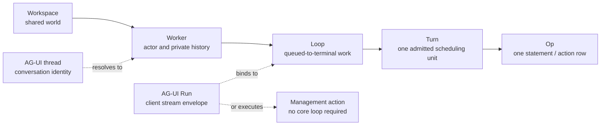

| Term              | Layer                 | Meaning |
|-------------------|-----------------------|---------|
| **agent**         | PLURNK                | The plurnk runtime. Acts in-workspace as the reserved `plurnk` worker ({§actor-boundary} self-hosting), never a privileged singleton owning its own entries ({§entry-owner}, {§machine-processes}). |
| **workspace**     | Core                  | Durable user-named shared world. Persists across workers and process restarts. Identity: `workspaces.id` + unique `workspaces.name`. |
| **worker**        | Core                  | Durable actor and private history over one workspace. Owns its loops and log rows, may carry a `parent_worker_id`, and has one process-local cancellation scope while active. |
| **loop**          | Core                  | Queued-to-terminal unit of model or client work within a worker. Status ∈ {100 pending · 102 running · 200 done · 202 waiting (blocked on a live obligation, {§send}) · 413 budget-overflow · 429 turn-ceiling · 499 cancelled · 500 failed · 504 wall-clock timeout ({§operator-config-loop-timeout}) · 508 runaway}. Many loops may belong to one worker. |
| **turn**          | Core                  | One engine scheduling unit (or one client-op scheduling unit). A model turn sends one assembled prompt through one or more emission attempts and admits at most one response. Many turns may belong to one loop. Identity: `(loop_id, sequence)`. |
| **op**            | Model/core            | One DSL operation the model emits, parsed into a `PlurnkStatement`. One admitted turn produces zero or more ops. |
| **statement**     | Model/core            | A parsed op: the `PlurnkStatement` AST from `@plurnk/plurnk-contracts`. |
| **action**        | Core                  | One executed op. Execution normally produces a `log_entries` row at `log:///<L>/<T>/<S>/<op>`; an engine rail may instead record an actionless `op='error'` row ({§operation-results}). |
| **dispatch**      | Core                  | Routing a statement to its scheme's op handler. |
| **AG-UI Run**     | AG-UI protocol        | A client request/stream envelope identified by the client's `runId`. A message or resume AG-UI Run binds to one core loop; a management-action AG-UI Run may complete without creating a core loop. |
| **AG-UI thread**  | AG-UI protocol        | Conversation identity. Within an explicitly selected workspace, `threadId` resolves to one conversation worker. |
| **`--run`**       | Client compatibility  | A compatibility-sensitive client spelling, not an internal entity. |
| **session**       | Retired/unqualified   | Not a PLURNK lifecycle noun. Use the actual core noun; a third-party standard may use only its explicitly qualified protocol term. | <!-- lexicon-allow: this row defines the retired noun -->

### §storage-terms Storage terms

| Term | Meaning |
|---|---|
| **entry** | The unit of canonical state. Identity: `(workspace, owner, scheme, pathname)` ({§entry-identity-no-null}). Holds one or more `channels` of content plus `tags` and `attributes`. |
| **channel** | A named content buffer on an entry. Examples: `body`, `stdout`, `stderr`, `headers`, `symbols`. Each channel has `content`, `mimetype`, `tokens`, `state`. |
| **scope** | A scheme-manifest declaration ignored by core; registrations are discovered at boot and are not persisted. Entry sharing and privacy are owner-based; #80 owns retiring this residual axis. |
| **scheme** | An addressed capability family + handler. Built-ins include `worker`, `prompt`, `log`, and bare/file paths; discovered schemes and executor-runtime tags extend that set. Internal `exec` routes the EXEC op but is not an addressable model namespace. Consumption surface {§scheme-surface}; author contract: [plurnk-schemes](../plurnk-schemes/SPEC.md). |
| **mimetype** | A channel's content type. Drives the handler that produces the structural projections (`symbols`, `deepJson`, `deepXml`). Consumption surface {§mimetype-surface}; author contract: [plurnk-mimetypes](../plurnk-mimetypes/SPEC.md). |
| **provider** | An LLM transport implementing the `@plurnk/plurnk-providers` `Provider` interface. Core supplies an assembled request and generation context; the provider owns endpoint adaptation and normalized response evidence. Consumption surface {§provider}; author contract: [plurnk-providers](../plurnk-providers/SPEC.md). |

### §state-terms State / status

Independent axes on entries and channels. Confusion across them is a recurring source of bugs.

| Term | Type | Meaning |
|---|---|---|
| **status** | HTTP int | Outcome of an operation. Carried on `log_entries.status_rx`, returned from op handlers. Per the catalogue ({§send-dispatch}). |
| **channel state** | `static \| active \| closed \| errored` | Streaming lifecycle of a channel's content. Metadata, not gating — engine renders content regardless of state. |
| **entry state** | `proposed \| resolved \| failed \| cancelled` | Proposal lifecycle (`log_entries.state`). `proposed` = pending client accept; `resolved` = accepted, side effect happened; `failed` = rejected (no effect); `cancelled` = the proposal was cancelled (loop abandoning). Distinct from channel state. |
| **outcome** | `string \| null` | Short reason for `failed`/`cancelled` (`"permission:403"`, `"aborted"`, `"not_found"`). Opaque to most callers. |

### §authority-terms Writer / authority

| Term | Meaning |
|---|---|
| **writer** | The identity authoring a write. One of `model \| client \| plurnk \| plugin`. Carried on `ctx.writer` for schemes; engine enforces `manifest.writableBy`. |
| **origin** | Synonym for writer in log_entries (`log_entries.origin`). Historical naming; treat as equivalent. |
| **writable_by** | The set of writers a scheme accepts. Subset of `{model, client, plurnk, plugin}`. Engine rejects writes outside the set with 403; the rejection is logged as the action-entry ({§subscriptions} action-entry-as-outcome). |

### §engine-rails Engine rails

| Term                         | Meaning |
|------------------------------|---|
| **verdict**                  | End-of-turn ruling computed directly in `Engine.runLoop` from strike/cycle/sudden-death rail state. Decides whether the loop terminates or another turn fires. No filter chain — rails are inline. |
| **strike**                   | A turn whose verdict counts toward `MAX_STRIKES`. Fires when `turnErrors > 0` or cycle detection trips. The streak counter resets on clean turn; reaches `MAX_STRIKES` → loop abandons at 500 (failed), or 508 (Loop Detected) when the crossing strike was cycle-driven. |
| **emission attempt**         | One completed provider exchange beneath an engine turn. ANTLR admits it when it has a trustworthy PLAN...SEND frame and no boundary-destroying tail. A hard error bounded to an interior statement becomes a failed operation inside the admitted turn; a rejected attempt is forensic evidence, not another turn or an engine strike. |
| **cycle**                    | A repeated turn fingerprint across consecutive turns. Detected silently; model never sees the trigger. Strike accumulates internally. |
| **sudden death**             | The last `MAX_STRIKES` turns of a loop's `MAX_LOOP_TURNS` window emit soft 429 warnings so the model can wrap up cleanly. `soft=true`: no strike, no streak increment. |
| §mode-ask-read-only **mode** | `"ask" \| "act"`. Per-loop. Ask = read-only: the dispatch gate refuses every side-effecting op (a filesystem write — EDIT/COPY-dest/MOVE/KILL on the `file` scheme — or any EXEC invocation); reads of the workspace stay open. `act` = full surface. Ask never changes the world. |
| **flag**                     | Per-loop value: `mode`, `noWeb`, and `noInteraction` shape scheme authority ({§manifest-flag-affinity}); `auto` and `noProposals` select proposal settlement. |
| **proposal**                 | A deferred side-effecting action. State machine: `proposed → resolved` (accept), `→ failed` (reject), or `→ cancelled` (cancel). Its core-owned disposition says whether the client or loop owns resolution ({§proposal-disposition}). |
| **resolution**               | Accept, reject, or cancel of a durable proposal. Client-owned authority enters core through `resolveProposal`; AG-UI carries it in standard resume entries ({§methods-proposal-resolve}, {§agui-proposal-resolve}). |

### §packet-terms Packet terms

| Term       | Meaning |
| ---------- | ------- |
| **packet** | A Turn's optional model-exchange record: measured request `sections`, extended with `assistant` and `assistantRaw` only when an emission is admitted. `NULL` means no model request was assembled. |
| **log**    | The `log` section. Chronological list of `log_entries` in scope this turn. |
| **render** | The act of computing the packet from current DB state at turn boundaries. Mimetype handlers fire at render time. |

### §test-taxonomy Test taxonomy

| Tier | Location | LLM | Substrate |
|---|---|---|---|
| **unit** | `src/**/*.test.ts` | No | Isolated logic, mocked boundaries |
| **intg** | `test/intg/` | No (mock provider) | Real file-backed SqlRite (per-test DB under `test/intg/.tmp/`), real engine |
| **live** | `test/live/` | Real | Wire-level assertions |
| **demo** | `test/demo/` | Real | Holistic outcome assertions |

§test-artifact-retention **File-backed test databases use lane-local current-run
retention.** Each workspace's normal intg runner clears its own
`test/intg/.tmp/` once before the suite, reports that forensic directory, and
retains every artifact the current run creates. A cross-package test may reuse
Core's migration fixture only by passing a path inside the caller's artifact
directory; independently scheduled lanes never share a reset target. A failed
suite therefore leaves its own evidence intact, and the next normal run of that
lane removes it before creating anything. Direct `node --test` invocations
bypass the runner boundary and must invoke the same cleanup procedure
explicitly when isolation matters. Live/demo run directories are benchmark
artifacts outside `.tmp` and retain their separate lifecycle.

---

## §arch Architecture

The ecosystem and the in-process shape ({§ecosystem}–{§in-process}), then the two invariants the rest of the spec rests on: isolation by worker ({§actor-boundary}) and the workspace/worker/fork ownership model ({§machine-processes}).

### §ecosystem Ecosystem

The root [`ARCHITECTURE.md`](../ARCHITECTURE.md) owns the platform process and
package map. The daemon, contracts, AG-UI module, and bundled capability
families are independently published npm workspaces in this monorepo; the CLI,
TUI, and editor clients are separate repositories.

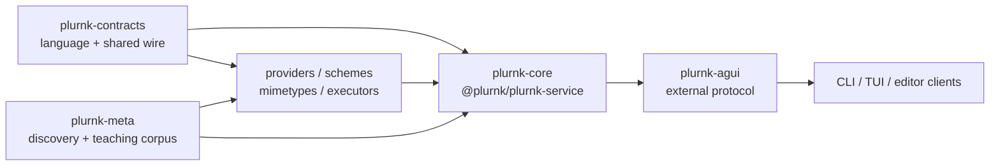

§ecosystem-composed-host Core is the composed runtime: it owns persistence,
scheduling, packet assembly, dispatch, and cross-capability orchestration while
consuming the language and each capability family's author contract. Domain
logic stays with its owning package. AG-UI projects that runtime to clients;
clients render and submit actions but contain no engine logic.

### §in-process In-process architecture

Engine library + admin CLI + daemon. Four plug points:

- **Providers** ({§provider}) — LLM transports. Engine sends a turn's messages, receives raw content + usage; engine parses the content into `PlurnkStatement[]`.
- **Schemes** ({§scheme}) — addressed capabilities. A scheme handler interprets targets under its prefix and owns its storage substrate.
- **Mimetypes** ({§mimetype}) — content interpretation. Render-time handlers consume channel content; framework owns the dispatch.
- **Executors** ({§exec} / {§bundled-set}) — EXEC runtime dispatch for subprocess, search, data, and pure-computation runtimes.

The engine dispatches ops, persists state to SQLite, orchestrates cross-scheme COPY/MOVE ({§copy}/{§move}), and writes the log. Capability-specific behavior remains with the owning plug point.

The contracts package (`@plurnk/plurnk-contracts`) owns the parser and AST contract. Schemes receive parsed statement fragments via dispatch.

Server posture: this package is the one long-running runtime process. `plurnk-agui` exposes its external protocol; user-facing clients run separately and do not call core's in-process seam directly.

### §actor-boundary The actor boundary: isolation by worker, two doors, self-hosting

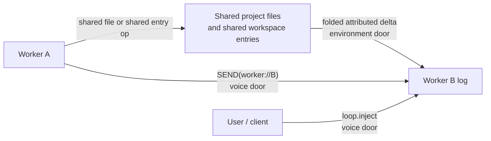

§actor-boundary-isolation **Isolation is by worker; the model is not
privileged.** A packet renders exactly one worker's log — the assembling
worker's — alongside current shared workspace state ({§packet}, {§membership}). A worker cannot
see another's log: isolation is *structural*, a consequence of "a worker owns
its log entries" ({§lifecycle-terms}) and "one packet, one worker," never a
render-time filter.

§actor-boundary-origin-not-filter `origin` ({§authority-terms}) is
**attribution** — the delta's provenance ({§env-delta}) — and is never read to
filter a row.

§actor-boundary-two-doors **Cross-worker arrival is limited to two doors.**
An explicit READ is not an arrival: the reading worker deliberately addresses a
file or ancestry-authorized entry through ordinary dispatch ({§worker-read-scope}).

| Door        | Carries                                                                                 | Wake behavior                                                    |
| ----------- | --------------------------------------------------------------------------------------- | ---------------------------------------------------------------- |
| Environment | A change to a shared project file or shared worker entry, as a folded attributed delta. | Ambient state never wakes an idle worker ({§env-delta}).         |
| Voice       | A directed `loop.inject` or `SEND(worker://name)` message.                              | An active worker folds it into its next turn; an idle one wakes. |

§actor-boundary-no-mutex **Wild west by default; explicit branch batches are the exception.** Ordinary workers share workspace state without locks. Coordination is cooperative and softly fenced (the {§membership} `read-only` overlay, a workspace policy, bounds every worker's writable surface uniformly — {§machine-processes}); a conflict *surfaces* as a delta rather than being prevented. A branch-tagged WORK/FORK opts the whole workspace into the bounded, exclusive Git transaction in {§worker-branch-batch}. It is not a general entry mutex or a hidden per-worker filesystem.

§actor-boundary-passive-wake **Passive wake follows ownership.** A directed
voice wakes an idle worker. A parked continuation resumes when an obligation it
owns — a child or stream — reaches an observable transition ({§worker-loop-lifecycle}).
An ambient environment delta never wakes; it queues until one of those directed
events produces a turn ({§env-delta}). The obligation edge is continuation
control, not a third door through which arbitrary sibling state can enter.

§actor-boundary-self-hosting **Use the actor path when the work has an
operation; retain irreducible rails in the kernel.** The workspace has one
reserved `plurnk` worker. It is durable; `DispatchAsPlurnk` opens a fresh
administrative loop and turn for each ordinary operation batch. Other workers
never receive its private log. They deliberately READ its published entries;
ambient shared-state changes still cross only through the environment door.

| Work                                    | Owning path                                                         | Why                                                                                 |
| --------------------------------------- | ------------------------------------------------------------------- | ----------------------------------------------------------------------------------- |
| Operator/client reference documents     | Reserved `plurnk` worker; ordinary EDIT through engine dispatch.    | Creating or replacing an entry is already an operation.                             |
| Git membership and disk materialization | Kernel `GitMembership` / entry CRUD.                                | Ingesting existing disk state is not a model-authored EDIT.                         |
| Disk-divergence narration               | Kernel writes an EDIT-shaped `source=file` row to the `plurnk` log. | It reports an environment event honestly; no operation is fabricated as having run. |
| Search derivation and catalog render    | Kernel.                                                             | They are indexes and read-only projections, not entry operations.                   |
| Packet assembly and budget rails        | Kernel.                                                             | They are the execution substrate on which actor operations depend.                  |

Git membership includes tracked and untracked-but-not-ignored project files
({§membership-auto-add}); it does not stage them or run `git add`.

§actor-boundary-doc-injection **Operator reference documents use the actor
path.** `PLURNK_SERVICE_MD_<ALIAS>=<path>` ({§operator-config}) materializes
`<path>` as `worker://plurnk/<ALIAS>.md` through a `DispatchAsPlurnk` EDIT, then
foists a READ into each model worker's turn 0. The materializing EDIT remains in
the `plurnk` worker's log; the model sees the shared entry through its own READ.
Client-provided workspace documents union with the operator set at the same
entry surface.

§actor-boundary-catalog-preview **Catalog preview.** `PLURNK_SERVICE_FILES_ITEMS` foists turn-0 FINDs into the worker's first turn, so a worker opens with a navigable map instead of blank. An enabled preview always executes four orienting surveys: project files (`FIND(*)`), workspace commons (`FIND(worker:///*)`), the worker's own space (`FIND(worker://~/*)`), and kernel docs (`FIND(worker://plurnk/docs/**)`). Folder-capable entry plugins use the same shallow form; a scheme without folder scopes remains recursive. A shallow result is complete, not truncated: direct entries render normally and every deeper first-segment directory renders as an actionable `dir/**` summary with its recursive `items` and `tokens`. The small curated kernel-doc surface remains recursively enumerated, so the opening exemplar demonstrates both `*` and `**`. Every survey executes even when empty because zero results are useful orientation. A positive `N` caps only the file map's rendered rows, using the map's actual direct-entry-plus-directory count; `-1` renders the complete shallow map; unset / `0` disables previews. `log://` is absent because the current worker's log already renders in present mode.

### §machine-processes The machine and its processes: workspace, worker, fork

A workspace owns the shared world; a worker owns one history and one private
entry space on that world.

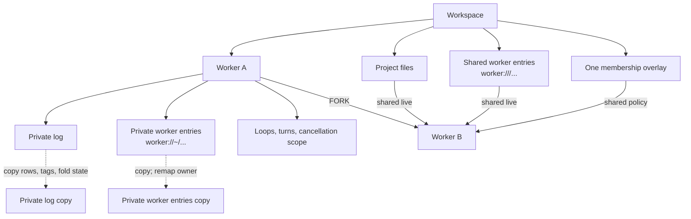

§machine-processes-one-filesystem **Each workspace has one project filesystem.**

§machine-processes-one-overlay **Each workspace has one membership overlay.**

§machine-processes-fork-copies-the-log **A fork copies the parent's log as
terminal history.**

| State                                                 | Owner             | Fork behavior                                                                                                      |
| ----------------------------------------------------- | ----------------- | ------------------------------------------------------------------------------------------------------------------ |
| Project files ({§machine-processes-one-filesystem})   | Workspace         | Shared live; a fork does not create another checkout.                                                              |
| Shared worker entries (`worker:///...`)               | Workspace commons | Shared live.                                                                                                       |
| Membership overlay ({§machine-processes-one-overlay}) | Workspace         | Shared unchanged; divergent membership requires another workspace.                                                 |
| Log items ({§machine-processes-fork-copies-the-log})  | Worker            | Rows, event identities, tags, fold state, and the matching observation cursor are copied as terminal history.      |
| §machine-processes-fork-cost **Turn usage and cost**  | Worker            | Copied turns carry zero usage and cost; branch totals cover new generation only and workspace spend stays exact.   |
| Private worker entries (`worker://~/...`)             | Worker            | Deep-copied with ownership remapped; parent and child then diverge.                                                |
| Active loops, turns, and cancellation                 | Worker            | Never copied as live work; inherited structure is terminal history, then a new loop starts.                        |

§machine-processes-worker-is-its-log **A worker's conversational memory of
the shared world is its log, with no hidden per-worker snapshot beside it.**
OPEN/FOLD changes `log_entries.expanded` on that worker's rows ({§open-fold});
environment changes arrive as attributed log entries ({§env-delta}). Private
worker entries are deliberate scratch that the worker reads and writes through
`worker://~/...`, not an invisible mirror of shared state. The environment door
therefore carries only shared project-file and shared-entry changes
({§env-delta-worker-entry-visibility}).

§machine-processes-model-worker-readable **A worker's log is private to packets, not to the workspace.** Isolation ({§actor-boundary}) governs what an *actor* sees — its own worker, never a sibling's. It does not wall off the client interface: `readLog({ workspaceId, workerId })` may read any ownership-verified worker in that workspace, and `listWorkers` enumerates them. A client-interface module chooses the default worker from its own conversation binding. The read is observation, never packet membership — no actor sees it.

§machine-processes-worker-origin **A worker carries its actor.** Each worker records its `origin` — `model` (a conversation), `client` (a client-interface actor), or `plurnk` (the runtime's self-hosting worker) — set once at creation and inherited by a fork. `listWorkers` returns it, so a client interface identifies actor class without parsing the name, which is set at instantiation and immutable (a worker is permanent history, {§machine-processes-worker-is-its-log}).

§worker-primary **The primary worker is the lineage root.** The PRIMARY worker of a turn's lineage is the no-parent root reached by walking `parent_worker_id` up; a no-parent worker is its own primary. Core supplies it on the first-party metadata channel alongside `Worker-Id` (same gate, computed per turn), stamped on EVERY turn including the primary's own (where it equals `Worker-Id`) — absent-with-a-Worker-Id is a contract violation, never a silent "assume primary." An unresolvable root (a corrupt/cyclic parent chain the `parent != id` CHECK forbids) fails hard. Providers emits it as `Plurnk-Worker-Primary`; a consumer routes primary-vs-spawned by equality (`Worker-Primary == Worker-Id` ⇒ the primary; `!=` ⇒ any-depth spawn, no depth math) and groups the worker tree by the shared root.

§machine-processes-fork-shares-the-world **A fork copies worker-owned history
and scratch while sharing workspace-owned state.** It is a new worker in the
same workspace (`workers.parent_worker_id`, {§lifecycle-terms}); project files,
shared entries, and membership remain live and uncopied.

§machine-processes-no-fork-workspace **A workspace cannot be forked.**
`workers` carries `parent_worker_id`; `workspaces` carries no parent. Parallel
histories over one workspace are worker forks. A divergent project filesystem
or membership overlay requires a new workspace.

### §worker-scheme The worker:// scheme — the knowledgebase (commons, own space, named spaces, the kernel surface) and worker control (spawn, irc, fork, terminate, cap, collect)

§worker-authority-carving **The authority names the OWNER:** `worker:///notes.md` is in the COMMONS — a shared blackboard; `worker://~/draft.md` is the calling worker's own private space; `worker://<name>/result.md` is a named worker's space; `worker://plurnk/docs/x.md` is the kernel's published surface, world-readable. Storage keys the owner on the entries.owner_id column ({§entry-owner}) — the pathname is always the bare entry path, and a FIND's result paths re-apply the queried authority so the model sees the address it typed. `~` is the sole current-worker sigil and cannot be minted; `commons` and `plurnk` are internal worker names unavailable for minting. Every other mintable authority, including `self`, is a literal worker name ({§worker-name}).

§worker-name-minting **URI ingestion is permissive; worker minting is not.**
Every model/client worker-creation door applies the contracts-owned
`WORKER_NAME` predicate through one core admission path. Generic URL parsing
continues to decompose other authorities without treating them as mintable.

| Candidate                                      | Minting result                                                        |
| ---------------------------------------------- | --------------------------------------------------------------------- |
| `WORKER_NAME` match, not reserved              | Admitted as the exact literal worker name.                            |
| `commons`, `plurnk`, or `~` (any case variant) | Refused as reserved before lookup or insertion.                       |
| Any other spelling                             | Refused as `name-invalid` before lookup, insertion, or child startup. |
| Automatic name                                 | Generated, then admitted through the same predicate.                  |

§worker-read-scope **Named spaces are ancestry-gated reads**: the reader is the owner or an ANCESTOR (the recursive parent_worker_id walk) — oversight flows down the tree, a parent reads `worker://child/result` across generations, a child cannot snoop upward, and an unknown name or unpermitted reader resolves 404 with no existence leak. The kernel surface is the one world-readable named space.

§worker-write-scoping **Writes are own-space-and-commons only**: a model writes `worker://~/` and `worker:///` — every named authority is read-only to it (403), and owner_id is engine-stamped from the dispatch context, never model-set. Nothing worker-authored can land under another principal — `worker://plurnk/` included, which is what makes the kernel surface the trust boundary with no guard to forget (only the kernel, dispatching as itself, authors it). The entry-copy seam (COPY/MOVE) is pathname-keyed and addresses the commons; a space's content moves via READ + EDIT.

§worker-control-addressing **Only an exact authority-only address selects worker
control.** Control is same-workspace only ({§actor-boundary}). Generic URI
parsing remains tolerant, but worker control admits no component it cannot
interpret and never silently normalizes one away.

| URI component     | Control requirement                                                          |
|-------------------|------------------------------------------------------------------------------|
| Scheme            | `worker`                                                                     |
| Authority         | Exactly one non-empty worker authority                                       |
| Path              | Absent; a trailing `/` is a path, not a control alias                        |
| Userinfo or port  | Absent                                                                         |
| Query or fragment | Absent, including an empty delimiter                                          |
| Request metadata  | Absent                                                                         |

After structural admission, `~` means the calling worker only where the
operation admits current-worker control, while every mintable authority is a
literal `workers.name` value.

| Operation | Accepted pathless authority | Effect                                  |
|-----------|-----------------------------|-----------------------------------------|
| `WORK`    | new literal name            | Spawn a fresh named worker.             |
| `FORK`    | new literal name            | Branch the caller into a named worker.  |
| `SEND`    | existing literal name, `~`  | Message the named worker or caller.     |
| `READ`    | existing literal name       | Collect the named worker's deliverable. |
| `KILL`    | existing literal name, `~`  | Terminate the named worker or caller.   |

- §worker-scheme-spawn **Spawn** — `WORK(worker://<name>):task` creates a new worker sister (empty log) and starts it with `task` on its first loop. WORK/FORK are the worker-creation verbs (grammar 0.74.55): EDIT is file/entry only, so EDIT on the bare worker entity is a **400** steering to WORK/FORK — the entity is not an entry. A name is **frozen per worker** but **reclaimable across time** ({§machine-processes-worker-origin}): a name held only by a *terminated* sister is free to reuse — a fresh spawn takes a new row and `worker_resolve_by_name` resolves the newest, the corpse keeping its name in permanent history. A name a *live* sister still holds is a conflict — **409 `worker '<name>' is already running`**, legible at the spawn gate, never a raw store-level uniqueness error.
- §worker-scheme-irc **irc** — `SEND(worker://<name>):msg` delivers `msg` to an existing sister, the **voice door** ({§actor-boundary-two-doors}): an active sister folds it into its next turn, an idle one wakes ({§actor-boundary-passive-wake}). `SEND(worker://~):msg` targets the caller; a literal name with no worker in the workspace is 404.
- §worker-scheme-fork **Fork** — `FORK(worker://<name>):task` branches the
  current worker into a **named** sister: its log is deep-copied
  ({§machine-processes-fork-copies-the-log}), which continues with `task`; the
  world is shared, never copied ({§machine-processes-fork-shares-the-world}).
  WORK and FORK are distinct verbs — WORK spawns a fresh worker, FORK branches
  the log — and each names the new worker explicitly, so the model addresses
  it (`KILL`/`SEND`/`READ`) by that name. The lower-level seam generates
  `<parent>-fork-<N>` only when its caller omits a name. Inherited loops are
  copied as **terminal history** (a non-terminal status is clamped): a fork's
  own work is a fresh loop, so an inherited mid-flight loop never makes the
  branch look forever-live to the {§send-premature-terminate} gate.
- §worker-scheme-fork-scratch **Forked scratch.** A fork also inherits the
  parent's private entries — its own space deep-copied with the owner
  remapped (source → branch) — so the branch opens with the parent's notes and
  diverges on its own edits: *fork = everything-in-common-but-name*.
- **Git branch batch** — `WORK[feature/x](worker://<name>):task` and `FORK[feature/x](worker://<name>):task` retain their worker meanings while placing the child in the serialized Git transaction defined by {§worker-branch-batch}. The signal is one branch ref, not tags; an untagged WORK/FORK keeps the ordinary concurrent shared-world behavior.
- §worker-delegation-inherits-flags **Delegation inherits authority.** The live loop a spawn, fork, or irc-raised fresh loop starts with carries the **delegating loop's flags** — an auto parent delegates auto workers. Flags are a property of the delegation, not of a client binding: a child loop that fell back to defaults could propose side effects into a resolver-less headless review queue. An irc that *resumes* a parked loop leaves that loop's own flags untouched — inheritance applies only where a fresh loop is born.
- §worker-lifecycle-wake-requeue-not-terminal **A wake re-queue is not a terminal.** A conclusion-wake resumes a 202-blocked loop by re-queueing it (202 → 100); when that lands while the loop's own live drain is between turns, the drain **re-claims and continues** (atomic 100 → 102; the injected prompt is already the next turn). The internal re-queue is never reported as an outward terminal.

Untagged worker control rides the daemon's inject seam (active→fold, idle→enqueue+drain), so the handler creates/branches the worker and hands off; the daemon owns provider + system prompt. Tagged WORK/FORK instead enqueue a fresh loop without starting its drain; {§worker-branch-batch} becomes its sole starter. FORK/WORK carry the seed task in the body and are their own ops, dispatched to worker control — never the entry-copy path.

### §worker-branch-batch Serialized Git branch batches

Branch-tagged WORK/FORK serializes ordinary Git branches over the one project
checkout. It creates no worktrees, alternate roots, hidden merges, or stashes.

§worker-branch-batch-exclusive **Stop the workspace; serialize
ordinary branches.** A branch signal on WORK/FORK creates a durable batch keyed
to the parent turn. The batch queues one exclusive workspace gate before that
parent releases its turn. Turns already in flight drain; every later model turn
and client file operation waits. The batch owns exactly one repository: the Git
repository containing `workspaces.project_root`. A project root may be a
package inside a monorepo; the repository, not the package directory, is the
transaction boundary. Unrelated repositories belong to unrelated workspaces
and receive no branch policy from this workspace.

§worker-branch-batch-frozen-base All tagged children from the turn branch from
the same frozen commit, then run one at a time in emission order. The active
child and its descendants may take turns; no other worker may enter the
checkout. Worktrees, stashes, automatic merges, and hidden alternate roots do
not participate.

```mermaid
sequenceDiagram
    participant P as Parent turn
    participant G as Workspace gate
    participant B as Branch batch
    participant C1 as Child branch 1
    participant C2 as Child branch 2
    P->>B: WORK[branch-1], FORK[branch-2]
    P->>G: queue exclusive before releasing shared turn
    G-->>B: all earlier turns drained
    B->>B: snapshot clean project repository; create both refs from frozen base
    B->>C1: checkout branch-1; run to terminal
    C1-->>B: committed, clean result
    B->>B: record tip; restore exact parent ref
    B->>C2: checkout branch-2; run to terminal
    C2-->>B: committed, clean result
    B->>B: record tip; restore exact parent ref
    B-->>G: release exclusive
    B-->>P: wake; deliver branch receipts
```

§worker-branch-batch-preflight **Preflight is total.** `GitMembership.projectRepository` resolves the repository containing `project_root`; absence rejects the tagged op. Earlier turns and finite derivation work drain at the exclusive boundary; a pre-existing open stream subscription is not a finite checkout operation and therefore rejects preflight rather than being silently cancelled or waited forever. Before any child starts, every branch passes `git check-ref-format --branch`, the project repository has no staged, unstaged, or nonignored untracked changes, every requested branch is absent, and the original symbolic ref/detached commit is recorded. All branch refs are then created from that frozen commit. Failure rolls back only refs created by this preflight, fails the queued children, restores the parent, and releases the workspace. Existing branches are never adopted or overwritten.

§worker-branch-batch-return **A child returns commits, never a dirty checkout.** SEND[200], SEND[499], and an already-drained SEND[202] are refused with 409 while the project repository is off the assigned branch or dirty. The model commits or deliberately discards its changes and concludes again. On terminal, the batch records the full result commit and whether it differs from the frozen base, restores the exact original ref and commit, and only then advances. A clean child failure is a completed batch item and does not suppress later siblings; an ambiguous or dirty host failure becomes `recovery_required` and retains exclusivity because restoring would destroy or misattribute work.

§worker-branch-batch-receipt **The parent reconciles; the engine does not merge.** The ordinary child deliverable remains the model's exact SEND body. Its pushed termination delta and pull-side `READ(worker://child)` append a bounded branch receipt: branch, item outcome, and the abbreviated result commit (`PLURNK_SERVICE_BRANCH_RECEIPT_REVISION_CHARS`; the database retains the full id). Branch refs remain after the batch. The parent chooses inspection, cherry-pick, merge, rejection, or deletion with ordinary Git tools.

§worker-branch-batch-recovery **Recovery follows durable ownership.** `branch_batches`, their ordered items, the project-repository snapshot, and result tips are schema state, not process memory. Generic boot recovery never starts their queued loops. A crash before sealing fails the unstarted batch. A queued partial preflight is rolled back only when every created ref still equals its frozen base, then retried. A running child is never replayed: its loop settles under the ordinary owner-loss rule; if the checkout is clean and either on the assigned branch or the exact original position, the committed tip is retained, the original restored, that item marked interrupted, and queued siblings continue. Any mismatch becomes `recovery_required` and keeps the workspace stopped for operator correction.

The remaining worker surfaces are:

- **Entries (storage)** — entry addressing rides the authority carving above ({§worker-authority-carving}): `worker:///` the commons, `worker://~/` the own space, a name an ancestry-gated read ({§worker-read-scope}), writes own-space-and-commons only ({§worker-write-scoping}). An entry-path `KILL` deletes under the same write-scoping (200; 404 absent; 403 named) — distinct from the path-ABSENT `KILL(worker://<name>)` which terminates the worker ({§worker-scheme-terminate}); the discriminator is the entry path, never the op. A worker's own space is catalogued in ITS perspective alone (`FIND(worker://~/*)`, foisted at turn 0 even when empty); isolation is the owner column, structural.
- §worker-scheme-terminate **Terminate** — `KILL(worker://<name>)` aborts a named worker and `KILL(worker://~)` aborts the caller: every unresolved loop in that worker's subtree closes 499 and every subscription in the subtree tears down; a literal name with no worker is 404. Cancellation is structured: descendants cannot detach implicitly. The override to the fire-and-forget default is not a parent-power — whoever holds the address may end it; a worker left alone simply ends at its own `SEND[200]`.
- §worker-scheme-cap **Cap** — `PLURNK_SERVICE_WORKSPACE_WORKERS_MAX_ACTIVE` ceilings the *concurrent* active workers per workspace (a worker with a non-terminal loop); a spawn or fork past it fails hard (508 — no queue, no retry), irc exempt; `-1` disables it. The fork-bomb brake, sized for workspaces that live for months.
- §worker-scheme-collect **Collect** — a worker's loop reaching a terminal status
  surfaces to its sisters as an ambient delta ({§env-delta}): a `SEND` from
  `worker://<name>` carrying the loop's deliverable — the `SEND[200]` body, or
  for an abandonment the reason. A **2xx deliverable is born OPEN** (its body
  materialized into the parent's packet, not hidden behind a fold): a child's
  success must reach the parent open and awakening, never a bodyless row. An
  abandonment (non-2xx) surfaces folded. Every death-path is stamped uniformly,
  so no termination is silent; collection is the shared world moving, never a
  verb. The **pull** side mirrors the push: a path-absent
  `READ(worker://<name>)` collects the same deliverable on demand — the latest
  loop's terminal message (the result, or the abandonment reason) for a
  concluded worker; a worker **still running** has not delivered, so the READ
  returns **425** (Too Early) and the turn's bare `SEND[102]` **becomes a
  parked loop (202) on the join** ({§join-blocking-collect}) until the worker
  delivers — the engine holds the join, the model never drives a park. A
  missing name is 404. The model therefore reads the worker itself for its
  outcome or a wait rather than guessing a scratch path to "check on" it.
- §child-orientation **Child orientation.** Beyond the conclusion delta, every
  turn the packet's status clump surfaces the live things this worker currently
  holds — open streams (`## Child Streams`) and unconcluded child workers
  (`## Active Child Workers`) — as terse `* <status> <path>` pointers (the same
  shape as the errors section), just above it. A worker is otherwise marked
  only at spawn and at conclusion; in between it goes silent, so a model loses
  track of what it holds and premature-terminates. This is orienting state,
  never advice: the model sees its live subtree (`* 102 worker://worker-x`,
  `* active sh:///1/2/3`) and reasons for itself — READ/OPEN/KILL via the path.
  Empty sections are omitted, like errors.

### §worker-loop-lifecycle Worker and loop lifecycle: drain, reap, and passive wake

- §join-blocking-collect **A `READ` on a running child is a blocking join, not a poll.** A path-absent `READ(worker://<running-child>)` returns **425** (Too Early) and records a live obligation on the loop. The turn's bare `SEND[102]` is converted into an indefinite parked loop (202) instead of asking the model to poll or drive the scheduler. When the child reaches any terminal status, the same loop resumes with the result in its log. Children are bounded by their own turn and strike limits, terminal failure also wakes the parent, and the owed-wake path covers completion before the parent parks. Any `SEND` clears the per-turn arm; `SEND[200]` with a live child remains a premature-termination error. A `<seconds>` timeout-poll is the explicit polling alternative.

A worker is a **log plus a cancellation scope** — one `AbortController` per worker, reused while live and replaced only once aborted, so a cancel ends the worker as a unit and a later `runLoop` request is never born cancelled. A worker's queued loops are advanced by a **drain**: a single per-worker drain that claims loops atomically (status 100→102) and runs each under the worker's scope. A loop may spawn **streams** (execs) that outlive it; each is a row in the subscription registry ({§subscriptions}) — the durable record of what the worker holds open. Cancellation and conclusion are defined against these structures, never wall-clock timing.

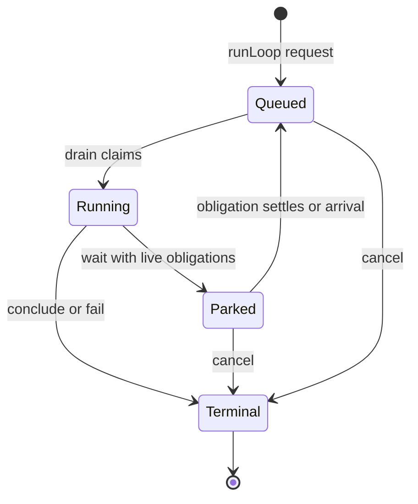

§worker-lifecycle-state-machine The lifecycle store admits only the guarded transitions shown above: `100 → 102`, `102 → 202`, `202 → 100`, and any unresolved state (`100`, `102`, `202`) to a terminal status. Terminal state is immutable. The queue drain owns claim, the dispatcher owns model-requested park/conclusion, the daemon owns wake/cancellation/restart reconciliation, and the engine owns policy terminals. A racing transition that loses observes the durable winner; it does not overwrite it or report the requested state as fact.

§stream-catalog-lifecycle Streams are independently durable subscriptions owned by a worker. Payload and
lifecycle are orthogonal: zero bytes is a valid payload for both success and
failure, while the closed subscription and its status are the terminal fact.
Every stream entry exposes that durable state in catalog rows as
`stream: { state, ... }`: active streams carry `seconds`; terminal streams carry
their exact `status` and derive `closed` (status below 400), `killed` (499), or
`failed` (other failure status). An entry with no subscription has no `stream`
member. This is historical state, not merely a live-process hint.


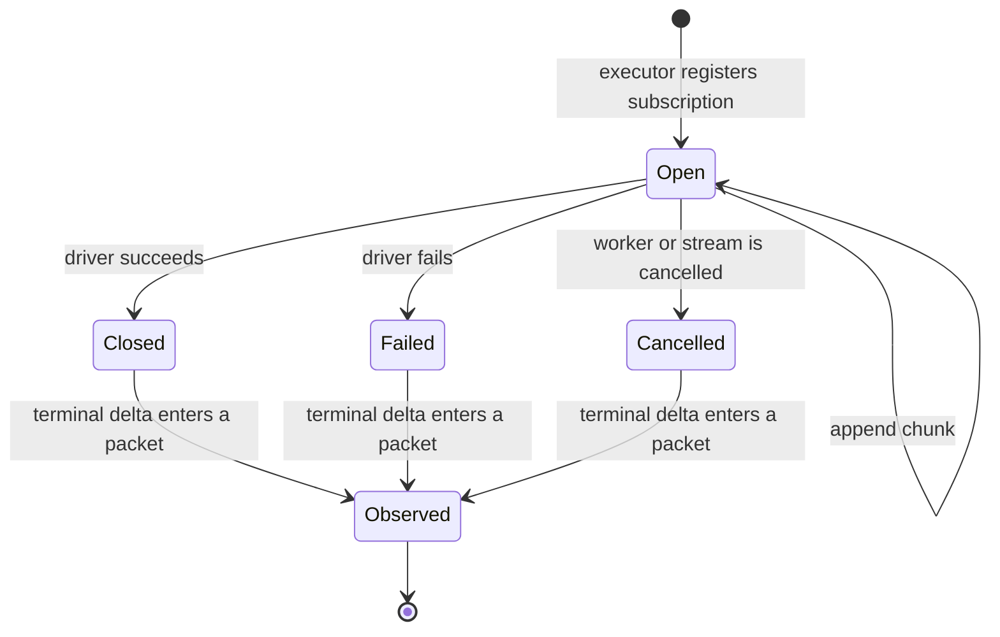

| §worker-lifecycle-subscription-matrix Subscription state at `SEND[202]` | Terminal observation already in a packet | Result |
|-------------------------------------------------------------------------|---:|---|
| open                                                                    | no | park; polling or closure may wake it |
| closed, any status, empty or non-empty                                  | no | continue directly to the observation turn |
| closed, any status, empty or non-empty                                  | yes | no stream obligation remains |
| cancelled as part of worker cancellation                                | irrelevant | terminate the cancelled worker; never resurrect it |

Polling observes a still-open stream; it never changes ownership or manufactures
completion. Closure is always a wake edge regardless of polling mode.

| §worker-lifecycle-poll-matrix EXEC poll marker | While open | On closure |
|------------------------------------------------|---|---|
| omitted                                        | exponential-backoff observation wakes | resume once with terminal observation |
| positive `P`                                   | fixed-cadence observation wakes every `P` seconds | cancel cadence; resume once |
| zero                                           | no observation wakes | resume once |
| turn-scoped `<0>`                              | reap at the next pre-turn boundary | surface the terminal outcome |

The structured-concurrency sequence is identical whether a child performs an
EXEC, retrieval, or pure inference. Intermediate child status is private to the
child. Only the child's terminal loop result crosses the parent edge.

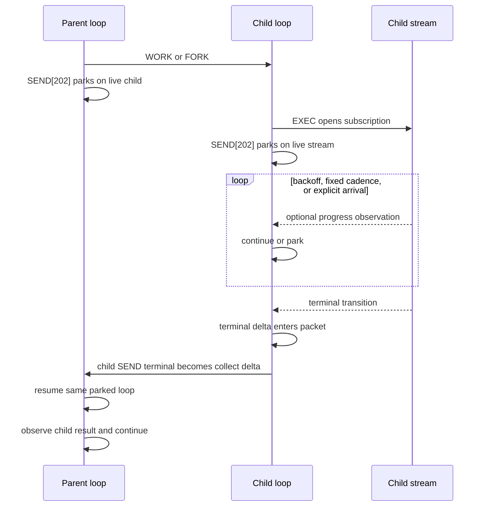

| §worker-lifecycle-child-matrix Child state at parent wait | Child result delivered to parent | Result |
|-----------------------------------------------------------|---:|---|
| queued, running, or parked on its own live obligation     | no | parent parks |
| terminal during the parent's turn                         | no | owed wake; parent continues to the result packet |
| terminal before the parent's wait                         | no | parent continues directly to the result packet |
| terminal                                                  | yes | child obligation is drained |
| cancelled or failed terminal                              | no | same wake/delivery path as success; outcome remains non-2xx |

A stream's close status and a loop's terminal status are separate layers. A
stream may close 4xx/5xx and wake its worker to recover. Model `SEND[4xx/5xx]`
reports a failed action and continues; `SEND[200]` concludes successfully and
`SEND[499]` explicitly abandons the worker. Only a concluded loop crosses the
parent edge as the child's result.

§worker-lifecycle-terminal-result **Terminal truth is a result, not a lifecycle code.** `loops.terminal_result`
stores the exact universal operation result. A failure therefore retains its
RFC 9457 Problem Details and exact status through persistence, restart,
parent collection, and `loop/terminated`. The older constrained `loops.status`
column remains only the scheduler's compact lifecycle projection: known
terminal classes remain themselves, other 2xx/3xx statuses project to `200`,
and other 4xx/5xx statuses project to `500`; exact `202` is forbidden because
it is the parked lifecycle state, not a terminal. No product surface may infer or
reconstruct a result from that projection. Active rows have no terminal result;
terminal rows must have one, and database triggers enforce both directions.


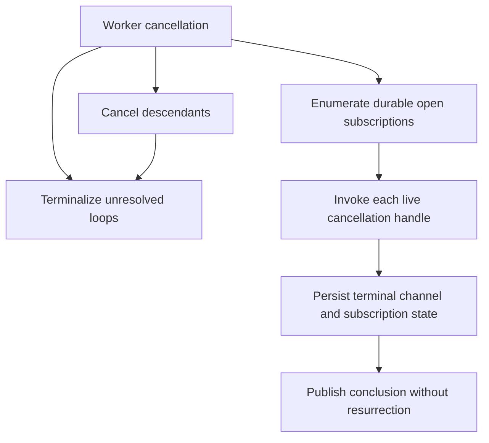

Restart applies the same ownership rule: accepted queued loops are reclaimable;
in-flight provider calls and subscriptions belonged to the vanished process and
become explicit failures. A park whose child remains live stays parked; a park
whose obligations settled during reconciliation is requeued in place so it can
observe their terminal results. No effect is replayed across an unknown
boundary.

- §worker-lifecycle-single-drain **One drain advances a worker.** At most one drain is registered for a worker at any instant: a `runLoop` request or wake on a worker with a live drain folds in (active→next-turn) or enqueues a loop that drain claims, never a second parallel drain. A drain's start and its empty-queue teardown relinquish the worker under one per-worker lock, so the teardown's re-claim cannot race a concurrent start into a double-drain.
- §worker-lifecycle-total-reap **Cancellation is recursive and reaps every held stream.** `loop.cancel`, worker `KILL`, shutdown, and a worker's `SEND[499]` terminalize every unresolved loop in the cancelled worker subtree and iterate each worker's durable open-subscription rows, invoking each exact callable owner from the process-local live registry. The durable rows answer *what is held*; the live registry answers *how this process tears it down*; the abort signal is a fast-path optimization. There is no implicit detachment. Before shutdown awaits drains, it cancels every process-local proposal waiter through {§proposal-cancel-aborts} with outcome `daemon_stopping`, so a stopped-world dispatch cannot hold teardown open. A stream that is running, mid-spawn (its row written before it is killable), or spawned after the cancel is reaped alike. The teardown abort is bounded: the executor sends a polite signal then SIGKILL after a consumer-set grace (`PLURNK_SERVICE_EXEC_KILL_GRACE_MS`). A model `KILL[code]` on one live stream instead delivers exactly that signal once (bare `KILL` → the executor's SIGHUP default, `KILL[9]` → SIGKILL).
- §worker-lifecycle-exec-epoch-bound **A stream's kill binds to the scope it captured at spawn.** A stream captures the worker's cancellation scope as it registers and wires its kill to it, re-checking `aborted` AFTER wiring — no check-then-listen gap can drop an abort that lands mid-registration. Because the scope is replaced only once aborted, a captured-then-replaced scope is necessarily already aborted, so replacement never strands a live stream.
- §worker-lifecycle-no-resurrection **A cancelled worker is not resurrected by its own torn-down work.** A stream conclusion delivered to a cancelled, idle worker starts no fresh drain: an aborted (499) conclusion is skipped, and a straggler that concluded cleanly surfaces its deliverable as an environment delta ({§env-delta}), never a revived loop. The cancel was deliberate; only an explicit `runLoop` request resumes the worker.
- §worker-lifecycle-wake-liveness **A stream conclusion always reaches its worker.** When a backgrounded stream concludes, the daemon routes it through the same inject seam as any loop source ({§actor-boundary-passive-wake}): an active worker folds the conclusion into its next turn; a worker **blocked on a 202 wait** for that stream ({§wait-obligation-matrix}) **awakens that loop in place** — the blocked loop *is* the continuation, so there is no fresh loop and no summary-as-prompt fiction. The result is never lost: a blocked loop sleeps rather than ending, and the stream's status-transition is the arrival ({§actor-boundary-passive-wake}) that wakes it; on resume it reads the concluded stream's own state, not a synthetic prompt.
- §worker-lifecycle-child-wake **A child worker concluding wakes a parent blocked on it — the topology join.** `worker://` spawn/fork records `parent_worker_id` ({§lifecycle-terms}). When a worker's drain exits having **concluded** — no `202`-blocked loop, no open stream — the daemon resumes its parent **in place** if the parent is blocked on the join (`#onDrainExit` → the shared `#wakeParkedWorker`, the same 202→100 resume a stream conclusion uses). So a parent that spawns work and blocks (`SEND[202]`) is woken the moment its child finishes; on resume it reads the child's deliverable from the {§worker-scheme-collect} delta in its own log — a control edge, **never an injected prompt**. The wake recurses upward via the parent's own drain-exit. A child still running — or itself blocked at 202 — is not *concluded*, so it does not wake the parent (it's still a live thing the subtree holds). This is the structured-concurrency join: streams and child workers are the same kind of "live thing a worker holds," driving premature-terminate ({§send-premature-terminate}), the wake edge, and the collect delta identically. A worker conclusion is a **bounded, un-loseable** wake: if the conclusion fires while the parent is mid-turn (before its block commits), `#wakeParkedWorker` finds it not-yet-slept and records an **owed wake**, which the drain honors when the parent blocks — so a wait awaiting workers **always returns**, never dead-blocks on a conclude-before-block race. (Only a live exec stream, unbounded absent a timeout, may legitimately hold a wait open.)
- §worker-lifecycle-idle-is-concluded **An idle worker concludes; it does not park.** A loop is idle only when it has neither live obligations nor completed results awaiting their first packet. A live child or stream blocks a `SEND[202]` join; a completed stream, child result, or same-turn retrieval continues directly to the next packet where it is observed. Only after those sets are drained does `SEND[202]` resolve like `SEND[200]`. There is no held-open idle loop and no `loop/quiesced` soft signal. A concluded worker is durable working history and an addressed arrival reawakens it as a new loop.
- §worker-lifecycle-no-lost-loop **A loop is never stranded by a drain's exit.** A drain relinquishes its registry slot only after a lock-held re-claim confirms the queue is empty; a loop enqueued during that teardown is either re-claimed by the exiting drain or claimed by a fresh drain that a later inject starts. The relinquish and the start are serialized, so neither the lost-loop hang nor a transient double-drain can occur.
- §worker-lifecycle-durable-disposition **Durable disposition wins cancellation races.** At a turn boundary, the engine reads the loop's durable status before interpreting a process-local abort. A committed `202` park survives a later daemon-shutdown signal; only a loop still durably running at `102` can be terminalized by that cancellation.
- §worker-lifecycle-restart-recovery **Restart is owner-loss reconciliation, not replay.** Before opening client transports, the service holds an exclusive database-adjacent daemon lock; a second live owner fails before touching SQLite, while a dead-PID crash claim is replaced atomically without a timeout lease. Boot preserves accepted `100` loops and restores their drains. A `102` loop belonged to a vanished drain/provider call, so it settles `500` with the interruption on its durable row—never replayed across an unknown effect boundary. Every durable proposed operation likewise lost its process-local resolution waiter and settles as a visible `500 owner_vanished` occurrence rather than an unresolvable interrupt ({§proposal-list}). Every durable-open subscription belonged to a vanished callable: active channels become errored and its row closes `500`. A `202` continuation survives only while a live child obligation remains; after reconciliation, an unblocked park requeues `202→100` and resumes in place. Child terminalization wakes its parked parent on every outcome, including provider exceptions, cancellation, and restart interruption, recursively through the durable parent edges. These operations are idempotent, so an interrupted recovery safely repeats.

---

## §provider Provider Contract

Author-facing contract: [`@plurnk/plurnk-providers`](../plurnk-providers/SPEC.md). Below: consumption surface + engine→provider guarantees.

### §provider-surface Consumption surface

Three entry points:

- §provider-surface-generate `provider.generate(args)` — once per provider attempt. Core supplies the complete messages, worker/turn coordinates, generation envelope, optional local grammar, and first-party metadata. A successful `ProviderResponse` reaches emission admission; a `ProviderError.attempt` is failed evidence under {§provider-interrupted-attempt}. Core persists normalized call metadata and forensic response fields and relays encrypted-reasoning items only from an admitted response ({§encrypted-reasoning-carrier}).
- §provider-surface-prompt-measurement `provider.countPromptTokens(messages, signal)` — cancellable measurement of the complete provider request with `exact`, `upper_bound`, or `estimate` provenance. It is used only for provider-physical recovery admission ({§tokenomics-physical-admission}); model-facing stored and rendered weights use the provider-agnostic ruler.
- §provider-surface-calculate-cost `provider.calculateCost(usage)` — once per persisted provider attempt carrying usage; estimated USD. Engine aggregates every attempt into `turns.usage_cost_usd`; triggers cascade to `workers.cost_usd` / `workspaces.cost_usd`.

§provider-surface-identity Provider capacity and identity are immutable for one instance. `contextWindow` (physical token total, or `null` when unknown) and the optional reasoning/completion reserves define the natural prompt partition and physical admission check ({§tokenomics}); `model` identifies persisted turn/provider evidence. Local GBNF boot verification also consumes `constrainsOutput` ({§grammar-enforcement-verified-at-boot}).

§meta-passthrough **Metadata passthrough (provider → client).** `generate` may return an open `meta: Record<string, unknown>` bag. The service stores it unenforced per turn (`turns.meta`, `json_valid` only — no schema) and forwards the latest turn's blob in `loop/terminated.usage` ({§notifications}). The service never reads a field within it. Providers own their metadata shapes; monetary values carry an explicit amount and currency rather than an implied unit. Absent → `{}`. The mirror direction (client → provider, the self-identified `client` id) rides `generate({client})` ({§attribution}).

### §provider-guarantees Engine → provider guarantees

- `messages` is a complete prompt (the section list, pre-assembled into the system + user messages). Provider does not reorder.
- §provider-guarantees-signal-wired `signal` is wired to the worker's AbortController.
- §provider-guarantees-serial-attempts Emission attempts for one engine turn are serial. They reuse the exact messages, coordinates, generation limits, and strike state; two attempts for that turn never overlap.
- §provider-guarantees-assistantraw-opaque `assistantRaw` is opaque to the engine (forensics-only).
- `countPromptTokens` receives the exact `PacketWire` messages later supplied to `generate`. The engine calls it only for an over-policy recovery candidate; it may perform provider I/O and receives the loop cancellation signal.

### §emission-admission Provider emission admission

A completed provider exchange is an **emission attempt**, not necessarily an engine turn. The provider transports and observes the model's bytes; ANTLR is the admission authority only after provider completion. Admission asks whether the exchange has a trustworthy frame: its first parsed operation is PLAN, its last parsed operation is a terminal SEND, every hard parse error is bounded between those anchors, and no `unparsedTail` exists. Missing anchors, an error outside the frame, or a boundary-destroying tail rejects the entire exchange regardless of `finishReason`; no recovered prefix dispatches. Parser warnings remain admissible. `finish=length` is forensic evidence of likely truncation, not an independent rejection rule. A provider-declared resource interruption never reaches admission, even when its partial bytes form a complete-looking frame ({§provider-interrupted-attempt}).

Core retries a rejected emission against the exact same packet beneath the same engine turn, up to `PLURNK_SERVICE_EMISSION_ATTEMPTS`. Rejected bytes never dispatch, enter the Log, become model history, mint a model-facing error, or reach the engine strike rail. Every response-bearing attempt remains durable in `turn_attempts` with its raw response, parser errors, usage, and cost. The accepted exchange alone completes `turns.packet`; all billed attempts aggregate into the turn's usage while the context gauge reads the latest attempt's prompt usage. Digest exposes rejected evidence as `packetNNN.attemptNNN.rejected.*`.

An admitted frame may contain bounded malformed statements. Parsed operations still dispatch; each malformed statement becomes one durable model-origin `error` row with the parser's exact diagnostic under {§parse-diagnostics} and status 400. These failures are committed before the terminal disposition, participate in the ordinary strike rail, and prevent SEND[200] or an already-drained SEND[202] from concluding before the model sees them in the next packet. This is operation recovery, not provider resampling.
The Problem recovery states that only the failed operation needs correction
because its parsed siblings were retained; the parser-owned detail states the
specific syntax rule.

§invalid-emission-attempts Exhausting the emission-attempt budget terminates
the loop at 500 without spending an engine strike.

§turn-never-blank An admitted turn whose operation fails — during parsing or
dispatch — is categorically different: its failed operation row enters
model-visible history and the next engine turn may recover. A `ProviderError`
means no completed exchange exists (auth, network beyond provider retries,
rate limit, or provider-declared interruption). When the error carries
interrupted attempt evidence, core stores it unaccepted with its usage and cost;
the failed turn still stores the exact request and never fabricates an assistant.

### §attribution First-party plugin attribution

A plugin declares opaque attribution tags in its `package.json` under the
shared discovery contract {§plugin-attribution}:

```
{ "plurnk": { "attribution": "@acme/widgets" } }   // a string, or string[]
```

§attribution-discovery-placeholder The engine currently unions the declared
tags of every discovered external scheme and executor package onto
`generate({ attributions })`, deduped and sorted; an empty set is omitted. This
is registry membership, not evidence that a capability contributed to the
turn. Mimetype and provider declarations are not collected. #81 owns replacing
this placeholder with grounded value-flow attribution. The service consumes
the family-owned package maps without reopening manifests and otherwise treats
each tag as opaque.

§strikes-first-party-metadata The loop's **current strike streak** rides `generate({ strikes })` the same way — first-party outbound metadata (`Plurnk-Strikes` under the `firstPartyMetadata` gate): the hosted router's escalation signal (route-after-strike). The shape is a bare number — the streak at generate-time, the same figure the 500-threshold compares; a clean turn zeroes it, every loop starts at 0, and `0` is sent explicitly (clean ≠ unreported). It is NEVER model-facing ({§rail-accounting-private}) — headers only, the packet never carries it.

§client-metadata **The workspace's `client` id rides the same wire.** A frontend self-identifies (e.g. `plurnk.nvim/1.4.0`) at `workspace.create({ settings: { client } })`; the engine forwards it per turn on `generate({ client })`, which only the `plurnk` provider emits (as `Plurnk-Client`). Workspace-stable and self-reported — distinct from attribution's install-grounded tags — and omitted when unset.

### §provider-instantiation Provider instantiation

§provider-instantiation-alias-resolution Model alias parsing and provider construction live in
[`@plurnk/plurnk-providers`](../plurnk-providers/SPEC.md).
`src/core/ProviderInstantiate.ts` delegates to that owner and adds only
service-side caching, per-loop selection, context-cap handling, and local GBNF
verification. Cataloged providers use Models.dev metadata and official AI SDK
bindings; an operator declaration covers an uncataloged compatible endpoint;
plugin discovery is the last protocol-extension seam.

§grammar-enforcement-verified-at-boot **Optional local GBNF is verified at boot.**
The ANTLR grammar always defines and validates the PLURNK language. Separately,
an operator may configure `PLURNK_PROVIDERS_GBNF_<alias>` for a local
llama-server. The provider must advertise GBNF transport and satisfy a forcing
probe (`root ::= "PLURNK-RAILS-LIVE"`) or boot fails. The setting is resolved
per alias and is unset by default. Configuring it on a cloud or endpoint-managed
provider is an error, not a request for best-effort filtering.
Runtime injection uses the provider's registered alias, falling back only to
the process's active alias. Suffixed rail settings with neither identity fail
instead of guessing. A configured package variant or explicit path that cannot
be loaded also fails; it never silently becomes unconstrained.

§gbnf-requires-reasoning The shipped PLURNK rail requires reasoning. The same alias-scoped configuration
must resolve reasoning to `adaptive` or `on`; `off` with GBNF is rejected before
the probe or any model generation. Reasoning-off remains valid when no GBNF rail
is configured.

§rail-truth-engine-verdict **Local constraint truth is independently observed.**
For a configured local GBNF, the provider returns the pre-projection sentence as
`grammarEvidence` under `plurnk-providers` {§gbnf-response-observation}. The engine
requires that evidence, independently validates `grammarEvidence.input`, and
stamps `railsAttached: "client"` when transported or `"withheld"` in debug mode
plus `railsVerdict`; it never validates projected
`assistant.content` as though the required reasoning enclosure were still
present. A non-accept verdict emits one `grammar_unenforced` notice. A raw
position at or after `contentStart` is translated to a content offset; a failure
inside the projected reasoning prefix has no false content pointer. With no
local GBNF, core adds no rail state and makes no claim about endpoint-owned
settings.

```
PLURNK_MODEL_gemma=openai/macher.gguf
PLURNK_MODEL_opus=openrouter/anthropic/claude-opus-latest
PLURNK_MODEL=gemma
```

First path segment = provider name; rest = provider-native model id.

### §mock-provider Mock provider (sibling fixture)

§mock-provider-mock-fixture `Mock` (exported from `@plurnk/plurnk-providers`) — intg fixture + reference implementation. `{ contextWindow, responses }` constructor; `generate` shifts from the queue. `MockResponse.assistant.ops?: PlurnkStatement[]` is a pre-parsed escape hatch the engine consumes directly when present; production providers don't expose this — and being a plugin export, this contract has no service-side `§`-ref.

---

## §scheme Scheme Contract

Author-facing contract: [`@plurnk/plurnk-schemes`](../plurnk-schemes/SPEC.md). Below: what plurnk-service exposes to schemes and orchestrates over them.

### §scheme-address Address resolution (RFC 3986 / WHATWG URL)

When an op carries a target, RFC 3986 supplies the component model and WHATWG
URL supplies canonical decomposition; an entry key is
`(workspace, owner, scheme, pathname)` ({§entry-identity-no-null}). Handler
routing and resource identity are separate:

- §scheme-address-namespace-fold A **registered non-network, non-worker scheme** mechanically folds its authority into the canonical storage pathname (`Dispatcher.#extractTarget` → `foldAuthorityIntoPath`). For an entry namespace, the authority is therefore a leading path segment rather than a separate identity component.
- The **`worker` scheme is the registered exception**: its authority selects an owner ({§worker-authority-carving}) and remains distinct through dispatch; the handler strips it only after resolving the entry owner.
- §scheme-address-network A **network resource** uses the shared schemes-layer
  normalization contract {§network-address}:
  `https://example.com:8443/page?b=2&a=1` →
  `(https, /example.com:8443/page?b=2&a=1)`. The exact protocol, canonical
  host, non-default port, path, and serialized query are identity; query order,
  duplicates, and an explicit empty `?` survive. A fragment is a Plurnk channel
  selector, not network identity or transport. URL userinfo is rejected and
  request metadata never enters identity. `https` may route through `http`,
  just as `ws` routes through `wss`; those implementation aliases never alias
  resources. `SchemeCtx.entries` binds every cap to the addressed protocol.
  Absolute network URLs are single resources even when their path ends `/` —
  folder/glob expansion belongs to entry namespaces, never an HTTP origin.
- The **`file` class is the workspace filesystem** — a mount namespace with its own resolution and naming law, specified below.

§client-entry-address A client entry read carries the observing `workerId` and
passes its selector through the registered data scheme's
{§entry-address-resolution} before querying storage. The scheme returns its
canonical pathname and semantic owner; core alone resolves that owner to
`entries.owner_id` and queries the complete `(workspace, owner, scheme,
pathname)` identity. Worker and capability-stream authorities reuse their
ancestry checks, so unknown or unauthorized owners return the same 404 and
cannot select an arbitrary colliding row. The result is the contracts-owned
{§entry-read-result}; persistence columns never cross the seam.

§fs-namespace **The workspace is a mount namespace; `project_root` is the model's `/`.** Chroot semantics: host paths do not exist inside the jail, and no engine surface folds a host-absolute spelling onto a member. The root is **fixed immutably at workspace creation** (headless is forever); the namespace's mount table changes only through the declared membership overlay ({§membership}), never by re-rooting. At `project_root = /` the jail is the whole filesystem and every rule below degenerates to identity — the design's proof case, and the common benchmark topology.

§fs-namei **Resolution is namei over the mount table.** The model's CWD is permanently `/`, so `src/x.md` and `/src/x.md` are the same name — the slash rule is a corollary, never a legislated equivalence. Resolution is lexical: `.` and `..` resolve before anything touches storage (`..` is legal *during* traversal); the final name lands in the root subtree (a bare key), on a declared outside-root mount (a `../`-prefixed key — the git-style overlay), or names nothing (404 carrying the resolved form). Containment is the resolution semantics — there is no separate traversal check to forget.

§fs-canonical-name **One canonical name, storage ≡ wire: the git pathspec.** Member keys follow gitformat-index(5) verbatim (reference edition: git 2.47.3): relative to the workspace `project_root`, without leading slash, `/`-separated, no trailing slash or NUL. Directories are never entries and the root needs no name. When `project_root` is below the containing repository's top level, Git members above it naturally use the same `../`-prefixed CWD-relative names that `git ls-files` emits without `--full-name`; these are not outside-repository mounts. The database stores that root-relative key directly because workspace identity is rooted at the access point. Every model spelling canonicalizes before storage or comparison.

§fs-visibility-grantors **Visibility has three grantors; plurnk is never one of them.** A file is visible to the model only when admitted by (1) the client's explicit `pick` grant, (2) the containing repository's inclusion semantics (ls-files ∪ untracked-not-ignored − ignored), or (3) the AGENTS.md knob ({§policy-sections} — auto-pulled as POLICY, deliberately not a member; a git-tracked AGENTS.md may separately be an ordinary member via grantor 2). Model creation is a WRITE permission, never a visibility source — the created file's visibility rides git's rules, so a gitignored creation would be invisible even to its creator (which is why the write gate refuses it — the blind-write closure in {§fs-write-surface}). **Counterintuitive on purpose**: a file physically inside the root that no grantor admits DOES NOT EXIST for the model. Every visible byte traces to the client's constraint table or the operator's Git rules, never to a Plurnk guess.

§fs-write-surface **The write surface — mount semantics, grantor-keyed.** The project root is the model's one read-write mount; writability elsewhere tracks the grantor: *write permission = inside the root, or client-granted outside it — Git grants read-write only within the project.*

| Location               | Path state          | Admission                 | Result |
|------------------------|---------------------|---------------------------|--------|
| Project root           | Absent              | Git or client after write | Exclusive CREATE (`open(O_CREAT\|O_EXCL)` semantics), only when the result will remain visible. |
| Project root           | Existing member     | Any grantor               | Proposal-gated EDIT. |
| Project root           | Existing non-member | None                      | Refuse; reveal occupancy only, never content. |
| Declared outside mount | Existing member     | Client                    | Read-write, proposal-gated; the explicit pick acts as a per-file rw bind mount. |
| Declared outside mount | Existing member     | Git                       | Read-only. |
| Declared outside mount | Absent              | Any                       | Refuse; only the project root mints files. |

The **blind-write closure** refuses a root create that Git would ignore and no
client pick covers, because Plurnk never writes bytes its own sandbox cannot
subsequently see. A non-Git root grants nothing by itself. Refusing an occupied
non-member follows the POSIX exclusive-create precedent: namespace occupancy is
not secret, but content remains dark.

§fs-answer-in-canon **The engine answers in canon.** Every engine-authored address — log-row pathname columns, rx spans and error facts, FIND results, the catalog, the foists — renders the one canonical form: exactly what `git ls-files --full-name` prints, byte-for-byte on the git-membership subset. A miss names the RESOLVED form, never an echo of the model's spelling. The single verbatim survivor is the model's own emission text — history is never rewritten. There is no shadow universe of model-preferred addressing.

§fs-errno **errno discipline — one error, one meaning, each with its fact.** Error facts speak wire canon and state the occurrence, never a tutorial.

| Class        | Applies to                                      | Required fact |
|--------------|-------------------------------------------------|---------------|
| ENOENT       | Exact-path READ or FIND miss                    | `no entry at <resolved-name>`; a glob or folder scope with zero matches remains a successful empty survey. |
| EEXIST-class | Exclusive CREATE against an occupied path      | `a file exists at <key>`; occupancy may surface, content may not. |
| EROFS-class  | Read-only mount write or refused mint           | The applicable read-only fact from {§fs-write-surface}. |
| ERANGE       | Unsatisfiable text range                        | `range not satisfiable — entry has N lines`. |

Every fact names the canonical key, never the host root or an echo of the
model's spelling. These classes let a caller distinguish a wrong address, an
invalid range, read-only authority, and occupied hidden state without guessing.

§fs-world-state **The world-state harness — coverage that closes the class.** Op-outcome tests check what an op returned; the harness checks the resulting world. `WorldState.check(db)` asserts, pure-db and read-only: identity uniqueness in practice (no tuple holds two rows), the canonical fixpoint on every file-class key, orphan-freedom (channels/tags without parents), the closed admission set (a file row's grantor is git or a client act — or the create-accepted transient NULL the next reconcile stamps), and sig-coherence. It runs as a lifecycle-test epilogue and at every soak turn boundary, where the delta half applies: an idle turn grows the entries table by ZERO. A violation names its law and its row.

### §scheme-manifest Manifest

§scheme-manifest-manifest Per the framework-owned author contract ({§manifest}), each registered scheme exposes one closed `SchemeManifest`. `Manifest.of` validates the complete declaration and enforces that `manifest.name` matches `package.json#plurnk.name` before registration.

### §crud CRUD primitives

Entry-bearing schemes expose direct storage through their manifest-bound
`ctx.entries` capability (`read`, `write`, and `delete`). The engine uses that
same public capability for COPY/MOVE/KILL orchestration when a scheme does not
own a more specific operation. Each capability call owns its local atomicity.
There is no fictional cross-scheme SQL transaction.

### §op-methods Op methods

§op-methods-op-dispatch Engine operation ownership follows the public scheme contract:

- EDIT resource batches dispatch through `editBatch`.
- OPEN and FOLD dispatch only to the core-owned log curation handler ({§open-fold}); defining same-named methods cannot extend an entry scheme.
- Other delegated operations use the corresponding lowercase `SchemeHandler` method, with standard FIND supplied for a data scheme that omits a custom implementation.
- COPY and MOVE are engine-owned compositions over CRUD primitives ({§copy}/{§move}).

Registration precedes loop affinity:

| Scheme state                       | Dispatch result                                                        |
|------------------------------------|------------------------------------------------------------------------|
| Unregistered                       | The operation owner returns `501 scheme-not-found`.                     |
| Registered but inactive under flag | The flag gate returns `403 scheme-unavailable`.                         |
| Registered and active              | Dispatch continues to the operation owner.                              |

- §op-mode-phases **A continuing turn executes in MODE phases.** A model turn describes intended effects and requested observations; it is not an imperative program whose later statements can consume invisible same-turn results. The engine therefore performs four stable phases: **Mutate** (`EDIT`, `COPY`, `MOVE`, `KILL`, `FOLD`), **Observe** (`FIND`, `READ`, `OPEN`), **Do** (all remaining non-terminal actions, including `EXEC`, `WORK`, `FORK`, and directed `SEND`), then **End** (the terminal `SEND`). `PLAN` remains the turn anchor and is recorded before those phases. Authored order is preserved within each phase. A result still lands in the next packet; phasing makes that result describe settled state instead of an accidental intermediate state.

- §op-synchronous **Decisive operations settle before the next scheduled operation.** The dispatcher `await`s every decisive operation. The only operations that return tracked work still in flight are the operations whose purpose is to create concurrency: `FORK`, `WORK`, and stream-producing `EXEC` handlers. MODE changes scheduling, not completion semantics. This is why a same-turn `KILL + SEND[200]` concludes ({§send-premature-terminate}): `KILL` synchronously flips the worker's live loops terminal (`engine_terminate_worker_live_loops`) before the End phase judges the pending set, while the physical scope reap rides `cancelWorker` asynchronously and invisibly.

- §edit-batch **Same-resource EDITs are one mutation.** Every EDIT targeting the same canonical resource and channel in one turn applies to the resource's one pre-turn snapshot. The scheme validates the complete batch before writing, applies disjoint replacements from the highest original coordinate downward, and commits one resulting revision atomically; reversing the statements cannot change that revision. A failing statement rejects that resource batch without a partial write; independent resource batches remain independent. Whole-resource replacement or creation cannot coexist with another EDIT in the same batch, selected regions may not overlap, and a zero-length insertion may occur at most once at each boundary. Prepend (`<0>`), append (`<-1>`), and exact equal-endpoint insertions compose with non-overlapping replacements. Proposal-gated schemes expose one proposal for the resource batch and accept all or none. The public scheme contract is batch-shaped: a scheme must never emulate this guarantee by applying individual EDITs sequentially.

### §orchestration Cross-scheme orchestration

COPY and MOVE independently resolve a source and destination resource
selection. Each selection contains one scheme resource, one channel (URI
fragment or scheme default), and an optional text scope.

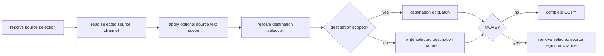

The same orchestrator covers same- and cross-scheme resources. A same-channel
regional MOVE lowers both replacements into one `editBatch` against one source
snapshot. Cross-resource MOVE is ordered destination-then-source and cannot be
globally atomic; if source removal fails after destination success, its Problem
Details state `destinationWritten: true` and identify the destination.

### §send-dispatch SEND dispatch (status-code-as-verb)

Directed SEND (non-null path) routes to scheme's `send`. Status = intent:

- `SEND[200](path)` — write body into resource (WS message, exec stdin).
- `SEND[499](path)` — cancel active subscription ({§stream}).

- §log-uniform-query **Log speaks the universal query contract** — `FIND(log://…)` works like every scheme's FIND. Candidates are worker rows scoped by the coordinate hierarchy ({§log-coordinate-hierarchy}) and projected exactly as READ shows them. Content dialects use `Matcher.matchCandidates`; `~semantic` and `@graph` use the same persistent derivation artifacts and candidate rankers as entries. Results are catalog-shaped items keyed `log:///loop/turn/seq/OP`, and matcher READ retargets per-row READs exactly as entry schemes do. A tag signal filters candidates by the model's own region tags ({§log-region-tagging}). Log remains an event stream in storage; uniformity begins at its readable projection and search attachment, not by forcing logs into the entries table.
- §find-source-agnostic **The content matcher is source-agnostic** — `Matcher.matchCandidates(body, candidates, mimetypes)` applies a content matcher (regex/jsonpath/xpath/glob) to candidates from ANY source, keyed by the caller's own identity (a pathname for entries, a `loop/turn/seq` coordinate for log). The matcher never cares what table the content came from, so FIND/READ with every content dialect works uniformly across schemes BY CONSTRUCTION — `EntryFind` and `Log.find` run the ONE shared primitive rather than re-implementing per scheme. This is the query-layer half of the log-uniformity decision (Q3, Option B): log stays its own event stream, but its rows are candidates the shared matcher covers like any entry's content.
- §matcher-selection-signal **Matching carries navigation evidence** - a matcher is a boolean resource predicate. Each selected resource carries `matches: MatchEvidence[]`, where `MatchEvidence` is `{path?,region?}`. `path` preserves a structural locator. `region` is a complete four-coordinate `TextRegion` only when the finding maps honestly into the exact text the model can READ. Multiple findings on one resource remain one FIND/READ result; exact duplicate evidence deduplicates. Relation findings map their indexed source spans through the same readable text coordinate index. The engine never fabricates a region or guesses which surgical READ the model wants.

`SEND[410](path[#fragment])` also deletes the target entry/channel — an implemented side-effect, NOT taught to the model and with no live/demo surface. The model-facing delete idiom is KILL ({§move}).

§send-dispatch-entry-schemes-501-on-non-410 Other status codes return 501 from entry-bearing schemes by default.

Null-path SEND is broadcast ({§send}), engine-handled.

### §scheme-surface Consumption surface

Per-call context (`src/core/scheme-types.ts`):

```ts
interface PlurnkSchemeContext {
    readonly db: Db;
    readonly workspaceId: number;
    readonly workerId: number;
    readonly loopId: number;
    readonly turnId: number;
    readonly writer: "model" | "client" | "plurnk" | "plugin"; // WriterTier
    readonly signal: AbortSignal | undefined;
    readonly streamEventNotify?: StreamEventNotify;
    readonly wakeWorkerNotify?: WakeWorkerNotify;
    readonly injectWorker?: InjectWorkerNotify;            // worker:// spawn/fork/irc loop-start (§worker-scheme)
    readonly mimetypes?: Mimetypes;
    readonly executors?: ExecutorRegistry;           // boot-discovered EXEC runtimes (§exec)
    readonly tokenize?: (text: string) => number;    // write-time tokenizer (§tokenomics)
    readonly defaultChannelFor?: (scheme: string) => string;
    readonly pushNotice?: (notice: Notice) => void; // → next packet Notices + notice/event (§operation-results)
}
```

The optional engine-/daemon-populated capabilities (the notifiers, `injectWorker`, `executors`, `tokenize`, `defaultChannelFor`, `pushNotice`) are absent in bare test fixtures; a handler that needs one **fail-hards** rather than silently degrading (no default runtime, no silent zero-token write).

Engine → scheme guarantees:

- `ctx` is fresh per call. No mutation across calls.
- FIND or matcher READ on a `category: "data"` scheme with no custom `find()`
  invokes its optional `prepareFind()` and then the standard entry selection.
  Preparation owns discovery/materialization only; query semantics remain
  universal. The prepared write and the query resolve through one canonical
  entry identity, including every component owned by {§scheme-address}.
- `ctx.writer` reflects the actual writer at this dispatch.
- §scheme-surface-writableby-403 `manifest.writableBy` is checked BEFORE invocation; engine returns 403 directly on exclusion.
- `ctx.signal` is wired to the worker's AbortController ({§provider-guarantees-signal-wired}).
- §scheme-surface-exception-500 Scheme exceptions are contract violations. Core records their complete cause in daemon diagnostics, closes the action with a generic core-owned 500 Problem, and surfaces that durable row in the next turn's `errors` section ({§operation-results}). Implementation exception text is not repurposed as a model recovery instruction.

**Tokenization participation.** Core's shared `_entry-crud.ts` write helper
populates `entry_channels.tokens` at write time through `ctx.tokenize`
({§tokenomics-tokens-stored-at-write}). Scheme handlers reach that path through
the public `ctx.entries` capability. Raw database writes are outside the scheme
API and receive no implicit token accounting.

---

## §mimetype Mimetype Contract

Author-facing contract: [`@plurnk/plurnk-mimetypes`](../plurnk-mimetypes/SPEC.md). Below: firing semantics + core's consumption surface.

§mimetype-schemes-do-not-invoke-handlers **Firing semantics.** Scheme writes are verbatim and do not invoke mimetype handlers. `SearchIndex.maintain` processes the current readable projections before model execution and attaches complete search artifacts. Catalog rendering independently asks handlers for extents. Fetch-time materialization is earlier still: the web-fetch sink converts guarded HTTP HTML into the sanitized markdown body that READ serves and search indexes, retaining faithful DOM only as an explicit auxiliary channel. An authored workspace HTML file remains verbatim; its markup is data.

### §mimetype-manifest Manifest

Per the author contract, a package declares `kind: "mimetype"` and one or more
handler entries with a name plus optional glyph and extensions. Discovery
injects that metadata into one handler instance per declared mimetype.
Discovery order and collisions follow {§mimetype-discovery}; resolution
failures follow {§mimetype-error-policy}.

### §mimetype-methods Methods

The author contract is owned by plurnk-mimetypes. Core and its sibling adapters
consume these public methods:

| Method / surface                          | Core-side use                                                                                                               |
|-------------------------------------------|-----------------------------------------------------------------------------------------------------------------------------|
| `ready`, `skippedPackages`                | Complete trust-gated discovery and present withheld-package evidence at daemon boot.                                        |
| `detect`, `process`                       | Resolve mimetypes, extents, readable content, symbols, and references.                                                      |
| `projectionIdentity`                      | Identify installed reader behavior for search artifacts that consume symbols and references.                               |
| `query`                                   | Execute glob/regex/JSONPath/XPath through `@plurnk/plurnk-schemes/Matcher`, which maps typed outcomes to operation results. |
| `embedderInfo`, `embedBatch`, `tokenizer` | Plan and derive semantic-search chunks without reaching into artifact packages.                                             |

`@plurnk/plurnk-contracts` owns model-facing matcher syntax; parsed content
dialects pass to `Mimetypes.query` without reclassification. Mimetype handlers
own content-to-structure interpretation. Core owns candidate-set composition
and the persistent semantic/graph relation indexes.

Cross-cutting promises service relies on:

- Storage writes do not implicitly project; query, indexing, and presentation
  invoke the exact public surface they need.
- Handler projections are deterministic for a given `(content, mimetype, projection identity)` tuple.
- Validation errors propagate (fail-hard).
- Degraded projection (a `grammarMissing` marker) rather than throw when a grammar is absent.

### §handler-bounds What handlers do NOT do

- **Tokenization** — outside the mimetype projection pipeline; core owns packet and stored-weight accounting ({§tokenomics-agnostic-ruler}).
- **Storage** — handlers receive content values and own no entry persistence.
- **Streaming** — handlers see whatever content is current; subscription registry lives between schemes and {§stream}.

### §handler-bundling Bundled vs sibling handlers

No format handler ships inside `@plurnk/plurnk-service`; the framework and
format handlers are sibling workspaces and independently published packages.
The service manifest, not the framework manifest, owns the dependency edges
that compose the default install ({§bundled-set}).

### §mimetype-surface Consumption surface

plurnk-service is mimetype-illiterate. Engine hands channel content + mimetype label to `Mimetypes.process({content, hint})`; the manifest build uses `result.totalLines` for each channel's `lines`. Content reaches the model on READ, not as a rendered preview.

§mimetype-owned-lifecycle `Daemon` owns and disposes the `Mimetypes` instance
it constructs. A constructor-injected instance remains caller-owned. Shutdown
quiesces model work, awaits derivation warming, then disposes the daemon-owned
instance exactly once; mimetype teardown failures retain their causes and join
the same aggregate as module and scheme shutdown failures. A pre-start or
repeated stop does not acquire or dispose resources.

§mimetype-classification-consumption Every engine-owned binary decision uses
the configured `Mimetypes.classify()` path. An installed handler declaration
is authoritative; only an unregistered label reaches the framework's taxonomy.
Absence of the configured registry at an engine classification boundary is an
internal contract failure, never a reason to substitute the pure heuristic.

| Core boundary                  | Classification effect                                      |
|--------------------------------|------------------------------------------------------------|
| File membership materializing | Decode textual content or retain a typed empty binary body. |
| READ/EDIT and COPY/MOVE scope  | Admit text regions or return 415.                           |
| Search derivation              | Build graph/FTS/vector artifacts or mark nonsemantic.       |

The default service installation includes its structured, document, embedding,
and tokenizer leaves through the service manifest. The lean framework also
supports direct consumers that assemble a different set. Tree-sitter grammar
WASM leaves and third-party handlers remain independently installable and
resolve from the same consumer-visible package graph under trust-gated
discovery ({§mimetype-discovery}).

**Token accounting.** The daemon injects no tokenizer into `Mimetypes`; content
projection is independent of packet budgeting. Core uses the stable
model-independent ruler for stored/catalog weights and the model-facing budget
({§tokenomics-agnostic-ruler}). The provider's request-shaped measurement is
confined to provider-physical recovery admission
({§tokenomics-physical-admission}).

§persistent-search-index **Persistent search index.** `SearchIndex.maintain` is the pre-model engine pass. Each searchable resource supplies an address and the exact readable body its READ exposes. Entries supply their default body; `LogBody` resolves each log row's canonical full body from its durable tx/rx envelope. Acquisition schemes project remote source material before storing that body; search never introduces a second hidden text projection. The readable body, mimetype, resolved text/binary classification, mimetype projection identity, embedder configuration, and applicable search exclusion form a content hash. Complete artifacts own FTS, vectors, symbol definitions, and references; resource rows hold only the attachment hash. Binary, empty, and excluded derivations do not invoke handler projections and therefore use one fixed no-projection identity.

§search-exclusion **File-search eligibility is Core policy.**
`PLURNK_SERVICE_SEARCH_EXCLUDE` is a comma-separated table of anchored
body-glob patterns. Patterns containing `/` match the full pathname; every
other pattern matches the basename. Whitespace around entries is ignored, an
empty setting excludes nothing, and the first match is the observable reason.

| Search subject     | Exclusion evaluation                                    |
|--------------------|---------------------------------------------------------|
| `file` entry       | Apply the configured repository-path patterns once.     |
| Other-scheme entry | Always eligible; its pathname is a resource identity.   |
| Log projection     | Always eligible; it has no repository-path membership.  |

A match produces the `excluded` derivation disposition and suppresses graph,
FTS, and vectors while leaving the stored body and direct READ unchanged. The
same reason participates in the derivation hash and is surfaced by diagnostics
and digests. Mimetype detection and projection do not read or report this
scheme policy.

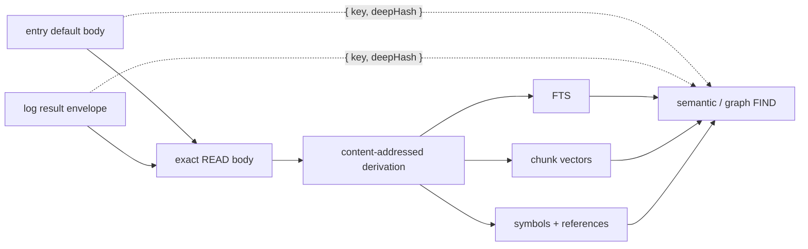

§derivation-exhaustive Identical projections attach the same immutable artifact regardless of their source table. Search primitives therefore consume only `{key, deepHash}` candidates and cannot depend on entry or log storage. Semantic and graph FIND require every selected candidate—and graph's relationship universe—to be attached. An incomplete set returns 503 with `problem.search = {state:"incomplete", indexed, total}`; it never silently searches a partial corpus. Normal execution joins the eager workspace warm before model dispatch, so that response is an interface invariant and diagnostic, not a lazy-search mode.

The graph projection stores only addressable symbol names. A structured-data handler may legitimately emit an empty key into its symbols channel, but the `@graph` matcher cannot name an empty symbol; that one definition is omitted from graph storage without suppressing FTS, vectors, or the remaining definitions. Invalid references and other persistence violations still fail the resource derivation explicitly.

The pass tiles the exact readable text into token-budgeted fragment strings and
sends every tile for one resource through one ordered `mimetypes.embedBatch`
call; it never re-runs a format handler against partial fragments. Workspace
warms coalesce; a request arriving during a pass forces one final rescan.
Progress exposes `preparing`, `indexing`, `complete`, or `failed`. Producer
concurrency, milestone count, and heartbeat interval are operator knobs in
`.env.defaults`.

**Conformance.** Mimetype-specific behavioral tests live in each handler's own surface. plurnk-service intg covers integration: the engine routes through `Mimetypes.process` with the right hint and the catalog reflects `totalLines`; tests use auto-discovery (production handler set); a custom-handler test injects a stub `BaseHandler` via `loader + discovery`.

---

## §channels Channel Topology

§channels-channels-append-only Every entry has named channels. **Channels are append-only content stores** keyed by `(entry_id, name)`. Schemes write content; the engine reads at turn boundaries; mimetype handlers interpret.

### §per-entry-channels Per-entry channels

§per-entry-channels-edit-writes-only-body EDIT writes one channel per call — the channel resolved from the path's fragment (or the scheme's `defaultChannel` when no fragment).

No stored `preview` channel — channel content is pulled on READ, never previewed.

Schemes MAY declare multiple channels (`exec`: stdout/stderr/stdin; `http`: body/header; SSE: per-event-type). Each goes in `manifest.channels` with mimetype pinned; rendered independently.

For a multi-channel streaming READ, persistence and publication are distinct: the scheme may acquire and persist auxiliary channels, but a fragmentless target publishes only the manifest's `defaultChannel`. An explicit fragment publishes that channel. Thus an ordinary HTTP READ presents the sanitized `body`; response metadata and archival DOM remain addressable implementation/diagnostic surfaces rather than ambient model context.

A published default channel renders under the entry's ordinary fragmentless address. The channel name remains internal bookkeeping, just as it is for synchronous entry READs. Only explicitly selected non-default channels render a fragment.

### §no-visibility Entries carry no visibility

Every entry is uniformly listed in the catalog (`FIND(scheme:///**)`, {§packet}) and READable — entries have no per-worker open/folded state. Context curation is the model's, on the **log** (via OPEN/FOLD, {§open-fold}), never on entries.

### §channel-mimetype Mimetype is a (scheme, channel) property — never a default

Mimetype is declared by scheme manifest ({§scheme-manifest}) or supplied per-call for dynamic schemes. Writing a channel without a declared mimetype throws. No default mimetype anywhere.

- §channel-mimetype-cross-mimetype-415 Cross-mimetype COPY/MOVE → 415, never coerces ({§copy}).

### §channel-selection Channel selection in the DSL

DSL targets a specific channel via the URL fragment (`#name`).

Rules:

1. §channel-selection-fragmentless-targets-default-channel Fragment-less paths target the scheme's `defaultChannel`.
2. §channel-selection-fragment-selects-named-channel Paths with a fragment target the named channel.
3. §channel-selection-unknown-channel-400 Unknown channel name → 400, carrying the fact that names the tried fragment and the declared universe (`no channel #results at sh:///1/1/2; channels: stdout, stderr`) — one miss teaches the topology.
4. Schemes without `defaultChannel` reject fragment-less EDIT/READ.
5. §channel-selection-fragment-on-nonexistent-404 Non-default channel EDIT requires entry to exist (404 if absent); default-channel EDIT creates.
| URI                                  | Channel                              |
| ------------------------------------ | ------------------------------------ |
| `worker:///france/capital`           | body (default)                       |
| `sh:///1/1/2#stdout`                 | stdout                               |
| `sh:///1/1/2#stderr`                 | stderr                               |
| `sse://feed/y#data`                  | data                                 |
| `log:///N/T/A`                       | (no channel concept; atomic log row) |

Op implications:

- EDIT to undeclared channel → 400; read-only channel → 405.
- COPY/MOVE source and destination fragments independently select channels.

Client-interface target parameters carry fragments inline (`{ target: "sh:///1/1/2#stderr" }`).

**Wire rendering: default channel is path-only.** Heredoc fence omits `#channel` when channel matches `defaultChannel`. Single-channel entries render path-only; multi-channel entries render the default path-only and only non-default carries `#name`.

```
<<notes.md:...:notes.md             — file scheme (bare)
<<sh:///1/1/2:...:sh:///1/1/2         — exec output default (stdout)
<<sh:///1/1/2#stderr:...:sh:///1/1/2#stderr — non-default
<<log:///1/1/0:...:log:///1/1/0       — atomic log row
```

### §channel-state Channel state — metadata, not gating

§channel-state-state-is-metadata Each channel has `state ∈ {static, active, closed, errored}`. Metadata only, not an engine gate.

- `static` — content final, not being written. Entry schemes after EDIT.
- `active` — scheme is writing (chunks arriving). Streaming schemes during accumulation.
- `closed` — stream ended cleanly. Content final.
- `errored` — stream ended with a failure status, including cancellation. Content may be partial; reads return what accumulated.

§channel-state-schemes-own-state-transitions Schemes own transitions; UPDATE `entry_channels.state` as connection lifecycle progresses. State does not gate reads — schemes return accumulated `content` regardless ({§channel-state-state-is-metadata}).

Model uses state to anticipate growth between turns. Clients use state for UI (spinner / red border / etc.).

---

## §op Op Surface

Per-op semantics. AST shapes come from `@plurnk/plurnk-contracts`'s `PlurnkStatement`. Engine dispatches by `op`; scheme implements per author contract ({§scheme}).

### §edit EDIT

AST: `{ op: "EDIT", target, body: string | null, signal: tags | null, lineMarker? }`.

- Resolves target channel from fragment ({§channel-selection}); unknown channel → 400; undeclared in manifest → engine crash ({§channel-mimetype}).
- §edit-null-clears Writes the body; `body: null` clears it.
- §edit-status-201-200 Returns `{ status: 201, entryId }` for a new entry and
  `{ status: 200, entryId }` for a content update.
- §edit-noop-304 A write that changes nothing — identical content and no new tag — returns `{ status: 304, entryId }`, mirroring OPEN/FOLD's idempotence ({§open-fold}).
- §edit-tags-additive Tags from `signal[]` apply additively via `entry_tags` (scheme may vary).
- §edit-marker-required-on-existing **A markerless EDIT is CREATE-ONLY — there is no easy-clobber path on an existing entry.** A `<L>` marker scopes an EDIT to a range; without one, the body becomes the entry's WHOLE content — legitimate and required for a fresh entry (nothing exists to scope into), but on an EXISTING entry a missing marker is refused **400**, never a silent full replace. A deliberate full rewrite states that intent explicitly: `<1,-1>` resolves through the ordinary marker math to the same whole-content replacement, so the capability is available but cannot be selected by omission.

A `file:///` member EDIT diverges from this immediate-write contract: it diffs against the entry snapshot (the body channel, never a fresh disk read) and **proposes** (202) a disk write that lands via a compare-and-swap on accept. See {§membership-edit-write-cas} and the proposal lifecycle {§proposal}. The marker-required rule above applies identically here — an existing file is never markerlessly replaced.

### §read READ

AST: `{ op: "READ", target, body: MatcherBody | null, signal: tags | null, lineMarker? }`.

- §read-read-content Returns channel content and mimetype.
- §read-read-404 Returns 404 when the channel is absent.
- `body` is a resource predicate dispatched per {§matcher-dispatch}.
- §read-selection-projection `lineMarker` projects text through {§text-region} after selection. It never limits the content searched or paginates match occurrences. Without a marker, READ returns each selected resource's complete readable content. A miss is 204 before projection; an invalid text region is 416.
- Semantic READ uses a leading decimal as its optional similarity threshold. The remaining one, two, or four integers are the text projection. Without a leading decimal, semantic selection uses the configured default and every integer component belongs to READ projection. Direct FIND instead applies remaining integers to ranked result positions; only a markerless semantic FIND uses the configured default top-K ({§find-semantic-default-top-k}).

### §open-fold OPEN / FOLD

AST: `{ op: "OPEN"|"FOLD", target, body: MatcherBody | null, signal: tags | null, lineMarker: null }`.

OPEN/FOLD operate on the **log** (`log:///`) - the model's context-curation surface ({§packet}). FOLD collapses a log row to its path; OPEN restores its ordinary packet projection, including any preview bound ({§body-projection}). The canonical full body remains available through READ of the log URI. Non-destructive: rows and bodies persist. On any valid row, applying its current state again or targeting a bodyless row is a successful visibility no-op; malformed targets and nonexistent exact coordinates still fail at their addressing boundary. Entries carry no visibility ({§no-visibility}), so OPEN/FOLD against an entry scheme returns 501.

### §jsonplurnk The Log's wire format

The `## Log` section renders as a fenced `jsonplurnk` block - a JSON array of entry objects, otherwise-valid JSON with **exactly one** deviation: an open, nonempty `body` is a raw HEREDOC (`<<:::TAG ... :::TAG`, TAG = the entry's target/log URI), rendered with universal `N:` line prefixes, never as a JSON-escaped string. The carve-out is localized to `body`, so the strip-parser is trivial: after `"body":`, `<<:::TAG` opens and `:::TAG` at column 0 closes; replacing that block with an escaped string recovers strict JSON through `@plurnk/plurnk-contracts`. The body shape is a strict three-state invariant: `"display":"none","body":""` for no body, `"display":"folded"` with the ordinary projection withheld, and `"display":"open","body":HEREDOC` with it shown. A bounded projection also carries `"overflow":"Body content truncated. Use READ log:///<coordinate>/<op> to view the full body."` whether open or folded. The block is data only - no prose leads the fence. `tokens` is the ruler-weight of the row's ordinary packet body: the room OPEN adds and FOLD saves. A FIND's `itemsTokenTotal` is the ruler-weight of the matched entries themselves: the room READing them takes. These are curation weights, not dollars. The invariants bind regardless of shape ({§packet}): addressability (`path`/`target`/`#channel`/numbered bodies), weighability (per-item `tokens`), honesty (every 4xx/5xx row and the exact body/display state). {§jsonplurnk} {§packet-jsonplurnk-exception}

§jsonplurnk-dynamic-fence The opening fence length is **dynamic**: one backtick longer than the longest backtick run in the rendered entries (floor 3). A body can carry arbitrary content — a READ of a doc whose own text opens a column-0 triple-backtick fence — which a fixed opener would let close the block early; a dynamic opener can never be closed by its own body content (CommonMark closes a fence only on a line of at least its own length), independent of the `N:` numbering that incidentally keeps text bodies off column 0.

### §model-entry The model's own emission, mirrored back

§model-entry-log-curation A `model` log row is the model's **verbatim admitted emission**, mirrored back so it can inspect and curate its own behavior. Actionless, like an `op='error'` row ({§operation-results}): no target, no op executed; `tx` is empty and the emission lives in `rx.content`, typed `text/vnd.plurnk`. **Always born FOLDED** (budget-neutral), line-numbered like all content, and OPEN/FOLD/KILL-able like any log row. Log-KILL clears the `writableBy` gate for the model (the DB-storage curation lever plurnk.md teaches; Log's handler surface — kill only — keeps every other mutating op at 501). The engine writes one after each admitted model turn. Rejected attempts never create model rows.

- §log-coordinate-hierarchy **Log coordinates are a hierarchical prefix; the trailing slash is optional** — a coordinate is `loop/turn/sequence`, and a PARTIAL coordinate selects its descendants: `log:///1` = loop 1's rows, `log:///1/2` = turn 1/2's rows, `log:///1/2/3` = the one row. A full coordinate is always three parts, so a one- or two-part path is unambiguously a prefix — the trailing slash is an optional alias (`log:///1/2` ≡ `log:///1/2/`), uniform with `READ(worker:///docs/)`. Rendered row paths append `/OP` as optional self-documentation, not a fourth resource level: `log:///1/2/*` selects the turn's item rows, while `log:///**/READ` may deliberately filter that decoration.
- §log-curation-folder-idiom **Log curation speaks the folder idiom; a zero-match sweep is a no-op success** — OPEN/FOLD/KILL take a concrete coordinate or a path-glob, and a **trailing slash or a partial coordinate means "the contents"** ({§log-coordinate-hierarchy}) exactly as `READ(worker:///docs/)` fans out a folder: `FOLD(log:///1/2)` folds turn 1/2's rows. A **well-formed glob that matches nothing is 204 with `matched: 0`**; a successful sweep's rx carries `matched: N`. 400 remains for a malformed target only (no coordinate, no glob, no slash).
- §log-region-tagging **Named region tagging: FOLD applies, OPEN/FIND filter** — the log's write-op is **FOLD**, because EDIT can't reach engine-written rows (the OP×resource matrix): `FOLD[tag](region)` folds the region AND stamps the tag on it, additively ({§edit-tags-additive}), via `log_tags` (CASCADE-erased with the row on KILL). The read-ops filter: `OPEN[tag]` and `FIND[tag]` select rows carrying EVERY listed tag ({§find-tag-filter-and-semantics}) — a **targetless** `OPEN[tag]` recalls the whole tagged working-set across the worker, a scoped one filters within its glob; an unknown tag matches nothing (204, no-op success). `[tag]`-applies-on-the-write-op / `[tag]`-filters-on-the-read-ops is the same split entries already use (EDIT vs FIND); FOLD merely stands in for EDIT because the log is not an entry scheme. A fork carries a row's tags with its fold-state ({§machine-processes-fork-copies-the-log}). The model curates named working-sets of its own memory: file-away-under-a-name, recall-by-name.
- §log-curation-set-selection **Set selection, never positional curation** — target/glob, optional body matcher, and (for OPEN) tag filters compose into the affected row set. FOLD's tags apply after selection. OPEN and FOLD have no `<L>` marker and never paginate that set; FIND owns result pagination.

The worker's **first** model row is exceptional: a born-OPEN turn-0 **exemplar** — a minimal worked example (`PLAN` → environment `FIND`s → `SEND[102]`) the model always opens on, so the grammar can stay thin (the example teaches the syntax, not a heavy grammar). Its `SEND[102]` names the next action, matching the continuation contract. {§model-entry}

§fold-open-meta-operations **OPEN and FOLD are meta-operations — render directives, not actions.** They change how the world *displays*, never what it *is* (scrolling, not editing). A **successful** OPEN/FOLD **is recorded in the log** but **suppressed from the packet render**: the row exists for forensics — a curation act with NO trace is how a weak model folding its own task frame stayed invisible until a database dig — while the render still costs it nothing, so FOLD stays genuinely free (the original rowless design's concern, met by hide-not-drop). The emission also survives verbatim in the `model` mirror. A **failed** OPEN/FOLD (bad target or matcher) renders normally with its status — errors are signals. The idle-turn gate reads the *emitted statements*, so a pure-curation turn is work, never idleness.

§kill-log-receipt-suppressed **A successful KILL of a log item is suppressed from the render too — same principle, different mechanism.** KILL is a real deletion (not a meta-op), but once it has executed against a `log://` target its tombstone is *spent*: the killed row is gone, and a receipt saying "I deleted it" is no forward-actionable context. So a **successful** `KILL` whose target is a **log item** is recorded in the DB (forensics) and suppressed from the packet, while its emission survives in the `model` mirror. Without suppression, every deleted row would create a replacement receipt, so per-row curation could not shrink the log. The suppression is **scoped to log targets**: a `KILL` of a `worker://` note, an `sh://` stream, or any stored artifact is a **world mutation**, not log housekeeping, and stays visible. A **failed** KILL (bad target, no match ≠ error but a malformed coordinate is) renders like any error.

### §copy COPY (engine-orchestrated)

AST: `{ op: "COPY", target (source), lineMarker (source scope),
body: ResourceSelection (destination), signal: tags | null }`.

1. §copy-missing-source-404 Resolve source path, channel, and optional text scope; missing resource or
   channel is 404. Binary whole-channel COPY is valid, but a binary region is
   415.
2. Resolve destination path, channel, and optional text scope. Source and
   destination mimetypes must agree or the result is 415.
3. A scoped destination must already exist and is mutated through the
   destination scheme's `editBatch`.
4. An unscoped destination writes only its selected channel. Existing other
   channels survive.
   - §copy-conflict-409 Different content in that channel is 409.
   - §copy-noop-304 Identical content with no new tag is 304.
5. Only explicit `signal` tags are applied, additively, to the destination.
   Source tags are never copied.

§copy-cross-scheme-copy The result is 201 for a new entry, 200 for a write, 304 for an exact no-op, or
202 when the owning scheme requires proposal review. Same- and cross-scheme
COPY use this one orchestrator.

### §move MOVE (engine-orchestrated)

AST: `{ op: "MOVE", target (source), lineMarker (source scope),
body: ResourceSelection (destination), signal: tags | null }`.

- §move-relocation-deletes-source MOVE first performs the destination mutation under {§copy}, then removes only
  the selected source region or channel. A whole-channel MOVE deletes the
  source entry only when that was its final channel.
- A same-channel regional MOVE applies destination insertion and source
  deletion in one same-snapshot `editBatch`; overlapping regions are 409.
- A cross-resource destination failure leaves the source untouched. A source
  failure after destination success is an explicit partial failure with
  `destinationWritten: true`. Proposal acceptance/rejection follows the same
  ordered rule.
- §move-cross-scheme-move Same- and cross-scheme resources use the same
  contract; there is no global cross-scheme transaction.
- §move-missing-source-404 A missing source is 404.
- §move-null-body-400 **MOVE is not a delete operation.** A null body returns
  400 because a destination is required.
- §move-dev-null-not-special `/dev/null` carries no special meaning; KILL is
  the canonical standalone delete.

Log history preserved — `log_entries` stores path tuple as text, not FK to `entries.id`.

### §find FIND

AST: `{ op: "FIND", target (scope), body: MatcherBody | null (predicate), signal: tags | null, lineMarker? }`.

- §find-scope-prefix-filter Filters entries within scope. A **bare** path is the exact entry; an explicit **shell glob**, classified once by {§path-glob}, expands to a scope. Path globs use segment semantics: `*` and `?` never cross `/`; `**` does. Terminal `*` and `**` are structural catalog selectors and include dot-prefixed entries, so a complete map does not hide `.env.defaults` or `.github`; richer patterns retain native shell behavior. SQLite prefix queries may reduce the candidate set but never decide the match. A trailing slash is a recursive folder scope only for a scheme whose manifest declares `folderScopes: true`; otherwise it is ordinary resource syntax and READ dispatches it directly. This is an explicit plugin contract, never inferred from URL punctuation: new schemes cannot accidentally turn a root resource into unbounded fan-out. For declared folder schemes the same target contract governs FIND and READ - bare = the entry, folder/glob = a scope.
- An exact target resolves to the same canonical `(scheme, pathname)` identity
  as READ, entry CRUD, and any preceding `prepareFind()`. URI authorities are
  identity-bearing: `https://example.com/page` queries
  `(https, /example.com/page)`, never `(https, /page)`.
- §find-glob-filter-on-content `body` matcher operates on entry content (glob/regex/jsonpath/xpath), per `plurnk.md` "Pattern Filtering"; the path-glob lives in the (target), not the body.
- §find-semantic-default-top-k Every matcher operates only over the candidate set selected by `(target)` and `[tags]`; relation matchers do not bypass that selection. Semantic ranking is exhaustive within that candidate set, then applies the ordinary FIND result scope - never rank the wider corpus and discard out-of-scope hits afterward, which changes ranking meaning and leaks entries across an exact target. A semantic matcher with no `<scope>` returns the configured `PLURNK_SERVICE_SEMANTIC_TOP_K` highest-ranked results. Otherwise integers retain FIND's positional contract: `<N>` selects result N and `<N,M>` selects the inclusive range. A leading decimal first applies a minimum cosine-similarity threshold; following integers select positions within that ranked threshold set. Thus `<0.7,10,20>` means threshold 0.7 followed by results 10 through 20, while positions 1 through K use the ordinary `<1,K>` range. The FIND render budget remains independent of semantic ranking.
- §find-tag-filter-and-semantics `signal` is a tag filter; entries match if they have ALL listed tags.
- §find-scoped-isolation Workspace + scheme scoped — no cross-workspace/cross-scheme leakage.
- §find-result-catalog-rows Returns
  `FindResult { status, content, mimetype, results, matches, pathnames }`. A
  **body-less** FIND is the **catalog**. Ordinary rows are one per resource:
  `{ path, stream?, tags?, channels: { <uri>: { mimetype, tokens, lines } } }`.
  A terminal single-star path scope is a one-level map: direct entries retain
  that shape, while deeper first-segment directories collapse to
  `{ path: "dir/**", items, tokens }`, where the selector and both aggregates
  describe the exact recursive subtree. Scope summaries are navigation
  metadata, not resources or hidden READ fan-out matches. A matcher FIND
  retains the same one-row-per-resource unit and adds
  `matches: MatchEvidence[]` ({§matcher-selection-signal}). FIND pagination
  counts selected resources, never occurrences. Resource order is rank for
  `~`semantic and candidate order otherwise; evidence retains dialect order
  and exact duplicates deduplicate. `content` is one valid compact JSON array
  with exactly one top-level item per physical line: objects carry no
  pretty-print whitespace, the opening bracket shares the first row, the
  closing bracket shares the last, and only the `N-1` item-boundary newlines
  are added. Universal packet numbering therefore makes result ordinal N
  addressable as line N, matching `<N>` pagination without a second coordinate
  system. Empty and single-item arrays remain one line.
- §find-count-not-contents **Over the render budget, FIND returns a count, not
  contents** (`PLURNK_SERVICE_FIND_MAX_MATCHES`). A repo-scale recursive
  FIND cannot enumerate safely. When the selected-resource count exceeds the
  budget, `overflow` and `itemsTokenTotal` carry the count and aggregate weight
  while `results`, `matches`, and `pathnames` are empty; no caller may perform
  hidden work from content the model was denied. The gate is independent of
  model window size. `0`/unset disables it.

### §send SEND

AST: `{ op: "SEND", target: ParsedPath | null, body: SendBody | null, signal: number | null }`.

- **Broadcast** (path null): the loop's disposition verb. `signal` is the model's *claim* about the worker's state — see the terminal contract.
- **Directed** (path non-null): routes to `scheme.send` per {§send-dispatch} — stream control / cross-worker irc, never a loop terminal.

**Terminal contract — three signals over a structured-concurrency scope.** A broadcast SEND's status is a claim the engine **verifies against the worker's actual state**, never a verdict it trusts. The model signals one intention — **continue (102)**, **done (200)**, or **wait (202)** — plus **499**, give up. Pending work is either **J**, a live child or stream the loop spawned (the join), or **U**, a completed result not yet observed in a packet: this turn's retrievals or failures, or a stream/child conclusion that raced ahead of its delivery. `<T,P>` is an explicit timeout / poll override for external streaming work; ordinary child joins are event-driven and carry no polling fallback.

| intention | ∅ (nothing pending) | J (live spawned work) | U (completed, unobserved result) |
|---|---|---|---|
| **102** continue | next turn | next turn | next turn |
| **200** done | **resolved** — terminal, loop ends | **refused** — Premature-Terminate (KILL to abandon, or wait) | **refused** — forced next turn to see the result |
| **202** wait | **resolves like 200** — a wait on zero things is satisfied; `<-1>+∅` is a bid to hang the agent, folded to done, never honored | **block on the join** — the loop sleeps (`<T>`/`<-1>` bound it, `<P>` polls); its work's conclusion **reawakens the same loop**, prompt intact ({§worker-lifecycle-child-wake}, {§worker-lifecycle-wake-liveness}) | resolves next turn (≈ continue) |

§wait-obligation-matrix **499** gives up regardless of obligations and cancels the unresolved descendant scope — the model's one self-decided failure ({§state-terms}). The surface is small on purpose. The **one** non-obvious cell is **200 with an obligation in flight** — a contradiction (you claimed done while you owe work), which the engine holds you to via Premature-Terminate below. A child join is bounded by the child's terminal transition; an external stream may carry an explicit `<T,P>` policy.

§loop-terminal-authorship **Terminal authorship is explicit when external.**

| `terminated_by` | Meaning | Presentation |
|---|---|---|
| `NULL` | The model's own terminal or an engine verdict whose exact result already carries the story. An already-drained join is the model's own successful terminal. | No authorship marker. |
| `cancel` | An external client cancelled the structured scope ({§methods-loop-cancel}). | COLLECT and the termination delta prepend a cancellation marker to the recorded reason, so cancellation cannot masquerade as a deliverable. The model's prior log rows remain untouched. |

The engine's failure terminals — **500** (strike threshold) and **508** (cycle), {§engine-rails} — are never the model's to pick; they are the engine ruling the loop failed. The surface is small on purpose: the model says done, waiting, or giving up, and is never asked to hold a correct opinion about *how* it failed or *whether* it can be woken — the engine decides those from state.

**Rail accounting is separate from model-facing evidence.** The model sees the
specific correction on its next packet, never the private strike count
({§rail-accounting-private}). Each state below contributes one strike and lets
the loop continue; repeated offenses terminate through the engine's 500.

| state                 | model-facing evidence                                        | accounting |
|-----------------------|--------------------------------------------------------------|------------|
| Idle turn             | An engine-rail error row with the corrective disposition     | One strike |
| Premature termination | The refused SEND row at 409 with pending-kind Problem Detail | One strike |

- §send-idle-turn **Idle turn** — a continuing turn (102) whose ops are only PLAN/SEND — no work op. The model continued with nothing to do. The steer, verbatim: *"If your work is done, conclude with 200. If you're waiting on a child or stream you spawned, SEND[202] to block on it — a 202 with nothing to wait on simply concludes."*
- §send-premature-terminate **Premature terminate — the pending set.**
  Completion is gated by one rule: *nothing pending may be silently
  discarded*. Pending work has two states: **live obligations** (open
  streams/spawns and live child workers) and **completed-but-unobserved
  results** (same-turn READ/FIND/OPEN results, failed operations, terminal
  stream output without a terminal foisted READ, and child results queued for
  the next packet). The set is judged at the disposition's own dispatch, after
  earlier operations in the emission. `[200]` over any member is refused 409
  and the loop continues; every refusal strikes uniformly, including a
  retrieval-only refusal. The pending kind changes the corrective message, not
  rail accounting. `[499]` deliberately abandons regardless.
- §send-undelivered-child-term **Completion is not delivery.** A result becomes
  observed only after crossing a packet boundary. `SEND[202]` parks only on
  live obligations. If work has completed but is unobserved, it continues
  directly to the next packet because the wake edge has already fired; only a
  genuinely empty set resolves immediately like `[200]`.
- §send-300-choices **SEND[300] is an operator question - a PROPOSAL using the same stop-the-world system as file edits.** Enablement cascades: `PLURNK_QUESTIONS=0` is a servicewide ceiling; otherwise the client affirmatively requests per workspace (`settings.questions: true` at workspace creation), which ALSO injects the required `questions.md` teaching - capability and teaching gate as one ({§teaching-corpus}). An enabled workspace fails doc materialization with the read cause if that source is broken; a disabled workspace does not consume it. Enabled: the `;`-delimited body parses leniently (first segment the question, the rest choices; zero choices = an open question - never malformed), and the ask raises a proposal: dispatch stops the world, `loop/proposal` carries `{question, choices}` in attrs, and the client's accepted proposal body delivers the ANSWER - written into the ask's own model-facing rx (`{"status":200,"body":...}`), read next packet. Reject/timeout resolve through the standard {§proposal} semantics; the turn records a continue either way (never a 300 terminal), and the loop simply proceeds. Loop auto never auto-answers a question - it exists precisely to stop the world for a human, and the workspace opted in. Disabled: refused 409 with a self-decide steer, never a park into the void.

### §exec EXEC

AST: `{ op: "EXEC", target (optional input source, program, or cwd), body: string | null (command), signal: string | null (runtime tag), lineMarker (timeout/poll) }`.

§exec-target-routing Engine routes unconditionally to the `exec` scheme and
canonicalizes `(target)` before effect admission. With no directory override,
`cwd` is the workspace's `project_root`, where the File scheme writes — never
the daemon's own cwd. A non-file scheme address is an eligible content source
only when the registered scheme is a data scheme implementing READ. After
acceptance, core reparses the complete authored address and resolves one exact,
unscoped READ through that scheme's ordinary handler and addressed context.

| Authored target                       | Body      | Canonical effect target | Accepted executor realization                         |
| ------------------------------------- | --------- | ----------------------- | ----------------------------------------------------- |
| Absent                                | Non-empty | `null`                  | Body is the command; target is absent.                |
| Local/file directory                  | Non-empty | `null`                  | Directory becomes `cwd`; target is absent.            |
| Local/file file or stat miss          | Any       | Authored local path     | Path is the program/data target; body is its input.   |
| Readable data-scheme address           | Empty     | `null`                  | Selected READ content becomes the command.            |
| Readable data-scheme address           | Non-empty | Authored address        | Selected READ content becomes a local target.         |

Loop-flag authority follows the same target classification:

| Target class                   | Schemes that must be active              |
| ------------------------------ | ---------------------------------------- |
| Absent, local, or `file://`     | `exec`                                   |
| Non-file scheme address        | `exec` and the addressed source scheme   |

A stat miss takes the file arm so the runtime reports its own not-found rather
than dispatch returning 400. An empty body is legal for a local file or scheme
command source; it remains a 400 with no target or a directory target. For a
scheme-data target, the authored address is an opaque target-present identity:
the executor neither resolves it nor sees it during `run()`; core materializes
the selected content only after acceptance and supplies that local path.
Worker and runtime-stream authorities, query, fragment, request metadata, and
every other address component therefore retain their owning READ semantics. A
failed source READ is preserved as the proposal-application failure. A
successful READ with no string representation is refused 422; `""` remains a
present representation, although it cannot by itself become an executable
command.

Core calls `effect()` once against this canonical target, without command text,
stores the resulting fact with the invocation, and reuses it unchanged for
proposal policy, application, stream registration, and effect-qualified hold
policy. The post-acceptance materialization path never triggers reclassification.

§exec-registry-resolves The runtime slot (`signal`) selects an executor,
resolved against the boot-time `ExecutorRegistry`: siblings are discovered and
probed at startup, and availability is cached. An absent or empty tag selects
`sh`; a non-empty tag selects exactly that registered executable tool. Unknown
tags are refused 501 with direction to use only the advertised catalogue or
put a complete command in bare `EXEC`; they are never reinterpreted as shell
command words. An unavailable runtime is also 501 and carries the probe
`detail`.

Per-tool programs such as `go`, `cargo`, `make`, and `npm` do not earn executor tags merely because they are executables; they are complete shell commands in bare `EXEC` or `EXEC[sh]`. Registered tags exist only for tools that own a distinct body, target, or output contract. {§exec-registry-resolves}

**Timeout and poll — `<T,P>` on the `<L>` slot (grammar 0.74.20).** EXEC
repurposes the line-marker slot as `<timeout, poll>` in **seconds**, the same
unit as `stream.seconds` in the catalog.

§exec-timeout `T` (`mark[0]`) caps the spawn's lifetime. At `T>0` the service
aborts it — a bounded reap, polite signal then SIGKILL after
`PLURNK_SERVICE_EXEC_KILL_GRACE_MS` — and stamps the stream **504**, distinct
from a deliberate kill (499) or a clean exit (200). `-1` or absent is unbounded
(loop-life bounded), the background-stream behavior. **`0` is turn-scoped**:
the stream is reaped at the worker's next pre-turn via the registry abort,
before the turn's own spawns, so it never survives into the subsequent turn;
its terminal output surfaces born-OPEN like any close ({§exec-stream}).

§exec-poll `P` (`mark[1]`) is the **poll cadence**, stored on the subscription.
While the loop is blocked on a `SEND[202]` wait for that stream, the daemon arms
a per-worker timer for the tightest open poll cadence and resumes the blocked
loop every P seconds, floored by `PLURNK_SERVICE_EXEC_WAIT_MS` so it cannot tick
faster than a turn settles, to inspect progress. It does **nothing while the
loop is active** because ambient stream deltas already surface progress. An
open stream without `P` uses exponential backoff
(`PLURNK_SERVICE_EXEC_POLL_SEC` and `PLURNK_SERVICE_EXEC_POLL_TURNS`); explicit
`<,P>` wins and `<,0>` disables polling for that stream. Open subscriptions
aggregate into the worker's one timer as follows:

| Open-stream policies                          | Worker timer                  |
| --------------------------------------------- | ----------------------------- |
| Any positive `P`                              | The smallest positive cadence |
| No positive `P`, at least one omitted `P`     | Exponential backoff           |
| Every `P` is explicit zero                    | Disabled                      |

Child-only joins never use this timer: child settlement is their durable wake
edge. Stream closure remains a wake edge under every poll policy.

§exec-host-proposes **Effect-gating.** Each executor declares an `effect` (`pure` | `read` | `host`); the service maps it to policy (`EffectPolicy`). A `host` runtime (subprocess; file-backed sqlite) mutates the host → **propose** (lifecycle {§proposal}): the worker waits for a human gate, then spawns and writes stdout/stderr to channels of a `<runtime>:///<loop>/<turn>/<seq>` entry (the runtime tag is the URI scheme, {§exec}; the coordinate matches the op's log-row coordinate, e.g. `sh:///1/1/2`), returning `102 Processing` immediately. Channel state transitions (`active` → `closed`/`errored`) drive what the model sees at subsequent turn boundaries ({§channel-state}).

§entry-owner **Every entry is owned by a worker.** `entries.owner_id` is a real worker row, part of the identity key — the workspace's reserved `commons` worker for shared content, the spawning worker for capability streams. Never NULL (NULLs are distinct under UNIQUE — a nullable owner would let the shared-content identity fragment into duplicate rows), never rendered into a URI or packet: the model addresses owners by NAME in the authority slot. `plurnk` (the kernel) and `commons` are the two reserved rows; no spawn or client may take their names (nor `~`, the current-worker sigil).

§stream-owner-scoped **Capability streams are owner-scoped.** Concurrent workers' stream coordinates are loop-relative and IDENTICAL (every worker's first loop is sequence 1), so the entry identity keys on the owner and identical coordinates across workers are distinct rows. The address's authority names the owner: **empty = the calling worker** — your own streams need no qualifier, so a fan-out sibling's output can never surface under your READ — and a **named authority** reaches that worker's streams gated by ancestry (the reader is the owner or an ancestor; oversight flows down the tree, unknown-or-unpermitted resolves 404 with no existence leak). KILL stays self-only — a parent controls a child through the worker lifecycle, never by reaching into its streams. The storage pathname stays the bare loop coordinate; the owner rides the column, so nothing model-facing carries a worker id.

§worker-auto-name **Auto-names are id-free ordinals** — worker names are the addressable authority, so an auto-name is `<prefix>-<N>` (per-workspace monotonic count, the fork `<parent>-fork-<N>` pattern), never a timestamp-hash that would leak machine identity through the hostname. The semantic suffix remains intact; when the complete name would exceed `WORKER_NAME`, generation shortens only the inherited prefix until the predicate admits it. Auto-names never reuse an existing literal and pass through {§worker-name-minting} like explicit names. Name selection and worker creation are one atomic claim: concurrent allocators receive distinct literals, while concurrent ensures of a workspace's default conversation converge on one root worker.

§exec-readpure-ungated A `read` runtime (observes external state, e.g. search) or `pure` runtime (no observable effect, e.g. `:memory:` sqlite) is side-effect-free → **auto-run**: no proposal, no human gate, no notification. Core persists the prepared operation before applying it; that write-ahead staging has no resolution waiter and therefore cannot enter proposal discovery ({§proposal-list}). It skips the gate a host command faces, but it does NOT resolve in-band — like every exec it backgrounds and streams, its output reaching the model through the environment-observation injector (a foisted READ of the stream's new bytes each turn, {§exec-stream}), never a same-turn receipt.

§exec-stream **Stream surfacing.** An exec's output is *observed, not fetched*. Each turn the environment-observation injector reads each owned channel from its byte cursor and publishes the new bytes as an `origin=plurnk` READ at `<runtime>:///<coord>#<channel>`. Streaming deltas are folded; the terminal delta is born OPEN. The row obeys the universal body projection ({§body-projection}): its packet body is bounded and its exact canonical body remains READable through the row's log URI. A stream that closes before a same-turn wait remains pending until this terminal READ crosses the next packet boundary. The EXEC row separately records the command.

`KILL(<runtime>:///<loop>/<turn>/<seq>)` cancels an active subprocess via
the subscription registry's stored controller. A terminal stream is immutable:
499 returns 410 (already killed), every other terminal status returns an RFC
9457 409 Problem carrying `terminalStatus`, and an unknown address returns 404.
The runtime scheme participates in the durable lookup; a completed `sh:///`
stream cannot fall through an internal `exec`-only query. {§stream-control}

§exec-env-scoped **Scoped environment.** An EXEC subprocess inherits the *project's* environment — its `.env`, the standard shell vars — so the model's commands run as the project expects; but never plurnk's own secrets: the provider API keys and `PLURNK_*` config are stripped before the spawn, so a model-executed command can't `printenv` the engine's keys. The service owns the scoping policy (the denylist); the executor spawns with the env it is handed.
- §exec-hold-until-concluded **The turn-hold exception** — for runtimes in `PLURNK_SERVICE_EXEC_HOLD` (a decision-table env, shipped listing the search family), an in-flight stream **pauses the cycle**: the next packet does not assemble until the stream concludes, so the model never burns a turn asking "are we there yet" about a result the engine controls end-to-end. This exception is limited to seconds-bounded runtimes whose final result the engine controls end-to-end. Bounded by `PLURNK_SERVICE_EXEC_HOLD_MS` and **fail-open**: at the cap the standard cycle resumes untouched (waits, wakes, polls). Zero grammar or teaching surface — the model emits `EXEC + SEND[102]` as ever; the wake-shaped world simply arrives one packet sooner. Lives at the post-EXEC breath seam in `runLoop`, upstream of `PLURNK_SERVICE_EXEC_WAIT_MS`. A bare entry holds ALL of a runtime's spawns; a `<runtime>:<effect>` suffix (`github:read`) holds only that effect-class — an MCP server is one runtime whose tools split (a `read` `get_issue` is instant; a `host` `run_migration` is a slow mutation), so an operator opts the known-fast read-class in without parking on the mutation. Conservative stays default: an arbitrary third-party server's latency never parks the engine unless a suffix opts a class in.
- §exec-entry-sink **The entry() sink** — an executor may *request* entry materialization (execs SPEC §2.6: every sink is a consumer-implemented callback; the executor owns zero substrate). The service implements it in exec dispatch: `entry(path, content: string | null, {tags, mimetype?})` upserts the entry (writeEntry; tags **UNIONED** across writes — a re-seen URL keeps its history of query slugs), then journals ONE typed `EDIT` row in the reserved `plurnk` worker's log — the fs-fiction pattern, `source` = the calling worker, `tokens` = the content's count, `attrs` carrying the tags plus `kind:"entry_materialized"`. Durable replay and clients retain that exact creation event. The model packet projects the typed event as a folded system `READ` of the resulting ordinary resource: its relevant truth is readable state now available in the environment, not an agent-authored mutation. **The executor owns no fetcher:** a `content: null` is a *declaration* — the service acquires the page through schemes-http's checked byte primitive, accepts a present MIME-rendered response, and lazily tries browser rendering only when that projection is absent {§html-materialization}. A failed acquisition, materialization exception, or absent final projection rejects the sink and produces no HTTP entry, but does not invalidate a search runtime's upstream discovery row; materialization exceptions retain their cause in daemon diagnostics. A non-null `content` is the materialize-given-body path (the caller already holds the bytes and states their mimetype). **No page body ever rides a packet**; the announcement is the folded row's meta (path + tokens + tags), and the model READs/~queries what it chooses. Parallel `entry()` calls serialize on a per-spawn chain; a rejected call leaves the chain healthy. The spawn tail settles that complete chain before unregistering, so executor idleness and shutdown are barriers over its materialization writes. The narration context (one plurnk-worker turn) is lazy per spawn, not per entry.

### §proposal The proposal lifecycle

§proposal-202-pauses A side-effecting op does not execute on dispatch — it **proposes**. The scheme returns **202** (an EXEC `host` runtime {§exec}, an EDIT to a member file {§membership}); the engine writes the log row `state='proposed'`, registers a waiter keyed by `logEntryId`, and **pauses `dispatch`** awaiting a resolution. The pause is internal to dispatch — the turn has already closed, so {§grinder} strike accounting sees the *resolved* status, never the 202. On accept the status becomes 200 and the scheme's effect runs.

**Resolution arrives through one lifecycle:**

- **Client disposition** ({§methods-proposal-resolve}) — a client interface delivers accept, reject, or cancel; AG-UI uses standard resume entries ({§agui-proposal-resolve}).
- **Loop disposition** ({§proposal-disposition}) — core applies the exact automatic accept/reject before observational subscribers run; automatic policy is not an event listener or client fallback.
- §proposal-timeout-cancels **Timeout is OPT-IN; the shipped default is a world that WAITS** - `PLURNK_SERVICE_PROPOSAL_TIMEOUT_MS` empty (shipped) means a pending proposal - a file edit awaiting review or a [300] question - waits indefinitely for its human: absence is not an answer, so the service does not synthesize a cancellation. A finite positive millisecond value establishes the bound; then elapsing synthesizes `cancel` (outcome `timeout`), server-side, needing no client. Every other explicit value fails at the proposal lifecycle owner and terminalizes an already-written proposal rather than silently choosing an indefinite wait.

**The decision drives a one-way state transition** on `log_entries.state` (resolution is idempotent — `WHERE state='proposed'`, so a second resolution 404s):

| decision                        | state | `status_rx` | default outcome | effect |
|---------------------------------|---|---|---|---|
| §proposal-accept-applies accept | `resolved` | 200 | — | runs the scheme's **`applyResolution`** — the real side effect (disk write, exec spawn). A failing apply (≥400) downgrades to reject, carrying the apply's own outcome — e.g. a member EDIT's `write_conflict` from its write-back compare-and-swap ({§membership-edit-write-cas}) — or `apply_failed` when it names none. |
| §proposal-reject-fails reject   | `failed` | 400 | `rejected` | none — the action did not occur. |
| §proposal-cancel-aborts cancel  | `cancelled` | 499 | `loop_aborted` | none — the loop is abandoning. |

§proposal-outcome-terse-error A caller-supplied `outcome` overrides the default. On an **accept** it stays forensics-only; a **non-accept** carries it as the `rx`'s terse `error` token (`write_failed` / `rejected` / `timeout` — one word, never prose), because "the action didn't occur" without the mechanical why leaves the model acting on a phantom success (the fan-out dead-park: an ENOENT apply rendered as a mute 400).

§proposal-proposed-hidden **A proposed row is invisible until it resolves.** A `state='proposed'` / 202 row is withheld from the `log` section; it surfaces only after resolution, carrying its terminal status — the model sees outcomes, never pending proposals.

### §proposal-projection One durable proposal, one client projection

Core derives the contracts-owned `ProposalProjection` from the durable proposed log row and its loop. The live `loop/proposal` event and `pendingProposals()` reconnect discovery call the same projection function; Daemon and interface modules do not rebuild persistence fields. Reconnect discovery admits only rows still paired with this process's resolution waiter ({§proposal-list}); durable review material without its callable lifecycle owner is not a stopped world.

| Projection field      | Durable authority                                                                                                  |
| --------------------- | ------------------------------------------------------------------------------------------------------------------ |
| identity              | proposed log row `id`, `worker_id`, `loop_id`, `turn_id`, and validated `op`                                       |
| `target`              | canonical `attrs.proposalTarget` for staged COPY/MOVE, otherwise the log row target                                |
| `body`                | proposed operation result `rx.body`; absent means the empty review body                                            |
| `attrs`               | proposed log row `attrs` object                                                                                    |
| `flags`               | validated persisted loop flags expanded over contracts-owned defaults                                              |
| `staleClobberRisk`    | target-matched ambient file divergence in the proposal's worker and turn                                           |
| `disposition`         | {§proposal-disposition}; the same value drives automatic settlement and client presentation                        |

Workspace scope remains the event envelope / seam argument ({§notifications-envelope-carries-workspaceid}); it is not forged into `ProposalProjection`. Malformed durable JSON, target metadata, result envelopes, loop policy, or final projection fails at core with its cause; after insertion, core terminalizes that row as a 500 `policy_failed` before propagating the internal failure, so no waiter or durable stopped world is orphaned.

### §proposal-disposition Settlement authority and precedence

`ProposalDisposition` is either `{ owner: "client" }` or `{ owner: "loop", decision: "accept" | "reject", outcome? }`. The decision table is complete and ordered:

The `[300]` branch is identified by the durable SEND operation signal; `attrs.question` is its required presentation payload, not an independent policy switch ({§send-300-choices}).

| `auto` | `[300]` question | stale target | `noProposals` | Disposition                                                        |
| ------ | ---------------- | ------------ | ------------- | ------------------------------------------------------------------ |
| true   | yes              | any          | any           | client                                                             |
| true   | no               | true         | any           | loop reject, outcome `stale_read_clobber`                          |
| true   | no               | false        | any           | loop accept                                                        |
| false  | any              | any          | true          | loop reject, outcome `no_review_channel`                           |
| false  | any              | any          | false         | client                                                             |

Thus `auto` wins the otherwise nonsensical `auto + noProposals` combination, but its operator-question exception still leaves that question client-owned ({§send-300-choices}). Loop-owned settlement occurs before observational notification; observer failures are diagnosed with their cause and cannot change disposition or leave an eligible automatic proposal pending.

---

## §stream Stream Model

§stream-no-engine-transaction-abstraction Streams are static content from the engine's perspective — content arrives over time, channels grow, mimetype handlers render whatever's there at turn boundaries. No engine-level transaction abstraction; schemes own connection lifecycle.

### §subscriptions Subscriptions

§subscriptions-subscription-registry-routes-cancellation READ on a streaming scheme is a subscription, not a one-shot. Scheme opens the connection (SSE/WS/subprocess), returns `102 Processing` immediately, stays alive. The service records durable subscription identity and metadata in SQLite and retains the callable `SubscriptionHandle` only in its process-local live registry. `SEND[499]`, worker cancellation, turn-scoped reap, and shutdown all route through that one live registry; no handler-specific cancellation hook or database access is part of the plugin contract.

The durable row is lifecycle evidence and the lookup key, not a serialized callback. `subscriptions.open()` establishes both halves before yielding; `subscriptions.close(result, summary?)` validates and persists the exact universal operation result, settles channel state, closes the durable row, wakes the worker when appropriate, and unregisters the live handle. `close_status` is a constrained relational projection of `close_result.status`, never an independent result. A durable open row without a live handle is an explicit lifecycle failure, never a fabricated cancellation success. Channel state ({§channel-state}) + log entries ({§no-chunk-rows}) carry lifecycle.

At process restart every still-open row is necessarily missing its callable owner. Boot
settles it as interruption (`500`) and errors active channels before evaluating parked
loops ({§worker-lifecycle-restart-recovery}); it never reports cancellation (`499`) or
pretends to reconstruct an opaque plugin connection.

§subscriptions-fold-keeps-subscription FOLD/OPEN toggles `log_entries.expanded` ({§open-fold}) — a per-worker render bit, never the subscription registry. FOLDing a streaming entry's log row collapses its body out of the packet but leaves the live stream running: curation is render-only, never cancellation.

### §chunk-accumulation Chunk accumulation

§chunk-accumulation-chunks-accumulate SSE event types, WS message types, exec stdout/stderr each map to a named channel. Each stored channel carries `content`, `mimetype`, `tokens`, and lifecycle `state` ({§channel-state}). The subscription registry owns durable subscription identity and process-local cancellation routing, not a second channel-state representation. Chunks accumulate into the channel as they arrive — not buffered until close.

### §no-chunk-rows No per-chunk log rows

§no-chunk-rows-log-captures-lifecycle-only Channels are the source of truth for chunk content. Log captures lifecycle events only: open (102), graceful close (200), cancel (499), errors (5xx), scheme-significant transitions.

Model sees lifecycle events in the `log` section per turn.

### §deep-slices Deep slices on demand

`<<READ(sse://feed/x#data)<N-M>:…:READ` pulls a slice into a log row when the model wants a specific line-range of the stream.

### §stream-control SEND for stream control

- **Cancel:** `<<SEND[499](sse://feed/x)::SEND` — the service invokes the handle registered by `subscriptions.open()` and aborts the composed subscription signal.
- **Write:** `<<SEND[200](wss://feed/x):body:SEND` — pipes body into active connection (WS, exec stdin, etc.).

### §stream-constraints Engine constraints

ONE engine-level constraint: **100 MiB char-length cap per channel body**. `CHECK (length(content) <= 104857600)` on `entry_channels.content` in `migrations/001_schema.sql`. Violations → SQLITE_CONSTRAINT; action-entry captures rejection at status 500.

§stream-constraints-engine-one-cap All other limits are extrinsic — providers (request size, model context, fetch timeouts), schemes (per-call validation), mimetypes (render budgets). Engine does not throttle, batch, rate-limit, or cap anything else.

### §live-updates Live updates for clients (between turns)

§live-updates-stream-event-fires-on-chunk Daemon emits `stream/event` notifications ({§notifications}) when channel content changes; clients use them for live waterfalls without polling.

The model is NOT a stream/event consumer — turn-based only; sees whatever's in the channel at the next turn boundary.

---

## §storage Storage Model

SQLite (`node:sqlite`) with WAL mode and STRICT tables. Hand-written DDL; CI-aligned against grammar schemas.

### §ddl DDL strategy

No generator. SQLite-optimal: STRICT (3.37+), `INTEGER PRIMARY KEY` aliasing, explicit `NOT NULL`, indexed query paths, deliberate FK `ON DELETE`/`ON UPDATE`, `WITHOUT ROWID` where access pattern warrants, generated columns, FTS5.

| Concern | Current pre-migration rule |
|---|---|
| §db-schema-baseline Baseline | `migrations/001_schema.sql` contains the only `MIGRATE` block, version `1`, and declaratively creates the complete current schema from an empty database. |
| Shape change | Edit the version-1 baseline in place. `PRAGMA user_version = 1` means only that the baseline was applied; it is not schema-evolution history. |
| Existing database | Delete and recreate it. Development data has no upgrade-compatibility guarantee during this phase. |
| Prohibited | Incremental migration blocks, compatibility transforms, historical backfills, and upgrade-path tests. The operator must explicitly end the **No Migrations Yet** phase before any are introduced. |
| Repeatable posture | `INIT` is reserved for genuinely repeatable posture or seeds that must run on every open. PLURNK currently needs none. |

- **Schema-alignment test**: loads `@plurnk/plurnk-contracts/schema/*.json`, parses DDL via `node:sqlite` introspection, asserts every required schema field has a corresponding `NOT NULL` column. Contract drift fails CI.
- DDL = storage truth; JSON Schemas = wire truth. Tested-aligned, allowed to differ where ergonomics demand.
- §entry-identity-no-null **Identity components are never NULL.** The entries identity tuple — (workspace, owner, scheme, pathname) — admits no NULL component because SQLite treats NULLs as distinct under a UNIQUE index, allowing duplicate logical identities. File members persist under the reserved **`file`** scheme (`storedScheme: "file"`; they still render as bare paths); `entries.scheme` is `NOT NULL`; a manifest declaring `storedScheme: null` is refused at registration.

### §sql-ts-boundary SQL/TS responsibility boundary

**Lives in SQL:**
- Render queries — log assembly + the manifest catalog.
- Cross-scope path collision (CHECK/trigger → 409).
- Cost rollups (denormalized USD; atomic on turn close).
- Sequence number issuance (1-based per grammar).
- Entry-vs-log integrity.

**Lives in TS:**
- Status-bubble rules (`turn.status` → `loop.status` → `worker.status` → `workspace.status`). Engine UPDATEs explicitly; CHECK constraints enforce; triggers fight branching state machines.
- Tokenization (provider-bound; hot-swap re-tokenizes per {§tokenomics}).
- Provider dispatch + response normalization.
- Scheme-handler invocation (connections, subprocesses, fetch).
- Plugin loading ({§plugin-discovery}).
- Stream AbortController lifecycle.
- CLI + daemon.

When SQL becomes onerous for a specific case, retreat for that case and document why.

---

## §core-plugin-composition Plugin composition

The metaproject contract owns installed membership, the one-family manifest
shape, and the shared pre-import trust boundary ({§plugin-discovery}). Each
capability framework owns its typed discovery result and trusted loading path.
Core owns only cross-family composition, arbitration, and operator presentation
of skipped-package evidence.

---

## §bundled-set Bundled Set

Family discovery ({§plugin-discovery}) scans installed scoped and unscoped
packages carrying the applicable `plurnk.kind` declaration.

§default-plugin-ownership `@plurnk/plurnk-service` is the sole manifest owner
of the default leaf set. Capability frameworks own contracts, discovery, and
loading; their runtime dependency graphs contain no leaf consumers. A required
default leaf missing from a service install is a broken install. A direct
framework consumer may intentionally omit leaves and receives that framework's
documented unavailable-capability behavior.

§install-root-advisory-ownership **The composed service install owns
third-party advisory detection.** Only that install resolves the default leaves
and their combined transitive tree. Its audit reports advisories at the
moderate floor without blocking by default; strict mode makes the same floor a
gate. A chain rooted through an `@plurnk/*` dependency routes to that package's
owner, while other direct roots remain service-owned. First-party package-pin
freshness remains the owning family's concern.

| Family    | Lean framework                     | Service-owned default leaves                                                                                                     |
|-----------|------------------------------------|----------------------------------------------------------------------------------------------------------------------------------|
| Schemes   | `@plurnk/plurnk-schemes`           | `@plurnk/plurnk-schemes-http`                                                                                                    |
| Mimetypes | `@plurnk/plurnk-mimetypes`         | `application-ipynb`, `application-json`, `application-jsonl`, `application-pdf`, and `application-xml` format leaves.             |
|           |                                    | `text-csv`, `text-diff`, `text-dotenv`, `text-html`, `text-ini`, `text-markdown`, and `text-plain` format leaves.                 |
|           |                                    | Fixed `embeddings` and `tokenizers` artifacts. All names use the `@plurnk/plurnk-mimetypes-*` prefix.                             |
| Executors | `@plurnk/plurnk-execs`             | `common`, `git`, `jq`, `search`, `sqlite`, and `wasm` leaves under the `@plurnk/plurnk-execs-*` prefix.                            |

**Providers:** `@plurnk/plurnk-providers` resolves the Models.dev catalog,
operator declarations, local adapters, and finally installed AI SDK provider
plugins. `Mock` is its integration fixture. Core contains no vendor protocol.

**Core schemes:** `file`, `log`, `prompt`, `skill`, and `worker` expose daemon
state or filesystem orchestration owned by core. `exec` is internal dispatch
machinery; each installed executor runtime receives its own addressable output
scheme. External schemes are discovered through
`@plurnk/plurnk-schemes` and registered through the same manifest-bound
dispatcher contract.

The executor registry discovers installed runtimes, probes availability, and
routes `EXEC[<runtime>]`; core contributes orchestration and the output-scheme
adapter, not runtime implementations. Optional and third-party leaves extend
each family by installation and discovery; they never require a framework or
service manifest edit.

---

## §grammar Grammar Dependency

`@plurnk/plurnk-contracts` is authoritative; surface gaps through its owning issue and adopt what lands. Do not redesign the contract from core.

### §grammar-provides What grammar provides

- Parser (`PlurnkParser`, ANTLR4) — DSL text → `PlurnkStatement[]`.
- AST types — exported TypeScript interfaces.
- JSON schemas (`schema/*.json`, draft 2020-12) for every wire shape.
- `plurnk.md` — canonical model-facing DSL description.

### §service-tracks What plurnk-service tracks (NOT in grammar)

- Channel state (`static`/`active`/`closed`/`errored`) — persisted channel metadata owned by core and exposed through the schemes capability contract ({§channel-state}).
- Backpressure caps — none ({§stream-constraints}).
- Stream cancel — `SEND[499]` ({§stream-control}).
- Delete — `KILL` (entry-KILL, the canonical delete, {§move}); `SEND[410]` also deletes as a side-effect ({§send-dispatch}).
- §loop-flags-effective-read Per-loop flags — `loops.flags` persists a partial JSON object; every runtime policy read expands it over contracts-owned `DEFAULT_LOOP_FLAGS` and validates the complete `LoopFlags` before use. Missing rows or invalid values fail with the owning loop coordinate and cause. Raw archival copies and forensic rendering do not interpret policy.
- Default-channel wire rendering — {§channel-selection}.

---

## §operator-config Operator Configuration

§operator-config-precedence Configuration is one environment cascade. Higher-priority sources preserve or replace values supplied by every lower source:

| Priority | Source                             | Ordering                                                  |
|---------:|------------------------------------|-----------------------------------------------------------|
|        1 | Assembled package `.env.defaults` | Set-if-unset floor; one owner per key.                     |
|        2 | `~/.plurnk/.env`                   | User-level ambient configuration.                         |
|        3 | `./.env`                           | Working-directory ambient configuration.                  |
|        4 | `--config=<path>`                  | Singular service-owned explicit file.                     |
|        5 | `--env-file*`                      | Repeatable explicit files; later selected files win.      |
|        6 | Initial shell environment          | Preserved over every file layer.                          |
|        7 | Derived service CLI flags          | Assigned last.                                            |

Node's pre-script env-file form and the executable's post-script form share the same later-file-wins ordering. `--env-file-if-exists` skips an absent file without changing the order of selected files.

§operator-config-env-defaults **Every package owns its knobs — `.env.defaults` is the standard.** Each package in the daemon's ecosystem — internal or third-party — ships a `.env.defaults` at its package root declaring its own knobs; the file is the package's configuration reference, traveling in the tarball and changing with the code that reads it. At boot the daemon assembles every installed member's file into one floor (membership = the `@plurnk/*` scope or a `plurnk` package.json field, gated by `PLURNK_PLUGINS_TRUSTED_ONLY` with discover()'s exact semantics), applies it set-if-unset under every operator source, and renders the assembled catalog to `~/.plurnk/.env.defaults`. The catalog is machine-owned, regenerated each boot, and never read back as configuration. A key claimed by two packages fails boot naming both. With the reader-declares discipline, each key has one implementation and one defaults owner.

Model selection: separate alias cascade in `ProviderRegistry` ({§provider-instantiation}). `PLURNK_MODEL_<alias>=<provider>/<model-id>` declares; `PLURNK_MODEL=<alias>` selects. Aliases live in `.env`, not `.env.defaults` (operator-specific).

| Var                                                         | Default | Purpose |
|-------------------------------------------------------------|---------|---------|
| `PLURNK_SERVICE_DB_PATH`                                    | `~/.plurnk/plurnk.db` | SQLite file path. |
| `PLURNK_HOST`                                               | `127.0.0.1` | Bind address for the listener. Local-only by default. |
| `PLURNK_PORT`                                               | `3044` | TCP port for THE client surface — the AG-UI+ listener (the plurnk-agui plugin module binds it at boot). Production is single-listener. |
| §operator-config-git-ceiling `PLURNK_SERVICE_GIT_ALLOWED`   | `1` | Hard service ceiling: only `1` admits Git membership, status, branch batching, and `git`/`isogit` executors; every other value denies them before executor registration or packet teaching. |
| `PLURNK_SERVICE_MAX_TURNS`                                  | `-1` | Operator turn **ceiling** — `-1` = no cap; a positive value clamps `runLoop({maxTurns})`. The effective value is persisted on the durable loop and counts cumulatively across every `202` park/resume. |
| `PLURNK_SERVICE_MAX_COMMANDS`                               | `-1` | Per-emission op ceiling; `-1` = no cap (default) — every generated op dispatches. A positive value caps dispatched actions: overflow ops drop with one durable `max-commands-exceeded` error row on the next packet. Tightened per workspace via `settings.maxCommands` (min wins). |
| §operator-config-loop-timeout `PLURNK_SERVICE_LOOP_TIMEOUT` | `86400000` | ms wall-clock budget for a single core loop: expiry aborts the loop signal mid-flight (a stuck `generate` included) and the loop terminates `504 loop_timeout` — a legible engine terminal, kin to the exec `<T>` reap's 504 ({§exec-timeout}). |
| `PLURNK_SERVICE_MAX_STRIKES`                                | `3` | Strike threshold + sudden-death lead time ({§engine-rails}). |
| `PLURNK_SERVICE_EMISSION_ATTEMPTS`                          | `3` | Completed provider responses allowed beneath one engine turn before an untrustworthy model-turn frame terminates the loop. Bounded interior operation errors are admitted and do not spend this budget. Independent of strikes. |
| `PLURNK_SERVICE_PREVIEW_LINES`                              | `16` | Maximum lines in an ordinary bounded log-body projection ({§body-projection}). |
| `PLURNK_SERVICE_PREVIEW_CHARS`                              | `1280` | Maximum characters in an ordinary bounded log-body projection; independently contains single-line bodies ({§body-projection}). |
| `PLURNK_SERVICE_MIN_CYCLES`                                 | `3` | Min repetitions before cycle detection fires ({§engine-rails}). |
| `PLURNK_SERVICE_MAX_CYCLE_PERIOD`                           | `4` | Max period length cycle detection examines ({§engine-rails}). |
| `PLURNK_SERVICE_REQUIEM_MAX_TOKENS`                         | `16384` | Initial forensic witness output allowance ({§digest-requiem}). |
| `PLURNK_SERVICE_REQUIEM_RETRY_MAX_TOKENS`                   | `32768` | Retry allowance; must be at least the initial requiem allowance ({§digest-requiem}). |
| `PLURNK_SERVICE_MD_<ALIAS>`                                 | (unset) | Operator reference doc: materializes `<path>` as `worker://plurnk/<ALIAS>.md`, auto-READ into every model worker's turn 0 ({§actor-boundary-doc-injection}). `~` expands to home. |
| `PLURNK_SERVICE_FILES_ITEMS`                                | `-1` | Turn-0 catalog preview. Folder-capable schemes render a complete one-level `*` map with `dir/**` rollups; kernel docs remain recursive. `-1` = complete maps; positive `N` caps only file-map rows; `0` / unset = off ({§actor-boundary-catalog-preview}). |
| `PLURNK_SERVICE_PROPOSAL_TIMEOUT_MS`                        | (empty — waits indefinitely) | Finite positive milliseconds before cancellation with outcome `timeout`; empty waits, and every other explicit value fails ({§proposal-timeout-cancels}). |

Every core knob listed is enforced at its owning read site; `.env.defaults` is the authoritative default ({§operator-config-env-defaults}). Provider, scheme, executor, mimetype, and client-interface knobs are documented by their owning packages and appear in the assembled catalog.

**Two override semantics — ceiling vs default.** Which kind a var is determines what "override" means across the cascade:
- **Ceiling** (most-restrictive-wins) — an operator-set hard bound nothing downstream may exceed: not a lower-precedence file, not a per-workspace constraint, not a per-call seam argument. `PLURNK_SERVICE_GIT_ALLOWED` ({§operator-config-git-ceiling}), `PLURNK_SERVICE_MAX_COMMANDS`, `PLURNK_SERVICE_MAX_STRIKES`, and `PLURNK_SERVICE_MAX_TURNS` (`-1` ships it off; a positive value caps the per-call request). The sandbox/cost guarantee: the operator caps it; no client widens it.
- **Default** (explicit-wins) — a fallback the most-specific setter replaces freely: `PLURNK_MODEL` (a `runLoop({alias})` request overrides it), `PLURNK_SERVICE_REQUIREMENTS` (the per-call requirements default), and the config-time vars (`HOST` / `PORT` / `DB_PATH`).

§operator-config-shipped-defaults **The shipped `.env.defaults` is itself under
test.** It has no active `PLURNK_SERVICE_MD_*` doc alias because policy is a
section and a doc default double-injects it; no active `PLURNK_MODEL`; no active
local GBNF constraint; and the policy renders in exactly one packet section.
Every other tier runs the test cascade, so shipped-default regressions are
otherwise invisible by construction.

§operator-config-flag-parity The companion **flag-parity** check binds code and
template both ways: every `PLURNK_SERVICE_*` the service reads has a
`.env.defaults` line — a floor, a `--flag`, and a legend entry — and every
declared `PLURNK_SERVICE_*` is read. A half-landed rename therefore fails a test
instead of a user's boot, and a dead knob cannot ship.

§operator-config-real-model-profile **Real-model gate profile.** `plurnk-core/.env.test` is committed source and is the single shared profile for live, demo, and the candidate daemon used by benchlets. Live/demo load it after operator files; the candidate daemon loads it below its inherited environment. Direct shell/benchmark overrides win in both paths. Its exact allowlist is limited to gate-wide service posture: semantic search enabled, complete catalog orientation, automatic Git membership when the operator ceiling permits Git, and ambient operator-file docs/packet notes cleared. Configuration with a narrower or variable owner stays outside it:

| Owner | Configuration |
|---|---|
| `.env.test` | Universal real-model gate posture only; no aliases, routes, secrets, model tuning, or cost/sandbox ceilings. |
| Live/demo scripts | The repository personality path and runner topology. |
| Benchlets | Their snapshotted policy, workspace restrictions, and task-specific exceptions; direct env wins over the profile. |
| Operator env/shell | Model selection, provider capability such as GBNF, endpoints, credentials, tuning, and deliberate ceiling overrides. |
| `test/setup.ts` | Mock-only alias, envelope, resource, storage, and isolation fixtures; unit/integration never consume the real-model profile. |

The profile does not repeat `NODE_OPTIONS`: runner selection belongs to the invoking command, and a process-global Node option would leak into the daemon and its children. Hard ceilings such as max turns, max commands, and Git denial remain operator-owned; harnesses bound paid experiments through their per-call contract and never widen a configured ceiling here.

§operator-config-zero-pin-gate **Zero-pin is a counterfactual real-model gate,
not another configuration source.** The live/demo `:zeropin` scripts load the
ordinary environment cascade, then the test floor removes operator model tuning
before assembled package defaults fill unset values:

| Configuration family                                      | Zero-pin treatment |
|-----------------------------------------------------------|--------------------|
| Any `PLURNK_PROVIDERS_CONTEXT_WINDOW`                     | Remove             |
| Alias-specific reasoning/completion reserves and safety   | Remove             |
| Any `PLURNK_SERVICE_PROMPT_BUDGET`                        | Remove             |
| Model selection, routes, and credentials                  | Retain             |
| Bare shipped reserve and safety defaults                  | Retain             |
| Unrelated environment                                     | Retain             |

The floor reports every removed key. A gate that succeeds only with those pins
is red because provider capacity and the natural prompt budget did not derive for
a fresh-user configuration.

§operator-config-max-turns-ceiling Enforcement is per-use-site — no central most-restrictive pass; each ceiling is checked where it bites. `PLURNK_SERVICE_MAX_TURNS` ships **off** (`-1` = no cap; the loop ends via SEND, budget, strikes, or cycle detection) and, when an operator sets a positive value, the per-call request is `min()`-capped against it.

§operator-config-workspace-settings **Client open-context (per workspace).**
`workspace.create({ settings })` accepts only the following fields, normalizes
them before creating the workspace, and persists the resulting snapshot on
`workspaces.settings`. Unknown fields and malformed values fail at that input
boundary. Operator-arcane knobs stay environment-only.

| Field                  | Admitted value                                 | Composition / owner                                           |
| ---------------------- | ---------------------------------------------- | ------------------------------------------------------------- |
| `settings.filesItems`  | Integer `>= -1`                                | Explicit replacement {§operator-config-workspace-files-items} |
| `settings.mdDocs`      | Array of `{ alias: [\w.-]+, content: string }` | Alias-keyed union {§operator-config-workspace-md-docs}        |
| `settings.maxCommands` | Non-negative integer                           | Tightening ceiling {§operator-config-workspace-max-commands}  |
| `settings.git`         | Boolean                                        | Tightening denial {§operator-config-workspace-git}            |
| `settings.client`      | Nonempty string                                | Stable self-identification {§client-metadata}                 |
| `settings.execs`       | Record of policy-key to string                 | Subtractive executor layer {§operator-config-workspace-execs} |
| `settings.questions`   | Boolean                                        | Affirmative question request {§send-300-choices}              |

The composition families remain distinct so one setting's semantics never
leak into another.

*Defaults — explicit-wins (the client replaces/merges freely):*
- §operator-config-workspace-files-items `settings.filesItems` (number) **replaces** `PLURNK_SERVICE_FILES_ITEMS` for the workspace: a one-shot opens clean (`0`, no preview), a workspace full (`-1`), or with the file list capped (`N`, memory still full). A single scalar — the client value wins outright.
- §operator-config-workspace-md-docs `settings.mdDocs` (`[{alias, content}]`) **unions** with the server's `PLURNK_SERVICE_MD_*` docs, keyed by alias — a client adds its own repo docs atop the operator's systemwide policy doc. On alias collision the client wins before I/O (a deliberate shadow), so the unselected operator path is not read; every selected non-empty operator path is required, and absence or another read failure rejects materialization with its cause. The client sends content (it owns the file), not a path.

*Ceilings — most-restrictive-wins (the client may only narrow, never widen):*
- §operator-config-workspace-max-commands `settings.maxCommands` (number)
  **min()s** the `PLURNK_SERVICE_MAX_COMMANDS` per-emission cap for the
  workspace: a client tightens the runaway-op guard and never raises it past
  the operator's.
- §operator-config-workspace-max-commands-floor The cap bounds *actions* only.
  PLAN (intended goals) and a terminal `SEND` (signal ≥ 200, the conclusion)
  are never counted and always dispatch, so `0` is a valid floor — the
  tightest — admitting a plan and a conclusion with zero actions.
- §operator-config-workspace-git `settings.git` (`false`) **denies** git for the workspace (`PLURNK_SERVICE_GIT_ALLOWED` AND workspace) — the client opts its workspace out of git membership and working-tree status; it can never re-enable git past the operator's service-wide lockout.
- §operator-config-workspace-execs `settings.execs` is a workspace-stable
  snapshot of one `Record<string, string>` policy layer using
  {§executor-policy}. Keys are matched case-insensitively and must be
  `PLURNK_EXECS_ONLY` or `PLURNK_EXECS_<canonical-runtime-tag>`; MCP connection
  configuration and non-string values are rejected. The boot-discovered
  registry is authoritative and the workspace layer only intersects it: it
  cannot register or re-enable a runtime. A canonical key for a currently
  absent tag is accepted as inert policy and applies if that tag later belongs
  to the boot set. Dispatch, the model-facing capability sheet, and executor
  document materialization use the same registered-set intersection and policy
  predicate, so a workspace-disabled tag is neither executable nor taught.

Feature-flag bools use `process.env.X === "1"` exactly — never `=== "true"`.

External plugins declare their own env vars in their own `.env.defaults`, assembled at boot ({§operator-config-env-defaults}).

§operator-config-cli-flags **Admin CLI flags derive only from the service package's `.env.defaults`.** Every `PLURNK_*` declared there becomes `--<kebab-cased-name>` (prefix stripped, lowercased, underscores → dashes). A comment immediately above the declaration becomes its `-h` description. Installed plugin defaults join the environment floor and catalog but do not implicitly expand the service executable's flag surface.

---

## §rpc Module seam

Core owns a typed in-process module seam. It owns no external listener, public
action-name catalog, or generic string-dispatched method registry. A
client-interface module such as `plurnk-agui` owns its public protocol, action
names, request validation, discovery result, and event projection.

### §module-lifecycle Module lifecycle and setup seam

```mermaid
flowchart LR
    register["Daemon.registerModule"] --> setup["module.setup(ModuleSetupSeam)"]
    setup --> capabilities["Register runtimes, schemes,<br/>and extension actions"]
    capabilities --> ready["Schemes ready; docs published;<br/>durable lifecycle recovered"]
    ready --> start["module.start(CoreSeam)"]
    start --> interface["Module-owned listener<br/>and client protocol"]
    interface --> calls["Typed CoreSeam calls"]
    calls --> core["Core state and orchestration"]
    core --> events["subscribeToEvents<br/>(workspaceId, event, payload)"]
    events --> interface
```

Every registered module's `setup` runs in registration order before any
module's `start`. Core then readies schemes, publishes installed capabilities,
recovers durable lifecycle, and starts modules in registration order. Shutdown
closes started and self-closing modules in reverse order and surfaces aggregated
close failures.

| Setup function                                                         | Contract |
|------------------------------------------------------------------------|----------|
| `registerRuntime({ decl, executor, availability, scheme? })`           | Admits one canonical tag under {§executor-runtime-declaration}, then adds its executor and optional claimed scheme facet atomically. |
| `registerScheme(name, handler)`                                        | Adds one addressable scheme handler; scheme readiness and model-facing capability publication remain core-owned. |
| §module-action-registration `registerModuleAction(name, handler)`      | Adds a non-empty, extension-unique name and a handler receiving only `Readonly<Record<string, unknown>>`. Core supplies no implicit workspace or transport context. A client-interface module decides whether and how that name becomes public, and owns collisions with its built-ins. |

### §methods CoreSeam function set

`CoreSeam` is a curated `Pick<Daemon, ...>` and therefore changes with the
implementation at compile time rather than through a parallel method catalog.
Its function names are transport-neutral library calls, not public wire names.

| Area                                              | Function | Core contract |
|---------------------------------------------------|----------|---------------|
| §methods-event-subscribe Events                   | `subscribeToEvents(handler) -> unsubscribe` | Subscribes to the raw event source in {§notifications}. A subscriber failure is logged and cannot re-enter engine control flow. |
| §proposal-list Proposals                          | `pendingProposals(workspaceId)` | Intersects durable proposed rows with the lifecycle owner's live resolution waiters, then returns their validated {§proposal-projection}; persistence alone cannot advertise an unresolvable client interrupt. |
| §methods-proposal-resolve Proposals               | `resolveProposal(logEntryId, resolution)` | Validates and delivers one accept, reject, or cancel decision to the engine. An unknown or already-resolved id fails; the client protocol owns how the decision arrived. |
| §methods-loop-run Loops                           | `runLoop({ workspaceId, workerId, prompt, maxTurns?, flags?, openPaths?, alias?, model? })` | Validates a model worker and provider selection, persists the effective turn ceiling, then returns an immediate status-100 acknowledgement with `loopId` and `action`. The exact terminal result arrives only through `loop/terminated`; parking and resuming do not replace the loop. |
| §methods-loop-cancel Loops                        | `cancelDrain(workerId, reason?)` | Begins durable structured cancellation of the worker tree and reaps its process-local scopes. The boolean reports whether process-local work existed when called; queued or parked durable work is still terminalized when it is `false`. |
| §methods-op-mirror Client dispatch                | `dispatchClientAction({ workspaceId, workerId, statements })` | Dispatches already-parsed grammar statements as one client action and one journal segment. Every statement is an ordered turn, and every committed `log/entry` is emitted before the action promise resolves; a proposal may keep that promise and segment open until resolution. Core exposes no per-op method family. |
| Client observation                                | `look({ workspaceId, workerId, statement })` | Runs an already-parsed READ through the full resolver without a log row. A non-READ statement is rejected ({§op-look}). |
| §methods-log-read Reads                           | `readLog({ workspaceId, workerId, ...coordinate })` | Ownership-checks the worker, then reads by ids, recency, or the complete `loopSeq`/`turnSeq`/`sequence` display coordinate. `limit` defaults to 100 and is capped at 1000. |
| §methods-entry-read Reads                         | `readEntry({ workspaceId, workerId, target, channel?, offset? })` | Resolves the selector from that worker's perspective and returns {§entry-read-result}, either complete or as one channel suffix, without creating action evidence. |
| Providers                                         | `listProviders()` | Lists configured aliases with provider/model identity, active state, and the effective `promptBudget` when core can establish it. |
| §methods-workspace-create Workspace lifecycle     | `createWorkspace({ name?, projectRoot?, settings?, constraints? })` | Validates `settings` through {§operator-config-workspace-settings}, creates the world and its client envelope, materializes current docs and constraints, starts derivation warming, and emits global `workspace/created`. `projectRoot` is established here or the workspace remains headless. |
| §methods-workspace-attach Workspace lifecycle     | `attachWorkspace({ workspaceId, workerId?, workerName? })` | Validates ownership and returns a client envelope for an existing world. It does not retain caller or transport binding state in core. |
| §methods-model-worker Workspace lifecycle         | `ensureModelWorker(workspaceId)` | Returns the workspace's stable default model worker, creating it on first use. Repeated and concurrent calls return the same root; fresh conversations and forks do not replace it. |
| §methods-conversation-worker Workspace lifecycle  | `createConversationWorker({ workspaceId, name? })` | Creates a distinct model-origin root worker with empty private history: a fresh conversation over the same world, not a fork or the stable default. |
| Workspace lifecycle                               | `forkWorker({ workspaceId, workerId, name? })` | Creates a child worker that branches the source worker's history while sharing workspace state. |
| §methods-workspace-rename Workspace metadata      | `renameWorkspace(workspaceId, name)` | Changes only the world's unique mutable name; workers, log, and membership remain intact. |
| Workspace metadata                                | `constrain(...)`, `unconstrain(...)`, `listConstraints(...)`, `listMembers(...)` | Owns the membership overlay and returns its resolved effects; clients do not reimplement constraint semantics. |
| §methods-workspace-prompts Workspace metadata     | `listPrompts(workspaceId, limit?)` | Returns nonempty loop-seed prompts from the workspace's model-origin root conversations, newest-first. The positive limit defaults to 100; spawned and forked child prompts are excluded. |
| Workspace metadata                                | `listWorkspaces()`, `listWorkers(...)`, `workspaceDerivationStatus(...)` | Reads current workspace topology and derivation progress. |
| Extension actions                                 | `listModuleActions()`, `invokeModuleAction(name, params)` | Lists setup-registered names in sorted order and invokes the exact registered handler. Missing names fail; handler values remain opaque to core. |

§methods-loop-run-fold-consistency **A folded prompt cannot silently reconfigure
its loop.** When `runLoop` targets an active or 202-parked loop, core appends the
prompt to that same loop and returns `action: "injected_next_turn"`. Configuration
already durable on the loop remains authoritative:

| Requested input       | Omitted                                              | Equal to the durable selection | Different from the durable selection |
|-----------------------|------------------------------------------------------|--------------------------------|--------------------------------------|
| Provider/model        | The resolved request selection must still agree.     | Fold.                          | 409 provider conflict.               |
| `maxTurns`            | Keep the durable ceiling.                            | Fold.                          | 409 turn-ceiling conflict.           |
| Partial `flags`       | Keep every effective durable flag.                   | Fold.                          | 409 flag conflict.                   |

The conflict names both selections and directs the caller to cancel or conclude
the loop before changing configuration. A newly enqueued loop instead persists
the requested configuration normally.

§methods-loop-run-open-paths **Workspace paths are core-owned context reads.**
For a newly enqueued loop, `openPaths` persists a list of client-selected paths.
On its first turn, core dispatches one ordinary `plurnk`-origin READ per path
from inside the owning workspace; successes and failures surface through the
normal operation-result contract. The client sends paths, never duplicated file
bytes.

§methods-rebind **Binding belongs to the client-interface module.** Core's
workspace lifecycle calls return exactly the workspace and selected client actor
(`workspaceId`, `workspaceName`, `projectRoot`, `workerId`, `workerName`); they
carry no conversation-worker or action-loop binding. Core retains no connection,
thread, or current-workspace mapping. A module may replace its own binding with a
later create or attach result without requiring a new transport; it resolves the
conversation worker separately, while each client action allocates its own journal
segment under {§connection-lifecycle}.

§methods-worker-name-reserved **Client worker-name admission.** Attach,
fresh-conversation, and fork apply {§worker-name-minting} before lookup or
creation. A client therefore cannot forge or resume an internal worker, insert
a non-mintable spelling, or make the client registry diverge from model worker
control.

§methods-loop-run-model **Per-loop model selection.** Optional `model`
(client-resolved `<provider>/<model>`, wins) or `alias` (a declared
`PLURNK_MODEL_<alias>`) overrides the boot default for a newly created loop.
The fully resolved provider identity is persisted on that loop and remains
immutable through turns, parks, wakes, and restart. Injecting into an existing
loop with a conflicting selection fails before work is accepted. Provider
instances are cached; no resume path substitutes a boot default for missing or
malformed durable selection.

§methods-log-coordinate **Log coordinate.** Every `LogEntry` returned by
`readLog` or emitted through `log/entry` carries `loop_seq` and `turn_seq`
beside database ids, so a client can render and resolve the logical `L/T/S`
coordinate without fetching all rows and matching locally.

§methods-log-entry-wire **Log entry wire fidelity.** `readLog` and `log/entry`
preserve causal `source` and parse the row's JSON `attrs` into structured data;
client interfaces do not reconstruct either field from operation or origin.

§op-look **LOOK ownership.** A client-interface module owns the public LOOK
spelling and grammar parsing. It rewrites a valid LOOK statement to READ and
hands the AST to core's `look`; core owns the full resolver and the no-log
invariant. The internal closed, rowless observation segment supplies an honest
numeric loop coordinate for relative `log:///` addressing without leaving
active lifecycle behind.

### §notifications Core events

| Event                                                        | Payload | When fired |
|--------------------------------------------------------------|---------|------------|
| §notifications-log-entry-notify `log/entry`                  | `{ entry: LogEntry }` | A `log_entries` row is committed. |
| §notifications-loop-terminated `loop/terminated`             | `{ workerId, loopId, result, hitMaxTurns, turnIds, usage }` | One loop reaches a terminal state. `result` is the exact universal operation result, including its RFC 9457 Problem Details on failure. Worker and loop are an inseparable owning coordinate. |
| `loop/proposal`                                              | contracts-owned `ProposalProjection` | Dispatch pauses on a durable 202 proposal. `disposition` is the sole authority for whether a client presents review UI; live and reconnect share {§proposal-projection}. |
| `workspace/created`                                          | `{ id, name, projectRoot }` | A workspace is created. This is the only current global event. |
| `workspace/branch-batch`                                     | Branch-batch lifecycle payload | A branch batch enters queued, running, completed, failed, or recovery-required state. |
| §notifications-stream-event-on-channel-change `stream/event` | `{ entryId, target, channel, state, contentLength, mimetype?, loop_seq?, turn_seq?, sequence? }` | Channel content grows or channel state transitions. `target` is the canonical entry URI; the optional coordinate is copied from schemes whose addresses carry one. Core-managed channel writes include the current stored `mimetype`, which may change per call ({§channel-mimetype}); the generic plugin notification capability does not require it. It carries metadata, not content; consumers use `readEntry` for bytes. |
| §notifications-stream-concluded `stream/concluded`           | `{ entryId, target, subscriptionId, scheme, result, summary, wakeAction, wakeLoopId?, loop_seq?, turn_seq?, sequence? }` | A subscription closes. `target` is the canonical entry URI; the optional coordinate is copied from schemes whose addresses carry one, so clients never parse it back out of `target`. Exact result truth is preserved; `wakeAction` records whether core resumed a parked loop, folded into an active loop, skipped an aborted/cancelled worker, or found no loop. |
| §notifications-notice-event `notice/event`                   | `{ loopId, notice: Notice }` | A transient observation or progress notice occurs. It cannot alter durable history, scheduling, recovery, or model-visible failure truth. |

§notifications-stream-event-failure-isolation The plugin-facing
`NotifyCaps.streamEvent()` remains a synchronous advisory call while core
resolves its entry identity asynchronously.

| Condition                         | Outcome                                                                                         |
| --------------------------------- | ----------------------------------------------------------------------------------------------- |
| No notifier is configured         | Synchronous no-op; no lookup is scheduled.                                                      |
| The entry vanishes before lookup  | No event.                                                                                       |
| Entry and notifier remain present | One `stream/event` is emitted.                                                                  |
| Lookup or notifier throws          | Daemon diagnostics receive the complete cause; no rejection or engine-state transition escapes. |

§notifications-envelope-carries-workspaceid **Event scope is explicit.**
`subscribeToEvents` supplies `(workspaceId, event, payload)`: `workspaceId` is
the authoritative scope and is `null` only for a global event. Core does not
mutate each payload to repeat it. A transport module stamps that scope onto any
outward envelope that requires it and owns workspace fan-out.

### §connection-lifecycle Client action evidence

A module client is an actor ({§machine-processes}). Its dispatched side effects
write to its own client worker with `origin="client"`; one client action owns
one journal segment, and its statements become ordered turns inside that
segment. A proposal may hold the segment across an external interrupt/resume,
but the segment records durable evidence rather than defining the public client
lifecycle. Multiple client actors have distinct workers.

`runLoop` targets a separate model worker holding the conversation with
`origin="model"`. Both workers share workspace state, while a packet renders
only the model worker's private log; client action rows are structurally absent
without an origin filter ({§actor-boundary-isolation}).

### §versioning Versioning

The typed module seam is released with the service package. Core exposes no
runtime version or update-advertising action. External protocol compatibility
and any protocol-level version negotiation belong to the client-interface
module that publishes that protocol.

---

## §decisions Architectural decisions

Tagged decisions state the durable contract and the reason for it. Investigation,
implementation status, and superseded alternatives belong in forge issues.

### §packet-assembly Packet assembly: engine builds the default list, plugins transform it

`PacketBuilder.buildRequestPacket` owns the engine's default ordered section
list. Trusted scheme plugins may transform that first-class list before it is
rendered or measured; the grinder remains an engine-owned post-build rail.

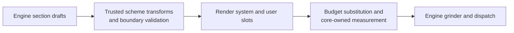

#### §packet-cache-monotone Default order and cache locality

Conditional absence never reorders the surviving default sections.

| Order | Slot   | Section               | Wire contract |
|------:|:-------|:----------------------|:--------------|
|     1 | system | `definition`          | Framework definition; leads the most stable prefix. |
|     2 | system | `tools`               | Executable capability sheet for this loop. |
|     3 | system | `optional-operations` | Present only when optional operations are enabled. |
|     4 | system | `schemes`             | Active scheme catalogue. |
|     5 | system | `inject`              | Present only when operator notes are configured. |
|     6 | system | `system-policy`       | Operator policy; empty content is omitted on the wire. |
|     7 | system | `project-policy`      | Project policy; empty content is omitted on the wire. |
|     8 | user   | `log`                 | Append-mostly model-visible history. |
|     9 | user   | `child-streams`       | Per-turn status; empty content is omitted. |
|    10 | user   | `child-workers`       | Per-turn status; empty content is omitted. |
|    11 | user   | `errors`              | Per-turn failure pointers; empty content is omitted. |
|    12 | user   | `notices`             | Per-turn observations; empty content is omitted. |
|    13 | user   | `git`                 | Per-turn workspace status; empty content is omitted. |
|    14 | user   | `budget`              | Model-facing packet pressure; omitted when capacity is unknown. |
|    15 | user   | `prompt`              | Current prompt-entry pointers. |
|    16 | user   | `requirements`        | Syntax recap deliberately nearest generation. |

The order favors prefix-cache locality where semantics permit: the definition
leads capability and privileged policy, while the append-mostly log leads the
volatile user-status clump. It does **not** claim that every system byte is
immutable or that the complete packet is globally monotone in volatility:
capabilities, operator notes, and policies can change, and the stable recap is
deliberately last for model recency. Trust is a separate admission rule. The
system slot contains trusted control-plane material; attacker-reachable content
stays in the user slot.

#### §packet-plugin-transform Trusted whole-list extension seam

`SchemeRegistry.transformSections` pipes the complete default list through
every registered scheme implementing `transformSections(sections) -> sections`,
in registration order, before rendering and measurement. The schemes-owned
`PacketSectionDraft` contains only `name`, `slot`, `header`, and `content`.
Each initial or returned list passes the schemes-owned validator, including
unique-name enforcement, before the next transformer or renderer. Each
transformer may inspect the section content and add, remove, or reorder
sections. It receives no separate engine, database, actor, or request context.

This is strictly a trusted in-process seam, admitted through the common plugin
trust gate; an external client action cannot invoke it. Whole-list transformation is
the fork-avoidance valve for alternate packet shapes ({§ecosystem}), while
grinding and folding remain closed engine concerns.

### §tokenomics Tokenomics: four quantities, one model-facing ruler

Token accounting distinguishes the artifact being measured, the unit, and the
time of measurement.

| Quantity                                                   | Source and unit                                                   | When                                        | Contract                                                                                                                                                    |
|:-----------------------------------------------------------|:------------------------------------------------------------------|:--------------------------------------------|:------------------------------------------------------------------------------------------------------------------------------------------------------------|
| Provider usage                                             | Provider-reported prompt/completion/reasoning tokens              | After generation                            | Durable cost and transport forensics; never the pre-call packet budget.                                                                                     |
| Packet render-weight                                       | `rulerCount = ceil(chars/2)` over rendered slots                  | Every packet build                          | Drives the Budget readout and grinder.                                                                                                                      |
| Stored content-depth                                       | The same ruler over entry/log content                             | When content is written                     | Weights catalog and log rows without per-model workspace state.                                                                                             |
| §tokenomics-physical-admission Physical recovery admission | Provider measurement of the complete `PacketWire` message request | Only when the grinder cannot satisfy policy | Exact counts and proven upper bounds may authorize recovery. Estimates, unavailable evidence, and unknown provider physics fail closed. Never model-facing. |

- §tokenomics-tokens-stored-at-write **Ruler tokens, stored at write.** `entry_channels.tokens` and `log_entries.tokens` are populated with the model-independent `rulerCount` when their content is written. The stored number is a stable content-depth measurement, not a provider-specific prediction.
- §tokenomics-render-weight-budget **Render-weight budget.** The budget headline — `ceiling`, `tokenUsage`, `tokensFree` — is the ruler measurement of the *assembled packet* after section transforms and budget substitution. Core measures minimum-width probes, monotonically expands fields that do not fit, then right-aligns the final values into those same widths; final substitution is length-invariant and displayed usage equals the stored request weight. A `SUM` of stored content-depth would measure different artifacts and cannot substitute for packet render-weight.
- §tokenomics-context-percent **Prompt-budget percent.** The headline carries usage as a percent of the enforced model-facing budget — `usage Y (P%)` — beside the absolutes. It reads the ceiling already in hand; no extra provider call.
- §tokenomics-window-partition **Provider capacity and virtual pressure are
  separate.** The provider owns physical context and generation settings. Core
  derives the natural prompt capacity from that envelope and its packing-safety
  margin. `PLURNK_SERVICE_PROMPT_BUDGET` is an optional alias-scoped virtual
  ceiling:
  `promptBudget = min(configuredPromptBudget, naturalPromptCapacity)`. Unset
  uses the natural capacity. The virtual ceiling controls only the packet gauge
  and grinder; it never changes provider context, reasoning, completion, or
  `maxTokens`.
- §tokenomics-window-unpollable-deliberate **Unknown provider capacity stays
  unknown.** Without a configured virtual ceiling, an unknown provider window
  leaves the prompt uncapped and omits denominator-dependent gauge telemetry. A
  configured virtual ceiling still bounds PLURNK's packet without pretending
  to describe provider physics. An over-policy recovery candidate cannot be
  physically authorized without a known provider window and output envelope.

§tokenomics-client-gauge **The client gauge pairs current occupancy with its
effective ceiling.** A model switch changes both latest-turn values together;
the loop-total usage fields remain billing evidence, not gauge inputs.

| Surface                    | `contextTokens`                                                        | `promptBudget`                                                                |
| -------------------------- | ---------------------------------------------------------------------- | ----------------------------------------------------------------------------- |
| `loop/terminated.usage`    | Latest provider attempt on the latest turn; `0` when none completed    | Latest turn's enforced packet allowance; `null` when uncapped or unknown      |
| `providers.list` alias row | not present                                                            | Active alias's current enforced packet allowance; `null` when not established |

- **Derivation is eager and exhaustive.** Workspace creation and searchable-resource changes start one coalesced warm. The first model turn joins that warm; later turns derive intervening changes before dispatch. No model operation observes partial graph or vector coverage. A semantic query ranks every eligible candidate in scope, so lexical overlap never gates vector recall. With no embedder, readable-content FTS is the explicit keyword fallback. Progress notices make the wait visible; latency is never hidden by partial semantics. {§derivation-exhaustive}
- §membership-binary-sniff **Binary truth beats the label; no entry dominates the corpus.** A tracked member whose HEAD bytes contain NUL is materialized as a binary marker (empty body, `application/octet-stream`, READ-415) **regardless of what extension-based detection claims**; byte-level evidence outranks a default label. Every eligible text is tiled losslessly to the embedder window and every tile is embedded before its derivation attaches; semantic ranking max-pools the best chunk per candidate.
- §tokenomics-agnostic-ruler **One model-agnostic ruler.** The daemon runs workers on different models in one workspace concurrently, while catalog and log accounting are workspace-wide. The complete model-facing ledger therefore uses `rulerCount = ceil(chars/2)`: one content has one number regardless of which model reads it, with no per-model workspace state or recount pass. Under-policy packets rely on that ruler. Only an over-policy packet being considered for a recovery turn invokes the shipping provider's request-shaped physical measurement.
- §tokenomics-neutral-telemetry **Budget telemetry is state, not instruction.** The model-facing Budget is exactly one line: token ceiling, current usage and percentage, and free tokens. Per-entry weights remain on log rows where they describe the entries themselves. Packet-level composition, rankings, and visualizations are absent because their salience can redirect the model toward context gardening. OPEN/FOLD/KILL remain documented capabilities; recovery directs the model only after overflow. The model receives enough state to own its context decisions without a competing dashboard.
- §tokenomics-content-hash-identity **Content identity, not per-tokenizer counts.** Static channel writes stamp `content_hash` (SHA-256) as a stable per-content identity. `tokens` is stored in ruler units beside that content and is never keyed or recomputed by model.
- §tokenomics-provider-usage **Provider usage is transport and cost evidence, not curation state.** Completed turns preserve provider-reported prompt, completion, reasoning, cached, and cost fields. Reasoning and completion are outputs the model cannot FOLD, so they never alter the model-facing Budget ledger.
- §tokenomics-over-budget-floor **The delivered packet is never over budget.** The readout shows the state of the packet the model actually has, and the grinder ({§grinder}) folds the newest turn boundary of an over-ceiling packet before it is sent. A delivered budget headline therefore always has usage <= ceiling, percent <= 100, and free >= 0. The percent describes the post-fold packet. If that one deterministic boundary fold cannot make the packet fit, the recovery/hard-413 contract applies; the engine never reaches backward and chooses older history to hide. The stored failure record renders an overshoot honestly - free floors at zero and percent may exceed 100 - but that record is never sent as an over-budget reasoning surface.

### §membership Workspace identity, membership, disk co-location

The project-file path has two explicit reconciliation gates. Internal entries do
not participate in this disk loop.

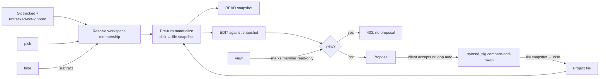

| Concern            | Owner and representation                                                                                                                    |
| ------------------ | ------------------------------------------------------------------------------------------------------------------------------------------- |
| Workspace identity | `workspaces.project_root`; null is headless. There is no separate project entity.                                                           |
| File visibility    | Workspace-tier resolved membership: `(repository files ∪ pick) − hide`, with `view` read-only. Every worker sees the same result.           |
| File reads         | READ returns the materialized file snapshot stored in the entry body channel; it does not read disk directly.                               |
| File writes        | EDIT proposes against that snapshot. Only accepted resolution with the captured `synced_sig` writes the project file.                       |
| Internal entries   | Workspace or worker entries are canonical store state. Writing one never implies a project-file write.                                      |
| Authority          | Service flags set the membership ceiling; workspace constraints narrow it; client or loop auto resolves proposals. `origin` is attribution. |

§web-search-retrieval **Web search and retrieval are one first-class composition.** A search runtime enumerates a configured maximum of candidate URLs and hands each to the engine as a `content: null` `entry()` request ({§exec-entry-sink}): the guarded `WebFetcher` sink fetches candidates in parallel, off the write-serialization chain, and materializes successful bodies as ordinary HTTP entries. SearXNG owns membership and rank; Plurnk does not rerank or classify sources. Every candidate whose `entry()` call rejects, regardless of failure reason, is mechanically omitted from the model-facing result directory; survivors retain upstream order. The compact directory carries `title/url/snippet/publishedDate/materialized`; it locates readable resources and is not a substitute for their contents. Without an entry sink the executor cannot test materialization and omits the verdict.

Search prefetch and direct HTTP READ materialize the same resource contract:
protocol + canonical authority (including a non-default port) + path + serialized
query is the absolute identity ({§scheme-address-network}); the sanitized
readable projection is the fragmentless default, while faithful DOM and
response metadata remain explicit auxiliary channels. A normal
`READ(https://host/path?query)` therefore publishes only the sanitized body
under that exact URL—never raw HTML, response headers, or a channel-selection
lesson. FIND, matcher READ, and embeddings consume the same stored readable
projection and never re-fetch each match. Because the search family is in
`PLURNK_SERVICE_EXEC_HOLD`, the cycle holds until acquisition concludes
({§exec-hold-until-concluded}), so the next packet contains final
materialization verdicts and folded ambient rows for every acquired page.

§search-gate Coverage protects the composition at distinct seams: HTTP unit tests pin fragmentless-body publication and explicit auxiliary selection; integration tests pin search→materialize→FIND/matcher READ and persistence/publication separation. Deterministic model demos require an answer containing a per-fixture sentinel present only in a primary materialized body, proving retrieval without prescribing which valid operation sequence the model uses. A live positive-control demo requires a materialized HTTPS body and a substantive answer from a real sanitized page. Live discovery demos remain diagnostic and may expose model judgment failures without weakening these assertions. **The search gates** are rail-family accounting — in-memory per-loop state cleaned at the same seam as strikes, restart-drop accepted (a post-restart duplicate re-fetches; the TTL makes it cheap): an IDENTICAL duplicate (same runtime + command in one loop) **strikes and serves** — status 409 (the strike rail counts the turn failure) carrying the prior ranked digest re-read live from the original exec entry, no re-fetch, no provenance prose; the per-turn CAP (`PLURNK_SERVICE_SEARCH_MAX_PER_TURN`) is flood control — 429 with a legible steer, nothing served.

**Git is the substrate and the repository is the boundary:**

- §membership-git-membership The workspace owns the Git repository containing
  `project_root`. Its tracked files (`git ls-files` semantics) are members with
  no explicit overlay; when the root is a package inside a monorepo, the
  repository's other packages are members at root-relative paths. An unrelated
  or nested independent repository is not discovered or managed by this
  workspace. When Git is absent there is no filesystem walk; `pick` is then the
  sole source.
- §git-native-default **Core Git reads use native Git by default.** Membership
  and status execute the installed Git binary.
- §membership-git-hermetic Native Git runs with ambient `GIT_*` and
  global/system config scrubbed, so repository identity follows `project_root`,
  never the daemon's launch environment.
- §git-isomorphic-opt-in `PLURNK_SERVICE_GIT_ISO=1` explicitly selects the
  in-process isomorphic-git backend for a deployment that cannot spawn Git. The
  alternative is never an automatic fallback: an absent native binary yields
  no automatic Git membership or status, never an isomorphic retry; an
  incompatible isomorphic repository surfaces its preserved upstream cause
  and directs the operator back to the default. The isomorphic untracked scan
  remains differential-gated against native
  `ls-files --others --exclude-standard`.
- §membership-edit-membership-gate **Membership-gated edits.** EDIT is bounded by membership exactly as READ is. An existing **member**'s baseline is its entry snapshot — the body channel the model READ, not a fresh disk read — so the diff is naive against the view the model saw, never empty (the write-side CAS, {§membership-edit-write-cas}, prevents the silent overwrite of out-of-band drift). An existing **non-member** is refused (403) *before* any read or write: the model never reads a file it can't see (no leak into the proposal) and never overwrites one (no wiping a gitignored `.env` it never added). A **new path** stays open — proposal→accept adds it to the manifest. Reaching past membership is `EXEC[sh]`'s job, not the file scheme's.

**The overlay — `pick | view | hide`, removed by `drop`.** A `workspace_constraints` table is the client's supersede over Git. Resolved membership is `(project repository files ∪ pick) − hide`, with `view` enforced at the edit gate.
- §membership-auto-add **Auto-add** — the project repository's membership is its tracked `ls-files` plus untracked-but-not-ignored files (`git ls-files --others --exclude-standard`), with `git` origin. A model-created file is a member the moment it exists—no `git add`—while `.gitignore` still filters it.
- §membership-overlay-pick **`pick`** — admit an untracked file git misses: a targeted client-dictated `node:fs` glob scan over untracked matches (files only), 'constraint' origin, reconciled like git members. Enumerated, so the manifest stays exhaustive. git-absent, `pick` is the *sole* membership source.
- §membership-overlay-hide **`hide`** — exclude a tracked file: resolution drops matches (`node:path.matchesGlob`) and reconciles so the entry set *equals* the member set. The lever to exclude a committed-but-sensitive tracked file; `entries.membership_origin` keeps reconciliation off model-created members.
- §membership-overlay-view **`view`** — keep a member readable but refuse `File.edit`, 403'd at the membership check before any diff. (Admitting an untracked file as `view` rides on `pick`'s scan.)
- §membership-resolved-effects **Resolved effect is a read, not a re-derivation.** `workspace.members` surfaces each candidate's resolved effect — `(ls-files ∪ pick) − hide` tagged `member` / `view`, plus the `hide`-excluded `hidden` set — so a client signs file visibility (member / read-only / ignored) without reimplementing the overlay glob-matching. The daemon owns git + the globs; the per-file effect is its to resolve, the client's to render.

**File ops act on the entry, not the disk; the two reconcile only at gates.** A `file:///` member is a row whose body channel holds the *materialized snapshot* of its disk content. READ returns that channel; EDIT diffs against it — neither reaches the filesystem directly. Entry and disk reconcile at exactly two gates: the **pre-turn materialize** (disk → entry, below) and the **accept-time write-back** (entry → disk, {§proposal}). Between the gates the entry is the truth the model curates against, and `synced_sig` — the member's last-synced disk stat (`mtime:size`) — is the version token both gates compare on.

§derivation-dedup-parallel **The index dedups then parallelizes.** The derivation identity hashes the exact READ body, mimetype, reader behavior, embedding configuration, and applicable search exclusion. A resource attaches the immutable artifact only after it is complete; identical entry and log bodies therefore share one FTS row, one symbol graph, and one vector set without copying. Distinct artifacts run with bounded producer concurrency (`PLURNK_SERVICE_DERIVE_CONCURRENCY`). Pending artifacts sort by readable content length before entering that pool, so small resources start first while every outlier still derives fully. Unset uses a host-relative square-root fan-out; a positive integer is an exact operator budget and `-1` claims every core. Token-count and embedding batches retain only a pool-sized promise window; graph persistence writes at most `PLURNK_SERVICE_DERIVE_STORE_BATCH` definitions or references per SQLite statement. Every pending resource attaches a terminal classified artifact, identical at concurrency 1 and N. Multi-item warming reports aggregate milestones and heartbeat notices according to `PLURNK_SERVICE_DERIVE_PROGRESS_STEPS` and `PLURNK_SERVICE_DERIVE_PROGRESS_HEARTBEAT_MS`.

Every completed artifact records one terminal disposition: `vector`, `lexical`
(only no embedder or an operator size ceiling), `excluded` (the configured
search-exclusion table), `nonsemantic` (empty/binary/no embedding content), or
`failed` (only a typed `{§mimetype-error-policy}` invalid-source failure).
Cancellation and implementation, loading, database, index-persistence, and
embedding-service failures remain `building`, unattached, and retryable; Core
never guesses that an arbitrary projection exception is bad content. A failed
specimen therefore cannot brick workspace readiness, and the digest reports
every non-vector attachment with its disposition and reason. Successful
optional projection degradations continue indexing and surface their framework
Notice once per identical observation in a maintenance pass.

§semantic-embed-dedup **Identical content embeds once.** The metaproject's repeated `tokenizer.json` bodies - and any log result exposing the same exact READ body - attach one content-addressed derivation artifact. Graph, FTS, and chunk vectors exist once; addresses join through the artifact hash. One pass-wide semantic plan binds the selected chunk counter to this identity: the embedder's own counter is covered by model-space identity, while a separately resolved fallback counter contributes its `tokenizerId` and exactness. Model, vocabulary, vector-wire encoding ({§mimetype-embedding-wire}), or configuration changes therefore produce a different identity, so incompatible vector spaces, encodings, or chunk boundaries never share.

Lossless chunk admission requires either the embedder's own counter or an exact fallback tokenizer. An empirical estimate never proves that content fits the declared token window. When pending readable content would require vectors and only an estimate is available, maintenance surfaces its degradation Notice and fails before embedding or attaching a derivation; no/disabled embedding and the established empty, binary, excluded, and maximum-size dispositions remain non-vector outcomes.

§semantic-max-embed-size **Embedding has an optional size posture.** `PLURNK_SERVICE_MAX_EMBED_SIZE` is an operator-set maximum UTF-8 byte size eligible for vectors; `0` is unlimited and is the shipped default. The measured value is the exact default body READ exposes and the embedder receives. Exhaustive embedding therefore remains the normal posture. When a nonzero ceiling rejects an oversized body, the entry remains directly readable with full graph and lexical indexing; only vectors are absent. The setting is folded into the deep derivation signature, so changing it honestly re-derives affected entries. Client notices report compact aggregate progress; the digest records every non-vector pathname, terminal disposition, and reason for forensic inspection.

§membership-change-gated-sync **Sync is idempotent and change-gated.** Per turn, membership materializes every member's disk content into its entry, but a member unchanged on disk since its last sync is not re-read, re-tokenized, or rewritten. Coverage is exhaustive across the project repository while work is proportional to change. After a pass every member's entry equals its disk content; a no-change pass is a no-op.

§membership-emi-divergence-signal **EMI divergence signal.** The detector that gates the work *is* the one that fires this — one mechanism, not a second full read. When the change-detect finds a member moved out-of-band, the delta detector ({§env-delta}) surfaces it as a system `EDIT` log row naming the file, `source="file"` — the model sees what changed without diffing the manifest against memory. The model's own edits are write-through (the entry equals disk after a File write), so the scan never mis-attributes them as external divergence.

§membership-edit-write-cas **The write-back is a compare-and-swap — never a clobber, never a clever merge.** EDIT is *naive against the snapshot*: it diffs the model's change onto the entry's body channel — the exact bytes the model READ — and the proposal carries the `synced_sig` that snapshot was taken at. At accept, `applyResolution` re-stats disk and lands the proposed content only if that signature still matches. If disk moved out-of-band in the propose→accept window — a sibling worker, the user's editor, a build step — the write is **refused** with a `write_conflict` and **nothing is written**. The engine neither blind-writes over the ambient change (a *clobber*) nor silently re-diffs the model's edit against a state it never saw (getting *clever*) — both would bury a stale-view contract violation under a fallback. The conflict surfaces instead: a ≥400 apply downgrades to a reject ({§proposal}), so the model sees the EDIT **did not occur** (400; the `write_conflict` outcome is forensics-only), the next reconcile narrates the real disk content as a `source=file` divergence ({§membership-emi-divergence-signal}), and the model re-reads and re-proposes against the fresh snapshot.

The version travels *with the proposal*, never re-read from the entry at accept: a sibling worker in the same workspace may reconcile while this proposal sits paused, advancing the entry's `synced_sig` to the drifted disk — comparing against the *current* entry sig would wave that clobber through, so the comparison is always against the sig the proposal was computed at. A proposal that assumed an **absent** path (a create) conflicts only if a file has since appeared; a member with **no recorded snapshot** (an un-materialized entry, null `synced_sig`) has no baseline to guard and writes through — the two are told apart by the proposal's `existed` flag, not by a null sig alone. On a clean landing the entry refreshes to the written content and `synced_sig` is **restamped** to it, so the next reconcile recognizes the model's own write (not an external divergence) and a second same-turn edit bases on the landed bytes, not a stale sig. This is the write-side twin of the read-side change-gate ({§membership-change-gated-sync}): one `synced_sig`, gating both the re-read and the write.

The CAS is the **hard backstop**, at the moment of writing, on every accept path. It composes with — and is distinct from — the loop-auto `staleClobberRisk` guard ({§proposal-ownership-auto-stale-clobber}): that guard refuses to resolve an edit whose target already diverged earlier this turn (the read→propose window, auto path only); the CAS refuses to write against a snapshot disk has left (the propose→write window, every path). Together they bracket the full read→write span.

§membership-git-flags **Permission flags.** Service-wide Git admission comes from {§operator-config-git-ceiling}. `PLURNK_SERVICE_GIT_AUTO=1` (default) includes the repository containing `project_root`; `=0` disables automatic Git membership, leaving `pick` as the only membership source. `ALLOWED` gates `AUTO`.

**Rationale.** Workspace is the right scope unit and the containing Git repository is its ordinary development boundary. Membership curation is tiered: Git bounds it by tracking, the client supersedes by overlay, and the model curates its render by READ/FOLD. Supporting several independent repositories as one world would require Plurnk-owned topology, synchronization, and model teaching that Git already solves cleanly by treating them as separate workspaces.

**Schema.** The version-1 baseline stores provider attempts beneath turns.

### §grinder Budget enforcement: the grinder

The grinder is the one pre-provider enforcement path for the model-facing prompt
ceiling. Its sequence is deterministic:

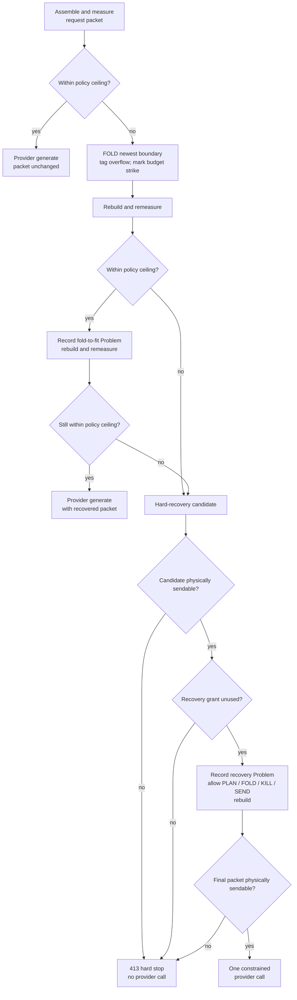

§grinder-overflow-only **The grinder fires only on actual overflow.** In
`Engine.runTurn`, after `PacketBuilder.buildRequestPacket` assembles the request
and before `provider.generate`, it compares the packet's render-weight
({§tokenomics}) with the policy ceiling. At or under the ceiling, the packet
ships untouched and the recovery grant clears. The grinder never trims
speculatively or "helpfully."

- §grinder-layer1-rollback **One rule, every turn: fold only the newest boundary.** The model owns context visibility. The grinder makes no relevance judgment and never reaches backward into older history. On overflow it folds, in one set operation, the still-open rows of the newest turn boundary: the immediately prior turn's emissions and the current turn's pre-model rows (foists and wake surfaces; every current-turn row at grind time is engine-written). Turn 1 follows the same rule: no prior turn exists, so its foists are the newest material. The same atomic set operation additively applies the `overflow` tag to every row it folds, so `OPEN[overflow]` can recall automatic curation through the ordinary log contract. Rows and bodies persist and remain re-OPENable.
- §grinder-errors-exempt **Errors, the prompt, AND the plan are exempt.** The grinder never folds an `op='error'` row (for example budget overflow or another engine rail): errors are the model's durable, curatable record of what went wrong. Nor does it fold the actionless **user prompt** row (`prompt:///<loop>/<N>`): the task frame is not ordinary model-authored memory. Nor a **PLAN row**: the checklist is the model's orientation surface when the grinder fires. All three stay OPEN until the model itself FOLDs or KILLs them.
- §grinder-hard-413-recovery **The hard overflow is a recovery turn first.** When the packet remains over the policy ceiling but the final recovery request has exact or proven-bounded evidence within the provider's physical window, it is sent once with exact `usage`, `ceiling`, and `deficit` measurements from overflow detection. The recovery turn physically admits only `PLAN`, `FOLD`, `KILL`, and `SEND`; every other authored op resolves 409 without executing. Its Problem directs the model to curate context by FOLDing or KILLing irrelevant log items without selecting those items for it. A next fitting turn clears the recovery state, and a later independent overflow can earn a new recovery. A recovery turn that concludes is a legitimate 200. The boundary is exactly 100% of the policy budget; provider decode capacity is reserved separately. The physical check applies after every row and section in the sent packet exists; only that final admission consumes the one recovery grant.
- §grinder-hard-413-abort **Hard stop.** A physically unsendable packet, or a second consecutive hard overflow after the constrained recovery turn, abandons the loop at **413 Content Too Large**. Its sibling engine-imposed terminals are HTTP-precise too: `maxTurns` -> 429 and a strike-out -> 500 (508 when cycle-driven). No catch-all 499 and no further passes.

- §tokenomics-fetch-fits-free **A retrieval larger than the available packet room arrives folded.** The result lands in the next build; if that build exceeds the ceiling, the grinder folds the newest boundary, which contains the result. Its row and exact body remain durable and re-OPENable. If the packet still cannot fit, the recovery turn reports exact measurements and the allowed operation set. No ambient packet text prescribes an ordering strategy.

- §loop-terminals **Engine-imposed terminals are HTTP-precise** — the loop-status vocabulary, one meaning each: `200` concluded (the model's SEND[200]) · `499` model-abandoned (SEND[499], or a cancel) · `429` maxTurns exhausted · `413` budget hard-stop · `500` strike threshold or invalid-emission exhaustion (distinct Problem types; `508` when the crossing strike was a detected cycle) · `504` loop timeout / exec-timeout restamp · `202` the bounded wait — a loop blocked on a live obligation (the model's `SEND[202]<T,P>`, {§wait-obligation-matrix}); a wait on nothing resolves to `200` instead · `100`/`102` queued/running. Never a catch-all, never a new value without an owner schema ruling.

§grinder-strike-coupling **Strike coupling.** A grinder fire bumps the engine's
`turnErrors` — the same internal counter cycle detection feeds — so an overflow
counts toward the strike streak that ends a runaway loop at 500, or 508 if the
crossing strike was cycle-driven.

§grinder-fold-strikes **Every grinder fold strikes, including turn 1.** There
is no soft exemption. Folded rows still cost their coordinate lines, so
repeated overflow can legitimately reach the strike threshold.

§grinder-overflow-error-row **What the model sees.** The overflow is an exact RFC 9457 Problem on an `op='error'` log row. Its stable type/title state the broken contract; `detail` and numeric extensions report Token Usage, Token Ceiling, and the positive deficit at the labeled `stage: "overflow-detection"` snapshot. When folding recovered the packet, the Problem also states that resolution and directs the model to keep irrelevant items folded or use smaller retrieval ranges; it never claims that no working room remains after the Budget section has measured a fitting rebuild. A hard recovery occurrence instead carries the enforced `allowedOperations` and its generally valid curation instruction. The packet rebuild that adds either Problem can make the neutral Budget section's current usage larger without contradicting the occurrence snapshot. The Problem is minted before the rebuild, so its derived `log:///<coord>` pointer surfaces in the errors section ({§operation-results}) on that turn. The strike counter stays engine-internal.

The model controls its context; the engine enforces packet physics without
choosing what older history matters. The same boundary applies on turn 1 and
turn 101. The grinder folds reversibly, never deletes, and never performs
speculative or non-overflow trimming.

### §env-delta The environment delta: what changed since the model last looked

Catalog FIND results ({§packet-catalog}) state what existed when observed. The
environment delta supplies the events that made a worker's prior view stale
without copying the shared world into worker-private state.

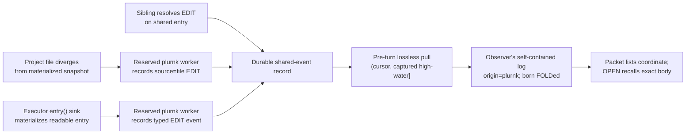

§env-delta-log-pull **Pull the event record, never a world snapshot.** At
pre-turn, a worker materializes every other actor's event on shared state after
its last completed observation boundary into its own log. The set is
exhaustive, unranked, and exactly once; the engine makes no relevance decision.
Each copied event retains its effect, cause, and typed attributes. Every
producer appends to one workspace-scoped occurrence journal with a monotonic
identity. A pull captures one closed `(worker cursor, high-water]` interval,
materializes each identity idempotently, then advances the cursor only after the
whole interval is durable. An event racing the capture is therefore in this
interval or a later one, never neither or both. Source-log curation cannot erase
the occurrence record.

The cursor is observation progress, not a private copy of entry contents. A
fresh worker baselines the current high-water immediately after opening its
first turn: older state arrives through the ordinary current-world projections,
while events racing that first packet remain deliverable. A fork copies the
parent's captured cursor with its log; copied event identities cannot republish,
and occurrences the parent had not observed remain pending independently for
both workers.

§env-delta-worker-entry-visibility **Worker-entry visibility follows the
authority contract.** Commons mutations (`worker:///...`) and mutations to the
published kernel surface (`worker://plurnk/...`) are shared-state events and
retain that authority in the observer row. Current-worker scratch
(`worker://~/...`) and every ordinary named worker space are private: they never
cross this door, while an ancestry-authorized explicit READ remains available.

| Producer                                                 | Durable event                                                                                                               | Observer projection                                                                                                                                    |
| -------------------------------------------------------- | --------------------------------------------------------------------------------------------------------------------------- | ------------------------------------------------------------------------------------------------------------------------------------------------------ |
| §env-delta-sibling-edit Sibling commons mutation         | The sibling's successful resolved `EDIT` row and its receipt.                                                               | One folded `EDIT` retaining the exact effect and typed attributes.                                                                                     |
| §env-delta-kernel-entry-edit Kernel-published mutation   | The reserved `plurnk` worker's successful resolved `EDIT` row on `worker://plurnk/...`.                                     | One folded `EDIT` retaining the published authority, exact effect, and typed attributes.                                                               |
| §env-delta-filesystem-narration Project-file divergence  | The reserved `plurnk` worker records one `source=file` EDIT-shaped event during pre-turn membership reconciliation.         | One folded `EDIT` naming the file and carrying the net changed span. No model operation is fabricated as having run.                                   |
| §env-delta-entry-materialization Executor `entry()` sink | The reserved `plurnk` worker records a typed `EDIT` event with `kind="entry_materialized"` and the calling worker as cause. | One folded system `READ` projection advertising newly readable state; the durable event remains an EDIT for replay and forensics ({§exec-entry-sink}). |

§env-delta-attribution **Ownership, authorship, and cause are independent.**

| Field       | Meaning                                                                                                                                                                                 |
| ----------- | --------------------------------------------------------------------------------------------------------------------------------------------------------------------------------------- |
| `worker_id` | The worker whose self-contained log owns the materialized row.                                                                                                                          |
| `origin`    | The actor tier that wrote the row; a materialized delta is `plurnk`.                                                                                                                    |
| `source`    | The causal identity. Worker causes use the canonical `worker://<name>` control identity; non-worker causes use a stable subsystem token (currently `file`); self-authored rows omit it. |

§env-delta-no-coalescing **Only filesystem observation nets.** One filesystem
event is `editedSpan(entry-as-of-last-align, disk-now)`, inherently netting any
number of out-of-band writes before reconciliation. Sibling edits are discrete
events already in the log and remain discrete. Coalescing them would destroy
the record and conflate state comparison with event replay.

§env-delta-passive **Observation never forces a turn.** Deltas materialize only
while a packet is already assembling, so an ambient change cannot wake an idle
worker. Urgent directed communication uses the voice door
({§actor-boundary-two-doors}). Sibling loop conclusions and owned stream
progress reuse durable ambient log delivery under {§worker-scheme-collect} and
{§exec-stream}; their lifecycle-specific open/fold and wake rules remain owned
there.

### §edit-result-render Mutation log rows render truthful effects

A mutation row keeps request and outcome separate: `tx` is the admitted
statement; `rx` is its resolved result. Only state that actually landed may
appear there as an effect.

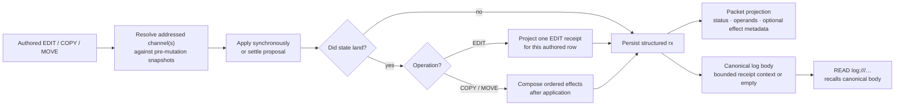

§edit-result-receipt-projection **EDIT projects the scheme-owned batch
receipt.** The scheme framework owns the exact aggregate shape
({§scheme-edit-batch-receipt}). Core validates it and projects the result
matching each authored EDIT's batch index: either that statement's applied
effect or its superseded disposition. The proposal-owning row alone carries a
reviewer replacement effect. Core stores only that per-row projection on `rx`;
the aggregate remains dispatch coordination state.

| Durable receipt fact                   | Packet projection                                                 | Meaning                                                                                                                   |
| -------------------------------------- | ----------------------------------------------------------------- | ------------------------------------------------------------------------------------------------------------------------- |
| Full `revision`                        | `rev` abbreviated to `PLURNK_SERVICE_EDIT_RECEIPT_REVISION_CHARS` | SHA-256 identity of the complete landed channel body; display correlation only, never a lookup or compare-and-swap token. |
| `unit`, `before`, `after`              | `extent`                                                          | Whole-line batches use line counts. A batch containing any exact four-coordinate edit uses Unicode code-point counts.     |
| `effect.requested`, `source`, `result` | `range`                                                           | The admitted marker and its normalized mapping from the common source snapshot into the landed body.                      |
| `effect.removed`, `inserted`           | `change`                                                          | Removed and inserted counts in the receipt unit.                                                                          |
| `effect.context`                       | Canonical row body                                                | Numbered physical lines around the landed join, bounded by `PLURNK_SERVICE_EDIT_RECEIPT_CONTEXT_LINES`.                   |
| `disposition`, `requested`             | `disposition`, `requested`                                       | A reviewer-replaced batch preserves the authored marker while stating that its attributed effect was superseded.          |
| `replacement`                          | `replacement`, `change`, canonical proposal-owner body           | The one whole-resource effect actually applied by the reviewer replacement; never duplicated across authored rows.        |

§edit-result-receipt-truth **Receipts describe committed state.** Every row in
one resource-channel EDIT batch carries the same landed revision and extent.
When the proposed batch lands unchanged, each row also carries its own requested
marker, source/result mapping, counts, and context.

§edit-result-reviewer-replacement **A resolver replacement is one effect, not a
guess at authorship.** An arbitrary accepted body replaces the batch's proposed
body. Its correspondence to the authored EDITs is unknowable, so every authored
row retains its requested marker with disposition `superseded`. The durable
proposal-owning row additionally carries the one whole-resource replacement
effect and its bounded landed context; sibling rows identify the same revision
without duplicating that effect.

| Acceptance                     | Per-authored-row receipt               | Applied effect                                    |
| ------------------------------ | -------------------------------------- | ------------------------------------------------- |
| Proposed body unchanged        | Requested marker and its exact mapping | One per authored EDIT                             |
| Resolver body replaced proposal | Requested marker plus `superseded`     | One whole-resource replacement, carried once     |

Durable `tx` always remains the model's admitted statement. There is no JSON
row/item receipt mode. A deliberate same-turn READ executes after mutation
({§op-mode-phases}) and remains the universal request for arbitrary current
content.

System-narrated environment EDITs are state-diff events rather than authored
mutation receipts. They carry the resulting span defined by
{§env-delta-filesystem-narration}.

§edit-result-copy-move-effects **Core composes COPY/MOVE effects only after
application.** Operands remain owned by the durable statement and render
independently under {§copy-move-observation}; effects describe only state that
landed.

| Durable effect field | Contract                                                                                                                           |
| -------------------- | ---------------------------------------------------------------------------------------------------------------------------------- |
| `target`             | Canonical model-facing address. The default channel is path-only; an explicitly selected non-default channel retains its fragment. |
| `action`             | Exactly `create`, `update`, or `delete`.                                                                                           |
| `receipt`            | Optional validated EDIT projection. Only textual `create` and `update` effects may carry one; a creation receipt has `before=0`.   |

| Outcome                                                                       | Ordered `effects`                                                                                         |
| ----------------------------------------------------------------------------- | --------------------------------------------------------------------------------------------------------- |
| Landed COPY                                                                   | Its destination effect.                                                                                   |
| Landed MOVE between different resource-channel selections                     | Any destination effect, then any source effect.                                                           |
| Landed regional MOVE within one resource channel, unchanged by its resolver   | Insertion, then removal; both name the same target because they are distinct effects in one atomic batch. |
| Resolver body replaces a proposed COPY/MOVE mutation                          | One actual replacement effect. Cross-resource MOVE still appends an independently landed source effect.   |
| Textual create/update caused by a scope on either operand                     | The effect carries the ordinary bounded EDIT receipt.                                                     |
| Textual create/update with no scoped operand; binary mutation; channel delete | Structural effect only; no invented text receipt. Scoped source removal is an `update` with a receipt.    |
| `304`, rejection, or cancellation with no landed mutation                     | `effects` omitted.                                                                                        |
| Cross-selection MOVE source failure after destination success                 | The failure retains every destination effect that landed.                                                 |

Core validates the complete ordered array before exposing it.

### §proposal-ownership Loop auto and client YOLO

Side-effecting operations propose ({§exec}) and pause dispatch at 202 for an
authority decision ({§engine-rails}, {§methods}). Automatic acceptance has two
distinct owners:

| Mechanism                                            | Authority path                                                                                                                                    | Intended use                                                       |
| ---------------------------------------------------- | ------------------------------------------------------------------------------------------------------------------------------------------------- | ------------------------------------------------------------------ |
| §proposal-ownership-loop-auto **Loop auto**          | `runLoop({ flags: { auto: true } })` or client sugar sets `loops.flags.auto=true`; core's loop disposition resolves in process without a client.  | Headless automation, benchmarks, CI, fixtures, and unattended use. |
| **Client-side YOLO** (`--yolo` / `PLURNK_YOLO`)      | The daemon emits the ordinary `loop/proposal`; the client returns an accepted proposal through its standard resolution path (AG-UI resume).       | Interactive automatic review.                                      |

Core cannot distinguish client-side YOLO from a fast human acceptance and does
not need to. Loop auto keeps authority inside the loop; client-side YOLO acts
only after authority crosses the client boundary.

§proposal-ownership-notification **The notification carries disposition, not policy inputs.** `loop/proposal` carries the core-owned `ProposalDisposition` ({§notifications}, {§proposal-disposition}). A connected client presents only `owner="client"`; it never reimplements precedence from flags, operation, or attrs.

§proposal-ownership-auto-stale-clobber **Auto is not blind — it refuses a stale clobber.** When an EDIT's target diverged on disk this turn, accepting it would overwrite an ambient change. The projection carries `staleClobberRisk=true`, and core's loop disposition rejects it; the model can re-READ and retry. This brackets the read→propose window for loop auto, while the compare-and-swap ({§membership-edit-write-cas}) brackets propose→write for every accept path.

---

## §packet Packet shape

§packet-stored-shape **A model packet preserves the rendered request and, only
when an emission is admitted, its response.** Core assembles and measures the
request under {§packet-assembly}. An admitted response extends that same record
before the turn closes; a failed provider call or exhausted invalid emission
leaves the request-only record, while rejected exchanges remain in
`turn_attempts`.

| Turn state                    | `turns.packet`                                  |
| ----------------------------- | ----------------------------------------------- |
| No model request assembled    | SQL `NULL`                                      |
| Request assembled             | `{ tokens, sections }`                         |
| Response admitted             | `{ tokens, sections, assistant, assistantRaw }` |

| Field                   | Presence                         | Contract                                                                                                                                                                      |
| ----------------------- | -------------------------------- | ----------------------------------------------------------------------------------------------------------------------------------------------------------------------------- |
| `tokens`                | Every assembled model request    | Ruler weight of both rendered request slots. Admission does not change its meaning; it is never response weight or provider usage.                                             |
| `sections`              | Every assembled model request    | Ordered post-transform request sections. `PacketWire.renderSlot` groups them into system and user messages, and the digest re-renders those stored sections byte-for-byte.     |
| `sections[].tokens`     | Every stored section             | Independently measured render-weight of that section. Their sum is not the rendered request weight because slot separators and independent rounding remain outside each row.  |
| `assistant.content`     | Admitted response only           | Accepted model content from which operations were parsed.                                                                                                                     |
| `assistant.ops`         | Admitted response only           | Parsed operations admitted from that content.                                                                                                                                |
| `assistant.reasoning`   | Admitted response only           | Normalized readable reasoning text, or `null`.                                                                                                                               |
| `assistantRaw`          | Admitted response only           | Opaque provider-owned transport record retained for forensics; `null` when the provider supplies no raw record.                                                               |

`StoredPacket` is the one core type and validation path for this algebra. The
flat schema enforces its root states; typed reads additionally validate every
section and parsed operation. A hard budget stop remains request-only. Client,
setup, filesystem-narration, and executor-materialization turns are
journal-only and therefore store `NULL`. Digest writes an explicit journal-only
or request-only note instead of fabricating response files.

The external tokenless draft and transformation boundary is owned by
{§scheme-packet-transform}. Core alone extends each validated draft with its
measured `tokens` field for storage. #74 tracks coverage that mistakes the sum
of section weights for the rendered request weight.

§definition-table-projection The authored `plurnk.md` remains human-aligned. Its `definition` section deterministically removes Markdown table-cell padding and shortens separator cells to three dashes before plugin transforms, measurement, storage, and wire rendering; alignment colons survive, while fenced blocks and all non-table whitespace remain exact.

§lexicon **Vocabulary follows the standard of its audience.**

| Layer                    | Rule |
|--------------------------|------|
| Operator, wire, storage  | Use the applicable industry term. Provider quantities follow the OpenAI vocabulary where it is standard: `contextWindow`, `reasoning`, `completion`, `finish_reason`, and usage nouns. |
| Core lifecycle           | Use the exact Workspace → Worker → Loop → Turn → Op hierarchy in {§lifecycle-terms}. An AG-UI Run or thread is always protocol-qualified. |
| Model-facing packet      | Use the model's training distribution: operations mirror HTTP and shell, `display` mirrors CSS, and jsonplurnk remains JSON. Renaming this vocabulary to internal API terminology would discard useful resonance for a standard the model never sees. |

`promptBudget` is deliberately distinct from `contextWindow`: it is PLURNK's
enforced packet allowance, bounded by provider capacity and optionally tightened
by service policy.

| PLURNK-native term             | Why it remains |
|--------------------------------|----------------|
| `worker` / `loop` / `turn`     | The process hierarchy in {§lifecycle-terms}; unqualified `run` names no internal entity. |
| `packet`                       | The assembled address space, a kernel concept rather than merely a provider request. |
| `costUsd`                      | No standard cost field exists; the explicit currency avoids implied units. |
| `PLURNK_SERVICE_SAFETY`        | The ruler's packing margin is a service fact no provider owns. |
| the `chars/2` ruler            | Model-agnostic by design ({§tokenomics-agnostic-ruler}). |

Retired terms stay retired: the lexicon guard rejects `thinking`, the unqualified `session` noun, `contextSize`, `decodeBudget`, and moved partition-knob names. <!-- lexicon-allow: this sentence enumerates the retired terms -->

§encrypted-reasoning-carrier **Encrypted reasoning is opaque client evidence.**
When a provider returns encrypted reasoning items, core attaches that list to
the admitted model mirror row's `attrs.reasoning`. `log/entry` and `readLog`
carry it to AG-UI, which may project correlated standard reasoning entities.
Core never decodes the blobs or renders them into a model packet; readable
reasoning text remains separate in `assistant.reasoning`. #44 owns the
unsettled provider-boundary rule for which metadata is preserved versus
normalized and forbids calling derived fields verbatim.

§body-projection **One full body, one packet projection.** Every durable log row has one canonical full body resolved from its stored tx/rx envelope by `LogBody`. READ and FIND over `log:///`, persistent search derivation, and packet rendering all consume that same meaning. Only packet rendering may project it:

| row producer | ordinary OPEN projection |
|---|---|
| model-origin `READ` or `FIND` | complete result explicitly retrieved by the model |
| every other nonempty body | head bounded independently by `PLURNK_SERVICE_PREVIEW_LINES` and `PLURNK_SERVICE_PREVIEW_CHARS` |
| bodyless row | `"display":"none","body":""` |

The exemption is provenance plus operation, not the overloaded operation label: an engine-pushed stream delta shaped as READ remains bounded. Prompts, model mirrors, PLAN/SEND/WORK/FORK bodies, EXEC commands, mutation receipts, ambient deltas, and extension-produced bodies cannot create a second preview policy. A bounded row carries the exact `overflow` message defined by {§jsonplurnk} and names its own `log:///` address. `READ(log:///<coordinate>/<op>)` returns the canonical full body and then applies the authored matcher/range; `FIND(log:///...)` and search match that same full body. FOLD hides the ordinary projection, and OPEN restores it without bypassing the bound. System/policy sections are not log bodies. Notices are transient non-log observations; they share the line/character bounds but have no durable body or recovery URI.

§prompt-entry **Prompt as a first-class entry and log row.** Each prompt is stored once at `prompt:///<loop>/<N>` as an owner-keyed text/markdown entry, then published to its turn as one actionless lowercase `prompt` log row. No synthetic EDIT or READ operation is invented. The row is born OPEN and obeys {§body-projection}. The **User Prompts** section closes the user-slot status clump as a paths-only list (`* prompt:///<loop>/<N>`), so every frame remains directly READable even after its log row is folded or killed.

§prompt-self-only The frame is self-only and owner-keyed:
`entries.owner_id` carries worker identity while the address carries only the
loop coordinate. Concurrent workers therefore hold distinct rows at the same
address. Cross-worker prompt flow is engine-mediated; the scheme needs no
authority slot.

§prompt-loop-containment A loop contains every prompt that arrives before it
concludes, ordinal-keyed as `N`; the next turn publishes every entry for which
that loop has no `op='prompt'` row, oldest first. Every still-undelivered frame
at conclusion must remain ordered and reach subsequent work exactly once; #75
tracks the current newest-only recovery violation. The automatic grinder
preserves prompt rows; explicit OPEN/FOLD/KILL follows the ordinary log
contract.

§packet-catalog **Catalogs are query results, not packet state.** The packet
stores no materialized manifest. Complete and one-level entry directories,
their row shape, and their ordering are ordinary FIND projections owned by
{§find-result-catalog-rows}; persistent search derivation is a separate index.

### §operation-results Model-facing failures and notices

The model's runtime alert surface has two distinct kinds of information:

- **Turn failures are log items.** A failed action and an engine-rail failure are durable `log_entries` rows whose `rx` is an RFC 9457 operation result. They fold, kill, and budget like every other row. The `errors` section is a derived pointer index over recent `status_rx ≥ 400` rows; it owns no bodies or failure state. Rejected emissions never become accepted turn content and remain exclusively in `turn_attempts`.
- **Notices are transient observations.** Progress and non-fatal diagnostics such as `turn_awaiting_model`, `embed_progress`, and `grammar_unenforced` may appear once in the packet and broadcast live. They neither substitute for a failure result nor influence scheduling or recovery.

The `log` is durable product truth. The `errors` section points at its failures
while the separate `notices` section displays transient observations. The two
retain distinct contracts and lifetimes.

- §operation-result-uniform-error-channel **One uniform error channel within an
  accepted turn.** Every operation or engine-rail failure — budget overflow,
  max-commands, and the idle/premature steers — is a `log_entries` row with
  `status_rx ≥ 400` and an RFC 9457 Problem Details operation result in `rx`.
  There is no per-category handling or bespoke ephemeral relationship. The
  `errors` section is a derived index over those rows from the current and
  immediately prior turn: one terse `<status> log:///<coord>` link per row,
  nothing else. The Problem lives on the foldable row, READ via the link.
- §log-row-self-explains **Every ≥400 pointer names a record that states its
  why.** A model-operation failure is the model's own operation result; its
  Problem Details `instance` is that row's `log:///` URI and packet wire renders
  the exact `problem` object on its meta line whether folded or open. No
  separate item is minted for operation failures. Actionless engine rails mint
  `op='error'` items because no authored operation row exists. Invalid provider
  emissions are outside this channel because they are not turns. A bare
  failure status, a top-level string `error`, or mismatched result/problem
  statuses violate the producer contract and fail hard. Genuine
  engine-internal faults crash and never mint model-facing rows.
- **Asynchronous work does not weaken the contract.** An executor or streaming scheme returns the same universal result at conclusion. The subscription stores that exact result; `stream/concluded` carries it unchanged; the next ambient terminal READ merges it with the stream payload and assigns the committed `log:///.../READ` Problem instance. Timeouts and service cancellations replace the complete result with a new valid 504/499 Problem—they never mutate a status while retaining a contradictory Problem.
- **Self-explaining rows.** A problem `title` names the stable class and `detail` states the occurrence-specific cause. Producer-known operands belong in factual extensions. `stage` appears only when neighboring stages imply different recovery; `recovery` states one generally valid next action; `retryable` is true only when the producer recommends automatically retrying the identical request. Unknown recovery or retryability is omitted rather than guessed. General workflow teaching stays in the packet rather than being duplicated into every failure. The runtime-neutral writing contract is owned by `@plurnk/plurnk-contracts`.
- **Exact Problems cross every boundary.** Scheme capabilities, proposal application, subscription conclusion, loop settlement, AG-UI, clients, digests, and benchmark records preserve the originating Problem object. An adapter may add the durable `instance`; it must not rebuild failure truth from `status`, `detail`, `RUN_ERROR`, a scheduler projection, or a legacy string. A failed boundary without a valid Problem is a contract violation and fails hard.
- **Caught diagnostics are bounded.** Core-owned Problems may include a bounded preview of a caught runtime diagnostic when it states the occurrence-specific cause. `PLURNK_SERVICE_ERROR_DETAIL_LIMIT` owns that model-facing character bound; complete errors remain in daemon diagnostics. Input validation and stable contract failures do not spend this allowance on implementation text.
- §notice-drain-on-read **Notices** - the few observations that are not log rows render one terse line under their distinct `## Notices` section, never a JSON dump. Packet rendering normalizes whitespace, bounds the producer message with the shared preview limits, and appends any typed position. The notice buffer drains on read; each appears on exactly one packet.
- §rail-accounting-private **Rail accounting is private.** The model sees failures from accepted turns that **happened** — its actions failed or it overflowed the window. It does not see rejected emissions or the engine's accounting *about* errors: attempt counts, strike streaks, cycle detection, sudden-death thresholds, or no-ops bookkeeping. Surfacing internal state creates a gamification surface where the model optimizes for engine metrics instead of the task.

**The error rows (one channel) + the only non-log notices:**

| failure | row | status |
|---|---|---|
| action failure | the failed op's own row; the owning scheme supplies Problem Details | 4xx/5xx |
| budget overflow | `op='error'`, source `rail` or `engine`; `engine/grinder/budget-overflow` Problem Details | 413 |
| max commands exceeded | `op='error'`, origin `plurnk`, source `rail`; `engine/rail/max-commands-exceeded` Problem Details | 429 |
| idle turn | `op='error'`, origin `plurnk`, source `rail`; `engine/rail/idle-turn` Problem Details | 409 |

| notice `kind` | Source | Position |
|---|---|---|
| `grammar_unenforced` | engine rail verdict, or a forwarded provider transport anomaly such as a discarded-channel escape | content-offset when the observed position maps into content; none for a reasoning-prefix divergence |
| `parse_advisory` | grammar parser — recoverable near-miss which did not invalidate the parsed statements | content-offset into the model's emission |
| `embed_progress` | repository materialization/indexing lifecycle ({§mimetype-surface}); structured phase, count, and percent; `level: info` except terminal failure | none |
| `search_progress` | aggregate search-page acquisition lifecycle; structured phase, counts, and percent; never candidate URLs or per-result notices | none |

§notice-level **Severity on the wire (`level`, required).** Every `Notice` carries `level: "error" | "warn" | "info"`, set by the **producer** at the emit site. The level is client presentation, not operation status: even an `error` notice cannot terminalize work or substitute for a durable Problem. A forwarded `grammar_unenforced` is `warn`; ordinary lifecycle and progress notices are `info`. Clients color straight off `level` without interpreting the open `kind` vocabulary.

§operation-result-no-error-scheme Strike accounting, cycle detection, sudden-death thresholds, and no-ops bookkeeping stay engine-internal ({§rail-accounting-private}). Every failure within an accepted turn - a bounded parse error, failed action, or engine rail - is a LOG ITEM (`log:///<coord>`, `status_rx ≥ 400`) with Problem Details, foldable and re-OPENable. The `errors` section surfaces a derived pointer to each. Rejected provider attempts stay in the forensic attempt relation. There is **no bespoke `error://` scheme** and no ephemeral per-category failure buffer.

§notice-event-notify **Client surface.** Engine Notices broadcast live via the `notice/event` WS notification — `{ loopId, notice: { source, kind, level, message?, position?, …kind-specific } }` per the grammar's `Notice` schema — the moment they land, scoped to the loop's workspace. AG-UI projects the same observation as the custom `plurnk.notice` event. Failures do not broadcast on this surface: they are log rows, and the client reads them through `log.read` / the `log/entry` notification, the durable log.

§digest-programmatic-surface **The digest is an importable forensic surface.**

| Surface                                | Contract                                                                                                                                            |
| -------------------------------------- | --------------------------------------------------------------------------------------------------------------------------------------------------- |
| Import `@plurnk/plurnk-service/digest` | Ships `Digest` and its co-located `digest.sql`; importing performs no I/O or process action. The CLI wrapper alone invokes it.                      |
| `run({ dbPath })`                      | Reads the required database and writes a complete digest to `./test/digest` relative to the caller's working directory.                             |
| `digestDir`                            | Selects the output directory. `run` removes and recreates it so stale packet artifacts cannot survive; concurrent callers use distinct directories. |
| `workerId`                             | Narrows workers and every dependent loop, turn, attempt, log row, and rollup to that one worker.                                                    |
| `workspaceId`                          | Narrows workers and dependent evidence to one workspace; when both selectors are present they intersect.                                            |

§digest-forensic-fidelity **Forensic fidelity and cardinality.** The digest's machine-readable JSON preserves every log row, including causal `source` and structured `attrs`, the exact Problem on every failed row, and each loop's exact terminal result. The human Markdown waterfall shows a present causal source and may preview only the Problem detail because it remains a triage projection, not the machine record. Targets reconstruct the model-visible address, including hostname, port, serialized query, and fragment; an authority-bearing URL must never degrade from `https://host/path` to `https:///path`, and folded network-entry storage paths render back to their authority form. Its human Markdown waterfall groups identical per-turn op outcomes and typed `entry_materialized` narrations, reporting the exact count and sequence span (`xN (seq A-B)`). Grouping keys include source and the complete target, so distinct causes, authorities, or channels never collapse. Thus amplification is conspicuous without making the diagnostic artifact itself pathological; packet files remain byte-identical records of what the model saw.

§digest-requiem **A requiem is an out-of-band forensic interview, not a worker
turn.** It cannot execute operations or alter the audited history.

| Aspect    | Contract                                                                                                                                                        |
|-----------|-----------------------------------------------------------------------------------------------------------------------------------------------------------------|
| Scope     | One interview for each worker with model-bearing turns; journal-only workers are omitted.                                                                       |
| Evidence  | The worker's final packet plus every admitted and rejected provider attempt from its history.                                                                   |
| Witness   | An explicitly supplied provider or the active configured provider; absence fails hard.                                                                          |
| Identity  | The worker's durable id is sent as both `workerId` and `primaryWorkerId`, making the synthetic interview its own root without asserting a live worker topology. |
| Attempts  | One call at `PLURNK_SERVICE_REQUIEM_MAX_TOKENS`; only an empty length-limited response receives one retry at `PLURNK_SERVICE_REQUIEM_RETRY_MAX_TOKENS`.         |
| Artifacts | `requiem.md` carries testimony and authoritative usage/cost totals; `requiem.json` preserves exact messages, responses, usage, and provider-calculated cost.    |

§turn-lifecycle **Turn-lifecycle liveness.** Provider generation is the long, opaque window in a turn — one or more same-packet emission attempts may occur before the first committed op. A static client screen there is indistinguishable from a hang. The engine brackets the complete attempt window with two `notice/event` notices (`source: "engine:turn"`, `level: "info"`): `turn_awaiting_model` before the first call and `turn_generated` when an emission is accepted or the attempt budget is exhausted. Rejected content never rides the notice channel. Both are suppressed on an aborted loop and broadcast to the workspace like any notice ({§notice-event-notify}).

§notice-content-offset-pointer **Content-offset position.** A non-fatal diagnosis on an accepted emission (for example `grammar_unenforced` or `parse_advisory`) carries `position: { type: "content-offset", line, column }` into the model's own folded mirror row. A bounded hard parse error becomes a durable failed operation whose Problem Details preserve its line, column, source, and parser-owned diagnostic. Hard errors that make the frame untrustworthy remain only with their rejected forensic attempt.

### §tools user.tools — the capability sheet

§tools-capability-sheet The executable-tools capability sheet renders under `## Registered Executable Tools`, directly after the `definition` (plurnk.md) section and **above** `## Recap`. The heading defines the fenced examples as the closed set of valid executor selectors, not suggestions for an open-ended `[tag]` convention. Optional non-EXEC operations render separately under `## Enabled Optional Operations`, so the executable catalogue remains truthful. Both use `plurnk` fences — one packet, one shape for operation-example sheets — assembled by `PacketBuilder.#collectTools`; a prose notice (e.g. the EXEC-disabled line) stays beside the executor fence, and empty sections are omitted.

§tools-loop-affinity **The capability sheet describes the current loop.** The
sheet filters registered capabilities through the same
`SchemeRegistry.resolveForLoop(flags)` predicate the dispatcher enforces. When
registered executors exist but EXEC is inactive, their examples are replaced by
an explicit disabled notice rather than silent absence. The dispatch 403 remains
the backstop and names the non-retryable loop restriction.

**Contributors: the wired executor tags.** Each available executor tag *with an example* contributes ONE bare op — its canonical usage — into the `plurnk` fence (identical shape to the scheme directory, {§schemes}); its doc is materialized at `worker://plurnk/docs/<tag>.md` and discovered via the turn-0 `FIND(worker://plurnk/docs/**)` foist, not linked inline. A tag with no example contributes nothing; `PLURNK_SERVICE_DOCS_EXCLUDE` drops a named tag's line + doc. The boot `ExecutorRegistry` probes availability per tag, so the catalogue advertises runnable selectors instead of presuming a particular runtime exists.

### §schemes user.schemes — the scheme directory

§schemes-directory A `## Schemes` section renders in the system slot **after the definition (plurnk.md — grammar + imperatives) and the tools sheet** — a terse directory of the scheme families available this workspace, so the model knows what URI schemes exist before it acts. Each scheme that ships a `manifest.example` contributes ONE bare op — its canonical usage (no scheme prefix; the example self-documents) — into a `plurnk` fence ({§tools} shares the shape). The doc is NOT linked inline — it is materialized at `worker://plurnk/docs/<scheme>.md` and discovered via the turn-0 `FIND(worker://plurnk/docs/**)` foist, keeping the raw packet free of doc links. Meta-owned `log` and `worker` depth is required teaching ({§teaching-corpus}); a failed source read rejects materialization with its cause and never falls back. Other core and plugin schemes may supply optional `manifest.documentation`; absence contributes no pull doc. The verbose semantics live in that pull doc (materialized like any entry, READ on demand), not the hot path — terse pushes, depth pulls, the examples fenced like the tools sheet ({§tools}). A scheme with no example (provisional) is omitted; `PLURNK_SERVICE_DOCS_EXCLUDE` drops a named scheme's line + doc.

### §inject system.inject — the operator injection

§packet-inject When `PLURNK_SERVICE_PACKET_INJECT` names a readable markdown file, its content renders as an `## Operator Notes` section in the system slot **right after the teaching** (definition → tools → schemes → inject), ahead of the policy sections — part of the cached prefix. Read per-turn so the operator's edits take effect live; a set-but-unreadable path fails the turn hard (a deliberate setting with a broken path is a misconfig, surfaced not hidden). `~/` expands to home. It's the operator-side complement to the plugin section hook — a pressure valve so reshaping the packet edits operator content, never the core. Unset → no section.

### §policy system.policy — the client's policy injection

§policy-sections Two sections ride the system slot **below the operator notes, at the slot's bottom**: `## Policy` from `PLURNK_SERVICE_POLICY` (default `~/.plurnk/AGENTS.md`) and `## Project Policy` from `PLURNK_SERVICE_PROJECT` (default `<projectRoot>/AGENTS.md`, resolved relative to the workspace root). AGENTS.md is **policy** — the client's authoritative rules promoted into the privileged zone — NOT a curatable, foldable, READ-able entry; the model cannot FOLD it away. A default-absent path is silent (the section is omitted); an explicit override (env set) that fails to read fails the turn hard — a deliberate setting with a broken path is a misconfig, surfaced not hidden. Read per-turn so edits take effect live. Reference and scratch docs are NOT policy; `PLURNK_SERVICE_MD_*` materializes them as READ-able entries ({§operator-config}).

On first run, and only when `~/.plurnk` itself is absent, the service seeds
`AGENTS.md` from `@plurnk/plurnk-meta/PLURNK_PERSONALITY.md` ({§teaching-corpus}).
It reads that required source before creating the service home; a failed read
surfaces with its cause and leaves no apparently initialized home.
After that bootstrap the file is user-owned: edits and deletion persist, and a
later boot never refreshes or recreates it.

§schemes-self-doc-materialization **The scheme self-doc contract.** `@plurnk/plurnk-schemes` owns `example` and `documentation` in `SchemeManifest` ({§manifest-self-doc}); the former is the hot-path one-liner and the latter is the deep pull doc. `SchemeRegistry.teach()` renders the directory, `SchemeRegistry.docs()` resolves corpus-or-manifest documentation, and `docEntries()` materializes the result when core publishes capabilities for a workspace.

### §requirements The requirements section — static per-turn rules

- §requirements-requirements-render-last Rendered at the end of the user packet
  under `## Recap`, closest to the assistant turn so the contract the model has
  to honor is the most recent text it sees.
- §requirements-requirements-omitted-when-empty The header is omitted entirely
  when the requirements string is empty.

Contains a compact, recency-biased recap of operational law already owned by
`plurnk.md`: the op shape, one complete turn, and the SEND[200] completion
condition. This duplication is deliberate; it is the user-slot footer closest
to generation, not a second contract. PLAN remains mandated by `plurnk.md`
"Imperatives", so the service injects no additional plan directive.

**Sourcing:** a non-empty `runLoop({ requirements })` / `runTurn({ requirements })` value overrides the default. Otherwise `Paths.defaultRequirements` resolves `PLURNK_SERVICE_REQUIREMENTS` or the required `@plurnk/plurnk-meta/requirements.md` source ({§teaching-corpus}). The engine reads that file for every packet; a failed read fails the build with its cause, and requirements are not persisted or cascaded through the database.

**Rationale:** the user's prompt is natural language ("Reply with just the number") and routinely conflicts with the grammar's operational contract. Without an explicit requirement block, the model obeys the prompt literally and never reaches for SEND. Requirements are the contract that wins those conflicts.

---

## §matcher Matcher selection and text regions

Body matchers and text scopes are independent. Matcher prefixes choose a
dialect (`//` xpath, `/` regex, `$` jsonpath, otherwise glob); they select
resources and report evidence. A text scope always addresses the exact readable
text, regardless of mimetype.

### §matcher-dispatch Matcher dispatch

One parsed content matcher crosses three ownership layers:

| Layer                            | Responsibility                                                                                                          |
|----------------------------------|-------------------------------------------------------------------------------------------------------------------------|
| `@plurnk/plurnk-mimetypes`       | Resolve the handler and execute glob, regex, JSONPath, or XPath with honest evidence.                                   |
| `@plurnk/plurnk-schemes/Matcher` | Map framework results and typed failures to the universal scheme-result contract.                                       |
| Core `Matcher.matchCandidates`   | Apply that operation adapter across caller-supplied `{key, content, mimetype}` candidates and preserve source identity. |

§relation-indexed-dialects `~semantic` and `@graph` are indexed relation dialects and never route through
the content matcher. Candidate composition has no dependency on the table that
stored a resource.

§graph-relations **Graph matching is one-hop, kind-agnostic name matching.**
Source definitions resolve over the complete relationship universe (the
workspace for entry FIND; the worker's complete log for log FIND), while the
authored target and tags still constrain every resource returned. Outgoing
references belong to a definition through the handler-reported fully qualified
container identity.

| Matcher body | Selected resources                                                               | Match evidence                                                            |
| ------------ | -------------------------------------------------------------------------------- | ------------------------------------------------------------------------- |
| `@<symbol`   | In-scope resources that reference `symbol`                                       | Each matching reference's source span                                     |
| `@>symbol`   | In-scope resources defining names referenced by each definition of `symbol`      | Each referenced symbol's definition span                                  |
| `@symbol`    | Union of definitions of `symbol`, referrers, and definitions of referenced names | Corresponding definition/reference spans, deduplicated by resource + span |

| Result | HTTP status |
|---|---|
| Match array | 200 |
| Empty match array | 204 |
| Malformed matcher expression | 400 |
| Source unparseable for its mimetype | 203 (soft fallback: raw content as text with `reason`) |
| Dialect unsupported by the resource | 415 |

§matcher-dispatch-203-soft-fallback On parse failure, 203 returns raw content as the text primitive with `reason`
so the model can use ordinary text retrieval or repair the source.


`Matcher.matchCandidates` searches heterogeneous resource sets. A candidate
whose handler returns 415 is omitted when another candidate supports the
dialect; if every candidate is unsupported, the first exact 415 Problem is the
operation result. This preserves exact-resource diagnostics without allowing
one binary marker to fail a repository-wide text search.

Glob anchoring (`TODO*` starts-with, `*TODO*` contains, `*.log` ends-with,
`[Tt]odo*` character class) lives in the mimetypes framework.

### §matcher-result Matcher selection and evidence

§matcher-result-resource-selection **A matcher selects resources; it never extracts a value or chooses a retrieval
window.** Every dialect answers whether a resource matches and may return
`MatchEvidence { path?, region? }` ({§matcher-selection-signal}). `path` is a
canonical structural locator. `region` is a complete `TextRegion` in the exact
text the model can READ and may be exact or the smallest honest enclosing
region. A matcher miss is 204. FIND lists a selected resource
once; READ returns it once, complete unless the authored READ supplied a text
scope.

| Dialect | Selects | Natural use |
|---|---|---|
| regex `/pat/` | resources whose readable text matches | exact text region, or the smallest enclosing region when a match bisects an indivisible text unit |
| glob `pat` | resources with matching readable lines | exact text region |
| jsonpath `$.path` | resources whose deep JSON resolves the path | canonical locator plus exact/enclosing text region when honest |
| xpath `//sel` | resources whose deep XML resolves the selector | canonical locator plus exact/enclosing text region when honest |
| `~`semantic `~q` | resources ranked by indexed chunks | chunk text region when available |
| `@`graph `@<sym` | resources with matching symbol relations | symbol text region when available |

§read-multi-file-fanout **READ uses the FIND contract as a selector, not as a visible intermediate operation.** A READ over a glob, folder, relation matcher, or acquisition-scheme matcher writes one READ log row per selected resource. It does not write a synthetic FIND row. Every matcher delivery carries all of that resource's match evidence. A body-less folder/glob uses the same resource unit. An exact stored-resource content matcher may resolve directly with the same visible contract, preserving content-level outcomes such as the 203 raw-source fallback. A bare body-less entry remains one direct READ. Zero selections write one 204 row. If selection exceeds {§find-count-not-contents}, READ writes one 413 refusal and no hidden deliveries. Fan-out checks cancellation between resources.

**Selection and projection are ordered and independent.** The matcher evaluates
the complete readable candidate. The READ marker then projects text from each
selected resource. Match evidence is never an implicit projection: it gives the
model enough information to author a surgical follow-up READ without the engine
guessing which occurrence or context window it wants. A locator-only or
coordinate-less valid result still selects the resource; the service never
fabricates coordinates. {§read-selection-projection}

### §text-scope-runtime Text-scope runtime projection

Core realizes the authored scope contract ({§text-scope-semantics}) as the
contracts-owned `TextRegion` wire shape ({§text-region}). All textual
READ/EDIT/COPY/MOVE scopes use the same physical text:

| Scope           | Retrieval                  | Mutation                                     |
|-----------------|----------------------------|----------------------------------------------|
| `<N>`           | whole line `N`             | replace/delete whole line `N`                |
| `<N,M>`         | inclusive whole lines      | replace/delete inclusive whole lines         |
| `<SL,SC,EL,EC>` | exact exclusive-end region | delete that region, then insert at its start |
| `<0>` / `<-1>`  | empty selection            | prepend / append anchor                      |

One/two-coordinate line shorthand is newline-aware so deleting a line does not
leave an empty line. A terminal position after a final newline is an exact
insertion anchor, not an additional whole line. `<1,-1>` selects all content.
Other negative values, decimal text coordinates, inverted regions,
out-of-range coordinates, and arities other than one, two, or four are 416.

Every successful scoped READ carries its complete resolved `region` in the
operation result and packet metadata. The body remains line-numbered from
`startLine`; the region preserves columns that line numbering cannot express.

Every same-resource mutation resolves its replacement offsets against one
unmodified snapshot. Disjoint replacements apply from the highest source offset
down; overlaps and duplicate insertion boundaries are 409. This is the adopted
SARIF region/replacement algebra for exact spans and same-snapshot ordering, not
adoption of the SARIF interchange envelope.

§slice-semantics-compose-pattern **Compose from evidence.** A match region already uses the four-coordinate
scope shape. A follow-up `READ(resource)<SL,SC,EL,EC>` retrieves that exact
region. JSONPath/XPath remain locators and matchers; they do not introduce a
second structural scope or structural EDIT language.


### §ext-mimetype Path-extension declares mimetype

`resolveEntryMimetype` (exported from `@plurnk/plurnk-schemes`): pathname extension → `Mimetypes.detect({ ext })` (with `text/plain` normalized to `text/markdown` per the text-primitive rule {§markdown-primitive}); falls back to scheme manifest channel default when no extension.

- `worker:///users.json` → `application/json` (extension wins)
- `worker:///notes.md` → `text/markdown` (extension; matches default)
- `worker:///config.yaml` → `application/yaml`
- `worker:///users` (no suffix) → `text/markdown` (worker manifest default)

§ext-mimetype-extension-mimetype The same rule applies to every entry-bearing scheme. Effective
mimetype is stored in `entry_channels.mimetype` on write and drives matcher,
projection, and binary handling. Text scope meaning does not vary by mimetype.


### §render-rule Render rule

§render-rule-line-navigable-prefix Every textual content body with a source `startLine` renders with an `N:`
prefix on each physical line, independent of mimetype. JSON, XML, and HTML are
therefore just as line-addressable as markdown and source code. The prefix is a
packet presentation aid, never part of canonical content; matchers and
mutations consume canonical bytes before rendering. A producer may set
`startLine: null` only when its content is already source-numbered, such as an
effect receipt.

§render-rule-find-renders-result A log row's canonical full body is resolved once by `LogBody`: READ/FIND/model/prompt and extension result content comes from `rx.content`; EDIT uses its structured receipt or an environment-delta span; COPY/MOVE concatenate the textual receipt contexts in their ordered `effects`; EXEC and the composed PLAN/SEND/WORK/FORK family use their statement body. Whole-channel COPY/MOVE effects are bodyless rather than fabricating a text projection. Packet rendering applies {§body-projection} and universal line numbering. READ/FIND over `log:///` and search consume the complete canonical body instead. Status and content are orthogonal: a failed terminal stream READ retains its Problem Details and failure status while rendering captured diagnostic output; failure never erases evidence.

An `EDIT` log row renders its bounded effect receipt (`rx.receipt`) as row
metadata and join context, not its input statement. Proposal-gated file EDITs
compute the accepted receipt from what actually lands. Environment-delta EDITs
render their resulting `rx.span`. COPY/MOVE rows render compact ordered
`source` and `destination` selections, compact ordered `effects` metadata, and
any scoped textual receipt contexts under their `log:///` address, never under
one operand's resource address. All generated bodies remain under
{§body-projection}. {§edit-result-render}

The `N:` prefix is presentation/reference per plurnk.md ("not part of the source"); stripped before any matcher operation on the log entry.

### §markdown-primitive Mimetype primitive: text/markdown

Auto-derived text mimetypes anywhere in plurnk-service normalize to `text/markdown`:

- §markdown-primitive-text-markdown-normalize Any scoped text projection -> `text/markdown`
- File scheme extension fallback → `text/markdown`
- `Mimetypes.detect()` returning `text/plain` → normalized via `normalizeAutoTextMimetype`

`text/plain` survives only where a scheme explicitly declares it (exec stdout/stderr — subprocess byte-streams aren't markdown). The model never auto-encounters `text/plain` from defaults.

### §op-invariants Op-level invariants and resolved ambiguities

Carried from the contract walk; durable.

- **Dialect/mimetype mismatch** → 415 (xpath on text/plain → 415; jsonpath on JSON-shapeless mimetypes → 204 because outline is empty, not 415).
- **Binary entries** → 415 across the board for READ/EDIT/OPEN/FOLD.
- **EDIT `<L>` on non-existent entry** → body becomes content; `<L>` is positional-only on existing content.
- §copy-l-source-range **COPY/MOVE source scope** selects only the addressed source channel and
  transfers canonical text without the packet's `N:` prefix. A MOVE removes
  that same selected region; an unscoped MOVE removes only the selected
  channel, deleting the entry only when no channels remain. Binary whole
  channels may be copied/moved, but binary regions are 415.

- **COPY/MOVE destination scope** is independent of the source scope and lowers
  through the destination scheme's `editBatch`.
- **COPY/MOVE result effects** are engine-owned and describe only mutations that
  landed. COPY orders destination only; MOVE orders destination then source.
  Any scoped textual transfer materializes create/update receipts; whole-channel
  and binary changes do not. Operand selections remain independently visible per
  {§copy-move-observation}.
- **READ rx** prefixes every textual line with `N:` per {§render-rule}.
- **FIND body matcher** applies to entry content (all dialects), per-candidate via the in-tree `Matcher.matchAgainstContent` ({§matcher-dispatch}; status 200 = content hit → entry selected). Scope + tags select candidates in SQL; the path-glob is the (target).
- **OPEN/FOLD** operate on the **log** (`log:///`), not entries ({§open-fold}) — FOLD collapses a log row to its path, OPEN restores its body. Aimed at an entry scheme they return 501.
- **SEND[410]** deletes as a side-effect (not the model idiom; {§move}): with `#fragment`, that channel only; without, the whole entry. **SEND[499]** resolves the durable open-subscription row and invokes that subscription's exact callable owner through the process-local live registry ({§subscriptions}).
- **File scheme** detects with `Mimetypes.detect({ path })` and classifies with the same configured service ({§mimetype-classification-consumption}). Handler-declared binary mimetypes → 415 on READ and EDIT.

### §send-status-policy Directed-SEND status code policy

Status codes outside 410/499 on directed SEND return 501 from entry schemes. plurnk.md doesn't prescribe semantics for arbitrary HTTP status codes on directed sends; each scheme decides. 501 is the default; new interpretations land as concrete use cases arise.
