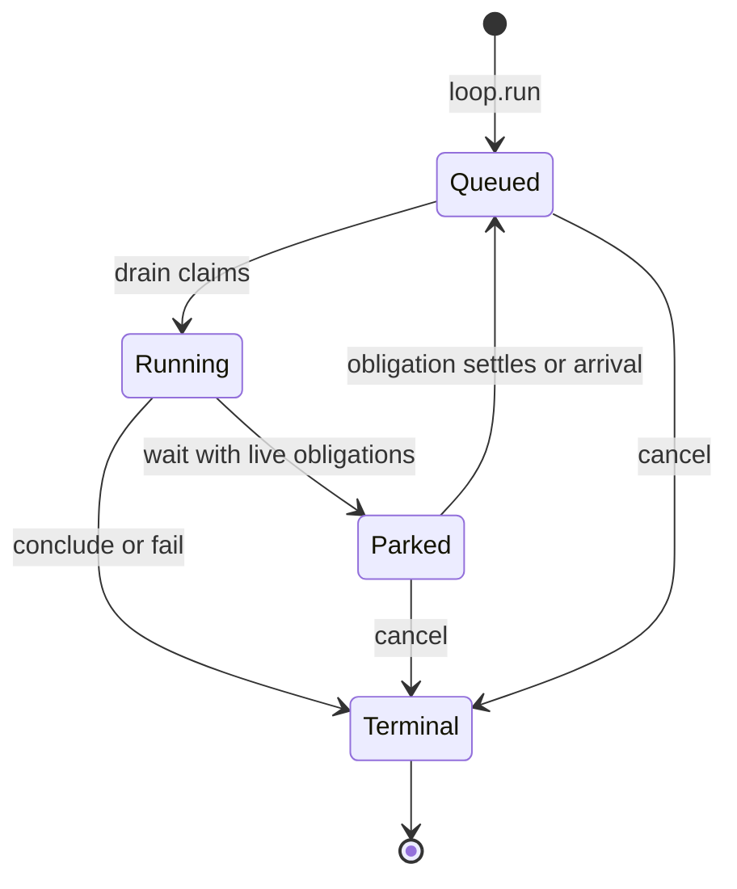
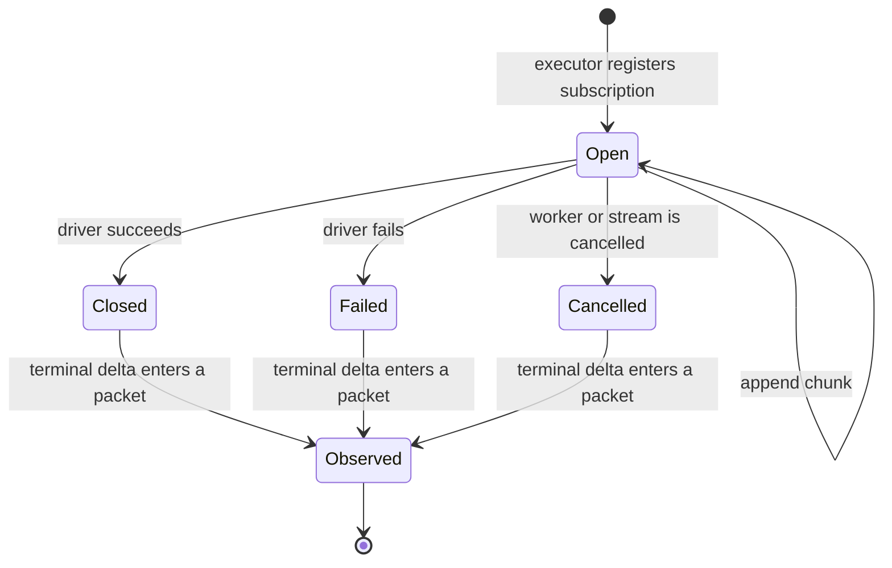
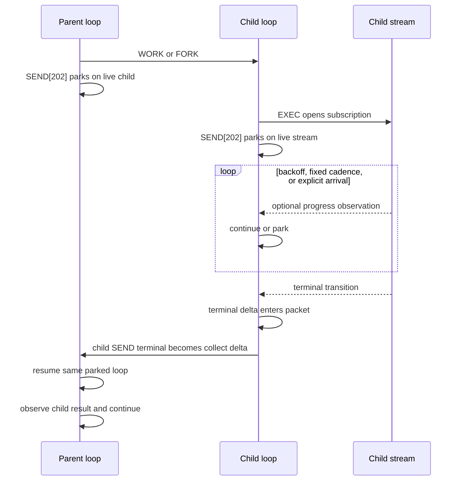
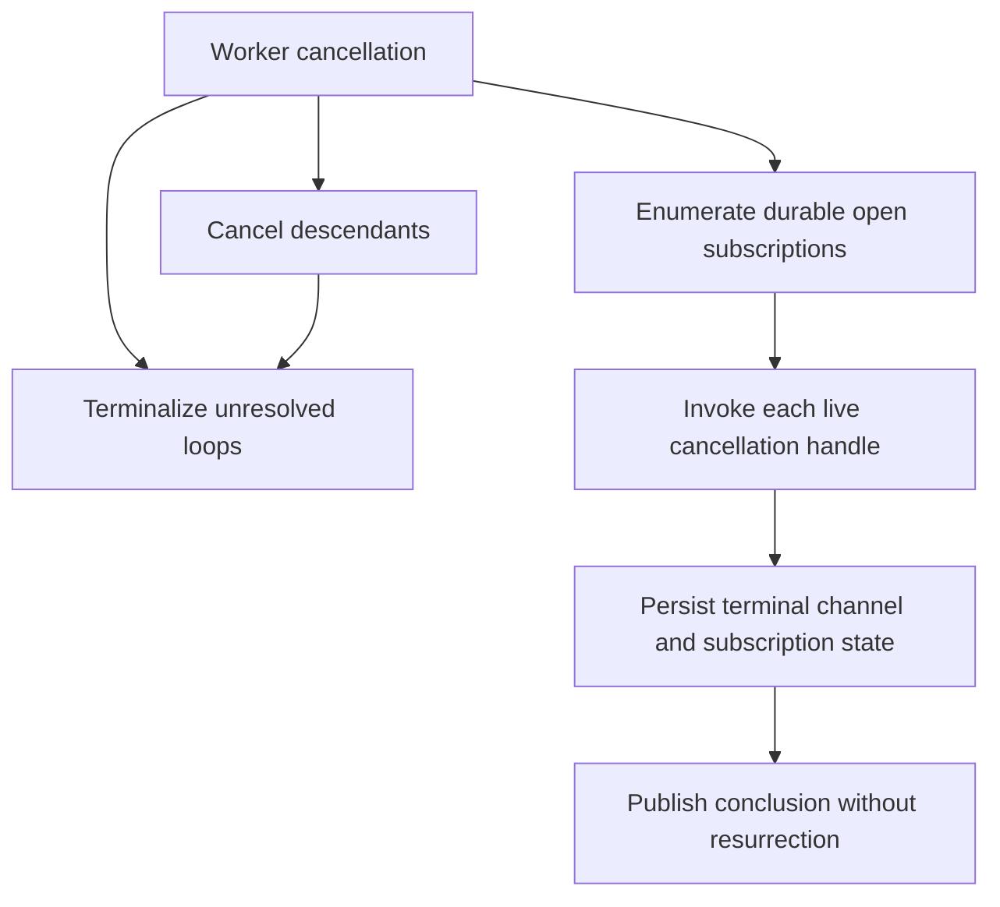
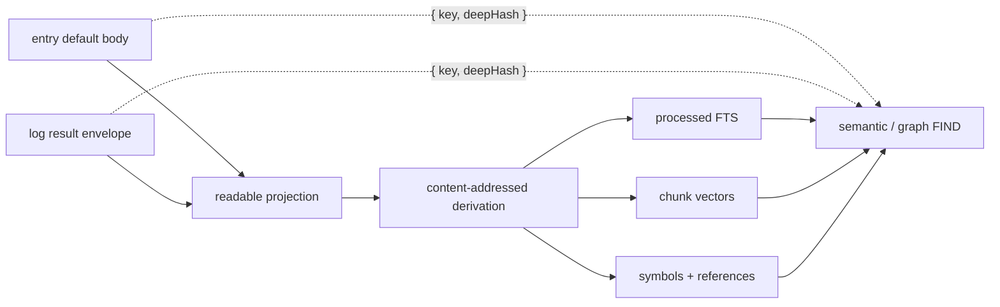

# plurnk-service — Specification

Canonical contracts plurnk-service exposes, architecture it implements, promises it makes to the constellation (`plurnk-grammar`, `plurnk-providers`, `plurnk-schemes`, `plurnk-mimetypes`, `plurnk-execs`, the user-facing `plurnk` CLI). `AGENTS.md` covers process; this file covers contract.

---

## §glossary Glossary

Canonical meanings. When a doc, comment, test name, or commit message uses one of these words, it means exactly what's written here. Drift is a bug.

### §lifecycle-terms Lifecycle terms

| Term | Meaning |
|---|---|
| **agent** | The plurnk runtime. Acts in-workspace as the reserved `plurnk` worker (§actor-boundary self-hosting), never a privileged singleton owning its own entries (entry scope is `workspace` / `worker`, §machine-processes). |
| **workspace** | Durable user-named workspace. Persists across workers and process restarts. Identity: `workspaces.id` + unique `workspaces.name`. |
| **run** | A stretch of work within a workspace. Multiple workers per workspace. May fork from another worker via `parent_worker_id`. Owns the log entries. |
| **loop** | One model-driven or client-driven iteration within a worker. Status ∈ {100 pending · 102 running · 200 done · 202 waiting (blocked on a live obligation, §send) · 413 budget-overflow · 429 turn-ceiling · 499 cancelled · 500 failed · 504 wall-clock timeout (§operator-config-loop-timeout) · 508 runaway}. Many loops per worker. The model workers inside a loop; each client RPC has its own loop. |
| **turn** | One engine scheduling unit (or one client RPC dispatch). A model turn sends one assembled prompt through one or more emission attempts and admits at most one response. Many turns per loop. Identity: `(loop_id, sequence)`. |
| **op** | One DSL operation the model emits. Parsed into a `PlurnkStatement`. Examples: `EDIT`, `READ`, `SEND`, `FIND`, `COPY`, `MOVE`, `OPEN`, `FOLD`, `EXEC`. One turn produces zero or more ops. |
| **statement** | Synonym for parsed op. The AST shape `PlurnkStatement` from `@plurnk/plurnk-grammar`. |
| **action** | One executed op. Action and op are the same thing in different states (op = parsed; action = executed). The execution produces a log_entries row at `log:///<L>/<T>/<S>/<op>`. (The Log may also hold an *actionless* `op='error'` row for a durable engine-rail failure, §operation-results.) |
| **dispatch** | The engine routing a statement to its scheme's op handler. |

### §storage-terms Storage terms

| Term | Meaning |
|---|---|
| **entry** | The unit of canonical state. Identity: `(scope, scheme, pathname)`. Holds one or more `channels` of content plus `tags` and `attributes`. |
| **channel** | A named content buffer on an entry. Examples: `body`, `stdout`, `stderr`, `headers`, `symbols`. Each channel has `content`, `mimetype`, `tokens`, `state`. |
| **scope** | `"workspace"` or `"worker"`. Determines who reads: workspace-scope entries are the shared world (every worker in the workspace), worker-scope entries are a worker's private scratch (§machine-processes). |
| **scheme** | A URI prefix + handler. `known`, `unknown`, `file`, `https`, `exec`. The scheme handler interprets paths under its prefix and implements the op surface. Consumption surface §scheme-surface; author contract: [plurnk-schemes](https://github.com/plurnk/plurnk-schemes). |
| **mimetype** | A channel's content type. Drives the handler that produces the structural projections (`symbols`, `deepJson`, `deepXml`). Consumption surface §mimetype-surface; author contract: [plurnk-mimetypes](https://github.com/plurnk/plurnk-mimetypes). |
| **provider** | An LLM transport. Implements `generate({messages, signal})` against a wire protocol. Consumption surface §provider; author contract: [plurnk-providers](https://github.com/plurnk/plurnk-providers). |

### §state-terms State / status

Independent axes on entries and channels. Confusion across them is a recurring source of bugs.

| Term | Type | Meaning |
|---|---|---|
| **status** | HTTP int | Outcome of an operation. Carried on `log_entries.status_rx`, returned from op handlers. Per the catalogue (§send-dispatch). |
| **channel state** | `static \| active \| closed \| errored` | Streaming lifecycle of a channel's content. Metadata, not gating — engine renders content regardless of state. |
| **entry state** | `proposed \| resolved \| failed \| cancelled` | Proposal lifecycle (`log_entries.state`). `proposed` = pending client accept; `resolved` = accepted, side effect happened; `failed` = rejected (no effect); `cancelled` = the proposal was cancelled (loop abandoning). Distinct from channel state. |
| **outcome** | `string \| null` | Short reason for `failed`/`cancelled` (`"permission:403"`, `"aborted"`, `"not_found"`). Opaque to most callers. |

### §authority-terms Writer / authority

| Term | Meaning |
|---|---|
| **writer** | The identity authoring a write. One of `model \| client \| plurnk \| plugin`. Carried on `ctx.writer` for schemes; engine enforces `manifest.writableBy`. |
| **origin** | Synonym for writer in log_entries (`log_entries.origin`). Historical naming; treat as equivalent. |
| **writable_by** | The set of writers a scheme accepts. Subset of `{model, client, plurnk, plugin}`. Engine rejects writes outside the set with 403; the rejection is logged as the action-entry (§subscriptions action-entry-as-outcome). |

### §engine-rails Engine rails

| Term | Meaning |
|---|---|
| **verdict** | End-of-turn ruling computed directly in `Engine.runLoop` from strike/cycle/sudden-death rail state. Decides whether the loop terminates or another turn fires. No filter chain — rails are inline. |
| **strike** | A turn whose verdict counts toward `MAX_STRIKES`. Fires when `turnErrors > 0` or cycle detection trips. The streak counter resets on clean turn; reaches `MAX_STRIKES` → loop abandons at 500 (failed), or 508 (Loop Detected) when the crossing strike was cycle-driven. |
| **emission attempt** | One completed provider exchange beneath an engine turn. ANTLR admits it only when it is a valid model turn (PLAN anchor, terminal SEND, no hard parse error or unparsed tail). A rejected attempt is forensic evidence, not another turn or an engine strike. |
| **cycle** | A repeated turn fingerprint across consecutive turns. Detected silently; model never sees the trigger. Strike accumulates internally. |
| **sudden death** | The last `MAX_STRIKES` turns of a loop's `MAX_LOOP_TURNS` window emit soft 429 warnings so the model can wrap up cleanly. `soft=true`: no strike, no streak increment. |
| **mode** | `"ask" \| "act"`. Per-loop. Ask = read-only: the dispatch gate refuses every side-effecting op (a filesystem write — EDIT/COPY-dest/MOVE/KILL on the `file` scheme — or an EXEC host runtime, §exec-excluded-in-ask); reads of the workspace stay open. `act` = full surface. The ancient contract: ask never changes the world. {§mode-ask-read-only} |
| **flag** | Per-loop value shaping authority or toolset: `auto` (resolve proposals inside the loop), `noWeb`, `noInteraction`, `noProposals`, `mode`. |
| **proposal** | A deferred side-effecting action. State machine: `proposed → resolved` (accept), `→ failed` (reject), or `→ cancelled` (cancel). With `flags.auto=true`, authority remains inside the loop and resolution is immediate. |
| **resolution** | Client's accept / reject / cancel of a proposal via the `loop.resolve` RPC (§methods). |

### §packet-terms Packet terms

| Term | Meaning |
|---|---|
| **packet** | The turn's full exchange shape: `{system, user, assistant, assistantRaw}`. Persisted on `turns.packet`. |
| **log** | the `log` section. Chronological list of `log_entries` in scope this turn. |
| **render** | The act of computing the packet from current DB state at turn boundaries. Mimetype handlers fire at render time. |

### §test-taxonomy Test taxonomy

| Tier | Location | LLM | Substrate |
|---|---|---|---|
| **unit** | `src/**/*.test.ts` | No | Isolated logic, mocked boundaries |
| **intg** | `test/intg/` | No (mock provider) | Real file-backed SqlRite (per-test DB under `test/intg/.tmp/`), real engine |
| **live** | `test/live/` | Real | Wire-level assertions |
| **demo** | `test/demo/` | Real | Holistic outcome assertions |

---

## §arch Architecture

The ecosystem and the in-process shape (§ecosystem–§in-process), then the two invariants the rest of the spec rests on: isolation by worker (§actor-boundary) and the workspace/worker/fork ownership model (§machine-processes).

### §ecosystem Ecosystem

The plurnk project is a modular monorepo-of-repos in the `@plurnk/*` npm namespace. Each repo has one published package and one agent who owns it; cross-repo coordination happens through issues, not shared code. This service sits in the middle of that ecosystem and is its **runtime substrate** — the daemon other repos plug into.

Dependency direction (from root to leaf):

- **`plurnk-grammar`** — owns the AST and shared wire contracts, including
  universal `OperationResult`/RFC 9457 Problem Details, plus the ANTLR parser
  that turns model output into `PlurnkStatement[]`. Packet assembly is
  service-owned (§packet).
- **Framework siblings** consume grammar and define their own author-facing contracts:
    - `plurnk-providers` — Provider/Alias types, AI SDK adaptation, Models.dev-backed provider resolution, local endpoint probes, `Mock`, and normalized usage. Ordinary vendor protocols belong to official AI SDK providers; only genuinely new protocol bindings require a provider plugin.
    - `plurnk-mimetypes` — handler base classes, discovery, the fitting algorithm, and the match primitives (`queryGlob`/`queryRegex`/`queryJsonpathObject`/`queryXpathString`) the service's matcher dispatches over (§matcher-dispatch). Handler children are per-mimetype: `plurnk-mimetypes-text-{python,typescript,markdown,html,csv,plain}`, `plurnk-mimetypes-application-{json,yaml,toml,pdf}`, …
    - `plurnk-schemes` — scheme-author types (`SchemeManifest`, `WriterTier`, `LoopFlags`), result-shape contracts (`EntryResult` / `ProposalResult` / `PassthroughResult`), slicing primitives, matcher helpers, `schemeError(...)` constructor. Future scheme children: `plurnk-schemes-http`, `plurnk-schemes-git`, …
    - `plurnk-execs` — `BaseExecutor`, `SubprocessExecutor`, runtime resolver, discovery. Children declare runtimes: `plurnk-execs-sh`, future `plurnk-execs-search`, `plurnk-execs-node`, …
- **`plurnk-service`** (this repo) — consumes all of the above. Implements the engine, dispatches ops through scheme handlers, hosts the in-tree set of schemes (`plurnk`, `log`, `exec`, `known`, `unknown`, `skill`, `file`), resolves model providers, discovers installed mimetype handlers and executor siblings at boot, and exposes an in-process seam to client-interface modules. Packet assembly is service-owned (§packet).
- **`plurnk`** (client) — terminal UI consuming the AG-UI+ client surface. Renders daemon events and contains no engine logic.

The grammar is the contract. The frameworks consume the contract and add author-facing surfaces. The service consumes the frameworks and runs the engine. The client consumes the service and renders to humans. Each tier is its own published package; each tier's evolution happens in its own repo.

**This service's central role:** sole consumer of every author-facing framework contract (one set of integrations across the ecosystem), sole producer of the engine's runtime behavior (one canonical implementation of dispatch, log, packet wire), and sole orchestrator of cross-scheme operations (COPY/MOVE flow through engine-mediated `readEntry` / `writeEntry` / `deleteEntry`, never scheme-to-scheme). Most cross-repo coordination flows through us — we file the consumer-need issues at upstream repos, adopt their decisions, document the surface in SPEC.

### §in-process In-process architecture

Engine library + admin CLI + daemon. Four plug points:

- **Providers** (§provider) — LLM transports. Engine sends a turn's messages, receives raw content + usage; engine parses the content into `PlurnkStatement[]`.
- **Schemes** (§scheme) — addressable resources. Every op targets a URI; scheme handler interprets paths under its prefix and owns its storage substrate.
- **Mimetypes** (§mimetype) — content interpretation. Render-time handlers consume channel content; framework owns the dispatch.
- **Executors** (§exec / §bundled-set) — EXEC runtime dispatch. Subprocess shells, search backends, future tool runtimes.

The engine dispatches ops, persists state to SQLite, orchestrates cross-scheme COPY/MOVE (§copy/§move), writes the log. Substantive behavior lives in the four plug points.

The grammar (`@plurnk/plurnk-grammar`) owns parser + AST contract. Schemes receive parsed statement fragments via dispatch.

Server posture: this package is the runtime. User-facing CLI lives in `plurnk` and consumes the library API (`src/index.ts` + `PATHS`).

### §actor-boundary The actor boundary: isolation by worker, two doors, self-hosting

**Question.** A workspace holds many workers — model, client, plurnk (§lifecycle-terms, §authority-terms) — over one shared manifest. What keeps one worker's activity out of another's conversation; what are the *only* ways a worker's work reaches another; and does the engine's own work obey the boundary or get a privileged back channel?

**Decision — isolation by worker; the model is not privileged.** A packet renders exactly one worker's log — the assembling worker's — against the workspace's shared manifest (§packet). A worker cannot see another's log: isolation is *structural*, a consequence of "a worker owns its log entries" (§lifecycle-terms) and "one packet, one worker," never an `origin` filter at render time. `origin` (§authority-terms) is **attribution** — the delta's provenance (§env-delta) — never read to filter a row. {§actor-boundary-isolation} {§actor-boundary-origin-not-filter}

**Two doors, and only two.** A worker's work reaches another worker by exactly two channels, and a private log is reachable no other way:
- the **environment door** — a write to a *shared entry* surfaces to every worker sharing it as a folded, attributed delta (§env-delta). *State.*
- the **voice door** — an **inject** delivers a turn into a *specific* worker's log; `btw` is the user's mid-loop inject. *Message.*

{§actor-boundary-two-doors}

**Wild west by default; explicit branch batches are the exception.** Ordinary runs share the manifest without locks. Coordination is cooperative and softly fenced (the §membership `read-only` overlay, a workspace policy, bounds every worker's writable surface uniformly — §machine-processes); a conflict *surfaces* as a delta rather than being prevented. A branch-tagged WORK/FORK opts the whole workspace into the bounded, exclusive Git transaction in §worker-branch-batch. It is not a general entry mutex or a hidden per-worker filesystem. {§actor-boundary-no-mutex}

**Passive wake.** An idle worker wakes on exactly two events, both *directed at the worker*: a prompt injected into it — the **voice door** (a user/system `loop.inject`, and once `worker://` lands a sibling's `SEND(worker://<name>)`) — or a **stream-status transition** on a subscription it opened (§channel-state). Everything ambient is a delta — a sibling's edit to a shared entry, an out-of-band disk change — and a delta **never** wakes; it queues and drains at the next turn one of those two events produces (§env-delta). {§actor-boundary-passive-wake}

**Self-hosting — the runtime is an actor, not a back channel.** Runtime-initiated work (fs reconciliation §membership, git auto-add) is an **ephemeral `plurnk` worker** firing ordinary ops, seen by other workers through the environment door like any actor's — not a privileged engine pathway. The engine keeps only the irreducible kernel workers stand on (spawn, dispatch, packet assembly, the budget rails §grinder, the fs-watch); everything expressible as ops on workspace entries is a worker doing ops, through the same `op.*` surface (§methods) the service offers clients. Dogfooding is the architecture, not a test mode. {§actor-boundary-self-hosting}

**Migration path.** Largely realized: `Engine.dispatch` is origin-agnostic; client ops run in a per-connection client loop (`_dispatchAsClient`); plurnk EDITs already carry `origin=plurnk`. The keystone is **built** — `dispatchAsPlurnk` spawns the workspace's reserved `plurnk` worker and fires ops through dispatch, mirroring `_dispatchAsClient`; its uses so far (operator docs below; the fs-divergence narration) land in the plurnk worker's log. The line that remains is one of *kind*, not a list of pending dispatches: work **expressible as an op** belongs on the keystone; work that is **not** stays kernel. Disk→entry materialization is the latter — *ingestion* is the inverse of an EDIT (which proposes egress to disk, §membership-edit-membership-gate), so it has no actor op and remains fs-watch kernel, paired with the plurnk worker's filtered `source=file` narration (§env-delta) so a sibling pulls only true divergences, not every re-sync. Search-index maintenance is likewise pre-model kernel work, not an entry-creating op; catalog rendering remains an independent read-only projection. The one outstanding *expressible* piece is **git auto-add** — a model-created file surfaced as a plurnk-worker op — gated on the §membership repo-overlay still being built.

**The keystone's first use: operator reference docs.** `PLURNK_SERVICE_MD_<ALIAS>=<path>` (§operator-config) materializes `<path>` as a `plurnk:///<ALIAS>.md` entry — a `dispatchAsPlurnk` EDIT in the plurnk worker, **not** the model's — and the model's turn-0 foists a READ of it. The model reads the doc inline while the materializing EDIT stays out of its log: idiomatic context injection, an ordinary entry + READ rather than a bespoke packet section. The same `PLURNK_SERVICE_MD_*` convention cascades to clients. {§actor-boundary-doc-injection}

**Catalog preview.** `PLURNK_SERVICE_FILES_ITEMS` foists turn-0 FINDs into the worker's first turn, so a worker opens with its catalog instead of blank. An enabled preview always executes the four orienting surveys — project files (`FIND(**)`), workspace commons (`FIND(worker:///**)`), the worker's own space (`FIND(worker://~/**)`), and kernel docs (`FIND(worker://plurnk/docs/**)`) — even when a survey returns zero results; empty is useful knowledge about the surface. Entry-bearing plugin schemes also foist. The model's own surfaces always foist **full**; the first-`N` cap applies **only to `file`** (the bare project-relative path shape plurnk.md teaches, over the external, arbitrarily-large tracked-file tree), so model memory is never truncated. An empty file survey carries no range rather than the invalid `<1,0>`. `-1` = everything full; a positive `N` = the file list capped to its first `N` (FIND's `<L>`, clamped to a non-empty scheme's count; memory still full); unset / `0` = no preview (the model FINDs on demand). `log://` is absent — present-mode (the `# Log` section), not a catalog scheme. {§actor-boundary-catalog-preview}

### §machine-processes The machine and its processes: workspace, run, fork

**Question.** §actor-boundary isolates workers and lets the runtime self-host, but it stands on an ownership model it never states: what does a *workspace* own versus a *worker*; what is shared versus private; and what does a fork carry? Unstated, the downstream questions — which worker `log.read` reads, what a fork copies, where a per-client window onto the workspace would live — grow subtle, then metastasize. Drawn once, they vanish.

**Decision — the workspace is the world; a worker is a log on it.** A **workspace** is the world: one shared filesystem — the `workspace`-scoped entries, surfaced as the per-scheme catalog (`FIND(scheme:///**)`, §packet) — under one membership overlay (§membership). Exactly one filesystem and one overlay per workspace; neither is per-worker. A **worker** is a process whose private memory is its **log** (§lifecycle-terms) — its loops, turns, and rows, each row carrying its own content, attribution (`origin`/`source`, §env-delta), and fold-state (`expanded`). A worker owns **no membership**; even its visibility is not a possession but a bit on its own rows. It is a *history over the shared world, not a world*.

**One filesystem.** The entries are the workspace's: `entries.workspace_id`, never a worker. A write by any worker is a write to the one filesystem every worker reads; there is no per-worker entry set. {§machine-processes-one-filesystem}

**One overlay.** Membership — `git ls-files ∪ pick − hide` with `view` read-only (§membership) — is the workspace's: `workspace_constraints.workspace_id`, never a worker. It is workspace *curation*, and the workspace *is* the workspace; two workers are two conversations about one curated workspace and see the same one. Divergent membership is a different workspace, never a per-worker overlay. {§machine-processes-one-overlay}

**A worker's memory of the world is its log — no shadow beside it.** A worker's view of the shared world is the log and only the log — never a per-worker snapshot. *What I am looking at* (OPEN/FOLD) is `log_entries.expanded`, a bit on the worker's own rows, toggled by ordinary `log:///` ops — not a second store, and never membership (§open-fold). *What I last saw* needs no shadow either: a worker learns its world moved through log entries (§env-delta) — a sibling's write broadcast into its log, an out-of-band disk change detected against the entry's own content and broadcast the same way — never through a per-worker snapshot the worker cannot see. (Its private **scratch** — worker-scope entries, §worker-scheme — is the worker's own evolving workspace, owned not shadowed: a store it writes and reads deliberately, not a hidden mirror of the shared world. The doctrine is *no shadow of the world*, not *no private state*.) {§machine-processes-worker-is-its-log}

**A worker's log is private to packets, not to the workspace.** Isolation (§actor-boundary) governs what an *actor* sees — its own worker, never a sibling's. It does not wall off the *wire*: any connection may read any worker's log in its workspace by id — `log.read({ workerId })`, ownership-verified, defaulting to the connection's own worker. This is how a conversation client reads the **model** worker, where the conversation lives: `loop.run` returns its `modelWorkerId`, and `workspace.workers` enumerates a workspace's workers for a connection that did not drive it live. The read is observation, never packet membership — no actor sees it. {§machine-processes-model-worker-readable}

**A worker carries its actor.** Each worker records its `origin` — `model` (the conversation), `client` (a connection's own worker), or `plurnk` (the runtime's self-hosting worker) — set once at creation and inherited by a fork. `workspace.workers` returns it, so a conversation client identifies the model worker by its actor, not by parsing the name — which is set at instantiation and immutable, never renamed (a worker is permanent history, §machine-processes-worker-is-its-log). {§machine-processes-worker-origin}

**The primary worker is the lineage root.** {§worker-primary} The PRIMARY worker of a turn's lineage is the no-parent root reached by walking `parent_worker_id` up; a no-parent worker is its own primary. Core supplies it on the first-party metadata channel alongside `Worker-Id` (same gate, computed per turn), stamped on EVERY turn including the primary's own (where it equals `Worker-Id`) — absent-with-a-Worker-Id is a contract violation, never a silent "assume primary." An unresolvable root (a corrupt/cyclic parent chain the `parent != id` CHECK forbids) fails hard. Providers emits it as `Plurnk-Worker-Primary`; a consumer routes primary-vs-spawned by equality (`Worker-Primary == Worker-Id` ⇒ the primary; `!=` ⇒ any-depth spawn, no depth math) and groups the worker tree by the shared root (#522).

**Fork — copy the log, share the world.** A fork is a new worker in the *same* workspace (`workers.parent_worker_id`, §lifecycle-terms). It copies the **log** — the rows, their fold-state riding along — so the branch inherits everything the parent observed (§env-delta makes a worker's timeline self-contained for exactly this) and diverges freely after. {§machine-processes-fork-copies-the-log} It shares the **world** — the one filesystem, the one overlay — live and uncopied, because the worker never owned it. {§machine-processes-fork-shares-the-world}

**A workspace cannot be forked.** There is nothing to branch — a workspace *is* the shared ground. `workers` carries `parent_worker_id`; `workspaces` carries no parent. Parallel histories over one workspace are forks of its workers; a divergent workspace is a new workspace. {§machine-processes-no-fork-workspace}

**Rationale.** The model falls out of one correction: *a worker is a history over a shared world, not a world.* Entries are the world (workspace); the log is the history (worker); forking a history need not copy the world, and a worker accumulates nothing the log does not already hold. The overlay's workspace home is forced the same way — it is the world's curation, and the world is shared; per-worker it fragments the one manifest, forks the membership read-gate (the §membership security line), and duplicates what FOLD already does at the right level. Every "which worker / what's copied / where's the per-client window" answers itself once the world/log line is drawn.

**Migration path.** Mostly stating what the schema already carries: `workers.parent_worker_id` and the parentless `workspaces` exist (§lifecycle-terms); `workspace_constraints` is workspace-level (§membership); §env-delta already makes a worker's timeline self-contained, so a fork's log copy suffices. Additive: `worker.fork` over the wire (the engine fork is built). Two repatriations: §actor-boundary's "read-only overlay scopes a worker's writable surface" becomes a *workspace* policy bounding every worker uniformly; and the §env-delta environment door has shed its per-worker snapshot — a worker's only memory is its log, so drift is pulled from the shared log (other actors' edits since the worker's last turn) and the filesystem narrates its own through the `plurnk` worker, both already log entries, never a per-worker shadow.

### §worker-scheme The worker:// scheme — the knowledgebase (commons, own space, named spaces, the kernel surface) and worker control (spawn, irc, fork, terminate, cap, collect)

**The authority names the OWNER** (#527, the (c) carving): `worker:///notes.md` is in the COMMONS — a shared blackboard; `worker://~/draft.md` is the calling worker's own private space; `worker://<name>/result.md` is a named worker's space; `worker://plurnk/docs/x.md` is the kernel's published surface, world-readable. Storage keys the owner on the entries.owner_id column (§entry-owner) — the pathname is always the bare entry path, and a FIND's result paths re-apply the queried authority so the model sees the address it typed. `~` and `plurnk` are resolver-interpreted reserved authorities; `self`/`commons` are reserved names no worker may take. {§worker-authority-carving}

**Named spaces are ancestry-gated reads**: the reader is the owner or an ANCESTOR (the recursive parent_worker_id walk) — oversight flows down the tree, a parent reads `worker://child/result` across generations, a child cannot snoop upward, and an unknown name or unpermitted reader resolves 404 with no existence leak. The kernel surface is the one world-readable named space. {§worker-read-scope}

**Writes are self-and-commons only**: a model writes `worker://~/` and `worker:///` — every named authority is read-only to it (403), and owner_id is engine-stamped from the dispatch context, never model-set. Nothing worker-authored can land under another principal — `worker://plurnk/` included, which is what makes the kernel surface the trust boundary with no guard to forget (only the kernel, dispatching as itself, authors it). The entry-copy seam (COPY/MOVE) is pathname-keyed and addresses the commons; a space's content moves via READ + EDIT. {§worker-write-scoping}

The worker:// scheme makes §machine-processes addressable: a `worker://` target is a sister worker in the workspace — `worker://self` the current worker, `worker://<name>` a workspace-scoped sibling (`workers.name`). `self` is the reserved current-worker sentinel; empty authority (`worker:///`) is invalid (400). Same-workspace only; a worker never addresses another workspace's workers (§actor-boundary). The path discriminates the two faces: **path-absent is control** on the worker-as-actor — the NAME is the authority (`worker://<name>`, two slashes, no path) — while **path-present is worker-scope storage**: `worker://<owner>/<path>` (`worker://self/<path>` for self) addresses the owner's private scratch (Scratch + Perspective, below). The control ops are three, fire-and-forget — the child workers independently, lineage in `workers.parent_worker_id`:

- **Spawn** — `WORK(worker://<name>):task` creates a new worker sister (empty log) and starts it with `task` on its first loop. WORK/FORK are the worker-creation verbs (grammar 0.74.55): EDIT is file/entry only, so EDIT on the bare worker entity is a **400** steering to WORK/FORK — the entity is not an entry. A name is **frozen per worker** but **reclaimable across time** (§machine-processes-worker-origin): a name held only by a *terminated* sister is free to reuse — a fresh spawn takes a new row and `worker_resolve_by_name` resolves the newest, the corpse keeping its name in permanent history. A name a *live* sister still holds is a conflict — **409 `worker '<name>' is already running`**, legible at the spawn gate, never a raw store-level uniqueness error. {§worker-scheme-spawn}
- **irc** — `SEND(worker://<name>):msg` delivers `msg` to an existing sister, the **voice door** (§actor-boundary-two-doors): an active sister folds it into its next turn, an idle one wakes (§actor-boundary-passive-wake); a name with no worker in the workspace is 404. {§worker-scheme-irc}
- **Fork** — `FORK(worker://<name>):task` branches the current worker into a **named** sister: its log is deep-copied (§machine-processes-fork-copies-the-log), which continues with `task`; the world is shared, never copied (§machine-processes-fork-shares-the-world). A fork ALSO inherits the worker-scope **scratch** — its private workspace deep-copied with the owner remapped (source → branch) — so the branch opens with the parent's notes and diverges on its own edits: *fork = everything-in-common-but-name*. WORK and FORK are distinct verbs — WORK spawns a fresh worker, FORK branches the log — and each names the new worker explicitly, so the model addresses it (`KILL`/`SEND`/`READ`) by that name. The lower-level seam generates `<parent>-fork-<N>` only when its caller omits a name. Inherited loops are copied as **terminal history** (a non-terminal status is clamped): a fork's own work is a fresh loop, so an inherited mid-flight loop never makes the branch look forever-live to the §send-premature-terminate gate. {§worker-scheme-fork} {§worker-scheme-fork-scratch}
- **Git branch batch** — `WORK[feature/x](worker://<name>):task` and `FORK[feature/x](worker://<name>):task` retain their worker meanings while placing the child in the serialized Git transaction defined by §worker-branch-batch. The signal is one branch ref, not tags; an untagged WORK/FORK keeps the ordinary concurrent shared-world behavior.
- **Delegation inherits authority.** The live loop a spawn, fork, or irc-raised fresh loop starts with carries the **delegating loop's flags** — an auto parent delegates auto workers. Flags are a property of the delegation, not of the client connection: a child loop that fell back to defaults would propose every side-effecting op into a resolver-less void (nobody attends a headless worker's review queue; each attempt burns the full proposal timeout — the four-sweep fan-out wedge, where three workers stalled 300s-per-EXEC while the parent slept and the harness watched only the parent). An irc that *resumes* a parked loop leaves that loop's own flags untouched — inheritance applies only where a fresh loop is born. {§worker-delegation-inherits-flags}
- **A wake re-queue is not a terminal.** A conclusion-wake resumes a 202-blocked loop by re-queueing it (202 → 100); when that lands while the loop's OWN live drain is between turns, the drain **re-claims and continues** (atomic 100 → 102; the injected prompt is already the next turn) — it never reports the re-queue outward. Treating 100 as an externally-imposed terminal once broadcast a QUEUED loop as a terminal result while the DB healed to 200 behind it — a client-facing lie the delegation topology hit on ~30% of runs. {§worker-lifecycle-wake-requeue-not-terminal}

Untagged worker control rides the daemon's inject seam (active→fold, idle→enqueue+drain), so the handler creates/branches the worker and hands off; the daemon owns provider + system prompt. Tagged WORK/FORK instead enqueue a fresh loop without starting its drain; §worker-branch-batch becomes its sole starter. FORK/WORK carry the seed task in the body and are their own ops, dispatched to worker control — never the entry-copy path.

### §worker-branch-batch Serialized Git branch batches

**Question.** Worker fan-out is useful for parallel reasoning, but several filesystem-writing workers sharing one checkout cannot safely develop independent changes at once. Worktrees solve that with additional checkouts and path identity; for plurnk they also duplicate a large workspace, complicate membership, and make the model's one-root filesystem contract untrue. What is the smallest branch isolation that preserves ordinary Git and a legible parent/child topology?

**Decision — stop the workspace, serialize ordinary branches.** A branch signal on WORK/FORK creates a durable batch keyed to the parent turn. The batch queues one exclusive workspace gate before that parent releases its turn. Turns already in flight drain; every later model turn and client file operation waits. The batch owns exactly one repository: the Git repository containing `workspaces.project_root`. A project root may be a package inside a monorepo; the repository, not the package directory, is the transaction boundary. Unrelated repositories belong to unrelated workspaces and receive no branch policy from this workspace. All tagged children from the turn branch from the same frozen commit, then run one at a time in emission order. The active child and its descendants may take turns; no other worker may enter the checkout. Worktrees, stashes, automatic merges, and hidden alternate roots do not participate. {§worker-branch-batch-exclusive} {§worker-branch-batch-frozen-base}

```mermaid
sequenceDiagram
    participant P as Parent turn
    participant G as Workspace gate
    participant B as Branch batch
    participant C1 as Child branch 1
    participant C2 as Child branch 2
    P->>B: WORK[branch-1], FORK[branch-2]
    P->>G: queue exclusive before releasing shared turn
    G-->>B: all earlier turns drained
    B->>B: snapshot clean project repository; create both refs from frozen base
    B->>C1: checkout branch-1; run to terminal
    C1-->>B: committed, clean result
    B->>B: record tip; restore exact parent ref
    B->>C2: checkout branch-2; run to terminal
    C2-->>B: committed, clean result
    B->>B: record tip; restore exact parent ref
    B-->>G: release exclusive
    B-->>P: wake; deliver branch receipts
```

**Preflight is total.** `GitMembership.projectRepository` resolves the repository containing `project_root`; absence rejects the tagged op. Earlier turns and finite derivation work drain at the exclusive boundary; a pre-existing open stream subscription is not a finite checkout operation and therefore rejects preflight rather than being silently cancelled or waited forever. Before any child starts, every branch passes `git check-ref-format --branch`, the project repository has no staged, unstaged, or nonignored untracked changes, every requested branch is absent, and the original symbolic ref/detached commit is recorded. All branch refs are then created from that frozen commit. Failure rolls back only refs created by this preflight, fails the queued children, restores the parent, and releases the workspace. Existing branches are never adopted or overwritten. {§worker-branch-batch-preflight}

**A child returns commits, never a dirty checkout.** SEND[200], SEND[499], and an already-drained SEND[202] are refused with 409 while the project repository is off the assigned branch or dirty. The model commits or deliberately discards its changes and concludes again. On terminal, the batch records the full result commit and whether it differs from the frozen base, restores the exact original ref and commit, and only then advances. A clean child failure is a completed batch item and does not suppress later siblings; an ambiguous or dirty host failure becomes `recovery_required` and retains exclusivity because restoring would destroy or misattribute work. {§worker-branch-batch-return}

**The parent reconciles; the engine does not merge.** The ordinary child deliverable remains the model's exact SEND body. Its pushed termination delta and pull-side `READ(worker://child)` append a bounded branch receipt: branch, item outcome, and the abbreviated result commit (`PLURNK_SERVICE_BRANCH_RECEIPT_REVISION_CHARS`; the database retains the full id). Branch refs remain after the batch. The parent chooses inspection, cherry-pick, merge, rejection, or deletion with ordinary Git tools. {§worker-branch-batch-receipt}

**Recovery follows durable ownership.** `branch_batches`, their ordered items, the project-repository snapshot, and result tips are schema state, not process memory. Generic boot recovery never starts their queued loops. A crash before sealing fails the unstarted batch. A queued partial preflight is rolled back only when every created ref still equals its frozen base, then retried. A running child is never replayed: its loop settles under the ordinary owner-loss rule; if the checkout is clean and either on the assigned branch or the exact original position, the committed tip is retained, the original restored, that item marked interrupted, and queued siblings continue. Any mismatch becomes `recovery_required` and keeps the workspace stopped for operator correction. {§worker-branch-batch-recovery}

Beyond the three creation ops:

- **Entries (storage)** — entry addressing rides the authority carving above (§worker-authority-carving): `worker:///` the commons, `worker://~/` the own space, a name an ancestry-gated read (§worker-read-scope), writes self-and-commons only (§worker-write-scoping). An entry-path `KILL` deletes under the same write-scoping (200; 404 absent; 403 named) — distinct from the path-ABSENT `KILL(worker://<name>)` which terminates the worker (§worker-scheme-terminate); the discriminator is the entry path, never the op. A worker's own space is catalogued in ITS perspective alone (`FIND(worker://~/**)`, foisted at turn 0 even when empty); isolation is the owner column, structural.
- **Terminate** — `KILL(worker://<name>)` aborts a worker by address (self is `worker://self`): every unresolved loop in that worker's subtree closes 499 and every subscription in the subtree tears down; a name with no worker is 404. Cancellation is structured: descendants cannot detach implicitly. The override to the fire-and-forget default is not a parent-power — whoever holds the address may end it; a worker left alone simply ends at its own `SEND[200]`. {§worker-scheme-terminate}
- **Cap** — `PLURNK_SERVICE_WORKSPACE_WORKERS_MAX_ACTIVE` ceilings the *concurrent* active workers per workspace (a worker with a non-terminal loop); a spawn or fork past it fails hard (508 — no queue, no retry), irc exempt; `-1` disables it. The fork-bomb brake, sized for workspaces that live for months. {§worker-scheme-cap}
- **Collect** — a worker's loop reaching a terminal status surfaces to its sisters as an ambient delta (§env-delta): a `SEND` from `worker://<name>` carrying the loop's deliverable — the `SEND[200]` body, or for an abandonment the reason. A **2xx deliverable is born OPEN** (its body materialized into the parent's packet, not hidden behind a fold): a child's success must reach the parent open and awakening, never a bodyless row. An abandonment (non-2xx) surfaces folded. Every death-path is stamped uniformly, so no termination is silent; collection is the shared world moving, never a verb. **Child orientation.** Beyond the conclusion delta, every turn the packet's status clump surfaces the live things THIS worker *currently holds* — open streams (`## Child Streams`) and unconcluded child workers (`## Active Child Workers`) — as terse `* <status> <path>` pointers (the same shape as the errors section), just above it. A worker is otherwise marked only at spawn and at conclusion; in between it goes silent, so a model loses track of what it holds and premature-terminates. This is ORIENTING STATE, never advice: the model SEES its live subtree (`* 102 worker://worker-x`, `* active sh:///1/2/3`) and reasons for itself — READ/OPEN/KILL via the path — the error stays terse. Empty → omitted, like errors. {§child-orientation} The **pull** side mirrors the push: a path-absent `READ(worker://<name>)` collects the same deliverable on demand — the latest loop's terminal message (the result, or the abandonment reason) for a concluded worker; a worker **still running** has not delivered, so the READ returns **425** (Too Early) and the turn's `SEND[202]` **blocks the loop on the join** ({§join-blocking-collect}) until the worker delivers — the engine holds the join, the model never drives a park. A missing name is 404. So the model never needs to guess a scratch path to "check on" a worker — reading the worker itself yields its outcome or a wait. {§worker-scheme-collect}

### §run-lifecycle Run lifecycle: the drain, the reap, the passive wake

- **A `READ` on a running child is a blocking join, not a poll.** {§join-blocking-collect} A path-absent `READ(worker://<running-child>)` returns **425** (Too Early) and records a live obligation on the loop. The turn's `SEND[202]` waits for that obligation instead of asking the model to poll. When the child reaches any terminal status, the same loop resumes with the result in its log. Children are bounded by their own turn and strike limits, terminal failure also wakes the parent, and the owed-wake path covers completion before the parent parks. Any `SEND` clears the per-turn arm; `SEND[200]` with a live child remains a premature-termination error. A `<seconds>` timeout-poll is the explicit polling alternative.

A worker is a **log plus a cancellation scope** — one `AbortController` per worker, reused while live and replaced only once aborted, so a cancel ends the worker as a unit and a later `loop.run` is never born cancelled. A worker's queued loops are advanced by a **drain**: a single per-worker worker that claims loops atomically (status 100→102) and runs each under the worker's scope. A loop may spawn **streams** (execs) that outlive it; each is a row in the subscription registry (§subscriptions) — the durable record of what the worker holds open. Cancellation and conclusion are defined against these structures, never wall-clock timing.



The lifecycle store admits only the guarded transitions shown above: `100 → 102`, `102 → 202`, `202 → 100`, and any unresolved state (`100`, `102`, `202`) to a terminal status. Terminal state is immutable. The queue drain owns claim, the dispatcher owns model-requested park/conclusion, the daemon owns wake/cancellation/restart reconciliation, and the engine owns policy terminals. A racing transition that loses observes the durable winner; it does not overwrite it or report the requested state as fact. {§worker-lifecycle-state-machine}

Streams are independently durable subscriptions owned by a worker. Payload and
lifecycle are orthogonal: zero bytes is a valid payload for both success and
failure, while the closed subscription and its status are the terminal fact.
Every stream entry exposes that durable state in catalog rows as
`stream: { state, ... }`: active streams carry `seconds`; terminal streams carry
their exact `status` and derive `closed` (status below 400), `killed` (499), or
`failed` (other failure status). An entry with no subscription has no `stream`
member. This is historical state, not merely a live-process hint.
{§stream-catalog-lifecycle}



| Subscription state at `SEND[202]` | Terminal observation already in a packet | Result |
|---|---:|---|
| open | no | park; polling or closure may wake it |
| closed, any status, empty or non-empty | no | continue directly to the observation turn |
| closed, any status, empty or non-empty | yes | no stream obligation remains |
| cancelled as part of worker cancellation | irrelevant | terminate the cancelled worker; never resurrect it |

{§worker-lifecycle-subscription-matrix}

Polling observes a still-open stream; it never changes ownership or manufactures
completion. Closure is always a wake edge regardless of polling mode.

| EXEC poll marker | While open | On closure |
|---|---|---|
| omitted | exponential-backoff observation wakes | resume once with terminal observation |
| positive `P` | fixed-cadence observation wakes every `P` seconds | cancel cadence; resume once |
| zero | no observation wakes | resume once |
| turn-scoped `<0>` | reap at the next pre-turn boundary | surface the terminal outcome |

{§worker-lifecycle-poll-matrix}

The structured-concurrency sequence is identical whether a child performs an
EXEC, retrieval, or pure inference. Intermediate child status is private to the
child. Only the child's terminal loop result crosses the parent edge.



| Child state at parent wait | Child result delivered to parent | Result |
|---|---:|---|
| queued, running, or parked on its own live obligation | no | parent parks |
| terminal during the parent's turn | no | owed wake; parent continues to the result packet |
| terminal before the parent's wait | no | parent continues directly to the result packet |
| terminal | yes | child obligation is drained |
| cancelled or failed terminal | no | same wake/delivery path as success; outcome remains non-2xx |

{§worker-lifecycle-child-matrix}

A stream's close status and a loop's terminal status are separate layers. A
stream may close 4xx/5xx and wake its worker to recover. Model `SEND[4xx/5xx]`
reports a failed action and continues; `SEND[200]` concludes successfully and
`SEND[499]` explicitly abandons the worker. Only a concluded loop crosses the
parent edge as the child's result.

**Terminal truth is a result, not a lifecycle code.** `loops.terminal_result`
stores the exact universal operation result. A failure therefore retains its
RFC 9457 Problem Details and exact status through persistence, restart,
parent collection, and `loop/terminated`. The older constrained `loops.status`
column remains only the scheduler's compact lifecycle projection: known
terminal classes remain themselves, other 2xx/3xx statuses project to `200`,
and other 4xx/5xx statuses project to `500`; exact `202` is forbidden because
it is the parked lifecycle state, not a terminal. No product surface may infer or
reconstruct a result from that projection. Active rows have no terminal result;
terminal rows must have one, and database triggers enforce both directions.
{§worker-lifecycle-terminal-result}



Restart applies the same ownership rule: accepted queued loops are reclaimable;
in-flight provider calls and subscriptions belonged to the vanished process and
become explicit failures. A park whose child remains live stays parked; a park
whose obligations settled during reconciliation is requeued in place so it can
observe their terminal results. No effect is replayed across an unknown
boundary.

- **One drain advances a worker.** At most one drain is registered for a worker at any instant: a `loop.run` or wake on a worker with a live drain folds in (active→next-turn) or enqueues a loop that drain claims, never a second parallel drain. A drain's start and its empty-queue teardown relinquish the worker under one per-worker lock, so the teardown's re-claim cannot race a concurrent start into a double-drain. {§worker-lifecycle-single-drain}
- **Cancellation is recursive and reaps every held stream.** `loop.cancel`, worker `KILL`, shutdown, and a worker's `SEND[499]` terminalize every unresolved loop in the cancelled worker subtree and iterate each worker's durable open-subscription rows, invoking each exact callable owner from the process-local live registry. The durable rows answer *what is held*; the live registry answers *how this process tears it down*; the abort signal is a fast-path optimization. There is no implicit detachment. A stream that is running, mid-spawn (its row written before it is killable), or spawned after the cancel is reaped alike. The teardown abort is bounded: the executor sends a polite signal then SIGKILL after a consumer-set grace (`PLURNK_SERVICE_EXEC_KILL_GRACE_MS`). A model `KILL[code]` on one live stream instead delivers exactly that signal once (bare `KILL` → the executor's SIGHUP default, `KILL[9]` → SIGKILL). {§worker-lifecycle-total-reap}
- **A stream's kill binds to the scope it captured at spawn.** A stream captures the worker's cancellation scope as it registers and wires its kill to it, re-checking `aborted` AFTER wiring — no check-then-listen gap can drop an abort that lands mid-registration. Because the scope is replaced only once aborted, a captured-then-replaced scope is necessarily already aborted, so replacement never strands a live stream. {§worker-lifecycle-exec-epoch-bound}
- **A cancelled run is not resurrected by its own torn-down work.** A stream conclusion delivered to a cancelled, idle worker starts no fresh drain: an aborted (499) conclusion is skipped, and a straggler that concluded cleanly surfaces its deliverable as an environment delta (§env-delta), never a revived loop. The cancel was deliberate; only an explicit `loop.run` resumes the worker. {§worker-lifecycle-no-resurrection}
- **A stream conclusion always reaches its worker.** When a backgrounded stream concludes, the daemon routes it through the same inject seam as any loop source (§actor-boundary-passive-wake): an active worker folds the conclusion into its next turn; a worker **blocked on a 202 wait** for that stream (§wait-obligation-matrix) **awakens that loop in place** — the blocked loop *is* the continuation, so there is no fresh loop and no summary-as-prompt fiction. The result is never lost: a blocked loop sleeps rather than ending, and the stream's status-transition is the arrival (§actor-boundary-passive-wake) that wakes it; on resume it reads the concluded stream's own state, not a synthetic prompt. {§worker-lifecycle-wake-liveness}
- **A child worker concluding wakes a parent blocked on it — the topology join.** `worker://` spawn/fork records `parent_worker_id` (§lifecycle-terms). When a worker's drain exits having **concluded** — no `202`-blocked loop, no open stream — the daemon resumes its parent **in place** if the parent is blocked on the join (`#onDrainExit` → the shared `#wakeParkedWorker`, the same 202→100 resume a stream conclusion uses). So a parent that spawns work and blocks (`SEND[202]`) is woken the moment its child finishes; on resume it reads the child's deliverable from the §worker-scheme-collect delta in its own log — a control edge, **never an injected prompt**. The wake recurses upward via the parent's own drain-exit. A child still running — or itself blocked at 202 — is not *concluded*, so it does not wake the parent (it's still a live thing the subtree holds). This is the structured-concurrency join: streams and child workers are the same kind of "live thing a worker holds," driving premature-terminate (§send-premature-terminate), the wake edge, and the collect delta identically. A worker conclusion is a **bounded, un-loseable** wake: if the conclusion fires while the parent is mid-turn (before its block commits), `#wakeParkedWorker` finds it not-yet-slept and records an **owed wake**, which the drain honors when the parent blocks — so a wait awaiting workers **always returns**, never dead-blocks on a conclude-before-block race. (Only a live exec stream, unbounded absent a timeout, may legitimately hold a wait open.) {§worker-lifecycle-child-wake}
- **An idle run concludes; it does not park.** A loop is idle only when it has neither live obligations nor completed results awaiting their first packet. A live child or stream blocks a `SEND[202]` join; a completed stream, child result, or same-turn retrieval continues directly to the next packet where it is observed. Only after those sets are drained does `SEND[202]` resolve like `SEND[200]`. There is no held-open idle loop and no `loop/quiesced` soft signal. A concluded worker is durable working history and an addressed arrival reawakens it as a new loop. {§worker-lifecycle-idle-is-concluded}
- **A loop is never stranded by a drain's exit.** A drain relinquishes its registry slot only after a lock-held re-claim confirms the queue is empty; a loop enqueued during that teardown is either re-claimed by the exiting drain or claimed by a fresh drain that a later inject starts. The relinquish and the start are serialized, so neither the lost-loop hang nor a transient double-drain can occur. {§worker-lifecycle-no-lost-loop}
- **Restart is owner-loss reconciliation, not replay.** {§worker-lifecycle-restart-recovery} Before opening client transports, the service holds an exclusive database-adjacent daemon lock; a second live owner fails before touching SQLite, while a dead-PID crash claim is replaced atomically without a timeout lease. Boot preserves accepted `100` loops and restores their drains. A `102` loop belonged to a vanished drain/provider call, so it settles `500` with the interruption on its durable row—never replayed across an unknown effect boundary. Every durable-open subscription likewise belonged to a vanished callable: active channels become errored and its row closes `500`. A `202` continuation survives only while a live child obligation remains; after reconciliation, an unblocked park requeues `202→100` and resumes in place. Child terminalization wakes its parked parent on every outcome, including provider exceptions, cancellation, and restart interruption, recursively through the durable parent edges. These operations are idempotent, so an interrupted recovery safely repeats.

---

## §provider Provider Contract

Author-facing contract: [plurnk-providers#1](https://github.com/plurnk/plurnk-providers/issues/1). Below: consumption surface + engine→provider guarantees.

### §provider-surface Consumption surface

Three entry points:

- `provider.generate({messages, signal})` - once per provider attempt; returns `{ assistant: { content, reasoning, usage, finishReason, model }, assistantRaw, meta? }`. **Engine parses `assistant.content`** into `PlurnkStatement[]` via `@plurnk/plurnk-grammar`. {§provider-surface-generate}
- `provider.countTokens(text)` — synchronous, called at write-time (§tokenomics) and render-time. Non-negative integer. {§provider-surface-counttokens}
- `provider.calculateCost(usage)` - once per completed provider attempt; estimated USD. Engine aggregates every attempt into `turns.usage_cost_usd`; triggers cascade to `workers.cost_usd` / `workspaces.cost_usd`. {§provider-surface-calculate-cost}

Plus immutable identity: `provider.contextWindow` (physical token total, or `null` when unknown), used only to derive natural prompt capacity {§provider-surface-identity}; and `provider.model` — the instance identity the deferred model-switch recompute compares (§tokenomics), exposed but not yet consumed here.

**Metadata passthrough (provider → client).** `generate` may return an open `meta: Record<string, unknown>` bag. The service stores it unenforced per turn (`turns.meta`, `json_valid` only — no schema) and forwards the latest turn's blob to the client on the loop usage payload (`loop.run` result / `loop/terminated`, §methods). The service never reads a field within it. Providers own their metadata shapes; monetary values carry an explicit amount and currency rather than an implied unit. Absent → `{}`. The mirror direction (client → provider, the self-identified `client` id) rides `generate({client})` (§attribution). {§meta-passthrough}

### §provider-guarantees Engine → provider guarantees

- `messages` is a complete prompt (the section list, pre-assembled into the system + user messages). Provider does not reorder.
- `signal` is wired to the worker's AbortController. {§provider-guarantees-signal-wired}
- Emission attempts for one engine turn are serial. They reuse the exact messages, coordinates, generation limits, and strike state; two attempts for that turn never overlap. {§provider-guarantees-serial-attempts}
- `assistantRaw` is opaque to the engine (forensics-only). {§provider-guarantees-assistantraw-opaque}
- `countTokens` is cheap by contract; engine calls frequently.

### §emission-admission Provider emission admission

A completed provider exchange is an **emission attempt**, not necessarily an engine turn. The provider transports and observes the model's bytes; ANTLR is the admission authority. A missing PLAN, missing terminal SEND, hard syntax error, or unparsed tail rejects the entire exchange regardless of `finishReason`. No recovered prefix dispatches. Parser warnings remain admissible. `finish=length` is forensic evidence of likely truncation, not an independent rejection rule.

Core retries a rejected emission against the exact same packet beneath the same engine turn, up to `PLURNK_SERVICE_EMISSION_ATTEMPTS`. Rejected bytes never dispatch, enter the Log, become model history, mint a model-facing error, or reach the engine strike rail. Every completed exchange remains durable in `turn_attempts` with its raw response, parser errors, usage, and cost. The accepted exchange alone completes `turns.packet`; all billed attempts aggregate into the turn's usage while the context gauge reads the latest attempt's prompt usage. Digest exposes rejected evidence as `packetNNN.attemptNNN.rejected.*`.

Exhausting the attempt budget terminates the run at 500 without spending an engine strike. A syntactically admitted turn whose operation fails is categorically different: it dispatches, its failed operation row enters model-visible history, and the next engine turn may recover. A `ProviderError` means no completed exchange exists (auth, network beyond provider retries, rate limit); the attempted turn stores the exact request and failure status without fabricating an assistant. {§turn-never-blank} {§invalid-emission-attempts}

### §attribution First-party plugin attribution

A plugin declares an opaque attribution tag in its `package.json` so the creators behind it can be credited when the plugin is active:

```
{ "plurnk": { "attribution": "@acme/widgets" } }   // a string, or string[]
```

The engine unions the declared tags of the active plugin families (schemes, execs) onto `generate({ attributions })`, deduped + stable, per turn; an empty set is omitted. The service does not interpret a tag; richer creator identities (`@plurnk/creators/<name>`) ride the same namespace later.

The loop's **current strike streak** rides `generate({ strikes })` the same way — first-party outbound metadata (`Plurnk-Strikes` under the `firstPartyMetadata` gate, providers 0.30, #313): the hosted router's escalation signal (route-after-strike). The shape is a bare number — the streak at generate-time, the same figure the 500-threshold compares; a clean turn zeroes it, every loop starts at 0, and `0` is sent explicitly (clean ≠ unreported). It is NEVER model-facing (§engine-rails: a surfaced count is a metric to game) — headers only, the packet never carries it. {§strikes-first-party-metadata}

**The `@plurnk/` namespace is reserved.** A package may declare an `@plurnk/` tag only if it is itself `@plurnk/`-scoped (npm enforces scope ownership at publish); otherwise it fails hard. {§attribution-plurnk-namespace-reserved}

**The workspace's `client` id rides the same wire.** A frontend self-identifies (e.g. `plurnk.nvim/1.4.0`) at `workspace.create({ settings: { client } })`; the engine forwards it per turn on `generate({ client })`, which only the `plurnk` provider emits (as `Plurnk-Client`). Workspace-stable and self-reported — distinct from attribution's install-grounded tags — and omitted when unset. {§client-metadata}

Deferred (#249): grounding the attribution value in real per-turn value flow rather than the active-plugin placeholder, token-weighting, and entry-level attribution. Native surfacing of the field in each framework's `discover()` supersedes the service-side manifest read and extends collection to mimetype + provider plugins.

### §provider-instantiation Provider instantiation

Model alias parsing and provider construction live in
[`@plurnk/plurnk-providers`](https://github.com/plurnk/plurnk-providers).
`src/core/ProviderInstantiate.ts` delegates to that owner and adds only
service-side caching, per-loop selection, context-cap handling, and local GBNF
verification. Cataloged providers use Models.dev metadata and official AI SDK
bindings; an operator declaration covers an uncataloged compatible endpoint;
plugin discovery is the last protocol-extension seam. {§provider-instantiation-alias-resolution}

**Optional local GBNF is verified at boot.** {§grammar-enforcement-verified-at-boot}
The ANTLR grammar always defines and validates the PLURNK language. Separately,
an operator may configure `PLURNK_PROVIDERS_GBNF_<alias>` for a local
llama-server. The provider must advertise GBNF transport and satisfy a forcing
probe (`root ::= "PLURNK-RAILS-LIVE"`) or boot fails. The setting is resolved
per alias and is unset by default. Configuring it on a cloud or endpoint-managed
provider is an error, not a request for best-effort filtering.

**Local constraint truth is independently observed.** {§rail-truth-engine-verdict}
For a configured local GBNF, the engine independently validates every completed
emission and stamps `railsAttached: "client"` plus `railsVerdict`. A non-accept
verdict emits a `grammar_unenforced` notice if the provider did not already
report it. With no local GBNF, core adds no rail state and makes no claim about
endpoint-owned settings; endpoint diagnostics remain provider metadata.

```
PLURNK_MODEL_gemma=openai/macher.gguf
PLURNK_MODEL_opus=openrouter/anthropic/claude-opus-latest
PLURNK_MODEL=gemma
```

First path segment = provider name; rest = provider-native model id.

### §mock-provider Mock provider (sibling fixture)

`Mock` (exported from `@plurnk/plurnk-providers`) — intg fixture + reference implementation. `{ contextWindow, responses }` constructor; `generate` shifts from the queue. `MockResponse.assistant.ops?: PlurnkStatement[]` is a pre-parsed escape hatch the engine consumes directly when present; production providers don't expose this — and being a plugin export, this contract has no service-side `§`-ref. {§mock-provider-mock-fixture}

---

## §scheme Scheme Contract

Author-facing contract: [plurnk-schemes#1](https://github.com/plurnk/plurnk-schemes/issues/1). Below: what plurnk-service exposes to schemes and orchestrates over them.

### §scheme-address Address resolution (RFC 3986)

Every op targets a URI; the entry key is `(workspace, owner, scheme, pathname)` ({§entry-identity-no-null}). The URI parses per RFC 3986 (`scheme://[authority]/path`). Handler routing and resource identity are separate:

- A **registered** scheme is a plurnk namespace: its authority is a leading path segment, folded into the pathname (`Dispatcher.#extractTarget` → `foldAuthorityIntoPath`). So `known://x`, `known:///x`, and pathname `/x` are the same entry — the authority is never a host, and the two-slash and three-slash forms are not distinct resources. {§scheme-address-namespace-fold}
- A **network resource** keeps its addressed protocol while folding the host into the storage pathname: `https://example.com/page` → `(https, /example.com/page)`. `https` may route through the registered `http` handler, just as `ws` routes through `wss`; that implementation alias never aliases identities. The `SchemeCtx.entries` direct CRUD and standard operation caps both bind to the addressed protocol, regardless of the handler manifest's canonical name. Absolute network URLs are single resources even when their path ends `/` — folder/glob expansion belongs to entry namespaces, never an HTTP origin.
- The **`file` class is the workspace filesystem** — a mount namespace with its own resolution and naming law, specified below.

**The workspace is a mount namespace; `project_root` is the model's `/`.** {§fs-namespace} Chroot semantics: host paths do not exist inside the jail, and no engine surface ever folds a host-absolute spelling onto a member (the convenience fold was run59's biography — #545). The root is **fixed immutably at workspace creation** (headless is forever); the namespace's mount table changes only through the declared membership overlay (§membership), never by re-rooting. At `project_root = /` the jail is the whole filesystem and every rule below degenerates to identity — the design's proof case, and the common benchmark topology.

**Resolution is namei over the mount table.** {§fs-namei} The model's CWD is permanently `/`, so `src/x.md` and `/src/x.md` are the same name — the slash rule is a corollary, never a legislated equivalence. Resolution is lexical: `.` and `..` resolve before anything touches storage (`..` is legal *during* traversal); the final name lands in the root subtree (a bare key), on a declared outside-root mount (a `../`-prefixed key — the git-style overlay), or names nothing (404 carrying the resolved form). Containment is the resolution semantics — there is no separate traversal check to forget.

**One canonical name, storage ≡ wire: the git pathspec.** {§fs-canonical-name} Member keys follow gitformat-index(5) verbatim (reference edition: git 2.47.3): relative to the workspace `project_root`, without leading slash, `/`-separated, no trailing slash or NUL. Directories are never entries and the root needs no name. When `project_root` is below the containing repository's top level, Git members above it naturally use the same `../`-prefixed CWD-relative names that `git ls-files` emits without `--full-name`; these are not outside-repository mounts. The database stores that root-relative key directly because workspace identity is rooted at the access point. Every model spelling canonicalizes before storage or comparison.

**Visibility has three grantors; plurnk is never one of them.** {§fs-visibility-grantors} A file is visible to the model only when admitted by (1) the client's explicit `pick` grant, (2) the containing repository's inclusion semantics (ls-files ∪ untracked-not-ignored − ignored), or (3) the AGENTS.md knob (§policy-sections — auto-pulled as POLICY, deliberately not a member; a git-tracked AGENTS.md may separately be an ordinary member via grantor 2). Model creation is a WRITE permission, never a visibility source — the created file's visibility rides git's rules, so a gitignored creation would be invisible even to its creator (which is why the write gate refuses it — the blind-write closure in {§fs-write-surface}). **Counterintuitive on purpose**: a file physically inside the root that no grantor admits DOES NOT EXIST for the model. Every visible byte traces to the client's constraint table or the operator's Git rules, never to a Plurnk guess.

**The write surface — mount semantics, grantor-keyed.** {§fs-write-surface} The project root is the model's ONE read-write mount; writability elsewhere tracks the GRANTOR (owner ruling): *write permission = inside the root, or client-granted outside it — git's grants confer rw only within the project.* The matrix: (1) root + empty path → exclusive CREATE (`open(O_CREAT|O_EXCL)` semantics), and only where the RESULT will be a member — the **blind-write closure**: a create that git would ignore and no client pick covers is refused, because plurnk never writes bytes its own sandbox cannot see afterward; the blame stays external (git's ignore rule, or the absent client grant), and a non-git root grants nothing by itself. (2) root + existing member → the proposal-gated EDIT, any grantor. (3) root + existing NON-member → refused, revealing occupancy only (the POSIX `O_EXCL` precedent: namespace existence is not secret, content is — the hidden file stays protected and dark). (4) declared mount + client-granted member → read-write, proposal-gated (a per-file rw bind mount — explicit intent carries write permission). (5) declared mount + git-included member → read-only. (6) any mount + create → refused, always: only the root mints.

**The engine answers in canon.** {§fs-answer-in-canon} Every engine-authored address — log-row pathname columns, rx spans and error facts, FIND results, the catalog, the foists — renders the one canonical form: exactly what `git ls-files --full-name` prints, byte-for-byte on the git-membership subset. A miss names the RESOLVED form, never an echo of the model's spelling. The single verbatim survivor is the model's own emission text — history is never rewritten. There is no shadow universe of model-preferred addressing.

**errno discipline — one error, one meaning, each with its fact.** {§fs-errno} Error facts speak wire canon and state the fact, never a tutorial. ENOENT: `no entry at <resolved-name>` on any exact-path miss — READ and FIND alike; a FIND over an unresolvable **exact** path is ENOENT, never a certified empty (the run59 green lie taught a model a real function did not exist), while a glob or folder scope with zero matches remains the blessed orienting empty survey. EEXIST-class: `a file exists at <key>` on exclusive-create against an occupied path (the POSIX precedent: occupancy leaks, content stays dark). EROFS-class: the read-only facts on mount writes and mint refusals ({§fs-write-surface}). ERANGE: `range not satisfiable — entry has N lines` — the house exemplar. The jail adaptation of git's own fatal: the fact names the KEY, never the host root — the reader lives inside the namespace. A model distinguishes wrong-address from wrong-range from occupancy by the strings alone.

**The world-state harness — coverage that closes the class.** {§fs-world-state} Op-outcome tests check what an op RETURNED; the harness checks what the world looks like AFTER — the blindness that let run59 ship (74k rows for 530 identities was invisible to every op-outcome assertion). `WorldState.check(db)` asserts, pure-db and read-only: identity uniqueness in practice (no tuple holds two rows), the canonical fixpoint on every file-class key, orphan-freedom (channels/tags without parents), the closed admission set (a file row's grantor is git or a client act — or the create-accepted transient NULL the next reconcile stamps), and sig-coherence. It runs as a lifecycle-test epilogue, at every soak turn boundary (where the delta half applies: an idle turn grows the entries table by ZERO), and by bench over campaign specimens (#536 evidence contract). A violation names its law and its row.

### §scheme-manifest Manifest

Per author contract. Each scheme declares a `static manifest: SchemeManifest` with `name`, `channels`, `defaultChannel`, `category`, `scope`, `writableBy`, `volatile`, `modelVisible`, optional `flags`. {§scheme-manifest-manifest} Identity match enforced at plugin load: `manifest.name` must equal `package.json#plurnk.name`.

### §crud CRUD primitives

Per author contract (`readEntry` / `writeEntry` / `deleteEntry`). Engine drives cross-scheme COPY/MOVE/SEND[410] through these — the orchestration and its 404/409/415 semantics are anchored under §copy/§move. Each method is one SQL transaction; engine owns the outer transaction for orchestrations.

### §op-methods Op methods

Per author contract (`editBatch`/`read`/`open`/`fold`/`find`/`send`/`exec?`). Engine dispatches EDIT resource batches through `editBatch`; every other op dispatches by its lowercased `PlurnkStatement.op`. {§op-methods-op-dispatch} COPY and MOVE are NOT scheme methods — engine orchestrates over CRUD primitives (§copy/§move).

- **A continuing turn executes in MODE phases.** {§op-mode-phases} A model turn describes intended effects and requested observations; it is not an imperative program whose later statements can consume invisible same-turn results. The engine therefore performs four stable phases: **Mutate** (`EDIT`, `COPY`, `MOVE`, `KILL`, `FOLD`), **Observe** (`FIND`, `READ`, `OPEN`), **Do** (all remaining non-terminal actions, including `EXEC`, `WORK`, `FORK`, and directed `SEND`), then **End** (the terminal `SEND`). `PLAN` remains the turn anchor and is recorded before those phases. Authored order is preserved within each phase. A result still lands in the next packet; phasing makes that result describe settled state instead of an accidental intermediate state.

- **Decisive operations settle before the next scheduled operation.** {§op-synchronous} The dispatcher `await`s every decisive operation. The only operations that return tracked work still in flight are the operations whose purpose is to create concurrency: `FORK`, `WORK`, and stream-producing `EXEC` handlers. MODE changes scheduling, not completion semantics. This is why a same-turn `KILL + SEND[200]` concludes (§send-premature-terminate): `KILL` synchronously flips the worker's live loops terminal (`engine_terminate_worker_live_loops`) before the End phase judges the pending set, while the physical scope reap rides `cancelWorker` asynchronously and invisibly.

- **Same-resource EDITs are one mutation.** {§edit-batch} Every EDIT targeting the same canonical resource and channel in one turn applies to the resource's one pre-turn snapshot. The scheme validates the complete batch before writing, applies disjoint ranges from the highest original coordinate downward, and commits its one resulting revision atomically; reversing the statements cannot change that revision. A failing statement rejects that resource batch without a partial write; independent resource batches remain independent. Whole-resource replacement or creation cannot coexist with another EDIT in the same batch, selected ranges may not overlap, and a boundary insertion may occur at most once at each boundary. Prepend (`<0>`), append (`<-1>`), and fractional insertions name distinct snapshot boundaries and compose with non-overlapping ranges; two insertions naming the same boundary fail rather than acquiring an authored-order meaning. Proposal-gated schemes expose one proposal for the resource batch and accept all or none. The public scheme contract is batch-shaped: a scheme must never emulate this guarantee by applying individual EDITs sequentially.

### §orchestration Cross-scheme orchestration

```
copy(source_path, dest_path, signal_tags, ctx):
    src_scheme = scheme_for(source_path)
    dst_scheme = scheme_for(dest_path)
    entry = src_scheme.readEntry(source_pathname, ctx)
    if entry == null: return 404
    if dst_scheme.readEntry(dest_pathname, ctx) succeeds: return 409
    if not mimetype_compatible(entry, dst_scheme): return 415
    tags = signal_tags ?? entry.tags
    dst_scheme.writeEntry(dest_pathname, { channels: entry.channels, tags }, ctx)

move(source_path, dest_path, signal_tags, ctx):
    copy(source_path, dest_path, signal_tags, ctx)
    src_scheme.deleteEntry(source_pathname, ctx)
```

Same- and cross-scheme operations share the orchestrator. Same-scheme COPY is not a special case. Orchestration behavior — 404/409/415, `move` = `copy` + `deleteEntry` — is anchored under §copy/§move.

### §send-dispatch SEND dispatch (status-code-as-verb)

Directed SEND (non-null path) routes to scheme's `send`. Status = intent:

- `SEND[200](path)` — write body into resource (WS message, exec stdin).
- `SEND[499](path)` — cancel active subscription (§stream).

- **Log speaks the universal query contract** {§log-uniform-query} — `FIND(log://…)` works like every scheme's FIND. Candidates are worker rows scoped by the coordinate hierarchy ({§log-coordinate-hierarchy}) and projected exactly as READ shows them. Content dialects use `Matcher.matchCandidates`; `~semantic` and `@graph` use the same persistent derivation artifacts and candidate rankers as entries. Results are catalog-shaped items keyed `log:///loop/turn/seq/OP`, and matcher READ retargets per-row READs exactly as entry schemes do. A tag signal filters candidates by the model's own region tags ({§log-region-tagging}). Log remains an event stream in storage; uniformity begins at its readable projection and search attachment, not by forcing logs into the entries table.
- **The content matcher is source-agnostic** {§find-source-agnostic} — `Matcher.matchCandidates(body, candidates, mimetypes)` applies a content matcher (regex/jsonpath/xpath/glob) to candidates from ANY source, keyed by the caller's own identity (a pathname for entries, a `loop/turn/seq` coordinate for log). The matcher never cares what table the content came from, so FIND/READ with every content dialect works uniformly across schemes BY CONSTRUCTION — `EntryFind` and `Log.find` run the ONE shared primitive rather than re-implementing per scheme. This is the query-layer half of the log-uniformity decision (Q3, Option B): log stays its own event stream, but its rows are candidates the shared matcher covers like any entry's content.
- **Matching carries provenance and navigation coordinates** {§matcher-selection-signal} — a pattern match returns the SOURCE LINE containing it, with its line number (`42:I bought Alice some flowers`, never `1:Alice`), and its FIND item carries both that source footprint and the corresponding rows accepted by scoped READ. `matchSpan` is `{lineStart,lineEnd,rowStart,rowEnd}`; rows equal lines for line-navigable text and identify top-level readable items for structured content. `Matcher.addReadableRows` performs that mapping for entry, log, and future scheme candidates from the same readable projection FIND matched, so storage topology cannot change the coordinates. `matchPath` remains the hit's canonical dialect coordinate (for example `$['users'][0]['name']`) when available. A matcher READ writes its internal FIND as a selection-summary row before its span-deduplicated deliveries, so minified or otherwise shared-line hits remain distinguishable without changing the returned source content. The teaching half is grammar's canon (grammar#56).

`SEND[410](path[#fragment])` also deletes the target entry/channel — an implemented side-effect, NOT taught to the model and with no live/demo surface. The model-facing delete idiom is KILL (§move).

Other status codes return 501 from entry-bearing schemes by default. {§send-dispatch-entry-schemes-501-on-non-410}

Null-path SEND is broadcast (§send), engine-handled.

### §scheme-surface Consumption surface

Per-call context (`src/core/scheme-types.ts`):

```ts
interface PlurnkSchemeContext {
    readonly db: Db;
    readonly workspaceId: number;
    readonly workerId: number;
    readonly loopId: number;
    readonly turnId: number;
    readonly writer: "model" | "client" | "plurnk" | "plugin"; // WriterTier
    readonly signal: AbortSignal | undefined;
    readonly streamEventNotify?: StreamEventNotify;
    readonly wakeWorkerNotify?: WakeWorkerNotify;
    readonly injectWorker?: InjectWorkerNotify;            // worker:// spawn/fork/irc loop-start (§worker-scheme)
    readonly mimetypes?: Mimetypes;
    readonly executors?: ExecutorRegistry;           // boot-discovered EXEC runtimes (§exec)
    readonly tokenize?: (text: string) => number;    // write-time tokenizer (§tokenomics)
    readonly defaultChannelFor?: (scheme: string | null) => string;
    readonly pushNotice?: (notice: Notice) => void; // → next packet Notices + notice/event (§operation-results)
}
```

The optional engine-/daemon-populated capabilities (the notifiers, `injectWorker`, `executors`, `tokenize`, `defaultChannelFor`, `pushNotice`) are absent in bare test fixtures; a handler that needs one **fail-hards** rather than silently degrading (no default runtime, no silent zero-token write).

Engine → scheme guarantees:

- `ctx` is fresh per call. No mutation across calls.
- FIND on a `category: "data"` scheme with no custom `find()` invokes its
  optional `prepareFind()` and then the standard entry FIND. Preparation owns
  discovery/materialization only; query semantics remain universal. The
  prepared write and the query resolve through one canonical entry identity,
  including a URI authority folded into its storage pathname.
- `ctx.writer` reflects the actual writer at this dispatch.
- `manifest.writableBy` checked BEFORE invocation; engine returns 403 directly on exclusion. {§scheme-surface-writableby-403}
- `ctx.signal` is wired to the worker's AbortController (§provider-guarantees-signal-wired).
- Scheme exceptions become the action-entry's outcome (status 500); summary surfaces in next turn's `errors` section (§operation-results). {§scheme-surface-exception-500}

**Tokenization participation.** Schemes route writes through the shared `_entry-crud.ts` write helper (in plurnk-service today; migrates to plurnk-schemes). Helper populates `entry_channels.tokens` at write time via `ctx.tokenize` (§tokenomics-tokens-stored-at-write). Raw DB writes bypass tokenization — out of API scope.

---

## §mimetype Mimetype Contract

Author-facing contract: [plurnk-mimetypes](https://github.com/plurnk/plurnk-mimetypes). Below: firing semantics + consumption surface.

**Firing semantics.** Scheme writes are verbatim and do not invoke mimetype handlers. `SearchIndex.maintain` processes the current readable projections before model execution and attaches complete search artifacts. Catalog rendering independently asks handlers for extents. Fetch-time materialization is earlier still: the web-fetch sink converts guarded HTTP HTML into the sanitized markdown body that READ serves and search indexes, retaining faithful DOM only as an explicit auxiliary channel. An authored workspace HTML file remains verbatim; its markup is data. {§mimetype-schemes-do-not-invoke-handlers}

### §mimetype-manifest Manifest

Per author contract. Manifest declares `kind: "mimetype"`; handler class declares `mimetype` (matches manifest name) and `glyph` (single emoji). Collisions fail-hard at boot per §plugin-discovery.

### §mimetype-methods Methods

Author contract owned by plurnk-mimetypes. plurnk-service consumes ONE entry point:

- `Mimetypes.process(input)` — the projection entry point; returns the structural projections (`deepJson` / `deepXml` / `symbols` / `references`) + extent (`totalLines`). {§mimetype-methods-process-entry-point}

**The plugin projects; the service queries.** `Mimetypes.query()` exists in the author contract, but plurnk-service does NOT consume it. The service owns **all** dialect matching — glob, regex, jsonpath, xpath, `@graph`, `~semantic` — resolved in-tree over those projections plus its own indexes (`symbol_defs`/`symbol_refs`, FTS5, vectors). mimetypes is mimetype-*literate* (content→structure); the service is dialect-*literate* (structure→matches). The pattern-matching DSL is plurnk's defining surface — the service's authority, never a plugin's.

Cross-cutting promises service relies on:

- Render-time only. Schemes do not invoke.
- Deterministic for a given (content, mimetype) tuple.
- Validation errors propagate (fail-hard).
- Degraded projection (a `grammarMissing` marker) rather than throw when a grammar is absent.

### §handler-bounds What handlers do NOT do

- **Tokenization** — provider-bound (§provider).
- **Storage** — pure functions over content strings.
- **Streaming** — handlers see whatever content is current; subscription registry lives between schemes and §stream.

### §handler-bundling Bundled vs sibling handlers

No mimetype handlers ship in-tree. Framework + every handler are siblings.

### §mimetype-surface Consumption surface

plurnk-service is mimetype-illiterate. Engine hands channel content + mimetype label to `Mimetypes.process({content, hint})`; the manifest build uses `result.totalLines` for each channel's `lines`. Content reaches the model on READ, not as a rendered preview.

**Required handlers** (boot-critical, provided via the framework):

| Package | Mimetype | Why required |
|---|---|---|
| `@plurnk/plurnk-mimetypes-text-markdown` | `text/markdown` | LLM emission default; configured as `defaultMimetype` on the `Mimetypes` orchestrator. |
| `@plurnk/plurnk-mimetypes-text-plain` | `text/plain` | Canonical EXEC stdout/stderr channel mimetype. |
| `@plurnk/plurnk-mimetypes-application-json` | `application/json`, `application/jsonc` | Service emits JSON for `log_entries` rx/tx, notices, and packet serialization. |

These ride in via the framework — `@plurnk/plurnk-mimetypes` pins the core set (markdown / plain / json / xml / csv / html) as its own dependencies, so the service's exact-pin on the framework pins them transitively rather than redeclaring each. Boot relies on them (markdown is the `defaultMimetype`); their loss would be a framework-contract break. Everything else is opt-in; framework's `discover()` picks up installed packages automatically.

**Tokenize injection.** Daemon constructs `Mimetypes` with a `tokenize` lambda capturing the active provider's `countTokens`:

```ts
new Mimetypes({
    tokenize: async (text) => this.#provider?.countTokens(text) ?? Math.ceil(text.length / 4),
    defaultMimetype: "text/markdown",
});
```

Fallback heuristic is a boot-before-provider-resolved tripwire.

**Persistent search index.** `SearchIndex.maintain` is the pre-model engine pass. Each searchable resource supplies an address and the exact readable projection its READ exposes. Entries supply their default body; logs unwrap their durable result envelope through `LogProjectionResolver`. The projection, mimetype, reader configuration, embedder configuration, and applicable search exclusion form a content hash. Complete artifacts own processed FTS, vectors, symbol definitions, and references; resource rows hold only the attachment hash.



Identical projections attach the same immutable artifact regardless of their source table. Search primitives therefore consume only `{key, deepHash}` candidates and cannot depend on entry or log storage. Semantic and graph FIND require every selected candidate—and graph's relationship universe—to be attached. An incomplete set returns 503 with `problem.search = {state:"incomplete", indexed, total}`; it never silently searches a partial corpus. Normal execution joins the eager workspace warm before model dispatch, so that response is an interface invariant and diagnostic, not a lazy-search mode. {§derivation-exhaustive}

The graph projection stores only addressable symbol names. A structured-data handler may legitimately emit an empty key into its symbols channel, but the `@graph` matcher cannot name an empty symbol; that one definition is omitted from graph storage without suppressing FTS, vectors, or the remaining definitions. Invalid references and other persistence violations still fail the resource derivation explicitly.

The pass tiles readable content into token-budgeted chunks and embeds it through `mimetypes.embedBatch`. Workspace warms coalesce; a request arriving during a pass forces one final rescan. Progress exposes `preparing`, `indexing`, `complete`, or `failed`. Producer concurrency, milestone count, and heartbeat interval are operator knobs in `.env.defaults`.

**Conformance.** Mimetype-specific behavioral tests live in each handler's own surface. plurnk-service intg covers integration: the engine routes through `Mimetypes.process` with the right hint and the catalog reflects `totalLines`; tests use auto-discovery (production handler set); a custom-handler test injects a stub `BaseHandler` via `loader + discovery`.

---

## §channels Channel Topology

Every entry has named channels. **Channels are append-only content stores** keyed by `(entry_id, name)`. Schemes write content; the engine reads at turn boundaries; mimetype handlers interpret. {§channels-channels-append-only}

### §per-entry-channels Per-entry channels

EDIT writes one channel per call — the channel resolved from the path's fragment (or the scheme's `defaultChannel` when no fragment). {§per-entry-channels-edit-writes-only-body}

No stored `preview` channel — channel content is pulled on READ, never previewed.

Schemes MAY declare multiple channels (`exec`: stdout/stderr/stdin; `http`: body/header; SSE: per-event-type). Each goes in `manifest.channels` with mimetype pinned; rendered independently.

For a multi-channel streaming READ, persistence and publication are distinct: the scheme may acquire and persist auxiliary channels, but a fragmentless target publishes only the manifest's `defaultChannel`. An explicit fragment publishes that channel. Thus an ordinary HTTP READ presents the sanitized `body`; response metadata and archival DOM remain addressable implementation/diagnostic surfaces rather than ambient model context.

A published default channel renders under the entry's ordinary fragmentless address. The channel name remains internal bookkeeping, just as it is for synchronous entry READs. Only explicitly selected non-default channels render a fragment.

### §no-visibility Entries carry no visibility

Every entry is uniformly listed in the catalog (`FIND(scheme:///**)`, §packet) and READable — entries have no per-worker open/folded state. Context curation is the model's, on the **log** (via OPEN/FOLD, §open-fold), never on entries.

### §channel-mimetype Mimetype is a (scheme, channel) property — never a default

Mimetype is declared by scheme manifest (§scheme-manifest) or supplied per-call for dynamic schemes. Writing a channel without a declared mimetype throws. No default mimetype anywhere.

- Cross-mimetype COPY/MOVE → 415, never coerces (§copy). {§channel-mimetype-cross-mimetype-415}

### §channel-selection Channel selection in the DSL

DSL targets a specific channel via the URL fragment (`#name`).

Rules:

1. Fragment-less paths target the scheme's `defaultChannel`. {§channel-selection-fragmentless-targets-default-channel}
2. Paths with a fragment target the named channel. {§channel-selection-fragment-selects-named-channel}
3. Unknown channel name → 400, carrying the fact that names the tried fragment and the declared universe (`no channel #results at exec:///run/abc; channels: stdout, stderr`) — one miss teaches the topology. {§channel-selection-unknown-channel-400}
4. Schemes without `defaultChannel` reject fragment-less EDIT/READ.
5. Non-default channel EDIT requires entry to exist (404 if absent); default-channel EDIT creates. {§channel-selection-fragment-on-nonexistent-404}
| URI | Channel |
|---|---|
| `known:///france/capital` | body (default) |
| `known:///france/capital#symbols` | symbols |
| `sh:///1/1/2#stdout` | stdout |
| `sh:///1/1/2#stderr` | stderr |
| `sse://feed/y#data` | data |
| `log:///N/T/A` | (no channel concept; atomic log row) |

Op implications:

- EDIT to undeclared channel → 400; read-only channel → 405.
- COPY/MOVE with fragment is per-channel; design deferred until needed.

RPC params carry fragments inline via the `target` string (`{ target: "known:///x#stderr" }`).

**Wire rendering: default channel is path-only.** Heredoc fence omits `#channel` when channel matches `defaultChannel`. Single-channel entries render path-only; multi-channel entries render the default path-only and only non-default carries `#name`.

```
<<notes.md:...:notes.md             — file scheme (bare)
<<sh:///1/1/2:...:sh:///1/1/2         — exec output default (stdout)
<<sh:///1/1/2#stderr:...:sh:///1/1/2#stderr — non-default
<<log:///1/1/0:...:log:///1/1/0       — atomic log row
```

### §channel-state Channel state — metadata, not gating

Each channel has `state ∈ {static, active, closed, errored}`. Metadata only, not an engine gate. {§channel-state-state-is-metadata}

- `static` — content final, not being written. Entry schemes after EDIT.
- `active` — scheme is writing (chunks arriving). Streaming schemes during accumulation.
- `closed` — stream ended cleanly. Content final.
- `errored` — stream ended in error. Content may be partial; reads return what accumulated.

Schemes own transitions; UPDATE `entry_channels.state` as connection lifecycle progresses. {§channel-state-schemes-own-state-transitions} State does not gate reads — schemes return accumulated `content` regardless (§channel-state-state-is-metadata).

Model uses state to anticipate growth between turns. Clients use state for UI (spinner / red border / etc.).

---

## §op Op Surface

Per-op semantics. AST shapes from `@plurnk/plurnk-grammar`'s `PlurnkStatement`. Engine dispatches by `op`; scheme implements per author contract (§scheme).

### §edit EDIT

AST: `{ op: "EDIT", target, body: string | null, signal: tags | null, lineMarker? }`.

- Resolves target channel from fragment (§channel-selection); unknown channel → 400; undeclared in manifest → engine crash (§channel-mimetype).
- Writes body; `body: null` clears. {§edit-null-clears}- Returns `{ status: 201, entryId }` for new entries; `{ status: 200, entryId }` for content updates. {§edit-status-201-200}
- A write that changes nothing — identical content and no new tag — returns `{ status: 304, entryId }`, mirroring OPEN/FOLD's idempotence (§open-fold). {§edit-noop-304}
- Tags from `signal[]` apply additively via `entry_tags` (scheme may vary). {§edit-tags-additive}
- **A markerless EDIT is CREATE-ONLY — there is no easy-clobber path on an existing entry.** {§edit-marker-required-on-existing} A `<L>` marker scopes an EDIT to a range; without one, the body becomes the entry's WHOLE content — legitimate and required for a fresh entry (nothing exists to scope into), but on an EXISTING entry a missing marker is refused **400**, never a silent full replace. A deliberate full rewrite states that intent explicitly: `<1,-1>` resolves through the ordinary marker math to the same whole-content replacement, so the capability isn't lost, only the omission. (#571 — run126: a misplaced `<356>` landed inside the body rather than the marker slot, so the EDIT parsed markerless and silently replaced a 1,693-line file with 2; the model's own subsequent reads told it the entry now had 2 lines, twice, and it never connected the fact to its own edit before reporting false success.) This closes the omission's blast radius without capping legitimate content — the same rewrite is always available, it can just never happen by accident.

A `file:///` member EDIT diverges from this immediate-write contract: it diffs against the entry snapshot (the body channel, never a fresh disk read) and **proposes** (202) a disk write that lands via a compare-and-swap on accept. See §membership-edit-write-cas and the proposal lifecycle §proposal. The marker-required rule above applies identically here — an existing file is never markerlessly replaced.

### §read READ

AST: `{ op: "READ", target, body: MatcherBody | null, signal: tags | null, lineMarker? }`.

- Returns channel content + mimetype {§read-read-content}, or 404 {§read-read-404}.
- `lineMarker` slices per §slice-semantics.
- `body` matcher dispatches through the in-tree `Matcher` per §matcher-dispatch (all four content dialects wired).

### §open-fold OPEN / FOLD

AST: `{ op: "OPEN"|"FOLD", target, body: MatcherBody | null, signal: tags | null, lineMarker? }`.

OPEN/FOLD operate on the **log** (`log:///`) — the model's context-curation surface (§packet). FOLD collapses a log row to its path; OPEN restores its body. Non-destructive: rows and bodies persist, re-OPENable. On any valid row, applying its current state again or targeting a bodyless row is a successful visibility no-op; malformed targets and nonexistent exact coordinates still fail at their addressing boundary. Entries carry no visibility (§no-visibility), so OPEN/FOLD against an entry scheme returns 501.

### §jsonplurnk The Log's wire format

The `## Log` section renders as a fenced `jsonplurnk` block — a JSON array of entry objects, otherwise-valid JSON with **exactly one** deviation: an open, nonempty `body` is a raw HEREDOC (`<<:::TAG … :::TAG`, TAG = the entry's target/log URI), rendered verbatim (numbered for text, tree-navigable verbatim), never a JSON-escaped string. The carve-out is localized to `body`, so the strip-parser is trivial — after `"body":`, `<<:::TAG` opens and `:::TAG` at column 0 closes; replacing that block with an escaped string recovers strict JSON (the plurnkdown linter's transform). The body shape is a strict three-state invariant: `"display":"none","body":""` for no body, `"display":"folded"` with the existing body withheld, and `"display":"open","body":HEREDOC` with it shown. The block is data only — no prose leads the fence. The numbers' semantics: `tokens` is the ruler-weight of the row's body in this packet — the room it takes (what OPEN adds, what FOLD saves); a FIND's `itemsTokenTotal` is the ruler-weight of the matched entries themselves (the room READing them takes) — curation weights, not dollars. The invariants bind regardless of shape (§packet): addressability (`path`/`target`/`#channel`/numbered bodies), weighability (per-item `tokens`), honesty (every 4xx/5xx row and the exact body/display state). This is the Log's realization of the packet-wide plurnkdown house style — the whole outbound packet is one coherent document, log data stays JSON housed in a fence. {§jsonplurnk}

The opening fence length is **dynamic**: one backtick longer than the longest backtick run in any body (floor 3). A body can carry arbitrary content — a READ of a doc whose own text opens a column-0 triple-backtick fence — which a fixed opener would let close the block early; a dynamic opener can never be closed by its own body content (CommonMark closes a fence only on a line of at least its own length), independent of the `N:` numbering that incidentally keeps text bodies off column 0. {§jsonplurnk-dynamic-fence}

### §model-entry The model's own emission, mirrored back

A `model` log row is the model's **verbatim admitted emission**, mirrored back so it can inspect and curate its own behavior. Actionless, like an `op='error'` row (§operation-results): no target, no op executed; `tx` is empty and the emission lives in `rx.content`, typed `text/vnd.plurnk`. **Always born FOLDED** (budget-neutral), line-numbered like all content, and OPEN/FOLD/KILL-able like any log row. Log-KILL clears the `writableBy` gate for the model (the DB-storage curation lever plurnk.md teaches; Log's handler surface — kill only — keeps every other mutating op at 501). {§model-entry-log-curation} The engine writes one after each admitted model turn. Rejected attempts never create model rows.

- **Log coordinates are a hierarchical prefix; the trailing slash is optional** {§log-coordinate-hierarchy} — a coordinate is `loop/turn/sequence`, and a PARTIAL coordinate selects its descendants: `log:///1` = loop 1's rows, `log:///1/2` = turn 1/2's rows, `log:///1/2/3` = the one row. A full coordinate is always three parts, so a one- or two-part path is unambiguously a prefix — the trailing slash is an optional alias (`log:///1/2` ≡ `log:///1/2/`), uniform with `READ(known:///docs/)`. The jumbo model reached for `FOLD(log:///1/2)` (the natural whole-turn form) and got a 400 that seeded a 14-turn rabbit hole; the hierarchy makes the intuitive form the correct form.
- **Log curation speaks the folder idiom; a zero-match sweep is a no-op success** {§log-curation-folder-idiom} — OPEN/FOLD/KILL take a concrete coordinate or a path-glob, and a **trailing slash or a partial coordinate means "the contents"** ({§log-coordinate-hierarchy}) exactly as `READ(known:///docs/)` fans out a folder: `FOLD(log:///1/2)` folds turn 1/2's rows. A **well-formed glob that matches nothing is 204 with `matched: 0`** (owner ruling) — a curation sweep that found nothing to curate is not an error, and 204 keeps it off the errors surface where it read as failure and bred retry rituals; a successful sweep's rx carries `matched: N`, clearly shown. 400 remains for a malformed target only (no coordinate, no glob, no slash).
- **Named region tagging: FOLD applies, OPEN/FIND filter** {§log-region-tagging} — the log's write-op is **FOLD**, because EDIT can't reach engine-written rows (the OP×resource matrix): `FOLD[tag](region)` folds the region AND stamps the tag on it, additively ({§edit-tags-additive}), via `log_tags` (CASCADE-erased with the row on KILL). The read-ops filter: `OPEN[tag]` and `FIND[tag]` select rows carrying EVERY listed tag ({§find-tag-filter-and-semantics}) — a **targetless** `OPEN[tag]` recalls the whole tagged working-set across the worker, a scoped one filters within its glob; an unknown tag matches nothing (204, no-op success). `[tag]`-applies-on-the-write-op / `[tag]`-filters-on-the-read-ops is the same split entries already run (EDIT vs FIND); FOLD merely stands in for EDIT because the log is not an entry scheme. A fork carries a row's tags with its fold-state ({§machine-processes-fork-copies-the-log}). The model curates named working-sets of its own memory: file-away-under-a-name, recall-by-name.

The worker's **first** model row is exceptional: a born-OPEN turn-0 **exemplar** — a minimal worked example (`PLAN` → environment `FIND`s → `SEND[102]`) the model always opens on, so the grammar can stay thin (the example teaches the syntax, not a heavy grammar). Its `SEND[102]` names the next action, matching the continuation contract. {§model-entry}

**OPEN and FOLD are meta-operations — render directives, not actions.** They change how the world *displays*, never what it *is* (scrolling, not editing). A **successful** OPEN/FOLD **is recorded in the log** but **suppressed from the packet render** (#382): the row exists for forensics — a curation act with NO trace is how a weak model folding its own task frame stayed invisible until a database dig — while the render still costs it nothing, so FOLD stays genuinely free (the original rowless design's concern, met by hide-not-drop). The emission also survives verbatim in the `model` mirror. A **failed** OPEN/FOLD (bad target, bad range) renders normally with its status — errors are signals. The idle-turn gate reads the *emitted statements*, so a pure-curation turn is work, never idleness. {§fold-open-meta-operations}

**A successful KILL of a log item is suppressed from the render too — same principle, different mechanism.** KILL is a real deletion (not a meta-op), but once it has executed against a `log://` target its tombstone is *spent*: the killed row is gone, and a receipt saying "I deleted it" is no forward-actionable context — it is exactly the OPEN/FOLD case one step later. So a **successful** `KILL` whose target is a **log item** is recorded in the DB (forensics) and suppressed from the packet, while its emission survives in the `model` mirror. This closes a self-growing curation trap: a floor model that KILLs log rows to reclaim budget otherwise accumulates one bodyless-but-~130-char tombstone per kill, and per-row KILL can never shrink the log (each clear leaves a new receipt) — run61 reached ~2000 tombstones, 95% of the packet. The suppression is **scoped to log targets**: a `KILL` of a `worker://` note, an `sh://` stream, or any stored artifact is a **world mutation**, not log housekeeping, and stays visible. A **failed** KILL (bad target, no match ≠ error but a malformed coordinate is) renders like any error. {§kill-log-receipt-suppressed}

### §copy COPY (engine-orchestrated)

AST: `{ op: "COPY", target (source), body (destination), signal: tags | null, lineMarker? }`.

Engine orchestrates over CRUD primitives (§crud, §orchestration):

1. `src_scheme.readEntry` → 404 if missing. {§copy-missing-source-404}
2. `dst_scheme.readEntry` → conflict verdict, deferred until the written content is known (step 5): exists with identical content + tags → 304 (no-op, mirrors EDIT §edit) {§copy-noop-304}; exists with different content → 409 (no overwrite) {§copy-conflict-409}; absent → proceed.
3. Mimetype compat — channels' mimetypes must be accepted by `dst_scheme.manifest.channels`. Mismatch → 415.
4. Tags: `signal` non-null replaces source tags {§copy-signal-replaces-source-tags}; null/empty carries source tags {§copy-no-signal-carries-source-tags}.
5. `dst_scheme.writeEntry({channels, tags})`.

Returns 201 on success. Same- and cross-scheme COPY share the orchestrator. {§copy-cross-scheme-copy}

### §move MOVE (engine-orchestrated)

AST: `{ op: "MOVE", target (source), body: dest | null, signal: tags | null, lineMarker? }`.

- **Relocation** (`body` non-null, resolvable dest): COPY (§copy) + `src_scheme.deleteEntry` in one transaction. 201 on success. {§move-relocation-deletes-source} Cross-scheme same as same-scheme. {§move-cross-scheme-move} Missing source → 404. {§move-missing-source-404}
- **MOVE never deletes.** A null body → 400 (a destination is required). {§move-null-body-400} `/dev/null` carries no special meaning; KILL is the canonical delete. {§move-dev-null-not-special}

Log history preserved — `log_entries` stores path tuple as text, not FK to `entries.id`.

### §find FIND

AST: `{ op: "FIND", target (scope), body: MatcherBody | null (predicate), signal: tags | null, lineMarker? }`.

- Filters entries within scope. A **bare** path is the exact entry; an explicit **glob** expands to a scope; `#regex#` filters by pathname. A trailing slash is a folder scope only for a scheme whose manifest declares `folderScopes: true`; otherwise it is ordinary resource syntax and READ dispatches it directly. This is an explicit plugin contract, never inferred from URL punctuation: new schemes cannot accidentally turn a root resource into unbounded fan-out. For declared folder schemes the same target contract governs FIND and READ — bare = the entry, folder/glob = a scope (#286). {§find-scope-prefix-filter}
- An exact target resolves to the same canonical `(scheme, pathname)` identity
  as READ, entry CRUD, and any preceding `prepareFind()`. URI authorities are
  identity-bearing: `https://example.com/page` queries
  `(https, /example.com/page)`, never `(https, /page)`.
- `body` matcher operates on entry content (glob/regex/jsonpath/xpath), per grammar plurnk.md §"Body matcher dispatch"; the path-glob lives in the (target), not the body. {§find-glob-filter-on-content}
- Every matcher operates only over the candidate set selected by `(target)` and `[tags]`; relation matchers do not bypass that selection. Semantic ranking is exhaustive within that candidate set, then applies its result policy—never rank the wider corpus and discard out-of-scope hits afterward, which changes top-K meaning and leaks entries across an exact target. A semantic matcher with no `<scope>` returns the configured `PLURNK_SERVICE_SEMANTIC_TOP_K` highest-ranked results. An integer scope overrides that count; a leading decimal is a minimum cosine-similarity threshold, optionally followed by a result cap. The ordinary FIND render budget remains independent of semantic ranking. {§find-semantic-default-top-k}
- `signal` is a tag filter; entries match if they have ALL listed tags. {§find-tag-filter-and-semantics}
- Workspace + scheme scoped — no cross-workspace/cross-scheme leakage. {§find-scoped-isolation}
- Returns `FindResult { status, content, mimetype, results: MatchItem[], matches, pathnames }`. The matcher sets the unit (#286). A **body-less** FIND is the **catalog**: one item per *entry* — `{ path, stream?, tags?, channels: { <uri>: { mimetype, tokens, lines } } }` (the addressable path, per-channel `{mimetype, tokens, lines}` keyed by URI — default channel → the bare path, non-default → `path#channel` — plus tags and the optional §stream-catalog-lifecycle record), the manifest's per-scheme slice. A **matcher** FIND resolves to one item per *match*: the entry's catalog row plus the `matchSpan` `{lineStart,lineEnd,rowStart,rowEnd}` it hit. The line pair records source provenance; the row pair is directly reusable as scoped READ input. **A file with N matches yields N items** — the same row repeated, one span each; there is no `matchLines` array. The unit is uniform across every dialect — glob/regex/jsonpath/xpath select source spans, `~`semantic the ranked chunk's span, `@`graph the matched symbol's span — and the mimetype handler maps each to readable rows. Order is match order (rank for `~`semantic, source order otherwise); a miss contributes nothing; identical source spans dedup. `content` is the items as a JSON array (`application/json`). {§find-result-catalog-rows} **Over the render budget, FIND returns a count, not contents** (#418, `PLURNK_SERVICE_FIND_MAX_MATCHES`): a repo-scale `FIND(**)` over a 19k-entry workspace can't enumerate — materializing every match overflows the window, and a clean grind must not be a crash-and-recover. When the match set exceeds the budget the result carries `overflow: N` and its `content` states the fact (`"N entries match, exceeding the render budget — not enumerated"`), `text/markdown` not the JSON array; its enumerated `results`, `matches`, and `pathnames` arrays are EMPTY so no caller can perform hidden work from content the model was denied, while `overflow` and `itemsTokenTotal` report the full count and aggregate weight. INDEPENDENT of window size — even a 256k window should not render a whole repo's catalog into one turn. `0`/unset = no gate (small workspaces enumerate as before). {§find-count-not-contents}

### §send SEND

AST: `{ op: "SEND", target: ParsedPath | null, body: SendBody | null, signal: number | null }`.

- **Broadcast** (path null): the loop's disposition verb. `signal` is the model's *claim* about the worker's state — see the terminal contract.
- **Directed** (path non-null): routes to `scheme.send` per §send-dispatch — stream control / cross-worker irc, never a loop terminal.

**Terminal contract — three signals over a structured-concurrency scope.** A broadcast SEND's status is a claim the engine **verifies against the worker's actual state**, never a verdict it trusts. The model signals one intention — **continue (102)**, **done (200)**, or **wait (202)** — plus **499**, give up. Pending work is either **J**, a live child or stream the loop spawned (the join), or **U**, a completed result not yet observed in a packet: this turn's retrievals or failures, or a stream/child conclusion that raced ahead of its delivery. `<T,P>` is an explicit timeout / poll override for external streaming work; ordinary child joins are event-driven and carry no polling fallback.

| intention | ∅ (nothing pending) | J (live spawned work) | U (completed, unobserved result) |
|---|---|---|---|
| **102** continue | next turn | next turn | next turn |
| **200** done | **resolved** — terminal, loop ends | **refused** — Premature-Terminate (KILL to abandon, or wait) | **refused** — forced next turn to see the result |
| **202** wait | **resolves like 200** — a wait on zero things is satisfied; `<-1>+∅` is a bid to hang the agent, folded to done, never honored | **block on the join** — the loop sleeps (`<T>`/`<-1>` bound it, `<P>` polls); its work's conclusion **reawakens the same loop**, prompt intact (§worker-lifecycle-child-wake, §worker-lifecycle-wake-liveness) | resolves next turn (≈ continue) |

**499** gives up regardless of obligations and cancels the unresolved descendant scope — the model's one self-decided failure (§state-terms). The surface is small on purpose. The **one** non-obvious cell is **200 with an obligation in flight** — a contradiction (you claimed done while you owe work), which the engine holds you to via Premature-Terminate below. A child join is bounded by the child's terminal transition; an external stream may carry an explicit `<T,P>` policy. {§wait-obligation-matrix}

**An externally-authored terminal is marked as state, never re-worded.** `terminated_by` names who ended a loop when the model did not: `'cancel'` for an externally-cancelled loop (§methods-loop-cancel); `NULL` = the model's own terminal, whose status already carries the story. COLLECT renders the named act as a marker before any preserved last words, so cancellation cannot masquerade as a deliverable. An already-drained join is the model's own successful terminal and needs no special marker.

The engine's failure terminals — **500** (strike threshold) and **508** (cycle), §engine-rails — are never the model's to pick; they are the engine ruling the loop failed. The surface is small on purpose: the model says done, waiting, or giving up, and is never asked to hold a correct opinion about *how* it failed or *whether* it can be woken — the engine decides those from state.

**Three engine error states verify the claim.** None is a status code the model learns; all are engine machinery (§engine-rails), pushed to the model as a steering hint on the next packet and **never** as the strike itself (the model sees errors that happened, never the engine's accounting — the gamification policy, §engine-rails). Each strikes (`turnErrors`) and lets the loop continue so the model can correct; a model that ignores the hint and keeps offending spins out to the engine's 500, seeing only the repeated hint, never the count. (All live at `Engine.runLoop`'s turn close.)

- **Idle turn** {§send-idle-turn} — a continuing turn (102) whose ops are only PLAN/SEND — no work op. The model continued with nothing to do. The steer, verbatim: *"If your work is done, conclude with 200. If you're waiting on a child or stream you spawned, SEND[202] to block on it — a 202 with nothing to wait on simply concludes."*
- **Premature terminate — the pending set** {§send-premature-terminate} — completion is gated by one rule: *nothing pending may be silently discarded*. Pending work has two states: **live obligations** (open streams/spawns and live child workers) and **completed-but-unobserved results** (same-turn READ/FIND/OPEN results, failed operations, terminal stream output without a terminal foisted READ, and child results queued for the next packet). Completion is not delivery; a result becomes observed only after crossing a packet boundary. The set is judged at the disposition's own dispatch, after earlier operations in the emission. `[200]` over any member is refused 409 and the loop continues; `[499]` deliberately abandons regardless. `SEND[202]` parks only on live obligations. If work has completed but is unobserved, it continues directly to the next packet because the wake edge has already fired; only a genuinely empty set resolves immediately like `[200]`. {§send-undelivered-child-term}
- **SEND[300] is an operator question — a PROPOSAL, the stop-the-world system file edits and MCP auths ride** (owner ruling, #346). Enablement cascades: `PLURNK_QUESTIONS=0` is a servicewide ceiling; otherwise the client affirmatively requests per workspace (`settings.questions: true` at workspace.create), which ALSO injects the questions.md teaching — capability and teaching gate as one. Enabled: the `;`-delimited body parses leniently (first segment the question, the rest choices; zero choices = an open question — never malformed), and the ask raises a proposal: dispatch stops the world, `loop/proposal` carries `{question, choices}` in attrs, and the client's `loop.resolve {decision:"accept", body}` delivers the ANSWER — written into the ask's own model-facing rx (`{"status":200,"body":…}`), read next packet. Reject/timeout resolve through the standard §proposal semantics; the turn records a continue either way (never a 300 terminal), and the loop simply proceeds. Loop auto never auto-answers a question — it exists precisely to stop the world for a human, and the workspace opted in. Disabled: refused 409 with a self-decide steer, never a park into the void. {§send-300-choices}

### §exec EXEC

AST: `{ op: "EXEC", target (local path, stat-routed to cwd or program), body: string | null (command), signal: string | null (runtime tag), lineMarker (timeout/poll) }`.

Engine routes unconditionally to `exec` scheme (the `(target)` slot is a local path or `file:///` URL, not a member URI). **The target is stat-routed at dispatch** {§exec-target-routing}: a **directory** overrides `cwd` — the body runs there; a **file** is the program/data-source the executor runs, with the body as its stdin, so an **empty body is legal** for a file target (run it, no stdin); a **stat-miss** takes the file arm, letting the runtime report its own not-found rather than a dispatch 400. With no target, `cwd` is the workspace workspace (`project_root`), where the File scheme writes — never the daemon's own cwd. An empty body with a directory target or no target at all is the one 400 (nothing to run). The runtime slot (`signal`) selects an executor, resolved against the boot-time `ExecutorRegistry` — siblings discovered and probed at startup, availability cached. An absent or empty tag selects `sh`; a non-empty tag selects exactly that registered executable tool. Unknown tags are refused 501 with direction to use only the advertised catalogue or put a complete command in bare `EXEC`; they are never reinterpreted as shell command words. An unavailable runtime is also 501 and carries the probe `detail`. {§exec-registry-resolves}

Per-tool programs such as `go`, `cargo`, `make`, and `npm` do not earn executor tags merely because they are executables; they are complete shell commands in bare `EXEC` or `EXEC[sh]`. Registered tags exist only for tools that own a distinct body, target, or output contract. {§exec-registry-resolves}

**Timeout and poll — `<T,P>` on the `<L>` slot (grammar 0.74.20).** EXEC repurposes the line-marker slot as `<timeout, poll>` in **seconds** (the same unit as `stream.seconds` in the catalog). `T` (mark[0]) caps the spawn's lifetime: at `T>0` the service aborts it (a bounded reap — polite signal then SIGKILL after `PLURNK_SERVICE_EXEC_KILL_GRACE_MS`) and stamps the stream **504**, distinct from a deliberate kill (499) or a clean exit (200). `-1` / absent → unbounded (loop-life bounded), the background-stream behavior. **`0` → turn-scoped**: the stream is reaped at the worker's *next pre-turn* (via the registry abort, before the turn's own spawns), so it never survives into the subsequent turn; its terminal output surfaces born-OPEN like any close (§exec-stream). {§exec-timeout} `P` (mark[1]) is the **poll cadence**, stored on the subscription: while the loop is *blocked on a `SEND[202]` wait* for that stream, the daemon arms a per-worker timer for the tightest open poll cadence and resumes the blocked loop every P seconds (floored by `PLURNK_SERVICE_EXEC_WAIT_MS` so it cannot tick faster than a turn settles) to inspect progress. It does **nothing while the loop is active** because ambient stream deltas already surface progress. An open stream without `P` uses exponential backoff (`PLURNK_SERVICE_EXEC_POLL_SEC` and `PLURNK_SERVICE_EXEC_POLL_TURNS`); explicit `<,P>` wins and `<,0>` disables polling. Child-only joins never use this timer: child settlement is their durable wake edge. {§exec-poll}

**Effect-gating.** Each executor declares an `effect` (`pure` | `read` | `host`); the service maps it to policy (`EffectPolicy`). A `host` runtime (subprocess; file-backed sqlite) mutates the host → **propose** (lifecycle §proposal): the worker waits for a human gate, then spawns and writes stdout/stderr to channels of a `<runtime>:///<loop>/<turn>/<seq>` entry (the runtime tag is the URI scheme, §exec/#240; the coordinate matches the op's log-row coordinate, e.g. `sh:///1/1/2`), returning `102 Processing` immediately. Channel state transitions (`active` → `closed`/`errored`) drive what the model sees at subsequent turn boundaries (§channel-state). {§exec-host-proposes}

**Every entry is owned by a worker** (#527 beachhead). `entries.owner_id` is a real worker row, part of the identity key — the workspace's reserved `commons` worker for shared content, the spawning worker for capability streams. Never NULL (NULLs are distinct under UNIQUE — a nullable owner would let the shared-content identity fragment into duplicate rows), never rendered into a URI or packet: the model addresses owners by NAME in the authority slot. `plurnk` (the kernel) and `commons` are the two reserved rows; no spawn or client may take their names (nor `~`, the #527 self-sigil). {§entry-owner}

**Capability streams are owner-scoped** (#526). Concurrent workers' stream coordinates are loop-relative and IDENTICAL (every worker's first loop is sequence 1), so the entry identity keys on the owner and identical coordinates across workers are distinct rows. The address's authority names the owner: **empty = the calling worker** — your own streams need no qualifier, so a fan-out sibling's output can never surface under your READ — and a **named authority** reaches that worker's streams gated by ancestry (the reader is the owner or an ancestor; oversight flows down the tree, unknown-or-unpermitted resolves 404 with no existence leak). KILL stays self-only — a parent controls a child through the worker lifecycle, never by reaching into its streams. The storage pathname stays the bare loop coordinate; the owner rides the column, so nothing model-facing carries a worker id. {§stream-owner-scoped}

**Auto-names are id-free ordinals** — worker names are the addressable authority, so an auto-name is `<prefix>-<N>` (per-workspace monotonic count, the fork `<parent>-fork-<N>` pattern), never a timestamp-hash that would leak machine identity through the hostname. Unique among live workers per the reclaim doctrine (§machine-processes-worker-origin); reserved names refused at every naming door. {§worker-auto-name}

A `read` runtime (observes external state, e.g. search) or `pure` runtime (no observable effect, e.g. `:memory:` sqlite) is side-effect-free → **auto-run**: no proposal, no human gate, no notification. It skips the gate a host command faces, but it does NOT resolve in-band — like every exec it backgrounds and streams, its output reaching the model through the environment-observation injector (a foisted READ of the stream's new bytes each turn, §exec-stream), never a same-turn receipt. {§exec-readpure-ungated}

**Stream surfacing.** An exec's output is *observed, not fetched*. Each turn the environment-observation injector reads each owned channel from its byte cursor and foists the new bytes as an `origin=plurnk` READ at `<runtime>:///<coord>#<channel>`. Streaming deltas are folded; the terminal delta is born OPEN. Because this is pushed content, the OPEN body obeys `PLURNK_SERVICE_ARRIVAL_PREVIEW_LINES`; a cut names the full stream address for an explicit READ. A stream that closes before a same-turn wait remains pending until this terminal READ crosses the next packet boundary. The EXEC row separately records the command. {§exec-stream}

`KILL(<runtime>:///<loop>/<turn>/<seq>)` cancels an active subprocess via
the subscription registry's stored controller. A terminal stream is immutable:
499 returns 410 (already killed), every other terminal status returns an RFC
9457 409 Problem carrying `terminalStatus`, and an unknown address returns 404.
The runtime scheme participates in the durable lookup; a completed `sh:///`
stream cannot fall through an internal `exec`-only query. {§stream-control}

**Scoped environment.** An EXEC subprocess inherits the *project's* environment — its `.env`, the standard shell vars — so the model's commands run as the project expects; but never plurnk's own secrets: the provider API keys and `PLURNK_*` config are stripped before the spawn, so a model-run command can't `printenv` the engine's keys. The service owns the scoping policy (the denylist); the executor spawns with the env it is handed. {§exec-env-scoped}
- **The turn-hold exception** {§exec-hold-until-concluded} — for runtimes in `PLURNK_SERVICE_EXEC_HOLD` (a decision-table env, shipped listing the search family), an in-flight stream **pauses the cycle**: the next packet does not assemble until the stream concludes, so the model never burns a turn asking "are we there yet" about a result the engine controls end-to-end (one final JSON digest, seconds-bounded — the owner's ruling: this is the one special case where the stream is known well enough not to fall back on the standard cycle). Bounded by `PLURNK_SERVICE_EXEC_HOLD_MS` and **fail-open**: at the cap the standard cycle resumes untouched (waits, wakes, polls). Zero grammar or teaching surface — the model emits `EXEC + SEND[102]` as ever; the wake-shaped world simply arrives one packet sooner. Lives at the post-EXEC breath seam in `runLoop`, upstream of `PLURNK_SERVICE_EXEC_WAIT_MS`. A bare entry holds ALL of a runtime's spawns; a `<runtime>:<effect>` suffix (`github:read`) holds only that effect-class — an MCP server is one runtime whose tools split (a `read` `get_issue` is instant; a `host` `run_migration` is a slow mutation), so an operator opts the known-fast read-class in without parking on the mutation (#485). Conservative stays default: an arbitrary third-party server's latency never parks the engine unless a suffix opts a class in.
- **The entry() sink** {§exec-entry-sink} — an executor may *request* entry materialization (execs SPEC §2.6: every sink is a consumer-implemented callback; the executor owns zero substrate). The service implements it in exec dispatch: `entry(path, content: string | null, {tags, mimetype?})` upserts the entry (writeEntry; tags **UNIONED** across writes — a re-seen URL keeps its history of query slugs), then journals ONE typed `EDIT` row in the reserved `plurnk` worker's log — the fs-fiction pattern, `source` = the calling worker, `tokens` = the content's count, `attrs` carrying the tags plus `kind:"entry_materialized"`. Durable replay and clients retain that exact creation event. The model packet projects the typed event as a folded system `READ` of the resulting ordinary resource: its relevant truth is readable state now available in the environment, not an agent-authored mutation. **The executor owns no fetcher** (Web Search ruling #5): a `content: null` is a *declaration* — the service acquires the page through schemes-http's guarded primitive, accepts a useful MIME-rendered byte response, and lazily tries guarded browser rendering only when that projection is empty. A failed acquisition or empty final projection rejects the sink and produces no HTTP entry, but does not invalidate a search runtime's upstream discovery row (#596). A non-null `content` is the materialize-given-body path (the caller already holds the bytes and states their mimetype). **No page body ever rides a packet**; the announcement is the folded row's meta (path + tokens + tags), and the model READs/~queries what it chooses. Parallel `entry()` calls serialize on a per-spawn chain; a rejected call leaves the chain healthy. The narration context (one plurnk-worker turn) is lazy per spawn, not per entry.

### §proposal The proposal lifecycle

A side-effecting op does not execute on dispatch — it **proposes**. The scheme returns **202** (an EXEC `host` runtime §exec, an EDIT to a member file §membership); the engine writes the log row `state='proposed'`, registers a waiter keyed by `logEntryId`, and **pauses `dispatch`** awaiting a resolution. The pause is internal to dispatch — the turn has already closed, so §grinder strike accounting sees the *resolved* status, never the 202. On accept the status becomes 200 and the scheme's effect runs. {§proposal-202-pauses}

**Resolution arrives four ways, one surface to the model:**
- **`loop.resolve`** (§methods) — a client's accept / reject / cancel.
- **Loop auto** (§proposal-ownership) — an in-tree listener resolves `accept` in-process, same tick, no wire roundtrip.
- **noProposals** — an in-tree listener resolves `reject` (outcome `no_review_channel`).
- **Timeout is OPT-IN; the shipped default is a world that WAITS** {§proposal-timeout-cancels} — `PLURNK_SERVICE_PROPOSAL_TIMEOUT_MS` empty (shipped) means a pending proposal — a file edit awaiting review, an MCP auth, a [300] question — waits indefinitely for its human: absence is not an answer, and a synthetic cancel deciding it was is unacceptable (owner ruling, the AG-UI migration's first surfaced decision). An operator whose lane needs a bound sets milliseconds; then elapsing synthesizes `cancel` (outcome `timeout`), server-side, needing no client.

**The decision drives a one-way state transition** on `log_entries.state` (resolution is idempotent — `WHERE state='proposed'`, so a second resolution 404s):

| decision | state | `status_rx` | default outcome | effect |
|---|---|---|---|---|
| accept | `resolved` | 200 | — | runs the scheme's **`applyResolution`** — the real side effect (disk write, exec spawn). {§proposal-accept-applies} A failing apply (≥400) downgrades to reject, carrying the apply's own outcome — e.g. a member EDIT's `write_conflict` from its write-back compare-and-swap (§membership-edit-write-cas) — or `apply_failed` when it names none. |
| reject | `failed` | 400 | `rejected` | none — the action did not occur. {§proposal-reject-fails} |
| cancel | `cancelled` | 499 | `loop_aborted` | none — the loop is abandoning. {§proposal-cancel-aborts} |

A caller-supplied `outcome` overrides the default. On an **accept** it stays forensics-only; a **non-accept** carries it as the `rx`'s terse `error` token (`write_failed` / `rejected` / `timeout` — one word, never prose), because "the action didn't occur" without the mechanical why leaves the model acting on a phantom success (the fan-out dead-park: an ENOENT apply rendered as a mute 400). {§proposal-outcome-terse-error}

**A proposed row is invisible until it resolves.** A `state='proposed'` / 202 row is withheld from the `log` section; it surfaces only after resolution, carrying its terminal status — the model sees outcomes, never pending proposals. {§proposal-proposed-hidden}

---

## §stream Stream Model

Streams are static content from the engine's perspective — content arrives over time, channels grow, mimetype handlers render whatever's there at turn boundaries. No engine-level transaction abstraction; schemes own connection lifecycle. {§stream-no-engine-transaction-abstraction}

### §subscriptions Subscriptions

READ on a streaming scheme is a subscription, not a one-shot. Scheme opens the connection (SSE/WS/subprocess), returns `102 Processing` immediately, stays alive. The service records durable subscription identity and metadata in SQLite and retains the callable `SubscriptionHandle` only in its process-local live registry. `SEND[499]`, worker cancellation, turn-scoped reap, and shutdown all route through that one live registry; no handler-specific cancellation hook or database access is part of the plugin contract. {§subscriptions-subscription-registry-routes-cancellation}

The durable row is lifecycle evidence and the lookup key, not a serialized callback. `subscriptions.open()` establishes both halves before yielding; `subscriptions.close(result, summary?)` validates and persists the exact universal operation result, settles channel state, closes the durable row, wakes the worker when appropriate, and unregisters the live handle. `close_status` is a constrained relational projection of `close_result.status`, never an independent result. A durable open row without a live handle is an explicit lifecycle failure, never a fabricated cancellation success. Channel state (§channel-state) + log entries (§no-chunk-rows) carry lifecycle.

At process restart every still-open row is necessarily missing its callable owner. Boot
settles it as interruption (`500`) and errors active channels before evaluating parked
loops (§worker-lifecycle-restart-recovery); it never reports cancellation (`499`) or
pretends to reconstruct an opaque plugin connection.

FOLD/OPEN toggles `log_entries.expanded` (§open-fold) — a per-worker render bit, never the subscription registry. FOLDing a streaming entry's log row collapses its body out of the packet but leaves the live stream running: curation is render-only, never cancellation. {§subscriptions-fold-keeps-subscription}

### §chunk-accumulation Chunk accumulation

SSE event types, WS message types, exec stdout/stderr each map to a named channel. Channel record (`ChannelContent`): `content`, `mimetype`, `tokens`. Active-connection state lives in the subscription registry, not on the channel. Chunks accumulate into the channel as they arrive — not buffered until close. {§chunk-accumulation-chunks-accumulate}

### §no-chunk-rows No per-chunk log rows

Channels are the source of truth for chunk content. Log captures lifecycle events only: open (102), graceful close (200), cancel (499), errors (5xx), scheme-significant transitions. {§no-chunk-rows-log-captures-lifecycle-only}

Model sees lifecycle events in the `log` section per turn.

### §deep-slices Deep slices on demand

`<<READ(sse://feed/x#data)<N-M>:…:READ` pulls a slice into a log row when the model wants a specific line-range of the stream.

### §stream-control SEND for stream control

- **Cancel:** `<<SEND[499](sse://feed/x)::SEND` — the service invokes the handle registered by `subscriptions.open()` and aborts the composed subscription signal.
- **Write:** `<<SEND[200](wss://feed/x):body:SEND` — pipes body into active connection (WS, exec stdin, etc.).

### §stream-constraints Engine constraints

ONE engine-level constraint: **100 MiB char-length cap per channel body**. `CHECK (length(content) <= 104857600)` on `entry_channels.content` (the genesis schema migration, `migrations/0000-00-00.01_schema.sql`). Violations → SQLITE_CONSTRAINT; action-entry captures rejection at status 500.

All other limits are extrinsic — providers (request size, model context, fetch timeouts), schemes (per-call validation), mimetypes (render budgets). Engine does not throttle, batch, rate-limit, or cap anything else. {§stream-constraints-engine-one-cap}

### §live-updates Live updates for clients (between turns)

Daemon emits `stream/event` notifications (§notifications) when channel content changes; clients use them for live waterfalls without polling. {§live-updates-stream-event-fires-on-chunk}

The model is NOT a stream/event consumer — turn-based only; sees whatever's in the channel at the next turn boundary.

---

## §storage Storage Model

SQLite (`node:sqlite`) with WAL mode and STRICT tables. Hand-written DDL; CI-aligned against grammar schemas.

### §ddl DDL strategy

No generator. SQLite-optimal: STRICT (3.37+), `INTEGER PRIMARY KEY` aliasing, explicit `NOT NULL`, indexed query paths, deliberate FK `ON DELETE`/`ON UPDATE`, `WITHOUT ROWID` where access pattern warrants, generated columns, FTS5.

- One `.sql` file per cohesive concern under `migrations/`. File names are descriptive organization only; `-- MIGRATE: <positive-integer>` versions define the authoritative order.
- Structural DDL lives in versioned `MIGRATE` blocks. SqlRite applies every version above `PRAGMA user_version` once, in ascending order, transactionally; a failed body and its version bump roll back together. Applied migrations are immutable history.
- `INIT` is not a schema-evolution mechanism. It is reserved for genuinely idempotent posture or seeds that must run on every open. PLURNK currently needs none.
- **Schema-alignment test**: loads `@plurnk/plurnk-grammar/schema/*.json`, parses DDL via `node:sqlite` introspection, asserts every required schema field has a corresponding `NOT NULL` column. Grammar drift fails CI.
- DDL = storage truth; JSON Schemas = wire truth. Tested-aligned, allowed to differ where ergonomics demand.
- **Schema-version stamp.** {§db-schema-version-stamp} Every plurnk DB carries SqlRite's `PRAGMA user_version` (current: `11`). Versioned `MIGRATE` blocks are the sole schema-evolution history; the latest migration version is therefore also the cross-repo drift stamp. Any change to the schema's *shape* — tables, columns, identity keys — adds the next migration in the same commit. External consumers (bench's digest) read the stamp with zero table dependency and fail hard on mismatch — "schema v11 required, found v10" — instead of rotting silently against a moved schema (the pre-rename specimen class: "no such table"). `INIT` is reserved for genuinely repeatable database posture or seeds, never schema creation or a manual `user_version` assignment.
- **Identity components are never NULL.** {§entry-identity-no-null} The entries identity tuple — (workspace, owner, scheme, pathname) — admits no NULL component, because NULLs are distinct under SQL UNIQUE and a nullable component voids the identity index entirely: the #526 disease, re-run on the scheme axis as run59/#545 (the per-turn membership upsert never conflicted — one phantom row per member per turn, 74k rows over 530 identities, null-keyed lookups landing on arbitrary rows, the sig-gate misfiring, EDIT anchors resolving against stale bytes). File members persist under the reserved **`file`** scheme (`storedScheme: "file"`; they still render as bare paths); `entries.scheme` is `NOT NULL`; a manifest declaring `storedScheme: null` is refused at registration.

### §sql-ts-boundary SQL/TS responsibility boundary

**Lives in SQL:**
- Render queries — log assembly + the manifest catalog.
- Cross-scope path collision (CHECK/trigger → 409).
- Cost rollups (denormalized USD; atomic on turn close).
- Sequence number issuance (1-based per grammar).
- Entry-vs-log integrity.

**Lives in TS:**
- Status-bubble rules (`turn.status` → `loop.status` → `worker.status` → `workspace.status`). Engine UPDATEs explicitly; CHECK constraints enforce; triggers fight branching state machines.
- Tokenization (provider-bound; hot-swap re-tokenizes per §tokenomics).
- Provider dispatch + response normalization.
- Scheme-handler invocation (connections, subprocesses, fetch).
- Plugin loading (§plugin-discovery).
- Stream AbortController lifecycle.
- CLI + daemon.

When SQL becomes onerous for a specific case, retreat for that case and document why.

---

## §plugin-discovery Plugin Discovery

Plugin discovery is owned by each capability framework, not by a universal core
loader. Providers, schemes, mimetypes, and executors interpret their own
`package.json#plurnk` declarations, validate family-specific fields, apply the
shared installed-package trust rule, and reject name collisions. Core consumes
their typed discovery results and owns only cross-family registration and
orchestration.

The installed dependency graph is the compatibility contract. A plugin peers on
the compatible major of its family head; ordinary npm resolution rejects an
unsatisfied graph. `plurnk.builtAgainst` records exact release provenance for
independently published packages, but does not create a second runtime semver
implementation. Missing or malformed required family declarations fail in the
family scanner; core never warns and loads an unverified substitute.

Load order is deterministic. Installing a package makes its declared
capabilities discoverable; environment variables configure installed
capabilities but never manufacture package existence.

---

## §bundled-set Bundled Set

Family discovery (§plugin-discovery) scans installed scoped and unscoped
packages carrying the applicable `plurnk.kind` declaration.

**Providers:** `@plurnk/plurnk-providers` resolves the Models.dev catalog,
operator declarations, local adapters, and finally installed AI SDK provider
plugins. `Mock` is its integration fixture. Core contains no vendor protocol.

**Mimetypes in-tree:** none. Framework + handlers are all siblings.

**Core schemes:** `file`, `log`, `prompt`, `skill`, and `worker` expose daemon
state or filesystem orchestration owned by core. `exec` is internal dispatch
machinery; each installed executor runtime receives its own addressable output
scheme. External schemes are discovered through
`@plurnk/plurnk-schemes` and registered through the same manifest-bound
dispatcher contract.

**Executors in-tree:** none. The framework and runtime implementations are
packages. The executor registry discovers installed runtimes, probes
availability, and routes `EXEC[<runtime>]`; core contributes orchestration and
the output-scheme adapter, not runtime implementations.

---

## §grammar Grammar Dependency

`@plurnk/plurnk-grammar` is the contract. Authoritative; surface gaps via issue, adopt what lands. Don't redesign from this side.

### §grammar-provides What grammar provides

- Parser (`PlurnkParser`, ANTLR4) — DSL text → `PlurnkStatement[]`.
- AST types — exported TypeScript interfaces.
- JSON schemas (`schema/*.json`, draft 2020-12) for every wire shape.
- `plurnk.md` — canonical model-facing DSL description.

### §service-tracks What plurnk-service tracks (NOT in grammar)

- Channel state (`active`/`closed`/`errored`) — subscription registry, not on `ChannelContent`.
- Backpressure caps — none (§stream-constraints).
- Stream cancel — `SEND[499]` (§stream-control).
- Delete — `KILL` (entry-KILL, the canonical delete, §move); `SEND[410]` also deletes as a side-effect (§send-dispatch).
- Per-loop flags — `loops.flags` JSON column; `auto`, `noProposals`, `noWeb`, `noInteraction`, and `mode`.
- Default-channel wire rendering — §channel-selection.

---

## §operator-config Operator Configuration

Env-var cascade: the assembled `.env.defaults` floor < `~/.plurnk/.env` < `./.env` < `--env-file`/`--config` < shell < CLI flags. Zero-setup boot.

**Every package owns its knobs — `.env.defaults` is the standard** (owner design). Each package in the daemon's ecosystem — internal or third-party — ships a `.env.defaults` at its package root declaring ITS OWN knobs (prefix = its name); the file IS the documentation, traveling in the tarball and changing in the same commit as the code that reads the knob. At boot the daemon assembles every installed member's file into ONE floor (membership = the `@plurnk/*` scope or a `plurnk` package.json field, gated by `PLURNK_PLUGINS_TRUSTED_ONLY` with discover()'s exact semantics), applies it set-if-unset under everything the operator set, and renders the assembled catalog to `~/.plurnk/.env.defaults` — machine-owned, regenerated each boot, never read back as config (the operator's hands go in `~/.plurnk/.env`). **One physical law, everything else convention: a key claimed by two packages CRASHES boot naming both.** With the reader-declares discipline (every knob a package reads appears in its own file) squatting is structurally impossible, and knob-reading code carries no inline fallback — the floor guarantees the value exists, so an unset knob is a crash, not a silent default. Sections for sibling packages ride in the service's file until each ships its own — the collision crash is the handoff signal. This is the drop-in-directory pattern (`sysctl.d`, `profile.d`): vendor defaults per package, admin overrides separate, assembled by the system. {§operator-config-env-defaults}

Model selection: separate alias cascade in `ProviderRegistry` (§provider-instantiation). `PLURNK_MODEL_<alias>=<provider>/<model-id>` declares; `PLURNK_MODEL=<alias>` selects. Aliases live in `.env`, not `.env.defaults` (operator-specific).

| Var | Default | Purpose |
|-----|---------|---------|
| `PLURNK_SERVICE_DB_PATH` | `~/.plurnk/plurnk.db` | SQLite file path. |
| `PLURNK_HOST` | `127.0.0.1` | Bind address for the listener. Local-only by default. |
| `PLURNK_PORT` | `3044` | TCP port for THE client surface — the AG-UI+ listener (the plurnk-agui plugin module binds it at boot). Production is single-listener. |
| `PLURNK_SERVICE_MAX_TURNS` | `-1` | Operator turn **ceiling** — `-1` = no cap; a positive value clamps `loop.run({maxTurns})`. The effective value is persisted on the durable loop and counts cumulatively across every `202` park/resume. |
| `PLURNK_SERVICE_MAX_COMMANDS` | `-1` | Per-emission op ceiling; `-1` = no cap (default) — every generated op dispatches. A positive value caps dispatched actions: overflow ops drop with one durable `max-commands-exceeded` error row on the next packet. Tightened per workspace via `settings.maxCommands` (min wins). |
| `PLURNK_SERVICE_LOOP_TIMEOUT` | `86400000` | ms wall-clock budget for a single `loop.run`: expiry aborts the loop signal mid-flight (a stuck `generate` included) and the loop terminates `504 loop_timeout` — a legible engine terminal, kin to the exec `<T>` reap's 504 (§exec-timeout). {§operator-config-loop-timeout} |
| `PLURNK_SERVICE_MAX_STRIKES` | `3` | Strike threshold + sudden-death lead time (§engine-rails). |
| `PLURNK_SERVICE_EMISSION_ATTEMPTS` | `3` | Completed provider responses allowed beneath one engine turn before invalid model-turn syntax terminates the run. Independent of strikes. |
| `PLURNK_SERVICE_MIN_CYCLES` | `3` | Min repetitions before cycle detection fires (§engine-rails). |
| `PLURNK_SERVICE_MAX_CYCLE_PERIOD` | `4` | Max period length cycle detection examines (§engine-rails). |
| `PLURNK_SERVICE_MD_<ALIAS>` | (unset) | Operator reference doc: materializes `<path>` as `plurnk:///<ALIAS>.md`, auto-READ into every model worker's turn 0 (§actor-boundary). `~` expands to home. |
| `PLURNK_SERVICE_FILES_ITEMS` | `-1` | Turn-0 catalog preview, one `FIND(scheme:///**)` per scheme. Memory/scratch/docs always full; the first-`N` cap applies **only** to the `file` list. `-1` = all full; positive `N` = file list first-N (memory still full); `0` / unset = off (§actor-boundary-catalog-preview). |
| `PLURNK_SERVICE_PROPOSAL_TIMEOUT_MS` | (empty — waits indefinitely) | ms wait for a proposed entry (status=202) to be resolved before timing out. |
| `PLURNK_PROVIDERS_REASONING` + `_BUDGET` | `adaptive` / (unset) | The activation/budget split (a numeric budget silently flipping template flags was secret flag-setting). `off | adaptive | on`; budget (tokens) REQUIRED when on. F7 coupling: llama-server honors only the box's `--reasoning-budget` launch flag (must equal the budget; boot-warned). |
| `PLURNK_PROVIDERS_FETCH_TIMEOUT` | `600000` | Service-wide ms ceiling on any outbound request (providers, future http schemes). Module-specific overrides are allowed below the ceiling. |

Every knob listed is enforced — the engine reads and acts on it; `.env.defaults` is the authoritative default (reader-declares, §operator-config-env-defaults).

**Two override semantics — ceiling vs default.** Which kind a var is determines what "override" means across the cascade:
- **Ceiling** (most-restrictive-wins) — an operator-set hard bound nothing downstream may exceed: not a lower-precedence file, not a per-workspace constraint, not a per-call RPC arg. `PLURNK_SERVICE_GIT_ALLOWED` (`=0` flatly denies git service-wide, §membership), `PLURNK_SERVICE_MAX_COMMANDS`, `PLURNK_SERVICE_MAX_STRIKES`, `PLURNK_PROVIDERS_FETCH_TIMEOUT` (module overrides allowed only *below* it), and `PLURNK_SERVICE_MAX_TURNS` (`-1` ships it off; a positive value caps the per-call request). The sandbox/cost guarantee: the operator caps it; no client widens it.
- **Default** (explicit-wins) — a fallback the most-specific setter replaces freely: `PLURNK_MODEL` (a `loop.run({alias})` overrides it), `PLURNK_SERVICE_REQUIREMENTS` (the per-call requirements default), and the config-time vars (`HOST` / `PORT` / `DB_PATH`).

**The shipped `.env.defaults` is itself under test** (no active `PLURNK_SERVICE_MD_*` doc alias — the policy is a SECTION, a doc default double-injects it; no active `PLURNK_MODEL`; no active local GBNF constraint; the policy renders in exactly one packet section): every other tier runs the test cascade, so shipped-default regressions are invisible to it by construction. {§operator-config-shipped-defaults} Its companion **flag-parity** check binds code and template both ways: every `PLURNK_SERVICE_*` the service reads has a `.env.defaults` line (a floor, a `--flag`, a legend entry) and every declared `PLURNK_SERVICE_*` is read — so a half-landed rename (a missed file, a script-glob gap) fails a test instead of a user's boot, and a dead knob can't ship. {§operator-config-flag-parity}

Enforcement is per-use-site — no central most-restrictive pass; each ceiling is checked where it bites. `PLURNK_SERVICE_MAX_TURNS` ships **off** (`-1` = no cap; the loop ends via SEND, budget, strikes, or cycle detection) and, when an operator sets a positive value, the per-call request is `min()`-capped against it. {§operator-config-max-turns-ceiling}

**Client open-context (per workspace).** `workspace.create({settings})` carries per-workspace overrides, persisted on `workspaces.settings` and composed against env at each knob's read-site. Two families, kept distinct so neither semantic leaks into the other; operator-arcane knobs stay env-only — this is the narrow client surface.

*Defaults — explicit-wins (the client replaces/merges freely):*
- `settings.filesItems` (number) **replaces** `PLURNK_SERVICE_FILES_ITEMS` for the workspace: a one-shot opens clean (`0`, no preview), a workspace full (`-1`), or with the file list capped (`N`, memory still full). A single scalar — the client value wins outright. {§operator-config-workspace-files-items}
- `settings.mdDocs` (`[{alias, content}]`) **unions** with the server's `PLURNK_SERVICE_MD_*` docs, keyed by alias — a client adds its own repo docs atop the operator's systemwide policy doc. On alias collision the client wins (a deliberate shadow), but by default the policy doc rides into every workspace. The client sends content (it owns the file), not a path. {§operator-config-workspace-md-docs}

*Ceilings — most-restrictive-wins (the client may only narrow, never widen):*
- `settings.maxCommands` (number) **min()s** the `PLURNK_SERVICE_MAX_COMMANDS` per-emission cap for the workspace — a client tightens the runaway-op guard, never raises it past the operator's. {§operator-config-workspace-max-commands} The cap bounds *actions* only: PLAN (reasoning) and a terminal `SEND` (signal ≥ 200, the conclusion) are never counted and always dispatch — so `0` is a valid floor (the tightest), admitting a plan and a conclusion with zero actions. {§operator-config-workspace-max-commands-floor}
- `settings.git` (`false`) **denies** git for the workspace (`PLURNK_SERVICE_GIT_ALLOWED` AND workspace) — the client opts its workspace out of git membership and working-tree status; it can never re-enable git past the operator's service-wide lockout. {§operator-config-workspace-git}

Feature-flag bools use `process.env.X === "1"` exactly — never `=== "true"`.

External plugins declare their own env vars in their own `.env.defaults`, assembled at boot (§operator-config-env-defaults).

**Admin CLI flag derivation.** `src/service.ts` auto-derives flags from the service's `.env.defaults`: every `PLURNK_*` becomes `--<kebab-cased-name>` (prefix stripped, lowercased, underscores → dashes). Comment immediately above (no blank line) becomes `-h` description. Non-`PLURNK_*` vars in the file are bugs — vendor config belongs in the vendor's package namespace.

---

## §rpc Module seam

Core exposes operations and events to in-process client-interface modules. It
does not own an external wire protocol or listener. `plurnk-agui` owns the
default AG-UI+ HTTP/SSE interface and its public contract.

### §method-registration Method registration

```ts
registry.registerMethod("loop.run", {
    handler: async (params, ctx) => { /* ... */ },
    description: "Run a model-driven loop with a prompt.",
    params: {
        prompt: "string — the user prompt for the loop",
        maxTurns: "number? — defaults to PLURNK_SERVICE_MAX_TURNS",
        alias: "string? — overrides the boot-time PLURNK_MODEL",
    },
    requiresInit: true,
    longRunning: false, // returns immediately ({status:100}); the loop runs async, §methods
});
```

- `description`: one-liner surfaced by `discover`.
- `params`: `"type — meaning"` per param; `?` suffix = optional. Self-documenting, not enforced.
- `requiresInit`: rejects until a workspace is attached.

### §discovery Discovery

`discover` returns the catalog:

```json
{
    "methods": {
        "ping": { "description": "Liveness check.", "params": {} },
        "loop.run": { "description": "Run a model-driven loop.", "params": {...} },
        "...": "..."
    },
    "notifications": {
        "log/entry": { "description": "A new log_entries row was written.", "params": {...} },
        "loop/terminated": { "description": "A loop reached a terminal status.", "params": {...} },
        "...": "..."
    },
    "capabilities": {
        "providers": [...],
        "schemes": [...],
        "mimetypes": [...]
    },
    "versions": {
        "service": { "installed": "0.34.0", "latest": "0.35.0" },
        "client": { "latest": "0.15.0" }
    }
}
```


### §methods Core method set

**Liveness + introspection**

| Method     | Params | Result | Notes |
|------------|--------|--------|-------|
| `ping`     | none   | `{}`   | No init required. |
| `discover` | none   | catalog (§discovery) | No init required. |

**Workspaces**

| Method                 | Params              | Result            | Notes |
|------------------------|---------------------|-------------------|-------|
| `workspace.create`       | `name?: string`, `projectRoot?: string`, `settings?: object` | `{ id, name, workerId, workerName, projectRoot }` | Creates new workspace + its first worker; auto-name if unprovided. Returns the auto-created worker's identity so clients skip the pending-dance ({§methods-workspace-create}). Optional `projectRoot` pins the workspace — **set here or never; headless is forever** (the pointer is immutable, so membership is established exactly once, at creation); null/omitted = headless. Optional `settings` carries per-workspace open-context overrides (§operator-config). |
| `workspace.list`         | none                | `{ workspaces: Workspace[] }` | Lists all workspaces. |
| `workspace.attach`       | `id: number`, `workerId?: number`, `workerName?: string` | `{ id, name, workerId, workerName }` | Binds this connection to an existing workspace. Optional `workerId` resumes that specific worker (must belong to the workspace). Optional `workerName` reuses-or-creates by name within the workspace. Both omitted → new auto-named worker. {§methods-workspace-attach} |
| `workspace.workers`         | `id?: number`       | `{ workers: Worker[] }` | Lists workers in a workspace (defaults to attached workspace); most-recent first. |
| `workspace.prompts`      | `id?: number`, `limit?: number` | `{ prompts: string[] }` | A workspace's prior user prompts (the conversation worker's loop seeds), newest-first, capped by `limit` (default 100); defaults to attached workspace. Lets a client seed up/down recall without log archaeology. |
| `workspace.rename`       | `name: string` | `{ id, name }` | Rename the attached workspace — its name is a **mutable handle** on the world (unlike a worker, whose name is frozen at instantiation, §machine-processes). Mutates `workspaces.name` only; workers, log, and membership untouched. A name another workspace holds is rejected (`workspaces.name` is unique). {§methods-workspace-rename} |
| `workspace.constrain`    | `effect: "pick" \| "hide" \| "view"`, `glob: string` | `{ effect, glob }` | Add a workspace membership constraint (§membership overlay): `pick` admits a file Git misses (the sole source when Git is absent), `hide` drops a Git member, and `view` makes a member read-only. Immediate. |
| `workspace.unconstrain`  | `effect: "pick" \| "hide" \| "view"`, `glob: string` | `{ effect, glob }` | Remove a membership constraint (the `drop` verb). Immediate. |
| `workspace.constraints`  | none                | `{ constraints }` | List the attached workspace's membership constraints. |
| `workspace.members`      | none                | `{ members: [{ path, effect }], hidden }` | Resolve each project file's membership effect — `members` tagged `member`/`view` plus the `hide`-excluded `hidden` — so a client signs file visibility (member / read-only / ignored) without reimplementing the overlay glob-matching (§membership-resolved-effects). |

**Re-binding.** `workspace.create` and `workspace.attach` may be called on a connection that already has a workspace attached — the connection switches in place, releasing the prior client loop (closed at 200). No reconnect needed to change workspace or run. {§methods-rebind}


**Reserved worker names.** `plurnk` is reserved for the runtime actor (§authority-terms). `workspace.attach` rejects it — case-insensitively, *before* the lookup-or-create — so a client can neither forge a `plurnk` worker nor resume the runtime's, closing impersonation of `origin=plurnk`. The auto-namer never emits a reserved name. {§methods-worker-name-reserved}

**Loops (model-driven)**

| Method            | Params                              | Result                 | Notes |
|-------------------|-------------------------------------|------------------------|-------|
| `loop.run`        | `prompt: string`, `maxTurns?: number`, `alias?: string`, `model?: string`, `flags?: LoopFlags` | `{ status: 100, loopId, action }` | Model-driven loop. **Accepts and returns immediately** (`status: 100`; `action` = `enqueued_new_loop` \| `injected_next_turn`) — it never blocks on the loop, which may block on a `SEND[202]` wait for its own spawned work (§worker-lifecycle-wake-liveness). The loop's exact outcome — `result`, `turnIds`, `hitMaxTurns`, `usage` — arrives on the **`loop/terminated`** event. The effective `maxTurns` is persisted on the loop and counts its durable turns cumulatively; parking and resuming never reset or replace it. **Per-loop model selection** (#414/#598): optional `model` (client-resolved `<provider>/<model>`, wins) or `alias` (a declared `PLURNK_MODEL_<alias>`) overrides the boot-time `PLURNK_MODEL` for a newly created loop. The fully resolved `{ alias, provider, model, baseUrl? }` is persisted on that loop and is immutable through every turn, queue claim, async wake, and daemon restart; no resume path may substitute the boot default. A prompt folded into an active or parked loop must resolve to the same selection; a conflicting selection fails loudly and requires the caller to conclude or cancel before opening a loop on another model. Provider instances are cached, an unresolvable spec fails before enqueue, and neither selector runs the boot default. Mid-loop switching is not an implicit side effect of prompt injection; a future such capability requires its own explicit atomic operation. Optional `flags` carries per-loop flags (`{auto?: boolean}`; see §engine-rails). Streams `log/entry` and `loop/proposal` during. `longRunning: false`. {§methods-loop-run} {§methods-loop-run-model} |
| `proposal.list` | — | `{ proposals: [{logEntryId, workerId, loopId, turnId, op, suffix, target, body, attrs, flags, at}] }` | Every pending (`state='proposed'`) stop-the-world proposal in the attached workspace — the indefinite-wait ruling's mandatory companion: `loop/proposal` is a notification, so a client reconnecting during a stopped world (possibly days old) DISCOVERS it here and answers via the ordinary `loop.resolve`. `attrs` carries `{question, choices}` for [300] asks. {§proposal-list} |
| `loop.resolve`    | `logEntryId: number`, `decision: "accept" \| "reject" \| "cancel"`, `body?: string`, `outcome?: string` | `{ status, logEntryId }` | Resolve a pending proposal (status=202 log entry). Engine.dispatch unpauses on resolution. |
| `loop.cancel`     | `reason?: string`                   | `{ cancelled, workerId, reason }` | Cancel the attached worker's structured scope. Every unresolved loop (`100`, `102`, or `202`) in the worker subtree closes at 499 and every held subscription is reaped; descendants never detach implicitly. Default reason `user_cancelled`. `cancelled` reports whether the attached worker had process-local work when the request arrived; durable parked or queued work is still terminalized when it is `false`. Cancellation is provenanced: each affected row records `terminated_by='cancel'` and the reason, and each terminal event carries the same message. {§methods-loop-cancel} |
| `providers.list`  | none                                | `{ aliases: ProviderAlias[] }` | Lists configured `PLURNK_MODEL_<alias>` entries with `{alias, provider, model, active}`. Clients use to populate model-selection UI. |

**Reads**

| Method        | Params                              | Result                 | Notes |
|---------------|-------------------------------------|------------------------|-------|
| `entry.read`  | `target: string`                    | `{ status, entry }`    | Read the full entry shape (channels + tags + metadata) at the given URI. {§methods-entry-read} |
| `log.read`    | `loopId?`, `turnId?`, `loopSeq?`, `turnSeq?`, `sequence?`, `sinceId?`, `limit?` | `{ entries: LogEntry[] }` | Read recent log entries from the attached workspace. A full display coordinate (`loopSeq`+`turnSeq`+`sequence`) resolves the single entry behind an `L/T/S` waterfall line — full shape (tx + rx), server-side, no client fetch-all+match (#271). {§methods-log-read} |

**Log coordinate.** Every `LogEntry` — from `log.read` and the `log/entry` notification alike — carries `loop_seq`/`turn_seq`, the loop+turn ordinals, beside the `loop_id`/`turn_id` DB keys, so a client renders the logical coordinate (e.g. `01/02/03`) without resolving ids. {§methods-log-coordinate}

**DSL operations (client-driven, mirror grammar)**

Per the **Speak in DSL, not plumbing** rule (AGENTS.md): `op.*` methods construct DSL statements internally and dispatch through `Engine.dispatch`. {§methods-op-mirror} Param shapes are ergonomic (semantic names, not HEREDOC slots); semantics are the DSL's.

Each client action creates one terminal journal segment (§connection-lifecycle). Every
statement in that action creates an ordered turn inside the segment, dispatches, fires
`log/entry`, and returns its result. `op.parse` therefore does not manufacture one loop
per parsed statement.

Naming: `target` = URI the op acts on; `scope` for FIND; `source`/`destination` for COPY/MOVE; `recipient` for SEND (or null = broadcast); `cwd` for EXEC. `path` is reserved for *identity* — never an RPC operand.

| Method        | Params                                                  | Notes |
|---------------|---------------------------------------------------------|-------|
| `op.find`     | `scope: string`, `matcher?: string`, `tags?: string[]`, `lineRange?: LineMarker` | Mirrors `<<FIND>>`. |
| `op.read`     | `target: string`, `matcher?: string`, `lineRange?: LineMarker`, `tags?: string[]` | Mirrors `<<READ>>`. |
| `op.edit`     | `target: string`, `content?: string`, `tags?: string[]`, `lineRange?: LineMarker` | Mirrors `<<EDIT>>`. |
| `op.copy`     | `source: string`, `destination: string`, `tags?: string[]`, `lineRange?: LineMarker` | Mirrors `<<COPY>>`. |
| `op.move`     | `source: string`, `destination?: string`, `tags?: string[]`, `lineRange?: LineMarker` | Mirrors `<<MOVE>>`. Missing `destination` = delete (null-body MOVE). |
| `op.open`     | `target: string`, `matcher?: string`, `tags?: string[]`, `lineRange?: LineMarker` | Mirrors `<<OPEN>>`. |
| `op.fold`     | `target: string`, `matcher?: string`, `tags?: string[]`, `lineRange?: LineMarker` | Mirrors `<<FOLD>>`. |
| `op.send`     | `status: number`, `recipient?: string`, `body?: string` | Mirrors `<<SEND>>`. |
| `op.exec`     | `cwd?: string`, `runtime?: string`, `command?: string`  | Mirrors `<<EXEC>>`. |
| `op.dispatch` | `statement: PlurnkStatement`                            | Low-level path for clients that have a parsed AST already (e.g. the TUI when the user types raw HEREDOC at the prompt). |
| `op.parse`    | `text: string`                                          | Convenience: daemon parses raw DSL text via the grammar, dispatches each statement as actions of one turn, returns `{ results: DispatchResult[] }`. |
| `op.look`     | `text: string`                                          | Non-logging READ: resolves the target via READ's full scheme resolver and returns its content, writing **no** log entry. The client's off-worker inspection primitive — forward `<<LOOK>>` with the op token rewritten `LOOK`→`READ`. READ-only. {§op-look} |

All `op.*` return `{ status, ...op-specific }`. All `requiresInit: true`. None `longRunning`.

**`op.look` is the exception** to the "creates a turn, fires `log/entry`" rule above (§methods-op-mirror): it runs READ's full resolver (every scheme, full grammar — the client stays grammar-blind, forwarding its `<<LOOK>>` text with the op token swapped to `READ`) but mints **no turn and writes no `log_entries` row** — the read leaves no trace the model can see, the human-side counterpart to membership-gated model reads (§operator-config, "the boundary is the client's"). It resolves against the connection's client loop so worker-relative coordinates (`log:///<L>/<T>/<S>`) resolve correctly. Where `entry.read`/`log.read` leave no row but are scheme-limited, and `op.read` resolves everything but logs, `op.look` resolves everything **and** doesn't log. A non-READ statement is rejected. {§op-look}

Future: `subscription.list`, `subscription.cancel` (the latter is `op.send({status: 499, recipient})` today).

### §notifications Events

| Notification       | Params                              | When fired |
|--------------------|-------------------------------------|------------|
| `log/entry`        | `{ entry: LogEntry }`               | Every `log_entries` write. {§notifications-log-entry-notify} |
| `loop/terminated`  | `{ workerId, loopId, result: OperationResult, hitMaxTurns, turnIds, usage }` | One loop reaches terminal status. `result` is the exact universal operation result; every failure includes its RFC 9457 Problem Details unchanged. `workerId` and `loopId` are an inseparable owning coordinate; transports bind completion to the exact loop they started or resumed and never infer either half from workspace traffic. |
| `loop/proposal`    | `{ logEntryId, workspaceId, workerId, loopId, turnId, op, target, body, attrs, flags }` | Dispatch pauses on status=202. Carries `flags` so a client can suppress review UI when loop-owned policy will resolve it. Client responds with `loop.resolve` when authority crosses the boundary (or `PLURNK_SERVICE_PROPOSAL_TIMEOUT_MS` fires). |
| `workspace/created`  | `{ id, name, projectRoot }` | Any client creates a workspace. |
| `stream/event`     | `{ entryId, channel, state, contentLength }` | Channel content grows or state transitions. {§notifications-stream-event-on-channel-change} |
| `stream/concluded` | `{ entryId, target, subscriptionId, scheme, result, summary, wakeAction, wakeLoopId? }` | A streaming subscription closed (subprocess finished / errored / cancelled). `result` is the exact universal operation result, including RFC 9457 Problem Details for every failure. `wakeAction` says how the conclusion reached the worker: `resumed-loop` (a slept `202` loop resumed in place, §worker-lifecycle-wake-liveness), `no-op-active-loop` (folded into a live loop's next turn), `skipped-aborted`/`skipped-cancelled`, or `no-loop` (nothing to resume). `summary` is client presentation; it is never fed to the model or used as failure truth. {§notifications-stream-concluded} |
| `notice/event`  | `{ loopId, notice: Notice }` | A nonterminal observation or progress notice delivered live to clients. It is not a result channel and cannot affect durable history, lifecycle, recovery, scheduling, or model-visible failure truth. {§notifications-notice-event} |

`stream/event` carries metadata only, never content. Clients fetch via `entry.read({target})`. **Every notification envelope carries its `workspaceId`** (and `workerId` where the emitter has it) so a multi-workspace client — one connection, many workspaces — can route it ({§notifications-envelope-carries-workspaceid}); the broadcast stays workspace-scoped too.

### §connection-lifecycle Client context

**Client action evidence.** A module client is an actor (§machine-processes); its
side-effecting `op.*` actions write to its **own worker** with `origin = "client"`.
One action owns one journal segment, and all statements parsed from that action are
ordered turns inside it. A proposal may hold the segment open while the action crosses
an AG-UI interrupt/resume boundary; resolution or failure closes it. These segments
record durable action evidence but do not define client-visible lifecycle—AG-UI runs do.
Observational actions create no turns or rows. `LOOK` retains a closed, rowless
observation segment because the public scheme context and relative `log:///` addressing
require an honest numeric loop coordinate; it never leaves active lifecycle behind.
Multiple client actors have distinct workers.

`loop.run` and `inject` target the **model's worker** — a separate worker holding the conversation, `origin = "model"`. Both workers share the workspace's one filesystem (§machine-processes); the packet renders only the model's worker, so the client's ops are structurally absent from it — no origin filter (§actor-boundary-isolation). The model worker (`Envelope.ensureModelWorker`) and the client context's worker are distinct, each lazily allocated on first use.

### §versioning Versioning

The module seam follows the platform major. External protocol compatibility is
owned by the client-interface module that publishes it.

---

## §decisions Architectural decisions

Each entry: question, answer, rationale, migration path.

### §packet-assembly Packet assembly: engine builds the default list, plugins transform it

**Question.** Rummy uses priority-ordered filter chains for packet assembly. Plurnk builds a default ordered section list directly in `PacketBuilder.buildRequestPacket`, then lets trusted plugins rewrite it.

**Decision.** Two stages. (1) The engine builds the default section list, **monotone in volatility end to end** {§packet-cache-monotone}: every prompt-cache scheme in production (prefix, paged, radix, breakpoint) reuses up to the first changed byte, so the wire orders immutable → append-mostly → per-turn-volatile and the cache prefix survives through the log's frozen head instead of dying at the first gauge digit. The system slot is the **timeless** — `definition`, `tools`, `schemes`, the policy sections `system-policy`/`project-policy` — a byte-stable system message (itself a perfect message-granular cache breakpoint). The user slot is the **situated**: `log` (READ results, exec output, the model's own mirror: data at the action point, never a privileged rule), then the status clump — `child-streams`/`child-workers` (pointer lists), `errors` (uri+status pointers; the error item+body live in the log), `git` (counts), `budget` (budget is law — a hard ceiling), the `prompt` pointer list (§prompt-auto-read) — nearest the generation point, where the dashboard reads freshest; then the `requirements` footer. Trust is the one-way **admission rule**, not the slot: the system slot admits only framework-authored, non-injectable content — engine-authored status may ride the user slot, and nothing that can carry attacker-reachable text ever rides system. (2) `SchemeRegistry.transformSections` pipes that list through every registered scheme that implements `transformSections(sections) → sections`, in registration order, before the engine measures. A plugin returns whatever list it wants — add, remove, reorder. {§packet-plugin-transform}

**Why a whole-list transform, not a per-section hook.** It is the legible, fork-avoiding seam: a plugin that can reshape the packet to its needs never has a reason to fork the engine (§ecosystem). And it is **strictly in-process and trusted** (behind `PLURNK_PLUGINS_TRUSTED_ONLY`) — the client/RPC wire never reaches the packet, because handing an untrusted connection the model's entire context is exactly the actor-boundary violation the engine exists to prevent. Pure list-in/list-out; no context is handed to plugins.

**Rationale.** The section list is first-class data (not two hardcoded render functions), so the transform is a few lines over the existing registry-pull pattern (the engine already pulls the scheme catalogue and the tools sheet from the registries). The grinder/fold (§grinder) stays engine-owned — a closed build-time concern, never a plugin seam.

### §tokenomics Tokenomics: real provider tokens, render-weight budget, turn and entry weights

**Question.** How does plurnk track token costs accurately enough to ground the model's OPEN/FOLD/compose decisions? Accuracy is the whole game — a budget that smells wrong is one the model stops trusting and curating against.

**Two measures, never conflated:**

- **render-weight** — the tokens the model actually processes this turn (the assembled packet — manifest, log, system sections — plus meta + fences). The budget is about this.
- **content-depth** — an entry's full content size (`entry_channels.tokens`). The manifest's `tokens` is this.

**Built.**

- **Provider tokens, stored at write.** `provider.countTokens` is the source of truth; `entry_channels.tokens` (via `_entry-crud`) and `log_entries.tokens` (via `Dispatcher.#writeLog`) are populated at write as a write-time snapshot. A `ceil(len/DIVISOR)` fallback (the divisor tripwire) applies only when no provider tokenizer is wired. {§tokenomics-tokens-stored-at-write}
- **Render-weight budget.** The budget headline — `ceiling`, `tokenUsage`, `tokensFree` — is measured from the *assembled packet* (placeholders substituted after measuring), so it reflects what the model actually receives. A `SUM` of stored content-depth would mis-weigh the rendered packet; render-weight is the accurate measure. {§tokenomics-render-weight-budget}
- **Per-turn weight.** A markdown table groups render-weight by turn — the `loop/turn` coordinate prefix — listed chronologically (oldest first). The turn is the grinder's fold unit, and the rail folds only the **newest** (§grinder); the model sees which turns are fat and can FOLD ahead of the rail. {§tokenomics-turn-totals}
- **Heaviest entries.** A second table lists the five heaviest log entries by their **body weight — the same number the row's own `tokens` shows** (what a FOLD saves; #466: the budget and the log never disagree about one row), each by its `log:///<coord>/<op>` handle — the FOLD targets behind the turn weight. A row ranks only when a FOLD would actually reclaim it: a bodyless row has nothing to fold, and an already-folded row is already reclaimed (its `tokens` price an OPEN, not a FOLD). The handle carries the turn, so the two tables interlock. {§tokenomics-largest-entries}
- **Prompt-budget percent.** The headline carries usage as a percent of the enforced model-facing budget — `usage Y (P%)` — beside the absolutes. It reads the ceiling already in hand; no extra provider call. {§tokenomics-context-percent}
- **Provider capacity and virtual pressure are separate.** The provider owns physical context and generation settings. Core derives the natural prompt capacity from that envelope and its packing-safety margin. `PLURNK_SERVICE_PROMPT_BUDGET` is an optional alias-scoped virtual ceiling: `promptBudget = min(configuredPromptBudget, naturalPromptCapacity)`. Unset uses the natural capacity. The virtual ceiling controls only the packet gauge and grinder; it never changes provider context, reasoning, completion, or `maxTokens`. When provider capacity is unknown, a configured virtual ceiling still bounds PLURNK's packet without pretending to describe provider physics. {§tokenomics-window-partition} {§tokenomics-window-unpollable-deliberate}
- **Derivation is eager and exhaustive.** Workspace creation and searchable-resource changes start one coalesced warm. The first model turn joins that warm; later turns derive intervening changes before dispatch. No model operation observes partial graph or vector coverage. A semantic query ranks every eligible candidate in scope, so lexical overlap never gates vector recall. With no embedder, readable-content FTS is the explicit keyword fallback. Progress notices make the wait visible; latency is never hidden by partial semantics. {§derivation-exhaustive}
- **Binary truth beats the label; no entry dominates the corpus.** A tracked member whose HEAD bytes contain NUL is materialized as a binary marker (empty body, `application/octet-stream`, READ-415) **regardless of what extension-based detection claims** — the markdown default for unmapped extensions once shipped a 3.3MB `.wasm` blob into the semantic corpus as prose, three copies, ~10M tokens (#320). Every eligible text is tiled losslessly to the embedder window and every tile is embedded before its derivation attaches; semantic ranking max-pools the best chunk per candidate. {§membership-binary-sniff}
- **One model-agnostic ruler; exact only at the materialization gate.** The daemon runs many workers on DIFFERENT models in ONE workspace concurrently (per-loop model selection, #414), and token accounting is workspace-wide (the catalog lists every workspace entry). A single per-model "true" count is therefore a fiction — there is no one model to be true to — and exact tokenizers exist only for models with a bundled `tokenizer.json` (most frontier models degrade to the chars ruler anyway). So the ENTIRE model-facing perspective — catalog per-entry weights, `tokensFree`, ceiling, per-turn weights, write-time stamps — uses ONE model-INDEPENDENT ruler: `rulerCount = ceil(chars/2)` (mimetypes' no-exact heuristic). One number per content, identical no matter which model reads it; zero per-model state; trivially concurrent-safe. It is a conservative UPPER bound, so the model's whole ledger is coherent AND safe: comparing ruler-weight to the real-token ceiling (window − reserves, no calibration ratio) is itself the conservative bias — the model curates against less room than it has and never overflows for typical content, at the cost of some window under-utilization (accepted). The provider's EXACT count is used at exactly ONE point: the packet-materialization fit-gate (`exactPacketTokens` — provider.countTokens of the assembled packet, once per turn), which guards the pathological tail where the ruler under-counts token-dense content. The prior per-alias usage-calibration ratio and the (content_hash, tokenizer_id) per-tokenizer cache were RETIRED (owner ruling 2026-07-13): they delivered per-model exactness the real mixed-model topology mostly can't provide, at the cost of workspace-wide concurrent recount passes — latent-bug surface that reads as model weakness on benchmarks. A provider failure that escapes becomes the loop's exact RFC 9457 terminal result on durable and live surfaces (§worker-lifecycle-terminal-result). {§tokenomics-agnostic-ruler}
- **Curation pressure gates on occupancy.** The budget section's Turns/Heaviest tables — a standing FOLD-target list — render only at **50%+ occupancy** (assembled total / ceiling); below that the headline's numbers stand alone. A high-headroom model reads the tables as a todo and burns turns on token hygiene at 3–25% occupancy (#308, the bench grok run); a null ceiling (an unbounded window, §tokenomics-window-unpollable-deliberate) can't calibrate occupancy, so the headline is omitted and the tables ship un-truncated. The requirements footer carries only the overflow-RECOVERY must, never ambient optimize-your-context pressure. {§tokenomics-pressure-gates-on-occupancy}
- **The Budget renders as visual mermaid.** {§budget-mermaid} By default (`PLURNK_SERVICE_BUDGET_MERMAID`; set `off` to A/B against the tabular baseline, #440's before/after), the Budget section keeps its ceiling/usage/free headline (weighability) and REPLACES the **Turns** table with two budget-scaled mermaid diagrams — turn-composition `treemap-beta` (turn boxes + `system + context` + `free` compose the whole ceiling, the per-turn FOLD surface labeled `turn L/T`), and a used-vs-free `pie` gauge (which doubles as a training exemplar for the model's own user-facing SENDs). The **Heaviest-items** list stays a plain ranked table (`log:///` handle + tokens) — a ranking is not a composition, so it is never a chart, and two mermaid diagrams are enough visual examples (#450). Both diagrams scaled to the CEILING, so salience tracks pressure: `free` dominates when calm, the turn boxes fill toward urgent as the ceiling nears — so unlike the tabular Turns/Heaviest pair a mermaid budget is NEVER <50%-truncated (the calm low-usage view is the point). `free`/`used`/`system+context` resolve post-assembly like the headline figures. Syntax validated to render on GitHub (plurnk-plurnkdown/demo/budget-mermaid.md). #440
- **Depth re-counted at render.** The manifest re-tokenizes each entry's `tokens` through the live provider at build — never the write-time snapshot — so a model change between loops can't stale the catalog. Every token figure in the packet is render-fresh, manifest and budget alike; nothing trusts a cross-loop cached total.
- **Content identity, not per-tokenizer counts.** {§tokenomics-content-hash-identity} Static channel writes stamp `content_hash` (sha256) as a stable per-content identity. The per-tokenizer token cache it once keyed (content_hash, tokenizer_id) was RETIRED with the agnostic ruler (§tokenomics-agnostic-ruler): there is one ruler, computed inline at render (`ceil(chars/2)`), so there is nothing to key by model and no warm-pass recount. content_hash remains for content identity; the token count is never stored per-model.
- **The delivered packet is never over budget.** The readout shows the state of the packet the model actually has, and the grinder (§grinder) folds any over-ceiling packet back under *before* it is sent — so a delivered budget headline is always usage ≤ ceiling, percent ≤ 100, free ≥ 0. The percent is of the **post-fold** packet; the pre-fold overshoot is engine trivia the model never sees. A packet that can't be folded under even after the grinder folds the newest turn boundary (§grinder-layer1-rollback) is the corner case: the loop **hard-413s** rather than deliver an over-budget packet — the engine NEVER reaches back to fold older turns to save a loop (that would make the engine the janitor of the model's memory and collapse the entire narrative); a model that won't self-curate strikes out instead. Its STORED failure record renders the overshoot honestly — `free` floors at 0 (never negative), the percent passes 100 — never clamped to hide the degenerate state, but never the model's reasoning surface either. {§tokenomics-over-budget-floor}

**Rejected / obviated.**

- **Hot model-switch recompute** — *obviated* by render-fresh depth (above). There's no cross-loop cache to recompute: the manifest re-tokenizes at build, the budget always did. A model change between loops can't stale a number nothing caches.
- **Reasoning-token surfacing** — *rejected* for the model-facing budget: reasoning is *output*, not window-context, and the model can't FOLD it. The reasoning-vs-output distinction is cost-forensics (the usage breakdown is stored on every packet), not a curation signal.

**Rationale.** Rummy used chars/DIVISOR + compute-at-SELECT only because its sync-only SQL couldn't call a tokenizer. plurnk has real `countTokens`: store content tokens once at write (the depth), measure the small rendered output for the budget (the weight). Approximation can't ground curation — the model only curates against numbers it trusts.

**Migration path.** None on cost — SQLite, JS, and a local tokenizer are negligible against the model's token budget, the only thing worth economizing. The fallback divisor is a correctness tripwire (no provider tokenizer wired), not a performance retreat. Schema unchanged.

### §membership Workspace identity, membership, disk co-location

**Question.** How does plurnk represent the project a workspace works on? Where does file membership come from? Does writing an entry imply writing to disk?

**The boundary is the client's.** The client owns the model's filesystem access in both directions: reads are membership-gated (a file is invisible to the model unless it is a member), and writes are proposals the client accepts or rejects (client `--yolo` auto-accepts). Writing an entry never implies writing to disk — entries are canonical in the store; disk only moves when the client accepts a side-effecting proposal, and only where `project_root` is set (null = headless, client owns materialization).

**Tier — workspace is the world; permissions are the workspace's.** Membership, the overlay, and the git flags are **workspace-tier** (`workspace_constraints.workspace_id`, service/workspace config) — never per-worker. Every worker in a workspace shares one world (§machine-processes: one filesystem, one overlay); a worker is a *log* — a perspective over that world — owning no membership of its own. A declaration reshapes the one world for every worker, never per-connection. `workers.origin` is attribution (whose perspective), not a permission.

**Workspace identity.** No `projects` table; `workspaces.project_root TEXT` (nullable = headless) anchors the workspace. `entries.scope ∈ {'workspace','worker'}` (agent-scope retired). Workspace = workspace; no users/auth/multi-tenant.

**Web search and retrieval are one first-class composition.** {§web-search-retrieval} A search runtime enumerates a configured maximum of candidate URLs and hands each to the engine as a `content: null` `entry()` request (§exec-entry-sink): the guarded `WebFetcher` sink fetches candidates in parallel, off the write-serialization chain, and materializes successful bodies as ordinary HTTP entries. SearXNG owns membership and rank; Plurnk does not rerank or classify sources. Failed materializations are mechanically omitted from the model-facing result directory, while survivors retain upstream order. The compact directory carries `title/url/snippet/publishedDate/materialized`; it locates readable resources and is not a substitute for their contents. Without an entry sink the executor cannot test materialization and omits the verdict.

Search prefetch and direct HTTP READ materialize the same resource contract: protocol+authority+path is the absolute identity; the sanitized readable projection is the fragmentless default; faithful DOM and response metadata remain explicit auxiliary channels. A normal `READ(https://host/path)` therefore publishes only the sanitized body under that exact URL—never raw HTML, response headers, or a channel-selection lesson. FIND, matcher READ, and embeddings consume the same stored readable projection and never re-fetch each match. Because the search family is in `PLURNK_SERVICE_EXEC_HOLD`, the cycle holds until acquisition concludes (§exec-hold-until-concluded), so the next packet contains final materialization verdicts and folded ambient rows for every acquired page.

Coverage protects the composition at distinct seams: HTTP unit tests pin fragmentless-body publication and explicit auxiliary selection; integration tests pin search→materialize→FIND/matcher READ and persistence/publication separation. Deterministic model demos require an answer containing a per-run sentinel present only in a primary materialized body, proving retrieval without prescribing which valid operation sequence the model uses. A live positive-control demo requires a materialized HTTPS body and a substantive answer from a real sanitized page. Live discovery demos remain diagnostic and may expose model judgment failures without weakening these assertions. **The search gates** (#406, owner ruling) are rail-family accounting — in-memory per-loop state cleaned at the same seam as strikes, restart-drop accepted (a post-restart duplicate re-fetches; the TTL makes it cheap): an IDENTICAL duplicate (same runtime + command in one loop) **strikes and serves** — status 409 (the strike rail counts the turn failure) carrying the prior ranked digest re-read live from the original exec entry, no re-fetch, no provenance prose; the per-turn CAP (`PLURNK_SERVICE_SEARCH_MAX_PER_TURN`) is flood control — 429 with a legible steer, nothing served. {§search-gate}

**Git is the substrate and the repository is the boundary.** {§membership-git-membership} The workspace owns the Git repository containing `project_root`. Its tracked files (`git ls-files` semantics) are members with no explicit overlay; when the root is a package inside a monorepo, the repository's other packages are members at root-relative paths. An unrelated or nested independent repository is not discovered or managed by this workspace. Git absent means no filesystem walk; `pick` is then the sole source. **Every core Git read is in-process by default** {§git-portable-default}: isomorphic-git (exact-pinned), an explicit-`dir` library read with no subprocess, ambient `GIT_*`, or global config. When it cannot read an actual repository shape, membership and status fail with one core-owned error that preserves the upstream cause and names `PLURNK_SERVICE_GIT_NATIVE=1`; an automatic retry would depend on host state. The untracked scan is differential-gated against native `ls-files --others --exclude-standard`. `PLURNK_SERVICE_GIT_NATIVE=1` selects system Git for large or unsupported repositories. The native arm scrubs ambient `GIT_*` so repository identity follows `project_root`, never the daemon's launch environment. {§membership-git-hermetic}
- **Membership-gated edits.** {§membership-edit-membership-gate} EDIT is bounded by membership exactly as READ is. An existing **member**'s baseline is its entry snapshot — the body channel the model READ, not a fresh disk read — so the diff is naive against the view the model saw, never empty (the write-side CAS, §membership-edit-write-cas, prevents the silent overwrite of out-of-band drift). An existing **non-member** is refused (403) *before* any read or write: the model never reads a file it can't see (no leak into the proposal) and never overwrites one (no wiping a gitignored `.env` it never added). A **new path** stays open — proposal→accept adds it to the manifest. Reaching past membership is `EXEC[sh]`'s job, not the file scheme's.

**The overlay — `pick | view | hide`, removed by `drop`.** A `workspace_constraints` table is the client's supersede over Git. Resolved membership is `(project repository files ∪ pick) − hide`, with `view` enforced at the edit gate.
- **Auto-add** {§membership-auto-add} — the project repository's membership is its tracked `ls-files` plus untracked-but-not-ignored files (`git ls-files --others --exclude-standard`), with `git` origin. A model-created file is a member the moment it exists—no `git add`—while `.gitignore` still filters it.
- **`pick`** {§membership-overlay-pick} — admit an untracked file git misses: a targeted client-dictated `node:fs` glob scan over untracked matches (files only), 'constraint' origin, reconciled like git members. Enumerated, so the manifest stays exhaustive. git-absent, `pick` is the *sole* membership source.
- **`hide`** {§membership-overlay-hide} — exclude a tracked file: resolution drops matches (`node:path.matchesGlob`) and reconciles so the entry set *equals* the member set. The lever to exclude a committed-but-sensitive tracked file; `entries.membership_origin` keeps reconciliation off model-created members.
- **`view`** {§membership-overlay-view} — keep a member readable but refuse `File.edit`, 403'd at the membership check before any diff. (Admitting an untracked file as `view` rides on `pick`'s scan.)
- **Resolved effect is a read, not a re-derivation.** {§membership-resolved-effects} `workspace.members` surfaces each candidate's resolved effect — `(ls-files ∪ pick) − hide` tagged `member` / `view`, plus the `hide`-excluded `hidden` set — so a client signs file visibility (member / read-only / ignored) without reimplementing the overlay glob-matching. The daemon owns git + the globs; the per-file effect is its to resolve, the client's to render.

**File ops act on the entry, not the disk; the two reconcile only at gates.** A `file:///` member is a row whose body channel holds the *materialized snapshot* of its disk content. READ returns that channel; EDIT diffs against it — neither reaches the filesystem directly. Entry and disk reconcile at exactly two gates: the **pre-turn materialize** (disk → entry, below) and the **accept-time write-back** (entry → disk, §proposal). Between the gates the entry is the truth the model curates against, and `synced_sig` — the member's last-synced disk stat (`mtime:size`) — is the version token both gates compare on.

**The index dedups then parallelizes.** {§derivation-dedup-parallel} The derivation identity hashes readable content, mimetype, reader behavior, embedding configuration, and applicable search exclusion. A resource attaches the immutable artifact only after it is complete; identical entry and log projections therefore share one processed FTS row, one symbol graph, and one vector set without copying. Distinct artifacts run with bounded producer concurrency (`PLURNK_SERVICE_DERIVE_CONCURRENCY`). Unset uses a host-relative square-root fan-out; a positive integer is an exact operator budget and `-1` claims every core. Token-count and embedding batches retain only a pool-sized promise window; graph persistence writes at most `PLURNK_SERVICE_DERIVE_STORE_BATCH` definitions or references per SQLite statement. Every pending resource attaches a terminal classified artifact, identical at concurrency 1 and N. Multi-item warming reports aggregate milestones and heartbeat notices according to `PLURNK_SERVICE_DERIVE_PROGRESS_STEPS` and `PLURNK_SERVICE_DERIVE_PROGRESS_HEARTBEAT_MS`.

Every completed artifact records one terminal disposition: `vector`, `lexical` (only no embedder or an operator size ceiling), `excluded` (the configured search-exclusion table), `nonsemantic` (empty/binary/no embedding content), or `failed` (a resource-local reader/processor failure). Cancellation and operational failures remain `building`, unattached, and retryable; database, index-persistence, and embedding-service failures propagate rather than being mislabeled as bad content. A failed specimen therefore cannot brick workspace readiness, and the digest reports every non-vector attachment with its disposition and reason.

**Identical content embeds once.** {§semantic-embed-dedup} The metaproject's repeated `tokenizer.json` bodies—and any log result exposing the same readable projection—attach one content-addressed derivation artifact. Graph, processed FTS, and chunk vectors exist once; addresses join through the artifact hash. Model/configuration changes produce a different identity, so incompatible vector spaces never share.

**Embedding has an optional size posture.** {§semantic-max-embed-size} `PLURNK_SERVICE_MAX_EMBED_SIZE` is an operator-set maximum UTF-8 byte size eligible for vectors; `0` is unlimited and is the shipped default. The measured value is the handler's curated readable projection when one exists, otherwise the raw body—the source actually sent to the embedder. Exhaustive embedding therefore remains the normal posture. When a nonzero ceiling rejects an oversized projection, the entry remains directly readable with full graph and lexical indexing; only vectors are absent. The setting is folded into the deep derivation signature, so changing it honestly re-derives affected entries. Client notices report compact aggregate progress; the digest records every non-vector pathname, terminal disposition, and reason for forensic inspection.

**Sync is idempotent and change-gated.** {§membership-change-gated-sync} Per turn, membership materializes every member's disk content into its entry, but a member unchanged on disk since its last sync is not re-read, re-tokenized, or rewritten. Coverage is exhaustive across the project repository while work is proportional to change. After a pass every member's entry equals its disk content; a no-change pass is a no-op.

**EMI divergence signal.** {§membership-emi-divergence-signal} The detector that gates the work *is* the one that fires this — one mechanism, not a second full read. When the change-detect finds a member moved out-of-band, the delta detector (§env-delta) surfaces it as a system `EDIT` log row naming the file, `source="file"` — the model sees what changed without diffing the manifest against memory. The model's own edits are write-through (the entry equals disk after a File write), so the scan never mis-attributes them as external divergence.

**The write-back is a compare-and-swap — never a clobber, never a clever merge.** {§membership-edit-write-cas} EDIT is *naive against the snapshot*: it diffs the model's change onto the entry's body channel — the exact bytes the model READ — and the proposal carries the `synced_sig` that snapshot was taken at. At accept, `applyResolution` re-stats disk and lands the proposed content only if that signature still matches. If disk moved out-of-band in the propose→accept window — a sibling worker, the user's editor, a build step — the write is **refused** with a `write_conflict` and **nothing is written**. The engine neither blind-writes over the ambient change (a *clobber*) nor silently re-diffs the model's edit against a state it never saw (getting *clever*) — both would bury a stale-view contract violation under a fallback. The conflict surfaces instead: a ≥400 apply downgrades to a reject (§proposal), so the model sees the EDIT **did not occur** (400; the `write_conflict` outcome is forensics-only), the next reconcile narrates the real disk content as a `source=file` divergence (§membership-emi-divergence-signal), and the model re-reads and re-proposes against the fresh snapshot.

The version travels *with the proposal*, never re-read from the entry at accept: a sibling worker in the same workspace may reconcile while this proposal sits paused, advancing the entry's `synced_sig` to the drifted disk — comparing against the *current* entry sig would wave that clobber through, so the comparison is always against the sig the proposal was computed at. A proposal that assumed an **absent** path (a create) conflicts only if a file has since appeared; a member with **no recorded snapshot** (an un-materialized entry, null `synced_sig`) has no baseline to guard and writes through — the two are told apart by the proposal's `existed` flag, not by a null sig alone. On a clean landing the entry refreshes to the written content and `synced_sig` is **restamped** to it, so the next reconcile recognizes the model's own write (not an external divergence) and a second same-turn edit bases on the landed bytes, not a stale sig. This is the write-side twin of the read-side change-gate (§membership-change-gated-sync): one `synced_sig`, gating both the re-read and the write.

The CAS is the **hard backstop**, at the moment of writing, on every accept path. It composes with — and is distinct from — the loop-auto `staleClobberRisk` guard (§proposal-ownership-auto-stale-clobber): that guard refuses to resolve an edit whose target already diverged earlier this turn (the read→propose window, auto path only); the CAS refuses to write against a snapshot disk has left (the propose→write window, every path). Together they bracket the full read→write span.

**Permission flags.** {§membership-git-flags} `PLURNK_SERVICE_GIT_ALLOWED` is the hard ceiling: `=0` denies all Git membership service-wide. `PLURNK_SERVICE_GIT_AUTO=1` (default) includes the repository containing `project_root`; `=0` disables automatic Git membership, leaving `pick` as the only membership source. `ALLOWED` gates `AUTO`.

**Rationale.** Workspace is the right scope unit and the containing Git repository is its ordinary development boundary. Membership curation is tiered: Git bounds it by tracking, the client supersedes by overlay, and the model curates its render by READ/FOLD. Supporting several independent repositories as one world would require Plurnk-owned topology, synchronization, and model teaching that Git already solves cleanly by treating them as separate workspaces.

**Migration.** Schema version 11 removes legacy `repo` constraints. Version 12 adds provider attempts beneath turns and backfills each historical stored assistant as one accepted attempt.

### §grinder Budget enforcement: the grinder

**Question.** §tokenomics surfaces the budget honestly and the model curates against `tokensFree` — almost always enough. Two states defeat self-regulation, neither the model's doing: a jumbo prompt (the turn-0 environment), and an unexpectedly large read. (A jumbo repo is no longer its own case — with no index nothing auto-renders the repo; it surfaces only as a large catalog `FIND`, which the model pages like any big result.) What enforces the ceiling when the signal isn't enough?

**Decision — a pre-LLM grinder, fired only on actual overflow.** In `Engine.runTurn`, after the packet is assembled (`PacketBuilder.buildRequestPacket`) and before `provider.generate`, the assembled render-weight (§tokenomics) is measured against the ceiling. At or under → the packet ships untouched; the grinder never trims speculatively or "helpfully." {§grinder-overflow-only} On overflow it folds the newest turn boundary's rows (errors exempt), then hard-stops if that isn't enough:

- **One rule, every turn: fold the NEWEST memories — never history.** THE DOCTRINE, the project's animating narrative: the log is the model's memory and the model ALONE curates it (FOLD/KILL). The grinder never reaches back into history — it only blocks NEW memories from landing when there is no room, forcing the model to do its own housekeeping. On overflow it folds, in one set-op, the still-open rows of the **newest turn boundary**: the immediately-prior turn's emissions and the current turn's pre-model rows (foists, wake surfaces — every current-turn row at grind time is engine-written). Turn 1 is the **same rule**, not a case: no prior turn exists, so its own foists are the newest material. Folded, not deleted: rows and bodies persist and are re-OPENable, so log *history* is preserved while the render collapses to coordinates. {§grinder-layer1-rollback}
- **Errors, the prompt, AND the plan are exempt.** The grinder never folds an `op='error'` row (for example budget overflow or another engine rail) — errors are the model's durable, curatable record of what went wrong; folding them the moment they matter would blind it to a recurring failure. Nor does it fold the **user prompt** (`plurnk:///prompt/…`, #382): the task the engine foisted is FRAME, not the model's curatable memory — the engine never reclaims the definition of the task it set. Nor a **PLAN row** (#465, owner ruling): the checklist is the model's orientation surface at exactly the moment the grinder fires — folding the plan alongside the work it plans would collapse the reasoning thread a recovery turn steers by, and plans are concise by rule, so exempting them reclaims almost nothing. All three stay OPEN until the model itself FOLDs or KILLs them. {§grinder-errors-exempt}
- **The hard overflow is a RECOVERY TURN first** {§grinder-hard-413-recovery} — (Q4, owner ruling: recoverable strike, NO margin). The overflow lives in foldable HISTORY the model owns, and the grinder never touches history (§grinder-layer1-rollback) — so the first hard overflow, when the packet is over the POLICY ceiling but still within PHYSICS (the provider's real window minus the decode reserve), is sent ANYWAY, once: a minted `budget_overflow` steer states the fact, the remedy (KILL/FOLD history; the budget table lists the heaviest), and the consequence — and the turn counts a strike (`budgetStruck`). The model curates → the next fitting turn clears the grant (a later overflow earns a fresh recovery; chronic overflow still strikes out via the rail). A recovery turn that CONCLUDES is a legitimate 200 — finishing is a way to stop overflowing. **No 95% margin**: the pointer fires at 100% of budget — a margin masks the signal, and the decode is separately reserved.
- **Hard stop.** A physically-unsendable packet (over the provider's real window too — physics doesn't negotiate), or a SECOND consecutive hard overflow after the recovery turn (the model was told and declined), abandons the loop at **413 Content Too Large**. Its sibling engine-imposed terminals are HTTP-precise too: `maxTurns` → 429, a strike-out → 500 (508 when cycle-driven) — no longer the old catch-all 499. No further passes. {§grinder-hard-413-abort}

- **Fetch-fits-free — the pressure law** {§tokenomics-fetch-fits-free} — under budget pressure, a retrieval larger than the headline's Tokens Free arrives ALREADY FOLDED: the result lands in the next build, the build overflows, and the grinder's one rule folds the newest boundary — which is exactly that result. The model never sees an oversized fetch open, however many times it re-fetches (the read→grind→re-read spiral: run24 on grok, the jumbo fixture on gemma — five turns of narrowing asks, three grind-strikes, 500). The engine's numbers are honest and the grinder is doctrine-correct; the model's ONLY working lever is ordering: FOLD history first (the Heaviest-items table is the target list), then fetch within the room made. The 413 error row states this law verbatim — the signal fires exactly when the lesson applies. Corollary: each turn accrues ~a couple hundred tokens of unavoidable meta (the mirror row, PLAN, budget growth), so a Tokens Free below that accretion is a dead state the NEXT build inherits — conclude or fold before it reaches zero, not at zero.

- **Engine-imposed terminals are HTTP-precise** {§loop-terminals} — the loop-status vocabulary, one meaning each: `200` concluded (the model's SEND[200]) · `499` model-abandoned (SEND[499], or a cancel) · `429` maxTurns exhausted · `413` budget hard-stop · `500` strike threshold or invalid-emission exhaustion (distinct Problem types; `508` when the crossing strike was a detected cycle) · `504` loop timeout / exec-timeout restamp · `202` the bounded wait — a loop blocked on a live obligation (the model's `SEND[202]<T,P>`, §wait-obligation-matrix); a wait on nothing resolves to `200` instead · `100`/`102` queued/running. Never a catch-all, never a new value without an owner schema ruling.

**Strike coupling.** A grinder fire bumps the engine's `turnErrors` — the same internal counter cycle detection feeds — so an overflow counts toward the strike streak that ends a runaway loop at 500 (or 508 if the crossing strike was a detected cycle). This is the pressure that keeps self-curation the path of least resistance. {§grinder-strike-coupling} **Every compaction strikes — including turn 0/1.** There is no soft exemption: a fold is a fold; the model gets three tries (`maxStrikes`), and three compactions running strike it out. The compacted packet is necessarily slightly heavier than nothing (folded rows still cost their coordinate line), so overflow is never "impossible" — a model that refuses to distill/fold/kill can genuinely strike out. {§grinder-compaction-strikes}

**What the model sees.** The overflow is a terse `op='error'` log row — a status code and the canonical term, `413 Budget Overflow`, no mechanism vocabulary ("layer," "grinder," "reclaim") and no advice (the packet teaches recovery, not the row). It is minted *before* the rebuild, so its derived `log:///<coord>` pointer surfaces in the `errors` section (§operation-results) THIS turn — at strike 1, not a turn late. The budget readout (§tokenomics) — turn and entry weights — is the diagnostic surface; the model diagnoses the cause the engine can't attribute. Because error rows are grinder-exempt (below), successive overflows stack into a visible recurrence trail the model reads to break a spiral. Per the gamification policy (§operation-results), the *strike* the overflow triggers stays engine-internal; the model sees the error rows, never the accounting. {§grinder-overflow-error-row}

**Rationale.** This is the load-bearing center of plurnk, not a tuning choice: the model controls its memory, and the engine's ONLY lever is to refuse room for new memories — never to clean house on the model's behalf. Fold-the-history variants are forbidden outright: an engine that janitors makes curation unnecessary, and the whole pedagogy (FOLD/KILL as the model's discipline, the strike as the escalation, 413 as the consequence of refusing to curate) collapses. The story is one sentence: *overflow → fold the newest turn boundary → strike → still over → 413.* Same rule turn 1 as turn 101 (turn 1 simply has no prior turn). It only *folds* — reversibly — nothing is deleted. (Rummy's spec described clearing log *bodies*; its code folded instead — body-clearing is destructive. The code was the lesson.)

**Migration path.** None on mechanism. Speculative or non-overflow trimming is a different feature, deliberately excluded — the grinder fires only in response to actual overflow.

### §env-delta The environment delta: what changed since the model last looked

**Question.** The manifest (§packet) is a live directory of what *exists*, re-derived each turn — but it carries *state*, not *events*. When a shared entry changes between a worker's turns — a sibling worker edits it, a tracked file diverges on disk (§membership) — the model's prior READ is now stale, and the manifest's new line count is a fact it would have to *diff against its own memory* to notice. The manifest also cannot say *who* changed it; with more than one actor in a workspace, provenance is load-bearing. What surfaces change — losslessly, attributably, without curating, and **without a per-worker shadow of the world** (§machine-processes forbids one)?

**Decision — pull from the shared log; no snapshot.** Every edit is *already* a span-carrying `log_entries` row (§edit-result-render), so a worker needs no stored state of its own: at pre-turn it surfaces *other actors'* EDITs on shared entries **since its own last turn** (`log_entries.at` past the worker's most recent prior `turns.timestamp` — both already in the log) and materializes each as a **folded** `EDIT` in its log, reusing the originating row's span, cause, and typed attributes. "Since I last looked" is a fact about the worker's own turns, never a snapshot it cannot see (§machine-processes). The set is **exhaustive and unranked** — every change, no relevance order — but **not content-free**: the edited region of a change that *happened* is a faithful record, not the index regrowing. Volume is FOLD's to manage (deltas land folded) and the grinder's under budget — never the engine's to manage by gutting the payload. Preserving attributes is semantic, not incidental: an `entry_materialized` source remains identifiable after the pull, allowing its model-facing projection (§exec-entry-sink) to describe readable resource arrival rather than an authored mutation.

**Form — a folded log entry, `origin=plurnk`, carrying `source`.** A delta is a `log_entries` row: an **`EDIT`** ("an EDIT happened to X"), `origin=plurnk`, **`expanded=0`** (folded — listed, collapsed to its coordinate until the model OPENs it), carrying the **`source`** column (the cause). A log entry, not a transient frame section, because a worker's timeline must be **self-contained** — a forked worker carries everything it observed (§machine-processes). `source` renders as `"worker":"<id>"` / `"worker":"file"` in the entry's object, **omitted when the cause is the owning worker itself** — a third attribution axis, distinct from `worker_id` (whose log owns the row) and `origin` (the actor *type*).

**The filesystem is an actor — the `plurnk` worker.** A real cross-worker edit is a *faithful record*: the sibling issued the op, `source=<worker id>`. An out-of-band disk change is a *fiction*: no op happened, but `EDIT` is the only grammar the model has for "your world changed," so the engine narrates the drift as a `source=file` EDIT to keep the model's perspective aligned with what its own tooling would show. It has no real author, so the reserved **`plurnk` worker** (§actor-boundary) narrates it — at pre-turn it compares each member file to its entry (the §membership EMI re-read) and logs a `source=file` alignment EDIT for any divergence. Every worker pulls that through the one delta path, exactly like a sibling's edit; the fs needs no special case.

**No coalescing.** The fs nets *inherently* — one fiction per file is `editedSpan(entry-as-of-last-align, disk-now)`, the net of any number of disk changes, captured by the single pre-turn pass. Sibling edits do **not** net: they are real, discrete events already in the log, replayed faithfully (folded). A "net span" across unrelated edits would destroy the record and conflate the fs state-diff with the sibling event-replay — the asymmetry is correct.

**Passive — computed at build, never forces a turn.** A delta materializes only while a packet assembles, so a change has nowhere to land until something else has already started a turn — it cannot wake an idle model. "Inform, never override." Urgency that genuinely needs the model routes through the *voice* door (an inject), never the environment door promoting itself to a turn.

**Rationale.** "The model knows its world moved" becomes a property of *reading the shared log at build* — 100% coverage by construction, with zero worker-private state beside the log. The engine records each change faithfully (the EDIT it was, showing its result) and hands the model the wheel; it never ranks, selects, or folds on its behalf.

**Migration path.** Built. The per-worker world-snapshot the architecture forbade (§machine-processes) is **deleted**; its `[§machine-processes-worker-is-its-log]` conformance test is now green. The pull + the `plurnk`-run fs narration replace it.

### §edit-result-render EDIT log rows render a bounded effect receipt

**Question.** An EDIT's log row exists so the model has a record of what it did. Re-emitting the model's *input* statement (the tx heredoc) records the *intent* but not the *outcome* — the model still has to READ the entry back to confirm "did it land, what does it look like now." And a system delta-EDIT (§env-delta) has no input statement at all. What should an EDIT row's body be?

**Decision — effect, revision, and bounded join context.** A model-authored EDIT row renders compact metadata (`rev`, `extent`, `change`, and `range`) plus bounded numbered context around that edit's resulting join. The durable result retains the full SHA-256 revision; `rev` abbreviates it to `PLURNK_SERVICE_EDIT_RECEIPT_REVISION_CHARS` for display correlation only and is never an identity, lookup key, or compare-and-swap token. Every row in one resource batch carries the same revision and extent but its own requested marker, normalized source/result ranges, removed/inserted counts, and context. The receipt proves what landed without copying an arbitrarily large changed region into the next packet. A deliberate READ in the same turn is scheduled after mutation (§op-mode-phases) and remains the universal way to request arbitrary current content.

**Scope.** The receipt is computed from the one pre-turn snapshot and committed result and stored structurally on the EDIT's `rx`; reviewer-modified proposals recompute it from the content that actually lands. Text resources report lines; structural JSON resources report top-level items. `PLURNK_SERVICE_EDIT_RECEIPT_CONTEXT_LINES` bounds neighboring lines/items independently for each row. Environment-delta EDITs remain factual state-diff events and carry their resulting span (§env-delta); COPY/MOVE likewise retain their resulting span.

**Migration path.** Built with MODE scheduling and atomic resource batches; the former unbounded resulting-span confirmation is removed from model-authored EDITs.

### §proposal-ownership Loop auto and client YOLO

**Question.** A side-effecting op proposes (§exec) — dispatch pauses at 202 awaiting a client accept/reject (§engine-rails, §methods). But two unrelated needs want to skip the human gate: a service running *headless* (a benchmark, a CI job, a fixture — there may be no client at all), and a *human* who wants "stop asking me" ergonomics in an interactive workspace. One flag, or two mechanisms?

**Decision — two distinct mechanisms with distinct names.** Authority lives at one of two layers:

- **Loop auto** — a per-loop flag, `loops.flags.auto=true`, set via `loop.run({flags:{auto:true}})` or the client `--auto` sugar. The in-tree `auto` listener resolves proposals **in-process** without any `loop.resolve` crossing the wire. No client need be connected. {§proposal-ownership-loop-auto} Its uses are non-interactive automation, benchmarks, CI, fixtures, and deliberately unattended dogfood.
- **Client-side YOLO** — the *client's* own setting (`--yolo` / `PLURNK_YOLO`). The daemon emits the `loop/proposal` notification exactly as always; the client immediately answers `loop.resolve({decision:"accept"})`. The wire roundtrip still happens and the daemon stays **unaware** the acceptance was automatic — indistinguishable from a fast human. Its use is the interactive "stop bothering me" workspace.

**The notification carries authority.** `loop/proposal` carries `flags` (§notifications), including `auto`, so a connected client suppresses review UI for a proposal the loop will resolve itself. {§proposal-ownership-notification}

**Auto is not blind — it refuses a stale clobber.** When an EDIT's target diverged on disk this turn, accepting it would overwrite an ambient change. The engine flags the proposal `staleClobberRisk`, and the auto listener rejects it; the model can re-READ and retry. This brackets the read→propose window for loop auto, while the compare-and-swap (§membership-edit-write-cas) brackets propose→write for every accept path. {§proposal-ownership-auto-stale-clobber}

**Why two.** `auto` answers whether proposal authority remains inside the loop. Client `yolo` answers how a client responds after authority crosses the boundary. One is execution policy; the other is review ergonomics.

---

## §packet Packet shape

**Service-owned.** grammar 0.67 deleted `Packet.json` — the protocol scoped itself to the grammar, so the packet shape is now entirely plurnk-service's. The engine assembles it in `PacketBuilder.buildRequestPacket` as an **ordered list of sections** that trusted plugins may rewrite (§packet-assembly).

```ts
type PacketSection = {
    name: string;                       // stable id: definition, tools, schemes, system-policy, project-policy, budget, prompt, errors, notices, log, git, requirements — or a plugin's own
    slot: "system" | "user";            // the prompt-cache boundary; system-slot sections build the cache-stable system message
    header: string | null;              // "## X", or null (definition renders verbatim)
    content: string;                    // rendered markdown — what the model saw
    tokens: number;                     // measured render-weight
};
type Packet = {
    tokens: number;
    sections: PacketSection[];           // the ordered, plugin-overridable list; the wire renders it by slot
    assistant: { tokens: number; content: string; ops: PlurnkStatement[]; reasoning: string | null };
    assistantRaw: unknown;
};
```

The wire projection (`PacketWire.renderSlot`) groups sections by slot into the system + user ChatMessages; the digest re-renders the same stored sections byte-for-byte.

**The lexicon has two standards, split by audience.** {§lexicon} The OPERATOR/WIRE/STORAGE layers follow the industry lexicon — where a concept is standard, its standard name (OpenAI's for provider quantities: `contextWindow`, `reasoning`, `completion`, `finish_reason`, usage nouns). The MODEL-FACING packet follows the training distribution — ops mirror HTTP/shell, `display` mirrors CSS, jsonplurnk is JSON — because that is the standard the model has actually read; renaming packet vocabulary to API-speak trades load-bearing resonance for a standard the model never sees at that layer. `promptBudget` is deliberately not `contextWindow`: it is PLURNK's enforced packet allowance, naturally bounded by provider capacity and optionally tightened by service policy. **Deliberate keeps** (each a plurnk-native concept with no honest standard name): `worker`/`loop`/`turn` — the OS process paradigm; the industry's countable ("run") was retired EMPTY and the client seam translates `loop` → AG-UI RUN events; `packet` — the assembled address space, a kernel concept, not a "request"; `costUsd` — no standard cost field exists; US dollar integers avoid float cents; `PLURNK_SERVICE_SAFETY` — the ruler's packing margin, a service fact no provider owns; the `chars/2` ruler — model-agnostic BY DESIGN (§tokenomics-agnostic-ruler). Retired terms stay retired: the lexicon guard fails CI on `thinking`, the `session` noun, `contextSize`, `decodeBudget`, and the moved partition knob names — drift is caught at commit time, not the next audit. <!-- lexicon-allow: this section QUOTES the retired terms it bans -->

**Sealed reasoning rides the mirror row.** {§sealed-reasoning-carrier} A provider's ENCRYPTED reasoning — the OpenAI Responses reasoning-item LIST (`[{id, subtype, encrypted: [{data, format}]}]` — a turn can carry N distinct-id items; normalized by the provider tier: id + subtype from the wire, never synthesized) — lands VERBATIM in the model mirror row's `attrs.reasoning` — per turn, on the same `log/entry` broadcast and `readLog` read the client seam already consumes; agui projects one correlated `REASONING_ENCRYPTED_VALUE` span per item (#482). A cross-lane conformance test drives core's real write through agui's real Translator, so a future non-meeting seam is a red pre-push gate, not a shipped-broken main. The blobs are never decoded, never synthesized, and never rendered into a packet — the packet renderer reads no foreign attrs keys, so the model never pays tokens for ciphertext it cannot read. Readable text keeps riding `assistant.reasoning`; the two never mix.

**The arrival law.** {§arrival-law} Every body lands as an entry and appears in the packet as a weighted meta line; how much body rides OPEN on arrival is set by INVITATION. **Self-invited** content — what this worker addressed by its own op (READ/FIND/OPEN results, its own exec streams) — rides open within free headroom; over, it arrives folded (the grinder + budget_overflow contract). **Pushed** content — text another actor put in front of this worker (the user prompt, a child's deliverable, a sibling irc) — rides the PREVIEW: whole when under the bound, the head + the cut statement + the pull address when over. The bound is `PLURNK_SERVICE_ARRIVAL_PREVIEW_LINES` (default 16) lines AND 80×N chars — the char cap guards single-line bombs. The trust line is authorship: a worker's own ask is its curation, weighed in advance; another actor's push is unratified by the recipient at any size (run111: a child's legally-terminal 19,363-token deliverable landed whole in its parent, was relayed into a 40k child prompt, and cascaded the pipeline — #499). A child whose loop ends non-2xx already lands FOLDED (the termination-delta insert); the preview bounds the ratified-giant case. New lanes inherit the law at the arrival boundary — a future scheme or module cannot reopen the hole by adding a feature. The preview is enforced at RENDER for every pushed lane — the prompt foist's line-slice bounds lines, and the render's char cap cuts what a line-slice cannot (a single-line char-bomb prompt renders as its 80×N-char head + the cut statement + its address). **A model's own COMPOSED op bodies ride the same preview** (#566): a `PLAN`/`SEND`/`WORK`/`FORK`'s text or an `EXEC` command renders preview-bounded (the same 16-line, 80×N-char bound), so no text the model composes can land as an unbounded OPEN log row. **CONTENT ops are exempt and render full** — `READ`/`FIND` (retrieved bytes; capping a `READ` would break its `<start,end>` slice contract) and `EDIT`/`COPY`/`MOVE` spans (the resulting file content the model inspects to confirm its edit). The line is compose-vs-inspect: a plan/message/task is composed text the model restates and never needs to re-read; a file span is bytes it reads back. `EDIT` is grinder-foldable (only `error`+`PLAN` are grinder-exempt), so even a large span reclaims — it was never the permanent-bomb shape. run42 is why: an unclosed `<<PLAN` swallowed a 57,276-char runaway emission into ONE 29k open `PLAN` row the grinder is forbidden to fold (§grinder-layer1-rollback exempts `PLAN` so the model always sees its plan), which pushed the packet past the provider's physical window and gated out the hard-413 recovery — a permanent, un-reclaimable budget bomb. The verbatim emission survives in the folded `model` mirror, so the render bound loses nothing. {§arrival-law-authored-bodies}

**Prompt as a first-class entry.** Each loop's prompt is written on loop start as a plurnk-origin `EDIT` against `prompt:///<loop>/<N>` (indexable, body channel, text/markdown); injected mid-loop prompts land the same way at their turn's slot. The **User Prompts** section closes the status clump (user slot, just above the recap — {§packet-cache-monotone}) as a PATHS-ONLY list (the errors shape — `* prompt:///<loop>/<N>`, no bodies): every prompt the loop holds stays listed and READable by address, so prior prompts are never silently lost and recovering them is never a curation imposition. {§prompt-auto-read} **The frame is SELF-ONLY and owner-keyed** (#527, closing #382 with zero exceptions): the entry's owner_id is the worker, the address carries only the loop coordinate — no worker identity ever rides a pathname or a packet. Concurrent workers' identical coordinates (every worker's first loop is sequence 1) are DISTINCT rows on the owner column, so a WORK-spawned sister's turn-1 foist can never clobber the parent's task. The scheme takes no authority slot: packets are per-worker and every cross-worker prompt flow (parent→child inject, the drain's orphan promotion) is engine-mediated, so a worker only ever addresses its own frames; every writer and query builds through one boundary (`plurnk-uri.promptPathname`/`promptLoopPrefix` + the query's owner param). The model never constructs the address — it READs what the section lists. {§prompt-self-only} **A loop CONTAINS its prompts — plural, ordinal-keyed** (owner ruling): a loop is created by its originating prompt (frame 1) and holds EVERY prompt that arrives before it concludes — each lands at the loop's next ordinal (`prompt:///<loop>/<N>`, the Nth prompt of the loop), so rapid arrivals are frames N and N+1, both kept, nothing superseded, and the key structurally cannot collide regardless of turn timing. A new prompt raises a NEW loop only when no active loop exists to contain it. Delivery is the next turn boundary's auto-READ of every not-yet-delivered frame (oldest first — the frame's own foisted READ in the loop is the delivery record); a frame still undelivered when the loop concludes is the orphan the drain promotes into a fresh loop, so no instruction is ever silently lost. {§prompt-loop-containment} The prompt's CONTENT reaches the model through a foisted auto-`READ` of its own entry — `<1,16>` (the §arrival-law preview bound, `PLURNK_SERVICE_ARRIVAL_PREVIEW_LINES`), or `<1,-1>` when the prompt runs under it (the whole-read form doubles as teaching) — dispatched on the first turn for the loop prompt and on the landing turn for each injected prompt, so an arriving prompt always opens in the log like any retrieval. The foisted `EDIT`'s **log row is folded by default** (`expanded=0`): the body arrives via the auto-READ, so the log keeps the write for forensics while collapsing the duplicate, re-OPENable like any fold (§open-fold). {§prompt-fold} Prompt-target log rows follow the universal OPEN/FOLD contract: an explicit curation request is honored, including for the current preview, while the automatic budget grinder preserves the current task frame.

**The entry catalog.** The catalog is the **complete, unranked directory** of what a workspace holds, served by `FIND(scheme:///**)`—one per-scheme array, queried on demand, not a single materialized entry. `_entry-manifest.catalogRowsFor` owns only this representation; persistent search materialization belongs to `SearchIndex`. A scheme's array contains every entry it holds, in no relevance order, as `{ path, stream?, tags?, channels: { <uri>: { mimetype, tokens, lines } } }`. Every channel is keyed by the URI the model READs. `stream` is the §stream-catalog-lifecycle record and is absent for ordinary entries. `tags` appears only when present. The model ranks and filters by querying; the catalog never ranks. {§packet-catalog}

### §operation-results Model-facing failures and notices

The model's runtime alert surface has two distinct kinds of information:

- **Turn failures are log items.** A failed action and an engine-rail failure are durable `log_entries` rows whose `rx` is an RFC 9457 operation result. They fold, kill, and budget like every other row. The `errors` section is a derived pointer index over recent `status_rx ≥ 400` rows; it owns no bodies or failure state. Rejected emissions never become accepted turn content and remain exclusively in `turn_attempts`.
- **Notices are transient observations.** Progress and non-fatal diagnostics such as `turn_awaiting_model`, `embed_progress`, and `grammar_unenforced` may appear once in the packet and broadcast live. They neither substitute for a failure result nor influence scheduling or recovery.

The `log` is durable product truth. The `errors` section points at its failures
while the separate `notices` section displays transient observations. The two
retain distinct contracts and lifetimes.

**Plurnk-service rendering:**

- `budget` per §tokenomics: turn-weight and heaviest-entries tables with `tokenCeiling`/`tokenUsage`/`tokensFree`.
- **One uniform error channel within an accepted turn.** EVERY operation or engine-rail failure (budget overflow, max-commands, the idle/premature steers) is a `log_entries` row with `status_rx ≥ 400` and an RFC 9457 Problem Details operation result in `rx`. No per-category handling, no bespoke ephemeral relationship. The `errors` section is a derived index over those rows (the current turn and the immediately-prior one): one terse `<status> log:///<coord>` link per row, nothing else. The problem detail lives on the foldable row, READ via the link. {§operation-result-uniform-error-channel} **The pointer rule: every ≥400 line points at a record that states its why.** A model-op failure is the model's own op result; its Problem Details `instance` is that row's `log:///` URI and packet-wire renders `problem.detail` on its meta line whether folded or open ({§log-row-self-explains}). No separate item is minted for op failures. Actionless engine rails mint `op='error'` items because no authored op row exists. Invalid provider emissions are outside this channel because they are not turns. A bare failure status, a top-level string `error`, or mismatched result/problem statuses violate the producer contract and fail hard. Genuine engine-internal faults crash and never mint model-facing rows.
- **Asynchronous work does not weaken the contract.** An executor or streaming scheme returns the same universal result at conclusion. The subscription stores that exact result; `stream/concluded` carries it unchanged; the next ambient terminal READ merges it with the stream payload and assigns the committed `log:///.../READ` Problem instance. Timeouts and service cancellations replace the complete result with a new valid 504/499 Problem—they never mutate a status while retaining a contradictory Problem.
- **Self-explaining rows.** A problem `title` names the stable class; its `detail` states the specific occurrence and any directly actionable recovery fact. General workflow teaching stays in the packet rather than being duplicated into every failure.
- **Notices** — the few observations that are NOT log rows render one terse line under their distinct `## Notices` section, never a JSON dump. Packet rendering normalizes whitespace, bounds the producer message with the existing arrival-preview limit, and appends any typed position. The notice buffer drains on read — each appears on exactly one packet. {§notice-drain-on-read}
- **Gamification policy (rummy precedent, plugins/error/error.js).** The model sees failures from accepted turns that **happened** — its actions failed or it overflowed the window. It does not see rejected emissions or the engine's accounting *about* errors: attempt counts, strike streaks, cycle detection, sudden-death thresholds, or no-ops bookkeeping. Surfacing internal state creates a gamification surface where the model optimizes for engine metrics instead of the task.

**The error rows (one channel) + the only non-log notices:**

| failure | row | status |
|---|---|---|
| action failure | the failed op's own row; the owning scheme supplies Problem Details | 4xx/5xx |
| budget overflow | `op='error'`, source `rail` or `engine`; `engine/grinder/budget-overflow` Problem Details | 413 |
| max commands exceeded | `op='error'`, origin `plurnk`, source `rail`; `engine/rail/max-commands-exceeded` Problem Details | 429 |
| idle turn | `op='error'`, origin `plurnk`, source `rail`; `engine/rail/idle-turn` Problem Details | 409 |

| notice `kind` | Source | Position |
|---|---|---|
| `grammar_unenforced` | (provider, forwarded) GBNF-filter divergence — the model's bytes diverged from the transported grammar | content-offset into the model's emission |
| `parse_advisory` | grammar parser — recoverable near-miss which did not invalidate the parsed statements | content-offset into the model's emission |
| `embed_progress` | repository materialization/indexing lifecycle (§mimetype-surface); structured phase, count, and percent; `level: info` except terminal failure | none |
| `search_progress` | aggregate search-page acquisition lifecycle; structured phase, counts, and percent; never candidate URLs or per-result notices | none |

**Severity on the wire (`level`, required).** Every `Notice` carries `level: "error" | "warn" | "info"`, set by the **producer** at the emit site. The level is client presentation, not operation status: even an `error` notice cannot terminalize work or substitute for a durable Problem. A forwarded `grammar_unenforced` is `warn`; ordinary lifecycle and progress notices are `info`. Clients color straight off `level` without interpreting the open `kind` vocabulary. {§notice-level}

Strike accounting, cycle detection, sudden-death thresholds, and no-ops bookkeeping stay engine-internal — they drive abandonment silently per the gamification policy. Every failure within an accepted turn — a failed action or engine rail — is a LOG ITEM (`log:///<coord>`, `status_rx ≥ 400`) with Problem Details, foldable and re-OPENable. The `errors` section surfaces a derived pointer to each. Rejected provider attempts stay in the forensic attempt relation. There is **no bespoke `error://` scheme** and no ephemeral per-category failure buffer. {§operation-result-no-error-scheme}

**Client surface.** Engine Notices broadcast live via the `notice/event` WS notification — `{ loopId, notice: { source, kind, level, message?, position?, …kind-specific } }` per the grammar's `Notice` schema — the moment they land, scoped to the loop's workspace. AG-UI projects the same observation as the custom `plurnk.notice` event. Failures do not broadcast on this surface: they are log rows, and the client reads them through `log.read` / the `log/entry` notification, the durable log. {§notice-event-notify}

**Forensic fidelity and cardinality.** The digest's machine-readable JSON preserves every log row. Targets reconstruct the model-visible address, including hostname, port, and fragment; an authority-bearing URL must never degrade from `https://host/path` to `https:///path`, and folded network-entry storage paths render back to their authority form. Its human Markdown waterfall groups identical per-turn op outcomes and typed `entry_materialized` narrations, reporting the exact count and sequence span (`×N (seq A–B)`). Grouping keys include the complete target, so distinct authorities or channels never collapse. Thus amplification is conspicuous without making the diagnostic artifact itself pathological; packet files remain byte-identical records of what the model saw.

**Turn-lifecycle liveness.** Provider generation is the long, opaque window in a turn — one or more same-packet emission attempts may occur before the first committed op. A static client screen there is indistinguishable from a hang. The engine brackets the complete attempt window with two `notice/event` notices (`source: "engine:turn"`, `level: "info"`): `turn_awaiting_model` before the first call and `turn_generated` when an emission is accepted or the attempt budget is exhausted. Rejected content never rides the notice channel. Both are suppressed on an aborted loop and broadcast to the workspace like any notice (§notice-event-notify). {§turn-lifecycle}

**Content-offset position.** A non-fatal diagnosis on an accepted emission (for example `grammar_unenforced` or `parse_advisory`) carries `position: { type: "content-offset", line, column }` into the model's own folded mirror row. Hard parse errors instead remain with their rejected forensic attempt and are never offered to the model as recovery material. {§notice-content-offset-pointer}

### §tools user.tools — the capability sheet

The executable-tools capability sheet renders under `## Registered Executable Tools`, directly after the `definition` (plurnk.md) section and **above** `## Recap`. The heading defines the fenced examples as the closed set of valid executor selectors, not suggestions for an open-ended `[tag]` convention. Optional non-EXEC operations render separately under `## Enabled Optional Operations`, so the executable catalogue remains truthful. Both use `plurnk` fences (matching the Schemes catalog, #441 — one packet, one shape for op-example sheets), assembled by `PacketBuilder.#collectTools`; a prose notice (e.g. the EXEC-disabled line) stays beside the executor fence, and empty sections are omitted. {§tools-capability-sheet}

**Contributors: the wired executor tags.** Each available executor tag *with an example* contributes ONE bare op — its canonical usage — into the `plurnk` fence (identical shape to the scheme directory, §schemes); its doc is materialized at `plurnk://docs/<tag>.md` and discovered via the turn-1 `FIND(plurnk://docs/**)` foist, not linked inline (#270). A tag with no example contributes nothing; `PLURNK_SERVICE_DOCS_EXCLUDE` drops a named tag's line + doc. The boot `ExecutorRegistry` probes availability per tag, retiring the model's blind `<<EXEC[sh]…`.

### §schemes user.schemes — the scheme directory

A `## Schemes` section renders in the system slot **after the definition (plurnk.md — grammar + imperatives) and the tools sheet** — a terse directory of the scheme families available this workspace, so the model knows what URI schemes exist before it acts. Each scheme that ships a `manifest.example` contributes ONE bare op — its canonical usage (no scheme prefix; the example self-documents) — into a `plurnk` fence (§tools shares the shape, #441). The doc is NOT linked inline (#270) — it is materialized at `plurnk://docs/<scheme>.md` and discovered via the turn-1 `FIND(plurnk://docs/**)` foist, keeping the raw packet free of doc links. The in-tree core schemes author their depth in `docs/<name>.md` (loaded at boot, shipped with the package); plugin schemes ship `manifest.documentation`. The verbose semantics live in that pull doc (materialized like any entry, READ on demand), not the hot path — terse pushes, depth pulls, the examples fenced like the tools sheet (§tools). A scheme with no example (provisional) is omitted; `PLURNK_SERVICE_DOCS_EXCLUDE` drops a named scheme's line + doc. {§schemes-directory}

### §inject system.inject — the operator injection

When `PLURNK_SERVICE_PACKET_INJECT` names a readable markdown file, its content renders as a `## Plurnk Operator Notes` section in the system slot **right after the teaching** (definition → tools → schemes → inject), ahead of the policy sections — part of the cached prefix. Read per-turn so the operator's edits take effect live; a set-but-unreadable path fails the turn hard (a deliberate setting with a broken path is a misconfig, surfaced not hidden). `~/` expands to home. It's the operator-side complement to the plugin section hook — a pressure valve so reshaping the packet edits operator content, never the core. Unset → no section. {§packet-inject}

### §policy system.policy — the client's policy injection

Two sections ride the system slot **below the operator notes, at the slot's bottom**: `## Policy` from `PLURNK_SERVICE_POLICY` (default `~/.plurnk/AGENTS.md`) and `## Project Policy` from `PLURNK_SERVICE_PROJECT` (default `<projectRoot>/AGENTS.md`, resolved relative to the workspace root). AGENTS.md is **policy** — the client's authoritative rules promoted into the privileged zone — NOT a curatable, foldable, READ-able entry; the model cannot FOLD it away. A default-absent path is silent (the section is omitted); an explicit override (env set) that fails to read fails the turn hard — a deliberate setting with a broken path is a misconfig, surfaced not hidden. Read per-turn so edits take effect live. Reference/scratch docs are NOT policy — they ride `PLURNK_SERVICE_MD_*` (materialized as READ-able entries, §operator-config), which is where the dev-notes AGENTS.md used to hold belong. {§policy-sections}

**The scheme self-doc contract.** `example` is the hot-path one-liner; `documentation` is the deep doc — the exact shape execs already use (`example` + `documentation`). `SchemeRegistry.teach()` renders the directory; `docEntries()` materializes the docs (per loop.run, alongside the operator docs). `documentation` rides a service-side `SchemeManifest` extension until plurnk-schemes#25 lands it in the contract.

### §requirements The requirements section — static per-turn rules

Rendered at the END of the user packet under `## Recap` {§requirements-requirements-render-last} — closest to the assistant turn so the contract the model has to honor is the most recent text it sees. The header is omitted entirely when the requirements string is empty. {§requirements-requirements-omitted-when-empty} Contains rules the grammar block doesn't cover (canonical example: "Conclude the loop with `<<SEND[200]:answer:SEND`"). The op syntax leads the section. PLAN is mandated unconditionally by plurnk.md §Imperatives (grammar 0.70 requires every turn to lead with `<<PLAN`), so the service injects no separate plan directive here.

**Sourcing:** caller supplies the string via `runLoop({ requirements })` / `runTurn({ requirements })`. Plurnk-service exposes `PATHS.defaultRequirements` (resolves `PLURNK_SERVICE_REQUIREMENTS` env → in-package `requirements.md`). No DB cascade — same string every turn.

**Rationale:** the user's prompt is natural language ("Reply with just the number") and routinely conflicts with the grammar's operational contract. Without an explicit requirement block, the model obeys the prompt literally and never reaches for SEND. Requirements are the contract that wins those conflicts.

---

## §matcher Matcher and `<L>` slicing

Body matchers and `<L>` both dispatch on entry mimetype. Body matcher: leading-char classification (`//` xpath, `/` regex, `$` jsonpath, otherwise glob). `<L>`: line-navigable → by line, structured → by item.

### §matcher-dispatch Matcher dispatch (service-owned, over plugin primitives)

`Matcher.matchCandidates` (in-tree, `src/content/matcher.ts`) is the service-owned content-dialect dispatch over caller-supplied `{key, content, mimetype}` candidates. It calls the mimetype plugin's individual primitives: glob and regex over raw content; jsonpath over `deepJson`; xpath over `deepXml`. `~semantic` and `@graph` are relation dialects, not content matchers. FIND resolves them through the universal `{key, deepHash}` candidate contract and returns `(key, span)` items. The matcher therefore has no dependency on the table that stored an entry or log row, and impossible relation-to-content routing fails hard. Status mapping (content dialects):

| Result | HTTP status |
|---|---|
| Match array | 200 |
| Empty match array | 204 |
| Malformed matcher expression | 400 |
| Source unparseable for its mimetype | 203 (soft fallback: raw content as text with `reason`) |

203 is HTTP-creative ("Non-Authoritative Information"). On parse failure, returns raw bytes as text primitive with `reason` so the model can fall back to regex/visual parsing or fix source. {§matcher-dispatch-203-soft-fallback}

Glob anchoring (`TODO*` starts-with, `*TODO*` contains, `*.log` ends-with, `[Tt]odo*` char class) lives in framework's `BaseHandler`.

### §matcher-result Matcher result shape — READ returns matching LINES, uniformly

The contract is the grammar's: **plurnk.md §"`<Line> / <Result>`" — "FIND returns rows of results, READ returns lines of content"**, and READ "prefixes every line with its line number, `N:` — no separator whitespace" (#564 owner policy: a bare `N:` prefix; the old hard-tab separator leaked into edit bodies and corrupted indentation). The number is one source-line coordinate, not part of the source. This section documents the service's implementation of that.

**A matcher selects locations; it never extracts a value.** Every dialect identifies *where* in the source it matches; READ returns the **source line(s)** at those locations, faithfully — one shape for every dialect: `<line>:<line-content>`, prefixed with the single source-line number per plurnk.md (shifted back to source coordinates inside an `<L>` slice), never double-numbered. Empty → 204; mimetype `text/markdown` regardless of source. The model reads the line and adapts whatever it needs out of it — READ never pre-chews a match down to a bare value. {§matcher-result-read-returns-lines}

| Dialect | Selects | Natural use |
|---|---|---|
| regex `/pat/` | the lines the pattern occurs in (it *matches*, never captures-and-extracts) | the lines mentioning X |
| glob `pat` | the lines the glob matches | the lines containing TODO |
| jsonpath `$.path` | the line(s) where the structural path resolves | the line defining `host` |
| xpath `//sel` | the line(s) of the selected node (text/html) | the line(s) of the h1 |
| `~`semantic `~q` | the line span of each ranked chunk (a relation, resolved by FIND) | the section about X |
| `@`graph `@<sym` | the line span of each matched symbol occurrence (a relation, resolved by FIND) | where X is referenced |

**READ honors FIND.** A READ that resolves to more than the single exact entry — a glob/folder scope, OR any matcher — fans out: the engine runs the scheme's FIND, then writes **one log row per MATCH** (not per file), each delivering that match's content — READ is the content retrieval over FIND's survey (§find-result-catalog-rows). A file with N matches → N rows. It costs **one command** (the model emitted one READ) yet writes N rows, each its own concrete `(file, span)` — individually foldable/killable/re-READable. A matcher row carries the source LINES at the match's span, delivered via a **raw line-slice** so a structural mimetype's item-index `<L>` never mis-slices a span that is, by construction, source lines; a body-less folder/glob row carries the whole entry. A **bare entry, body-less** is the single direct read. Zero matches writes a single `204` row (never silence). If FIND is count-only under §find-count-not-contents, READ writes that bounded FIND summary followed by one **413** READ refusal naming the count and asking for a narrower target or matcher; it delivers ZERO hidden matches. Fan-out checks cancellation between deliveries, so an operator abort bounds additional work rather than waiting for the entire selected set. {§read-multi-file-fanout}

> **Source-line provenance (shipped, every dialect).** Each hit carries a source-line span: regex/glob over raw content; jsonpath/xpath over the parsed `deepJson`/`deepXml` projection (the mimetypes plugin reports each hit's line span); `~`semantic the ranked chunk's span; `@`graph the symbol occurrence's span. So the per-match `(file, span)` item is well-defined for every dialect, and READ returns the line uniformly.

### §slice-semantics `<L>` semantics by source mimetype

**General**: sentinels `<0>` (before pos 1) and `<-1>` (after last) are EDIT insertion points; READ/COPY select empty. Other negatives in a single-position marker → 416. In a range, `M = -1` normalizes to "last" so `<1,-1>` is the whole content.

**Line-navigable** (text/markdown, source code, csv, yaml/toml): indexes by line via `sliceLines`. Output mimetype = `text/markdown`.

**JSON**: indexes by item via `sliceJsonItems`. Every JSON value becomes a list of top-level items:

| Source | Items |
|---|---|
| Array `[a, b, c]` | array elements |
| Object `{k1: v1, k2: v2}` | key-value pairs as single-key wrappers (insertion order) |
| Scalar | the scalar itself (length-1 list) |

`<L>` indexes 1-based. READ result always a JSON array. Output mimetype = `application/json` (preserves structure for compose).

- `<N>` → `[items[N-1]]`
- `<N,M>` → `items.slice(N-1, M)`
- `<1,-1>` → whole top-level
- `<0>` / `<-1>` → `[]` for READ
- Out-of-range → 416; malformed JSON → 400

**Compose by addressing the match.** Under per-match fan-out a matcher READ writes one row per match, so the **N-th match IS `log:///<l>/<t>/N`** — its own addressable row, read directly. There is no `<P>`-slice of a combined blob (no blob exists). To process a match further, READ its row and apply a matcher/`<L>` to that content (the body-less compose-chain). {§slice-semantics-compose-pattern}

### §json-edit Structural EDIT on JSON

When effective mimetype is `application/json`, EDIT dispatches through `applyJsonItemEdit`. {§json-edit-structural-json-edit} Body shape rule (parse-then-discriminate):

- Body parses as JSON array → items to splice
- Body parses as non-array JSON → single item to splice
- Empty body → delete the selection
- Body fails JSON parse → 400 (path-extension declares intent; honor strictly) {§json-edit-json-parse-fail-400}

**Array source marker × body:**

| Marker | Body | Effect |
|---|---|---|
| `<-1>` | `"d"` | append one |
| `<-1>` | `["x","y"]` | append multiple |
| `<-1>` | `[[1,2]]` | append inner array as one element (wrap-workaround) |
| `<0>` | `"x"` | prepend |
| `<N>` | `"X"` | replace position N |
| `<N>` | `["X","Y"]` | replace position N, expanding |
| `<N,M>` | `"X"` | range collapses to single item |
| `<N,M>` | `[...]` | range replaced with array items |
| `<N>` | (empty) | delete position N |
| `<1,-1>` | (empty) | clear to `[]` |
| `<-1>` / `<0>` | (empty) | no-op |

**Object source** (items are kv-pairs): body items must be objects (multi-key body inserts multiple kv-pairs). Array body → 400.

**Scalar source**: `<1>` replaces only. Grow markers (`<-1>`, `<0>`) and multi-item bodies → 400 (no implicit promotion scalar→array).

### §ext-mimetype Path-extension declares mimetype

`resolveEntryMimetype` (exported from `@plurnk/plurnk-schemes`): pathname extension → `Mimetypes.detect({ ext })` (with `text/plain` normalized to `text/markdown` per the text-primitive rule §markdown-primitive); falls back to scheme manifest channel default when no extension.

- `known:///users.json` → `application/json` (extension wins)
- `known:///notes.md` → `text/markdown` (extension; matches default)
- `known:///config.yaml` → `application/yaml`
- `known:///users` (no suffix) → `text/markdown` (Known manifest default)

Same rule applies across Known, Unknown, Skill, Plurnk, File. Effective mimetype is stored in `entry_channels.mimetype` on write and drives `<L>` and matcher dispatch on read. {§ext-mimetype-extension-mimetype}

### §render-rule Render rule (mimetype-driven)

`packet-wire` log render branches on `isLineNavigableMimetype`:

- **Line-navigable** (text/markdown, text/plain, csv, source code, yaml, toml) → `N:` line-number prefix per line {§render-rule-line-navigable-prefix}
- **Tree-navigable** (application/json, application/xml, text/html, +json/+xml suffixes) → verbatim body (no `N:` — outer line numbers would collide with structural navigation like jsonpath/xpath) {§render-rule-tree-navigable-verbatim}

A log row renders its **result body** for content-returning `READ` and `FIND` results under the query's fence, mimetype-driven per the rules above. Status and content are orthogonal: a failed terminal stream READ retains its Problem Details and failure status while rendering the captured diagnostic output; failure never erases evidence. Every other op re-emits its statement. FIND included: the model must see what a find *returned*, not just its echoed query, and the turn-0 foisted `FIND(scheme:///**)` reaches the packet through this branch — without it the catalog preview is invisible. {§render-rule-find-renders-result}

An `EDIT` log row renders its bounded **effect receipt** (`rx.receipt`) as row metadata and join context, not its input statement. Proposal-gated file EDITs compute the accepted receipt from what actually lands. Environment-delta EDITs and COPY/MOVE rows render their resulting `rx.span`. {§edit-result-render}

The `N:` prefix is presentation/reference per plurnk.md ("not part of the source"); stripped before any matcher operation on the log entry.

### §markdown-primitive Mimetype primitive: text/markdown

Auto-derived text mimetypes anywhere in plurnk-service normalize to `text/markdown`:

- `<L>` slice on line-navigable source → `text/markdown` {§markdown-primitive-text-markdown-normalize}
- File scheme extension fallback → `text/markdown`
- `Mimetypes.detect()` returning `text/plain` → normalized via `normalizeAutoTextMimetype`

`text/plain` survives only where a scheme explicitly declares it (exec stdout/stderr — subprocess byte-streams aren't markdown). The model never auto-encounters `text/plain` from defaults.

### §op-invariants Op-level invariants and resolved ambiguities

Carried from the contract walk; durable.

- **Dialect/mimetype mismatch** → 415 (xpath on text/plain → 415; jsonpath on JSON-shapeless mimetypes → 204 because outline is empty, not 415).
- **Binary entries** → 415 across the board for READ/EDIT/OPEN/FOLD.
- **EDIT `<L>` on non-existent entry** → body becomes content; `<L>` is positional-only on existing content.
- **COPY/MOVE `<L>`** → slices the SOURCE range into the destination (every channel), symmetric with READ `<L>` but WITHOUT the `N:` prefix (`sliceLinesRaw`); an out-of-range marker → 416. MOVE `<L>` copies the slice, then deletes the whole source (relocation of a fragment). Binary channels can't be sliced (the binary→415 rule above). {§copy-l-source-range}
- **READ rx** prefixes each line with `N:` per §render-rule. `sliceLinesRaw` (used by COPY) returns the lines without prefix.
- **FIND body matcher** applies to entry content (all dialects), per-candidate via the in-tree `Matcher.matchAgainstContent` (§matcher-dispatch; status 200 = content hit → entry selected). Scope + tags select candidates in SQL; the path-glob is the (target).
- **OPEN/FOLD** operate on the **log** (`log:///`), not entries (§open-fold) — FOLD collapses a log row to its path, OPEN restores its body. Aimed at an entry scheme they return 501.
- **SEND[410]** deletes as a side-effect (not the model idiom; §move): with `#fragment`, that channel only; without, the whole entry. **SEND[499]** resolves the durable open-subscription row and invokes that subscription's exact callable owner through the process-local live registry (§subscriptions).
- **File scheme** reads disk content with mimetype detected via `Mimetypes.detect({ path })` (plumbed through `PlurnkSchemeContext.mimetypes`). Binary mimetypes → 415 on READ and EDIT.

### §send-status-policy Directed-SEND status code policy

Status codes outside 410/499 on directed SEND return 501 from entry schemes. plurnk.md doesn't prescribe semantics for arbitrary HTTP status codes on directed sends; each scheme decides. 501 is the default; new interpretations land as concrete use cases arise.
