# plurnk-service — Specification

Canonical contracts plurnk-service exposes, architecture it implements, promises it makes to the constellation (`plurnk-contracts`, `plurnk-providers`, `plurnk-schemes`, `plurnk-mimetypes`, `plurnk-execs`, the user-facing `plurnk` CLI). `AGENTS.md` covers process; this file covers contract.

---

## §glossary Glossary

Canonical meanings. When a doc, comment, test name, or commit message uses one of these words, it means exactly what's written here. Drift is a bug.

### §lifecycle-terms Lifecycle terms

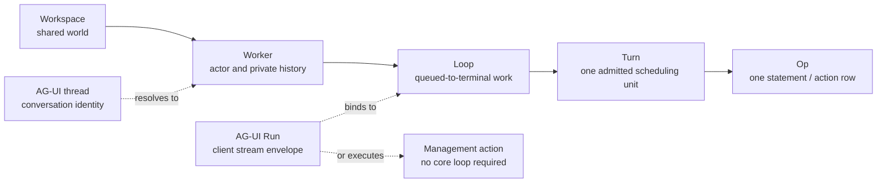

| Term              | Layer                 | Meaning |
|-------------------|-----------------------|---------|
| **agent**         | PLURNK                | The plurnk runtime. Acts in-workspace as the reserved `plurnk` worker ({§actor-boundary} self-hosting), never a privileged singleton owning its own entries ({§entry-owner}, {§machine-processes}). |
| **workspace**     | Core                  | Durable user-named shared world. Persists across workers and process restarts. Identity: `workspaces.id` + unique `workspaces.name`. |
| **worker**        | Core                  | Durable actor and private history over one workspace. Owns its loops and log rows, may carry a `parent_worker_id`, and has one process-local cancellation scope while active. |
| **loop**          | Core                  | Queued-to-terminal unit of model or client work within a worker. Status ∈ {100 pending · 102 running · 200 done · 202 waiting (blocked on a live obligation, {§send}) · 413 input-capacity failure · 429 model-turn ceiling · 499 cancelled · 500 failed · 504 wall-clock timeout ({§operator-config-loop-timeout}) · 508 runaway}. Many loops may belong to one worker. |
| **turn**          | Core                  | One durable, producer-neutral batch of ordered operations. A turn may be authored by a model, client, plugin, or `_plurnk`; only a model turn assembles a packet and owns an emission call. Many turns may belong to one loop. Identity: `(loop_id, sequence)`. |
| **model call**    | Core/provider         | One logical `provider.generate` invocation. Emission attempts and BARE inferences share this durable accounting owner; provider retries remain cardinal physical requests beneath it. Identity: `(turn_id, sequence)`. |
| **op**            | Producer/core         | One DSL operation a producer submits, parsed into a `PlurnkStatement`. One admitted source-backed turn produces an ordered PLAN…SEND program. |
| **statement**     | Model/core            | A parsed op: the `PlurnkStatement` AST from `@plurnk/plurnk-contracts`. |
| **action**        | Core                  | One executed op. Execution normally produces a `log_entries` row at `log:///<L>/<T>/<S>/<op>`; an engine rail may instead record an `op='error'` row ({§operation-results}). A source artifact carries no fabricated operation. |
| **dispatch**      | Core                  | Routing a statement to its scheme's op handler. |
| **AG-UI Run**     | AG-UI protocol        | A client request/stream envelope identified by the client's `runId`. A message or resume AG-UI Run binds to one core loop; a management-action AG-UI Run may complete without creating a core loop. |
| **AG-UI thread**  | AG-UI protocol        | Conversation identity. Within an explicitly selected workspace, `threadId` resolves to one conversation worker. |
| **`--run`**       | Client compatibility  | A compatibility-sensitive client spelling, not an internal entity. |
| **session**       | Retired/unqualified   | Not a PLURNK lifecycle noun. Use the actual core noun; a third-party standard may use only its explicitly qualified protocol term. <!-- lexicon-allow: this row defines the retired noun --> |

### §turn-record Producer-neutral turn record

A turn is the durable container for one producer's ordered operations. Packet
and provider fields are optional evidence belonging only to model inference;
their absence never makes a client, plugin, or `_plurnk` turn exceptional.

| Field | Contract |
|---|---|
| `producer` | Required actor class: `model`, `client`, `plugin`, or `_plurnk`. |
| `kind` | Required purpose: `inference`, `initialization`, `overflow`, `operation`, or `maintenance`. Model iff inference; initialization, overflow, and maintenance require `_plurnk`. A maintenance turn's successful rows are packet-suppressed — a receipt answers an asker, and maintenance has none ({§actor-boundary-doc-injection}). |
| `status`, `completed_at` | A new turn is open at status 102 with `completed_at=NULL`. Completion records the exact terminal SEND/operation disposition and timestamp; a completed 102 is therefore distinct from an open 102. |
| Operations | Ordered by `(turn_id, sequence)` on one exact worker/loop/turn chain. Each row's `origin` is the turn producer or `_plurnk` making a system observation; the observation does not impersonate the producer. |
| `turnOps` | Every admitted source-backed turn preserves its exact PLAN…SEND program as one actionless `/ops` log item under {§turn-ops-entry}. The item supplements rather than replaces the executed operation rows. |
| Inference evidence | Model calls, `packet`, model, finish reason, and provider metadata belong only to model/inference turns. Turn fields are nullable until recorded and remain NULL for every other kind. |

One lifecycle owner opens, optionally records inference evidence, and completes
every turn. Initialization, overflow recovery, client dispatch, and model
inference use that same path. `plugin` is the producer identity for
plugin-authored operation turns; exposing that path must not introduce a
parallel record or lifecycle. The sole identity transition is an open,
evidence-free model/inference candidate becoming `_plurnk`/overflow before
provider admission. Process-restart recovery completes any turn whose producer
vanished.

§turn-ops-admission-path **Source acquisition varies; admitted-turn execution does not.**
A provider response, deterministic `_plurnk` program, or future client/plugin
program crosses one admission boundary into the same executor. That executor
parses once, dispatches the admitted statements in order, records their ordinary
outcomes and the exact `turnOps`, and completes the turn from its SEND ruling.
Provider attempts, grammar recovery, reasoning, and accounting end before this
shared seam. A programmatic operation batch that supplied no Plurnk source does
not fabricate verbatim source.

### §storage-terms Storage terms

| Term | Meaning |
|---|---|
| **entry** | The unit of canonical state. Identity: `(owner, scheme, authority, pathname)`; the owner Worker determines the workspace ({§entry-identity-no-null}). Holds one or more `channels` of content plus private `attributes`. |
| **channel** | A named content buffer on an entry. Examples: `body`, `stdout`, `stderr`, `headers`, `symbols`. Each channel has `content`, `mimetype`, curation `weight`, and lifecycle `state`. |
| **scope** | A scheme-manifest declaration ignored by core; registrations are discovered at boot and are not persisted. Entry sharing and privacy are owner-based; #80 owns retiring this residual axis. |
| **scheme** | An addressed capability family + handler. Built-ins include `worker`, `prompt`, `log`, and bare/file paths; discovered schemes and executor-runtime tags extend that set. Internal `exec` routes the EXEC op but is not an addressable model namespace. Consumption surface {§scheme-surface}; author contract: [plurnk-schemes](../plurnk-schemes/SPEC.md). |
| **mimetype** | A channel's content type. Drives the handler that produces the structural projections (`symbols`, `deepJson`, `deepXml`). Consumption surface {§mimetype-surface}; author contract: [plurnk-mimetypes](../plurnk-mimetypes/SPEC.md). |
| **provider** | An LLM transport implementing the `@plurnk/plurnk-providers` `Provider` interface. Core supplies an assembled request and generation context; the provider owns endpoint adaptation and normalized response evidence. Consumption surface {§provider}; author contract: [plurnk-providers](../plurnk-providers/SPEC.md). |

### §state-terms State / status

Independent axes on entries and channels. Confusion across them is a recurring source of bugs.

| Term | Type | Meaning |
|---|---|---|
| **status** | HTTP int | Outcome of an operation. Carried on `log_entries.status_rx`, returned from op handlers. Per the catalogue ({§send-dispatch}). |
| **channel state** | `static \| active \| closed \| errored` | Streaming lifecycle of a channel's content. Metadata, not gating — engine renders content regardless of state. |
| **entry state** | `proposed \| resolved \| failed \| cancelled` | Proposal lifecycle (`log_entries.state`). `proposed` = pending client accept; `resolved` = accepted, side effect happened; `failed` = rejected (no effect); `cancelled` = the proposal was cancelled (loop abandoning). Distinct from channel state. |
| **outcome** | `string \| null` | Short reason for `failed`/`cancelled` (`"permission:403"`, `"aborted"`, `"not_found"`). Opaque to most callers. |

### §authority-terms Writer / authority

| Term | Meaning |
|---|---|
| **writer** | The identity authoring a write. One of `model \| client \| _plurnk \| plugin`. Carried on `ctx.writer` for schemes; engine enforces `manifest.writableBy`. |
| **origin** | Synonym for writer in log_entries (`log_entries.origin`). Historical naming; treat as equivalent. |
| **writable_by** | The set of writers a scheme accepts. Subset of `{model, client, _plurnk, plugin}`. Engine rejects writes outside the set with 403; the rejection is logged as the action-entry ({§subscriptions} action-entry-as-outcome). |

### §engine-rails Engine rails

After each admitted turn, one inline verdict decides whether the loop continues.
An admitted turn contributes at most one strike, even when several sources fire.
These are the complete strike sources:

| Strike source       | Exact trigger                                                                                                    | Model-visible occurrence                                      |
|---------------------|------------------------------------------------------------------------------------------------------------------|---------------------------------------------------------------|
| Hard result         | An admitted non-`EXEC` operation or bounded parse-error status is `>= 400`, except the soft set `404`, `409`, `416`, `501`. | The originating failure row.                                  |
| Terminal steering   | An idle SEND with signal `102` or a final disposition refused at 409 sets the turn's steering ruling ({§send}).    | The idle rail row or refused SEND row.                        |
| Cycle               | The configured consecutive fingerprint pattern repeats.                                                          | None; cycle detection itself is private engine accounting.    |

`EXEC` results remain exact model-visible evidence but are always soft: an
executor error is not a PLURNK contract violation. Cycle and terminal steering
remain independent strike sources.

§provider-recovery **A recoverable provider failure never ends a loop.** When a model
call fails with a network failure, rate limit, deadline, or interrupted resource after
the provider's own retries, the turn records the exact Problem as a `_plurnk` row,
notices the client (`engine:provider` / `provider_unavailable`), waits with
exponential backoff (`PLURNK_SERVICE_PROVIDER_RECOVERY_BACKOFF`, doubling, capped at
twelve times itself), and re-issues the same call against the exact frozen model
messages whose response is still outstanding. Each reissue remains a distinct logical
model call with complete physical-request accounting, but the active turn's newly
recorded provider Problems do not recursively enter that request; they surface normally
only in a later genuinely new packet. No emission attempt is consumed and no strike is
scored. Every recovery checkpoint broadcasts live, while the model-facing Notice buffer
retains only the current provider state; the next completed exchange notices
`provider_recovered`. Recovery is bounded by `PLURNK_SERVICE_PROVIDER_RECOVERY`; when it
is spent the turn completes as `202` and the loop parks exactly like a
`## SEND0 [202]` wait ({§worker-lifecycle-wake-requeue-not-terminal}), resuming on the
next prompt or wake with its log intact. Only a client cancel, the loop deadline
({§operator-config-loop-timeout}), or a non-recoverable provider Problem (refusal,
authorization, quota, an invalid response) settles a loop on a provider failure.

A struck turn increments the consecutive streak once; a clean admitted turn
resets it to zero. Reaching `MAX_STRIKES` terminates at **508 Loop Detected**
when the crossing turn is cycle-detected, otherwise **500**. Rejected emission
attempts never reach this rail ({§emission-admission}), and the independent turn
ceiling terminates at **429** ({§loop-terminals}). The streak and cycle verdict
are absent from model packets; only the concrete occurrences in the table are
shown. The current streak may ride first-party provider metadata
({§strikes-first-party-metadata}), which does not make it model-facing.

| Term                         | Meaning |
|------------------------------|---|
| **verdict**                  | The end-of-turn ruling computed inline in `Engine.runLoop` from the strike rail and independent loop terminals. No filter chain. |
| **strike**                   | One admitted turn matching at least one source above. |
| **emission attempt**         | One completed provider exchange beneath an engine turn. ANTLR admits it when at least one source operation has a trustworthy effective envelope and no boundary-destroying tail. A hard error inside that envelope becomes a failed operation in the admitted turn; a rejected attempt is forensic evidence, not another turn or an engine strike. |
| **BARE inference**           | One body-only child-provider model call whose response becomes an ordinary BARE log result. It has no worker, packet, tools, output grammar, or persistent child state ({§bare-inference}). |
| **cycle**                    | A repeated turn fingerprint across consecutive turns. Detection strikes silently under the rule above. |
| **capability policy**        | A purely subtractive `only`/`deny` selector layer over routed operation demands. Service, workspace, inherited delegation bound, worker, and loop layers compose without granting authority. |
| **loop policy**              | One immutable loop snapshot containing capability attenuation and the independent `review`, `accept`, or `reject` proposal disposition. |
| **proposal**                 | A deferred side-effecting action. State machine: `proposed → resolved` (accept), `→ failed` (reject), or `→ cancelled` (cancel). Its core-owned disposition says whether the client or loop owns resolution ({§proposal-disposition}). |
| **resolution**               | A client decision delivered through a standard resume entry. Proposal resolutions accept, reject, or cancel ({§methods-proposal-resolve}); client-interaction resolutions return a payload or cancel ({§methods-client-interaction-resolve}, {§agui-proposal-resolve}). |

### §packet-terms Packet terms

| Term       | Meaning |
| ---------- | ------- |
| **packet** | A Turn's optional model-exchange record: measured request `sections`, extended with `assistant` and `assistantRaw` only when an emission is admitted. `NULL` means no model request was assembled. |
| **log**    | The `log` section. Chronological list of `log_entries` in scope this turn. |
| **render** | The act of computing the packet from current DB state at turn boundaries. Mimetype handlers fire at render time. |

### §test-taxonomy Test taxonomy

| Tier | Location | LLM | Substrate |
|---|---|---|---|
| **unit** | `src/**/*.test.ts` | No | Isolated logic, mocked boundaries |
| **intg** | `test/intg/` | No (mock provider) | Real file-backed SqlRite (per-test DB under `test/intg/.tmp/`), real engine |
| **live** | `test/live/` | Real | Wire-level assertions |
| **demo** | `test/demo/` | Real | Holistic outcome assertions |

§provider-conformance-matrix **Every configured model alias is exercised through a
real PLURNK loop: the production packet, a model-selected operation, its
materialized result, and completion.** Transport-only completions are not
conformance evidence. Provider-exposed reasoning must survive in the durable
assistant packet and digest; a provider with no private reasoning is valid when
the observable operation cycle succeeds. One package-owned runner executes the
full tier or exactly one registered specimen (`npm run test:live:specimen --
<exact test name>` in plurnk-core), rejecting absent and duplicate names before
execution. The ledger and classification taxonomy live in
`plurnk-providers/README.md` and report authorization/credential failures
distinct from model failures and repeated stochastic failures separately from
stable ones, never with weakened assertions.

§test-artifact-retention **File-backed test databases use lane-local current-run
retention.** Each workspace's normal intg runner clears its own
`test/intg/.tmp/` once before the suite, reports that forensic directory, and
retains every artifact the current run creates. A cross-package test may reuse
Core's migration fixture only by passing a path inside the caller's artifact
directory; independently scheduled lanes never share a reset target. A failed
suite therefore leaves its own evidence intact, and the next normal run of that
lane removes it before creating anything. Direct `node --test` invocations
bypass the runner boundary and must invoke the same cleanup procedure
explicitly when isolation matters. Live/demo run directories are benchmark
artifacts outside `.tmp` and retain their separate lifecycle.

---

## §arch Architecture

The ecosystem and the in-process shape ({§ecosystem}–{§in-process}), then the two invariants the rest of the spec rests on: isolation by worker ({§actor-boundary}) and the workspace/worker/fork ownership model ({§machine-processes}).

### §ecosystem Ecosystem

The root [`ARCHITECTURE.md`](../ARCHITECTURE.md) owns the platform process and
package map. The daemon, contracts, AG-UI module, and bundled capability
families are independently published npm workspaces in this monorepo; the CLI,
TUI, and editor clients are separate repositories.

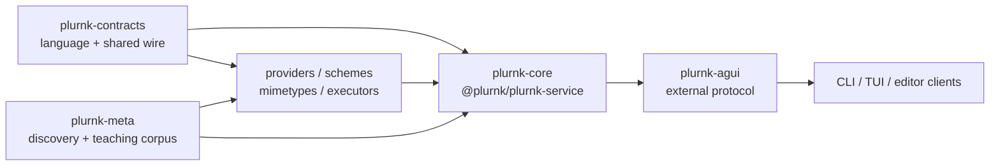

§ecosystem-composed-host Core is the composed runtime: it owns persistence,
scheduling, packet assembly, dispatch, and cross-capability orchestration while
consuming the language and each capability family's author contract. Domain
logic stays with its owning package. AG-UI projects that runtime to clients;
clients render and submit actions but contain no engine logic.

### §observability-boundary Observability boundary

OpenTelemetry may observe PLURNK; it never becomes product state, failure transport, scheduler input, model teaching, or client protocol. Domain and client activity remain on AG-UI. Reusable packages depend on the OTel API only; the daemon constructs only the explicitly configured trace and metric providers. An unconfigured or standards-valid disabled process loads no SDK or exporter implementation and keeps the API's no-op behavior with bounded overhead. OTel Logs have no provider or initialization path.

### §standards-discernment Standards discernment

Seven principles govern which exterior standards Plurnk conforms to (#299):

1. **UVP first.** Never conform away what users chose Plurnk for; the OP grammar, curated log, packet, and worker graph are the product, not a compatibility gap.
2. **Right-fit.** Hobbyist-first: an enterprise-grade feature is acceptable only when its cost lands on the party that wants it, never on general adoption.
3. **Traction.** Count running counterparties today; integration horizon must be shorter than the standard's expected half-life. Sockets stay configurable with no default until a candidate earns it.
4. **POSIX app identity.** Decades-stable host-ecosystem conventions (XDG, NO_COLOR, man, completions, service units) outrank months-stable AI-pipeline fashions.
5. **Faces, never organs.** A standard adopts as one adapter or projection behind an existing seam; if it cannot, that is the alarm, and it goes to a design gate.
6. **Deletion is the price of admission.** A standard earns adoption by deleting bespoke surface (the ACP Plan object deleted the Markdown plan microformat); parallel representations, second discovery paths, and compatibility grammars are refused.
7. **Two arbiters.** Model-facing surfaces change only on measured model evidence; human-facing surfaces follow host-ecosystem convention without ceremony. Standards bodies get a vote on neither.

Configuration uses the standard `OTEL_*` environment: `OTEL_TRACES_EXPORTER` / `OTEL_METRICS_EXPORTER` select `otlp` or `console` per signal (a missing or `none` value keeps that signal off; no SDK default selects an exporter), `OTEL_SERVICE_NAME` names the service (default `plurnk-service`), case-insensitive `true` in `OTEL_SDK_DISABLED` turns the boundary off, and OTLP exporters honor `OTEL_EXPORTER_OTLP_*`. An unknown exporter name fails daemon boot; a typo never silently disables observation. OTel Logs and direct draft semantic-convention use are excluded. HTTP spans carry only an AG-UI-owned bounded route class, never an input pathname or query. Spans otherwise carry high-cardinality identifiers; metric labels stay low-cardinality. Prompts, reasoning, file bodies, arbitrary URLs, secrets, and plugin payloads are never recorded as attributes or metric values by default. Exporter failure cannot change product results or client lifecycle. Daemon, telemetry, and database teardown are independent reverse-ownership phases; every phase runs and aggregate failure preserves every cause.

§observability-genai-conventions **GenAI convention projection.** Provider
request spans use the OpenTelemetry GenAI semantic conventions: a
CLIENT-kind `gen_ai.client.request` span carrying `gen_ai.operation.name`
(`chat`), `gen_ai.system` (the provider alias), and `gen_ai.request.model`;
on settlement it gains `gen_ai.usage.input_tokens` and
`gen_ai.usage.output_tokens` from validated accounting plus
`gen_ai.response.finish_reasons`; failures carry `error.type` as the class
name only. Plurnk custom attributes (attempt, kind, status, loop/turn ids)
ride alongside and never replace the convention attributes. The redaction
boundary is unchanged — no prompts, reasoning, bodies, or URLs. This is the
sanctioned exception to the blanket draft-convention exclusion; no other
draft convention is projected.

### §in-process In-process architecture

Composed daemon internals + admin CLI. Four plug points:

- **Providers** ({§provider}) — LLM transports. Engine sends a turn's messages, receives raw content + usage; engine parses the content into `PlurnkStatement[]`.
- **Schemes** ({§scheme}) — addressed capabilities. A scheme handler interprets targets under its prefix and owns its storage substrate.
- **Mimetypes** ({§mimetype}) — content interpretation. Render-time handlers consume channel content; framework owns the dispatch.
- **Executors** ({§exec} / {§bundled-set}) — EXEC runtime dispatch for subprocess, data, and pure-computation runtimes; web discovery rides the ordinary MCP surface.

Core's internal owners compose without becoming new package or public seams:

| Owner | Machine |
|-------|---------|
| `Daemon` | Process/module lifecycle, dependency composition, provider policy, notifications, and the external client façade. |
| `DrainSupervisor` | One worker's queue consumer, drain identity, wake obligations, cancellation scope, poll/park timers, and terminal cleanup. |
| `Engine` | Loop lifecycle and the public turn, dispatch, derivation, and proposal façades. |
| `TurnRunner` | Model inference plus `_plurnk` initialization/overflow turns from materialization through operation settlement. |
| `Dispatcher` | Operation admission/routing, scheme execution, proposal waiting, curation, and durable log writes. |
| `ResourceMutations` | EDIT/COPY/MOVE selection, anchor preconditions, cross-scheme effects, and mutation settlement. |

Capability-specific behavior remains with the owning plug point.

The contracts package (`@plurnk/plurnk-contracts`) owns the parser and AST contract. Schemes receive parsed statement fragments via dispatch.

Server posture: this package is the one long-running runtime process. `plurnk-agui` exposes its external protocol; user-facing clients run separately and do not call core's in-process seam directly.

### §service-package-exports Package export surface

| Export path                           | Current contract                                                                                                                                                        |
|---------------------------------------|-------------------------------------------------------------------------------------------------------------------------------------------------------------------------|
| `@plurnk/plurnk-service`              | Frozen 1.x compatibility barrel. It retains the previously published runtime and type surface, gains no new APIs, and is not the client boundary. Removal is SemVer-major. |
| `@plurnk/plurnk-service/digest`       | Supported programmatic forensic surface owned by {§digest-programmatic-surface}.                                                                                         |
| `@plurnk/plurnk-service/package.json` | Supported package metadata surface.                                                                                                                                      |

New clients use AG-UI. A new library contract belongs in its owning package or
an explicitly specified subpath, not in the frozen root barrel.

### §startup-admission Startup admission

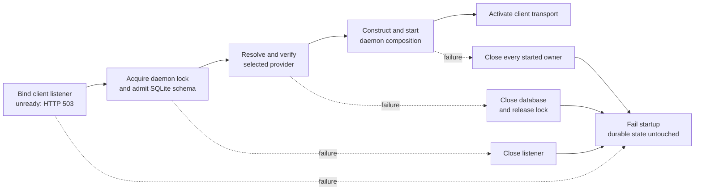

§startup-listener-admission The production service binds its sole client
listener before creating, opening, replacing, rotating, migrating, or otherwise
mutating anything in the durable data directory. A process that loses the
listener race fails with the originating address error and byte-identical
durable storage. The client-interface module owns the socket continuously; it
answers 503 until activated, so early ownership introduces neither traffic nor a
close/rebind race.

§startup-admission-order After listener ownership, database admission completes
before provider or capability initialization can perform external work. Every
later startup failure closes resources in reverse ownership order while
preserving the originating failure: daemon, observability, database, listener.

### §actor-boundary The actor boundary: isolation by worker, two doors, self-hosting

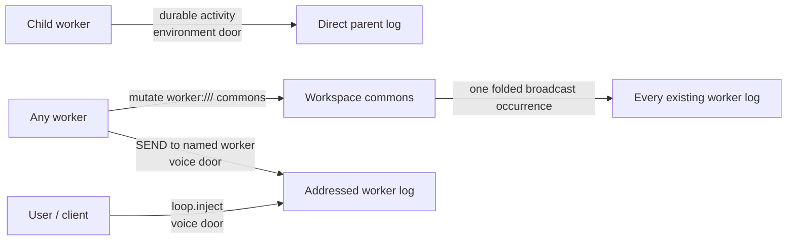

§actor-boundary-isolation **Isolation is by worker; the model is not
privileged.** A packet renders exactly one worker's log — the assembling
worker's — alongside current shared workspace state ({§packet}, {§membership}). A worker cannot
see another's log: isolation is *structural*, a consequence of "a worker owns
its log entries" ({§lifecycle-terms}) and "one packet, one worker," never a
render-time filter.

§actor-boundary-origin-not-filter `origin` ({§authority-terms}) is
**attribution** — the delta's provenance ({§env-delta}) — and is never read to
filter a row.

§actor-boundary-attached-functionality **A client operates in the Worker it is
attached to.** A client connection is attached to one conversation Worker; its
management commands mutate that Worker's Functionality ({§module-worker-capabilities}),
and its operations execute in that Worker's environment — executable families,
runtime schemes, tools, and capability policy resolve through the attached
Worker — while the operation
journals in the client's own worker ({§connection-lifecycle}) and any entry it
writes binds its principal through that client worker. Every dispatch therefore
carries two coordinates: `workerId`, the journaling and entry principal, and
`functionalityWorkerId`, the Worker whose Functionality applies. They are equal
for model and `_plurnk` dispatches; a client dispatch names its attached
Worker, which must belong to the same workspace, and Functionality residency is
acquired for that Worker. Attachment is a connection fact, not topology: it is
many-to-one, non-owning, and never expressed as parentage.

§actor-boundary-two-doors **Cross-worker arrival is limited to two doors.**
An explicit READ is not an arrival: the reading worker deliberately addresses a
file or ancestry-authorized entry through ordinary dispatch ({§worker-read-scope}).

| Door        | Carries                                                                                                                                      | Wake behavior                                                                                 |
| ----------- | -------------------------------------------------------------------------------------------------------------------------------------------- | --------------------------------------------------------------------------------------------- |
| Environment | A direct child's durable activity to its parent, plus a successful mutation of the deliberately global `worker:///` commons to every worker. | Intermediate activity and commons never wake; a child's terminal disposition wakes its parent. |
| Voice       | A directed `loop.inject` or `## SEND0 (worker://name)` message.                                                                               | An active worker folds it into its next turn; an idle one wakes.                              |

§actor-boundary-lineage-attention **Addressability is workspace-wide; attention
is lineage-scoped.** Project files, registered resources, and permitted worker
entries remain addressable throughout the workspace, but ordinary changes do
not enter unrelated workers' logs. A child's activity reaches only its direct
parent. That observer row carries the source occurrence identity and never
republishes, so grandparents observe what their own direct children do without
receiving an automatic recursive mirror of every descendant.

§actor-boundary-commons-broadcast **`worker:///` is the explicit global
attention surface.** A successful mutation whose landed effects touch the
commons emits one occurrence to every worker that existed when it landed.
Lineage and commons audiences are a union over that one identity: when a child
mutates the commons, its parent receives one observer row, never a parent copy
plus a broadcast duplicate. Ordinary project files, private worker entries,
and remote resources do not acquire ambient attention merely because they are
workspace-addressable.

§actor-boundary-no-mutex **Wild west by default; explicit branch batches are the exception.** Ordinary workers share workspace state without locks. Coordination is cooperative and softly fenced (the {§membership} overlay, a workspace policy, bounds every worker's visible surface uniformly — {§machine-processes}); stale writes reject at their anchor or compare-and-swap boundary rather than being prevented by a lock ({§line-anchors}, {§membership-edit-write-cas}). A branch-tagged WORK/FORK opts the whole workspace into the bounded, exclusive Git transaction in {§worker-branch-batch}. It is not a general entry mutex or a hidden per-worker filesystem.

§actor-boundary-passive-wake **Passive wake follows ownership.** A directed
voice wakes an idle worker. A parked continuation resumes when an obligation it
owns — a child or stream — reaches an observable terminal transition
({§worker-loop-lifecycle}). Intermediate child activity and commons broadcasts
never wake; they queue until another cause produces a turn ({§env-delta}). The
obligation edge is continuation control, not a third door through which
arbitrary workspace state can enter.

§actor-boundary-self-hosting **Use the actor path when the work has an
operation; retain irreducible rails in the kernel.** The workspace has one
reserved `plurnk` worker. It is durable; `DispatchAsPlurnk` opens a fresh
administrative loop and turn for each ordinary operation batch. Other workers
cannot read its private log or entries. Generated references are instead
materialized directly in the addressed worker's private space; only direct
lineage activity and explicit commons mutations cross the environment door.

| Work                                    | Owning path                                                         | Why                                                                                 |
| --------------------------------------- | ------------------------------------------------------------------- | ----------------------------------------------------------------------------------- |
| Worker reference documents              | Addressed worker; `_plurnk` EDIT through engine dispatch.           | Creating or replacing a private entry is already an operation.                      |
| Git membership and disk materialization | Kernel `GitMembership` / entry CRUD.                                | Ingesting existing disk state is not a model-authored EDIT.                         |
| Disk-divergence narration               | Kernel writes an EDIT-shaped `source=file` row to the `plurnk` log. | It reports an environment event honestly; no operation is fabricated as having run. |
| Search derivation and catalog render    | Kernel.                                                             | They are indexes and read-only projections, not entry operations.                   |
| Packet assembly and budget rails        | Kernel.                                                             | They are the execution substrate on which actor operations depend.                  |

Git membership is the repository's tracked files and nothing else ({§membership-baseline});
Plurnk never stages a file or runs `git add`.

§turn0-agents-stunt **The project AGENTS.md is a turn-0 stunt.** When
`<projectRoot>/AGENTS.md` exists, LoopDocs materializes it as the current worker's private
`worker://~/_plurnk/agents.md` entry and the engine foists one READ of it into
that model worker's first turn — visible, logged, line-addressable. Absent
file: no entry, no stunt, nothing 404s. The global XDG configuration `AGENTS.md`
remains system-prompt policy ({§policy-sections}); the stunt carries only
local repo guidance.

§actor-boundary-doc-injection **Generated documents use the actor path.** The
project's `AGENTS.md`, skills, and Functionality references are materialized in
the addressed worker's `_plurnk/` subtree ({§worker-generated-subtree}) through
ordinary `_plurnk` operation turns. Their exact
EDIT and SEND programs remain durable in that worker's log; generated state is
neither a hidden database write nor a kernel-owned mirror.

§actor-boundary-catalog-preview **Catalog preview.** `PLURNK_SERVICE_FILES_ITEMS`
foists turn-0 discovery into the worker's first turn, so a worker opens with a
navigable map instead of blank. An enabled preview executes exactly eight baseline
bodyless FIND surveys in order: Agent Skills (`## FIND0
[+init,+skills] (worker://~/_plurnk/skills/*.md) <1,-1>`), plurnk references — the
executors, schemes, and family managers (`## FIND0 [+init,+plurnk]
(worker://~/_plurnk/plurnk/*.md) <1,-1>`), enabled tools (`## FIND0 [+init,+tools]
(worker://~/_plurnk/tools/*.md) <1,-1>`), enabled agents (`## FIND0 [+init,+agents]
(worker://~/_plurnk/agents/*.md) <1,-1>`, {§a2a-agents-catalog}), enabled members
(`## FIND0 [+init,+members] (worker://~/_plurnk/members/*.md) <1,-1>`,
{§members-projection}), workspace files (`## FIND0 [+init] (*) <!-- workspace files -->`),
workspace entries (`## FIND0 [+init] (worker:///*) <!-- workspace entries -->`), and
private worker entries (`## FIND0 [+init] (worker://~/*) <!-- private worker entries -->`).
Only those three namespace surveys carry annotations because the bare targets do not
name their surface; generated paths and classification tags already name every other
survey. Naming `~` private prevents a worker from offering its own `~` address to
another worker.
The word `skills` names Agent Skills and nothing else.
The catalogs select every direct document independently of its authored body;
ordinary READ supplies its examples and complete instructions on demand. Their
log classifications make the opening discovery one `init` set while retaining
`skills`, `tools`, or `agents` on the corresponding rows ({§log-item-tags}). A shallow
result renders direct entries normally and every deeper first-segment directory
as an actionable `dir/**` summary with its recursive `items` and `tokens`;
tool-family rows also carry the concise `{§scheme-catalog-summary}` that drives
on-demand capability discovery. Ordinary surveys use FIND's markerless first-16
page, whose range metadata reports the requested and returned page against the
complete result total; only the small curated skills and tools surfaces
explicitly select all. The opening survey demonstrates both `*` and `**` without
normalizing an all-results override. Every survey executes even when empty
because zero results are useful orientation. A positive `N` explicitly caps
only the file map's rendered rows, using the map's actual
direct-entry-plus-directory count; `-1` enables the ordinary markerless page;
unset / `0` disables previews. `log://` is absent because the current worker's
log already renders in present mode.

§worker-initialization-entry **Model-worker initialization is a real `_plurnk` turn.** A model worker's first loop begins with one packetless `{ producer="_plurnk", kind="initialization" }` turn submitted through {§turn-ops-admission-path}. It preserves one OPEN exact `turnOps` item and dispatches the same source into ordinary PLAN, one archiving COPY, orienting READ/FIND, and terminal `SEND0 [102]` rows (authored in their {§op-mode-phases} execution order). Every orienting row is structurally classified `_plurnk` and `init`; the archiving `COPY (prompt:///<loop>/1)` onto `worker://~/prompts.md <-1>` is classified `_plurnk` and `backup` — the worked COPY specimen, showing the private space as scratch, emitted whenever the loop publishes a prompt ({§prompt-entry}). The PLAN is the canonical {§plan-value} with two entries in order: `Persist Determinations and Decisions` is `memory`, then `Discover the tooling available and survey the workspace file root.` is `in_progress`; SEND hands off with `Next: Address the prompt.` The first model request occupies the following turn and therefore begins at database/log turn sequence 2; “turn zero” is the initialization phase's model-facing label, not a zero-based database coordinate. Client and `_plurnk` administrative workers execute operation turns and do not receive model initialization.

### §machine-processes The machine and its processes: workspace, worker, fork

A workspace owns the shared world; a worker owns one history and one private
entry space on that world.

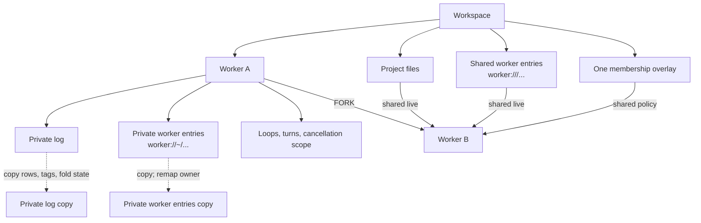

§machine-processes-one-filesystem **Each workspace has one project filesystem.**

§machine-processes-one-overlay **Each workspace has one membership overlay.**

§machine-processes-fork-copies-the-log **A fork copies the parent's log as
terminal history.**

| State                                                 | Owner             | Fork behavior                                                                                                      |
| ----------------------------------------------------- | ----------------- | ------------------------------------------------------------------------------------------------------------------ |
| Project files ({§machine-processes-one-filesystem})   | Workspace         | Shared live; a fork does not create another checkout.                                                              |
| Shared worker entries (`worker:///...`)               | Workspace commons | Shared live.                                                                                                       |
| Membership overlay ({§machine-processes-one-overlay}) | Workspace         | Shared unchanged; divergent membership requires another workspace.                                                 |
| Log items ({§machine-processes-fork-copies-the-log})  | Worker            | Durable events, curation effects, tags, current active/folded projection, and the matching observation cursor are copied as terminal history. Parent-audience occurrences still pending at the fork boundary belong to the snapshot; later sibling activity does not. |
| §machine-processes-fork-cost **Provider evidence and accounting** | Worker | Turns and their model-facing log history are copied, but `model_calls`, emission-admission rows, and physical provider requests are not: one issued call or request has one owning worker. Parent and fork accounting therefore includes only work issued in that branch, while workspace accounting never double-counts copied history. |
| §machine-processes-entry-inheritance **Worker-owned entries** | Worker | The scheme's mandatory `{§manifest-entry-inheritance}` decides: `snapshot` copies only entries whose channels are all quiescent and remaps ownership; `rederive` copies no bytes and lets the child materializer rebuild them from inherited Functionality; `none` carries nothing. Within a `snapshot` scheme the Worker scheme's generated subtree is always rederived ({§worker-generated-subtree}). Parent and child then diverge. |
| Active loops, turns, and cancellation                 | Worker            | Never copied as live work; inherited structure is terminal history, then a new loop starts.                        |

§machine-processes-worker-is-its-log **A worker's conversational memory of
the shared world is its log, with no hidden per-worker snapshot beside it.**
OPEN/FOLD changes canonical folded body intervals on that worker's rows ({§open-fold});
lineage activity and explicit commons broadcasts arrive as attributed log
entries ({§env-delta}). Worker-owned entries include deliberate scratch and
other private resources; their manifest declares whether a FORK snapshots,
rederives, or omits each class. They are not an invisible mirror of shared state. Workspace
addressability does not imply packet membership or ambient notification
({§actor-boundary-lineage-attention}).

§machine-processes-fork-pending-activity **A fork is a closed snapshot of the
parent's view.** It copies rows already materialized in the parent and inherits
parent-audience occurrences newer than the copied observation cursor through
the occurrence high-water captured by worker creation. Activity addressed to
the parent after that boundary is sibling activity, not fork history. Global
commons broadcasts remain live after the fork because the branch is then an
existing workspace worker in its own right.

§machine-processes-model-worker-readable **A worker's log is private to packets, not to the workspace.** Isolation ({§actor-boundary}) governs what an *actor* sees — its own worker, never a sibling's. It does not wall off the client interface: `readLog({ workspaceId, workerId })` may read any ownership-verified worker in that workspace, and `listWorkers` enumerates them. A client-interface module chooses the default worker from its own conversation binding. The read is observation, never packet membership — no actor sees it.

§machine-processes-worker-origin **A worker carries its actor.** Each worker records its `origin` — `model` (a conversation), `client` (a client-interface actor), or `_plurnk` (the runtime's self-hosting worker) — set once at creation and inherited by a fork. `listWorkers` returns it, so a client interface identifies actor class without parsing the name, which is set at instantiation and immutable (a worker is permanent history, {§machine-processes-worker-is-its-log}).

§worker-provider-identity **A worker owns a durable provider identity distinct
from its database id.** Creation mints a globally unique, opaque 128-bit value;
forks mint their own value. Core supplies it as the provider `workerId` for every
emission and supplies the lineage root's value as `primaryWorkerId`
({§provider-cache-identity}). Database ids remain the internal relational and
client coordinate. BARE calls use isolated per-call provider identities rather
than either worker value.

§worker-primary **The primary worker is the lineage root.** The PRIMARY worker of a turn's lineage is the no-parent root reached by walking `parent_worker_id` up; a no-parent worker is its own primary. Core supplies it on the first-party metadata channel alongside `Worker-Id` (same gate, computed per turn), stamped on EVERY turn including the primary's own (where it equals `Worker-Id`) — absent-with-a-Worker-Id is a contract violation, never a silent "assume primary." An unresolvable root (a corrupt/cyclic parent chain the `parent != id` CHECK forbids) fails hard. Providers emits it as `Plurnk-Worker-Primary`; a consumer routes primary-vs-spawned by equality (`Worker-Primary == Worker-Id` ⇒ the primary; `!=` ⇒ any-depth spawn, no depth math) and groups the worker tree by the shared root.

§machine-processes-fork-shares-the-world **A fork copies worker-owned history
and scratch while sharing workspace-owned state.** It is a new worker in the
same workspace (`workers.parent_worker_id`, {§lifecycle-terms}); project files,
shared entries, and membership remain live and uncopied.

§machine-processes-no-fork-workspace **A workspace cannot be forked.**
`workers` carries `parent_worker_id`; `workspaces` carries no parent. Parallel
histories over one workspace are worker forks. A divergent project filesystem
or membership overlay requires a new workspace.

### §worker-scheme The worker:// scheme — the knowledgebase (commons, own space, named spaces) and worker control (spawn, irc, fork, terminate, cap, collect)

§worker-authority-carving **The authority names the OWNER:** `worker:///notes.md` is in the COMMONS — a shared blackboard; `worker://~/draft.md` is the calling worker's own private space; `worker://<name>/result.md` is a named worker's space. Storage keys the owner on the entries.owner_id column ({§entry-owner}) — the pathname is always the bare entry path, and a FIND's result paths re-apply the queried authority so the model sees the address it typed. `~` is the sole current-worker sigil and cannot be minted; `commons` and `plurnk` are internal worker names unavailable for minting. Every other mintable authority, including `self`, is a literal worker name ({§worker-name}).

§worker-name-minting **URI ingestion is permissive; worker minting is not.**
Every model/client worker-creation door applies the contracts-owned
`WORKER_NAME` predicate through one core admission path. Generic URL parsing
continues to decompose other authorities without treating them as mintable.

| Candidate                                      | Minting result                                                        |
| ---------------------------------------------- | --------------------------------------------------------------------- |
| `WORKER_NAME` match, not reserved              | Admitted as the exact literal worker name.                            |
| `commons`, `plurnk`, or `~` (any case variant) | Refused as reserved before lookup or insertion.                       |
| Any other spelling                             | Refused as `name-invalid` before lookup, insertion, or child startup. |
| Automatic name                                 | Generated, then admitted through the same predicate.                  |

§worker-read-scope **Named spaces are workspace-wide reads**: any worker of the workspace reads `worker://<name>/…` for any other — a parent its child's `result`, a child its parent's, a sibling its sister's. The parent designs the topology by what it names to whom; the engine imposes none (operator ruling 2026-08-26, #394). An unknown name resolves 404. Reserved runtime workers obey the same rule; there is no unnamed world-readable space, and writability is untouched ({§worker-write-scoping}).

§worker-write-scoping **Writes are own-space-and-commons only**: a model writes `worker://~/` and `worker:///` — every ancestry-readable named authority is read-only to it (403), while an unreadable name remains 404 under {§worker-read-scope}. `owner_id` is engine-stamped from the dispatch context, never model-set. Nothing worker-authored can land under another principal. The entry-copy seam (COPY/MOVE) is pathname-keyed and addresses the commons; a space's content moves via READ + EDIT. The one exception inside a writable space is the generated subtree below.

§worker-generated-subtree **`_plurnk/` is Plurnk's generated subtree in every worker space.** Every Plurnk-generated per-Worker document lives under `worker://~/_plurnk/`: the project instructions (`_plurnk/agents.md`, with nested AGENTS.md files under `_plurnk/instructions/**` preserving their subtree paths — the standard's closest-file scope, materialized without any foisted READ or teaching), standard Agent Skills and Plurnk-generated references (`_plurnk/skills/**`), executable families (`_plurnk/tools/**`), and future family catalogs. The subtree is readable exactly like the rest of the space ({§worker-read-scope}) and writable only by the `_plurnk` writer tier: a model, client, or plugin EDIT, KILL, SEND 410, or COPY/MOVE destination whose pathname begins `/_plurnk/` is refused 403 `worker-generated-read-only`, in the commons as well as in own and named spaces. Its documents are materialized through ordinary `_plurnk` **maintenance** turns ({§actor-boundary-doc-injection}), so provenance is legible at the address and durable in the log — but a receipt answers an asker, and maintenance turns have none: their successful rows never render in the packet (failures remain visible), while READ over `log:///` recovers them exactly and the turn's self-FOLD keeps client waterfalls tidy. On FORK the subtree is never byte-copied; the child rederives it from its inherited Functionality ({§machine-processes-entry-inheritance}). A runtime's `resourcesPath` is relative to this root ({§tools-resource-materialization}). No world-readable kernel authority exists; there is no `worker://plurnk/`.

§worker-control-addressing **Only an exact authority-only address selects worker
control.** Control is same-workspace only ({§actor-boundary}). Generic URI
parsing remains tolerant, but worker control admits no component it cannot
interpret and never silently normalizes one away.

| URI component     | Control requirement                                                          |
|-------------------|------------------------------------------------------------------------------|
| Scheme            | `worker`                                                                     |
| Authority         | Exactly one non-empty worker authority                                       |
| Path              | Absent; a trailing `/` is a path, not a control alias                        |
| Userinfo or port  | Absent                                                                         |
| Query or fragment | Absent, including an empty delimiter                                          |
| Request metadata  | Absent                                                                         |

After structural admission, `~` means the calling worker only where the
operation admits current-worker control, while every mintable authority is a
literal `workers.name` value.

| Operation | Accepted pathless authority | Effect                                  |
|-----------|-----------------------------|-----------------------------------------|
| `WORK`    | new literal name            | Spawn a fresh named worker.             |
| `FORK`    | new literal name            | Branch the caller into a named worker.  |
| `SEND`    | existing literal name, `~`  | Message the named worker or caller.     |
| `READ`    | existing literal name       | Collect the named worker's deliverable. |
| `KILL`    | existing literal name, `~`  | Terminate the named worker or caller.   |

- §worker-scheme-spawn **Spawn** — `## WORK0 (worker://<name>)` with a task body creates a new worker sister (empty log) and starts it with that task on its first loop. WORK/FORK are the worker-creation verbs: EDIT is file/entry only, so EDIT on the bare worker entity is a **400** steering to WORK/FORK — the entity is not an entry. A name is **frozen per worker** but **reclaimable across time** ({§machine-processes-worker-origin}): a name held only by a *terminated* sister is free to reuse — a fresh spawn takes a new row and `worker_resolve_by_name` resolves the newest, the corpse keeping its name in permanent history. A name a *live* sister still holds is a conflict — **409 `worker '<name>' is already running`**, legible at the spawn gate, never a raw store-level uniqueness error.
- §worker-scheme-irc **irc** — `## SEND0 (worker://<name>)` with a message body delivers it to an existing sister, the **voice door** ({§actor-boundary-two-doors}): an active sister folds it into its next turn, an idle one wakes ({§actor-boundary-passive-wake}). A fresh receiving loop retains that worker's durable model, spawn override, and reasoning policy; the sender and daemon default do not re-select it. `## SEND0 (worker://~)` targets the caller; a literal name with no worker in the workspace is 404.
- §worker-scheme-fork **Fork** — `## FORK0 (worker://<name>)` with a task body branches the
  current worker into a **named** sister: its log is deep-copied
  ({§machine-processes-fork-copies-the-log}), which continues with `task`; the
  world is shared, never copied ({§machine-processes-fork-shares-the-world}).
  WORK and FORK are distinct verbs — WORK spawns a fresh worker, FORK branches
  the log — and each names the new worker explicitly, so the model addresses
  it (`KILL`/`SEND`/`READ`) by that name. The lower-level seam generates
  `<parent>-fork-<N>` only when its caller omits a name. Inherited loops are
  copied as **terminal history** (a non-terminal status is clamped): a fork's
  own work is a fresh loop, so an inherited mid-flight loop never makes the
  branch look forever-live to the {§send-premature-terminate} gate.
- §worker-scheme-fork-scratch **Forked scratch.** A fork also inherits the
  parent's private entries — its own space deep-copied with the owner
  remapped (source → branch) — so the branch opens with the parent's notes and
  diverges on its own edits: *fork = everything-in-common-but-name*.
- **Git branch batch** — `## WORK0 [feature/x] (worker://<name>)` and `## FORK0 [feature/x] (worker://<name>)`, each with a task body, retain their worker meanings while placing the child in the serialized Git transaction defined by {§worker-branch-batch}. The signal is one branch ref, not tags; an untagged WORK/FORK keeps the ordinary concurrent shared-world behavior.
- §worker-delegation-inherits-policy **Delegation cannot widen authority.** WORK and FORK copy the delegating actor's complete effective capability policy into the child's immutable `capability_bound`; later widening of any parent layer cannot enlarge that child. Every fresh delegated loop carries that complete effective attenuation and the delegating loop's proposal disposition, including a loop created by SEND to an idle Worker. SEND into an active or parked loop leaves that loop's immutable policy untouched. The bound is delegation authority captured by value, not a client binding or a live parent-policy link.
- §worker-lifecycle-wake-requeue-not-terminal **A wake re-queue is not a terminal.** A conclusion-wake resumes a 202-blocked loop by re-queueing it (202 → 100); when that lands while the loop's own live drain is between turns, the drain **re-claims and continues** (atomic 100 → 102; the injected prompt is already the next turn). The internal re-queue is never reported as an outward terminal.

Untagged worker control rides the daemon's inject seam (active→fold, idle→enqueue+drain), so the handler creates/branches the worker and hands off; the daemon owns provider + system prompt. Tagged WORK/FORK instead enqueue a fresh loop without starting its drain; {§worker-branch-batch} becomes its sole starter. FORK/WORK carry the seed task in the body and are their own ops, dispatched to worker control — never the entry-copy path.

### §worker-branch-batch Serialized Git branch batches

Branch-tagged WORK/FORK serializes ordinary Git branches over the one project
checkout. It creates no worktrees, alternate roots, hidden merges, or stashes.

§branch-delegation-disabled **Off the surface until specified (#396).** The form is
not offered to the model: the teaching carries no `[branch]` slot, and unless the
operator sets `PLURNK_SERVICE_BRANCH_DELEGATION=1` a WORK/FORK signal is refused up
front as `501 branch-delegation-disabled`, naming the signal-less form. Twelve
branch delegations across the benchmarks produced no organic success; the
preconditions below are invisible to the model until the refusal, and any label on
WORK/FORK reads as a branch order. The batches below remain the implementation behind
that knob and keep their witnesses.

§worker-branch-batch-exclusive **Stop the workspace; serialize
ordinary branches.** A branch signal on WORK/FORK creates a durable batch keyed
to the parent turn. The batch queues one exclusive workspace gate before that
parent releases its turn. Turns already in flight drain; every later model turn
and client file operation waits. The batch owns exactly one repository: the Git
repository containing `workspaces.project_root`. A project root may be a
package inside a monorepo; the repository, not the package directory, is the
transaction boundary. Unrelated repositories belong to unrelated workspaces
and receive no branch policy from this workspace.

§worker-branch-batch-frozen-base All tagged children from the turn branch from
the same frozen commit, then run one at a time in emission order. The active
child and its descendants may take turns; no other worker may enter the
checkout. Worktrees, stashes, automatic merges, and hidden alternate roots do
not participate.

```mermaid
sequenceDiagram
    participant P as Parent turn
    participant G as Workspace gate
    participant B as Branch batch
    participant C1 as Child branch 1
    participant C2 as Child branch 2
    P->>B: WORK branch-1, FORK branch-2
    P->>G: queue exclusive before releasing shared turn
    G-->>B: all earlier turns drained
    B->>B: snapshot clean project repository; create both refs from frozen base
    B->>C1: checkout branch-1; run to terminal
    C1-->>B: committed, clean result
    B->>B: record tip; restore exact parent ref
    B->>C2: checkout branch-2; run to terminal
    C2-->>B: committed, clean result
    B->>B: record tip; restore exact parent ref
    B-->>G: release exclusive
    B-->>P: wake; deliver branch receipts
```

§worker-branch-batch-preflight **Preflight is total.** `GitMembership.projectRepository` resolves the repository containing `project_root`; absence rejects the tagged op. Earlier turns and finite derivation work drain at the exclusive boundary; a pre-existing open stream subscription is not a finite checkout operation and therefore rejects preflight rather than being silently cancelled or waited forever. Before any child starts, every branch passes `git check-ref-format --branch`, the project repository has no staged, unstaged, or nonignored untracked changes, every requested branch is absent, and the original symbolic ref/detached commit is recorded. All branch refs are then created from that frozen commit. Failure rolls back only refs created by this preflight, fails the queued children, restores the parent, and releases the workspace. Existing branches are never adopted or overwritten.

§worker-branch-batch-return **A child returns commits, never a dirty checkout.** SEND signals `200`, `499`, and an already-drained `202` are refused with 409 while the project repository is off the assigned branch or dirty. The model commits or deliberately discards its changes and concludes again. On terminal, the batch records the full result commit and whether it differs from the frozen base, restores the exact original ref and commit, and only then advances. A clean child failure is a completed batch item and does not suppress later siblings; an ambiguous or dirty host failure becomes `recovery_required` and retains exclusivity because restoring would destroy or misattribute work.

The active direct child's `Git Status` names its assigned branch and states the commit-and-clean return condition. No ordinary worker receives ambient commit or authorship policy; commit identity remains host-owned and outside model teaching. {§packet-git-status}

§worker-branch-batch-receipt **The parent reconciles; the engine does not merge.** The ordinary child deliverable remains the model's exact SEND result. Its pushed termination delta and pull-side `## READ0 (worker://child)` append a bounded branch receipt to the presented body without changing that result — a statement of world state, never a next step: the worker, the branch, and the abbreviated commit now on it — for example: Branch worker `counter` created branch `count` at `8a249220`. (`PLURNK_SERVICE_BRANCH_RECEIPT_REVISION_CHARS` bounds the commit; the database retains the full id). An empty deliverable with a receipt presents the receipt alone, never "no deliverable": the branch is the deliverable. Branch refs remain after the batch. The parent chooses inspection, cherry-pick, merge, rejection, or deletion with ordinary Git tools.

§worker-branch-batch-recovery **Recovery follows durable ownership.** `branch_batches`, their ordered items, the project-repository snapshot, and result tips are schema state, not process memory. Generic boot recovery never starts their queued loops. A crash before sealing fails the unstarted batch. A queued partial preflight is rolled back only when every created ref still equals its frozen base, then retried. A running child is never replayed: its loop settles under the ordinary owner-loss rule; if the checkout is clean and either on the assigned branch or the exact original position, the committed tip is retained, the original restored, that item marked interrupted, and queued siblings continue. Any mismatch becomes `recovery_required` and keeps the workspace stopped for operator correction.

The remaining worker surfaces are:

- **Entries (storage)** — entry addressing rides the authority carving above ({§worker-authority-carving}): `worker:///` the commons, `worker://~/` the own space, a name an ancestry-gated read ({§worker-read-scope}), writes own-space-and-commons only ({§worker-write-scoping}). An entry-path `KILL` deletes under the same write-scoping (200; 404 absent; 403 named) — distinct from the path-absent `## KILL0 (worker://<name>)` which terminates the worker ({§worker-scheme-terminate}); the discriminator is the entry path, never the op. A worker's own space is catalogued in its perspective alone (`## FIND0 [+init] (worker://~/*)`, foisted at turn 0 even when empty); isolation is the owner column, structural.
- §worker-scheme-terminate **Terminate** — `## KILL0 (worker://<name>)` aborts a named worker and `## KILL0 (worker://~)` aborts the caller: every unresolved loop in that worker's subtree closes 499 and every subscription in the subtree tears down; a literal name with no worker is 404. Cancellation is structured: descendants cannot detach implicitly. The override to the fire-and-forget default is not a parent-power — whoever holds the address may end it; a worker left alone simply ends at its own SEND signal `200`.
- §worker-scheme-cap **Cap** — `PLURNK_SERVICE_WORKSPACE_WORKERS_MAX_ACTIVE` ceilings the *concurrent* active workers per workspace (a worker with a non-terminal loop); a spawn or fork past it fails hard (508 — no queue, no retry), irc exempt; `-1` disables it. The fork-bomb brake, sized for workspaces that live for months.
- §worker-scheme-collect **Collect** — a worker's loop reaching a terminal status
  surfaces to its direct parent as an ambient delta ({§env-delta}): a `SEND` from
  `worker://<name>` carrying the loop's exact terminal operation result. A
  **2xx deliverable is born OPEN** (its body
  materialized into the parent's packet, not hidden behind a fold): a child's
  success must reach the parent open and awakening, never a bodyless row. An
  non-2xx result surfaces folded; a failure retains its exact status and Problem. Every death-path is stamped uniformly —
  including a spawn that dies before its first turn, such as a branch batch refused at
  git-preflight — so no child termination is silent to its owner; collection is lineage
  supervision, never a
  verb. The **pull** side mirrors the push: a path-absent
  `## READ0 (worker://<name>)` collects that same result on demand for a
  concluded worker; a worker **still running** has not delivered, so the READ
  returns **425** (Too Early) and the turn's bare SEND signal `102` **becomes a
  parked loop (202) on the join** ({§join-blocking-collect}) until the worker
  delivers — the engine holds the join, the model never drives a park. A
  missing name is 404. The model therefore reads the worker itself for its
  outcome or a wait rather than guessing a scratch path to "check on" it.
- §child-orientation **Child orientation.** Beyond the conclusion delta, every
  turn the packet's status clump surfaces the live things this worker currently
  holds — open streams (`## Child Streams`) and unconcluded child workers
  (`## Active Child Workers`) — as terse `* <status> <path>` pointers (the same
  shape as the errors section), just above it. Folded child activity is durable
  history; this clump is the current inventory that keeps an active obligation
  visible even when no new activity arrived. Each open stream pointer carries
  its channels' sizes and growth since the last packet (`* active
  sh:///1/2/3 — stdout 340 lines (+2048 bytes)`) — the only thing the model
  learns about a stream before it closes ({§exec-stream}). It is orienting state, never
  advice: the model sees its live subtree (`* 102 worker://worker-x`, `* active
  sh:///1/2/3`) and reasons for itself — READ/OPEN/KILL via the path.
  Empty sections are omitted, like errors.

### §worker-loop-lifecycle Worker and loop lifecycle: drain, reap, and passive wake

- §join-blocking-collect **A `READ` on a running child is a blocking join, not a poll.** A path-absent `## READ0 (worker://<running-child>)` returns **425** (Too Early) and records a live obligation on the loop. The turn's bare SEND signal `102` is converted into an indefinite parked loop (202) instead of asking the model to poll or drive the scheduler. When the child reaches any terminal status, the same loop resumes with the result in its log. Children are bounded by their own turn and strike limits, terminal failure also wakes the parent, and the owed-wake path covers completion before the parent parks. Any `SEND` clears the per-turn arm; SEND signal `200` with a live child remains a premature-termination error. A `<seconds>` timeout-poll is the explicit polling alternative.

A worker is a **log plus a cancellation scope** — one `AbortController` per worker, reused while live and replaced only once aborted, so a cancel ends the worker as a unit and a later `runLoop` request is never born cancelled. A worker's queued loops are advanced by a **drain**: a single per-worker drain that claims loops atomically (status 100→102) and runs each under the worker's scope. A loop may spawn **streams** (execs) that outlive it; each is a row in the subscription registry ({§subscriptions}) — the durable record of what the worker holds open. Cancellation and conclusion are defined against these structures, never wall-clock timing.

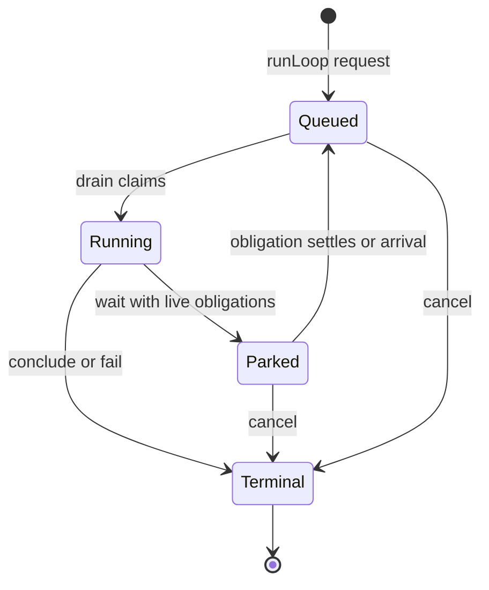

§worker-lifecycle-state-machine The lifecycle store admits only the guarded transitions shown above: `100 → 102`, `102 → 202`, `202 → 100`, and any unresolved state (`100`, `102`, `202`) to a terminal status. Terminal state is immutable. `DrainSupervisor` owns claim, wake, and cancellation; the dispatcher owns model-requested park/conclusion; the daemon owns boot-recovery orchestration; and the engine owns policy terminals. A racing transition that loses observes the durable winner; it does not overwrite it or report the requested state as fact.

§worker-lifecycle-live **Worker liveness is existential, not latest-state.** A
Worker is live while ANY of its loops is unresolved (`100`, `102`, or `202`). A
newer terminal loop cannot mask older queued, running, or parked work. Name
collision, workspace worker caps, child obligations, orientation, and recovery
all use that one definition.

§stream-catalog-lifecycle Streams are independently durable subscriptions owned by a worker. Payload and
lifecycle are orthogonal: zero bytes is a valid payload for both success and
failure, while the closed subscription and its status are the terminal fact.
Every stream entry exposes that durable state on its catalog group's default
channel (`[0].stream: { state, ... }`): active streams carry `seconds`; terminal streams carry
their exact `status` and derive `closed` (status below 400), `killed` (499), or
`failed` (other failure status). An entry with no subscription has no `stream`
member. This is historical state, not merely a live-process hint.

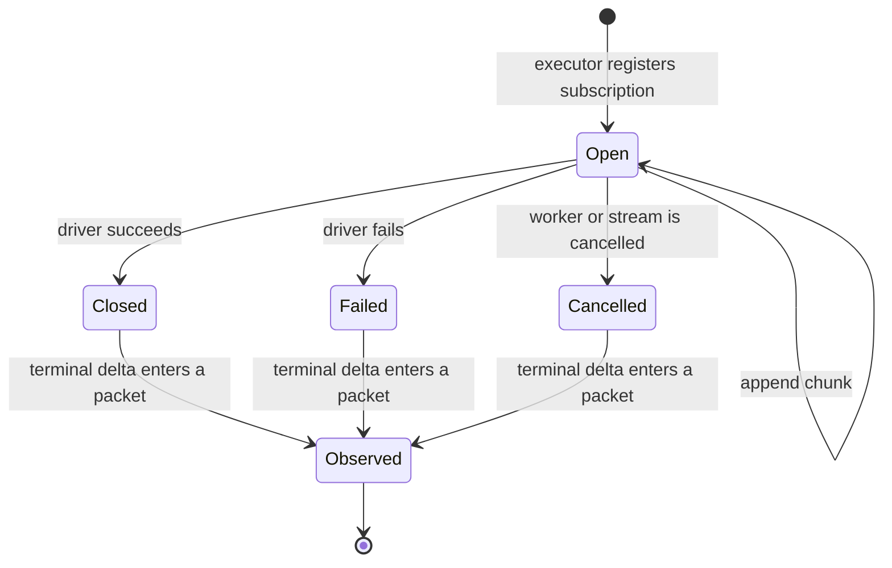

| §worker-lifecycle-subscription-matrix Subscription state at SEND signal `202` | Terminal observation already in a packet | Result |
|-------------------------------------------------------------------------|---:|---|
| open                                                                    | no | park; polling or closure may wake it |
| closed, any status, empty or non-empty                                  | no | continue directly to the observation turn |
| closed, any status, empty or non-empty                                  | yes | no stream obligation remains |
| cancelled as part of worker cancellation                                | irrelevant | terminate the cancelled worker; never resurrect it |

Polling observes a still-open stream; it never changes ownership or manufactures
completion. Closure is always a wake edge regardless of polling mode.

| §worker-lifecycle-poll-matrix EXEC poll marker | While open | On closure |
|------------------------------------------------|---|---|
| omitted                                        | exponential-backoff observation wakes | resume once with terminal observation |
| positive `P`                                   | fixed-cadence observation wakes every `P` seconds | cancel cadence; resume once |
| zero                                           | no observation wakes | resume once |
| turn-scoped `<0>`                              | reap at the next pre-turn boundary | surface the terminal outcome |

The structured-concurrency sequence is identical whether a child performs an
EXEC, retrieval, or pure inference. Intermediate child status is private to the
child. Only the child's terminal loop result crosses the parent edge.


| §worker-lifecycle-child-matrix Child state at parent wait | Child result delivered to parent | Result |
|-----------------------------------------------------------|---:|---|
| queued, running, or parked on its own live obligation     | no | parent parks |
| terminal during the parent's turn                         | no | owed wake; parent continues to the result packet |
| terminal before the parent's wait                         | no | parent continues directly to the result packet |
| terminal                                                  | yes | child obligation is drained |
| cancelled or failed terminal                              | no | same wake/delivery path as success; outcome remains non-2xx |

A stream's close status and a loop's terminal status are separate layers. A
stream may close 4xx/5xx and wake its worker to recover. Model SEND signals
`4xx/5xx` report a failed action and continue; signal `200` concludes successfully and
signal `499` explicitly abandons the worker. Only a concluded loop crosses the
parent edge as the child's result.

§worker-lifecycle-terminal-result **Terminal truth is a result, not a lifecycle code.** `loops.terminal_result`
stores the exact universal operation result. A failure therefore retains its
RFC 9457 Problem Details and exact status through persistence, restart,
parent collection, and `loop/terminated`; successful terminal SEND content and
mimetype remain in the same result. Cancellation markers and branch receipts
are derived presentation, never a second stored outcome. The constrained `loops.status`
column remains only the scheduler's compact lifecycle projection: known
terminal classes remain themselves, other 2xx/3xx statuses project to `200`,
and other 4xx/5xx statuses project to `500`; exact `202` is forbidden because
it is the parked lifecycle state, not a terminal. No product surface may infer or
reconstruct a result from that projection. Active rows have no terminal result;
terminal rows must have one, and database triggers enforce both directions.

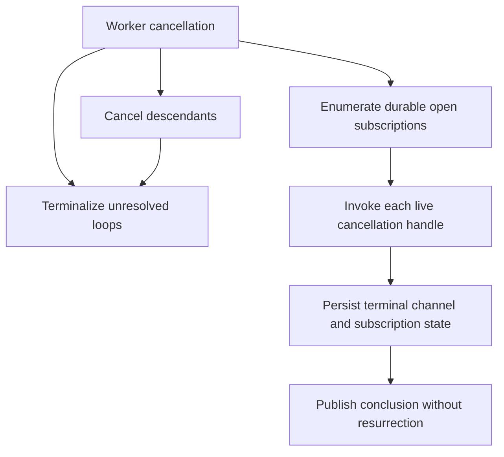

Restart applies the same ownership rule: accepted queued loops are reclaimable;
in-flight provider calls and subscriptions belonged to the vanished process and
become explicit failures. A park whose child remains live stays parked; a park
whose obligations settled during reconciliation is requeued in place so it can
observe their terminal results. No effect is replayed across an unknown
boundary.

- §worker-lifecycle-single-drain **One drain advances a worker.** At most one drain is registered for a worker at any instant: a `runLoop` request or wake on a worker with a live drain folds in (active→next-turn) or enqueues a loop that drain claims, never a second parallel drain. A drain's start and its empty-queue teardown relinquish the worker under one per-worker lock, so the teardown's re-claim cannot race a concurrent start into a double-drain. Fresh-loop sequence allocation and insertion are one mutation under that same lock; concurrent accepted prompts remain distinct ordered queue items.
- §worker-lifecycle-total-reap **Cancellation is recursive and reaps every held stream.** `loop.cancel`, worker `KILL`, shutdown, and a worker's SEND signal `499` terminalize every unresolved loop in the cancelled worker subtree and iterate each worker's durable open-subscription rows, invoking each exact callable owner from the process-local live registry. The durable rows answer *what is held*; the live registry answers *how this process tears it down*; the abort signal is a fast-path optimization. There is no implicit detachment. Before shutdown awaits drains, it cancels every process-local proposal waiter through {§proposal-cancel-aborts} with outcome `daemon_stopping`, so a stopped-world dispatch cannot hold teardown open. A stream that is running, mid-spawn (its row written before it is killable), or spawned after the cancel is reaped alike. The teardown abort is bounded: the executor sends a polite signal then SIGKILL after a consumer-set grace (`PLURNK_SERVICE_EXEC_KILL_GRACE_MS`). A model `## KILL0 [code]` on one live stream instead delivers exactly that signal once (bare KILL uses the executor's SIGHUP default; `## KILL0 [9]` uses SIGKILL).
- §worker-lifecycle-exec-epoch-bound **A stream's kill binds to the scope it captured at spawn.** A stream captures the worker's cancellation scope as it registers and wires its kill to it, re-checking `aborted` AFTER wiring — no check-then-listen gap can drop an abort that lands mid-registration. Because the scope is replaced only once aborted, a captured-then-replaced scope is necessarily already aborted, so replacement never strands a live stream.
- §worker-lifecycle-no-resurrection **A cancelled worker is not resurrected by its own torn-down work.** A stream conclusion delivered to a cancelled, idle worker starts no fresh drain: an aborted (499) conclusion is skipped, and a straggler that concluded cleanly surfaces its deliverable as an environment delta ({§env-delta}), never a revived loop. The cancel was deliberate; only an explicit `runLoop` request resumes the worker.
- §worker-lifecycle-wake-liveness **A stream conclusion always reaches its worker.** The stream first persists its terminal state. A worker **blocked on a 202 wait** for that stream ({§wait-obligation-matrix}) then **awakens that loop in place** — the blocked loop *is* the continuation, so there is no fresh loop and no summary-as-prompt fiction. An already-active worker needs no injected prompt or second wake because its next packet reads the durable terminal state. A concluded worker receives no synthetic loop from ambient stream closure. The result remains available in the stream's own state under every case.
- §worker-lifecycle-child-wake **A child worker concluding wakes a parent blocked on it — the topology join.** `worker://` spawn/fork records `parent_worker_id` ({§lifecycle-terms}). When a worker's drain exits having **concluded** — no `202`-blocked loop, no open stream — `DrainSupervisor.#onDrainExit` resumes its parent **in place** through the shared `#wakeParkedWorker`, the same 202→100 resume a stream conclusion uses. So a parent that spawns work and blocks with SEND signal `202` is woken the moment its child finishes; on resume it reads the child's deliverable from the {§worker-scheme-collect} delta in its own log — a control edge, **never an injected prompt**. The wake recurses upward via the parent's own drain-exit. A child still running — or itself blocked at 202 — is not *concluded*, so it does not wake the parent (it's still a live thing the subtree holds). This is the structured-concurrency join: streams and child workers are the same kind of "live thing a worker holds," driving premature-terminate ({§send-premature-terminate}), the wake edge, and the collect delta identically. A worker conclusion is a **bounded, un-loseable** wake: if the conclusion fires while the parent is mid-turn (before its block commits), `#wakeParkedWorker` finds it not-yet-slept and records an **owed wake**, which the drain honors when the parent blocks — so a wait awaiting workers **always returns**, never dead-blocks on a conclude-before-block race. (Only a live exec stream, unbounded absent a timeout, may legitimately hold a wait open.)
- §worker-optimistic-settlement **Asynchronous settlement receives one bounded worker-local opportunity before model dispatch.** An initiating turn lets only the streams it started settle before its terminal SEND; separately, a stream or direct-child conclusion persists and publishes immediately but holds the parked worker's single `202→100` requeue while another stream or direct child remains live. Both use `PLURNK_SERVICE_OPTIMISTIC_WAIT_MS`, shipped at five seconds; zero disables the opportunity. The wake hold ends as soon as no sibling obligation remains, never extends its original deadline, and coalesces every conclusion that lands within it into one requeue. With no sibling obligation the wake is immediate; at the deadline, surviving work follows the ordinary monitored lifecycle. A conclusion that lands after provider dispatch begins retains its next wake, while poll, park-deadline, prompt, and operator wakes never open this hold. Only packet/provider dispatch waits: terminal state, client events, cancellation, and child execution do not. One redaction-safe span records elapsed time, quiescence versus deadline, and conclusion count without entering the packet.
- §worker-lifecycle-idle-is-concluded **An idle worker concludes; it does not park.** A loop is idle only when it has neither live obligations nor completed results awaiting their first packet. A live child or stream blocks a SEND signal `202` join; a completed stream, child result, or same-turn retrieval continues directly to the next packet where it is observed. Only after those sets are drained does signal `202` resolve like signal `200`. There is no held-open idle loop and no `loop/quiesced` soft signal. A concluded worker is durable working history and an addressed arrival reawakens it as a new loop.
- §worker-lifecycle-no-lost-loop **A loop is never stranded by a drain's exit.** A drain relinquishes its registry slot only after a lock-held re-claim confirms the queue is empty; a loop enqueued during that teardown is either re-claimed by the exiting drain or claimed by a fresh drain that a later inject starts. The relinquish and the start are serialized, so neither the lost-loop hang nor a transient double-drain can occur.
- §worker-lifecycle-durable-disposition **Durable disposition wins cancellation races.** At a turn boundary, the engine reads the loop's durable status before interpreting a process-local abort. A committed `202` park survives a later daemon-shutdown signal; only a loop still durably running at `102` can be terminalized by that cancellation.
- §worker-lifecycle-restart-recovery **Restart is owner-loss reconciliation, not replay.** Before opening client transports, the service holds an exclusive database-adjacent daemon lock; a second live owner fails before touching SQLite, while a dead-PID crash claim is replaced atomically without a timeout lease. Boot preserves accepted `100` loops and restores their drains. A `102` loop belonged to a vanished drain/provider call, so it settles `500` with the interruption on its durable row—never replayed across an unknown effect boundary. Every pending physical provider request beneath that loop first settles as an error with absent usage and explicitly unknown cost, then its logical model call closes; recovery never fabricates zero evidence. Every durable proposed operation likewise lost its process-local resolution waiter and settles as a visible `500 owner_vanished` occurrence rather than an unresolvable interrupt ({§proposal-list}). A pending client interaction also lost its exact awaiting operation, so boot removes the orphan instead of replaying work or inventing a response ({§client-interactions}). Every durable-open subscription belonged to a vanished callable: active channels become errored and its row closes `500`. A `202` continuation survives only while a live child obligation remains; after reconciliation, an unblocked park requeues `202→100` and resumes in place. Child terminalization wakes its parked parent on every outcome, including provider exceptions, cancellation, and restart interruption, recursively through the durable parent edges. These operations are idempotent, so an interrupted recovery safely repeats.

---

## §provider Provider Contract

Author-facing contract: [`@plurnk/plurnk-providers`](../plurnk-providers/SPEC.md). Below: consumption surface + engine→provider guarantees.

### §provider-surface Consumption surface

Three current entry points:

- §provider-surface-generate `provider.generate(args)` — once per logical model call. An emission attempt supplies the complete packet messages, worker/turn coordinates, generation envelope, optional local grammar, first-party metadata, and `callKind: "emission"`. A BARE inference supplies only one user message containing its body plus non-prompt call identity and accounting metadata, including `callKind: "bare"` ({§bare-inference} {§provider-call-kind}). Both receive a durable physical-request observer; provider-owned retry and failover may issue several ordered requests beneath either call. A successful `ProviderResponse` reaches its call-specific consumer; a `ProviderError.attempt` remains failed response evidence under {§provider-interrupted-attempt}. Core persists normalized response evidence separately from physical accounting and relays encrypted reasoning only from an admitted emission ({§encrypted-reasoning-carrier}).
- §provider-surface-capacity `provider.assessRequestCapacity(messages, maxOutputTokens?, signal?)` — provider-owned intersection of request-shaped token evidence and every known physical input limit. It admits, rejects only a proven exact overflow, or defers ambiguity to upstream ({§tokenomics-context-envelope-admission}). `generate` performs this assessment for its exact request and preserves the evidence on success and capacity failure.
- §provider-surface-prompt-measurement `provider.countPromptTokens(messages, signal)` — the cancellable complete-request measurement primitive used by provider capacity assessment, with `exact`, `upper_bound`, `estimate`, or `unavailable` provenance. Core never substitutes this physical fact for its curation ruler.

§provider-surface-identity Provider capacity and identity are immutable for one instance. `contextWindow`, `maxInputTokens`, and `maxOutputTokens` carry known model limits; `outputBudget` is the total generation envelope, optional `reasoningBudget` is its strict subset, and `inputCapacity` is the stable intersection of known input constraints ({§tokenomics}). Unknown facts remain `null`. `model` identifies persisted turn/provider evidence. Local GBNF admission also consumes `constrainsOutput` ({§grammar-configuration-admission}).

§meta-passthrough **Metadata passthrough (provider → client).** `generate` may return an open `meta: Record<string, unknown>` bag. The service stores it unenforced per turn (`turns.meta`, `json_valid` only — no schema) and forwards the latest turn's blob in `loop/terminated.usage` ({§notifications}). The service never reads a field within it. Providers own their metadata shapes; monetary values carry an explicit amount and currency rather than an implied unit. Absent → `{}`. The mirror direction (client → provider, the self-identified `client` id) rides `generate({client})` ({§attribution}).

### §provider-guarantees Engine → provider guarantees

- `messages` is a complete prompt (the section list, pre-assembled into the system + user messages). Provider does not reorder.
- §provider-guarantees-signal-wired `signal` is wired to the worker's AbortController.
- §provider-guarantees-serial-attempts Emission attempts for one engine turn are serial. They reuse the exact messages, coordinates, generation limits, and strike state; two attempts for that turn never overlap.
- BARE calls admitted by one turn launch as one parallel batch; each call retains independent observer and failure state, and the engine awaits the complete batch before committing results in authored order ({§bare-inference}).
- §provider-guarantees-request-observer Immediately before each physical provider I/O, the provider opens its provider/model identity through `observeRequest` and settles the returned handle exactly once as response or error. Core durably records that occurrence before I/O and rejects a returned response or `ProviderError` whose ordered accounting differs from the observed records. Persistence failure is an internal contract failure, never optional telemetry.
- §provider-guarantees-assistantraw-opaque `assistantRaw` is opaque to the engine (forensics-only).
- Capacity assessment receives the exact `PacketWire` messages supplied to `generate`, its effective total-output tightening, and the loop cancellation signal. It may perform provider I/O. A curation-weight comparison never authorizes or rejects physical I/O.

### §emission-admission Provider emission admission

A completed provider exchange is an **emission attempt**, not necessarily an engine turn. The provider transports and observes the model's bytes; ANTLR is the admission authority only after provider completion. Admission requires at least one parsed source operation, no `unparsedTail`, and a trustworthy effective envelope. Canonical source begins with PLAN and ends with a terminal SEND. If no valid leading PLAN or terminal SEND was parsed, the parser supplies an empty PLAN or bodyless `SEND [102]`, records its exact hard diagnostic, and Core admits the useful operations instead of resampling. Both diagnostics participate in one ordinary struck turn, never one strike apiece. An authored PLAN or terminal SEND remains a real boundary, so an error outside either authored edge, post-terminal content, a boundary-destroying tail, or no source operation rejects the entire exchange regardless of `finishReason`; no recovered prefix dispatches. Parser warnings remain admissible. `finish=length` is forensic evidence of likely truncation, not an independent rejection rule. A provider-declared resource interruption never reaches admission, even when its partial bytes form a complete-looking frame ({§provider-interrupted-attempt}). The accepted packet retains the provider's source bytes exactly in response evidence and `turnOps`; synthetic envelope statements exist only in the normalized operation program and its durable rows.

§safe-uri-target-groups After source and authored-command admission, Core tolerates one target group on READ, FOLD, OPEN, or KILL only when splitting its raw target at top-level comma or whitespace separators produces at least two members and every member independently parses as an explicit `scheme://` URI. Request-metadata blocks are opaque to this split. Each member becomes one ordinary statement with an independent dispatch outcome and log row, in authored member order; scheduling may still move the complete operation class under {§op-mode-phases}. Otherwise the target remains exactly singular, including local filenames containing spaces or commas. The stored `turnOps` and authored command count remain unexpanded, and no other operation admits target groups.

Core retries a rejected emission against the exact same packet beneath the same engine turn, up to `PLURNK_SERVICE_EMISSION_ATTEMPTS`. Rejected bytes never dispatch or reach the engine strike rail. Before each `generate`, Core opens one durable logical `model_calls` row and its emission-specific `turn_attempts` admission row. A call that ends without response evidence leaves that admission row unclassified (`accepted IS NULL`) and does not consume the emission-attempt ceiling. Beneath the model call, every provider observer invocation opens one cardinal `provider_requests` occurrence immediately before physical I/O and settles it as response or error. Adapter retries and capacity failover append requests in issue order; a response-less failure therefore remains an accounted occurrence rather than disappearing. Normalized response evidence is durable before parser classification and does not duplicate the separately owned accounting. The accepted exchange alone extends `turns.packet` with response evidence; every physical request remains in turn and loop accounting, while the context gauge reads the latest settled emission request on the latest turn. Digest exposes rejected response evidence as `packetNNN.attemptNNN.rejected.*` and every physical request in its machine-readable ledger.

The first exhaustion in a consecutive sequence closes that unadmitted turn as a continue and opens exactly one ordinary recovery turn. Its packet projects the latest rejected response OPEN from a durably FOLDED emission-attempt item under {§rejected-emission-entry} and carries one transient `invalid_emission` Notice: `Response rejected before dispatch; no operations were performed.` followed by `Parser: <the latest attempt's first diagnostic>` with its `content-offset` position — the model sees why, at which line, against its own projected text. The Notice states only observed admission facts; it does not classify the response as unrecoverable, infer why generation ended, or prescribe intent beyond the parser-owned diagnostic. Attempt count and rail state never become model-facing. The recovery turn has its own honestly stored packet and its configured private same-packet attempts. The packet-local projection never changes the row's curation state, so no later packet repeats the malformed body unless the model explicitly OPENs it. Admission clears the recovery state; exhausting the informed turn terminates instead of opening another.

An admitted program may contain bounded malformed statements or recovered
envelope defaults. Parsed operations still dispatch; each hard parser diagnostic
becomes one durable model-origin `error` row with the parser's exact detail under
{§parse-diagnostics} and status 400. These failures are committed before the
terminal disposition, participate in the ordinary strike rail, and prevent SEND
signal `200` or an already-drained signal `202` from concluding before the model
sees them in the next packet. This is operation recovery, not provider
resampling. A malformed statement's Problem records the factual
`siblingsRetained: true` extension; an envelope-default Problem states only the
observed boundary failure and exact default applied.

§invalid-emission-attempts Exhausting the emission-attempt budget opens the
single informed recovery turn above. Consecutive exhaustion of that turn
terminates the loop at 500 without spending an engine strike, with detail `No
Plurnk turn was admitted after <N> emission attempts.`

§turn-never-blank An admitted turn whose operation fails — during parsing or
dispatch — is categorically different: its failed operation row enters
model-visible history and the next engine turn may recover. A `ProviderError`
means no exchange was admitted (auth, exhausted transport retries, rate limit,
or provider-declared interruption). Core settles and retains every physical
request's known or unknown {§provider-request-accounting}; when the error carries
interrupted response evidence, Core stores it unaccepted without duplicating its
accounting. The failed turn still stores the exact request and never fabricates
an assistant or a zero-valued observation.

### §attribution Plugin-authored attribution folksonomy

A plugin may declare opaque attribution tags statically or at runtime under the
shared contract {§plugin-attribution}:

```jsonc
{ "plurnk": { "attribution": "@acme/widgets" } }   // always-on string or string[]
```

| Stage                | Contract                                                                                                                                                                                                                                      |
| -------------------- | --------------------------------------------------------------------------------------------------------------------------------------------------------------------------------------------------------------------------------------------- |
| Collection           | Immediately before each emission attempt, Core pulls the admitted scheme, executor, loaded mimetype-handler, and selected provider sources. A BARE call pulls only its selected provider source because it admits no other plugin capability.       |
| Composition          | Core flattens, deduplicates, and sorts the tags. The resulting non-empty array rides `generate({ attributions })`; an empty set omits that provider field.                                                                                      |
| Meaning              | Core neither verifies nor infers contribution. Tags are plugin-authored folksonomy for telemetry, optimization, attribution, or downstream rules. The `@plurnk/` reservation is the only namespace policy ({§plugin-attribution}).             |
| Request evidence     | The stored request packet carries the exact set most recently forwarded for that turn. Every pre-I/O `model_calls` row carries that call's exact set, including response-less failures. |
| Derived reporting    | Turn, loop, digest, and client views project the recorded sets. `loop/terminated.attributions` is their deduplicated sorted union and remains separate from provider usage and charge evidence.                                                 |

Runtime hooks are synchronous and receive only the attempt coordinates. A hook
failure is an internal plugin-contract failure; Core does not silently discard
it or reinterpret a malformed tag list.

§strikes-first-party-metadata The loop's **current strike streak** rides `generate({ strikes })` the same way — first-party outbound metadata (`Plurnk-Strikes` under the `firstPartyMetadata` gate): the hosted router's escalation signal (route-after-strike). The shape is a bare number — the streak at generate-time, the same figure the 500-threshold compares; a clean turn zeroes it, every loop starts at 0, and `0` is sent explicitly (clean ≠ unreported). It is NEVER model-facing ({§rail-accounting-private}) — headers only, the packet never carries it.

§client-metadata **The workspace's `client` id rides the same wire.** A frontend self-identifies (e.g. `plurnk.nvim/1.4.0`) at `workspace.create({ settings: { client } })`; the engine forwards it per turn on `generate({ client })`, which only the `plurnk` provider emits (as `Plurnk-Client`). Workspace-stable and self-reported — distinct from attribution's install-grounded tags — and omitted when unset.

### §provider-instantiation Provider instantiation

§provider-instantiation-alias-resolution Model alias parsing and provider construction live in
[`@plurnk/plurnk-providers`](../plurnk-providers/SPEC.md).
`src/core/ProviderInstantiate.ts` delegates to that owner and adds only
service-side caching, per-loop selection, context-cap handling, and local GBNF
verification. Cataloged providers use Models.dev metadata and official AI SDK
bindings; an operator declaration covers an uncataloged compatible endpoint;
plugin discovery is the last protocol-extension seam. Cache identity includes
the alias, wire route, and complete provider-knob projection; a registered
preconstructed handle occupies that same identity and cannot shadow changed
tuning.

§grammar-configuration-admission **Optional local GBNF is admitted without model generation.**
The ANTLR grammar always defines and validates the PLURNK language. Separately,
an operator may configure global `PLURNK_PROVIDERS_GBNF` or
`PLURNK_PROVIDERS_GBNF_<alias>` for a local
llama-server. Startup requires the provider to advertise GBNF transport and a
reasoning-compatible configuration, but daemon lifecycle grants no inference
or spending authority and therefore generates no verification tokens. The
setting is resolved globally for an exact route and per alias for a declared
alias; it is unset by default. Configuring it on a cloud
or endpoint-managed provider is an error, not a request for best-effort
filtering. Every user-authorized constrained generation proves transport through
its exact pre-projection evidence ({§rail-truth-engine-verdict}). Alias-scoped
`PLURNK_PROVIDERS_GBNF_DEBUG` is the explicit exception: it deliberately
withholds transport while retaining local grammar validation and the engine's
withheld-rail verdict. Runtime injection uses the provider's registered alias,
falling back only to a real process-active alias; an alias-free route uses the
global setting and ignores unrelated suffixes. A configured package variant or
explicit path that cannot be loaded also fails; it never silently becomes
unconstrained.

§grammar-rail-registration **Rail variants are built-in names or import
specifiers.** A bare variant (no `/`, no `:`) resolves as a built-in rail
subpath under `@plurnk/plurnk-contracts`. Any other variant form is an import
specifier — an absolute or relative operator file path, or a package export
subpath (e.g. `@acme/plurnk-rails/custom.gbnf`) — resolved through the Node
resolution chain, so a third-party rail package plugs in with no built-in
registry. An unresolvable or unreadable rail fails the constrained generation
loudly; it never silently becomes unconstrained.

§gbnf-requires-reasoning Both shipped PLURNK rails require reasoning. The same alias-scoped configuration
must resolve reasoning to `adaptive` or a supported fixed effort; `off` with GBNF is rejected before
the probe or any model generation. Reasoning-off remains valid when no GBNF rail
is configured.

§rail-truth-engine-verdict **Local constraint truth is independently observed.**
For a configured local GBNF, the provider returns the pre-projection sentence as
`grammarEvidence` under `plurnk-providers` {§gbnf-response-observation}. The engine
requires that evidence, independently validates `grammarEvidence.input` with the
artifact's declared response root, and requires `transported: true` unless the
operator explicitly enabled debug mode. It stamps `railsAttached: "client"`
when transported or `"withheld"` in debug mode plus `railsVerdict`; it never validates projected
`assistant.content` as though the required reasoning enclosure were still
present. A non-accept verdict emits one `grammar_unenforced` notice. A raw
position at or after `contentStart` is translated to a content offset; a failure
inside the projected reasoning prefix has no false content pointer. With no
local GBNF, core adds no rail state and makes no claim about endpoint-owned
settings.

```dotenv
PLURNK_MODEL_gemma=openai/macher.gguf
PLURNK_MODEL_opus=openrouter/anthropic/claude-opus-latest
PLURNK_MODEL=gemma
```

First path segment = provider name; rest = provider-native model id.

### §mock-provider Mock provider (sibling fixture)

§mock-provider-mock-fixture `Mock` (exported from `@plurnk/plurnk-providers`) — intg fixture + reference implementation. `{ contextWindow, responses }` constructor; `generate` shifts from the queue. `MockResponse.assistant.ops?: PlurnkStatement[]` is a pre-parsed escape hatch the engine consumes directly when present; production providers don't expose this — and being a plugin export, this contract has no service-side `§`-ref.

---

## §scheme Scheme Contract

Author-facing contract: [`@plurnk/plurnk-schemes`](../plurnk-schemes/SPEC.md). Below: what plurnk-service exposes to schemes and orchestrates over them.

### §scheme-address Address resolution (RFC 3986 / WHATWG URL)

When an op carries a target, RFC 3986 supplies the component model and WHATWG
URL supplies canonical decomposition; an entry key is
`(owner, scheme, authority, pathname)`; the owner Worker determines the
workspace ({§entry-identity-no-null}).
The registered manifest's {§manifest-authority} disposition determines the one
meaning of an authored URI authority before any entry capability is exposed:

- §scheme-address-namespace-fold A **namespace scheme** mechanically folds its authored authority into the canonical storage pathname and persists the empty entry authority. For an entry tree, the authored authority is therefore a leading path segment rather than a separate resource coordinate.
- An **owner scheme** consumes its authored authority while resolving `entries.owner_id` and persists the empty entry authority. `worker` uses this disposition ({§worker-authority-carving}).
- A **resource scheme** preserves its canonical authority as the durable entry-authority coordinate. Every capability and exact query is bound to that authority; it cannot collide with or observe the same pathname at another authority.
- §scheme-address-network A **network resource** uses the shared schemes-layer
  normalization contract {§network-address}:
  `https://example.com:8443/page?b=2&a=1` →
  `(https, example.com:8443, /page?b=2&a=1)`. The exact protocol, canonical
  host, non-default port, path, and serialized query are identity; query order,
  duplicates, and an explicit empty `?` survive. A fragment is a Plurnk channel
  selector, not network identity or transport. URL userinfo is rejected and
  scheme metadata never enters identity. Plain `http` routes through `https`,
  just as `ws` routes through `wss`; those implementation aliases never alias
  resources, and the secure face is the one taught — `http` stays supported
  for the endpoint that requires it, never advertised as a peer. `SchemeCtx.entries` binds every cap to the addressed protocol.
  Absolute network URLs are single resources even when their path ends `/` —
  folder/glob expansion belongs to entry namespaces, never an HTTP origin.
- The **`file` class is the workspace filesystem** — a mount namespace with its own resolution and naming law, specified below.

§client-entry-address A client entry read carries the observing `workerId` and
passes its selector through the registered data scheme's
{§entry-address-resolution} before querying storage. The scheme returns its
canonical authority, pathname, and semantic owner; core alone resolves that
owner to `entries.owner_id` and queries the complete `(owner, scheme,
authority, pathname)` identity. Worker and capability-stream authorities reuse their
ancestry checks, so unknown or unauthorized owners return the same 404 and
cannot select an arbitrary colliding row. The result is the contracts-owned
{§entry-read-result}; persistence columns never cross the seam.

§scheme-entry-matrix URI authority, entry principal, access, and fork
inheritance are independent decisions. The built-in surfaces declare them
explicitly:

| Surface | URI authority | Entry principal | Cross-Worker read | FORK entry disposition |
|---|---|---|---|---|
| Project file | Filesystem name | `commons` | Workspace-shared | Shared live; no copy |
| `worker:///...` | Empty selects commons | `resolved` commons | Workspace-shared | Shared live; no copy |
| `worker://~/...` | `~` selects caller | `resolved` Worker | Self; parent may use the child's literal name | Quiescent snapshot; `_plurnk/**` rederived |
| `worker://<name>/...` | Literal Worker selector | `resolved` Worker | Owner or ancestor | Scheme disposition only when the selected owner is the fork source; otherwise no copy |
| `prompt:///...` | Loop-relative coordinate | Calling Worker | Self-only | Quiescent snapshot |
| Provisional `skill:///...` | Entry namespace | Calling Worker | Self-only | Quiescent snapshot |
| `http(s)://...` | Remote resource identity | Calling Worker | Self-only | Quiescent snapshot; an active stream is omitted |
| `wss://...` | Remote resource identity | Calling Worker | Self-only | None |
| Executor/MCP output | Optional named actor selector | `resolved` Worker | Owner or ancestor | None |
| `a2a://...` outbound resource | Remote-agent identity | Calling Worker | Self-only | None |

A resolved-owner scheme authorizes the actor selector before returning its
principal; a numeric Worker id is never extension input. `worker` ownership has
no cross-actor form. Thus identical HTTP, WSS, A2A, prompt, Skill, or unqualified
executor addresses in independent root Workers are distinct resources without
render-time filtering.

§fs-namespace **The workspace is a mount namespace; `project_root` is the model's `/`.** Chroot semantics: host paths do not exist inside the jail, and no engine surface folds a host-absolute spelling onto a member. The root is **fixed immutably at workspace creation** (headless is forever); the namespace's mount table changes only through the declared membership overlay ({§membership}), never by re-rooting. At `project_root = /` the jail is the whole filesystem and every rule below degenerates to identity — the design's proof case, and the common benchmark topology.

§fs-namei **Resolution is namei over the mount table.** The model's CWD is permanently `/`, so `src/x.md` and `/src/x.md` are the same name — the slash rule is a corollary, never a legislated equivalence. Resolution is lexical: `.` and `..` resolve before anything touches storage (`..` is legal *during* traversal); the final name lands in the root subtree (a bare key), on a declared outside-root mount (a `../`-prefixed key — the git-style overlay), or names nothing (404 carrying the resolved form). Containment is the resolution semantics — there is no separate traversal check to forget.

§fs-canonical-name **One canonical name, storage ≡ wire: the git pathspec.** Member keys follow gitformat-index(5) verbatim (reference edition: git 2.47.3): relative to the workspace `project_root`, without leading slash, `/`-separated, no trailing slash or NUL. Directories are never entries and the root needs no name. When `project_root` is below the containing repository's top level, Git members above it naturally use the same `../`-prefixed CWD-relative names that `git ls-files` emits without `--full-name`; these are not outside-repository mounts. The database stores that root-relative key directly because workspace identity is rooted at the access point. Every model spelling canonicalizes before storage or comparison.

§fs-visibility-grantors **File visibility has two represented grantors; Plurnk never invents a private third one.** A file member is admitted by the active Git substrate or by an ordinary `include` row of the overlay. An `include` is either a projected `members` definition ({§members-projection}) or the exact, inspectable record of an accepted creation ({§fs-create-record}); both resolve to `constraint` membership. AGENTS.md remains auto-pulled as POLICY ({§policy-sections}), deliberately not a file member. A physically existing path that neither Git nor an `include` admits does not exist for the model and cannot be overwritten.

§fs-write-surface **The write surface — one admission and incorporation path.** Existing writes remain membership-gated. An absent path additionally crosses the effective creation scope and the complete constraint/Git policy before a proposal is issued. EDIT, COPY destinations, and MOVE destinations use this same path regardless of whether the producer is a model, client, plugin, or `_plurnk`. A COPY or MOVE destination region on an absent entry creates the entry when it is `<-1>`, the whole-source form `<1,-1>`, or a whole-line range from line 1 whose final line exactly equals the selected source's resulting line count. These scopes all describe the complete new value; any other region on an absent entry is `destination-region-not-found`.

| Case | Required admission | Accepted result |
|------|--------------------|-----------------|
| §fs-create-disabled Absent path, effective scope `none` | None | Refuse without touching disk. |
| §fs-create-root Absent path inside `project_root` | Effective scope `root` or `namespace`; no matching exclusion | Exclusive CREATE (`open(O_CREAT\|O_EXCL)` semantics), then incorporation below. |
| §fs-create-namespace Absent canonical `../` path | Effective scope `namespace`; no matching exclusion | Exclusive CREATE, then an exact creation record so the outside member is read-write. |
| §fs-create-ignored Absent path ignored by active Git | Matching `members` definition | Exclusive CREATE through that definition; a creation record or model definition never overrides Git ignore. |
| §fs-create-git Absent in-root path admitted by active Git | Not ignored | Exclusive CREATE followed by an exact creation record (`source: "create"`); never `git add` ({§membership-baseline}). |
| §fs-create-definition Absent admitted path without Git incorporation | A projected `members` definition or automatic incorporation permitted | Exclusive CREATE followed by an exact creation record when no `members` definition already covers it. |
| §fs-write-member Existing in-root member | Git or include membership | Proposal-gated EDIT. |
| §fs-write-outside Existing canonical `../` member | Include membership | Proposal-gated EDIT. Git-only outside members are read-only. |
| §fs-write-nonmember Existing non-member | None | Refuse; reveal occupancy only, never content. |

§fs-create-incorporation **Creation incorporation is durable workspace state, not a transient entry exception.** `workspace_constraints.source` distinguishes the engine's `create` record of a file Plurnk wrote from the `members` family's projected rows (`members`: human-authored, `model`: model-proposed — {§members-projection}). A projected row interprets `glob` as a pattern; a creation record is one exact canonical path, never reinterpreted as a pattern, and the family's projection never overwrites or retires it.

| Event | Creation-record lifecycle |
|-------|--------------------------|
| §fs-create-record Successful creation not covered by a projected `members` definition | Insert exact `{ effect: "include", glob: canonicalPath, source: "create" }`. |
| §fs-create-copy COPY to a new path | Incorporate the destination independently; the source is unchanged. |
| §fs-create-move MOVE to a new path | Incorporate the destination, then remove the source's creation record after deleting the source. |
| §fs-create-kill KILL or accepted whole-resource deletion | Remove the deleted path's creation record. |
| §fs-create-definition-overlap A `members` definition projected at the same exact path | The creation record stays as it is; the definition keeps admitting the path after the record is retired. |
| §fs-create-masked A later exclusion or active Git-ignore rule excludes a created member | Preserve the creation record as dormant provenance; removing the exclusion restores membership when the file still exists. |
| §fs-create-ambient-delete Reconciliation confirms a created path disappeared outside Plurnk | Remove the creation record; projected definitions are untouched. |

The file-creation invariants are deliberately redundant with the matrices only
where the invariant closes an architectural failure mode:

- §file-create-no-orphans A successful create always ends in a projected definition or a creation record; no accepted file is orphaned from the workspace that created it.
- §file-create-no-clobber Creation is exclusive and an existing non-member remains unreadable and non-overwritable.
- §file-create-exclusions-win An exclusion outranks all automatic creation; active Git ignore is overridden only by a `members` definition.
- §file-create-scope The effective creation scope is the minimum of the service ceiling and workspace setting; no call site or producer may widen it.
- §file-create-producer-neutral The file contract depends on the operation and target, never the producer identity.
- §file-create-single-owner File membership owns prospective admission, incorporation choice, and creation-record lifecycle; file operations consume that decision rather than re-deriving Git and constraint policy.
- §file-create-transaction Success requires both exclusive disk creation and durable incorporation. Approval re-resolves physical containment and policy, so a proposal-time parent cannot be swapped for an outside-pointing symlink. Incorporation failure removes the created entry and file; incomplete rollback is an explicit partial-failure Problem.

Refusing an occupied non-member follows the POSIX exclusive-create precedent:
namespace occupancy is not secret, but content remains dark.

§fs-answer-in-canon **The engine answers in canon.** Every engine-authored address — log-row pathname columns, rx spans and error facts, FIND results, the catalog, the foists — renders the one canonical form: exactly what `git ls-files --full-name` prints, byte-for-byte on the git-membership subset. A miss names the RESOLVED form, never an echo of the model's spelling. The single verbatim survivor is the model's own emission text — history is never rewritten. There is no shadow universe of model-preferred addressing.

§fs-errno **errno discipline — one error, one meaning, each with its fact.** Error facts speak wire canon and state the occurrence, never a tutorial.

| Class        | Applies to                                      | Required fact |
|--------------|-------------------------------------------------|---------------|
| ENOENT       | Exact-path READ or FIND miss                    | `no entry at <resolved-name>`; a glob or folder scope with zero matches remains a successful empty survey. |
| EEXIST-class | Exclusive CREATE against an occupied path      | `a file exists at <key>`; occupancy may surface, content may not. |
| EROFS-class  | Read-only mount write or refused mint           | The applicable read-only fact from {§fs-write-surface}. |
| ERANGE       | Unsatisfiable text range                        | `range not satisfiable — entry has N lines`. |

Every fact names the canonical key, never the host root or an echo of the
model's spelling. These classes let a caller distinguish a wrong address, an
invalid range, read-only authority, and occupied hidden state without guessing.

§fs-world-state **The world-state harness — coverage that closes the class.** Op-outcome tests check what an op returned; the harness checks the resulting world. `WorldState.check(db)` asserts, pure-db and read-only: identity uniqueness in practice (no tuple holds two rows), the canonical fixpoint on every file-class key, channel orphan-freedom, the closed admission set (every file row's origin is Git or constraint), and sig-coherence. Generated-pick incorporation and lifecycle require filesystem/Git evidence and are covered by the composed creation matrix rather than a false pure-database proxy. The harness runs as a lifecycle-test epilogue and at every soak turn boundary, where the delta half applies: an idle turn grows the entries table by ZERO. A violation names its law and its row.

### §scheme-manifest Manifest

§scheme-manifest-manifest Per the framework-owned author contract ({§manifest}), each registered scheme exposes one closed `SchemeManifest`. `Manifest.of` validates the complete declaration and enforces that `manifest.name` matches `package.json#plurnk.name` before registration.

### §crud CRUD primitives

Entry-bearing schemes expose direct storage through their manifest-bound
`ctx.entries` capability (`read`, `write`, and `delete`). The engine uses that
same public capability for COPY/MOVE/KILL orchestration when a scheme does not
own a more specific operation. Each capability call owns its local atomicity.
There is no fictional cross-scheme SQL transaction.

### §op-methods Op methods

§op-methods-op-dispatch Engine operation ownership follows the public scheme contract:

- EDIT resource batches dispatch through `editBatch`.
- OPEN and FOLD dispatch only to the core-owned log curation handler ({§open-fold}); defining same-named methods cannot extend an entry scheme.
- Other delegated operations use the corresponding lowercase `SchemeHandler` method, with standard FIND supplied for a data scheme that omits a custom implementation.
- COPY and MOVE are engine-owned compositions over CRUD primitives ({§copy}/{§move}).

Registration precedes loop affinity:

| Scheme state                       | Dispatch result                                                        |
|------------------------------------|------------------------------------------------------------------------|
| Unregistered                       | The operation owner returns `501 scheme-not-found`.                     |
| Registered but inactive under flag | The flag gate returns `403 scheme-unavailable`.                         |
| Registered and active              | Dispatch continues to the operation owner.                              |

- §op-mode-phases **A continuing turn executes in MODE phases.** A model turn describes intended effects and requested observations; it is not an imperative program whose later statements can consume invisible same-turn results. The engine therefore performs four stable phases: **Mutate** (`EDIT`, `COPY`, `MOVE`, `KILL`, `FOLD`), **Observe** (`FIND`, `READ`, `OPEN`, `BARE`), **Do** (all remaining non-terminal actions, including `EXEC`, `WORK`, `FORK`, and directed `SEND`), then **End** (the terminal `SEND`). `PLAN` remains the turn anchor and is recorded before those phases. Authored order is preserved within each phase. A result still lands in the next packet; phasing makes that result describe settled state instead of an accidental intermediate state.

§bare-inference **BARE is isolated, synchronous retrieval over the durable child-provider policy.** Its body is the complete prompt and becomes the sole user message; Core supplies no PLURNK system packet, log context, tools, GBNF, parser, target, worker, or persistent child state. The selected provider is exactly the loop's WORK/FORK child provider, falling back to the parent provider when the durable policy is inherit. All BARE statements in one admitted turn receive logical model-call identities in authored order and launch concurrently under the loop cancellation signal. Core awaits the batch, isolates a provider failure to that operation, then records results and notifications in authored order regardless of completion order. Accounting or persistence failure is internal and fails hard. Each response is unseen retrieval work: the canonical disposition is `SEND[102]`, and same-turn `SEND[200]` is refused until the next packet presents it.

- §op-synchronous **Decisive operations settle before the next scheduled operation.** The dispatcher `await`s every decisive operation. Work remains in flight only when the operation's contract deliberately creates concurrency: `FORK`, `WORK`, stream-producing `EXEC`, and a streaming `READ` after its scheme-specific acquisition boundary. Such a READ first establishes its durable subscription, returns `102`, and then retains only its `StreamSubscription`; a later scheduled operation may address that live owner. MODE changes scheduling, not completion semantics. This is why a same-turn KILL followed by SEND signal `200` concludes ({§send-premature-terminate}): KILL synchronously flips the worker's live loops terminal (`engine_terminate_worker_live_loops`) before the End phase judges the pending set, while the physical scope reap rides `cancelWorker` asynchronously and invisibly.

- §edit-batch **Same-resource EDITs are one mutation.** Every EDIT targeting the same canonical resource and channel in one turn applies to the resource's one pre-turn snapshot. The scheme validates the complete batch before writing, applies disjoint replacements from the highest original coordinate downward, and commits one resulting revision atomically; reversing the statements cannot change that revision. A failing statement rejects that resource batch without a partial write; independent resource batches remain independent. When validation identifies one malformed statement, that row receives its exact 4xx Problem while every otherwise-valid sibling receives 424 Failed Dependency without borrowing the malformed statement's coordinates. Whole-resource replacement or creation cannot coexist with another EDIT in the same batch, selected regions may not overlap, and a zero-length insertion may occur at most once at each boundary. Prepend (`<0>`), append (`<-1>`), and exact equal-endpoint insertions compose with non-overlapping replacements. Proposal-gated schemes expose one proposal for the resource batch and accept all or none. The public scheme contract is batch-shaped: a scheme must never emulate this guarantee by applying individual EDITs sequentially.

### §orchestration Cross-scheme orchestration

COPY and MOVE independently resolve a source and destination resource
selection. Each selection contains one scheme resource, one channel (URI
fragment or scheme default), and an optional text scope.

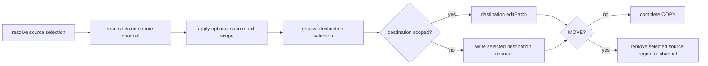

The same orchestrator covers same- and cross-scheme resources. A same-channel
regional MOVE lowers both replacements into one `editBatch` against one source
snapshot. Cross-resource MOVE is ordered destination-then-source and cannot be
globally atomic; if source removal fails after destination success, its Problem
Details state `destinationWritten: true` and identify the destination.

### §send-dispatch SEND dispatch (status-code-as-verb)

Directed SEND (non-null path) routes to scheme's `send`. Status = intent:

- `## SEND0 [200] (path)` — write body into resource (WS message, exec stdin).
- `## SEND0 [499] (path)` — cancel active subscription ({§stream}).

- §log-uniform-query **Log speaks the universal query contract** — `## FIND0 (log://…)` works like every scheme's FIND. Candidates are worker rows scoped by the coordinate hierarchy ({§log-coordinate-hierarchy}) and projected exactly as READ shows them. Content dialects use `Matcher.matchCandidates`; `~semantic` and `&graph` use the same persistent derivation artifacts and candidate rankers as entries. Broad results are one-channel catalog groups whose `[0].path` is `log:///loop/turn/seq/OP`; exact matcher results are flat locations ({§find-result-projection}). A FIND signal classifies the FIND result row and never changes this candidate set ({§log-item-tags}). Log remains the core event ledger rather than duplicating rows into `entries`; its core-private storage adapter supplies one complete channel representation to the same READ projector. That adapter is not a plugin seam and grants no protocol scheme an alternate READ path.
- §find-source-agnostic **The content matcher is source-agnostic** — `Matcher.matchCandidates(body, candidates, mimetypes)` applies a content matcher (regex/jsonpath/xpath/glob) to candidates from ANY source, keyed by the caller's own identity (a pathname for entries, a `loop/turn/seq` coordinate for log). The matcher never cares what table the content came from, so FIND works uniformly across schemes by construction: `EntryFind` and `Log.find` run the one shared primitive rather than re-implementing it per scheme. Log stays its own event stream, but its rows are candidates the shared matcher covers like any entry's content.
- §channel-selection-visibility **Channel selection is decision-time information, not a guess** — every multi-channel resource presents its channels with extents wherever FIND presents the resource: broad results list each channel's path, mimetype, tokens, and lines (default channel first), and matcher locations name the channel their line coordinates address. The packet never presents channels as equal and indistinguishable; extents derive from the stored channels by construction. Budget enforcement stays with {§overflow-turn} — this is information, not a second guard.

- §matcher-selection-signal **Matching carries navigation evidence** - a matcher is a boolean resource predicate. Internally, each selected resource carries `matches: MatchEvidence[]`, where `MatchEvidence` is `{channel?,locator?,region?}`; `channel` names the entry channel the finding was located in and is absent for channel-less resources such as log rows, so line coordinates cannot be mis-attributed across channels of the same resource ({§channel-selection-visibility}). `locator` preserves a structural address without overloading the resource row's `path`; `region` is a complete four-coordinate `TextRegion` only when the finding maps honestly into the exact text the model can READ. Exact duplicate evidence deduplicates. Relation findings map their indexed source spans through the same readable text coordinate index. FIND alone decides whether that grouped selection projects as resource rows or flat locations ({§find-result-projection}); the engine never fabricates a region or guesses which surgical READ the model wants.

`## SEND0 [410] (path[#fragment])` also deletes the target entry/channel — an implemented side-effect, NOT taught to the model and with no live/demo surface. The model-facing delete idiom is KILL ({§move}).

§send-dispatch-entry-schemes-501-on-non-410 Other status codes return 501 from entry-bearing schemes by default.

Null-path SEND is broadcast ({§send}), engine-handled.

### §scheme-surface Consumption surface

Per-call context (`src/core/scheme-types.ts`):

```ts
interface PlurnkSchemeContext {
    readonly db: Db;
    readonly workspaceId: number;
    readonly workerId: number;
    readonly loopId: number;
    readonly turnId: number;
    readonly writer: "model" | "client" | "_plurnk" | "plugin"; // WriterTier
    readonly signal: AbortSignal | undefined;
    readonly streamEventNotify?: StreamEventNotify;
    readonly wakeWorkerNotify?: WakeWorkerNotify;
    readonly injectWorker?: InjectWorkerNotify;            // worker:// spawn/fork/irc loop-start (§worker-scheme)
    readonly mimetypes?: Mimetypes;
    readonly executors?: ExecutorRegistry;           // boot-discovered EXEC runtimes (§exec)
    readonly tokenize?: (text: string) => number;    // write-time tokenizer (§tokenomics)
    readonly defaultChannelFor?: (scheme: string) => string;
    readonly pushNotice?: (notice: Notice) => void; // → next packet Notices + notice/event (§operation-results)
}
```

The optional engine-/daemon-populated capabilities (the notifiers, `injectWorker`, `executors`, `tokenize`, `defaultChannelFor`, `pushNotice`) are absent in bare test fixtures; a handler that needs one **fail-hards** rather than silently degrading (no default runtime, no silent zero-token write).

Engine → scheme guarantees:

- `ctx` is fresh per call. No mutation across calls.
- §universal-read-composition **Exact READ has one composition.** Core resolves
  canonical identity and owner once, gives a data scheme its optional
  `prepareRepresentation({ target, metadata, authority, pathname })` opportunity, reads the complete
  canonical channels, selects the authored channel, applies binary and
  text-coordinate rules, and finally composes that channel's durable producer
  result. Preparation receives neither fragment nor `lineMarker`; finite work
  returns `200`, while only a retained live representation may return `102`
  ({§read-preparation}). No public handler can replace READ.
- Exact FIND uses the same resolved identity and representation preparation
  before standard entry selection, then composes the exact selected channel's
  durable producer result with the core-owned query projection. Broad FIND may invoke a custom `find()` for
  genuinely protocol-owned candidate enumeration, or `prepareFind()` followed
  by the standard catalog query. Acquisition never owns matcher, pagination,
  or result-unit semantics. Every prepared write and query preserves all
  identity components owned by {§scheme-address}.
- COPY/MOVE source selection resolves and prepares that same canonical
  representation before selecting a channel. Its independent source scope
  remains raw transfer semantics—markerless means the complete channel rather
  than READ's preview—and is structurally unavailable to the producer.
- `ctx.writer` reflects the actual writer at this dispatch.
- §scheme-surface-writableby-403 `manifest.writableBy` is checked BEFORE invocation; engine returns 403 directly on exclusion.
- `ctx.signal` is wired to the worker's AbortController ({§provider-guarantees-signal-wired}).
- §scheme-surface-exception-500 Scheme exceptions are contract violations. Core records their complete cause in daemon diagnostics, closes the action with a generic core-owned 500 Problem, and surfaces that durable row in the next turn's `errors` section ({§operation-results}). Implementation exception text is not repurposed as a model recovery instruction.

**Curation-weight participation.** Core's shared `_entry-crud.ts` write helper
populates `entry_channels.weight` at write time through `ctx.weigh`
({§tokenomics-weight-stored-at-write}). Scheme handlers reach that path through
the public `ctx.entries` capability. Raw database writes are outside the scheme
API and receive no implicit token accounting.

---

## §mimetype Mimetype Contract

Author-facing contract: [`@plurnk/plurnk-mimetypes`](../plurnk-mimetypes/SPEC.md). Below: firing semantics + core's consumption surface.

§mimetype-schemes-do-not-invoke-handlers **Firing semantics.** Scheme writes are verbatim and do not invoke mimetype handlers. `SearchIndex.maintain` processes the current readable projections before model execution and attaches complete search artifacts. Catalog rendering independently asks handlers for extents. Fetch-time materialization is earlier still: the web-fetch sink converts guarded HTTP HTML or supported binary input into derived Unicode that READ serves and search indexes, retaining faithful DOM and origin/projection evidence only in explicit auxiliary channels. An authored workspace HTML file remains verbatim; its markup is data.

### §mimetype-manifest Manifest

Per the author contract, a package declares `kind: "mimetype"` and one or more
handler entries with a name plus optional glyph and extensions. Discovery
injects that metadata into one handler instance per declared mimetype.
Discovery order and collisions follow {§mimetype-discovery}; resolution
failures follow {§mimetype-error-policy}.

### §mimetype-methods Methods

The author contract is owned by plurnk-mimetypes. Core and its sibling adapters
consume these public methods:

| Method / surface                          | Core-side use                                                                                                               |
|-------------------------------------------|-----------------------------------------------------------------------------------------------------------------------------|
| `ready`, `skippedPackages`                | Complete trust-gated discovery and present withheld-package evidence at daemon boot.                                        |
| `detect`, `process`                       | Resolve mimetypes, extents, readable content, symbols, and references.                                                      |
| `projectionIdentity`                      | Identify installed reader behavior for derived entries and search artifacts that consume symbols and references.           |
| `query`                                   | Execute glob/regex/JSONPath/XPath through `@plurnk/plurnk-schemes/Matcher`, which maps typed outcomes to operation results. |
| `embedderInfo`, `embedBatch`, `tokenizer` | Plan and derive semantic-search chunks without reaching into artifact packages.                                             |

`@plurnk/plurnk-contracts` owns model-facing matcher syntax; parsed content
dialects pass to `Mimetypes.query` without reclassification. Mimetype handlers
own content-to-structure interpretation. Core owns candidate-set composition
and the persistent semantic/graph relation indexes.

Cross-cutting promises service relies on:

- Storage writes do not implicitly project; query, indexing, and presentation
  invoke the exact public surface they need.
- Handler projections are deterministic for a given `(content, mimetype, projection identity)` tuple.
- Validation errors propagate (fail-hard).
- Degraded projection (a `grammarMissing` marker) rather than throw when a grammar is absent.

### §handler-bounds What handlers do NOT do

- **Tokenization** — outside the mimetype projection pipeline; core owns packet and stored-weight accounting ({§tokenomics-agnostic-ruler}).
- **Storage** — handlers receive content values and own no entry persistence.
- **Streaming** — handlers see whatever content is current; subscription registry lives between schemes and {§stream}.

### §handler-bundling Bundled vs sibling handlers

No format handler ships inside `@plurnk/plurnk-service`; the framework and
format handlers are sibling workspaces and independently published packages.
The service manifest, not the framework manifest, owns the dependency edges
that compose the default install ({§bundled-set}).

### §mimetype-surface Consumption surface

plurnk-service is mimetype-illiterate. Engine hands channel content + mimetype label to `Mimetypes.process({content, hint})`; the manifest build uses `result.totalLines` for each channel's `lines`. Content reaches the model on READ, not as a rendered preview.

§mimetype-owned-lifecycle `Daemon` owns and disposes the `Mimetypes` instance
it constructs. A constructor-injected instance remains caller-owned. Shutdown
quiesces model work, cancels and settles active derivation warming, then
disposes the daemon-owned instance exactly once; mimetype teardown failures
retain their causes and join the same aggregate as module and scheme shutdown
failures. A pre-start or repeated stop does not acquire or dispose resources.

§mimetype-classification-consumption Every engine-owned binary decision uses
the configured `Mimetypes.classify()` path. An installed handler declaration
is authoritative; only an unregistered label reaches the framework's taxonomy.
Absence of the configured registry at an engine classification boundary is an
internal contract failure, never a reason to substitute the pure heuristic.

| Core boundary                 | Classification effect                                                     |
| ----------------------------- | ------------------------------------------------------------------------- |
| File membership materializing | Persist textual content, derived Unicode, or a typed empty binary marker. |
| READ/EDIT and COPY/MOVE scope | Admit text regions or return 415.                                         |
| Search derivation             | Build graph/FTS/vector artifacts or mark nonsemantic.                     |

The default service installation includes its structured, document, embedding,
and tokenizer leaves through the service manifest. The lean framework also
supports direct consumers that assemble a different set. Tree-sitter grammar
WASM leaves and third-party handlers remain independently installable and
resolve from the same consumer-visible package graph under trust-gated
discovery ({§mimetype-discovery}).

**Token accounting.** The daemon injects no tokenizer into `Mimetypes`; content
projection is independent of packet budgeting. Core uses the stable
model-independent ruler for stored/catalog weights and the model-facing curation budget
({§tokenomics-agnostic-ruler}). The provider's request-shaped measurement is
confined to provider-owned physical capacity assessment
({§tokenomics-context-envelope-admission}).

§persistent-search-index **Persistent search index.** `SearchIndex.maintain` is the pre-model engine pass. Every addressable entry channel supplies the exact readable representation its READ exposes; `LogBody` resolves each log row's canonical full body from its durable tx/rx envelope. Acquisition schemes project remote source material before storing addressable channels; search never introduces a second hidden text projection. The channel content, mimetype, resolved text/binary classification, mimetype projection identity, embedder configuration, and applicable search exclusion form a content hash. Complete artifacts own FTS, vectors, symbol definitions, and references; each `entry_channels` row or log row holds only its own attachment hash. Binary, empty, and excluded derivations do not invoke handler projections and therefore use one fixed no-projection identity.

§search-exclusion **File-search eligibility is Core policy.**
`PLURNK_SERVICE_SEARCH_EXCLUDE` is a comma-separated table of anchored
body-glob patterns. Patterns containing `/` match the full pathname; every
other pattern matches the basename. Whitespace around entries is ignored, an
empty setting excludes nothing, and the first match is the observable reason.

| Search subject       | Exclusion evaluation                                    |
|----------------------|---------------------------------------------------------|
| `file` entry         | Apply the configured repository-path patterns once.     |
| Other-scheme channel | Always eligible; its pathname is a resource identity.   |
| Log projection       | Always eligible; it has no repository-path membership.  |

A match produces the `excluded` derivation disposition and suppresses graph,
FTS, and vectors while leaving the stored channel and direct READ unchanged. The
same reason participates in the derivation hash and is surfaced by diagnostics
and digests. Mimetype detection and projection do not read or report this
scheme policy.

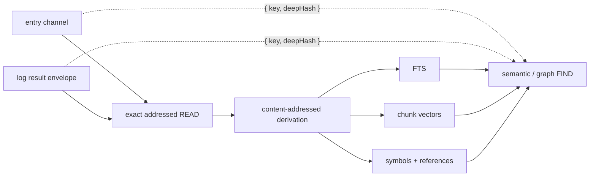

§derivation-exhaustive Identical projections attach the same immutable artifact regardless of their source table. Search primitives therefore consume only `{key, deepHash}` candidates and cannot depend on entry or log storage. Semantic and graph FIND require every selected channel candidate—and every channel in graph's relationship universe—to be attached. An incomplete set returns 503 with `problem.search = {state:"incomplete", indexed, total}`; it never silently searches a partial corpus. Explicit membership changes may warm eagerly; every model turn joins exhaustive derivation before dispatch. Passive workspace creation and attachment do not launch it. The incomplete response is therefore an interface invariant and diagnostic, not a lazy-search mode.

The graph projection stores only addressable symbol names. A structured-data handler may legitimately emit an empty key into its symbols channel, but the `&graph` matcher cannot name an empty symbol; that one definition is omitted from graph storage without suppressing FTS, vectors, or the remaining definitions. Invalid references and other persistence violations still fail the resource derivation explicitly.

The pass tiles the exact readable text into token-budgeted fragment strings and
sends every tile for one resource through one ordered `mimetypes.embedBatch`
call; it never re-runs a format handler against partial fragments. Workspace
warms coalesce; a request arriving during a pass forces one final rescan.
Progress exposes `preparing`, `indexing`, `complete`, or `failed`. Producer
concurrency, milestone count, and heartbeat interval are operator knobs in
`.env.defaults`.

**Conformance.** Mimetype-specific behavioral tests live in each handler's own surface. plurnk-service intg covers integration: the engine routes through `Mimetypes.process` with the right hint and the catalog reflects `totalLines`; tests use auto-discovery (production handler set); a custom-handler test injects a stub `BaseHandler` via `loader + discovery`.

---

## §channels Channel Topology

§channels-channels-append-only Every entry has named channels. **Channels are append-only content stores** keyed by `(entry_id, name)`. Schemes write content; the engine reads at turn boundaries; mimetype handlers interpret.

### §per-entry-channels Per-entry channels

§per-entry-channels-edit-writes-only-body EDIT writes one channel per call — the channel resolved from the path's fragment (or the scheme's `defaultChannel` when no fragment).

No stored `preview` channel — channel content is pulled on READ, never previewed.

Schemes MAY declare multiple channels (`exec`: stdout/stderr/stdin; `http`: body/header; SSE: per-event-type). Each goes in `manifest.channels` with mimetype pinned; rendered independently.

For a multi-channel streaming READ, persistence and publication are distinct: the scheme may acquire and persist auxiliary channels, but a fragmentless target publishes only the manifest's `defaultChannel`. An explicit fragment publishes that channel. Thus an ordinary HTTP READ presents the sanitized `body`; response metadata and archival DOM remain addressable implementation/diagnostic surfaces rather than ambient model context.

A published default channel renders under the entry's ordinary fragmentless address. The channel name remains internal bookkeeping, just as it is for synchronous entry READs. Only explicitly selected non-default channels render a fragment.

### §no-visibility Entries carry no visibility

Every entry is uniformly listed in the catalog (`## FIND0 (scheme:///**)`, {§packet}) and READable — entries have no per-worker open/folded state. Context curation is the model's, on the **log** (via OPEN/FOLD, {§open-fold}), never on entries.

### §channel-mimetype Mimetype is a (scheme, channel) property — never a default

Mimetype is declared by scheme manifest ({§scheme-manifest}) or supplied per-call for dynamic schemes. Writing a channel without a declared mimetype throws. No default mimetype anywhere.

- §channel-mimetype-cross-mimetype-415 Cross-mimetype COPY/MOVE → 415, never coerces ({§copy}).

### §channel-selection Channel selection in the DSL

DSL targets a specific channel via the URL fragment (`#name`).

Rules:

1. §channel-selection-fragmentless-targets-default-channel Fragment-less paths target the scheme's `defaultChannel`.
2. §channel-selection-fragment-selects-named-channel Paths with a fragment target the named channel.
3. §channel-selection-unknown-channel-400 Unknown channel name → 400, carrying the fact that names the tried fragment and the declared universe (`no channel #results at sh:///1/1/2; channels: stdout, stderr`) — one miss teaches the topology.
4. Schemes without `defaultChannel` reject fragment-less EDIT/READ.
5. §channel-selection-fragment-on-nonexistent-404 Non-default channel EDIT requires entry to exist (404 if absent); default-channel EDIT creates.
| URI                                  | Channel                              |
| ------------------------------------ | ------------------------------------ |
| `worker:///france/capital`           | body (default)                       |
| `sh:///1/1/2#stdout`                 | stdout                               |
| `sh:///1/1/2#stderr`                 | stderr                               |
| `https://feed.example/y#body`        | body                                 |
| `log:///N/T/A`                       | (no channel concept; atomic log row) |

Op implications:

- EDIT to undeclared channel → 400; read-only channel → 405.
- COPY/MOVE source and destination fragments independently select channels.

Client-interface target parameters carry fragments inline (`{ target: "sh:///1/1/2#stderr" }`).

**Wire rendering: default channel is path-only.** A rendered target omits `#channel` when channel matches `defaultChannel`. Single-channel entries render path-only; multi-channel entries render the default path-only and only non-default carries `#name`.

### §channel-state Channel state — metadata, not gating

§channel-state-state-is-metadata Each channel has `state ∈ {static, active, closed, errored}`. Metadata only, not an engine gate.

- `static` — content final, not being written. Entry schemes after EDIT.
- `active` — scheme is writing (chunks arriving). Streaming schemes during accumulation.
- `closed` — stream ended cleanly. Content final.
- `errored` — stream ended with a failure status, including cancellation. Content may be partial; reads return what accumulated.

§channel-state-schemes-own-state-transitions Schemes own transitions; UPDATE `entry_channels.state` as connection lifecycle progresses. State does not gate reads — schemes return accumulated `content` regardless ({§channel-state-state-is-metadata}).

Model uses state to anticipate growth between turns. Clients use state for UI (spinner / red border / etc.).

---

## §op Op Surface

Per-op semantics. AST shapes come from `@plurnk/plurnk-contracts`'s `PlurnkStatement`. Engine dispatches by `op`; scheme implements per author contract ({§scheme}).

### §line-anchors Text line anchors

A scheme declaring `lineAnchors: true`, or `textEditScopes: true` with model
write authority, publishes the contracts-owned {§text-line-anchor-syntax}.
Model-writable `textEditScopes` implies anchors; `lineAnchors` alone makes no EDIT claim. For canonical model-facing
resource identity `R`, one-based line ordinal `L`, configured non-negative
neighbor count `C`, and ordered content array `W` containing that line and up to
`C` complete lines on either side (all excluding separators), core hashes the
JSON tuple `["plurnk-line-anchor-v1",R,L,C,W]` with SHA-256, interprets the
digest as a big-endian integer modulo `62^5`, and encodes five fixed-width
characters with alphabet `0-9A-Za-z`. The universal READ projector derives
anchors from the complete canonical selected channel before applying the
authored text slice; its durable result retains the canonical derivation
identity and anchors aligned with returned lines. Packet rendering right-aligns
`L` to the decimal width of the complete canonical selected channel's final
addressable line and emits `@xxxxx L:<content>` with one or more ASCII spaces
before `L`; a source line therefore retains the same prefix across projections
of one revision.
An explicit default-channel fragment and its fragmentless spelling share that
identity; a selected non-default channel retains its canonical `#channel`.

For READ/LOOK and COPY/MOVE source or destination selection, core resolves every
anchor against the addressed current complete content before applying the
ordinary numeric text-coordinate contract. Exactly one current match lowers to
its numeric line; zero or multiple matches return 409 `line-anchor-collision`,
with `retryable: false` because resolving the collision requires a new READ and
different coordinates rather than automatic replay. An anchor in a column
position returns 400 stating that four-coordinate
column slots are numeric and that `<@start,@end>` is the whole-line anchor
range. COPY/MOVE mutation owners retain
the resolved endpoint neighborhoods as compare-and-swap preconditions. There is
no revision sidecar or fuzzy relocation. A range authenticates both endpoint
neighborhoods, so every line of a range up to `2C + 2` lines is covered; a
longer range retains an unauthenticated interior gap. The shipped `C = 2`
covers ranges through six lines.

### §edit EDIT

AST: `{ op: "EDIT", target, body: string | null, signal: tags | null, lineMarker?: TextLineMarker }`.

- Resolves target channel from fragment ({§channel-selection}); unknown channel → 400; undeclared in manifest → engine crash ({§channel-mimetype}).
- §edit-null-clears Writes the body; `body: null` clears it.
- §edit-status-201-200 Returns `{ status: 201, entryId }` for a new entry and
  `{ status: 200, entryId }` for a content update.
- §edit-noop-304 A write that changes nothing — identical content — returns `{ status: 304, entryId }`, mirroring OPEN/FOLD's idempotence ({§open-fold}). Its terse detail states the observed equality and the valid empty-body deletion shape; it never presumes that repetition or retrieval is the intended recovery. The operation's log classification remains independent ({§log-item-tags}).
- §edit-marker-required-on-existing **A markerless EDIT is CREATE-ONLY — there is no easy-clobber path on an existing entry.** A `<L>` marker scopes an EDIT to a range; without one, the body becomes the entry's WHOLE content — legitimate and required for a fresh entry (nothing exists to scope into), but on an EXISTING entry a missing marker is refused **400**, never a silent full replace. A deliberate full rewrite states that intent explicitly: `<1,-1>` resolves through the ordinary marker math to the same whole-content replacement, so the capability is available but cannot be selected by omission.
- §edit-line-anchors An anchored EDIT resolves under {§line-anchors} and carries
  its endpoint checks as a core-private mutation precondition. Otherwise-valid
  zero/multiple matches and later precondition misses share {§edit-collision};
  malformed positions and schemes without textual EDIT scopes return 400 before
  handler invocation, while an upstream current-read failure preserves its
  status. The model-facing teaching recommends anchors for EDIT because this
  rejection is deliberate stale-target protection; parser support for anchors
  on observations does not imply the same recommendation.
- §edit-collision Every standard entry EDIT lands by compare-and-swap against
  the exact channel content used to calculate it, including numeric-only EDITs.
  A concurrent creator that wins the resource identity or channel, an anchor
  that no longer identifies exactly one line, a selected endpoint neighborhood
  that changes before mutation, or a representation that changes in the final
  check/write gap returns the same neutral **409 `edit-collision`** and preserves
  the winner's content. Its public detail says only that EDIT collided with
  another change and directs the model to READ before selecting current
  coordinates; `retryable: false` forbids automatic replay of the identical
  stale request. It does not assign fault or reveal which detection layer won.
  Concurrent correct workers are an ordinary cause. Core resolves anchors,
  scheme handlers receive only numeric
  coordinates, the shared entry mutation owner rechecks selected endpoint
  neighborhoods against its exact snapshot, and atomic identity/channel claims
  and storage predicates close the remaining races.

A `file:///` member EDIT diverges from this immediate-write contract: it diffs against the entry snapshot (the body channel, never a fresh disk read) and **proposes** (202) a disk write that lands via a compare-and-swap on accept. See {§membership-edit-write-cas} and the proposal lifecycle {§proposal}. The marker-required rule above applies identically here — an existing file is never markerlessly replaced.

### §read READ

AST: `{ op: "READ", target, body: null, signal: tags | null, lineMarker? }`.

Matcher-bearing or path-glob READ syntax has already normalized to canonical
FIND before dispatch under {§read-find-normalization}; core has no second READ
selection or fan-out path.

- §read-read-content Returns channel content and mimetype.
- §read-read-404 Returns 404 when the channel is absent.
- §read-selection-projection READ applies `lineMarker` as text coordinates to one
  exact target under {§read-exact-target}. Markerless READ synthesizes
  `<1,16>`; `<1,-1>` explicitly selects all text. Successful positional reads
  carry the compact requested/returned extent and available total
  ({§range-extent}). Anchors resolve under {§line-anchors} before selection. An
  invalid text region is 416.

§log-item-tags **Tags classify durable log items.** Under {§log-tag-signal}, FIND, READ, EDIT, COPY,
and MOVE strip any leading `+` from every signal term and add the resulting tag
to the one log row created for that operation. The row receives its complete
deduplicated set even when the operation fails or has no body; the signal never
filters candidates, changes a resource, or persists on an entry. OPEN and FOLD
use every unsigned signal term as an ALL-tags filter over existing log rows;
their optional target and matcher intersect that set. They then strip and add
each `+tag` and strip and remove each `-tag` on the exact selected rows while
applying the requested visibility. Signed terms never select: a curation
operation requires a target, matcher, or unsigned tag. Add and remove terms for
the same tag conflict. Successful visibility and classification changes land as
one curation event whose exact per-row deltas are durable. Engine policy may
apply its separately specified diagnostic classifications, such as `overflow`.
Every classification lives once in `log_tags`, remains forensic evidence when
KILL retires its row's projection, and is copied with log history on fork.

### §log-history-projection Durable history and active projection

| Layer | Owner | Curation contract |
|---|---|---|
| Durable event | `log_entries` | One chronological execution fact. Ordinary Plurnk operations never erase it; its original body and initial folded state remain available to the client journal, digest, and fork forensics. Containing turn, worker, or workspace teardown may cascade the history. |
| Active projection | `log_entry_projections` | One current worker-facing state per event. OPEN/FOLD change folded body intervals while active. Log-KILL atomically changes active to inactive and cannot be reversed; inactive rows are absent from packet rendering, log READ/FIND, failure pointers, semantic discovery, token accounting, and later curation. |

The successful curation operation and every exact target transition are durable
in the same commit. KILL against another scheme retains that scheme's ordinary
resource or process semantics; this projection contract is specific to
`log:///`.

### §open-fold OPEN / FOLD

AST: `{ op: "OPEN"|"FOLD", target, body: MatcherBody | null, signal: tags | null, lineMarker: TextLineMarker | null }`.

OPEN/FOLD operate on the **log** (`log:///`) - the model's context-curation surface ({§packet}). Without a scope, FOLD hides and OPEN reveals the whole canonical log body. With a one-line or inclusive two-line scope, each operation changes only that body's intersecting body-relative physical lines. An anchor may be one already published on that immutable body or one returned by READing its `log:///` identity; numeric lines outside a selected body and absent or ambiguous anchors are successful per-body no-ops. Both select rows by target, matcher, and the symmetric ALL-tags filter before independently applying the scope and tag changes to each selected row. Folded intervals are durable, sorted, disjoint, and compositional; `[]` is wholly open and `[[1,-1]]` wholly folded. An active row's canonical body remains complete through log READ/FIND regardless of folded visibility. Rows and bodies persist, and classification changes still land when visibility is a no-op. Malformed targets, unsupported coordinate arity, and nonexistent exact coordinates fail at their owning boundary. Entries carry no visibility ({§no-visibility}), so OPEN/FOLD against an entry scheme returns 501.

### §jsonplurnk The Log's wire format

The `## Log` section renders as a fixed three-backtick `jsonplurnk` fence - a JSON array of entry objects, otherwise-valid JSON with **exactly one** deviation: an open, nonempty `body` is a raw multiline string. Its opening JSON quote is followed by a physical newline, every visible content line retains its canonical numeric `N:` or anchored `@hash N:` coordinate, and its closing quote appears at column zero before either the object close or a following member. Source quotes, braces, fences, and headings cannot collide with either boundary because source text never occupies column zero after projection; source backticks therefore cannot form a CommonMark closing fence. The fixed opener keeps the packet prefix stable across content changes. The carve-out is localized to `body`, so the strip-parser recognizes `"body":"` followed by a newline, consumes one or more coordinate-prefixed lines, and replaces the raw multiline value with an escaped JSON string while preserving following members to recover strict JSON. The three body states are self-describing through field presence alone: a `body` field means open, `tokensBody` without `body` means folded (the value prices the OPEN), and neither means no canonical body; no `display` label exists. Two defaults are likewise field absence: `origin` is omitted for the worker's own model authorship (exactly as `source` absence means the owning worker), and `status` is omitted for a routine 200 on an ordinary row. SEND always carries its submit code, KILL keeps an explicit 200 so destructive completion is decisive, and every non-200 stays explicit. A partially hidden open row also carries `"folded":["<scope>",...]`; coordinate gaps in its body make the omission explicit without renumbering later lines. `path` is the complete model-facing log identity: when a projected operation exists it ends in `/OP`, and no separate `op` field duplicates it. It leads each entry object; the remaining members follow in stable alphabetical order. A present authored operation annotation appears as `annotation`; its absence omits the field. Nonempty `tags` is the row's complete deduplicated, sorted folksonomy; an untagged row omits it. When an automatic bounded projection differs from the visibility-selected body, it appends `"chunk":"showing <selected> of <complete>"` after `body`; otherwise it omits `chunk`. Complete-line extents use inclusive two-coordinate line regions. A cut inside a line uses four-coordinate, start-inclusive and end-exclusive regions with 1-based Unicode code-point columns. The row's `path` remains the canonical READ target. The block is data only - no prose leads the fence. Every row's accounting: {§packet-token-accounting}.

- §packet-token-accounting Every row reports its real weight so the packet self-reconciles against the budget: `tokensBody` is the projected body's nonzero weight whenever a canonical body would render (never `0` — a priceless OPEN is field absence), and `tokensActive` is the complete row's weight in the packet right now. The metadata share is derivable (`tokensActive − tokensBody` when open; `tokensActive` otherwise) and is never serialized — it feeds no curation decision. Thus FOLD removes the rendered body's weight while KILL removes `tokensActive`; on a folded row `tokensBody` previews the body share an OPEN would activate. The completed row, including its accounting field and framing, is measured to a fixed point. A FIND's nonzero `itemsTokenTotal` weighs the complete matched set; a nonzero `returnedItemsTokenTotal` appears only when the returned page has a different weight. These are curation weights, not dollars. The invariants bind regardless of shape ({§packet}): addressability (`path`/`target`/`#channel`/coordinate-prefixed bodies), weighability (per-item `tokens`), honesty (every 4xx/5xx row and the exact body state). {§jsonplurnk} {§packet-jsonplurnk-exception}

### §retrieval-packet-metadata READ/FIND packet metadata

The packet projects one actionable owner for each retrieval fact:

| Result mode | Extent | Result-body evidence | Additional aggregate fact |
|---|---|---|---|
| line READ | compact `line` range | none | none |
| exact-coordinate READ | none | top-level `region` | none |
| READ-shaped materialization notice | none | none | generic body `lines` |
| catalog/path FIND | compact `resource` range | none | none |
| broad matcher FIND | compact `resource` range | per-resource match-location counts; a resource with exactly one match also carries that match's `locator`/`region` | nonzero complete `matchLocationCount` |
| exact matcher FIND | compact `matchLocation` range | each row's locator/region; a regex or glob row also carries `matched`, the matched text | none |

The compact range is `{ unit, total, requested: [first,last], returned?:
[first,last] }` ({§range-extent}); empty results omit `returned`. Transparent
coordinates let the model determine whether more material exists and choose
its own next request, so packet metadata never prescribes `next`, `complete`,
or `all`. FIND range cardinality replaces top-level `items`, `lines`, and
`matchingPathCount`; line READ likewise omits the rendered-body `lines` count
and its internally resolved whole-line region. Exact READ retains only its
region. A failed retrieval's Problem owns its range extension rather than
repeating it at top level. Generic `tokens` always weighs the rendered body;
generic body `lines` remains available on READ-shaped materialization notices
that have no retrieval extent. FIND content weights follow {§jsonplurnk};
ordinary bounded bodies expose their displayed and complete chunk extents there.

### §turn-ops-entry The admitted turn program

§turn-ops-log-curation A source-backed turn preserves its **exact admitted Plurnk program** as an actionless log item in addition to the ordinary result row for every dispatched statement. `op` is null, `attrs.kind="turnOps"` identifies the durable type, `origin` is the turn producer, no target exists, `tx` is empty, and the source lives in `rx.content`, typed `text/vnd.plurnk`. Its canonical model-facing address appends the lowercase `/ops` leaf to its three-part coordinate. The packet does not duplicate that identity as `kind` metadata. It is line-numbered and READ/FIND/OPEN/FOLD/KILL-able like any active log body. The worker-initialization `turnOps` is born OPEN because it is the worked orientation example; every other `turnOps`, including model inference and overflow recovery, is born FOLDED and remains available on demand. Log-KILL clears the `writableBy` gate for a model-authored item and retires only its active projection under {§log-history-projection}; the exact program remains forensic history. Log's handler surface keeps every other mutating op at 501. The shared executor writes exactly one after every admitted source-backed turn.

§rejected-emission-entry A rejected provider response is not `turnOps`: it never became an admitted turn program. The one bounded invalid-emission recovery item under {§emission-admission} has `attrs.kind="emissionAttempt"`, `origin="model"`, the canonical model-facing `/attempt` leaf, and the exact latest rejected response. The packet does not duplicate that identity as `kind` metadata. It is born durably FOLDED and projected OPEN only in the informed recovery packet; every other rejected attempt remains forensic-only.

- §log-coordinate-hierarchy **Log coordinates are a hierarchical prefix; the trailing slash is optional** — a coordinate is `loop/turn/sequence`, and a PARTIAL coordinate selects its descendants: `log:///1` = loop 1's rows, `log:///1/2` = turn 1/2's rows, `log:///1/2/3` = the one row. A full coordinate is always three parts, so a one- or two-part path is unambiguously a prefix — the trailing slash is an optional alias (`log:///1/2` ≡ `log:///1/2/`), uniform with `## READ0 (worker:///docs/)`. Every rendered row appends one canonical model-facing leaf: `/OP` for an operation, `/ops` for an admitted turn program, or `/attempt` for a rejected emission. The leaf names identity rather than adding a resource level. Exact consumers tolerate the unsuffixed three-part shorthand; when supplied, the case-insensitive leaf is authoritative and a disagreement resolves 404. Typed entry materialization therefore resolves as `/READ` while retaining its durable `EDIT` event ({§exec-entry-sink}). `log:///1/2/*` still selects the turn's item rows, while `log:///**/READ`, `log:///**/ops`, and `log:///**/attempt` deliberately filter canonical leaves.
- §log-curation-folder-idiom **Log curation speaks the folder idiom; a zero-match sweep is a no-op success** — OPEN/FOLD/KILL take a concrete coordinate or a path-glob, and a **trailing slash or a partial coordinate means "the contents"** ({§log-coordinate-hierarchy}), like a folder-scoped FIND: `## FOLD0 (log:///1/2)` folds turn 1/2's rows. OPEN and FOLD may instead take only a tag filter ({§log-item-tags}). A **well-formed selection that matches nothing is 204 with `matched: 0`**; a successful sweep's rx carries `matched: N`. A targetless operation without tags or a matcher is 400.
- §log-curation-set-selection **Row selection and body scope are independent** — target/glob, optional body matcher, and optional ALL-tags filter compose by intersection into the affected row set. An optional `<L>` or `<SL,EL>` then intersects each selected canonical body; it never paginates or changes the selected set. Thus `## FOLD0 (log:///**/READ) <17,-1>` may change long READs and no-op on short ones while reporting every selected row in `matched`.

§fold-open-meta-operations **OPEN and FOLD are meta-operations — log-curation directives, not world actions.** They change log visibility and classifications, never the underlying resources. A **successful** OPEN/FOLD **is recorded in the log** but **suppressed from the packet render**: the row exists for forensics — a curation act with NO trace is how a weak model folding its own task frame stayed invisible until a database dig — while the render still costs it nothing, so FOLD stays genuinely free (the original rowless design's concern, met by hide-not-drop). Its exact selected target set, each target's active/folded state before and after, and the classifications actually added and removed persist with that event; `matched: N` and the authored selector are not the database's sole effect evidence. The operation row, projection changes, tag changes, and landed effects commit in one database statement with each before state as a collision guard. The authored program also survives verbatim in its `turnOps` item. A **failed** OPEN/FOLD (bad target, matcher, or tag signal) renders normally with its status — errors are signals. The idle-turn gate reads the *emitted statements*, so a pure-curation turn is work, never idleness.

§kill-log-receipt-suppressed **A successful KILL of an active log item is suppressed from the render too.** It retires the selected rows from the worker's active projection under {§log-history-projection}; it does not delete their execution history. The KILL event, exact active/folded transition for every target, and authored `turnOps` remain durable, while none creates replacement packet weight. The suppression is **scoped to log targets**: a `KILL` of a `worker://` note, an `sh://` stream, or another stored artifact retains its scheme-owned world or process semantics and stays visible. A killed exact coordinate resolves 404 in ordinary log operations; a well-formed broad selection with no active matches remains the 204 no-op of {§log-curation-folder-idiom}. Failed KILL renders like every operation error.

### §log-sensitive-request-evidence Durable request evidence

Ordinary operation rows store a normalized statement projection, not exact
provider evidence. This is a structural credential-slot rule, not general
secret detection.

| Surface                             | Durable rule                                                                                                                                                                                                                                    |
| ----------------------------------- | ----------------------------------------------------------------------------------------------------------------------------------------------------------------------------------------------------------------------------------------------- |
| Operation target                    | Each non-null URL username or password becomes `__redacted__`; `raw` is rebuilt from that pure projected target.                                                                                                                                |
| Scheme metadata modifier            | Every present block becomes `__redacted__` wholesale; only ordered block count and represented-slot presence survive ({§scheme-metadata-modifier}).                                                                                              |
| COPY/MOVE destination               | The nested destination target receives the identical URL-credential projection. URI component columns derive from the projected primary target, so columns and `tx` cannot disagree.                                                            |
| Query and authored body             | Preserved exactly; they are authored content and URI identity, not structurally identifiable credential slots.                                                                                                                                  |
| Parser failure                      | Preserves the structural diagnosis and source position without quoting scheme-metadata contents ({§scheme-metadata-modifier}).                                                                                                                  |
| Client, fork, packet, and digest    | Consume the stored projection; none owns a second redaction policy.                                                                                                                                                                             |
| Model-call evidence and source artifacts | `model_calls.response` under {§emission-admission}, `turnOps` under {§turn-ops-log-curation}, and `emissionAttempt` under {§rejected-emission-entry} remain exact forensic evidence and are the explicit exception.                                                               |

### §copy COPY (engine-orchestrated)

AST: `{ op: "COPY", target (source), lineMarker (source scope),
body: ResourceSelection (destination), signal: tags | null }`.

1. §copy-missing-source-404 Resolve source path, channel, and optional text scope; missing resource or
   channel is 404. A binary marker is not a byte channel and returns 415;
   readable projections are ordinary text sources under
   {§membership-source-projection}. Source anchors resolve under
   {§line-anchors}.
2. Resolve destination path, channel, and optional text scope. Source and
   destination mimetypes must agree or the result is 415. Destination anchors
   resolve independently under {§line-anchors}.
3. A partial scoped destination must already exist and is mutated through the
   destination scheme's `editBatch`. A complete-value destination scope on an
   absent resource is creation under {§fs-write-surface}.
4. An unscoped destination writes only its selected channel. Existing other
   channels survive.
   - §copy-conflict-409 Different content in that channel is 409.
   - §copy-noop-304 Identical content is 304.
5. The signal classifies the COPY log item and never changes either resource
   ({§log-item-tags}).

§copy-cross-scheme-copy The result is 201 for a new entry, 200 for a write, 304 for an exact no-op, or
202 when the owning scheme requires proposal review. Same- and cross-scheme
COPY use this one orchestrator.

### §move MOVE (engine-orchestrated)

AST: `{ op: "MOVE", target (source), lineMarker (source scope),
body: ResourceSelection (destination), signal: tags | null }`.

- §move-relocation-deletes-source MOVE first performs the destination mutation under {§copy}, then removes only
  the selected source region or channel. A whole-channel MOVE deletes the
  source entry only when that was its final channel.
- §move-canonical-whole-source The canonical whole-content source scope
  `<1,-1>` resolves as a whole-channel selection for MOVE: it removes the
  selected channel and deletes the source entry when that was its final
  channel. Every other source scope remains regional even when it currently
  covers all available text; resource deletion is never inferred from extent.
- A same-channel regional MOVE applies destination insertion and source
  deletion in one same-snapshot `editBatch`; source and destination anchor
  preconditions compose against that snapshot, and overlapping regions are 409.
- A cross-resource destination failure leaves the source untouched. A source
  failure after destination success is an explicit partial failure with
  `destinationWritten: true`. Proposal acceptance/rejection follows the same
  ordered rule.
- §move-cross-scheme-move Same- and cross-scheme resources use the same
  contract; there is no global cross-scheme transaction.
- §move-missing-source-404 A missing source is 404.
- §move-null-body-400 **MOVE is not a delete operation.** A null body returns
  400 because a destination is required.
- §move-dev-null-not-special `/dev/null` carries no special meaning; KILL is
  the canonical standalone delete.

Log history preserved — `log_entries` stores path tuple as text, not FK to `entries.id`.

### §find FIND

AST: `{ op: "FIND", target (scope), body: MatcherBody | null (predicate), signal: tags | null, lineMarker? }`.

- §find-scope-prefix-filter Filters entries within scope. A **bare** path is the exact entry; an explicit **shell glob**, classified once by {§path-glob}, expands to a scope. Path globs use segment semantics: `*` and `?` never cross `/`; `**` does. Terminal `*` and `**` are structural catalog selectors and include dot-prefixed entries, so a complete map does not hide `.env.defaults` or `.github`; richer patterns retain native shell behavior. SQLite prefix queries may reduce the candidate set but never decide the match. A trailing slash is a recursive FIND scope only for a scheme whose manifest declares `folderScopes: true`; otherwise it is ordinary resource syntax. This is an explicit plugin contract, never inferred from URL punctuation.
- An exact target resolves to the same canonical `(scheme, authority, pathname)` identity
  as READ, entry CRUD, and any preceding `prepareFind()`. URI authorities are
  identity-bearing: `https://example.com/page` queries
  `(https, example.com, /page)`, never an empty-authority row at `/page`.
- §find-channel-selection The target selects a channel under {§channel-selection}. That channel controls candidate eligibility, every matcher dialect's content or derivation, match-evidence coordinates, and exact producer-result composition. A selected channel absent from an exact entry is 404; a broad scope simply excludes entries lacking it. Successful resource-mode results remain complete default-first channel groups, so sibling channels are navigable catalog metadata rather than additional matches.
- §find-glob-filter-on-content `body` matcher operates on the addressed entry channel (glob/regex/jsonpath/xpath), per `plurnk.md` "Pattern Filtering"; the path-glob lives in the (target), not the body.
- §find-semantic-selection Every matcher operates only over the candidate set selected by `(target)`; relation matchers do not bypass that selection. Semantic ranking is exhaustive within that candidate set, then applies the ordinary FIND result scope. Markerless semantic FIND therefore uses the same `<1,16>` default as every other matcher. Integers retain FIND's positional contract: `<N>` selects result N and `<N,M>` selects the inclusive range. A leading decimal first applies a minimum cosine-similarity threshold; following integers select positions within that ranked threshold set. Thus `<0.7,10,20>` means threshold 0.7 followed by results 10 through 20, while `<0.7>` applies the threshold and the ordinary first-16 page.
- §find-scoped-isolation Workspace + scheme scoped — no cross-workspace/cross-scheme leakage.
- §find-result-projection **The authored target shape determines the result unit; result cardinality never changes it** ({§find-result-unit}). Returns `FindResult { status, content, mimetype, results, range, matchingPathCount, matchLocationCount, itemsWeightTotal, returnedItemsWeightTotal }`:

  | Target | Matcher body | `range.unit` | Result rows |
  |---|---|---|---|
  | exact | absent | `resource` | the one catalog channel group |
  | glob or folder | absent | `resource` | catalog channel groups |
  | glob or folder | present | `resource` | matching channel groups with `matchLocationCount` on `[0]` |
  | exact | present | `matchLocation` | flat `{ channel?, locator?, region? }` locations |

  A glob or folder remains resource mode when it resolves to one path. An exact
  target remains location mode when it has many locations. A valid exact match
  with no addressable location is status 200 with `matchingPathCount: 1`,
  `matchLocationCount: 0`, and no fabricated row; a matcher selecting no
  resource is 204. A body-less broad empty catalog survey is status 200; an
  absent exact resource is 404. Every entry-channel location names its `channel`
  ({§channel-selection-visibility}); log rows carry none.

  Inside `FindResult`, `matchingPathCount` and `matchLocationCount` describe the
  complete selection before pagination; the packet curates those facts under
  {§retrieval-packet-metadata}. `path` is reserved for resource or channel identity;
  broad results never nest locations, and exact location rows never repeat the
  resource path. A **body-less** FIND is the **catalog**. Its outer result array
  contains one nonempty, flat channel array per resource. Element `[0]` is always
  the default channel and carries the bare resource path; later elements carry
  their complete `path#channel` addresses. Each channel is
  `{ path, mimetype, weight, lines, summary?, parseIssues? }`; `parseIssues` is the
  positive-only advisory projection of `{§mimetype-parse-issues}` for the exact
  channel derivation under `{§scheme-catalog-parse-issues}`.

  §scheme-catalog-summary **Catalog summary.** `summary` is the exact channel
  derivation's `{§mimetype-summary}` clipped to at most 256 Unicode code points
  including a visible terminal ellipsis; absent metadata is omitted.

  Resource-level `stream` and broad-match
  `matchLocationCount` live only on `[0]`. A single-channel resource is therefore
  a one-element array, with no path-owning wrapper or duplicated channel map.
  A terminal single-star path scope is a one-level map: direct entries retain
  that shape, while deeper first-segment directories collapse to the one-element
  group `[{ path: "dir/**", items, weight }]`, where the selector and both aggregates
  describe the exact recursive subtree. Scope summaries are navigation
  metadata, not resources. Markerless FIND returns positions 1–16 in the
  selected unit; `<N,M>` selects an inclusive page and `<1,-1>` explicitly
  selects all. `range` reports the unit, complete result total, normalized
  request, and returned positions ({§range-extent}). `itemsWeightTotal` weighs the complete matched set while
  `returnedItemsWeightTotal` weighs the returned resource page; in exact
  location mode both weigh the one selected resource once. Resource order is
  rank for `~`semantic and candidate order otherwise; location order is dialect
  order and exact duplicates deduplicate. The intended drill-down is broad FIND
  to choose paths, exact-target FIND to choose locations, then exact READ.
  `content` uses the shared generated-JSON projection and translates only this
  final model-facing representation from `weight` to `tokens`
  ({§json-result-rendering}), so universal packet numbering makes result
  ordinal N addressable as line N, matching `<N>` pagination without a second
  coordinate system. A returned page begins at `range.returned[0]`, and every
  page left-pads its ordinals to the decimal width of `range.total`; content
  therefore keeps one stable column across the complete result set. Pagination is the only FIND materialization bound; no
  hidden complete row or location collection is retained behind the public
  projection.

### §send SEND

AST: `{ op: "SEND", target: ParsedPath | null, body: SendBody | null, signal: number | null }`.

- **Broadcast** (path null): the loop's disposition verb. `signal` is the model's *claim* about the worker's state — see the terminal contract.
- **Directed** (path non-null): routes to `scheme.send` per {§send-dispatch} — stream control / cross-worker irc, never a loop terminal.

**Terminal contract — three signals over a structured-concurrency scope.** A broadcast SEND's status is a claim the engine **verifies against the worker's actual state**, never a verdict it trusts. The model signals one intention — **continue (102)**, **done (200)**, or **wait (202)** — plus **499**, give up. Pending work is either **J**, a live child or stream the loop spawned (the join), or **U**, a completed result not yet observed in a packet: this turn's retrievals or failures, or a stream/child conclusion that raced ahead of its delivery. `<T,P>` is an explicit timeout / poll override for external streaming work; ordinary child joins are event-driven and carry no polling fallback.

| intention | ∅ (nothing pending) | J (live spawned work) | U (completed, unobserved result) |
|---|---|---|---|
| **102** continue | next turn | next turn | next turn |
| **200** done | **resolved** — terminal, loop ends | **refused** — Premature-Terminate (KILL to abandon, or wait) | **refused** — forced next turn to see the result |
| **202** wait | **resolves like 200**, unless this turn successfully FOLDed — an empty wait is satisfied, while FOLD continues into the curated next packet | **block on the join** — the loop sleeps (`<T>`/`<-1>` bound it, `<P>` polls); its work's conclusion **reawakens the same loop**, prompt intact ({§worker-lifecycle-child-wake}, {§worker-lifecycle-wake-liveness}) | resolves next turn (≈ continue) |

§wait-obligation-matrix **499** gives up regardless of obligations and cancels the unresolved descendant scope — the model's one self-decided failure ({§state-terms}). The surface is small on purpose. The **one** non-obvious cell is **200 with an obligation in flight** — a contradiction (you claimed done while you owe work), which the engine holds you to via Premature-Terminate below. A child join is bounded by the child's terminal transition; an external stream may carry an explicit `<T,P>` policy. A successful same-turn FOLD is synchronous housekeeping, so it does not block an explicit `200`; with `202`, it instead continues as `102` because its context effect is useful only in the curated next packet.

§loop-terminal-authorship **Terminal authorship is explicit when external.**

| `terminated_by` | Meaning | Presentation |
|---|---|---|
| `NULL` | The model's own terminal or an engine verdict whose exact result already carries the story. An already-drained join is the model's own successful terminal. | No authorship marker. |
| `cancel` | An external client cancelled the structured scope ({§methods-loop-cancel}). | COLLECT and the termination delta prepend a cancellation marker to the exact Problem's presentation, so cancellation cannot masquerade as a deliverable. The model's prior log rows remain untouched. |

The engine's failure terminals — **500** (strike threshold) and **508** (cycle), {§engine-rails} — are never the model's to pick; they are the engine ruling the loop failed. The surface is small on purpose: the model says done, waiting, or giving up, and is never asked to hold a correct opinion about *how* it failed or *whether* it can be woken — the engine decides those from state.

**Rail accounting is separate from model-facing evidence.** The model sees the
specific correction on its next packet, never the private strike count
({§rail-accounting-private}). Each state below contributes one strike and lets
the loop continue; repeated offenses terminate through the engine's 500.

| state               | model-facing evidence                                      | accounting |
|---------------------|------------------------------------------------------------|------------|
| Idle turn           | An engine-rail error row with the corrective disposition   | One strike |
| Refused disposition | The final SEND's 409 row with its exact Problem Detail     | One strike |

- §send-target-recipient **A SEND target is a recipient.** A model's directed SEND
  addresses a worker (`## SEND0 (worker://<name>)`), an outbound agent (`a2a://`),
  or a scheme that implements SEND (an `https://` POST); with `[410]` it names a
  resource to delete. A SEND to a scheme the model may not write (the prompt, the
  log) is refused 400 `send-target-not-a-recipient`, never the unrelated writer
  rule. The detail states only that the addressed scheme is not a recipient;
  neutral recovery distinguishes targetless replies from directed SEND without
  guessing which one was intended. A scheme that does not implement SEND
  answers its ordinary factual 501 without grafting a guessed recovery onto it.
- §send-idle-turn **Idle turn** — a continuing turn (102) whose ops are only PLAN/SEND — no work op. The model continued with nothing to do. The steer, verbatim: *"If your work is done, conclude with `## SEND0 [200]`. If you're waiting on a child or stream you spawned, use `## SEND0 [202]` to block on it — a 202 with nothing to wait on simply concludes."* A successful same-turn FOLD is the exception: its `202` continues without a strike so the curated packet can support the next reasoning turn.
- §send-premature-terminate **Premature terminate — the pending set.**
  A model's completion claim is gated by one rule: *nothing pending may be silently
  discarded*. Pending work has two states: **live obligations** (open
  streams/spawns and live child workers) and **completed-but-unobserved
  results** (same-turn READ/FIND/OPEN results, failed operations, failed
  terminal stream output (close status ≥ 400) without a terminal foisted
  READ, and child results queued for the next packet). A stream that closed
  successfully is banked, not pending: its output stays in the Log and `[200]`
  over it is a legitimate conclusion on the stream's own success; the
  retrieval members are unchanged. The set is judged at the disposition's own dispatch, after
  earlier operations in the emission. `[200]` over any member is refused 409
  and the loop continues; every refusal strikes uniformly, including a
  retrieval-only refusal. Its Problem reports only the bounded pending kinds
  `streams`, `workers`, `receipts`, `failed-stream-results`, and
  `worker-results`; it never embeds commands, stream handles, result bodies, or
  a presumed recovery. The pending kind changes the factual Problem class, not
  rail accounting. `[499]` deliberately abandons regardless.
- §send-administrative-terminal **An administrative terminal closes its own
  transaction.** A client, plugin, or `_plurnk` operation program runs in its
  own administrative loop. Its SEND signal `200` concludes exactly that loop;
  it neither claims nor consumes the Worker's model-visible pending set. Model
  completion rails therefore apply only to a model-authored disposition.
- §send-undelivered-child-term **Completion is not delivery.** A result becomes
  observed only after crossing a packet boundary. SEND signal `202` parks only on
  live obligations. If work has completed but is unobserved, it continues
  directly to the next packet because the wake edge has already fired; only a
  genuinely empty set with no successful same-turn FOLD resolves immediately like `[200]`.

### §exec EXEC

AST: `{ op: "EXEC", target (optional runtime-specific target), body: string | null (runtime-specific input), signal: string | null (runtime tag), lineMarker (timeout/poll) }`.

§exec-target-routing Engine routes unconditionally to the `exec` scheme,
resolves the runtime first, selects its static {§executor-invocation} or exact
{§executor-tool-registry} entry, and enforces that declaration before effect
admission. Core owns target
realization; neither filesystem type nor body presence may invent a target role
the selected runtime did not declare. With no declared directory override,
`cwd` is the workspace's `project_root`, where the File scheme writes — never
the daemon's own cwd. A runtime that routes a directory target to `cwd` resolves
a relative target against the directory the command would run in — the project
root, or the shell's own cwd when the workspace has none — and inspects it
before anything spawns: a directory becomes the working directory, a file is the
script; anything else is refused `400 target-not-found`, naming that directory
and giving the applicable accepted form without inferring what the model meant.
When the target is a registered tool of another runtime, recovery gives that
tool's exact runtime-qualified invocation; otherwise it distinguishes an existing
directory/script target from a targetless shell-command body. The started receipt always
names the working directory. The EXEC `(path)` is one of cwd, script, or tool
name — the runtime's declaration decides which (interpreters: cwd or script;
tool families: tool name) — and a command is never a target. The default shell
is taught as targetless bare `EXEC`; `[sh]` remains the explicit form, and an
authored directory target remains an optional cwd override.

| Declared target kind | Authored target                         | Canonical effect target | Executor realization                                      |
| -------------------- | --------------------------------------- | ----------------------- | --------------------------------------------------------- |
| Omitted              | Any present target                      | —                       | Refuse 400 before admission.                              |
| `literal`            | Any target                              | Complete authored string | Preserve that exact string; perform no stat or scheme read. |
| `path`               | Local or `file://` path                 | Local path              | Pass the path directly.                                   |
| `path`               | Non-file address                        | —                       | Refuse 400 before admission.                              |
| `resource`           | Local or `file://` path                 | Local path              | Pass the path directly.                                   |
| `resource`           | Non-file data-scheme address            | Complete authored address | Resolve one exact READ after acceptance and pass its temporary local file. |

A local directory becomes `cwd` with an absent executor target only when the
runtime declaration explicitly sets `target.directory: "cwd"`; otherwise it
remains the target. Core stats only for that declared rule. `ENOENT` remains a
target so the runtime reports its own not-found. Any other stat failure stops
before effect admission with a core-owned 500 Problem whose bounded diagnostic
states the occurrence-specific cause while daemon diagnostics retain the
complete error.

Body and target requirements come from the same runtime declaration. A runtime
with no target declaration refuses a target; required body or target fields are
enforced independently; every EXEC requires at least one of them; and an
`exclusive` declaration refuses an invocation containing both. A target retains
its one declared role whether the body is empty or non-empty. Runtime selection,
target validation, and body/target relation failures therefore occur before
effect classification or proposal creation.

A runtime with {§executor-tool-registry} admits only the snapshot's exact
literal targets. An absent target is 400; a target outside that closed enabled
set is 404; neither reaches effect classification or proposal creation. The
selected entry's invocation—not the family's structural fallback—owns body
requiredness and roles. The executor independently rejects an unregistered
target at its run boundary.

§exec-source-temporary A non-file `resource` target is materialized into one
core-owned temporary file after acceptance. Core reparses the complete authored
address and resolves one exact `<1,-1>` READ through
{§universal-read-composition}; internal source consumption never borrows the
model-facing 16-line preview. Each spawn creates its file with an exclusive,
process- and database-coordinate-independent identity. The file lives through
the executor run and core removes it after the subscription's terminal result
has settled. A removal failure is reported to daemon diagnostics with its
complete cause; it cannot rewrite the execution result, stream state, or
completion wake.

Loop-flag authority follows the selected runtime's declaration:

| Target realization                                      | Schemes that must be active            |
| ------------------------------------------------------- | -------------------------------------- |
| Absent, `literal`, local `path`, or local `resource`    | `exec`                                 |
| Non-file `resource`                                     | `exec` and the addressed source scheme |

Worker and runtime-stream authorities, query, fragment, the scheme metadata modifier, and
every other component of a `resource` address retain their owning READ
semantics. A failed source READ is preserved as the proposal-application
failure. A successful READ with no string representation is refused 422; an
empty string remains a present representation and is materialized faithfully.

Core calls `effect()` once against the canonical target shown above, without
body text, stores the resulting fact with the invocation, and reuses it
unchanged for proposal policy, application, stream registration, and
effect-qualified hold policy. The post-acceptance materialization path never
triggers reclassification.

§exec-registry-resolves The runtime slot (`signal`) selects an executor from
the current worker snapshot. Installed siblings form the immutable base:
they are discovered and probed at startup, and availability is cached.
Worker Functionality providers may atomically overlay additional names under
{§module-worker-capabilities}; a name has one owner within a worker, while
independent workers may use the same name. An absent or empty tag selects
`sh`; a non-empty tag selects exactly that registered executable tool. Unknown
tags are refused 501 with the advertised catalogue and are never reinterpreted
as shell command words. The common mistaken `[shell]` alias is narrowly told to
omit that signal for the default shell; arbitrary unknown tags receive no guessed
alternative intent. An unavailable runtime is also 501 and carries the probe
`detail`.

For a family runtime, `ExecutorRegistry.toolRegistry(tag, workerId)`
validates the one executor-owned snapshot used by packet presentation,
dispatch admission, and pull-document materialization. Core performs no
protocol discovery while building a packet and has no alternate tool
catalogue.

Per-tool programs such as `go`, `cargo`, `make`, and `npm` do not earn executor tags merely because they are executables; they are complete shell commands under `## EXEC0` or `## EXEC0 [sh]`. Registered tags exist only for tools that own a distinct body, target, or output contract. {§exec-registry-resolves}

**Timeout and poll — `<T,P>` on the `<L>` slot (grammar 0.74.20).** EXEC
repurposes the line-marker slot as `<timeout, poll>` in **minutes** — agentic
latencies make a sub-minute horizon a trap — converted at the parse boundary to the
catalog's internal `stream.seconds`. The SEND `[202] <T>` wait horizon is minutes too.

§exec-timeout `T` (`mark[0]`) caps the spawn's lifetime. At `T>0` the service
aborts it — a bounded reap, polite signal then SIGKILL after
`PLURNK_SERVICE_EXEC_KILL_GRACE_MS` — and stamps the stream **504**, distinct
from a deliberate kill (499) or a clean exit (200). `-1` or absent is unbounded
(loop-life bounded), the background-stream behavior. **`0` is turn-scoped**:
the stream is reaped at the worker's next pre-turn via the registry abort,
before the turn's own spawns, so it never survives into the subsequent turn;
its terminal output surfaces born-OPEN like any close ({§exec-stream}).

§exec-poll `P` (`mark[1]`) is the **poll cadence**, stored on the subscription.
While the loop is blocked on a SEND signal `202` wait for that stream, the daemon arms
a per-worker timer for the tightest open poll cadence and resumes the blocked
loop every P minutes, floored by `PLURNK_SERVICE_OPTIMISTIC_WAIT_MS` so it cannot tick
faster than the optimistic settlement scale, to inspect progress. It does **nothing while the
loop is active** because ambient stream deltas already surface progress. An
open stream without `P` uses exponential backoff
(`PLURNK_SERVICE_EXEC_POLL_SEC` and `PLURNK_SERVICE_EXEC_POLL_TURNS`); explicit
`<,P>` wins and `<,0>` disables polling for that stream. Open subscriptions
aggregate into the worker's one timer as follows:

| Open-stream policies                          | Worker timer                  |
| --------------------------------------------- | ----------------------------- |
| Any positive `P`                              | The smallest positive cadence |
| No positive `P`, at least one omitted `P`     | Exponential backoff           |
| Every `P` is explicit zero                    | Disabled                      |

Child-only joins never use this timer: child settlement is their durable wake
edge. Stream closure remains a wake edge under every poll policy.

§exec-host-proposes **Effect-gating.** Each executor declares an `effect` (`pure` | `read` | `host`); the service maps it to policy (`EffectPolicy`). A `host` runtime (subprocess; file-backed sqlite) mutates the host → **propose** (lifecycle {§proposal}): the worker waits for a human gate, then spawns and writes stdout/stderr to channels of a `<runtime>:///<loop>/<turn>/<seq>` entry (the runtime tag is the URI scheme, {§exec}; the coordinate matches the op's log-row coordinate, e.g. `sh:///1/1/2`), returning `102 Processing` immediately. Channel state transitions (`active` → `closed`/`errored`) drive what the model sees at subsequent turn boundaries ({§channel-state}).

§entry-owner **Every entry has one structurally bound principal.**
`entries.owner_id` is a real Worker row and part of the identity key: the
workspace's reserved `commons` Worker for deliberately shared content, the
effective Worker for private resources, or the exact authorized Worker selected
by a resolved-owner scheme. It is never nullable or supplied by a plugin call.
Core binds it once through {§entry-address-resolution} before exposing any
entry, channel, notification, subscription, mutation, proposal, client-read, or
cancellation capability. URI authority remains a separate coordinate; a scheme
may use a semantic Worker name there, but the private numeric id never appears
in a URI or packet. `plurnk` and `commons` are reserved Workers, and `~` is the
current-Worker sigil; none can be minted by a spawn or client.

§stream-owner-scoped **Capability streams are owner-scoped.** Concurrent workers' stream coordinates are loop-relative and IDENTICAL (every worker's first loop is sequence 1), so the entry identity keys on the owner and identical coordinates across workers are distinct rows. The address's authority names the owner: **empty = the calling worker** — your own streams need no qualifier, so a fan-out sibling's output can never surface under your READ — and a **named authority** reaches that worker's streams for any worker of the workspace (the parent designs the topology by what it names to whom; the engine imposes none, #394; an unknown name resolves 404). A child is told its parent's name in its packet (`parent-worker`). KILL stays self-only — a parent controls a child through the worker lifecycle, never by reaching into its streams. The storage pathname stays the bare loop coordinate; the owner rides the column, so nothing model-facing carries a worker id. A stream 404 never discloses existence, but it names the address space: the coordinate shape, the unqualified self, the descendant-by-name form, and that a tool's own ids are arguments, not addresses.

§worker-auto-name **Auto-names are id-free ordinals** — worker names are the addressable authority, so an auto-name is `<prefix>-<N>` (per-workspace monotonic count, the fork `<parent>-fork-<N>` pattern), never a timestamp-hash that would leak machine identity through the hostname. The semantic suffix remains intact; when the complete name would exceed `WORKER_NAME`, generation shortens only the inherited prefix until the predicate admits it. Auto-names never reuse an existing literal and pass through {§worker-name-minting} like explicit names. Name selection and worker creation are one atomic claim: concurrent allocators receive distinct literals, while concurrent ensures of a workspace's default conversation converge on one root worker.

§workspace-auto-name **Workspace auto-names are five anchor-alphabet characters.** A `workspace.create` without a name draws five characters from the {§line-anchors} alphabet `0-9A-Za-z` (uniformly, from a cryptographic source), redrawing on the astronomically rare collision. No prefix, timestamp, or origin marker: a name never encodes where a workspace came from, so nothing can grow load-bearing on it.

§exec-readpure-ungated A `read` runtime (observes external state, e.g. search) or `pure` runtime (no observable effect, e.g. `:memory:` sqlite) is side-effect-free → **auto-run**: no proposal, no human gate, no notification. Core persists the prepared operation before applying it; that write-ahead staging has no resolution waiter and therefore cannot enter proposal discovery ({§proposal-list}). It skips the gate a host command faces, but it does NOT resolve in-band — like every exec it backgrounds and streams, its output reaching the model through the environment-observation injector (a foisted READ of newly publishable stream content each turn, {§exec-stream}), never a same-turn receipt.

§effect-policy-tunable **Effect admission is deployment-tunable.** The default
map (`host` proposes; `read`/`pure` auto-run) is the contract; the operator may
override it deployment-wide with `PLURNK_SERVICE_EFFECT_POLICY`, a
comma-separated `<effect>:<policy>` list (e.g. `read:propose` proposes even
read effects). Unlisted effects keep the default. An invalid entry — unknown
effect, unknown policy, or a non-`<effect>:<policy>` shape — fails daemon boot
loudly rather than degrading admission.

After all non-SEND operations dispatch, the initiating turn applies {§worker-optimistic-settlement} to only the EXEC streams it started, then dispatches its terminal SEND against the refreshed lifecycle state. An older stream receives no renewed opportunity merely because another turn began. This is a settlement barrier before disposition, not sibling-operation serialization: dependent EXECs remain separate observed turns.

§exec-stream **Stream surfacing.** An exec's output is *observed, not fetched*, in
two states and no others:

| state | what the model receives |
|---|---|
| active | nothing in the Log. The `## Child Streams` pointer names the stream with each channel's size and its growth since the last packet ({§child-orientation}); the model READs any range it wants. |
| terminal | ONE `origin=_plurnk` READ at `<runtime>:///<coord>#<channel>`, born OPEN, that is exactly a markerless READ of the channel — its first page ({§read-selection-projection}: lines 1–16, the whole channel when it fits, the channel's own mimetype), the `range` extent, terminal status and Problem, `terminal: true`, any producer-supplied integer `exitCode`, and `source: log:///<coord>/EXEC` linking the causal invocation. |

§exec-concurrency **Bounded admission per workspace (#389).** At most
`PLURNK_SERVICE_EXEC_CONCURRENCY` executions run at once in one workspace (shipped `12`;
`-1` unbounded); the scope is the workspace, so neither delegation nor later turns
bypass it and no other workspace can starve it. Every admitted EXEC still creates its
entry, channels, and open subscription before its receipt returns, so queued work is
cancellable, restart-reconcilable, completion-gated, and observed through the ordinary
stream mechanics ({§exec-stream}). The receipt tells the truth once and never rewrites
it: an immediate slot is `200 { outcome: "started" }`; delayed work is
`202 { outcome: "queued", executionsAhead, concurrency }`, and the channel stays
`active` in the existing live sense — output growth and terminal settlement are the
current truth. Admission is FIFO within the workspace; queue residence does not consume
the execution timeout; a KILL while queued never invokes the executor and closes the
stream through the normal 499 path. The scheduler is the EXEC scheme's; the knob is the
service's ({§operator-config}), fail-hard on any other value.

§exec-stream-page **An unrequested delivery never exceeds the retrieval page.** The
terminal observation is the same page a markerless READ returns, whatever the
mimetype and however many turns the stream ran: the channel keeps every line for a
scoped READ (`## READ0 (<runtime>:///<coord>#<channel>) <L,M>`), and the extent
tells the model the total. Only the active user prompt and the generated project
instructions are delivered without this bound; the model receives more than a page
only by asking.

The durable per-subscription, per-channel cursor records the size last reported
to the model — by the Child Streams pointer while active, by the terminal
observation at close — so the pointer can state growth and no partial document
or record ever reaches the model. The terminal observation and its cursor
transition commit atomically; a terminal state with an empty channel still
produces one bodyless conclusion row whose terminal fact, causal EXEC link, and
available exit code make completion explicit without invented narration. OPEN, FOLD, or KILL may curate
that log row without rewinding the cursor or publishing the terminal result
again; the exact terminal result and channel content remain READable at the
stream address. Every READ then obeys {§body-projection} and therefore renders
its selected result complete. A stream that closes before a same-turn wait
remains pending until every selected channel's terminal READ crosses the next
packet boundary. The EXEC row separately records the authored invocation.

`## KILL0 (<runtime>:///<loop>/<turn>/<seq>)` cancels an active subprocess via
the subscription registry's stored controller. A terminal stream is immutable:
499 returns 410 (already killed), every other terminal status returns an RFC
9457 409 Problem carrying `terminalStatus`, and an unknown address returns 404.
The runtime scheme participates in the durable lookup; a completed `sh:///`
stream cannot fall through an internal `exec`-only query. {§stream-control}

§exec-env-scoped **Scoped environment.** An EXEC subprocess inherits the *project's* environment — its `.env`, the standard shell vars — so the model's commands run as the project expects; but never plurnk's own secrets: the provider API keys and `PLURNK_*` config are stripped before the spawn, so a model-executed command can't `printenv` the engine's keys. The service owns the scoping policy (the denylist); the executor spawns with the env it is handed.

- §exec-hold-until-concluded **The turn-hold exception** — for runtimes in `PLURNK_SERVICE_EXEC_HOLD` (a decision-table env, shipped listing the search family), an in-flight stream **pauses the cycle**: the next packet does not assemble until the stream concludes, so the model never burns a turn asking "are we there yet" about a result the engine controls end-to-end. This exception is limited to seconds-bounded runtimes whose final result the engine controls end-to-end. Bounded by `PLURNK_SERVICE_EXEC_HOLD_MS` and **fail-open**: at the cap the standard cycle resumes untouched (waits, wakes, polls). Zero grammar or teaching surface — the model emits EXEC followed by SEND signal `102` as ever; the wake-shaped world simply arrives one packet sooner. It extends selected runtimes beyond the ordinary {§worker-optimistic-settlement} cap before the next packet assembles. A bare entry holds ALL of a runtime's spawns; a `<runtime>:<effect>` suffix (`github:read`) holds only that effect-class — an MCP server is one runtime whose tools split (a `read` `get_issue` is instant; a `host` `run_migration` is a slow mutation), so an operator opts the known-fast read-class in without parking on the mutation. Conservative stays default: an arbitrary third-party server's latency never parks the engine unless a suffix opts a class in.
- §exec-entry-sink **The entry() sink** — an executor may *request* entry materialization (execs SPEC §2.6: every sink is a consumer-implemented callback; the executor owns zero substrate). The service implements it in exec dispatch: `entry(path, content: string | null, {tags, mimetype?})` upserts the entry, then records ONE typed `EDIT` row in the reserved `plurnk` worker's log — the fs-fiction pattern, `source` = the calling worker, `weight` = the canonical resulting span's curation weight, and `attrs.kind="entry_materialized"`. The requested tags classify that log row under {§log-item-tags}; they never become resource metadata or duplicate into attrs. Durable replay and clients retain that exact creation event. The model packet projects the typed event as a folded system `READ` of the resulting ordinary resource: its relevant truth is readable state now available in the environment, not an agent-authored mutation. **The executor owns no fetcher:** a `content: null` is a *declaration* — the service acquires the page through schemes-http's checked WebFetcher and accepts its model-facing body and available source/evidence channels {§html-materialization}. Generic public HTML follows the same origin-Markdown, configured materializer, and local-projection routes as exact HTTP acquisition ({§http-materializer-plugins}). A failed acquisition, body-production failure, materialization exception, or absent final projection rejects the sink and produces no HTTP entry, but does not invalidate a search runtime's upstream discovery row; materialization exceptions retain their cause in daemon diagnostics. A non-null `content` is the materialize-given-body path (the caller already holds the bytes and states their mimetype) and grants no provider authority. **No page body ever rides a packet**; the announcement is the folded row's path, weight, and log classifications, and the model READs/~queries what it chooses. Parallel `entry()` calls serialize on a per-spawn chain; a rejected call leaves the chain healthy. The spawn tail settles that complete chain before unregistering, so executor idleness and shutdown are barriers over its materialization writes. The narration context (one plurnk-worker turn) is lazy per spawn, not per entry.

### §proposal The proposal lifecycle

§proposal-202-pauses A side-effecting op does not execute on dispatch — it **proposes**. The scheme returns **202** (an EXEC `host` runtime {§exec}, an EDIT to a member file {§membership}); the engine writes the log row `state='proposed'`, registers a waiter keyed by `logEntryId`, and **pauses `dispatch`** awaiting a resolution. The provider exchange and emitted operation are already durable, while the turn remains open until dispatch settles; {§engine-rails} therefore sees the *resolved* status, never the provisional 202. On accept the status becomes 200 and the scheme's effect runs.

**Resolution arrives through one lifecycle:**

- **Client disposition** ({§methods-proposal-resolve}) — a client interface delivers accept, reject, or cancel; AG-UI uses standard resume entries ({§agui-proposal-resolve}).
- **Loop disposition** ({§proposal-disposition}) — core applies the exact automatic accept/reject before observational subscribers run; automatic policy is not an event listener or client fallback.
- §proposal-timeout-cancels **Timeout is OPT-IN; the shipped default is a world that WAITS** - `PLURNK_SERVICE_PROPOSAL_TIMEOUT_MS` empty (shipped) means a pending proposal - a file edit awaiting review - waits indefinitely for its human: absence is not an answer, so the service does not synthesize a cancellation. A finite positive millisecond value establishes the bound; then elapsing synthesizes `cancel` (outcome `timeout`), server-side, needing no client. Every other explicit value fails at the proposal lifecycle owner and terminalizes an already-written proposal rather than silently choosing an indefinite wait.

**The decision drives a one-way state transition** on `log_entries.state` (resolution is idempotent — `WHERE state='proposed'`, so a second resolution 404s):

| decision                        | state | `status_rx` | default outcome | effect |
|---------------------------------|---|---|---|---|
| §proposal-accept-applies accept | `resolved` | 200 | — | runs the scheme's **`applyResolution`** — the real side effect (disk write, exec spawn). A failing apply (≥400) downgrades to reject, carrying the apply's own outcome — e.g. a member EDIT's `edit_collision` from its write-back compare-and-swap ({§membership-edit-write-cas}) — or `apply_failed` when it names none. |
| §proposal-reject-fails reject   | `failed` | 400 | `rejected` | none — the action did not occur. |
| §proposal-cancel-aborts cancel  | `cancelled` | 499 | `loop_aborted` | none — the loop is abandoning. |

§proposal-outcome-terse-error A caller-supplied `outcome` overrides the default. On an **accept** it stays forensics-only; a **non-accept** carries it as the `rx`'s terse `error` token (`write_failed` / `rejected` / `timeout` — one word, never prose), because "the action didn't occur" without the mechanical why leaves the model acting on a phantom success (the fan-out dead-park: an ENOENT apply rendered as a mute 400).

§proposal-proposed-hidden **A proposed row is invisible until it resolves.** A `state='proposed'` / 202 row is withheld from both packet materialization and `log/entry`; it surfaces exactly once after resolution, carrying its terminal status — models and clients see outcomes, never pending proposals.

### §proposal-projection One durable proposal, one client projection

Core derives the contracts-owned `ProposalProjection` from the durable proposed log row and its loop. The live `loop/proposal` event and `pendingProposals()` reconnect discovery call the same projection function; Daemon and interface modules do not rebuild persistence fields. Reconnect discovery admits only rows still paired with this process's resolution waiter ({§proposal-list}); durable review material without its callable lifecycle owner is not a stopped world.

| Projection field      | Durable authority                                                                                                  |
| --------------------- | ------------------------------------------------------------------------------------------------------------------ |
| identity              | proposed log row `id`, `worker_id`, `loop_id`, `turn_id`, and validated `op`                                       |
| `target`              | canonical `{ scheme, authority, pathname }` from `attrs.proposalTarget` for staged COPY/MOVE, otherwise the log row target |
| `body`                | proposed operation result `rx.body`; absent means the empty review body                                            |
| `attrs`               | proposed log row `attrs` object                                                                                    |
| `policy`              | validated complete persisted loop policy                                                                           |
| `disposition`         | {§proposal-disposition}; the same value drives automatic settlement and client presentation                        |

Workspace scope remains the event envelope / seam argument ({§notifications-envelope-carries-workspaceid}); it is not forged into `ProposalProjection`. Malformed durable JSON, target metadata, result envelopes, loop policy, or final projection fails at core with its cause; after insertion, core terminalizes that row as a 500 `policy_failed` before propagating the internal failure, so no waiter or durable stopped world is orphaned.

### §client-interactions Client-owned interaction lifecycle

A scheme or executor may pause its current operation on one
`ClientInteractionRequest` ({§client-interaction-wire}). Core first inserts a
pending-only `client_interactions` row bound to one exact
workspace/worker/loop/turn ownership chain, then publishes the same validated
`ClientInteractionProjection` through `loop/interaction` and reconnect
discovery. The projection contains no workspace id or private upstream
continuation state; those remain respectively in the event envelope and the
awaiting operation owner.

Only the live process-local waiter can make a durable row resolvable. Resolution
validates one `ClientInteractionResolution`, deletes the pending row, then
releases the owner exactly once. Owner abort deletes the row and rejects the
waiter. Reconnect discovery intersects durable rows with live waiters; restart
removes ownerless rows without fabricating cancellation, payload, or replay.

### §proposal-disposition Settlement authority and precedence

`ProposalDisposition` is either `{ owner: "client" }` or `{ owner: "loop", decision: "accept" | "reject", outcome? }`. The persisted loop policy determines it exactly:

| `policy.proposals` | Disposition                              |
| ------------------ | ---------------------------------------- |
| `review`           | client                                   |
| `accept`           | loop accept                              |
| `reject`           | loop reject, outcome `no_review_channel` |

Capability admission precedes this decision, so proposal disposition cannot grant a denied capability. Loop-owned settlement occurs before observational notification; observer failures are diagnosed with their cause and cannot change disposition or leave an eligible automatic proposal pending.

---

## §stream Stream Model

§stream-no-engine-transaction-abstraction Streams are static content from the engine's perspective — content arrives over time, channels grow, mimetype handlers render whatever's there at turn boundaries. No engine-level transaction abstraction; schemes own connection lifecycle.

### §subscriptions Subscriptions

§subscriptions-subscription-registry-routes-cancellation READ on a streaming scheme is a subscription, not a one-shot. The scheme establishes its protocol-specific acquisition boundary, returns `102 Processing`, and stays alive through the `StreamSubscription` returned by `subscriptions.open()`. The service commits that initial operation result normally; later chunk and terminal work cannot rewrite it. Durable terminal truth lives on the subscription and its channels. The service records durable subscription identity and metadata in SQLite and retains the callable `SubscriptionHandle` only in its process-local live registry. SEND signal `499`, worker cancellation, turn-scoped reap, and shutdown all route through that one live registry; no handler-specific cancellation hook or database access is part of the plugin contract.

The durable row is lifecycle evidence and the lookup key, not a serialized callback. `subscriptions.open()` establishes both halves before yielding a composed `StreamSubscription`: an `AbortSignal` whose fused `notifyChunk` and terminal `close` methods are safe to retain without the operation's general `SchemeCtx`. `close(result, summary?, channelResults?)` validates one universal terminal producer result plus exact named channel overrides. One SQLite transition closes the subscription and installs each channel's terminal `producerResult`; its lifecycle state derives from that result. The transition then wakes the worker when appropriate and unregisters the live handle. `close_status` is a constrained relational projection of `close_result.status`, never an independent result, while `channel_results` preserves historical overrides after a later subscription replaces the channel's current evidence. A durable open row without a live handle is an explicit lifecycle failure, never a fabricated cancellation success. Channel state ({§channel-state}) + log entries ({§no-chunk-rows}) carry lifecycle.

At process restart every still-open row is necessarily missing its callable owner. Boot
settles it as interruption (`500`) and errors active channels before evaluating parked
loops ({§worker-lifecycle-restart-recovery}); it never reports cancellation (`499`) or
pretends to reconstruct an opaque plugin connection.

§subscriptions-fold-keeps-subscription FOLD/OPEN changes a log row's folded body intervals ({§open-fold}), never the subscription registry. Curation of a streaming entry's log body leaves the live stream running: visibility is render-only, never cancellation.

### §chunk-accumulation Chunk accumulation

§chunk-accumulation-chunks-accumulate SSE event types, WS message types, exec stdout/stderr each map to a named channel. Each stored channel carries `content`, `mimetype`, curation `weight`, and lifecycle `state` ({§channel-state}). The subscription registry owns durable subscription identity and process-local cancellation routing, not a second channel-state representation. Chunks accumulate into the channel as they arrive — not buffered until close.

### §no-chunk-rows No per-chunk log rows

§no-chunk-rows-log-captures-lifecycle-only Channels are the source of truth for chunk content. Log captures lifecycle events only: open (102), graceful close (200), cancel (499), errors (5xx), scheme-significant transitions.

Model sees lifecycle events in the `log` section per turn.

### §deep-slices Deep slices on demand

`## READ0 (https://feed.example/x#body) <N-M>` pulls a slice into a log row when the model wants a specific line-range of an SSE stream.

### §stream-control Stream control and writes

- **Cancel:** `## SEND0 [499] (https://feed.example/x)` — the service invokes the handle registered by `subscriptions.open()` and aborts the composed subscription signal.
- **Kill:** `## KILL0 (sh:///1/2/3)` — the model terminates its own runtime stream. This is stream control, not a write: the output scheme's `writableBy` never gates it, `Exec.kill` scopes the address to the caller ({§stream-owner-scoped}), and a finished stream answers 410 under its own tag. A queued execution ({§exec-concurrency}) is cancelled the same way and never enters its executor.
- **WebSocket write:** `## EDIT0 (wss://feed/x)` or `## SEND0 [200] (wss://feed/x)` with a body sends one whole text frame through the active owner. SEND can follow the opening READ in the same turn; EDIT runs before READ ({§op-mode-phases}) and therefore addresses an owner already open at turn start.
- **Other stream write:** `## SEND0 [200] (…)` remains scheme-defined, including exec stdin.

### §stream-constraints Engine constraints

ONE engine-level constraint: **100 MiB char-length cap per channel body**. `CHECK (length(content) <= 104857600)` on `entry_channels.content` in `migrations/001_schema.sql`. Violations → SQLITE_CONSTRAINT; action-entry captures rejection at status 500.

§stream-constraints-engine-one-cap All other limits are extrinsic — providers (request size, model context, fetch timeouts), schemes (per-call validation), mimetypes (render budgets). Engine does not throttle, batch, rate-limit, or cap anything else.

### §live-updates Live updates for clients (between turns)

§live-updates-stream-event-fires-on-chunk Daemon emits `stream/event` notifications ({§notifications}) when channel content changes; clients use them for live waterfalls without polling.

The model is NOT a stream/event consumer — turn-based only; sees whatever's in the channel at the next turn boundary.

---

## §storage Storage Model

SQLite (`node:sqlite`) with WAL mode and STRICT tables. Hand-written DDL; CI-aligned against grammar schemas.

### §ddl DDL strategy

No generator. SQLite-optimal: STRICT (3.37+), `INTEGER PRIMARY KEY` aliasing, explicit `NOT NULL`, indexed query paths, deliberate FK `ON DELETE`/`ON UPDATE`, `WITHOUT ROWID` where access pattern warrants, generated columns, FTS5.

| Concern | Current pre-migration rule |
|---|---|
| §db-schema-baseline Baseline | `migrations/001_schema.sql` contains the only `MIGRATE` block, version `1`, and declaratively creates the complete current schema from an empty database. |
| Shape change | Edit the version-1 baseline in place. `PRAGMA user_version = 1` means only that the baseline was applied; it is not schema-evolution history. |
| Existing database | Delete and recreate it. Development data has no upgrade-compatibility guarantee during this phase. |
| Prohibited | Incremental migration blocks, compatibility transforms, historical backfills, and upgrade-path tests. The operator must explicitly end the **No Migrations Yet** phase before any are introduced. |
| Repeatable posture | `INIT` is reserved for genuinely repeatable posture or seeds that must run on every open. PLURNK currently needs none. |

- **Schema-alignment test**: loads `@plurnk/plurnk-contracts/schema/*.json`, parses DDL via `node:sqlite` introspection, asserts every required schema field has a corresponding `NOT NULL` column. Contract drift fails CI.
- DDL = storage truth; JSON Schemas = wire truth. Tested-aligned, allowed to differ where ergonomics demand.
- §entry-identity-no-null **Identity components are never NULL.** The entries identity tuple — `(owner, scheme, authority, pathname)` — admits no NULL component because SQLite treats NULLs as distinct under a UNIQUE index, allowing duplicate logical identities. `owner_id` references one Worker, which is the sole workspace coordinate; `entries` stores no redundant `workspace_id` that could contradict it. `authority` defaults to the canonical empty string for namespace and owner schemes; resource schemes persist their canonical authority there. File members persist under the reserved **`file`** scheme (`storedScheme: "file"`; they still render as bare paths); `entries.scheme` and `entries.authority` are `NOT NULL`; a manifest declaring `storedScheme: null` is refused at registration.

### §sql-ts-boundary SQL/TS responsibility boundary

**Lives in SQL:**

- Render queries — log assembly + the manifest catalog.
- Cross-scope path collision (CHECK/trigger → 409).
- Logical model-call identity plus cardinal physical provider-request lifecycle and immutable settlement constraints.
- Sequence number issuance (1-based per grammar).
- Entry-vs-log integrity.

**Lives in TS:**

- Status-bubble rules (`turn.status` → `loop.status` → `worker.status` → `workspace.status`). Engine UPDATEs explicitly; CHECK constraints enforce; triggers fight branching state machines.
- Tokenization (provider-bound; hot-swap re-tokenizes per {§tokenomics}).
- Provider dispatch, request-accounting validation, and exact-decimal aggregate projection through the shared contracts-owned path.
- Scheme-handler invocation (connections, subprocesses, fetch).
- Plugin loading ({§plugin-discovery}).
- Stream AbortController lifecycle.
- CLI + daemon.

When SQL becomes onerous for a specific case, retreat for that case and document why.

---

## §core-plugin-composition Plugin composition

The metaproject contract owns installed membership, the one-family manifest
shape, and the shared pre-import trust boundary ({§plugin-discovery}). Each
capability framework owns its typed discovery result and trusted loading path.
Core owns only cross-family composition, arbitration, and operator presentation
of skipped-package evidence.

§plugin-namespace-arbitration **Every addressable scheme name has one claim.**
For an installed plugin, claim identity is the capability family plus its npm
package name. Core's bundled names are reserved claims. A daemon module's
runtime registration names its module owner and makes one composite executor
claim: its ordinary output scheme and optional resource facet do not compete
with each other.

| Existing claim                 | Incoming claim                                          | Outcome |
|--------------------------------|---------------------------------------------------------|---------|
| None                           | Any valid claim                                         | Register it. |
| Same installed family/package | Rescan of the same name                                 | No-op; retain the one registered handler. |
| Reserved core name             | Any plugin or module                                    | Fail naming the reserved owner and claimant. |
| Any plugin/module              | A different owner, including scheme/executor either way | Fail naming both owners. |
| Module runtime                 | Its optional same-registration scheme facet             | Compose one handler under the runtime's single claim. |

Arbitration precedes host registry mutation. External scheme descriptors are
arbitrated before core imports their handlers; executor packages have already
crossed their family-owned trusted loading path when core arbitrates their
output faces. A rejected claim leaves both scheme and executor registries
unchanged, so registration order cannot turn a collision into precedence.
Installed third-party packages enter through the same scope-agnostic npm
discovery as `@plurnk/*`; arbitration requires no first-party allowlist or
registration.

---

## §bundled-set Bundled Set

Family discovery ({§plugin-discovery}) scans installed scoped and unscoped
packages carrying the applicable `plurnk.kind` declaration.

§default-plugin-ownership `@plurnk/plurnk-service` is the sole manifest owner
of the default leaf set. Capability frameworks own contracts, discovery, and
loading; their runtime dependency graphs contain no leaf consumers. A required
default leaf missing from a service install is a broken install. A direct
framework consumer may intentionally omit leaves and receives that framework's
documented unavailable-capability behavior.

§install-root-advisory-ownership **The composed service install owns
third-party advisory detection.** Only that install resolves the default leaves
and their combined transitive tree. Its audit reports advisories at the
moderate floor without blocking by default; strict mode makes the same floor a
gate. A chain rooted through an `@plurnk/*` dependency routes to that package's
owner, while other direct roots remain service-owned. First-party package-pin
freshness remains the owning family's concern.

| Family    | Lean framework                     | Service-owned default leaves                                                                                                     |
|-----------|------------------------------------|----------------------------------------------------------------------------------------------------------------------------------|
| Schemes   | `@plurnk/plurnk-schemes`           | `@plurnk/plurnk-schemes-http`                                                                                                    |
| Mimetypes | `@plurnk/plurnk-mimetypes`         | `application-ipynb`, `application-json`, `application-jsonl`, and `application-xml` format leaves.                                |
|           |                                    | `text-csv`, `text-diff`, `text-dotenv`, `text-html`, `text-ini`, `text-markdown`, and `text-plain` format leaves.                 |
|           |                                    | Fixed `embeddings` artifact. All names use the `@plurnk/plurnk-mimetypes-*` prefix.                                               |
| Executors | `@plurnk/plurnk-execs`             | `common`, `jq`, and `sqlite` leaves under the `@plurnk/plurnk-execs-*` prefix.                                               |

The independently published `application-pdf` handler and `tokenizers`
artifact are opt-in leaves. Installing either beside the service admits it
through ordinary package discovery without changing the service manifest. The
default local embedding artifact owns the exact counter for its own model;
remote embedding deployments install `tokenizers` when their provider does not
supply an exact counter.

**Providers:** `@plurnk/plurnk-providers` resolves the Models.dev catalog,
operator declarations, local adapters, and finally installed AI SDK provider
plugins. `Mock` is its integration fixture. Core contains no vendor protocol.

**Core schemes:** `file`, `log`, `prompt`, `skill`, and `worker` expose daemon
state or filesystem orchestration owned by core. `exec` is internal dispatch
machinery; each installed executor runtime receives its own addressable output
scheme. External schemes are discovered through
`@plurnk/plurnk-schemes` and registered through the same manifest-bound
dispatcher contract.

The executor registry discovers installed runtimes, probes availability, and
routes `## EXEC0 [<runtime>]`; core contributes orchestration and the output-scheme
adapter, not runtime implementations. Optional and third-party leaves extend
each family by installation and discovery; they never require a framework or
service manifest edit.

---

## §grammar Grammar Dependency

`@plurnk/plurnk-contracts` is authoritative; surface gaps through its owning issue and adopt what lands. Do not redesign the contract from core.

### §grammar-provides What grammar provides

- Parser (`PlurnkParser`, ANTLR4) — DSL text → `PlurnkStatement[]`.
- AST types — exported TypeScript interfaces.
- JSON schemas (`schema/*.json`, draft 2020-12) for every wire shape.
- `plurnk.md` — canonical model-facing DSL description.

### §service-tracks What plurnk-service tracks (NOT in grammar)

- Channel state (`static`/`active`/`closed`/`errored`) — persisted channel metadata owned by core and exposed through the schemes capability contract ({§channel-state}).
- Backpressure caps — none ({§stream-constraints}).
- Stream cancel — SEND signal `499` ({§stream-control}).
- Delete — `KILL` (entry-KILL, the canonical delete, {§move}); SEND signal `410` also deletes as a side-effect ({§send-dispatch}).
- §loop-policy-effective-read Per-loop policy — `loops.policy` persists one complete immutable `LoopPolicy`; every runtime policy read validates that snapshot before use. Missing rows or invalid values fail with the owning loop coordinate and cause. Raw archival copies and forensic rendering do not interpret policy.
- Default-channel wire rendering — {§channel-selection}.

---

## §operator-config Operator Configuration

### §host-path-layout Host filesystem layout

On XDG-compatible hosts, artifact semantics select the default location. An
unset or empty base variable uses the XDG default; a relative value is invalid
and is ignored rather than resolved against the working directory.

| Class | Base | Plurnk member |
|---|---|---|
| Configuration | `$XDG_CONFIG_HOME` (default `~/.config`) | `plurnk/.env`, `plurnk/AGENTS.md` |
| Durable user data | `$XDG_DATA_HOME` (default `~/.local/share`) | `plurnk/plurnk.db` and SQLite sidecars |
| Persistent operational state | `$XDG_STATE_HOME` (default `~/.local/state`) | Reserved; no directory is created without an owned artifact. |
| Reproducible cache | `$XDG_CACHE_HOME` (default `~/.cache`) | Reserved; no directory is created without an owned artifact. |
| Shared global Agent Skills | User home | `.agents/skills/<name>/SKILL.md` |

The service creates only a directory required by the current command. A newly
created configuration or data directory uses mode `0700`; a newly seeded
secret-bearing `.env` uses `0600`. Existing user-owned permissions are not
rewritten. Explicit Plurnk path overrides retain `~/` expansion and their
ordinary precedence; XDG variables themselves require absolute paths.

§operator-config-precedence Configuration is one environment cascade. Higher-priority sources preserve or replace values supplied by every lower source:

| Priority | Source                             | Ordering                                                  |
|---------:|------------------------------------|-----------------------------------------------------------|
|        1 | Assembled package `.env.defaults` | Set-if-unset floor; one owner per key.                     |
|        2 | `$XDG_CONFIG_HOME/plurnk/.env`     | User-level ambient configuration.                         |
|        3 | `./.env`                           | Working-directory ambient configuration.                  |
|        4 | `--config=<path>`                  | Singular service-owned explicit file.                     |
|        5 | `--env-file*`                      | Repeatable explicit files; later selected files win.      |
|        6 | Initial shell environment          | Preserved over every file layer.                          |
|        7 | Derived service CLI flags          | Assigned last.                                            |

Node's pre-script env-file form and the executable's post-script form share the same later-file-wins ordering. `--env-file-if-exists` skips an absent file without changing the order of selected files.

§operator-config-env-defaults **Every package owns its knobs — `.env.defaults` is the standard.** Each package in the daemon's ecosystem — internal or third-party — ships a `.env.defaults` at its package root declaring its own knobs; the file is the package's configuration reference, traveling in the tarball and changing with the code that reads it. At boot the daemon assembles every installed member's file into one floor (membership = the `@plurnk/*` scope or a `plurnk` package.json field, gated by `PLURNK_PLUGINS_TRUSTED_ONLY` with discover()'s exact semantics) and applies it set-if-unset under every operator source. `plurnk-service config defaults` renders the same complete, owner-labelled aggregate to stdout on demand, preserving comments and optional declarations without persisting a second copy or exposing effective secret values. A key claimed by two packages fails boot naming both. With the reader-declares discipline, each key has one implementation and one defaults owner.

§operator-config-discovery The conventional `plurnk-service config` command
family is a view over the environment cascade, never another configuration
representation. `config` reports the canonical `.env`, actual source order,
and model-selection state; `config edit` opens that file through `$VISUAL` or
`$EDITOR`; `config defaults` emits the aggregate above; and `config check`
validates the provider-free configuration contracts without starting a model
or provider request. The seeded `.env`, first-run diagnostic, service help, and
missing-model recovery all signpost `plurnk-service config defaults` as the
complete installed option catalog.

Model selection uses one selector vocabulary in `ProviderRegistry` ({§provider-instantiation}). `PLURNK_MODEL_<alias>=<provider>/<model-id>` optionally declares a friendly route and tuning scope; `PLURNK_MODEL=<selector>` selects either that alias or an exact provider/model route. `PLURNK_MODEL_CHILD=<selector>` uses the same vocabulary for the default child provider; unset means inherit the spawning loop's provider. Operator selections and alias declarations live in `.env`, not `.env.defaults`.

| Var                                                         | Default | Purpose |
|-------------------------------------------------------------|---------|---------|
| `PLURNK_SERVICE_DB_PATH`                                    | `$XDG_DATA_HOME/plurnk/plurnk.db` | SQLite file path; an explicit non-empty value overrides the derived default. |
| `PLURNK_HOST`                                               | `127.0.0.1` | Bind address for the listener. Local-only by default. |
| `PLURNK_PORT`                                               | `1066` | TCP port for THE client surface — the AG-UI+ listener (the plurnk-agui plugin module binds it at boot). Production is single-listener. |
| §operator-config-git-ceiling `PLURNK_SERVICE_GIT_ALLOWED`   | `1` | Hard service ceiling: only `1` admits Git membership, status, and branch batching; every other value denies them. |
| §operator-config-file-create-scope `PLURNK_SERVICE_FILE_CREATE_SCOPE` | `root` | Hard file-creation ceiling: `none < root < namespace`. `none` denies new filesystem files, `root` admits only paths inside `project_root`, and `namespace` also admits canonical outside-root paths. Existing-member writes are unaffected. |
| `PLURNK_SERVICE_FILE_MATERIALIZE_MAX_BYTES`                 | `104857600` | Byte ceiling in `1..104857600` for one workspace-file snapshot ({§membership-materialization-limit}). |
| `PLURNK_SERVICE_MAX_TURNS`                                  | `-1` | Operator inference-turn **ceiling** — `-1` = no cap; a positive value clamps `runLoop({maxTurns})`. The effective value is persisted on the durable loop and counts completed model/inference turns cumulatively across every `202` park/resume; `_plurnk`, client, and plugin turns remain chronology but consume none of this allowance. |
| `PLURNK_SERVICE_MAX_COMMANDS`                               | `-1` | Per-emission action ceiling; `-1` = no cap (default) — every generated op dispatches. A positive value caps dispatched actions: overflow ops drop with one durable `max-commands-exceeded` error row on the next packet. PLAN and the final disposition always dispatch. Tightened per workspace via `settings.maxCommands` (min wins). |
| §operator-config-loop-timeout `PLURNK_SERVICE_LOOP_TIMEOUT` | `86400000` | ms wall-clock budget for a single core loop: expiry aborts the loop signal mid-flight (a stuck `generate` included) and the loop terminates `504 loop_timeout` — a legible engine terminal, kin to the exec `<T>` reap's 504 ({§exec-timeout}). |
| `PLURNK_SERVICE_PROVIDER_RECOVERY`                          | `900000` | ms a turn keeps re-issuing its provider call after a recoverable provider failure before the loop parks ({§provider-recovery}); `0` parks at once. |
| `PLURNK_SERVICE_PROVIDER_RECOVERY_BACKOFF`                  | `5000` | First recovery delay (ms); doubles per failure, capped at twelve times itself ({§provider-recovery}). |
| `PLURNK_SERVICE_MAX_STRIKES`                                | `6` | Consecutive admitted-turn strike threshold ({§engine-rails}). |
| `PLURNK_SERVICE_EMISSION_ATTEMPTS`                          | `3` | Completed provider responses allowed beneath one engine turn before an untrustworthy model-turn frame exhausts admission. Bounded interior operation errors are admitted and do not spend this budget. Consecutive exhaustion after the one informed recovery turn terminates independently of strikes. |
| `PLURNK_SERVICE_PREVIEW_LINES`                              | `16` | Maximum lines in an ordinary bounded log-body projection ({§body-projection}). |
| `PLURNK_SERVICE_PREVIEW_CHARS`                              | `2560` | Maximum Unicode code points in an ordinary bounded log-body projection, with CRLF treated as one indivisible separator; independently contains single-line bodies ({§body-projection}). |
| `PLURNK_SERVICE_PROMPT_PROJECTION`                          | `25%` | Aggregate curation-weight share of the provider-derived input capacity available to automatic prompt-body projection ({§prompt-projection}); alias-scoped overrides are supported. |
| `PLURNK_SERVICE_LINE_ANCHOR_CONTEXT_LINES`                  | `2` | Complete neighboring lines hashed on each side of a model-facing line anchor ({§line-anchors}). |
| `PLURNK_SERVICE_EDIT_RECEIPT_CONTEXT_LINES`                 | `2` | Surrounding and landed lines shown at each EDIT result boundary ({§edit-result-receipt-projection}). |
| `PLURNK_SERVICE_MIN_CYCLES`                                 | `3` | Min repetitions before cycle detection fires ({§engine-rails}). |
| `PLURNK_SERVICE_MAX_CYCLE_PERIOD`                           | `4` | Max period length cycle detection examines ({§engine-rails}). |
| `PLURNK_SERVICE_REQUIEM_MAX_TOKENS`                         | `16384` | Initial forensic witness output allowance ({§digest-requiem}). |
| `PLURNK_SERVICE_REQUIEM_RETRY_MAX_TOKENS`                   | `32768` | Retry allowance; must be at least the initial requiem allowance ({§digest-requiem}). |
| `PLURNK_SERVICE_FILES_ITEMS`                                | `-1` | Turn-0 catalog preview. Folder-capable schemes render a one-level `*` map with `dir/**` rollups; kernel docs remain recursive and explicitly complete. `-1` = markerless first pages; positive `N` explicitly caps only file-map rows; `0` / unset = off ({§actor-boundary-catalog-preview}). |
| `PLURNK_SERVICE_MEMBERS_MODEL_SCOPE`                       | `none` | Ceiling for a model's `members` definitions in the lattice `none < root < namespace`; `none` refuses every model definition ({§members-model-scope}). |
| `PLURNK_SERVICE_EXEC_CONCURRENCY`                          | `12` | Executions admitted at once per workspace; the rest queue FIFO with `202 queued` receipts; `-1` unbounded ({§exec-concurrency}). |
| `PLURNK_SERVICE_PROPOSAL_TIMEOUT_MS`                        | (empty — waits indefinitely) | Finite positive milliseconds before cancellation with outcome `timeout`; empty waits, and every other explicit value fails ({§proposal-timeout-cancels}). |
| §operator-config-worker-warm `PLURNK_SERVICE_WORKER_WARM_MS` | `900000` | Milliseconds a lease-free worker Functionality snapshot remains warm; `0` cools without grace and `-1` disables time-based cooling ({§module-worker-residency}). |
| `PLURNK_SERVICE_WORKER_WARM_MAX`                            | `2` | Maximum lease-free worker Functionality snapshots retained process-wide; `0` retains none and `-1` disables the idle-LRU bound ({§module-worker-residency}). |

Every core knob listed is enforced at its owning read site; `.env.defaults` is the authoritative default ({§operator-config-env-defaults}). Provider, scheme, executor, mimetype, and client-interface knobs are documented by their owning packages and appear in the assembled catalog.

**Two override semantics — ceiling vs default.** Which kind a var is determines what "override" means across the cascade:

- **Ceiling** (most-restrictive-wins) — an operator-set hard bound nothing downstream may exceed: not a lower-precedence file, not a per-workspace constraint, not a per-call seam argument. `PLURNK_SERVICE_GIT_ALLOWED` ({§operator-config-git-ceiling}), `PLURNK_SERVICE_FILE_CREATE_SCOPE` ({§operator-config-file-create-scope}), `PLURNK_SERVICE_MAX_COMMANDS`, `PLURNK_SERVICE_MAX_STRIKES`, and `PLURNK_SERVICE_MAX_TURNS` (`-1` ships it off; a positive value caps the per-call request). The sandbox/cost guarantee: the operator caps it; no client widens it.
- **Default** (explicit-wins) — a fallback the most-specific setter replaces freely: `PLURNK_MODEL` (a `runLoop({selector})` request overrides it) and the config-time vars (`HOST` / `PORT` / `DB_PATH`).

§operator-config-shipped-defaults **The shipped `.env.defaults` is itself under
test.** It has no active `PLURNK_MODEL`; no active local GBNF constraint; and
the policy renders in exactly one packet section. Every other tier runs the
test cascade, so shipped-default regressions are otherwise invisible by
construction.

§operator-config-flag-parity The companion **flag-parity** check binds code and
template both ways: every `PLURNK_SERVICE_*` the service reads has a
`.env.defaults` line — a floor, a `--flag`, and a legend entry — and every
declared `PLURNK_SERVICE_*` is read. A half-landed rename therefore fails a test
instead of a user's boot, and a dead knob cannot ship.

§operator-config-real-model-profile **Real-model gate profile.** `plurnk-core/.env.test` is committed source and is the single shared profile for live, demo, and the candidate daemon used by benchlets. Live/demo load it after operator files; the candidate daemon loads it below its inherited environment. Direct shell/benchmark overrides win in both paths. Its exact allowlist is limited to the safe default model plus gate-wide service posture: Turboderp, semantic search enabled, complete catalog orientation, automatic Git membership when the operator ceiling permits Git, and ambient operator-file docs/packet notes cleared. Configuration with a narrower or variable owner stays outside it:

| Owner | Configuration |
|---|---|
| `.env.test` | Safe default model selection and universal real-model gate posture; no alias declarations, routes, secrets, model tuning, or cost/sandbox ceilings. |
| Live/demo scripts | The repository policy path and runner topology. |
| Benchlets | Their snapshotted policy, workspace restrictions, and task-specific exceptions; direct env wins over the profile. |
| Operator env/shell | Model alias declarations and explicit selection overrides, provider capability such as GBNF, endpoints, credentials, tuning, and deliberate ceiling overrides. |
| `test/setup.ts` | Mock-only alias, envelope, resource, storage, and isolation fixtures; unit/integration never consume the real-model profile. |

The profile does not repeat `NODE_OPTIONS`: runner selection belongs to the invoking command, and a process-global Node option would leak into the daemon and its children. Hard ceilings such as max turns, max commands, and Git denial remain operator-owned; harnesses bound paid experiments through their per-call contract and never widen a configured ceiling here.

§operator-config-zero-pin-gate **Zero-pin is a counterfactual real-model gate,
not another configuration source.** The live/demo `:zeropin` scripts load the
ordinary environment cascade, then the test floor removes operator model tuning
before assembled package defaults fill unset values:

| Configuration family                                      | Zero-pin treatment |
|-----------------------------------------------------------|--------------------|
| Any `PLURNK_PROVIDERS_CONTEXT_WINDOW`                     | Remove             |
| Alias-specific output and reasoning budgets              | Remove             |
| Model selection, routes, and credentials                  | Retain             |
| Bare shipped generation-envelope defaults                | Retain             |
| Unrelated environment                                     | Retain             |

The floor reports every removed key. A gate that succeeds only with those pins
is red because provider capacity did not derive for
a fresh-user configuration.

§operator-config-max-turns-ceiling Enforcement is per-use-site — no central most-restrictive pass; each ceiling is checked where it bites. `PLURNK_SERVICE_MAX_TURNS` ships **off** (`-1` = no cap; the loop ends via SEND, budget, strikes, or cycle detection) and, when an operator sets a positive value, the per-call request is `min()`-capped against it.

§operator-config-workspace-settings **Client open-context (per workspace).**
`workspace.create({ settings })` accepts only the following fields, normalizes
them before creating the workspace, and persists the resulting snapshot on
`workspaces.settings`. Unknown fields and malformed values fail at that input
boundary. Operator-arcane knobs stay environment-only.

| Field                  | Admitted value                                 | Composition / owner                                           |
| ---------------------- | ---------------------------------------------- | ------------------------------------------------------------- |
| `settings.filesItems`  | Integer `>= -1`                                | Explicit replacement {§operator-config-workspace-files-items} |
| `settings.maxCommands` | Non-negative integer                           | Tightening ceiling {§operator-config-workspace-max-commands}  |
| `settings.git`         | Boolean                                        | Tightening denial {§operator-config-workspace-git}            |
| `settings.fileCreateScope` | `none`, `root`, or `namespace`             | Tightening ceiling {§operator-config-workspace-file-create-scope} |
| `settings.client`      | Nonempty string                                | Stable self-identification {§client-metadata}                 |
| `settings.capabilities` | `CapabilityPolicy`                            | Subtractive capability layer {§operator-config-workspace-capabilities} |

The composition families remain distinct so one setting's semantics never
leak into another.

*Defaults — explicit-wins (the client replaces/merges freely):*

- §operator-config-workspace-files-items `settings.filesItems` (number) **replaces** `PLURNK_SERVICE_FILES_ITEMS` for the workspace: a one-shot opens clean (`0`, no preview), with ordinary markerless pages (`-1`), or with the file list explicitly capped (`N`, other surveys remain markerless). A single scalar — the client value wins outright.
*Ceilings — most-restrictive-wins (the client may only narrow, never widen):*

- §operator-config-workspace-max-commands `settings.maxCommands` (number)
  **min()s** the `PLURNK_SERVICE_MAX_COMMANDS` per-emission cap for the
  workspace: a client tightens the runaway-op guard and never raises it past
  the operator's.
- §operator-config-workspace-max-commands-floor The cap bounds *actions* only.
  PLAN and the final disposition `SEND` (`102`, `200`, `202`,
  `300`, or `499`) are never counted and always dispatch, so `0` is a valid
  floor — the tightest — admitting a plan and disposition with zero actions.
- §operator-config-workspace-git `settings.git` (`false`) **denies** git for the workspace (`PLURNK_SERVICE_GIT_ALLOWED` AND workspace) — the client opts its workspace out of git membership and working-tree status; it can never re-enable git past the operator's service-wide lockout.
- §operator-config-workspace-file-create-scope `settings.fileCreateScope` narrows `PLURNK_SERVICE_FILE_CREATE_SCOPE` by the ordered lattice `none < root < namespace`; a workspace may disable creation or confine a namespace-enabled service to its root, but never widen the operator's ceiling. Unknown service values fail configuration validation and unknown workspace values fail `workspace.create`.
- §operator-config-workspace-members-model-scope `settings.membersModelScope` narrows `PLURNK_SERVICE_MEMBERS_MODEL_SCOPE` by the same lattice; a workspace may refuse the model's definitions entirely under a permissive service ({§members-model-scope}).
- §operator-config-workspace-capabilities `settings.capabilities` is one
  workspace-stable `CapabilityPolicy` layer in {§capability-admission}. It may
  narrow any registered operation, scheme, runtime, tool, access class, or
  trait through the canonical `only`/`deny` selectors; it cannot register a
  capability or restore one removed by the service layer.

Feature-flag bools use `process.env.X === "1"` exactly — never `=== "true"`.

External plugins declare their own env vars in their own `.env.defaults`, assembled at boot ({§operator-config-env-defaults}).

§operator-config-cli-flags **Admin CLI flags derive only from the service package's `.env.defaults`.** Every `PLURNK_*` declared there becomes `--<kebab-cased-name>` (prefix stripped, lowercased, underscores → dashes). A comment immediately above the declaration becomes its `-h` description. Installed plugin defaults join the environment floor and catalog but do not implicitly expand the service executable's flag surface.

---

## §rpc Module seam

Core implements the contracts-owned {§application-port} and owns the typed
module setup seam. It owns no external listener, public
action-name catalog, or generic string-dispatched method registry. A
client-interface module such as `plurnk-agui` owns its public protocol, action
names, request validation, discovery result, and event projection.

### §module-lifecycle Module lifecycle and setup seam

```mermaid
flowchart LR
    bind["Host may pre-bind client-interface listener<br/>unready"] --> register
    register["Daemon.registerModule"] --> setup["module.setup(ModuleSetupSeam)"]
    setup --> capabilities["Register static capabilities,<br/>workspace activators, and actions"]
    capabilities --> ready["Process-wide schemes ready"]
    ready --> recovery["Reconcile durable lifecycle"]
    recovery --> start["module.start(ApplicationPort)"]
    start --> interface["Module-owned client protocol<br/>ready"]
    recovery -->|durable workspace work| demand["First workspace demand"]
    interface -->|client workspace work| demand
    demand --> lease["Acquire capability residency"]
    lease --> activate["Activate if cold;<br/>publish workspace docs"]
    activate --> calls["Typed ApplicationPort calls"]
    calls --> release["Release demand lease"]
    release --> warm["Bounded warm grace / idle LRU"]
    warm -->|new demand| lease
    warm -->|idle bound| cool["Deactivate providers;<br/>withdraw runtime projections"]
    interface -->|worldless call| calls
    calls --> core["Core state and orchestration"]
    core --> events["subscribeToEvents<br/>(workspaceId, event, payload)"]
    events --> interface
```

Every registered module's `setup` runs in registration order before any
module's `start`. Core then readies process-wide schemes, reconciles durable
lifecycle, and starts modules in registration order. The production
client-interface module may already own its socket under
{§startup-listener-admission}; its `start` activates request handling without
rebinding. Persisted workspaces with
no durable work stay passive until first demand; activation publishes their
complete capabilities and documentation before the demanding operation
proceeds. `setup` is the readiness boundary for every capability registered
with Core: recovery may demand a workspace provider before `start`. For a
pre-bound client interface, requests remain unavailable until `start`; every
other module opens its module-owned exterior ingress only after recovery. No
registered capability may depend on exterior ingress. Shutdown begins started
and self-closing module closure in reverse order and surfaces aggregated close
failures.

§module-discovery **Third-party daemon-module composition is manifest
discovery.** A package declares `plurnk: { kind: "module", module:
"<export-subpath>" }`; the export is one DaemonModule (an object, or a no-arg
factory returning one). At boot, core scans installed packages under the
executor family's discovery and trust rules ({§plugin-discovery}) and
registers every trusted declaring module before any module setup runs, in
package-name order. The service's explicit composition — the AG-UI,
hooks, and MCP modules — carries init options and is wired in service.ts;
discovery never duplicates those packages. An untrusted declaring package is
skipped with a boot warning, never executed. A module export that is neither
an object nor a no-arg factory, a factory returning a non-object, or an object
with a non-function lifecycle member fails boot loudly.

§module-shutdown-order `Daemon.stop()` first rejects new capability demand and
aborts proposals, branches, derivations, and worker scopes. It simultaneously
begins every module closer in reverse registration order, allowing exterior
listeners to stop accepting work while active requests observe those
cancellations. It then settles branches, drains, module closers, streaming
producers, derivations, mimetypes, and schemes before its final conclusion-wake
barrier. The supervisor owns each asynchronous wake task from acceptance
through settlement; a task failure participates in the shutdown aggregate. The
database may be released only after the final wake barrier resolves.

§crash-only-stop The settle sequence is deadline-bounded
(`PLURNK_SERVICE_STOP_TIMEOUT_MS`, default 30000): past the deadline each wait
is abandoned with a named error instead of hanging the daemon on a child that
never closes. A wedged child costs a forced shutdown; it must never cost an
unbounded one.

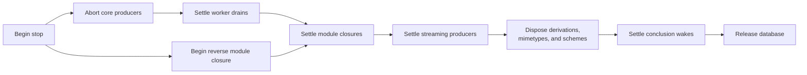

| Setup function | Contract |
|---|---|
| `registerRuntimes([{ decl, executor, availability, scheme? }, ...])` | Validates the complete canonical tag set under {§executor-runtime-declaration}, then publishes every process-wide executor and optional claimed scheme facet atomically. |
| `registerScheme(name, handler)` | Adds one process-wide addressable scheme handler; scheme readiness and model-facing capability publication remain core-owned. |
| §module-action-registration `registerModuleAction({ name, scope, inputSchema, outputSchema, handler })` | Adds one non-empty, extension-unique action with resolvable JSON Schemas. `scope` is exactly `worldless`, `workspace`, or `worker`; the handler receives schema-validated params and a separate matching context. Scoped contexts contain trusted bound identifiers, never client parameters. A client-interface module decides whether and how the name becomes public, validates successful output, and owns collisions with its built-ins. |
| §module-worker-provider `registerWorkerCapabilityProvider(namespaceOwner, provider)` | Registers one extension-unique Functionality provider. `activate({ workspaceId, workerId, retain })` reconstructs that worker's effective snapshot; idempotent `deactivate({ workspaceId, workerId })` releases its process-local resources. Core coalesces activation and cooling, publishes complete private documentation before use, and supplies `retain()` so provider work that outlives its caller holds an idempotently releasable residency lease. Dormant workers perform no provider work at boot. |
| §module-worker-state `readWorkerModuleState(workerId, namespaceOwner)` | Reads the provider's one nullable JSON state value for one worker. Core owns worker isolation and storage; the provider owns and validates its schema. Secret values are forbidden when a durable symbolic reference can identify their authoritative source. |
| §module-functionality-adapter `registerFunctionalityAdapter(adapter)` | Registers one family of managed Functionality beneath the shared coordinator ({§functionality-coordinator}). The adapter owns protocol truth; the coordinator owns lifecycle, durable state, publication, and both projections. |
| §module-worker-capabilities `replaceWorkerCapabilities({ workspaceId, workerId, namespaceOwner, state, runtimes })` | Replaces one provider's complete durable state and runtime/scheme snapshot for one worker at a quiescent workspace-operation boundary. Core validates worker membership and base/peer namespace claims before mutation, commits the snapshot, and reconciles that worker's private pull docs as one operation. Failure restores the prior state and presentation. The empty runtime set removes that provider from the worker's Functionality. |

§module-worker-quiescence **A worker's Functionality snapshot changes only
between workspace operations.** A replacement attempt while a turn or another
capability mutation owns the workspace fails 409 instead of waiting behind an
unbounded proposal. Candidate discovery may occur before the gate, but the
provider must re-check its old connection for active user work after acquiring
the gate. Infrastructure-owned watches may be cancelled during replacement;
an active request, input exchange, or Task keeps the old snapshot authoritative
and makes replacement fail 409. The workspace-wide gate is an atomicity
boundary, not ownership: only the addressed worker's snapshot changes. A Worker's
own accepted Functionality mutation is the one replacement that waits instead of
failing: it queues fairly behind the turn that raised it and publishes at that
turn's boundary ({§functionality-model-mutation}). Two publications take no
gate of their own because their demand already holds whatever applies: a
Worker's activation (demanded from a client action, an operation, or a child's
turn inside its parent's held lineage) and a family's turn-admission refresh
({§skills-hotload}), which republishes inside the turn it is admitting. The
three modes are explicit at the host boundary — `try` (409 while held),
`wait` (queue behind the holder), `none` (publish within the demand) — and
nothing else may choose `none`.

§module-worker-inheritance **Functionality inherits by value.** Creating a
child copies every parent `worker_module_state` row into the child in the same
database transaction. Parent and child thereafter mutate independently;
activation reconstructs each worker's own snapshot and generated references.
Workers that merely share a workspace never share enabled Functionality.

§module-worker-residency **Persistence is not residency.** Model execution,
capability-aware client reads and operations, worker module actions, and
provider work retained through the setup context hold that worker's Functionality
resident. Daemon boot, workspace or worker creation, attachment, listing,
renaming, an idle client, and durable queued or parked state do not. After the
final lease releases, core keeps the complete snapshot warm for
`PLURNK_SERVICE_WORKER_WARM_MS` (default `900000`) while an idle LRU keeps at
most `PLURNK_SERVICE_WORKER_WARM_MAX` (default `2`) lease-free workers.
`0` disables the respective grace or idle allowance; `-1` disables that bound.
Only lease-free workers cool. New demand cancels pending cooling or waits for
in-progress cooling before one coalesced reactivation.

Cooling runs at a quiescent workspace-operation boundary. It deactivates every
provider for that worker, withdraws its ephemeral executor and scheme snapshots,
and evicts its passive process caches; durable workspace, worker, history,
module-state, and reference-entry rows remain unchanged. Client connection
presence and naming never participate in this lifecycle. Shutdown cancels warm
timers and closes all still-resident provider resources through their module
owner.

The version-1 baseline table `worker_module_state` stores one JSON value per
`(worker_id, namespace_owner)`. It is not an alternate registry: executable and
resource presentation always comes from the in-memory snapshot reconstructed by
the registered provider. Deleting a worker cascades its state; child creation
applies {§module-worker-inheritance}.

### §functionality Worker Functionality: one lifecycle above every family

§functionality-coordinator **Core owns one coordinator above every family
adapter.** Agent Skills, MCP servers, and outbound A2A agents are families of
managed Functionality. Each family registers one adapter
({§functionality-adapter}); the coordinator owns the common lifecycle —
`list | discover | add | enable | disable | remove` — its durable per-Worker
state ({§functionality-state}), serialization per Worker and family, atomic
publication ({§functionality-publication}), and both projections: worker-scoped
client actions `worker.<family>.<verb>` and one generated executor family per
Worker ({§functionality-model-projection}). An explicit client action and an
accepted model proposal converge on the same coordinator method; no family
invents a third management grammar, configuration path, proposal policy, or
hotload mechanism.

Problem retryability is never inferred from numeric status. A coordinator
failure names `retryable` only when its owning condition establishes whether an
identical automatic replay is valid; in particular, absent Worker residency
requires activation and is non-retryable as submitted.

| Verb | Common contract |
|---|---|
| `list` | Project every definition with its origin, desired enabledness, and current state — `disabled`, `active`, `unavailable` with its exact Problem, or `authorization-required` — without exposing credentials. |
| `discover` | Inspect a query or source and return inert candidates with provenance. Discovery never installs, persists, enables, executes, or widens authority. |
| `add` | Admit one exact definition through the adapter, persist it as a worker-origin definition, prepare it, and enable it atomically. A worker definition may shadow a same-alias service definition; a second worker definition for one alias is a 409 collision. |
| `enable` | Prepare and publish one available definition; re-enabling an unavailable one retries its preparation. |
| `disable` | Withdraw the effective capability while keeping the definition available and client-visible. |
| `remove` | Disable and forget the Worker's own definition; a same-alias service definition becomes visible again, disabled. Service definitions are disable-only. |

§functionality-adapter **An adapter owns protocol truth and nothing else.** It
declares its family (the action segment and EXEC tag), its one namespace owner,
the exact definition schema one `add` accepts, its service-contributed
definitions with their default enabledness, inert discovery, admission of an
authored definition — told whether a client action or a model operation authored it, so a
family may bound the model's authority ({§members-model-scope}) — two-phase preparation of
the enabled set, and teardown.
Preparation returns the family's runtimes, its generated documents, one outcome
per enabled alias, and a snapshot with `commit`/`abort`; the coordinator
never tears down a previous snapshot behind the adapter — it commits after a
successful publication, aborts after a failed one, and tears down only on
deactivation. Protocol continuations (an OAuth completion, an input-required
answer) remain adapter-registered actions beneath the common grammar. An
adapter may declare `forget`: before the coordinator forgets a Worker-origin
definition on `remove` it lets the adapter release what that definition
installed or provisioned ({§skills-remove}); a failed release rejects the
removal and changes nothing.

§functionality-state **One durable value per Worker and family.** The
coordinator stores `{ version: 1, definitions: { [alias]: { origin, enabled,
definition? } } }` in `worker_module_state` under the adapter's namespace
owner. A `service` alias persists only its enabledness; a `worker` alias
persists its exact definition. Enabledness is durable desired state; active,
unavailable, and authorization-required are the current preparation outcome.
Inheritance by value is the table's own birth snapshot
({§module-worker-inheritance}); service, user, project, and client configuration
contribute available definitions and defaults but are never the live effective
authority.

§functionality-publication **One replacement publishes a family.** The
coordinator prepares the enabled set, then replaces the family's state and
runtimes — the family's manager runtime first, the adapter's capabilities after
it — in one {§module-worker-capabilities} call, so admission, generated
documentation, resources, effects, Turn 0, client status, and teardown derive
from one committed snapshot. A failed replacement aborts the preparation and
keeps the previous snapshot authoritative. Mutations serialize per Worker and
family; shutdown — and any caller that must observe a boundary publication
before acting, through `settleFunctionality` — settles every queued
publication before closing the database.

§functionality-documents **A family's generated documents travel with its
snapshot.** Preparation may return documents addressed relative to the
Worker's generated subtree ({§worker-generated-subtree}); the coordinator
contributes them to the Worker's reference entries so they reconcile with the
same `_plurnk` materialization as every other generated document. The model
surface is silent until active (operator ruling, #333): a disabled or
enabled-but-unavailable definition publishes no document and no Turn 0 row —
the hot path carries only working capability, never "a thing you cannot do."
An unavailable definition's exact Problem stays reachable on demand: the
family's `list` verb returns it and invoking the alias is rejected with it.

§functionality-model-projection **The model face is a generated executor
family per Worker.** Every activated Worker publishes, for each registered
family, one executor tagged with the family name whose registered targets are
exactly the six verbs; its documents render through
{§tools-resource-materialization} like every family, so the model learns the
manager from `_plurnk/plurnk/<family>.md` and never from hand-written
teaching. That document lists the six verbs in lifecycle order and teaches the
definition from the family's own schema — one exact `add` example and a table of
every field with its type, requirement, and meaning — and carries the family's own
`discover` contract when the generic one does not fit; the model composes an `add`
from the document alone, without a probe. `list` and `discover` are `read` effects and run ungated; `add`,
`enable`, `disable`, and `remove` are `host` effects and propose through
the ordinary Exec proposal lifecycle. A verb's JSON outcome streams into the
family's output entry. `ExecArgs` carries no Worker identity, which is why
the manager is published per Worker rather than once.

§functionality-model-mutation **An accepted mutation publishes at its turn
boundary.** The verb runs inside the turn that raised it, which holds the
workspace; the coordinator persists desired state and prepares immediately —
so the result reports `active`, `unavailable`, or `authorization-required`
— and a failed preparation publishes an enabled-but-unavailable outcome rather
than rejecting. Publication queues behind that turn in the family's serialized
lane and settles before the Worker's next operation or packet. An explicit
client action instead publishes now, rejects a failed preparation, and fails
409 while the workspace is held ({§module-worker-quiescence}). Rejecting a
proposal prepares, persists, and publishes nothing.

### §methods ApplicationPort function set

`ApplicationPort` is the contracts-owned interface implemented by `Daemon` and
consumed by every exterior adapter ({§application-port}). Its function names are
transport-neutral library calls, not public wire names; this table specifies
Core's behavior behind them.

| Area                                              | Function | Core contract |
|---------------------------------------------------|----------|---------------|
| §methods-event-subscribe Events                   | `subscribeToEvents(handler) -> unsubscribe` | Subscribes to the raw event source in {§notifications}. A subscriber failure is logged and cannot re-enter engine control flow. |
| §proposal-list Proposals                          | `pendingProposals(workspaceId)` | Intersects durable proposed rows with the lifecycle owner's live resolution waiters, then returns their validated {§proposal-projection}; persistence alone cannot advertise an unresolvable client interrupt. |
| §methods-proposal-resolve Proposals               | `resolveProposal(logEntryId, resolution)` | Validates and delivers one accept, reject, or cancel decision to the engine. An unknown or already-resolved id fails; the client protocol owns how the decision arrived. |
| §client-interaction-list Client interactions      | `pendingClientInteractions(workspaceId)` | Intersects durable interaction rows with their live operation waiters and returns the contracts-owned projection; a row alone is not a resumable interaction. |
| §methods-client-interaction-resolve Client interactions | `resolveClientInteraction(interactionId, resolution)` | Validates and delivers one resolved payload or cancellation. Unknown, ownerless, and already-resolved identities fail before affecting an operation. |
| §methods-loop-run Loops                           | `runLoop({ workspaceId, workerId, prompt, source?, maxTurns?, policy?, openPaths?, selector?, childSelector? })` | Validates a model worker and complete loop policy, persists it with the effective turn ceiling, then returns an immediate status-100 acknowledgement with `loopId` and `action`. A trusted adapter may identify the prompt's causal actor with one canonical `source`; ordinary clients cannot author it through their protocol surface. The exact terminal result arrives only through `loop/terminated`; parking and resuming do not replace the loop. |
| §methods-loop-cancel Loops                        | `cancelDrain(workerId, reason?)`; `cancelWorker({ workspaceId, workerId, reason? })` | `cancelDrain` begins durable structured cancellation and reports whether process-local work existed when called; queued or parked durable work is still terminalized when it is `false`. The ownership-bounded `cancelWorker` awaits that same tree cancellation and stream reap, so an exterior protocol can project the settled durable result without polling or fabricating state. |
| §methods-op-mirror Client dispatch                | `dispatchClientAction({ workspaceId, workerId, functionalityWorkerId, statements })` | Dispatches already-parsed grammar statements as one client action in one administrative loop in the client worker, executing in the attached Worker's Functionality ({§actor-boundary-attached-functionality}). Every statement is an ordered client/operation turn, and every committed `log/entry` is emitted before the action promise resolves; a proposal may keep its turn, loop, and action promise open until resolution. Core exposes no per-op method family. |
| Client observation                                | `look({ workspaceId, workerId, functionalityWorkerId, statement })` | Runs an already-parsed READ through the full resolver in the attached Worker's Functionality without a log row. A non-READ statement is rejected ({§op-look}). |
| §methods-log-read Reads                           | `readLog({ workspaceId, workerId, ...coordinate })` | Ownership-checks the worker, then reads by ids, recency, or the complete `loopSeq`/`turnSeq`/`sequence` display coordinate. `limit` defaults to 100 and is capped at 1000. |
| §methods-entry-read Reads                         | `readEntry({ workspaceId, workerId, target, channel?, offset? })` | Resolves the selector from that worker's perspective and returns {§entry-read-result}, either complete or as one channel suffix, without creating action evidence. |
| Providers                                         | `listProviders()` | Lists configured aliases with provider/model identity, active state, and the effective provider-derived `inputCapacity` when known. |
| Model catalog                                     | `listModels(query)` | Returns one validated bounded {§model-catalog-wire} page under {§model-catalog}; performs no provider request or selection. |
| Client capabilities                               | `listClientDisplayCapabilities()` | Composes sorted scheme declarations ({§manifest-client-display}) followed by sorted MIME declarations ({§mimetype-client-display}) into the validated shared wire ({§client-display-capabilities}). The internal `exec` operation handler is excluded; its addressable runtime-tag scheme faces remain included. |
| §methods-workspace-create Workspace lifecycle     | `createWorkspace({ name?, projectRoot?, settings? })` | Validates `settings` through {§operator-config-workspace-settings}, creates the world and its client envelope, and emits global `workspace/created`. Creation and attachment are passive: neither starts derivation nor activates worker Functionality. `projectRoot` is established here or the workspace remains headless. |
| §methods-workspace-attach Workspace lifecycle     | `attachWorkspace({ workspaceId, workerId?, workerName? })` | Validates ownership and returns a client envelope for an existing world. It does not retain caller or transport binding state in core. |
| §methods-model-worker Workspace lifecycle         | `ensureModelWorker(workspaceId)` | Returns the workspace's stable default model worker, creating it on first use. A durable default-conversation role identifies it independently of worker name and root creation order. Repeated and concurrent calls return the same root; fresh conversations and forks do not replace it. |
| §methods-conversation-worker Workspace lifecycle  | `createConversationWorker({ workspaceId, name? })` | Creates a distinct model-origin root worker with empty private history: a fresh conversation over the same world, not a fork or the stable default. |
| Workspace lifecycle                               | `forkWorker({ workspaceId, workerId, name? })` | Creates a child worker that branches the source worker's history while sharing workspace state. |
| §methods-workspace-rename Workspace metadata      | `renameWorkspace(workspaceId, name)` | Changes only the world's unique mutable name; workers, log, and membership remain intact. |
| §methods-workspace-prompts Workspace metadata     | `listPrompts(workspaceId, limit?)` | Returns nonempty loop-seed prompts from the workspace's model-origin root conversations, newest-first. The positive limit defaults to 100; spawned and forked child prompts are excluded. |
| Workspace metadata                                | `listWorkspaces()`, `workspaceDerivationStatus(...)` | Reads current workspace identity and derivation progress. |
| §methods-worker-read Worker topology              | `readWorker({ workspaceId, identity })` | Ownership-bounds an exact id-or-name lookup and returns one durable Worker projection or `null` under {§application-worker-observation}. Supplying both identities or neither is invalid. |
| §methods-worker-list Worker topology              | `listWorkers(workspaceId, query?)` | Returns the workspace's durable Worker projections under {§application-worker-observation}. The origin filter is exact; an explicitly present `parentWorkerId` filters roots (`null`) or one immediate parent (id), while omission returns every lineage position. |
| §methods-worker-loops Loop lifecycle              | `listWorkerLoops({ workspaceId, workerId })` | Ownership-checks the Worker and returns its Loops in sequence order under {§application-loop-observation}, including the validated exact terminal result when one exists. It performs no scheduling or event replay. |
| Extension actions | `listModuleActions()`, `invokeModuleAction(name, params, context)` | Lists setup-registered `{ name, scope, inputSchema, outputSchema }` descriptors in sorted order. Invocation requires a context matching the registered scope; missing names, forged scope, and missing workspace identity fail before the owner runs. Handler values remain opaque to core. |

§methods-loop-run-fold-consistency **A folded prompt cannot silently reconfigure
its loop.** When `runLoop` targets an active or 202-parked loop, core appends the
prompt to that same loop and returns `action: "injected_next_turn"`. Configuration
already durable on the loop remains authoritative:

| Requested input       | Omitted                                              | Equal to the durable selection | Different from the durable selection |
|-----------------------|------------------------------------------------------|--------------------------------|--------------------------------------|
| Provider/model        | The resolved request selection must still agree.     | Fold.                          | 409 provider conflict.               |
| `maxTurns`            | Keep the durable ceiling.                            | Fold.                          | 409 turn-ceiling conflict.           |
| Partial `policy`      | Keep the complete durable loop policy.               | Fold.                          | 409 policy conflict.                 |

The conflict names both selections and directs the caller to cancel or conclude
the loop before changing configuration. A newly enqueued loop instead persists
the requested configuration normally.

§methods-loop-run-open-paths **Workspace paths are core-owned context reads.**
`openPaths` belongs to the prompt frame submitted by the client. The client
sends paths, never duplicated file bytes; core dispatches one ordinary
`plurnk`-origin READ per path from inside the owning workspace, and successes
and failures surface through the normal operation-result contract.

| `runLoop` disposition | Prompt-frame and path behavior                                                                    |
|-----------------------|---------------------------------------------------------------------------------------------------|
| New loop              | Persist with the initial frame; publish the frame and READ its paths on turn 1.                    |
| Active loop           | Persist with the injected frame; publish the frame and READ its paths together on the next turn.  |
| Parked loop           | Persist with the waking frame; publish the frame and READ its paths together on the resumed turn. |

If an undelivered frame is promoted into subsequent work under
{§prompt-loop-containment}, its selected paths travel with it.

§methods-rebind **Binding belongs to the client-interface module.** Core's
workspace lifecycle calls return exactly the workspace and selected client actor
(`workspaceId`, `workspaceName`, `projectRoot`, `workerId`, `workerName`); they
carry no conversation-worker or action-loop binding. Core retains no connection,
thread, or current-workspace mapping. A module may replace its own binding with a
later create or attach result without requiring a new transport; it resolves the
conversation worker separately, while each client action allocates its own
administrative loop under {§connection-lifecycle}.

§methods-worker-name-reserved **Client worker-name admission.** Attach,
fresh-conversation, and fork apply {§worker-name-minting} before lookup or
creation. A client therefore cannot forge or resume an internal worker, insert
a non-mintable spelling, or make the client registry diverge from model worker
control.

§capability-admission **One admission path owns external authority.** Core
derives one or more `CapabilityDescriptor` demands from each routed statement,
then evaluates the service, workspace, immutable worker-bound, mutable worker,
and loop policy layers in that order. Every demand of a composed operation must
survive before execution or proposal creation. A denial is an exact terse 403
identifying the denied descriptor and owning policy scope; it never guesses the
model's intent or recommends an alternate operation. COPY demands observation
of its source and mutation of its destination; MOVE additionally demands
mutation of its source; resource-backed EXEC demands its runtime plus source
observation. Unknown schemes, runtimes,
and tools continue to their ordinary resolver so capability policy cannot turn
absence into a misleading restriction. The same resolver shapes generated
resource examples, worker tool documents, and Turn0 surveys. PLAN, OPEN, FOLD,
log KILL, and targetless SEND are log/program control rather than routed
external demands and therefore remain outside capability selectors.

§worker-settings **The worker carries its own behavioral rules.** The
workspace is the world — how things are; each worker is an actor inside it,
carrying the rules its loops obey. Those rules live in one JSON bag
(`workers.settings`), declared by the client at worker creation and mutable
between loops through `readWorkerCapabilities`/`setWorkerCapabilities`; the
public operation is specifically capability-shaped rather than exposing the
internal persistence bag. Input is validated at the client boundary, and
unknown keys never persist. A fork begins with a default empty mutable bag, but
its immutable `capability_bound` captures the delegating actor's effective
authority under {§worker-delegation-inherits-policy}. Service and workspace
policies remain live ceilings; worker and loop policies may narrow but never
widen them. Malformed persisted settings or bounds fail at their owning reader
with the worker coordinate and cause rather than silently granting defaults.

§worker-capability-inspection **Client inspection uses the admission
resolver.** The Worker capability actions return the contracts-owned
`CapabilityProjection` {§capability-policy-projection}: service, workspace, immutable Worker bound, mutable
Worker policy, and their normalized effective intersection. The projection is
computed by the same resolver used by dispatch and packet shaping. Changing
the mutable layer returns a fresh complete projection, so a client cannot
mistake a requested widening for effective authority.

§question-tool **The native request-user-input tool.** Core registers one
in-process `question` runtime at boot. Its body is the MCP2 2026-07-28
form-elicitation shape verbatim — `{ message, requestedSchema }` — and its
`results` channel carries the standard `ElicitResult`
(`{ action: "accept", content }` or `{ action: "cancel" }`); nothing bespoke
crosses the wire. The executor maps the body onto the contracts-owned
`ClientInteractionRequest` (toolName `question`) and awaits the shared
client-interaction lifecycle — durable pause, reconnect discovery,
cancellation, and the answer-as-resolution all come from
{§client-interactions}; there is no loopback MCP and no proposal masquerade.
Effect `read`: the tool observes the human's answer and is never
proposal-gated. Its runtime declares the `interaction` trait, which the shared
resolver projects as access class `interact`; any capability-policy layer may
therefore admit or deny it without a question-specific switch.

§worker-tool-admission **Tool visibility and execution share admission.** The
reserved tool tree's FIND/READ faces drop a runtime or tool document whenever
the effective worker-level capability layers deny its descriptor, before
matching and rendering, so counts, weights, and catalog text agree. Turn0
applies its loop layer to the same catalog projection. Dispatch evaluates that
same descriptor and policy cascade at the operation boundary, never at
registration; there is no separate per-tool availability system.

§model-catalog **Model discovery is a bounded local projection, not provider
activity.** Core composes the release-pinned Models.dev snapshot with
provider-owned `{§model-catalog-readiness}`. The default query includes only
providers configured enough to attempt; `availability: "all"` includes every
catalog model with structured missing-configuration causes. Provider and text
filters apply before deterministic selector ordering and offset/limit paging;
the default page is 50 and the schema caps it at 100. Discovery never probes,
authenticates, invokes, or selects a model, and catalog data never enters model
packets or state snapshots.

§worker-model-selection **Worker-owned model selection.** Every model worker
owns one durable model, persisted as a nullable `model_routes` foreign key.
The root conversation worker is seeded once — from an explicit selection, else
the daemon default — and never re-seeded from a later default change. A
deliberately modelless daemon leaves the worker unset and rejects model work
until an explicit selection. Starting a loop snapshots the worker's resolved
model onto the loop; inject, park, wake, retry, reconnect, and restart
continue from the loop snapshot and never re-resolve through the alias
cascade. A WORK/FORK child copies the spawning loop's effective spawn model
(spawn override ?? model) onto the new worker by value at creation; it retains
no live link and begins with no override, so a later parent change affects
only that worker's future loops and descendants. Client operation actors and
Plurnk-owned bookkeeping workers run no model loops and own no model
selection. An explicit selection or spawn-override change while the worker
holds a live or parked loop is a precise `409 worker-loop-active`, never a
silent retroactive switch of the immutable loop snapshot; select after
concluding or cancelling the loop.

A client-created branch copies the source worker's durable model, spawn
override, and reasoning policy by value alongside its history. It retains no
live policy link to the source worker.

§worker-reasoning-policy **Reasoning is a durable worker policy.** Each selected
worker model has exactly one member of the shared `{§reasoning-policy-wire}`;
a modelless worker has none. A declared alias's scoped environment value—or the
global provider value for an exact route—seeds the policy only when the worker
first receives its model. Model identity and reasoning
policy are persisted atomically, while visibility of returned reasoning and
token ceilings remain separate concerns. An explicit policy change validates
the exact policy against both the worker model and its optional spawn model and
is refused while the worker owns a live or parked loop. Client inspection
returns the supported-policy intersection of those two routes. Inspection or
mutation materializes the daemon-default model and policy onto an uninitialized
model worker before answering; a deliberately modelless daemon remains unset.

Starting a loop snapshots the worker's policy beside its model. Restart, retry,
park, wake, and injection retain that immutable snapshot. WORK, FORK, and BARE
inherit the spawning loop's policy by value; no descendant consults a later
environment or parent-worker change. Unsupported policies fail with a precise
provider-boundary problem rather than being silently weakened or translated.

§methods-loop-run-model **Per-loop model selection.** `runLoop` accepts one
optional `selector`: either a declared alias or an exact `<provider>/<model>`
route. An exact route stores no fabricated alias and receives no alias-scoped
configuration. An explicit selection persists onto the
addressed worker before the loop snapshots it; an omitted selector is not a
selection and continues the worker's durable model
({§worker-model-selection}). The fully resolved provider identity and reasoning
policy are persisted on the loop and remain immutable through turns, parks,
wakes, and restart ({§worker-reasoning-policy}).
Injecting into an existing loop with a conflicting explicit selection fails
before work is accepted. Provider instances are cached; no resume path
substitutes a boot default for missing or malformed durable selection.

§methods-loop-run-child-provider **Child-provider selection is one durable
subcall policy.** Optional `childSelector` uses the same alias-or-exact-route
vocabulary for every WORK/FORK descendant and BARE inference; omitted uses
`PLURNK_MODEL_CHILD`, while explicit `childSelector: null` means inherit. An
explicit override persists onto the addressed worker before the loop
snapshots it; an omitted selector continues the worker's durable override
({§worker-model-selection}). Core persists the resolved policy on each loop. A
child runs on the spawning loop's effective spawn model and carries the same
policy deeper; inherit uses the spawning loop's provider and remains inherit.
BARE consumes the selection without spawning a child. Packet admission is
unchanged: a smaller WORK is valid when its packet fits, and an oversized
inherited FORK terminates through the ordinary child-loop result without
preflight assembly or provider fallback.

§methods-log-coordinate **Log coordinate.** Every `LogEntry` returned by
`readLog` or emitted through `log/entry` carries `loop_seq` and `turn_seq`
beside database ids, so a client can render and resolve the logical `L/T/S`
coordinate without fetching all rows and matching locally.

§methods-log-entry-wire **Log entry wire fidelity.** `readLog` and `log/entry`
preserve causal `source` and parse the row's JSON `attrs` into structured data;
they also project the row's complete sorted `tags` classification. Client
interfaces do not reconstruct these fields from operation or origin.

§methods-readable-reasoning **Readable provider reasoning remains derived
provider evidence.** On the model SEND row only, `readLog` and `log/entry`
project a nonempty admitted `packet.assistant.reasoning` as the optional
`reasoning` field. The durable packet remains the sole stored representation;
core does not copy readable reasoning into log attributes or bodies. A turn
without readable reasoning omits the field.

§op-look **LOOK ownership.** A client-interface module owns the public LOOK
spelling and grammar parsing. It rewrites a valid LOOK statement to READ and
hands the AST to core's `look`; core owns the full resolver and the no-log
invariant. The internal closed, rowless observation segment supplies an honest
numeric loop coordinate for relative `log:///` addressing without leaving
active lifecycle behind. LOOK text anchors resolve through the same
{§line-anchors} path as READ.

### §notifications Core events

| Event                                                        | Payload | When fired |
|--------------------------------------------------------------|---------|------------|
| §notifications-log-entry-notify `log/entry`                  | `{ entry: LogEntry }` | A non-proposed `log_entries` row is committed, or a proposed row reaches terminal settlement under {§proposal-proposed-hidden}. Delivery completes before a later event may terminate the owning Loop. |
| §notifications-loop-terminated `loop/terminated`             | `{ workerId, loopId, result, hitMaxTurns, turnIds, usage: { accounting, curationWeight, curationBudget, contextTokens, contextCapacity, meta }, attributions }` | One loop reaches a terminal state. `result` is the exact universal operation result, including its RFC 9457 Problem Details on failure. `accounting` is the loop's contracts-owned {§provider-accounting}; the two curation facts and two physical-context facts follow {§tokenomics-client-gauge}; `meta` is that turn's opaque provider bag. `attributions` is the sorted union of exact provider-request evidence ({§attribution}), separate from accounting. Worker and loop are an inseparable owning coordinate. |
| §notifications-loop-packet `loop/packet`                     | `{ workerId, loopId, packetCount }` | One provider packet becomes durable. `packetCount` is the exact count of packet-bearing turns in that Loop; packetless producer turns and physical provider retries never contribute. |
| §notifications-loop-proposal `loop/proposal`                 | contracts-owned `ProposalProjection` | Dispatch pauses on a durable 202 proposal. `disposition` is the sole authority for whether a client presents review UI; live and reconnect share {§proposal-projection}. |
| §notifications-loop-interaction `loop/interaction`           | contracts-owned `ClientInteractionProjection` | An operation is paused on client input. Live delivery and reconnect discovery share {§client-interactions}; workspace scope remains the event envelope. |
| §notifications-workspace-created `workspace/created`         | `{ id, name, projectRoot }` | A workspace is created. This is the only current global event. |
| §notifications-workspace-branch-batch `workspace/branch-batch` | Branch-batch lifecycle payload | A branch batch enters queued, running, completed, failed, or recovery-required state. |
| §notifications-stream-event-on-channel-change `stream/event` | `{ entryId, workerId, target, channel, state, contentLength, mimetype?, loop_seq?, turn_seq?, sequence? }` | Channel content grows or channel state transitions. `workerId` is the entry owner and read perspective; `target` is its canonical URI. The optional coordinate is copied from schemes whose addresses carry one. Core-managed channel writes include the current stored `mimetype`, which may change per call ({§channel-mimetype}); the generic plugin notification capability does not require it. It carries metadata, not content; consumers read bytes from the stated worker perspective. |
| §notifications-stream-concluded `stream/concluded`           | `{ entryId, workerId, target, subscriptionId, scheme, result, summary, wakeAction, wakeLoopId?, loop_seq?, turn_seq?, sequence? }` | A subscription closes. `workerId` identifies the entry owner; `target` is its canonical URI. The optional coordinate is copied from schemes whose addresses carry one, so clients never parse it back out of `target`. Exact result truth is preserved; `wakeAction` records whether core resumed a parked loop, folded into an active loop, skipped an aborted/cancelled worker, or found no loop. |
| §notifications-notice-event `notice/event`                   | `{ workerId, loopId, notice: Notice }` | A transient observation or progress notice occurs. `workerId` owns loop activity; only workspace derivation progress uses `null` with `loopId=0`. It cannot alter durable history, scheduling, recovery, or model-visible failure truth. |
| §notifications-reasoning-event `reasoning/event`             | `{ workerId, loopId, turnId, modelCallId, requestSequence, phase, delta? }` | A main emission call exposes readable reasoning. Each physical request that emits reasoning owns a distinct positive `requestSequence` and balanced start/content/end stream; opening a retry closes the preceding stream before any retry delta. Only content carries a nonempty exact delta. It is transient presentation evidence, never a log row, Notice, packet field, or BARE/child channel. The settled provider response remains the durable authority. |

§notifications-stream-event-failure-isolation The plugin-facing
`NotifyCaps.streamEvent()` remains a synchronous advisory call while core
resolves its entry identity asynchronously.

| Condition                         | Outcome                                                                                         |
| --------------------------------- | ----------------------------------------------------------------------------------------------- |
| No notifier is configured         | Synchronous no-op; no lookup is scheduled.                                                      |
| The entry vanishes before lookup  | No event.                                                                                       |
| Entry and notifier remain present | One `stream/event` is emitted.                                                                  |
| Lookup or notifier throws          | Daemon diagnostics receive the complete cause; no rejection or engine-state transition escapes. |

§notifications-envelope-carries-workspaceid **Event scope is explicit.**
`subscribeToEvents` supplies `(workspaceId, event, payload)`: `workspaceId` is
the authoritative scope and is `null` only for a global event. Core does not
mutate each payload to repeat it. A transport module stamps that scope onto any
outward envelope that requires it and owns workspace fan-out.

### §connection-lifecycle Client action evidence

A module client is an actor ({§machine-processes}). Its dispatched side effects
write to its own client worker with `origin="client"` and execute in the
Functionality of the Worker the client is attached to
({§actor-boundary-attached-functionality}); one client action owns
one administrative loop, and its statements become ordered operation turns
inside that loop. A proposal may hold its turn and loop across an external
interrupt/resume, but those records preserve durable evidence rather than
defining the public client lifecycle. Multiple client actors have distinct workers.

`runLoop` targets a separate model worker holding the conversation with
`origin="model"`. Both workers share workspace state, while a packet renders
only the model worker's private log; client action rows are structurally absent
without an origin filter ({§actor-boundary-isolation}).

### §versioning Versioning

The typed module seam is released with the service package. Core exposes no
runtime version or update-advertising action. External protocol compatibility
and any protocol-level version negotiation belong to the client-interface
module that publishes that protocol.

---

## §decisions Architectural decisions

Tagged decisions state the durable contract and the reason for it. Investigation,
implementation status, and superseded alternatives belong in forge issues.

### §packet-assembly Packet assembly: engine builds the default list, plugins transform it

`PacketBuilder.buildRequestPacket` owns the engine's default ordered section
list. Trusted scheme plugins may transform that first-class list before it is
rendered or measured; {§overflow-turn} remains an engine-owned post-build rail.

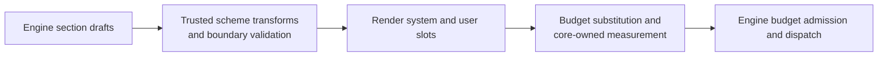

#### §packet-cache-monotone Default order and cache locality

Conditional absence never reorders the surviving default sections.

| Order | Slot   | Section               | Wire contract |
|------:|:-------|:----------------------|:--------------|
|     1 | system | `definition`          | Framework definition; leads the most stable prefix. |
|     2 | system | `system-policy`       | Operator policy; empty content is omitted on the wire. |
|     3 | system | `project-policy`      | Project policy; empty content is omitted on the wire. |
|     4 | system | `schemes`             | Active resource catalogue. |
|     5 | system | `inject`              | Present only when operator notes are configured. |
|     6 | user   | `log`                 | Append-mostly model-visible history. |
|     7 | user   | `child-streams`       | Per-turn status; empty content is omitted. |
|     8 | user   | `child-workers`       | Per-turn status; empty content is omitted. |
|     9 | user   | `parent-worker`       | The worker's parent by name; omitted for a root worker. |
|    10 | user   | `errors`              | Per-turn failure pointers; empty content is omitted. |
|    11 | user   | `notices`             | Per-turn observations; empty content is omitted. |
|    12 | user   | `git`                 | Per-turn workspace status; empty content is omitted. |
|    13 | user   | `budget`              | `Context Token Budget`; omitted when capacity is unknown. |
|    14 | user   | `prompt`              | Current prompt-entry pointers. |

The order favors prefix-cache locality where semantics permit: the definition
and privileged policy lead the resource directory, while the append-mostly
log leads the volatile user-status clump. It does **not** claim that every system byte is
immutable or that the complete packet is globally monotone in volatility:
capabilities, operator notes, and policies can change. Trust is a separate
admission rule. The system slot contains trusted control-plane material;
attacker-reachable content stays in the user slot.

#### §packet-plugin-transform Trusted whole-list extension seam

`SchemeRegistry.transformSections` pipes the complete default list through
every registered scheme implementing `transformSections(sections) -> sections`,
in registration order, before rendering and measurement. The schemes-owned
`PacketSectionDraft` contains only `name`, `slot`, `header`, and `content`.
Each initial or returned list passes the schemes-owned validator, including
unique-name enforcement, before the next transformer or renderer. Each
transformer may inspect the section content and add, remove, or reorder
sections. It receives no separate engine, database, actor, or request context.

This is strictly a trusted in-process seam, admitted through the common plugin
trust gate; an external client action cannot invoke it. Whole-list transformation is
the fork-avoidance valve for alternate packet shapes ({§ecosystem}), while
overflow recovery and folding remain closed engine concerns.

### §tokenomics Tokenomics: four facts, one curation ruler

Token accounting distinguishes the artifact being measured, the unit, and the
time of measurement.

| Fact | Owner and unit | Time | Contract |
|:-----|:---------------|:-----|:---------|
| Core curation weight | `contentWeight = ceil(chars/2)` over channel content, canonical log bodies, and rendered packet slots | Write/build | Stable, model-independent pressure and OPEN/FOLD savings; never a tokenizer claim. |
| §tokenomics-context-envelope-admission Provider input capacity | Provider model limits and configured total output envelope, in provider tokens | Before every logical request | `min(maxInputTokens, contextWindow - outputBudget)` over the known terms. The provider alone measures the complete request and admits, defers, or rejects it. |
| Provider generation envelope | Provider total output budget and optional reasoning subset, in provider tokens | Before every logical request | One total output budget includes hidden reasoning. A reasoning budget is a strict subset, never an additive reserve. |
| Provider usage and cost | Provider-reported input/output/cache/reasoning tokens and monetary evidence | After every physical request | Durable physical-request forensics under {§provider-usage}; never curation state or a preflight estimate. |

- §tokenomics-weight-stored-at-write **Curation weight, stored at write.** `entry_channels.weight` weighs the complete channel content. `log_entries.weight` weighs the complete canonical `LogBody` content before coordinate and packet presentation; persistence `tx`/`rx` envelopes contribute nothing merely by existing, and proposal settlement recomputes the value when the canonical result changes. Bodyless rows therefore weigh zero. The stored number is a stable content-depth measurement, not a provider-token prediction.
- §tokenomics-render-weight-budget **Packet curation budget.** `tokensActiveTotal` measures the *complete assembled packet* after section transforms and readout substitution; it is not a sum of log-row `tokensActive` fields. Core measures minimum-width probes, monotonically expands fields that do not fit, then right-aligns final values into those widths; final substitution is length-invariant and the displayed total equals the stored request weight. `tokensActiveMax` is the provider-derived curation calibration. A `SUM` of stored content weights measures a different artifact and cannot substitute for packet render weight.
- §tokenomics-context-percent **Curation percent.** `tokensActiveTotal` carries packet weight as a percentage of `tokensActiveMax`. It reads the capacity already resolved by the provider; no extra provider call.
- §tokenomics-window-partition **One capacity derivation; no service-side token budget.** The provider owns model limits and the configured total output envelope. Its resolved `inputCapacity` is the numeric curation-budget calibration as well as the physical denominator exposed to clients. That reuse is policy, not a unit conversion: Core compares stable curation weight with it only to shape context, while provider request-shaped evidence alone admits or rejects I/O. `PLURNK_SERVICE_PROMPT_BUDGET`, `PLURNK_SERVICE_SAFETY`, and the additive reasoning/completion reserve knobs are retired; local and custom deployments tune context window, total output budget, optional reasoning subset, and prompt-projection percentage at their owning layers.
- §tokenomics-prompt-projection-share **Prompt projection is stable packet policy.**
  `PLURNK_SERVICE_PROMPT_PROJECTION` is a required alias-scoped percentage in
  `(0, 100)`. It allocates that share of the provider-derived curation budget to the
  aggregate automatic prompt-body projection. It does not bound stored prompt
  size, provider capacity, an explicit READ/FIND result, or the complete packet.
  Basing the share on the stable ceiling rather than current free weight keeps
  one prompt's projection byte-stable as the worker log evolves.
- §tokenomics-window-unpollable-deliberate **Unknown provider capacity stays unknown.** When the provider cannot derive `inputCapacity`, Core omits denominator-dependent curation telemetry and uses the ordinary bounded prompt projection. The provider still sends requests whose measurement or limits are estimates or unavailable: ambiguity defers to the upstream capacity oracle rather than becoming a local rejection.

§tokenomics-client-gauge **Clients receive curation and physical occupancy as separate pairs.** `loop/terminated.usage` carries latest packet-bearing model-turn `curationWeight`/`curationBudget` and latest-emission-call `contextTokens`/`contextCapacity`; each unknown fact is `null`. Packetless chronology cannot erase an assembled-request gauge. Both physical facts bind to that same call: a preflight rejection may report capacity while its absent physical request leaves `contextTokens=null`, never borrowed from an earlier call. Clients never divide provider-reported physical tokens by Core curation weight. `providers.list` exposes each instantiated alias's `inputCapacity`. A model switch replaces the latest-turn facts together; aggregate provider accounting remains cardinal monetary evidence, not a gauge input.

- **Derivation is exhaustive and demand-led.** Explicit searchable-resource changes may start one coalesced warm. Passive creation and attachment do not. The first model turn starts or joins that warm; later turns derive intervening changes before dispatch. No model operation observes partial graph or vector coverage. A semantic query ranks every eligible candidate in scope, so lexical overlap never gates vector recall. With no embedder, readable-content FTS is the explicit keyword fallback. Progress notices make the wait visible; latency is never hidden by partial semantics. {§derivation-exhaustive}
- §membership-binary-sniff **Binary truth beats the label; no entry dominates the corpus.** A tracked member whose HEAD bytes contain NUL enters {§membership-source-projection} as `application/octet-stream` **regardless of what extension-based detection claims**; byte-level evidence outranks a default label. Every eligible text is tiled losslessly to the embedder window and every tile is embedded before its derivation attaches; semantic ranking max-pools the best chunk per candidate.
- §tokenomics-agnostic-ruler **One model-agnostic curation ruler.** The daemon runs workers on different models in one workspace concurrently, while catalog and log accounting are workspace-wide. `contentWeight = ceil(chars/2)` therefore gives one content one stable number without per-model workspace state or recount passes. It controls curation only; every provider call independently measures the complete request as well as it can.
- §tokenomics-neutral-telemetry **Curation telemetry is state, not response allowance.** The model-facing `Context Token Budget` section begins with exactly two fields on separate lines: `tokensActiveTotal: N (P%)` and `tokensActiveMax: M`. It never presents their difference as free response tokens. The protocol definition directly requires FOLD, KILL, or trimming of irrelevant log items to keep the next packet within the maximum. Per-entry weights remain on log rows where they describe OPEN cost and FOLD savings. Generic packet composition and physical-token speculation are absent.
- §tokenomics-pressure-inventory **Pressure identifies its reclaimable concentration.** When the ordinary two-field packet measurement reaches 80% of `tokensActiveMax`, the budget section may append `YOU MUST FOLD, KILL, or trim superseded, stale, or irrelevant log content.` followed by `Largest Log Items`: at most five currently OPEN, addressed log bodies, ordered by `tokensActive` descending and then `log:///` path. Each item repeats only that row's `tokensBody` and `tokensActive`. Folded and bodyless rows cannot enter the list because FOLD would reclaim no body from them. The largest prefix that fits may be shown; this conditional block never pushes an otherwise admissible packet over its maximum. Its own weight participates in the final fixed-point `tokensActiveTotal`.
- §tokenomics-content-hash-identity **Content identity, not per-tokenizer counts.** Static channel writes stamp `content_hash` (SHA-256) as stable content identity. `weight` is stored beside that content and is never keyed or recomputed by model.
- §tokenomics-provider-usage **Provider accounting is physical-request evidence, not curation state.** Every issued physical request has one durable pre-I/O `provider_requests` identity and settles once as response or error. Each record preserves conventional {§provider-usage} quantities and required {§provider-cost} evidence; an unreported quantity remains absent, including on response-less failures, and is never replaced by zero. `model_calls` own logical response/failure evidence, `turn_attempts` specialize emission admission, and `provider_requests` are the sole durable accounting representation. Emissions, BARE calls, rejected responses, retries, failovers, and errors therefore remain cardinal and ordered. Turn, loop, worker, workspace, digest, and protocol accounting are derived from those records through the shared {§provider-accounting} projection; only emission calls contribute the latest-packet context gauge. The baseline stores no floating-point money, denormalized totals, or rollup triggers. A documented direct charge becomes `charged`; otherwise the provider may compute an exact-decimal USD `estimated` amount from complete usage and the exact model's Models.dev rates; insufficient evidence becomes `unknown`. Derived `costUsd` sums every USD-expressible request and is `null` only when no request is expressible; a response-less failure or an uncataloged model is skipped, never allowed to erase the expressible evidence. The derived aggregate usage sums every reported quantity the same way. This is operational request accounting, not invoice reconciliation. Output and reasoning are quantities the model cannot FOLD, so they never alter the model-facing Budget ledger.
- §tokenomics-negative-pressure **Negative curation pressure is honest but never submitted.** The provisional readout may report `tokensActiveTotal` and its percentage above `tokensActiveMax`. Crossing the maximum diverts that would-be model turn into {§overflow-turn}; no over-ceiling packet reaches `provider.generate`. Automatic recovery does not create a strike or consume a model-turn allowance.

### §membership Workspace identity, membership, disk co-location

The project-file path has two explicit reconciliation gates. Internal entries do
not participate in this disk loop.

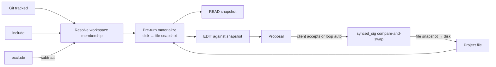

| Concern            | Owner and representation                                                                                                                    |
| ------------------ | ------------------------------------------------------------------------------------------------------------------------------------------- |
| Workspace identity | `workspaces.project_root`; null is headless. There is no separate project entity.                                                           |
| File visibility    | Workspace-tier resolved membership: `(tracked files ∪ include) − exclude` ({§membership-baseline}). Every worker sees the same result. |
| File reads         | READ returns the materialized file snapshot stored in the entry body channel; it does not read disk directly.                               |
| File writes        | EDIT proposes against that snapshot. Only accepted resolution with the captured `synced_sig` writes the project file.                       |
| Internal entries   | Workspace or worker entries are canonical store state. Writing one never implies a project-file write.                                      |
| Authority          | Service flags set the membership ceiling; the `members` family's definitions include and exclude within it; client or loop auto resolves proposals. `origin` is attribution. |

§web-search-retrieval **Web discovery is an ordinary MCP concern; retrieval is a first-class composition.** PLURNK owns no search runtime: a search-capable MCP server (e.g. Brave Search) participates through the ordinary MCP contract — admission, read-effect classification, tool documentation, and packet projection are identical to every other MCP tool ({§mcp-tool-presentation}). An executor that wants to materialize discovered pages uses the generic `content: null` `entry()` request ({§exec-entry-sink}): the guarded `WebFetcher` sink fetches candidates in parallel, off the write-serialization chain, and materializes successful bodies as ordinary HTTP entries. Every candidate whose `entry()` call rejects, regardless of failure reason, is mechanically omitted from the model-facing result directory; survivors retain upstream order. Without an entry sink the executor cannot test materialization and omits the verdict.

Search prefetch and direct HTTP READ materialize the same resource contract:
protocol + canonical authority (including a non-default port) + path + serialized
query is the absolute identity ({§scheme-address-network}); the sanitized
readable projection is the fragmentless default, while faithful DOM, origin
media type, and projection identity remain explicit auxiliary evidence. A
normal
`## READ0 (https://host/path?query)` therefore publishes only the sanitized body
under that exact URL—never raw HTML, response headers, or a channel-selection
lesson. FIND and embeddings consume the addressed stored channel representation
and never re-fetch a match.

§web-retrieval-live Coverage protects the composition at distinct seams: HTTP unit tests pin fragmentless-body publication and explicit auxiliary selection; integration tests pin materialize→FIND and persistence/publication separation. A live positive-control demo requires a materialized HTTPS body and a substantive answer from a real sanitized page; live discovery demos remain diagnostic and may expose model judgment failures without weakening these assertions.

**Git is the substrate and the repository is the boundary:**

- §membership-baseline **The baseline contract — chiseled (#400).** To a workspace a
  project file is exactly one of three things: **invisible**, **added**, or **tracked
  by git**. There is no fourth category. Membership — what the model can READ and
  FIND, what is materialized into the store, what a packet can ship to a provider — is
  the allowlist `(tracked ∪ include) − exclude` and nothing else. No file is a member because
  it exists on disk, because git does not ignore it, or because a model would find it
  convenient: ambient admission of untracked files is prohibited, so a workspace rooted
  in a home directory or a monorepo exposes exactly what was committed or added (the
  non-member rule, {§fs-write-nonmember}: no read, no leak, no overwrite). Every
  exception is a named clause in the register ({§membership-model-universe}), admits
  files by an exact creation record with recorded provenance, and never by `git add`.
  Changing this clause, the register, or the composition is an operator ruling recorded
  on the issue that lands it — never an implementation convenience, never a side effect
  of making a file visible to solve the problem at hand. The 2026-07-12 – 2026-08-27
  "untracked-but-not-ignored" ambient admission is retired.
- §membership-model-universe **The exception register — files in the model's universe.**
  Admitted by exact creation records (`source: "create"`, origin `constraint`), never
  staged: (1) a file an accepted EDIT creates; (2) a COPY/MOVE destination
  ({§membership-create-parents}). Admitted by a published standard as projected
  instruction documents — never as members: (3) the project's `AGENTS.md` and nested
  `AGENTS.md` files ({§turn0-agents-stunt}, #346), read from disk regardless of git status
  and materialized as `worker://~/_plurnk/agents.md` and
  `worker://~/_plurnk/instructions/<subtree>/AGENTS.md`; the file itself is a member
  only when tracked or added, and the standard never overrides the operator's
  exclusions — an `AGENTS.md` the repository ignores or an exclusion matches
  is not projected. (4) A definition the model proposes through the `members`
  family ({§members-functionality}), admitted only under the operator's ceiling
  `PLURNK_SERVICE_MEMBERS_MODEL_SCOPE` (shipped `none`), projected with source
  `model`, and never admitted past the repository's ignore rules or an exclusion.
  Nothing else.
- §membership-git-membership The workspace owns the Git repository containing
  `project_root`. Its tracked files (`git ls-files` semantics) are members with
  no explicit overlay; when the root is a package inside a monorepo, the
  repository's other packages are members at root-relative paths. An unrelated
  or nested independent repository is not discovered or managed by this
  workspace. When Git is absent there is no filesystem walk; member definitions are
  then the sole source.
- §git-native-default **Core Git reads use native Git.** Membership and status
  execute the installed Git binary. An absent or failed binary yields no
  automatic Git membership or status; core has no alternate implementation or
  fallback.
- §membership-git-hermetic Native Git runs with ambient `GIT_*` and
  global/system config scrubbed, so repository identity follows `project_root`,
  never the daemon's launch environment.
- §membership-edit-membership-gate **Membership-gated edits.** EDIT is bounded by membership exactly as READ is. An existing **member**'s baseline is its entry snapshot — the body channel the model READ, not a fresh disk read — so the diff is naive against the view the model saw, never empty (the write-side CAS, {§membership-edit-write-cas}, prevents the silent overwrite of out-of-band drift). An existing **non-member** is refused (403) *before* any read or write: the model never reads a file it can't see (no leak into the proposal) and never overwrites one (no wiping a gitignored `.env` it never added). A **new path** crosses the creation matrix in {§fs-write-surface}; proposal acceptance cannot bypass its scope, exclusion, or incorporation rules. Reaching past membership is `## EXEC0 [sh]`'s job, not the file scheme's.
- §membership-create-parents **Parent-complete creation.** An accepted File creation—whether authored as EDIT or as a COPY/MOVE destination—recursively creates missing parent directories before writing and registering the new member.

**The overlay — `include | exclude`.** `workspace_constraints` holds the `members` family's projected definitions and the engine's creation records ({§members-projection}). Resolved membership is `(project repository files ∪ include) − exclude`.

- §membership-auto-add **Auto-add** — the project repository's ambient membership is its tracked `ls-files`, with `git` origin; an untracked file is never an ambient member ({§membership-baseline}). An accepted creation is incorporated by an exact creation record, never by `git add` ({§membership-model-universe}); a record that cannot be written fails the creation transaction, never an orphan ({§file-create-no-orphans}).
- §membership-overlay-include **`include`** — admit a file Git misses through a targeted pattern scan (files only), with `constraint` origin. `source: "members"` is a projected human definition, `source: "model"` a projected model definition, `source: "create"` the exact durable record of an accepted creation. Only `members` inclusions override active Git ignore. In a Git-absent root, inclusions are the sole file-membership source.
- §membership-overlay-exclude **`exclude`** — a `!glob` definition removes a tracked or included file: resolution drops matches (`node:path.matchesGlob`) and reconciles so the entry set *equals* the member set. The lever to exclude a committed-but-oversized or sensitive tracked file; exclusions mask creation records without deleting their provenance ({§fs-create-masked}).

**File ops act on the entry, not the disk; the two reconcile only at gates.** A `file:///` member is a row whose body channel holds its *materialized model-readable snapshot*. READ returns that channel; EDIT diffs against editable text snapshots — neither reaches the filesystem directly. Entry and disk reconcile at exactly two gates: the **pre-turn materialize** (disk → entry, below) and the **accept-time write-back** (entry → disk, {§proposal}). Between the gates the entry is the truth the model curates against, and `synced_sig` — the member's last-synced disk stat (`mtime:size`) — is the version token both gates compare on.

§membership-source-projection Binary acquisition is transient and bounded by
{§mimetype-binary-input}; durable entry channels remain Unicode text. Core-private
`sourceProjection` attributes preserve the source mimetype, opaque projection
identity, and terminal disposition without exposing raw bytes or a base64 lane.

| Disk source                        | Durable body                                         | Operation effect                                                                 |
| ---------------------------------- | ---------------------------------------------------- | -------------------------------------------------------------------------------- |
| Text                               | Verbatim Unicode under the detected textual mimetype | READ and EDIT use the snapshot.                                                  |
| Binary with readable projection    | Derived Unicode as `text/markdown`                   | READ uses the projection; source-aware EDIT remains 415.                         |
| Binary without projection/over cap | Empty marker under the source binary mimetype        | READ and EDIT return 415; private metadata distinguishes unavailable from limit. |

§membership-materialization-limit **A pathological member degrades, never the
workspace.** `PLURNK_SERVICE_FILE_MATERIALIZE_MAX_BYTES` is a required positive
byte ceiling over one disk source before Core reads it into the canonical file
snapshot. Its valid range is `1..104857600`, bounded by the channel storage
contract, and it ships at that 100 MiB maximum. An oversized path remains a real member
with an empty body channel carrying a durable 413 producer result; no diagnostic
sentinel impersonates file content. READ therefore names the path, observed bytes,
ceiling, and recovery through the ordinary result contract, while EDIT returns the
same 413 instead of diffing against a fictitious empty baseline. Core records the
materialization disposition and ceiling privately, so an unchanged disk member is
reconsidered when the operator changes the policy and otherwise remains a stat-only
no-op. The file write gate independently stats the source against the same ceiling,
so safety does not depend on a background warm winning a client-operation race.

§derivation-dedup-parallel **The index dedups then parallelizes.** The derivation identity hashes the exact READ channel representation, mimetype, reader behavior, embedding configuration, and applicable search exclusion. A channel or log projection attaches the immutable artifact only after it is complete; identical projections therefore share one FTS row, one symbol graph, and one vector set without copying. Distinct artifacts run with bounded producer concurrency (`PLURNK_SERVICE_DERIVE_CONCURRENCY`). Pending artifacts sort by readable content length before entering that pool, so small resources start first while every outlier still derives fully. Unset uses a host-relative square-root fan-out; a positive integer is an exact operator budget and `-1` claims every core. Token-count and embedding batches retain only a pool-sized promise window; graph persistence writes at most `PLURNK_SERVICE_DERIVE_STORE_BATCH` definitions or references per SQLite statement. Every representation completed by a successful pass attaches a terminal classified artifact, identically at concurrency 1 and N. A changed pass emits one immediate `preparing` state, intermediate `indexing` heartbeats at `PLURNK_SERVICE_DERIVE_PROGRESS_HEARTBEAT_MS`, and one immediate `complete` or `failed` state. A no-op pass emits no lifecycle, an indexing heartbeat never claims 100%, and the model-facing Notice buffer retains only the current derivation state while live clients observe each heartbeat.

The artifact also retains a positive `{§mimetype-parse-issues}` count and the
full normalized `{§mimetype-summary}` when the exact parsed channel reported
either. Both remain advisory alongside a normally completed semantic
disposition; zero, empty, and unavailable evidence persist as absence. Catalog
projection attaches either only to that channel, never to a sibling whose
content the artifact does not describe.

Every completed artifact records one terminal disposition: `vector`, `lexical`
(only no embedder or an operator size ceiling), `excluded` (the configured
search-exclusion table), `nonsemantic` (empty/binary/no embedding content), or
`failed` (only a typed `{§mimetype-error-policy}` invalid-source failure).
Cancellation and implementation, loading, database, index-persistence, and
embedding-service failures remain `building`, unattached, and retryable; Core
never guesses that an arbitrary projection exception is bad content. A failed
specimen therefore cannot brick workspace readiness, and the digest reports
every non-vector attachment with its disposition and reason. Successful
optional projection degradations continue indexing and surface their framework
Notice once per identical observation in a maintenance pass.

§semantic-embed-dedup **Identical content embeds once.** The metaproject's repeated `tokenizer.json` channels - and any log result exposing the same exact readable text - attach one content-addressed derivation artifact. Graph, FTS, and chunk vectors exist once; addresses join through the artifact hash. One pass-wide semantic plan binds the selected chunk counter to this identity: the embedder's own counter is covered by model-space identity, while a separately resolved fallback counter contributes its `tokenizerId` and exactness. Model, vocabulary, vector-wire encoding ({§mimetype-embedding-wire}), or configuration changes therefore produce a different identity, so incompatible vector spaces, encodings, or chunk boundaries never share.

Lossless chunk admission requires either the embedder's own counter or an exact fallback tokenizer. An empirical estimate never proves that content fits the declared token window. When pending readable content would require vectors and only an estimate is available, maintenance surfaces its degradation Notice and fails before embedding or attaching a derivation; no/disabled embedding and the established empty, binary, excluded, and maximum-size dispositions remain non-vector outcomes.

§semantic-max-embed-size **Embedding has a bounded size posture.** `PLURNK_SERVICE_MAX_EMBED_SIZE` is the maximum UTF-8 byte size eligible for vectors; the shipped default is 262144 and `0` is the explicit unlimited override. The measured value is the exact addressed channel representation READ exposes and the embedder receives. When the ceiling rejects an oversized representation, its channel remains directly readable with full graph and lexical indexing; only vectors are absent. The setting is folded into the deep derivation signature, so changing it honestly re-derives affected channels. Client notices report compact aggregate progress; the digest records every non-vector address, terminal disposition, and reason for forensic inspection.

§membership-change-gated-sync **Sync is idempotent and change-gated.** Per turn, membership materializes every member's model-readable snapshot into its entry. Text with an unchanged disk signature and materialization policy is a stat-only no-op. The version token is either the observed `mtime:size` or the explicit `absent` state; an observed deletion removes the stale readable channels, and a later reappearance is therefore a new divergence rather than a first-sight materialization. Binary sources additionally compare the cached per-mimetype projection identity; unchanged bytes are never reacquired, while changed reader behavior rematerializes without fabricating a filesystem-divergence event. Coverage is exhaustive across the project repository while work is proportional to source or projection change. After a pass every member carries the current representation defined by {§membership-source-projection} and {§membership-materialization-limit}.

§membership-emi-divergence-signal **EMI divergence evidence.** The detector that gates the work *is* the one that records this — one mechanism, not a second full read. When change detection finds a member moved out-of-band, the runtime actor records an `EDIT`-shaped row naming the file with `source="file"`; it does not broadcast that workspace change into unrelated workers' logs ({§env-delta-filesystem-narration}). The model's own edits are write-through (the entry equals disk after a File write), so the scan never mis-attributes them as external divergence. The current file remains ordinarily addressable. A stale anchored edit rejects under {§line-anchors}; a disk race after proposal rejects under {§membership-edit-write-cas}.

§membership-edit-write-cas **The write-back is a compare-and-swap — never a clobber, never a clever merge.** EDIT is *naive against the editable text snapshot*: it diffs the model's change onto the entry's body channel — the exact Unicode the model READ — and the proposal carries the `synced_sig` that snapshot was taken at. Binary sources are refused before this path ({§membership-source-projection}). At accept, `applyResolution` re-stats disk and lands the proposed content only if that signature still matches. If disk moved out-of-band in the propose→accept window — a sibling worker, the user's editor, a build step — the write is **refused** with the same neutral `edit-collision` as {§edit-collision}, and **nothing is written**. The engine neither blind-writes over the ambient change (a *clobber*) nor silently re-diffs the model's edit against a state it never saw (getting *clever*) — both would bury a stale-view contract violation under a fallback. The collision surfaces instead: a ≥400 apply downgrades to a reject ({§proposal}), so the model sees that EDIT **did not occur** (400; the `edit_collision` outcome is forensics-only). Reconciliation aligns the current file projection and records the `source=file` evidence in the runtime log ({§membership-emi-divergence-signal}); the model re-reads and re-proposes against the fresh snapshot.

The version travels *with the proposal*, never re-read from the entry at accept: a sibling worker in the same workspace may reconcile while this proposal sits paused, advancing the entry's `synced_sig` to the drifted disk — comparing against the *current* entry sig would wave that clobber through, so the comparison is always against the sig the proposal was computed at. A proposal that assumed an **absent** path (a create) conflicts only if a file has since appeared; a member with **no recorded snapshot** (an un-materialized entry, null `synced_sig`) has no baseline to guard and writes through — the two are told apart by the proposal's `existed` flag, not by a null sig alone. On a clean landing the entry refreshes to the written content and `synced_sig` is **restamped** to it, so the next reconcile recognizes the model's own write (not an external divergence) and a second same-turn edit bases on the landed bytes, not a stale sig. This is the write-side twin of the read-side change-gate ({§membership-change-gated-sync}): one `synced_sig`, gating both the re-read and the write.

The CAS is the **hard backstop**, at the moment of writing, on every accept path. It composes with the model-facing {§line-anchors}: an anchor rejects a target whose relevant neighborhood changed before dispatch, while the CAS refuses to write against a snapshot disk left after proposal. An unanchored edit deliberately claims no pre-dispatch stale-view guarantee.

§membership-git-flags **Permission flags.** Service-wide Git admission comes from {§operator-config-git-ceiling}. `PLURNK_SERVICE_GIT_AUTO=1` (default) includes the repository containing `project_root`; `=0` disables automatic Git membership, leaving member definitions as the only membership source. `ALLOWED` gates `AUTO`.

**Rationale.** Workspace is the right scope unit and the containing Git repository is its ordinary development boundary. Membership curation is tiered: Git bounds it by tracking, the client supersedes by overlay, and the model curates its render by READ/FOLD. Supporting several independent repositories as one world would require Plurnk-owned topology, synchronization, and model teaching that Git already solves cleanly by treating them as separate workspaces.

**Schema.** The version-1 baseline stores logical model calls beneath turns,
emission admission as their specialization, and cardinal physical requests
beneath each call. Its constraints distinguish pending calls, response
evidence, and response-less errors while monetary classification remains
explicit.

### §overflow-turn Budget enforcement: automated recovery turns

Budget recovery is an ordinary state-machine transition, not a private packet
mutation. Every candidate model request first crosses the model-facing curation
ceiling and then, only if admitted, the provider's request-shaped physical
capacity boundary:

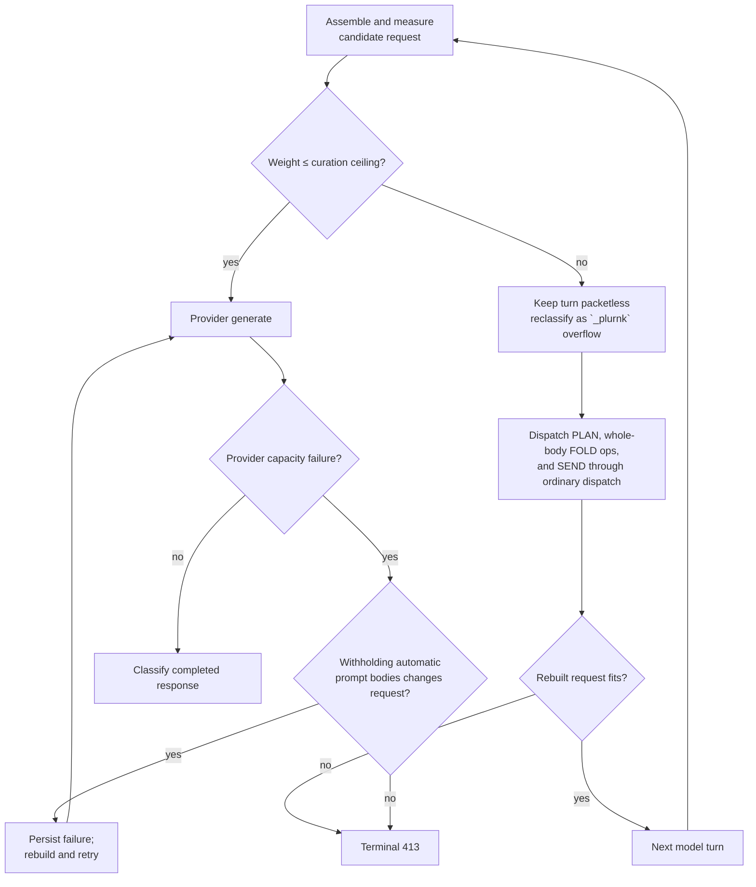

§overflow-turn-only **Recovery occurs only after measured overflow and before
provider I/O.** After packet assembly, Core compares render weight
({§tokenomics}) with the provider-derived curation ceiling. An admitted packet
ships untouched. An over-ceiling candidate is never stored as a model request
and never reaches `provider.generate`; its already-created database turn instead
becomes a packetless `_plurnk` turn. Packetless initialization and recovery turns
remain ordinary turn chronology but do not consume `maxTurns`, model-call,
emission-attempt, usage, or cost accounting.

- §overflow-turn-script **Recovery is one ordinary admitted `_plurnk` program.** Its canonical {§plan-value} has one `medium`, `in_progress` entry whose content is `Automatically FOLD log bodies newly active at token-budget overflow.`, followed by every causal whole-body FOLD and terminal `SEND0 [102]` with body `Next: YOU MUST ONLY FOLD, KILL, or trim ALL superseded, stale, or irrelevant log content in bulk.` The final sentence requires the successor's substantive operations to be one dedicated, comprehensive bulk-curation program. Core authors this internal program with canonical PLAN and SEND framing. Its exact `turnOps` is born FOLDED; successful FOLD rows follow {§fold-open-meta-operations} and therefore remain durable but packet-suppressed. Every recovery row carries `_plurnk` and `overflow`; no model call, synthetic receipt, or parallel explanation exists.
- §overflow-turn-curation **The preceding turn owns the pressure it introduced.** Core deterministically selects every body already created in the packetless candidate turn, every body created by the immediately preceding completed turn in that worker's chronology, and every older body whose visibility that preceding turn's successful OPEN increased. Every selected body is FOLDed whole (`<1,-1>`) through ordinary dispatch. Already-wholly-folded and bodyless rows require no operation. Core performs no relevance judgment, exempts no operation or resource kind, reconstructs no interval delta, re-runs no authored selector, and chooses no unrelated older history.
- §overflow-turn-hard-413 **Recovery fails hard when the causal fold cannot fit.** After the ordinary FOLDs land, Core rebuilds and remeasures once. If the plan changes no visibility or the rebuilt request still exceeds the ceiling, the loop terminalizes with an exact `engine/context/token-budget-overflow` 413 Problem; Core neither submits excess bytes nor chooses unrelated older history. Separately, every `provider.generate` assesses physical capacity under {§provider-surface-capacity}. Core may retry a provider capacity rejection only after withholding automatic prompt-body projection when that changes the request. If it cannot produce changed bytes or the changed request is still rejected, the request-only model turn and provider-owned Problem terminalize at **413 Content Too Large**.

- §tokenomics-fetch-fits-free **A retrieval larger than the available packet room remains addressable.** Its complete row lands in the model turn that requested it. If the following candidate packet exceeds the curation ceiling, {§overflow-turn-curation} FOLDs the new body and classifies it `_plurnk` and `overflow`; the exact body remains durable and selectively re-OPENable.

- §loop-terminals **Engine-imposed terminals are HTTP-precise** — the loop-status vocabulary, one meaning each: `200` concluded (the model's SEND signal `200`) · `499` model-abandoned (signal `499`, or a cancel) · `429` maxTurns exhausted · `413` token-ceiling recovery failure or provider input-capacity failure after changed-request recovery · `500` strike threshold or invalid-emission exhaustion (distinct Problem types; `508` when the crossing strike was a detected cycle) · `504` loop timeout / exec-timeout restamp · `202` the bounded wait — a loop blocked on a live obligation (the model's `## SEND0 [202] <T,P>`, {§wait-obligation-matrix}); a wait on nothing resolves to `200` unless a successful same-turn FOLD requires the curated next packet · `100`/`102` queued/running. Never a catch-all, never a new value without changing the owning schema.

§overflow-turn-surface **The packet is the resulting state, not an account of it.**
The first request after recovery is assembled by the ordinary packet path from
the actual durable log after the recovery turn. It therefore carries the prior
causal rows genuinely FOLDED, the recovery PLAN and SEND genuinely OPEN, and
the recovery `turnOps` genuinely FOLDED. Successful recovery FOLD receipts are
absent under the universal curation rule. No notice, reconstruction, auto-open,
or overflow-specific projection simulates what `_plurnk` did; OPENing the exact
`turnOps` reveals the program that did it. The model retains complete authority
to reverse or refine that curation through ordinary log operations.

### §env-delta The environment delta: what changed since the model last looked

Catalog FIND results ({§packet-catalog}) state what existed when observed. The
environment delta supplies structurally addressed activity without copying the
workspace into every worker's private state.


§env-delta-log-pull **Pull the event record, never a world snapshot.** At
pre-turn, a worker materializes only occurrences whose structural audience
includes that worker. The set is exhaustive, unranked, and exactly once; the
engine makes no relevance decision. Each copied event retains the operation,
result, typed attributes, and initial log classifications ({§log-item-tags}).
Every producer appends to one workspace-scoped occurrence journal with a
monotonic identity. A pull captures one closed `(worker cursor, high-water]`
interval, materializes each addressed identity idempotently, then advances the
cursor only after the whole interval is durable. An event racing the capture is
therefore in this interval or a later one, never neither or both. Source-log
curation cannot erase the occurrence record.

The cursor is observation progress, not a private copy of resource contents. A
fresh worker captures the current high-water when its worker row is created, so
pre-existing broadcast history stays out while later occurrences remain
deliverable even before its first packet. A fork instead copies the parent's
cursor and captures its own fork high-water atomically with worker creation
({§machine-processes-fork-pending-activity}). Observer rows retain the source
identity and never publish another occurrence.

§env-delta-worker-entry-visibility **The commons is global; every other
resource follows lineage.** A successful state-changing `EDIT`, `COPY`, `MOVE`,
entry-path `KILL`, or entry-path `SEND` signal `410` whose landed effects touch `worker:///...` acquires the workspace
audience and retains the commons address in its observer row. Mutations to
`worker://~/...`, named worker spaces, project files, and remote resources do
not broadcast. When authored by a child, their
ordinary operation evidence still reaches that child's direct parent.

| Producer / event                                      | Durable occurrence                                                                                     | Observer projection                                                                                                                |
| ----------------------------------------------------- | ------------------------------------------------------------------------------------------------------ | ---------------------------------------------------------------------------------------------------------------------------------- |
| §env-delta-child-activity Direct-child activity       | Every final op-bearing child log row except the runtime's own rows — `_plurnk` initialization, maintenance, and operation turns are private to the child: prompt, PLAN, operation result, or actionless error. | Direct parent only; one exact attributed row born folded. Provider reasoning, calls, rejected emissions, turnOps, and harness maintenance do not cross. |
| §env-delta-child-termination Direct-child termination | The child's exact terminal loop result when the loop contains at least one non-maintenance turn.       | Direct parent only; a 2xx deliverable is born open and every failure is folded ({§worker-scheme-collect}).                         |
| §env-delta-commons-mutation Commons mutation          | One successful resolved operation whose landed effects touch `worker:///...`.                         | Every existing worker; one folded row per observer, deduplicated with any lineage audience.                                       |
| §env-delta-filesystem-narration Project-file divergence | Runtime-owned reconciliation evidence remains in the runtime actor's own log.                        | No ambient observer row. Current content remains addressable and stale hash edits reject at their owned boundary.                 |
| §env-delta-entry-materialization Executor `entry()` sink | The runtime records typed materialization evidence under its owning actor.                           | No ambient observer row unless the resulting operation itself is direct-child activity or a commons mutation ({§exec-entry-sink}). |

§env-delta-attribution **Ownership, authorship, and cause are independent.**

| Field       | Meaning                                                                                                                                                                                 |
| ----------- | --------------------------------------------------------------------------------------------------------------------------------------------------------------------------------------- |
| `worker_id` | The worker whose self-contained log owns the materialized row.                                                                                                                          |
| `origin`    | The actor tier that wrote the row; a materialized delta is `_plurnk`.                                                                                                                   |
| `source`    | The immediate causal identity in this log: a lineage or commons observation uses canonical `worker://<producer>`, a terminal stream observation uses its causal `log:///<coord>/EXEC`, and a subsystem observation may use its stable token (for example `file`). Self-authored rows omit it. |

§env-delta-no-coalescing **Activity is never coalesced.** Each admitted child
operation and each commons mutation has one occurrence identity. Combining
them would destroy causal order and conflate event replay with a state
comparison.

§env-delta-passive **Observation never forces a turn.** Deltas materialize only
while a packet is already assembling. Intermediate child activity and commons
broadcasts therefore cannot wake an idle worker. Urgent directed communication
uses the voice door ({§actor-boundary-two-doors}); direct-child terminal
disposition alone carries the structured-concurrency wake owned by
{§worker-scheme-collect}. Stream progress remains owned by {§exec-stream}.

### §edit-result-render Mutation log rows render truthful effects

A mutation row keeps request and outcome separate: `tx` is the admitted
statement; `rx` is its resolved result. Only state that actually landed may
appear there as an effect.

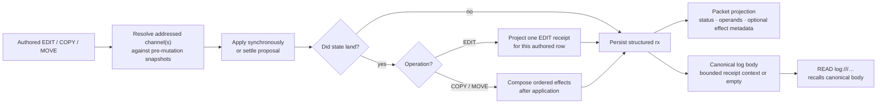

§edit-result-receipt-projection **EDIT projects the scheme-owned batch
receipt.** The scheme framework owns the exact aggregate shape
({§scheme-edit-batch-receipt}). Core validates it and projects the result
matching each authored EDIT's batch index: either that statement's applied
effect or its superseded disposition. The proposal-owning row alone carries a
reviewer replacement effect. Core stores only that per-row projection on `rx`;
the aggregate remains dispatch coordination state.

| Durable receipt fact                   | Packet projection                                                 | Meaning                                                                                                                   |
| -------------------------------------- | ----------------------------------------------------------------- | ------------------------------------------------------------------------------------------------------------------------- |
| Full `revision`                        | `rev` abbreviated to `PLURNK_SERVICE_EDIT_RECEIPT_REVISION_CHARS` | SHA-256 identity of the complete landed channel body; display correlation only, never a lookup or compare-and-swap token. |
| `unit`, `before`, `after`              | `extent`                                                          | Whole-line batches use line counts. A batch containing any exact four-coordinate edit uses Unicode code-point counts.     |
| `parseIssues.before`, `parseIssues.after` | `parseIssues` as `before→after`                                 | Parser-recovery counts for complete source and landed revisions; omitted when both are clean or either is unavailable.     |
| `effect.requested`, `source`, `result` | `range`                                                           | The admitted marker and its normalized mapping from the common source snapshot into the landed body.                      |
| `effect.removed`, `inserted`           | `change`                                                          | Removed and inserted counts in the receipt unit.                                                                          |
| `effect.context`                       | Canonical row body                                                | Numbered physical lines at each landed boundary, bounded symmetrically by `PLURNK_SERVICE_EDIT_RECEIPT_CONTEXT_LINES`.   |
| `disposition`, `requested`             | `disposition`, `requested`                                       | A reviewer-replaced batch preserves the authored marker while stating that its attributed effect was superseded.          |
| `replacement`                          | `replacement`, `change`, canonical proposal-owner body           | The one whole-resource effect actually applied by the reviewer replacement; never duplicated across authored rows.        |

§edit-result-receipt-truth **Receipts describe committed state.** Every row in
one resource-channel EDIT batch carries the same landed revision, extent, and
optional `parseIssues` transition for the complete source and landed revisions.
When the proposed batch lands unchanged, each row also carries its own requested
marker, source/result mapping, counts, and context. For configured count `C`,
the context contains up to `C` surrounding lines and the first and last `C`
landed lines at the result boundaries. Overlapping windows coalesce; coordinate
jumps expose an omitted middle. A deletion instead shows up to `C` lines on
each side of its join.

§edit-result-reviewer-replacement **A resolver replacement is one effect, not a
guess at authorship.** An arbitrary accepted body replaces the batch's proposed
body. Its correspondence to the authored EDITs is unknowable, so every authored
row retains its requested marker with disposition `superseded`. The durable
proposal-owning row additionally carries the one whole-resource replacement
effect and its bounded landed context; sibling rows identify the same revision
without duplicating that effect.

| Acceptance                     | Per-authored-row receipt               | Applied effect                                    |
| ------------------------------ | -------------------------------------- | ------------------------------------------------- |
| Proposed body unchanged        | Requested marker and its exact mapping | One per authored EDIT                             |
| Resolver body replaced proposal | Requested marker plus `superseded`     | One whole-resource replacement, carried once     |

Durable `tx` always remains the model's admitted statement. There is no JSON
row/item receipt mode. A deliberate same-turn READ executes after mutation
({§op-mode-phases}) and remains the universal request for arbitrary current
content.

System-narrated environment EDITs are state-diff events rather than authored
mutation receipts. They carry the resulting span defined by
{§env-delta-filesystem-narration}.

§edit-result-copy-move-effects **Core composes COPY/MOVE effects only after
application.** Operands remain owned by the durable statement and render
independently under {§copy-move-observation}; effects describe only state that
landed.

| Durable effect field | Contract                                                                                                                           |
| -------------------- | ---------------------------------------------------------------------------------------------------------------------------------- |
| `target`             | Canonical model-facing address. The default channel is path-only; an explicitly selected non-default channel retains its fragment. |
| `action`             | Exactly `create`, `update`, or `delete`.                                                                                           |
| `receipt`            | Optional validated EDIT projection. Only textual `create` and `update` effects may carry one; a creation receipt has `before=0`.   |

| Outcome                                                                       | Ordered `effects`                                                                                         |
| ----------------------------------------------------------------------------- | --------------------------------------------------------------------------------------------------------- |
| Landed COPY                                                                   | Its destination effect.                                                                                   |
| Landed MOVE between different resource-channel selections                     | Any destination effect, then any source effect.                                                           |
| Landed regional MOVE within one resource channel, unchanged by its resolver   | Insertion, then removal; both name the same target because they are distinct effects in one atomic batch. |
| Resolver body replaces a proposed COPY/MOVE mutation                          | One actual replacement effect. Cross-resource MOVE still appends an independently landed source effect.   |
| Textual create/update caused by a scope on either operand                     | The effect carries the ordinary bounded EDIT receipt.                                                     |
| Textual create/update with no scoped operand; binary mutation; channel delete | Structural effect only; no invented text receipt. Scoped source removal is an `update` with a receipt.    |
| `304`, rejection, or cancellation with no landed mutation                     | `effects` omitted.                                                                                        |
| Cross-selection MOVE source failure after destination success                 | The failure retains every destination effect that landed.                                                 |

Core validates the complete ordered array before exposing it. Parser-recovery
inspection is advisory and occurs against complete resulting text after
successful application. A handler or parser failure emits a Notice, omits
`parseIssues`, and never changes the mutation outcome.

### §proposal-ownership Loop disposition and client YOLO

Side-effecting operations propose ({§exec}) and pause dispatch at 202 for an
authority decision ({§engine-rails}, {§methods}). Automatic acceptance has two
distinct owners:

| Mechanism                                            | Authority path                                                                                                                                    | Intended use                                                       |
| ---------------------------------------------------- | ------------------------------------------------------------------------------------------------------------------------------------------------- | ------------------------------------------------------------------ |
| §proposal-ownership-loop-auto **Loop disposition**   | `runLoop({ policy: { proposals: "accept" } })` persists a loop-owned disposition; core resolves proposals in process without a client.           | Headless automation, benchmarks, CI, fixtures, and unattended use. |
| **Client-side YOLO** (`--yolo` / `PLURNK_YOLO`)      | A `proposals: "review"` loop emits the ordinary `loop/proposal`; the client returns an accepted proposal through its standard resolution path.  | Interactive automatic review.                                      |

Core cannot distinguish client-side YOLO from a fast human acceptance and does
not need to. Loop auto keeps authority inside the loop; client-side YOLO acts
only after authority crosses the client boundary.

§proposal-ownership-notification **The notification carries disposition, not policy inputs.** `loop/proposal` carries the core-owned `ProposalDisposition` ({§notifications}, {§proposal-disposition}). A connected client presents only `owner="client"`; it never reimplements policy from operation or attrs.

---

## §packet Packet shape

§packet-stored-shape **A model packet preserves the rendered request and, only
when an emission is admitted, its response.** Core assembles and measures the
request under {§packet-assembly}. An admitted response extends that same record
before the turn closes; a failed provider call or exhausted invalid emission
leaves the request-only record, while rejected exchanges remain in
`model_calls` with their classification in `turn_attempts`.

| Turn state                    | `turns.packet`                                  |
| ----------------------------- | ----------------------------------------------- |
| No model request assembled (including initialization and overflow turns) | SQL `NULL` |
| Request assembled             | `{ weight, sections }`                         |
| Response admitted             | `{ weight, sections, assistant, assistantRaw }` |

| Field                   | Presence                         | Contract                                                                                                                                                                      |
| ----------------------- | -------------------------------- | ----------------------------------------------------------------------------------------------------------------------------------------------------------------------------- |
| `weight`                | Every assembled model request    | Curation weight of both rendered request slots. Admission does not change its meaning; it is never response weight or provider usage.                                          |
| `sections`              | Every assembled model request    | Ordered post-transform request sections. `PacketWire.renderSlot` groups them into system and user messages, and the digest re-renders those stored sections byte-for-byte.     |
| `sections[].weight`     | Every stored section             | Independently measured curation weight of that section. Their sum is not the rendered request weight because slot separators and independent rounding remain outside each row. |
| `assistant.content`     | Admitted response only           | Accepted model content from which operations were parsed.                                                                                                                     |
| `assistant.ops`         | Admitted response only           | Parsed operations admitted from that content.                                                                                                                                |
| `assistant.reasoning`   | Admitted response only           | Normalized readable reasoning text, or `null`.                                                                                                                               |
| `assistantRaw`          | Admitted response only           | Opaque provider-owned transport record retained for forensics; `null` when the provider supplies no raw record.                                                               |

`StoredPacket` is the one core type and validation path for this algebra. The
flat schema enforces its root states; typed reads additionally validate every
section and parsed operation. A hard budget stop remains request-only. Client,
setup, filesystem-narration, and executor-materialization turns are ordinary
operation turns and therefore store `NULL`. Digest projects exact operation
source independently from this optional model-exchange record; a request-only
turn receives a note instead of a fabricated response.

§digest-turn-artifact-identity **Digest packet artifacts project durable turns.**
After selectors are applied, digest retains every turn with exact `turnOps`, a
valid stored provider request, or malformed stored packet evidence; orders those
turns by durable chronology; and names them contiguously from `packet000`. The
producer does not affect projection.

| Artifact | Present when | Authority |
|----------|--------------|-----------|
| `packetNNN.assistant.md` | The turn has `turnOps` | Exact persisted `turnOps` source |
| `packetNNN.system.md`, `packetNNN.user.md` | The turn stored a provider request | Stored packet sections projected through `PacketWire` |
| `packetNNN.assistantRaw.json` | The request has an admitted provider response | Stored opaque provider response |
| `packetNNN.response.md`, attempt artifacts | The request received no admitted response | Stored request and attempt state |
| `packetNNN.packet.raw.txt` | The stored packet fails typed validation | Exact stored packet text |
| `packetNNN.packet.invalid.json` | The stored packet fails typed validation | Turn identity and complete validation error chain |

A source-backed turn without provider participation therefore produces only
`assistant.md`; a request-only turn produces no fabricated assistant. A
source-less programmatic turn with no provider request has no forensic payload
to project and reserves no ordinal.

The external tokenless draft and transformation boundary is owned by
{§scheme-packet-transform}. Core alone extends each validated draft with its
measured `weight` field for storage. #74 tracks coverage that mistakes the sum
of section weights for the rendered request weight.

§definition-table-projection The authored `plurnk.md` remains human-aligned. Its `definition` section deterministically removes Markdown table-cell padding and shortens separator cells to three dashes before plugin transforms, measurement, storage, and wire rendering; alignment colons survive, while fenced blocks and all non-table whitespace remain exact.

§lexicon **Vocabulary follows the standard of its audience.**

| Layer                    | Rule |
|--------------------------|------|
| Operator, wire, storage  | Use the applicable industry term. Provider quantities follow the OpenAI vocabulary where it is standard: `contextWindow`, `reasoning`, `completion`, `finish_reason`, and usage nouns. |
| Core lifecycle           | Use the exact Workspace → Worker → Loop → Turn → Op hierarchy in {§lifecycle-terms}. An AG-UI Run or thread is always protocol-qualified. |
| Model-facing packet      | Use the model's training distribution: operations mirror HTTP and shell, `display` mirrors CSS, and jsonplurnk remains JSON. Renaming this vocabulary to internal API terminology would discard useful resonance for a standard the model never sees. |

| PLURNK-native term             | Why it remains |
|--------------------------------|----------------|
| `worker` / `loop` / `turn`     | The process hierarchy in {§lifecycle-terms}; unqualified `run` names no internal entity. |
| `packet`                       | The assembled address space, a kernel concept rather than merely a provider request. |
| `costUsd`                      | No standard cost field exists; the explicit currency avoids implied units, and the value remains an exact decimal string. |
| `curationWeight` / `curationBudget` | Explicitly distinguish Core's model-independent context-shaping facts from physical provider tokens. |
| the `chars/2` curation ruler   | Model-agnostic by design ({§tokenomics-agnostic-ruler}); it is never presented as a tokenizer. |

Retired terms stay retired: the lexicon guard rejects `thinking`, the unqualified `session` noun, `contextSize`, `decodeBudget`, and moved partition-knob names. <!-- lexicon-allow: this sentence enumerates the retired terms -->

§encrypted-reasoning-carrier **Encrypted reasoning is opaque client evidence.**
When a provider returns encrypted reasoning items, core attaches that list to
the admitted model `turnOps` row's `attrs.reasoning`. `log/entry` and `readLog`
carry it to AG-UI, which may project correlated standard reasoning entities.
Core never decodes the blobs or renders them into a model packet; readable
reasoning text remains separate in `assistant.reasoning`. The provider-detail
identity and derived classification retain their exact provider-normalized
meaning from {§provider-encrypted-reasoning}; core never reinterprets either as
a client entity. The source row and logical model call remain the lossless
evidence when a downstream standard cannot represent the complete list.

§body-projection **One full body, one packet projection.** Every durable log row has one canonical full body resolved from its stored tx/rx envelope by `LogBody`. READ and FIND over `log:///`, persistent search derivation, and packet rendering all consume that same meaning. Only packet rendering may project it:

| row producer | ordinary OPEN projection |
|---|---|
| any `READ` or `FIND` | complete selected operation result |
| any `PLAN` | complete canonical Plurnk Plan JSON {§plan-value} |
| actionless lowercase `prompt` | budgeted head under {§prompt-projection} |
| structured `EDIT` receipt or textual `COPY`/`MOVE` effects | complete receipt-owned join context |
| every other nonempty body | head bounded independently by `PLURNK_SERVICE_PREVIEW_LINES` and `PLURNK_SERVICE_PREVIEW_CHARS` |
| bodyless row | `"display":"none","body":""` |

READ and FIND own their range or pagination before packet rendering; the packet never applies a second hidden substring bound to their selected result. PLAN is likewise complete while OPEN: it is the model's explicit persistent reasoning inventory, serialized once as compact JSON rather than clipped or reparsed from source text. Prompt rows follow their separate adaptive projection contract. Structured mutation contexts already carry the receipt-owned bound in {§edit-result-receipt-truth}, so packet rendering does not preview them again. Actionless source artifacts, SEND/WORK/FORK bodies, EXEC commands, environment-delta EDIT spans, and extension-produced bodies use the ordinary fixed bound. When an OPEN projection differs from its canonical body, `chunk` follows the displayed `body` with the exact selected and complete extents defined by {§jsonplurnk}; complete and FOLDED bodies omit it. `## READ0 (log:///<coordinate>/<OP>)` applies its default or explicit text range to the canonical body; the unsuffixed exact shorthand and authoritative suffix behavior are defined by {§log-coordinate-hierarchy}. `## FIND0 (log:///...)` and search match that same full body. FOLD hides the ordinary projection, and OPEN restores the producer's projection without changing its bound. System/policy sections are not log bodies. Notices are transient non-log observations; they share the ordinary line/character bounds but have no durable body or recovery URI.

§prompt-entry **Prompt as a first-class entry and log row.** Each prompt is stored once at `prompt:///<loop>/<N>` as an owner-keyed text/markdown entry — written before any turn of its loop executes, so the initialization COPY ({§worker-initialization-entry}) archives a real source — then published to its first model turn as one actionless lowercase `prompt` log row; that row, not the entry, records publication. No synthetic EDIT or READ operation is invented. The row is born OPEN and obeys {§body-projection}. The **Active User Prompts** section closes the user-slot status clump as a paths-only list (`* prompt:///<loop>/<N>`), so every frame remains directly READable even after its log row is folded or killed.

§prompt-causal-source **Prompt authorship and delivery are distinct facts.** The harness publishes every prompt row with `origin="_plurnk"`; the row's existing `source` carries the canonical address of a different causal actor. Native WORK, FORK, and directed worker SEND derive `worker://<sender>` from the authenticated sender worker ID. A trusted exterior adapter may supply its own canonical actor address through {§methods-loop-run}. An absent source means the owning worker itself. Attribution persists with the prompt frame through active delivery, parking, orphan recovery, restart, and later log projection; model syntax cannot author it.

§prompt-projection **Prompt storage is unbounded by model context; automatic materialization is not.** Core persists every accepted prompt completely before packet assembly. The selected provider's derived `inputCapacity` and the alias-resolved percentage from `PLURNK_SERVICE_PROMPT_PROJECTION` derive one aggregate curation-weight allowance for OPEN prompt bodies. Complete prompt bodies render when their aggregate weight fits. Otherwise all OPEN prompt rows share the allowance: full bodies consume only their required share, unused shares are redistributed, and partial bodies render the largest leading complete-line region that fits their share or an exact character-bound prefix when the first physical line alone is larger. The sum of their rendered body weights never exceeds the allowance. Every partial body carries its exact `chunk` after `body`; the canonical `prompt:///` entry and `log:///` body remain complete and READ/FIND-addressable. When provider input capacity is unknown the percentage is underivable, so prompt rows retain the ordinary bounded projection rather than inventing capacity. This policy never rejects, summarizes, or discards a prompt because it exceeds a context window.

§prompt-self-only The frame is self-only and owner-keyed:
`entries.owner_id` carries worker identity while the address carries only the
loop coordinate. Concurrent workers therefore hold distinct rows at the same
address. Cross-worker prompt flow is engine-mediated; the scheme needs no
authority slot.

§prompt-loop-containment A loop contains every prompt that arrives before it
concludes, ordinal-keyed as `N`; the next turn publishes every entry for which
that loop has no `op='prompt'` row, oldest first. Every still-undelivered frame
at conclusion is re-ordinalized into one source-keyed recovery loop; that loop's
first turn publishes the complete ordered set exactly once. Recovery retries
complete the same queued loop and never mint duplicate work. The automatic
overflow turn preserves prompt rows; explicit OPEN/FOLD/KILL follows the ordinary
log contract.

§packet-catalog **Catalogs are query results, not packet state.** The packet
stores no materialized manifest. Complete and one-level entry directories,
their row shape, and their ordering are ordinary FIND projections owned by
{§find-result-projection}; persistent search derivation is a separate index.

### §operation-results Model-facing failures and notices

The model's runtime alert surface has two distinct kinds of information:

- **Turn failures are log items.** A failed action and an engine-rail failure are durable `log_entries` rows whose `rx` is an RFC 9457 operation result. They fold, kill, and budget like every other row. The `errors` section is a derived pointer index over recent `status_rx ≥ 400` rows; it owns no bodies or failure state. Rejected emissions never become accepted turn content; their private response and admission evidence remains in `model_calls` and `turn_attempts`, apart from the bounded recovery `emissionAttempt` under {§invalid-emission-attempts}.
- **Notices are transient observations.** Progress and non-fatal diagnostics such as `turn_awaiting_model`, `embed_progress`, and `grammar_unenforced` may appear once in the packet and broadcast live. They neither substitute for a failure result nor influence scheduling or recovery.

The `log` is durable product truth. The `errors` section points at its failures
while the separate `notices` section displays transient observations. The two
retain distinct contracts and lifetimes.

- §operation-result-uniform-error-channel **One uniform error channel within an
  accepted turn.** Every operation or engine-rail failure — budget overflow,
  max-commands, and the idle/premature steers — is a `log_entries` row with
  `status_rx ≥ 400` and an RFC 9457 Problem Details operation result in `rx`.
  There is no per-category handling or bespoke ephemeral relationship. The
  `errors` section is a derived index over those rows from the current and
  immediately prior turn: one terse `<status> log:///<coord>` link per row,
  nothing else. The Problem lives on the foldable row, READ via the link.
- §log-row-self-explains **Every ≥400 pointer names a record that states its
  why.** A model-operation failure is the model's own operation result; its
  Problem Details `instance` is that row's `log:///` URI and packet wire renders
  the contracts-owned compact `{§problem-projection}` on its meta line whether
  folded or open. The enclosing row owns status, model-facing path, source, and target;
  an identical extension is not repeated inside the projection. No
  separate item is minted for operation failures. Actionless engine rails mint
  `op='error'` items because no authored operation row exists. Invalid provider
  emissions are outside this channel because they are not turns. A bare
  failure status, a top-level string `error`, or mismatched result/problem
  statuses violate the producer contract and fail hard. Genuine
  engine-internal faults crash and never mint model-facing rows.
- **Asynchronous work does not weaken the contract.** A stream-producing operation returns its initial `102` after acquisition. At conclusion the subscription stores the exact universal terminal result; `stream/concluded` carries it unchanged; the next ambient terminal READ merges it with the stream payload and assigns the committed `log:///.../READ` Problem instance. Timeouts and service cancellations replace the complete terminal result with a new valid 504/499 Problem—they never mutate a status while retaining a contradictory Problem.
- **Self-explaining rows.** A problem `title` names the stable class and `detail` states the occurrence-specific cause. Producer-known operands belong in factual extensions. `stage` appears only when neighboring stages imply different recovery; `recovery` states one generally valid next action; `retryable` is true only when the producer recommends automatically retrying the identical request. Unknown recovery or retryability is omitted rather than guessed. General workflow teaching stays in the packet rather than being duplicated into every failure. The runtime-neutral writing contract is owned by `@plurnk/plurnk-contracts`.
- **Exact Problems cross durable and external boundaries.** Scheme capabilities, proposal application, subscription conclusion, loop settlement, AG-UI, clients, digests, and benchmark records preserve the originating Problem object. The model packet alone derives `{§problem-projection}` without mutating that object. An adapter may add the durable `instance`; it must not rebuild failure truth from `status`, `detail`, `RUN_ERROR`, a scheduler projection, or a legacy string. A failed boundary without a valid Problem is a contract violation and fails hard.
- **Caught diagnostics are bounded.** Core-owned Problems may include a bounded preview of a caught runtime diagnostic when it states the occurrence-specific cause. `PLURNK_SERVICE_ERROR_DETAIL_LIMIT` owns that model-facing character bound; complete errors remain in daemon diagnostics. Input validation and stable contract failures do not spend this allowance on implementation text.
- §notice-drain-on-read **Notices** - the few observations that are not log rows render one terse line under their distinct `## Notices` section, never a JSON dump. Packet rendering normalizes whitespace, bounds the producer message with the shared preview limits, and appends any typed position. The notice buffer drains on read; event Notices appear on at most one packet. Stateful derivation progress and provider availability coalesce in the buffer, so clients observe every checkpoint live while a later model packet receives only the current state under ordinary level filtering.
- §rail-accounting-private **Rail accounting is private.** Visibility is owned by {§engine-rails}: the model sees concrete failures from admitted turns, never rejected emissions, attempt counts, the strike streak, or cycle detection. Surfacing internal state creates a gamification surface where the model optimizes for engine metrics instead of the task.

**The error rows (one channel) + the only non-log notices:**

| failure | row | status |
|---|---|---|
| action failure | the failed op's own row; the owning scheme supplies Problem Details | 4xx/5xx |
| provider input capacity | `op='error'`, origin `_plurnk`, source `provider`; exact provider-owned `capacity-exceeded` Problem Details | 413 |
| max commands exceeded | `op='error'`, origin `_plurnk`, source `rail`; `engine/rail/max-commands-exceeded` Problem Details | 429 |
| idle turn | `op='error'`, origin `_plurnk`, source `rail`; `engine/rail/idle-turn` Problem Details | 409 |

| notice `kind` | Source | Position |
|---|---|---|
| `grammar_unenforced` | engine rail verdict, or a forwarded provider transport anomaly such as a discarded-channel escape | content-offset when the observed position maps into content; none for a reasoning-prefix divergence |
| `parse_advisory` | grammar parser — recoverable near-miss which did not invalidate the parsed statements | content-offset into the model's emission |
| `embed_progress` | repository materialization/indexing lifecycle ({§mimetype-surface}); structured phase, count, and percent; `level: info` except terminal failure | none |

§notice-level **Severity on the wire (`level`, required).** Every `Notice` carries `level: "error" | "warn" | "info"`, set by the **producer** at the emit site. The level is client presentation, not operation status: even an `error` notice cannot terminalize work or substitute for a durable Problem. A forwarded `grammar_unenforced` is `warn`; ordinary lifecycle and progress notices are `info`. Clients color straight off `level` without interpreting the open `kind` vocabulary.

§operation-result-no-error-scheme Private strike and cycle accounting stays engine-internal ({§rail-accounting-private}). Every failure within an accepted turn - a bounded parse error, failed action, or engine rail - is a LOG ITEM (`log:///<coord>`, `status_rx ≥ 400`) with Problem Details, foldable and re-OPENable. The `errors` section surfaces a derived pointer to each. Rejected emissions stay in the forensic model-call and admission relations. There is **no bespoke `error://` scheme** and no ephemeral per-category failure buffer.

§notice-event-notify **Client surface.** Engine Notices broadcast live via the `notice/event` notification — `{ workerId, loopId, notice: { source, kind, level, message?, position?, …kind-specific } }` per the grammar's `Notice` schema — the moment they land. A loop Notice names its owning Worker; workspace derivation progress alone carries `workerId=null, loopId=0`. AG-UI projects the same observation as the custom `plurnk.notice` event. Failures do not broadcast on this surface: they are log rows, and the client reads them through `log.read` / the `log/entry` notification, the durable log.

§digest-programmatic-surface **The digest is an importable forensic surface.**

| Surface                                | Contract                                                                                                                                            |
| -------------------------------------- | --------------------------------------------------------------------------------------------------------------------------------------------------- |
| Import `@plurnk/plurnk-service/digest` | Ships `Digest` and its package-owned SqlRite statements; importing performs no I/O or process action. The CLI wrapper alone invokes it.             |
| `run({ dbPath })`                      | Reads the required database and writes a complete digest to `./test/digest` relative to the caller's working directory.                             |
| `digestDir`                            | Selects the output directory. `run` removes and recreates it so stale packet artifacts cannot survive; concurrent callers use distinct directories. |
| `workerId`                             | Narrows workers and every dependent loop, turn, logical model call, emission attempt, physical request, and log row to that one worker.             |
| `workspaceId`                          | Narrows workers and dependent evidence to one workspace; when both selectors are present they intersect.                                            |

§digest-forensic-fidelity **Forensic fidelity and cardinality.** The digest's machine-readable JSON preserves every log event with its initial and current projection, causal `source`, tags, and structured `attrs`; every exact OPEN/FOLD/log-KILL target effect; the exact Problem on every failed row; each loop's exact terminal result; and every ordered physical provider request. KILLed `turnOps` still produce their chronological `assistant.md` artifacts because curation cannot rewrite what a producer submitted. Each stored packet validates independently: one malformed historical packet remains exact raw evidence with its complete validation error chain and never prevents healthy turns from being projected. Accounting on broader rows is the shared exact derivation from that ledger, never a second stored fact. The reasoning chronology distinguishes readable reasoning content from provider-reported reasoning usage: when tokens were reported but no readable content was returned, it states both facts instead of implying that no reasoning occurred. The human Markdown waterfall shows a present causal source and may preview only the Problem detail because it remains a triage projection, not the machine record. Targets reconstruct the model-visible address, including hostname, port, serialized query, and fragment; an authority-bearing URL must never degrade from `https://host/path` to `https:///path`, and durable resource coordinates render back to their authority form. Its human Markdown waterfall groups identical per-turn op outcomes and typed `entry_materialized` narrations, reporting the exact count and sequence span (`xN (seq A-B)`). Grouping keys include source and the complete target, so distinct causes, authorities, or channels never collapse. Thus amplification is conspicuous without making the diagnostic artifact itself pathological; valid packet files remain byte-identical records of what the model saw.

§digest-requiem **A requiem is an out-of-band forensic interview, not a worker
turn.** It cannot execute operations or alter the audited history.

| Aspect    | Contract                                                                                                                                                        |
|-----------|-----------------------------------------------------------------------------------------------------------------------------------------------------------------|
| Scope     | One interview for each worker with model-bearing inference turns; workers without inference evidence are omitted.                                                |
| Evidence  | The worker's final packet plus every attempt's exact normalized response and admission evidence; opaque raw transport remains in durable forensic artifacts. |
| Witness   | An explicitly supplied provider or the active configured provider; absence fails hard.                                                                          |
| Identity  | The worker's durable provider identity ({§worker-provider-identity}) is sent as both `workerId` and `primaryWorkerId`, making the synthetic interview its own root without asserting a live worker topology. |
| Attempts  | One call at `PLURNK_SERVICE_REQUIEM_MAX_TOKENS`; only an empty length-limited response receives one retry at `PLURNK_SERVICE_REQUIEM_RETRY_MAX_TOKENS`.         |
| Artifacts | `requiem.md` carries testimony and exact nullable USD accounting. `requiem.json` is durably materialized before each call and preserves logical call state, messages, normalized responses, every physical request's state and accounting, and their shared aggregate projection. |

§turn-lifecycle **Turn-lifecycle liveness.** Provider generation is the long, opaque window in a turn — one or more same-packet emission attempts may occur before the first committed op. A static client screen there is indistinguishable from a hang. The engine brackets the complete attempt window with two `notice/event` notices (`source: "engine:turn"`, `level: "info"`): `turn_awaiting_model` before the first call and `turn_generated` when an emission is accepted or the attempt budget is exhausted. Rejected content never rides the notice channel. Both are suppressed on an aborted loop and broadcast to the workspace like any notice ({§notice-event-notify}).

§notice-content-offset-pointer **Content-offset position.** A non-fatal diagnosis on an accepted emission (for example `grammar_unenforced` or `parse_advisory`) carries `position: { type: "content-offset", line, column }` into the model's own folded `turnOps`. A bounded hard parse error becomes a durable failed operation whose Problem Details preserve its line, column, source, and parser-owned diagnostic. Hard errors that make the frame untrustworthy remain only with their rejected forensic attempt.

### §tools Executable tool resources

§tools-resource-discovery **Executable capability discovery uses ordinary
Plurnk resources.** No generated tool table rides the system packet. Every
runtime enabled for the current worker with an admitted invocation materializes exactly one
family document at `worker://~/_plurnk/plurnk/<runtime>.md`. A general runtime's
document contains its {§executor-tool-document}; a runtime with an exact
{§executor-tool-registry} materializes the same single document — per-target
child documents do not exist, shown or stored. The family document summarizes
the server or runtime, lists every enabled target as a directly copyable
`## EXEC0` heading with its input signature ({§operation-annotation} carries the
target one-liner; no invocation dispatch would reject is ever advertised), and
carries each detailed target's richer input-side contract as a
`## <target>` section of the same document, that target's own headings demoted
one level beneath it. A detail-less target's invocation line is its whole
teaching. Tool-result/output schemas remain ordinary evidence and never enter
this document.

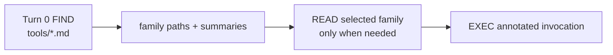

§tools-resource-materialization The runtime registry, worker executor policy,
tool resources, and dispatch use one effective worker snapshot. A
worker-disabled, unavailable, detached, replaced, or removed runtime has no
tool resource; an exact registry's empty set publishes no executable family and
admits no invocation. Reconciliation deletes stale documents
before upserting the current set. `PLURNK_SERVICE_DOCS_EXCLUDE` does not hide an
enabled executable; executor enablement is the sole user-configured filter
shared by discovery and dispatch. A runtime declaration may carry
`resourcesPath` — its generated-doc root relative to the worker's generated
subtree ({§worker-generated-subtree}). Absent, its docs live in the internal
`_plurnk/plurnk` namespace; present (attached MCP families: `/tools`),
the family document materializes at `_plurnk` + that root in the
worker's private entry space. Turn 0 surveys the families (`## FIND0 [+init,+tools]
(worker://~/_plurnk/tools/*.md)`, one row per
server carrying its summary) and, for each server named in
`PLURNK_MCP_EXPANDED`, adds one FIND over its family document matching the
`## EXEC0` headings (`## FIND0 [+init,+tools] (worker://~/_plurnk/tools/<server>.md)`
with `/^## EXEC0 .*\n.*$/m`), so turn 0 names every tool with its annotation and
signature — one row per tool, paged like every survey. No document is delivered
unasked.
Attached tools are capabilities like every other runtime; the model never
learns an origin.

§members-functionality **File membership is one Worker Functionality family.**
Core registers the `members` family with the coordinator ({§functionality-coordinator}):
the model, the client, and the operator learn one surface — `list | discover | add |
enable | disable | remove`, `worker.members.<verb>` for the client, `## EXEC0 [members]
(<verb>)` for the model — for what the model may see, exactly as they do for skills and
MCP servers. A definition is one gitignore-style glob, `{ glob }`, relative to the project
root; a leading `!` excludes matching members, and an exclusion wins over every inclusion.
The coordinator's provenance (`service-configuration`, `client-action`, `model-proposal`)
rides the definition; its alias is a short name, suggested from the glob. `list` shows each
definition with what it resolved to — `include` or `exclude`, the pattern, the members it
admits or removes (count and a bounded sample), and for a model's inclusion the matches the
repository's ignore rules refused — so the model sees what its glob did and adapts.
`discover` is introspection, never a catalog: a path answers why it is or is not visible
(tracked, included by which pattern, a creation record, excluded by which `!glob`, ignored,
untracked, absent); a glob previews what `add` would include or exclude. Names only, never
content; nothing is added.

§members-configuration *Available definitions.* The operator's `PLURNK_MEMBERS_<ALIAS>=<glob>`
(`!glob` excludes) and `PLURNK_MEMBERS_ENABLED=[…]` (absent or `[]` enables none) are the
service-origin definitions, the shape `PLURNK_MCP_*` already has; an empty glob, a bare `!`,
or an unknown enabled alias fails the daemon at boot.

§members-model-scope *The model's authority.* A model's `add` is admitted against
`PLURNK_SERVICE_MEMBERS_MODEL_SCOPE` in the file-creation lattice `none < root <
namespace`, narrowed by `settings.membersModelScope` (most restrictive wins). Shipped `none`
refuses every model definition — inclusion or exclusion — as `403
members/functionality/model-scope`, naming `git add` and the operator's `/members add` as
the paths that remain; `root` admits patterns inside the root; `namespace` admits `../` too.
`auto` loops self-approve proposals, so the ceiling — not the proposal — is the guard
({§membership-baseline}). The coordinator hands `admit` the caller (`action` | `operation`)
so the family bounds the model without a second grammar.

§members-projection *One overlay.* Definitions are desired state per Worker
({§functionality-state}); the workspace overlay (`workspace_constraints`) is their union
across every worker of the workspace (ruling (a)): inclusions union and an exclusion wins.
A child's birth snapshot counts as its own desire: a parent's `disable` or `remove`
withdraws nothing the child still holds, and a file goes dark only when no worker of the
workspace holds an inclusion for it. Human-authored definitions project with source
`members`, model-proposed ones with source `model`; the same pattern from both keeps
`members`. A `model` inclusion is a pattern scan like a human one but never admits a path
the repository ignores ({§membership-model-universe}). The engine's creation records
(`source: "create"`, {§fs-create-record}) are not definitions: the projection never
overwrites or retires them. Projection happens at the family's publication commit and
re-resolves membership; a Worker cooling changes nothing, because desired state is
durable. Each enabled definition is one generated document at
`worker://~/_plurnk/members/<alias>.md` ({§functionality-documents}) — its glob, origin,
provenance, and what it resolved to — surveyed at turn 0 like every family's enabled
definitions ({§actor-boundary-catalog-preview}), so the model sees why a file is or is
not a member before it asks. There is no other membership path: the client's `/members`
verbs are these verbs.

§skills-functionality **Agent Skills are one Worker Functionality family.**
Core registers the `skills` family with the coordinator ({§functionality-coordinator});
its adapter owns protocol truth for standard Agent Skills and nothing else. A
definition is `SkillDefinition` — the standard skill `name`, the universal
root `scope` (`project` = `<projectRoot>/.agents/skills`, `global` =
`~/.agents/skills`), and for a Worker-installed skill the standard installer
`source` that provides it. Plurnk bundles no skills of its own and never
seeds or mutates a universal root absent an explicit `add`/`remove`.

*Available definitions.* The filesystem is the only truth about installation:
every `<root>/<name>/SKILL.md` directory under the project then the global
root is one service-origin definition, enabled by default, project shadowing
global by name; when the standard installer's `skills-lock.json` records a
source it rides the definition. A Worker's durable state owns enablement
({§functionality-state}); a disabled skill stays client-visible and leaves no
model-facing trace.

*Discovery is inert.* `discover {query}` searches the ecosystem registry
(`PLURNK_SERVICE_SKILLS_REGISTRY_URL`, default `https://skills.sh`; empty disables it
with 501 `registry-not-configured`) and returns one candidate per hit with
`registry` provenance and the exact `owner/repo` source. `discover {source}`
lists the skills one standard package reference contains with `source`
provenance. Neither installs, persists, or enables. Client `configuration`
contributes nothing and is refused with 400.

*Admission.* `add {alias, definition}` requires `alias = name`, a `source`,
and a project root when `scope` is `project`; the Worker's own definition may
shadow a service skill of the same name.

*Preparation.* For each enabled alias the adapter locates the directory at the
definition's scope; a Worker definition whose directory is absent is installed
through the standard CLI (`PLURNK_SERVICE_SKILLS_CLI`, default `npx --yes skills`:
`add <source> --agent universal --skill <name> --yes [--global]`, run with
`HOME` set to the service's user home so the installer's `~` is the global
root) and the installed `SKILL.md` — never the installer's output — is the
evidence.
Each admitted skill requires standard `name` and `description` frontmatter
with `name` matching its directory. A missing, uninstallable, or invalid skill
is `unavailable` with its exact Problem (`skill-missing`, `install-failed`,
`skill-invalid`) under the coordinator's failure policy
({§functionality-model-mutation}); one bad skill never fails the family.

*Documents.* The family publishes `worker://~/_plurnk/skills/index.md` —
which always exists and lists the active skills by name and description — and
one `worker://~/_plurnk/skills/<name>.md` per active skill, with an exact H2
`Summary` carrying the standard `description` and the instruction body
preserved verbatim ({§functionality-documents}). They are discovered by the
turn-0 `+init,+skills` FIND survey; disabled and unavailable skills are
absent from model teaching.

§skills-remove **`remove` uninstalls what the Worker installed.** Before the
coordinator forgets a Worker-origin skill definition the adapter removes that
skill from the definition's scope through the standard CLI (`remove <name>
--yes [--global]`), verified by the directory's absence; a failed removal
rejects the mutation. A same-named skill at a lower-precedence root is then
revealed as a service definition, disabled ({§functionality-coordinator}).
Service definitions are disable-only.

§skills-hotload **Out-of-band installers are admitted at the next turn.** The
family keeps one signature of the installed roots per resident Worker; turn
admission recomputes it under the workspace gate before packet assembly and
republishes the family through the coordinator when it changed, so a skill
installed or removed by any other tool is discoverable in the first subsequent
model turn while an unchanged set dispatches nothing. The model manages skills
only through the generated `EXEC [skills]` family
({§functionality-model-projection}); it is never taught a package manager.

The catalog describes this worker's Functionality under its durable capability
ceilings. Turn0 narrows its surveys and examples through the current loop policy,
and a direct denied attempt receives the same exact 403 from dispatch rather
than a second documentation policy.
Optional non-EXEC operations remain a separate `## Enabled Optional Operations`
section because they are language extensions rather than executable tools.

### §schemes user.schemes — the resource directory

§schemes-directory A `## Resources` section renders in the system slot **after the policy sections** — a terse directory of the scheme families available to this worker, so the model knows what URI resources and operations exist before it acts. Each scheme that ships a `manifest.example` contributes one or more concise canonical ops (no scheme prefix; each example self-documents) into a `plurnk` fence. Scheme example sets are separated by one blank line. The doc is NOT linked inline — it is materialized as the worker-private skill `worker://~/_plurnk/plurnk/<scheme>.md` and discovered via the turn-0 `## FIND0 [+init,+skills] (worker://~/_plurnk/plurnk/*.md)` survey ({§skills-functionality}), keeping the raw packet free of doc links. Meta-owned `worker` depth is required teaching ({§teaching-corpus}); a failed source read rejects materialization with its cause and never falls back. Other core and plugin schemes may supply optional `manifest.documentation`; absence contributes no pull doc. The verbose semantics live in that pull doc (materialized like any entry, READ on demand), not the hot path — terse pushes, depth pulls. A scheme with no example (provisional) is omitted; `PLURNK_SERVICE_DOCS_EXCLUDE` drops a named scheme's examples + doc. The directory includes only examples admitted by the effective worker-level capability layers, and Turn0 further narrows discovery through its loop policy using the same resolver ({§capability-admission}); the packet never baits an operation its own admission path will refuse. Materialized pull docs remain worker state, while their discoverability and execution remain policy-bound.

### §inject system.inject — the operator injection

§packet-inject When `PLURNK_SERVICE_PACKET_INJECT` names a readable markdown file, its content renders as an `## Operator Notes` section in the system slot after policy and capability teaching (definition → policy → project policy → resources → inject). Read per-turn so the operator's edits take effect live; a set-but-unreadable path fails the turn hard (a deliberate setting with a broken path is a misconfig, surfaced not hidden). `~/` expands to home. It's the operator-side complement to the plugin section hook — a pressure valve so reshaping the packet edits operator content, never the core. Unset → no section.

### §policy system.policy — the client's policy injection

§policy-sections One section rides the system slot **after the definition and before capability teaching**: `## Policy` from `PLURNK_SERVICE_POLICY` (default `$XDG_CONFIG_HOME/plurnk/AGENTS.md`, {§host-path-layout}). Policy is the client's authoritative rules promoted into the privileged zone — NOT a curatable, foldable, READ-able entry; the model cannot FOLD it away. A default-absent path is silent (the section is omitted); an explicit override (env set) that fails to read fails the turn hard — a deliberate setting with a broken path is a misconfig, surfaced not hidden. Read per-turn so edits take effect live. The PROJECT `AGENTS.md` is local guidance, not policy: it rides turn 0 as the foisted `worker://~/_plurnk/agents.md` entry ({§turn0-agents-stunt}); all other reference material is skills under the worker's private skills tree ({§skills-functionality}).

On first run, and only when `$XDG_CONFIG_HOME/plurnk` itself is absent, the service seeds
`AGENTS.md` from `@plurnk/plurnk-meta/POLICY.md` ({§teaching-corpus}).
It reads that required source before creating the service home; a failed read
surfaces with its cause and leaves no apparently initialized home.
After that bootstrap the file is user-owned: edits and deletion persist, and a
later boot never refreshes or recreates it.

§legacy-home-transition A legacy `~/.plurnk` is never an ambient fallback. If
legacy state exists while canonical destinations do not, ordinary startup
fails with the exact `plurnk-service paths migrate` recovery. That explicit,
idempotent command refuses destination conflicts and a live database owner,
moves known user configuration and durable SQLite files to their semantic
homes, byte-verifies the complete copied set before removing any source,
discards only recognized generated references, and removes the empty legacy
directory. A pre-commit failure rolls back canonical files and directories
created by that attempt. Unknown legacy members or simultaneous
legacy/canonical state fail without guessing. No dual read or dual write survives
the transition.

§schemes-self-doc-materialization **The scheme self-doc contract.** `@plurnk/plurnk-schemes` owns `example` and `documentation` in `SchemeManifest` ({§manifest-self-doc}); the former is the hot-path operation example set and the latter is the deep pull doc. Every published pull doc carries an exact H2 `Summary` for ordinary catalog projection. `SchemeRegistry.teach(workerId)` renders the effective directory, `SchemeRegistry.docs(workerId)` resolves corpus-or-manifest documentation, and `referenceEntries(workerId)` supplies the current `/plurnk/` generated-skill set when core publishes worker Functionality ({§skills-functionality}). One materializer reconciles the worker's private scope exactly: vanished contributions are deleted before current documents are upserted, so an excluded scheme or disabled, detached, replaced, or removed runtime cannot leave a stale model-facing contract.

### §packet-git-status The Git status section — compact repository state

When Git is admitted for the workspace, `## Git Status` reports the current
branch, upstream ahead/behind counts, and staged/unstaged/untracked totals, then
one bounded line per non-empty class (at most eight paths, `+K more`): staged,
unstaged, `untracked members` — each path with the inclusion pattern that admits it or
`created` for a creation record — and `untracked (not members)`, named because such a
file is not a member ({§membership-baseline}) and a human must `git add` it or add a
members definition before the model can read it. The section never contradicts the
catalog: an untracked file a definition admits is named as the member it is. The
active direct child of a running branch batch additionally receives its assigned
branch and the requirement to commit any project changes and leave the checkout
clean before concluding ({§worker-branch-batch-return}); no other worker receives
that instruction. The section never carries an unbounded path list. Per-path state belongs to
the runtime actor's durable causal evidence: its `source=file` row carries
the exact two-character porcelain `XY` value as `git` metadata when the status
snapshot names that path. The engine takes one snapshot after membership
reconciliation and uses it for both projections; no per-file Git process exists.

### §recap Optional Recap footer

The user slot may end with `## Recap`, a compact recency-biased reminder of
selected operational law already owned by `plurnk.md`. A non-empty `runLoop` /
`runTurn` `recap` value overrides the default; otherwise core reads
`PLURNK_SERVICE_RECAP` or the required meta-owned `recap.md` source for every
packet. Empty content intentionally omits the rendered section while retaining
one dormant authored source. A failed read fails packet assembly with its cause.
The footer is one projection path and one authored source, not a second language
contract.

## §matcher Matcher selection and text regions

Body matchers and text scopes are independent. Matcher prefixes choose a
dialect (`//` xpath, `/` regex, `$` jsonpath, `~` semantic, `&` graph, otherwise
glob); they select resources and report evidence. A text scope always addresses
the exact readable text, regardless of mimetype.

### §matcher-dispatch Matcher dispatch

One parsed content matcher crosses three ownership layers:

| Layer                            | Responsibility                                                                                                          |
|----------------------------------|-------------------------------------------------------------------------------------------------------------------------|
| `@plurnk/plurnk-mimetypes`       | Resolve the handler and execute glob, regex, JSONPath, or XPath with honest evidence.                                   |
| `@plurnk/plurnk-schemes/Matcher` | Map framework results and typed failures to the universal scheme-result contract.                                       |
| Core `Matcher.matchCandidates`   | Apply that operation adapter across caller-supplied `{key, content, mimetype}` candidates and preserve source identity. |

§relation-indexed-dialects `~semantic` and `&graph` are indexed relation dialects and never route through
the content matcher. Language admission accepts exactly one graph symbol (`&sym`, `&<sym`, `&>sym`);
runtime validation is only a defensive boundary for typed callers. When the candidates' persistent index is still
deriving, the engine settles the workspace's derivations once and re-runs the selection; a still-incomplete
index is a 503 that is retryable — never a refusal to wait paired with an instruction to wait. Candidate composition has no dependency on the table that
stored a resource.

§graph-relations **Graph matching is one-hop, kind-agnostic name matching.**
Source definitions resolve over the complete relationship universe (the
workspace for entry FIND; the worker's complete log for log FIND), while the
authored target still constrains every resource returned. Outgoing
references belong to a definition through the handler-reported fully qualified
container identity.

| Matcher body | Selected resources                                                               | Match evidence                                                            |
| ------------ | -------------------------------------------------------------------------------- | ------------------------------------------------------------------------- |
| `&<symbol`   | In-scope resources that reference `symbol`                                       | Each matching reference's source span                                     |
| `&>symbol`   | In-scope resources defining names referenced by each definition of `symbol`      | Each referenced symbol's definition span                                  |
| `&symbol`    | Union of definitions of `symbol`, referrers, and definitions of referenced names | Corresponding definition/reference spans, deduplicated by resource + span |

| Result | HTTP status |
|---|---|
| Match array | 200 |
| Empty match array | 204 |
| Malformed matcher expression | 400 |
| Source unparseable for its mimetype | 203 (soft fallback: raw content as text with `reason`) |
| Dialect unsupported by the resource | 415 |

§matcher-invalid-expression A malformed matcher Problem identifies the dialect
and includes the bounded native parser cause as `diagnostic` when available. Core applies
`PLURNK_SERVICE_ERROR_DETAIL_LIMIT` before the cause crosses into the schemes
adapter; the Problem offers only the deterministic recovery to revise the
expression, never a guess about the intended pattern.

§matcher-dispatch-203-soft-fallback On parse failure, 203 returns raw content as the text primitive with `reason`
so the model can use ordinary text retrieval or repair the source.

`Matcher.matchCandidates` searches heterogeneous resource sets. A candidate
whose handler returns 415 is omitted when another candidate supports the
dialect; if every candidate is unsupported, the first exact 415 Problem is the
operation result. This preserves exact-resource diagnostics without allowing
one binary marker to fail a repository-wide text search.

Glob anchoring (`TODO*` starts-with, `*TODO*` contains, `*.log` ends-with,
`[Tt]odo*` character class) lives in the mimetypes framework.

### §matcher-result Matcher selection and evidence

§matcher-result-resource-selection **A matcher selects resources; it never extracts a value or chooses a retrieval
window.** Every dialect answers whether a resource matches and may return
`MatchEvidence { locator?, region? }` ({§matcher-selection-signal}). `locator` is a
canonical structural locator. `region` is a complete `TextRegion` in the exact
text the model can READ and may be exact or the smallest honest enclosing
region. A matcher miss is 204. FIND's target shape projects the selected
resources according to {§find-result-projection}.

| Dialect | Selects | Natural use |
|---|---|---|
| regex `/pat/` | resources whose readable text matches | exact text region, or the smallest enclosing region when a match bisects an indivisible text unit |
| glob `pat` | resources with matching readable lines | exact text region |
| jsonpath `$.path` | resources whose deep JSON resolves the path | canonical locator plus exact/enclosing text region when honest |
| xpath `//sel` | resources whose deep XML resolves the selector | canonical locator plus exact/enclosing text region when honest |
| `~`semantic `~q` | resources ranked by indexed chunks | chunk text region when available |
| `&`graph `&<sym` | resources with matching symbol relations | symbol text region when available |

Match evidence is navigation evidence, never an implicit body projection. The
model uses broad FIND to select and page resources, exact FIND to page that
resource's locations, then explicit exact READs—parallel in one turn when
useful—to retrieve chosen bodies or regions. A locator-only or coordinate-less
valid result still selects the resource; the service never fabricates
coordinates. {§read-exact-target} {§read-selection-projection}

### §text-scope-runtime Text-scope runtime projection

Core realizes the authored scope contract ({§text-scope-semantics}) as the
contracts-owned `TextRegion` wire shape ({§text-region}). All textual
READ/EDIT/COPY/MOVE scopes use the same physical text:

| Scope           | Retrieval                  | Mutation                                     |
|-----------------|----------------------------|----------------------------------------------|
| `<N>`           | whole line `N`             | replace/delete whole line `N`                |
| `<N,M>`         | inclusive whole lines      | replace/delete inclusive whole lines         |
| `<SL,SC,EL,EC>` | exact exclusive-end region | delete that region, then insert at its start |
| `<0>` / `<-1>`  | empty selection            | prepend / append anchor                      |

One/two-coordinate line shorthand is newline-aware so deleting a line does not
leave an empty line. A terminal position after a final newline is an exact
insertion anchor, not an additional whole line. `<1,-1>` selects all content.
The runtime also tolerates an authored three-coordinate
`<startLine,startColumn,endLine>` scope, immediately lowers it to the complete
four-coordinate region ending after the final code point of `endLine`, and
reports that exact normalization only in a use-triggered Notice. This fallback
is not canonical producer syntax. Other negative values, decimal text
coordinates, inverted regions, out-of-range coordinates, and other arities are
416.

Every successful scoped READ carries its complete resolved `region` in the
operation result and packet metadata. The body remains coordinate-prefixed from
`startLine`; the region preserves columns that line numbering cannot express.

Every same-resource mutation resolves its replacement offsets against one
unmodified snapshot. Disjoint replacements apply from the highest source offset
down; overlaps and duplicate insertion boundaries are 409. This is the adopted
SARIF region/replacement algebra for exact spans and same-snapshot ordering, not
adoption of the SARIF interchange envelope.

§slice-semantics-compose-pattern **Compose from evidence.** A match region already uses the four-coordinate
scope shape. A follow-up `## READ0 (resource) <SL,SC,EL,EC>` retrieves that exact
region. JSONPath/XPath remain locators and matchers; they do not introduce a
second structural scope or structural EDIT language.

### §ext-mimetype Path-extension declares mimetype

`resolveEntryMimetype` (exported from `@plurnk/plurnk-schemes`): pathname extension → `Mimetypes.detect({ ext })` (with `text/plain` normalized to `text/markdown` per the text-primitive rule {§markdown-primitive}); falls back to scheme manifest channel default when no extension.

- `worker:///users.json` → `application/json` (extension wins)
- `worker:///notes.md` → `text/markdown` (extension; matches default)
- `worker:///config.yaml` → `application/yaml`
- `worker:///users` (no suffix) → `text/markdown` (worker manifest default)

§ext-mimetype-extension-mimetype The same rule applies to every entry-bearing scheme. Effective
mimetype is stored in `entry_channels.mimetype` on write and drives matcher,
projection, and binary handling. Text scope meaning does not vary by mimetype.

### §render-rule Render rule

§render-rule-line-navigable-prefix Every textual content body with a source
`startLine` renders with a coordinate prefix on each physical line, independent
of mimetype. A successful exact READ whose active scheme declares
`lineAnchors: true`, or `textEditScopes: true` with model write authority, supplies `@hash N:` with one
or more ASCII spaces before `N` under
{§line-anchors}; generated FIND rows render a result ordinal left-padded to the
complete result total's width; every other body renders `N:` left-padded to its own largest line number's width, so every body keeps one stable content column. JSON, XML, and HTML are therefore just as
line-addressable as markdown and source code. The prefix is a packet
presentation aid, never part of canonical content; matchers and mutations
consume canonical bytes before rendering. A producer may set `startLine: null`
only when its content is already source-numbered, such as an effect receipt.

§render-rule-find-renders-result A log row's canonical full body is resolved once by `LogBody`: READ/FIND, actionless source artifacts, prompt, and extension result content comes from `rx.content`; EDIT uses its structured receipt or an environment-delta span; COPY/MOVE concatenate the textual receipt contexts in their ordered `effects`; PLAN serializes its canonical value through the shared {§json-result-rendering} spread as `application/json`; EXEC and SEND/WORK/FORK use their statement body. Whole-channel COPY/MOVE effects are bodyless rather than fabricating a text projection. Packet rendering applies {§body-projection} and the coordinate projection in {§render-rule-line-navigable-prefix}. READ/FIND over `log:///` and search consume the complete canonical body instead. Status and content are orthogonal: a failed terminal stream READ retains its Problem Details and failure status while rendering captured diagnostic output; failure never erases evidence.

An `EDIT` log row renders its bounded effect receipt (`rx.receipt`) as row
metadata and join context, not its input statement. Proposal-gated file EDITs
compute the accepted receipt from what actually lands. Environment-delta EDITs
render their resulting `rx.span`. COPY/MOVE rows render compact ordered
`source` and `destination` selections, compact ordered `effects` metadata, and
any scoped textual receipt contexts under their `log:///` address, never under
one operand's resource address. All generated bodies remain under
{§body-projection}. {§edit-result-render}

Numeric and anchored coordinate prefixes are presentation/reference per
plurnk.md ("not part of the source"); matchers operate on canonical content.

### §markdown-primitive Mimetype primitive: text/markdown

Auto-derived text mimetypes anywhere in plurnk-service normalize to `text/markdown`:

- §markdown-primitive-text-markdown-normalize Any scoped text projection -> `text/markdown`
- File scheme extension fallback → `text/markdown`
- `Mimetypes.detect()` returning `text/plain` → normalized via `normalizeAutoTextMimetype`

`text/plain` survives only where a scheme explicitly declares it (exec stdout/stderr — subprocess byte-streams aren't markdown). The model never auto-encounters `text/plain` from defaults.

### §op-invariants Op-level invariants and resolved ambiguities

Carried from the contract walk; durable.

- **Dialect/mimetype mismatch** → 415 (xpath on text/plain → 415; jsonpath on JSON-shapeless mimetypes → 204 because outline is empty, not 415).
- **Binary markers** → 415 for text operations. A readable binary source is durably represented as projected `text/markdown` under {§membership-source-projection}; source-aware File EDIT remains 415.
- **EDIT `<L>` on non-existent entry** → body becomes content; `<L>` is positional-only on existing content.
- §copy-l-source-range **COPY/MOVE source scope** selects only the addressed source channel and
  first resolves and, when required, prepares the same canonical
  owner-addressed representation as exact READ/FIND. It transfers canonical
  text without the packet's coordinate prefix. A MOVE removes
  that same selected region; an unscoped MOVE removes only the selected
  channel, deleting the entry only when no channels remain. A binary marker
  is not transferable; a readable binary projection is already a textual
  channel. A selected producer failure aborts before destination mutation;
  successful non-`200` content remains transferable.

- **COPY/MOVE destination scope** is independent of the source scope and lowers
  through the destination scheme's `editBatch`.
- **COPY/MOVE result effects** are engine-owned and describe only mutations that
  landed. COPY orders destination only; MOVE orders destination then source.
  Any scoped textual transfer materializes create/update receipts; whole-channel
  changes do not. Operand selections remain independently visible per
  {§copy-move-observation}.
- **READ rx** prefixes every textual line under {§render-rule}; eligible
  editable resources carry `@hash N:`, and all others carry `N:`.
- **FIND body matcher** applies to the addressed entry channel (all dialects), per-candidate via the in-tree `Matcher.matchAgainstContent` ({§matcher-dispatch}; status 200 = content hit → entry selected). The target scope and channel select candidates; the path-glob is the (target). FIND's signal classifies its own log item ({§log-item-tags}).
- **OPEN/FOLD** operate on the **log** (`log:///`), not entries ({§open-fold}) — FOLD collapses a log row to its path, OPEN restores its body. Aimed at an entry scheme they return 501.
- **SEND signal `410`** deletes as a side-effect (not the model idiom; {§move}): with `#fragment`, that channel only; without, the whole entry. **SEND signal `499`** resolves the durable open-subscription row and invokes that subscription's exact callable owner through the process-local live registry ({§subscriptions}).
- **File scheme** detects with `Mimetypes.detect({ path })` and classifies with the same configured service ({§mimetype-classification-consumption}). Handler-declared binary sources materialize through {§membership-source-projection}; projected bodies are READ-able, while source-aware EDIT remains 415.

### §send-status-policy Directed-SEND status code policy

Status codes outside 410/499 on directed SEND return 501 from entry schemes. plurnk.md doesn't prescribe semantics for arbitrary HTTP status codes on directed sends; each scheme decides. 501 is the default; new interpretations land as concrete use cases arise.
