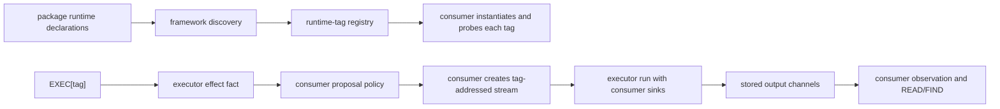

# plurnk-execs — Specification

Author contract for `@plurnk/plurnk-execs-*` runtime packages. Core consumes
the framework; executor leaves implement it.

## §executor-role Role and ownership

An executor owns the runtime-specific mapping from an EXEC body and optional
target to work, declared output channels, environment availability, and effect
classification. The consumer owns dispatch, proposal policy, storage,
subscriptions, deadlines, polling, cancellation delivery, packet projection,
and all reads of stored output.



`SubprocessExecutor` is the concrete base for command runtimes. It owns child
process spawning, stdout/stderr streaming, environment handoff, exit status,
and process-group cancellation. A subprocess leaf normally overrides only its
spawn recipe and availability binary.

## §executor-contract Author surface

```ts
abstract class BaseExecutor {
    readonly runtime: string;
    readonly glyph: string;

    abstract get channels(): Readonly<Record<string, ChannelDecl>>;
    get defaultChannel(): string;
    abstract run(args: ExecArgs): Promise<ExecResult>;
    probe(signal?: AbortSignal): Promise<RuntimeAvailability>;
    effect(target: string | null): Effect;
}

interface ChannelDecl {
    mimetype: string;
    defaultState?: "active" | "closed" | "errored";
}

interface ExecArgs {
    runtime: string;
    command: string;
    cwd: string | null;
    target: string | null;
    env?: NodeJS.ProcessEnv;
    signal: AbortSignal;
    write(channel: string, chunk: string, mimetype?: string): void;
    setState(channel: string, state: ChannelState): void;
    emit(notice: Notice): void;
    entry?(
        path: string,
        content: string | null,
        opts: { tags: string[]; mimetype?: string },
    ): Promise<string>;
}

interface RuntimeAvailability {
    available: boolean;
    detail?: string;
}

type Effect = "pure" | "read" | "host";
```

The framework constructs one executor per matched runtime tag with
`{ runtime, glyph }`. A package that declares several tags may branch on
`this.runtime`; it must not retain per-run state on the executor instance. The
derived addressable runtime scheme retains `glyph` for client discovery
({§manifest-client-display}); runtime aliases remain excluded from scheme
model-teaching because EXEC examples own that hot-path surface.

### §executor-sinks Inputs and sinks

| Field      | Contract                                                                                                |
| ---------- | ------------------------------------------------------------------------------------------------------- |
| `runtime`  | The matched tag.                                                                                        |
| `command`  | The EXEC body: source, query, filter, or command according to the leaf contract.                        |
| `cwd`      | Consumer-selected project working directory, or `null` for a runtime that has none.                     |
| `target`   | Consumer-resolved optional EXEC target. The leaf defines how target and body map to its tool.           |
| `env`      | Exact child environment when supplied. A subprocess must use it instead of reconstructing host policy.  |
| `signal`   | Consumer cancellation. Every executor must honor it at each cancellable boundary.                       |
| `write`    | Append to a declared channel. An optional mimetype replaces that channel's per-call output type.        |
| `setState` | Move a declared channel from `active` to terminal `closed` or `errored`.                                |
| `emit`     | Publish a transient, nonterminal Notice.                                                                |
| `entry`    | Optionally request consumer-owned entry materialization and receive its canonical model-facing address. |

The executor receives callbacks, never a database, subscription registry,
packet builder, or wake mechanism. Related lifecycle behavior remains on the
consumer side of {§executor-role}.

### §executor-channels Channels

The executor declares every channel it may write. The consumer seeds a stream
entry from that declaration and rejects writes or state transitions for an
undeclared channel. `defaultChannel` is the fragmentless READ channel and
defaults to the first declared channel. Subprocess executors declare
`stdout` and `stderr`, with `stdout` first; logical runtimes commonly declare
`results`.

### §executor-results Results, failures, and notices

`run()` resolves one universal `SchemeResult`; `ExecResult` adds an optional
subprocess `exitCode`. A result with `status >= 400` carries exactly one RFC
9457 Problem whose status agrees with the result. Expected runtime failures
resolve as failure results and leave affected channels `errored`; they do not
throw. The consumer validates the boundary and converts a throw or invalid
result into its own durable failure before closing the stream.

A nonzero subprocess exit directs the caller to inspect both stdout and stderr
because either may contain the useful diagnostic. Third-party diagnostic text
entering a Problem is bounded with `ErrorDetail` and the required
`PLURNK_EXECS_ERROR_DETAIL_LIMIT`. Missing or invalid configuration is itself
an `invalid-configuration` failure. Structured diagnostic facts remain
separate Problem extensions.

`emit` is only for transient progress or other nonterminal observations. It
cannot own failure truth, change the terminal result, or drive the scheduler.
The runtime-neutral Notice types are re-exported from
`@plurnk/plurnk-contracts`; they are not redefined by this package.

### §executor-effect Effect is an admission fact

`effect(target)` is pure, synchronous, cheap, and target-classified. The
consumer calls it exactly once for an admitted invocation, before proposal
policy, then preserves that exact fact through application and effect-sensitive
bookkeeping. An installed executor does not parse authored code or commands to
infer safety. Unknown or unclassifiable work remains `host` through the
conservative default.

`target` is the consumer-canonical logical target. It is normally the same
local value later supplied to `run()`. If the consumer will materialize an
addressed source only after acceptance, it may classify against a stable opaque
target-present identity; the executor neither resolves that address nor
reclassifies the materialized path.

| Effect | Executor fact                                | Default consumer admission |
| ------ | -------------------------------------------- | -------------------------- |
| `host` | Runs host code or may mutate host state.     | Human proposal gate.       |
| `read` | Observes external state without mutating it. | Automatically accepted.    |
| `pure` | Has no externally observable side effect.    | Automatically accepted.    |

The classification controls admission policy and may be reused as operational
metadata; it never changes within the invocation. After acceptance, every EXEC
uses the same background stream path: output is not returned in the dispatching
turn. Core owns that composed behavior in {§exec-host-proposes},
{§exec-readpure-ungated}, and {§exec-stream}.

### §executor-probe Availability is per runtime tag

`probe(signal?)` reports whether this runtime tag can work in the current
environment. The default is `{ available: true }`; leaves override it for
external binaries or required configuration. `detail` must be terse and
actionable because the consumer may return it with a 501 failure.

The consumer constructs and probes one executor per tag at boot, concurrently
under a per-probe timeout, then caches each verdict. This is intentionally
per-tag: a multi-tag package can expose only the interpreters actually present.
A probe that spawns or opens a connection passes the supplied signal through so
completion or timeout reaps its work. Probe rejection or timeout makes only
that tag unavailable; a configured default runtime that is absent or
unavailable is a fail-hard boot error.

## §executor-output-address Tag-addressed output

`exec` is the consumer's internal EXEC dispatcher; it is not a model-facing
output namespace. Every available runtime receives one derived read-only
scheme face from its tag, channels, and default channel. The executor authors
no second scheme manifest.

| Output                    | Model-facing address                                               |
| ------------------------- | ------------------------------------------------------------------ |
| Calling worker's stream   | `<tag>:///<loop>/<turn>/<sequence>#<channel>`                      |
| Fragmentless read         | `<tag>:///<loop>/<turn>/<sequence>` → the declared default channel |
| Example subprocess stdout | `sh:///1/2/3#stdout`                                               |
| Example structured result | `sqlite:///1/2/3#results`                                          |

The executor only produces through `write` and `setState`. The consumer stores
the entry and serves every later READ/FIND through uniform entry machinery.
An executor does not implement a private read face, orientation receipt,
slicer, or index. Owner-qualified cross-worker addresses and packet projection
belong to core's {§stream-owner-scoped} and {§exec-stream} contracts.

### §executor-entry-sink Optional materialization

`entry(path, content, { tags, mimetype? })` is a consumer-implemented sink, not
executor access to storage. The consumer materializes or updates an entry,
unions tags, announces it through its ordinary ambience, and resolves the
canonical model-facing address. `content === null` requests consumer-sourced
acquisition. Rejection means only that this materialization failed; it does not
invalidate the executor's upstream result. When the sink is absent, the
executor preserves its result without inventing a materialization verdict.

## §executor-discovery Discovery and registration

`discover(options?)` scans every scoped and unscoped package under the nearest
`node_modules` for the exact declaration `plurnk.kind === "exec"`. It returns
`{ registry, packageAttributions, skipped, disabled }`, where the registry maps
each flat runtime tag to its declaration and package owner and the package map
carries the canonical attribution fact from {§plugin-attribution}.

```json
{
  "name": "@acme/acme-execs-cobol",
  "plurnk": {
    "kind": "exec",
    "runtimes": [
      {
        "name": "cobol",
        "glyph": "🗄",
        "example": "<<EXEC[cobol]:DISPLAY 'HI'.:EXEC"
      }
    ]
  }
}
```

A tag collision is a fail-hard installation error naming both claiming
packages. A package may declare multiple tags backed by the same default
export. Discovery is scope-agnostic; third-party packages participate through
the same contract.

### §executor-installation Installed capability lifecycle

Configuration cannot enable a package that is absent from the consumer-visible
module graph. An executor leaf must be installed under the `node_modules` found
from the running service before discovery can inspect its declaration. The
service assembles every installed member's package-owned `.env.defaults` under
operator configuration {§operator-config-env-defaults}; a leaf may therefore
ship default-disabled without transferring ownership of its key to the host.

| Package state | Effective policy and probe             | Runtime result                                                      |
| ------------- | -------------------------------------- | ------------------------------------------------------------------- |
| Absent        | Any configuration                      | Not discovered, registered, advertised, or dispatchable.            |
| Installed     | Tag disabled in any policy layer       | Listed in `Discovery.disabled`; not registered or advertised.       |
| Installed     | Tag admitted; probe unavailable        | Registered as unavailable; not advertised or dispatchable.          |
| Installed     | Tag admitted; probe available          | Registered, advertised through `availableRuntimes()`, dispatchable. |

An operator value of `PLURNK_EXECS_<TAG>=1` can outrank a package-owned `0`
floor. It does not restore a tag removed by `PLURNK_EXECS_ONLY`, another
consumer layer, or a service hard ceiling. Discovery and policy are evaluated
at boot; changing package membership or configuration requires a restart.

### §executor-runtime-declaration Runtime metadata

| Field           | Meaning                                                                                            |
| --------------- | -------------------------------------------------------------------------------------------------- |
| `name`          | Canonical runtime tag and derived output-scheme name, admitted below.                              |
| `glyph`         | Optional presentation glyph.                                                                       |
| `example`       | Optional compact, verbatim `plurnk` snippet. Each line is a complete `<<`-delimited operation.     |
| `documentation` | Optional full Markdown reference. `docs/<tag>.md` wins over the inline manifest field.             |
| `attribution`   | Published per-tag projection of the validated package declaration ({§plugin-attribution}).         |
| `packageName`   | Package that owns and default-exports the executor implementation.                                 |

The framework carries example and documentation content unchanged. The
consumer decides when and how to present either surface. A multi-tag package
appears at most once in `Discovery.packageAttributions`, and only when at least
one of its tags survives discovery policy. An instantiated executor may add
attempt-time tags through the shared runtime hook ({§plugin-attribution}).

Runtime-name admission is one identity contract:

| Constraint  | Contract                                                                                                      |
| ----------- | ------------------------------------------------------------------------------------------------------------- |
| Syntax      | `[a-z][a-z0-9+.-]*`: canonical lowercase RFC-scheme syntax that is also an admitted EXEC identifier.           |
| Identity    | The exact name is the EXEC selector, registry key, `docs/<tag>.md` basename, and output URI-scheme name.       |
| Reservation | `only` is unavailable because `PLURNK_EXECS_ONLY` owns that case-insensitive configuration key.               |

Installed static declarations, trusted dynamic-hook declarations, and
module-owned declarations use the same validator before documentation lookup,
policy filtering, or registry mutation. A malformed claimed declaration fails
hard and names its package or module boundary; discovery still ignores an
unreadable package that never forms an executor manifest.

### §executor-dynamic-runtimes Dynamic declarations

A trusted package whose tags depend on deployment configuration may declare
`plurnk.runtimesModule` as an exported subpath instead of a static
`plurnk.runtimes[]` array. Its named `runtimes` export, or default export,
returns `RuntimeDecl[] | Promise<RuntimeDecl[]>`. Static declarations win when
both fields are present.

Discovery resolves the subpath through the package export map and imports it
only after the trust gate. An unloadable hook, missing function export, thrown
hook, or non-array result is a fail-hard contract violation by the admitted
package. The hook enumerates configuration; reachability remains the per-tag
probe's job.

### §executor-trust Trust precedes executable discovery hooks

The shared plugin trust predicate runs before a dynamic runtime module is
imported. A withheld package executes no hook and is returned in
`Discovery.skipped` for consumer presentation. Discovery silently ignores a
package that does not form a readable executor manifest; once an admitted
package declares executable hook code, its broken hook is surfaced rather than
swallowed.

### §executor-policy Subtractive runtime policy

Discovery applies the daemon's registration policy to every tag. The exported
`Policy` parser can apply the same grammar to additional consumer-owned layers.

| Variable                                 | Enforced effect                                             |
| ---------------------------------------- | ----------------------------------------------------------- |
| `PLURNK_EXECS_<TAG>=0` or `false`        | Remove that tag. Keys are matched case-insensitively.       |
| `PLURNK_EXECS_ONLY=<list>`               | When present, remove every unlisted tag; empty removes all. |
| `Policy.isKey(key)`                      | Admit only `ONLY` or a canonical runtime-tag suffix.        |
| `Policy.enabledAcross(tag, [a, b, ...])` | Keep the tag only when every supplied layer enables it.     |

Policy is purely subtractive: no layer can re-enable a tag removed by another.
Boot-disabled tags are absent from the registry and returned in
`Discovery.disabled`. Workspace and loop admission remain consumer concerns;
the framework does not define a second Active/Available state machine.

### §executor-advertise-compat Frozen `Advertise` compatibility

| Surface                              | 1.x contract                                                                                                |
|--------------------------------------|-------------------------------------------------------------------------------------------------------------|
| `Advertise.contribute(registry, fn)` | Filters the supplied registry; returns `NO_EXECS_NOTICE` only when the filtered result is empty.            |
| Architectural ownership             | None. It does not discover, probe, admit, dispatch, or render; the composed service never calls it.         |
| Evolution                            | Frozen. New consumers compose discovery and `Policy` with their own presentation. Removal is SemVer-major. |

## §executor-default-inventory Current installed set

The default `@plurnk/plurnk-service` composition installs the following
`@plurnk/plurnk-execs-<leaf>` packages. The lean framework owns no leaf
dependency edges. A probe and consumer policy still determine which declared
tags are offered in a particular workspace ({§bundled-set}).

| Leaf     | Declared tags                                                                                              | Effect by target                | Channels / mimetype                |
| -------- | ---------------------------------------------------------------------------------------------------------- | ------------------------------- | ---------------------------------- |
| `common` | `sh`, `bash`, `node`, `python`, `python3`, `perl`, `ruby`, `php`, `lua`, `deno`, `bun`, `tcl`, `bc`, `awk` | `host`                          | `stdout`, `stderr` / `text/stream` |
| `git`    | `git`                                                                                                      | `host`                          | `stdout`, `stderr` / `text/stream` |
| `search` | `search`, `images`, `videos`, `news`, `map`, `music`, `it`, `science`, `social`, `downloadable`            | `read`                          | `results` / `application/json`     |
| `jq`     | `jq`                                                                                                       | no target `pure`; target `read` | `results` / `application/jsonl`    |
| `sqlite` | `sqlite`                                                                                                   | memory `pure`; file `host`      | `results` / `application/json`     |
| `wasm`   | `wat`, `wasm`                                                                                              | no target `pure`; file `read`   | `results` / `application/json`     |

Optional executor packages are not part of this installed set merely because
they exist in the workspace.

## §executor-subprocess Subprocess contract

`SubprocessExecutor` translates a runtime, body, and optional target into:

```ts
interface SpawnArgs {
    cmd: string;
    args: string[];
    useShell: boolean;
    stdin?: string;
}
```

### §executor-subprocess-routing Default routing

| Runtime                    | No-target spawn                                                      |
| -------------------------- | -------------------------------------------------------------------- |
| `sh` / `bash`              | Shell command line.                                                  |
| `node`                     | `node -e <command>`.                                                 |
| `python` / `python3`       | `python3 -c <command>`.                                              |
| Other default-base runtime | `<runtime> -c <command>`; specialized leaves override this fallback. |

With a target, the target is the program and the body is its stdin. Core
stat-routes a directory target to `cwd`; a file remains the executor target.
Data runtimes define their own target mapping.

Subprocess leaves inherit stdout/stderr streaming, scoped-environment handoff,
availability probing, operation results, exit code, and process-group
cancellation. `CommandSyntaxError` during spawn translation becomes a durable
400 `invalid-command`; other translation exceptions remain plugin contract
violations for the consumer to contain.

### §executor-cancellation Cancellation and consumer timing

Executors know only the supplied `AbortSignal`. Core owns EXEC timeout and poll
syntax, timers, wakes, and loop lifetime in {§exec-timeout} and {§exec-poll}.
Subprocess cancellation signals the process group: a caller-supplied kill code
is delivered once; ordinary cancellation uses SIGHUP; loop-end housekeeping
may escalate after the consumer-provided grace period.

## §executor-consumer-boundary Required composition

The consumer:

1. discovers declared tags, instantiates and probes each tag, and caches the verdict;
2. registers a derived output scheme for every admitted, available tag;
3. resolves EXEC to exactly one tag and obtains its effect fact;
4. applies proposal policy, creates the stream entry, and supplies sinks plus cancellation;
5. validates the terminal result and closes every declared channel and subscription coherently; and
6. projects stream observations and later reads without calling back into the executor.

## §executor-forbidden Forbidden in executor leaves

- Direct database, subscription, packet, or wake access.
- Imports from `@plurnk/plurnk-service/*`.
- Mutation of `ExecArgs` or state retained across runs.
- Output through `console.*` instead of declared channels.
- Writes or state transitions for undeclared channels.
- Ignoring `args.signal` at a cancellable boundary.
- A process or network mechanism unrelated to the leaf's declared runtime domain.
