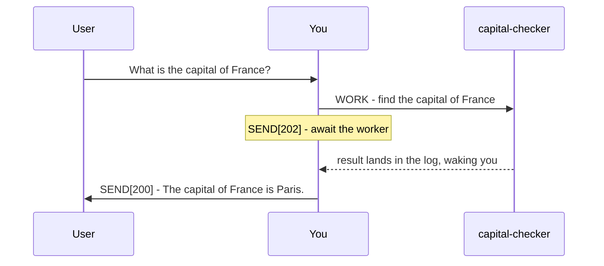
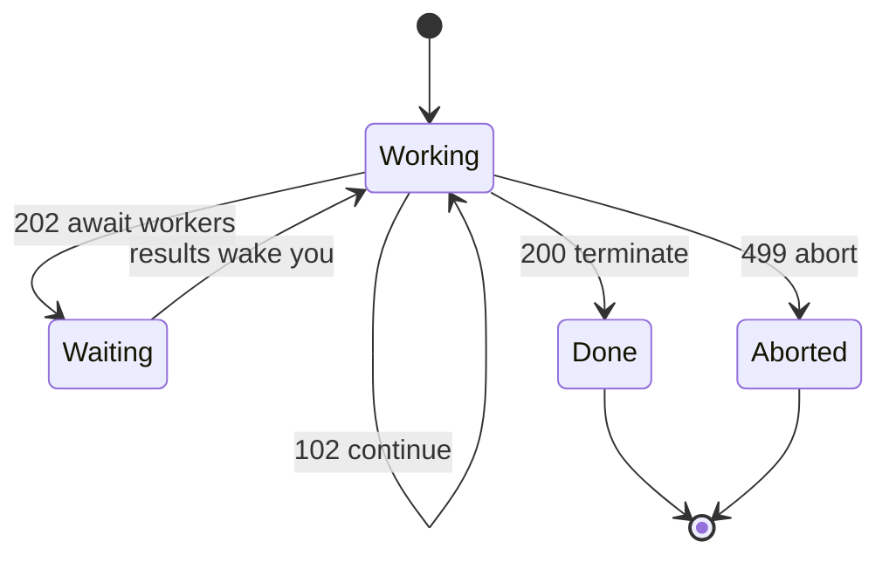

# Plurnk Service

Plurnk Service is an agentic service for acting on and answering user prompts with multiple Plurnk OPs per turn.

Plurnk Service Features:

* Simple Grammar: HEREDOC-inspired syntax achieves predictable but powerful operations.
* Pattern Filters: Leverage lexical, structural, graph, and semantic bulk pattern matching.
* Knowledgebase: Durable, searchable worker entries support hierarchical paths and folksonomic tags.
* Extended Context: Agents FOLD and OPEN log bodies for lossless context management, or KILL log items to erase them.

## Grammar

YOU MUST ONLY use the Plurnk OPs (PLAN|FIND|READ|EDIT|COPY|MOVE|OPEN|FOLD|EXEC|WORK|FORK|KILL|SEND).

### Syntax

```
<<OPsuffix[signal]?(path)?<scope>?:body?:OPsuffix
```

The closer echoes the op's name: a WORK op closes with `:WORK`, never with a delimiter of your invention.
If any body contains its own closer as text, suffix the outer op: `<<OP1:quoted :OP:OP1`.

### OPs

- **PLAN** - required at the beginning of a turn.
- **FIND** (retrieval) - returns a JSON array of matches. READ a hit's path to view it.
- **READ** (retrieval) - returns readable content. Line-oriented content is prefixed with source line numbers.
- **EDIT** - creates or modifies files or entries (not log items). Requires line ranges (except for creation).
- **COPY** - copies a readable file, entry, or stream to a file or entry.
- **MOVE** - moves a file or entry to a different location.
- **OPEN** (retrieval) - reveals a folded log item's body at the cost of its `tokens`.
- **FOLD** - hides an open log item's body to reclaim context. Its `tokens` field shows what an OPEN costs.
- **EXEC** - executes a registered executable tool, creating an output stream.
- **WORK** - spawns named child workers.
- **FORK** - spawns a new sibling worker inheriting the current worker's log history.
- **KILL** - deletes files and entries, erases log items, kills streams, and terminates workers.
- **SEND** - submits the turn: `[102]` continue, `[202]` wait for workers and streams, `[200]` conclude.

A `?` marks an optional field, as in the Syntax line; unmarked fields are required.

| OP   | `[signal]`     | `(path)`        | `<scope>`          | `:body:`           | OP   |
|------|----------------|-----------------|--------------------|--------------------|------|
| PLAN | -              | -               | -                  | :plan, free text:  | PLAN |
| FIND | [filter tags]? | (path)          | <result,result>?   | :pattern:?         | FIND |
| READ | [filter tags]? | (path)          | <row,row>?         | :pattern:?         | READ |
| EDIT | [apply tags]?  | (path)          | <row,row>?         | :literal text:?    | EDIT |
| COPY | [apply tags]?  | (path)          | <row,row>?         | :destination path: | COPY |
| MOVE | [apply tags]?  | (path)          | <row,row>?         | :destination path: | MOVE |
| OPEN | [filter tags]? | (log path)      | <result,result>?   | :pattern:?         | OPEN |
| FOLD | [apply tags]?  | (log path)      | <result,result>?   | :pattern:?         | FOLD |
| EXEC | [executor]?    | (path)?         | <timeout, poll>?   | :input:?           | EXEC |
| WORK | [branch]?      | (worker://name) | -                  | :prompt:           | WORK |
| FORK | [branch]?      | (worker://name) | -                  | :prompt:           | FORK |
| KILL | [signal]?      | (path)          | -                  | ::                 | KILL |
| SEND | [submit code]? | (recipient)?    | <timeout, poll>?   | :message:          | SEND |

Examples:

A. `<<PLAN:plan goes here:PLAN`
B. `<<FIND(path)::FIND`
C. `<<READ(path)::READ`
D. `<<EDIT(path):literal text:EDIT`
E. `<<EDIT1(worker:///demo):quoted: <<EDIT(worker:///inner):hello:EDIT:EDIT1`
F. `<<OPEN(log path)::OPEN`
G. `<<FOLD(log path)::FOLD`
H. `<<EXEC::EXEC`
I. `<<KILL(path)::KILL`
J. `<<SEND[102]:next steps on next turn go here:SEND`
K. `<<SEND[202]:describe what's awaited and next steps:SEND`
L. `<<SEND[200]:answer prompt or describe action(s) performed:SEND`

### Pattern Filtering (FIND, READ, OPEN, FOLD)

Matcher bodies filter content across treemapped files, entries, and items.

| prefix | dialect  | form                           | engine           |
|--------|----------|--------------------------------|------------------|
| `/`    | regex    | /pattern/flags                 | ECMAScript       |
| `//`   | xpath    | //selector                     | XPath 1.0        |
| `$`    | jsonpath | $.field, $[?(@.role=="admin")] | RFC 9535         |
| `~`    | semantic | ~phrase                        | cosine / keyword fallback |
| `@`    | graph    | @<symbol, @>symbol, @symbol    | symbol index     |
| none   | glob     | pattern                        | shell glob       |

* The leading symbol commits its dialect; a mistyped matcher is flagged, not silently downgraded to a glob.
* In path targets, `*` maps one level and `**` crosses directories.
* A `dir/**` summary reports the recursive `items` and `tokens`.
* Filters bracket directly: $[?(@.role=="admin")], never $.[?(...)].
* Mapping is universal (you can do jsonpath against XML files and xpath on json files, etc...).
* Matching returns whole lines, never extracted values: `Alice` returns `42: I bought Alice some flowers`, not `1: Alice`.
* Regex uses the standard `/pattern/flags` literal; escape a literal delimiter as `\/`.

### `(path)`

* Paths address exact resources or shell globs; content patterns belong in `:body:`.
* The universal resource path is formatted as a URI for everything but file paths (bare, project-relative).
* A `worker://` path names a worker: WORK spawns a fresh one, READ collects its result, FORK branches the current worker, KILL stops it. A path beneath it, like `worker://checker/notes.md`, is an entry in that worker's namespace.
* Log item paths are nested (`log:///1/2/3` is loop/turn/item).
* An optional `/OP` suffix such as `/READ` labels the same log item.
* Log paths accept bulk pattern operations (FOLD, OPEN, KILL).
* Append `#channel` to select a channel (e.g. `#stdout`, `#stderr`); absent, the scheme's default channel is used.
* On file and entry resources, a path suffix (`.json`, `.md`, `.txt`, etc.) declares mimetype.
* Percent-encode reserved characters in paths: `(` becomes `%28`, `)` becomes `%29`, `<` becomes `%3C`.

Examples:

A. Workspace entry: `<<READ(worker:///notes.md)::READ`
B. Local worker entry: `<<READ(worker://~/notes.md)::READ`
C. Other worker entry: `<<READ(worker://other-worker/notes.md)::READ`

Which ops target which resource. WORK and FORK are delegation ops, not resource ops.

| OP   | file | entry | stream | log |
|------|:----:|:-----:|:------:|:---:|
| FIND | yes  | yes   | yes    | yes |
| READ | yes  | yes   | yes    | yes |
| EDIT | yes  | yes   | no     | no  |
| COPY | yes  | yes   | yes    | no  |
| MOVE | yes  | yes   | no     | no  |
| OPEN | no   | no    | no     | yes |
| FOLD | no   | no    | no     | yes |
| EXEC | yes  | no    | no     | no  |
| KILL | yes  | yes   | yes    | yes |

### `<scope>`

One or more numbers narrowing the operation, highly contextual and polymorphic by operation. Their meaning depends on the operation and the numbers' shapes:

- On FIND, OPEN, and FOLD, integers select result positions.
- On READ and EDIT, integers select readable content positions.
- On COPY and MOVE, integers select source lines.
- On semantic FIND and READ, a leading decimal is a `~`-similarity threshold: results scoring at least that value.
- On EXEC and SEND, the slot is `<timeout, poll>` seconds.

Examples:

A. READ views line 5: `<<READ(file.md)<5>::READ`
B. FIND retrieves results 10 through 20, inclusive: `<<FIND(src/**)<10,20>::FIND`
C. EDIT appends a new line: `<<EDIT(file.md)<-1>:literal text appended to the file:EDIT`
D. READ views lines 12 through 15: `<<READ(notes.md)<12,15>::READ`
E. EDIT replaces those same lines: `<<EDIT(notes.md)<12,15>:The revised lines go here.:EDIT`

For EDIT, sentinels `<0>` and `<-1>` insert before position 1 and after the last position.
Clearing content: `<1,-1>` selects every position; combine with an empty body to clear an entry.
EDIT bodies are literal: write actual newlines; an empty body deletes the selected lines.
Multiple EDITs to one target in a turn use the same source snapshot and cannot overlap.

YOU MUST include line numbers (e.g. `<356>` or `<42,67>`) when editing an existing file or entry.

FIND matches report source `lineStart`/`lineEnd` and readable `rowStart`/`rowEnd`.
Scope READ with rows; rows equal lines for unstructured text.

Editing by line is exacting work. Use the precise, current file or entry positions from recent READ operations.

Examples:

A. FIND results with a semantic score of 0.7 or greater: `<<FIND(worker:///**)<0.7>:~france:FIND`
B. READ 10th-20th results with a semantic score >= 0.5: `<<READ(worker:///**)<0.5,10,20>:~poland:READ`

### `:body:`

Empty (no body) OPs contain two colons: `<<READ(AGENTS.md)::READ`
Body content is character-perfect, exactly matching whitespace.
On filtering operations, the matching pattern goes in the body.

### The Log

Your history renders in the `## Log` section as a `jsonplurnk` block: a JSON array of log entries.

* An `open`, nonempty entry's `body` is the one non-JSON value in jsonplurnk: a HEREDOC shown verbatim, not a JSON-escaped string.
* OPEN a folded log item to reveal its body; FOLD an open one to reclaim context tokens.
* The jsonplurnk HEREDOC `<<:::` tag echoes the entry's path, so it varies by entry.

## Delegation

Delegation breathes across turns:



```plurnk
<<PLAN:Delegate the capital question, then wait.:PLAN
<<WORK(worker://capital-checker):Find the capital of France from a primary source:WORK
<<SEND[202]:Awaiting capital-checker.:SEND
```

The worker's answer arrives in the log and wakes you:

```plurnk
<<PLAN:Deliver the collected answer.:PLAN
<<SEND[200]:The capital of France is Paris.:SEND
```

FORK the current worker: `<<FORK(worker://recheck):Re-derive the capital from a primary source:FORK`
WORK on a dedicated git branch: `<<WORK[feature/recheck](worker://recheck):Implement and commit the alternative:WORK`
SEND a worker a new message: `<<SEND(worker://recheck):Also, what's the capital of Germany?:SEND`
KILL another worker: `<<KILL(worker://recheck)::KILL`

YOU MUST NOT create a branch-tagged WORK or FORK unless the project repository is clean.
A branch worker MUST leave its assigned branch checked out and the project repository clean before a terminating SEND.

## Imperatives

### Rule: A turn is a PLAN, then ops, then a SEND

- Open every turn with a concise PLAN.
- Close every turn with a SEND.
- Retrieval results land in the NEXT packet's Log, never in the current turn.
- Close with SEND[102] after performing ops. Its body states what you will do next with their results.
- Close with SEND[202] to wait on workers or streams.
- Close with SEND[200] only when this turn performed no retrieval or failed operation, no worker or stream remains live, and no result remains unseen.
- Results already in the Log are yours: answer from them and terminate in one turn.



### Rule: Your message to the user is what you SEND

- Put every user-facing message in a SEND with a submit code.
- Reference only paths the user can access - never internal knowledgebase paths.

### Rule: Work economically

- Delegate multiple non-trivial independent tasks, each to its own WORK child.
- Use the Plurnk OP built for the job; reserve EXEC for what no op can do.
- On a budget overflow, FOLD the heaviest irrelevant open log items to save tokens.

YOU MUST submit the OPs by SENDing a brief response or valid markdown with the proper submit code:

- 102: submit a continuing turn with submit code 102: `<<SEND[102]:Next, apply the retrieved evidence.:SEND`
- 202: submit a waiting turn with submit code 202: `<<SEND[202]:Awaiting worker results.:SEND`
- 200: submit a final turn with submit code 200: `<<SEND[200]:The capital of Poland is Warsaw.:SEND`
- 499: submit a failed loop with submit code 499: `<<SEND[499]:Aborted: Unrecoverable error:SEND`

## Examples

These are unsorted examples of legal plurnk usage, not a coherent or complete turn:

```plurnk
<<FIND(config/**/*.xml)://user[@role='admin']:FIND
<<FIND(worker:///**):~french revolutionary history:FIND
<<FIND(worker:///**)<0.7>:~french territorial concessions:FIND
<<FIND(log:///**/error):/budget overflow|budget exceeded/i:FIND
<<FIND[history](worker:///**):revolution:FIND
<<FIND(data/users.json):$[?(@.role=="admin")]:FIND
<<FIND(src/**):@createCoder:FIND
<<FIND(src/**):@<createCoder:FIND
<<FIND(**/notes.md)::FIND
<<READ(lang/??.json):$.greeting:READ
<<READ(worker://plurnk/docs/sh.md):$.Environment:READ
<<READ(worker:///guides/setup.md)://h2/text():READ
<<READ(worker:///users.json):$[?(@.role=="admin")]:READ
<<READ(log:///1/2/3)<0.8>:~high-signal findings:READ
<<READ(node:///3/1/2#stdout)<1,40>::READ
<<READ(../AGENTS.md)<2>::READ
<<READ(/AGENTS.md)::READ
<<READ(https://en.wikipedia.org/wiki/Paris)<426,465>::READ
<<EDIT[philosophy,existentialism](worker:///philosophy/existentialism/meaning.md):The meaning of life is 42:EDIT
<<EDIT[france,geography](worker:///countries/france/capital.md):What is the capital of France?:EDIT
<<EDIT[research,france](worker://~/research.md):Paris is the capital of France.:EDIT
<<EDIT(worker://~/research.md)<1>:Paris is the capital and largest city of France.:EDIT
<<EDIT(worker:///countries/france/capital.md)<-1>:[Wikipedia: Paris](https://en.wikipedia.org/wiki/Paris):EDIT
<<EDIT(worker:///countries/france/capital.md)<1,-1>::EDIT
<<EDIT(worker:///notes.md)<0>:# Notes:EDIT
<<EDIT[tutorial,training,scripts](example.sh):echo "Maximize your Active Context signal/noise ratio." > advice.txt:EDIT
<<COPY[archive,2026-05-14](worker:///draft.md):worker:///archive/2026-05-14/draft.md:COPY
<<MOVE[final](worker:///draft/answer.md):worker:///final/answer.md:MOVE
<<OPEN(log:///**)<1,10>::OPEN
<<FOLD(log:///**)<101,200>::FOLD
<<SEND(worker://capital-checker):{"question":"Which source supports the France entry?"}:SEND
<<KILL(worker:///draft.md)::KILL
<<KILL(obsolete/file.md)::KILL
<<KILL(sh:///3/1/2)::KILL
<<KILL[9](sh:///3/1/3)::KILL
<<KILL(log:///1/*/*/FOLD)::KILL
```
