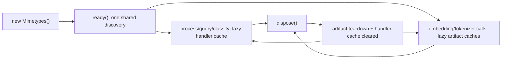
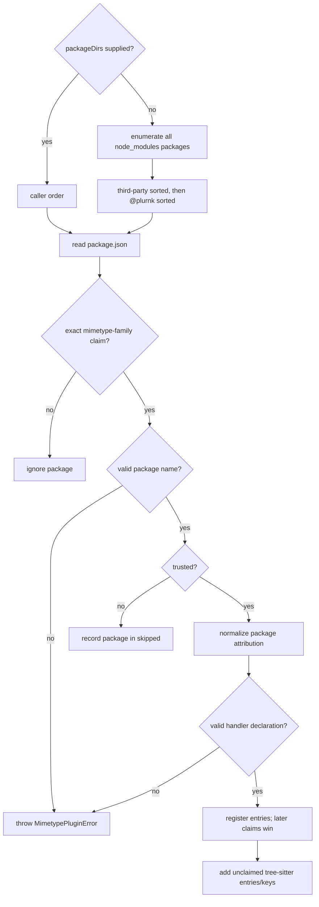
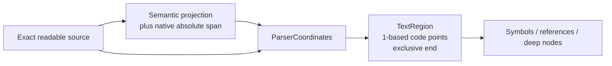
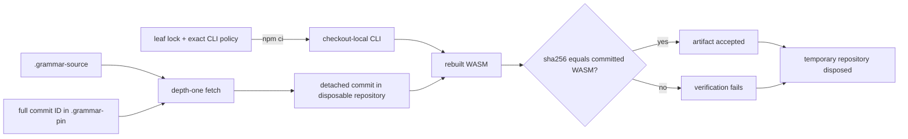

# @plurnk/plurnk-mimetypes — Specification

This document defines the handler contract, pipeline, data shapes, and policies
owned by the framework. Handler packages implement it; plurnk-service consumes
the composed projection service.

TypeScript exports define the executable API. This document defines the
behavioral contract for handler authors and consumers.

---

## §mimetype-handler-contract 1. Handler contract

The exported `BaseHandler`, `HandlerContent`, `HandlerMetadata`, and channel
types own the executable TypeScript surface. Handler packages normally extend
`BaseHandler`, `TreeSitterExtractor`, or `AntlrExtractor` and override only the
behavior their content algebra supports.

| Surface                   | Default                                         | Handler responsibility                                                        |
|---------------------------|-------------------------------------------------|-------------------------------------------------------------------------------|
| `extractRaw(content)`     | `[]`                                            | Emit structured definitions for the `symbols` channel.                        |
| `deepJson(content)`       | `null`                                          | Emit the algebra's faithful structural value for JSONPath.                    |
| `deepXml(content)`        | Project `deepJson`, then the symbol outline.    | Override only when native markup is more faithful.                            |
| `references(content)`     | `[]`                                            | Emit classified symbol uses, never definitions.                               |
| `content(content)`        | `undefined`                                     | Emit readable text only when it differs from the raw body.                    |
| `validate(content)`       | No-op                                           | Reject content only when the mimetype has a meaningful validity check.        |
| `query(...)`              | Text and structural dialect dispatch.           | Override when native parsing can provide more faithful evidence.              |
| `symbolsRaw(content)`     | `format(await extractRaw(content))`             | Human/diagnostic outline; not a model-facing projection channel.              |
| `toText(content)`         | String passthrough; binary content unsupported. | Supply readable text for binary regex/glob matching and embedding when valid. |

§mimetype-handler-authority The handler owns the material in each projection.
The framework owns detection, handler routing, channel selection, the default
JSON-to-XML projection, and shared references/query engines. Consumers own
storage, packet rendering, and token budgets.

§mimetype-handler-content A package-level `plurnk.binary: true` declaration
selects `Uint8Array` rather than UTF-8 decoding when the framework reads a
filesystem path. Text handlers otherwise receive a `string`. Inline callers
supply `ProcessInput.content` in the declared shape; the framework does not
coerce an explicitly supplied value.

Handler identity (`mimetype`, `glyph`, and `extensions`) is injected from the
discovered package declaration at construction. The orchestrator validates the
handler surface structurally before caching it; class identity is not part of
the contract.

### §mimetype-lifecycle 1.1 Orchestrator lifecycle



Every discovery-dependent public method awaits `ready()` internally, and
concurrent first calls share the same discovery promise. `dispose()` is
idempotent: it releases the embedding/tokenizer seams and drops handler
instances while retaining discovery. A disposed orchestrator may be used again;
handlers and artifacts then resolve lazily.

## 2. `package.json` `plurnk` discovery block

A package declares one or more mimetype handlers via a uniform `handlers` array. Single-handler and multi-handler packages use the same shape — no primary/alias asymmetry.

```json
{
    "plurnk": {
        "kind": "mimetype",
        "handlers": [
            { "name": "text/x-python", "glyph": "🐍", "extensions": [".py", ".pyw"] }
        ]
    }
}
```

Multi-handler example (one package serving variants of the same content type):

```json
{
    "plurnk": {
        "kind": "mimetype",
        "handlers": [
            { "name": "application/json",  "glyph": "📋", "extensions": [".json"] },
            { "name": "application/jsonc", "glyph": "📋", "extensions": [".jsonc"] }
        ]
    }
}
```

| Field         | Type               | Required | Contract                                                                                                                                                             |
|---------------|--------------------|----------|----------------------------------------------------------------------------------------------------------------------------------------------------------------------|
| `kind`        | `"mimetype"`       | yes      | Selects this plugin family ({§plugin-family-kind}).                                                                                                                  |
| `binary`      | boolean            | no       | `true` when every handler entry consumes `Uint8Array`; default `false`.                                                                                              |
| `attribution` | string \| string[] | no       | Package declaration normalized once into `Discovery.packageAttributions`; `HandlerInfo.attribution` is its published per-handler projection ({§plugin-attribution}). |
| `handlers`    | `HandlerDecl[]`    | yes      | One or more peer handler entries.                                                                                                                                    |

The containing `package.json` `name` must be a valid current npm package name.

`HandlerDecl`:

| Field        | Type     | Required | Contract                                                                                                        |
|--------------|----------|----------|-----------------------------------------------------------------------------------------------------------------|
| `name`       | string   | yes      | RFC 6838 restricted type/subtype name registered by this entry (`text/markdown`, `application/json`, …).        |
| `glyph`      | string   | no       | Display marker; defaults to an empty string.                                                                    |
| `extensions` | string[] | no       | Dotted entries are case-insensitive extensions; bare entries are case-sensitive filenames such as `Dockerfile`. |

§mimetype-discovery `discover()` uses one scope-agnostic, trust-gated path for
first- and third-party packages:



The trust predicate runs before handler code import and withheld package names
remain observable in `skipped` ({§plugin-trust-boundary}). A package claim for a
tree-sitter mimetype suppresses that built-in entry; otherwise the built-in
entry fills only unclaimed extension/filename keys.

`Discovery.packageAttributions` contains one canonical fact for each package
represented by at least one final package-sourced handler. A package whose
handlers are all replaced by the family's later-claim collision rule contributes
no discovery attribution; tree-sitter framework entries never contribute one.

§mimetype-plugin-failure A missing manifest or package outside the mimetype
family is ignored, and a withheld package is reported without importing its
code. A trusted family claim with a malformed declaration fails discovery. A
registered handler's import, construction, or structural validation failure
throws `MimetypePluginError` with package and mimetype identity and preserves
its original cause when one exists.

§mimetype-package-resolution Registration and default loading use the same
consumer package graph. The default loader anchors Node package-root resolution
at `DiscoverOptions.cwd` (or `process.cwd()`), then dynamically imports the
resolved URL.

| Package root                                           | Default loading contract                                                                                  |
|--------------------------------------------------------|-----------------------------------------------------------------------------------------------------------|
| Condition-neutral export or `default` mapping          | Portable authoring shape; resolves from the consumer root and loads.                                      |
| Root visible to an active require/custom condition     | Resolves under the process's actual Node conditions and loads.                                            |
| `import`-only conditional root                         | Not resolved automatically; plugin failure propagates, or the caller supplies a `HandlerLoader`.          |
| Injected `HandlerLoader`                               | Caller owns resolution and loading for an unusual package graph.                                          |

The framework does not change daemon flags, install process-global module
hooks, or implement a second package-exports resolver.

### 2.1 Mimetype naming convention

The family follows a single resolution order. Authors of new handlers MUST consult these sources in order:

1. **IANA Media Types Registry** ([iana.org/assignments/media-types](https://www.iana.org/assignments/media-types/media-types.xhtml)) — if a mimetype is IANA-registered for the format, use it. This always wins. Pre-registration `application/x-foo` and `application/vnd.*` variants are abandoned in favor of the registered name (e.g. `application/protobuf`, not `application/x-protobuf`; `application/vnd.datalog`, not `text/x-datalog`).
2. **GitHub Linguist** (`codemirror_mime_type` and aliases in `languages.yml`) — the de facto convention used by tooling-side ecosystems (Linguist, mime-db, VS Code, freedesktop). Adopt when IANA is silent. Examples: `text/x-pgsql` for PostgreSQL, `text/x-mysql` for MySQL/MariaDB, `text/x-csrc` for C source.
3. **House style: `text/x-{lang}`** — the IETF experimental tree, used uniformly for source code in non-registered languages (Rust, Go, Kotlin, Swift, Elixir, Zig, etc.).

**Multiple legitimate conventions:** when two or more equally-supported names exist (e.g. `text/x-cpp` is house-style coherent, `text/x-c++src` is the Linguist convention), register all of them. Each becomes its own handler entry pointing to the same class. Consumers using any of them get correct routing. Example:

```json
{
    "plurnk": {
        "kind": "mimetype",
        "handlers": [
            { "name": "text/x-cpp",     "glyph": "🟦", "extensions": [".cpp", ".cc", ".cxx", ".hpp", ".hh", ".hxx", ".h"] },
            { "name": "text/x-c++src",  "glyph": "🟦", "extensions": [".cpp", ".cc", ".cxx", ".hpp", ".hh", ".hxx", ".h"] },
            { "name": "text/x-c++",     "glyph": "🟦", "extensions": [".cpp", ".cc", ".cxx", ".hpp", ".hh", ".hxx", ".h"] }
        ]
    }
}
```

**Do not:**
- Use `text/{lang}` without the `x-` prefix unless the format is IANA-registered (`text/markdown`, `text/csv`, `text/javascript` are fine — they're registered; `text/python` is not registered, so use `text/x-python`).
- Append `-sql`, `-cli`, `-script`, etc. to differentiate dialects. The bare dialect name is the convention: `text/x-sqlite`, `text/x-pgsql`, `text/x-redis` — not `text/x-sqlite-sql`, `text/x-redis-cli`.
- Retain a superseded pre-registration alias past the next semver-major boundary.

**SQL dialect summary:** `text/x-sqlite`, `text/x-pgsql`, `text/x-mysql` (covers MariaDB-compat too), `text/x-tsql`, `text/x-plsql`. Generic / dialect-agnostic SQL is IANA's `application/sql` (RFC 6922) — reserved for cases where the dialect truly isn't known.

**Resolution semantics for multi-handler packages.** Detection returns the matched name — never collapsed to another entry in the same package. A `.jsonc` file resolves to `application/jsonc`; a `.json` file resolves to `application/json`; an explicit `hint: "application/jsonc"` resolves to `application/jsonc`. `ProcessResult.mimetype` reflects the matched name so consumers (notably plurnk-service's `entry_channels.mimetype` column) preserve the variant identity.

**Handler instantiation for multi-handler packages.** Each registered name produces its own handler instance with its own metadata. Handlers may branch behavior on `this.mimetype` — e.g., `validate()` can be strict for `application/json` and permissive for `application/jsonc`. The handler class is the same across all entries; only the per-instance metadata differs.

## §mimetype-symbol 3. `MimeSymbol`

The exported `MimeSymbol` and `SymbolKind` types own the executable shape and
closed kind vocabulary. Their behavioral invariants are:

| Field group           | Invariant                                                                                                     |
|-----------------------|---------------------------------------------------------------------------------------------------------------|
| `name`, `kind`        | Identify one named structural definition using the exported `SymbolKind` vocabulary.                          |
| `line`, `endLine`     | Positive and 1-based. Line-only symbols use an inclusive interval; complete regions use exact endpoint lines. |
| `column`, `endColumn` | Present together; complete {§text-region}: Unicode code points, start included, end excluded.                 |
| `params`              | Function/method parameter spellings when the grammar exposes them; omitted otherwise.                         |
| `level`               | Heading depth from 1 through 6; meaningful only for `heading`.                                                |
| `container`           | Qualified path of enclosing emitted definitions; absent at top level.                                         |

### §mimetype-symbol-container 3.1 Container

`container` is the dot-joined path of the enclosing *emitted* named symbols: `parse` inside class `Parser` carries `container: "Parser"`; a method on a nested class carries `"Outer.Inner"`. Absent (not empty-string) for top-level symbols. Rules:

- Only symbols the handler actually emits participate in the path — anonymous scopes and unemitted wrappers contribute nothing.
- A segment whose own name is dotted (Elixir `defmodule Foo.Bar`, TOML `[database.options]`) is used verbatim as one segment; consumers must not assume segments are dot-free.
- `container` is extraction-time truth and the def-side identity the code graph links on: `(entry, container, name)`. `buildTree`'s line-range containment remains the render-time nesting mechanism; the two usually agree but `container` wins when they don't.

Columns follow the universal text-region convention ({§text-region}).

### Inclusion policy

Handlers emit named declarations that provide stable structural navigation and
graph identity:

- Include top-level, module, type, and class declarations; class members remain
  structural even when language visibility marks them private.
- Include durable data/document structure such as headings, CSV fields, and
  object keys when the handler's algebra defines them as symbols.
- Exclude function-local variables, control flow, comments, literals, and
  anonymous declarations.
- Imports and other symbol uses belong in `references`; exports do not become
  standalone definitions merely because they re-expose another declaration.

### Parameters

Functions and methods include `params` when the grammar exposes them:

- Plain names: `["source", "options"]`
- Destructured: `["{host, port}"]` (raw text)
- Rest: `["...args"]`
- Defaults: `["entryRule=\"program\""]` (included in the assignable text)

Omit `params` entirely when the language doesn't expose named parameters.

## §mimetype-outline 4. Outline format (`symbolsRaw` / `format`)

The framework owns outline rendering. Handlers produce structured `MimeSymbol[]`; `format(symbols)` turns it into a string. `BaseHandler.symbolsRaw` is the default `format(extractRaw(content))` composition.

**Tree hierarchy:**
- Heading symbols: nested by `level` field (1–6).
- Other symbols: nested by line-range containment. A symbol whose `[line, endLine]` is fully inside another's is its child.

**Line rendering:**
- Heading: `<indent># Name [line]` (hash count = level, indent = tree depth).
- Other: `<indent>kind name(params)? [line-endLine]` (kind prefix, params if present, range collapses to `[N]` when single-line).
- Indent unit: two spaces per depth level.

Example:
```
class Parser [5-47]
  method parse(source) [10-20]
  method load(dir) [22-45]
function topLevel(a, b) [50-60]
```

## §mimetype-channel-selection 5. Channel selection

`Mimetypes.process(input, { channels? })` materializes exactly the requested channels:

```ts
type Channel = "symbols" | "deepJson" | "deepXml" | "references" | "content" | "embedding";
```

- **Default set: `symbols`, `deepJson`, `deepXml`, `references`, `content`** (five). `content` performs no model inference ({§mimetype-content}); `embedding` does and must be requested explicitly ({§mimetype-embedding}).
- **Unrequested channels are not computed and their fields are absent** from `ProcessResult`. A channel an entry legitimately lacks (flat text has no deep tree) comes back *present but empty* (`[]` / `null` / `""`) — absence means "not asked," emptiness means "asked, nothing there."
- **`channels: []` is valid** — metadata only (`mimetype`, `ok`, `totalLines`), with no projection parse.
- The default deep-xml projection consumes the deep-json value; when `deepXml` alone is requested the framework computes deep-json internally without exposing it.

Current plurnk-service consumers:

| Consumer                           | Framework call / selection                              |
|------------------------------------|---------------------------------------------------------|
| Entry extent                       | `process(..., { channels: [] })`                        |
| Readable content projection        | `process(..., { channels: ["content"] })`               |
| Search-index structural derivation | `process(..., { channels: ["symbols", "references"] })` |
| Content matcher                    | `query(...)`; not a `process()` channel request         |
| Query-text embedding               | `process(..., { channels: ["embedding"] })`             |
| Bulk corpus embedding              | `embedBatch(...)`                                       |

The framework performs no packet budgeting and renders no preview. `format()`
is the unbudgeted human/diagnostic renderer for structured symbols.

## §mimetype-validation 6. `validate`

Default: no-op. Override only for mimetypes with a real syntax check that can fail (e.g., `application/json` throws on malformed JSON).

When `validate` throws inside `Mimetypes.process`, the error propagates to the caller per the error policy (§7).

## §mimetype-error-policy 7. Error policy

The exported `ProcessResult` type owns the executable field shape.

| Field family                         | Presence contract                                                                                  |
|--------------------------------------|----------------------------------------------------------------------------------------------------|
| `mimetype`, `ok`, `totalLines`       | Present on every returned result.                                                                  |
| Projection channel fields            | Present exactly when requested; an honest empty projection differs from an unrequested field (§5). |
| `grammarMissing`, `embeddingMissing` | Present only for the corresponding non-strict degradation.                                         |
| `embeddingModel`                     | Present only when the returned vector carries a model-space identity.                              |
| `searchExcluded`                     | Present when the current path matched the configured exclusion helper (§21).                       |
| `notices`                            | Present only when a successful result carries one or more non-fatal degradations ({§notice}).      |

`totalLines` is the editor-convention line count of the source content. Conventions:

- Logical editor lines: `abc\ndef` → `2`, `abc\ndef\n` → `2` (the trailing newline terminates rather than adds a line), `"\n"` → `1`, and `""` → `0`.
- **Binary content** (mimetypes flagged `binary: true` in their `plurnk` block - PDF, future images/archives): `totalLines: 0`. Lines are not a meaningful unit for the source bytes. A handler's readable `content` projection is independently line-addressable; `totalLines` does not describe that derived text.
- `0` on every returned error result (detection null or content unreadable). A propagated exception returns no `ProcessResult`.

| Failure                             | Current behavior                                                                                                                               |
|-------------------------------------|------------------------------------------------------------------------------------------------------------------------------------------------|
| Detection returns null              | `{ mimetype: null, ok: false, totalLines: 0 }`; no channel fields.                                                                             |
| Content path cannot be read         | `{ mimetype, ok: false, totalLines: 0 }`; no channel fields.                                                                                   |
| Registered handler cannot be loaded | `MimetypePluginError` propagates; no `ProcessResult`.                                                                                         |
| Tree-sitter grammar leaf is absent  | Non-strict mode preserves the mimetype and extent, returns empty requested structural channels, and sets `grammarMissing`; strict mode throws. |
| `validate()` throws                 | Propagates to the caller.                                                                                                                      |
| Handler channel method throws       | Propagates unless the selected extractor explicitly classifies the failure as an empty/null parse result.                                      |

§mimetype-artifact-absence A fixed artifact is absent only when module
resolution names that exact requested package as missing. A missing dependency,
incompatible export, or initialization fault in an installed artifact propagates.

## §mimetype-detection 8. Detection priority

`detect({ path?, ext?, hint? }, registry)` resolves in strict priority order,
highest wins:

1. `hint` — caller asserts a mimetype directly.
2. `path` basename matches a registered filename (`Dockerfile`, `Makefile`).
3. `ext` (explicit) or `extname(path)` matches a registered extension (case-insensitive, leading-dot enforced on lookup).

Returns the resolved mimetype string or `null`.

`Mimetypes.detect()` wraps the pure function and applies an optional fallback
from `MimetypesOptions.defaultMimetype`. When all lanes miss but a default is
configured, it returns that default. The fallback does not alter handler
discovery; an unknown default still produces the §7 handler-missing result.

## 9. Parser backends

### §mimetype-backend-selection 9.1 Backend selection hierarchy

Handler authors select the first backend that can meet the extraction and
portability contract:

| Priority | Backend                        | Selection rule                                                                                     | Published runtime                                     |
|----------|--------------------------------|----------------------------------------------------------------------------------------------------|-------------------------------------------------------|
| 1        | Framework tree-sitter registry | A faithful upstream grammar can build as clean WASM and use the shared mapping/runtime.            | Framework mapping plus one reproducible grammar leaf. |
| 2        | Dedicated portable parser      | Registry tree-sitter cannot meet the contract, but another parser or independently built WASM can. | Separate handler package with prebuilt artifacts.     |
| 3        | `antlr4ng` + grammars-v4       | No higher-priority backend is viable and a maintained ANTLR grammar satisfies extraction quality.  | Separate handler package; pure JavaScript runtime.    |
| 4        | Focused hand-written extractor | No maintained grammar is viable and the syntax is simple enough for a small, reviewable scanner.   | Separate zero-dependency handler package.             |

**Forbidden backends (apply across all tiers):**
- Native `tree-sitter` (node-gyp-based). Requires Python + C compiler at install time — fails on Alpine, on bare Lambda, on Cloudflare Workers, on minimal containers. Not portable.
- Any package requiring native FFI bindings or platform-specific binaries at install.
- Pushing emscripten/toolchain requirements onto the consumer at install time. Tier 2's emscripten dependency lives in the handler package's CI / publish pipeline; what ships to npm is pre-built `.wasm`.

Coverage breadth does not override extraction honesty. A language remains
unregistered when no backend can represent its ordinary syntax without silent
structural gaps; a partial parser is not advertised as supported coverage.

**Dispatch precedence at runtime:** `@plurnk/plurnk-mimetypes-{lang}` packages (Tiers 2/3/4) win conflicts against the Tier 1 registry. This lets a Tier 1 entry get promoted to Tier 2 (e.g., to override a buggy upstream grammar with a forked build) without ceremony — the package's presence in node_modules takes precedence.

Every published handler must install without a compiler, native FFI, or a
consumer-side grammar toolchain.

### 9.2 ANTLR extractor

For ANTLR-backed handlers (existing pattern, still supported):

1. Vendor `.g4` files in `grammar/` at the handler repo root.
2. Add the compiler to your own devDependencies (the `antlr4ng` runtime ships with the framework as a direct dependency; the `antlr-ng` compiler is the framework's only optional peer):
   ```
   npm install --save-dev antlr-ng@^1.0.10
   ```
3. Run `npx plurnk-mimetypes-compile` — invokes `antlr-ng -D language=TypeScript -o src/generated --generate-visitor true --generate-listener false grammar/*.g4` and post-processes the output to rewrite `.js` import extensions to `.ts` (so Node's native TS strip works without a separate build pass). Invoke via `npx` so node_modules/.bin/ is on PATH when the spawn happens.
4. Extend `AntlrExtractor` instead of `BaseHandler`.
5. Implement `parseTree(content)` (return a parser rule context) and `createVisitor()` (return an `ExtractionVisitor`).
6. Build the visitor by extending `withExtractor(GeneratedVisitor)` — the mixin adds `symbols`, `inBody`, `addSymbol(kind, name, ctx, params?, extra?)`, and `gateBody(ctx)` to the antlr4ng visitor. `AntlrExtractor` binds the exact source before traversal; handlers never compute public coordinates themselves ({§mimetype-parser-coordinates}).

Parse failures and ordinary visit-time exceptions are caught by `AntlrExtractor.extractRaw()` and converted to an empty `MimeSymbol[]` — the symbols channel comes back empty rather than erroring; there is no substitution to text content. A `ParserCoordinateError` is an internal contract failure and propagates.

### 9.3 Async `extractRaw` contract

`BaseHandler.extractRaw(content)` returns `MimeSymbol[] | Promise<MimeSymbol[]>` — synchronous handlers (AntlrExtractor, hand-rolled) return the array directly; tree-sitter handlers return a promise to honor WASM grammar init. Every consumer (`Mimetypes.process`, `symbolsRaw`, query routes) **`await`s the result unconditionally** — the union is awaitable either way.

### 9.4 Tree-sitter extractor

For tree-sitter-backed handlers:

1. The `web-tree-sitter` runtime ships with the framework as a direct dependency; no handler-side install needed.
2. Own the language's WASM: a pre-built `.wasm` committed in the handler package from a pinned upstream commit (§13.5).
3. Extend `TreeSitterExtractor` instead of `BaseHandler`.
4. Implement `loadParser()` (async; init web-tree-sitter, load the language WASM, return a ready parser) and `extractFromTree(tree, content)` (return `MimeSymbol[]` from the parsed tree). Preserve that public method contract; construct parser-derived regions with `treeSitterSpan(...)` and `materializeTreeSitterSymbols(...)` ({§mimetype-parser-coordinates}). The base class handles parser lifecycle and async coordination via a primed-promise cache.

Parse failures are caught by `TreeSitterExtractor.extractRaw()` and converted to an empty `MimeSymbol[]`, mirroring AntlrExtractor's error policy. A `ParserCoordinateError` propagates.

### §mimetype-parser-coordinates 9.4.1 Parser coordinate boundary

Parser-native coordinates remain provenance until one framework owner
materializes the contracts-owned region:



| Producer                                 | Retained native span                                      | Materialization rule                                                                         |
|------------------------------------------|-----------------------------------------------------------|----------------------------------------------------------------------------------------------|
| `antlr4ng`                               | Code-point `start` and inclusive `stop` offsets.          | Make the stop exclusive, then map both offsets against the exact source.                     |
| `web-tree-sitter` string input           | JavaScript `startIndex` and exclusive `endIndex` offsets. | Map the UTF-16 offsets against the exact source; never publish native point columns.         |
| Point-only synthetic Tree-sitter capture | Zero-based row and JavaScript column offsets.             | Resolve against the exact source; retain absolute indices whenever source nodes expose them. |

Framework registry mappings return `TreeSitterSymbolProjection[]`: semantic
fields plus `TreeSitterSpan`, never public coordinate arithmetic. The registry
handler materializes those projections before they reach any channel. The
published `TreeSitterExtractor.extractFromTree(...): MimeSymbol[]` signature
remains stable for dedicated handlers; its additive materializer supplies the
same boundary inside that method.

Every successful materialization yields all four ordered coordinates. Astral
characters count once, combining code points remain distinct, LF/CRLF/CR are
line separators, and equal boundaries remain zero-width. An unaddressable,
partial, inverted, or code-point-bisecting native span throws
`ParserCoordinateError`; parser error containment never converts that internal
contract failure into an empty channel.

### 9.5 Hand-rolled extractor

For the rare format where neither tree-sitter nor grammars-v4 has coverage and the syntax is simple enough to scan directly: extend `BaseHandler` and implement `extractRaw(content)` returning `MimeSymbol[]` (or `Promise<MimeSymbol[]>` if the scanner needs async I/O, which it shouldn't). The handler README must justify why neither §9.4 nor §9.2 was viable — the bar is intentionally high to keep the family converged on community-maintained grammars.

## 10. Tokenization — a consumer concern

The framework neither tokenizes nor budgets content for its own projection pipeline. Token counting is wholly a consumer concern. Plurnk-service uses one stable model-independent ruler for stored, catalog, and model-facing packet weights ({§tokenomics-agnostic-ruler}); a provider's counter is confined to its physical packet-admission check. The `Mimetypes.tokenizer()` seam (§19) supplies model-vocabulary counting to consumers but never participates in the framework's own projection budgeting.

## §mimetype-query 11. Body-matcher query

The standard `@plurnk/plurnk-schemes` matcher adapter dispatches FIND and READ
content matchers through `Mimetypes.query(input, matcher)` and maps typed
framework outcomes into operation results. Core composes that adapter across
candidate sets and owns the indexed semantic/graph dialects. Standalone
framework consumers may pass raw matcher syntax; PLURNK passes the grammar's
already-parsed dialect to the resolved handler's
`query(content, dialect, pattern, flags?)`.

### 11.1 Dialect dispatch

| Leading prefix | Dialect  | Form                                                                   |
|----------------|----------|------------------------------------------------------------------------|
| `//`           | xpath    | `//selector`                                                           |
| `/`            | regex    | `/pattern/flags` (ECMAScript flags; escape `\/` inside the pattern).   |
| `$`            | jsonpath | `$.field`                                                              |
| otherwise      | glob     | `pattern`                                                              |

Implemented by the framework's `parseBodyMatcher(expr)`. Order matters — `//` is tested before `/` because both begin with `/`.

§mimetype-query-input `Mimetypes.query(input, matcher)` accepts either a raw
string classified by the table above or an already-parsed
`ParsedBodyMatcher { dialect, pattern, flags? }`. A parsed matcher dispatches
verbatim; `parseBodyMatcher` is not called again. The grammar therefore remains
the sole parser for model-authored matcher syntax while standalone consumers
retain the raw-string convenience surface. Both forms converge on the same
per-dialect dispatch and evidence contract.

### 11.2 Per-match return shape

The exported `QueryMatch` type owns the executable shape.

`matched` is the extractor's internal result value. It proves the predicate and
is available to consumers, but PLURNK's resource matcher does not substitute it
for the resource body.

`matching` is an optional canonical structural locator. `regions` contains
contiguous regions in the exact text the model can READ. Each `TextRegion` has
all four 1-based `startLine`, `startColumn`, `endLine`, and `endColumn`
coordinates; columns count Unicode code points and the end is exclusive.

Evidence is honest or absent:

- Regex and glob derive regions from offsets in the readable text. The region
  is exact when both offsets are addressable Unicode code-point boundaries. If
  a regex bisects an indivisible code point or CRLF separator, the smallest
  enclosing addressable region is reported instead.
- JSONPath and XPath preserve their canonical locator. A native source node may
  contribute its exact or nearest honest enclosing text region.
- A computed scalar, synthetic tree, or transformed projection whose parser
  coordinates do not address the readable text is locator-only and omits
  `regions`.
- A genuinely disjoint finding may report several regions. Separate findings
  remain separate `QueryMatch` values.

JSONPath and XPath apply the same evidence rule. Neither dialect fabricates
coordinates merely to satisfy a consumer. The conformance harness in §14
enforces this matrix.

`matched` is polymorphic by extractor:

| Dialect  | Extractor variant          | `matched` shape                                      |
|----------|----------------------------|------------------------------------------------------|
| regex    | Bare (no captures)         | Full matched string.                                 |
| regex    | Anonymous captures         | Positional array `[c1, c2, ...]`.                    |
| regex    | Named or mixed captures    | Object with named and numeric capture keys.          |
| glob     | Line-anchored              | Matching line.                                       |
| jsonpath | Any                        | JSON value at the resolved path.                     |
| xpath    | Text or attribute node     | String value.                                        |
| xpath    | Element node               | Serialized XML string.                               |

`matching` is the resolved locator for multi-match dialects: jsonpath wildcards emit `$.users[0].name` etc.; xpath multi-match emits `(//user)[1]` etc.; regex and glob omit it.

### 11.3 Handler defaults

`BaseHandler.query` supplies one symmetric default dispatch:

| Dialect     | Projection                                                                | Unsupported condition                                |
|-------------|---------------------------------------------------------------------------|------------------------------------------------------|
| regex, glob | `toText(content)`; strings pass through and binary handlers may override. | Binary content has no readable text projection.      |
| jsonpath    | `deepJson(content)`, falling back to the symbol outline.                  | The expression/dialect itself is unsupported.        |
| xpath       | `deepXml(content)`, which projects deep JSON or the same symbol outline.  | Neither a deep tree nor any symbol can be projected. |

Handlers with a native structural parser may override `query` to provide more
precise source evidence while preserving the same result contract.

### 11.4 Error policy

| Condition                                   | Framework behavior        | Standard scheme-adapter result |
|---------------------------------------------|---------------------------|--------------------------------|
| Detection returns null                      | `ReferenceError`          | Propagates                     |
| Content is unreadable                       | `ReferenceError`          | Propagates                     |
| Resolved mimetype has no registered handler | `UnsupportedDialectError` | 415                            |
| Registered handler cannot be loaded         | `MimetypePluginError`     | Propagates                     |
| Dialect is unsupported                      | `UnsupportedDialectError` | 415                            |
| Expression is malformed                     | `InvalidExpressionError`  | 400                            |
| Content cannot be parsed for the dialect    | `QueryParseFailureError`  | 203 with readable content      |
| Matcher succeeds with zero findings         | `[]`                      | 204                            |

### 11.5 Notices and failures

The runtime-neutral `Notice` shape and transient/nonterminal meaning are owned
by `@plurnk/plurnk-contracts` ({§notice}). `process()` emits one warning per
successful non-strict degradation:

| Result signal       | Notice kind           | Required family data                         |
|---------------------|-----------------------|----------------------------------------------|
| `grammarMissing`    | `grammar_degraded`    | Mimetype and missing grammar package.        |
| `embeddingMissing`  | `embedding_degraded`  | Mimetype and missing embedding package.      |

Hard failures are not Notices. `MimetypePluginError`,
`UnsupportedDialectError`, `InvalidExpressionError`, and strict
`GrammarNotInstalledError` remain typed exceptions. `QueryParseFailureError` is
also typed, but the standard scheme adapter treats it as a successful 203
raw-content fallback rather than a Problem. Each consumer owns that
operation-boundary policy. This keeps one authority for failure status, detail,
and recovery.

Notice sources use `mimetype:<normalized-type>`, with invalid runs normalized to
`-`. `level` is required and producer-owned; these degradation Notices use
`warn`. Consumers may present or forward them, but cannot use them as durable
failure truth.

## §mimetype-channel-architecture 12. Channel architecture

`ProcessResult` carries up to six caller-selected channels (§5). The four
structural channels are:

### 12.1 The channels

| Channel      | Result field            | Owner                            | Consumer purpose                                   |
|--------------|-------------------------|----------------------------------|----------------------------------------------------|
| `symbols`    | `symbols: MimeSymbol[]` | Handler `extractRaw()`           | Definition graph, chunk boundaries, human outline. |
| `deep-json`  | `deepJson: unknown`     | Handler `deepJson()`             | JSONPath structural query target.                  |
| `deep-xml`   | `deepXml: string`       | Framework projection or override | XPath structural query target.                     |
| `references` | `references: MimeRef[]` | Handler/shared references engine | Classified-use graph edges.                        |

Different masters, different fidelity. The deep channels serve query dispatch; symbols + references serve the service's graph and semantic machinery.

### 12.2 `deep-json` conventions

Native vocabulary per algebra — we lean on community conventions rather than inventing a normalized "code tree" schema. Each algebra's deep-json shape:

- **Tree-sitter-backed handlers** — full named-children walk of the AST, native tree-sitter node types (`function_definition`, `class_declaration`, etc.). Default walker provided by `TreeSitterExtractor.deepJson()`; per-language overrides only when a language needs custom shaping.
- **JSON / YAML / TOML / CSV** — the parsed value directly; deep-json IS the data tree.
- **HTML / XML / SVG** — the parsed DOM rendered as nested objects (DOM element name → node `type`; attributes and children preserved).
- **Markdown** — the markdown AST (heading, paragraph, link, code_block, etc.).
- **ANTLR / hand-rolled handlers** — handler authors as appropriate for the algebra.

The exported `DeepTreeNode` type owns the tree-sitter walker shape. Nodes carry
their native `type`, a 1-based line range, optional complete columns, leaf text,
and recursive named children. Framework Tree-sitter and ANTLR walkers derive
complete parser-backed regions through {§mimetype-parser-coordinates}; an ANTLR
epsilon context whose stop precedes its start becomes a zero-width region.
`endLine >= line` is invariant. Query line resolvers retain `line` as the
fallback when a custom algebra omits or inverts `endLine`.

### 12.3 `deep-xml` projection rule

The framework's `projectJsonToXml()` applies these rules (in priority order):

1. A JSON object whose `type` field is a non-empty string becomes an element named after that type. Otherwise, the element name comes from the parent key, falling back to `<root>` at the document root. **Every element name — whether from `type` or from a key — is sanitized to a valid XML Name** (first char `[A-Za-z_]`, rest `[A-Za-z0-9_.-]`; anything else → `_`, empty → `node`). Keys are arbitrary text (symbol names, outline labels), so this is load-bearing: a `"Given x"` outline key projects to `<Given_x>`, never the invalid `<Given x>`. Sanitization may make a name diverge from the jsonpath key for that node; the **line** stays identical across dialects regardless (the #41 contract is about lines, not name spelling).
2. Fields `line`, `endLine`, `column`, `endColumn`, `level` become XML **attributes** under the **reserved `pk:` namespace** (`xmlns:pk="https://plurnk.dev/deep-xml/1"`, declared on the root element only) when their value is a number or non-empty string. Per issue #12: namespacing is required because content's own attributes can carry the same names (e.g., HTML/XML source with `<foo line="5">`), and unprefixed bookkeeping would emit duplicate-attribute names → invalid XML. The `pk:` prefix makes framework bookkeeping always distinguishable from content attrs, keeps the document valid, and lets consumers strip the bookkeeping cleanly via `removeAttributeNS` or a regex on the prefix. **Optional `lineFor` resolver (#41):** `projectJsonToXml(json, rootName?, lineFor?)` takes an optional `ProjectLineFor = (pointer) => {line, endLine} | undefined`. For a node that carries no `line` of its own (raw parsed JSON/INI/CSV, or the symbol outline), the resolver supplies `pk:line`/`pk:endLine` by JSON pointer — so the xpath target gets the same real source lines jsonpath resolves through its own `lineFor`. A node's own `line` field always wins over the resolver.
3. A leaf's `text` field becomes the element's text content.
4. The optional `attrs` field on an object renders its entries as **content attributes in the default (no-prefix) namespace** — these are source-algebra attributes (HTML's `href`/`class`, XML's anything), and the model writes xpath against them naturally (`//a[@href]`, not `//a[@pk:href]`).
5. Other object fields become **child elements** named after their key. An array of primitives expands to repeated sibling elements (parent key supplies the element name). An array of objects expands to repeated sibling elements named per rule (1) — each object's `type` wins over the parent key.
6. `null` / `undefined` values are skipped.
7. Top-level arrays / primitives wrap in `<root>`.

Example: `{ type: "function_definition", line: 5, endLine: 10, name: "greet", params: ["x", "y"] }` →

```xml
<function_definition xmlns:pk="https://plurnk.dev/deep-xml/1" pk:line="5" pk:endLine="10">
  <name>greet</name>
  <params>x</params>
  <params>y</params>
</function_definition>
```

### §mimetype-materialization 12.4 Materialization policy

Channels are built **per request** (§5): a requested channel is computed eagerly within the call; an unrequested channel costs nothing. The caller owns persistence and refresh policy. The standard content matcher queries the current readable body through `Mimetypes.query`. Core's eager `SearchIndex` maintenance requests symbols and references before model dispatch and attaches content-addressed FTS, graph, and vector artifacts to each current readable projection. Bulk vectors are produced through `embedBatch`, not by persisting the per-entry `embedding` process channel.

The deep channels are **never model-visible**. They are consumed exclusively by the jsonpath and xpath body-matcher tool implementations.

## §mimetype-grammar-leaves 13. Per-grammar package architecture

### 13.1 Runtime boundary

Each Tree-sitter grammar lives in a PLURNK package that ships only its pre-built WASM:

```
@plurnk/plurnk-mimetypes                          (framework: floor handlers + loaders)
@plurnk/plurnk-mimetypes-grammar-{slug}           (per-grammar, one each)
```

`TreeSitterLanguageHandler.loadParser()` resolves only `@plurnk/plurnk-mimetypes-grammar-{slug}/{slug}.wasm`. An absent leaf throws `GrammarNotInstalledError` with its package name.

Grammar leaves declare only `web-tree-sitter` as a peer. Upstream grammar packages are build inputs to those leaves, never dependencies of the framework.

### 13.2 Grammar leaf contract

A leaf contains `{slug}.wasm` at its package root. The framework owns mappings and registry metadata; the leaf owns its upstream pin and reproducible build.

### 13.3 Registry entry shape

```ts
interface TreeSitterLanguageEntry {
    readonly mimetype: string;
    readonly glyph: string;
    readonly extensions: readonly string[];
    readonly slug: string;                           // → @plurnk/.../grammar-{slug}/{slug}.wasm
    readonly importMapping: () => Promise<TreeSitterLanguageMapping>;
}
```

### 13.4 Install patterns

The framework is lean: it owns detection, discovery, projection contracts, and
the built-in tree-sitter registry, but no runtime dependency on a format
handler, grammar, embedding artifact, or tokenizer artifact. The consumer's
manifest assembles leaves. `@plurnk/plurnk-service` owns its default set in
{§bundled-set}; a direct framework consumer may choose another set.

| Installation state                         | Behavior                                                                                                                                              |
|--------------------------------------------|-------------------------------------------------------------------------------------------------------------------------------------------------------|
| Framework only                             | Framework APIs and language detection metadata are present; no format handler, grammar WASM, embedding artifact, or tokenizer artifact is implied.    |
| Default composed service                   | The service manifest installs its standard format handlers and fixed embedding/tokenizer artifacts as required dependencies.                          |
| Framework plus selected grammar leaves     | Only those language WASM packages add structural parsing; for example Python and Rust leaves.                                                         |
| Additional third-party handler packages    | Discovery registers and loading resolves their declarations from the same consumer package graph, subject to {§plugin-trust-boundary}.                |
| Detected language with absent grammar leaf | `process()` returns honest metadata, empty requested structural channels, and `grammarMissing`; `{ strict: true }` throws `GrammarNotInstalledError`. |

`detect()` is install-state-blind for tree-sitter grammar leaves: it returns the
registered source mimetype whether or not that leaf is installed. Missing
grammar degradation does not substitute a different mimetype or body.

### §grammar-leaf-reproducibility 13.5 Reproducibility

A grammar leaf owns one source identity and one build tool. `.grammar-source`
is the sole upstream locator, `.grammar-pin` is its full commit object ID, and
both are published as artifact provenance. The executable `tree-sitter-cli`
version is exact in locked dev dependencies; `npm ci` in the leaf checkout is
its only installation path. The leaf's project policy authorizes that exact
package and version and enables strict allow-script enforcement, so an
unreviewed installer fails before artifact work begins. Build and verification
invoke only the checkout-local CLI—never an ancestor project, global install,
floating range, or `PATH` fallback.

Every build or verification initializes a disposable repository, fetches only
the pinned commit from `.grammar-source` at depth one, and checks out
`FETCH_HEAD` detached. The temporary repository is removed after normal
success or failure. This keeps the source input exact without retaining
upstream history or accumulated build products.

`update:pin` reads the same locator and selects the commit of the highest exact
stable semver tag (`v` prefix optional), dereferencing annotated tags. Its
`--check` mode never writes; no stable tag and an already-current pin are
successful no-ops. Git and malformed-input failures remain failures.

When a pinned upstream grammar composes another JavaScript grammar, its own
committed lockfile is installed with `npm ci --ignore-scripts --omit=dev`.
That exception supplies grammar source modules without executing the upstream
package's native lifecycle or introducing its development toolchain.



`build:wasm` may replace the leaf's committed artifact; `verify:wasm` rebuilds
only in temporary storage and positively compares both hashes. Fetch,
dependency, generation, build, and mismatch failures remain visible with the
failing command's output.

## §mimetype-query-conformance 14. Query-evidence conformance

`@plurnk/plurnk-mimetypes/conformance` exports
`assertQueryEvidenceConformance(handler, cases)`. Every case declares its
expected verdict:

| Verdict        | Required result                                                                        |
|----------------|----------------------------------------------------------------------------------------|
| `exact`        | Complete `TextRegion` values equal the declared exact coordinates.                     |
| `enclosing`    | Complete `TextRegion` values equal the declared nearest honest enclosing coordinates.  |
| `locator-only` | Nonempty canonical `matching` value and no fabricated region.                          |
| `unsupported`  | `UnsupportedDialectError`.                                                             |

The expected verdict follows from the available mapping, not from the mimetype
name:

| Matcher result and readable representation                                       | Verdict                                                       |
|----------------------------------------------------------------------------------|---------------------------------------------------------------|
| Regex offset on readable text                                                    | `exact`, or `enclosing` at an indivisible code point or CRLF. |
| Glob match on a readable line                                                    | `exact`.                                                      |
| Structural node with complete coordinates in readable text                       | `exact`.                                                      |
| Structural node with honest but coarser source coordinates                       | `enclosing`.                                                  |
| Structural node over a synthetic/transformed representation without a source map | `locator-only`.                                               |
| Computed structural scalar                                                       | `locator-only`.                                               |
| Text matcher without a readable text projection                                  | `unsupported`.                                                |
| Structural matcher with neither a deep channel nor symbols                       | `unsupported`.                                                |

Exact and enclosing cases must declare complete expected regions; a start line
alone is not positional proof. Locator-only cases fail if any coordinates
appear. Unsupported cases fail unless the handler rejects the dialect
explicitly. `defect` is not a passing verdict: an unclassified, missing, or
fabricated result remains a red test. Every supported dialect receives a case;
testing JSONPath does not prove XPath, and a text-backed regex does not prove a
transformed structural projection. Shared tree-sitter behavior is gated through
the framework handler across representative grammars. Binary-derived handlers
assert either exact coordinates in their readable projection or an honest
locator-only verdict. The harness validates every reported region through the
shared `TextRegion` contract before comparing it with the declared verdict.

## §mimetype-public-api 15. Public API stability

All exports from the `@plurnk/plurnk-mimetypes` package root and its declared
`./conformance` subpath are stable under semver. Internal modules absent from
the package `exports` map are not public entry points.

## §mimetype-references 16. References channel

The exported `MimeRef` and `RefKind` types own the executable shape. References
are classified symbol uses, never definitions; core owns persistence, linking,
and graph traversal.

| `RefKind`     | Meaning                                                                 |
|---------------|-------------------------------------------------------------------------|
| `import`      | Name bound from another module; path-only imports emit no guessed name. |
| `call`        | Invoked callable name, including member-call property names.            |
| `instantiate` | Syntactically distinct construction of a type/value.                    |
| `inherit`     | Base type, implemented interface, trait, or analogous relation.         |
| `type`        | Name used in a type position.                                           |
| `use`         | Explicit language use that fits none of the narrower kinds.             |

Traversal is kind-agnostic; `kind` remains edge metadata. A language omits a
classification it cannot determine syntactically instead of guessing. Bare
identifier reads are not emitted.

§mimetype-reference-container `MimeRef.container` is the full qualified path
of the innermost enclosing emitted definition. A call inside `Parser.parse`
therefore carries `container: "Parser.parse"`; module-top-level references omit
the field. The value must equal a path produced from that entry's symbols.

| Extractor family              | References implementation                                                                        |
|-------------------------------|--------------------------------------------------------------------------------------------------|
| Framework tree-sitter mapping | Embedded query source plus the shared query engine and symbol-containment resolver.              |
| Dedicated tree-sitter handler | `setQueryContext(...)` once during parser load, then `collectRefs(...)` through the same engine. |
| ANTLR handler                 | Visitor-side `withExtractor.addRef(...)` and `gateContainer(...)`.                               |
| Hand-written handler          | Direct deterministic `MimeRef[]` projection.                                                     |
| References-free handler       | Inherited empty array.                                                                           |

All references satisfy these invariants:

- Positions are complete, 1-based text regions materialized through
  {§mimetype-parser-coordinates}, with `endLine >= line`.
- `container`, when present, names an emitted definition path from the same
  entry.
- Definitions, string/comment decoys, and function-local identifier noise do
  not appear as references.
- Output is in deterministic document order.

The public `@plurnk/plurnk-mimetypes/conformance` subpath owns the one
`assertHandlerConformance` implementation used by framework and third-party
handlers. A references-emitting handler certifies a real-world-shaped fixture,
string/comment decoys, at least one local join, and expected spot checks. A
references-free handler does not fabricate rows merely to satisfy the harness.

Dedicated tree-sitter handlers may pass a `wrap` adapter to `collectRefs` when
flat captures cannot express a qualified reference. The adapter constructs only
the exported `RefsCaptureNode` surface consumed by the shared engine.

## §mimetype-embedding 17. Embedding channel

The framework exposes one lazily resolved embedding seam. The default service
composition installs its portable artifact as a required dependency; a direct
framework installation does not. Embedding inference is never in the default
channel set: callers request it explicitly. Installation and computation are
independent axes. The artifact may execute its bundled local model or target a
configured OpenAI-compatible endpoint without changing this seam.

| Surface                    | Input and result                                                                                          | Artifact unavailable                                                   |
|----------------------------|-----------------------------------------------------------------------------------------------------------|------------------------------------------------------------------------|
| `process(...embedding...)` | Embeds `content()` when present, then `toText()`; empty/unavailable readable text yields empty bytes.     | Non-strict returns empty bytes plus `embeddingMissing`; strict throws. |
| `embedBatch(texts, ...)`   | Returns one vector per input in input order and honors progress/cancellation through the artifact.        | Throws.                                                                |
| `embedderInfo()`           | Returns dimension plus optional model, context-window, and exact-counter facts; unknown facts are `null`. | Returns `null`.                                                        |

An installed artifact must expose `embed()`, `embedBatch()`, and a numeric
`dimension`; an incompatible surface fails hard rather than masquerading as an
absent artifact. The framework owns artifact resolution, lifecycle, and result
shape; the artifact owns model execution, model-space identity, dimension, and
optional token-counting facts. Chunk planning, persistence, and re-derivation
policy are consumer responsibilities.

§mimetype-embedding-wire A nonempty vector is currently a `Uint8Array` of raw
native-endian `Float32` values, so its byte length is four times the artifact's
declared dimension. `ProcessResult.embeddingModel`, when present, identifies the
model space. Consumers preserve that identity with stored vectors and never
compare vectors from different spaces.

A missing tree-sitter grammar does not prevent embedding readable string input:
the result may carry both `grammarMissing` and a real vector. Artifact
availability follows {§mimetype-artifact-absence}. A readable-projection
exception currently produces empty embedding bytes rather than an
`embeddingMissing` signal.

## §mimetype-content 18. Content channel

`ProcessResult.content` is a consumer-ready readable projection. It is present
only when that representation differs from the raw body:

| Input family                      | `content` result                     | Model-readable body            |
|-----------------------------------|--------------------------------------|--------------------------------|
| Already-readable text             | Absent.                              | Raw string.                    |
| Text requiring transformation     | Handler's derived readable string.   | Derived string.                |
| Binary with a readable projection | Handler's extracted readable string. | Derived string.                |
| No readable projection            | Absent.                              | None supplied by this channel. |

The channel is in the default set because it performs no model inference. A
handler is a pure projection of supplied bytes/content and does not infer the
source scheme. The consumer decides whether to store a derived projection or
the source body and treats their coordinate spaces separately unless the
handler supplies an honest mapping.

Regex/glob query uses `toText()`. Embedding tries `content()` first and then
`toText()`. A handler that implements both surfaces for the same readable form
uses one underlying projection so query evidence and model-visible text do not
diverge.

## §mimetype-tokenizer 19. Tokenizer seam

`Mimetypes.tokenizer()` supplies a model-vocabulary counter for consumers that
need one. The default service composition includes the independently published
`@plurnk/plurnk-mimetypes-tokenizers` artifact; the lean framework resolves it
lazily when installed. The artifact owns vocabulary data and reproducibility;
the framework owns resolution, lifecycle, and explicit degradation.

The exported `TokenizerResolution` type owns the surface:

| Resolution                  | `countTokens`                     | `tokenizerId`        | `exact` | `notices`                         |
|-----------------------------|-----------------------------------|----------------------|---------|-----------------------------------|
| Artifact matches `modelRef` | Matching vocabulary counter.      | Vocabulary identity. | `true`  | Absent.                           |
| Artifact absent or no match | `ceil(text.length / 2)` estimate. | `heuristic:chars2`   | `false` | One `tokenizer_unavailable` warn. |

The fallback is an empirical estimate, not an exact count or a proven upper
bound for arbitrary content and vocabularies. Correctness-sensitive consumers
must branch on `exact`; `{ strict: true }` rejects either degradation instead.
Provider packet admission uses the provider's separate physical-counting
contract ({§tokenomics-physical-admission}).

`tokenizerId` identifies vocabulary bytes rather than a model name. Exact
resolutions sharing a vocabulary therefore share the identity. A persisted
tokenizer-dependent derivation must include it in its derivation key.

The artifact exposes `resolve(modelRef)` and may expose `dispose()`. A `null`
resolution means no bundled vocabulary matches. Artifact availability follows
{§mimetype-artifact-absence}; an installed module without `resolve()` is an
incompatible artifact and fails hard. `Mimetypes.dispose()` forwards artifact
disposal and clears the lazy cache.

## §mimetype-classification 20. Binary classification

Binary classification has two layers:

| Surface                        | Authority                                                             | `source`                 |
|--------------------------------|-----------------------------------------------------------------------|--------------------------|
| `classifyMimetype(mimetype)`   | Pure taxonomy for registry-free boundaries.                           | `heuristic`              |
| `Mimetypes.classify(mimetype)` | Installed handler declaration when available, otherwise the taxonomy. | `handler` or `heuristic` |

An installed handler's package-level `plurnk.binary` declaration is
authoritative. The pure taxonomy applies these rules in order:

| Input class                                            | `binary` |
|--------------------------------------------------------|----------|
| Empty string                                           | `false`  |
| Value without `/`                                      | `true`   |
| `text/*`                                               | `false`  |
| Known textual `application/*` formats                  | `false`  |
| Structured suffix `+json`, `+xml`, `+yaml`, or `+toml` | `false`  |
| Any other value                                        | `true`   |

Navigation is not a classification property. Readable projections use the
universal text-region algebra, while JSONPath and XPath are structural
locators.

## §mimetype-search-exclusion 21. Search-exclusion signal

`PLURNK_MIMETYPES_SEARCH_EXCLUDE` is a comma-separated list interpreted by the
exported `matchSearchExclusion(path)` helper:

| Pattern form        | Match target | Rule                                |
|---------------------|--------------|-------------------------------------|
| Contains `/`        | Full path.   | Body-matcher glob syntax; anchored. |
| Contains no `/`     | Basename.    | Body-matcher glob syntax; anchored. |
| Empty configuration | None.        | No hidden code fallback.            |

Whitespace around entries is ignored, `*` crosses `/`, and the first match is
returned verbatim as the observable reason. The standard defaults live in this
package's `.env.defaults`.

`Mimetypes.process()` currently evaluates every supplied `input.path` without
scheme identity and surfaces the match as `ProcessResult.searchExcluded`,
including on grammar-degraded results. The signal never changes direct
readability. The standard core search pipeline separately limits its use to
file-scheme entries and omits matching entries from graph, lexical, and vector
derivations.
