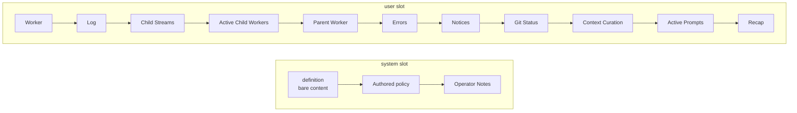

# Plurnkdown Specification

`@plurnk/plurnk-plurnkdown` owns the Markdown projection used for model packets and the
diagnostics produced by its linter. Core owns packet semantics and emits this format.

## §packet-markdown Ownership and wire boundary

| Layer                         | Owner                       | Contract                                                           |
| ----------------------------- | --------------------------- | ------------------------------------------------------------------ |
| PLURNK operation language     | `@plurnk/plurnk-contracts`  | `plurnk.md`, parser, and language schemas {§contract-authority}    |
| Default sections and ordering | `@plurnk/plurnk-service`    | Ordered section list and trusted transform seam {§packet-assembly} |
| Section Markdown projection   | `@plurnk/plurnk-plurnkdown` | This specification                                                 |
| Section values and lifecycle  | Each producing package      | Producer-owned content under the core packet contract              |

Core renders the transformed section list into one system string and one user string. Within
each slot, list order is preserved. A nonempty section with a header renders as an H2
immediately followed by its JSON object/array content; non-JSON content has one blank
line after the header. A null header renders only its content. Empty content is omitted, trailing
newlines are removed from each section, and rendered sections are separated by one blank line.

## §packet-default-projection Default packet projection

Core owns this order at {§packet-cache-monotone}. The diagram projects that contract into the two
Markdown strings; a trusted plugin may transform the section list before rendering
{§packet-plugin-transform}. Any node whose content is empty is absent from the wire.

| Default section       | Slot   | Wire form                                     | Semantic owner                  |
| --------------------- | ------ | --------------------------------------------- | ------------------------------- |
| `definition`          | system | Bare `plurnk.md`; no wrapper heading          | {§definition-table-projection}  |
| `system-policy`       | system | Authored Markdown                             | {§policy-sections}              |
| `inject`              | system | Authored Markdown                             | {§packet-inject}                |
| `worker`              | user   | JSON `path` with the literal Worker address    | {§packet-cache-monotone}        |
| `log`                 | user   | Markdown H3 records with JSON metadata        | {§log-wire-format}              |
| `child-streams`       | user   | JSON status/path pointers                     | {§child-orientation}            |
| `child-workers`       | user   | JSON status/path pointers                     | {§child-orientation}            |
| `parent-worker`       | user   | JSON status/path pointer                      | {§child-orientation}            |
| `errors`              | user   | JSON status/log-path pointers                 | {§operation-results}            |
| `notices`             | user   | Terse observation bullets                     | {§notice-drain-on-read}         |
| `git`                 | user   | Working-tree state in a NOTE blockquote       | {§packet-cache-monotone}        |
| `budget`              | user   | JSON curation usage and ceiling; pressure guidance when needed | {§tokenomics-neutral-telemetry} |
| `prompt`              | user   | JSON `prompt://<worker>/<loop>/<N>` pointers   | {§prompt-entry}                 |
| `recap`               | user   | Optional authored operational recap           | {§recap}                        |

The authored `plurnk.md` keeps its human-aligned tables. Core removes table-cell padding only
from the `definition` packet projection under {§definition-table-projection}; fenced blocks and
non-table whitespace remain exact.

## §packet-invariants Projection invariants

Plurnkdown preserves the semantic evidence supplied by section owners.

| Invariant      | Required projection                                                                                                                           |
| -------------- | --------------------------------------------------------------------------------------------------------------------------------------------- |
| Addressability | Paths, URI fragments, log coordinates, scopes, and coordinate-prefixed body lines remain usable without translation.                          |
| Weighability   | Curation and log-row measurements remain attached to the artifacts they measure under {§tokenomics-agnostic-ruler}.                           |
| Honesty        | Statuses, Problems, body visibility, chunk extents, and bodyless rows render as produced; presentation never upgrades or suppresses truth.   |
| Structure      | Operation examples remain typed fences; Log identities, metadata, and coordinate lines retain their record boundaries.                        |

## §packet-operation-fences PLURNK operation fences

Model-facing operation examples are executable fences ({§fence-boundary}).
The linter passes complete named code blocks and standalone compact blocks to
`@plurnk/plurnk-contracts`; bounded diagnostics and {§unparsed-tail-boundary} surface as
`op-syntax` diagnostics under {§parse-diagnostics}.

Inline references, ordinary Markdown headings, and anonymous code fences are not
operation examples. Executor registration and tool input schemas belong to the runtime,
not this syntax linter.

## §packet-log-records Log records

Plurnkdown preserves Core's {§log-wire-format}: one `log:///` H3 identity, one strict JSON metadata
line, then any coordinate-prefixed body lines. One blank line separates records. It adds no fence,
wrapper, prose, or escaping. Because every body line begins with a numeric or anchored coordinate,
source headings and blank lines cannot become record boundaries.

## §packet-atomic-prose Atomic prose

Packet prose uses short, single-idea sentences. The linter emits a review warning for either of
these paragraph shapes:

- a sentence of at least 180 rendered characters;
- a sentence of at least 120 rendered characters containing a semicolon.

The rule measures rendered paragraph text rather than Markdown syntax. Headings, lists, tables,
and fenced blocks are structural content and are not measured. This is a heuristic, not a raw
document-size limit.

## §packet-lint Linter contract

| Rule        | Severity         | Trigger                                                                    |
| ----------- | ---------------- | -------------------------------------------------------------------------- |
| `op-syntax` | error or warning | An executable fence contains a parser diagnostic, advisory, or unparsed tail.|
| `run-on`    | warning          | Paragraph prose crosses an atomic-prose threshold.                         |

`PacketLint.lintDir` evaluates byte-exact digest files named
`packetNNN.system.md` and `packetNNN.user.md`. It ignores other digest artifacts, preserves the
originating filename on every finding, and does not claim semantic validation beyond these rules.
