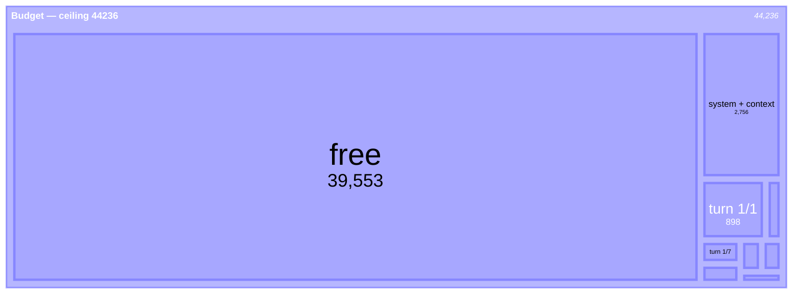
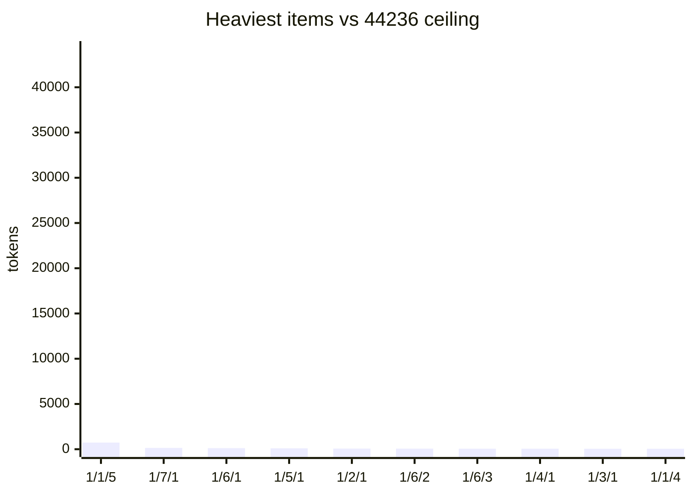
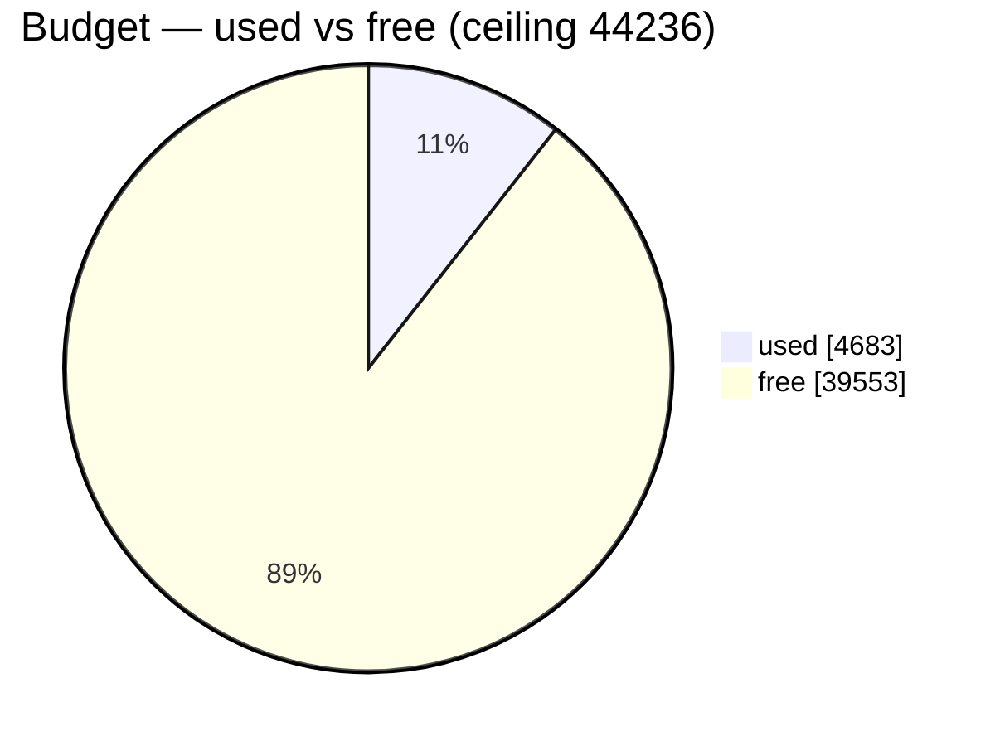

# Budget as dynamic mermaid — budget-scaled (run1 real data)

Both scaled to the **full budget** (ceiling 44236), not relative to the items. The point:
**salience tracks pressure** — near-empty and calm at low usage (here, 11%), filling toward
urgent as the ceiling nears. The real test is a *high-usage* run, where the turns must fill
the treemap and the bars must climb. This low example should read sparse — that's correct.

## Turn size → treemap (budget composition)

Turn boxes + `free` = the whole ceiling. At 11% usage, `free` dominates by design.

## Top-ten items → xychart (bars against the full ceiling)

The empty space above the bars **is** the headroom.

## Gauge → pie (used vs free)

Inherently budget-scaled — used + free = the whole ceiling. As much a training exemplar for
the model's own user-facing SENDs as it is a meter.

