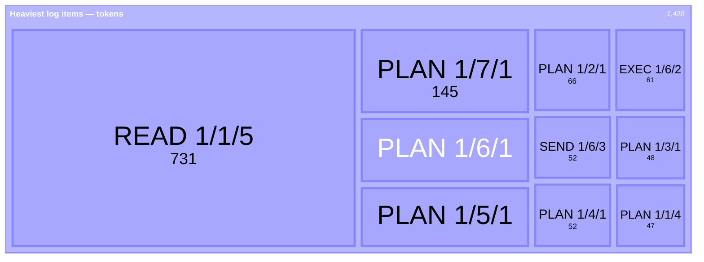
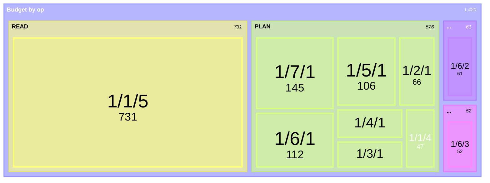
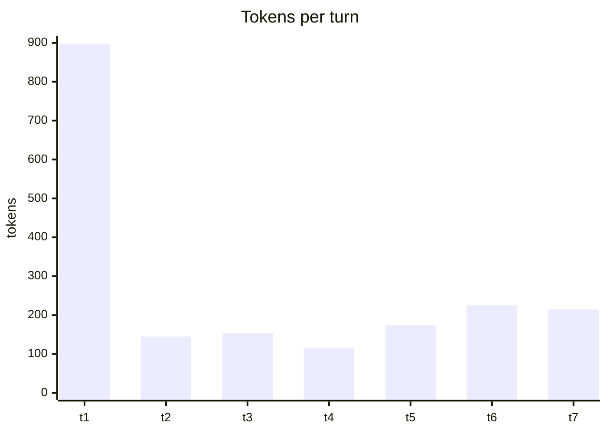

# Budget as dynamic mermaid — sketches (run1 real data)

Exploration of new mermaid formats for the `Budget` section. `treemap`/`xychart` are recent
mermaid types; whether GitHub renders them is the open question these sketches answer.

## Heaviest items → treemap (the eviction map)

Biggest box = the thing to FOLD/KILL. Aimed at the budget-overflow recovery rail.

### Richer variant — grouped by op (two levels of insight)

## Per-turn spend → xychart (velocity / spikes)

## The gauge — deliberately NOT a diagram

`Token Ceiling 97280 · Token Usage 33109 (34%) · Tokens Free 64171` — a line wins. A pie of
used/free is decoration for a value already clear as a percentage.
