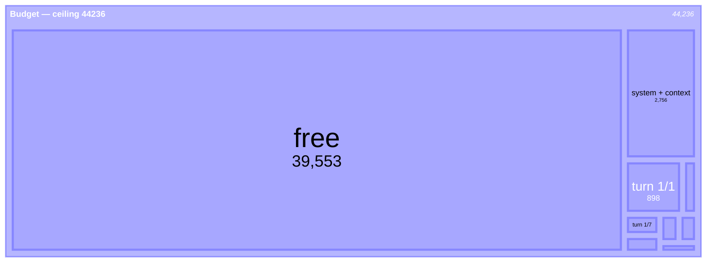
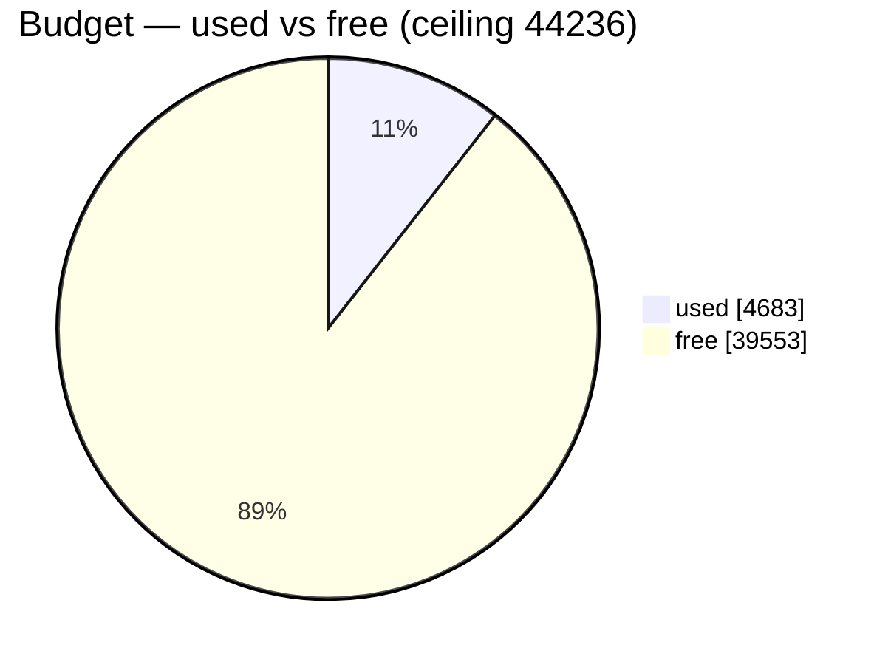

# Budget as dynamic Mermaid

Both diagrams use the full ceiling of 44236.

## Turn composition

Turn boxes, `system + context`, and `free` compose the ceiling.

## Largest open log bodies

| item | body tokens |
|---|--:|
| log:///1/1/5/READ | 731 |
| log:///1/7/1/READ | 145 |
| log:///1/6/1/READ | 112 |

## Used and free

Used and free sum to the ceiling.

