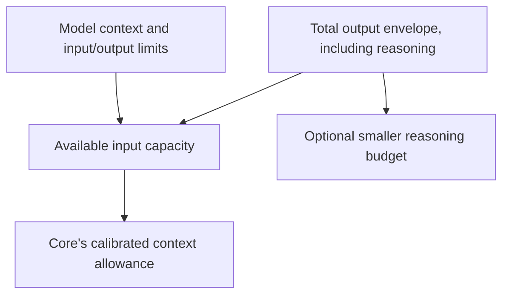

# @plurnk/plurnk-providers

PLURNK's stable model-provider contract and its adapter to the
[AI SDK](https://ai-sdk.dev/).

Ordinary provider behavior is intentionally not reimplemented here:

- A release-time Models.dev snapshot supplies provider package, endpoint, and
  credential names, plus context-window, output-limit, reasoning-capability,
  and pricing metadata.
- Official AI SDK providers own vendor request and response protocols.
- PLURNK owns aliases, generation envelopes, normalized usage and errors,
  evidence capture, first-party metadata, and local endpoint capabilities.

See [SPEC.md](SPEC.md) for the contract, [the model reference](docs/models.md)
for what a model is told about routes and generation, and
[.env.defaults](.env.defaults) for every knob.
The package-owned `PLURNK_PROVIDERS_ERROR_DETAIL_LIMIT` bounds upstream
diagnostic text in public provider Problems.

Model facts do not share one fallback chain. Context windows, output envelopes,
reasoning activation, and estimated prices resolve independently
({§model-fact-resolution}). PLURNK does not fetch live per-token prices, and the
local estimate is not an authoritative relay-settled charge.

## Runtime-neutral contracts

Browser and edge Workers import accounting and normalized failures through
their dedicated runtime-neutral subpaths
({§provider-runtime-neutral-accounting}, {§provider-runtime-neutral-errors}):

```js
import {
  aggregateProviderAccounting,
  estimateProviderCost,
} from "@plurnk/plurnk-providers/accounting";
import { ProviderError } from "@plurnk/plurnk-providers/errors";
```

The package root composes the complete Node provider runtime, including plugin
discovery and environment-file defaults.

## Configure a model

Select a catalog route directly:

```dotenv
PLURNK_MODEL=google/gemini-3-flash
GEMINI_API_KEY=...
```

Declare an alias when the route needs a reusable name or scoped tuning:

```dotenv
PLURNK_MODEL_fast=openai/gpt-5-mini
PLURNK_MODEL=fast
OPENAI_API_KEY=...
```

Cataloged providers need no endpoint declaration. To add an
OpenAI-compatible provider that Models.dev does not describe:

```dotenv
PLURNK_PROVIDERS_PROVIDER_ACME_NPM=@ai-sdk/openai-compatible
PLURNK_PROVIDERS_PROVIDER_ACME_BASE_URL=https://api.acme.example/v1
PLURNK_PROVIDERS_PROVIDER_ACME_API_KEY_ENV=ACME_API_KEY
PLURNK_MODEL_acme=acme/model-id
```

Provider declarations are configuration, not secrets. Secret values remain in
the operator environment.

The forms, in one table:

| Form | Meaning |
| --- | --- |
| `PLURNK_MODEL=provider/model` | Select a route without an alias. |
| `PLURNK_MODEL_<alias>=provider/model` | Declare a named route and tuning scope. |
| `PLURNK_BASEURL_<alias>=https://endpoint/v1` | Override that declared alias's endpoint. |
| `PLURNK_PROVIDERS_<KNOB>_<alias>=value` | Nonempty per-alias override of the bare knob; alias case is ignored. |
| `PLURNK_PROVIDERS_PROVIDER_<NAME>_*` | Provider-wide declaration, not per-alias tuning. |

Models.dev supplies cataloged providers' endpoints, credential-variable names,
model limits, reasoning capabilities, and rates. The operator supplies
credentials to the service environment; a client's environment does not
configure a remote daemon. Worker model and reasoning selections persist:
changing a startup default is not a command to retarget existing Workers.
Clients expose explicit model, reasoning, and child-model controls; their
available effort choices come from the selected route.

Sampling uses endpoint defaults unless configured. `TEMPERATURE`, `TOP_P`,
`TOP_K`, `PRESENCE_PENALTY`, `FREQUENCY_PENALTY`, and `SEED` use the same
`PLURNK_PROVIDERS_<KNOB>_<alias>` form. Supported values depend on the endpoint;
Models.dev does not supply a recommended sampling profile. See the
[sampling contract](SPEC.md) ({§provider-sampling-passthrough}) and
[environment panel](.env.defaults) for ranges and omission rules.

## Capacity and reasoning



- **Effort** and **budget** are independent. `adaptive` requests native dynamic
  reasoning where supported, otherwise the supported high posture. Fixed effort
  names must be supported by the route; an unsupported request is not silently downgraded.
- **Output** accepts positive tokens or a percentage of context; known model
  limits cap it. An explicit reasoning budget must be smaller than total output.
  Leaving the reasoning budget unset does not disable reasoning.
- **Context** is derived from the live endpoint or catalog. An operator cap can
  shrink known capacity or declare unknown capacity, never enlarge known limits.
  Prompt projection and initialization reasoning READ limits are separate Core policy.

## Provider plugins

Most integrations should use an MCP server, executor, scheme, or a provider
declaration. A provider plugin is only needed for a protocol binding unavailable
through the catalog and installed SDK packages.

It may use any npm scope. Its package manifest declares the PLURNK name:

```json
{
  "plurnk": {
    "kind": "provider",
    "name": "acme"
  },
  "peerDependencies": {
    "@plurnk/plurnk-providers": "^1.2.0",
    "ai": "^6.0.0"
  }
}
```

The default export is an AI SDK provider with
`languageModel(modelId)`. PLURNK adapts that language model into its own
contract, so plugins do not reproduce retries, usage normalization, envelopes,
notices, or RFC 9457 failure normalization.

The manifest may declare always-on `plurnk.attribution`. The default export may
also implement synchronous `attributions(context)` and decide per provider
attempt whether to return no, one, or many additional opaque tags
({§plugin-attribution}).

Discovery is scope-agnostic and rejects duplicate names.
Third-party discovery uses the shared pre-import trust contract ({§plugin-trust-boundary}).

## Local endpoints

`openai` and `ollama` retain small in-package adapters because local operation
requires runtime facts no static catalog owns: served model, context window,
llama-server capabilities, slots, EOS token, and exact tokenization.

```dotenv
PLURNK_MODEL_local=openai/model-name-from-endpoint
PLURNK_BASEURL_local=http://127.0.0.1:8080/v1
PLURNK_MODEL=local
# Optional: your own GBNF grammar, carried verbatim to this llama-server route:
# PLURNK_PROVIDERS_GBNF_local=~/.config/plurnk/local.gbnf
# Optional explicit generation allowances, in tokens:
# PLURNK_PROVIDERS_OUTPUT_BUDGET_local=8192
# PLURNK_PROVIDERS_REASONING_BUDGET_local=4096
```

Endpoint probing supplies served-model capacity and llama-server capabilities.
Pin `PLURNK_PROVIDERS_LLAMA_SERVER_local=1` only for a known llama-server that
cannot be fingerprinted reliably. GBNF is optional and yours: the service ships
no grammar profile and never validates or grades one; the file's text reaches
the route verbatim, and configuring it on a route without grammar transport is
an error. Parsing always applies.

Sampling stays at endpoint defaults unless configured. Repetition penalties can
fight exact source copying and grammar repetition. Measure local tuning; it is
not a portable cloud policy. `think-tags` response interpretation is a separate
opt-in for endpoints that emit a leading `<think>` envelope, not a reasoning switch.

## Connectivity, caching, and cost

| Concern | Boundary |
| --- | --- |
| Attempt, first-content, idle deadlines | Provider transport; a timeout surfaces a failure, not a fabricated response. |
| Provider-directed waits | Bounded retries honor `Retry-After`; other recoverable failures return to Core. |
| Loop recovery | Core reissues within its recovery window, then parks for a prompt or wake. |
| Cache affinity | Stable Worker identity through documented provider controls; not a cache-hit guarantee. |
| Explicit cache writes | Separate policy on supported routes; can affect billing. |
| Service tier | Explicit route choice that may change price and availability. |
| Cost | Provider monetary evidence wins; known usage and catalog rates yield an estimate, not a settled charge. |

For uncataloged compatible endpoints, declare the SDK, URL, and credential-variable
name together; the examples are in the defaults reference. A provider plugin is
needed only when the protocol cannot be expressed by the installed adapters.

## Configured-provider packet conformance matrix

Every configured model alias is exercised through a real PLURNK loop — the
production packet, a model-selected operation, its materialized result, and
completion — never a transport-only completion. Provider-exposed reasoning must
survive in the durable assistant packet and digest; a provider with no private
reasoning is valid when the observable operation cycle succeeds.

One specimen at a time, deterministically:

```sh
cd plurnk-core
npm run test:live:specimen -- "<test-name-pattern>"
```

The selector inserts `--test-name-pattern` before the expanded live file list in
the exact standard `test:live` invocation; trailing npm arguments alone cannot
narrow the suite. This procedure is `plurnk-core`'s own; the ledger below is
maintained with the evidence for every alias it names.

### Classifications

| Class | Meaning |
|---|---|
| pass | Full packet cycle completed; durable packet and digest verified |
| auth/credential | The route is blocked before the model by authorization or credential handling |
| transport | The route fails at a transport/capability boundary, not the model |
| op:stable-fail | An operation-level failure repeated on replay; assertion unweakened |
| op:stochastic | An operation-level failure did not repeat on a later roll |
| unreachable | The endpoint cannot be reached from this machine |

Authorization and credential failures are reported as their own class, never as
model failures. Repeated stochastic and stable operation failures are reported
separately in the ledger's specimens.

A route's classification is established by running the live drill against it and
reading the digest, never by reputation. Record the outcome where the work is
tracked; this README owns the procedure and the vocabulary, not a snapshot of any
one installation's configured aliases.

## Development

```sh
npm run test:lint -w @plurnk/plurnk-providers
npm run test:unit -w @plurnk/plurnk-providers
```

`npm run test:providersPing` is an explicit paid diagnostic; it calls each
keyed provider once and prints the retained sanitized evidence directory.
