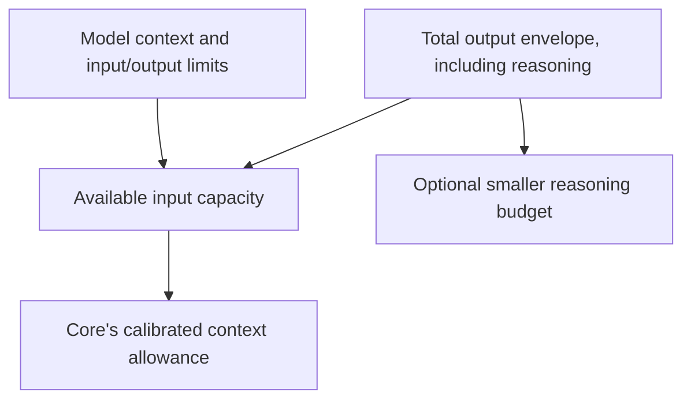

# Models and generation

Use a catalog route directly, or give it an alias for reusable tuning:

```dotenv
PLURNK_MODEL_fast=openrouter/qwen/qwen3-coder
PLURNK_MODEL=fast
PLURNK_PROVIDERS_REASONING_fast=adaptive
```

The first route segment is the provider; everything after it is the model id.
Models.dev supplies cataloged providers' endpoints, credential-variable names,
model limits, reasoning capabilities, and rates. The operator supplies credentials
to the service environment. A client's environment does not configure a remote daemon.

## Scope

| Form | Meaning |
| --- | --- |
| `PLURNK_MODEL=provider/model` | Select a route without an alias. |
| `PLURNK_MODEL_<alias>=provider/model` | Declare a named route and tuning scope. |
| `PLURNK_BASEURL_<alias>=https://endpoint/v1` | Override that declared alias's endpoint. |
| `PLURNK_PROVIDERS_<KNOB>_<alias>=value` | Nonempty per-alias override of the bare knob; alias case is ignored. |
| `PLURNK_PROVIDERS_PROVIDER_<NAME>_*` | Provider-wide declaration, not per-alias tuning. |

The [defaults reference](../.env.defaults) lists supported knobs and values.
Worker model/reasoning selections persist: changing a startup default is not a
command to retarget existing Workers. Clients expose explicit model, reasoning,
and child-model controls; their available effort choices come from the selected route.

## Capacity and reasoning



- **Effort** and **budget** are independent. `adaptive` requests native dynamic
  reasoning where supported, otherwise the supported high posture. Fixed effort
  names must be supported by the route; an unsupported request is not silently downgraded.
- **Output** accepts positive tokens or a percentage of context; known model
  limits cap it. An explicit reasoning budget must be smaller than total output.
  Leaving the reasoning budget unset does not disable reasoning.
- **Context** is derived from the live endpoint or catalog. An operator cap can
  shrink known capacity or declare unknown capacity, never enlarge known limits.
  Prompt projection and automatic reasoning READ limits are separate Core policy.

## Local OpenAI-compatible endpoints

```dotenv
PLURNK_MODEL_local=openai/model-name-from-endpoint
PLURNK_BASEURL_local=http://127.0.0.1:8080/v1
PLURNK_MODEL=local
# Optional llama-server rail matching the model's template:
# PLURNK_PROVIDERS_GBNF_local=plurnk.qwen.gbnf
# Optional explicit generation allowances, in tokens:
# PLURNK_PROVIDERS_OUTPUT_BUDGET_local=8192
# PLURNK_PROVIDERS_REASONING_BUDGET_local=4096
```

Endpoint probing supplies served-model capacity and llama-server capabilities.
Pin `PLURNK_PROVIDERS_LLAMA_SERVER_local=1` only for a known llama-server that
cannot be fingerprinted reliably. GBNF is optional; parsing always applies.
The Qwen and Gemma rails follow different reasoning templates, so select the
matching profile (`plurnk.qwen.gbnf` or `plurnk.gemma.gbnf`), not one based on speed.
A configured rail requires reasoning to be enabled.

Sampling stays at endpoint defaults unless configured. Repetition penalties can
fight exact source copying and grammar repetition. Measure local tuning; it is
not a portable cloud policy. `think-tags` response interpretation is a separate
opt-in for endpoints that emit a leading `<think>` envelope, not a reasoning switch.

## Connectivity, caching, and cost

| Concern | Boundary |
| --- | --- |
| Attempt, first-content, idle deadlines | Provider transport; a timeout surfaces a failure, not a fabricated response. |
| Provider-directed waits | Bounded retries honor `Retry-After`; other recoverable failures return to Core. |
| Loop recovery | Core reissues within its recovery window, then parks for a prompt or wake. |
| Cache affinity | Stable Worker identity through documented provider controls; not a cache-hit guarantee. |
| Explicit cache writes | Separate policy on supported routes; can affect billing. |
| Service tier | Explicit route choice that may change price and availability. |
| Cost | Provider monetary evidence wins; known usage and catalog rates yield an estimate, not a settled charge. |

For uncataloged compatible endpoints, declare the SDK, URL, and credential-variable
name together; the examples are in the defaults reference. A provider plugin is
needed only when the protocol cannot be expressed by the installed adapters.
