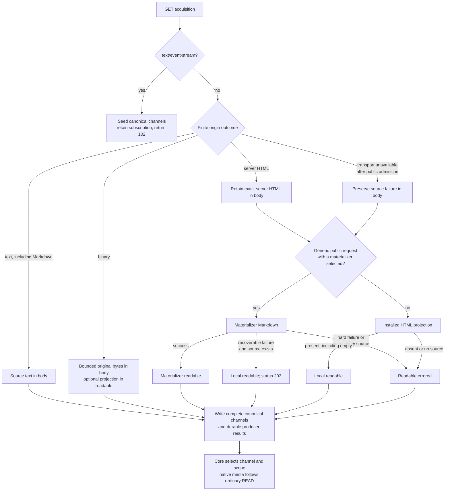

# plurnk-schemes-http — Specification

This package owns the `http(s)://` request/response scheme, the `ws(s)://`
full-duplex scheme, plus automatic entry-acquisition, pluggable page
materializers, and the local HTML projection foundation. Both handlers implement
the DB-free `SchemeCtx` author contract.

## §http-manifest §1 HTTP manifest

| Field           | Value                         |
| --------------- | ----------------------------- |
| Registered name | `https` (plain `http` routes to it — supported, never advertised as a peer endpoint) |
| Category        | `data`                        |
| Writers         | `model`, `client`             |
| Volatile        | `true`                        |
| Model-visible   | `true`                        |
| Requires web    | `true`                        |
| Metadata modifier | `true`                      |
| Default channel | `body`                        |

| Channel  | Seed type                   | Meaning                                                                        |
| -------- | --------------------------- | ------------------------------------------------------------------------------ |
| `body`     | `application/octet-stream`  | Source text or original binary bytes; SSE data for a live response |
| `header`   | `text/plain`                | Origin, acquisition, materializer, projection, provider, and usage evidence   |
| `readable` | `text/markdown`             | Optional derived text/facts: an HTML materializer or installed mimetype projection ({§readable-channel}) |

`package.json#plurnk.schemes` registers `http` through the default export and
`wss` through `Ws`.

Routing is not identity. `NetworkAddress` {§network-address} retains the exact
addressed protocol and stores authority `<host>[:<non-default-port>]` separately
from pathname `<path>[?<serialized-query>]`. Query ordering,
duplicate names, and an explicit empty `?` remain significant. The fragment is
a Plurnk channel selector and never enters network identity or transport.
Request metadata affects transport but not identity. URL userinfo is rejected;
neither credentials nor metadata are reconstructed from `raw`. Within the path
component, `%28` and `%29` canonicalize to literal parentheses; the query is
preserved exactly.

## §op-surface §2 HTTP operation surface

| Operation                                  | Remote action                         | Contract                                                                                |
| ------------------------------------------ | ------------------------------------- | --------------------------------------------------------------------------------------- |
| Exact ```` ```READ (url) <scope?> ````            | GET unless a fresh GET copy is usable | Prepare one complete canonical representation, then let core select and project it      |
| Exact ```` ```FIND (url) ````                     | GET only when acquisition is required | Use the same preparation, then universal query, matcher, weighting, and pagination      |
| ```` ```FIND (pattern-url) ````                   | None                                  | Query already-materialized web entries; a path pattern does not discover the remote web |
| ```` ```SEND (url) ```` with body                 | POST                                  | Stream and persist the response under the addressed URL                                 |
| ```` ```EDIT (url) ```` with body                 | PUT                                   | Replace the whole remote resource; a line marker is invalid                             |
| ```` ```KILL (url) ````                           | None                                  | {§http-kill}: cancel the workspace's live acquisitions of the URL, else delete the local stored entry |
| ```` ```KILL (url) [{"remote": true}] ````                  | DELETE                                | Delete the remote resource and stream its response; other options in the same metadata block are its headers |

Finite GET uses scope-blind representation preparation; POST, PUT, DELETE,
and genuinely live GET responses retain the subscription path. Request
headers are options in one `[{"Key": "value", ...}]` metadata block under
{§scheme-metadata-modifier}. HTTP interprets the merged options; the resource
target remains pure. Remote status and headers are persisted in `header`, not
interpreted as Plurnk operation or loop lifecycle signals.
Exact-versus-pattern FIND preparation uses the shared
`PathSyntax.hasGlob` classifier {§path-glob}; HTTP owns no reduced
path-pattern grammar.

§http-outbound-proposes **A request that changes a remote resource proposes.**
POST, PUT, the remote DELETE, and a WebSocket frame (EDIT or SEND on an open
`ws(s)://` socket) declare `effect: "host"` and return `202` under
{§proposal}; the panel's `PLURNK_SERVICE_EFFECT_HOST` decides whether that
settles by consent or runs unattended, exactly as it does for a subprocess
({§exec-host-proposes}). GET is observation and stays ungated, and so is the
socket open a `ws(s)://` READ performs: an acquisition leaks only what a URL
can carry, and that is the same for both. A frame needs an open socket, so that
refusal arrives before any proposal — nobody is asked to approve a message to a
connection that is not there — and the admission runs again at apply, because
the socket is live and may have closed while the question was open. The
proposal carries the method, target, and body, and the resolver may replace
the body before it is sent; nothing leaves the process until the settlement
accepts. This is the same reason a local `EDIT` proposes: Plurnk does not
claim containment, so consent — not a boundary — is what stands between the
model and the world.

## §http-lifecycle §3 Acquisition, materialization, and query lifecycle



The same page producer serves exact GET preparation, exact FIND, and executor
entry acquisition. Their outer policies differ: authored GET accepts explicit
targets and HTTP error responses; automatic acquisition first admits a public
credential-free target and treats non-2xx responses as unavailable. READ scope
and channel selection never enter the producer. Freshness may avoid transport,
but cold and warm representations pass through the same core projection.

| Response                                | `body`                                                   | Auxiliary materialization                                 | Completion                                  |
| --------------------------------------- | -------------------------------------------------------- | --------------------------------------------------------- | ------------------------------------------- |
| Negotiated origin Markdown              | Exact origin Markdown                                    | None: readable text is the source itself; one request     | Static representation, then core projection |
| HTML-page production                    | Exact server source when the origin supplied it          | Materializer Markdown, local Markdown, or independent error in `readable` | Static representation, then core projection |
| `text/event-stream`                     | One `data` value plus newline per `text/plain` chunk     | Initial response in `header`                              | `102`; origin close settles subscription    |
| No response body                        | Present empty text                                       | Response and package metadata in `header`                 | Static representation; body READ is `204`   |
| Origin HTTP `4xx`/`5xx`                 | Preserve available origin text or bytes                  | Exact response evidence; origin-backed channels errored   | Selected channel's durable outcome          |
| Configured textual type                 | Complete Fetch-decoded Unicode                           | Response and package metadata in `header`                 | Static representation                       |
| Readable binary type                    | Complete original bytes                                  | Derived Unicode in `readable`; projection identity in `header` | Static representation, then core projection |
| Unreadable binary or unknown bytes      | Complete original bytes                                  | No readable projection or native media claim              | Static representation; ordinary hex READ    |
| Binary input exceeds configured bound   | No representation is fabricated                         | Exact size evidence in the Problem                        | `413 projection-input-limit`                |

The producer persists every available channel; core publishes only the channel
selected by the fragment, or `body` by default. Broad FIND returns standard
resource metadata; exact matcher FIND returns flat match locations. Exact READ
returns the selected channel's requested text/hex projection.

### §http-text-decoding Text response decoding

| Surface                       | Contract                                                                                         |
| ----------------------------- | ------------------------------------------------------------------------------------------------ |
| Response media type           | WHATWG `MIMEType` essence; absent or unparseable metadata becomes `application/octet-stream`     |
| Finite GET text               | Fetch `Response.text()` UTF-8 decoding; buffering does not select a different character encoding |
| Streamed mutation response    | Incremental replacement-mode UTF-8 through `TextDecoder`; finite JSON documents publish after completion, other text preserves incremental backpressure |
| `charset` parameter           | Preserve in `header` as origin evidence; it does not replace Fetch text decoding                 |
| JSON and XML textual families | Use the same HTTP byte-to-string rule; format projections consume the resulting Unicode string   |
| Direct HTML GET               | Fetch UTF-8 decoding of origin server HTML                                                       |
| Server-sent events            | UTF-8 only under the HTML event-stream standard                                                  |
| Malformed UTF-8               | Preserve the Encoding Standard's replacement-character behavior                                  |

This decoder boundary remains text normalization, not a media-format processor.
A configured binary type bypasses it and enters the mimetype family's bounded
source acquisition {§mimetype-binary-input}; original bytes remain in `body`.

§http-binary-source Finite binary responses retain bounded original bytes in `body`,
with optional derived facts/text in `readable`. GET, exact FIND acquisition, executor
acquisition, and mutation responses use the same source/projection contract.
Core READ of `body`, `#bytes`, or `#readable` may attach that complete native source
under {§packet-attachment-parts}; scope selects the text/hex view, never native bytes.
Headers carry transport evidence, not native media. Invalid or unsupported formats
remain byte-readable without invented facts or native parts. Incomplete transfers
and over-limit input publish no partial binary payload.

§http-json-presentation Finite `application/json` and `+json` responses use
{§json-document-presentation} in their canonical body channel before indexing,
scope selection, or previews. Both GET and mutation responses follow this rule.
Malformed JSON remains unchanged; interrupted mutation responses preserve the
received partial text and the acquisition failure. Request bodies, authored
entries, non-JSON text, SSE, and JSONL retain their original formatting.

### §html-materialization Readable materialization

`WebFetcher.materialize` is the shared source/projection seam for exact
GET/FIND preparation and executor entry acquisition. It returns complete
source and derived channels for one atomic canonical entry write; SSE and
textual mutation responses retain incremental streaming.

| Input or event                              | Action                                      | Result                                                             |
| ------------------------------------------- | ------------------------------------------- | ------------------------------------------------------------------ |
| Configured non-HTML text                    | Decode with Fetch UTF-8                     | Original representation in `body`                                  |
| Configured binary with reader               | Retain bounded bytes and apply projection   | Original `body`, derived `readable`, and projection identity         |
| Configured binary without reader            | Retain bounded bytes                        | Original `body` and projection identity; no `readable`               |
| Binary input exceeds the common bound       | Cancel and preserve the typed cause         | `WebMaterializationError` caused by `ProjectionInputLimitError`     |
| Negotiated origin `text/markdown`           | Accept it without the materializer          | Exact Markdown in `body`; no `readable`, no second request          |
| Eligible HTML with a materializer selected  | Use the materializer as the readable producer | Origin server source in `body`; materializer Markdown in `readable` |
| Ineligible HTML or no materializer selected | Use the installed HTML projection           | Origin server source in `body`; local Markdown in `readable`        |
| Recoverable materializer failure with HTML  | Use the installed projection as recovery    | Source in `body`; local Markdown in `readable` with terminal `203`  |
| Hard materializer failure                   | Preserve evidence; do not run local recovery | `readable` errored; independently successful `body`/`header` survive |
| Materializer success after origin loss      | Preserve provider text and origin failure   | `readable` static; `body` errored with the origin's own failure     |
| Projection implementation throws            | Stop and preserve the cause                 | `WebMaterializationError` with stage `projection`                   |

A projection object is present even when its content is `""`; only `null`
denotes absence. A materialization exception retains its original `cause`; it
never enters the absence channel.

#### §http-materializer-plugins Materializer plugins

`PLURNK_SCHEMES_HTTP_MATERIALIZER` selects one discovered `http-materializer`
plugin by id; unset means the installed HTML projection is the only readable
producer. A materializer package declares
`plurnk: { kind: "http-materializer", materializers: [{ id, module }] }` and
exports one `HttpMaterializer` per entry under the executor family's
discovery, trust, and one-flat-id-namespace rules ({§plugin-discovery}). The
selected materializer is consulted only for a credential-free generic request
whose target has been admitted as public. Authored request metadata—including
an authored `Accept` field—makes the request ineligible. The package-generated
Markdown negotiation, browser-compatible `User-Agent`, and conditional cache
fields are transport mechanics, not authored metadata. No authored request headers or
origin credentials cross the materializer boundary.

When no `Accept` is authored, origin acquisition offers
`text/markdown, text/html;q=0.9, */*;q=0.1`. An origin `text/markdown`
representation wins and the materializer is skipped; no second HTML request is
made. An authored `Accept` value is
sent unchanged and makes any returned HTML use the local projection route.

The materializer's `eligible(url)` returns its identity string when it will
serve the URL (its credentials and supported targets are its own); `extract`
returns `success` (its sanitized Markdown body plus its own evidence headers),
`recoverable` (local projection fallback with the materializer's evidence and
terminal `203`), or `hard` (an exact materializer-owned Problem; no local
recovery). A materializer `extract` throw is the materialization failure, never
a silent fallback. A selected id with no installed provider fails hard rather
than degrading silently.

Without server HTML, no local recovery input exists. A materializer success can
still close `readable`, but every materializer failure remains the readable
failure, and `body` closes errored with the origin's own failure.

#### §http-channel-outcomes Channel outcomes

For finite HTML-page production, `body`, `header`, and `readable` have independent
durable outcomes and are written atomically. The selected channel alone
determines the projected operation result: successful `#readable` or `#header` can
be read when `body` failed, and a successful default `body` is not invalidated
by an errored `readable`. Unselected failures remain `errored` channels carrying
their exact `producerResult`. A recoverable local projection remains a static
`readable` channel with producer status `203`, so cold and warm READ both return
its content with that same status. Every READ names the page's other channels
with their tokens ({§channel-selection-visibility}), so a READ of the source
shows that `#readable` exists before the model has ever listed the page.

Exact READ, exact FIND, and executor materialization preserve the same channel
representation. A missing source variant is an explicit empty `errored`
channel, never an absent fact that later cache use can reinterpret as successful
empty content. A finite origin `2xx` or `3xx` response completes ordinary local
production, independently of the origin's status meaning; `202` does not leave
an acquisition pending, and origin `203` is not a materializer recovery. Origin
`4xx`/`5xx` content remains available as evidence while origin-backed channels
carry the exact `http-response-status` producer Problem. A final status outside
`200`–`599` instead produces `502 invalid-response-status` with `originStatus`,
preserving the received content and header. A materializer-produced `readable`
and the acquisition `header` remain independent of an unavailable origin source.
Conditional `304` correspondence is checked before production under {§revalidation}.

§http-llms-txt **Origin llms.txt companions.** After a successful generic GET
materialization, the scheme opportunistically acquires `<origin>/llms.txt`
once per origin per TTL window and materializes it as its own origin entry
(`https://host/llms.txt`), surfaceable by FIND. A missing companion, any
non-2xx, binary content, or a transport failure is quiet: the companion is
never fabricated, the failed probe is remembered (not retried per READ), and
the piggyback never fails the READ that carried it. The companion itself
never recurses. This is lazy by construction — one extra request only when
an origin is first being read — and it is the operator's to allow:
`PLURNK_SCHEMES_HTTP_LLMS_TXT=0` makes only the requests a READ asks for.

## §http-status §4 HTTP status mapping

| Outcome                                                       | Operation status                                         |
| ------------------------------------------------------------- | -------------------------------------------------------- |
| Finite origin `2xx`/`3xx` exact READ after preparation          | Universal selected-channel result (`200` or `204`); origin status remains in `header` |
| Exact FIND after preparation                                  | Exact universal query result                             |
| Exact acquisition returns no WebFetcher value                 | `404` (`not-materialized`)                               |
| Selected origin-backed channel received HTTP `4xx`/`5xx`      | Exact durable `http-response-status` Problem             |
| Selected origin-backed channel received an invalid final status | `502` (`invalid-response-status`) with `originStatus` |
| Selected HTML-page channel fails                              | That channel's exact durable producer Problem            |
| Local HTML projection is absent                               | `422` (`no-readable-projection`)                         |
| Recoverable materializer failure uses local projection        | `readable` with durable status `203`                     |
| Finite textual or binary response                             | Universal READ result                                    |
| Finite empty text response                                    | `204`                                                    |
| Binary projection input exceeds the configured byte bound     | `413` (`projection-input-limit`)                         |
| `KILL` with no live acquisition                               | Exact entry-delete result                                |
| `KILL` of a live acquisition                                  | `200`; the owner settles `499` through its aborted signal |
| Client-cancelled finite acquisition                           | `499` (`cancelled`)                                      |
| SSE after acquisition                                         | `102` initial; terminal selected-channel result          |
| SSE cancellation after acquisition                            | `102` initial; terminal `499`                            |
| SSE parser/transfer failure after acquisition                 | `102` initial; terminal `502`                            |
| Multi-statement HTTP edit batch                               | `409` (`non-atomic-edit-batch`)                          |
| Invalid target, line edit, or URL userinfo                    | `400` with the corresponding stable Problem kind         |
| Missing response channel                                    | `404 channel-not-found` under {§channel-selection-missing}; no remote mutation |
| Non-corresponding 304                                         | `502` (`fetch-failed`)                                   |
| Acquisition failure without successful materializer output   | `502` (`fetch-failed`)                                   |
| Projection exception                                          | `500` (`projection-failed`)                              |
| Uninterpreted SEND status                                     | `501` (`send-status-unsupported`)                        |

An HTTP error status is still a successfully acquired direct response: its
content and response evidence are preserved, and origin-backed channels carry
that exact status as durable producer evidence. HTML still enters page
production, so a successful materializer `readable` can remain readable while the
origin `body` records the HTTP error. Automatic WebFetcher acquisition instead treats
a non-2xx response as unavailable. Handler failures use RFC 9457 Problem Details.
Caught direct-acquisition diagnostics are bounded by
`PLURNK_SCHEMES_HTTP_ERROR_DETAIL_LIMIT` in model-facing detail while complete
errors remain in daemon diagnostics.

§http-replay A failed GET, PUT, or DELETE acquisition may recommend automatic
identical replay because those methods are idempotent. POST may already have
applied its effect when acquisition fails and is therefore non-retryable. Once
an SSE response has been acquired, a parser or transfer failure is likewise
non-retryable because replay could duplicate an already-consumed prefix.

Binary responses follow {§http-binary-source}, appending authoritative
`x-plurnk-projection-id` evidence after the origin and acquisition fields.
Exceeding the input ceiling returns `413` with configured and observed sizes;
a mutation response retains its lifecycle/header evidence and settles errored
without publishing partial bytes. This is a materialization failure, not the
remote HTTP outcome—a POST, PUT, or DELETE might already have changed the resource.
Missing or malformed `Content-Type` becomes `application/octet-stream`; the
handler does not sniff or guess unknown bytes.

## §5 Dependencies and configuration

| Surface           | Runtime contract                                                                                          |
| ----------------- | --------------------------------------------------------------------------------------------------------- |
| Platform          | Node ≥26 native fetch, streams, abort signals, decoding, DNS, and `WebSocket`                             |
| SSE               | `eventsource-parser` for bounded WHATWG event-stream framing                                              |
| Materializer plugins | Discovered `http-materializer` packages selected by `PLURNK_SCHEMES_HTTP_MATERIALIZER` {§http-materializer-plugins} |

### §http-config Operator configuration

| Concern               | Contract                                                                                                 |
| --------------------- | -------------------------------------------------------------------------------------------------------- |
| Canonical registry    | Shipped `.env.defaults`; the daemon assembles it as a set-if-unset floor {§operator-config-env-defaults} |
| Required values       | Missing or invalid required values fail at readiness/owning read; code carries no hidden fallback        |
| Materializer selection | `PLURNK_SCHEMES_HTTP_MATERIALIZER=` names a discovered materializer id; unset = local projection only |

### §http-host-policy Operator web host policy

`PLURNK_SCHEMES_HTTP_HOSTS` confines every web acquisition to named hosts. Unset
or empty admits every host, as before. A JSON array admits exactly its members:
`"example.com"` names that host, `"*.example.com"` any subdomain of it, and `[]`
names none. A value that is not a JSON array of host names fails at first use.
Direct HTTP operations and WebSocket connections are refused with 403
`host-not-permitted` before any I/O, and a followed redirect that leaves the
admitted hosts is cancelled with the same refusal. Automatic acquisition checks
the target and every redirect hop, and a final URL outside the policy is the
ordinary unavailable `null`. The policy is operator configuration, alias-free and
not model teaching; an isolated benchmark sets `[]`.

### §automatic-fetch-check Automatic acquisition URL check

`WebFetcher` is the sole caller of `Guard.fetch`. Before automatic byte
acquisition, it accepts credential-free HTTP(S) targets only when every
resolved address is ordinary globally reachable unicast, and repeats the check
before every manually followed redirect. A refused or unresolvable target is
the ordinary unavailable `null` result. A transport failure after public
admission may still enter materializer page production.

Direct HTTP operations and WebSocket connections do not use this check. Loopback,
private, and link-local destinations are therefore valid explicit targets.

Redirect transitions follow WHATWG Fetch: 301/302 rewrite POST to GET; 303
rewrites methods other than GET/HEAD to GET; 307/308 preserve method and body.
A body rewrite removes body headers, cross-origin redirects remove
`Authorization`, and followed redirect bodies are cancelled. The configured
hop limit returns the last redirect rather than following beyond the limit.
Validation-time DNS answers are not pinned to connection-time resolution. This
check therefore makes no DNS-rebinding or total-egress claim.

## §materialization-lifecycle §6 Materialization lifecycle

| Concern        | Contract                                                                                                   |
| -------------- | ---------------------------------------------------------------------------------------------------------- |
| Direct gate    | Explicit targets use native origin transport; only a generic public request grants materializer authority          |
| Automatic gate | Target and redirects require public admission; accepted generic HTML follows the same page producer       |
| Readable owner | Origin Markdown needs no projection; HTML uses the eligible materializer or installed local reader, binary uses its mimetype handler |
| Source owner   | `body` preserves origin text or bytes; it is never replaced by a derived projection                         |
| Projection     | A present projection, including `""`, becomes `readable`; `null` alone means absence                       |
| Cancellation   | One caller signal spans origin, auxiliary origin, projection, and materializer work                              |

### §host-rewrite Acquisition target rewrite

Only acquisition GETs are eligible for host rewriting. A GitHub
`…/blob/…` address uses the corresponding `raw.githubusercontent.com` source for
byte transport. Direct READ, exact FIND, and
WebFetcher prefetch share that rule. The originally addressed GitHub URL remains
entry identity. POST, PUT, and DELETE are never retargeted. Rewritten targets
are checked under {§automatic-fetch-check} only when `WebFetcher` acquires them.

### §revalidation GET representation freshness

Acquired responses append package-owned `x-plurnk-request-method`,
`x-plurnk-fetched-at`, and `x-plurnk-cache-variant` fields after origin headers.
Page bodies append `x-plurnk-materializer-id`; local projections append
`x-plurnk-projection-id`; The materializer appends its own evidence headers;
and bounded failure evidence. Only package metadata after the acquisition stamp
is authoritative.
Plurnk stores one representation per canonical URL rather than a variant set:

| Acquisition context                          | Package variant | Later cache use |
| -------------------------------------------- | --------------- | --------------- |
| No explicit request metadata; no `Vary`      | `default`       | Eligible        |
| Any explicit request metadata                | `bypass`        | Ineligible      |
| No explicit request metadata; any `Vary`     | `bypass`        | Ineligible      |
| Stored response lacks authoritative evidence | Marker absent   | Ineligible      |

This conservative selection avoids persisting request values or fabricating a
multi-variant store. Exact FIND passes request metadata through acquisition but
does not reuse that response later. A `304` that introduces `Vary` changes the
restored representation's package marker to `bypass`.

Only an eligible GET representation can supply a direct READ's body, TTL stamp,
conditional validators, or exact-FIND preparation. Completion comes from
channel lifecycle, not body length: `body` and `header` must be successful
(`static` or `closed`), and every channel must be terminal. An auxiliary channel
may be `errored`; `active` or unknown state is ineligible. Durable operation
evidence and HTTP reuse eligibility remain distinct: an acquired response stays
in the entry even when its origin policy prevents later cache use.
Workspace reuse follows shared-cache rules (RFC 9111); it does not change
retained evidence or workspace access. Reuse also requires a heuristically
cacheable origin status (RFC 9110 §15.1) or explicit cache permission (`public`,
`s-maxage`, `max-age`, or `Expires`).
Partial `206` responses remain evidence only: this cache does not combine or
select byte ranges. Ineligible responses supply neither cached content nor
validators to a later READ or exact FIND.

| Stored origin policy                  | Direct READ after acquisition                          | Exact FIND after acquisition             |
| ------------------------------------- | ------------------------------------------------------ | ---------------------------------------- |
| `no-store` or `private` (qualified or unqualified) | Full acquisition without stored validators    | Full acquisition                         |
| `no-cache` (qualified or unqualified) | Validate when a stored validator exists; else acquire  | Full acquisition                         |
| Valid `s-maxage`                      | Serve only inside origin lifetime and operator ceiling | Reuse only while fresh under both limits |
| Valid `max-age`, without `s-maxage`    | Same, using `max-age`                                  | Same                                     |
| Valid `Expires`, without either age directive | Same, using the origin expiration lifetime     | Same                                     |
| Invalid or ambiguous explicit expiry  | Treat as stale; validate or acquire                    | Full acquisition                         |
| Eligible response without explicit lifetime | Use the operator TTL as Plurnk's heuristic          | Reuse inside the operator TTL            |

The operator ceiling is `PLURNK_SCHEMES_HTTP_TTL_MS`; `0` disables every
validation-free reuse. Origin age is the greater of the response's `Age` value
and apparent age from `Date`, plus residence since the authoritative package
stamp. A representation is fresh only while both origin lifetime and operator
ceiling permit it. `s-maxage` takes precedence even when invalid or duplicated:
such a value is stale, not a reason to fall back to `max-age` or `Expires`.
`private` and `no-store` prohibit reuse regardless of other permission directives.
Unknown cache extensions are inert. Stale content is never served, so
`must-revalidate` and `proxy-revalidate` require no separate path.

Outside the fresh window, a representation without a materializer identity may
send a stored ETag or Last-Modified only when that field is singular and
syntactically valid. A 304 can restore those stored channels only when its
validator corresponds to the nominated stored representation:

| 304 validator                                         | Correspondence requirement                  |
| ----------------------------------------------------- | ------------------------------------------- |
| Strong ETag                                           | Same stored strong ETag                     |
| Weak ETag                                             | Same opaque tag under weak comparison       |
| No ETag; Last-Modified                                | Same valid stored Last-Modified instant     |
| Missing, malformed, or non-corresponding validator    | Do not update the stored representation    |

Response ETags use RFC 9111 §4.3.4 cache-update correspondence, not the origin's
`If-None-Match` precondition comparison. A strong response tag cannot promote a
stored weak tag into byte identity. A non-corresponding 304 triggers one GET
without conditional headers; a complete response is acquired normally. A
second 304, or a 304 without a reusable stored representation, returns `502`
(`fetch-failed`) without serving or replacing the stored body. No validators
are invented for an unsolicited 304.

A corresponding 304 restores the stored channels without rematerializing and
updates the header under the following ownership rule; any other response
replaces the channels:

| 304 metadata class                                                    | Stored-header action                                    |
| --------------------------------------------------------------------- | ------------------------------------------------------- |
| Present end-to-end origin fields, including cache and validators      | Replace prior fields of the same case-insensitive name  |
| Origin fields absent from the 304                                     | Preserve                                                |
| `Content-Type`, `Content-Encoding`, `Content-Range`, `Content-Length` | Preserve metadata describing the already-processed body |
| Package method, acquisition stamp, and variant                        | Rebuild authoritatively; refresh stamp and variant      |
| Projection evidence                                                   | Preserve                                                |

A 304-provided `Vary`, `private`, `no-store`, `no-cache`, expiry, or validator
therefore governs the next operation without relabeling derived Unicode as a
different source representation.

A stored derived representation requires the current projection identity. A
stored page body also requires its current route: negotiated origin Markdown,
local projection while no materializer is selected, metadata-ineligible local
projection, the configured materializer id, or the corresponding recoverable
local-fallback route. Selecting or changing the materializer invalidates the
affected route.

Once a page representation leaves its fresh window, Plurnk performs complete
reacquisition without old origin validators. Origin `304` can certify origin
bytes, but it cannot certify a composite that may also contain a fresh
materializer extraction or a newly negotiated Markdown representation.
Projection or materializer mismatch likewise invalidates
body, TTL, and validators together.

POST, PUT, and DELETE responses retain their method marker but cannot satisfy a
later GET or exact-FIND acquisition. An unmarked authored entry and an eligible
stored GET remain visible to universal FIND as durable evidence; exact HTTP
preparation applies the policy above. A metadata-less `KILL` deletes the stored entry ({§http-kill}).

§http-kill **KILL follows the entry rule; the remote DELETE is its own spelling.** ```` ```KILL (url) ```` cancels all live acquisitions of that exact URL within the workspace — GET, SSE, or mutations — by aborting their registered controllers; each initiating operation settles itself as `499` cancelled; with nothing in flight it deletes the local stored entry so the next READ must acquire again. Only ```` ```KILL (url) [{"remote": true}] ```` sends the HTTP DELETE, and the other options in that metadata block are the request's headers. A KILL never reaches the remote by accident.

### §sse Server-sent events

A direct GET whose response is `text/event-stream` feeds the bounded parser.
Each event's joined `data` value plus a newline becomes one `text/plain` body
chunk. Comments and `event`, `id`, and `retry` metadata are not projected.
The response plus persisted header is the acquisition boundary: READ returns
`102`, and parsing continues through the retained `StreamSubscription` without
retaining `SchemeCtx`. Buffer exhaustion and post-acquisition transport failure
settle that subscription at `502`; cancellation settles it at `499`. The
handler does not reconnect; events accumulate until the origin closes or the
operation is cancelled.

## §prefetch §7 WebFetcher

| Result                               | Meaning                                                                                  |
| ------------------------------------ | ---------------------------------------------------------------------------------------- |
| Origin HTML                          | Exact source text, MIME type, package-stamped evidence, and page-producer eligibility    |
| Negotiated origin Markdown           | Exact body without a second HTML acquisition                                             |
| Other accepted body                  | One unconsumed byte stream, MIME type, package-stamped headers, and cancellation owner   |
| Admitted origin transport failure    | Bounded origin failure plus eligibility for provider-only page production                |
| Materialized configured text         | Complete Fetch-decoded UTF-8 body                                                        |
| Materialized binary                  | Original bounded `body` bytes, optional `readable`, and projection identity in `header`  |
| Materialized HTML page               | Independent source/readable outcomes and complete route/provider evidence                 |
| Automatic top-level `null`           | Refused target, non-2xx response, or unavailable response with no provider route          |
| Caller-cancelled acquisition         | Rejects with the caller signal's exact reason                                            |

Top-level `null` is an automatic-acquisition liveness value rather than a thrown
failure. Caller cancellation is not liveness: a pre-aborted caller fails before
acquisition and a caller abort wins with its exact reason. Package-owned origin
timeouts are ordinary classified acquisition outcomes; materializer timeouts
are the materializer's own classified outcomes. WebFetcher
owns no entry identity, registry selection, selected-channel policy, or query
policy; its consumers supply those boundaries and the projection capability.

## §ws §8 WebSocket

`wss` is a first-class data scheme; `ws` routes to the same handler. WebSocket
is bidirectional and stateful, not an HTTP content type. It uses `messages` as a
`text/plain` default channel and the same canonical network address contract
{§network-address}. A frame written by EDIT or SEND is data leaving the
process and proposes ({§http-outbound-proposes}); the socket open itself is an
acquisition and does not.

### §ws-lifecycle Socket ownership and settlement

```mermaid
stateDiagram-v2
    [*] --> Idle
    Idle --> Claimed: claim canonical workspace address
    Claimed --> Connecting: seed entry, open subscription, construct socket
    Claimed --> Idle: setup or construction failure
    Connecting --> Open: native open; messages active; READ 102
    Connecting --> Settling: pre-open close/error, KILL, cancel, activation failure, or shutdown
    Open --> Open: ordered inbound frame, EDIT, or SEND 200
    Open --> Settling: closing state, close/error, KILL, cancel, binary frame, persistence failure, or shutdown
    Settling --> Idle: await retained work, close subscription, release claim
```



| Operation or event                | Contract                                                                                                         |
| --------------------------------- | ---------------------------------------------------------------------------------------------------------------- |
| ```` ```READ (ws(s)://…) ````            | Claim, seed/subscribe, construct `CONNECTING`, then return `102` after native `open` plus durable activation     |
| Concurrent duplicate READ         | Join the pending acquisition; once acquired, observe the shared connection with `200` and its connection state. Never create a second subscription or socket. |
| ```` ```EDIT (ws(s)://…) ````             | Send one whole text frame only for an open owner; line ranges and multi-statement batches are rejected           |
| ```` ```SEND (ws(s)://…) ```` with body  | Send only for owner `open` plus native `readyState=OPEN`; absent or non-open owner is `409`; send throw is `502` |
| ```` ```KILL (ws(s)://…) ````            | Close/cancel the claimed owner; no owner is `404`; an attempted close throw is `502`                             |
| Inbound frame after native `open` | Join the owner's persistence chain; the next write begins only after the preceding write succeeds               |
| Binary frame after native `open`  | Retain the text prefix, prune the binary and later frames, settle `415 binary-frame-unsupported`, close with private-use code `4003` |
| First inbound persistence failure | Retain the successful prefix, prune queued and later frames, and settle with `500 message-persistence-failed`    |
| Socket closes before `open`       | Close subscription with `502 connection-failed`; the pending READ returns that exact failure                     |
| Socket closes after `open`        | Drain the accepted frame prefix; initial READ remains `102`; settle with `200` unless a drained write fails       |
| Failure after `open`              | Initial READ remains `102`; persist the exact terminal failure and wake through subscription settlement          |

Markerless single-statement EDIT and SEND with signal `200` converge on one
outbound text-frame path and have the same connection and transport outcomes.
Authored dispatch order ({§op-execution-order}) lets either write follow the
opening READ in the same turn, after acquisition establishes the live owner.

The in-instance registry is keyed by workspace and complete canonical network
URL, matching the commons entry. Workers share the connection and may SEND or
KILL it; acquisition attribution and settlement remain with its initiating
operation ({§runtime-resource-binding}). The claim remains registered through terminal
cleanup, so a new READ cannot overlap an owner's subscription settlement. Every
terminal path drains retained owner work, closes the transport when necessary,
closes the durable subscription, then releases the claim. A persistence failure
found while draining supersedes a graceful terminal result; cancellation and
transport failures retain their exact result. Handler shutdown requests
settlement for every remainder, awaits every owner, and aggregates
transport-close failures under {§handler-lifecycle}.

| Transport limit    | Current contract                                                                                        |
| ------------------ | ------------------------------------------------------------------------------------------------------- |
| Payload projection | String event data only into `text/plain`; binary data terminates with Plurnk `415` and private-use WebSocket code `4003` |
| Reconnection       | None; READ again after terminal cleanup                                                                 |
| Handshake metadata | `[metadata]` is unsupported; the default global-WebSocket identity is used                              |
| Runtime            | Node ≥26                                                                                                |
