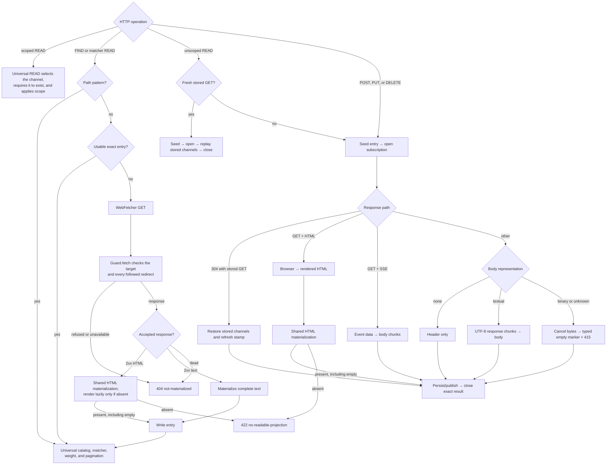

# plurnk-schemes-http — Specification

This package owns the `http(s)://` request/response scheme, the `ws(s)://`
full-duplex scheme, plus automatic entry-acquisition and browser-rendering
foundations. Both handlers implement the DB-free `SchemeCtx` author contract.

## §http-manifest §1 HTTP manifest

| Field            | Value                         |
| ---------------- | ----------------------------- |
| Registered name  | `http` (`https` routes to it) |
| Category / scope | `data` / `workspace`          |
| Writers          | `model`, `client`             |
| Volatile         | `true`                        |
| Model-visible    | `true`                        |
| Requires web     | `true`                        |
| Default channel  | `body`                        |

| Channel  | Seed type                  | Meaning                                                         |
| -------- | -------------------------- | --------------------------------------------------------------- |
| `body`   | `application/octet-stream` | Text response, binary marker, SSE data, or readable HTML        |
| `header` | `text/plain`               | Status line, response headers, and package acquisition metadata |
| `html`   | `text/html`                | Faithful HTML used to produce the readable body                 |

`package.json#plurnk.schemes` registers `http` through the default export and
`wss` through `Ws`.

Routing is not identity. `NetworkAddress` {§network-address} retains the exact
addressed protocol and stores
`/<host>[:<non-default-port>]<path>[?<serialized-query>]`. Query ordering,
duplicate names, and an explicit empty `?` remain significant. The fragment is
a Plurnk channel selector and never enters network identity or transport.
Request metadata affects transport but not identity. URL userinfo is rejected;
neither credentials nor metadata are reconstructed from `raw`. Within storage
pathnames, `%28` and `%29` canonicalize to literal parentheses and renderers
encode them again.

## §op-surface §2 HTTP operation surface

| Operation                         | Remote action                         | Contract                                                                                   |
| --------------------------------- | ------------------------------------- | ------------------------------------------------------------------------------------------ |
| Unscoped `READ(url)`              | GET unless a fresh GET copy is usable | Seed, subscribe, materialize every channel, publish the selected channel, and return `102` |
| Scoped `READ(url)<scope>`         | None                                  | Delegate selected-channel presence and scope projection to universal READ; never acquire   |
| `FIND(url)` / matcher `READ(url)` | GET only when acquisition is required | Prepare an exact entry, then use universal query, matcher, weighting, and pagination       |
| `FIND(pattern-url)`               | None                                  | Query already-materialized web entries; a path pattern does not discover the remote web    |
| `SEND[200](url):body:`            | POST                                  | Stream and persist the response under the addressed URL                                    |
| `EDIT(url):body:`                 | PUT                                   | Replace the whole remote resource; a line marker is invalid                                |
| `KILL(url)`                       | DELETE                                | Delete the remote resource and stream its response                                         |
| `SEND[410](url)`                  | None                                  | Delete the local stored entry                                                              |
| `SEND[499](url)`                  | Cancellation is engine-routed         | The routed subscription handle aborts acquisition; scheme dispatch itself is a `200` no-op |

Every direct network method uses the same streaming path. Request
headers are ordered target metadata: one trailing `{Key: value}` block per
header. The loop `SEND[code]` is never the remote HTTP status; remote status and
headers are persisted in `header`.
Exact-versus-pattern FIND preparation uses the shared
`PathSyntax.hasGlob` classifier {§path-glob}; HTTP owns no reduced
path-pattern grammar.

## §http-lifecycle §3 Acquisition, materialization, and query lifecycle

| Consumer / response                      | `body`                                                          | Auxiliary materialization                 | Completion                              |
| ---------------------------------------- | --------------------------------------------------------------- | ----------------------------------------- | --------------------------------------- |
| Direct GET + HTML                        | Present projection of the rendered DOM, including `""`          | Rendered DOM in `html`; render headers    | `102`; absent projection is `422`       |
| Direct GET + `text/event-stream`         | One `data` value plus newline per `text/plain` chunk            | Initial response in `header`              | Origin close ends the subscription      |
| Direct request + no response body        | Empty seed                                                      | Response and package metadata in `header` | Subscription closes; op is `102`        |
| Direct request + textual response        | Incremental UTF-8 text under the declared type                  | Response and package metadata in `header` | Response-body end closes the stream     |
| Direct request + binary or unknown type  | Empty marker; declared type or `application/octet-stream`       | Response and package metadata in `header` | `415 binary-response-unsupported`       |
| Exact WebFetcher + non-empty 2xx HTML    | Present projection of server HTML or the lazy rendered fallback | Selected HTML in `html`; byte headers     | Materialize; absent projection is `422` |
| WebFetcher + accepted non-empty 2xx text | Complete textual response                                       | Byte response in `header`                 | Materialize, then universal query       |

A fragmentless direct operation publishes only `body`. An explicit fragment
publishes that named channel. Every acquired channel remains durable even when
it is not published to the requesting loop. FIND returns standard JSON metadata
and match coordinates; matcher READ returns selected content and navigation
evidence.

### §html-materialization HTML materialization

`WebFetcher.materialize` is the shared HTML-family projection seam for direct
GET, exact query preparation, and executor entry acquisition.

| Input or event                       | Action                                             | Result                                                   |
| ------------------------------------ | -------------------------------------------------- | -------------------------------------------------------- |
| Non-HTML text                        | Bypass projection                                  | Original representation in `body`                        |
| HTML with a present projection       | Stop                                               | Projection in `body`; selected HTML in `html`            |
| HTML with an absent projection       | Render once when the caller supplies a renderer    | Rendered projection in `body`; rendered `html`           |
| HTML still absent after fallback     | Stop                                               | `null`; the consumer applies its absence policy          |
| Projection implementation throws     | Stop and preserve the cause                        | `WebMaterializationError` with stage `projection`        |
| Lazy renderer throws                 | Stop before another projection attempt             | `WebMaterializationError` with stage `render`            |

A projection object is present even when its content is `""`; only `null`
denotes absence. A materialization exception retains its original `cause`; it
never enters the absence channel.

## §http-status §4 HTTP status mapping

| Outcome                                               | Operation status                                 |
| ----------------------------------------------------- | ------------------------------------------------ |
| Scoped READ                                           | Exact universal selected-channel READ result     |
| Exact FIND / matcher READ after preparation           | Exact universal query result                     |
| Exact acquisition returns no WebFetcher value         | `404` (`not-materialized`)                       |
| Direct or exact-preparation HTML projection is absent | `422` (`no-readable-projection`)                 |
| Direct textual or empty response completes            | `102`                                            |
| Direct non-textual response                           | `415` (`binary-response-unsupported`)            |
| `SEND[410]`                                           | Exact entry-delete result                        |
| Routed `SEND[499]` dispatch                           | `200`                                            |
| Client-cancelled acquisition                          | `499` (`cancelled`)                              |
| Multi-statement HTTP edit batch                       | `409` (`non-atomic-edit-batch`)                  |
| Invalid target, channel, line edit, or URL userinfo   | `400` with the corresponding stable Problem kind |
| Direct network or acquisition exception               | `502` (`fetch-failed`)                           |
| Direct or prepared HTML render exception              | `502` (`render-failed`)                          |
| Direct or prepared projection exception               | `500` (`projection-failed`)                      |
| Uninterpreted SEND status                             | `501` (`send-status-unsupported`)                |

An HTTP error status is still a successfully acquired direct response: its
status remains in `header` and its body streams normally. WebFetcher instead
treats a non-2xx response as unmaterializable. Handler failures use RFC 9457
Problem Details. Caught direct-acquisition diagnostics are bounded by
`PLURNK_SCHEMES_HTTP_ERROR_DETAIL_LIMIT` in model-facing detail while complete
errors remain in daemon diagnostics.

A direct non-textual response preserves its status and headers plus an empty
body marker carrying the true media type. Its `415` describes Plurnk's response
materialization boundary, not the remote HTTP outcome. It is non-retryable: a
POST, PUT, or DELETE might already have changed the remote resource. Missing
`Content-Type` is treated as `application/octet-stream`; the handler does not
sniff or decode unknown bytes.

## §5 Dependencies and configuration

| Surface           | Runtime contract                                                                                          |
| ----------------- | --------------------------------------------------------------------------------------------------------- |
| Platform          | Node ≥26 native fetch, streams, abort signals, decoding, DNS, and `WebSocket`                             |
| SSE               | `eventsource-parser` for bounded WHATWG event-stream framing                                              |
| Browser rendering | Required lazy-loaded `playwright` client; executable provisioning follows {§browser-provisioning}        |

### §http-config Operator configuration

| Concern              | Contract                                                                                                 |
| -------------------- | -------------------------------------------------------------------------------------------------------- |
| Canonical registry   | Shipped `.env.defaults`; the daemon assembles it as a set-if-unset floor {§operator-config-env-defaults} |
| Required values      | Missing or invalid required values fail at their owning read; code carries no hidden fallback            |
| Browser method       | Exactly one of `launch`, `connect`, `connectOverCDP`, or `disabled`                                      |
| Method-specific data | Endpoint belongs to connection methods; channel/executable belong to launch and are mutually exclusive   |
| Browser location     | Operator-set Playwright location variables remain authoritative                                         |

`Http.ready()` verifies the selected browser route before the handler is
advertised. Disabled rendering is a valid configured route and fails clearly
if an HTML operation later requires the browser.

### §browser-provisioning Browser provisioning

| Component or method | Contract                                                                                             |
| ------------------- | ---------------------------------------------------------------------------------------------------- |
| Playwright client   | Required runtime dependency; lazy import keeps non-render paths from initializing it                 |
| `launch`            | Requires an operator-provisioned compatible browser, selected by Playwright, channel, or exact path  |
| `connect`           | Requires an external Playwright endpoint; no local browser executable                                |
| `connectOverCDP`    | Requires an external Chromium CDP endpoint; no local browser executable                              |
| `disabled`          | Requires no browser executable; a render attempt fails clearly                                       |

The package has no browser-install lifecycle script and never assigns
`PLAYWRIGHT_BROWSERS_PATH`. Operators may provision the standard compatible
Chromium with `npx playwright install chromium`; methods never fall back into
one another.

### §automatic-fetch-check Automatic acquisition URL check

`WebFetcher` is the sole caller of `Guard.fetch`. Before automatic byte
acquisition, it accepts credential-free HTTP(S) targets only when every
resolved address is ordinary globally reachable unicast, and repeats the check
before every manually followed redirect. A refused or unresolvable target is
the ordinary unavailable `null` result.

Direct HTTP operations, WebSocket connections, Playwright navigation, browser
subresources, and Playwright/CDP endpoints do not use this check. Loopback,
private, and link-local destinations are therefore valid explicit targets.

Redirect transitions follow WHATWG Fetch: 301/302 rewrite POST to GET; 303
rewrites methods other than GET/HEAD to GET; 307/308 preserve method and body.
A body rewrite removes body headers, cross-origin redirects remove
`Authorization`, and followed redirect bodies are cancelled. The configured
hop limit returns the last redirect rather than following beyond the limit.
Validation-time DNS answers are not pinned to connection-time resolution. This
check therefore makes no DNS-rebinding, browser-sandbox, or total-egress claim.

## §render-lifecycle §6 Render lifecycle

| Concern       | Contract                                                                                                      |
| ------------- | ------------------------------------------------------------------------------------------------------------- |
| Direct gate   | A GET HTML response cancels the byte probe body and navigates through the browser                             |
| Prefetch gate | Server HTML is primary; browser rendering is a lazy fallback only when its readable projection is absent      |
| Pool          | One warm browser per `Browser`; one atomically acquired context per worker; prefetch uses worker `0`          |
| Navigation    | Mobile-emulated by default; `networkidle` with bounded substantive-DOM timeout salvage                        |
| Projection    | A present result, including `""`, becomes `body`; exact HTML used becomes `html`                              |
| Cancellation  | The render-owned page close aborts in-flight navigation; an already-aborted render never navigates            |
| Page cleanup  | Close each opened page once and await it; preserve its failure alone or aggregate it after a primary failure  |
| Shutdown      | Attempt every context and browser close, await all, then aggregate failures under {§handler-lifecycle}        |

### §host-rewrite Acquisition target rewrite

Only acquisition GETs are eligible for host rewriting. A GitHub
`…/blob/…` address uses the corresponding `raw.githubusercontent.com` source for
both byte and browser transport. Direct READ, exact FIND, matcher READ, and
WebFetcher prefetch share that rule. The originally addressed GitHub URL remains
entry identity. POST, PUT, and DELETE are never retargeted. Rewritten targets
are checked under {§automatic-fetch-check} only when `WebFetcher` acquires them.

### §revalidation GET representation freshness

Acquired GET responses append package-owned `x-plurnk-request-method` and
`x-plurnk-fetched-at` fields after origin headers; the last value is
authoritative. Only a GET representation can supply a direct READ's body, TTL
stamp, or conditional validators. A copy inside `PLURNK_SCHEMES_HTTP_TTL_MS`
serves with no network request. Outside the window, READ sends stored ETag or
Last-Modified validators. A 304 refreshes the package stamp and restores the
stored channels without rendering; any other response replaces them. `0`
disables the TTL fast path.

POST, PUT, and DELETE responses retain their method marker but cannot satisfy a
later GET or exact-FIND acquisition. An unmarked authored entry and a stored GET
remain usable by universal FIND without revalidation. `SEND[410]` deletes the
stored entry.

### §sse Server-sent events

A direct GET whose response is `text/event-stream` feeds the bounded parser.
Each event's joined `data` value plus a newline becomes one `text/plain` body
chunk. Comments and `event`, `id`, and `retry` metadata are not projected.
Buffer exhaustion fails the stream. The handler does not reconnect; events
accumulate until the origin closes or the operation is cancelled.

## §prefetch §7 WebFetcher

| Result                       | Meaning                                                                              |
| ---------------------------- | ------------------------------------------------------------------------------------ |
| Non-empty 2xx HTML           | Server body, MIME type, package-stamped headers, and a lazy browser renderer         |
| Non-empty accepted text      | Complete body, MIME type, and package-stamped headers                                |
| Lazy renderer value          | Non-empty rendered HTML, or `null` only when rendering yields no HTML                |
| Lazy renderer failure        | Rejects with the complete browser failure; materialization preserves stage and cause |
| Top-level `null`             | Refused, unreachable, timed-out, non-2xx, non-textual, or empty byte response        |
| Caller-cancelled acquisition | Rejects with the caller signal's exact reason                                        |
| Accepted textual family      | Shared `MimetypeClassifier` taxonomy {§mimetype-classifier}                          |

Top-level `null` is a liveness value rather than a thrown failure. Caller
cancellation is not liveness: a pre-aborted caller fails before acquisition, and
the first abort reason selected between the caller and configured byte-probe
deadline owns the outcome. The probe deadline remains `null`. WebFetcher owns
no entry identity, projection verdict, or query policy; its consumer projects
and materializes the returned value. Lazy-render exceptions remain distinct
from a renderer that honestly returns no HTML. The handler lifecycle closes
the shared browser.

## §ws §8 WebSocket

`wss` is a first-class data scheme; `ws` routes to the same handler. WebSocket
is bidirectional and stateful, not an HTTP content type. It uses `messages` as a
`text/plain` default channel and the same canonical network address contract
{§network-address}.

### §ws-lifecycle Socket ownership and settlement

```mermaid
stateDiagram-v2
    [*] --> Idle
    Idle --> Claimed: claim canonical workspace address
    Claimed --> Connecting: seed entry, open subscription, construct socket
    Claimed --> Idle: setup or construction failure
    Connecting --> Open: native open; messages becomes active
    Connecting --> Settling: pre-open close/error, KILL, cancel, activation failure, or shutdown
    Open --> Open: inbound frame or SEND[200]
    Open --> Settling: closing state, close/error, KILL, cancel, persistence failure, or shutdown
    Settling --> Idle: await capability work, close subscription, release claim, finish READ
```

| Operation                    | Contract                                                                                                          |
| ---------------------------- | ----------------------------------------------------------------------------------------------------------------- |
| `READ(ws(s)://…)`            | Claim, seed/subscribe, construct `CONNECTING`, commit native `open`, then await terminal settlement               |
| Concurrent duplicate READ    | `409` in `claimed`, `connecting`, `open`, or `settling`; cleanup releases the only claim                          |
| `SEND[200](ws(s)://…)`       | Send only for owner `open` plus native `readyState=OPEN`; absent or non-open owner is `409`; send throw is `502`  |
| `SEND[499](ws(s)://…)`       | Engine-routed cancellation closes the owning READ; scheme dispatch returns `200`                                  |
| `KILL(ws(s)://…)`            | Close/cancel the claimed owner; no owner is `404`; an attempted close throw is `502`                              |
| Socket closes before `open`  | Close subscription with `502 connection-failed`; owning READ settles exactly once                                 |
| Socket closes after `open`   | Close subscription with `200`; owning READ resolves `102`                                                         |

The in-instance registry is keyed by workspace, addressed protocol, and
canonical network pathname. The claim remains registered through terminal
cleanup, so a new READ cannot overlap an owner's subscription settlement. Every
terminal path waits for already-started operation-capability work, closes the
transport when necessary, closes the durable subscription, then releases the
claim. Handler shutdown requests settlement for every remainder, awaits every
owning READ, and aggregates transport-close failures under
{§handler-lifecycle}. Inbound persistence ordering is separately owned by #139.

| Transport limit    | Current contract                                                          |
| ------------------ | ------------------------------------------------------------------------- |
| Payload projection | `String(event.data)` into `text/plain`; binary semantics are not retained |
| Reconnection       | None; READ again after terminal cleanup                                   |
| Handshake metadata | Default global-WebSocket identity; custom target headers are not applied  |
| Runtime            | Node ≥26                                                                  |
