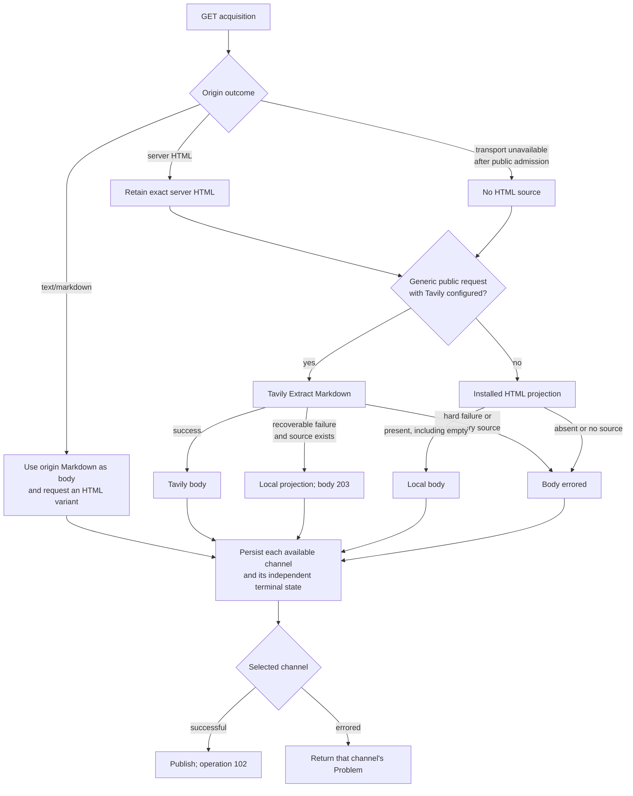

# plurnk-schemes-http — Specification

This package owns the `http(s)://` request/response scheme, the `ws(s)://`
full-duplex scheme, plus automatic entry-acquisition, Tavily Extract, and local
HTML projection foundations. Both handlers implement the DB-free `SchemeCtx` author contract.

## §http-manifest §1 HTTP manifest

| Field           | Value                         |
| --------------- | ----------------------------- |
| Registered name | `http` (`https` routes to it) |
| Category        | `data`                        |
| Writers         | `model`, `client`             |
| Volatile        | `true`                        |
| Model-visible   | `true`                        |
| Requires web    | `true`                        |
| Default channel | `body`                        |

| Channel  | Seed type                   | Meaning                                                                        |
| -------- | --------------------------- | ------------------------------------------------------------------------------ |
| `body`   | `application/octet-stream`  | Source text, derived Unicode, binary marker, SSE data, or HTML-page Markdown   |
| `header` | `text/plain`                | Origin, acquisition, materializer, projection, provider, and usage evidence   |
| `html`   | `text/html`                 | Original server-source HTML when an HTML representation can be acquired       |

`package.json#plurnk.schemes` registers `http` through the default export and
`wss` through `Ws`.

Routing is not identity. `NetworkAddress` {§network-address} retains the exact
addressed protocol and stores
`/<host>[:<non-default-port>]<path>[?<serialized-query>]`. Query ordering,
duplicate names, and an explicit empty `?` remain significant. The fragment is
a Plurnk channel selector and never enters network identity or transport.
Request metadata affects transport but not identity. URL userinfo is rejected;
neither credentials nor metadata are reconstructed from `raw`. Within storage
pathnames, `%28` and `%29` canonicalize to literal parentheses.

## §op-surface §2 HTTP operation surface

| Operation                         | Remote action                         | Contract                                                                                   |
| --------------------------------- | ------------------------------------- | ------------------------------------------------------------------------------------------ |
| Unscoped `READ(url)`              | GET unless a fresh GET copy is usable | Seed, subscribe, materialize every channel, publish the selected channel, and return `102` |
| Scoped `READ(url)<scope>`         | None                                  | Delegate selected-channel presence and scope projection to universal READ; never acquire   |
| Exact `FIND(url)`                 | GET only when acquisition is required | Prepare an exact entry, then use universal query, matcher, weighting, and pagination       |
| `FIND(pattern-url)`               | None                                  | Query already-materialized web entries; a path pattern does not discover the remote web    |
| `SEND[200](url):body:`            | POST                                  | Stream and persist the response under the addressed URL                                    |
| `EDIT(url):body:`                 | PUT                                   | Replace the whole remote resource; a line marker is invalid                                |
| `KILL(url)`                       | DELETE                                | Delete the remote resource and stream its response                                         |
| `SEND[410](url)`                  | None                                  | Delete the local stored entry                                                              |
| `SEND[499](url)`                  | Cancellation is engine-routed         | The routed subscription handle aborts acquisition; scheme dispatch itself is a `200` no-op |

Every direct network method uses the same streaming path. Request
headers are ordered target metadata: one trailing `{Key: value}` block per
header. The loop `SEND[code]` is never the remote HTTP status; remote status and
headers are persisted in `header`.
Exact-versus-pattern FIND preparation uses the shared
`PathSyntax.hasGlob` classifier {§path-glob}; HTTP owns no reduced
path-pattern grammar.

## §http-lifecycle §3 Acquisition, materialization, and query lifecycle

The same page producer serves direct GET, exact FIND preparation, and executor
entry acquisition. Their outer policies differ: direct GET accepts explicit
targets and HTTP error responses; automatic acquisition first admits a public
credential-free target and treats non-2xx responses as unavailable. A scoped
READ never enters the producer. It delegates the already-stored selected
channel and scope to universal READ.

| Consumer / response                          | `body`                                                        | Auxiliary materialization                                 | Completion                                             |
| -------------------------------------------- | ------------------------------------------------------------- | --------------------------------------------------------- | ------------------------------------------------------ |
| GET + negotiated origin Markdown             | Exact origin Markdown                                         | Independently acquired server source in `html` when found | Selected-channel settlement                            |
| GET + HTML-page production                   | Tavily Markdown, local Markdown, or an independent error      | Exact server source in `html` when origin supplied it     | Selected-channel settlement                            |
| Direct GET + `text/event-stream`             | One `data` value plus newline per `text/plain` chunk          | Initial response in `header`                              | `102` after header; origin close settles               |
| Direct request + no response body            | Empty seed                                                    | Response and package metadata in `header`                 | Subscription closes; op is `102`                       |
| Direct request + configured textual type     | Incremental UTF-8 text under the declared type                | Response and package metadata in `header`                 | Response-body end closes the stream                    |
| Direct request + readable binary type        | Derived Unicode under the projection output type             | Origin type and projection identity in `header`           | `102`; bytes are never durable                         |
| Direct request + unreadable binary/unknown   | Empty marker; declared type or `application/octet-stream`     | Response and package metadata in `header`                 | `415 binary-response-unsupported`                      |
| Direct binary input exceeds configured bound | Empty marker under the source type                            | Limit evidence in the terminal Problem                    | `413 projection-input-limit`                           |
| Exact WebFetcher + configured text           | Complete UTF-8 response                                       | Response evidence in `header`                             | Materialize, then universal query                      |
| Exact WebFetcher + readable binary           | Derived Unicode under the projection output type             | Origin type and projection identity in `header`           | Materialize; absent projection is `422`                |

A fragmentless direct operation publishes only `body`. An explicit fragment
publishes that named channel. Every acquired channel remains durable even when
it is not published to the requesting loop. FIND returns standard JSON metadata
and match coordinates. Exact READ returns the selected channel's requested text
projection.

### §http-text-decoding Text response decoding

| Surface                       | Contract                                                                                         |
| ----------------------------- | ------------------------------------------------------------------------------------------------ |
| Response media type           | WHATWG `MIMEType` essence; absent or unparseable metadata becomes `application/octet-stream`     |
| Direct textual response       | Incremental replacement-mode UTF-8 through `TextDecoder`, preserving response backpressure       |
| WebFetcher textual response   | Fetch `Response.text()` UTF-8 decoding; buffering does not select a different character encoding |
| `charset` parameter           | Preserve in `header` as origin evidence; it does not replace Fetch text decoding                 |
| JSON and XML textual families | Use the same HTTP byte-to-string rule; format projections consume the resulting Unicode string   |
| Direct HTML GET               | Fetch UTF-8 decoding of origin server HTML                                                       |
| Server-sent events            | UTF-8 only under the HTML event-stream standard                                                  |
| Malformed UTF-8               | Preserve the Encoding Standard's replacement-character behavior                                  |

This decoder boundary remains text normalization, not a media-format processor.
A configured binary type bypasses it and enters the mimetype family's bounded
readable-byte projection {§mimetype-binary-input}; raw bytes never become a
durable channel.

### §html-materialization Readable materialization

`WebFetcher.materialize` is the shared readable-representation seam for exact
query preparation and executor entry acquisition. Direct GET uses the same
HTML and binary projection results while retaining incremental text streaming.

| Input or event                              | Action                                      | Result                                                             |
| ------------------------------------------- | ------------------------------------------- | ------------------------------------------------------------------ |
| Configured non-HTML text                    | Decode with Fetch UTF-8                     | Original representation in `body`                                  |
| Configured binary with reader               | Apply the bounded byte projection           | Derived Unicode plus source type and identity                       |
| Configured binary without reader            | Cancel without retaining bytes              | `null`; the consumer applies its absence policy                    |
| Binary input exceeds the common bound       | Cancel and preserve the typed cause         | `WebMaterializationError` caused by `ProjectionInputLimitError`     |
| Negotiated origin `text/markdown`           | Accept it without Tavily                    | Exact Markdown in `body`; independently requested source in `html`  |
| Eligible HTML with Tavily configured        | Use Tavily as the body producer             | Tavily Markdown in `body`; origin server source in `html`           |
| Ineligible HTML or Tavily not configured    | Use the installed HTML projection           | Local Markdown in `body`; origin server source in `html`            |
| Recoverable Tavily failure with source HTML | Use the installed projection as recovery    | Local Markdown in `body` with terminal `203`; source in `html`       |
| Hard Tavily failure                         | Preserve evidence; do not run local recovery | `body` errored; independently successful `html`/`header` survive    |
| Tavily success after origin transport loss  | Preserve provider body and origin failure   | `body` closed; `html` errored                                       |
| Projection implementation throws            | Stop and preserve the cause                 | `WebMaterializationError` with stage `projection`                   |

A projection object is present even when its content is `""`; only `null`
denotes absence. A materialization exception retains its original `cause`; it
never enters the absence channel.

#### §tavily-extract Tavily Extract boundary

Tavily is eligible only for a credential-free generic request whose target has
been admitted as public. Authored request metadata—including an authored
`Accept` field—makes the request ineligible. The package-generated Markdown
negotiation, browser-compatible `User-Agent`, and conditional cache fields are
transport mechanics, not authored metadata. No target headers or origin
credentials cross the provider boundary.

When no `Accept` is authored, origin acquisition offers
`text/markdown, text/html;q=0.9, */*;q=0.1`. An origin `text/markdown`
representation wins and Tavily is skipped; a second origin request with
`Accept: text/html` may populate `html`. An authored `Accept` value is sent
unchanged and makes any returned HTML use the local projection route.

One provider request is `POST https://api.tavily.com/extract` with bearer
authentication and exactly one URL, configured `basic` or `advanced` depth,
`format: "markdown"`, and `include_usage: true`. A package-owned abort timeout
bounds the call. Success requires Markdown plus `request_id` and
`usage.credits`; those facts remain durable in `header`.

| Provider outcome                         | Classification | Body behavior when server HTML exists                  |
| ---------------------------------------- | -------------- | ------------------------------------------------------ |
| Success with required evidence           | Success        | Use Tavily Markdown                                    |
| Caller cancellation                      | Cancelled      | Return exact `499`; no recovery                        |
| Client timeout or transport failure      | Recoverable    | Local projection, terminal `203`                       |
| `429`, `5xx`, or `failed_results`        | Recoverable    | Local projection, terminal `203`                       |
| `401` or `403`                           | Hard           | `tavily-authentication-failed`; no local projection    |
| Other `4xx`                              | Hard           | `tavily-provider-rejected`; no local projection        |
| Malformed success or missing evidence    | Hard           | `tavily-invalid-response`; no local projection         |

Without server HTML, no local recovery input exists. A Tavily success can still
close `body`, but every Tavily failure remains the body failure and `html`
closes errored.

#### §http-channel-outcomes Channel outcomes

For HTML-page production, `body`, `header`, and `html` settle independently.
Available evidence is written before settlement. The selected channel alone
determines the operation result: successful `#html` or `#header` can be read
when `body` failed, and a successful default `body` is not invalidated by an
unavailable `html`. Unselected failures remain durable channel state. A
recoverable local body is closed, not errored, with result `203`; direct READ
still returns its ordinary streaming acknowledgement `102`.

Synchronous exact-FIND and executor materialization preserves the same outcome
when it persists a successful body: available channels remain static, while an
explicitly unavailable `html` representation is an empty `errored` channel.
Later cache use therefore cannot reinterpret missing source evidence as a
successful empty representation.

## §http-status §4 HTTP status mapping

| Outcome                                                       | Operation status                                      |
| ------------------------------------------------------------- | ----------------------------------------------------- |
| Scoped READ                                                   | Exact universal selected-channel READ result          |
| Exact FIND after preparation                                  | Exact universal query result                          |
| Exact acquisition returns no WebFetcher value                 | `404` (`not-materialized`)                            |
| Selected HTML-page channel succeeds                           | Direct READ `102`; terminal selected-channel result   |
| Selected HTML-page channel fails                              | That channel's exact producer Problem                 |
| Local HTML projection is absent                               | `422` (`no-readable-projection`)                      |
| Recoverable Tavily failure uses local projection              | Direct READ `102`; terminal body result `203`         |
| Direct textual, projected-binary, or empty response           | `102`                                                 |
| Direct binary response has no readable projection             | `415` (`binary-response-unsupported`)                 |
| Binary projection input exceeds the configured byte bound     | `413` (`projection-input-limit`)                      |
| `SEND[410]`                                                   | Exact entry-delete result                             |
| Routed `SEND[499]` dispatch                                   | `200`                                                 |
| Client-cancelled acquisition                                  | Direct `499` (`cancelled`)                            |
| SSE cancellation after acquisition                            | `102` initial; terminal `499`                         |
| SSE parser/transfer failure after acquisition                 | `102` initial; terminal `502`                         |
| Multi-statement HTTP edit batch                               | `409` (`non-atomic-edit-batch`)                       |
| Invalid target, channel, line edit, or URL userinfo           | `400` with the corresponding stable Problem kind      |
| Non-corresponding 304                                         | `502` (`fetch-failed`)                                |
| Direct acquisition failure without a successful provider body | `502` (`fetch-failed`)                                |
| Direct or prepared projection exception                       | `500` (`projection-failed`)                           |
| Uninterpreted SEND status                                     | `501` (`send-status-unsupported`)                     |

An HTTP error status is still a successfully acquired direct response: its
status remains in `header`; HTML enters page production and other content uses
the ordinary response path. Automatic WebFetcher acquisition instead treats a
non-2xx response as unavailable. Handler failures use RFC 9457 Problem Details.
Caught direct-acquisition diagnostics are bounded by
`PLURNK_SCHEMES_HTTP_ERROR_DETAIL_LIMIT` in model-facing detail while complete
errors remain in daemon diagnostics.

A direct binary response first asks the installed mimetype family for a bounded
readable projection. A present result stores only its derived Unicode and
appends authoritative `x-plurnk-projection-id` evidence after the origin and
acquisition fields. Absence preserves an empty marker under the source type and
returns non-retryable `415`; exceeding the input ceiling preserves the same
marker and returns non-retryable `413` with configured and observed sizes.
These statuses describe Plurnk's materialization boundary, not the remote HTTP
outcome—a POST, PUT, or DELETE might already have changed the remote resource.
Missing or malformed `Content-Type` becomes `application/octet-stream`; the
handler does not sniff or guess unknown bytes.

## §5 Dependencies and configuration

| Surface           | Runtime contract                                                                                          |
| ----------------- | --------------------------------------------------------------------------------------------------------- |
| Platform          | Node ≥26 native fetch, streams, abort signals, decoding, DNS, and `WebSocket`                             |
| SSE               | `eventsource-parser` for bounded WHATWG event-stream framing                                              |
| Tavily Extract    | Optional Tavily Extract API primitive when `TAVILY_API_KEY` is present                                    |

### §http-config Operator configuration

| Concern               | Contract                                                                                                 |
| --------------------- | -------------------------------------------------------------------------------------------------------- |
| Canonical registry    | Shipped `.env.defaults`; the daemon assembles it as a set-if-unset floor {§operator-config-env-defaults} |
| Required values       | Missing or invalid required values fail at readiness/owning read; code carries no hidden fallback        |
| Tavily API Key        | Optional `# TAVILY_API_KEY=`; enables Tavily Extract for eligible public HTML                            |
| Tavily Extract Depth  | `PLURNK_SCHEMES_HTTP_TAVILY_DEPTH=basic`; only `basic` or `advanced`                                     |
| Tavily client timeout | Positive `PLURNK_SCHEMES_HTTP_TAVILY_TIMEOUT_MS=30000`                                                   |

### §automatic-fetch-check Automatic acquisition URL check

`WebFetcher` is the sole caller of `Guard.fetch`. Before automatic byte
acquisition, it accepts credential-free HTTP(S) targets only when every
resolved address is ordinary globally reachable unicast, and repeats the check
before every manually followed redirect. A refused or unresolvable target is
the ordinary unavailable `null` result. A transport failure after public
admission may still enter Tavily page production.

Direct HTTP operations and WebSocket connections do not use this check. Loopback,
private, and link-local destinations are therefore valid explicit targets.

Redirect transitions follow WHATWG Fetch: 301/302 rewrite POST to GET; 303
rewrites methods other than GET/HEAD to GET; 307/308 preserve method and body.
A body rewrite removes body headers, cross-origin redirects remove
`Authorization`, and followed redirect bodies are cancelled. The configured
hop limit returns the last redirect rather than following beyond the limit.
Validation-time DNS answers are not pinned to connection-time resolution. This
check therefore makes no DNS-rebinding or total-egress claim.

## §materialization-lifecycle §6 Materialization lifecycle

| Concern        | Contract                                                                                                   |
| -------------- | ---------------------------------------------------------------------------------------------------------- |
| Direct gate    | Explicit targets use native origin transport; only a generic public request grants Tavily authority          |
| Automatic gate | Target and redirects require public admission; accepted generic HTML follows the same page producer       |
| Body owner     | Origin Markdown wins; otherwise configured eligible Tavily is structural, with one local projection floor  |
| Source owner   | `html` is exact server-source HTML; it is never provider-generated or DOM-generated                         |
| Projection     | A present projection, including `""`, becomes `body`; `null` alone means absence                           |
| Cancellation   | One caller signal spans origin, auxiliary origin, projection, and Tavily work                              |

### §host-rewrite Acquisition target rewrite

Only acquisition GETs are eligible for host rewriting. A GitHub
`…/blob/…` address uses the corresponding `raw.githubusercontent.com` source for
byte transport. Direct READ, exact FIND, and
WebFetcher prefetch share that rule. The originally addressed GitHub URL remains
entry identity. POST, PUT, and DELETE are never retargeted. Rewritten targets
are checked under {§automatic-fetch-check} only when `WebFetcher` acquires them.

### §revalidation GET representation freshness

Acquired responses append package-owned `x-plurnk-request-method`,
`x-plurnk-fetched-at`, and `x-plurnk-cache-variant` fields after origin headers.
Page bodies append `x-plurnk-materializer-id`; local projections append
`x-plurnk-projection-id`; Tavily appends status, route, request, usage, timing,
and bounded failure evidence. Only package metadata after the acquisition stamp
is authoritative.
Plurnk stores one representation per canonical URL rather than a variant set:

| Acquisition context                          | Package variant | Later cache use |
| -------------------------------------------- | --------------- | --------------- |
| No explicit target metadata; no `Vary`       | `default`       | Eligible        |
| Any explicit target metadata                 | `bypass`        | Ineligible      |
| No explicit target metadata; any `Vary`      | `bypass`        | Ineligible      |
| Stored response lacks authoritative evidence | Marker absent   | Ineligible      |

This conservative selection avoids persisting request values or fabricating a
multi-variant store. Exact FIND passes target metadata through acquisition but
does not reuse that response later. A `304` that introduces `Vary` changes the
restored representation's package marker to `bypass`.

Only an eligible GET representation can supply a direct READ's body, TTL stamp,
conditional validators, or exact-FIND preparation. Completion comes from
channel lifecycle, not body length: `body` and `header` must be successful
(`static` or `closed`), and every channel must be terminal. An auxiliary channel
may be `errored`; `active` or unknown state is ineligible. Durable operation
evidence and HTTP reuse eligibility remain distinct: an acquired response stays
in the entry even when its origin policy prevents later cache use.

| Stored origin policy                  | Direct READ after acquisition                          | Exact FIND after acquisition             |
| ------------------------------------- | ------------------------------------------------------ | ---------------------------------------- |
| `no-store`                            | Full acquisition without stored validators             | Full acquisition                         |
| `no-cache` (qualified or unqualified) | Validate when a stored validator exists; else acquire  | Full acquisition                         |
| Valid `max-age`                       | Serve only inside origin lifetime and operator ceiling | Reuse only while fresh under both limits |
| Valid `Expires`, without `max-age`    | Same, using the origin expiration lifetime             | Same                                     |
| Invalid or ambiguous explicit expiry  | Treat as stale; validate or acquire                    | Full acquisition                         |
| No explicit origin lifetime           | Use the operator TTL as Plurnk's heuristic             | Reuse inside the operator TTL            |

The operator ceiling is `PLURNK_SCHEMES_HTTP_TTL_MS`; `0` disables every
validation-free reuse. Origin age is the greater of the response's `Age` value
and apparent age from `Date`, plus residence since the authoritative package
stamp. A representation is fresh only while both origin lifetime and operator
ceiling permit it. Unknown cache extensions are inert. Stale content is never
served, so `must-revalidate` requires no separate path.

Outside the fresh window, a representation without a materializer identity may
send a stored ETag or Last-Modified only when that field is singular and
syntactically valid. A 304 can restore those stored channels only when its
validator corresponds to the nominated stored representation:

| 304 validator                                         | Correspondence requirement                  |
| ----------------------------------------------------- | ------------------------------------------- |
| Strong ETag                                           | Same stored strong ETag                     |
| Weak ETag                                             | Same opaque tag under weak comparison       |
| No ETag; Last-Modified                                | Same valid stored Last-Modified instant     |
| Missing, malformed, unsolicited, or non-corresponding | Invalid acquisition; `502` (`fetch-failed`) |

A corresponding 304 restores the stored channels without rematerializing and
updates the header under the following ownership rule; any other response
replaces the channels:

| 304 metadata class                                                    | Stored-header action                                    |
| --------------------------------------------------------------------- | ------------------------------------------------------- |
| Present end-to-end origin fields, including cache and validators      | Replace prior fields of the same case-insensitive name  |
| Origin fields absent from the 304                                     | Preserve                                                |
| `Content-Type`, `Content-Encoding`, `Content-Range`, `Content-Length` | Preserve metadata describing the already-processed body |
| Package method, acquisition stamp, and variant                        | Rebuild authoritatively; refresh stamp and variant      |
| Projection evidence                                                   | Preserve                                                |

A 304-provided `Vary`, `no-store`, `no-cache`, expiry, or validator
therefore governs the next operation without relabeling derived Unicode as a
different source representation.

A stored derived representation requires the current projection identity. A
stored page body also requires its current route: negotiated origin Markdown,
local projection while Tavily is unconfigured, metadata-ineligible local
projection, configured Tavily depth/version, or the corresponding recoverable
local-fallback route. Enabling Tavily or changing depth invalidates the affected
route.

Once a page representation leaves its fresh window, Plurnk performs complete
reacquisition without old origin validators. Origin `304` can certify origin
bytes, but it cannot certify a composite that may also contain a fresh Tavily
extraction, a newly negotiated Markdown representation, or an independently
acquired HTML variant. Projection or materializer mismatch likewise invalidates
body, TTL, and validators together.

POST, PUT, and DELETE responses retain their method marker but cannot satisfy a
later GET or exact-FIND acquisition. An unmarked authored entry and an eligible
stored GET remain visible to universal FIND as durable evidence; exact HTTP
preparation applies the policy above. `SEND[410]` deletes the stored entry.

### §sse Server-sent events

A direct GET whose response is `text/event-stream` feeds the bounded parser.
Each event's joined `data` value plus a newline becomes one `text/plain` body
chunk. Comments and `event`, `id`, and `retry` metadata are not projected.
The response plus persisted header is the acquisition boundary: READ returns
`102`, and parsing continues through the retained `StreamSubscription` without
retaining `SchemeCtx`. Buffer exhaustion and post-acquisition transport failure
settle that subscription at `502`; cancellation settles it at `499`. The
handler does not reconnect; events accumulate until the origin closes or the
operation is cancelled.

## §prefetch §7 WebFetcher

| Result                               | Meaning                                                                                  |
| ------------------------------------ | ---------------------------------------------------------------------------------------- |
| Origin HTML                          | Exact source text, MIME type, package-stamped evidence, and page-producer eligibility    |
| Negotiated origin Markdown           | Exact body plus independent HTML-variant outcome                                         |
| Other accepted body                  | One unconsumed byte stream, MIME type, package-stamped headers, and cancellation owner   |
| Admitted origin transport failure    | Bounded origin failure plus eligibility for provider-only page production                |
| Materialized configured text         | Complete Fetch-decoded UTF-8 body                                                        |
| Materialized readable binary         | Bounded derived Unicode plus source type, projection identity, and enriched header       |
| Materialized HTML page               | Independent body/html outcomes and complete route/provider evidence                      |
| Automatic top-level `null`           | Refused target, non-2xx response, or unavailable response with no provider route          |
| Non-page materialization `null`      | Empty configured text or no final readable binary projection                             |
| Caller-cancelled acquisition         | Rejects with the caller signal's exact reason                                            |

Top-level `null` is an automatic-acquisition liveness value rather than a thrown
failure. Caller cancellation is not liveness: a pre-aborted caller fails before
acquisition and a caller abort wins with its exact reason. Package-owned origin
and Tavily timeouts are ordinary classified acquisition outcomes. WebFetcher
owns no entry identity, registry selection, selected-channel policy, or query
policy; its consumers supply those boundaries and the projection capability.

## §ws §8 WebSocket

`wss` is a first-class data scheme; `ws` routes to the same handler. WebSocket
is bidirectional and stateful, not an HTTP content type. It uses `messages` as a
`text/plain` default channel and the same canonical network address contract
{§network-address}.

### §ws-lifecycle Socket ownership and settlement

| Operation or event                | Contract                                                                                                         |
| --------------------------------- | ---------------------------------------------------------------------------------------------------------------- |
| `READ(ws(s)://…)`                 | Claim, seed/subscribe, construct `CONNECTING`, then return `102` after native `open` plus durable activation     |
| Concurrent duplicate READ         | `409` in `claimed`, `connecting`, `open`, or `settling`; cleanup releases the only claim                         |
| `SEND[200](ws(s)://…)`            | Send only for owner `open` plus native `readyState=OPEN`; absent or non-open owner is `409`; send throw is `502` |
| `SEND[499](ws(s)://…)`            | Engine-routed cancellation closes the owning READ; scheme dispatch returns `200`                                 |
| `KILL(ws(s)://…)`                 | Close/cancel the claimed owner; no owner is `404`; an attempted close throw is `502`                             |
| Inbound frame after native `open` | Join the owner's persistence chain; the next write begins only after the preceding write succeeds               |
| Binary frame after native `open`  | Retain the text prefix, prune the binary and later frames, settle `415 binary-frame-unsupported`, close `1003`   |
| First inbound persistence failure | Retain the successful prefix, prune queued and later frames, and settle with `500 message-persistence-failed`    |
| Socket closes before `open`       | Close subscription with `502 connection-failed`; the pending READ returns that exact failure                     |
| Socket closes after `open`        | Drain the accepted frame prefix; initial READ remains `102`; settle with `200` unless a drained write fails       |
| Failure after `open`              | Initial READ remains `102`; persist the exact terminal failure and wake through subscription settlement          |

The in-instance registry is keyed by workspace, addressed protocol, and
canonical network pathname. The claim remains registered through terminal
cleanup, so a new READ cannot overlap an owner's subscription settlement. Every
terminal path drains retained owner work, closes the transport when necessary,
closes the durable subscription, then releases the claim. A persistence failure
found while draining supersedes a graceful terminal result; cancellation and
transport failures retain their exact result. Handler shutdown requests
settlement for every remainder, awaits every owner, and aggregates
transport-close failures under {§handler-lifecycle}.

| Transport limit    | Current contract                                                                                        |
| ------------------ | ------------------------------------------------------------------------------------------------------- |
| Payload projection | String event data only into `text/plain`; binary data terminates with Plurnk `415` and WebSocket `1003` |
| Reconnection       | None; READ again after terminal cleanup                                                                 |
| Handshake metadata | Default global-WebSocket identity; custom target headers are not applied                                |
| Runtime            | Node ≥26                                                                                                |
